Investigaciones en gestión del riesgo de desastres para Colombia

Avances, perspectivas y casos de estudio

Comisión Nacional Asesora para la Investigación en Gestión del Riesgo de Desastres

*Editores*

Unidad Nacional para la gestión del Riesgo de Desastres

Investigaciones en gestión del riesgo de desastres para Colombia

Avances, perspectivas y casos de estudio

> Comisión Nacional Asesora para la Investigación en Gestión del Riesgo de Desastres
>
> *Editores*
>
> Unidad Nacional para la gestión del Riesgo de Desastres

Comisión Nacional Asesora para la Investigación en Gestión del Riesgo de Desastres

*Editores*

Lina Dorado, Unidad Nacional para la Gestión del Riesgo de Desastres --UNGRD

Argiro Ramírez, Departamento Administrativo de Ciencia, Tecnología e Innovación --COLCIENCIAS

Omar Joaquín Agudelo, Centro de Estudios para la Prevención de Desastres --CEPREVE

Marta Calvache/Carolina Hernández/ Patricia Pedraza, Servicio Geológico Colombiano --SGC

Fabio Andrés Bernal/ Luis Alfonso López, Instituto de Hidrología, Meteorología y Estudios Ambientales --IDEAM

Leonor Aydé Rodríguez/ Alexander Ariza/ Carlos Andrés Franco, Instituto Geográfico Agustín Codazzi --IGAC

Wilson Ramírez/ Dorotea Cardona H, Instituto de Investigación de Recursos Biológicos Alexander von Humboldt --IAvH

Capitán de Corbeta Cesar Grisales, Dirección General Marítima --DIMAR

Alexander Figueroa, Ministerio de Ambiente y Desarrollo Sostenible --MINAMBIENTE

Carolina Queruz / Cesar Cortez, Ministerio de Educación Nacional --MEN

Juan Pablo Londoño, Universidad de la Salle, representante universidades privadas

Lina Ospina Ostios, Universidad del Valle, representante universidades públicas

Carlos García/ Álvaro Rodríguez, red de universitarios de América Latina y el Caribe para la gestión y la reducción de

riesgos de emergencias y desastres --REDULAC/CAPCOLOMBIA

Cristian Jaimes, Instituto Distrital de Gestión de Riegos y Cambio Climático --IDIGER

Equipo técnico Unidad Nacional para la Gestión del Riesgos de Desastres

Luisa Cadena, Subdirección para el Conocimiento del Riesgo

Doralba Restrepo M., Subdirección para el Conocimiento del Riesgo

Mauricio Romero Torres, Subdirección para el Conocimiento del Riesgo

ISBN: 000000000000000

Coordinación Editorial

Mauricio Romero Torres

Corrección de estilo

Kelly Barbosa

Diseño y Diagramación

Oficina de Comunicaciones UNGRD

Proceso de arbitraje

Revisión por pares doble ciega para cada capítulo

Todos los derechos reservados. Esta publicación no puede ser reproducida ni total ni parcialmente

o transmitida por un sistema de recuperación de información, en ninguna forma ni por ningún medio,

sin el permiso previo de la UNGRD.

Citese como: Comisión Nacional Asesora para la Investigación en Gestión del Riesgo de Desastres (CNAIGRD) (Eds). 2020. *Investigaciones en gestión del riesgo de desastres para Colombia. Avances, perspectivas y casos de estudio*. Unidad Nacional para la Gestión del Riesgo de Desastres.

Presentación del libro

Lorem ipsum dolor sit amet, consectetur adipiscing elit. Etiam sit amet tempor ex. Curabitur at dui aliquam, luctus velit et, mollis lacus. Etiam eget nibh semper, tincidunt velit sit amet, vehicula nibh. Quisque efficitur tortor at tincidunt dapibus. Proin risus nisl, blandit et iaculis ac, congue id felis. Nullam eu eleifend mi. Nullam neque quam, iaculis eu condimentum at, placerat ut turpis. Lorem ipsum dolor sit amet, consectetur adipiscing elit. Aenean mollis enim eu eros commodo, id suscipit ex molestie. Phasellus quam massa, aliquet eu ultricies vel, lacinia vitae odio. Donec id lorem ut leo imperdiet aliquam vitae sed ipsum. Proin posuere lectus ex, non ornare ante consectetur sit amet. Pellentesque molestie metus in purus tempus, et efficitur urna placerat. Vivamus et mattis ligula. Morbi tincidunt sem sed nunc imperdiet vulputate. Nunc leo justo, vehicula a ex ac, molestie efficitur sem.

Curabitur condimentum tincidunt ultricies. Class aptent taciti sociosqu ad litora torquent per conubia nostra, per inceptos himenaeos. Quisque in quam a erat blandit bibendum. Vestibulum ante ipsum primis in faucibus orci luctus et ultrices posuere cubilia curae; Aenean non euismod dui. Lorem ipsum dolor sit amet, consectetur adipiscing elit. Proin tempor fermentum elit id tristique. Nam maximus sed magna nec porttitor. Praesent ullamcorper justo at est placerat, eu tincidunt eros iaculis.

Quisque ullamcorper, orci eget consectetur mattis, erat dui tincidunt massa, id feugiat orci sapien ac ipsum. Phasellus lacus justo, hendrerit ut pellentesque id, venenatis mollis magna. Proin auctor leo sit amet nibh rhoncus, in finibus purus feugiat. In hac habitasse platea dictumst. Integer efficitur leo ut urna placerat volutpat. Suspendisse potenti. Nullam nec urna nunc.

Phasellus id varius odio. Donec et sem dolor. Mauris vitae aliquam tellus. Class aptent taciti sociosqu ad litora torquent per conubia nostra, per inceptos himenaeos. Etiam mollis placerat lectus, vel placerat nibh consectetur id. Nulla sed tellus fringilla quam porta interdum. Cras nec sagittis quam, vel porttitor erat. Nam neque sapien, lobortis at lorem sit amet, efficitur bibendum justo. Donec vel dignissim massa, et blandit massa. Quisque sodales dapibus nibh. Class aptent taciti sociosqu ad litora torquent per conubia nostra, per inceptos himenaeos. Curabitur neque sapien, commodo quis sollicitudin et, scelerisque in sapien. Nam venenatis accumsan iaculis. In sed leo non sapien rhoncus mollis et a nunc. Sed accumsan pharetra tincidunt.

Mauris pretium turpis sed velit dignissim, vitae dictum sapien tristique. Donec leo metus, lacinia sit amet metus et, pretium aliquam tortor. Ut sem leo, porttitor vitae odio eget, faucibus euismod lectus. Mauris laoreet nibh eget sagittis consequat. Donec sollicitudin luctus malesuada. Integer sed urna ut metus commodo viverra quis eget purus. Mauris sodales sollicitudin lectus vitae lacinia. Nunc sit amet sapien nec tortor ornare auctor a at ex.

Donec vel tincidunt elit, vitae posuere ligula. Morbi sed varius purus, eget porta magna. Nulla non mauris vitae velit vehicula elementum in sit amet neque. Phasellus fringilla tortor sit amet diam consequat consequat. Pellentesque accumsan turpis eu dui tincidunt, vitae vulputate lorem pellentesque. Nullam cursus metus pulvinar nunc feugiat, et commodo lorem commodo. Class aptent taciti sociosqu ad litora torquent per conubia nostra, per inceptos himenaeos. Etiam a efficitur ipsum. Quisque urna neque, laoreet eget magna non, tincidunt aliquam velit. Vestibulum vulputate quam in erat dictum dignissim. Curabitur lacus massa, scelerisque ac sodales non, congue vitae erat.

Aenean venenatis maximus orci at blandit. Phasellus ligula magna, condimentum ut diam dapibus, mattis cursus libero. Quisque tempor dolor ut magna viverra egestas eget aliquam tellus. Nullam vel diam ultricies, ornare diam auctor, placerat mauris. Sed porttitor nulla non ipsum condimentum, non tristique augue interdum. Etiam lobortis laoreet laoreet. Duis cursus dui in libero vulputate, ut blandit lacus ornare. Class aptent taciti sociosqu ad litora torquent per conubia nostra, per inceptos himenaeos.

Lorem ipsum dolor sit amet, consectetur adipiscing elit. Etiam sit amet tempor ex. Curabitur at dui aliquam, luctus velit et, mollis lacus. Etiam eget nibh semper, tincidunt velit sit amet, vehicula nibh. Quisque efficitur tortor at tincidunt dapibus. Proin risus nisl, blandit et iaculis ac, congue id felis. Nullam eu eleifend mi. Nullam neque quam, iaculis eu condimentum at, placerat ut turpis. Lorem ipsum dolor sit amet, consectetur adipiscing elit. Aenean mollis enim eu eros commodo, id suscipit ex molestie. Phasellus quam massa, aliquet eu ultricies vel, lacinia vitae odio. Donec id lorem ut leo imperdiet aliquam vitae sed ipsum. Proin posuere lectus ex, non ornare ante consectetur sit amet. Pellentesque molestie metus in purus tempus, et efficitur urna placerat. Vivamus et mattis ligula. Morbi tincidunt sem sed nunc imperdiet vulputate. Nunc leo justo, vehicula a ex ac, molestie efficitur sem.

Prólogo

Los desastres no son naturales. Los desastres son consecuencias de las construcciones sociales que derivan de vulnerabilidades al encontrarse con las amenazas, cualquiera sea su origen. No hay nada natural en los impactos producidos por desastres y los eventos naturales y antrópicos generadores de situaciones de desastre se han hecho más evidentes en todas las regiones del mundo y sus efectos socioeconómicos y las pérdidas humanas siguen aumentando, provocando impactos negativos en las dinámicas del desarrollo y en sus habitantes crecientes interrogantes en torno a las políticas de participación, información, protección y seguridad ciudadanas.

La región de las Américas y en especial, América Latina en la cuenca del Pacífico, son áreas frecuentemente impactadas por estos diferentes eventos los cuales generan situaciones de desastre, ocasionando pérdida de vidas, gran número de lesionados, pérdida de viviendas e infraestructura, deterioro ambiental, problemas de salud pública y una importante afectación en los avances del desarrollo social y económico de los países afectados.

Por su ubicación geográfica y sus condiciones geológicas, orográficas, topográficas y climáticas, Colombia presenta un alto grado de exposición a amenazas de origen natural y socio natural como sismos, actividad volcánica, geológico-marinos, meteorológicos, hidrológicos, climáticos, biológicos, astrofísicos, que conforman una amplia historia de eventos catastróficos que han conmocionado a distintas regiones del país. Igualmente, las amenazas antrópicas, generadas por la intervención humana, también se convierten en causantes o amplificadores de tan importantes impactos.

El desastre de Armero, ciudad del Departamento del Tolima, situado en el sur-centro occidental del país, sucedido el 13 de noviembre de 1985 por la erupción del volcán Nevado del Ruíz y su consecuente lahar, es el desastre por evento natural de mayor impacto en la historia conocida del país: 23.000 muertos, una ciudad destruida, otras varias muy afectadas, pérdidas económicas, infraestructurales, ambientales y culturales de amplísima cuantía y un gran impacto nacional e internacional por las dimensiones de sus efectos. Este evento se convirtió en el detonante de una respuesta social, gubernamental, institucional, normativa, que llevó a un abordaje progresivo de toda la temática pasando del manejo de la emergencia y las acciones de respuesta hacia la prevención y reducción de los desastres.

Se inicia, entonces, un trayecto político y normativo que con la expedición de la Ley 46 de 1988 creó el Sistema Nacional para la Prevención y Atención de Desastres y, con el respeto y aplicación de esta normativa, pero también, con el aporte de instituciones gubernamentales, ONGs, universidades, organizaciones comunitarias y de respuesta, se empieza a asumir un análisis en torno a los distintos factores que podrían estar estructurando el desastre y a asumirlo como una materialización anticipable, prevenible, modificable.

Así, las distintas instituciones, comunidades, sectores y gobiernos, empezamos a adentrarnos progresivamente en el aporte al conocimiento en torno a la amenaza y la vulnerabilidad como componentes del desastre, a entender que la exposición a las distintas amenazas se volvía determinante, que los desastres tienen una relación directa con los problemas no resueltos por el desarrollo y, por tanto, a considerar el Riesgo no como un evento sino como un proceso.

Precisamente, como procesos emergentes, en los últimos años ha sido creciente el interés alrededor de la estrecha relación de la naturaleza y la gestión del riesgo de desastres, ya que el espectro de eventos amenazantes es muy amplio pues comprende la gestión ante eventos geológicos, hidrometeorológicos, ambientales, biológicos, astrofísicos y, los años más recientes han puesto en evidencia la necesidad de un nuevo enfoque asociado a la gestión del cambio climático, la cual pretende incidir en las decisiones públicas y privadas para avanzar en una senda de desarrollo resiliente al clima y bajo en carbono, que reduzca los riesgos del cambio climático y permita aprovechar las oportunidades que éste genera (L1931/2018.Art.16). Otro enfoque creciente está relacionado ya no sólo a la naturaleza amenazada, sino a considerar a la naturaleza como una herramienta útil para gestionar algunas de las problemáticas asociadas al riesgo, siendo sencillas, de fácil implementación, sistémicas, más costo efectivas y sostenibles que las medidas tradicionales. Dichas medidas son reconocidas como Soluciones basadas en la Naturaleza-SbN, que se entienden como las funciones de los ecosistemas para resolver los problemas ambientales, en lugar de depender solamente de soluciones convencionales (Adaptado de IUCN, 2017).

Los anteriores ejemplos nos ponen frente al salto cualitativo más importante, porque el conocimiento del Riesgo se convierte en un determinante fundamental para asumir el Riesgo como proceso, a entender que ese conocimiento puede ir desde lo real hasta lo posible, que el país puede y está obligado a producir conocimiento, a aportar desde sus especificidades, a explorar el amplio espectro de los diferentes saberes, a invertir en prevención y reducción de riesgos y al manejo de estos cuando se materialicen. Así, está el país con todos los atributos acumulados e innovadores para asumir las dinámicas del proceso de la Gestión del Riesgo y la sistematización de su manejo integral, desde la Previsión y la Prevención hasta la Recuperación posterior a Desastres. Su mejor estructuración la asume el país con la expedición de la Ley 1523 de 2012 por la cual se adopta la Política Nacional de Gestión del Riesgo de Desastres y se establece el Sistema Nacional de Gestión del Riesgo de Desastres.

Dentro de esa nueva estructura, se establecen los Comités Nacionales para la Gestión del Riesgo y, entre ellos, el Comité Nacional para el Conocimiento del Riesgo establecido para asesorar y planificar la implementación de dicho proceso. Entre sus varias funciones, está la del estímulo al desarrollo del conocimiento, el acceso, la producción y generación de nuevo conocimiento y su difusión, y el dinamizador de estas potencialidades y compromisos ha sido la creación mediante Resolución 795 de 2014 de la Comisión Nacional Asesora de Investigación en Gestión del Riesgo de Desastres -- CNAIGRD.

Ese compromiso por las posibilidades y potencialidades del conocimiento es el que hoy ponemos en evidencia con el aporte del método científico en las diferentes investigaciones y estudio de caso, y que este libro acoge para mostrar los logros de investigadores de distintas instituciones académicas, gubernamentales, sectoriales, de asesoría y servicio como muestra de soluciones desde el conocimiento a necesidades sentidas y prioritarias para mejorar el bienestar, la calidad de vida, la seguridad ciudadana y la sustentabilidad del desarrollo de nuestros países y regiones. Esperamos que esta sea la primera de varias publicaciones que muestren al público los últimos avances científicos en materia de Gestión del Riesgo de Desastres.

Omar Joaquín Agudelo Suárez MD, Espc, MSc

Desarrollo Sustentable-Prevención y Atención de Desastres

Profesor Titular, Departamento de Pediatría, Facultad de Medicina, U. Nacional de Colombia

Wilson Ariel Ramírez Hernández Ph.D.

Coordinador Gestión Territorial de la Biodiversidad

Instituto de Investigación de Recursos Biológicos Alexander von Humboldt

Contenido

[Actualización de los coeficientes sísmicos de diseño estructural para la Norma Colombiana de Construcción Sismo Resistente NSR-22 4](#_Toc47894924)

[Mitigación del riesgo sísmico de la infraestructura escolar 45](#_Toc47894925)

[Evaluación probabilista del riesgo por sequía en el sector agrícola de Colombia 91](#_Toc47894926)

[Contribución de la geodesia espacial en la gestión del riesgo en Colombia. Casos de estudio 160](#_Toc47894927)

[Nociones performativas del reasentamiento social por riesgo de desastre en Colombia: componentes psicosociales estratégicos para la sostenibilidad 200](#_Toc47894928)

[Animales en la gestión del riesgo de los desastres 229](#_Toc47894929)

[Iniciativas para la reducción del riesgo de desastres en el programa de Ingeniería Ambiental y Sanitaria de la Universidad de La Salle: un tema de responsabilidad social universitaria 255](#_Toc47894930)

[Comunicación del riesgo: reflexiones y experiencias locales en el departamento del Valle del Cauca 279](#_Toc47894931)

[La perspectiva histórica en la gestión del riesgo de desastres: aplicación en Santiago de Cali, Colombia 301](#_Toc47894932)

[Estudio de riesgo por movimientos en masa en cuencas hidrográficas abastecedoras en el suroeste antioqueño usando métodos probabilistas 339](#_Toc47894933)

[De la percepción de la amenaza a su cuantificación. Caso de estudio: desbordamiento del río Unete en Aguazul, Casanare, Colombia 377](#_Toc47894934)

[Obras costeras y clima marítimo: casos del Caribe colombiano 413](#_Toc47894935)

[Modelo de gestión y análisis del riesgo por erosión costera. Caso de estudio departamento de Córdoba 433](#_Toc47894936)

[Gestión del riesgo por inundaciones: un metamodelo para el desarrollo de artefactos participativos. Caso de estudio en la ecorregión de La Mojana (Colombia) 473](#_Toc47894937)

[Índice temático 505](#_Toc47894938)

> Gabriel Bernal & Omar Darío Cardona Rafael Fernández, Luis Yamin, Juan Carlos Reyes, Angie Garcia, Gustavo Fuentes & Juan EcheverryOmar Darío Cardona, Gabriel Bernal, María Alejandra EscovarHéctor Mora-Páez, Fredy Díaz Mila, Takeshi Sagiya, Leidy Giraldo Londoño & Yuli Corchuelo CuervoWilliam Oswaldo Gaviria Gutiérrez, Viviana Ramírez Loaiza & Lina Andrea Zambrano HernándezDiego Hernández Pulido, Nicolás Hernández Gallo, Leonardo Arias Bernal, Rodrigo Forero Carrillo & Gonzalo Jiménez AlonsoVíctor Leonardo López JiménezJavier Thomas & Julio RubioNathalie García-Millán, Jorge A. Vélez-Correa, Karen A. Sánchez-Estupiñán, Nisley Zúñiga Estacio, Yeli C. Castillo-González, Alba N. Castaño-Castaño, Jorge A. Diaz-Rentería & Elkin De J. Salcedo-HurtadoCesar Augusto Hidalgo M. & Johnny Alexander Vega G.Rafael Muñoz Quintero, Daniela Jácome Hernández, Alejandro Franco Rojas & Alexander Padilla GonzálezSerguei Lonin & Julio MonroyOswaldo Coca-Domínguez, Constanza Ricaurte-Villota & David Fernando Morales GiraldoPaula Andrea Villegas González & Nelson Obregón Neira

Lista de autores

Leonardo Arias Bernal | Facultad de Medicina Veterinaria, Facultad de Zootecnia, Fundación Universitaria Agraria de Colombia, Bogotá, Colombia

Gabriel Bernal | Departamento de Ingeniería Civil y Agrícola. Universidad Nacional de Colombia, Sede Bogotá, Colombia. INGENIAR Investigación y Consultoría en Ingeniería para Análisis del Riesgo, Bogotá, Colombia

Omar Darío Cardona | Instituto de Estudios Ambientales. Universidad Nacional de Colombia, Sede Manizales, Colombia. INGENIAR Investigación y Consultoría en Ingeniería para Análisis del Riesgo, Bogotá, Colombia

Alba N. Castaño-Castaño | Grupo de Investigación Georiesgos, Observatorio Sismológico y Geofísico del Suroccidente Colombiano (OSSO), Universidad del Valle, Ciudad Universitaria, Cali, Colombia

Yeli C. Castillo-González | Grupo de Investigación Georiesgos, Observatorio Sismológico y Geofísico del Suroccidente Colombiano (OSSO), Universidad del Valle, Ciudad Universitaria, Cali, Colombia

Oswaldo Coca-Domínguez | Programa de Geociencias Marinas y Costeras GEO. Instituto de Investigaciones Marinas y Costeras "José Benito Vives de Andréis" INVEMAR, Santa Marta, Colombia

Yuli Corchuelo Cuervo | Servicio Geológico Colombiano, Dirección de Geoamenazas, Grupo Investigaciones Geodésicas Espaciales, Bogotá, Colombia

Fredy Díaz Mila | Servicio Geológico Colombiano, Dirección de Geoamenazas, Grupo Investigaciones Geodésicas Espaciales, Bogotá, Colombia

Jorge A. Díaz-Rentería | Grupo de Investigación Georiesgos, Observatorio Sismológico y Geofísico del Suroccidente Colombiano (OSSO), Universidad del Valle, Ciudad Universitaria, Cali, Colombia

Juan Echeverry | Centro de Investigación en Materiales y Obras Civiles, Departamento de Ingeniería Civil y Ambiental, Universidad de los Andes, Bogotá, Colombia

María Alejandra Escovar | INGENIAR Investigación y Consultoría en Ingeniería para Análisis del Riesgo, Bogotá, Colombia

Rafael Fernández | Centro de Investigación en Materiales y Obras Civiles, Departamento de Ingeniería Civil y Ambiental, Universidad de los Andes, Bogotá, Colombia

Rodrigo Forero Carrillo | Facultad de Medicina Veterinaria, Facultad de Zootecnia, Fundación Universitaria Agraria de Colombia, Bogotá, Colombia

Alejandro Franco Rojas | Departamento de Ingeniería Civil, Universidad de La Salle, Bogotá, Colombia

Gustavo Fuentes | Centro de Investigación en Materiales y Obras Civiles, Departamento de Ingeniería Civil y Ambiental, Universidad de los Andes, Bogotá, Colombia

William Oswaldo Gaviria Gutiérrez | Programa de Psicología y Observatorio Psicosocial para la Gestión del Riesgo de Desastres. Universidad de Manizales, Manizales, Colombia

Angie García | Centro de Investigación en Materiales y Obras Civiles, Departamento de Ingeniería Civil y Ambiental, Universidad de los Andes, Bogotá, Colombia

Nathalie García-Millán | Grupo de Investigación Georiesgos, Observatorio Sismológico y Geofísico del Suroccidente Colombiano (OSSO), Universidad del Valle, Ciudad Universitaria, Cali, Colombia. Estudiante Doctorado Ciencias Ambientales, Universidad del Valle, Cali, Colombia

Cesar Augusto Hidalgo M. | Facultad de Ingeniería. Programa de Ingeniería Civil. Universidad de Medellín, Medellín, Colombia

Leidy Giraldo Londoño | Servicio Geológico Colombiano, Dirección de Geoamenazas, Grupo Investigaciones Geodésicas Espaciales, Bogotá, Colombia

Nicolás Hernández Gallo | Facultad de Medicina Veterinaria, 2Facultad de Zootecnia, Fundación Universitaria Agraria de Colombia, Bogotá, Colombia

Diego Hernández Pulido | Facultad de Medicina Veterinaria, Facultad de Zootecnia, Fundación Universitaria Agraria de Colombia, Bogotá, Colombia

Daniela Jácome Hernández | Departamento de Ingeniería Civil, Universidad de La Salle, Bogotá, Colombia

Gonzalo Jiménez Alonso | Facultad de Medicina Veterinaria, Facultad de Zootecnia, Fundación Universitaria Agraria de Colombia, Bogotá, Colombia

Víctor Leonardo López Jiménez | Ingeniería Ambiental y Sanitaria, Universidad de La Salle, Bogotá, Colombia

Serguei Lonin | Grupo de Investigación en Oceanología; Facultad de Oceanografía Física -- Escuela Naval de Cadetes "Almirante Padilla". Isla Naval Manzanillo, El Bosque, Cartagena de Indias, Colombia

Julio Monroy | Grupo de Investigación en Oceanología; Facultad de Oceanografía Física -- Escuela Naval de Cadetes "Almirante Padilla". Isla Naval Manzanillo, El Bosque, Cartagena de Indias, Colombia

Héctor Mora-Páez | Servicio Geológico Colombiano, Dirección de Geoamenazas, Grupo Investigaciones Geodésicas Espaciales, Bogotá, Colombia

David Fernando Morales Giraldo | Programa de Geociencias Marinas y Costeras GEO. Instituto de Investigaciones Marinas y Costeras "José Benito Vives de Andréis" INVEMAR, Santa Marta, Colombia

Rafael Muñoz Quintero | Departamento de Ingeniería Civil, Universidad de La Salle, Bogotá, Colombia

Nelson Obregón Neira | Instituto Geofísico, Pontificia Universidad Javeriana, Bogotá, Colombia

Alexander Padilla González | Departamento de Ingeniería Civil, Universidad de La Salle, Bogotá, Colombia

Viviana Ramírez Loaiza | Federación Luterana Mundial programa Colombia, Bogotá, Colombia

Juan Carlos Reyes | Centro de Investigación en Materiales y Obras Civiles, Departamento de Ingeniería Civil y Ambiental, Universidad de los Andes, Bogotá, Colombia

Constanza Ricaurte-Villota | Programa de Geociencias Marinas y Costeras GEO. Instituto de Investigaciones Marinas y Costeras "José Benito Vives de Andréis" INVEMAR, Santa Marta, Colombia

Julio Rubio | Departamento de Geografía de la Universidad del Valle, Cali, Colombia. Universidad de San Buenaventura Cali, Colombia

Takeshi Sagiya | Centro de Investigación en Mitigación de Desastres, Universidad de Nagoya, Japón

Elkin De J. Salcedo-Hurtado | Grupo de Investigación Georiesgos, Observatorio Sismológico y Geofísico del Suroccidente Colombiano (OSSO), Universidad del Valle, Ciudad Universitaria, Cali, Colombia. Estudiante Doctorado Ciencias Ambientales, Universidad del Valle, Cali, Colombia. Universidad del Valle, Departamento de Geografía, Ciudad Universitaria, Cali, Colombia

Karen A. Sánchez-Estupiñán | Grupo de Investigación Georiesgos, Observatorio Sismológico y Geofísico del Suroccidente Colombiano (OSSO), Universidad del Valle, Ciudad Universitaria, Cali, Colombia

Javier Thomas | Departamento de Geografía de la Universidad del Valle, Cali, Colombia

Johnny Alexander Vega G. | Facultad de Ingeniería. Programa de Ingeniería Civil. Universidad de Medellín, Medellín, Colombia

Jorge A. Vélez-Correa | Grupo de Investigación Georiesgos, Observatorio Sismológico y Geofísico del Suroccidente Colombiano (OSSO), Universidad del Valle, Ciudad Universitaria, Cali, Colombia. Estudiante Doctorado Ciencias Ambientales, Universidad del Valle, Cali, Colombia. Catedrático de la Maestría en Desarrollo Sustentable, Universidad del Valle, Cali, Colombia

Paula Andrea Villegas González | Instituto Geofísico, Pontificia Universidad Javeriana, Bogotá, Colombia

Luis Yamin | Centro de Investigación en Materiales y Obras Civiles, Departamento de Ingeniería Civil y Ambiental, Universidad de los Andes, Bogotá, Colombia

Lina Andrea Zambrano Hernández | Programa de Psicología y Observatorio Psicosocial para la Gestión del Riesgo de Desastres. Universidad de Manizales, Manizales, Colombia

Nisley Zúñiga Estacio | Grupo de Investigación Georiesgos, Observatorio Sismológico y Geofísico del Suroccidente Colombiano (OSSO), Universidad del Valle, Ciudad Universitaria, Cali, Colombia

1

[]{#_Toc47894924 .anchor}Actualización de los coeficientes sísmicos de diseño estructural para la Norma Colombiana de Construcción Sismo Resistente NSR-22

Gabriel Bernal^1,3*^ & Omar Darío Cardona^2,3^

^1^Departamento de Ingeniería Civil y Agrícola. Universidad Nacional de Colombia, Sede Bogotá, Colombia

^2^Instituto de Estudios Ambientales. Universidad Nacional de Colombia, Sede Manizales, Colombia

^3^INGENIAR Investigación y Consultoría en Ingeniería para Análisis del Riesgo, Bogotá, Colombia

*Autor de contacto: Gabriel Bernal. Departamento de Ingeniería Civil y Agrícola. Universidad Nacional de Colombia, Sede Bogotá, Colombia. Correo-e: <gabernal@ingeniar-risk.com>

###  {#section .list-paragraph}

### Resumen {#resumen .list-paragraph}

Se presenta la propuesta de coeficientes sísmicos de diseño desarrollada desde el comité AIS-300 para la actualización de la Norma Colombiana de Construcción Sismo Resistente NSR. Esta propuesta aborda los conceptos de coeficientes óptimos de diseño que han sido la base metodológica para los movimientos de diseño en países como México, alejándose de la metodología usada en los Estados Unidos conocida como Risk Targeted Ground Motion (RTGM). Se detallan los criterios empleados en la aplicación del modelo de optimización de costos totales, con el fin de determinar espectros de diseño desligados de algún periodo de retorno. Se incluye una comparación de las nuevas formas espectrales con las actualmente vigentes dadas por la NSR 10.

Palabras clave

Coeficientes sísmicos de diseño, optimización de costos totales, Risk Targeted Ground Motion, amenaza sísmica, espectros de diseño, NSR 22

Update of Structural Design Seismic Coefficients for the Colombian Building Code NSR-22

### Abstract {#abstract .list-paragraph}

The proposal of design seismic coefficients developed at the AIS-300 committee for the update of the Colombian Standard for Earthquake Resistant Construction, NSR, is presented. This proposal addresses the concepts of optimal design coefficients that have been the methodological basis for design strong motion in countries such as Mexico, drifting away from the methodology used in the United States known as Risk Targeted Ground Motion (RTGM). The criteria used in the application of the total cost optimization model are detailed, to determine design spectra separated from some return period. A comparison of the new spectral forms with the current ones given by the NSR 10 is included.

### Key words {#key-words .list-paragraph}

Seismic design coefficients, total cost optimization, Risk Targeted Ground Motion, seismic hazard, design spectra, NSR 22

INTRODUCCIÓN
============

La Ley 400 de 1997 marca un hito en la historia del país al establecer el marco normativo que provee las exigencias mínimas para el diseño de edificaciones nuevas en Colombia. La Norma Colombiana de Construcción Sismo Resistente, NSR, está circunscrita en dicha ley y sus decretos reglamentarios, estableciendo las condiciones para la práctica de la ingeniería estructural en Colombia. Esta norma fue actualizada en el 2010 en diversos aspectos de la ingeniería estructural y sísmica, incluyendo la evaluación de la amenaza sísmica a nivel nacional y los coeficientes de diseño. En este momento, la Asociación Colombiana de Ingeniería Sísmica (AIS) se encuentra actualizando de nuevo la norma, buscando incorporarle elementos más modernos y ajustados al estado del conocimiento. Como parte de dicha actualización, el comité AIS-300, encargado de la Amenaza Sísmica Normativa dentro de la AIS, realizó una propuesta de coeficientes sísmicos de diseño que deberá ser estudiada por la Comisión Asesora del Régimen de construcciones Sismo Resistentes, creada por la Ley 400 de 1997, y máximo ente encargado de tomar las decisiones acerca de la sismo resistencia de edificaciones en el país. Este documento presenta los resultados del proceso de actualización de los coeficientes de diseño sismo resistente, basados en la evaluación probabilista de la amenaza sísmica de Colombia y en nuevos procedimientos para definir los movimientos de diseño.

MOVIMIENTOS SÍSMICOS DE DISEÑO
==============================

Para la actualización de la norma sismo resistente de edificaciones NSR 22 se plantea el uso de las formas espectrales de los códigos ASCE 7 - 10 y 16 [1], las cuales se establecen en función de dos parámetros: *S~DS~* (aceleración espectral de diseño en periodo corto, 0.2 seg) y *S~D1~* (espectral de diseño para un periodo de 1 segundo). La forma espectral se presenta en la Figura 1.

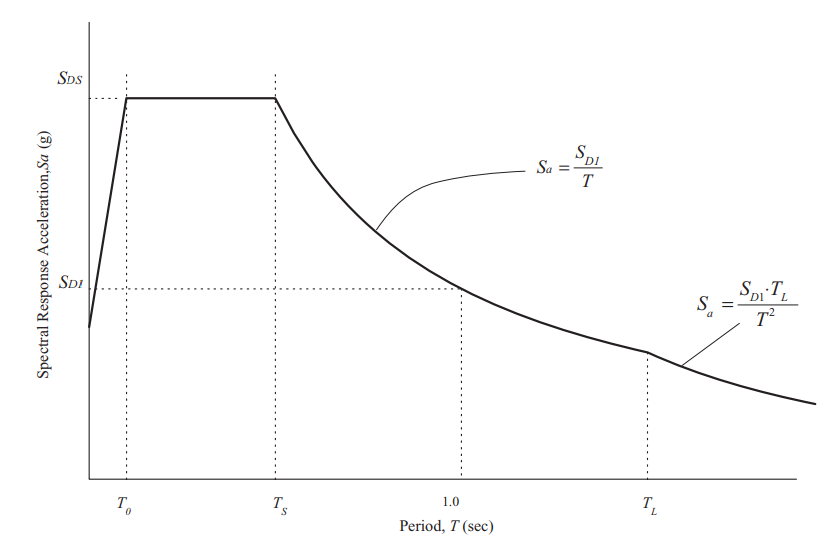{width="4.841500437445319in" height="3.1498786089238844in"}

Figura 1. Espectro de aceleraciones según ASCE 7 - 10/16. Tomado de ASCE 7 - 16.

+-------------------------------------------------------------------------------------------------------------------------------------------------------------------------------------------------------------------------------------------------------------------------------------------------------------------------------------------------------------------------------------------------------------------------------------------------------------------------------------------------------------------------------------------------------------------------------------------------------------------+
| Caja 1. Características de los movimientos sísmicos de diseño                                                                                                                                                                                                                                                                                                                                                                                                                                                                                                                                                 |
|                                                                                                                                                                                                                                                                                                                                                                                                                                                                                                                                                                                                                   |
| Los movimientos sísmicos para el diseño estructural se representan por medio de Espectros de Diseño, los cuales indican los valores mínimos requeridos de aceleración espectral según diferentes periodos de vibración de estructuras. A lo largo de muchos años la ingeniería estructural ha desarrollado los métodos necesarios para operar con este tipo de descripción del movimiento fuerte dentro de los procesos de diseño y verificación de una estructura.                                                                                                                                               |
|                                                                                                                                                                                                                                                                                                                                                                                                                                                                                                                                                                                                                   |
| Lo que conocemos como espectro de respuesta no es más que la colección de valores máximos de movimiento (respuesta estructural) de osciladores de un grado de libertad con periodo fundamental variable (cubriendo un rango relevante y representativo), ante un mismo movimiento sísmico en la base.                                                                                                                                                                                                                                                                                                             |
|                                                                                                                                                                                                                                                                                                                                                                                                                                                                                                                                                                                                                   |
| Los espectros de respuesta, entre muchas otras propiedades interesantes, exhiben un comportamiento como el ilustrado en la Figura. Se presenta un espectro de velocidad para el acelerograma registrado en la estación Bocatoma durante el sismo de Armenia (Eje Cafetero) del 25 de enero de 1999.                                                                                                                                                                                                                                                                                                               |
|                                                                                                                                                                                                                                                                                                                                                                                                                                                                                                                                                                                                                   |
| {width="3.7784350393700787in" height="3.3829790026246718in"}                                                                                                                                                                                                                                                                                                                                                                                                                                                                                                                               |
|                                                                                                                                                                                                                                                                                                                                                                                                                                                                                                                                                                                                                   |
| Espectro de velocidad del registro Bocatoma del sismo del Eje Cafetero (Colombia) del 25/01/1999                                                                                                                                                                                                                                                                                                                                                                                                                                                                                                                  |
|                                                                                                                                                                                                                                                                                                                                                                                                                                                                                                                                                                                                                   |
| Nótese que, al dibujar los espectros de velocidad en escala logarítmica, es posible encontrar rangos de periodos en donde los valores calculados de respuesta estructural no varían significativamente unos con otros. En particular se revelan tres zonas en el espectro: una de aceleración aproximadamente constante, otra de velocidad aproximadamente constante y una tercera de desplazamiento aproximadamente constante. Las formas espectrales de diseño, similares a la línea negra presentada en la Figura, buscan aproximar lo mejor posible la forma y características de los espectros de respuesta. |
+-------------------------------------------------------------------------------------------------------------------------------------------------------------------------------------------------------------------------------------------------------------------------------------------------------------------------------------------------------------------------------------------------------------------------------------------------------------------------------------------------------------------------------------------------------------------------------------------------------------------+

Según el reglamento ASCE 7, los coeficientes de diseño se obtienen de los coeficientes S~MS~ y S~M1~, llamados el sismo máximo considerado, de la siguiente manera.

+----------------------------------------------+---------+
| $$S_{text{DS}} = frac{2}{3}S_{text{MS}}$$ | (1) |
|                                              |         |
| $$S_{D1} = frac{2}{3}S_{M1}$$               |         |
+----------------------------------------------+---------+

Los valores de los coeficientes S~MS~ y S~M1~ no corresponden a valores de aceleración espectral de algún periodo de retorno. En estos reglamentos, se emplea movimiento fuerte orientado al riesgo (*Risk Targeted Ground Motion* -- RTGM) [2], el cual tiene la característica de calcularse como el valor de aceleración asociado a una probabilidad de colapso del 1% en 50 años. Nótese que la definición probabilista se refiere al colapso como variable de decisión, y no a una eventual excedencia de los valores de aceleración.

La construcción de movimiento de tipo RTGM implica la definición de funciones de fragilidad que permitan dar cuenta de la vulnerabilidad de las edificaciones futuras. Adicionalmente, esta fragilidad se altera de forma iterativa hasta encontrar el punto en el cual la aceleración espectral induce una probabilidad de colapso del 1%. Este procedimiento es, a juicio de los autores, difícil de justificar, no solo por su arbitrariedad (lo cual es más o menos normal en todas las definiciones de movimiento fuerte de diseño normativas) sino por proveer un mensaje de falsa seguridad que no es posible establecer desde antes de iniciar un proceso de diseño estructural. Surgen inquietudes importantes al analizar el significado y procedimientos de la RTGM:

-   ¿Es posible establecer, desde el espectro de diseño, la probabilidad futura de colapso de una estructura?

-   ¿Son las funciones de fragilidad empleadas, realmente representativas de la probabilidad de colapso de cualquier tipo de estructura?

-   ¿Es apropiado afirmar que, siguiendo estas regulaciones para el movimiento sísmico de diseño, las edificaciones futuras tendrán, todas, la misma probabilidad de colapso de, máximo, 1% en 50 años?

A nuestro juicio, no es correcto ni conveniente establecer la probabilidad de colapso de las estructuras desde el movimiento de diseño. No obstante, la RTGM tiene algunas ventajas o bondades que también conviene mencionar. Primero, lo que busca en esencia es reducir el riesgo de las edificaciones futuras, haciendo explícito un objetivo de desempeño, lo cual es algo deseable. También creemos que es correcto no asociar los coeficientes de diseño (y en general los espectros) a periodos de retorno. En el pasado, la asociación de los coeficientes de diseño a un periodo de retorno establecido ha llevado a múltiples malinterpretaciones del nivel de seguridad que se provee, desde el diseño estructural, a las edificaciones futuras. Nótese el espectro presentado en la Figura 2. Este espectro de diseño fue construido siguiendo las formas espectrales del CCP 14, usando tres coeficientes de diseño con periodo de retorno de 1,000 años. Se presenta también el espectro de amenaza uniforme de 1,000 años, el cual es un espectro construido mediante una evaluación probabilista de la amenaza sísmica, y que sí tiene el mismo periodo de retorno en todas las ordenadas espectrales. Como puede observarse, el espectro de diseño resultante solamente tiene 1,000 años de periodo de retorno en los tres puntos en donde de cruza con el de amenaza uniforme. En ciertas porciones del espectro, el periodo de retorno real de las aceleraciones espectrales es mayor a 1,000 y en otras partes es menor a 1,000. Esto no constituye realmente una deficiencia de las formas espectrales, pues este es en general el caso en todos los códigos de diseño sismo resistente conocidos. En conclusión, no es posible, ni lógico, afirmar que un espectro de diseño tiene determinado periodo de retorno. La desvinculación del periodo de retorno de la definición de los coeficientes de diseño en la RTGM es un acierto.

{width="3.935999562554681in" height="2.815945975503062in"}

Figura 2. Espectro de diseño y espectro de amenaza uniforme. Se indican los periodos de retorno reales de las aceleraciones espectrales de diseño.

Cabe anotar que en este trabajo se mantienen siempre los coeficientes de sitio, asociados a la respuesta del suelo, en un valor constante igual a 1. La respuesta de sitio es materia de investigación profunda y de reflexión también para la actualización de la NSR 22, pero excede el alcance de este trabajo.

+------------------------------------------------------------------------------------------------------------------------------------------------------------------------------------------------------------------------------------------------------------------------------------------------------------------------------------------------------------------------------------------------------------------------------------------------------------------------------------------------------------------------------------------------------------------------------------------------------------------------------------------------+
| Caja 2. Efecto del suelo                                                                                                                                                                                                                                                                                                                                                                                                                                                                                                                                                                                                                   |
|                                                                                                                                                                                                                                                                                                                                                                                                                                                                                                                                                                                                                                                |
| Los depósitos de suelo blando modifican en amplitud y contenido frecuencial el movimiento sísmico, como resultado del tránsito de las ondas sísmicas por los materiales geotécnicos, los cuales exhiben un comportamiento fuertemente no lineal, aumentando los amortiguamientos totales y degradando su módulo de rigidez a medida que son sometidos a mayores deformaciones cortantes. Este comportamiento tiende a modificar radicalmente la forma de los espectros de respuesta a nivel de la superficie del terreno (o a nivel de la cimentación de las estructuras), en comparación con el movimiento en la base del depósito.           |
|                                                                                                                                                                                                                                                                                                                                                                                                                                                                                                                                                                                                                                                |
| Este comportamiento se ilustra a continuación a partir de la respuesta sísmica de un perfil conformado totalmente por materiales aluviales, granulares, de profundidad intermedia (30 metros) y rigidez intermedia (*V~s~*~30~ = 530 m/s). Este perfil es de tipo C según la clasificación NHERP, misma usada en el NSR-10. La Figura presenta la relación de amplificación de aceleraciones espectrales (superficie/ roca) ante un acelerograma hipotético incidente en la base.                                                                                                                                                              |
|                                                                                                                                                                                                                                                                                                                                                                                                                                                                                                                                                                                                                                                |
| {width="6.265122484689414in" height="4.5in"}                                                                                                                                                                                                                                                                                                                                                                                                                                                                                                                                                                            |
|                                                                                                                                                                                                                                                                                                                                                                                                                                                                                                                                                                                                                                                |
| Relación de amplificación de las aceleraciones espectrales                                                                                                                                                                                                                                                                                                                                                                                                                                                                                                                                                                                     |
|                                                                                                                                                                                                                                                                                                                                                                                                                                                                                                                                                                                                                                                |
| El comportamiento de la relación de amplificación típicamente es el presentado en la Figura. Nótese que es posible identificar tres zonas principales: una de periodos muy cortos (o zona de comportamiento rígido), otra de periodo corto y otra de periodo largo, para las cuales es posible establecer valores de amplificación en términos de un único parámetro representativo. Estos parámetros son los mismos que se emplean en la formulación de las formas espectrales de la NSR 10 (*F~a~* y *F~v~*), despreciando la zona de comportamiento rígido, en donde prácticamente no es posible encontrar ninguna estructura convencional. |
+------------------------------------------------------------------------------------------------------------------------------------------------------------------------------------------------------------------------------------------------------------------------------------------------------------------------------------------------------------------------------------------------------------------------------------------------------------------------------------------------------------------------------------------------------------------------------------------------------------------------------------------------+

UN "NUEVO" ENFOQUE
==================

En vista tanto de las deficiencias como ventajas de la RTGM, se propone un enfoque diferente para la definición de los coeficientes sísmicos de diseño. Este enfoque se basa en la cuantificación de coeficientes *óptimos* de diseño, lo cual no es realmente un nuevo enfoque, no solo por haber sido ya empleado en otros códigos de construcción sismo resistente (como en el caso de México), sino porque su definición es tan antigua como la de la evaluación probabilista de la amenaza sísmica. En palabras de Luis Esteva, los coeficientes óptimos "son los que han de minimizar la suma de los costos asociados a la decisión de haber usado ese valor en el diseño de la edificación" [3]. El padre de la evaluación probabilista nos ofrecía esta definición al mismo tiempo que planteaba su famosa ecuación para el cálculo de las tasas de excedencia de movimiento fuerte (de donde se obtienen los periodos de retorno, tan arraigados en nuestra concepción de seguridad en los diseños estructurales). Su maestro, Emilio Rosenblueth, lo definiría de la siguiente manera: "un diseño es óptimo si minimiza los costos iniciales de construcción y el valor presente neto de las pérdidas futuras debido a terremotos" [4]. No es extraño entonces que estos conceptos hayan sido llevados a la práctica en México desde hace ya varios años.

Siguiendo la definición de Rosenblueth, los coeficientes óptimos de diseño se obtienen de minimizar la suma de costos iniciales de construcción, y costos futuros asociados a las pérdidas que causarán los terremotos. Esto significa que el periodo de retorno de estos coeficientes no solo no participa en su definición, sino que cambiará de sitio a sitio. La Figura 3 muestra esta situación para dos sitios diferentes en un territorio, uno de baja y otro de alta sismicidad. El costo inicial (CI) se asume igual en ambas ubicaciones. Nótese que los costos se presentan como función del valor del coeficiente de diseño *c*, es decir que entre mayores son las exigencias, mayor es el costo inicial. Ahora bien, las curvas de costos futuros (CFL) exhiben comportamientos diferentes dependiendo del nivel de sismicidad del sitio, pero siendo ambas decrecientes con respecto a *c*, indicando que entre mayor sea la exigencia de diseño, se espera que las pérdidas futuras sean menores. La función de costo total (CT) viene de la suma de las anteriores (CT = CI+CFL). Esta función no es totalmente creciente o decreciente con respecto a *c*, presentando un claro valor mínimo en el cual, puede afirmarse, se encuentra el valor óptimo del coeficiente *c*, es decir, el que implica los menores costos totales.

{width="4.391027996500437in" height="2.9040004374453194in"}

Figura 3. Ilustración de la definición de coeficientes óptimos de diseño.

Costo inicial
-------------

El costo inicial es un indicador del valor económico de la edificación y su variación a medida que la exigencia de diseño aumenta. Nótese que este modelo no pretende ser de características financieras, sino simplemente indicativo, por lo cual no es necesario, ni correcto, intentar incorporar aspectos como la depreciación del inmueble construido.

El costo inicial se compone de un costo por resistencia lateral gratuita y un costo por resistencia adicional a la gratuita. La resistencia lateral gratuita es aquella resistencia lateral que tiene una estructura que ha sido diseñada exclusivamente para soportar cargas verticales. Es decir, en cualquier configuración estructural, dado que se soportan cargas verticales, se tiene algún nivel de resistencia lateral que es inherente a la estructura, así no se haya concebido como objetivo de diseño.

Toda resistencia adicional que se provea a la estructura implica un costo adicional a la resistencia gratuita. Este costo es creciente con respecto a la exigencia de diseño, de un modo que se ha visto es ligeramente no lineal. Salgado et al. [5] Proponen un modelo de costos iniciales para las edificaciones en Colombia, que hemos adoptado para el desarrollo de este trabajo.

Costo de pérdidas futuras
-------------------------

El costo de las pérdidas futuras se determina en función del costo inicial de la estructura, la tasa de excedencia del coeficiente de diseño, que mide cuantas veces en promedio en el futuro se excederá el nivel de diseño[^1], y un factor de impacto que permite incorporar efectos indirectos asociados a las pérdidas causadas por los temblores. Este factor de impacto es de especial interés en este trabajo, pues permite incorporar de forma más o menos directa las condiciones de contexto que facilitan que se exacerbe el impacto asociado a la ocurrencia de un terremoto, en términos de la fragilidad social y falta de resiliencia en que ocurre dicha pérdida.

La tasa de excedencia del movimiento fuerte mide el número de veces en un año que se espera se exceda, en promedio, un valor determinado. Este parámetro se obtiene mediante una evaluación clásica de la amenaza sísmica, cuyo principal resultado son precisamente las curvas de amenaza (o curvas de tasa de excedencia) en múltiples ubicaciones de cálculo dentro del país. El modelo de amenaza sísmica de Colombia corresponde a la última versión del proyecto ASLAC (Salgado et al. [6]), el cual es un modelo regional de América Latina y El Caribe, desarrollado con el objetivo de proveer a la región de un modelo continuo de amenaza, con el mayor nivel de detalle posible en cada territorio y siguiendo técnicas del estado del arte en ingeniería sísmica. La Figura 4 muestra como ejemplo los mapas de amenaza uniforme para Colombia de 475 años de periodo de retorno, para aceleración máxima del terreno y aceleración espectral para 0.5 segundos.

  ------------------------------------------------------------------------------------ ------------------------------------------------------------------------------------ ------------------------------------------------------------------------------------
  {width="2.6640004374453192in" height="3.443708442694663in"}   {width="2.643873578302712in" height="3.4720002187226595in"}   {width="0.5120002187226597in" height="3.413363954505687in"}
  ------------------------------------------------------------------------------------ ------------------------------------------------------------------------------------ ------------------------------------------------------------------------------------

Figura 4. Mapas de amenaza uniforme para 475 años de periodo de retorno. Izq: aceleración máxima del terreno. Der: Aceleración espectral para 0.5 segundos. Aceleración en cm/s^2^.

El factor de impacto pretende reflejar las condiciones de contexto en el cual ocurrirían las pérdidas. Su definición es siempre subjetiva y arbitraria, pero orientada a mostrar el impacto real de los desastres sísmicos y a permitir la diferenciación entre territorios según su nivel de desarrollo. Emilio Rosenblueth llegó a plantear que el factor de impacto debería ser del orden de 12, es decir, que el impacto real de un terremoto, en condiciones socioeconómicas muy desfavorables, podría ser de 12 veces la pérdida directa. Si bien existen diferentes planteamientos en la literatura con respecto al valor del factor de impacto, hay consenso científico en que su definición debe permitir la diferenciación entre territorios, más que dar cuenta exactamente de la amplificación del impacto.

En este trabajo se optó por definir el factor de impacto en términos de dos características particulares a nivel de municipio: i) el nivel de desarrollo según la tipología municipal del DNP y, ii) si el municipio tiene o no microzonificación sísmica. La primera característica habla del nivel de desarrollo del municipio. En este trabajo se considera explícitamente la categoría municipal y su clasificación en dimensión institucional. La segunda característica permite dar cuenta de la tradición en ingeniería estructural y sísmica, el reconocimiento del problema y la inversión realizada por los municipios en seguridad sísmica. La Figura 5 muestra la distribución del valor final determinado para el factor de impacto para todos los municipios del país.

{width="3.1832622484689415in" height="4.227869641294838in"} {width="0.8870461504811898in" height="1.319805336832896in"}

Figura 5. Valor del factor de impacto a nivel municipal. Los municipios con factor de impacto igual a 5 son: Bogotá D.C., Medellín, Cali, Bucaramanga, Barranquilla y Cartagena. Los municipios con factor de impacto igual a 7 son: Manizales, Pereira, Armenia y Popayán.

Los valores mostrados en el mapa de la Figura 5 fueron definidos en base a la experiencia de los autores con el fin de revelar el impacto asociado a la ocurrencia de los temblores, y se consideran apropiados y suficientes para los fines de este trabajo. Mayor profundización en su definición será objeto de investigaciones posteriores.

+-------------------------------------------------------------------------------------------------------------------------------------------------------------------------------------------------------------------------------------------------------------------------------------------------+---+
| Caja 3. Nuevo modelo de amenaza sísmica de Colombia                                                                                                                                                                                                                                         |   |
|                                                                                                                                                                                                                                                                                                 |   |
| Como parte del proyecto ASLAC (Amenaza Sísmica de América Latina y El Caribe), se desarrolló un modelo detallado de amenaza sísmica para el territorio colombiano. Los detalles de este modelo pueden consultarse en Salgado et.al. 2017.                                                       |   |
|                                                                                                                                                                                                                                                                                                 |   |
| Este nuevo modelo se conforma por 53 fuentes sismogénicas, 26 de ellas corticales, 5 de subducción de interfaz, 20 de subducción intraplaca, una fuente especial para el nido de sismicidad de Bucaramanga y una fuente de background para la sismicidad dispersa del norte colombiano.         |   |
|                                                                                                                                                                                                                                                                                                 |   |
| {width="4.030382764654418in" height="4.812145669291339in"}                                                                                                                                                                                                              |   |
|                                                                                                                                                                                                                                                                                                 |   |
| Mapa con la ubicación de los 53 polígonos de fuentes sismogénicas                                                                                                                                                                                                                               |   |
|                                                                                                                                                                                                                                                                                                 |   |
| Se hizo uso de modelos de movimiento fuerte (GMPM) híbridos, mediante la combinación de los siguientes modelos individuales. Se incluye en todos los casos el modelo de atenuación de Bernal 2014 (actualizado en 2019) como modelo generado en base a observaciones en el territorio nacional. |   |
|                                                                                                                                                                                                                                                                                                 |   |
| GMPM usados en la modelación de la amenaza sísmica                                                                                                                                                                                                                                              |   |
|                                                                                                                                                                                                                                                                                                 |   |
| +--------------------+------------------------+                                                                                                                                                                                                                                                 |   |
| | Tipo de fuente | GMPM               |                                                                                                                                                                                                                                                 |   |
| +====================+========================+                                                                                                                                                                                                                                                 |   |
| | Cortical           | Bernal 2014            |                                                                                                                                                                                                                                                 |   |
| |                    |                        |                                                                                                                                                                                                                                                 |   |
| |                    | Zhao et.al. 2006       |                                                                                                                                                                                                                                                 |   |
| |                    |                        |                                                                                                                                                                                                                                                 |   |
| |                    | Chiou & Youngs 2014    |                                                                                                                                                                                                                                                 |   |
| |                    |                        |                                                                                                                                                                                                                                                 |   |
| |                    | Abrahamson et.al. 2014 |                                                                                                                                                                                                                                                 |   |
| +--------------------+------------------------+                                                                                                                                                                                                                                                 |   |
| | Interfaz           | Bernal 2014            |                                                                                                                                                                                                                                                 |   |
| |                    |                        |                                                                                                                                                                                                                                                 |   |
| |                    | Zhao et.al. 2006       |                                                                                                                                                                                                                                                 |   |
| |                    |                        |                                                                                                                                                                                                                                                 |   |
| |                    | Youngs 1997            |                                                                                                                                                                                                                                                 |   |
| |                    |                        |                                                                                                                                                                                                                                                 |   |
| |                    | Lin & Lee 2008         |                                                                                                                                                                                                                                                 |   |
| +--------------------+------------------------+                                                                                                                                                                                                                                                 |   |
| | Intraplaca         | Bernal 2014            |                                                                                                                                                                                                                                                 |   |
| |                    |                        |                                                                                                                                                                                                                                                 |   |
| |                    | Zhao et.al. 2006       |                                                                                                                                                                                                                                                 |   |
| |                    |                        |                                                                                                                                                                                                                                                 |   |
| |                    | Youngs 1997            |                                                                                                                                                                                                                                                 |   |
| |                    |                        |                                                                                                                                                                                                                                                 |   |
| |                    | Kanno et.al. 2006      |                                                                                                                                                                                                                                                 |   |
| +--------------------+------------------------+                                                                                                                                                                                                                                                 |   |
|                                                                                                                                                                                                                                                                                                 |   |
| El cálculo de la amenaza sísmica se desarrolló en el programa R-CRISIS, uno de los más usados a nivel internacional.                                                                                                                                                                            |   |
+-------------------------------------------------------------------------------------------------------------------------------------------------------------------------------------------------------------------------------------------------------------------------------------------------+---+

COEFICIENTES ÓPTIMOS
====================

Usando el software R-CRISIS [7], mismo usado en la evaluación de la amenaza sísmica del país y del proyecto ASLAC, se aplicó la metodología presentada anteriormente, buscando encontrar los coeficientes óptimos de diseño para diferentes aceleraciones espectrales. Como ejemplo, la Figura 6 muestra los espectros de aceleraciones óptimas para Bogotá y Cúcuta, a nivel de roca firme. Se marcan en la imagen los valores de aceleración en 0.2 y 1 segundos (correspondientes a S~DS~ y S~D1~ respectivamente). Se muestra también los periodos de retorno de las aceleraciones espectrales. Nótese como los menores periodos de retorno se asocian a periodos bajos (cercanos a 0.2 segundos), punto desde el cual el periodo de retorno es creciente con el periodo estructural.

  {width="2.8254122922134735in" height="1.6535433070866141in"}   {width="3.1116196412948383in" height="1.6535433070866141in"}
  -------------------------------------------------------------------------------------- --------------------------------------------------------------------------------------
  {width="2.8082961504811896in" height="1.6535433070866141in"}   {width="2.8809405074365704in" height="1.6535433070866141in"}

Figura 6. Ejemplo de cálculo de coeficientes de diseño óptimos. Arriba: Bogotá. Abajo: Cúcuta. Izquierda: Aceleraciones espectrales óptimas. Derecha: Periodos de retorno de las aceleraciones óptimas.

También es posible ver en la Figura 6 que para mayor amenaza sísmica (Cúcuta), los periodos de retorno requeridos son menores que en una zona de amenaza intermedia (Bogotá). Esto puede entenderse de dos maneras. Primero, nótese que a medida que la amenaza sísmica disminuye, la resistencia lateral gratuita de la estructura (aquella que se obtiene de la capacidad a cargas verticales) empieza a aportar cada vez más a la seguridad sísmica de la edificación, llevando el problema a que, en zonas de amenaza baja, sea muy "barato" comprar seguridad sísmica, lo que implica el poder usar periodos de retorno muy altos. Segundo, a medida que la amenaza sísmica se incrementa, lo hace también la frecuencia con la que se superan los valores de aceleración de diseño. Esto conlleva un altísimo costo inicial si se quiere reducir el número de veces en que se superará en el futuro, llegando a un punto en el cual incrementar ampliamente el costo inicial puede no ser igualmente efectivo en reducir las pérdidas. Por esta razón, lo más costo-efectivo es precisamente diseñar para un periodo de retorno menor.

Este mismo tipo de resultados puede verse espacialmente. Las Figuras 7 y 8 presentan los mapas de periodos de retorno óptimos para la aceleración espectral de 0.2 segundos y 1 segundo, respectivamente. Nótese como las zonas de alta amenaza sísmica del país implican menores periodos de retorno para el parámetro de diseño, y viceversa.

{width="5.379423665791776in" height="6.069767060367454in"}

Figura 7. Periodos de retorno óptimos para aceleración espectral de 0.2 segundos.

{width="5.152419072615923in" height="6.034884076990376in"}

Figura 8. Periodos de retorno óptimos para aceleración espectral de 1 segundo (derecha).

+----------------------------------------------------------------------------------------------------------------------------------------------------------------------------------------------------------------------------------------------------------------------------------------------------------------------------------------------------------------------------------------------------------------------------------------------------------------------------------------------------------------------------------------------------------------------------------------------------------------------------------------------------------------------------------------------------------------------------+
| Caja 4. R-CRISIS                                                                                                                                                                                                                                                                                                                                                                                                                                                                                                                                                                                                                                                                                                       |
|                                                                                                                                                                                                                                                                                                                                                                                                                                                                                                                                                                                                                                                                                                                            |
| R-CRISIS (Ordaz et al. 2018) es una herramienta versátil para realizar el análisis probabilista de amenaza sísmica (PSHA). Desde su primera versión, desarrollada en 1998, R-CRISIS ha sido utilizado en diferentes proyectos de evaluación de amenaza sísmica alrededor del mundo. Las evaluaciones probabilistas realizada con R-CRISIS se ajustan en su totalidad a los resultados considerados válidos en la más reciente edición del proyecto PEER para validación de software para cálculos sísmicos. R-CRISIS está actualmente avalado para usarse en evaluaciones de amenaza sísmica de instalaciones nucleares en Europa. En Aguilar-Meléndez et al. (2017) se puede encontrar una completa revisión de R-CRISIS. |
|                                                                                                                                                                                                                                                                                                                                                                                                                                                                                                                                                                                                                                                                                                                            |
| R-CRISIS admite la definición de fuentes sísmicas de diversos tipos, desde puntos y líneas, hasta complejas estructuras tridimensionales, que se combinan con una importante variedad de modelos de sismicidad. R-CRISIS facilita el uso de diferentes modelos de atenuación *(GMPM),* incorporando actualmente más de 60 modelos diferentes. R-CRISIS permite calcular: Mapas de amenaza, espectros de amenaza uniforme, desagregación M-R, desagregación M-R-Epsilon, escenarios sísmicos/mapas de movimiento sísmico y conjunto de eventos (archivo CAPRA *ame*), entro otros resultados.                                                                                                                               |
|                                                                                                                                                                                                                                                                                                                                                                                                                                                                                                                                                                                                                                                                                                                            |
| 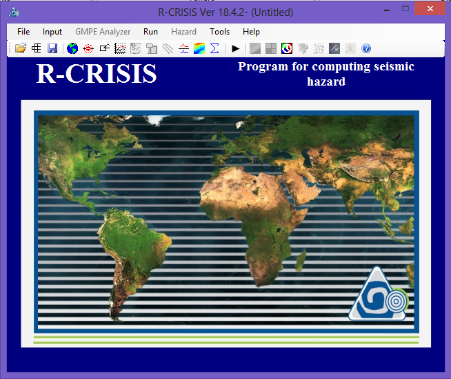{width="4.19200021872266in" height="3.5189730971128608in"}                                                                                                                                                                                                                                                                                                                                                                                                                                                                                                                                                                                                                                         |
|                                                                                                                                                                                                                                                                                                                                                                                                                                                                                                                                                                                                                                                                                                                            |
| Pantalla principal de R-CRISIS                                                                                                                                                                                                                                                                                                                                                                                                                                                                                                                                                                                                                                                                                             |
|                                                                                                                                                                                                                                                                                                                                                                                                                                                                                                                                                                                                                                                                                                                            |
| Manuales de usuario y referencia técnica, bases documentales, tutoriales y otros recursos pueden ser consultados en www.r-crisis.com                                                                                                                                                                                                                                                                                                                                                                                                                                                                                                                                                                                       |
+----------------------------------------------------------------------------------------------------------------------------------------------------------------------------------------------------------------------------------------------------------------------------------------------------------------------------------------------------------------------------------------------------------------------------------------------------------------------------------------------------------------------------------------------------------------------------------------------------------------------------------------------------------------------------------------------------------------------------+

ESPECTROS DE DISEÑO
===================

De acuerdo con la especificación del ASCE 7 -10/16, los coeficientes de diseño se obtienen a partir de los coeficientes del sismo máximo considerado. Los coeficientes óptimos calculados y presentados anteriormente son para diseño estructural, por lo cual es necesario, buscando la adopción del reglamento ASCE, encontrar los coeficientes S~SM~ y S~S1~ que deriven en los coeficientes de diseño óptimos encontrados. Estos coeficientes se encuentran usando la Ecuación 1. Sus respectivos periodos de retorno deben determinarse en las curvas de amenaza correspondientes a cada aceleración espectral (0.2 y 1 segundos).

Coeficiente SMS
---------------

Este coeficiente corresponde a la aceleración espectral de 0.2 segundos del sismo máximo considerado según la especificación del ASCE 7 -- 10/16. Este coeficiente determina la altura de la meseta en el espectro de aceleraciones, por lo cual es el que controla los diseños estructurales de edificaciones de altura intermedia. Las bajas alturas (1 y 2 pisos) se diseñan en Colombia haciendo uso del Título E de la NSR, en el cual no participan los espectros de diseño. Las características de las edificaciones de altura intermedia se ligan fuertemente al nivel socioeconómico de la región, es decir, que se reconoce la incidencia del factor de impacto en determinar las aceleraciones óptimas. Esta incidencia pudo ser verificada al analizar los valores de aceleración óptima espectral de 0.2 segundos en las cabeceras municipales, los cuales presentan periodos de retorno muy similares entre sí, para un mismo nivel o factor de impacto. Se definieron tres niveles de desarrollo, según las clasificaciones dadas en el mapa de la Figura 5, estableciendo los periodos de retorno como el promedio de los municipios de una misma clasificación, como se indica en la Tabla 1.

Tabla 1. Periodos de retorno del parámetro S~MS~ según el nivel de desarrollo
(Código de colores según el mapa de la Figura 5)

     Nivel   Periodo de retorno S~MS~
  -- ----------- ------------------------------
     I           1500
     II          2000
     III         2500

Coeficiente SM1
---------------

Este coeficiente corresponde a la aceleración espectral de 1 segundo del sismo máximo considerado según la especificación del ASCE 7 -- 10/16. Esto significa que el diseño de edificaciones de gran altura estará principalmente dominado por este parámetro. Estas edificaciones típicamente se diseñan con ingeniería de mayor sofisticación, usando métodos más rigurosos y exigentes. Si bien este puede no ser el caso siempre, se espera aquella que en líneas generales se de un tratamiento especial a edificaciones de esta característica. Por esta razón, no se buscó vincular su periodo de retorno directamente al nivel de desarrollo, sino a la ubicación geográfica, tal y como se muestra en el mapa de la Figura 8. A partir de este mapa de periodos de retorno óptimos, se propone una zonificación de la amenaza sísmica del país (Fig. 9) que determina el periodo de retorno del parámetro S~M1~, así como el nivel de disipación de energía mínimo requerido en cada zona, es decir, reemplazaría el mapa de zonas de amenaza actualmente vigente. Este nuevo mapa, define 5 zonas de amenaza: Alta 1, Alta 2, Intermedia, Baja 1 (Norte), Baja 2 (Llanos).

{width="5.29599956255468in" height="5.904166666666667in"}

Figura 9. Nuevo mapa de zonificación sísmica propuesto.

A partir de las zonas de amenaza de la Figura 9 es posible establecer los periodos de retorno del parámetro S~M1~, como se presenta en la Tabla 2.

Tabla 2. Periodos de retorno del parámetro S~M1~ según zona de amenaza
(Código de colores según el mapa de la Figura 8).

     Zona     Periodo de retorno S~M1~
  -- ------------ ------------------------------
     Alta 1       2500
     Alta 2       5000
     Intermedia   5000

Espectros mínimos
-----------------

Para las zonas de amenaza baja (Norte y Llanos), se definieron espectros mínimos buscando que estos coincidan con los actuales espectros de diseño dados por la NSR 10 en estas regiones del país. Esta condición, si bien es arbitraria, implica aceleraciones espectrales de más de 5000 años de periodo de retorno en todos los casos, manteniendo además el mismo nivel de seguridad que el actualmente exigido. Los coeficientes S~MS~ y S~M1~ para las zonas bajas se presentan en la Tabla 3.

Tabla 3. Coeficientes SMS y SM1 para zonas de amenaza baja. Valores dados como fracción de g.

  Zona          S~MS~   S~M1~
  ----------------- ----------- -----------
  Baja 1 (Norte)    0.38        0.18
  Baja 2 (Llanos)   0.19        0.09

Parámetro T~L~
--------------

El parámetro T~L~ (Fig. 1) define el punto a partir del cual las aceleraciones espectrales decrecen con el inverso del periodo al cuadrado. Esta formulación permite controlar los desplazamientos espectrales en la zona de periodos largos. En este trabajo no se incluye una evaluación de los valores para T~L~, sin embargo, cabe mencionar que este parámetro estará principalmente controlado por la cercanía a fuentes sismogénicas importantes (campo cercano). En principio, T~L~ se mantiene en su definición actual (la dada por la NSR 10) como $T_{L}  =  2.4{bullet F}_{V}$, siendo F~V~ el parámetro de amplificación del suelo en la zona de velocidades constantes. No obstante, en condición de campo cercano (i.e. a menos de 10 km de un lineamiento de falla activa) se requiere de la definición de este parámetro por medio de un estudio de amenaza local que considere el campo cercano.

ESPECTROS PROPUESTOS Y COMPARACIÓN CON LA NSR-10
================================================

A continuación, se presentan los espectros de diseño propuestos en comparación con los correspondientes dados por la NSR-10, para Bogotá, Medellín y Cali. Los espectros propuestos para todas las capitales de departamento se incluyen en el Anexo 1. Sobre los espectros propuestos se indican los periodos de retorno de las aceleraciones en diferentes puntos, con el objetivo de hacer énfasis en que no se trata de espectros de diseño asociados a un periodo de retorno. Se indica también la zona de amenaza, y los parámetros de las formas espectrales, tanto de la NSR-10 como los nuevos propuestos.

{width="6.1375in" height="3.2805555555555554in"}

Figura 10. Comparación de espectros de diseño de NSR-10 y propuestos para Bogotá.

{width="6.1375in" height="3.2805555555555554in"}

Figura 11. Comparación de espectros de diseño de NSR-10 y propuestos para Medellín.

{width="6.1375in" height="3.2805555555555554in"}

Figura 12. Comparación de espectros de diseño de NSR-10 y propuestos para Cali.

CONCLUSIONES
============

El diseño sismo resistente es una de las acciones de gestión del riesgo sísmico más efectivas, pues implica en esencia la reducción de la vulnerabilidad de las edificaciones futuras y, por lo tanto, del riesgo sísmico que afronta la sociedad. Esto es por lo que se requiere de una apropiada definición de los espectros de diseño sismo resistente, que permitan garantizar niveles de seguridad apropiados.

Las diferencias observadas entre las formas espectrales de la NSR-10, actualmente en vigencia, y las nuevas propuestas se deben a los múltiples avances en la ingeniería sísmica en el país, que han llevado a la definición de nuevas y mejores metodologías tanto para el cálculo de la amenaza sísmica como para la definición de los movimientos de diseño.

La manera de definir los espectros de diseño es única en el mundo, constituyendo una propuesta metodológica que lleva un paso más allá aquellas existentes y aplicadas en el pasado, como con la que se definen los coeficientes de diseño estructural en México, permitiendo su articulación con las normativas ASCE 7-10/16 como base rectora de los requisitos mínimos del diseño sismo resistente.

En caso de aprobarse esta propuesta de espectros de diseño, el país debe entrar en una fase de actualización y armonización de las microzonificaciones sísmicas del país, de manera que se compatibilicen los requisitos y reglamentos locales con el reglamento nacional.

+----------------------------------------------------------------------------------------------------------------------------------------------------------------------------------------------------------------------------------------------------------------------------------------------------------------------------------------------------------------------------------------------------------------------------------------------------------------------------------+
| PUNTOS CLAVE                                                                                                                                                                                                                                                                                                                                                                                                                                                                 |
|                                                                                                                                                                                                                                                                                                                                                                                                                                                                                  |
| 1.  Los movimientos sísmicos de diseño no tienen un periodo de retorno asociado. Esta concepción errónea ha llevado a asociar el nivel de seguridad de las edificaciones diseñadas con la NSR a un cierto periodo de retorno, lo cual es incorrecto e incoherente con la práctica de la ingeniería.                                                                                                                                                                              |
|                                                                                                                                                                                                                                                                                                                                                                                                                                                                                  |
| 2.  El movimiento fuerte orientado al riesgo, RTGM, esta basado en conceptos de la ingeniería de desempeño, lo cual es deseable siempre pues permitiría llevar la práctica de la ingeniería a un nivel mayor de sofisticación. Sin embargo, en la práctica el procedimiento empleado para su determinación es altamente arbitrario y difícil de justificar, así como el intento de cumplir con un objetivo de desempeño explicito previamente al diseño mismo de la edificación. |
|                                                                                                                                                                                                                                                                                                                                                                                                                                                                                  |
| 3.  El modelo de coeficientes óptimos de diseño, ideado por Luis Esteva casi al mismo tiempo en que ideó la evaluación probabilista de la amenaza sísmica, provee un camino para mejorar la especificación de coeficientes de diseño, permitiendo considerar aspectos tan relevantes como las tasas de excedencia de aceleraciones, la inversión inicial (de forma aproximada), o el contexto socioeconómico en que ocurren los terremotos.                                      |
|                                                                                                                                                                                                                                                                                                                                                                                                                                                                                  |
| 4.  La propuesta de espectros de diseño permite a la NSR 22 avanzar hacia definiciones del movimiento de diseño más acertadas y también con mayor aproximación a las realidades del país. Los espectros propuestos permiten además una transición relativamente suave entre la NSR 10 y la NSR 22, en la mayoría del territorio nacional.                                                                                                                                        |
+----------------------------------------------------------------------------------------------------------------------------------------------------------------------------------------------------------------------------------------------------------------------------------------------------------------------------------------------------------------------------------------------------------------------------------------------------------------------------------+

MATERIALES Y MÉTODOS
====================

Risk Targeted Ground Motion (RTGM)
----------------------------------

La RTGM, como la define el USGS para ser usada en el ASCE 7-16, se basa en la siguiente ecuación:

  ---------------------------------------------------------------------------------------------------------------------- -------
  $$Pleft( text{Colapso} right) = int_{0}^{infty}{Pleft( Colapso|Sa right) bullet f_{text{Sa}} bullet dSa}$$   (2)
  ---------------------------------------------------------------------------------------------------------------------- -------

*En donde P (Colapso) es la probabilidad de colapso de la estructura dada como objetivo de desempeño, P (Colapso|Sa) es la función de fragilidad al colapso y f~Sa~ es la función de densidad de probabilidad de la aceleración espectral en el sitio de cálculo para un periodo de exposición dado. Nótese que la integral se realiza en todo el dominio de la aceleración espectral.*

*La Ecuación 2 es una forma de aplicar el teorema de la probabilidad total sobre la posibilidad de colapso estructural. El término de fragilidad (P(Colapso|Sa)) se asocia a la respuesta estructural, más específicamente a la probabilidad de colapso de la edificación dada una aceleración espectral Sa. En rigor, este término condensa la manera como se causa el daño y el consecuente posible colapso como función del movimiento fuerte inducido en la estructura. Ahora bien, dado que la estructura puede verse sometida a múltiples posibles movimientos sísmicos, la integral se realiza sobre todo el dominio de aceleración (es decir, se consideran todas), pero de forma modulada por la función de densidad de probabilidad de la aceleración espectral, f~Sa~. Esta última depende de la ubicación de la estructura en el país y condensa el aporte de todas las fuentes sísmicas del territorio.*

*La función de densidad f~Sa~ puede obtenerse directamente de la curva de amenaza sísmica de la aceleración espectral como:*

  -------------------------------------------------------------------------------------------- -------
  $$f_{text{Sa}} = frac{text{d }}{text{dSa}}e^{- vleft( text{Sa} right) bullet T}$$   (3)
  -------------------------------------------------------------------------------------------- -------

*En donde v(Sa) es la tasa de excedencia de la aceleración espectral y T el periodo de exposición. Esta ecuación permite determinar la distribución de probabilidad de la aceleración espectral en base a la curva de amenaza, como se ilustra en la Figura 13.* *La Ecuación 3 se obtiene directamente de la suposición que la ocurrencia en el tiempo de eventos sísmicos que excedan un determinado valor de aceleración espectral sigue un proceso estocástico homogéneo de Poisson.*

{width="6.1375in" height="2.0076388888888888in"}

Figura 13. Transformación de la curva de amenaza en la función de densidad de probabilidad de la aceleración espectral, para un periodo de tiempo de exposición dado.

*Según la metodología definida en los reglamentos ASCE 7-10 y 16, el cálculo de las aceleraciones RTGM sigue un procedimiento iterativo como el indicado a continuación:*

1.  *Se define la forma de la función de fragilidad como una distribución lognormal acumulada con parámetros tales que tenga el 10% de probabilidad de colapso para la aceleración que tiene 2,500 años de periodo de retorno, y una desviación estándar del logaritmo natural igual a 0.6.*

2.  *Se ajusta uno de los parámetros de la distribución lognormal de forma iterativa hasta que el resultado de la Ecuación 2 llegue a ser 1%.*

*La aceleración para la cual en la función de fragilidad se tiene 10% de probabilidad de colapso, y que implica un 1% de probabilidad total de colapso según la Ecuación 2, es la medida de movimiento RTGM. La Figura 13 ilustra este proceso iterativo.*

+-------------------------------------------------------------------------------------+---------------------------------------------+
| {width="2.952755905511811in" height="2.31829615048119in"}   | *Primera iteración:*                        |
|                                                                                     |                                             |
|                                                                                     | *Curva de fragilidad según ASCE 7 -- 10/16* |
|                                                                                     |                                             |
|                                                                                     | *Sa = 0.8 g (2,500 años)*                   |
|                                                                                     |                                             |
|                                                                                     | *P(Colapso) = 12%*                          |
+=====================================================================================+=============================================+
| {width="2.952755905511811in" height="2.5029735345581803in"} | *Segunda iteración:*                        |
|                                                                                     |                                             |
|                                                                                     | *Curva de fragilidad modificada*            |
|                                                                                     |                                             |
|                                                                                     | *Sa = 1.3 g*                                |
|                                                                                     |                                             |
|                                                                                     | *P(Colapso) = 0.14%*                        |
+-------------------------------------------------------------------------------------+---------------------------------------------+
| {width="2.952755905511811in" height="2.5029735345581803in"} | *Tercera iteración:*                        |
|                                                                                     |                                             |
|                                                                                     | *Curva de fragilidad modificada*            |
|                                                                                     |                                             |
|                                                                                     | *Sa = 1.1 g*                                |
|                                                                                     |                                             |
|                                                                                     | *P(Colapso) = 1.0%*                         |
+-------------------------------------------------------------------------------------+---------------------------------------------+

Figura 14. Ilustración del proceso iterativo para construir la RTGM.

Método de los coeficientes óptimos
----------------------------------

El método de los coeficientes de diseño óptimos se basa en la minimización del costo total asociado a una estructura. Este costo total se define como el costo inicial por la construcción de la estructura, y el costo de las pérdidas futuras, en función de las pérdidas que los futuros terremotos causarán sobre el inmueble. Esta definición puede expresarse mediante la siguiente ecuación:

  ----------------------------------------------------------------------------------------------- -------
  $$C_{T}left( c_{s} right) = C_{I}left( c_{s} right) + C_{text{FL}}left( c_{s} right)$$   (4)
  ----------------------------------------------------------------------------------------------- -------

*En donde C~T~ es el costo total, C~I~ el costo inicial y C~FL~ el costo de las pérdidas futuras. Todos estos costos se expresan como función del coeficiente de diseño c~s~. El costo inicial se define de la siguiente manera:*

  ---------------------------------------------------------------------------------- -------
  $$C_{I} = C_{0} + C_{text{Res}} bullet left( c_{s} - c_{0} right)^{alpha}$$   (5)
  ---------------------------------------------------------------------------------- -------

*En donde C~0~ es el costo por resistencia lateral gratuita, que tiene que ver con la capacidad a cargas laterales que tiene cualquier estructura, incluso si esta ha sido diseñada únicamente para soportar cargas verticales. C~Res~ es el costo por resistencia lateral adicional a la gratuita, es decir dándole una resistencia apropiada a la estructura para las cargas laterales, pero más allá de la inherente a cualquier estructura. Este costo C~Res~ es modificado de manera no lineal como función de la diferencia entre el coeficiente de diseño (que se incrementa a medida que aumenta la exigencia) y el coeficiente c~0~, que corresponde coeficiente de diseño equivalente a la resistencia lateral gratuita. Esta diferencia es elevada a un exponente positivo α que usualmente se encuentra entre 1 y 2. La Figura 15 muestra la forma de la función C~I~ normalizada (i.e. C~I~/C~0~) para edificaciones en Colombia, según Salgado et al. [5].*

{width="4.520120297462817in" height="3.0105216535433073in"}

Figura 15. Incremento del costo normalizado en función del coeficiente de diseño. Tomado de Salgado et al [5].

En la Figura 15, el Modelo de costos es efectivamente la propuesta de Salgado et al. [5] como función del coeficiente de diseño, mientras que el Modelo ajustado de costos es simplemente una regresión realizada por Salgado et al. [5] sobre su propuesta original para facilitar los cálculos.

El costo de las pérdidas futuras se expresa mediante la siguiente ecuación:

  ------------------------------------------------------------------------------------------------------ -------
  $$C_{text{FL}} = C_{I} bullet left( 1 + S_{L} right) bullet frac{vleft( c_{s} right)}{mu}$$   (6)
  ------------------------------------------------------------------------------------------------------ -------

En donde v(c~s~) es la tasa de excedencia del coeficiente de diseño, μ es una tasa de descuento y S~L~ es el factor de impacto asociado al contexto socioeconómico en que ocurren las pérdidas por sismos. Según lo recomendado por Salgado et al. [5] la tasa de descuento se fija en un 5%. El factor de impacto SL, que busca dar cuenta de las condiciones de contexto, se evaluó en función de la tipología municipal del DNP [8] y de si el municipio cuenta o no con una microzonificación sísmica, siguiendo este procedimiento:

1.  Si el municipio es categoría A (la más alta) se clasifica como de Nivel I con un factor de impacto SL = 5.

2.  Si el municipio es categoría B y tiene microzonificación sísmica, o su dimensión institucional según DNP 2015 es mayor a 0.75 entonces se clasifica como de Nivel II con un factor de impacto SL = 7.

3.  En caso contrario a los anteriores, se clasifica como de Nivel III con un factor de impacto SL = 12.

Los costos estimados de esta manera, tanto iniciales como futuros, son indicadores que permiten establecer una relación de beneficio-costo para el propósito de determinar coeficientes de diseño. No deben ser vistos como una valoración exacta sino como una aproximación gruesa que permite estimar niveles óptimos de diseño. Son aproximaciones suficientes para estos fines, considerando que tanto lo costos iniciales como las pérdidas futuras serán en realidad función del resultado de diseño. En particular el coeficiente de impacto SL es difícil de estimar analíticamente. Los autores han seleccionado arbitrariamente los valores que, según su experiencia, reflejan apropiadamente condiciones intangibles de falta de resiliencia y fragilidad social que inevitablemente exacerban los efectos negativos netamente estructurales de la ocurrencia de los temblores.

ANEXO 1: ESPECTROS DE DISEÑO PROPUESTOS PARA CAPITALES DE DEPARTAMENTO {#anexo-1-espectros-de-diseño-propuestos-para-capitales-de-departamento .list-paragraph}
======================================================================

En este Anexo se presentan los espectros de diseño propuestos para todas las capitales de departamento en Colombia, comparados con los espectros actualmente vigentes en la NSR-10. Se listan las ciudades en orden alfabético. Las fichas presentadas contienen los valores de los coeficientes de diseño, zona de amenaza sísmica y periodos de retorno de las aceleraciones de diseño propuestas.

{width="5.3795581802274715in" height="2.8346456692913384in"}

{width="5.379557086614173in" height="2.8346456692913384in"}

{width="5.379557086614173in" height="2.8346456692913384in"}

{width="5.379555993000875in" height="2.8346456692913384in"}

{width="5.379557086614173in" height="2.8346456692913384in"}[^2]

{width="5.378402230971129in" height="2.8346456692913384in"}

{width="5.378402230971129in" height="2.8346456692913384in"}

{width="5.378402230971129in" height="2.8346456692913384in"}

{width="5.378402230971129in" height="2.8346456692913384in"}

{width="5.378402230971129in" height="2.8346456692913384in"}

{width="5.378402230971129in" height="2.8346456692913384in"}

{width="5.378402230971129in" height="2.8346456692913384in"}

{width="5.378402230971129in" height="2.8346456692913384in"}

{width="5.378402230971129in" height="2.8346456692913384in"}

{width="5.378402230971129in" height="2.8346456692913384in"}

{width="5.378402230971129in" height="2.8346456692913384in"}

{width="5.378402230971129in" height="2.8346456692913384in"}

{width="5.378402230971129in" height="2.8346456692913384in"}

{width="5.378402230971129in" height="2.8346456692913384in"}

{width="5.378402230971129in" height="2.8346456692913384in"}

{width="5.378402230971129in" height="2.8346456692913384in"}

{width="5.378402230971129in" height="2.8346456692913384in"}

{width="5.378402230971129in" height="2.8346456692913384in"}

{width="5.378402230971129in" height="2.8346456692913384in"}

{width="5.378402230971129in" height="2.8346456692913384in"}

{width="5.378402230971129in" height="2.8346456692913384in"}

{width="5.378402230971129in" height="2.8346456692913384in"}

{width="5.378402230971129in" height="2.8346456692913384in"}

{width="5.378402230971129in" height="2.8346456692913384in"}

CONFLICTO DE INTERESES

Los autores no declaran conflicto de intereses

 {#section-1 .list-paragraph}

AGRADECIMIENTOS {#agradecimientos .list-paragraph}
===============

Se agradece a los ingenieros Eduardo Castell (presidente AIS), Luis Enrique García (expresidente AIS) y Carlos Eduardo Bernal (Expresidente AIS), así como a los miembros del comité AIS-300, por sus valiosas contribuciones y discusiones durante el desarrollo de este trabajo.

 {#section-2 .list-paragraph}

IDENTIFICACIÓN DEL AUTOR {#identificación-del-autor .list-paragraph}
========================

Gabriel Bernal <https://scholar.google.com/citations?user=wYtazboAAAAJ>

Omar Darío Cardona <https://orcid.org/0000-0001-8233-5450>

 {#section-3 .list-paragraph}

BIBLIOGRÁFIA {#bibliográfia .list-paragraph}
============

1.  American Society of Civil Engineers. *Minimum Design Loads for Buildings and Other Structures*. ASCE 7 - 10/16.

2.  Luco, N., Ellingwood, B., Hamburger, R.O., Hooper, J.D., Kimball, J.K, and Kircher, C. (2007). Risk-targeted versus current seismic design maps for the conterminous United States. *SEAOC 2007 Convention Proceedings*.

3.  Esteva, L. (1967). Criterios para la construcción de espectros para diseño sísmico. *Tercer Simposio Panamericano de Estructuras.* Universidad Central de Venezuela. Caracas.

4.  Rosenblueth E. (1976). Optimum design for infrequent disturbances. *Journal of the Structural Division ST9*, 1807-1825.

5.  Salgado, M., Ordaz, M., Cardona, O.D. (2017). Coeficientes de diseño sismo resistente óptimos para Colombia. *VIII Congreso Nacional de Ingeniería Sísmica*. Barranquilla.

6.  Salgado, M., Ordaz, M., Singh, K.S., Cardona, O.D., Reinoso, E., Aguado, A., Zuloaga, D., Huerta, B., Bernal, G. (2018). Homogeneous and Continous Probabilistic Seismic Hazard Model for Latin America and The Caribbean. *16th European Conference on Earthquake Engineering*. Tessalonniki.

7.  Ordaz, M., Martinelli F., Aguilar, A., Arboleda, J., Meletti, C., D'Amico, V. (2018). R-CRISIS. Program for computng seismic hazard. [www.r-crisis.com](http://www.r-crisis.com)

8.  Departamento Nacional de Planeación. (2015). *Tipologías Departamentales y Municipales: Una propuesta para comprender las entidades territoriales colombianas*. Dirección de Desarrollo Territorial Sostenible. Grupo de Estudios Territoriales. Recuperado de https://colaboracion.dnp.gov.co/CDT/Estudios%20Econmicos/2015may28%20Tipologias.pdf

2

[]{#_Toc47894925 .anchor}Mitigación del riesgo sísmico de la infraestructura escolar

Rafael Fernández^1*^, Luis Yamin^1^, Juan Carlos Reyes^1^, Angie Garcia^1^, Gustavo Fuentes^1^ & Juan Echeverry^1^

^1^Centro de Investigación en Materiales y Obras Civiles, Departamento de Ingeniería Civil y Ambiental, Universidad de los Andes, Bogotá, Colombia

*Autor de contacto: Rafael Fernández. Centro de Investigación en Materiales y Obras Civiles, Departamento de Ingeniería Civil y Ambiental, Universidad de los Andes, Bogotá, Colombia. Correo-e: <ri.fernandez1110@uniandes.edu.co>

Resumen

El desarrollo de planes de mitigación del riesgo de estructuras del sector escolar es una prioridad para los gobiernos por la importancia del sector, la vulnerabilidad de sus ocupantes y la vulnerabilidad de sus edificaciones evidenciada en sismos recientes. El objetivo principal de este capítulo es presentar una metodología para el desarrollo de estos planes de mitigación. La metodología propuesta incluye la identificación de tipologías principales y la consolidación del portafolio de infraestructura expuesta, el análisis del riesgo de desastre y el planteamiento de planes para la reducción del riesgo. Se presentan las tipologías escolares comunes identificadas en diferentes países y dos casos de estudio desarrollados por los autores en Colombia. Finalmente, se discuten los desafíos más importantes tanto para el desarrollo de los planes como en su posible implementación. La metodología y los resultados presentados en este documento buscan sentar unas bases para la evaluación y el desarrollo de planes de mitigación del riesgo para la infraestructura escolar.

Palabras clave

Infraestructura escolar, mitigación, reforzamiento, riesgo, tipologías

Seismic Risk Mitigation for School Infrastructure

Abstract

The development of risk mitigation plans for school infrastructure is a priority for the governments due to the sector's importance, the vulnerability of its occupants, and the vulnerability of the buildings identified in recent seismic events. The main objective of this chapter is to present a methodology for the development of these mitigation plans. The proposed methodology includes the identification of the main typologies and the consolidations of the school buildings portfolio, the disaster risk assessment, and the proposal of risk reduction plans. The most common school typologies are presented with two study cases developed by the authors in Colombia. Finally, the most critical challenges are discussed both for the development of the plans and their possible implementation. The methodology and the results presented in this document aims to establish the bases for risk reduction plans in school infrastructure.

Keywords

Mitigation, retrofitting, risk, school's infrastructure, typologies

INTRODUCCIÓN
============

El sector escolar es uno de los más vulnerables frente a eventos naturales en particular para eventos sísmicos. Esto se debe a la vulnerabilidad física de edificaciones antiguas y a las características de sus ocupantes [1]. Por otra parte, sus características arquitectónicas permiten que esta infraestructura se utilice como espacios de refugios para damnificados por eventos de desastre de gran magnitud. La alta vulnerabilidad de este tipo de infraestructura se ha evidenciado en eventos sísmicos recientes en los cuales se han visto colapsos parciales y totales de la infraestructura. En edificaciones de concreto reforzado se han evidenciado daños en diferentes territorios; en particular EERI ha identificado colapsos o daños graves en India, Indonesia, Perú, Turquía, Estados Unidos y Haití en edificaciones con sistemas de pórticos y muros [2]. Construcciones en muros de mampostería también han sufrido daños importantes como lo evidencia Chen et al. [3], en donde se identifican casos de daños y colapsos de edificaciones escolares en el sismo de Ghorka, Nepal en el 2015. En Latinoamérica se han presentado daños importantes en el sector. Por ejemplo, en México, en el sismo de Puebla del 2017 alrededor de 280 escuelas sufrieron daños que necesitaron reparaciones [4] y en Ecuador en el sismo de Muisne 2016 se registraron colapsos totales o parciales de escuelas en Manta, Pedernales y Portoviejo [5].

Teniendo en cuenta esta problemática, se han desarrollado diferentes iniciativas para el reforzamiento y mejoramiento de la infraestructura escolar a nivel mundial. Una de las iniciativas más importantes es el Programa Global para Escuelas Seguras (GPSS por sus siglas en inglés) del Banco Mundial que ha desarrollado proyectos en Perú, Colombia, El Salvador, República Dominicana, Kirguistán y Grecia, entre otros. Por otro lado, la ONG Build Change tiene un programa de mejoramiento de infraestructura escolar denominado Escuelas Seguras en donde se han desarrollado proyectos en Indonesia, Filipinas y Nepal. Existen también iniciativas gubernamentales que buscan reducir el riesgo sísmico, un ejemplo de este tipo de iniciativas es *Cali Resiliente* que se enfoca en mejorar la infraestructura escolar mediante reforzamientos estructurales en la infraestructura escolar de la capital del Valle del Cauca en Colombia o el desarrollo del *Plan Metropolitano del Riesgo Sísmico* desarrollado por el Área Metropolitana del Valle de Aburrá en Medellín y sus municipios aledaños.

Adicionalmente, existen estudios en la literatura que evalúan el riesgo sísmico en el sector escolar en diferentes países con una perspectiva macro para priorizar recursos y poder realizar estudios detallados y estrategias particulares de intervención. Valcárcel et al. [6] presenta un análisis simplificado riesgo probabilista a nivel Latinoamérica a partir de indicadores demográficos y referencias internacionales con el objetivo de priorizar los países cuyo riesgo sísmico sea alto en la infraestructura escolar. Otro ejemplo de este tipo de estudios es el desarrollado por Mora et al. [7] en donde se realiza un estudio similar al anterior para los diferentes municipios de Colombia.

Por otro lado, también existen trabajos detallados como el desarrollado por Chrysostomou et al. [8] en el cual se presenta un estudio para Chipre mostrando cómo se desarrolló un programa a nivel nacional de reducción de riesgo en el sector escolar con un resultado positivo en el cual más del 90% de las edificaciones utilizadas en el sector se consideran seguras frente a sismos según las normativas nacionales. Jaimes & Niño [9] presentan un estudio similar en México en donde analizan el portafolio de edificaciones escolares a partir de las fechas de construcción y su relación con los códigos de construcción sismorresistente nacionales. Por último, Samadian et al. [10] presenta un estudio de resiliencia en Irán en donde presentan los detalles de los modelos y resultados obtenidos para una edificación tipo en mampostería. Como se observa en los ejemplos anteriores, la importancia de la mitigación del riesgo y el aumento en la resiliencia del sector escolar es una de las prioridades de cada país, incluso en Irán se ha incluido la gestión de riesgo de desastres y emergencias en el currículo escolar con el objetivo que los estudiantes sean conscientes de la importancia de la resiliencia desde temprana edad [11].

Teniendo en cuenta este contexto, el objetivo de este capítulo es presentar una metodología general para el análisis y desarrollo de planes de mitigación del riesgo en el sector escolar. En la Sección 2 se presentará la metodología propuesta para abordar el problema. La sección 3 describe las tipologías escolares más comunes encontradas en diferentes proyectos. La sección 4 presenta dos casos de estudio de la metodología indicada desarrollados en Colombia por los autores. Por último, las secciones 5 y 6 presentan las recomendaciones y trabajo futuro y los agradecimientos respectivamente.

METODOLOGÍA
===========

Metodología para el desarrollo de planes de mitigación del riesgo
-----------------------------------------------------------------

Con el fin de desarrollar una estrategia adecuada para la mitigación del riesgo de desastres es necesario realizar un análisis detallado de la situación actual. En primer lugar, se debe recolectar información para consolidar una base de datos de la infraestructura expuesta que represente adecuadamente la infraestructura de la zona de estudio. Esta base de datos debe contener al menos información en cada colegio del número de edificaciones, el número de pisos y aulas escolares en cada uno, número de estudiantes, año de construcción, material y sistema estructural, y nivel de diseño. Para esto se recomienda desarrollar un sistema taxonómico de identificación o utilizar uno existente como el desarrollado en el marco del Programa Global para Escuelas Seguras (GPSS por sus siglas en inglés) del Banco Mundial, en el cual participaron los autores [12]. En particular, el nivel de diseño es una variable difícil de obtener puesto que cada país tiene sus propias normativas y cada región sus técnicas constructivas. Se recomienda para esto asignar un nivel de diseño a partir de parámetros como el año de construcción, características estructurales, dimensiones, constructor y experiencias locales según la información disponible.

Una vez se tiene esta base de datos, se debe realizar un análisis del riesgo en el estado actual. Se recomienda realizar un análisis probabilista del riesgo con el objetivo de tener en cuenta la incertidumbre y el riesgo en el proceso de toma de decisiones. Utilizando los resultados de este panorama general, se deben analizar los mecanismos de colapso y las vulnerabilidades de las principales tipologías del portafolio a partir de un análisis no lineal tridimensional con el fin de proponer medidas de reforzamiento estructural [13]. Estas medidas se deben diseñar a nivel macro con el objetivo que puedan ser aplicadas a gran escala. Una vez se tienen estas medidas identificadas, se debe realizar un análisis de riesgo en un estado "mitigado". El análisis de este estado ideal de la infraestructura permite desarrollar planes de mitigación del riesgo que se ajusten a las limitaciones económicas y temporales de cada caso particular. Este análisis permite entonces identificar las edificaciones que mayor reducción del riesgo presentan y su priorización por diferentes criterios. La metodología general se presenta en la Figura 1. En los próximos numerales se resumirán algunas de las estrategias más comunes utilizadas en la práctica para el desarrollo de la evaluación del riesgo, la identificación de alternativas de reforzamiento estructural. Los casos de estudio presentados más adelante siguen la metodología indicada en este capítulo; sin embargo, se presentarán desde la descripción del modelo de exposición y no se detallará la fase de recolección de información por limitaciones en el alcance. Sin embargo, vale la pena aclarar, que en esta fase existen múltiples incertidumbres que deben tratarse adecuadamente para obtener resultados confiables.

{width="4.117271434820648in" height="2.731211723534558in"}

Figura 1. Metodología para desarrollo de planes de mitigación del riesgo sísmico en el sector escolar.

Evaluación del riesgo
---------------------

### Análisis de riesgo sísmico

La aproximación utilizada para la evaluación del riesgo sísmico se basa en un catálogo de eventos estocásticos modelados a partir de la información de la sismicidad histórica de la zona de estudio. Esta evaluación sigue un enfoque prospectivo, anticipando eventos de ocurrencia y consecuencias factibles. El análisis contempla incertidumbres asociadas a la estimación de la magnitud y frecuencia en la amenaza, así como también las asociadas a la vulnerabilidad y distribución del portafolio de elementos expuestos. Para esto es necesario evaluar los siguientes componentes principales: la amenaza en términos probabilistas, la exposición que corresponde al portafolio de edificaciones escolares susceptibles de sufrir daño y la vulnerabilidad de estas. La Figura 2 presenta el esquema general del modelo probabilista de evaluación del riesgo. Más información sobre la metodología general de evaluación del riesgo sísmico se puede encontrar en Yamin et al. [14] y en Yang [15].

{width="3.6868055555555554in" height="1.033005249343832in"}

Figura 2. Modelo probabilista del riesgo.

### Análisis de la amenaza sísmica

El primer paso para el desarrollo de la evaluación del riesgo sísmico es el análisis de la amenaza probabilista. Este análisis permite estimar los niveles de aceleración a las que las edificaciones podrían verse sometidas durante un sismo. Para esto es necesario desarrollar un modelo de aceleración en roca [16] y un modelo de aceleración en superficie que tenga en cuenta la amplificación por suelos blandos [17]. El modelo de amenaza sísmica se representa mediante mapas de distribución de parámetros de intensidad sísmica como la aceleración máxima del terreno o las aceleraciones espectrales para diferentes periodos de vibración y amortiguamiento estructural. Cada uno de estos se evalúa para un conjunto completo de posibles eventos estocásticos que pueden llegar a ocurrir en la zona de influencia teniendo en cuenta los rangos de magnitudes posibles en las diferentes fuentes sísmicas y las distancias relativas entre estas. Cada evento se identifica con la frecuencia media anual de ocurrencia que se obtiene con base en el análisis de la frecuencia de eventos históricos. Para más detalles del procedimiento consultar las referencias [14--16].

### Exposición de edificaciones

El modelo de exposición relaciona espacialmente las edificaciones del portafolio con sus características constructivas. El costo y el tiempo asociado para desarrollar el modelo de elementos expuesto varía según la información existente y la resolución definida. En la mayoría de los casos de estudio desarrollados por los autores se ha evidenciado una deficiencia en la información existente, por lo que ha sido necesario llevar a cabo visitas de campo y exploraciones a las escuelas con el fin de obtener datos mínimos. Estas campañas de campo pueden llegar a ser la parte más costosa y dispendiosa del proyecto en caso de que no se cuente con información. Con el fin que los resultados sean útiles para desarrollar el análisis de riesgo, se recomienda que el modelo tenga una resolución a nivel de edificación. Este modelo debe contar con la ubicación de las escuelas, la cantidad de edificaciones, el número de pisos de cada edificación, el material principal, el sistema estructural de resistencia sísmica y gravitacional, y el nivel de diseño sísmico. Este último parámetro se puede clasificar en edificaciones no ingenieriles y edificaciones ingenieriles con nivel de diseño bajo, medio y alto. La definición de cada nivel es particular de cada proyecto y cada país, a manera de ejemplo para el caso colombiano se pueden comparar con los niveles de diseño DMI, DMO y DES de la Norma Sismo Resistente Colombiana - NSR10 [18]. Este parámetro es uno de los más difíciles de asignar directamente por lo que se debe obtener a partir de correlaciones de otras variables como el año de construcción, el organismo constructor, dimensiones de elementos estructurales y presencia de elementos de detallamiento sísmico, entre otros.

Para caracterizar estructuralmente las edificaciones se recomienda utilizar el sistema de clasificación taxonómica establecido en el marco de la Librería Global de Infraestructura Escolar (GLOSI por sus siglas en inglés) [12]. Este sistema de clasificación se diseñó específicamente para catalogar edificaciones escolares y tiene la flexibilidad de la cantidad de información a incluir. El proceso de asignación consiste en clasificar todas las edificaciones escolares mediante la caracterización de los parámetros principales, con estos identificar las edificaciones índice o arquetipo que son aquellas que dominan el portafolio y en estas edificaciones caracterizar los parámetros secundarios y los parámetros intrínsecos como se puede ver en la Figura 3. La cantidad de escuelas a analizar en cada nivel (parámetros principales, secundarios e intrínsecos) debe seleccionarse según las características y las limitaciones de cada proyecto asegurando que las muestras seleccionadas se puedan clasificar como muestras aleatorias representativas. Para más información de esta metodología consultar <https://gpss.worldbank.org/en/glosi>.

{width="4.160416666666666in" height="5.486805555555556in"}

Figura 3. Sistema de clasificación taxonómico de la Librería Global para Infraestructura Escolar. Adaptado de GLOSI [12].

Con estos parámetros se debe asignar o generar una función de vulnerabilidad sísmica que represente las características estructurales de la edificación como se mostrará en el siguiente numeral. Teniendo en cuenta lo anterior, para el análisis de riesgo es necesario contar con una base de datos georreferenciada a nivel de edificación que contenga a lo sumo lo siguiente:

-   Identificación.

-   Localización.

-   Valor de reposición.

-   Función de vulnerabilidad.

-   Número máximo de estudiantes.

### Vulnerabilidad sísmica

La vulnerabilidad sísmica de las construcciones se representa mediante una función que relaciona el valor medio del daño y su varianza (expresado en porcentaje con respecto al valor de reposición del bien) con una medida de intensidad sísmica, como se observa en la Figura 4. La medida de intensidad se puede expresar como la aceleración máxima del terreno o la aceleración espectral para un periodo estructural específico según el comportamiento de la edificación que se evalúa. Utilizando estas curvas es posible cuantificar los daños en edificaciones específicas o en cualquier componente de infraestructura para escenarios sísmicos específicos.

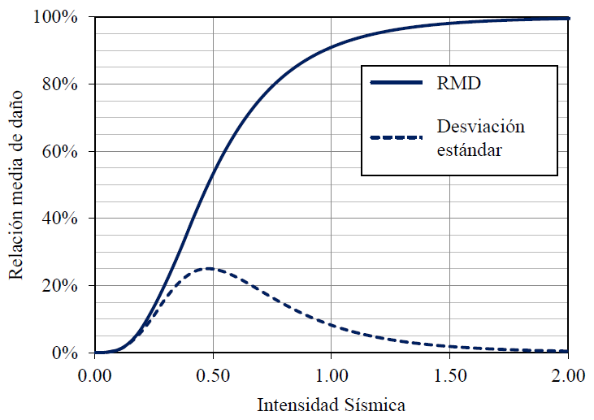{width="4.15625in" height="2.9395089676290462in"}

Figura 4. Función de vulnerabilidad típica.

En la literatura se pueden encontrar diferentes catálogos de funciones de vulnerabilidad de edificaciones. Entre las principales fuentes de información se encuentra el programa HAZUS el cual propone una metodología para desarrollar funciones de fragilidad para diferentes tipos de amenazas producida por el FEMA (Agencia Federal para el Manejo de Emergencias por sus siglas en inglés) desde el año 1997 [19]. Estas funciones de fragilidad se adaptaron y transformaron para el contexto latinoamericano mediante la asignación de pesos relativos para obtener una única función de vulnerabilidad en el marco del proyecto GAR13 [20]. Estos catálogos se realizaron para diferentes tipos de edificaciones, no necesariamente edificaciones escolares por lo que se debe tener especial cuidado al utilizarlos en este contexto. Teniendo en cuenta esto se recomienda generar funciones particulares para cada proyecto que tengan en cuenta las características constructivas de cada región. Existen diferentes guías metodológicas para la generación de funciones de vulnerabilidad. Entre estas se destacan la iniciativa para la evaluación de vulnerabilidad propuesta por el GEM (Modelo Global de Terremotos) [21], la metodología de generación de funciones propuesta por Yamin et al. [22] y el GLOSI del Banco Mundial [13] entre otros.

Alternativas de reforzamiento estructural
-----------------------------------------

Una vez se ha determinado la vulnerabilidad de cada edificación, es necesario identificar el mecanismo de colapso a partir de un análisis no lineal tridimensional como se indicó anteriormente. Esta identificación permite proponer alternativas de reforzamiento con el fin de reducir la vulnerabilidad. Existen varias limitaciones que deben tenerse en cuenta en este proceso, en particular el cumplimiento de las normativas nacionales que pueden ser más o menos exigentes según el país. Cada país tiene actualmente sus propias normativas que limitan los tipos de reforzamiento. En algunos casos las normas exigen llevar las edificaciones a niveles de desempeño equivalente al de edificaciones nuevas, esto hace que los reforzamientos en ciertos casos no sean costo-efectivos, por lo que se vuelve necesario analizar alternativas como la del reforzamiento incremental en donde la intervención se divide en fases con el fin de reducir la posibilidad de colapso en el menor tiempo y con el menor costo posible para proteger las vidas de los ocupantes [23].

Las estrategias de mitigación se pueden dividir en estructurales y no estructurales. Las estructurales son aquellas en las que se intervienen directamente los elementos estructurales y se modifica el comportamiento y los mecanismos de colapso de la edificación. Las intervenciones estructurales pueden enfocarse en rigidizar las estructuras (muros de concreto, contrafuertes, diagonales de acero, etc.) o en darle ductilidad a las estructuras (confinamiento, recubrimiento, rigidización de diafragmas, etc.). Por otro lado, las medidas de mitigación no estructurales se enfocan en asegurar un comportamiento sísmico adecuado de elementos que presenten riesgo a la vida, entre estos están el aseguramiento de cielos rasos, tuberías, estanterías y sistema HVAC (siglas en inglés de Calefacción, Ventilación y Aire Acondicionado) entre otros. Costos aproximados de este tipo de intervenciones se pueden encontrar en Valcárcel et al. [6] sin embargo se recomienda realizar presupuesto detallados para cada proyecto. Con el objetivo de asegurar niveles de calidad en los reforzamientos se recomienda seguir normativas internacionales reconocidas, entre las cuales se desatacan las siguientes:

-   ASCE 41-17 [24].

-   FEMA E-74 [25].

-   British Columbia Ministry of Education [26].

-   FEMA 308 [27].

Priorización y Planes de Mitigación del Riesgo Sísmico (PMRS)
-------------------------------------------------------------

Los planes de mitigación del riesgo deben desarrollarse a partir de los resultados de los análisis anteriores, pero también deben concertarse con las autoridades locales de cada proyecto. Es fundamental concertar estos planes con el objetivo que su aplicabilidad sea mayor. Los PMRS se deben formular siguiendo los siguientes objetivos, en orden de importancia:

1.  Reducir el riesgo de muerte o accidentes a la comunidad estudiantil.

2.  Reducir los daños en la infraestructura, contenidos, instalaciones y proteger la propiedad.

3.  Beneficiar la mayor cantidad de estudiantes.

4.  Reducir el tiempo de interrupción de los servicios escolares.

5.  Mejorar la calidad de la infraestructura.

Las edificaciones se pueden dividir en tres grupos principales: edificaciones con riesgo alto de colapso, edificaciones con alto riesgo de sufrir daños, y edificaciones con buen comportamiento. En el primer grupo están las edificaciones que presentan niveles de comportamiento cercanos al colapso para periodos de retorno bajos, en el segundo grupo están las edificaciones que presentan niveles de comportamiento cercanos al colapso para el periodo de retorno de diseño; y en el último, las edificaciones que presentan buen comportamiento para el periodo de retorno de diseño. Dependiendo de las características estructurales de las edificaciones catalogadas en cada uno de los grupos se debe proponer el reemplazo de la edificación, el reforzamiento integral, un reforzamiento estructural menor, el reforzamiento de elementos no estructurales, o ningún reforzamiento. En ciertos casos es posible evaluar un reforzamiento incremental en donde la intervención inicial es menor con el objetivo de reducir el riesgo de muerte o accidentes a la comunidad estudiantil y en una segunda fase se busque reducir daños a la infraestructura y reducir el tiempo de interrupción de los servicios. Esta opción de reforzamiento incremental permite una alternativa a la distribución de recursos, adaptándose a un primer objetivo de reducción de fatalidades o accidentes en el corto y mediano plazo, y el cumplimiento de los demás criterios en segunda instancia, lo cual fortalece la visión de intervenciones en el sector a largo plazo, especialmente desde un punto de vista de políticas públicas para la reducción del riesgo.

Una vez se tienen identificados los planes, debe realizarse una priorización de las edificaciones a intervenir con el objetivo de reducir la mayor cantidad del riesgo en el menor tiempo posible y con la menor cantidad de recursos. Para este análisis pueden utilizarse diferentes métricas como la Pérdida Máxima Esperada (PAE) o el Beneficio-Costo (B-C). Este último se ha utilizado ampliamente en la literatura en proyectos en el sector educativo para justificar las intervenciones [6,7,9,28--30]. Teniendo esto en cuenta, se utiliza una modificación al B-C con el objetivo de usarse como criterio de priorización y utilizar una métrica denominada Eficiencia-Costo (E-C) que relaciona la reducción del riesgo con la cantidad de estudiantes (matrícula), el número de estudiantes beneficiados, el costo del reforzamiento y el costo de oportunidad o interés para traer a valor presente las pérdidas [14]. Esta métrica puede entenderse como el B-C multiplicado por el número de estudiantes beneficiados. El objetivo de incluir este parámetro en la priorización es dar más importancia a las escuelas más densas, es decir aquellas que concentran más estudiantes en menores áreas, lo cual no se tiene en cuenta al considerar únicamente el criterio del B-C. Para el cálculo de la eficiencia-costo debe dividirse la reducción del riesgo por el costo de oportunidad o interés para obtener los beneficios en valor presente, dividirlo en el costo de la intervención y multiplicarlo por el número de estudiantes como se ve en la siguiente fórmula:

$EC = frac{left( text{ PAE}_{text{Actual}} - text{PAE}_{text{Estado Mitigado}} right)*No. de estudiantes beneficiados}{Costo del reforzamiento*Costo de oportunidad}$ (1)

TIPOLOGÍAS PREDOMINANTES EN EL SECTOR
=====================================

El primer paso para la reducción del riesgo en el sector es consolidar el portafolio de edificaciones. Por las características arquitectónicas de este tipo de edificaciones es común encontrar edificaciones cuyas características se repiten en diferentes países. En particular, se ha evidenciado que la mayor parte de estas edificaciones son de concreto reforzado o de mampostería [6]. En este capítulo se presentan algunas de estas tipologías comunes en el sector escolar. En primer lugar, se presentan las tipologías cuyo sistema estructural es principalmente de concreto reforzado y en después se presentan las tipologías de muros de mampostería.

Tipologías de concreto reforzado
--------------------------------

### Pórticos de concreto reforzado

En este sistema, los muros divisorios no contribuyen a la resistencia lateral o vertical de la edificación. Las divisiones pueden ser ligeras o flexibles como el Drywall por lo que su efecto en el aumento de la rigidez sería despreciable. También se puede dar el caso que las divisiones sean pesadas y rígidas como muros de mampostería, pero estas deben estar dilatadas de la estructura mediante juntas flexibles. En la Figura 5 se identifican ejemplos de este tipo de edificaciones. Estas edificaciones son usualmente de uno y dos pisos y su nivel de diseño es variable.

{width="6.5in" height="5.125in"}

Figura 5. Ejemplos de pórticos de concreto reforzado resistente a momento. (A) Edificación escolar en Perú. (B) Edificación escolar en Colombia. (C) Edificación escolar en Colombia. (D) Edificación escolar en República Dominicana. Fotos tomadas del GPSS y del archivo personal de los autores.

### Pórticos de concreto reforzado con muros de mampostería

En este sistema, los muros divisorios contribuyen a la resistencia lateral y en algunos casos vertical de la edificación. Los muros divisorios se integran al sistema estructural principal y suelen tener un comportamiento frágil. Estas edificaciones tienen alta rigidez en el rango lineal sin embargo suelen tener poca ductilidad. En la Figura 6 se identifican ejemplos de este tipo de edificaciones. Estas edificaciones suelen ser de uno y dos pisos y su nivel de diseño de bajo a medio.

{width="6.5in" height="5.066666666666666in"}

Figura 6. Ejemplos de pórticos de concreto reforzado resistente a momento con muros de mampostería integrados. (A) Edificación escolar en Nepal. (B) Edificación escolar en Colombia. (C) Edificación escolar en Colombia. (D) Edificación escolar en Colombia. Fotos tomadas del GPSS y del archivo personal de los autores.

### Pórticos de concreto reforzado con muros de mampostería generando columna corta

En este sistema, los muros divisorios contribuyen a la resistencia lateral, pero presentan una deficiencia común denominada "columna corta". Los muros divisorios se integran al sistema estructural principal y suelen tener un comportamiento frágil, sin embargo, inducen a esfuerzos cortantes excesivos a la parte libre de la columna debido a la diferencia de rigideces [31]. Estas edificaciones presentan una alta vulnerabilidad por su comportamiento frágil [29]. Este tipo de edificaciones son muy comunes en el contexto de la infraestructura escolar como se verá más adelante. En la Figura 7 se identifican ejemplos de este tipo de edificaciones. Estas edificaciones suelen ser de dos pisos y tener un nivel de diseño bajo a medio.

{width="6.5in" height="5.316666666666666in"}

Figura 7. Ejemplos de pórticos de concreto reforzado resistente a momento con muros de mampostería generando columna corta. (A) Edificación escolar en Perú. (B) Edificación escolar en El Salvador. (C) Edificación escolar en Colombia. (D) Edificación escolar en República Dominicana. Fotos tomadas del GPSS y del archivo personal de los autores.

Tipologías de mampostería
-------------------------

### Mampostería no reforzada

Son edificaciones construidos con bloque de mampostería de diferentes calidades y materiales que comparten la característica de no tener ningún tipo de confinamiento ni vertical ni horizontal. En Latinoamérica es común encontrar este tipo de edificaciones con mampostería de arcilla, maciza o con perforaciones horizontales [32]. Este tipo de edificaciones presentan una alta vulnerabilidad sísmica y su comportamiento estructural se caracteriza por ser frágil. En sismos recientes se han presentado colapsos de este tipo de edificaciones [33]. En la Figura 8 se pueden identificar algunos ejemplos de este tipo de edificaciones, las cuales suelen ser de 1 piso y tener un nivel de diseño sísmico bajo.

{width="6.5in" height="5.433333333333334in"}

Figura 8. Ejemplos de edificaciones de mampostería simple. (A) Edificación escolar en El Salvador. (B) Edificación escolar en Colombia. (C) Edificación escolar en Nepal. (D) Edificación escolar en Colombia. Fotos tomadas del GPSS y del archivo personal de los autores.

### Mampostería confinada

Son edificaciones cuyo sistema de resistencia sísmica son muros de mampostería confinados por elementos de concreto reforzado vertical y horizontal. El nivel de confinamiento tanto vertical como horizontal es variable según el país y sus normativas de construcción sismo resistente. En Colombia se tiene que los elementos confinantes no deben estar separados a más de 4 metros y deben estar en las aberturas de puertas y ventanas [18]. Estas edificaciones presentan una mayor ductilidad que las de mampostería no reforzada. En ciertos casos se pueden presentar fallas fuera del plano en este tipo de edificaciones [34]. En la Figura 9 pueden identificarse ejemplos de este tipo de edificaciones, las cuales suelen ser de uno y dos pisos y tener un nivel de diseño sísmico medio a alto.

{width="6.5in" height="5.275in"}

Figura 9. Ejemplos de edificaciones de mampostería confinada. (A) Edificación escolar en Colombia. (B) Edificación escolar en Colombia. (C) Edificación escolar en El Salvador. (D) Edificación escolar en Colombia. Fotos tomadas del GPSS y del archivo personal de los autores.

### Mampostería reforzada

El sistema de mampostería reforzada es un sistema de muros de mampostería con elementos de confinamiento interno. A diferencia del sistema de mampostería confinada, en este sistema los elementos de confinamiento son internos. Los bloques de mampostería son bloque de perforación vertical de arcilla o de concreto, usualmente de buena calidad. Este sistema se ha implementado ampliamente en países de Centroamérica como El Salvador, en donde se ha evidenciado un buen comportamiento sísmico [35]. En la Figura 10 pueden identificarse algunos ejemplos de este tipo de edificaciones. Suelen ser de uno y dos pisos y tener un nivel de diseño sísmico medio a alto.

{width="6.5in" height="5.333333333333333in"}

Figura 10. Ejemplos de edificaciones de mampostería reforzada. (A) Edificación escolar en Colombia. (B) Edificación escolar en El Salvador. (C) Edificación escolar en El Salvador. (D) Edificación escolar en construcción en El Salvador. Fotos tomadas del GPSS y del archivo personal de los autores.

+--------------------------------------------------------------------------------------+
| Caja 1. Tipologías escolares en concreto reforzado y en mampostería              |
|                                                                                      |
| Tipologías escolares principales en concreto reforzado:                          |
|                                                                                      |
| -   Pórticos de concreto reforzado.                                                  |
|                                                                                      |
| -   Pórticos de concreto reforzado con muros de mampostería.                         |
|                                                                                      |
| -   Pórticos de concreto reforzado con muros de mampostería generando columna corta. |
|                                                                                      |
| Tipologías escolares predominantes en mampostería:                               |
|                                                                                      |
| -   Mampostería no reforzada.                                                        |
|                                                                                      |
| -   Mampostería confinada.                                                           |
|                                                                                      |
| -   Mampostería reforzada.                                                           |
+--------------------------------------------------------------------------------------+

CASOS DE ESTUDIO
================

Cali, Colombia
--------------

La Universidad de los Andes, en el marco del Programa Global de Escuelas Seguras (GPSS) del Banco Mundial, realizó el acompañamiento técnico a la Alcaldía de Cali con el objetivo de diseñar un plan de intervención a corto, mediano y largo plazo para reducir la vulnerabilidad de la infraestructura educativa del Municipio de Cali frente a amenazas naturales y cambio climático en el marco de la política de Mejoramiento de Ambientes Escolares del Municipio de Cali.

En este proyecto los autores capacitaron a un grupo de ingenieros y arquitectos de la Alcaldía de Cali para realizar recolección de información de la infraestructura en todas las escuelas del municipio. A partir de la información recopilada, se compila una base de datos de infraestructura a nivel de edificación que incluye información del valor expuesto, la ocupación humana y la caracterización de su vulnerabilidad sísmica para todos los elementos del portafolio. La Figura 11 presenta la distribución espacial de 372 sedes educativas del municipio y su sistema estructural asociado.

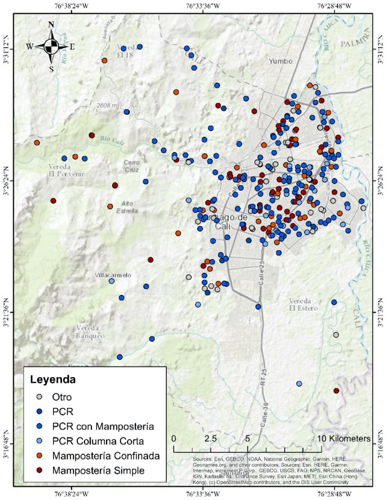{width="4.262858705161855in" height="5.516666666666667in"}

Figura 11. Distribución espacial del portafolio escolar de Cali. PCR corresponde a pórticos de concreto reforzado.

Como resultado final del procesamiento de la información y los datos del levantamiento en campo, se obtienen resultados generales con el fin de caracterizar el modelo de exposición escolar del municipio de Cali. A continuación, se muestra el resumen de la información obtenida:

-   Número total de sedes educativas: 373.

-   Número total de edificaciones: 1,224.

-   Ocupación total: 92,013.

-   Área construida: 417,220 m^2^.

-   Valoración total aproximada del portafolio: COP $900,000 millones.

-   Área promedio por estudiante: 2.97 m^2^/estudiante.

La distribución de las tipologías constructivas en la zona de estudio se presenta en la Figura 12. Se puede observar que la mayor parte de las edificaciones se clasifican en dos grandes grupos correspondientes a edificaciones de concreto reforzado y de mampostería. Las tipologías clasificadas como "Otros" son tipologías de madera, acero, tapia y prefabricados, estos no se presentan en detalle en este documento pues no son tipologías predominantes en el portafolio, para más información con respecto a esta consultar: [36].

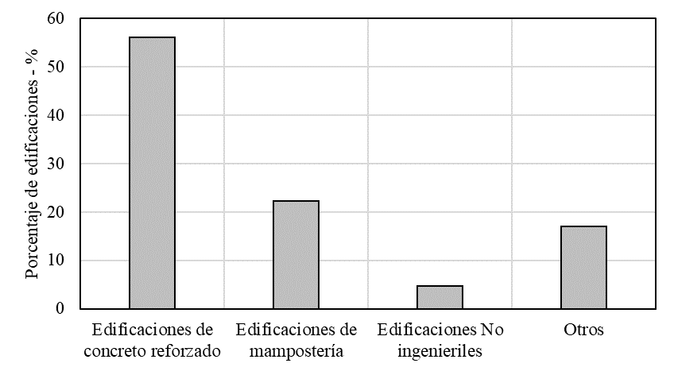{width="5.125in" height="2.822463910761155in"}

Figura 12. Distribución de tipologías constructivas en Cali.

Por otro lado, la Figura 13 presenta la distribución de los sistemas estructurales en la zona, los cuales representan un subgrupo de las tipologías constructivas predominantes identificadas. En el caso de las edificaciones de concreto reforzado, el portafolio se constituye principalmente por pórticos de concreto reforzado con muros de mampostería adosados y pórticos de concreto reforzado con muros de mampostería adosados susceptibles a falla por columna corta. Para el caso de edificaciones de mampostería, se el portafolio se constituye únicamente por edificaciones de mampostería simple y mampostería confinada.

{width="6.5in" height="2.625in"}

Figura 13. Distribución de características estructurales en Cali. (A) Tipologías de concreto reforzado. (B) Tipologías de mampostería. PCR corresponde a pórticos de concreto reforzado.

Adicionalmente, se incluye una revisión adicional de elementos estructurales que no hacen parte del sistema de resistencia sísmica, pero que ante un evento pueden ser un riesgo para la seguridad a la vida de los ocupantes, como se puede ver en la Figura 14. Para cada uno de los elementos mencionados, se define si éste existe o no, y su estado. A partir de estas calificaciones, se proponen unas intervenciones secundarias las cuales deben ser aplicadas progresivamente con el reforzamiento sísmico.

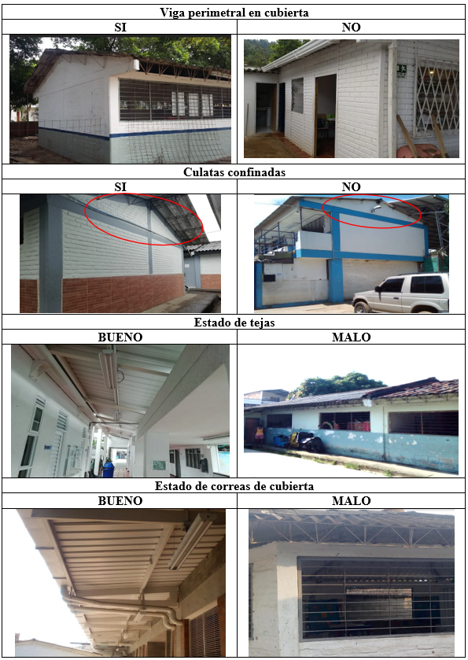{width="4.95876312335958in" height="6.992272528433946in"}

Figura 14. Parámetros estructurales complementarios [36].

Para el desarrollo del modelo probabilista de amenaza sísmica en la zona de estudio, se incluyen las fallas sísmicas con sus parámetros de sismicidad asociados, y la caracterización de los suelos de acuerdo con los resultados del Estudio de Microzonificación Sísmica de Santiago de Cali realizada en 2006. A partir de este modelo es posible obtener también mapas probabilistas de aceleración en superficie para diferentes periodos de retorno y diferentes periodos estructurales. En la Figura 15 se presentan las fuentes superficiales y corticales, un escenario del catálogo de eventos estocásticos y el mapa probabilista de aceleración del terreno para un periodo de retorno de 475 años.

{width="4.739583333333333in" height="6.255091863517061in"}

Figura 15. Modelo de amenaza sísmica para Cali. (A) Fuentes profundas. (B) Fuentes superficiales. (C) Ejemplo de escenario del catálogo. (D) Mapa de aceleración probabilista en el terreno para 475 años de periodo de retorno. Mapas tomados de CIMOC-Uniandes [36].

Para el desarrollo del modelo de vulnerabilidad se realizaron modelaciones no lineales de las tipologías predominantes con las cuales se obtuvieron los parámetros de demanda sísmica mediante un análisis incremental dinámico. Las funciones de vulnerabilidad de las tipologías predominantes para un nivel de diseño bajo se presentan en la Figura 16. Estas funciones no son directamente comparables, dado que representan edificaciones con periodos estructurales diferentes, y por ende niveles de amenaza distintos. Sin embargo, permiten identificar el nivel de vulnerabilidad asociado a las tipologías analizadas.

{width="6.3805555555555555in" height="3.3604166666666666in"}

Figura 16. Ejemplo de funciones de vulnerabilidad utilizadas para la evaluación del riesgo del Cali. Figura adaptada de CIMOC-Uniandes [36].

Con la información indicada anteriormente, se evaluó el desempeño y las perdidas esperadas ante un evento sísmico en un periodo de retorno dado. Los resultados del riesgo sísmico para el portafolio escolar del municipio en las condiciones actuales se muestran en Figura 17. En esta, se puede observar que las pérdidas máximas probables para un periodo de retorno de 500 años son del orden de $250,000 millones COP mientras que para un periodo de retorno de 1000 años son del orden de $300,000 millones COP. La magnitud de estos resultados demuestra la necesidad de realizar un reforzamiento estructural que permita reducir la magnitud de estas pérdidas.

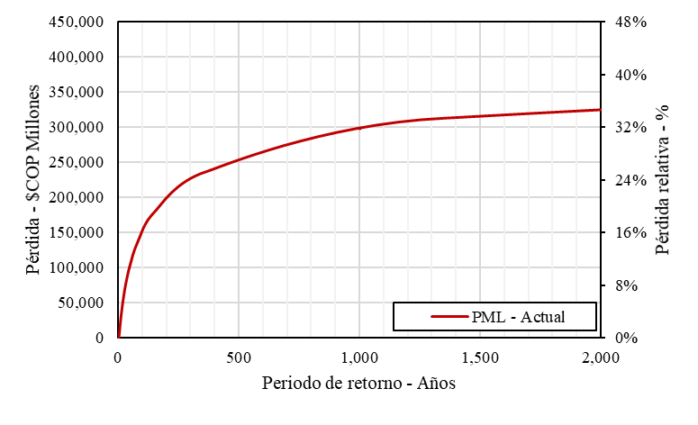{width="5.167361111111111in" height="3.147222222222222in"}

Figura 17. Curva de pérdida máxima probable para el portafolio escolar en Cali.

Además de las pérdidas económicas indicadas anteriormente, el reforzamiento estructural es necesario dada la alta vulnerabilidad de tipologías presentes en la zona de estudio, que un 54% de las edificaciones fueron construidas antes de 1986 año en el cual se hizo la primera norma de sismo resistencia en el país, y que de acuerdo con un análisis de desempeño sísmico realizado para un periodo de retorno de 475 años un 80% de las edificaciones quedan en prevención al colapso [37]. Por tal motivo, se realizaron las propuestas de reforzamientos estructurales y adecuaciones del portafolio escolar mediante una estrategia de intervención progresiva de las instituciones. Para esto se generaron los siguientes programas y estrategias de intervención con el fin de reducir el riesgo sísmico del portafolio escolar:

-   Programa 1 - Demolición y construcción de aulas temporales: Se incluyen edificaciones con nivel de diseño sísmico pobre y sistemas estructurales precarios o no ingenieriles, cuyas intervenciones estructurales son muy invasivas, por lo que se recomienda la reconstrucción. Se busca proteger la vida y el riesgo de accidentes a los ocupantes con estos reemplazos.

-   Programa 2 - Reforzamiento prioritario: Se incluyen edificaciones de pórticos de concreto reforzado y mampostería simple con nivel de diseño bajo cuyo reforzamiento sísmico es económicamente viable. Se busca proteger la vida y reducir el tiempo de interrupción del servicio.

-   Programa 3 - Adecuaciones contingentes: Se incluyen edificaciones de pórticos de concreto reforzado, mampostería simple y mampostería confinada con nivel de diseño bajo o medio cuyo reforzamiento sísmico es menor. Se busca reducir el tiempo de interrupción del servicio y mejorar la infraestructura.

-   Programa 4 - Mejoramiento y adecuaciones: Se incluyen las edificaciones con nivel de diseño sísmico medio o alto que cumplan con la norma, cuya intervención es principalmente en elementos no estructurales y adecuaciones. Se busca mejorar la infraestructura educativa.

La Tabla 4 resume el número de edificaciones e inversión requerida para cada uno de los programas descritos para el portafolio. Como se puede identificar, se incluyen intervenciones en todo el portafolio, aunque en algunos casos se consideran intervenciones menores de adecuación y mejoramiento.

Tabla 4. Planes de mitigación del riesgo en Cali [36].

+------------------------------+-----------------------------------------------------+--------------------------------------------+-----------+
| Programa de intervención | Número de edificaciones                         | Costo aproximado total de intervención |           |
|                              |                                                     |                                            |           |
|                              |                                                     | (COP$ millones)                       |           |
+==============================+=====================================================+============================================+===========+
| Programa 1                   | Programa de demolición y                            | 313                                        | $220,000 |
|                              |                                                     |                                            |           |
|                              | aulas temporales                                    |                                            |           |
+------------------------------+-----------------------------------------------------+--------------------------------------------+-----------+
| Programa 2                   | Programa de reforzamiento prioritario               | 100                                        | $85,000  |
+------------------------------+-----------------------------------------------------+--------------------------------------------+-----------+
| Programa 3                   | Programa de adecuaciones contingentes               | 752                                        | $330,000 |
+------------------------------+-----------------------------------------------------+--------------------------------------------+-----------+
| Programa 4                   | Programa de mejoramiento, ampliaciones y reposición | 58                                         | $3,000   |
+------------------------------+-----------------------------------------------------+--------------------------------------------+-----------+
| Total                    | 1,223                                           | $638,000                              |           |
+------------------------------+-----------------------------------------------------+--------------------------------------------+-----------+

Los resultados del riesgo sísmico para el portafolio escolar del municipio luego de aplicar el reforzamiento planteado se muestran en Figura 18. Se puede observar que para un periodo de retorno de 500 años se presenta una reducción del riesgo de más del 50%. Es importante resaltar que estas intervenciones no aseguran un nivel de riesgo cero, sin embargo, reducen significativamente la susceptibilidad de daño y la probabilidad de heridos. Este riesgo residual puede ser gestionado mediante cobertura financieras, sistema de alerta temprana y planes de emergencias entre otros.

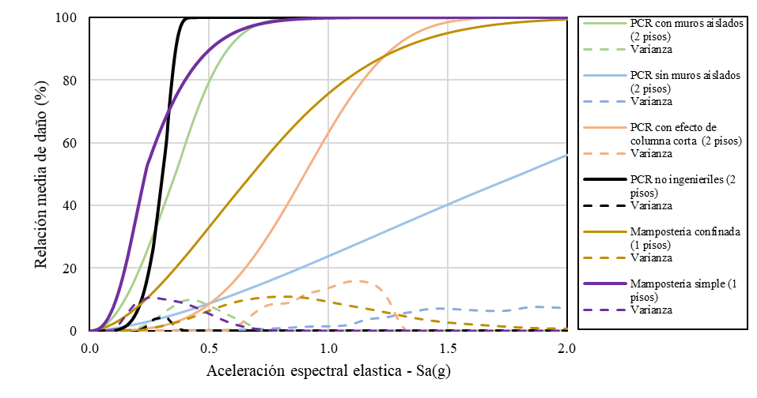{width="5.167361111111111in" height="3.147222222222222in"}

Figura 18. Curva de pérdida máxima probable para el portafolio escolar en el estado actual vs. estado reforzado en Cali

Por último, con el objetivo de priorizar los recursos se utilizó el criterio de eficiencia costo indicado en secciones anteriores. A partir de éste es posible identificar el orden óptimo de intervención de las escuelas con el objetivo de maximizar el número de estudiantes beneficiados como se presenta en la Figura 19.

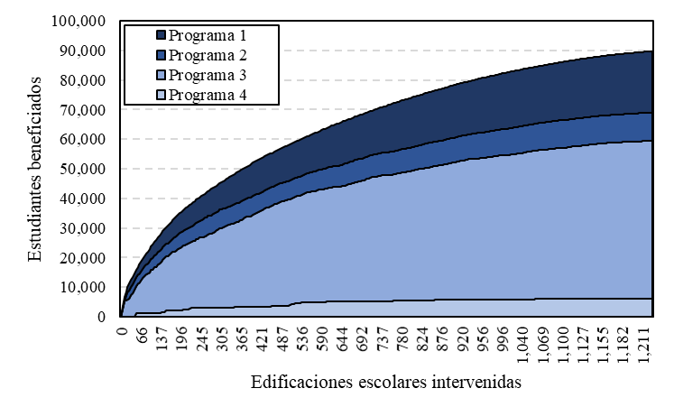{width="4.980555555555555in" height="3.073611111111111in"}

Figura 19. Priorización de intervenciones por programas en Cali.

Valle de Aburrá, Colombia
-------------------------

Mediante el convenio de asociación 1108 de 2016 entre la Universidad de los Andes y el Área Metropolitana del Valle de Aburra (AMVA) se realizó el estudio de la vulnerabilidad y riesgo sísmico de las edificaciones del sector escolar en los diez municipios del Valle de Aburrá. El objetivo principal fue identificar las intervenciones estructurales y no estructurales requeridas en cada una de estas edificaciones, y con base en esto diseñar un Plan de Mitigación del Riesgo Sísmico como parte del Plan Metropolitano del Riesgo Sísmico desarrollado por el AMVA. El plan incluía, entre otras cosas, las propuestas preliminares de intervención, la información básica para la eventual contratación de las obras identificadas, el presupuesto aproximado requerido y una programación tentativa de actividades para la contratación y ejecución de las obras.

En este proyecto, con el fin de seleccionar las edificaciones de interés se realizó una depuración de las bases de datos oficiales proporcionadas por las entidades gubernamentales correspondientes, tales como las secretarías de educación de los diferentes municipios y el AMVA. A partir de esto se obtuvo una base de datos con los colegios y escuelas públicas y privadas en zonas urbanas de niveles de educación básica primaria, básica secundaria, y educación media. Dentro de la información recopilada se encuentran los registros oficiales del número de estudiantes matriculados, el tipo de servicio (público y privado), así como los niveles de educación impartida. A partir de la información recopilada en registros oficiales fue posible realizar una caracterización general del sector para obtener estadísticas de las edificaciones expuestas, identificando que el inventario de centros educativos se conforma por un total de 460 colegios públicos y 227 colegios privados, para un total de 687 sedes educativas municipales.

En este estudio se consideró únicamente una muestra de 200 escuelas públicas que fueron inspeccionadas. Se seleccionaron únicamente escuelas públicas dado que se enfoca a la elaboración de planes de mitigación a cargo de los gobiernos nacionales y locales. En la Figura 20 se presenta la distribución espacial de las instituciones educativas del Valle de Aburrá.

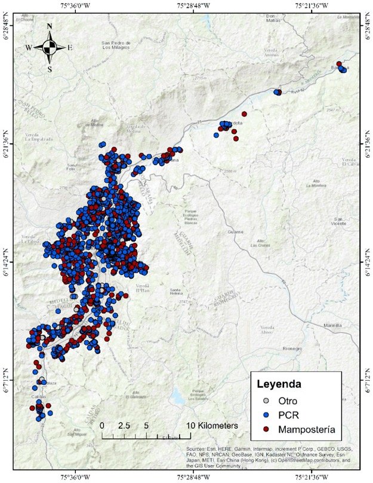{width="4.153389107611549in" height="5.375in"}

Figura 20. Distribución de instituciones educativas en los municipios del Valle de Aburrá.

Se realizaron visitas de campo con el objetivo de identificar el sistema estructural de las instituciones educativas públicas ubicadas en las zonas urbanas de los municipios del Valle de Aburrá e identificar las tipologías constructivas dominantes. A continuación, se muestra el resumen de la información obtenida para la muestra de escuelas públicas:

-   Número total de sedes educativas: 200.

-   Número total de edificaciones: 883.

-   Ocupación total: 142,778.

-   Área construida: 669,630 m^2^.

-   Valoración total aproximada del portafolio: COP $1,625,000 millones.

-   Área promedio por estudiante: 4.69 m^2^/estudiante.

En la Figura 21 presenta la distribución de las tipologías constructivas identificadas en las inspecciones visuales, donde se observa que los sistemas dominantes son las edificaciones construidas en concreto reforzado y en mampostería.

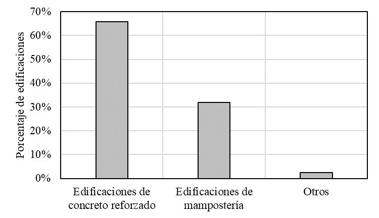{width="4.625in" height="2.6641437007874016in"}

Figura 21. Distribución de tipologías constructivas identificadas en campo en el Valle de Aburrá.

Además, se observa que el mayor porcentaje de estructuras son construidas en pórticos de concreto reforzado con muros de mampostería, pórticos de concreto reforzado con muros de mampostería que generan columna corta y edificaciones de mampostería no reforzada, donde este último caso representa un porcentaje importante de las edificaciones del portafolio del sector educativo. La Figura 22 presenta la distribución relativa de las tipologías constructivas.

{width="6.5in" height="2.5833333333333335in"}

Figura 22. Distribución de sistemas estructurales en el Valle de Aburrá. (A) Tipologías de concreto reforzado. (B) Tipologías de mampostería. PCR corresponde a pórticos de concreto reforzado.

En cuanto a las condiciones desfavorables observadas en las edificaciones durante el levantamiento en campo, se encontró que las edificaciones visitadas presentaban agrietamientos, asentamientos, baja calidad de materiales, deflexiones, entre otras. En la Figura 23 se presenta un registro fotográfico representativo de las condiciones desfavorables observadas.

{width="6.316666666666666in" height="1.6833333333333333in"}

Figura 23. Condiciones desfavorables observadas en algunas edificaciones en el Valle de Aburrá. (A) Agrietamiento de muros. (B) Pérdida de concreto de recubrimiento. (C) Deficiencias constructivas. (D) Deficiencias de diseño.

El siguiente paso fue el desarrollo del modelo probabilista de amenaza sísmica en la zona del Valle de Aburrá. Para esto, se identificaron las fuentes sísmicas de la zona de estudio a partir de los resultados indicados en el estudio de Armonización de la microzonificación sísmica de los municipios del Valle de Aburrá [38]. A partir de las fuentes sísmicas, se desarrolló un catálogo estocástico de eventos para la evaluación probabilista del riesgo y se desarrollaron mapas probabilistas para diferentes periodos de retorno y diferentes periodos estructurales. En la Figura 24 se presentan las fuentes sísmicas superficiales y corticales definidas, así como un escenario del catálogo y el mapa probabilista de aceleración del terreno para un periodo de retorno de 475 años.

{width="5.125in" height="6.791666666666667in"}

Figura 24. Modelo de amenaza sísmica para el Valle de Aburrá. (A) Fuentes profundas (modelo nacional). (B) Fuentes superficiales. (C) Ejemplo de escenario del catálogo. (D) Mapa de aceleración probabilista en el terreno para 475 años de periodo de retorno. Mapas tomados de CIMOC-Uniandes [38].

Las funciones de vulnerabilidad de las tipologías predominantes fueron desarrolladas de acuerdo con la metodología descrita en la sección 2.2.4, y se presentan en la Figura 25. Estas funciones no son directamente comparables, dado que representan edificaciones con periodos estructurales diferentes, y por ende niveles de amenaza distintos. Sin embargo, permiten identificar el nivel de vulnerabilidad asociado a las tipologías analizadas.

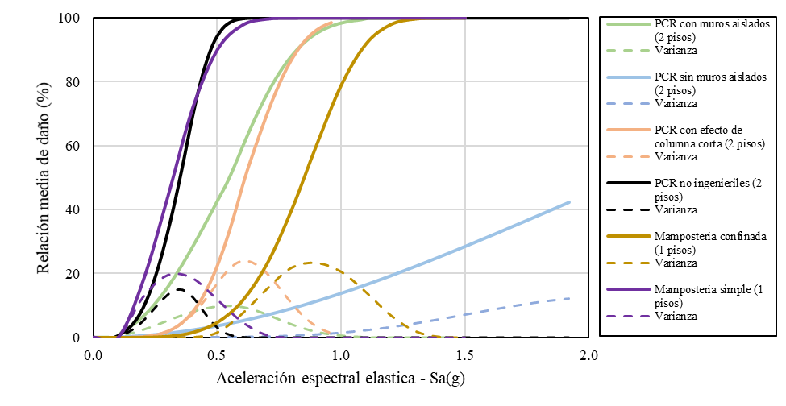{width="6.500694444444444in" height="3.3604166666666666in"}

Figura 25. Ejemplo de funciones de vulnerabilidad utilizadas para la evaluación del riesgo del Valle de Aburrá. Figura adaptada de CIMOC-Uniandes [38].

Posteriormente se evaluaron las pérdidas probables esperadas ante un evento sísmico en un periodo de retorno dado. Los resultados del riesgo sísmico para el portafolio escolar del municipio en las condiciones actuales se muestran en Figura 26. En esta se observa que para un periodo de retorno de 500 años se esperan pérdidas máximas probables del orden de $450,000 millones COP mientras que para un periodo de retorno de 1,000 años se esperan pérdidas del orden de $600,000 millones COP. Al igual que en el caso de estudio anterior, se establece que es necesario realizar un programa de reforzamiento estructural que reduzca la magnitud de las pérdidas.

{width="5.513888888888889in" height="3.073611111111111in"}

Figura 26. Curva de pérdida máxima probable para el portafolio escolar en el Valle de Aburrá.

Adicional a lo anterior, el reforzamiento estructural es necesario dada la necesidad de brindar la total seguridad a los estudiantes y prevenir que se vea afectada la vida de cada uno de ellos. Por tal motivo, se realizaron reforzamientos estructurales del portafolio escolar con una estrategia de intervención progresiva de las instituciones. Por lo tanto, se plantearon las siguientes estrategias de intervención, basadas en las agrupaciones indicadas anteriormente:

-   Programa 1 -- Sustitución de edificaciones de alto riesgo de colapso.

-   Programa 2 -- Reforzamiento integral de edificaciones con bajo potencial de daño.

-   Programa 3 -- Reforzamiento contingente especial de edificaciones con alto riesgo de sufrir daños.

-   Programa 4 -- Reforzamiento integral de edificaciones con alto riesgo de sufrir daños.

Además, para cada una de las tipologías de edificaciones que presentan niveles medios o altos de vulnerabilidad se proponen esquemas y opciones generales de reforzamiento estructural que permitan la reducción considerable de la vulnerabilidad sísmica. A manera de ejemplo, se presentan alternativas de reforzamiento de edificaciones de concreto reforzado que presenten columna corta y de mampostería simple en la Figura 27. Estas alternativas de reforzamiento buscan eliminar el problema de columna corta y darle rigidez a la estructura para el caso del ejemplo de concreto y de darle ductilidad a la edificación en el caos de mampostería simple. Este tipo de soluciones se desarrollaron para cada una de las tipologías predominantes, para mayor información consultar [36].

{width="6.5in" height="2.2083333333333335in"}

Figura 27. Esquemas generales de reforzamiento estructural. (A) Reforzamiento de pórticos de concreto. (B) Reforzamiento de edificaciones de mampostería [39].

La Tabla 5, resume el número de edificaciones e inversión requerida para cada uno de los programas descritos para el portafolio.

Tabla 5. Planes de mitigación del riesgo en el Área Metropolitana del Valle de Aburrá [39].

+------------------------------+--------------------------------------------------------------------------------+--------------------------------------+---------+
| Programa de intervención | Número de edificaciones                                                    | Costo aproximado de intervención |         |
|                              |                                                                                |                                      |         |
|                              |                                                                                | (COP$ millones)                 |         |
+------------------------------+--------------------------------------------------------------------------------+--------------------------------------+---------+
| Programa 1                   | Sustitución de edificaciones de alto riesgo de colapso                         | 162                                  | 350,000 |
+------------------------------+--------------------------------------------------------------------------------+--------------------------------------+---------+
| Programa 2                   | Reforzamiento integral de edificaciones con bajo potencial de daño             | 86                                   | 30,000  |
+------------------------------+--------------------------------------------------------------------------------+--------------------------------------+---------+
| Programa 3                   | Reforzamiento contingente especial de edificaciones con alto potencial de daño | 238                                  | 70,000  |
+------------------------------+--------------------------------------------------------------------------------+--------------------------------------+---------+
| Programa 4                   | Reforzamiento integral de edificaciones con alto potencial de daño             | 333                                  | 200,000 |
+------------------------------+--------------------------------------------------------------------------------+--------------------------------------+---------+
| Total                    | 819                                                                        | 650,000                          |         |
+------------------------------+--------------------------------------------------------------------------------+--------------------------------------+---------+

Teniendo en cuenta las estrategias de mitigación del riesgo y los reforzamientos estructurales implementados en cada una de las tipologías constructivas, en la Figura 28 se presentan los resultados del riesgo sísmico para el portafolio escolar del municipio. Se puede identificar que la reducción del riesgo en este caso es mayor a la reducción identificada para el caso de Cali, bajando las pérdidas para un periodo de retorno de 1,000 años alrededor del 20% de las pérdidas en el estado actual.

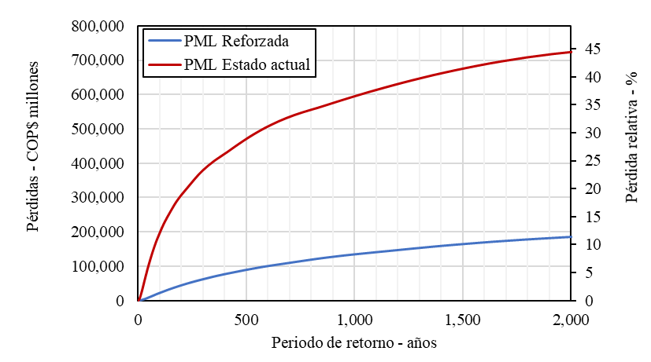{width="5.513888888888889in" height="3.073611111111111in"}

Figura 28. Curva de pérdida máxima probable para el portafolio escolar en el estado actual vs. estado reforzado en el Valle de Aburrá.

Por último, con el objetivo de priorizar los recursos se utilizó el criterio de eficiencia costo indicado anteriormente. A partir de éste es posible ordenar las intervenciones con el objetivo de maximizar el número de estudiantes beneficiados. En la Figura 29 se presenta la reducción de las Pérdidas Anuales esperadas si se sigue el criterio de priorización de eficiencia. En esta gráfica se observa que, a diferencia del caso de Cali, se tiene una reducción mayor para las primeras escuelas mostrando que el riesgo se concentra en unas tipologías y no se distribuye en todo el portafolio. Esto permite que los recursos se utilicen de forma eficiente, reduciendo la mayor cantidad de riesgo para las limitaciones de recursos económicos existentes.

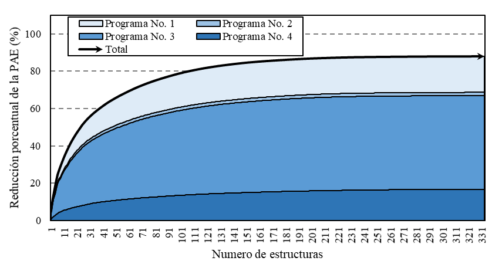{width="5.700694444444444in" height="3.0805555555555557in"}

Figura 29. Priorización de intervenciones por programas en el Valle de Aburrá.

CONCLUSIONES
============

Existen diferentes metodologías para el desarrollo de planes de mitigación del riesgo en el sector escolar. Para esto el primer paso es desarrollar una base de datos con información suficiente para caracterizar el portafolio de infraestructura expuesta. Este paso es uno de los más importantes pues su resolución y calidad determinarán la resolución y la calidad del plan de mitigación del riesgo. Se han identificado diferentes tipologías de concreto reforzado y mampostería en diferentes partes del mundo con deficiencias constructivas y estructurales similares. Entre estas se destacan las edificaciones de pórticos de concreto reforzado, de pórticos de concreto reforzado con muros de mampostería y pórticos de concreto reforzado con muros de mampostería generando columna corta. En las edificaciones de muros de mampostería se destacan las edificaciones de mampostería simple, mampostería confinada y mampostería reforzada. La documentación de estas deficiencias y también de técnicas de reforzamiento permite sentar las bases para futuros proyectos en los cuales se analicen edificaciones similares.

Una vez se identifican el portafolio y las tipologías principales se debe desarrollar una evaluación del riesgo sísmico en el estado actual y a partir de este diseñar un sistema de reforzamiento sísmico para las tipologías vulnerables más relevantes o representativas. Una vez se tienen identificadas estas medidas se debe evaluar el riesgo en un escenario mitigado y a partir de esto diseñar planes de mitigación del riesgo ajustados a las limitaciones de cada caso de estudio. En este documento se presentan dos casos de estudio en Colombia, el primero en Cali y el segundo en el Valle de Aburrá. Se puede identificar que la reducción del riesgo para las estrategias de mitigación del Cali lleva a una reducción menor que el caso del Valle de Aburrá, reduciendo el riesgo en el primer caso al 50% del riesgo original y en el segundo al 20%. Así mismo, es posible identificar a partir de las gráficas de priorización que el riesgo en el portafolio de Cali se distribuye en todo el portafolio mientras que en el caso del Valle de Aburrá se concentra en alrededor de la mitad de las escuelas. Como se puedo identificar, cada caso presentado tiene sus particularidades sin embargo es posible identificar que el desarrollo comparte elementos comunes, en particular deficiencias en las tipologías constructivas y medidas de reforzamiento aplicables.

Existe una gran cantidad de trabajo por desarrollar en proyectos similares a los casos de estudio presentados. Como se puedo evidenciar, existen limitaciones de esta metodología con respecto a incertidumbres en los modelos de amenaza, vulnerabilidad y exposición que deben ser estudiados a mayor profundidad. Por otro lado, es necesario ampliar el espectro de amenazas e incluir otro tipo de eventos, entre ellos eventos de carácter hidrometeorológico como los huracanes y las inundaciones. Adicionalmente es necesario entender las métricas de riesgo y definir unos parámetros indicativos con el objetivo limitar posibles errores en los procedimientos. Por último, es necesario identificar y evaluar la vulnerabilidad de tipologías vulnerables menos recurrentes como las de acero o madera con el objetivo de desarrollar planes a menor escala.

Los resultados de los casos de estudio presentados como ejemplo son el punto de partida para la definición concreta de planes concertados con las autoridades locales y/o nacionales para su implementación. A partir de estos, y basados en un presupuesto disponible, es posible definir y listar en orden de importancia o relevancia, las intervenciones que se deberán priorizar para maximizar la reducción del riesgo con los recursos limitados. Adicionalmente, se deberán considerar factores como procesos constructivos que puedan implementarse a mayor escala, esquemas de contratación según especialidad o tipo de intervención, tipificación de las intervenciones buscando alcanzar un nivel de reducción de riesgo definido, pero remitiendo la adaptabilidad a las condiciones particulares de cada edificación, entre otros.

+------------------------------------------------------------------------------------------------------------------------------------------------------------------------------------------------------------------------------------------------------------------+
| PUNTOS CLAVE                                                                                                                                                                                                                                                 |
|                                                                                                                                                                                                                                                                  |
| 1.  Las edificaciones de pórticos de concreto, pórticos de concreto con muros de mampostería y pórticos de concreto con muros de mampostería generando columna corta son las tipologías escolares predominantes de concreto reforzado.                           |
|                                                                                                                                                                                                                                                                  |
| 2.  Las edificaciones de muros de mampostería no reforzada, mampostería confinada y mampostería reforzada son las tipologías escolares predominantes de mampostería.                                                                                             |
|                                                                                                                                                                                                                                                                  |
| 3.  Se debe analizar el estado de la infraestructura actual mediante un análisis de riesgo, incluyendo los módulos de amenaza, exposición y vulnerabilidad.                                                                                                      |
|                                                                                                                                                                                                                                                                  |
| 4.  Se recomienda que el modelo de exposición sea a nivel de edificación. Cada elemento del modelo debe contar con información estructural suficiente para caracterizar su comportamiento estructural.                                                           |
|                                                                                                                                                                                                                                                                  |
| 5.  Se deben identificar los mecanismos de colapso de las edificaciones y generar sistemas de reforzamiento que sean aplicables a gran escala en edificaciones con comportamiento estructural similar.                                                           |
|                                                                                                                                                                                                                                                                  |
| 6.  Se deben plantear estrategias de intervención particulares para las tipologías que incluyan el reemplazo de las edificaciones, reforzamientos integrales, reforzamientos incrementales, reforzamientos en elementos no estructurales o adecuaciones menores. |
|                                                                                                                                                                                                                                                                  |
| 7.  Las intervenciones deben ser priorizadas utilizando criterios adecuados como la eficiencia costo con el objetivo de beneficiar la mayor cantidad de estudiantes reduciendo el mayor riesgo posible.                                                          |
+------------------------------------------------------------------------------------------------------------------------------------------------------------------------------------------------------------------------------------------------------------------+

+-----------------------------------------------------------------------------------------------------------------------------------------------------------------------------------------------------------------------------------------------------+
| RECOMENDACIÓNES PARA TOMAR DECISIONES                                                                                                                                                                                                           |
|                                                                                                                                                                                                                                                     |
| 1.  El modelo de exposición determina la calidad de los planes de mitigación, es necesario que el modelo tenga una resolución mínima a nivel de escuela y una resolución ideal a nivel de edificación.                                              |
|                                                                                                                                                                                                                                                     |
| 2.  La evaluación del riesgo sísmico en el estado actual y mitigado deben evaluarse utilizando la misma metodología, modelos de amenaza y modelos de exposición con el objetivo que sean comparables.                                               |
|                                                                                                                                                                                                                                                     |
| 3.  La participación de entidades gubernamentales en el desarrollo del plan de mitigación es esencial. Un adecuado entendimiento del componente técnico e identificación anticipada de limitaciones permitirán una implementación exitosa del plan. |
|                                                                                                                                                                                                                                                     |
| 4.  Se debe tener en cuenta que los ciclos de gobierno particulares pueden afectar el desarrollo y la implementación de los planes diseñados.                                                                                                       |
+-----------------------------------------------------------------------------------------------------------------------------------------------------------------------------------------------------------------------------------------------------+

CONFLICTO DE INTERESES

Los autores no declaran conflicto de intereses.

AGRADECIMIENTOS {#agradecimientos-1 .list-paragraph}
===============

Los autores agradecen en primer lugar al Banco Mundial y en particular al equipo de trabajo del Programa Global de Escuelas Seguras (GPSS) por impulsar iniciativas de reducción del riesgo en el sector escolar. Así mismo, agradecen a la Alcaldía de Santiago de Cali por el desarrollo de la Asistencia técnica para el diseño de una estrategia de intervención y un plan de inversión para la reducción de la vulnerabilidad sísmica de edificaciones educativas en el municipio de Cali, y al Área Metropolitana del Valle de Aburrá por el desarrollo conjunto del Convenio de Asociación 1108 del 2016. Adicionalmente, los agradecimientos se extienden a los integrantes del Centro de Investigación en Materiales y Obras Civiles de la Universidad de los Andes que participaron en el desarrollo de los proyectos mencionados anteriormente.

IDENTIFICACIÓN DEL AUTOR {#identificación-del-autor-1 .list-paragraph}
========================

Rafael Fernández <https://orcid.org/0000-0002-2585-1958>

Luis Yamin <https://orcid.org/0000-0002-6533-5480>

Juan Carlos Reyes <https://orcid.org/0000-0003-0690-2956>

Angie García <https://orcid.org/0000-0001-5701-3329>

Gustavo Fuentes <https://orcid.org/0000-0002-0916-1885>

Juan Echeverry <https://orcid.org/0000-0001-6537-6381>

BIBLIOGRÁFIA

1.  ICC (International Code Council). (2017). *2018 International Building Code*. International Code Council, Incorporated.

2.  EERI (Earthquake Engineering Research Institute). (2019). *Concrete Buildings Damaged in Earthquakes*. Recuperado de <https://j.mp/3jtiOpm>

3.  Chen, H., Xie, Q., Lan, R., Li, Z., Xu , C., & Yu, S. (2017). Seismic damage to schools subjected to Nepal earthquakes, 2015. *Natural Hazards*, 88(1), 247--84. <https://doi.org/10.1007/s11069-017-2865-8>

4.  GEER. (2017). Geotechnical engineering reconnaissance of the 19 September 2017 mw 7.1 Puebla-Mexico City earthquake (September). *Geotechnical Extreme Events Reconnaissance Association*. <https://doi.org/10.18118/g6jd46>

5.  GEER. (2016). GEER-ATC earthquake reconnaissance April 16th 2016, Muisne, Ecuador. *Geotechnical Extreme Events reconnaissance Association Report* GEER-049. 604. Recuperado de <https://j.mp/3hprJ9k>

6.  Valcárcel, J.A., Mora, M.G., Cardona, O.D., Pujades, L.G., Barbat, A.H., & Bernal, G.A. (2013) Methodology and applications for the benefit cost analysis of the seismic risk reduction in building portfolios at broadscale. *Natural Hazards*, 69(1), 845--68. <https://doi.org/10.1007/s11069-013-0739-2>

7.  Mora. M.G., Valcárcel, J. A., Cardona, O.D., Pujades, L. G., Barbat, A. H., & Bernal, G. A. (2015) Prioritizing interventions to reduce seismic vulnerability in school facilities in Colombia. *Earthquake Spectra*, 31(4), 2535--52. <https://doi.org/10.1193/040412EQS151T>

8.  Chrysostomou, C. Z., Kyriakides, N., Papanikolaou. V. K., Kappos, A. J., Dimitrakopoulos, E. G., & Giouvanidis, A. I. (2015). Vulnerability assessment and feasibility analysis of seismic strengthening of school buildings. *Bulletin of Earthquake Engineering*, 13, 3809--40. <https://doi.org/10.1007/s10518-015-9791-5>

9.  Jaimes, M. A., & Niño, M. (2017) Cost-benefit analysis to assess seismic mitigation options in Mexican public-school buildings. *Bulletin of Earthquake Engineering*, 15(9), 3919--42. <https://doi.org/10.1007/s10518-017-0119-5>

10. Samadian, D., Ghafory-Ashtiany, M., Naderpour, H., & Eghbali, M. (2019). Seismic resilience evaluation based on vulnerability curves for existing and retrofitted typical RC school buildings. *Soil Dynamics and Earthquake Engineering*, 127, 105844. <https://doi.org/10.1016/j.soildyn.2019.105844>

11. Amini Hosseini, K., & Izadkhah, Y.O. (2020). From "Earthquake and safety" school drills to "safe school-resilient communities": A continuous attempt for promoting community-based disaster risk management in Iran. *International Journal of Disaster Risk Reduction*, 45,101512. <https://doi.org/10.1016/j.ijdrr.2020.101512>

12. World Bank, Universidad de los Andes, UCL. (2019). *Global Library of School Infrastructure - Taxonomy Guide. Global Program for Safer Schools*. Recuperado de <https://gpss.worldbank.org/index.php/en/node/571>

13. World Bank, Universidad de los Andes, UCL. (2019). *Global Library for School Infrastructure - Fragility and Vulnerability Assessment Guide. Global Program for Safer Schools*. Recuperado de <https://gpss.worldbank.org/index.php/en/glosi/vulnerability>

14. Yamin, L., Ghesquiere, F., Cardona, O., & Ordaz, M. (2013). *Modelación probabilista para la gestión del riesgo de desastre, El caso de Bogotá, Colombia*. Banco Mundial, Universidad de los Andes.

15. Yang, T. Y. (2013). Assessing seismic risks for new and existing buildings using performance-based earthquake engineering (PBEE) methodology. *Handbook of Seismic Risk Analysis and Management of Civil Infrastructure Systems*, 307--33. <https://doi.org/10.1533/9780857098986.3.307>

16. Baker, J. W. (2013). *Introduction to Probabilistic Seismic Hazard Analysis*. White Paper version 201.

17. Yamin. L. E, Reyes, J. C, Rueda, R., Prada, E., Rincón, R., Herrera, C., et al. (2018). Practical seismic microzonation in complex geological environments. *Soil Dynamics and Earthquake Engineering*, 114, 480--94. <https://doi.org/10.1016/j.soildyn.2018.07.030>

18. AIS (Asociación Colombiana de Ingeniería Sísmica). (2010). *Norma de construcción Sismo Resistente - NSR10*. 530--827. Bogotá: Asociación Colombiana de Ingeniería Sísmica

19. FEMA (Federal Emergency Management Agency). (2017). *Hazus: FEMA's Methodology for Estimating Potential Losses from Disasters*. Recuperado de https://www.fema.gov/hazus-mh-user-technical-manuals

20. Yamin, L. E., Hurtado, A. I, Barbat, A.H., & Cardona, O.D. (2014). Seismic and wind vulnerability assessment for the GAR-13 global risk assessment. *International Journal of Disaster Risk Reduction*, 10(PB), 452--60. <https://doi.org/10.1016/j.ijdrr.2014.05.007>

21. D'Ayala, D., Meslem, A., Vamvatsikos, D., Porter, K., Rossetto, T., Crowley, H., et al. (2013). Guidelines for Analytical Vulnerability Assessment - Low/Mid-Rise. *Global Earthquake Model Technical Report.* <https://doi.org/10.13117/GEM.VULN-MOD.TR2014.12>

22. Yamin, L.E., Hurtado, A., Rincon, R., Dorado, J. F., & Reyes, J. C. (2017) Probabilistic seismic vulnerability assessment of buildings in terms of economic losses. *Engineering Structures*, 138, 30 8--23. <https://doi.org/10.1016/j.engstruct.2017.02.013>

23. Aroquipa, H., Rincón, R., & Fernandez, R. (2017). Evaluación de alternativas de reforzamiento sísmico incremental para edificaciones escolares características en el Perú. En *VIII Congreso Nacional de Ingeniería Sísmica*. Barranquilla, Colombia.

24. American Society of Civil Engineers, Structural Engineering Institute. (2013*). Seismic evaluation and retrofit of existing buildings* (41-13). 1275 p.

25. FEMA (Federal Emergency Management Agency) & ATC (Applied Technology Council). (2012). *Reducing the risks of nonstructural earthquake damage -- A practical guide.* FEMA. 885 p.

26. British Columbia University. (2017). *The Seismic Retrofit Guidelines SGR-3*.

27. ATC (Applied Technology Council). (1998). *Repair of Earthquake Damaged Concrete and Masonry Wall buildings.* Washington, D.C.: U.S. Dept. of Homeland Security, Federal Emergency Management Agency.

28. Rincón, R., Yamin, L., & Becerra, A. (2017). Seismic Risk Assessment of Public Schools and Prioritization Strategy for Risk Mitigation. En *16th World Conference on Earthquake*. Santiago Chile.

29. Fernández, R. I., Rincón. R., & Yamin, L. E. (2019). Incertidumbre en el Beneficio Obtenido para Opciones de Reforzamiento Sísmico. En *IX Congreso Nacional de Ingeniería Sísmica*. Cali, Colombia.

30. Mechler, R. (2016). Reviewing estimates of the economic efficiency of disaster risk management: opportunities and limitations of using risk-based cost--benefit analysis. *Natural Hazards*, 81(3), 2121--47. <https://doi.org/10.1007/s11069-016-2170-y>

31. Guevara, L. T., & García, L. E. (2005). The captive- and short-column effects. *Earthquake Spectra*, 21(1), 141--60. <https://doi.org/10.1193/1.1856533>

32. Villar-Vega, M., Silva, V., Crowley, H., Yepes, C., Tarque, N., Acevedo, A. B., ... María, H. S. (2017). Development of a Fragility Model for the Residential Building Stock in South America. *Earthquake Spectra*, 33(2), 581--604. <https://doi.org/10.1193/010716EQS005M>

33. Adhikari, R. K., D'Ayala, D., Ferreira, C. F., & Famirez, F. (2018). Structural classification system for load bearing masonry school buildings. En *16th European Conference on Earthquake Engineering*. 1--12.

34. Fuentes, G. A., Garcia, A, Yamin, L. E, Reyes, J. C. (2019). Funciones de fragilidad para muros de mampostería confinada ante cargas fuera del plano. En *IX Congreso Nacional de Ingeniería Sísmica*. Cali, Colombia.

35. World Bank, Universidad de los Andes, UCL. (2018). *Información Técnica para el Plan de Mitigación del Riesgo Sísmico de las Edificaciones Escolares en El Salvador*. Bogotá: Universidad de los Andes.

36. CIMOC & Universidad de los Andes. (2019). *GPSS Informe técnico Asistencia técnica para el diseño de una estrategia de intervención y un plan de inversión para la reducción de la vulnerabilidad sísmica de edificaciones educativas en el municipio de Cali Plan Piloto 2019*. Bogotá: Universidad de los Andes.

37. Yamin, L. E., Garcia, A., Fuentes, G. A., Lopez, C., & Velez, L. (2019). Seismic performance assessment of representative school buildings. En *IX Congreso Nacional de Ingeniería Sísmica*.

38. AMVA & Universidad de los Andes. (2017). Aunar Esfuerzos para la Armonización de la Microzonificación Sísmica de los Municipios del Valle de Aburrá, al Reglamento NSR-10 e Inclusión de los Cinco Corregimientos del Municipio de Medellín. Convenio marco de asociación 168 de 2015, Área Metropolitana del Valle de Aburrá, Universidad de los Andes.

39. AMVA & Universidad de los Andes. (2018). Aunar esfuerzos para el desarrollo de los estudios de riesgo sísmico del Valle de Aburrá, continuación del Sistema de Información Sísmico del Valle de Aburrá, y la elaboración y formación de la metodología para la evaluación de edificaciones después de un sismo. Bogotá: Convenio de asociación 1108 de 2016, Área Metropolitana del Valle de Aburrá, Universidad de los Andes.

3

[]{#_Toc47894926 .anchor}Evaluación probabilista del riesgo por sequía en el sector agrícola de Colombia

Omar Darío Cardona^1,3*^, Gabriel Bernal^2,3^, María Alejandra Escovar^3^

^1^Instituto de Estudios Ambientales. Universidad Nacional de Colombia, Sede Manizales, Colombia

^2^Departamento de Ingeniería Civil y Agrícola. Universidad Nacional de Colombia, Sede Bogotá, Colombia

^3^INGENIAR *Investigación y Consultoría en Ingeniería para Análisis del Riesgo*, Bogotá, Colombia

*Autor de contacto: Omar Darío Cardona, correo-e: odcardona@ingeniar-risk.com

### Resumen {#resumen-1 .list-paragraph}

La sequía es una amenaza de desarrollo lento que no causa pérdidas sobre el ambiente construido (edificaciones e infraestructura en general), pero si ocasiona la degradación de los medios de subsistencia de la población expuesta (principalmente agua y cultivos), aumentando sus condiciones de vulnerabilidad y, en consecuencia, aumentando el riesgo a niveles que pueden exceder los impuestos por eventos catastróficos de otros fenómenos naturales. Para identificar y cuantificar el riesgo por sequía para el sector agropecuario se propone una metodología novedosa para la construcción de modelos probabilistas que estima las potenciales pérdidas asociadas a la reducción de la producción de los cultivos dada la ocurrencia de un desastre. Aquí se presentan los resultados de la aplicación de la evaluación prospectiva del riesgo por sequía en Colombia. Se construyeron mapas de amenaza integrada por sequía para intensidades de severidad y duración de eventos para 50, 100, 250 y 500 años de periodo de retorno, que indican las zonas del país más propensas a sufrir eventos de déficit extremo de precipitaciones. También se obtuvieron los resultados de riesgo para el cultivo de maíz, en términos de la pérdida anual esperada. Esta evaluación de riesgo con enfoque probabilista es inédita en Colombia y permite informar a los tomadores de decisión del proceso de gestión del riesgo en el sector agropecuario. Los resultados que aquí se publican, aunque preliminares, son de utilidad para la planificación del territorio y de los recursos hídricos del país, así como un producto inicial para el desarrollo de instrumentos de protección financiera y transferencia del riesgo.

Palabras clave

Evaluación probabilista del riesgo, eventos hidrometeorológicos, generador de clima estocástico, vulnerabilidad de cultivos, sector agropecuario, gestión integral del riesgo

###  {#section-4 .list-paragraph}

Probabilistic assessment of drought risk in Colombia's agricultural sector

### Abstract {#abstract-1 .list-paragraph}

Droughts are a slow-onset phenomenon that do not damage the built environment (buildings or infrastructure) but degrades the livelihoods of the exposed population (mainly water and crops), increasing their vulnerability conditions; hence, increasing risk to levels higher that the ones imposed by catastrophic events of other natural perils. To identify and quantify drought risk for the agriculture sector, an innovative methodology is proposed for the construction of probabilistic models to estimate the probable losses related to the reduction of crop production due to the occurrence of a disaster. Here we present the results of the application of such methodology for drought risk in Colombia. Integrated hazard maps, for 50, 100, 250, and 500-years of return period, were developed for severity and duration of droughts. Those maps show the regions in the country which are more prone to extreme precipitation deficit. Also, the average annual loss was calculated for maize crops in Colombia. This risk assessment, following a probabilistic approach, is unique in Colombia and brings useful information for decision-makers on disaster risk reduction and disaster risk management. The results published here, although preliminary, are useful for planning the territory and water resources of the country, as well as an initial product for the development of financial protection and risk transfer instruments.

###  {#section-5 .list-paragraph}

### Key words {#key-words-1 .list-paragraph}

Probabilistic risk assessment, hydrometeorological events, stochastic climate modelling, crops vulnerability, agriculture and livestock sector, integrated risk management

INTRODUCCIÓN
============

La gestión del riesgo comprende todo el conjunto de acciones que pueden ser ejecutadas con el fin de reducir el impacto negativo de los desastres. Ahora bien, el primer paso para una correcta gestión del riesgo es identificarlo y cuantificarlo. En el marco de desastres asociados con fenómenos meteorológicos, se presenta una metodología novedosa con un enfoque único a nivel mundial, para la construcción de modelos totalmente probabilistas de riesgo de sequía, que se puede extender a otras amenazas como inundación o heladas.

La sequía es una amenaza de desarrollo lento, que genera daños elevados para las actividades agropecuarias y la población expuesta. La sequía degrada los principales medios de subsistencia, agua y cultivos, de las comunidades, aumentando sus condiciones de inseguridad y, en consecuencia, aumentando el riesgo a niveles que pueden exceder los impuestos por eventos catastróficos Hagman, 1984 en [1].

Hasta ahora Colombia no cuenta con una evaluación de la amenaza de sequía [2]. Sin embargo, estudios rigurosos como el Estudio Nacional del Agua han adelantado esfuerzos para caracterizar la sequía en el país. Este estudio utilizó el indicador SPI [3] acumulado a 1 y 12 meses para identificar los eventos de sequía que afectaron a Colombia entre 1980 y 2016 y cuál es su relación con el fenómeno ENSO. Según el ENA [4] en los últimos 30 años se presentaron fuertes periodos de sequía en 1985, 1988--1989, 1991--1992, 1997--1998 y 2014--2016. Éste último coincide con un fuerte evento de El Niño (2015--2016) y afectó principalmente las regiones Caribe y Pacífico. De otro lado, el evento de 1985 ocurrió bajo condiciones del fenómeno de La Niña, con fuertes impactos en la Orinoquía y la Amazonía. En cuanto a la cuantificación de las pérdidas derivados de eventos de sequías, es poco lo que se ha reportado en el país. El Ministerio de Agricultura reporta que en condiciones de déficit hídrico prolongado, los rendimientos de las cosechas del país pueden reducirse en un 5% en promedio [5]. Un Estudio Económico del DNP concluyó que si el país no toma las medidas necesarias para gestionar los riesgos por sequías, se estima que las pérdidas por eventos de variabilidad climática similares al Fenómeno de El Niño 2015 serán cercanas a 0.7% del PIB para el sector agropecuario y de generación de energía [6].

Aunque se han desarrollado a nivel internacional diversas metodologías para la evaluación detallada del riesgo para amenazas como sismos, inundaciones y caída de ceniza volcánica [7--12], pocas metodologías permiten realizar un análisis para la sequía [13,14] por la complejidad del fenómeno (sequía) y los elementos expuestos (cultivos, pastos y ganadería).

El objetivo de la metodología que aquí se propone es identificar y cuantificar el riesgo catastrófico por sequía en el sector agropecuario, que con un enfoque probabilista considere las incertidumbres propias e inherentes a este tipo de evaluaciones, así como las inevitables limitaciones en la información disponible.

A continuación se presenta la metodología de evaluación probabilista del riesgo por sequía en el sector agropecuario, mostrando los resultados de la evaluación de riesgo para el cultivo de maíz en Colombia. Estos resultados se obtuvieron dentro del marco de una evaluación de riesgo multiamenaza adelantada por los autores, que también considera los impactos de inundaciones y heladas en el sector agropecuario. Algunos ejemplos de aplicación de los resultados del modelo probabilista de riesgo de sequias son:

-   Planificación del territorio con el uso de mapas de amenaza integrada: *¿dónde y qué sembrar para reducir las pérdidas esperadas? ¿Dónde establecer nuevos proyectos agroindustriales? ¿En qué zonas del país incentivar el uso de semillas resistentes a sequia?*

-   Inversión en proyectos de infraestructura: *¿qué distritos de riego priorizar?*

-   Seguros agrícolas para la transferencia del riesgo: *¿Cuál es la prima pura de riesgo?*

-   Análisis costo-beneficio de estrategias de manejo de cultivos como: distritos de riego, construcción de reservorios, uso de fertilizantes, rotación de cultivos.

-   Medidas de adaptación a variabilidad climática.

-   Estimación de pérdidas en el sector pecuario, relacionado con la disminución en la disponibilidad de alimento (pasto).

En la primera sección se presenta el marco conceptual de la evaluación de riesgo por sequía, que brinda una idea general de los conceptos que se utilizan en el capítulo. La segunda sección presenta la metodología para la evaluación de la amenaza a partir de un generador de clima estocástico que permite simular eventos de sequía meteorológica. Con esto se obtienen eventos extremos de clima que potencialmente pueden ocurrir en la zona y derivar en desastres. Luego se presenta el modelo de exposición, centrado en el sector agropecuario, y el modelo de vulnerabilidad, que consiste en evaluar la respuesta de los cultivos a condiciones extremas de disponibilidad de agua y temperatura. Finalmente se presentan resultados de la evaluación de riesgo por sequía para el cultivo de maíz en Colombia. Los detalles de la metodología se presentan al final del documento, en la sección Materiales y Métodos.

EVALUACIÓN PROBABILISTA DEL RIESGO POR SEQUÍA
=============================================

La Figura 1 muestra el marco conceptual adoptado en esta metodología para la evaluación del riesgo de sequía agrícola, dividida en sus componentes principales: amenaza, vulnerabilidad, exposición y riesgo. En primer lugar, se modela la amenaza a partir de los registros históricos de precipitación y temperatura, con el fin de generar series futuras correlacionadas de parámetros climáticos e identificar condiciones de sequía que podrían ocurrir con una baja frecuencia. Posteriormente, se crea una base de datos de elementos expuestos con información sobre ubicación, características de los cultivos (tipo y estacionalidad) y actividades pecuarias (características de pastizales y manadas bovinas y ovinas), área, productividad y costo de producción de cada unidad de tierra cultivada. Luego, la vulnerabilidad se evalúa como la diferencia entre el rendimiento óptimo (condiciones sin restricciones de agua o nutrientes) y producción bajo déficit hídrico. Dicha disminución en el rendimiento se evalúa mediante un modelo de crecimiento y desarrollo de cultivos [15], el cual es el estándar de evaluación de la FAO (Organización de las Naciones Unidas para la Alimentación y la Agricultura), y se ha adaptado a la evaluación del riesgo con enfoque probabilista. Por último, el riesgo de sequía agrícola se modela en términos de pérdidas económicas derivadas de la pérdida de rendimiento debido a la escasez de agua. El riesgo se expresa en términos de la curva de excedencia de pérdidas, la pérdida anual esperada y las pérdidas máximas probables; métricas de riesgo que son útiles para los procesos de toma de decisiones.

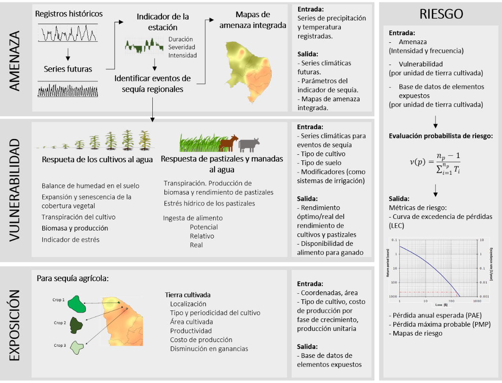{width="6.076241251093613in" height="4.6276596675415576in"}

Figura 1. Esquema general del modelo probabilista de evaluación de riesgo por sequía (Fuente: elaboración propia).

La modelación probabilista permite entonces realizar pronósticos sobre los niveles futuros de pérdida (no de eventos o sus intensidades), considerando la amenaza propia de la región de estudio y la incertidumbre en su estimación, así como la vulnerabilidad inherente de los elementos expuestos y su incertidumbre.

+------------------------------------------------------------------------------------------------------------------------------------------------------------------------------------------------------------------------------------------------------------------------------------------------------------------------------------------------------------------------------------------------------------------------------------------------------------------------------------------------------------------------------------------------------------------------------------------------------------------------------------------------------------------------------------------------------------------------------------------------------+
| Caja 1. Definiciones                                                                                                                                                                                                                                                                                                                                                                                                                                                                                                                                                                                                                                                                                                                             |
|                                                                                                                                                                                                                                                                                                                                                                                                                                                                                                                                                                                                                                                                                                                                                      |
| La evaluación del riesgo determina la naturaleza y el grado de riesgo de desastres a través del análisis de posibles amenazas y la evaluación de las condiciones existentes de vulnerabilidad que conjuntamente podrían dañar potencialmente a la población, la propiedad, los servicios y los medios de sustento expuestos, al igual que el entorno del cual dependen [16].                                                                                                                                                                                                                                                                                                                                                                   |
|                                                                                                                                                                                                                                                                                                                                                                                                                                                                                                                                                                                                                                                                                                                                                      |
| Los componentes del riesgo son la amenaza, los elementos expuestos y su vulnerabilidad. La amenaza se refiere a la ocurrencia de un fenómeno natural, en este caso las sequías o inundaciones por lluvias intensas, y la severidad con que impacta una región específica. Los elementos expuestos son el conjunto de bienes o activos que se encuentran expuestos a la amenaza y pueden llegar a sufrir daños que deriven en pérdidas económicas o afectación a la población. Por último, la vulnerabilidad es esa medida de susceptibilidad a sufrir daño que tienen los elementos expuestos, tras la manifestación de la amenaza en su ubicación. La evaluación del riesgo resulta entonces de la combinación de sus tres componentes. |
+------------------------------------------------------------------------------------------------------------------------------------------------------------------------------------------------------------------------------------------------------------------------------------------------------------------------------------------------------------------------------------------------------------------------------------------------------------------------------------------------------------------------------------------------------------------------------------------------------------------------------------------------------------------------------------------------------------------------------------------------------+

EVALUACIÓN PROBABILISTA DE LA AMENAZA POR SEQUÍA
================================================

La metodología propuesta considera que los escenarios de amenaza corresponden a eventos de condiciones continúas y simultáneas de estrés hídrico y alta temperatura. Para la evaluación prospectiva del riesgo por fenómenos meteorológicos, el componente de amenaza se define como un conjunto de cientos de eventos estocásticos, derivados de la simulación de variables de precipitación y temperatura, que son colectivamente exhaustivos y mutuamente excluyentes. Estos escenarios describen la distribución espacial, la frecuencia de ocurrencia y la aleatoriedad de la intensidad de eventos extremos de sequía en la región de interés. En un marco más amplio, a partir de las simulaciones de series de precipitación y temperatura, la metodología permite identificar eventos extremos no sólo de sequía, sino también de inundación, olas de calor o heladas, aplicando en cada caso los indicadores pertinentes, y así poder comparar sus potenciales impactos en la zona de interés.

El paso preliminar en la generación de eventos de amenaza de fenómenos meteorológicos es la definición de la accesibilidad a los registros de datos climáticos históricos, para verificar qué parámetros están disponibles (precipitación, temperatura, viento, radiación y humedad) y en qué resolución (espacial y temporal). Después de una evaluación de la calidad de los registros, se generan series estocásticas de parámetros climáticos utilizando un generador de clima sintético que ajusta una distribución de probabilidad para cada día del año y para cada estación en el área bajo estudio para luego hacer la correspondiente correlación temporal y espacial entre estaciones. Posteriormente, se calculan parámetros climáticos adicionales, como la evapotranspiración potencial, que son útiles para definir los índices de evento extremo de clima (sequía, exceso de lluvia, heladas y olas de calor). Al calcular los índices para todo el período de simulación y para todas las estaciones analizadas, se identifican los episodios extremos que ocurren simultáneamente en la región. Los eventos peligrosos, en su conjunto cubren toda el área de estudio, razón por la cual se pueden derivar los mapas de amenaza integrada con un enfoque de evaluación probabilista y con esto obtener medidas de intensidad de la amenaza para diferentes periodos de retorno en toda el área estudiada.

Información climática
---------------------

La metodología propuesta utiliza datos climáticos históricos de la región de interés, principalmente la acumulación diaria de precipitación y mediciones de temperatura máxima, mínima y media. También hace uso de mediciones de velocidad y dirección del viento, radiación neta, humedad y presión atmosférica, a escala diaria de ser posible. La metodología propuesta permite el uso de datos medidos en estaciones meteorológicas en superficie y también el uso de datos recopilados por teledetección, los cuales son útiles principalmente en caso de que no se puedan obtener registros históricos de las estaciones, para complementar valores faltantes, ante la existencia de datos de baja calidad o la ausencia de estaciones operativas.

Dado que el uso de registros históricos de clima de estaciones meteorológicos es restringido por la cantidad y calidad de la información, al aplicar esta metodología se han utilizado bases de datos globales de información satelital analizada y ajustada por importantes centros de investigación a nivel mundial. Entre estas bases de datos se encuentra CHIRPS Climate Hazards Group InfraRed Precipitation with Station data [17] y el dataset desarrollado por el equipo de hidrología de la Universidad de Princeton en Estados Unidos [18]. Estas bases de datos cuentan con más de 30 años de registros diarios de información global con mallas desde 1° hasta 0.25° de resolución. Los parámetros disponibles son precipitación, temperatura (media, mínima y máxima), radiación de onda corta y de onda larga, humedad específica, presión de aire en la superficie y velocidad del viento, que son ajustadas a los cambios de elevación. También está disponible la base de datos ERA5 del Copernicus Climate Change Service [19] con resolución de 0.1° y registros a escala horaria.

Es importante notar que dentro de las limitaciones de la metodología se reconoce que las bases de datos globales tienen dificultades para representar las variables a escala diaria, y se debe validar con registros de estaciones en tierra. La Figura 2 muestra el ejemplo de comparación entre una estación en tierra administrada por el IDEAM (Aeropuerto Santiago de Vila) y la estación virtual más cercana. Los registros históricos para estas dos estaciones se muestran en el histograma de precipitación diaria, las series del promedio multianual de precipitación mensual y precipitación total anual, y un ejemplo de serie diaria de precipitación para el año 1981. En este caso, la estación en tierra tiene el 98% de los registros para el rango desde enero de 1981 hasta diciembre de 2010. El valor del coeficiente de correlación para valores diarios es de 0.19 y el error cuadrático medio es de 11.25 mm, que son valores que indican poca correspondencia entre los datos registrados y los del dataset.

Sin embargo, la Probabilidad de detección de días con lluvia es de 0.77, la relación de falsa alarma es de 0.18 y el índice de éxito es 0.65. Estos indicadores muestran que CHIRPS reconoce en una buena medida los días de no precipitación (ver serie diaria de 1981). De otro lado, los coeficientes de relación y los errores cuadráticos medios de valores mensuales, que se muestran en la Figura 2 indican una mejor correlación al agregar los registros a escala mensual. A estas mismas conclusiones llegó en un ejercicio de validación de CHIRPS en Colombia, en el que se encontró un buen desempeño de la base de datos al compararlo con 338 estaciones en tierra administradas por IDEAM (R = 0.97 y MAE = 38 mm) [17] y se comprobó su buen uso para la identificación de sequías. En un análisis descriptivo y comparativo para Colombia que consideró 902 estaciones del IDEAM [20], se concluyó que CHIRPS conserva características importantes de precipitación como la media y la estacionalidad para escala anual, mensual y diaria, aunque la varianza se representa mejor a escala mensual y anual. Este estudio encontró que CHIRPS sobreestima los valores de precipitación en la región Andina y Pacífica, mientras que subestima las precipitaciones en La Guajira, la Región de la Orinoquía y Amazonía. Además, CHIRPS acierta en más de un 60% los días de lluvia y de no lluvia.

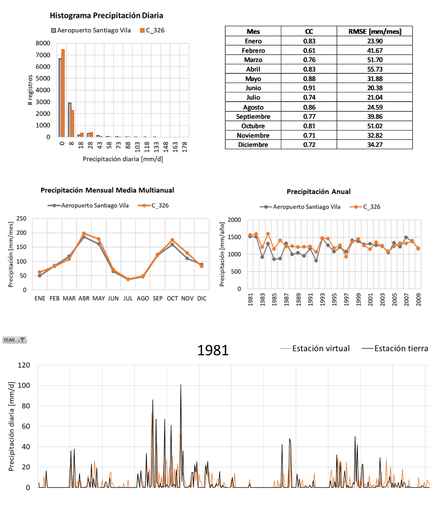{width="6.1375in" height="7.156944444444444in"}

Figura 30. Comparación de registros de estación en tierra y registros CHIRPS en estación virtual (Fuente: elaboración propia).

Se han adelantado iniciativas para mejorar la calidad de los registros de CHIRPS a escala diaria [21], y en el caso colombiano el IDEAM genera mapas de seguimiento de la lluvia decadal CHIRPS-IRE/IDEAM, pero esta información no tiene acceso libre. A pesar de estas limitaciones, se considera que las bases de datos globales tienen fortalezas para su uso como valores de entrada al generador de clima, entre las que se reconoce la alta resolución espacial y temporal y que se representan bien los valores medios multianuales, la estacionalidad y la precipitación acumulada total, que son los indicadores seleccionados para medir el ajuste de las simulaciones en esta metodología. Esto se hace considerando que el generador de clima no tiene como objetivo hacer pronósticos de clima, sino generar eventos extremos que se puedan presentar y deriven en peligros y desastres.

Generación estocástica de series climáticas
-------------------------------------------

La metodología propuesta utiliza un generador de clima sintético a partir de distribuciones paramétricas de probabilidad para definir conjuntos de datos climáticos históricos y estimar la probabilidad de ocurrencia de un determinado valor de precipitación o temperatura, incluso fuera del rango de observaciones históricas. La metodología toma cada día del año hidrológico en un análisis separado, y encuentra la distribución de probabilidad que se ajusta mejor a los registros históricos. Posteriormente, se generan números aleatorios para la precipitación y la temperatura diaria para un determinado número de años de simulación, usando los parámetros de las distribuciones seleccionadas. Las series sintéticas de clima son luego utilizadas para generar mapas de amenaza integrada para diferentes periodos de retorno para toda el área de análisis. El esquema que describe el paso a paso del generador sintético de clima se presenta en la Figura 3 y la descripción detallada de la metodología se presenta en la sección de Materiales y Métodos al final de este documento.

{width="5.665166229221347in" height="3.7121850393700786in"}

Figura 31. Proceso de generación de series sintéticas de precipitación y temperatura para identificación de eventos meteorológicos extremos (Fuente: elaboración propia).

En la Figura 4 se muestra un ejemplo, para el caso de Colombia, del ajuste del promedio diario multianual de las series históricas del periodo 1981--2010 y de la serie sintética simulada aleatoriamente para 1,000 años. Se puede ver cómo la metodología propuesta resulta en series sintéticas con un ajuste preciso a los datos históricos, lo que indica que la serie aleatoria conserva adecuadamente las características del clima de la zona.

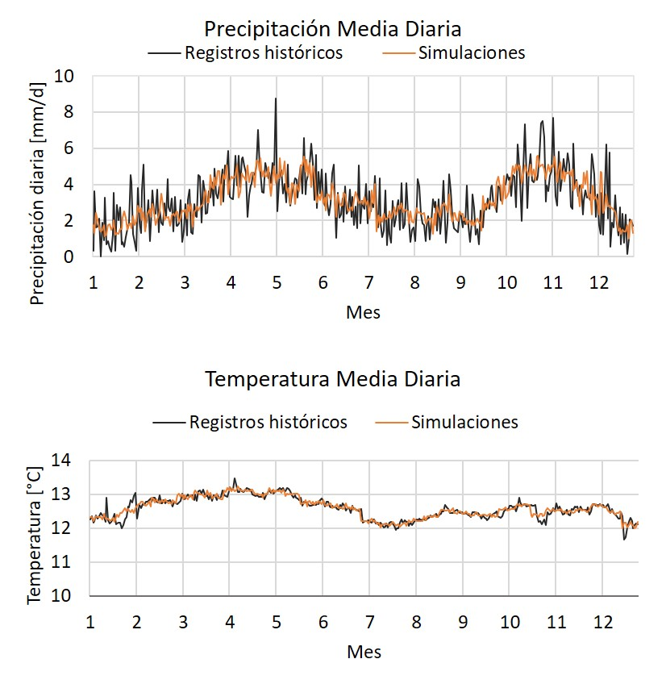{width="5.50666447944007in" height="5.65333552055993in"}

Figura 32. Promedio diario multianual de precipitación (arriba) y de temperatura media (abajo) para serie histórica (1981--2010) y serie sintética (1,000 años de simulación) (Fuente: elaboración propia).

Una de las ventajas de la metodología de generación estocástica de series climáticas es la obtención de valores atípicos extremos, que hacen referencia a valores de precipitación por encima de los máximos de los registros históricos, y valores de temperatura por fuera del rango medio registrado en estaciones. Esto quiere decir que las series modeladas incluyen valores de precipitación y temperatura que no se han presentado, pero pueden ocurrir con una baja probabilidad en el futuro.

Para el caso de Colombia, los resultados en escala espacial de la simulación de series de precipitación y temperatura se muestran en la Figura 5 Estos mapas muestran los valores medios multianuales para la precipitación anual y temperatura media, mínima y máxima, a partir de los registros históricos (columna de la izquierda) y de los valores simulados (columna de la derecha). Los resultados, tanto para precipitación como para temperatura muestran que las simulaciones conservan los valores medios en toda el área de estudio y representan la distribución espacial de estas variables climáticas. Los mapas muestran las zonas de clima predominantemente seco, como La Guajira en el norte, y zonas reconocidas por sus intensas lluvias como el Choco. También se reconocen en los mapas de temperatura las zonas más altas del país, como son las cordilleras y la Sierra Nevada de Santa Marta.

+--------------------------------------------------------------------------------------+---------------------------------------------------------------------------------------+
| 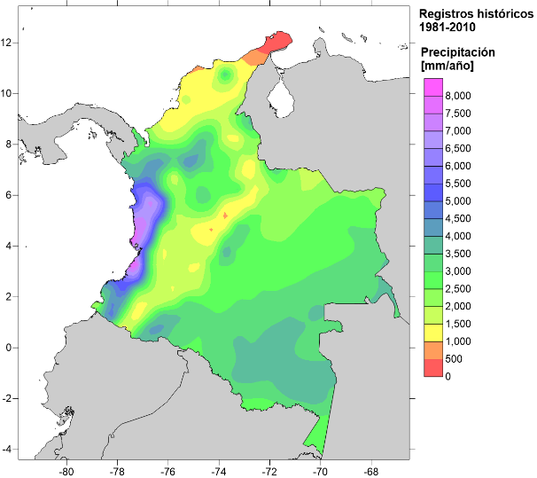{width="2.952755905511811in" height="2.625764435695538in"}   | {width="2.952755905511811in" height="2.6127121609798776in"}   |
|                                                                                      |                                                                                       |
| g)  Precipitación Registros 1981-2010                                                | h)  Precipitación Simulada                                                            |
+======================================================================================+=======================================================================================+
| {width="2.952755905511811in" height="2.6389490376202973in"}  | 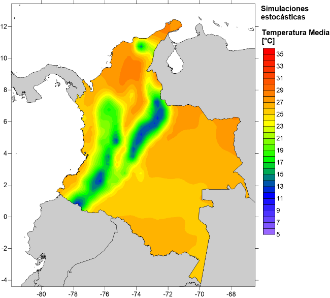{width="2.952755905511811in" height="2.6634667541557304in"}   |
|                                                                                      |                                                                                       |
| a)  Temperatura Media Registros 1981-2010                                            | b)  Temperatura Media Simulada                                                        |
+--------------------------------------------------------------------------------------+---------------------------------------------------------------------------------------+
| {width="2.7559055118110236in" height="2.438532370953631in"}  | > 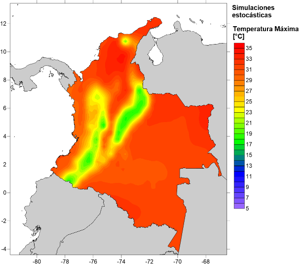{width="2.7559055118110236in" height="2.438530183727034in"} |
|                                                                                      |                                                                                       |
| c)  Temperatura máxima Registros 1981-2010                                           | d)  Temperatura máxima Simulada                                                       |
+--------------------------------------------------------------------------------------+---------------------------------------------------------------------------------------+
| {width="2.7559055118110236in" height="2.4507141294838144in"} | {width="2.7559055118110236in" height="2.4507130358705163in"}  |
|                                                                                      |                                                                                       |
| e)  Temperatura mínima Registros 1981-2010                                           | f)  Temperatura mínima Simulada                                                       |
+--------------------------------------------------------------------------------------+---------------------------------------------------------------------------------------+

Figura 33. Mapas de valores medios multianuales para precipitación, temperatura media, máxima y mínima de registros históricos (izquierda) y series modeladas (derecha).

Con la verificación de estos resultados, se procede a calcular la evapotranspiración y los indicadores de sequía.

+--------------------------------------------------------------------------------------------------------------------------------------------------------------------------------------------------------------------------------------------------------------------------------------------------------------------------------------------------------------------------------------------------------------------------------------------------------------------------------------------------------------------------------------------------------------------------------------------------------------------------------------------------------------------------------------------------------------------------------------------------------------------------------------------------------------------------------------------------------------------------------------------------------------------------------------------------------------------------------------------------------------------------------------------------------------------------------------------------------------------------+
| ### Caja 2. Incorporación del Cambio Climático en la generación de series climáticas futuras {#caja-2.-incorporación-del-cambio-climático-en-la-generación-de-series-climáticas-futuras .list-paragraph}                                                                                                                                                                                                                                                                                                                                                                                                                                                                                                                                                                                                                                                                                                                                                                                                                                                                                                                 |
|                                                                                                                                                                                                                                                                                                                                                                                                                                                                                                                                                                                                                                                                                                                                                                                                                                                                                                                                                                                                                                                                                                                          |
| De acuerdo con el Reporte AR5 del IPCC (Intergovernmental Panel on Climate Change): "el calentamiento del sistema climático es inequívoco, y desde 1950, muchos de los cambios observados son sin precedentes sobre décadas y hasta milenios. La atmósfera y océano se han calentado, las cantidades de nieve y hielo han disminuido, el nivel del mar ha aumentado, y la concentración de gases de efecto invernadero ha aumentado" [22]. Debido a esto es importante considerar los efectos de este cambio climático en la evaluación del riesgo por eventos extremos climáticos.                                                                                                                                                                                                                                                                                                                                                                                                                                                                                                                                  |
|                                                                                                                                                                                                                                                                                                                                                                                                                                                                                                                                                                                                                                                                                                                                                                                                                                                                                                                                                                                                                                                                                                                          |
| Con este fin, en la metodología propuesta es posible analizar los modelos de cambio climático y los cuatro diferentes escenarios de forcings antropogénicos (RCP o Representative Concentration Pathways) definidos en el informe AR5 del IPCC, y se escoger los modelos más adecuados para determinar los efectos específicos sobre la temperatura y precipitación para el área de estudio. En total se pueden llegar a evaluar 311 proyecciones, considerando las diferentes corridas de cada modelo. Una vez se determina el/los modelos de cambio climático más adecuado(s), se determinan las proyecciones de temperatura y precipitación en el futuro para la región de estudio, y con esto se perturbarán las series estocásticas de temperatura y precipitación que serán generadas para la modelación de los eventos climáticos extremos. Cada serie modelada debe ser perturbada según su ubicación y los resultados del modelo para ese mismo punto. Esto permite caracterizar completamente las condiciones futuras de ocurrencia de eventos hidrometeorológicos extremos en todo el territorio de análisis. |
|                                                                                                                                                                                                                                                                                                                                                                                                                                                                                                                                                                                                                                                                                                                                                                                                                                                                                                                                                                                                                                                                                                                          |
| La incorporación del efecto del cambio climático está por fuera del alcance de la evaluación de riesgo por sequía para el sector agropecuario en Colombia que se presenta en este documento. Para más información visitar <https://www.researchgate.net/project/Drought-hazard-and-risk-assessment-New-probabilistic-and-holistic-methodology-Evaluacion-de-amenza-y-riesgo-por-sequia-Nueva-metodologia-probabilista-y-holistica>                                                                                                                                                                                                                                                                                                                                                                                                                                                                                                                                                                                                                                                                                       |
+--------------------------------------------------------------------------------------------------------------------------------------------------------------------------------------------------------------------------------------------------------------------------------------------------------------------------------------------------------------------------------------------------------------------------------------------------------------------------------------------------------------------------------------------------------------------------------------------------------------------------------------------------------------------------------------------------------------------------------------------------------------------------------------------------------------------------------------------------------------------------------------------------------------------------------------------------------------------------------------------------------------------------------------------------------------------------------------------------------------------------+

Identificación de eventos estocásticos de clima extremo
-------------------------------------------------------

Los indicadores son ampliamente utilizados para identificar eventos extremos de clima, como por ejemplo las sequías o inundaciones. Los indicadores pueden definir la *duración* y la *severidad* de los eventos extremos detectando condiciones anómalas de precipitación (exceso o déficit) y de temperatura (por debajo o por encima del promedio histórico para cada temporada del año). Las fechas de inicio y terminación establecen el período de duración en el que un indicador de clima extremo está continuamente por debajo de un nivel o umbral crítico predefinido. La severidad de un evento denota la deficiencia acumulativa de un parámetro por debajo de un umbral entre las fechas de iniciación y terminación.

Dependiendo del tiempo de evento climático a evaluar, se pueden incluir diferentes variables en el cálculo de los índices. Por ejemplo, para encharcamientos por exceso de lluvia, el parámetro que controla el proceso es la lluvia acumulada en un cierto número de días y la humedad inicial del suelo. Para eventos de sequía meteorológica se tiene en cuenta la precipitación acumulada y la evapotranspiración potencial, que se calcula a partir de la temperatura, viento, humedad, radiación y presión atmosférica. Para el caso de heladas y olas de calor se debe tener en cuenta la humedad del aire además de la temperatura.

+------------------------------------------------------------------------------------------------------------------------------------------------------------------------------------------------------------------+
| Caja 3. ¿Cómo se caracteriza un evento de sequía?                                                                                                                                                            |
|                                                                                                                                                                                                                  |
| A partir de la serie de indicadores de sequía se puede caracterizar cada evento según los siguientes parámetros:                                                                                                 |
|                                                                                                                                                                                                                  |
| {width="5.575074365704287in" height="3.9278182414698164in"}                                                                                                                              |
|                                                                                                                                                                                                                  |
| Definición de un evento de sequía dentro de la serie de tiempo sintética                                                                                                                                         |
|                                                                                                                                                                                                                  |
| -   *Severidad*: corresponde al área bajo la curva del evento, es decir, el valor acumulado del indicador durante el evento. Se puede entender como la gravedad de la sequía.                                    |
|                                                                                                                                                                                                                  |
| -   *Duración*: es el tiempo que dura el evento o el número de meses en el que el indicador de sequía está por debajo del umbral que define la severidad.                                                        |
|                                                                                                                                                                                                                  |
| -   *Intensidad*: se calcula como la severidad dividida por la duración. Es una medida unitaria de la magnitud del evento.                                                                                       |
|                                                                                                                                                                                                                  |
| -   *Serie de temperatura*: valores contra el tiempo de temperatura diaria (promedio, máxima y mínima) dentro de la duración del evento. Se obtienen de la serie sintética empleada en el cálculo del indicador. |
|                                                                                                                                                                                                                  |
| -   *Serie de precipitación*: valores contra el tiempo de precipitación diaria dentro de la duración del evento. Se obtienen de la serie sintética empleada en el cálculo del indicador.                         |
+------------------------------------------------------------------------------------------------------------------------------------------------------------------------------------------------------------------+

CASO DE ESTUDIO: SEQUÍA EN COLOMBIA
===================================

Para el caso de la sequía, a partir de las series históricas y sintéticas de precipitación y temperatura se calculan los indicadores de sequía (SPI, SPEI, RDI y otros incluidos en la literatura especializada) para todas las estaciones y a diferentes escalas de tiempo en pasos mensuales. Una vez que se obtiene la serie temporal del indicador seleccionado en cada estación, se identifican los eventos de sequía, que ocurren cuando el indicador toma un valor por debajo de un umbral crítico. La descripción detallada de la metodología de indicadores de sequía se presenta en la sección de Materiales y Métodos al final de este documento.

El siguiente paso es identificar los eventos de sequía que ocurren simultáneamente en varias estaciones de la región de estudio. Para cada mes, se identifican las estaciones con un valor de indicador por debajo del umbral definido para la evaluación. Si el número total de estaciones con valores por debajo del umbral es mayor que un cierto porcentaje (por ejemplo, 50%), entonces se identifica una sequía regional. Con cálculos consecutivos para todos los años de simulación, se pueden detectar múltiples sequías regionales, con su valor asociado de duración, severidad e intensidad en cada estación. Cada una de las sequías regionales es un escenario de sequía individual, con una frecuencia anual de ocurrencia igual a 1/N, en donde N es el número total de años de simulación. La Figura 6 muestra esquemáticamente cómo se identifican las sequías regionales, de acuerdo con los criterios de selección definidos por un valor umbral de indicador y un número mínimo de estaciones que satisfacen dicha condición. Este procedimiento puede aplicarse para toda la región de estudio, o para subregiones definidas por otros criterios, como zonas climáticas, zonas productivas, entidades territoriales, etcétera.

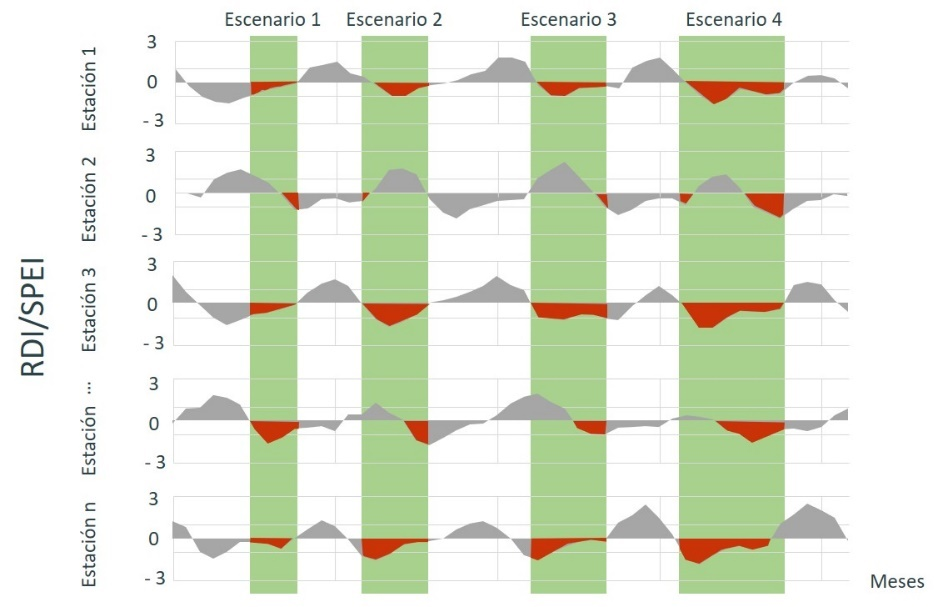{width="4.262568897637795in" height="2.7559055118110236in"}

Figura 34. Identificación de sequías regionales sobre las series de tiempo de todas las estaciones del área de estudio (Fuente: elaboración propia).

Mapas de amenaza integrada
--------------------------

Los resultados de la modelación de la amenaza se presentan en formato de mapas de amenaza integrada para la región de estudio, que permiten comparar las intensidades según el periodo de retorno y establecer zonas que están más o menos expuestas a la amenaza de sequía dentro de la región. La metodología para integrar la amenaza se incluye en la sección de Materiales y Métodos. En los mapas se presenta la severidad como el valor absoluto del acumulado del indicador de sequía, e indica la gravedad de las sequías, la duración se presenta en número de meses y la intensidad como la división entre nivel acumulado del indicador de sequía por debajo del umbral definido para el análisis y el número de meses en que el indicador estuvo bajo el umbral.

Hay que tener en cuenta que la severidad por sí sola no puede definir la gravedad de una sequía, se requiere complementar con los parámetros de duración e intensidad [23]. Por ejemplo, el valor máximo de severidad que se muestra en los mapas igual a 15 se puede interpretar como una sequía severa y baja duración (5 meses de sequía con valores de SPEI = -3) o una sequía moderada con larga duración (10 meses de sequía con valores de SPEI = -1.5). Por esta razón, al interpretar los mapas de amenaza integrada se recomienda analizar en simultánea los indicadores de duración e intensidad, que complementan el análisis espacial de los resultados y brindan más información para la toma de decisiones.

Los mapas de severidad, duración e intensidad calculados para Colombia se muestran en la Figura 7, para diferentes periodos de retorno. Según los resultados, se puede ver que la intensidad de la sequía tiende a ser uniforme en el país, con valores por encima de 1.5, lo que indica sequías severas para periodos de retorno altos (mayores a 50 años). Sin embargo, en la zona de la cordillera central del país, la intensidad de la sequía tiene a ser más baja.

Un resultado importante a resaltar son los valores de severidad de la sequía en la zona de La Guajira. Los mapas muestran que para la región caribe la severidad es menor que para el resto del país, al igual que algunas zonas de Cundinamarca y Boyacá. Es importante notar que el valor de severidad de la sequía se calcula a partir de los valores normales de la zona de evaluación, por lo que, aunque la región Caribe y en especial La Guajira son de climas secos o desérticos, los mapas que aquí se presentan muestran que en estas zonas las sequías meteorológicas son potencialmente menos graves que en otras zonas del país. Sin embargo, los impactos reales del riesgo a la sequía se determinan al considerar no sólo la amenaza, desde el enfoque meteorológico, sino también condiciones de exposición y vulnerabilidad, tanto física como socioeconómica, que puede incrementar los efectos de la amenaza.

  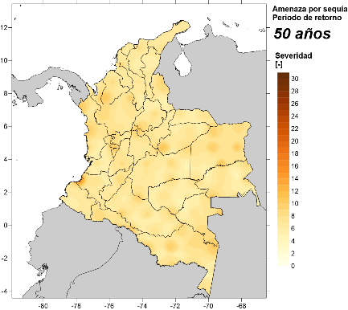{width="1.968503937007874in" height="1.7563582677165355in"}   {width="1.968503937007874in" height="1.7563582677165355in"}    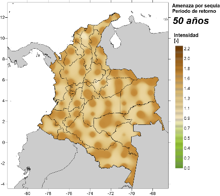{width="1.9685017497812773in" height="1.7563582677165355in"}
  -------------------------------------------------------------------------------------- --------------------------------------------------------------------------------------- ---------------------------------------------------------------------------------------
  {width="1.968503937007874in" height="1.7563582677165355in"}   {width="1.9685017497812773in" height="1.7563582677165355in"}   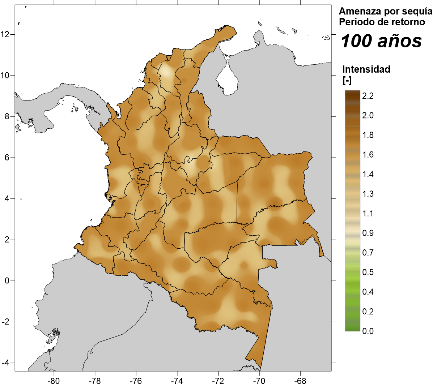{width="1.9685017497812773in" height="1.7563582677165355in"}
  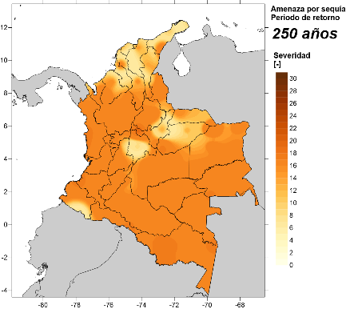{width="1.968503937007874in" height="1.7563582677165355in"}   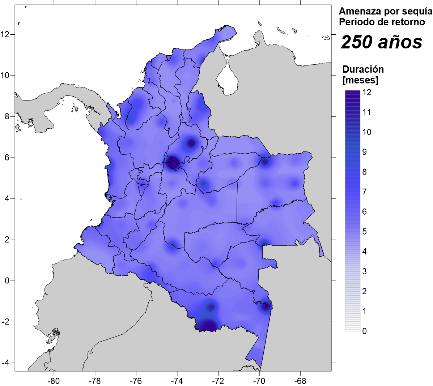{width="1.9685017497812773in" height="1.7563582677165355in"}   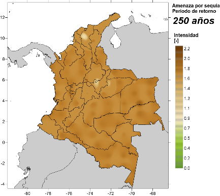{width="1.9685017497812773in" height="1.7563582677165355in"}
  {width="1.968503937007874in" height="1.7563582677165355in"}   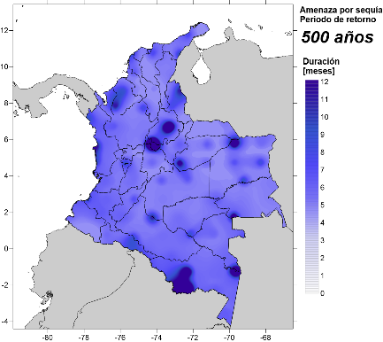{width="1.9685017497812773in" height="1.7563582677165355in"}   {width="1.968503937007874in" height="1.7563582677165355in"}

Figura 35. Mapas de amenaza integrada de sequía para 50, 100, 250 y 500 años de periodo de retorno. Severidad (izquierda), duración en meses (centro) e intensidad (derecha) (Fuente: elaboración propia).

EXPOSICIÓN AGRÍCOLA
===================

La metodología propuesta considera los elementos expuestos como uno de los componentes de riesgo, junto con la amenaza y la vulnerabilidad. Un elemento expuesto es cualquier objeto, geográficamente referenciado, que es susceptible de ser afectado por la ocurrencia de un fenómeno amenazante. Los elementos expuestos para la actividad agrícola son los cultivos ubicados en el área donde se estima el riesgo asociado a eventos climáticos extremos. Los elementos expuestos son fundamentales dentro del análisis de riesgo, debido a que comprenden los objetos sobre los cuales se evalúan las pérdidas, es decir, son la fuente de las pérdidas potenciales debido al hecho de estar expuestos a una amenaza y ser susceptibles de sufrir un daño.

Para cada elemento expuesto o unidad de tierra cultivada en la región de análisis, es necesario conocer las características del cultivo que típicamente se siembra en esa ubicación. La información que se debe conocer incluye el tipo de cultivo, su estacionalidad y área sembrada. También se debe contar con información de rendimientos típicos (toneladas producidas por unidad de área). En la medida de lo posible, esta información debe obtenerse de fuentes oficiales. La información mínima para crear la base de datos de elementos expuestos del sector agrícola se muestra en la siguiente tabla.

Tabla 6. Información de entrada para modelo de exposición del sector agropecuario

  Información de entrada                 Descripción                                                                                        Posibles fuentes
  ------------------------------------------ ------------------------------------------------------------------------------------------------------ ---------------------------------------------------------------------------------------------------
  Mapas de ubicación de cultivos         Ubicación de cultivos y unidades de tierra cultivada georeferenciadas.                                 Mapas oficiales de uso de la tierra y coberturas, censos nacionales agrícolas.
  Rendimiento de cultivos                Valores de referencia de rendimiento de cultivos para la producción anual y el área total cultivada.   Censos y encuestas agrícolas.
  Valoración económica de los cultivos   Costo de producción unitario.                                                                          Censos y encuestas agrícolas.
  Mapas de tipo de suelo                 Textura, grupo hidrológico, y número de curva.                                                         Mapas oficiales de la clasificación taxonómica del suelo, mapas de uso de la tierra y coberturas.

Mapas de ubicación de cultivos
------------------------------

La información detallada de localización y caracterización de los cultivos es requerida para modelar la vulnerabilidad de los elementos expuestos; no obstante, esta información por lo general es difícil de obtener. Por tal razón, para recopilarla se consultan fuentes oficiales para desarrollar un proxy con la información más pertinente para zona de estudio.

Para el caso de Colombia se consultó información publicada por fuentes oficiales como el Mapa de Cobertura el Suelo publicado por el IDEAM [24], los resultados del Tercer Censo Nacional Agropecuario 2014 [25] y las Encuestas Nacionales Agropecuarias [26] anuales publicadas por el DANE. De esta forma se obtienen mapas de localización y área de los cultivos más importantes del país, en una malla de resolución ajustable según la resolución del modelo de amenaza y el uso final de la evaluación de riesgo.

Con el objetivo de obtener la base de datos de elementos expuestos, se realizó el análisis de ubicación y cantidad de área sembrada de los principales productos agrícolas producidos en Colombia, así como la localización de pasturas y caracterización de ganado para evaluar el riesgo agropecuario del país a partir de la información del mapa de coberturas, el censo nacional y las encuestas agrícolas. Como resultado se obtuvieron mapas a nivel nacional, en los que el territorio se divide en una malla de 10 km × 10 km y en donde cada celda contiene una cierta área sembrada de cada uno de los productos analizados, para diferentes fechas de siembra (primer y segundo semestre) y tipo de cultivo (monocultivo o asociado).

Esta metodología permite incluir las diferentes prácticas agrícolas que se realizan en diferentes regiones. Estas pueden incluir la siembra de cultivos anuales en varios ciclos (siembra de primer y segundo semestre), siembra en monocultivo o cultivo asociado (por ejemplo, café y plátano en la misma unidad de tierra cultivada). También se consideran cultivos permanentes dentro del análisis. Esto se resume en la Figura 8.

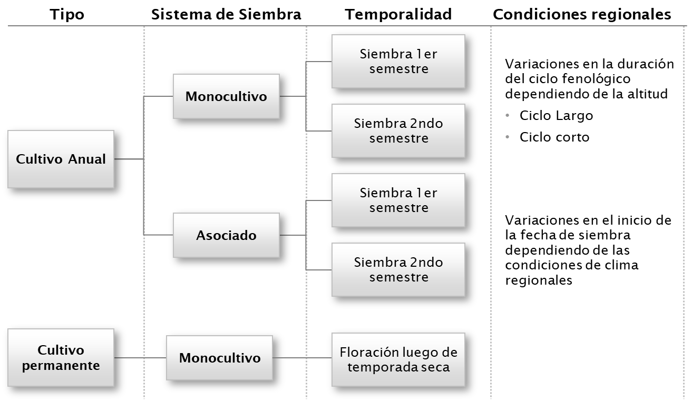{width="5.412944006999125in" height="3.1496062992125986in"}

Figura 36. Esquema de análisis de cultivos considerado en la generación del modelo de exposición (Fuente: elaboración propia).

Para la generación de los mapas de ubicación y área sembrada de cultivos se consideraron además restricciones en los cultivos en áreas protegidas y se priorizaron zonas cercanas a centros poblados. La validación del área resultante se hizo al comparar la sumatoria del área asignada a cada pixel del mismo municipio con el área total sembrada por municipio reportada en la última versión de la ENA. Por ejemplo, en Colombia la superficie cultivada de maíz a nivel nacional se estimó en 693,800 ha, la distribución espacial de esta área se muestra en la Figura 9, donde también se hace un detalle a los departamentos de Antioquía y Tolima.

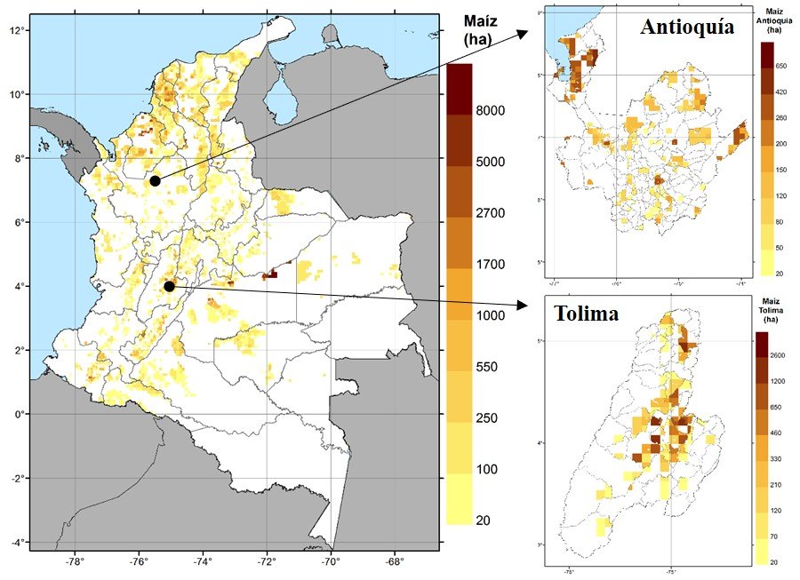{width="6.0in" height="4.3533333333333335in"}

Figura 37. Localización y área de cultivos de maíz en Colombia (izquierda), en Antioquía (derecha arriba) y en Tolima (derecha abajo) (Fuente: elaboración propia).

Estacionalidad
--------------

Un parámetro de entrada específico para cada región de análisis y tipo de planta es el tiempo en el cual se completa el ciclo de desarrollo del cultivo. Dentro de la modelación de la vulnerabilidad de las plantas, es importante definir, en términos de días calendario, las diferentes etapas de crecimiento del cultivo, desde su siembra hasta la madurez, como se muestra en la Figura 10. Además, se debe contar con información sobre la fecha típica de siembra y cosecha de cada producto. Estos datos van a ser luego utilizados en el módulo de vulnerabilidad que relaciona el desarrollo día a día del cultivo con las series diarias de precipitación y temperatura, para evaluar posibles reducciones en el rendimiento de la cosecha debido a condiciones de déficit de agua.

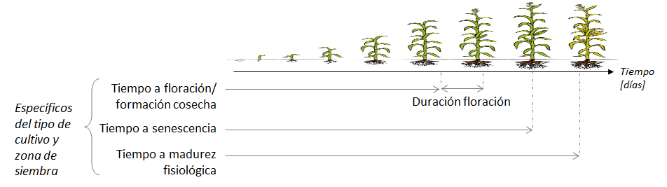{width="6.1375in" height="1.7208333333333334in"}

Figura 38. Esquema de etapas de crecimiento de una planta (Fuente: elaboración propia).

Rendimiento
-----------

Dentro de la información que se debe conocer en el modelo de exposición se incluye el rendimiento típico de cada cultivo, que dentro del modelo se define como la producción total en toneladas de un cultivo por hectárea de terreno sembrada. Estos datos se utilizan en el módulo de vulnerabilidad, que relaciona el desarrollo día a día del cultivo con las series diarias de precipitación y temperatura, para evaluar posibles reducciones en el rendimiento de la cosecha debido a condiciones extremas de clima.

Estos rendimientos, obtenidos de fuentes oficiales, son rendimientos de referencia que permiten verificar los resultados de rendimiento obtenidos con el modelo para estimar las pérdidas. Sin embargo, cabe resaltar que dichos rendimientos se asumen estáticos en el modelo dado que no se tienen en cuenta las mejores prácticas agrícolas que en un futuro puedan adoptarse y que resulten en un incremento del rendimiento de los cultivos.

El modelo de vulnerabilidad, acoplado al modelo de amenaza que incluye generación estocástica de eventos climáticos extremos, permite el cálculo de rendimientos tanto para la serie de clima histórico como para la serie de clima simulado. De esta forma se genera mayor cantidad de información de la relación entre la severidad del daño por el evento climático y el rendimiento del cultivo, y se incorporan eventos que no han ocurrido en la historia y que son importantes para la evaluación probabilista del riesgo.

Avalúo
------

Para cuantificar las pérdidas generadas al momento de exponer los cultivos a los escenarios que definen la amenaza por sequía, es necesario realizar una valoración económica de la producción obtenida por cultivo, para ello se considera el valor unitario en dólares (USD) o moneda local de una tonelada producida para cada cultivo. La valoración económica es considerada como el precio recibido por los agricultores por sus productos, sin considerar los costos de transporte, almacenamiento, procesamiento, comercialización ni impuestos; es decir, no cubre ningún otro costo después de que el producto deja la unidad de tierra cultivada. La información sobre avalúos se obtiene de fuentes oficiales como ministerios de agricultura y ganadería o institutos estadísticos de los países. Por ejemplo, en Colombia las series históricas del precios a mayoristas por tipo de cultivo se puede encontrar en servicios como AGRONET [27].

Mapas de suelo
--------------

La base de datos de elementos expuestos de cultivos incluye las variables necesarias para parametrizar el suelo, que sirve de soporte para el crecimiento de las plantas, y son parámetros de entrada para el modelo de vulnerabilidad. El modelo que se aplica en este estudio toma un volumen de referencia del suelo, en la que se ubica la zona radicular, y estima su balance hídrico para determinar la cantidad de agua que tiene disponible la planta. Con esto se evalúan las interacciones suelo-planta-atmósfera que permiten modelar el crecimiento de cultivos y su rendimiento.

La información de suelos puede ser generada a múltiples escalas, según la información disponible. Por ejemplo, el modelo a escala nacional, al ser una resolución de trabajo gruesa no incluye parámetros de afectación local como presencia de múltiples horizontes de suelo o variaciones en el nivel freático. En ese caso del perfil de suelo se supone un perfil homogéneo para la profundidad máxima que alcanzan las raíces según cultivo y no se considera la presencia de barreras físicas que limiten la profundización de las raíces. Entonces, el modelo de suelo se complementa en la medida en que se obtenga información detallada del área de estudio.

Ahora bien, en caso de no contar con información de tipo y textura de suelo, se puede hacer uso de la Base de Datos Armonizada de los Suelos del Mundo [28], que tiene información global de 15,000 unidades cartográficas de suelo. Esta base de datos es el resultado de la base de datos de la Organización de las Naciones Unidas para la Alimentación y la Agricultura (FAO) con el Instituto Internacional de Análisis de Sistemas Aplicados (IIASA), Información Mundial de los Suelos (ISRIC), Instituto de Ciencias de Suelos, Academia China de las Ciencias (ISSCAS), y el Centro Común de Investigación de la Comisión Europea (JRC). La base de datos se puede descargar de forma gratuita de la página web de la FAO.

REPRESENTACIÓN DE LA VULNERABILIDAD PARA LA EVALUACIÓN DEL RIESGO 
=================================================================

La vulnerabilidad es una característica intrínseca de los elementos expuestos y que caracteriza el comportamiento de los elementos expuestos (cultivos) durante la ocurrencia de un evento peligroso (sequía, por ejemplo). Para la metodología aplicada en este estudio, no se considera la definición de vulnerabilidad mediante curvas en las que la pérdida en el elemento expuesto es función de la intensidad de amenaza que ocurra en su ubicación. Por el contrario, la metodología de vulnerabilidad de respuesta de los cultivos a eventos extremos climáticos está asociada a reducciones en el rendimiento del cultivo según el uso de parámetros específicos por especie que definen los procesos físicos, químicos y biológicos que intervienen en el modelo de desarrollo de la planta y sus interacciones con los sistemas de atmósfera y suelo.

En el caso de la evaluación de riesgo por eventos climáticos extremos, el componente de vulnerabilidad se conforma por la metodología de respuesta de los cultivos a la disponibilidad de agua y estrés por temperatura, aplicada por la FAO y publicada en el Artículo 66 de la Unidad de Drenaje e Irrigación [15] y resumida en este documento en la sección de Materiales y Métodos. El resultado del módulo de vulnerabilidad cuantifica las diferencias entre el rendimiento óptimo alcanzado por la planta sin restricciones de agua y el rendimiento real logrado bajo condiciones de estrés hídrico o térmico.

Este enfoque permite calcular la biomasa de los cultivos con base en la cantidad de agua transpirada y el rendimiento del cultivo como la proporción de biomasa que entra en las partes cosechables de las plantas.

+---------------------------------------------------------------------------------------------------------------------------------------------------------------------------------------------------------------------------------------------------------------------------------------------------------------------------------------------------------------+
| Caja 4. ¿Por qué aplicar el modelo de respuesta de cultivos al agua de la FAO para la evaluación del riesgo?                                                                                                                                                                                                                                              |
|                                                                                                                                                                                                                                                                                                                                                               |
| Algunas de las características del modelo de la FAO, que son interesantes para la evaluación del riesgo son:                                                                                                                                                                                                                                                  |
|                                                                                                                                                                                                                                                                                                                                                               |
| -   El modelo considera la relación proporcional entre el estrés hídrico y la reducción de la producción de biomasa. En consecuencia, la reducción de la producción de biomasa se relaciona con la reducción de los rendimientos y las pérdidas económicas asociadas con el peligro de sequía.                                                                |
|                                                                                                                                                                                                                                                                                                                                                               |
| -   El modelo de la FAO incluye el efecto de las anomalías de la humedad del suelo y la respuesta fisiológica de los cultivos al déficit o exceso hídrico.                                                                                                                                                                                                    |
|                                                                                                                                                                                                                                                                                                                                                               |
| -   El modelo calcula la producción de biomasa en una escala de tiempo diaria, para representar mejor la dinámica de la respuesta del cultivo al agua en diferentes etapas de crecimiento. Esta característica es conveniente porque los parámetros meteorológicos, utilizados para calcular el riesgo de sequía, también tienen una escala de tiempo diaria. |
|                                                                                                                                                                                                                                                                                                                                                               |
| -   Como la producción de biomasa se calcula a partir de las series de precipitación y temperatura, el modelo puede introducir el efecto de los escenarios de cambio climático. Se incluye también la concentración de dióxido de carbono en la atmósfera.                                                                                                    |
|                                                                                                                                                                                                                                                                                                                                                               |
| -   La FAO ha establecido parámetros estándar para los cultivos, con sus correspondientes procedimientos de calibración y validación.                                                                                                                                                                                                                         |
|                                                                                                                                                                                                                                                                                                                                                               |
| -   Es posible incorporar modificadores asociados a prácticas agrícolas (por ejemplo, riego o fertilización), en función de la información disponible.                                                                                                                                                                                                        |
+---------------------------------------------------------------------------------------------------------------------------------------------------------------------------------------------------------------------------------------------------------------------------------------------------------------------------------------------------------------+

EVALUACIÓN DEL RIESGO POR SEQUÍA EN EL SECTOR AGROPECUARIO
==========================================================

Como se muestra en la Figura 11, la evaluación probabilista del riesgo se puede resumir en los siguientes pasos (más detalles en la sección de Materiales y Métodos):

1.  Para cada evento, se determina la pérdida en todas y cada una de las unidades cultivadas, considerando tipo de suelo, tipo de cultivo, estacionalidad y fase fenológica.

2.  Se calcula la pérdida causada por todo el evento, como la suma de las pérdidas individuales causadas en las unidades cultivadas.

3.  Una vez se conocen las pérdidas de todos los escenarios, se calculan las tasas de excedencia.

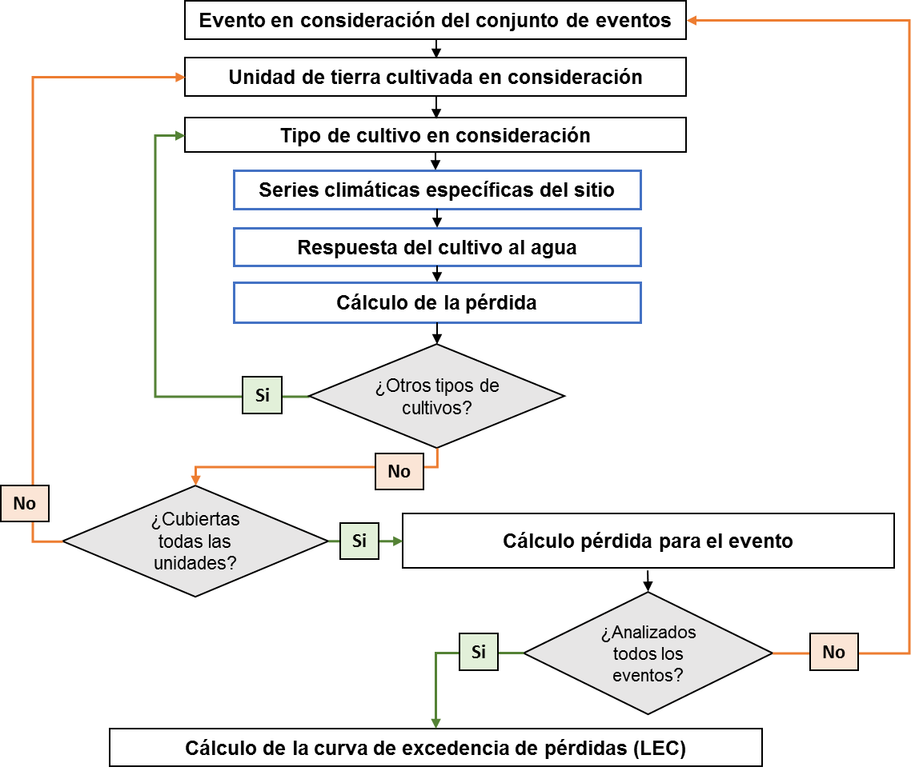{width="3.905865048118985in" height="3.308510498687664in"}

Figura 39. Diagrama de flujo para la metodología de evaluación de riesgo por sequía

+---------------------------------------------------------------------------------------------------------------------------------------------------------------------------------------------------------------------------------------------------------------------------------------------------------------------------------------------------------------------------------------------------------------------------------------------------------------------------------------------------------------------------------------------------------------------------------------------------------------------------+
| Caja 5. Cuantificación del impacto de los desastres en el sector agrícola                                                                                                                                                                                                                                                                                                                                                                                                                                                                                                                                             |
|                                                                                                                                                                                                                                                                                                                                                                                                                                                                                                                                                                                                                           |
| En términos generales, la cuantificación del impacto de los desastres en el sector agrícola hace una diferencia importante entre los conceptos de daño y pérdida:                                                                                                                                                                                                                                                                                                                                                                                                                                                         |
|                                                                                                                                                                                                                                                                                                                                                                                                                                                                                                                                                                                                                           |
| -   Daño: es la destrucción parcial o total de los activos físicos e infraestructura en áreas afectadas por desastres. Se expresa en términos de los costos de reemplazo o reparación. En el sector agrícola, el daño incluye impactos a cultivos permanentes, maquinaria, sistemas de irrigación, refugios de ganado, entre otros.                                                                                                                                                                                                                                                                                       |
|                                                                                                                                                                                                                                                                                                                                                                                                                                                                                                                                                                                                                           |
| -   Pérdida: se refiere a los cambios en los flujos económicos derivados de un desastre. En el sector agrícola, las pérdidas incluyen la disminución de ingresos asociado a reducción del rendimiento de la cosecha, disminución de ingresos asociados a reducción en la producción de derivados pecuarios. También se puede considerar el momento después de ocurrido el desastre en el que el incremento de los costos de los insumos, mayores costos operacionales, gastos más altos en imprevistos significan menores ganancias de la actividad agrícola general.                                                     |
|                                                                                                                                                                                                                                                                                                                                                                                                                                                                                                                                                                                                                           |
| La siguiente figura muestra la diferencia que hace la FAO [29] en términos de daño y pérdida para la producción y los activos en el sector agrícola y que aplica en la metodología propuesta de evaluación de riesgo por eventos climáticos extremos.                                                                                                                                                                                                                                                                                                                                                                   |
|                                                                                                                                                                                                                                                                                                                                                                                                                                                                                                                                                                                                                           |
| 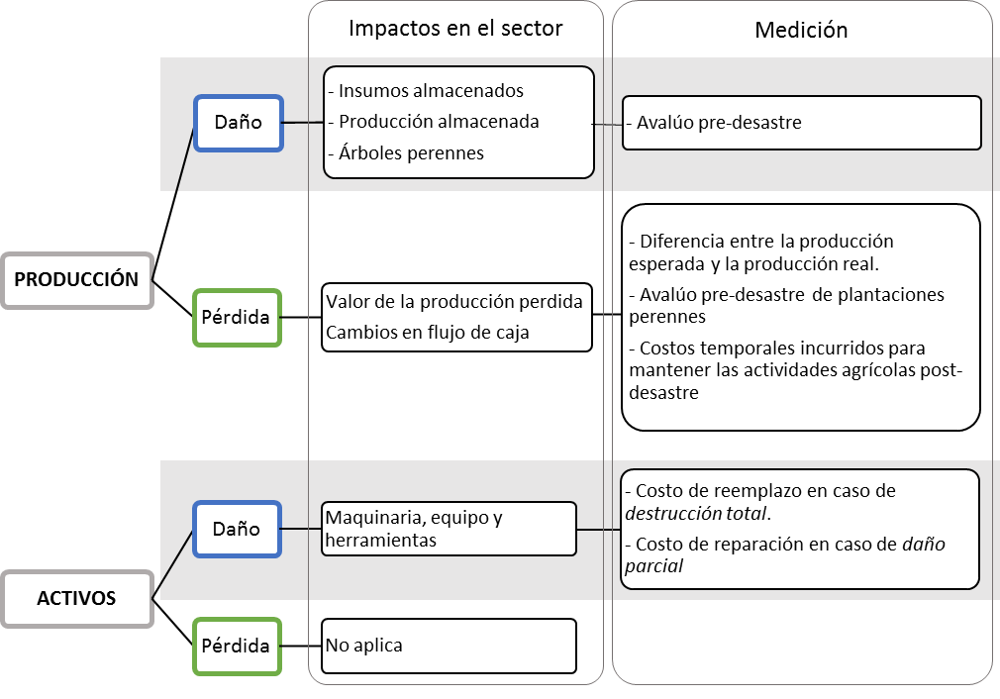{width="4.506011592300962in" height="3.1496062992125986in"}                                                                                                                                                                                                                                                                                                                                                                                                                                                                                                                                      |
|                                                                                                                                                                                                                                                                                                                                                                                                                                                                                                                                                                                                                           |
| Diferencias entre pérdidas y daños en el sector agrícola (Elaboración propia a partir de [29])                                                                                                                                                                                                                                                                                                                                                                                                                                                                                                                          |
|                                                                                                                                                                                                                                                                                                                                                                                                                                                                                                                                                                                                                           |
| En cuanto a la producción, el daño corresponde a los impactos de los desastres a insumos y producción almacenada, así como impactos en cultivos permanentes; mientras que, para la pérdida, los impactos se ven reflejados en la variación de los ingresos al productor asociado con disminuciones en los rendimientos de la cosecha. Por otro lado, para los activos los daños se asocian a impactos en maquinaria, equipo y herramienta y no se consideran pérdidas, al no asociar cambios en flujos económicos a los activos.                                                                                          |
|                                                                                                                                                                                                                                                                                                                                                                                                                                                                                                                                                                                                                           |
| La medición se hace a partir de avalúos y costos de reparación/reemplazo estimados en condiciones anteriores al evento y diferencias en ingresos percibidos entre cosecha óptima y cosecha en condición de desastre. La metodología también puede incluir los costos temporales que deben incurrir los productores para mantener las actividades agrícolas durante o luego de la ocurrencia de un desastre. La metodología puede entonces incluir todos estos factores según la disponibilidad de la información y la amenaza analizada (por ejemplo, para el caso de la sequía no se consideran afectaciones a activos). |
+---------------------------------------------------------------------------------------------------------------------------------------------------------------------------------------------------------------------------------------------------------------------------------------------------------------------------------------------------------------------------------------------------------------------------------------------------------------------------------------------------------------------------------------------------------------------------------------------------------------------------+

Riesgo por sequía para el cultivo de maízen Colombia 
----------------------------------------------------

Con el fin de ilustrar los resultados de la metodología de evaluación de riesgos con enfoque probabilista, a continuación, se presentan los resultados de una evaluación preliminar de caso de riesgo por sequía para Colombia. Estos resultados son ilustrativos y hacen parte del desarrollo actual de la metodología, por lo que no se consideran definitivos.

+-------------------------------------------------------------------------------------------------------------------------------------------------------------------------------------------------------------------------------------------------------------------------------------------------------------------------------------------------------------------------------------------------------------------------------------------------------------------------------------------------------------------------------------------------------------------------------------------------------------------------------------------------------------------------------------------------------------------------------------------------------+
| Caja 6. Métricas de riesgo                                                                                                                                                                                                                                                                                                                                                                                                                                                                                                                                                                                                                                                                                                                        |
|                                                                                                                                                                                                                                                                                                                                                                                                                                                                                                                                                                                                                                                                                                                                                       |
| A partir de la curva de excedencia de pérdidas es posible obtener diversas métricas del riesgo, las cuales son útiles para diferentes fines dentro de la toma de decisiones y la gestión del riesgo. Estas métricas pretenden proporcionar una representación integral del riesgo, por lo general condensada en uno o unos pocos números, en lugar de proporcionar todo el conjunto de las pérdidas por escenarios o la curva de excedencia de pérdidas completa.                                                                                                                                                                                                                                                                                     |
|                                                                                                                                                                                                                                                                                                                                                                                                                                                                                                                                                                                                                                                                                                                                                       |
| -   La pérdida anual esperada (PAE)                                                                                                                                                                                                                                                                                                                                                                                                                                                                                                                                                                                                                                                                                                                   |
|                                                                                                                                                                                                                                                                                                                                                                                                                                                                                                                                                                                                                                                                                                                                                       |
| La PAE corresponde al valor esperado de la pérdida anual. Indica el valor anual que debe pagarse para compensar, en el largo plazo, todas las pérdidas futuras. En un esquema simple de seguro, la PAE sería la prima pura anual justa. Se calcula como a partir del conjunto de eventos como:                                                                                                                                                                                                                                                                                                                                                                                                                                                        |
|                                                                                                                                                                                                                                                                                                                                                                                                                                                                                                                                                                                                                                                                                                                                                       |
|   -------------------------------------------------- --                                                                                                                                                                                                                                                                                                                                                                                                                                                                                                                                                                                                                                                                                               |
|   $$text{PAE} = frac{sum_{i = 1}^{N}p_{i}}{T}$$                                                                                                                                                                                                                                                                                                                                                                                                                                                                                                                                                                                                                                                                                                    |
|   -------------------------------------------------- --                                                                                                                                                                                                                                                                                                                                                                                                                                                                                                                                                                                                                                                                                               |
|                                                                                                                                                                                                                                                                                                                                                                                                                                                                                                                                                                                                                                                                                                                                                       |
| Es decir, se trata del valor esperado de las pérdidas anuales. La PAE se puede obtener también como el área bajo la curva de excelencia de pérdidas.                                                                                                                                                                                                                                                                                                                                                                                                                                                                                                                                                                                                  |
|                                                                                                                                                                                                                                                                                                                                                                                                                                                                                                                                                                                                                                                                                                                                                       |
| La pérdida anual esperada es un indicador importante dado que integra en un único valor el efecto, en términos de pérdida, de la ocurrencia de los escenarios de amenaza sobre los elementos expuestos vulnerables. Se considera como el indicador más robusto de riesgo, no solo por su capacidad de resumir el proceso de generación de pérdidas en un solo número, sino por ser relativamente insensible a la incertidumbre.                                                                                                                                                                                                                                                                                                                       |
|                                                                                                                                                                                                                                                                                                                                                                                                                                                                                                                                                                                                                                                                                                                                                       |
| -   La pérdida máxima probable (PML)                                                                                                                                                                                                                                                                                                                                                                                                                                                                                                                                                                                                                                                                                                                  |
|                                                                                                                                                                                                                                                                                                                                                                                                                                                                                                                                                                                                                                                                                                                                                       |
| Se denota PML por sus siglas en inglés (Probable Maximum Loss). La PML es una curva que relaciona las pérdidas a su correspondiente periodo de retorno. No obstante, es práctica común definir la PML como un único valor y corresponde a una pérdida que ocurre poco frecuentemente, es decir, que se asocia a un periodo de retorno grande. La selección del periodo de retorno de la PML depende exclusivamente de la aversión al riego del tomador de decisiones. Por ejemplo, en la industria aseguradora el periodo de retorno de la PML se toma usualmente entre 200 y 1,500 años. La selección del periodo de retorno la hace el tomador de decisión, según el objetivo de la evaluación, ya que no existe un estándar aceptado mundialmente. |
|                                                                                                                                                                                                                                                                                                                                                                                                                                                                                                                                                                                                                                                                                                                                                       |
| -   La probabilidad de quiebra (P~Q~)                                                                                                                                                                                                                                                                                                                                                                                                                                                                                                                                                                                                                                                                                                                 |
|                                                                                                                                                                                                                                                                                                                                                                                                                                                                                                                                                                                                                                                                                                                                                       |
| Asumiendo que el proceso de ocurrencia de las pérdidas en el tiempo sigue un proceso de Poisson, es posible determinar la probabilidad de alcanzar o exceder un nivel de pérdida dado, en un periodo de exposición particular,                                                                                                                                                                                                                                                                                                                                                                                                                                                                                                                        |
|                                                                                                                                                                                                                                                                                                                                                                                                                                                                                                                                                                                                                                                                                                                                                       |
|   ----------------------------------------------------------------------- --                                                                                                                                                                                                                                                                                                                                                                                                                                                                                                                                                                                                                                                                          |
|   $$Prleft( P > p right) = 1 - e^{- nuleft( p right) bullet T}$$                                                                                                                                                                                                                                                                                                                                                                                                                                                                                                                                                                                                                                                                               |
|   ----------------------------------------------------------------------- --                                                                                                                                                                                                                                                                                                                                                                                                                                                                                                                                                                                                                                                                          |
|                                                                                                                                                                                                                                                                                                                                                                                                                                                                                                                                                                                                                                                                                                                                                       |
| en donde Pr(*P*>*p*)*~T~* es la probabilidad de excedencia de la pérdida *p*, en el lapso de tiempo *T* (dado en años). Si la pérdida *p* corresponde a la PML, entonces el término Pr(*P*>*p*)*~T~* se conoce como la *probabilidad de quiebra* (*P~Q~*), la cual no es más que la probabilidad de exceder la PML en un lapso de tiempo *T*.                                                                                                                                                                                                                                                                                                                                                                                                       |
+-------------------------------------------------------------------------------------------------------------------------------------------------------------------------------------------------------------------------------------------------------------------------------------------------------------------------------------------------------------------------------------------------------------------------------------------------------------------------------------------------------------------------------------------------------------------------------------------------------------------------------------------------------------------------------------------------------------------------------------------------------+

Inicialmente se presentan los resultados para un evento de sequía en la Región Caribe de Colombia. Este evento no es un pronóstico, es una condición que se puede presentar en el futuro en esta región. La Figura 12 muestra los mapas de gravedad del evento de sequía, en términos de su severidad, duración e intensidad. Para este mismo evento se evaluó el rendimiento del cultivo de maíz, y los resultados se presentan en términos de la relación entre la producción real alcanzada bajos las condiciones de estrés hídrico y la producción potencial que se alcanzaría sin restricciones de agua o nutrientes. A partir de estos resultados se puede ver en qué lugares se esperan mayores pérdidas en producción, asociados a un evento de condiciones climáticas desfavorables.

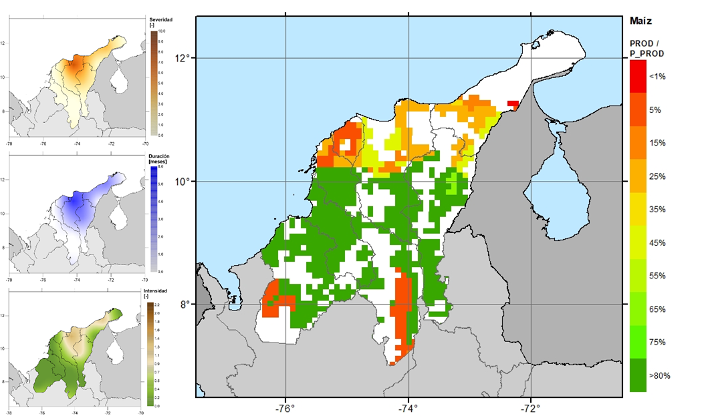{width="6.047555774278215in" height="3.585106080489939in"}

Figura 40. Caracterización de un evento de sequía en la Región Caribe de Colombia (elaboración propia).

La evaluación del riesgo se completó también a escala nacional, analizando los potenciales eventos de sequía que pueden ocurrir en el país y que fueron identificados en la etapa de la evaluación de la amenaza. El riesgo se estimó para el cultivo de maíz en Colombia, cuya localización y densidad de área sembrada se estimó en la etapa de modelación de la exposición. Haciendo uso de la metodología de la FAO para la evaluación de la vulnerabilidad y la evaluación del riesgo con enfoque probabilista, se obtuvo la curva de Pérdida Máxima Probable que se muestra en la Figura 13. Esta curva relaciona la pérdida relativa (pérdida del evento dividida por el valor expuesto total) con el periodo de retorno de esta pérdida. Entonces, para Colombia se espera una pérdida máxima probable del 5% para un periodo de retorno de 50 años, esto en términos de reducción de los ingresos del productor asociados a la reducción en el rendimiento de su cultivo.

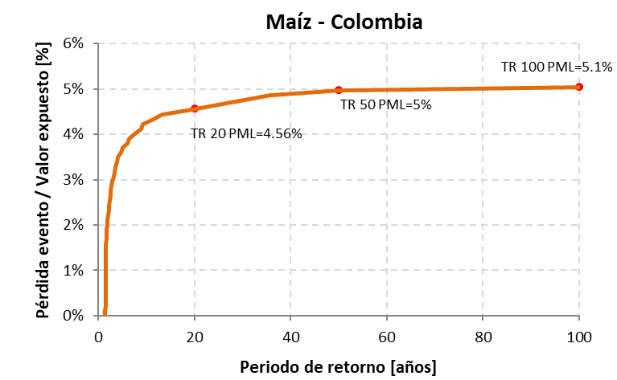{width="5.107620297462817in" height="3.1496062992125986in"}

Figura 41. Curva de Pérdida Máxima Probable para el cultivo de Maíz en Colombia (Elaboración propia).

Los resultados también se presentan distribuidos espacialmente en los mapas de la Figura 14, en los que se muestra la ubicación de los cultivos de maíz (mapa de la izquierda) y los resultados de la pérdida anual esperada relativa al valor expuesto (mapa de la derecha). A partir de estos mapas se pueden reconocer las zonas en las que el cultivo de maíz está en mayor riesgo (pixeles en rojo). Es interesante notar que, aunque la severidad e intensidad de la sequía en la Región Caribe tiende a ser más baja que en otras zonas del país como se muestra en la Figura 7, los resultados de riesgo indican que las pérdidas relativas pueden ser más altas en esta zona. Esta situación refuerza la idea de la necesidad de evaluar tanto la amenaza como el riesgo para brindar insumos a los procesos de gestión de riesgo de desastres. En este caso, la combinación de las condiciones de clima, de calidad del suelo y de superficie sembrada permiten abordar el problema de la sequía desde un enfoque integral.

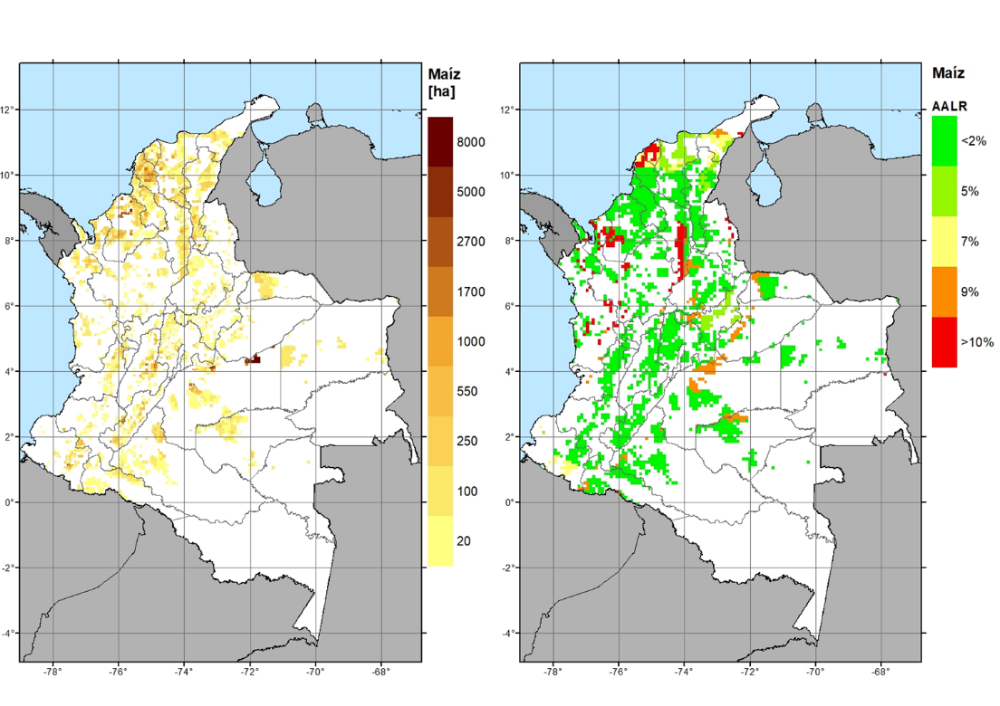{width="6.4600524934383206in" height="4.0531911636045495in"}

Figura 42. Mapas de ubicación y densidad de área sembrada de maíz (izquierda) y de pérdida anual esperada relativa (derecha) de riesgo por sequía (Elaboración propia).

Alcance de la metodología 
-------------------------

La metodología de evaluación de riesgo pretende evaluar las pérdidas en la producción potencial de cultivos expuestos a eventos extremos de clima. Esto es lo mismo que evaluar la disminución en el rendimiento de los cultivos bajo condiciones de estrés hídrico o térmico, aplicando la metodología de dinámica de respuesta de las plantas a la disponibilidad de agua. Al definir el alcance de la metodología a la estimación de pérdidas en el sector agrícola, esta metodología no considera pérdidas o afectaciones de vidas humanas. Incluso, la presente metodología no considera efectos sobre la disponibilidad de agua para suministro de agua potable, generación de energía o dinámicas del agua subterránea.

Otras consideraciones sobre el alcance de la metodología son:

-   La metodología de amenaza contempla en su alcance la generación estocástica de series de precipitación y temperatura (proceso estadístico de simulación del clima a partir de registros históricos) que no pretende ser un pronóstico. La modelación de otras variables climáticas (humedad, radiación, velocidad del viento) implica el uso de modelos complejos de circulación atmosférica e interacción de sistemas terrestres, que no está dentro del alcance de este estudio.

-   En la creación del modelo de exposición, la selección de los productos se hace a partir del nivel de detalle de la información disponible, además de considerar los cultivos más importantes y representativos de la economía del país, tanto en términos de subsistencia como producción con fines comerciales.

-   Si este modelo se enfoca en la escala nacional, no es posible diferenciar de forma directa áreas cultivadas para subsistencia o explotación agroindustrial si no existe la información correspondiente. El modelo no está en la capacidad de diferencias tipos de pasturas naturales.

-   La base de datos de cultivos generada en este estudio también incluye las prácticas agrícolas típicas de la región. El modelo de exposición incluye detalles como las épocas de primera y segunda siembra, ajustando las áreas y duración del ciclo de crecimiento del cultivo en cada caso. Estos modelos no consideran la rotación de cultivos. En el caso de cultivos permanentes, se considera que los cultivos están en etapa productiva, es decir, los árboles ya completaron su crecimiento vegetativo.

-   El modelo de vulnerabilidad de este estudio sigue la metodología de cálculo de rendimiento de productos agrícolas propuesta por la FAO. En el marco de este estudio, la vulnerabilidad se define en términos de la pérdida de rendimiento que sufre el cultivo durante un período prolongado de escasez de agua. Dado que se aplica un modelo agronómico de respuesta de cultivos, no se emplearán curvas o funciones de vulnerabilidad.

-   La estimación de impactos económicos para el sector agrícola se limita a la estimación de pérdidas asociadas a la diferencia entre la cosecha óptima y la alcanzada bajo condiciones de estrés hídrico, avaluadas según costos de producción. No se consideran pérdidas asociadas con disminución en la calidad del producto, que puede implicar un menor precio de venta. Las pérdidas se suponen que son producto del evento amenazante y no considera factores externos como variaciones del mercado, brotes de enfermedades, entre otros.

-   La metodología hace uso de rendimientos de producción (total de cosecha producida en toneladas por unidad de área en hectáreas) para las condiciones locales. Estos rendimientos, obtenidos de fuentes oficiales, son rendimientos de referencia que permiten verificar los resultados de rendimiento obtenidos con el modelo para estimar las pérdidas. Sin embargo, cabe resaltar que dichos rendimientos se asumen estáticos en el modelo dado que no se tienen en cuenta las mejores prácticas agrícolas que en un futuro puedan adoptarse y que resulten en un incremento del rendimiento de los cultivos.

+-----------------------------------------------------------------------------------------------------------------------------------------------------------------------------------------------------------------------------------------------------------------------------------------------------------------------------------------------------------------------------------------------------------------------------------------------------------------------------------------------------------------------------------------------------------------------------------------------------------------------------------------------------------------------------------------------------------------------------------------------------------------------------------------------------------------------------------------------------------------------------------------------------------------------------------------------------------------------------------------------------------------------------------------------------------------------------------------------------------------------------------------------------------------------------------------------------------------------------------------------------------------------------------------------------------------------------------------------------------------------------------------------------------------------------------------------------------------------------------------------------------------------------------------------------------------------------------------------------------------------------------------------------------------------------------------------------------------------------------------------------------+
| Caja 7. DroughtPro.                                                                                                                                                                                                                                                                                                                                                                                                                                                                                                                                                                                                                                                                                                                                                                                                                                                                                                                                                                                                                                                                                                                                                                                                                                                                                                                                                                                                                                                                                                                                                                                                                                                                                                                                   |
|                                                                                                                                                                                                                                                                                                                                                                                                                                                                                                                                                                                                                                                                                                                                                                                                                                                                                                                                                                                                                                                                                                                                                                                                                                                                                                                                                                                                                                                                                                                                                                                                                                                                                                                                                           |
| Drought Pro es un software desarrollado por INGENIAR Risk Intelligence Ltda, cuyo objetivo es la evaluación de la amenaza, vulnerabilidad y riesgo por sequía y está en desarrollo para incluir otros tipos de amenazas asociadas a eventos climáticos extremos. Permite estimar las pérdidas en los cultivos expuestos a eventos de sequía, haciendo uso de modelos de vulnerabilidad que relacionan el déficit de agua disponible para el cultivo con su crecimiento y producción de cosecha, y la vulnerabilidad del sector pecuario en términos de la disminución de la capacidad de carga de la pastura. A continuación se observa una ventana ejemplo del programa Drought Pro para la evaluación del riesgo por sequía. Drought Pro permite almacenar, editar y actualizar la información de amenazas, exposición, vulnerabilidad y riesgo. Este software es una plataforma independiente, desarrollada con herramientas de programación avanzadas.                                                                                                                                                                                                                                                                                                                                                                                                                                                                                                                                                                                                                                                                                                                                                                                                |
|                                                                                                                                                                                                                                                                                                                                                                                                                                                                                                                                                                                                                                                                                                                                                                                                                                                                                                                                                                                                                                                                                                                                                                                                                                                                                                                                                                                                                                                                                                                                                                                                                                                                                                                                                           |
| Drought Pro integra los módulos de amenaza con los módulos de exposición y vulnerabilidad para hacer una estimación de riesgo, que se presenta en términos de pérdidas económicas o de producción, para el sector agrícola y pecuario. Para calcular el riesgo por sequía en el sector agrícola en primer lugar, se modela la amenaza a partir de los registros históricos de precipitación y temperatura, con el fin de generar series futuras correlacionadas de parámetros climáticos e identificar condiciones de sequía a muy largo plazo. Posteriormente, se ingresa la base de datos de elementos expuestos con datos sobre ubicación, características de los cultivos (parámetros propios, tipo y estacionalidad), área, productividad y costo de producción de cada unidad de tierra cultivada. Luego, la vulnerabilidad de los cultivos se define a partir de parámetros fenológicos y físicos que representan el desarrollo de los cultivos y permiten estimar la diferencia entre la producción óptima de rendimiento (si no hay límites para agua y nutrientes) y producción bajo déficit hídrico. Por último, el riesgo de sequía agrícola se modela en términos de pérdidas económicas derivadas de la pérdida de rendimiento debido a la escasez de agua. El riesgo se expresa en términos de la curva de excedencia de pérdidas, la pérdida anual esperada y las pérdidas máximas probables; métricas de riesgo que son útiles para los procesos de toma de decisiones. En el caso del cálculo de riesgo del sector pecuario se ingresa la información asociada a la exposición en términos de pasturas y stock ganadero y el programa evalúa su vulnerabilidad en términos de la reducción de capacidad de carga de la pastura natural. |
|                                                                                                                                                                                                                                                                                                                                                                                                                                                                                                                                                                                                                                                                                                                                                                                                                                                                                                                                                                                                                                                                                                                                                                                                                                                                                                                                                                                                                                                                                                                                                                                                                                                                                                                                                           |
| 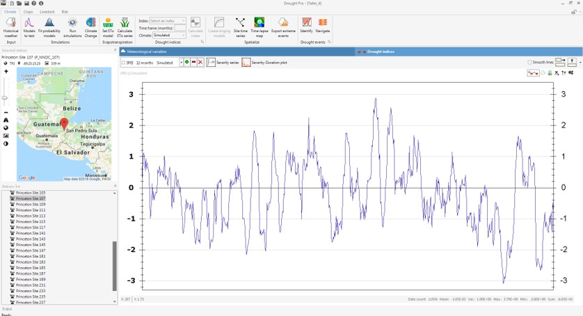{width="6.082214566929133in" height="3.295138888888889in"}                                                                                                                                                                                                                                                                                                                                                                                                                                                                                                                                                                                                                                                                                                                                                                                                                                                                                                                                                                                                                                                                                                                                                                                                                                                                                                                                                                                                                                                                                                                                                                                                                                                                       |
|                                                                                                                                                                                                                                                                                                                                                                                                                                                                                                                                                                                                                                                                                                                                                                                                                                                                                                                                                                                                                                                                                                                                                                                                                                                                                                                                                                                                                                                                                                                                                                                                                                                                                                                                                           |
| Software Drought Pro para estimación de pérdidas en producción agrícola por sequía.                                                                                                                                                                                                                                                                                                                                                                                                                                                                                                                                                                                                                                                                                                                                                                                                                                                                                                                                                                                                                                                                                                                                                                                                                                                                                                                                                                                                                                                                                                                                                                                                                                                                       |
|                                                                                                                                                                                                                                                                                                                                                                                                                                                                                                                                                                                                                                                                                                                                                                                                                                                                                                                                                                                                                                                                                                                                                                                                                                                                                                                                                                                                                                                                                                                                                                                                                                                                                                                                                           |
| Drought Pro calcula para múltiples escenarios de clima y cultivos las principales métricas de riesgo de forma simultánea. Se obtienen entonces resultados tanto para el portafolio completo de cultivos, como desagregado por producto. Para más información visitar <http://www.ingeniar-risk.com/servicios/software/capra/drought-pro>                                                                                                                                                                                                                                                                                                                                                                                                                                                                                                                                                                                                                                                                                                                                                                                                                                                                                                                                                                                                                                                                                                                                                                                                                                                                                                                                                                                                                  |
+-----------------------------------------------------------------------------------------------------------------------------------------------------------------------------------------------------------------------------------------------------------------------------------------------------------------------------------------------------------------------------------------------------------------------------------------------------------------------------------------------------------------------------------------------------------------------------------------------------------------------------------------------------------------------------------------------------------------------------------------------------------------------------------------------------------------------------------------------------------------------------------------------------------------------------------------------------------------------------------------------------------------------------------------------------------------------------------------------------------------------------------------------------------------------------------------------------------------------------------------------------------------------------------------------------------------------------------------------------------------------------------------------------------------------------------------------------------------------------------------------------------------------------------------------------------------------------------------------------------------------------------------------------------------------------------------------------------------------------------------------------------+

CONCLUSIONES
============

Con el objetivo de identificar y cuantificar la amenaza asociada a fenómenos hidrometeorológicos para el sector agropecuario, se presentó una metodología con enfoque probabilista para la simulación de eventos peligrosos mediante la simulación de condiciones climáticas que combinan eventos extremos de precipitación y temperatura durante un tiempo prolongado, sobre un área geográfica concreta. Como resultado se obtuvieron mapas de amenaza integrada por sequía para Colombia, caracterizados por condiciones de severidad, duración e intensidad del fenómeno para 50, 100, 250 y 500 años de periodo de retorno. A partir de estos mapas se pueden identificar las zonas más propensas a sufrir sequías graves.

Como parte de este estudio se construyó un modelo de exposición de cultivos para Colombia, con una resolución de 10 km × 10 km para todo el territorio continental. Este modelo de exposición, derivado de información de censos y encuestas agrícolas, caracteriza la ubicación, densidad de siembra, estacionalidad del cultivo y avalúo del producto para la actividad agrícola y pecuaria del país.

En el marco de este estudio, la vulnerabilidad se define en términos de la pérdida de rendimiento que sufre el cultivo durante un período prolongado de escasez de agua. En este caso no se emplean curvas de vulnerabilidad. Con un enfoque innovador, se acopló un modelo agronómico de respuesta de cultivos al enfoque de evaluación prospectiva del riesgo.

Se presenta la aplicación de la metodología de evaluación prospectiva del riesgo asociadas a sequías extremas en las áreas cultivadas de maíz en Colombia. Los resultados del modelo indican que la pérdida anual esperada, en términos de costos relativos al productor, es del 5%. Este no es un modelo de pretenda pronosticar eventos meteorológicos extremos, por lo que no es posible su uso como sistema de alerta temprana.

+-------------------------------------------------------------------------------------------------------------------------------------------------------------------------------------------------------------------------------------------------------------------------------------------------------------------------------------------------------------------------------------------------------------------------------------------------------------------------------------------------------------------------------------------------------------------------------------------------------------------+
| PUNTOS CLAVE                                                                                                                                                                                                                                                                                                                                                                                                                                                                                                                                                                                                  |
|                                                                                                                                                                                                                                                                                                                                                                                                                                                                                                                                                                                                                   |
| 1.  La identificación del riesgo por eventos hidrometeorológicos sigue la metodología de análisis probabilista que tiene como objetivo estimar la distribución de probabilidad de la pérdida que puede presentarse en un conjunto de elementos expuestos, tras la ocurrencia de un fenómeno natural.                                                                                                                                                                                                                                                                                                              |
|                                                                                                                                                                                                                                                                                                                                                                                                                                                                                                                                                                                                                   |
| 2.  La modelación probabilista permite realizar pronósticos sobre los niveles futuros de pérdida más no de eventos; considerando la amenaza propia de la región de estudio y la incertidumbre en su estimación, así como la vulnerabilidad inherente de los elementos expuestos y su incertidumbre.                                                                                                                                                                                                                                                                                                               |
|                                                                                                                                                                                                                                                                                                                                                                                                                                                                                                                                                                                                                   |
| 3.  La amenaza se representa por medio de una colección de escenarios, generados de manera estocástica, los cuales representan de manera integral, y en términos de probabilidad, la amenaza de una región. Cada escenario tiene asociada una frecuencia de ocurrencia y contiene la distribución espacial de parámetros que permiten construir la distribución de probabilidad de las intensidades producidas por su ocurrencia.                                                                                                                                                                                 |
|                                                                                                                                                                                                                                                                                                                                                                                                                                                                                                                                                                                                                   |
| 4.  Los elementos expuestos son la fuente de las pérdidas potenciales debido al hecho de estar expuestos a una amenaza y ser susceptibles de sufrir un daño. Estos elementos se caracterizan por su ubicación geográfica, su valor de reposición y tipo.                                                                                                                                                                                                                                                                                                                                                          |
|                                                                                                                                                                                                                                                                                                                                                                                                                                                                                                                                                                                                                   |
| 5.  La vulnerabilidad es una característica intrínseca de los elementos expuestos y que caracteriza el comportamiento de los elementos expuestos (cultivos) durante la ocurrencia de un evento peligroso (sequía, inundación, helada, entre otros). La metodología de vulnerabilidad de respuesta de los cultivos al agua está asociada a reducciones en el rendimiento del cultivo según el uso de parámetros específicos por especie que definen los procesos físicos, químicos y biológicos que interactúan en el modelo de desarrollo de la planta y sus interacciones con los sistemas de atmósfera y suelo. |
|                                                                                                                                                                                                                                                                                                                                                                                                                                                                                                                                                                                                                   |
| 6.  El riesgo se expresa en términos de la curva de excedencia de pérdidas, la pérdida anual esperada y las pérdidas máximas probables; métricas de riesgo que son útiles para los procesos de toma de decisiones.                                                                                                                                                                                                                                                                                                                                                                                                |
+-------------------------------------------------------------------------------------------------------------------------------------------------------------------------------------------------------------------------------------------------------------------------------------------------------------------------------------------------------------------------------------------------------------------------------------------------------------------------------------------------------------------------------------------------------------------------------------------------------------------+

MATERIALES Y MÉTODOS
====================

En esta sección se describen en detalle las metodologías utilizadas para la generación estocástica de series climáticas, la evaluación de la amenaza por sequía y la evaluación de la respuesta de los cultivos a condiciones de estrés hídrico.

Generación estocástica de series climáticas futuras
---------------------------------------------------

La metodología propuesta utiliza distribuciones paramétricas de probabilidad para definir conjuntos de datos climáticos históricos y estimar la probabilidad de ocurrencia de un determinado valor de precipitación o temperatura fuera del rango de observaciones históricas. La metodología toma cada día o grupo de 10 días del año hidrológico en un análisis separado, y encuentra la distribución de probabilidad que se ajusta mejor a los registros históricos. Posteriormente, se generan números aleatorios para la precipitación diaria y la temperatura para un determinado número de años de simulación, usando los parámetros de las distribuciones seleccionadas. Estas series generadas aleatoriamente se correlacionan en el tiempo y en el espacio para representar las condiciones climáticas de la región de análisis.

### Generación de series aleatorias 

El primer paso es seleccionar las funciones de distribución de probabilidad que pueden ser aplicadas a la modelación de cada variable. Se consideran distribuciones normalmente empleadas en ciencias atmosféricas como son Gamma, Lognormal, Normal, Weibull o Gumbel, entre otras. Posteriormente, para cada día del año, los parámetros de las distribuciones seleccionadas se estiman mediante el método de los momentos o de máxima verosimilitud.

El ajuste de las distribuciones de probabilidad se evalúa usando métodos cualitativos y cuantitativos. Los métodos cualitativos incluyen herramientas gráficas para discernir subjetivamente la bondad del ajuste. Se utiliza la superposición de la distribución paramétrica ajustada y el histograma de datos, gráficos cuantil-cuantil, gráficos de distribución acumulativa empírica y teórica (CDF), y gráficos de probabilidad-probabilidad o comparaciones de probabilidad acumulativa. La selección cualitativa se realiza con el Criterio de Información de Akaike (AIC) o el Criterio Bayesiano de Información (BIC), que miden la calidad relativa de los modelos de distribución para un conjunto dado de datos. Está claro que los criterios AIC y BIC no dan ninguna indicación sobre la calidad del modelo, sino que es una comparación entre la bondad de ajuste de cada modelo y su complejidad en términos de un valor de penalización que aumenta con el número creciente de parámetros ajustados [30].

Numerosas alternativas de distribuciones de probabilidad se ponen a prueba para cada día del año hidrológico y cada variable climática. Un ejemplo de las gráficas para definir la selección cualitativa de la distribución de probabilidad que mejor se ajusta se muestra en la Figura 15, tanto para la temperatura media diaria (izquierda) como para la precipitación total diaria (derecha). El número de datos empíricos de cada gráfica es 300, que en este caso corresponden a 30 años de periodo de registro histórico por 10 días de datos diarios en el acumulado decadal.

Luego de definir la distribución de probabilidad más apropiada para la precipitación y la temperatura (media, máxima y mínima), para cada uno de los 365 días del año o grupo de 10 días consecutivos (decadales), se generan números aleatorios para un determinado número de años de simulación (del orden de 1,000 años o más). Así, se producen series aleatorias de datos climáticos para cada una de las estaciones en el área de estudio.

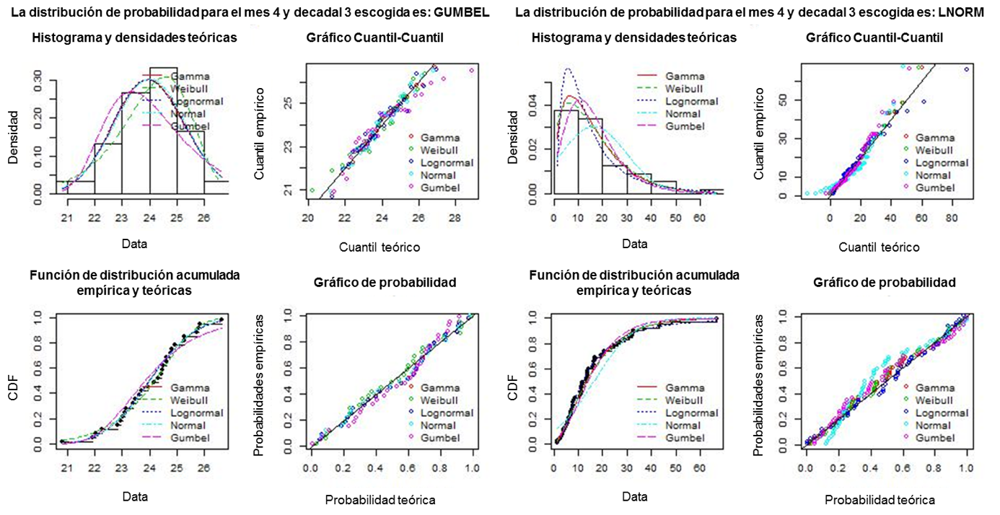{width="6.2992104111986in" height="3.2441469816272965in"}

Figura 43. Ajuste de distribuciones de probabilidad para registros históricos del 1ro enero para un punto de la malla de análisis: Temperatura media (izquierda) y precipitación total diaria (derecha) (Fuente: elaboración propia).

Para evaluar el ajuste de las distribuciones de probabilidad se utilizó la prueba de ajuste con los coeficientes de Anderson-Darling (no está definida para distribuciones Pearson Tipo III o Logísticas) y Kolmogorov-Smirnov. Para definir si la muestra sigue una cierta distribución, se comparó el valor de significancia p-value con un nivel de 0.05, que implica que la probabilidad de concluir que los datos no siguen una distribución de probabilidad definida, cuando si siguen esa distribución, es del 5%. Al obtener valores de p-value por encima del nivel de significancia, no se puede rechazar la hipótesis nula ni concluir que los datos no se ajustan a la distribución considerada.

### Series de precipitación

Como caso particular, para la generación estocástica de series de precipitación se debe considerar el efecto de los días de no lluvia para el ajuste de la función de distribución de probabilidad. En la Figura 16 se presenta el histograma de valores de precipitación diaria para 1) un día de temporada seca 2) un día de temporada de lluvias. Se puede ver como para la temporada seca más del 95% de los datos se concentran en el valor 0, mientras que para la temporada de lluvias los días secos son menos del 10%. Esto implica que en el momento de la selección de una distribución de probabilidad que mejor se ajuste a los valores de precipitación, se pueden tener inconvenientes cuando la mayoría de los valores son iguales a cero, lo que deriva en un mal ajuste de probabilidades. Por esta razón, para días en temporada seca se hace un procedimiento adicional para el ajuste de la distribución de probabilidad.

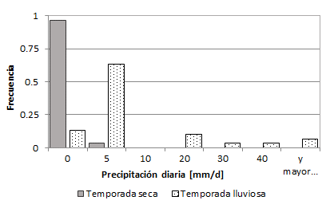{width="3.6666666666666665in" height="2.1247878390201227in"}

Figura 44. Histograma para valores de precipitación registrados en día de temporada seca y un día en temporada de lluvias (Fuente: elaboración propia).

La Figura 17 muestra las funciones de densidad de probabilidad y de probabilidad acumulada para el caso en que el número de días secos en la muestra sea muy alto. En ese caso, se divide la función de densidad de probabilidad en dos partes 1) cuando la precipitación es igual a cero ${(P}_{0})$ 2) cuando la precipitación es mayor a cero (1-$P_{0}$). La probabilidad de que ocurra un día seco se define como:

  ----------------------------------------------------------------------------- -------
  $$P_{0} = frac{n}{N} = frac{# días secos}{# días en la muestra}$$   (1)
  ----------------------------------------------------------------------------- -------

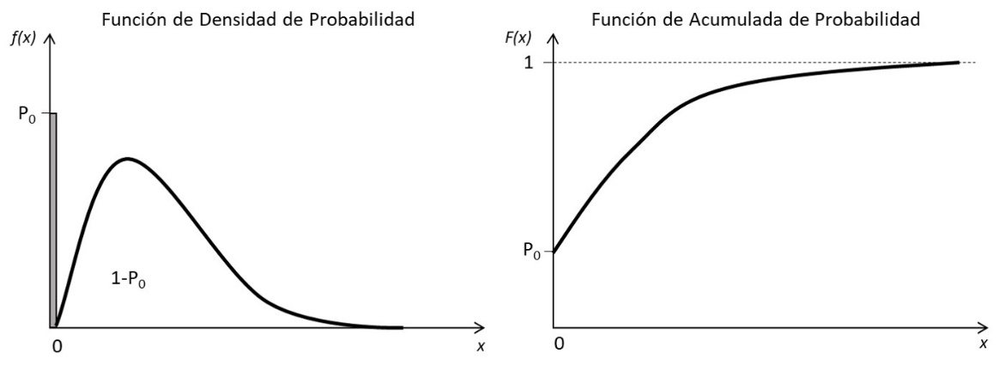{width="5.289615048118985in" height="1.9646052055993002in"}

Figura 45. Funciones de densidad de probabilidad y probabilidad acumulada teniendo en cuenta p = 0 (Fuente: elaboración propia).

Al seguir este procedimiento, se obtienen series de precipitación que mantienen la relación histórica de días de no lluvia con respecto al total de días, según la temporada del régimen de lluvias. Si se utiliza la función de densidad de probabilidad sin hacer este ajuste, no se obtienen días secos en las series aleatorias.

### Correlación de series

Enseguida, con el fin de incluir la correlación existente entre valores de precipitación y temperatura en periodos de tiempo sucesivos, se calcula la matriz de autocorrelación para cada una de las series aleatorias generadas. La autocorrelación temporal indica la correlación de una variable con sus valores pasados y futuros [31]. Además, se incluyen los efectos de la correlación espacial, que representan la aparición de datos simultáneos en múltiples estaciones del área de estudio, utilizando la matriz de autocorrelación espacial entre valores de las diferentes estaciones de registro.

Las series de números aleatorios correlacionados son estadísticamente correspondientes a las series históricas y preservan estadísticos de segundo orden (correlación espacial) al hacerlo de forma forzada sobre los registros históricos. De esta manera, se evitan cambios abruptos en los valores de precipitación y temperatura para días consecutivos.

Evapotranspiración de referencia
--------------------------------

El cálculo de los indicadores de sequía propuestos requiere del cálculo previo de la evapotranspiración de referencia, para evaluar las condiciones atmosféricas que definen si se presenta un exceso de agua en la atmósfera (baja evapotranspiración) o un déficit (alta evapotranspiración y poca lluvia). La evapotranspiración de referencia se estima siguiendo el Manual *Crop evapotranspiration: Guidelines for computing crop requirements* [32]*,* que es considerado el método estándar y es el más recomendado.

La evapotranspiración de referencia es el potencial de evaporación de la atmósfera; se calcula en una superficie vegetal uniforme sin restricciones hídricas. La superficie de referencia es un cultivo hipotético con una altura asumida de 0,12 m, una resistencia superficial fija de 70 s/m y un albedo de 0,23 [32]; es independiente del tipo de cultivo, de su desarrollo o de su manejo. Al no tener restricciones en el contenido de agua, las características del suelo tampoco influyen en su resultado. Estas condiciones permiten comparar los resultados en diferentes localizaciones o estaciones para evaluar las condiciones evaporativas de la atmósfera ya que el ETo únicamente varía según las condiciones climáticas presentes.

Es importante señalar que la evapotranspiración de referencia ($text{ET}_{0}$) es diferente a la evapotranspiración del cultivo bajo condiciones estándar ($text{ET}_{c}$) y a la evapotranspiración del cultivo bajo condiciones no estándar ($text{ET}_{text{c aj}}$). La evapotranspiración del cultivo bajo condiciones estándar ($text{ET}_{c}$) considera características particulares según el tipo de cultivo que se esté evaluando (resistencia del cultivo, albedo, anatomía de las hojas, características de los estomas, propiedades aerodinámicas, entre otros). Por otro lado, la evapotranspiración del cultivo bajo condiciones no estándar ($text{ET}_{text{c aj}}$) considera cultivos que crecen bajo condiciones ambientales y de manejo diferentes a condiciones óptimas de suelo y agua, presencia de enfermedades o fertilización que implican cambios en el rendimiento de la cosecha.

El método de Penman-Monteith (ver (2) para el cálculo de la evapotranspiración de referencia permite cuantificar los procesos de evaporación (vaporización de agua desde una superficie: suelo, vegetación húmeda) y transpiración (vaporización del agua contenida en los tejidos vegetales), que ocurren simultáneamente. Los parámetros necesarios para el cálculo son el brillo solar, la temperatura, la humedad, la velocidad del viento, el flujo de vapor y la resistencia aerodinámica.

  -------------------------------------------------------------------------------------------------------------------------------------------------------------------------- -----
  $$text{ET}_{0} = frac{0.408Deltaleft( R_{n} - G right) + gammafrac{900}{T + 273}u_{2}left( e_{s} - e_{a} right)}{Delta + gammaleft( 1 + 0.34u_{2} right)}$$   (2)
  -------------------------------------------------------------------------------------------------------------------------------------------------------------------------- -----

En donde $R_{n}$ es la radiación neta, $G$ es el flujo de calor del suelo, $gamma$ es la constante psicrométrica, $T$ es la temperatura promedio diaria, $u_{2}$ es la velocidad del viento (a 2m de la superficie), $left( e_{s} - e_{a} right)$ representa el déficit de presión de vapor y $Delta$ es la pendiente de la curva de presión de vapor. La aplicación de la metodología de Penman-Monteith implica la recopilación de información meteorológica que puede no estar disponible en todos los casos. Los parámetros meteorológicos faltantes se establecen a partir de criterio de expertos, información meteorológica general de la región y las reglas de cálculo recomendadas por la FAO [33].

El cálculo de la evapotranspiración de referencia puede ser complejo porque involucra numerosos parámetros climáticos que son difíciles de obtener en bases de datos de registros históricos. Variables como la humedad del aire, la radiación, la presión atmosférica y la velocidad del viento no se suelen medir en todas las estaciones de monitoreo, por lo que la cantidad y calidad de registros es muy baja. La Universidad de Princeton publicó una base de datos de información climática [18] que es utilizada como fuente de información para este estudio. La información disponible está en formato NetCDF (archivos de extensión nc) y para este estudio se utilizaron las mallas de resolución 0.5° × 0.5°.

Indicadores de sequía
---------------------

Dependiendo del tipo de sequía a evaluar, se pueden incluir diferentes parámetros en el cálculo de los índices. Las sequías meteorológicas están condicionadas a la deficiencia de precipitación en términos de cantidad, intensidad y tiempo de precipitación, y al aumento de la evaporación y transpiración a causa de altas temperaturas, vientos fuertes, baja humedad relativa, intenso sol y menor nubosidad. Las sequías agrícolas están condicionadas por la deficiencia de agua en el suelo en términos de estrés hídrico para las plantas, y la reducción en la biomasa y el rendimiento. Las sequías hidrológicas están determinadas por la reducción en caudales de ríos y quebradas, almacenamiento reducido de los embalses y reducción de los humedales. Esta clasificación de sequías, como sequía meteorológica, agrícola, hidrológica y socioeconómica fue defina por primera vez por Wilhite y Glantz [34].

Según Jayanthi [35], los indicadores de sequía agrícola deben integrar las variables pluviométricas y de temperatura, junto con la evapotranspiración para el monitoreo efectivo de los cultivos de secano, pastos y pastizales. Banimahd y Khalili [30] compararon los índices de sequía agrícola más utilizados, como el Palmer Drought Severity Index (PDSI) [36], el Standarized Precipitation Index (SPI) [37], el Effective Drought Index (EDI) [38], el Reconnaissance Drought Index (RDI) [39] y el Standardized Precipitation Evapotranspiration Index (SPEI) [40]. Sus resultados mostraron que la SPEI y la RDI detectaron de manera más apropiada las severidades de sequía máximas, enfatizando el importante papel de la evapotranspiración. Estos resultados son consistentes con el trabajo de Tsakiris et al. [39], en donde se demuestra que la sola precipitación no correlaciona satisfactoriamente con la producción de rendimiento en cultivos, sino que se requiere la incorporación de la evapotranspiración de referencia (que depende directamente de la temperatura), para describir apropiadamente la ocurrencia de las sequías. Para este modelo, se propone emplear el RDI y el SPEI, los cuales incorporan la precipitación y las temperaturas media, máxima y mínima en su cálculo.

Este estudio no incluye el uso de indicadores que tienen en cuenta parámetros propios del suelo o del cultivo para definir un evento de sequía, como el Indicador de Palmer. Esto se debe a que en el módulo de amenaza del modelo probabilista de sequía se evalúan las condiciones de tiempo (precipitación y temperatura) únicamente, para clasificar los eventos de sequía independientes de sus posibles efectos en elementos socioeconómicos. De esta forma se puede evaluar la amenaza independiente de la vulnerabilidad de los elementos expuestos. Es en el módulo de vulnerabilidad que se incluyen los parámetros propios del suelo y cultivos existentes en cada unidad de tierra cultivada dentro del área de análisis.

Los indicadores estandarizados de sequía, como el RDI y el SPEI, pueden compararse entre sí en dimensiones espaciales y temporales. La severidad de la sequía caracterizada aplicando estos indicadores, se puede clasificar de acuerdo con lo presentado en la Tabla 9.1.

Tabla 9.1. Clasificación de sequías de acuerdo con el valor de indicadores estandarizados.

  Clase de sequía   Valor del Indicador
  --------------------- -------------------------
  No ocurre sequía      Mayor a 0
  Leve                  Entre -1 y 0
  Moderada              Entre -1.5 y -1
  Severa                Menor a -1.5

Nótese que, en todos los casos, los indicadores reflejan condiciones de sequía cuando sus valores son negativos, siendo las sequías más severas las asociadas a valores más negativos. Es conveniente evaluar los escenarios de sequía con más de un indicador, ya que ninguno de ellos puede aplicarse universalmente debido a la complejidad de esta amenaza y a las condiciones particulares de las diversas zonas climáticas [39]. Los indicadores se calculan para cada serie (histórica o simulada) en cada uno de los puntos de la malla de análisis.

La selección del indicador más apropiado depende de la adaptación de cada parámetro (α en el caso de RDI y *D* para SPEI) a sus funciones de probabilidad teóricas (log-normal para RDI y log-logística de 3 parámetros para SPEI), así como el ajuste de los indicadores mismos a una distribución de probabilidad Normal Estándar, condición que debe cumplirse como consecuencia de la estandarización.

Adicionalmente, la escala de tiempo también puede definir la selección del indicador apropiado. Las escalas de tiempo cortas se relacionan principalmente con el contenido de agua en el suelo y los flujos superficiales, las escalas de tiempo medias están relacionadas con los almacenamientos de embalses y las escalas de tiempo largo están relacionadas con las variaciones en el almacenamiento de agua subterránea [40]. Por lo tanto, las escalas de tiempo corto (3 a 6 meses) pueden describir mejor las sequías agrícolas, mientras que las escalas a largo plazo (de 12 a 24 meses) pueden describir mejor las sequías hidrológicas. Por ejemplo, para el estudio de caso de Banimahd y Khalili [30], las severidades de sequía máxima en una escala de tiempo anual fueron detectadas por SPEI, mientras que las severidades de sequía de las escalas temporales de 3 y 6 meses fueron detectadas por RDI. La metodología propuesta puede adaptarse a diferentes escalas de tiempo para seleccionar el indicador de sequía más apropiado.

Mapas de amenaza por sequía
---------------------------

Los resultados de la modelación de la amenaza se presentan a continuación en formato de mapas de amenaza por escenario, y curvas y mapas de amenaza integrada para toda la región estudio. Los mapas de amenaza por escenario permiten comparar la intensidad y distribución espacial de los efectos de un único evento. Los mapas de amenaza integrada permiten comparar las intensidades según el periodo de retorno y establecer zonas que están más o menos expuestas a la amenaza de sequía dentro de la región.

La interpolación espacial se realiza utilizando el método kriging, que es método geoestadístico que supone una correlación espacial entre puntos y tienen la capacidad de proporcionar al modelador una medida de certeza o precisión de las predicciones [41]. Este método permite obtener predicciones de valores de los parámetros que definen la sequía en ubicaciones diferentes a los puntos donde se hicieron las mediciones (en este caso la malla de análisis sobre los tres países). Usando kriging se puede obtener un mapa de formato ráster, en la que se calcula el valor del parámetro en cada pixel. Kriging es un método conveniente porque permite interpolar espacialmente sin conocer la varianza de los parámetros de interés. Al comparar con otros métodos de interpolación espacial, el kriging se considera un método robusto, pero de alta demanda computacional ya que utiliza los datos medidos para modelar el variograma y hacer las predicciones. Por otro lado, métodos más sencillos, como el de la distancia inversa ponderada (IDW) que es un método determinista, no brindan información sobre la certeza de los resultados, o definen una covarianza generalizada sin considerar los datos medidos como el método spline. Para más información sobre metodologías de interpolación espacial se recomienda consultar el manual de ArcGIS disponible en línea [42] en español que presenta una descripción detallada y sencilla de diferentes métodos, o documentos como el de Li & Heap [43] que presenta un compilado de los diferentes métodos y sus respectivos alcances (en inglés).

### Mapas de amenaza integrada

La amenaza se integra mediante un proceso matemático que permite definir las curvas de excedencia de intensidad en cada punto de la malla de cálculo. La tasa de excedencia es una cantidad que mide el número de veces al año que un valor de intensidad es igualado o excedido. Sea *a* la medida de intensidad calculada (e.g. RDI, severidad, duración, etc), su tasa de excedencia ν(*a*), para una ubicación en la malla de cálculo, se determina como

  ------------------------------------------------------------------------------ -------
  $$nuleft( a right) = sum_{i = 1}^{N}{Pleft( A > a|E_{i} right)F_{i}}$$   (3)
  ------------------------------------------------------------------------------ -------

en donde *N* es el número total de escenarios calculados, Pr (*A* > *a* | *E~i~*) es la probabilidad de exceder *a*, condicionada a la ocurrencia del escenario *i* y *F~i~* es la frecuencia anual de ocurrencia del escenario *i*.

Teniendo las tasas de excedencia de la medida de intensidad en todos los puntos de la malla de cálculo, es posible generar mapas de igual periodo de retorno, por medio de la selección de una tasa de excedencia (que es inversa al periodo de retorno) y la lectura en cada curva del correspondiente valor de intensidad. Los valores leídos son entonces mapeados en una malla que tiene el mismo periodo de retorno en todas las ubicaciones. Estos mapas son una herramienta útil para la toma de decisiones, ya que no representan un único evento de amenaza, sino que integran los efectos de todos los eventos que potencialmente pueden ocurrir en el futuro. También permiten comparar los niveles de amenaza con diferentes períodos de retorno y establecer cuáles ubicaciones o regiones en el territorio tienen una mayor o menor propensión a sufrir sequías. Por lo tanto, son un insumo fundamental en el diseño y ejecución de regulaciones de uso de la tierra o proyectos de sistemas de riego en la región de estudio. Los mapas de amenaza uniforme se calculan mediante la aplicación del teorema de la probabilidad total en la colección de escenarios estocásticos de sequía.

Modelo de respuesta de cultivos a eventos extremos
--------------------------------------------------

El modelo de respuesta de cultivos tiene cuatro componentes principales: el clima (en términos de temperatura, precipitación, demanda por evaporación y concentración de dióxido de carbono), los cultivos (procesos de desarrollo, crecimiento y rendimiento), el suelo (balance de agua y sal) y el manejo y administración (prácticas agrícolas). Cada uno de los componentes se explica brevemente a continuación, según lo contenido en Steduto et al. [15].

### Clima

La temperatura influye en el desarrollo de los cultivos y la precipitación es determinante para el balance hídrico del suelo en la zona radicular y el estrés hídrico. Por lo tanto, las principales variables climáticas para el modelo son las temperaturas máximas y mínimas diarias del aire, las precipitaciones diarias totales y la demanda evaporativa de la atmósfera, expresadas como evapotranspiración. Para el caso del modelo de evaluación del riesgo aplicado en este estudio, todas estas variables climáticas se calculan previamente en la evaluación de la amenaza y se utilizan para calcular los indicadores de clima extremo.

Adicionalmente, la concentración de dióxido de carbono (CO~2~) se incluye en la evaluación, ya que es un aspecto que afecta la expansión del cultivo y la conductancia estomática. Los valores por defecto de las concentraciones anuales de CO~2~ se miden en el Observatorio Mauna Loa, en Hawái ([www.esrl.noaa.gov/gmd/obop/mlo/](http://www.esrl.noaa.gov/gmd/obop/mlo/)). Para el caso de la evaluación prospectiva de riesgo, se utiliza la concentración de dióxido de carbono para el último año disponible en la evaluación base y para la evaluación de los modelos con cambio climático se usan las proyecciones de concentración de dióxido de carbono según el escenario de RCP (trayectoria representativa de concentración) analizada.

### Cultivo

Los cultivos se modelan en términos de los procesos biológicos, físicos y químicos que determinan su rendimiento. El modelo permite evaluar cómo los cultivos crecen y se desarrollan a lo largo de su ciclo de crecimiento específico, creciendo el follaje, profundizando sus raíces y acumulando biomasa. Todas las etapas fenológicas (o etapas de crecimiento) se consideran en el modelo: vegetativo, floración, formación de rendimiento y maduración, incluyendo etapas fenológicas distintas para cultivos herbáceos o forrajeros.

La fenología se refiere a las etapas de desarrollo de los cultivos y su duración, que se puede definir en días de grado de crecimiento (GDD -- *Growing Deegre Days*) o días calendario. La cobertura vegetal (CC -- *Canopy Cover*) es la representación de la cantidad de follaje, la cual se considera proporcional a la cantidad de agua transpirada y la cantidad de biomasa producida. El subcomponente de profundidad de enraizamiento modela el proceso en el cual las raíces se profundizan a una tasa relativa constante mientras que la planta crece hasta la fase de formación de rendimiento. El modelo puede incluir los efectos de capas de suelo o nivel freático superficial que restringen de crecimiento de las raíces.

En la Figura 18 se muestran las curvas de la cobertura vegetal y profundidad de la raíz. La curva en la parte superior representa el desarrollo de la cobertura vegetal a partir de la expansión (CGC: coeficiente de crecimiento vegetal -- *Canopy Growth Coefficient*) y la disminución (CDC: coeficiente de disminución vegetal -- *Canopy Decline Coefficient*). La cobertura vegetal se expresa como una fracción de suelo sombreado por las hojas o partes aéreas de las plantas, siendo su nivel máximo (CCx) específico del cultivo. La segunda curva representa la profundidad de enraizamiento efectiva, desde su valor mínimo (Zn) en el momento de la siembra hasta su valor máximo (Zx) en la fecha que se alcanza la madurez del cultivo. Este conjunto de curvas representa el desarrollo del cultivo y su interacción con los sistemas de suelo y aire.

El modelo permite calcular la transpiración de los cultivos separadamente de la evaporación del suelo. El subcomponente de transpiración de cultivos determina el uso de agua de la planta cuando no hay estrés que limite la apertura estomática, característica que es específica del tipo de cultivo y cambia durante su desarrollo. La evaporación del suelo considera la pérdida de agua de la superficie del suelo húmedo no sombreado por la vegetación. Los dos últimos subcomponentes, producción de biomasa y rendimiento cosechable, se pueden resumir en las ecuaciones 4 y (5. La producción de biomasa se define como:

  --------------------------------------- -----
  $$B = text{WP}*sum_{}^{}text{Tr}$$   (4)
  --------------------------------------- -----

En donde $B$ es la biomasa producida acumulada, $text{Tr}$ es la transpiración del cultivo sumada durante el período de producción de la biomasa y $text{WP}$ es el parámetro de productividad del agua medido como la cantidad de biomasa seca (kilogramos) por unidad de área (m^2^) y de agua transpirada (mm). La robustez del modelo depende de la naturaleza conservadora del $text{WP}$ que permanece constante en un rango de ambientes, cuando se normaliza para demandas evaporativas.

{width="4.356176727909012in" height="2.150699912510936in"}

Figura 46. Representación esquemática del desarrollo en el tiempo de la cobertura vegetal y la profundidad de enraizamiento (Elaboración propia a partir de [15] p. 23).

Finalmente, se utiliza un índice de cosecha $text{HI}$ para estimar el rendimiento $Y$ de la biomasa producida $B$. Al hacer esta distinción entre la biomasa y el rendimiento, se pueden evaluar por separado los efectos de las condiciones climáticas sobre la producción de biomasa y la cosecha.

  --------------------- ----
  $$Y = text{HI}*B$$   ()
  --------------------- ----

La Figura 19 muestra la función del cambio del índice de cosecha $text{HI}$ en el tiempo para cultivos de frutas o granos, para el período de formación del rendimiento (fase de floración hasta la madurez fisiológica). $text{HI}$ comienza a partir de cero, en un crecimiento lento pero acelerado seguido por una tasa de aumento constante hasta que se alcanza el rango superior $text{HI}_{o}$. Este nivel superior es el índice de cosecha de los cultivos en condiciones óptimas, es específico del tipo de cultivo y se dispone de datos para su calibración.

{width="4.246527777777778in" height="3.303260061242345in"}

Figura 47. Representación esquemática del cambio en el tiempo del índice de cosecha (HI) para cultivos de frutas o granos (Elaboración propia a partir de [15] p. 27).

### Suelo

El componente de suelo incluye su perfil en profundidad y las características del nivel freático dentro del sistema radicular de la planta, expresando la región radicular como un volumen de control en donde se estiman los balances de agua y sal. El suelo puede ser subdividido en capas de profundidad variable, cada una con diferentes características físicas como el contenido de agua en el suelo saturado, el límite superior de agua contenida o capacidad de campo (FC -- *Field Capacity*), el punto de marchitamiento permanente (PWP -- *Permanent Wilting Point*) o límite inferior del nivel de agua, y la conductividad hidráulica del suelo saturado (Ksat). Estos valores son las entradas para determinar la evaporación del suelo, el drenaje interno, la percolación profunda, el escurrimiento superficial y la capilaridad. El nivel freático debe caracterizarse en términos de su profundidad y salinidad.

La Figura 20 es una representación simplificada del modelo del sistema radicular, donde Dr representa el agotamiento de la raíz y Wr es la profundidad equivalente del agua. El agua disponible total (TAW -- *Total Avaliable Water*) es la cantidad de agua retenida en la zona de raíces entre la capacidad de campo (límite superior) y el punto de marchitamiento permanente (límite inferior).

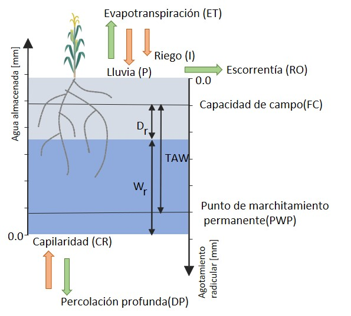{width="3.392225503062117in" height="3.061554024496938in"}

Figura 48. Representación esquemática del volumen de control de la zona radicular (Elaboración propia a partir de [15] p. 28).

El balance hídrico dentro de la zona radicular se calcula día a día, y para cualquier momento del desarrollo del cultivo. Los caudales de agua entrantes considerados en el modelo son provistos por las lluvias, el riego y la capilaridad. Por otro lado, los flujos de agua salientes considerados en el modelo son el escurrimiento, la evapotranspiración y la percolación profunda.

Los parámetros necesarios para estimar la capacidad de suelo de almacenar y retener agua se muestran en la Figura 21. Dependiendo del nivel del agua en el suelo se define la disponibilidad del agua para la planta. Es así como después de una lluvia, el agua puede quedar en exceso de la cual una fracción se convierte en escorrentía y la otra fracción se infiltra por fuerzas gravitacionales. Esta agua infiltrada pasa de un nivel de saturación (en el cual no hay contenido de aire en el suelo) al nivel que tiene el suelo de retener el agua o capacidad de campo (Field capacity en inglés). A medida que el agua se infiltra en el suelo, las plantas pierden la posibilidad de usar el agua, hasta llegar al punto de marchitamiento definitivo, en el que la planta no cuenta con agua disponible y no se puede recuperar. El rango de agua disponible para la planta se ubica entre la capacidad de campo y el punto de marchitamiento, en el que el suelo es capaz de retener el agua. Entonces el modelo de vulnerabilidad evalúa si el contenido de agua en el suelo se ubica dentro del rango de agua disponible que tiene la planta y ajusta el desarrollo del cultivo según las condiciones de estrés hídrico que sufra.

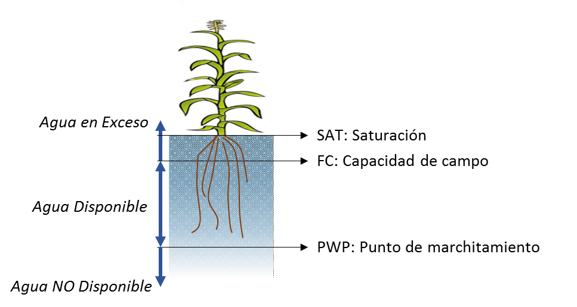{width="4.473889982502187in" height="2.3622047244094486in"}

Figura 49. Esquema de la disponibilidad del agua en el suelo (Elaboración propia).

La capacidad de retener el agua en el suelo depende en gran medida de su textura. Como el suelo es un medio poroso, dependiendo del tamaño de los espacios entre partículas, el suelo está en capacidad de almacenar más o menos agua. El tamaño de las partículas del suelo, o textura se define según su contenido de arena, limo y arcilla. Es así como suelos arenosos tienen poca capacidad de retener agua por su estructura de partículas gruesas con macroporos. De otro lado suelos de partículas finas retienen el agua en microporos y tienen una mayor capacidad de campo [44]. Esta relación se puede ver de forma esquemática en la Figura 22, en la que se presenta el porcentaje de volumen de agua para la capacidad de campo según la textura de suelo, desde arenas con partículas gruesas hasta arcilla de partículas finas.

En la figura se puede ver como la capacidad campo o de retener agua en el suelo aumenta a medida que las partículas de suelo son más finas. Sin embargo, para que el agua sea disponible para las plantas, el contenido de agua en el suelo debe mantenerse sobre el punto de marchitamiento. Como se ve en la figura, el punto de marchitamiento también aumenta en la medida que la textura del suelo es más fina. Esto se debe a que, aunque hay mayor volumen de agua retenida del suelo fino, la fuerza que se ejerce para mantener el agua en los microporos es muy alta y las plantas no tienen capacidad de succionarla. Entonces, para propósitos agrícolas es preferible cultivar en suelos de textura media, tipo francos o franco-limosos, que tienen una alta disponibilidad de agua para las plantas.

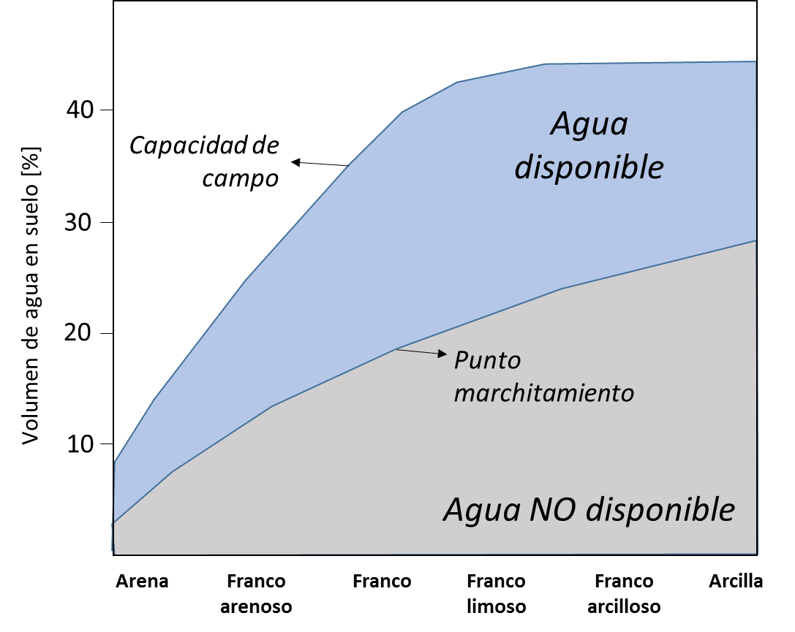{width="3.463050087489064in" height="2.7559055118110236in"}

Figura 50. Esquema de retención de agua según tipo de suelo (Elaboración propia a partir de [44]).

La información requerida del suelo incluye su tipo, textura, perfil en profundidad y nivel freático. Para el cálculo de la escorrentía se calcula el número de curva a partir de la información de uso y tipo de suelo. Este procedimiento se muestra de forma esquemática en la Figura 23, en la que también se indica el tipo de información de entrada y los resultados.

{width="6.2992104111986in" height="3.906761811023622in"}

Figura 51. Esquema metodología aplicada para determinar características del suelo necesarias en el módulo de vulnerabilidad para evaluar riesgo en el sector agrícola. (SCS: Soil Conservation Service) (Fuente: elaboración propia).

Los valores de contenido volumétrico de agua en suelo para condiciones de saturación, capacidad de campo y punto de marchitamiento se determinan a partir de evaluaciones locales. Sin embargo, en caso de no contar con información, la metodología propuesta hace uso de valores recomendados por el modelo AquaCrop que suministra valores por defecto para estos parámetros [45].

Tabla 2. Valores de parámetros de contenido volumétrico de agua por defecto en el modelo AquaCrop.

  Tipo suelo           SAT [%vol]   FC [%vol]   PWP [%vol]
  ------------------------ ------------------ ----------------- ------------------
  arena                    36                 13                6
  arenoso franco           38                 16                8
  franco arenoso           41                 22                10
  franco                   46                 31                15
  franco limoso            46                 33                13
  limoso                   43                 33                9
  franco arcillo arenoso   47                 32                20
  franco arcilloso         50                 39                23
  franco arcillo limoso    52                 44                23
  arcillo arenoso          50                 39                27
  arcillo limoso           54                 50                32
  arcilla                  55                 54                39
  impermeable              0.5                0.3               0.1

La determinación de la textura del suelo se hace a partir de las fracciones de arcilla, limo y arenas que lo compongan. Esta clasificación por tipo que se muestra en la tabla anterior se obtiene a partir del triángulo de clase textural del suelo, publicado por el Departamento de Agricultura de los Estados Unidos, USDA por sus siglas en inglés. Este esquema se presenta en la Figura 24.

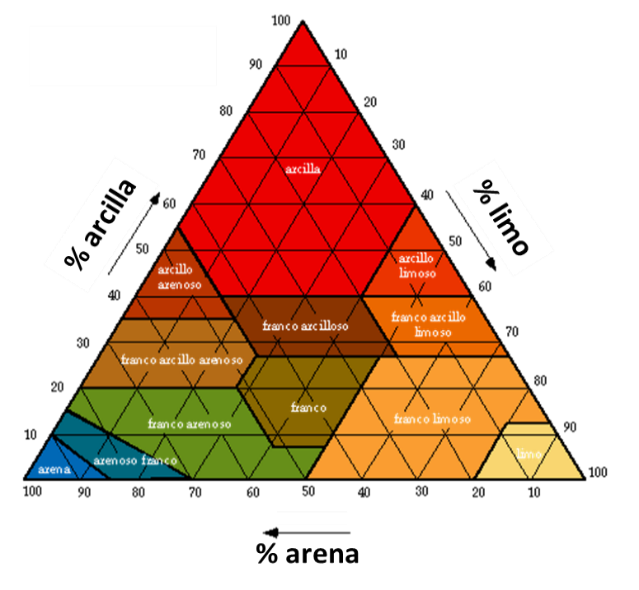{width="2.905496500437445in" height="2.6716415135608047in"}

Figura 52. Triángulo de clases texturales básicas de suelos según el tamaño de partículas. Elaborado por el Departamento de Agricultura de los Estados Unidos (USDA).

### Manejo

El modelo tiene la capacidad de incorporar las prácticas de manejo en la respuesta del rendimiento de los cultivos, incluyendo el riego y manejo de campo. Las opciones de manejo de riego incluyen la selección de métodos de aplicación de agua y la definición de programas de riego. Las opciones de manejo de campo incluyen la fertilización del suelo, la cobertura del suelo para evitar la evaporación y el uso de protecciones para controlar el escurrimiento superficial. Este tipo de características serán incluidas en la modelación en la medida en que la información necesaria esté disponible.

### La dinámica de la respuesta de los cultivos al estrés hídrico o térmico

Las condiciones de estrés hídrico o térmico son representadas por un coeficiente de estrés ($K_{s}$) y un umbral para los indicadores de estrés. $K_{s}$ es un modificador que cuantifica la intensidad del efecto que produce el estrés hídrico en los procesos de crecimiento específicos para un cultivo y etapa de crecimiento. Como se observa en la Figura 25, los valores de $K_{s}$ varían entre 0 (estrés total) y 1 (sin estrés), siguiendo una función lineal o convexa (el grado de curvatura se establece durante la calibración del modelo). Los umbrales para el estrés hídrico están relacionados con el agotamiento del agua u oxígeno del suelo, mientras que los umbrales asociados al estrés por temperatura del aire están relacionados con los grados de crecimiento.

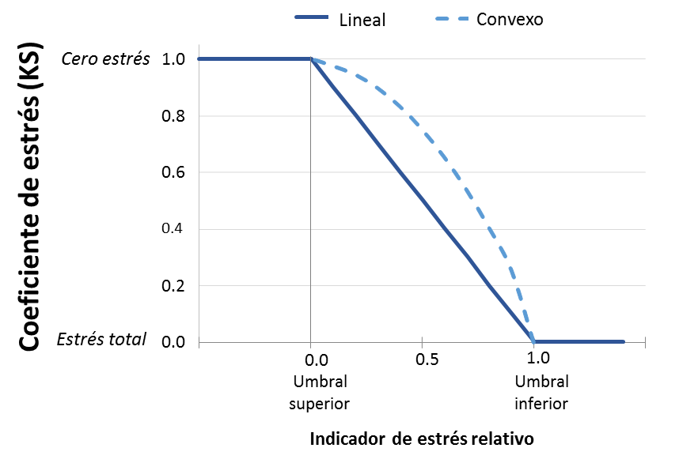{width="4.520833333333333in" height="3.087424540682415in"}

Figura 53. Función del coeficiente de estrés (Ks) (Elaboración propia a partir de [1] p. 32).

El modelo permite calcular los efectos del déficit o exceso hídrico (entendido como falta o exceso de agua en la región radicular del suelo) en el crecimiento de la cobertura vegetal, la conductancia estomática, la senescencia temprana, la profundización de la raíz y el índice de cosecha. La Figura 26 muestra estos cinco procesos (líneas punteadas), dentro del esquema general de desarrollo de rendimiento bajo estrés hídrico. Un resumen general del proceso de cálculo se presenta a continuación. Nótese que todos los pasos del proceso se calculan en intervalos de tiempo diarios.

{width="4.444444444444445in" height="3.336912729658793in"}

Figura 54. Representación esquemática de la respuesta del cultivo al estrés hídrico (Adaptado de [45]).

1.  *Balance del agua en el suelo*: determina la cantidad de agua almacenada en la zona radicular, contabilizando los flujos de agua entrante y saliente. El crecimiento del cultivo no se ve afectado y no hay estrés hídrico ($K_{s} = 1$) entre el nivel de capacidad de campo (FC) y el nivel superior de agotamiento de la zona de raíz. En el otro extremo, entre el umbral inferior en el agotamiento de la zona de raíz y el punto de marchitamiento permanente hay tensión total ($K_{s} = 0$) y el crecimiento del cultivo se ve completamente impactado. A medida que se reduce el agua almacenada en el volumen de control del suelo, el coeficiente de estrés disminuye.

2.  *Expansión de la cobertura vegetal*: Se simula el efecto del déficit hídrico en la expansión de la cobertura, mediante la reducción del coeficiente de crecimiento vegetal (CGC) por el coeficiente de estrés hídrico para la expansión de cobertura $K_{s, exp,w}$, y modificando el coeficiente de disminución de cobertura por coeficiente de estrés hídrico de senescencia temprana $K_{s, text{sen}}$.

3.  Por una parte, cuando el agotamiento de la zona radicular está por debajo de los umbrales superiores de contenido de agua, $K_{s, exp,w}$ se hace menor que 1 y la cobertura reduce su tasa de expansión. Cuando el agotamiento de la zona radicular está por debajo del límite inferior, $K_{s, exp,w} = 0$ y se detiene el desarrollo de la cobertura. Por otra parte, cuando el estrés hídrico es severo (agotamiento de la zona radicular cerca del punto de marchitamiento permanente), se desencadena la senescencia temprana. El grado de senescencia está descrito por $K_{s, sen}$. La cobertura vegetal máxima no puede ser alcanzada bajo condiciones de estrés hídrico, o podría alcanzarse en una última etapa de la temporada, como se muestra en la Figura 28.

{width="4.085137795275591in" height="2.9895833333333335in"}

Figura 55. Representación esquemática del coeficiente de estrés hídrico (Adaptado de [45])

-   {width="4.0in" height="2.2017322834645667in"}

Figura 56. Representación esquemática de la expansión de la cobertura vegetal, bajo condiciones óptimas (gris) y bajo estrés hídrico (verde). (Adaptado de [45]).

4.  *Transpiración*: se calcula la potencia de evaporación de la atmósfera considerando un coeficiente de cultivo $K_{text{cb}}$ y el coeficiente de estrés hídrico $K_{s}$, como se muestra en la ecuación 6. La evapotranspiración potencial ($text{ETo}$) se calcula usando la ecuación de Penman-Monteith de FAO [32].

  -------------------------------------------------------------------------- -----
  $$text{Tr} = K_{s}left( K_{text{cb}}text{CC}^{*} right)text{ETo}$$   (6)
  -------------------------------------------------------------------------- -----

> El coeficiente de transpiración del cultivo $K_{text{cb}}$ es un parámetro que debe ser ajustado continuamente en función de la cobertura vegetal simulada, con el fin de considerar los efectos de envejecimiento y senescencia. El coeficiente de estrés hídrico $K_{s}$, utilizado en caso de escasez de agua es un coeficiente de estrés por cierre estomático $K_{s, sto}$, también con valores entre 1 (sin estrés) y 0 (total estrés).

5.  *Biomasa arriba de la superficie*: La relación entre la biomasa producida y el agua consumida por un cultivo específico se conoce es la productividad del agua (WP), la cual tiende a ser lineal para una condición climática dada, como se muestra en la ecuación 7. Para incluir condiciones climáticas alteradas, se emplea la productividad del agua normalizada $text{WP}^{*}$* en la simulación del desarrollo de biomasa sobre el suelo. Utilizando el parámetro normalizado, el modelo puede aplicarse a diferentes regiones y estaciones. La normalización se realiza para la concentración atmosférica de $text{CO}_{2}$ y la demanda evaporativa de la atmósfera [45].

> La producción de biomasa arriba de la superficie se calcula, para un paso de tiempo diario, de la siguiente manera:

  ----------------------------------------------------------------------------------- -----
  $$B = K_{text{sb}}text{WP}^{*}sum_{i}^{}frac{text{Tr}_{i}}{text{ETo}_{i}}$$   (7)
  ----------------------------------------------------------------------------------- -----

> en donde la productividad del agua normalizada $text{WP}^{*}$ se multiplica por la relación entre la transpiración del cultivo y la evapotranspiración de referencia del día de cálculo $frac{text{Tr}_{i}}{text{ETo}_{i}}$ (expresión que se agrega durante todo el periodo de desarrollo del cultivo), y por el coeficiente de estrés por temperatura $K_{text{sb}}$. Este coeficiente decrece a medida que la temperatura disminuye, y alcanza un valor de cero cuando hace demasiado frío y se detiene el crecimiento vegetal.

6.  *Rendimiento*: Como se mencionó anteriormente, el rendimiento se calcula de multiplicar la biomasa sobre el suelo por un índice de cosecha, que depende del tipo de cultivo. Para considerar el estrés hídrico, debe ajustarse el índice de cosecha de su valor de referencia $text{HI}_{o}$ en condiciones óptimas, a su valor en condiciones reales, mediante la inclusión del factor $f_{text{HI}}$:

  --------------------------------------- -------
  $$Y = f_{text{HI}}*text{HI}_{o}*B$$   (8)
  --------------------------------------- -------

-   El índice de cosecha puede ajustarse al déficit hídrico y a las variaciones de la temperatura del aire, y depende de la etapa del cultivo y la intensidad del estrés durante la temporada de crecimiento.

Enfoque probabilista en la evaluación del riesgo 
------------------------------------------------

Para la metodología propuesta, el objetivo de la evaluación probabilista del riesgo es evaluar las pérdidas potenciales para el sector agropecuario debido a la ocurrencia natural de condiciones de clima extremo, considerando exposición y vulnerabilidad de cultivos, pasturas y ganado. Este enfoque permite identificar áreas geográficas y tierras cultivadas que se encuentran en riesgo. El riesgo se modela en términos de pérdida económica, definida como una variable aleatoria que incorpora la incertidumbre presente en los componentes de amenaza, vulnerabilidad y exposición del modelo.

Al realizar la evaluación de riesgo por eventos, las condiciones de clima extremo valorados en el módulo de amenaza se organizan en una gráfica de pérdida vs. tiempo, como se muestra en la Figura 29. Al establecer una pérdida económica $p$, se puede identificar en la gráfica todos los eventos cuyas pérdidas exceden $p$. Los tiempos entre eventos $(T_{1}, T_{2}, ldots,T_{1n})$ también se estiman a partir de la Figura 29 y se usan para estimar el parámetro $lambda$ de una distribución exponencial, la cual corresponde a la distribución de probabilidad del tiempo entre eventos de un proceso de Poisson. Además, este parámetro de la distribución exponencial tiene la particularidad de ser el mismo*λ* que define el proceso de Poisson completamente (i.e. es la misma tasa de excedencia, $lambda$ = *v(p)*). Para el caso de la evaluación prospectiva del riesgo, la ventana de tiempo considerada para calcular $lambda$ es igual al número de simulaciones estocásticas de las series climáticas, por ejemplo 1,000 años equivalentes.

{width="5.459891732283465in" height="3.42338145231846in"}

Figura 57. Pérdidas por evento en una ventana amplia de tiempo (Elaboración propia).

La tasa de excedencia poblacional ($lambda$) es estimada mediante la tasa de excedencia empírica ($Lambda$) de la siguiente manera:

  --------------------------------------------------- -------
  $$Lambda = frac{n - 1}{sum_{i = 1}^{n}T_{i}}$$   (9)
  --------------------------------------------------- -------

En donde *n* es el número de eventos que superan la pérdida $p$ y $T_{i} $son los tiempos observados. Este estimador cumple con los cuatro criterios estadísticos de calidad de la estimación de parámetros de distribuciones de probabilidad: es no sesgado, de varianza mínima, consistente y suficiente. Ahora bien, es posible demostrar que el estimador $Lambda$ sigue una distribución de probabilidad *Gamma inversa* con parámetros *n* y (*n*-1)$text{ λ}$, a partir de lo cual se puede determinar su coeficiente de variación (CV) como:

  --------------------------------- --------
  $$CV = frac{1}{sqrt{n - 2}}$$   (10)
  --------------------------------- --------

El coeficiente de variación indica la relación entre la desviación estándar y la media de una variable aleatoria. Como se indica en la Ecuación 7, CV disminuye a medida que el número de datos (*n*) aumenta. La Ecuación 7 es una fórmula estándar, aplicable a cualquier problema de estimación del riesgo por eventos, en donde el CV de la tasa de excedencia varía con el tamaño de la muestra cómo se indica en la Figura 30.

{width="3.9479166666666665in" height="3.1283016185476815in"}

Figura 58. Variación del coeficiente de variación de la tasa de excedencia con el tamaño de la muestra (Elaboración propia).

El CV crece rápidamente a medida que *n* disminuye. Esto quiere decir que, al estimar la tasa de excedencia de pérdidas grandes (eventos catastróficos) a partir de pocos eventos modelados, para los cuales se contará con un valor pequeño de *n* (es decir, pocos eventos que exceden esa pérdida dentro del conjunto de escenarios de sequía), la dispersión de la estimación (i.e. su desviación estándar) es muy grande en comparación a la estimación misma, lo cual implica una mayor incertidumbre. Por el contrario, al estimar la tasa de excedencia de pérdidas con un mayor número de eventos modelados, *n* será necesariamente un número más grande y, en consecuencia, la dispersión de la tasa disminuye a valores incluso despreciables en la práctica. Esto es por lo que, para que el resultado sea estadísticamente suficiente se debe hacer uso de un gran número de años simulados dentro de los cuales se pueda identificar un número considerable de eventos de sequía.

### Curva de excedencia de pérdidas

Es así como el riesgo se define por medio de la curva de excedencia de pérdidas (ver Figura 31), la cual establece el número de veces en un año en las que un valor de pérdida se verá excedido. Esta cantidad se conoce como la *tasa anual de excedencia*, la cual es un valor único y específico para cada cuantía de pérdida, e incorpora el aporte de todos los posibles escenarios contenidos en la evaluación de la amenaza. Como se mencionó anteriormente, la tasa de excedencia es igual al parámetro $lambda$ que define la ocurrencia en el tiempo de los eventos de pérdida, es decir:

  ----------------------------------------------------------------------- ----
  $$nuleft( p right) = frac{n_{p} - 1}{sum_{i = 1}^{n_{p}}T_{i}}$$   ()
  ----------------------------------------------------------------------- ----

en donde $p$ es la pérdida económica, $nuleft( p right)$ es su tasa anual de excedencia, $n_{p}$ es el número total de eventos en los cuales se supera $p$ y $T_{i}$ es el tiempo $i$ entre eventos que superan $p$. El periodo de retorno $Tr(p)$ se calcula como el inverso de la tasa de excedencia $nuleft( p right)$.

  ----------------------------------------------- --------
  $$text{Tr} = frac{1}{nuleft( p right)}$$   (12)
  ----------------------------------------------- --------

El periodo de retorno es el valor esperado del tiempo entre eventos. Es decir, corresponde al periodo de tiempo promedio para el cual, considerando una ventana temporal de observación suficientemente amplia, se verá igualada o excedida una pérdida dada, y se muestra en el eje vertical de la derecha de la curva ejemplo mostrada en la Figura 31.

{width="4.463888888888889in" height="2.6720002187226597in"}

Figura 59. Ejemplo de curva de excedencia de pérdidas. El eje vertical muestra la tasa de excedencia (izquierda) y su valor inverso o periodo de retorno (derecha). El eje horizontal muestra la pérdida asociada (Elaboración propia).

El cálculo de la Ecuación (11 corresponde a la estimación de la tasa de excedencia de las cuantías de pérdida que ocurren en todos los activos expuestos (unidades de tierra cultivada) para todos los eventos potencialmente nocivos incluidos en el modelo de amenaza (el conjunto de escenarios estocásticos previamente identificados). La pérdida para un evento se determina mediante la suma de las pérdidas causadas en las unidades individuales cultivadas.

Para la evaluación del riesgo de sequía, la pérdida $p$ en la Ecuación (11 se debe a la reducción en los ingresos de producción (lucro cesante) de cultivos debido a la reducción en el rendimiento de cada unidad de tierra cultivada, en donde se conocen el tipo de suelo, tipo de cultivo, su estacionalidad y su valor económico de reposición. La pérdida económica en una unidad cultivada, para un escenario específico, se calcula como:

  ---------------------------------------------------------------------- --------
  $$P_{i} = A bullet text{PV} bullet left( Y_{x} - Y_{i} right)$$   (13)
  ---------------------------------------------------------------------- --------

en donde $P_{i}$ es la pérdida económica para el escenario $i$, $A$ es el área de la unidad de tierra cultivada, $text{PV}$ es la valoración económica del cultivo, $Y_{x}$ es el rendimiento máximo (calculado bajo condiciones óptimas) y $Y_{i}$ es el rendimiento para el escenario $i$ bajo condiciones de déficit hídrico.

CONFLICTO DE INTERESES

Los autores no declaran conflicto de intereses.

 {#section-6 .list-paragraph}

IDENTIFICACIÓN DEL AUTOR {#identificación-del-autor-2 .list-paragraph}
========================

Omar Darío Cardona <https://orcid.org/0000-0001-8233-5450>

Gabriel Bernal <https://scholar.google.com/citations?user=wYtazboAAAAJ>

María Alejandra Escovar <https://scholar.google.com/citations?hl=en&user=Ac5JYNoAAAAJ>

 {#section-7 .list-paragraph}

BIBLIOGRÁFIA {#bibliográfia-1 .list-paragraph}
============

1. Wilhite, D. A. (1993). The Enigma of Drought. En: D. A. Wilhite (ed.), *Drought Assessment, Management, and Planning: Theory and Case Studies*. Boston, MA: Springer US; pp. 3-15. https://doi.org/10.1007/978-1-4615-3224-8_12. UNGRD (Unidad Nacional para la Gestión del Riesgo de Desastres), Ingeniar Risk Intelligence. (2018). *Atlas de Riesgo de Colombia: revelando desastres latentes*. Bogotá. 264 p.3. Mckee, T. B., Doesken, N. J. & Kleist, J. (1993, January). *The relationship of drought frequency and duration to time scales*. AMS 8th Conference on Applied Climatology. Anaheim, California.4. IDEAM. (2019). *Estudio Nacional del Agua 2018*. Bogota. 452 p.5. UNGRD - (Unidad Nacional para la Gestión del Riesgo de Desastres). (2016). *Fenómeno El Niño: Análisis comparativo 1997-1998/2014-2016*. Bogotá.142 p.6. Melo, S., Riveros, L., Romero, G., Álvarez, A., Diaz, C. & Calderon, S. (2017). *Efectos Económicos de Futuras Sequías en Colombia: Estimación a partir del Fenómeno El Niño 2015*. Bogotá.7. Salgado-Gálvez, M.A., Bernal, G.A., Zuloaga, D., Marulanda, M. C., Cardona, O-D. & Henao, S. (2017). Probabilistic Seismic Risk Assessment in Manizales, Colombia: Quantifying Losses for Insurance Purposes. *International Journal of Disaster Risk Science*, 8, 296--307. https://doi.org/10.1007/s13753-017-0137-68. Bernal GA, Salgado-Gálvez MA, Zuloaga D, Tristancho J, González D, Cardona O-D. (2017). Integration of Probabilistic and Multi-Hazard Risk Assessment Within Urban Development Planning and Emergency Preparedness and Response: Application to Manizales, Colombia. *International Journal of Disaster Risk Science,* 8(3), 270-83. https://doi.org/10.1007/s13753-017-0135-89. Cardona, O-D., Ordaz, M. G., Mora, M. G., Salgado-Gálvez, M. A, Bernal, G. A., Zuloaga-Romero, D, et al. (2014). Global risk assessment: A fully probabilistic seismic and tropical cyclone wind risk assessment. *International Journal of Disaster Risk Reduction*, 10, Part B, 461-76. https://doi.org/10.1016/j.ijdrr.2014.05.00610. Salgado-Gálvez MA, Cardona OD, Carreño M, Barbat A. (2015). Probabilistic seismic hazard and risk assessment in Spain. En A. H. Barbat (Ed). *Monograph Series in Earthquake Engineering*. https://www.scipedia.com/public/Salgado-Galvez_et_al_2015a11. Torres, M. A., Jaimes, M. A., Reinoso, E. & Ordaz, M. (2014). Event-based approach for probabilistic flood risk assessment. *International Journal of River Basin Management,* 12(4), 377-89. https://doi.org/10.1080/15715124.2013.84784412. Jenkins, S., Magill, C., McAneney. J. & Blong, R. (2012). Regional ash fall hazard I: a probabilistic assessment methodology. *Bulletin of Volcanology*, 74(7), 1699-712. https://doi.org/10.1007/s00445-012-0627-813. Quijano, J. A., Jaimes, M. A , Torres, M. A., Reinoso, E., Castellanos, L., Escamilla, J., et al. (2015). Event-based approach for probabilistic agricultural drought risk assessment under rainfed conditions. *Natural Hazards*, 76(2), 1297-318. https://doi.org/10.1007/s11069-014-1550-414. Bernal, G. A., Escovar, M. A., Zuloaga, D., & Cardona, O. D. (2017). Agricultural Drought Risk Assessment in Northern Brazil: An Innovative Fully Probabilistic Approach. En V. Marchezini, B. Wiesner, S. Saito, L. Londe (Eds.), *Reduction of Vulnerability to Disasters: from Knowledge to Action*. RiMa Edito, pp. 331-56.15. Steduto, P., Hsiao, T. C., Fereres, E. & Raes, D. (2012). *Crop yield response to water.* FAO Irrigation and Drainage Paper 66, pp 174-180.16. UNISDR (United Nations International Strategy for Disaster Reduction). (2009). *Terminología sobre Reducción del Riesgo de Desastres.* Estrategia Internacional para la Reducción Desastres de las Naciones Unidas, 43 p.17. Funk, C., Peterson, P., Landsfeld, M., Pedreros, D., Verdin, J., Shukla, S., et al. (2015) The climate hazards infrared precipitation with stations - A new environmental record for monitoring extremes. *Scientific Data*, *2*, 150066, 1-21. https://doi.org/10.1038/sdata.2015.6618. Sheffield, J., Goteti. G. & Wood, E. F. (2006) Development of a 50-year high-resolution global dataset of meteorological forcings for land surface modeling. *Journal of Climate, 19*(13), 3088-111. https://doi.org/10.1175/JCLI3790.119. Copernicus Climate Change Service. (2017). *ERA5: Fifth generation of ECMWF atmospheric reanalyses of the global climate.* Copernicus Climate Change Service Climate Data Store (CDS). https://cds.climate.copernicus.eu/cdsapp#!/home20. Urrea, V., Ochoa, A. & Mesa, O. (2017). V*alidación de la base de datos de precipitación CHIRPS para Colombia a escala diaria, mensual y anual en el periodo 1981-2014.* Universidad Nacional de Colombia Sede Medellín.21. Verdin, A, Rajagopalan, B., Kleiber, W. & Funk. C. (2015). A Bayesian kriging approach for blending satellite and ground precipitation observations. *Water Resources Ressearch, 51*(2), 908-21. https://doi.org/10.1002/2014WR01596322. IPCC (Intergovernmental Panel on Climate Change). (2013). *Climate Change 2013 - The Physical Science Basis*. Cambridge: Cambridge University Press; 1535 p.23. Mishra, A. K. & Singh, V. P. (2010). A review of drought concepts. *Journal of Hydrology, 391*,1-2, 202-16. https://doi.org/10.1016/j.jhydrol.2010.07.01224. IDEAM (Instituto de Hidrología, Meteorología y Estudios Ambientales). (2020). *Coberturas Nacionales. Mapas de coberturas de la tierra. Ecosistemas. Monitoreo de suelos y coberturas de la tierra*. http://www.ideam.gov.co/web/ecosistemas/coberturas-nacionales25. DANE (Departamento Administrativo Nacional de Estadística). (2016). *III Censo Nacional Agropecuario 2014.* Tomo 2, Resultados.26. DANE (Departamento Administrativo Nacional de Estadística). (2019). *Encuesta Nacional Agropecuaria - ENA 2017*. Bogotá, pp. 1-31.27. MADR (Ministerio de Agricultura y Desarrollo Rural). (2016). *Producción nacional por producto*. Evaluaciones Agropecuarias del Ministerio de Agricultura y Desarrollo Rural. Agronet.28. FAO/IIASA/ISRIC/ISSCAS/JRC. *Harmonized World Soil Database (version 1.2)*. (2012). FAO, Rome, Italy and IIASA, Laxenburg, Austria.29. FAO (Food and Agriculture Organization of the United Nations) (2018). *The impact of disasters and crises on agriculture and food security*. 168 p.30. Banimahd, S. A. & Khalili, D. (2013). Factors Influencing Markov Chains Predictability Characteristics, Utilizing SPI, RDI, EDI and SPEI Drought Indices in Different Climatic Zones. *Water Resources Management, 27*(11), 3911-28. https://doi.org/10.1007/s11269-013-0387-z31. Wilks, D. S. (2006). *Statistical methods in the atmospheric sciences*. International Geophysics Series. 464 p.32. Allen, R. G., Pereira, L. S., Raes, D. & Smith, M. (1998). Crop evapotranspiration: Guidelines for computing crop requirements. *Irrigation and Drainage Paper No 56*, FAO. 300 p.33. Raes, D. (2009). *The ETo Calculator Reference Manual.* Food and Agricultural Organization of the United Nations (FAO), Rome, pp 1-38. 34. Wilhite, D. A. & Glantz, M. H. (1985). Understanding the Drought Phenomenon: The Role of Definitions. *Water International, 10*(3), 111-20. https://doi.org/10.1080/0250806850868632835. Jayanthi, H. Assessing the agricultural drought risks for principal rainfed crops due to changing climate scenarios using satellite estimated rainfall in Africa. *Background Paper GAR Global Assessment Report on Disaster Risk Reduction.* 28 p.36. Palmer W. C. (1965). *Meteorological Drought.* U.S. Weather Bureau, Research Paper No. 45. 58 p.37. Mckee, T. B., Doesken, N. J. & Kleist, J. (1993). The relationship of drought frequency and duration to time scales. *8th Conference Applied Climatology*, pp. 179-84.38. Byun, H. R. & Wilhite, D. A. (1999). Objective quantification of drought severity and duration. *Journal of Climate, 12*(9):2747-56. https://doi.org/10.1175/1520-0442(1999)012<2747:OQODSA>2.0.CO;239. Tsakiris, G., Pangalou, D. & Vangelis, H. (2007). Regional drought assessment based on the Reconnaissance Drought Index (RDI). *Water Resour Managament, 21*(5), 821-33. https://doi.org/10.1007/s11269-006-9105-440. Vicente-Serrano, S. M., Beguería, S. & López-Moreno, J. I. (2010). A multiscalar drought index sensitive to global warming: The standardized precipitation evapotranspiration index. *Journal of Climate, 23*(7), 1696-718. https://doi.org/10.1175/2009JCLI2909.141. Verdin, A., Funk, C., Rajagopalan, B. & Kleiber, W. (2016). Kriging and local polynomial methods for blending satellite-derived and gauge precipitation estimates to support hydrologic early warning systems. *IEEE Transactions on Geoscience and Remote Sensing, 54*(5), 2552-62. https://doi.org/10.1109/TGRS.2015.250295642. ArcGIS. (2020). C*ómo funcional el kriging. Conceptos del conjunto de herramientas de interpolación ráster*. https://desktop.arcgis.com/es/arcmap/10.3/tools/spatial-analyst-toolbox/understanding-interpolation-analysis.htm43. Li, J. & Heap, A. D. (2008). A Review of Spatial Interpolation Methods for Environmental Scientists. *Geoscience Australia,* Record 2008/23, 137.44. Sheppard, J. & Hoyle, F. (2018). *Water availability. Healthy Soils for Sustainable Farms programme*. Avon Catchment Council, Department of Agriculture and Food, Western Australia. http://soilquality.org.au/factsheets/water-availability45. Raes, D., Steduto, P., Hsiao. T. C. & Fereres, E. (2011). *FAO cropwater productivity model to simulate yield response to water AquaCrop.* Reference Manual of AQUACROP. 56 p.

4

[]{#_Toc47894927 .anchor}Contribución de la geodesia espacial en la gestión del riesgo en Colombia. Casos de estudio

Héctor Mora-Páez^1*^, Fredy Díaz Mila^1^, Takeshi Sagiya^2^, Leidy Giraldo Londoño^1^ & Yuli Corchuelo Cuervo^1^

^1^Servicio Geológico Colombiano, Dirección de Geoamenazas, Grupo Investigaciones Geodésicas Espaciales, Diagonal 53 # 34-53, Bogotá, Colombia

^2^Centro de Investigación en Mitigación de Desastres, Universidad de Nagoya, Japón

*Autor de contacto: Héctor Mora Páez, Servicio Geológico Colombiano, Grupo Investigaciones Geodésicas Espaciales, Diagonal 53 # 34-53, Bogotá, Colombia. Correo-e: <hmora@sgc.gov.co>

Resumen

Con el fin de avanzar en el conocimiento de los fenómenos que ocurren en la corteza terrestre en la esquina noroccidental de Suramérica y suroriental de Centroamérica, región de alta complejidad tectónica, el Servicio Geológico Colombiano emplea diferentes tipos de instrumentación, métodos y técnicas, y entre ellas de geodesia espacial, correspondiente a la aplicación en estudios geodinámicos de los conceptos de geodesia tectónica y geodesia de imágenes. En geodesia espacial, basado en posicionamiento GNSS de alta precisión, se han determinado las velocidades en estaciones geodésicas permanentes de operación continúa localizadas en las placas de Nazca, Suramérica y Caribe, y en los bloques Norte de los Andes y Panamá. Estas velocidades permiten confirmar la subducción oblicua de la placa de Nazca por debajo de Suramérica; la acumulación de deformación en el límite de placas Nazca-Suramérica en el margen Colombia-Ecuador, sugiriendo la posibilidad de generación de un sismo fuerte en esta zona; el movimiento general en sentido sur-norte del Bloque Norte de los Andes, hasta la latitud 7.5°N, donde presentan cambio de tendencia hacia el noreste; la convergencia de la placa Caribe en dirección sureste, así como la colisión del bloque de Panamá con respecto al Bloque Norte de los Andes. El concepto de geodesia de imágenes se ha orientado por ahora, al estudio de subsidencia en la ciudad de Bogotá mediante la aplicación de técnicas interferométricas de radar de apertura sintética-InSAR, empleando imágenes del sensor TerraSAR-X, cuyos resultados, combinados con los obtenidos con GPS, permiten establecer valores cuantitativos de este fenómeno en varios sectores de la ciudad. Los resultados obtenidos en las dos aplicaciones constituyen importante insumo en la gestión del riesgo, los primeros, a ser considerados en los estudios de la amenaza sísmica del país, y los segundos, en la planeación urbana de la ciudad de Bogotá, en especial para considerar aspectos del crecimiento horizontal y vertical de las construcciones.

Palabras clave

GNSS, geodinámica, Bloque Norte de los Andes, InSAR, subsidencia, tectónica de placas

Contribution of Space Geodesy in Risk Management in Colombia. Study cases

Abstract

In order to advance in the knowledge of the phenomena that occur in the earth's crust in the northwestern corner of South America and southeast of Central America, a region of high tectonic complexity, the Colombian Geological Survey has been using different types of instrumentation, methods and techniques, and among them of space geodesy, corresponding to the application in geodynamic studies of the tectonic and imaging geodesy concepts. Space geodesy, based on high-precision GNSS positioning, velocities have been estimated at GPS permanent stations of continuous operation located on the Nazca, South America, and Caribbean plates, and also in the North Andean and Panama blocks. These velocities confirm the oblique subduction of the Nazca plate beneath South America plate; the accumulation of deformation at the Nazca-South America plate boundary on the Colombia-Ecuador margin, suggesting the possibility of generating a strong earthquake in this area; the general motion in the south-north direction of the North Andean Block, up to latitude 7.5°N, where they present a trend change towards the northeast; the convergence of the Caribbean plate in a southeast direction, as well as the collision of the Panama block with the North Andean Block. The concept of imaging geodesy has been oriented so far, to the study of the land subsidence in the Bogotá city by applying Interferometric radar techniques-InSAR. Results obtained using images from the TerraSAR-X sensor have been combined with those obtained with GPS in order to establish quantitative values ​​of the land-subsidence in several areas of the city. The results obtained in the two applications constitute an important input in risk management, the first one, to be considered in the studies of the seismic hazard in the country, and the second one, in the urban planning of the Bogotá city especially to consider aspects of horizontal and vertical growth of buildings.

Keywords

GNSS, geodynamics, North Andean Block, InSAR, subsidence, plate tectonics

INTRODUCCIÓN
============

La Tierra es eminentemente un sistema dinámico. Los procesos que ocurren en el interior de la Tierra y el movimiento de grandes volúmenes en la superficie terrestre se ligan estrechamente a la tectónica de placas, y a ello, la sismicidad y el volcanismo. De igual manera, los movimientos de grandes masas tanto en la atmósfera como en los océanos se asocian a procesos dinámicos. Muchas inquietudes que han surgido, generalmente relacionadas con geoamenazas, ciclo hidrológico e incluso acerca del cambio global, entre otras, no pueden explicarse si no se tiene conocimiento y entendimiento de los procesos relacionados con transporte de masas en el sistema Tierra. Para detectar movimientos asociados a procesos dinámicos que ocurren en el sistema Tierra, con alta precisión y resoluciones temporales, se emplean técnicas de geodesia espacial, en dos de sus componentes: geodesia de posicionamiento y geodesia de imágenes. Así, los grandes avances en las técnicas geodésicas espaciales y el rápido desarrollo de sistemas y fortalecimiento de las capacidades de transmisión de datos dan lugar al surgimiento de una verdadera revolución en el campo de estudio de la geodesia, tanto global como regional y local, permitiendo su aplicación en diversas disciplinas del conocimiento, entre ellas las relacionadas con las geociencias. La observación de desplazamientos en la superficie terrestre permite establecer el estado de deformación de la corteza terrestre, y su posible asociación con la ocurrencia de sismos, tsunamis, erupciones volcánicas, entre diversos tipos de amenazas [1]. Este artículo presenta dos casos de aplicación de técnicas geodésicas espaciales que contribuyen aportando nuevo conocimiento para la gestión del riesgo en Colombia.

GEODESIA ESPACIAL GPS Y EL ESTUDIO DE LA DEFORMACIÓN DE LA CORTEZA TERRESTRE EN COLOMBIA
========================================================================================

La esquina noroccidental de Suramérica y sureste de Centroamérica es una zona de alto interés científico en las geociencias donde se conjugan diferentes elementos de orden tectónico y volcánico. No hay otra parte en el mundo en la cual exista una placa tectónica mayor subduciendo por debajo de una gran placa continental a lo largo de una trinchera de casi 6,000 km, como es el caso de la subducción de la placa de Nazca por debajo de Suramérica [2]. Esta región se caracteriza por una directa relación de la actividad tectónica y volcánica con la interacción de las placas tectónicas de Suramérica, Nazca, Cocos y Caribe y los bloques Norte de los Andes, Maracaibo, Chocó y Panamá acuñados dentro de dichas placas, Figura 1 [3 -15].

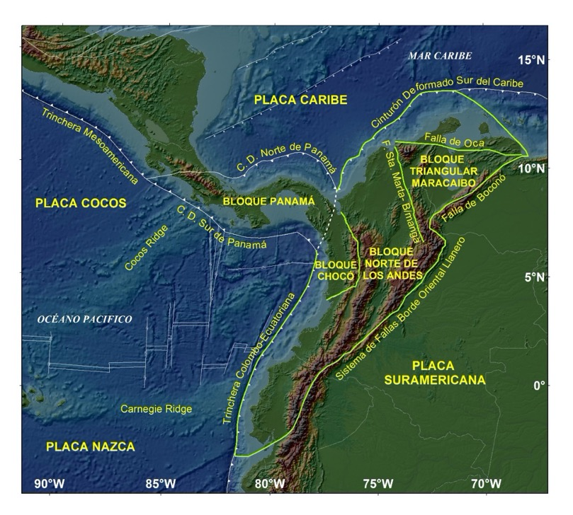{width="5.381492782152231in" height="4.833479877515311in"}

Figura 1. Marco tectónico de la zona de estudio. Fuente del mapa: ETOPO1 [16].

Esta compleja tectónica dinámica e intensa deformación interplaca se manifiesta en una alta densidad de fallas, muchas de las cuales se consideran como activas o potencialmente activas. Además, la sismicidad se distribuye sobre un área que corresponde a un límite amplio que abarca el noroeste de Suramérica, Centro América y suroeste del Caribe, complejidad referida por Trenkamp [12] como un Margen amplio de placas. Dicha condición, junto con el potencial de ocurrencia de grandes sismos megathrust y tsunamis relacionados con la zona de subducción en el océano Pacífico, significa que un alto porcentaje de la población colombiana habita bajo una amenaza permanente de ocurrencia de sismos y tsunamis, con el potencial de causar grandes daños en términos de pérdida de vidas y destrucción de infraestructura [17]. Otra amenaza se asocia a los volcanes activos localizados en la región norte de los Andes, que tienen el potencial de generar erupciones devastadoras como la ocurrida en el volcán Nevado del Ruiz en noviembre 13 de 1985, el segundo peor desastre a nivel mundial de origen volcánico del siglo pasado [18-19].

 Impacto de la geodesia espacial GNSS con propósitos científicos
---------------------------------------------------------------

Dada la complejidad de la región y la potencialidad de ocurrencia de grandes sismos y tsunamis así como de erupciones volcánicas entre otros eventos de origen geológico, se requiere adelantar un estudio sistemático para determinar la actual situación de la deformación de la corteza terrestre. Hay una conciencia creciente a nivel mundial acerca de la valiosa contribución de la geodesia espacial para la observación detallada, análisis y comprensión de la cinemática de la corteza terrestre en regiones tectónicamente activas. Los estudios geodésicos espaciales son ahora el principal método para el estudio de la cinemática en los límites de placas en la superficie terrestre; las mediciones geodésicas espaciales se estiman en virtud de un marco global de referencia, lo cual permite medir los movimientos en los límites de placas así como los movimientos relativos globales al interior de las placas [20]. Así, las redes integradas GPS/GNSS suministran un excelente marco de referencia para el estudio de los procesos tanto en la tierra sólida como en la tierra atmosférica, a escalas globales, regionales y locales. La posición de las estaciones geodésicas a través del tiempo permite generar campos de velocidad para constreñir modelos de bloques cinemáticos y de zonas de deformación en límites de placas [21].

A pesar de las limitaciones espaciales debido a la cobertura incompleta de redes nacionales GPS/GNSS, algunas redes en Suramérica contribuyen en la investigación sistemática de la magnitud y variabilidad espacial del acoplamiento interplaca, así como de la liberación episódica y asísmica de energía relacionada a fallas [22]. Estas observaciones permiten un mejor entendimiento de la mecánica de procesos que gobiernan el comportamiento de sistemas de fallas. Las redes GPS/GNSS permanentes y en tiempo real tienen además el gran potencial de suministrar datos del movimiento de fallas individuales, que junto con resultados neotectónicos y paleosismológicos, constituyen un insumo esencial para la evaluación del potencial sismogénico de fallas, mencionado por Barka y Reilinger [23], y Blewitt [24], entre varios autores. Hay también muchos estudios que han demostrado la utilidad de redes geodésicas regionales para analizar límites de colisión y la cinemática de la deformación en la parte superior de placas, como los realizados por Sagiya [25] en Japón, y Wallace [26- 27] en Nueva Zelanda, entre otros.

+------------------------------------------------------------------------------------------------------------------------------------------------------------------------------------------------------------------------------------------------------------------------------------------------------------------------------------------------------------+
| Caja 1. Términos comunes en geodesia espacial GNSS de posicionamiento                                                                                                                                                                                                                                                                                  |
|                                                                                                                                                                                                                                                                                                                                                            |
| BEIDOU: sistema de navegación por satélite desarrollado por China.                                                                                                                                                                                                                                                                                     |
|                                                                                                                                                                                                                                                                                                                                                            |
| CORS: estación geodésica GPS/GNSS de referencia de operación continua.                                                                                                                                                                                                                                                                                 |
|                                                                                                                                                                                                                                                                                                                                                            |
| GALILEO: sistema europeo de radionavegación y posicionamiento por satélite desarrollado por la Unión Europea mediante operación de la Agencia Espacial Europea.                                                                                                                                                                                        |
|                                                                                                                                                                                                                                                                                                                                                            |
| GIPSY-OASIS: (GNSS-Inferred Positioning System and Orbit Analysis Simulation Software), software científico desarrollado por JPL-NASA de Estados Unidos.                                                                                                                                                               |
|                                                                                                                                                                                                                                                                                                                                                            |
| GLONASS: sistema de posicionamiento y navegación por satélite desarrollado por la Unión Soviética y administrado en la actualidad por la Federación Rusa.                                                                                                                                                                                              |
|                                                                                                                                                                                                                                                                                                                                                            |
| GNSS: (Global Navigation Satellite System). Constelación de satélites que transmite señales de radio utilizadas para posicionamiento y localización en cualquier parte del mundo. En la actualidad, solo los sistemas GPS y GLONASS forman parte del concepto de GNSS. En un futuro cercano, GALILEO y BEIDOU serán parte integrante de este concepto. |
|                                                                                                                                                                                                                                                                                                                                                            |
| GPS: Sistema de Posicionamiento Global de Estados Unidos.                                                                                                                                                                                                                                                                                              |
|                                                                                                                                                                                                                                                                                                                                                            |
| IERS: Servicio Internacional de Rotación de la Tierra y Sistemas de referencia.                                                                                                                                                                                                                                                                        |
|                                                                                                                                                                                                                                                                                                                                                            |
| IGS: Servicio Internacional GNSS.                                                                                                                                                                                                                                                                                                                      |
|                                                                                                                                                                                                                                                                                                                                                            |
| ITRF: Marco Internacional Terrestre de Referencia.                                                                                                                                                                                                                                                                                                     |
|                                                                                                                                                                                                                                                                                                                                                            |
| PPP: Punto preciso de posicionamiento.                                                                                                                                                                                                                                                                                                                 |
|                                                                                                                                                                                                                                                                                                                                                            |
| RINEX: formato universal de intercambio de datos GNSS independiente del receptor.                                                                                                                                                                                                                                                                      |
|                                                                                                                                                                                                                                                                                                                                                            |
| TEQC: herramienta desarrollada por UNAVCO para conversión, edición y análisis de calidad de datos GNSS.                                                                                                                                                                                                                                                |
|                                                                                                                                                                                                                                                                                                                                                            |
| UNAVCO: University NAVSTAR Consortium. Consorcio sin ánimo de lucro creado para facilitar la investigación y educación en geodesia.                                                                                                                                                                                                                    |
+------------------------------------------------------------------------------------------------------------------------------------------------------------------------------------------------------------------------------------------------------------------------------------------------------------------------------------------------------------+

Geodesia espacial GPS en Colombia con propósitos geodinámicos
-------------------------------------------------------------

Colombia empezó en 1988 a incursionar en la aplicación de geodesia espacial GPS con el proyecto internacional CASA (Central And South America GPS Project), en el cual científicos de más de 25 organizaciones y 13 países cooperaron en el entonces proyecto más grande de GPS en el mundo, patrocinado por National Science Foundation-NSF y la Agencia Espacial-NASA de Estados Unidos junto con las instituciones de cada uno de los países participantes, el cual permitió establecer una red de estaciones de campo de ocupación episódica en Costa Rica, Panamá, Venezuela, Ecuador y Colombia [28]. Colombia fue el centro de las campañas de campo en el norte de los Andes; la participación entusiasta del entonces INGEOMINAS, hoy Servicio Geológico Colombiano, con logística, entrenamiento y personal fue la clave del éxito del proyecto.

Un hecho significativo en el desarrollo de la red geodésica con propósitos geodinámicos en Colombia, lo constituye la instalación el 4 de noviembre de 1994 en Bogotá, mediante convenio con la agencia espacial estadounidense NASA, de la primera estación GPS permanente de operación continua en Colombia, denominada BOGT, como parte de la entonces iniciativa Laboratorios Fiduciales para una Red Internacional Científica (FLINN, de sus siglas en inglés), que hoy constituye la Red Global de Observación GNSS operada por el IGS [29].

A la terminación del proyecto CASA, el entonces INGEOMINAS comenzó anualmente un proceso sistemático de construcción de estaciones de campo para ampliar la cobertura de la red CASA. En el año 2003, un conjunto de 36 sitios GPS se seleccionaron para toma de datos dentro del marco de un proyecto geológico y geofísico para entender el estado de los esfuerzos y la deformación neotectónica en la región central del Valle del Cauca y la ciudad de Cali, y determinar la amenaza sísmica potencial de Cali y áreas adyacentes [30].

En la actualidad, los resultados de la implementación de redes de estaciones GPS/GNSS permanentes de operación continua en Colombia y regiones vecinas ha comenzado a contribuir en el entendimiento de los procesos dinámicos en la corteza terrestre, que ocurren como consecuencia de la interacción de las placas tectónicas en la esquina noroccidental de Suramérica y sureste de Centro América, permitiendo el monitoreo de la deformación elástica de la corteza, el modelamiento de procesos de acoplamiento intersísmico de placas a lo largo de la interfase de la subducción, y la estimación de la acumulación de deformación a lo largo de fallas de corteza. Durante los últimos 12 años, los esfuerzos en Colombia se han orientado al diseño e instalación de una red con propósitos geodinámicos, conocida como GeoRED (acrónimo de Geodesia: Red de Estudios de Deformación), y el proceso gradual de obtención de datos permite generar un campo de velocidades, el cual registra la tectónica de escape del Bloque Norte de los Andes [31]. Varias redes compuestas por diversos tipos de instrumentación se han instalado con el fin de entender la dinámica de la corteza terrestre en Colombia [32], siendo la más reciente la Red Nacional de Estaciones Geodésicas GPS/GNSS con propósitos geodinámicos, instalándose la primera estación en febrero de 2008.

GeoRED es un proyecto de investigación y desarrollo basado en tecnología geodésica espacial para estudiar la geodinámica en el noroeste de Suramérica. GeoRED, que tiene como propósito principal mejorar la capacidad técnica, científica y operacional en Colombia para el análisis e interpretación del estado actual de deformación de la corteza en Colombia usando tecnología geodésica GNSS [33] es ejecutado por el Grupo Investigaciones Geodésicas Espaciales-GIGE de la Dirección de Geoamenazas del Servicio Geológico Colombiano. GeoRED se compone por dos sub-redes: la primera, por estaciones permanentes de operación continua (CORS), y la segunda, por estaciones geodésicas de ocupación episódica bajo la modalidad de campañas de campo. Es importante señalar que la entidad, a través de los observatorios vulcanológicos y sismológicos establecidos en las ciudades de Manizales, Popayán y Pasto, también han desplegado redes de estaciones geodésicas GNSS para el monitoreo y estudio de la deformación volcánica, empleando algunas de las estaciones de GeoRED como estaciones de referencia [34].

 Datos y procesamiento
---------------------

El Centro Regional de Procesamiento de Datos GNSS del GIGE procesa en la actualidad más de 180 estaciones permanentes de operación continua localizadas en Colombia, Ecuador, Venezuela, Panamá, Costa Rica, en algunos países de Centro América y de la región Caribe. Los datos de los otros países se obtienen mediante intercambio de datos, o del proyecto COCONet (Continuously Operating Caribbean GPS Observational Network), el cual surgió a raíz de la ocurrencia del sismo de Haití de magnitud 7 en enero de 2010, que ocasionó más de 300 mil víctimas [35]. Este proyecto, patrocinado por NSF, se concibió con el fin de implementar una infraestructura geodésica y meteorológica de última generación en el Caribe, que sirviera además como plataforma para establecer alianzas internacionales para aplicaciones científicas y sociales [36, 37]. Bajo este proyecto, se instalaron cuatro estaciones en Colombia, las cuales se integraron a GeoRED; además, se actualizó la estación SAN0 de la isla de San Andrés, la cual se instaló en diciembre de 2007 mediante convenio con UCAR (University Corporation for Atmospheric Research) de Estados Unidos.

Los datos de las estaciones se convirtieron del formato propio de cada receptor a archivos del formato universal RINEX empleando la herramienta TEQC (Translating, Editing, Quality Check) desarrollada por UNAVCO [38], los cuales se procesaron con el software científico GIPSY-OASIS II v. 6.3, desarrollado por JPL (Jet Propulsion Laboratory) de CALTECH (California Institute of Technology) [39, 40], diseñado para aplicaciones geodésicas de alta precisión. Las coordenadas de cada estación, obtenidas diariamente usando la estrategia de procesamiento conocida como PPP (Precise Point Positioning), se calcularon en un marco no-fiducial y transformadas al marco internacional terrestre de referencia ITRF2008 (International Terrestrial Reference Frame) [41, 42]. Posteriormente, las posiciones diarias X, Y, Z se transformaron en coordenadas topocéntricas, lo cual permite expresar los cambios de las coordenadas diarias en cada estación en términos de desplazamientos locales en las componentes Norte, Este y Vertical (N, E, U) con respecto a una posición en una época inicial.

+-----------------------------------------------------------------------------------------------------------------------------------------------------------------------------------------------------------------------------------------------------------------------------------------------------------------------------------------------------------------------------------------------------------------------------------------------------------------------------------------------------------------------------------------------------------------------------------------------------------------------------------+
| Caja 2. Conceptos fundamentales en geodesia aplicada en geodinámica                                                                                                                                                                                                                                                                                                                                                                                                                                                                                                                                                           |
|                                                                                                                                                                                                                                                                                                                                                                                                                                                                                                                                                                                                                                   |
| Un Sistema Terrestre de Referencia-TRS (por sus siglas en inglés) es un sistema de referencia espacial co-rotante con la Tierra en su movimiento diurno en el espacio. Así, las posiciones de los puntos anclados a la superficie sólida de la Tierra tienen coordenadas que experimentan solo pequeñas variaciones en el tiempo debido a efectos geofísicos tales como deformaciones de orden tectónico o debido a las mareas.                                                                                                                                                                                               |
|                                                                                                                                                                                                                                                                                                                                                                                                                                                                                                                                                                                                                                   |
| Un Marco de Referencia Terrestre-TRF (por sus siglas en inglés) se define como la realización del TRS a través de su origen ejes de orientación y escala, así como su evolución temporal. El término realización significa que se obtiene por un conjunto de puntos físicamente establecidos con coordenadas determinadas con precisión expresadas en un sistema de coordenadas específico como realización de un TRS [43]. Así, un TRF es un marco de referencia global, geocéntrico, basado en el empleo de técnicas geodésicas espaciales diferentes tales como GPS, VLBI, SLR y DORIS, y ser tridimensional y dinámico. |
|                                                                                                                                                                                                                                                                                                                                                                                                                                                                                                                                                                                                                                   |
| El Marco Internacional Terrestre de Referencia-ITRF (por sus siglas en inglés) es la referencia que permite cuantificar, mediante técnicas geodésicas espaciales, la deformación observada en la Tierra. Corresponde a una iniciativa global liderada por el IERS (Servicio Internacional de Rotación y Sistemas de Referencia de la Tierra, de sus siglas en inglés), que realiza la actualización de los TRF a través del tiempo considerando diferentes fenómenos geodinámicos tales como los movimientos de las placas, entre otros.                                                                                      |
|                                                                                                                                                                                                                                                                                                                                                                                                                                                                                                                                                                                                                                   |
| El Polo de Euler es un teorema empleado para entender los movimientos de placas o bloques tectónicos, en el cual se establece que cualquier movimiento de un cuerpo rígido en la superficie de una esfera puede representarse como una rotación sobre un polo denominado Polo de Euler. Dichos movimientos se observan en la actualidad mediante estaciones GPS.                                                                                                                                                                                                                                                              |
+-----------------------------------------------------------------------------------------------------------------------------------------------------------------------------------------------------------------------------------------------------------------------------------------------------------------------------------------------------------------------------------------------------------------------------------------------------------------------------------------------------------------------------------------------------------------------------------------------------------------------------------+

Para el procesamiento se emplearon productos de órbitas finales JPL-NASA v2.1, que incluyen órbitas de los satélites, parámetros de relojes de los satélites y de orientación de la Tierra, offsets del centro de fase de la antena del satélite, y se suministran en formatos nativos para GIPSY. Como la troposfera en los últimos 10 km retarda las señales emitidas por los satélites GNSS, los modelos numéricos de clima son una importante fuente de datos para el modelamiento de las fuentes de error en posicionamiento geodésico, mejorando la exactitud en el análisis de las observaciones geodésicas. Así, se emplearon las Funciones de Mapeo de Viena (VMF1), que es la actualización del modelo previo VMF [44]; las correcciones se obtuvieron de la Universidad Tecnológica de Viena [45]. Se aplicaron además modelos de correcciones de carga oceánica para remover la carga de mareas tanto en la tierra sólida como en el océano, empleando el modelo GOT4.8 (Goddard Ocean Tide), derivado de datos de altimetría de las misiones satelitales TOPEX/Poseidon, Jason-1, ERS y GFO [46], OSO [47].

Las series de tiempo de los datos GPS se generaron mediante el empleo del software HECTOR [48], desarrollado por SEGAL (Space & Earth Geodetic Analysis Laboratory, University of Beira Interior, Portugal), que permite estimar la tendencia lineal en series de tiempo con ruido temporal correlacionado. A cada serie de tiempo se le aplicó el modelo de ruido combinado de ley de potencia + ruido blanco; el modelo de ruido de ley de potencia es el más popular para las series de tiempo GNSS. Para verificar que el modelo estimado corresponde al más adecuado, se generaron diagramas de densidad espectral de potencia que permiten analizar los residuos de los valores observados con respecto al modelo empleado en la serie de tiempo, y su comportamiento con respecto a la frecuencia. Se tuvo en cuenta además la señal estacional anual, así como los *offsets* instrumentales debido a factores tales como cambio de instrumental GNSS, como antena y/o receptor, actualización de firmware, reorientación de antena. Para el tratamiento de datos atípicos o *outliers* se usó el rango intercuartil 3.0 [49], con el objeto de reducir su influencia en la estimación de las velocidades. Se usó como época de referencia enero 1 de 2010 para todas las estimaciones en lugar del punto medio de cada serie de tiempo individual.

La Figura 2 muestra ejemplos de series de tiempo y los correspondientes diagramas de densidad espectral de potencia para dos estaciones GPS de GeoRED, denominadas MITU y UWAS. La estación MITU (Vaupés) ha operado ininterrumpidamente desde su fecha de instalación. Por su parte, la estación UWAS (Guicán, Boyacá) señala con la línea azul, la interrupción en la obtención de los datos y la afectación (*offset*) en el comportamiento de las componentes debido tanto al cambio de la antena GPS así como a problemas en su operación. Todos estos factores se evaluaron para generar una serie de tiempo confiable, y así obtener un vector de velocidad coherente con los datos. En los dos casos, los errores en las estimaciones de las velocidades son iguales o menores a 0.23 mm/año, indicando la bondad de cada estación, lo cual es posible de obtenerse mediante adecuada monumentación de la antena y prolongados tiempos de observación.

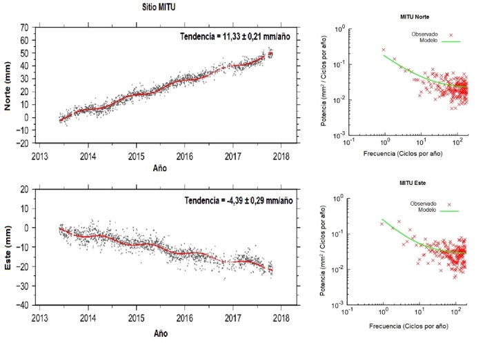{width="4.677083333333333in" height="3.309097769028871in"}

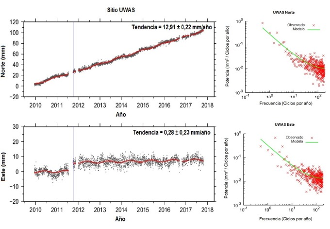{width="4.53125in" height="3.1372167541557303in"}

Figura 2. Series de tiempo GPS y diagramas de densidad espectral de las estaciones MITU (A) y UWAS (B). El término *cpy* en la frecuencia significa ciclos por año.

A partir de las series de tiempo con observaciones hasta finales de 2017 superiores a 2.5 años [50], se realizó la estimación de las velocidades geodésicas horizontales con respecto al marco de referencia ITRF2008 [51].

 Resultados
----------

El uso de datos de estaciones geodésicas permanentes permite estudiar procesos de deformaciones transitorias, así como aquellos asociados a actividad sismotectónica y otros tipos de señales geofísicas. Esto es posible a partir de las soluciones diarias de las estaciones permanentes, que permiten obtener una estimación más precisa de las tasas de deformación que aquellas obtenidas con mediciones episódicas mediante la ejecución de campañas de campo [52]. Cuando por condiciones de seguridad no es posible la instalación de estaciones permanentes, las estaciones de campo son esenciales en el estudio de la cinemática de fallas, con arreglos geométricos acordes con el tipo de análisis que se requiere obtener, complementando la información obtenida con estaciones permanentes.

Mora-Páez et al. [53] realizaron la estimación de vectores de velocidad geodésica con respecto a Suramérica empleando datos obtenidos hasta marzo 31 de 2016 en 60 estaciones permanentes instaladas en Colombia y países vecinos, 46 de ellas localizadas en nuestro país. En esta ocasión, se emplean datos obtenidos hasta finales del 2017 en 86 estaciones geodésicas permanentes de operación continua para estimar las velocidades geodésicas con respecto a Suramérica siguiendo el procedimiento establecido por Mora-Páez et al. [53]. Los resultados presentados en este artículo, Figura 3, Tabla 1, corresponden a una solución más robusta, con mayor número de estaciones en una distribución espacial más amplia y mayor tiempo de observación en las estaciones, de velocidades de estaciones localizadas en Colombia (57), Ecuador (6), Panamá (4), Costa Rica (1), Honduras (2) y Nicaragua (2), así como en algunos países del Caribe (14), lo que permite tener un mejor panorama del contexto geodinámico de la región.

De la Figura 3 se puede observar la subducción oblicua de la placa de Nazca, representada en el movimiento hacia el este de dos estaciones GPS, localizadas en las islas de Galápagos (Ecuador) y Malpelo (Colombia). El Bloque Norte de los Andes-BNA, definido originalmente por [5], se limita por la trinchera colombo-ecuatoriana y el bloque de Panamá al oeste, el Cinturón Deformado del Caribe Sur al norte, y las zonas del Borde Oriental Llanero y Falla de Boconó al este.

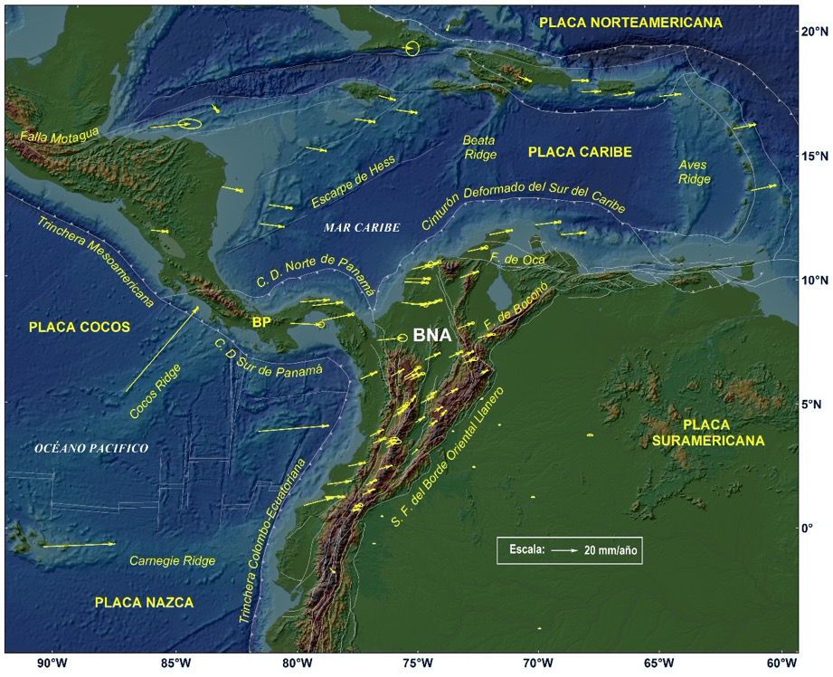{width="6.1375in" height="4.985416666666667in"}

Figura 3. Mapa de velocidades geodésicas de la zona de estudio con respecto a Suramérica, expresadas en ITRF2008.

Dentro del BNA, los vectores de velocidad de las estaciones GPS localizadas en la costa ecuatoriana y colombiana del océano Pacífico, al sur de la latitud 3°N, muestran magnitudes mayores que los obtenidos en las estaciones localizadas al interior del continente, y una tendencia general este-noreste. Por consiguiente, los vectores de velocidad de las estaciones localizadas al sur de 3° de latitud representan acumulación de deformación en la trinchera colombo-ecuatoriana de la placa de Nazca, que implica contracción normal al margen a lo largo de la zona de subducción, lo cual permite concluir que esta zona es potencialmente generadora de sismos representativos, tal como ocurrió en el pasado con los eventos de 1906, 1942, 1958 y 1979, y el más reciente en Ecuador en el 2016, similar al evento de 1942 [54]. Sagiya y Mora-Páez [55] realizaron análisis de la inversión de la tasa de variación de la longitud de las líneas base entre estaciones GPS a lo largo de la costa de Colombia y Ecuador, concluyendo que las regiones fuentes de los sismos de 1942 y 1958 están casi completamente bloqueadas, resultado preliminar que requiere más estudios.

Por su parte, las estaciones localizadas dentro del BNA entre las latitudes 3°N y 7.5°N muestran tendencia general hacia el noreste, y a partir de esta latitud, una tendencia predominante hacia el este, similar a lo expuesto por Mora-Páez et al. [53]. A su vez, las velocidades de las estaciones localizadas en el Bloque de Panamá-BP indican colisión con el Bloque Norte de los Andes, mientras que las estaciones GPS ubicadas en la placa Caribe presentan una dirección general hacia el este-sureste con respecto a Suramérica.

Tabla 1. Velocidades con respecto a Suramérica expresadas en ITRF2008.

+--------------+--------------+--------------+--------------+--------------+-------------+-------------+
| Estación | Longitud | Latitud  | Vel E    | Vel (N)  | Sig (E) | Sig (N) |
|              |              |              |              |              |             |             |
|              | (grados) | (grados) | (mm/año) | (mm/año) | (mm)    | (mm)    |
+==============+==============+==============+==============+==============+=============+=============+
| ABMF         | -61.527535   | 16.262305    | 16.4         | 3.3          | 0.7         | 0.5         |
+--------------+--------------+--------------+--------------+--------------+-------------+-------------+
| ACP1         | -79.949858   | 9.371392     | 22.1         | 1.8          | 0.3         | 0.3         |
+--------------+--------------+--------------+--------------+--------------+-------------+-------------+
| ACP6         | -79.407822   | 9.238476     | 22.1         | 2.3          | 0.6         | 0.6         |
+--------------+--------------+--------------+--------------+--------------+-------------+-------------+
| AJCM         | -74.884547   | 5.210409     | 8.8          | 4.7          | 0.8         | 0.6         |
+--------------+--------------+--------------+--------------+--------------+-------------+-------------+
| ALPA         | -72.917755   | 11.527983    | 14.3         | 3.2          | 1.1         | 1.0         |
+--------------+--------------+--------------+--------------+--------------+-------------+-------------+
| ANCH         | -76.870138   | 3.534661     | 9.1          | 3.6          | 1.0         | 0.7         |
+--------------+--------------+--------------+--------------+--------------+-------------+-------------+
| AUCA         | -76.882732   | -0.640818    | 1.7          | -0.2         | 0.5         | 0.2         |
+--------------+--------------+--------------+--------------+--------------+-------------+-------------+
| BAAP         | -73.554010   | 4.071802     | 0.1          | -0.7         | 0.6         | 0.3         |
+--------------+--------------+--------------+--------------+--------------+-------------+-------------+
| BACO         | -75.691927   | 9.402437     | 18.4         | -2.0         | 1.3         | 1.2         |
+--------------+--------------+--------------+--------------+--------------+-------------+-------------+
| BAME         | -74.565083   | 4.235596     | 5.9          | 4.0          | 0.7         | 0.3         |
+--------------+--------------+--------------+--------------+--------------+-------------+-------------+
| BAPA         | -74.657507   | 5.466415     | 7.6          | 4.2          | 0.4         | 0.3         |
+--------------+--------------+--------------+--------------+--------------+-------------+-------------+
| BARU         | -75.589981   | 10.257608    | 17.7         | -0.7         | 0.9         | 0.7         |
+--------------+--------------+--------------+--------------+--------------+-------------+-------------+
| BASO         | -77.393229   | 6.202969     | 11.9         | 5.3          | 0.8         | 0.4         |
+--------------+--------------+--------------+--------------+--------------+-------------+-------------+
| BOBG         | -73.357552   | 8.312444     | 11.9         | 4.4          | 0.9         | 0.7         |
+--------------+--------------+--------------+--------------+--------------+-------------+-------------+
| BOGT         | -74.080937   | 4.640073     | 4.4          | 4.8          | 0.5         | 0.3         |
+--------------+--------------+--------------+--------------+--------------+-------------+-------------+
| BUGT         | -76.995796   | 3.825685     | 9.9          | 4.7          | 0.5         | 0.3         |
+--------------+--------------+--------------+--------------+--------------+-------------+-------------+
| CAPI         | -72.427755   | 5.351423     | 1.8          | 0.9          | 0.5         | 0.4         |
+--------------+--------------+--------------+--------------+--------------+-------------+-------------+
| CAYS         | -79.846118   | 15.795140    | 15.2         | -2.8         | 0.4         | 0.5         |
+--------------+--------------+--------------+--------------+--------------+-------------+-------------+
| CCAN         | -76.299870   | 3.360122     | 7.4          | 4.4          | 3.2         | 1.3         |
+--------------+--------------+--------------+--------------+--------------+-------------+-------------+
| CIA1         | -76.357424   | 3.505288     | 7.1          | 3.7          | 2.5         | 1.0         |
+--------------+--------------+--------------+--------------+--------------+-------------+-------------+
| CIOH         | -75.533882   | 10.390817    | 17.9         | 0.1          | 1.0         | 0.7         |
+--------------+--------------+--------------+--------------+--------------+-------------+-------------+
| CN05         | -68.359391   | 18.563901    | 12.2         | 0.0          | 0.6         | 0.6         |
+--------------+--------------+--------------+--------------+--------------+-------------+-------------+
| CN06         | -70.656108   | 18.789824    | 9.0          | -3.4         | 0.8         | 0.6         |
+--------------+--------------+--------------+--------------+--------------+-------------+-------------+
| CN10         | -75.970551   | 17.415190    | 15.1         | -2.0         | 0.5         | 0.7         |
+--------------+--------------+--------------+--------------+--------------+-------------+-------------+
| CN11         | -77.784116   | 17.021179    | 15.2         | -2.3         | 0.6         | 0.6         |
+--------------+--------------+--------------+--------------+--------------+-------------+-------------+
| CN12         | -76.749050   | 18.004481    | 12.3         | -3.3         | 0.2         | 0.6         |
+--------------+--------------+--------------+--------------+--------------+-------------+-------------+
| CN14         | -73.677948   | 20.975328    | -1.5         | -3.9         | 0.5         | 0.5         |
+--------------+--------------+--------------+--------------+--------------+-------------+-------------+
| CN18         | -83.944310   | 17.407672    | 4.5          | -5.2         | 0.7         | 0.9         |
+--------------+--------------+--------------+--------------+--------------+-------------+-------------+
| CN19         | -70.048500   | 12.611848    | 18.7         | 2.2          | 0.8         | 0.8         |
+--------------+--------------+--------------+--------------+--------------+-------------+-------------+
| CN28         | -79.033718   | 8.625063     | 24.0         | 4.8          | 0.8         | 0.8         |
+--------------+--------------+--------------+--------------+--------------+-------------+-------------+
| CN29         | -83.374636   | 14.048796    | 15.2         | -3.2         | 0.9         | 0.9         |
+--------------+--------------+--------------+--------------+--------------+-------------+-------------+
| CN33         | -80.326666   | 8.487239     | 23.6         | -1.1         | 1.8         | 1.7         |
+--------------+--------------+--------------+--------------+--------------+-------------+-------------+
| CN35         | -81.362919   | 13.375495    | 17.2         | -2.7         | 0.7         | 0.6         |
+--------------+--------------+--------------+--------------+--------------+-------------+-------------+
| CN37         | -75.263173   | 10.792576    | 14.3         | 3.5          | 1.6         | 2.0         |
+--------------+--------------+--------------+--------------+--------------+-------------+-------------+
| CN38         | -71.988025   | 12.221821    | 17.0         | 3.4          | 0.6         | 0.4         |
+--------------+--------------+--------------+--------------+--------------+-------------+-------------+
| CN40         | -68.958013   | 12.180043    | 18.3         | 1.6          | 0.7         | 0.6         |
+--------------+--------------+--------------+--------------+--------------+-------------+-------------+
| CN47         | -60.940494   | 13.710786    | 18.4         | 4.0          | 0.8         | 0.5         |
+--------------+--------------+--------------+--------------+--------------+-------------+-------------+
| COEC         | -77.786983   | 0.716067     | 6.1          | 1.0          | 1.2         | 0.6         |
+--------------+--------------+--------------+--------------+--------------+-------------+-------------+
| CORO         | -75.287853   | 9.328087     | 17.3         | 1.1          | 0.7         | 0.4         |
+--------------+--------------+--------------+--------------+--------------+-------------+-------------+
| CRO1         | -64.584317   | 17.756898    | 16.1         | 1.9          | 0.4         | 0.3         |
+--------------+--------------+--------------+--------------+--------------+-------------+-------------+
| CUC1         | -72.512812   | 7.932275     | 11.8         | 2.5          | 1.6         | 0.6         |
+--------------+--------------+--------------+--------------+--------------+-------------+-------------+
| ESMR         | -79.724371   | 0.934648     | 21.7         | 6.0          | 1.0         | 0.6         |
+--------------+--------------+--------------+--------------+--------------+-------------+-------------+
| GLPS         | -90.303667   | -0.742999    | 54.9         | 2.2          | 0.2         | 0.2         |
+--------------+--------------+--------------+--------------+--------------+-------------+-------------+
| GUAP         | -77.894678   | 2.574479     | 12.7         | 2.7          | 0.6         | 0.5         |
+--------------+--------------+--------------+--------------+--------------+-------------+-------------+
| INRI         | -75.897181   | 4.908586     | 8.6          | 4.9          | 1.3         | 0.9         |
+--------------+--------------+--------------+--------------+--------------+-------------+-------------+
| INTO         | -76.042778   | 4.642218     | 7.4          | 4.6          | 0.7         | 0.6         |
+--------------+--------------+--------------+--------------+--------------+-------------+-------------+
| ISCO         | -87.055829   | 5.544342     | 55.1         | 64.1         | 0.6         | 0.8         |
+--------------+--------------+--------------+--------------+--------------+-------------+-------------+
| MALO         | -81.606138   | 4.003245     | 53.2         | 4.2          | 0.7         | 0.3         |
+--------------+--------------+--------------+--------------+--------------+-------------+-------------+
| MANA         | -86.248991   | 12.148939    | 12.5         | -1.2         | 0.6         | 0.8         |
+--------------+--------------+--------------+--------------+--------------+-------------+-------------+
| MECE         | -73.712014   | 7.107247     | 9.6          | 4.5          | 0.9         | 0.5         |
+--------------+--------------+--------------+--------------+--------------+-------------+-------------+
| MIPR         | -66.526960   | 17.886223    | 15.1         | 2.2          | 0.3         | 0.2         |
+--------------+--------------+--------------+--------------+--------------+-------------+-------------+
| MITU         | -70.232124   | 1.260781     | -0.1         | 0.5          | 1.1         | 0.3         |
+--------------+--------------+--------------+--------------+--------------+-------------+-------------+
| MOPR         | -67.931152   | 18.076898    | 14.5         | 0.6          | 0.2         | 0.2         |
+--------------+--------------+--------------+--------------+--------------+-------------+-------------+
| MZAL         | -75.470523   | 5.029994     | 6.3          | 8.4          | 0.6         | 0.7         |
+--------------+--------------+--------------+--------------+--------------+-------------+-------------+
| OCEL         | -71.615810   | 4.271182     | 0.0          | 0.4          | 0.6         | 0.4         |
+--------------+--------------+--------------+--------------+--------------+-------------+-------------+
| PAL1         | -73.189135   | 7.136240     | 8.5          | 4.2          | 0.6         | 0.5         |
+--------------+--------------+--------------+--------------+--------------+-------------+-------------+
| PASI         | -76.499398   | 0.512778     | 0.2          | -0.4         | 0.6         | 0.4         |
+--------------+--------------+--------------+--------------+--------------+-------------+-------------+
| POVA         | -76.614742   | 2.449089     | 9.5          | 2.8          | 0.5         | 0.3         |
+--------------+--------------+--------------+--------------+--------------+-------------+-------------+
| PUIN         | -67.903339   | 3.851199     | 0.6          | -0.1         | 1.8         | 0.5         |
+--------------+--------------+--------------+--------------+--------------+-------------+-------------+
| QUIL         | -77.290947   | 1.393925     | 8.4          | 4.0          | 1.0         | 0.3         |
+--------------+--------------+--------------+--------------+--------------+-------------+-------------+
| RIOP         | -78.651105   | -1.650595    | 3.3          | -3.2         | 0.7         | 0.5         |
+--------------+--------------+--------------+--------------+--------------+-------------+-------------+
| ROA0         | -86.526839   | 16.318152    | 30.8         | 2.9          | 7.0         | 2.9         |
+--------------+--------------+--------------+--------------+--------------+-------------+-------------+
| SAN0         | -81.715720   | 12.580450    | 18.4         | -2.5         | 0.4         | 0.3         |
+--------------+--------------+--------------+--------------+--------------+-------------+-------------+
| SCUB         | -75.762315   | 20.012063    | 8.1          | -0.6         | 4.1         | 4.5         |
+--------------+--------------+--------------+--------------+--------------+-------------+-------------+
| SEL1         | -75.529123   | 6.190869     | 8.9          | 4.7          | 0.5         | 0.3         |
+--------------+--------------+--------------+--------------+--------------+-------------+-------------+
| SNLR         | -78.847003   | 1.292516     | 13.8         | 0.1          | 1.2         | 0.4         |
+--------------+--------------+--------------+--------------+--------------+-------------+-------------+
| TICU         | -69.939384   | -4.187084    | -0.3         | 0.1          | 0.8         | 0.2         |
+--------------+--------------+--------------+--------------+--------------+-------------+-------------+
| TONE         | -76.139307   | 6.324426     | 9.5          | 5.2          | 0.5         | 0.3         |
+--------------+--------------+--------------+--------------+--------------+-------------+-------------+
| TUCO         | -78.747701   | 1.814852     | 17.9         | 2.6          | 0.5         | 0.3         |
+--------------+--------------+--------------+--------------+--------------+-------------+-------------+
| UNME         | -75.577110   | 6.263983     | 11.5         | 8.0          | 1.2         | 0.7         |
+--------------+--------------+--------------+--------------+--------------+-------------+-------------+
| UWAS         | -72.391332   | 6.450714     | 5.3          | 2.3          | 0.4         | 0.3         |
+--------------+--------------+--------------+--------------+--------------+-------------+-------------+
| VBUV         | -73.858933   | 5.533207     | 8.5          | 4.7          | 0.7         | 0.5         |
+--------------+--------------+--------------+--------------+--------------+-------------+-------------+
| VDPR         | -73.247825   | 10.435805    | 13.9         | 4.6          | 0.5         | 0.4         |
+--------------+--------------+--------------+--------------+--------------+-------------+-------------+
| VMAG         | -74.847318   | 9.286741     | 14.3         | 3.9          | 1.0         | 0.8         |
+--------------+--------------+--------------+--------------+--------------+-------------+-------------+
| VMAR         | -75.324233   | 6.176058     | 9.6          | 4.9          | 1.4         | 0.7         |
+--------------+--------------+--------------+--------------+--------------+-------------+-------------+
| VMER         | -77.153294   | 1.785013     | 7.2          | 3.7          | 1.0         | 0.6         |
+--------------+--------------+--------------+--------------+--------------+-------------+-------------+
| VMES         | -73.091681   | 6.883333     | 8.5          | 3.0          | 2.0         | 0.9         |
+--------------+--------------+--------------+--------------+--------------+-------------+-------------+
| VNEI         | -75.255303   | 3.062246     | 3.9          | 3.7          | 0.5         | 0.4         |
+--------------+--------------+--------------+--------------+--------------+-------------+-------------+
| VORA         | -76.721806   | 7.818440     | 19.8         | 1.8          | 2.9         | 2.3         |
+--------------+--------------+--------------+--------------+--------------+-------------+-------------+
| VORI         | -77.672487   | 0.863038     | 5.3          | 1.7          | 1.4         | 1.0         |
+--------------+--------------+--------------+--------------+--------------+-------------+-------------+
| VOTU         | -74.710301   | 7.018650     | 11.2         | 5.0          | 0.4         | 0.5         |
+--------------+--------------+--------------+--------------+--------------+-------------+-------------+
| VPIJ         | -75.106690   | 4.396687     | 6.4          | 4.1          | 0.7         | 0.3         |
+--------------+--------------+--------------+--------------+--------------+-------------+-------------+
| VPOL         | -74.860843   | 10.793771    | 13.6         | 5.5          | 1.1         | 0.9         |
+--------------+--------------+--------------+--------------+--------------+-------------+-------------+
| VROS         | -74.323327   | 4.847047     | 5.6          | 3.5          | 0.7         | 0.4         |
+--------------+--------------+--------------+--------------+--------------+-------------+-------------+
| VSJG         | -72.638968   | 2.532512     | -0.8         | 0.2          | 0.8         | 0.3         |
+--------------+--------------+--------------+--------------+--------------+-------------+-------------+
| VSJP         | -75.835558   | 4.781177     | 6.5          | 4.6          | 0.6         | 0.3         |
+--------------+--------------+--------------+--------------+--------------+-------------+-------------+

Una solución combinada de resultados de GeoRED con los de Nocquet et al. [56], permitió a Mora-Páez et al. [53] la estimación del polo de Euler del BNA basado en observaciones de estaciones de campo localizadas principalmente en territorio ecuatoriano, las cuales, al estar localizadas al sur de 7.5°N de latitud, representarían el movimiento rígido del movimiento del Bloque Norte de los Andes en la región central de Colombia y suroeste de Ecuador. Como es establecido a partir de los resultados geodésicos, se aprecia la colisión del BP con el BNA y la convergencia de la placa Caribe con respecto a Suramérica. Por tanto, el polo estimado por Mora-Páez et al. [53] no representaría el movimiento rígido del BNA en la zona norte, lo cual permitiría considerar, basado en resultados geodésicos, la segmentación del BNA en dos bloques. Esta consideración debe tenerse en cuenta en estudios posteriores relacionados con la subducción de la placa Caribe debajo de la placa suramericana [57].

Con el fin de determinar la deformación en el Bloque Norte de los Andes, se realizó el cálculo de los polos de Euler que mejor represente a cada una de las dos zonas, cuyo límite, basado en resultados geodésicos, se señala en 7.5°N de latitud. Para la zona central y sur de NAB, se tomaron 9 estaciones permanentes localizadas al sur del límite mencionado, las cuales fueron seleccionadas evitando estaciones ubicadas cerca a la costa Pacífica y al Sistema de Fallas del Borde Oriental Llanero. De igual manera, para la zona norte del BNA se estimó el polo de Euler a partir de 4 estaciones permanentes, alejadas de la costa caribe. La Tabla 2 indica los parámetros de los polos de Euler estimados.

Tabla 2. Polos de Euler para las dos zonas del Bloque Norte de los Andes.

  BNA sector Central-Sur   BNA sector Norte                                                   
  ---------------------------- ---------------------- -------------- --------------- ---------------- --------------
  Latitud °                Longitud °         Ω (°/Ma)   Latitud °   Longitud °   Ω (°/Ma)
  65.48                        -163.7                 0.086          9.96            112.52           0.361

El modelo de la Figura 4 izquierda, de la zona Centro-Sur del BNA, confirma la acumulación de la deformación en la región de la costa Pacífica de Ecuador y Colombia, asociada a la subducción de la placa de Nazca, mientras que el modelo de la Figura 4 derecha, zona norte del BNA, permite apreciar deformación acumulada en un sector de la región de la costa caribe.

  ----------------------------------------------------------------------------------------------------------------------------------------------
  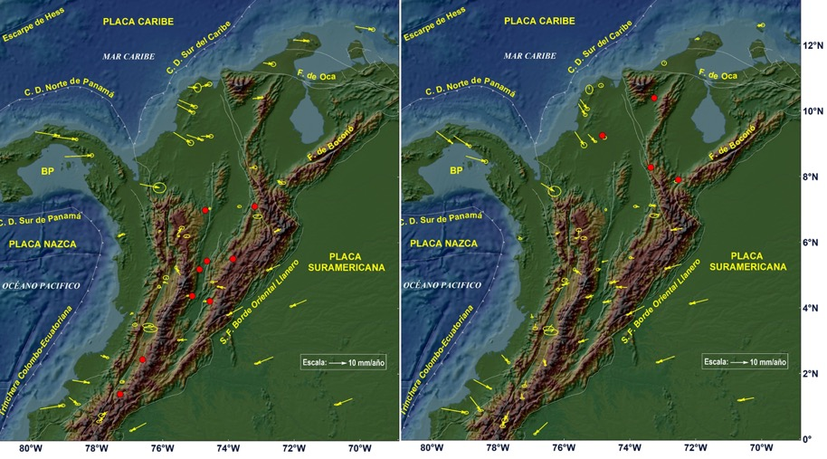{width="6.090972222222222in" height="3.3811165791776028in"}
  ----------------------------------------------------------------------------------------------------------------------------------------------

Figura 4. Modelos de deformación de los sectores Centro-Sur y Norte del Bloque Norte de los Andes. Los círculos rojos corresponden a las estaciones empleadas para la estimación de los respectivos polos de Euler.

GEODESIA DE IMÁGENES PARA EL ESTUDIO DE LA SUBSIDENCIA EN LA CIUDAD DE BOGOTÁ
=============================================================================

3.1 Introducción {#introducción-4 .list-paragraph}
----------------

El término subsidencia hace referencia al fenómeno que corresponde al hundimiento de la superficie terrestre en un área determinada, lo cual es posible debido a varios factores, tanto naturales como antrópicos [58]. La Sabana de Bogotá, donde se ubica la ciudad de Bogotá, corresponde a una cuenca tectónica-sedimentaria consolidada después de la elevación del Norte de los Andes, ocurrida hace alrededor de 5 Ma [59], localizada en zona sísmica moderada, es propensa a la ocurrencia de deslizamientos e inundaciones por su compleja topografía. La subsidencia de la ciudad de Bogotá ha sido objeto de discusión y análisis en diversos escenarios; varios autores y entidades han adelantado investigaciones en este tema, dado que este fenómeno puede afectar directamente las edificaciones y obras civiles de la ciudad.

Metodología
-----------

Bajo el concepto de geodesia de imágenes, la técnica conocida como InSAR (Interferometric Synthetic Aperture Radar), permite determinar cambios de posición del terreno, especialmente en su componente vertical, mediante el uso imágenes de radar de apertura sintética adquiridas en diversos períodos de tiempo [60]. La Figura 5 muestra la forma cómo funciona esta técnica a partir de dos imágenes de dos épocas diferentes para un caso de subsidencia.

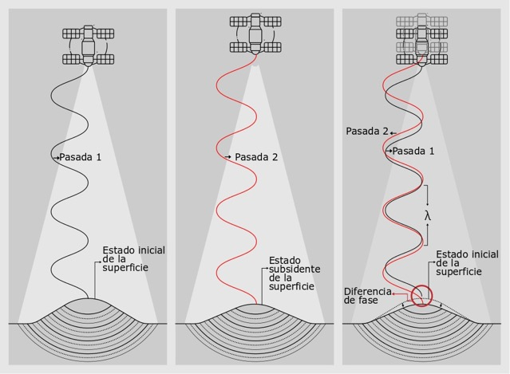{width="4.221154855643045in" height="3.095417760279965in"}

Figura 5. Medición mediante InSAR. Se aprecia la diferencia de fase entre una primera toma (pasada 1) respecto a una segunda toma (pasada 2); λ corresponde a la longitud de onda.

### Generación de interferogramas

La comparación de las fases de las imágenes de radar requiere contar con dos imágenes: la primera, maestra, adquirida en una fecha inicial, y la segunda, denominada esclava, con fecha posterior, lo cual permite generar el producto de dicha comparación, conocido como interferograma diferencial. Los interferogramas diferenciales son imágenes que contienen un ciclo de colores (rojo, naranja, amarillo, verde, azul, púrpura) conocido como franjas (fringes) interferométricas. Cada ciclo de colores corresponde a la mitad de la longitud de onda del sensor con el cual se obtuvo el interferograma; por lo tanto, se pueden estimar los cambios relativos en la superficie terrestre contando la cantidad de franjas interferométricas respecto a un sitio que aparentemente no presenta cambios [61].

La Figura 6 muestra un interferograma compuesto por una rampa de colores que va del cian hasta el verde pasando por morado, magenta, amarillo, verde, y nuevamente cian. Este patrón corresponde a un ciclo colores expresado en el módulo 2π, donde cada ciclo representa un desplazamiento vertical equivalente a la mitad de la longitud de onda del sensor, este caso es de 1.6 cm considerando que las imágenes interferométricas de TerraSAR-X tiene una longitud de onda de 3.2 cm. El sentido del desplazamiento vertical está en función del orden de colores de --π a π, indicado en la barra de colores, el cual en este caso indica subsidencia. De esta manera, se podría estimar el desplazamiento relativo de un punto respecto a otro; por ejemplo, si se tiene como referencia un punto denominado 1 y se compara con otro denominado 2, se observa que entre los dos hay una diferencia de 3 ciclos de colores es decir 4.8 centímetros en el sentido de la subsidencia.

{width="4.779069335083115in" height="4.396225940507437in"}

Figura 6. Ejemplo de interferograma diferencial generado a partir de imágenes TerraSAR-X para la ciudad de Bogotá entre el 28/09/2011 y 17/10/2012. Modificado de Mora-Páez et al. [62]

La Figura 7 complementa la interpretación de un interferograma diferencial que representa el hundimiento de la superficie del terreno mediante el ciclo de colores. Tomando como referencia un punto de inicio del ciclo de colores (rojo, naranja, amarillo, verde, azul, púrpura), se puede estimar el cambio relativo del terreno. Para este caso, dos ciclos, cada uno correspondiente a 1.6 cm (banda X), arroja un total de 3.2 cm; la barra de colores indica el sentido de la subsidencia.

  -----------------------------------------------------------------------------------------------------------------------------------
  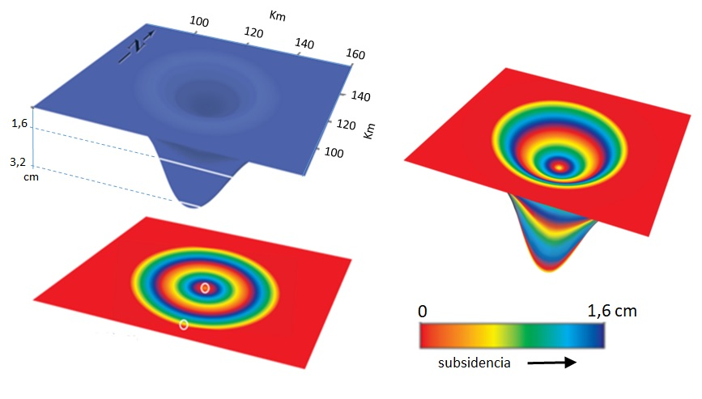{width="6.1375in" height="3.4902777777777776in"}
  -----------------------------------------------------------------------------------------------------------------------------------

Figura 7. Representación de la interpretación de un interferograma diferencial correspondiente a subsidencia de un terreno. Fuente: modificado de https://ca.water.usgs.gov/land_subsidence (2019).

Generado el interferograma, se realiza otro procesamiento llamado "*desenrollo" de la fase*, que permite calcular el desplazamiento vertical. Dichas imágenes, denominadas "desenrolladas", se "apilan" digitalmente, también conocido como stacking, para obtener los desplazamientos acumulados en el tiempo respecto a la imagen maestra, Figura 8. Este procesamiento permite generar tanto mapas de desplazamiento acumulado como series de tiempo.

  --------------------------------------------------------------------------
  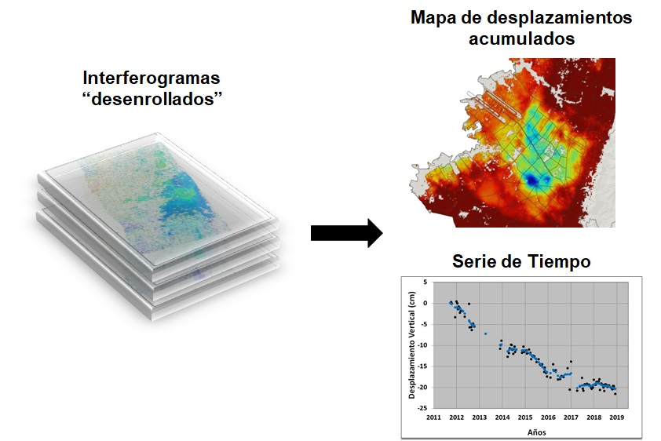{width="6.1375in" height="4.096527777777778in"}
  --------------------------------------------------------------------------

Figura 8. Esquema representativo de un "stacking" ó "apilación", generándose un cubo de datos de desplazamiento acumulados para cada periodo de toma de imagen, obtenido a partir de los interferogramas "desenrollados". Mediante este *stack* se obtienen los mapas de desplazamiento acumulado, así como series de tiempo.

Los interferogramas se generan en el GIGE mediante el empleo del paquete científico ISCE (InSAR Scientific Computing Environment) [63, 64], los cuales se analizan conjuntamente con la técnica denominada "stacking", correspondiente al apilamiento digital en un cubo haciendo uso del paquete científico GIAnT (Generic InSAR Analysis Toolbox) [65], empleado además para detectar y corregir errores orbitales. El paquete *PyAPS (Python-Based Atmospheric Phase Screen estimator)* [65] es utilizado para los modelos de corrección atmosféricos en cada interferograma. Como estrategia de procesamiento del "stack" de interferogramas se aplicó el algoritmo NSBAS (New-Small BAseline Subset) [66], que permite la estimación del desplazamiento entre la fecha de adquisición de las imágenes objeto del análisis, basado en mínimos cuadrados. Este algoritmo corresponde a una extensión del enfoque SBAS (Small Baseline Subset) que usa una función de regularización para compensar los enlaces faltantes en las redes interferométricas debido a la falta de superposiciones temporales y geométricas que permitan generar correlaciones temporales y espaciales [65, 66, 67]. De esta forma, se generaron los mapas de desplazamiento acumulado en función de la época de toma de la imagen, así como las respectivas series de tiempo.

Previamente, Mora-Páez et al. [62], empleando 76 imágenes TerraSAR-X para el período septiembre 28 de 2011 a octubre 17 de 2017 en la ciudad de Bogotá, obtuvieron un valor máximo de desplazamiento vertical acumulado de 19. cm. El presente estudio emplea 35 imágenes adicionales a las empleadas por Mora-Páez et al. [62], contando así con un total de 111 imágenes Terrasar-X, lo cual extiende el período de observación hasta diciembre de 2018 y permitió generar 501 interferogramas con una línea base menor o igual a 250 m [68]. La Figura 9 corresponde al mapa de desplazamientos generado a partir del nuevo procesamiento.

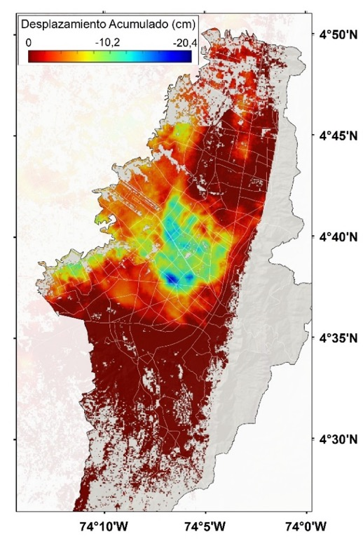{width="3.428472222222222in" height="5.083293963254593in"}

Figura 9. Mapa de desplazamientos verticales acumulados para el periodo septiembre de 2011 a diciembre de 2018.

La Figura 10A muestra un sector del mapa de desplazamientos, resaltándose la zona de máxima subsidencia en Bogotá de -20.4 cm, localizada en la zona de Puente Aranda, (punto 1); la Figura 10B presenta la respectiva serie de tiempo. Los círculos negros corresponden con la fecha de adquisición de la imagen, mientras que los círculos azules son los valores obtenidos mediante la aplicación en GIAnT del filtro Media Móvil Ponderado Gaussiano [64], cuyo valor se ve reflejado en el eje de desplazamiento vertical.

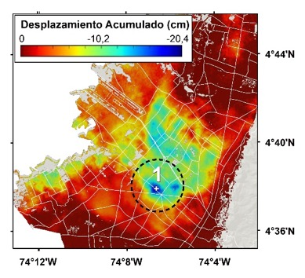{width="2.5961220472440947in" height="2.3622047244094486in"}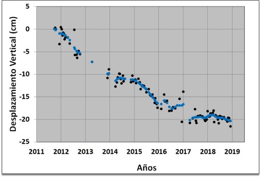{width="3.4913090551181103in" height="2.3622047244094486in"}

Figura 10. Mapa de desplazamientos acumulados del punto 1 sector Puente Aranda (izquierda). Serie de tiempo del Punto 1 (derecha). Los puntos de color negro corresponden a los valores observados del procesamiento del "stacking", mientras que los puntos azules a los valores obtenidos mediante la aplicación del filtro Media Móvil Ponderado Gaussiano.

La Figura 11a presenta otro sitio, punto 2, localizado en Normandía, cercano al aeropuerto, con valor de -15.7 cm; la Figura 11b muestra la respectiva serie de tiempo. A su vez, la Figura 12A muestra desplazamiento acumulado a diciembre de 2018 de -0.83 cm, considerado como mínimo para el caso de Bogotá; este sitio, en algunas ocasiones, ha mostrado variaciones del orden de 2 cm. La Figura 12B muestra la respectiva serie de tiempo.

{width="2.596015966754156in" height="2.3622047244094486in"} 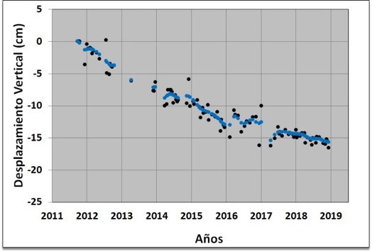{width="3.4916480752405947in" height="2.3622047244094486in"}

Figura 11. Mapa de desplazamientos acumulados del punto 2 (Normandía) (izquierda). Serie de tiempo del Punto 2 (derecha).

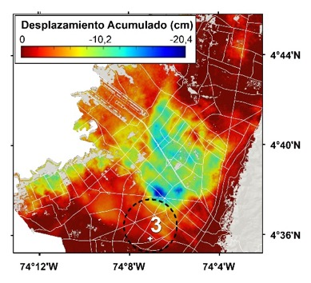{width="2.5961220472440947in" height="2.3622047244094486in"} 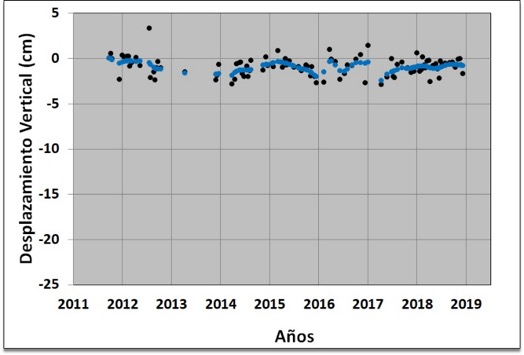{width="3.4913834208223973in" height="2.3622047244094486in"}

Figura 12. Mapa de desplazamientos acumulados del punto 3 (La Guaca) (izquierda), y serie de tiempo del punto 3 (derecha).

3.2.2 Integración de resultados InSAR con datos GPS.

Para este estudio, se realizó la integración de resultados de InSAR con los resultados obtenidos en las estaciones permanentes y de campo GPS del GIGE-SGC, así como estaciones de campo de la Red Geodésica de la ciudad de Bogotá, iniciativa conjunta desarrollada entre la Unidad Administrativa Especial Catastro Distrital de la Alcaldía de Bogotá y el Servicio Geológico Colombiano mediante ocupación episódica bajo la modalidad de campañas anuales de toma de datos, realizadas a partir de 2011, con observaciones en estación de alrededor 96 horas cada año, y cuyo procesamiento se ha realizado por GIGE.

Para la integración GPS-InSAR se seleccionaron estaciones permanentes con datos de observación mínima de 2.5 años, y estaciones de campo que han sido objeto de toma de datos por lo menos en tres campañas. Así, se contó para esta integración con 58 estaciones GPS, algunas de ellas por fuera del perímetro de la ciudad de Bogotá, de las cuales 4 son estaciones permanentes (BOGT, AEDO, VSOA, VROS). La localización de estas estaciones se puede observar en el mapa de la Figura 13.

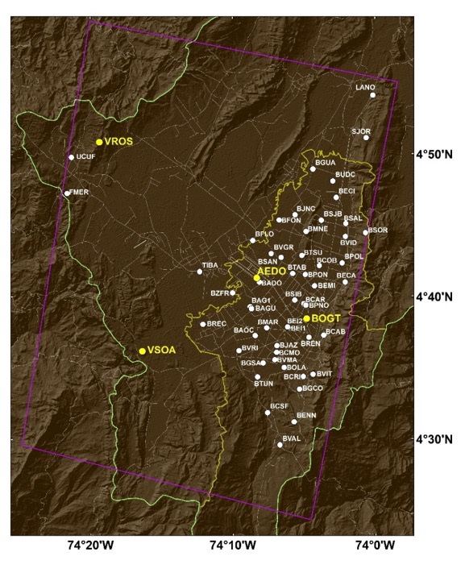{width="3.817168635170604in" height="4.771242344706912in"}

Figura 13. Mapa de localización de estaciones GPS empleadas para la integración con InSAR. Los círculos amarillos corresponden a estaciones permanentes, mientras los círculos blancos a estaciones de campo. El recuadro morado es la zona de cobertura de las imágenes TerraSAR-X empleadas.

De esta red de estaciones GPS, se destaca la estación permanente BOGT, dada su importancia y su registro histórico como se mencionó con anterioridad. La componente vertical de la serie de tiempo de esta estación ha mostrado un significativo comportamiento descendente vertical desde sus comienzos. Las líneas azules corresponden a *offsets* asociados a cambios de instrumental a través del tiempo. La Figura 14A muestra la serie de tiempo, así como la estimación de la velocidad anual en esta estación para el mismo período de tiempo de cobertura de las imágenes interferométricas de radar empleadas. Por su parte la Figura 14B muestra la serie de tiempo estimada InSAR para el píxel de localización de la estación GPS BOGT.

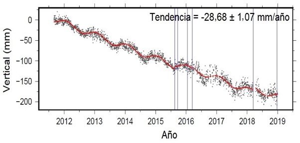{width="3.975in" height="1.8958333333333333in"}

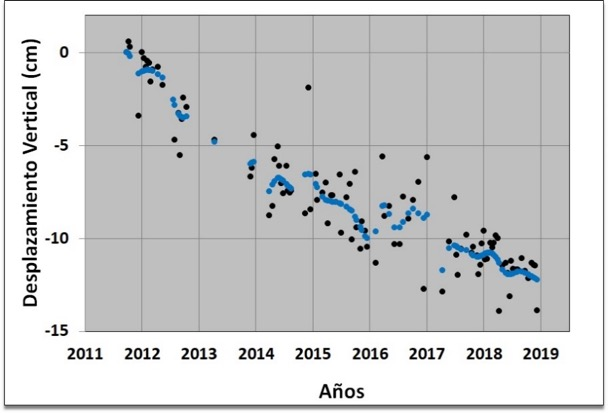{width="4.062992125984252in" height="2.7486570428696413in"}

Figura 14. Serie de tiempo estación GPS permanente BOGT, imagen superior. Serie de tiempo InSAR para el sitio de localización de la estación BOGT, imagen inferior.

Las dos series de tiempo permiten observar una marcada tendencia de descenso vertical, probablemente asociada a la subsidencia. La serie de tiempo GPS presenta una velocidad basada en tendencia lineal de -28.68 mm/año con un error de ± 1.07 mm/año. La línea de tendencia marcada en color rojo en la gráfica señala el comportamiento de la estación a través del tiempo. El resultado del procesamiento de los datos observados se ajusta al modelo aplicado, y permiten identificar un patrón periódico en el tiempo, observándose oscilaciones anuales, que puede deberse a cambios hidrológicos estacionales; por ejemplo, precipitación de aguas lluvias y/o extracción de agua subterránea. Este componente vertical, por su alto contenido de ruido, influye en el valor estimado de la incertidumbre. El valor de velocidad anual permite estimar un valor de desplazamiento acumulado de -18.06 cm para el mismo período de observación con InSAR. Por su parte, los datos observados (círculos negros) de la serie de tiempo de InSAR, correspondientes a cada época de toma de imágenes antes de la integración con GPS, presentan un valor de correlación R² = 0.82.

+------------------------------------------------------------------------------------------------------------------------------------------------------------------------------------------------------------------------------------------------------------------------------------------------------------------------------------------------------------------------------------------------------------------------------------------------------------------------------------------------------------------------------------------------------------------------------------------------------------------------------------------------------------------------------------------------------------------------------------------------------------------------------------------------------------------------------------------------------------------------------------------------------------------------------------------------------------------------------------------------------------------------------------------------------------------------------------------------------+
| Caja 3. Conceptos de interferometría de radar                                                                                                                                                                                                                                                                                                                                                                                                                                                                                                                                                                                                                                                                                                                                                                                                                                                                                                                                                                                                                                                    |
|                                                                                                                                                                                                                                                                                                                                                                                                                                                                                                                                                                                                                                                                                                                                                                                                                                                                                                                                                                                                                                                                                                      |
| Radar de Apertura Sintética, SAR (del inglés), es un sistema satelital de adquisición de imágenes con características especiales, con capacidades operativas diurnas, nocturnas y de penetración a través de las nubes por ser un sistema activo. Esta condición es posible porque el sistema de radar trabaja en longitudes de onda larga comparado con otros sensores como los ópticos. Las imágenes interferométricas tienen dos componentes, que las diferencias de las otras imágenes: el primero, denominado Amplitud, el cual depende más de la rugosidad que de la composición química de los dispersores en el terreno; las rocas expuestas y las áreas urbanas muestran amplitudes fuertes, mientras que las superficies planas, como cuencas de agua tranquilas muestran amplitudes bajas. El segundo componente, la Fase, se basa en la radiación transmitida desde el satélite a los elementos de la superficie, que es retornada al sensor, lo que permite formar una imagen SAR. Estas imágenes contienen la información distancia-sensor, en cada uno de los pixeles [61, 69]. |
|                                                                                                                                                                                                                                                                                                                                                                                                                                                                                                                                                                                                                                                                                                                                                                                                                                                                                                                                                                                                                                                                                                      |
| Radar Interferométrico de Apertura Sintética-InSAR (del inglés), es un método de detección remota que utiliza microondas para detectar cambios en la elevación de la superficie terrestre. Esta técnica se utiliza para investigar la deformación resultante por la ocurrencia de terremotos, volcanes y subsidencia. La interferometría se basa en la interferencia de las ondas electromagnéticas; el patrón de interferencia se construye a partir de la diferencia de fase de dos imágenes SAR, adquiridas en diferentes épocas, con una separación entre tomas denominada línea base [61, 69].                                                                                                                                                                                                                                                                                                                                                                                                                                                                                            |
+------------------------------------------------------------------------------------------------------------------------------------------------------------------------------------------------------------------------------------------------------------------------------------------------------------------------------------------------------------------------------------------------------------------------------------------------------------------------------------------------------------------------------------------------------------------------------------------------------------------------------------------------------------------------------------------------------------------------------------------------------------------------------------------------------------------------------------------------------------------------------------------------------------------------------------------------------------------------------------------------------------------------------------------------------------------------------------------------------+

La integración de resultados GPS-InSAR significa incorporar las velocidades de estaciones GPS localizadas dentro de la escena de la imagen empleando la técnica conocida como GPS De-ramping, componente de GIAnT [60], que permite mejorar, a partir de los resultados GPS, las soluciones InSAR reduciendo los errores generados por retardo atmosférico o en las rampas de fase atribuidas a los residuos de la fase geométrica causada por inexactitudes en las órbitas de los satélites.

Como resultado de esta integración se muestra el ejemplo de la serie de tiempo InSAR del sitio de localización de la estación GPS BOGT, Figura 15. Se aprecia que la correlación obtenida en los datos integrados corresponde ahora a un valor de R² = 0.95, mejorando el valor estimado antes de la integración.

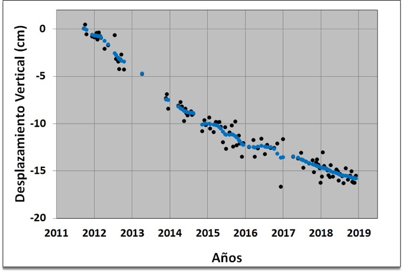{width="4.541666666666667in" height="3.072484689413823in"}

Figura 15. Serie de tiempo InSAR integrada con GPS correspondiente al sitio de ubicación de estación BOGT.

Como consecuencia de esta integración, el valor final del desplazamiento en la nueva serie de tiempo InSAR para este punto es ahora -15.83 cm, mayor que el valor de 12.25 cm obtenido antes de la integración.

La Figura 16 muestra el mapa de desplazamientos acumulados para la ciudad de Bogotá generado con la integración GPS-InSAR, donde se evidencian incrementos sustanciales en los valores de subsidencia respecto al mapa presentado en la Figura 9; antes de la integración con GPS, los valores de desplazamiento acumulado máximos estimados con InSAR eran 20.4 cm, y ahora, con la integración son de 24 cm.

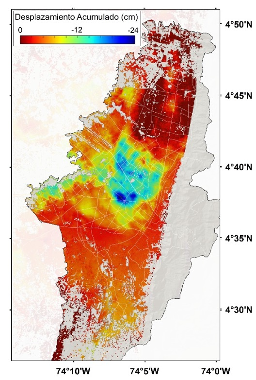{width="3.511661198600175in" height="5.206641513560805in"}

Figura 16. Mapa de desplazamientos verticales acumulados para el periodo septiembre de 2011 a diciembre de 2018 como resultado de la integración GPS-InSAR.

Realizada la integración de resultados GPS-InSAR, se efectuó un análisis similar para los puntos ubicados en las tres zonas diferentes, Figuras 10, 11 y 12. Así, se obtiene ahora un valor de desplazamiento acumulado hasta diciembre de 2018 para el punto 1 de -23.7 cm, -16.9 cm para el punto 2 y -5 cm para el punto 3, Figuras 17, 18 y 19 respectivamente.

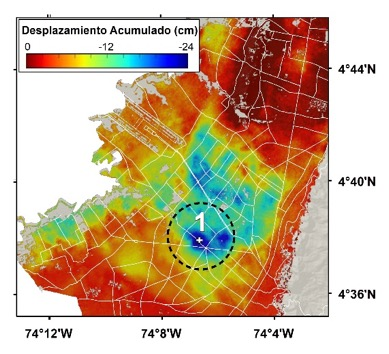{width="2.596017060367454in" height="2.3622047244094486in"}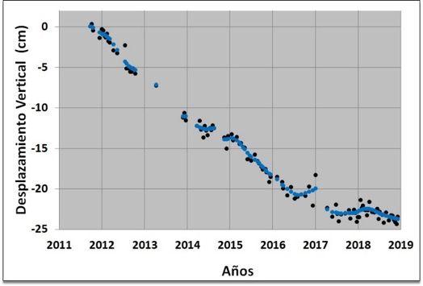{width="3.491747594050744in" height="2.3622047244094486in"}

Figura 17. Mapa de desplazamientos acumulados del punto 1 sector Puente Aranda (izquierda). Serie de tiempo del Punto 1 (derecha).

{width="2.596017060367454in" height="2.3622047244094486in"}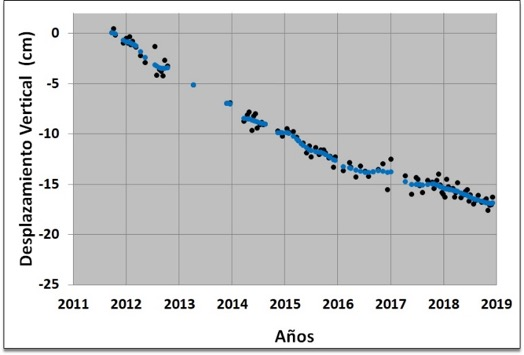{width="3.4918153980752407in" height="2.3622047244094486in"}

Figura 18. Mapa de desplazamientos acumulados del punto 2 (Normandía) (izquierda). Serie de tiempo del Punto 2, sector de Normandía (derecha).

{width="2.596017060367454in" height="2.3622047244094486in"} 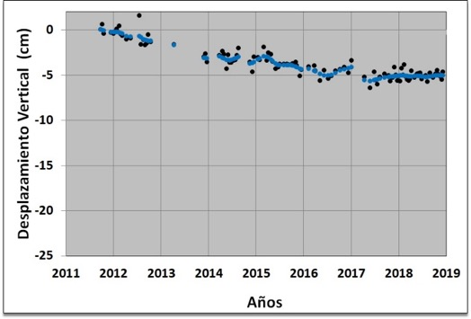{width="3.491748687664042in" height="2.3622047244094486in"}

Figura 19. Mapa de desplazamientos acumulados del punto 3 (La Guaca) (izquierda). Serie de tiempo del punto 3 (derecha).

+-----------------------------------------------------------------------------------------------------------------------------------------------------------------------------------------------------------------------------------------------------------------------------------------------------------------------------------------------------------------+
| Caja 4. Glosario de términos de InSAR                                                                                                                                                                                                                                                                                                                       |
|                                                                                                                                                                                                                                                                                                                                                                 |
| Coherencia: coeficiente de correlación cruzada del par de imágenes SAR estimado en una pequeña ventana (pocos píxeles en rango y azimut), una vez que se compensan todos los componentes deterministas de fase.                                                                                                                                             |
|                                                                                                                                                                                                                                                                                                                                                                 |
| Decorrelación: pérdida de coherencia entre un par interferométrico, lo que se traduce como ruido en la fase y afectación directa en el desarrollo de ésta.                                                                                                                                                                                                  |
|                                                                                                                                                                                                                                                                                                                                                                 |
| Espectro electromagnético: Es la distribución energética del conjunto de ondas electromagnéticas, a partir de la cual se puede identificar la energía que emiten los cuerpos en virtud de su longitud de onda. Dicha distribución inicia con longitudes de onda muy cortas como los rayos gamma hasta la mayor longitud de onda que son las ondas de radio. |
|                                                                                                                                                                                                                                                                                                                                                                 |
| Fase interferométrica: medición de la posición de un punto en un momento especifico en el ciclo de la onda. El radar solo puede medir la parte del eco reflejada en la dirección de la antena (retrodispersión).                                                                                                                                            |
|                                                                                                                                                                                                                                                                                                                                                                 |
| Geocodificación: corrección geométrica de la imagen y consiste en el remuestreo de la imagen teniendo en cuenta la geometría de la toma del sensor y el elipsoide de referencia.                                                                                                                                                                            |
|                                                                                                                                                                                                                                                                                                                                                                 |
| Sensor activo: dispositivo capaz de emitir un haz energético que es posteriormente captado tras su reflexión sobre la superficie que se pretende observar. Entre ellos, el sistema más conocido es el Radar.                                                                                                                                                |
|                                                                                                                                                                                                                                                                                                                                                                 |
| Sensor pasivo: plataforma que obtiene la energía electro-magnética procedente de la cobertura terrestre, sea ésta reflejada de los rayos solares o emitida en virtud de su propia temperatura.                                                                                                                                                              |
|                                                                                                                                                                                                                                                                                                                                                                 |
| Resolución espacial: tamaño de la mínima unidad de información incluida en una imagen denominada píxel.                                                                                                                                                                                                                                                     |
+-----------------------------------------------------------------------------------------------------------------------------------------------------------------------------------------------------------------------------------------------------------------------------------------------------------------------------------------------------------------+

CONCLUSIONES
============

Las amenazas geológicas asociadas a la ocurrencia de sismos y el fenómeno de subsidencia pueden afectar a las poblaciones que habitan en zonas vulnerables a estos eventos. Por tal motivo, es fundamental el despliegue de redes instrumentales, entre ellas de GPS y el uso de técnicas diversas para avanzar en el entendimiento de este tipo de fenómenos.

Las observaciones geodésicas GPS permiten confirmar la subducción oblicua de la placa de Nazca con respecto a Suramérica, basado en datos obtenidos en las estaciones localizadas en las islas de Galápagos (Ecuador) y Malpelo (Colombia), ubicadas en la placa de Nazca. Las estaciones ubicadas en la zona costera de Colombia y Ecuador en el Océano Pacífico muestran vectores de velocidad GPS cuyas magnitudes son mayores a los vectores de estaciones localizadas al interior del continente, lo cual significa acumulación de deformación en la zona de subducción colombo-ecuatoriana de Nazca, y concluir que en esta región existe alta posibilidad de ocurrencia de un gran sismo de subducción. Probablemente, los sismos de 1942, 1958, 1979 y 2016 han liberado solamente una fracción de la energía acumulada desde la ocurrencia del sismo de 1906.

La deformación al interior del Bloque Norte de los Andes solo es posible de ser explicada mediante la postulación de dos polos de Euler, correspondientes a dos zonas cuyo límite puede establecerse, alrededor de los 7.5°N de latitud. Las velocidades estimadas a partir de los polos respectivos confirman la acumulación de la deformación en la zona de subducción de Nazca, y señalan igualmente acumulación de deformación en un sector de la costa Caribe.

Los estudios de geodesia de imágenes basados en InSAR para la ciudad de Bogotá indican que el fenómeno de subsidencia se presenta en sectores localizados, cuya magnitud es mayor en la zona central de la ciudad. Aunque esta técnica permite hacer una evaluación cuantitativa inicial de la subsidencia, es fundamental integrar estos resultados con los obtenidos con geodesia de posicionamiento GPS, si existen. Los resultados GPS suministran información 3D de estaciones relativamente dispersas, es decir, discreta espacialmente aunque continua temporalmente a partir de estaciones permanentes, mientras que InSAR genera información de deformación sobre la superficie en la dirección de la línea de vista del satélite, la cual es información continua espacialmente y discreta temporalmente. Por tal motivo, en virtud de las fortalezas de cada uno de los métodos y dada la complementariedad entre los dos resultados, la integración de datos GPS-InSAR es recomendable porque garantiza resultados más confiables acerca de la subsidencia. Por otra parte, los resultados obtenidos necesitan ser complementados mediante la ejecución de estudios adicionales en los cuales se consideren datos de volúmenes de extracción de agua subterránea, una de las posibles causas de la subsidencia en la Sabana de Bogotá, así como incluir datos de precipitación de lluvias en la zona.

+---------------------------------------------------------------------------------------------------------------------------------------------------------------------------------------------------------------------------------------------------------------------------------------------------------------------------------------------------------------------------------------------------------------------------------------------------------------------------------------------------------------------------------------------------------------------------------------------------------------------------------------------------------------------------------------------------------------------------------------------------------------------------------+
| PUNTOS CLAVE                                                                                                                                                                                                                                                                                                                                                                                                                                                                                                                                                                                                                                                                                                                                                                |
|                                                                                                                                                                                                                                                                                                                                                                                                                                                                                                                                                                                                                                                                                                                                                                                 |
| 1.  La geodesia tiene una doble condición en la actualidad: primero, prestar información de referencia para satisfacer las necesidades de los usuarios para georreferenciación, y segundo, como disciplina integrante de las geociencias que provee información útil para la realización de estudios en la Tierra sólida, líquida y atmosférica.                                                                                                                                                                                                                                                                                                                                                                                                                                |
|                                                                                                                                                                                                                                                                                                                                                                                                                                                                                                                                                                                                                                                                                                                                                                                 |
| 2.  La geodesia espacial GNSS es una herramienta esencial para la realización de estudios geodinámicos. No obstante, es de vital importancia la densificación de redes instrumentales con equipo GNSS para apoyar proyectos con diferentes propósitos en Colombia, lo cual es posible en la medida que se garantice la estabilidad de las estaciones y la perdurabilidad de estas. Por su parte, InSAR brinda una gran oportunidad de aplicación en diferentes campos del conocimiento, cuyo interés es creciente en otras partes del mundo. Sin embargo, se requiere fortalecer el recurso humano en Colombia, por lo cual se requiere la inclusión de este tipo de tecnologías y aplicaciones en los currículos de programas académicas de programas de pregrado y postgrado. |
+---------------------------------------------------------------------------------------------------------------------------------------------------------------------------------------------------------------------------------------------------------------------------------------------------------------------------------------------------------------------------------------------------------------------------------------------------------------------------------------------------------------------------------------------------------------------------------------------------------------------------------------------------------------------------------------------------------------------------------------------------------------------------------+

+---------------------------------------------------------------------------------------------------------------------------------------------------------------------------------------------------------------------------------------------------------------------------------------------------------------------------------------------+
| RETOS                                                                                                                                                                                                                                                                                                                                   |
|                                                                                                                                                                                                                                                                                                                                             |
| 1.  Se recomienda la utilización de las señales de las constelaciones GNSS con propósitos múltiples tales como estudios ionosféricos, troposféricos y de nivel del mar, así como ampliar los análisis de fenómenos en la superficie terrestre de origen geológico empleando las técnicas de interferometría de radar de apertura sintética. |
+---------------------------------------------------------------------------------------------------------------------------------------------------------------------------------------------------------------------------------------------------------------------------------------------------------------------------------------------+

CONFLICTO DE INTERESES

Los autores no declaran conflicto de intereses.

AGRADECIMIENTOS

Al Servicio Geológico Colombiano por su apoyo en el desarrollo de GeoRED y en las aplicaciones de interferometría de radar de apertura sintética. A JICA por su contribución en el marco del proyecto SATREPS. A UNAVCO por el apoyo técnico y conceptual en las operaciones GPS del proyecto GeoRED. A CENICAÑA, Universidad Nacional de Colombia, Área Metropolitana del Valle de Aburrá y Empresa de Acueducto de Bogotá por su contribución en la expansión de GeoRED. A la Aeronáutica Civil, Fuerza Aérea Colombiana, Armada Nacional y DIMAR por su valioso apoyo para la instalación y puesta en operación de estaciones geodésicas permanentes GNSS. A Franck Audemard y un revisor anónimo, por sus valiosos comentarios y sugerencias que permitieron mejorar el artículo.

IDENTIFICACIÓN DE AUTORES

Héctor Mora Páez <https://orcid.org/orcid.org/0000-0002-0220-5080>

Fredy Díaz Mila <https://orcid.org/orcid.org/0000-0003-3385-6537>

Takeshi Sagiya <https://orcid.org/orcid.org/0000-0001-7949-8048>

Yuli Corchuelo Cuervo <https://orcid.org/orcid.org/0000-0001-6372-3642>

Leidy Giraldo Londoño <https://orcid.org/orcid.org/0000-0002-7892-1999>

BIBLIOGRAFÍA

1.  Plag, H. & Pearlman, M. (Eds) (2009). *Global Geodetic Observing System: Meeting the Requirements of a Global Society on a Changing Planet in 2020*. Springer, Berlin, Heidelberg. <https://doi.org/10.1007/978-3-642-02687-4>

2.  Assumpcao, M. (1992). The Regional Intraplate Stress Field in South America. *Journal of Geophysical Research,* 97, 11889-11903. <https://doi.org/10.1029/91JB01590>.

3.  Case, J.E., Duran, S., Lopez, R. A., & Moore, W. R. (1971). Tectonic investigations in western Colombia and eastern Panama. *Geological Society of America Bulletin*, 82, 2685-2712. http://doi.org/c69x89

4.  Dewey, J. W. (1972). Seismicity and tectonics of western Venezuela. *Bulletin Seismological Society of America,* 62 (6), 1711-1751

5.  Pennington, W.D. (1981). Subduction of the Eastern Panama Basin and Seismotectonics of Northwestern South America. Journal of Geophysical Research: Solid Earth, 86 (B11), 10753-10770. <https://doi.org/10.1029/JB086iB11p10753>

6.  Kellogg, J. N., & Bonini, W. E. (1982). Subduction of the Caribbean Plate and basement uplifts in the overriding South America plate. *Tectonics*, 1 (3), 251-276. <https://doi.org/10.1029/TC001i003p00251>

7.  Freymueller, J.T., Kellogg, J. N., & Vega, V. (1993). Plate Motions in the North Andean region. *Journal of Geophysical Research: Solid Earth*, 98 (B12), 21853, 21863. <https://doi.org/10.1029/93JB00520>

8.  Ego, F., Sebrier, M., Lavenu, A., Yepez, H., & Eguez, A. (1993). A new geodynamical model for the northern Ecuador Andes. EUG VII, 4-8 April 1933, *Terra abstract,* 5 (1), 203.

9.  Kellogg, J. & Vega, V. (1995). Tectonic development of Panama, Costa Rica, and the Colombian Andes: Constraints from Global Positioning System geodesy studies and gravity. En P. Mann (Ed.), *Geologic and Tectonic Development of the Caribbean Plate Boundary in Southern Central America* (pp. 75-90)*.* Boulder, Colorado. Geological Society of America Special Paper, 295. <https://doi.org/10.1130/SPE295-p75>

10. Pindell, J.L., Higgs, R. & Dewey, J. F. (1998). Cenozoic palinspastic reconstruction, paleogeographic evolution, and hydrocarbon setting of the northern margin of South America, En J. L. Pindell & C. L. Drake (Eds.), *Paleogeographic Evolution and Non-glacial Eustasy, Northern South America.* Society for Sedimentary Geology (pp. 45-86). Tulsa, Oklahoma, Special Publication, 58. <https://doi.org/10.2110/pec.98.58.0045>

11. Taboada, A., Rivera, L. A., Fuenzalida, A., Cisternas, A., Hervé, P., Harmen, B., Olaya, J., & Rivera, C. (2000). Geodynamics of the northern Andes: Subductions and intracontinental deformation (Colombia). *Tectonics*, 19 (5), 787-813. <https://doi.org/10.1029/2000TC900004>

12. Trenkamp, R., Kellogg, J., Freymueller, J. & Mora, H. (2002). Wide plate margin deformation, southern Central America and northwestern South America, CASA GPS observations. *Journal of South American Earth Sciences*, 15(2), 157-171. <https://doi.org/10.1016/S0895-9811(02)00018-4>

13. Cediel, F., Shaw, R.P. & Cáceres, C. (2003). Tectonic assembly of the Northern Andean Block. En R. Bartolini, T. Buffler & J. Blickwede (Eds.), *The Circum-Gulf of Mexico and the Caribbean: Hydrocarbon habitats, basin formation, and plate tectonics* (pp. 815-848)*.* AAPG Memoir 79.

14. Audemard, F. E. & Audemard, F. A. (2002). Structure of the Mérida Andes, Venezuela: relations with the South America-Caribbean geodynamic interaction. Tectonophysics, 345 (1-4), 299-327. http://doi.org/bj9fgc

15. Audemard, F. (2014). Active block tectonics in and around the Caribbean: a review. En M. Schmitz, F. Audemard & F. Urbani (Eds.), *The Northeastern Limit of the South American Plate - Lithosperic Structures from Surface to the Mantle* (pp. 29-77). Facultad de Ingeniería Universidad Central de Venezuela y FUNVISIS, II.

16. Amante, C. & Eakins, B.W. (2009). ETOPO1 1 Arc-Minute Global Relief Model: Procedures, Data Sources and Analysis. NOAA Technical Memorandum NESDIS NGDC-24. National Geophysical Data Center, NOAA. https://doi:10.7289/V5C8276M

17. Hermelin, M. (2005). *Desastres de Origen Natural en Colombia 1979-2004*. Medellín, Colombia. Ed. Fondo editorial Universidad EAFIT, 247 pp.

18. Herd, D. (1986). The 1985 Ruiz Volcano Disaster. *Eos, Transactions American Geophysical Union*, 67 (19), 457-460, AGU. <https://doi.org/10.1029/EO067i019p00457-03>.

19. Banks, N., Carvajal, C., Mora, H. & Tryggvasson, E. (1990). Deformation monitoring at Nevado del Ruiz, Colombia - October 1985 - March 1988. *Journal of Volcanology and Geothermal Research,* 41 (19), 269-295. <https://doi.org/10.1016/0377-0273(90)90092-T>.

20. Stein, S. & Sella, G. (2002). Plate Boundary Zones: Concepts and Approaches. En S. Stein, & J. Freymueller (Eds.), *Plate Boundary Zones* (pp. 1-26)*.* Geodynamics Series 30, American Geophysical Union, Washington, D.C. <https://doi.org/10.1029/GD030p0001>.

21. Davis, J. L., Fialko, Y., Holt, W. E., Miller, M. M., Owen, S. E., & Pritchard, M. E. (Eds.). (2012). A Foundation for Innovation: Grand Challenges. En *Geodesy, Report from the Long-Range Science Goals for Geodesy Community Workshop*, UNAVCO, Boulder, Colorado, 79 p.

22. Mora-Páez, H. (2013). *Utilizing Space Geodetic Techniques (GPS/GNSS) to Observe and Model Crustal Deformation in South America, Regional Model of Seismic Hazard in South America. SARA Project Workshop, GEM (Global Earthquake Model), Topic 5: Crustal Deformation from GPS/GNSS in S.A*., Bogota, Colombian Geological Survey, December 4-6, 2013.

23. Barka, A. & Reilinger, R. (1997). Active tectonics of the Eastern Mediterranean region: deduced from GPS, neotectonics and seismicity data. *Annali di Geofisica XL,* (3), 587-610.

24. Blewitt, G. (2009). GPS and Space-Based Geodetic Methods. En: *Treatise on Geophysics: Geodesy*, 3. G. Schubert (Ed), Elsevier, Amsterdam, 351-390. <https://doi.org/10.1016/B978-044452748-6/00058-4>

25. Sagiya, T., Nishimura, T., Iio, Y. & Tada, T. (2002). Crustal deformation around the northern and central Itoigawa-Shizuoka Tectonic Line. *Earth Planets Space*, 54 (11), 1059-1063. <https://doi.org/10.1186/BF03353302>

26. Wallace, L. M., McCaffrey, R., Beavan, J. & Ellis, S. (2005). Rapid microplate rotations and backarc rifting at the transition between collision and subduction. *Geological Society of America, Geology,* 33, 857-860. <https://doi.org/10.1130/G21834.1>

27. Wallace, L. M., Barnes, P., Beavan, J., Van Dissen, R., Litchfield, N., Mountjoy, J., Langridge, R., Lamarche, G., & Pondard, N. (2009). The kinematics of a transition from subduction to strike-slip: An example from the central New Zealand plate boundary. *Journal of Geophysical Research,* 117, B02405. [https://doi:10.1029/2011JB008640](https://doi:10.1029/2011JB008640).

28. Kellogg, J. N., & Dixon, T.H. (1990). Central and South America GPS Geodesy - CASA UNO. *Geophysical Research.Letters*, 17 (3), 195-198. <https://doi.org/10.1029/GL017i003p00195>.

29. Mora-Páez, H., Kellogg, J. N., & Freymueller, J. T. (2020). Contributions of space geodesy for geodynamic studies in Colombia: 1988 to 2017. En J. Gómez & A.O. Pinilla--Pachon (Eds.), *The Geology of Colombia, Volume 4 Quaternary* (pp. 1-20). Servicio Geológico Colombiano, Publicaciones Geológicas Especiales 38. Bogotá. <https://doi.org/10.32685/pub.esp.38.2019.14>

30. Trenkamp, R., Mora, H., Salcedo, E. & Kellogg, J. (2004). Possible Rapid Strain Accumulation Rates near Cali, Colombia, determined from GPS Measurements (1996-2003). *Earth Sciences Research Journal*, 8 (1). 25-33.

31. Mora-Páez, H., Peláez-Gaviria, J.-R., Diederix, H., Bohórquez-Orozco, O., Cardona-Piedrahita, L., Corchuelo-Cuervo, Y., Ramírez-Cadena, J. & Díaz-Mila, F. (2018). Space Geodesy Infrastructure in Colombia*. Seismological Research Letters,* (2A): 440--445. <https://doi.org/10.1785/0220170185>.

32. Vargas, C. A., Caneva, A., Monsalve, H., Salcedo, F. & Mora, H. (2018). Geophysical Networks in Colombia. *Seismological Research Letters*, 89 (2A): 440--445. <https://doi.org/10.1785/0220170168>

33. Mora-Páez, H. (2006). *Red Nacional de Estaciones Geodésicas con propósitos geodinámicos, Documento BPIN e información complementaria*. Propuesta de Proyecto, Presentado y aprobado por el Departamento Nacional de Planeación, Colombia, INGEOMINAS, 63 p. + 5 módulos.

34. Ordóñez, M., López, C., Alpala, J., Narváez, L., Arcos, D., & Battaglia, M. (2015). Keeping Watch Over Colombia´s Slumbering. *Volcanoes, Eos*, 96, [https://doi:10.1029/2015EO025079](https://doi:10.1029/2015EO025079).

35. DesRoches, R., Comerio, M., Eberhard, M., Mooney, W. & Rix G. J. (2011). Overview of the 2010 Haiti Earthquake. *Earthquake Spectra*, 27 (S1), S1-S21. <https://doi.org/10.1193/1.3630129>

36. Dixon, T., Robertson, R., Braun, J., Calais, E., Carlson, D., Jackson, M., Kursinski, R., Mattioli, G., Miller, M. M., Mora-Paez, H., Pandya, R. & Wang G. (2011). *Report on the activities of the COCONet Workshop for Community Science,* Station Siting, and Capacity Building, February 2-4, 2011, San Juan, Puerto Rico.

37. Braun, J., Mattioli, G., Calais, E., Carlson, D., Dixon, T. H., Jackson, M., Kursinski, R., Mora-Paez, H., Miller, M., Pandya, R-. Robertson, R., & Wang, G. (2012). Focused Study of Interweaving Hazards Across the Caribbean. *Eos*, 93 (9), 89-90. <https://doi.org/10.1029/2012EO090001>

38. Estey, L. H. & C. Meertens, M. (1999). TEQC: The Multi-Purpose Toolkit for GPS/GLONASS Data. *GPS Solutions*, 3 (1), 42-49. <https://doi.org/10.1007/PL00012778>.

39. Bertiger, W., Desai, S., Haines, B., Harvey, N., Moore, A., Owen, S. & Weiss, J. (2010). Single Receiver Phase Ambiguity Resolution with GPS Data. *Journal of Geodesy*. <https://doi.org/10.1007/s00190-010-0371-9>

40. Zumberge, J. F., Heflin, M. B., Jefferson, D. C., Watkins, M. M. & Webb, F. H. (1997). Precise point positioning for the efficient and robust analysis of GPS data from large networks. *Journal of Geophysical Research*, 102 (B3). <https://doi.org/10.1029/96JB03860>

41. Altamimi, Z., Collilieux, X., & Métivier L. (2011). ITRF2008: an improved solution of the international tererstrial reference frame. Journal of Geodesy, 85, 457--473. <https://doi.org/10.1007/s00190-011-0444-4>

42. Altamimi, Z., Métivier, L., & Collilieux, X. (2012). ITRF2008 plate motion model. *Journal of Geophysical Research: Solid Earth*, 117 (B07402), 1-14. <https://doi.org/10.1029/2011JB008930>

43. Petit, G. & Luum, B. (Eds). (2010). *IERS Technical Note 36*. IERS Conventions Center, 179 p.

44. Boehm, J., Werl, B., & Schuh, H. (2006). Troposphere mapping functions for GPS and very long baseline interferometry from European Centre for Medium-Range Weather Forecasts operational analysis data. *Journal of Geophysical Research*, 111 (B2), 9 pp B02406. <https://doi.org/10.1029/2005JB003629>

45. Nilsson, T., Böhm, J., Wijaya, D. D., Tresch, A., Nafisi, V. & Schuh, H. (2013). Path Delays in the Neutral Atmosphere. En J. Böhm & H. Schuh (Eds). *Atmospheric Effects in Space Geodesy* (pp. 73-136). Springer Verlag. <https://doi.org/10.1007/978-3-642-36932-2_3>

46. Turner, J. F., Iliffe, J. C., Ziebart, M. K. & Jones, C. (2013). Global Ocean Tide Models: Assessment and Use within a Surface Model of Lowest Astronomical Tide. *Marine Geodesy*, 36:2, 123-137. <https://doi.org/10.1080/01490419.2013.771717>

47. OSO (Junio 11 de 2018). Onsala Space Observatory, Chalmers University of Technology. Recuperado de http://holt.oso.chalmers.se/loading/tidemodels.html

48. Bos, M. S., Fernandes, R.M.S., Williams, S.D.P. & Bastos, L. (2013). Fast Error Analysis of Continuous GNSS Observations with Missing Data. *Journal of Geodesy*, 87 (4), 351-360. <https://doi.org/10.1007/s00190-012-0605-0>.

49. Langbein, J. & Bock, Y. (2004). High-rate real-time GPS netwok at Parkfield: Utility for detecting fault slip and seismic displacements. *Geophysical Research Letters*, 31 (15), L15S20. <https://doi.org/10.1029/2003GL019408>

50. Blewitt, G. & Lavallée, D. (2002). Bias in Geodetic Site Velocity due to Annual Signals: Theory and Assessment. En J. Ádám & K. P. Schwarz (Eds.), *Vistas for Geodesy in the New Millennium* (pp. 499-500). International Association of Geodesy Symposia, 125. Springer, Berlin, Heidelberg. <https://doi.org/10.1007/978-3-662-04709-5_83>

51. Mora-Páez, H., Giraldo, L., Corchuelo, Y., Bohórquez, O., Diederix, H., Cardona, L., Ramírez, J., Díaz, F., Martínez, G., Álvarez, C., Moreno, R. & Lizarazo S. (2019). *Velocidades Geodésicas Horizontales GPS GeoRED 1.0*. Bogotá, Servicio Geológico Colombiano, 25 p. <http://adminmiig.sgc.gov.co/Lists/RecursosSGC/DispForm.aspx?ID=68694>

52. Bastos, L., Bos, M. & Fernandes, R.M. (2010). Deformation and Tectonics: Contribution of GPS Measurements to Plate Tectonics - Overview and Recent Developments. En G. Xu (Ed). *Sciences of Geodesy*. 155-184, <https://doi.org/10.1007/978-3-642-11741-1_5>

53. Mora-Páez, H., Kellogg, J. N., Freymueller, J. T., Mencin, D., R. Fernandes, M. S., Diederix, H., LaFemina, P., Cardona-Piedrahita, L., Lizarazo, S., Peláez-Gaviria, J.-R., Díaz-Mila, F., Bohórquez-Orozco, O., Giraldo-Londoño, L. & Corchuelo-Cuervo, Y. (2019). Crustal deformation in the northern Andes - Space geodesy velocity field. *Journal of South American Earth Sciences*, 89, 76-91. <https://doi.org/10.1016/j.jsames.2018.11.002>

54. Nocquet, J.M., Jarrin P., Vallée, M., Mothes, P. A., Grandin, R., Rolandone, F., B., Delouis, Yepes, H. , Font, Y. C., Fuentes, D., Régnier, M., Laurendeau, A., Cisneros, D., Hernandez, S., Sladen, A., Singaucho, J. C., Mora, H., Gomez, J., Monte L., Charvis, P., (2017). Supercycle at the Ecuadorian subduction zone revealed after the 2016 Pedernales earthquake. *Nature Geoscience*, 10, 145--149. https://doi:10.1038/ngeo2864

55. Sagiya, T. & Mora--Páez, H. (2019). Interplate coupling along the Nazca subduction zone on the Pacific coast of Colombia deduced from GeoRED GPS observation data. En: Gómez--Tapias, J. (ed.), *The Geology of Colombia Book.* Servicio Geológico Colombiano--Universidad Nacional de Colombia, 4, Quaternary, Chapter 15, p. 305--321. Bogotá, <https://doi.org/10.2345/tgocb.35.4.15>

56. Nocquet, J., Villegas-Lanza, J.C., Chlieh, M., Mothes, P. A., Rolandone, F., Jarrin, P., Cisneros, D., Alvarado, A., Audin, L., Bondoux, F., Martin, X., Font, Y., Régier, M., Vallée, M., Tran, T., Beauval, C., Maguiña, Mendoza J. M., Martinez, W., Tavera, H. & Yepes H., (2014). Motion of continental slivers and creeping subduction in the Northern Andes. *Nature Geoscience*, 7 (4), 287-291.https://doi.org/10.1038/ngeo2099

57. Mora-Páez H., (2020), *Crustal Movements in Colombia based on GPS Space Geodesy with the GeoRED Network,* PhD Dissertation, Department of Earth and Environmental Sciences, Graduate School of Environmental Studies, Nagoya University, Japón.

58. Poland, J. F., Lofgren, B. E. & Riley, F. S. (1972). *Glossary of Selected Terms Useful in Studies of the Mechanics of Aquifer Systems and Land Subsidence due to Fluid Withdrawal*. Geological Survey Water-Supply Paper 2025, U.S. Government Printing Office, Washington, USA, 11 p, <https://doi.org/10.3133/wsp2025>.

59. Van der Hammen, T., Werner, J. H. & Van Dommelen, H. (1973). Palynological record of the upheaval of the Northern Andes: a study of the Pliocene and Lower Quaternary of the Colombian Eastern Cordillera and the early evolution of its High-Andean biota. *Review of Palaeobotany and Palynology*, 16 (1-2), 1_42;47_81,81_122. <https://doi.org/10.1016/0034-6667(73)90031-6>

60. Pritchard M. E. (2006). InSAR, a tool for measuring earth's surface deformation. *Physics Today,* 59, 7, 68-69. <https://doi.org/10.1063/1.2337843>

61. Lu, Z. & Dzurisin, D. (2014). *InSAR Imaging of Aleutian Volcanoes: Monitoring a Volcanic Arc from Space*. Springer-Verlag Berlin Heidelberg, 390 p., <https://doi.org/10.1007/978-3-642-00348-6>

62. Mora-Páez, H., Díaz-Mila, F. & Cardona, L. 2019. Mapping land subsidence in Bogotá, Colombia, using the interferometric synthetic aperture radar (InSAR) technique with TerraSAR-X images. En: J. Gómez & A.O. Pinilla-Pachon (Eds,), *The Geology of Colombia, Volume 4 Quaternary* (pp. 663-705). Servicio Geológico Colombiano, Publicaciones Geológicas Especiales 38. Bogotá. <https://doi.org/10.32685/pub.esp.38.2019.16>

63. Rosen, P., Fielding, E., Agram, P., Pritchard, M. & Baker, S. (2014). *InSAR: an introduction to processing and Applications for geoscientists, Short course*. Unavco, Boulder CO, august 4-6, 2014.

64. Rosen, P.A., Gurrola, E., Sacco, G.F. & Zebker, H., 2012. The InSAR scientific computing environment, EUSAR 2012; *9th European Conference on Synthetic Aperture Radar*, 730-733.

65. Agram, P. S., Jolivet, R., Riel, B., Lin, Y. N., Simons, M., Hetland, E., Doin, M.-P. & Lasserre, C. (2013). New Radar Interferometric Time Series Analysis Toolbox Released. *Eos Transactions, American Geophysical Union*, 94 (7), 69-76. <https://doi.org/10.1002/2013EO070001>

66. Doin, M.-P., Guillaso, S., Jolivet, R., Lasserre, C., Lodge, F., Ducret, G. & Grandin, R. (2011). Presentation of the small baseline NSBAS processing chain on a case example: The Etna deformation monitoring from 2003 to 2010 using Envisat data. En *Proceedings of the European Space Agency Symposium "Fringe" 'Fringe 2011 Workshop*, Frascati, Italy, 19-23 September 2011 (ESA SP-697, January 2012).

67. López-Quiroz, P., Doin, M.-P., Tupin, F., Briole, P. & Nicolas, J.-M. (2009). Time series analysis of Mexico City subsidence constrained by radar interferometry. *Journal of Applied Geophysics*, 69, 1-15. <https://doi.org/10.1016/j.jappgeo.2009.02.006>

68. Eineder, M., Runge, H., Boerner, E., Bamler, R., Adam, N., Schättler, B., Breit, H. & Suchandt, S. (2003). *SAR interferometry with Terrasar-X. FRINGE 2003 Workshop*, Frascati, Italy, 1 - 5 December 2003 (ESA SP-550, June 2004).

69. Ferretti, A., Monti-Guarnieri, A., Prati, C. & Rocca F. (2007). *InSAR Principles: Guidelines for SAR Interferometry Processing and Interpretation*. ESA Publications, Postbus 299 2200 AG Noordwijk, The Netherlands 48 p.

5

[]{#_Toc47894928 .anchor}Nociones performativas del reasentamiento social por riesgo de desastre en Colombia: componentes psicosociales estratégicos para la sostenibilidad

William Oswaldo Gaviria Gutiérrez^1*^, Viviana Ramírez Loaiza^2^ & Lina Andrea Zambrano Hernández^3^

^1^Programa de Psicología y Observatorio Psicosocial para la Gestión del Riesgo de Desastres. Universidad de Manizales. Manizales, Colombia

^2^Federación Luterana Mundial programa Colombia. Bogotá, Colombia

^3^Programa de Psicología y Observatorio Psicosocial para la Gestión del Riesgo de Desastres. Universidad de Manizales. Manizales, Colombia

*Autor de contacto: William Oswaldo Gaviria Gutiérrez. Programa de Psicología y Observatorio Psicosocial para la Gestión del Riesgo de Desastres. Universidad de Manizales. Manizales, Colombia. Correo-e: wgaviria@umanizales.edu.co

Resumen {#resumen-2 .list-paragraph}
=======

El reasentamiento se ha convertido en un generador de nuevos riesgos para las comunidades al no priorizar el marco social que le constituye. Así, el estudio tuvo como objetivo identificar y conceptualizar los componentes psicosociales estratégicos para la planificación, ejecución y seguimiento de procesos correctivos de reasentamiento social para el contexto colombiano, con el fin de fortalecer los modos de vida de las comunidades, el desarrollo sostenible y la ampliación de libertades humanas. Se utilizó un diseño de corte cualitativo con enfoque hermenéutico centrado en el estado de la cuestión, usando como método el análisis de contenido categorial. Se analizaron doscientos documentos realizados en países latinoamericanos en el periodo 1991--2015 a partir de la categoría de análisis: reasentamiento poblacional asociado a amenaza natural, se adelantaron seis grupos focales y siete entrevistas semiestructuradas. Los resultados evidencian diez componentes sociales claves en proyectos de reasentamiento: territorial, ambiental, económico, estrategias sociales de afrontamiento, salud mental y física, prácticas socio culturales, percepción social del riesgo, jurídico-político, participación y organización social, e institucional. Se propone en la discusión el carácter performativo de estos componentes sociales, en cuanto la planeación, ejecución y seguimiento de cada uno implica que sea reinventado según las tensiones, rupturas y sintonías del contexto.

Palabras clave {#palabras-clave .list-paragraph}
==============

Reasentamiento social, acompañamiento psicosocial, reducción del riesgo de desastres, integridad socio-ambiental, sostenibilidad

Performative notions of social resettlement as disaster risk reduction in Colombia: strategic psychosocial components for sustainability

Abstract {#abstract-2 .list-paragraph}
========

Resettlement has come through new risks for communities as its social framework has not been prioritized. Thus, the study aimed to identify and conceptualize the strategic psychosocial components for the planning, execution and monitoring of corrective processes of social resettlement for the Colombian context, in order to strengthen community livelihoods, sustainable development, and expansion of valuable freedoms. It was used a qualitative design with a hermeneutical approach focused on the state of the question, using categorical content analysis as a method. Two hundred documents made in Latin American countries in the period 1991--2015 were analyzed based on the category of analysis: population resettlement associated with natural hazards, six focus groups and seven semi-structured interviews were carried out. The results stress out ten key social components in resettlement projects: territorial, environmental, economic, social coping strategies, mental and physical health, socio-cultural practices, social risk perception, legal-political, social and institutional participation, and organization. In the discussion, the performative is embedded in these social components as the planning, execution and monitoring of each one should be reinvented according to the tensions, ruptures and tunings of the context.

Keywords {#keywords .list-paragraph}
========

Social resettlement, psychosocial support, disaster risk reduction, socio-environmental integrity, sustainability

INTRODUCCIÓN
============

Los casos de reasentamiento correctivos asociados a amenazas socio-naturales se soportan en el diagnóstico de riesgo no mitigable en una zona específica, donde la vulnerabilidad construida puede desencadenar un conjunto de afectaciones negativas para la integridad física, mental, social, económica y cultural de los habitantes de la zona. Bajo este marco, el reasentamiento correctivo es un proceso que constituye la última alternativa para reducir los riesgos de un determinado grupo poblacional al considerarse su complejidad [1].

El reasentamiento correctivo se convierte en un desafío nacional para la creación y fortalecimiento de estrategias sociales encaminadas a reducir riesgos de desastres, donde salvaguardar la integridad biológica (vida humana) y dar solución habitacional no es la única línea de acción del proceso, por el contrario, es necesario que se formulen planes y programas para el desarrollo sostenible. Este desafío es aún mayor cuando se analizan y desarrollan componentes psicosociales en los procesos de reasentamiento correctivo. La experiencia latinoamericana se convierte en un referente, especialmente Colombia, donde se muestra que no basta con entregar una vivienda que estructuralmente se adapte a la satisfacción de necesidades básicas de las personas y familias [1,2,3,4,5], suficiente con revisar las experiencias documentadas de reasentamientos sociales en el orden nacional, entre ellas, el terremoto y el tsunami de Tumaco (1979), terremotos de Páez (1994) y Armenia (1999), erupción del volcán Nevado del Ruiz (1985), movimientos de Masa en Villatina (1987), la inundación de Girón (2005), y las avalanchas desencadenadas por la erupción del volcán nevado del Huila en Belalcázar (2008) y por desbordamiento de una quebrada en Salgar (2015), para confirmar lo anterior (se recomienda al lector revisar la bibliografía del presente documento donde podrá encontrar amplia información al respecto).

El marco social del reasentamiento se ha limitado a censos, inventarios y caracterizaciones demográficas [6,7,8], así como a estrategias y respuestas a corto plazo, de corte reactivo, que eluden nuevos riesgos en los territorios [9,10]. La vivencia Latinoamericana [11,12,13] ha mostrado cómo incontables proyectos de reasentamiento han contribuido a la construcción de comunidades más vulnerables [14,15,2,16,17], al no considerarse ningún componente psicosocial en estos procesos. Se hace imprescindible, entonces, ahondar en aquellos componentes constitutivos de lo psicosocial, pues es allí que pueden consolidarse acciones participativas explicitas y claras para todos los actores. El reasentamiento requiere de un acompañamiento psicosocial a las personas y comunidades que serán reasentadas, así como, en caso de existir, a los habitantes del territorio receptor, de tal manera que el proceso genere la menor cantidad de traumatismos posibles en el tejido social.

Lo psicosocial se entiende como el proceso relacional "(...) desde cuyas interacciones se hace posible la asimilación del mundo y sus componentes" [61]. El acompañamiento psicosocial, en este sentido y para el contexto que convoca, se enfoca en la promoción del bienestar y la salud mental, en el fortalecimiento de modos de vida y en la resignificación del hábitat con las familias o comunidades que deben reasentarse, y las receptoras en caso tal que aplique, reconociendo procesos culturales, sociales, políticos e históricos en el marco de una garantía de Derechos Humanos, que en palabras de Berenstein, se convierte en un enfoque para los propósitos de un acompañamiento psicosocial [62]. Para el contexto de reasentamiento, este enfoque es primordial, no solo por la relación directa que existe con lo jurídico -el plan de acción debe de estar bajo estándares de protección de derechos humanos internacionales- [64], sino también, porque el derecho a una vivienda digna, debe ser el orientador del acompañamiento psicosocial, "(...) resaltando la importancia de la habitabilidad, la seguridad de la tenencia y la asequibilidad." [65].

Tal garantía de derechos es la que da paso a la sostenibilidad (comunitaria, institucional, personal y del proceso de reasentamiento). La sostenibilidad implica reconocer que las acciones humanas en los contextos ambientales, sociales, económicos y culturales no pueden estar en detrimento de estos, por el contrario, precisan de la búsqueda y configuración de relaciones que garanticen la existencia de las generaciones actuales, así como el bienestar psicosocial de las futuras, dando especial atención al equilibro ecosistémico que posibilite la armonía de la vida, armonía en la que no se reduzcan a cosas de uso otras formas de vida [66, 67].

Latinoamérica muestra que el reasentamiento posee diversas definiciones, algunas de ellas se centran en lógicas de construcción de vivienda, otras enfatizan el impacto ocasionado por el cambio de territorio, las transformaciones productivas, y la generación de mecanismos legales para la protección y compra de predios. Con base en este panorama, el autor y las autoras proponen la modificación de *reasentamiento poblacional* por *reasentamiento social*, para situarse en un concepto que evoca las múltiples responsabilidades de este proceso.

En consecuencia, las autoras y el autor entienden el reasentamiento social como la resignificación del vínculo con el entorno socio-natural, asociado al traslado de familias, comunidades y organizaciones de un territorio donde han configurado sus modos de vida, a otro espacio que se percibe como un nuevo hábitat. Este movimiento impacta directamente el tejido social construido. Por tal motivo, es indispensable un accionar conjunto, en los momentos de planificación, ejecución y seguimiento, de las instituciones, familias y comunidades, aportando a condiciones seguras y acciones sostenibles que propendan por el respeto hacia las prácticas culturales, el bienestar físico y mental, el mantenimiento y mejoramiento de relaciones económicas y educativas, tanto de las personas que se trasladan como de los habitantes de entornos receptores.

La definición anterior, reconoce los llamados de atención identificados en la revisión bibliográfica, mismos que se sintetizan a continuación:

i.  El análisis del contexto como principio para la planeación de cualquier proyecto de reasentamiento correctivo y sus fases [2].

ii. La reducción del riesgo no puede ser la fuente de nuevos riesgos naturales o sociales en otros territorios [2], al respecto Serje [21] indica que "los proyectos de reasentamiento no pueden entenderse únicamente como medida de compensación o de mitigación, sino como una posibilidad de consolidar una cultura y una práctica política incluyente."

iii. Es necesaria la articulación institucional y comunitaria desde la planeación situada en procesos de participación ciudadana, proyectos productivos que fortalecen fuentes de ingresos a los habitantes, asesorías jurídicas para la regulación de avalúos y acompañamiento psicosocial. [3, 4, 22, 47].

iv. El reasentamiento implica un alto grado de incertidumbre para los actores sociales participantes [18], no solo por los cambios estructurales realizados, sino también por nuevas cotidianidades y formas de habitar el territorio destino. Por tal motivo, se requiere que cada una de las familias, organizaciones e instituciones vinculadas, se identifiquen con el plan de acción y trabajo del proyecto, a través de la concertación donde se discutan acciones realizadas y planeación de avances, de tal manera, que se solventen interrogantes, se reduzcan tensiones y conflictos desde las voces de todos los actores sociales [2,19,20,21].

v.  Es prioritario invertir en recursos humanos y materiales para el abordaje del enfoque social en los procesos de reasentamiento en sus fases de planificación, ejecución y seguimiento, "[...] siendo un soporte para la toma de decisiones en cada una de las fases del proceso de reasentamiento" [18].

Reconocer la sostenibilidad de los procesos de reasentamiento social como medida correctiva del riesgo, deviene en reconocer un marco referencial donde las acciones del presente permitan garantizar la existencia de las formas de vida del futuro, sosteniendo y posibilitando interacciones psico-socio-ecológicas [68], donde las prácticas relacionales que impactan el tejido socio-ambiental garanticen la permanencia del mismo sin llegar a fracturarlo, o afectarlo de maneras irreversibles [66].

+-----------------------------------------------------------------------------------------------------------------------------+
| Caja 1. Primeros puntos clave para procesos de reasentamiento                                                           |
|                                                                                                                             |
| -   Conocimiento y reconocimiento del contexto de las comunidades a reasentar así como de los contextos receptores.         |
|                                                                                                                             |
| -   Imperativo de no ser la fuente de nuevos riesgos naturales o sociales en otros territorios o para otras formas de vida. |
|                                                                                                                             |
| -   Articulación institucional y comunitaria desde el momento de la planeación.                                             |
|                                                                                                                             |
| -   Concertación desde las voces de todos los actores.                                                                      |
|                                                                                                                             |
| -   Invertir en recursos humanos y materiales para el abordaje del enfoque social en los procesos de reasentamiento.        |
+-----------------------------------------------------------------------------------------------------------------------------+

RESULTADOS 
==========

Los resultados del presente estudio se categorizaron en diez componentes psicosociales del reasentamiento social. La Tabla 1 sintetiza los componentes encontrados en la revisión documental según país, por su parte la Figura 1 condensa la relación encontrada entre los componentes psicosociales.

*Tabla 1. Componentes psicosociales investigados por país. Fuente: propia.*

<table><thead><tr class="header"><th><strong>Componente</strong></th><th><strong>País</strong></th><th></th><th></th><th></th><th></th><th></th><th></th><th></th><th></th><th></th><th></th><th></th><th></th><th></th><th></th></tr></thead><tbody><tr class="odd"><td></td><td>Argentina</td><td>Bolivia</td><td>Chile</td><td>Colombia</td><td>Cuba</td><td>Ecuador</td><td>El Salvador</td><td>México</td><td>Perú</td><td>Costa Rica</td><td>Uruguay</td><td>Venezuela</td><td>Paraguay</td><td>Honduras</td><td>Otros</td></tr><tr class="even"><td><p>Estrategias sociales</p><p>de afrontamiento</p></td><td>X</td><td></td><td></td><td>X</td><td>X</td><td></td><td></td><td>X</td><td></td><td></td><td></td><td></td><td></td><td></td><td></td></tr><tr class="odd"><td><p>Participación y</p><p>organización social</p></td><td>X</td><td></td><td>X</td><td>X</td><td>X</td><td></td><td>X</td><td>X</td><td>X</td><td></td><td></td><td>X</td><td></td><td></td><td></td></tr><tr class="even"><td><p>Percepción</p><p>social del riesgo</p></td><td></td><td></td><td></td><td>X</td><td></td><td>X</td><td></td><td>X</td><td></td><td></td><td></td><td></td><td></td><td></td><td>X</td></tr><tr class="odd"><td><p>Prácticas</p><p>socioculturales</p></td><td>X</td><td></td><td>X</td><td>X</td><td>X</td><td></td><td></td><td>X</td><td></td><td></td><td></td><td>X</td><td></td><td></td><td>X</td></tr><tr class="even"><td><p>Salud</p><p>mental y física</p></td><td>X</td><td></td><td></td><td>X</td><td>X</td><td></td><td></td><td>X</td><td></td><td></td><td></td><td>X</td><td></td><td></td><td>X</td></tr><tr class="odd"><td>Territorio</td><td></td><td></td><td></td><td>X</td><td>X</td><td>X</td><td></td><td>X</td><td></td><td></td><td></td><td></td><td></td><td></td><td></td></tr><tr class="even"><td>Jurídico-político</td><td></td><td>X</td><td></td><td>X</td><td>X</td><td></td><td>X</td><td>X</td><td>X</td><td>X</td><td>X</td><td>X</td><td>X</td><td>X</td><td></td></tr><tr class="odd"><td>Ambiental</td><td></td><td></td><td></td><td>X</td><td>X</td><td></td><td></td><td>X</td><td></td><td></td><td></td><td>X</td><td></td><td></td><td></td></tr><tr class="even"><td>Institucional</td><td></td><td>X</td><td></td><td>X</td><td></td><td></td><td></td><td>X</td><td></td><td>X</td><td>X</td><td>X</td><td></td><td>X</td><td></td></tr><tr class="odd"><td>Económico</td><td>X</td><td></td><td>X</td><td>X</td><td></td><td></td><td></td><td>X</td><td>X</td><td></td><td></td><td>X</td><td>X</td><td></td><td></td></tr></tbody></table>

Se establece una correlación entre los países donde se encontró mayor prevalencia de bibliografía según componente. Es preciso mencionar que los países que abordan la totalidad o gran mayoría de estos son Colombia y México situación que no sería menor dado que como ya han expresado otros estudios, estos países concentran la mayor cantidad de daños y pérdidas asociados a situaciones de desastre en América Latina [CEPAL].

{width="5.285690069991251in" height="4.989362423447069in"}

*Figura 1. La figura sintetiza los componentes psicosociales del reasentamiento social y la relación que se genera entre ellas. Participación y organización social junto con el componente institucional resultan ser los vectores de los ocho componentes restantes. Fuente: propia.*

*Componente institucional*

El componente institucional se entiende como la asistencia, orientación y acompañamiento en las comunidades por las instituciones, de carácter público y privado, en función de planes de reasentamiento que logren el aporte a una mayor calidad de vida de las personas participantes del proceso. La articulación interinstitucional en función de los derechos constitucionales y las rutas de comunicación entre la institución y las familias, comunidades y organizaciones, se convierte en uno de los principales aspectos para concretar este componente, donde la actuación ética de cada uno de los implicados es primordial para cumplir los objetivos del reasentamiento social.

Anzellini [22] resalta la importancia de coordinar conjuntamente entre organizaciones los procesos, en las fases de planeación, ejecución y seguimiento. Es necesario que el actuar institucional esté mediado por la retroalimentación de las actividades, propósitos comunes, y ejecución conjunta debido a que, como lo refieren Gallart y Greaves "es de suma importancia que el trabajo de monitoreo se inicie paralelamente al de la entidad ejecutora, ya que, si no se comparte una base informativa y analítica (diagnóstico común) los problemas planteados por los monitores parecen ilegítimos, resultan extemporáneos o son de difícil absorción por el ejecutor" [23]. En complemento, y como fue expresado en uno de los grupos focales "no se puede trabajar con la comunidad si primero no se han reunido las entidades, si hay ambigüedades la gente la coge (lo percibe) ahí mismo" [69]. De allí que la prioridad, tal como se planteaba en una de las entrevistas, es ponerse "el chaleco del proceso y no de la institución" [61]. Este componente logra ser representativo en algunas experiencias de México, especialmente los reasentamientos de Aguamilpa y Zimapán (1992). Allí se establecieron propósitos interinstitucionales en proyectos de reasentamiento direccionados a responder las necesidades comunitarias actuales, futuras, desde la optimización de recursos.

+-----------------------------------------------------------------------------------------------------------------------------------------------------------+
| Caja 2. Puntos orientadores para el componente institucional                                                                                          |
|                                                                                                                                                           |
| -   Claridad en la entidad o entidades que coordinan el proceso de reasentamiento social, responsabilidades de cada una, alcance y presupuesto.           |
|                                                                                                                                                           |
| -   Estrategias de ejecución y seguimiento conjunto.                                                                                                      |
|                                                                                                                                                           |
| -   Planeación participativa de un monitoreo y evaluación de cada una de las fases diseñadas.                                                             |
|                                                                                                                                                           |
| -   Definición de principios éticos que guíen la actuación institucional en cada una de las fases.                                                        |
|                                                                                                                                                           |
| -   Vinculación de representantes comunitarios en la toma de decisiones desde la planeación del proyecto.                                                 |
|                                                                                                                                                           |
| -   Mecanismos conjuntos para el tratamiento de conflictos.                                                                                               |
|                                                                                                                                                           |
| -   Objetivos a corto, mediano y largo plazo en el ámbito social.                                                                                         |
|                                                                                                                                                           |
| -   Mensajes conjuntos y congruentes entre actores institucionales.                                                                                       |
|                                                                                                                                                           |
| -   Las instituciones participantes deben concebirse como un equipo de trabajo con metas comunes, para evitar acciones aisladas que generen desconfianza. |
+-----------------------------------------------------------------------------------------------------------------------------------------------------------+

*Componente participación y organización social*

Este componente se entiende como el ejercicio donde los miembros de una familia y/o comunidad opinan libremente sobre algún tema, concertando las decisiones consideradas más adecuadas para su sostenibilidad bio-psico-socio-histórica. De esta manera, las decisiones deben ser concertadas desde el marco de los Derechos Humanos, reconociendo estructuras organizativas definidas a nivel local, tales como, juntas de acción comunal, organizaciones de la sociedad civil, consejos comunitarios (forma de organización específica para comunidades afrodescendientes), resguardos y cabildos (forma de organización de comunidades indígenas).

Este componente reconoce la diversidad cultural y las perspectivas de enfoque diferencial para la participación. Ver el reasentamiento social, como un ejercicio mancomunado implica entonces "construir esto con la comunidad, pero no es imposición, o si no va a haber todas las resistencias..." [62].

Bajo este marco, Rey [24] al analizar los reasentamientos en el departamento de Bolívar y Molina-Prieto y Victoria [12] en Bogotá, enfatizan la participación y organización social como dinamizadora de la planificación, ejecución y seguimiento de los proyectos de reasentamiento. En sintonía, uno de los grupos focales con representantes comunitarios consideró: "en una asamblea, nosotros nos fuimos notando sin tener estudio, por actividad y por amor a esto, por el sentido de pertenencia, entonces a uno lo van identificando, este es líder, este le gusta, este trabaja para la comunidad no para él y vivimos como empresa comunitaria unos siete años" [71]. Este componente así, aborda las dificultades sociales desde las potencialidades comunitarias, permitiendo que sus estructuras y formas de organización sean recursos para la concertación.

+-----------------------------------------------------------------------------------------------------------------------------------------------------------------------------------------------------------+
| Caja 3. Puntos orientadores para el componente de participación y organización social                                                                                                                 |
|                                                                                                                                                                                                           |
| -   Procesos de consulta con líderes naturales y electos.                                                                                                                                                 |
|                                                                                                                                                                                                           |
| -   Diseño de comités entre instituciones y comunidades para tomar decisiones.                                                                                                                            |
|                                                                                                                                                                                                           |
| -   Lectura de contexto que incluya formas de organización comunitaria, espacios de participación creados por las comunidades, objetivos colectivos, habilidades y capacidades presentes en la comunidad. |
|                                                                                                                                                                                                           |
| -   Reconocimiento de líderes electos y/o naturales que hacen parte de la comunidad.                                                                                                                      |
|                                                                                                                                                                                                           |
| -   Reconocimiento de escenarios de participación diversos fomentados por comunidades étnicas (mingas, círculo de la palabra).                                                                            |
|                                                                                                                                                                                                           |
| -   Diseño de estrategias de comunicación con líderes comunitarios.                                                                                                                                       |
|                                                                                                                                                                                                           |
| -   Reconocimiento de usos y costumbres para tomar decisiones.                                                                                                                                            |
|                                                                                                                                                                                                           |
| -   Monitoreo y evaluación de impacto de cada fase del proyecto con las comunidades.                                                                                                                      |
+-----------------------------------------------------------------------------------------------------------------------------------------------------------------------------------------------------------+

*Componente Jurídico-Político*

Este componente contempla la ejecución y promoción de mecanismos legales para las familias, comunidades y organizaciones, que serán reasentadas con el fin de proteger su honra y dignidad; asimismo, se incluye el tratamiento legal referente al proceso de reasentamiento social de los territorios de origen y destino, tales como las políticas públicas que le atañen. Este componente incluye la gestión pública en la búsqueda de recursos económicos para la ejecución del proyecto, enfatizando en los objetivos de desarrollo sostenible, desde un enfoque de derechos. En conclusión, el componente jurídico-político lleva a que se muestre una institucionalidad con flujo de información, tratamientos legales pertinentes y lineamientos comunes que se direccionen por el desarrollo endógeno y estructural desde la transparencia.

Este componente se encuentra inmerso en múltiples marcos políticos y conceptuales. El Banco Interamericano de Desarrollo en asociación con líneas de acción estatales, tal como el caso de Perú [25], El Salvador [26] y Argentina [27], han generado reflexiones en torno a este componente desde la generación de políticas públicas. Villegas [27] inspirado en Honduras, se concentra en plantear los grandes impactos que traería una política de reasentamiento, puesto que, "[...] facilitaría la articulación de los procesos de reasentamiento con las estrategias y planes sociales y económicos de los distintos niveles territoriales (local, regional y nacional)". Entre tanto, Costa Rica expidió su política nacional de vivienda y asentamientos humanos para un periodo de 2013 a 2030, donde priorizó un rol estatal de acompañamiento e intervenciones integrales para una mejor calidad de vida en sus habitantes [29].

Sin embargo, con respecto al panorama latinoamericano anterior, surgen tensiones y discrepancias. Uno de los grupos focales con expertos en reasentamiento, plantearon que "la política pública no se hace para un efecto de un problema, como el reasentamiento, para algo que salió mal, porque si se trata de hacer lo mejor posible para el problema, entonces cuándo se va acabar." [72]. Así, desde esta perspectiva, si se tiene una política pública de reasentamiento, se acepta que el problema va a continuar y la capacidad del estado solo puede estar en función de corregir la situación. Uno de los expertos continuó la intervención, estableciendo un ejemplo de un país en Latinoamérica "[...] inventaron una cosa imposible de cumplir, imposible de desarrollar, generaron una política específica, prácticamente está escrita de punta a punta con miles de aspectos y detalles buscando la excelencia, ellos dicen que ha sido su peor equivocación" [72]. En complemento, Quito [30] y Colombia [31], indican la necesidad sobre políticas integrales de gestión del riesgo de desastres, pues es allí donde se reflejan los resultados positivos y exitosos de cada proceso. Así, este componente contribuye al cumplimiento de derechos, tal como el derecho al trabajo, a una vida cultural, a un nivel de vida adecuado, y a la educación, resaltando la condición humana en el ejercicio de habitar.

+-----------------------------------------------------------------------------------------------------------------------------------+
| Caja 4. Puntos orientadores para el componente jurídico-político                                                              |
|                                                                                                                                   |
| -   Claridad en la información sobre la legalización y titulación de predios individuales y colectivos en el territorio receptor. |
|                                                                                                                                   |
| -   Presupuesto en función de un proyecto que articule el desarrollo arquitectónico y social.                                     |
|                                                                                                                                   |
| -   Asesorías legales personalizadas.                                                                                             |
|                                                                                                                                   |
| -   Acciones y comunicaciones claras con la adquisición de predios.                                                               |
|                                                                                                                                   |
| -   Rendición de cuentas en cada fase del proyecto.                                                                               |
|                                                                                                                                   |
| -   Claridad en la política pública de gestión del riesgo de desastres en todos los actores sociales                              |
+-----------------------------------------------------------------------------------------------------------------------------------+

*Componente territorial*

Este componente enmarca las fronteras geopolíticas que configuran un espacio físico determinado y la relación entre las características del entorno con aspectos socioculturales, que llevan a la conformación de referentes, símbolos y sentidos, que se reconocen fácilmente por la comunidad, dando paso a configuraciones identitarias las cuales influyen en el fortalecimiento de redes de apoyo y lazos vecinales.

Wilches-Chaux [32] nomina la categoría de "seguridad territorial", la cual "[...] busca que la sostenibilidad de las comunidades humanas avance de manera interrelacionada y en lo posible simultánea junto con la sostenibilidad de los ecosistemas, y viceversa". Asimismo, los avances realizados por Chardon [4], Ocampo y Forero [33] y Peláez [16] resaltan nociones de identidad barrial, memoria con el entorno y la vivienda, y el principio contextual, desde un marco territorial, para procesos de reasentamiento con el ejercicio de habitar en perspectiva de desarrollo sostenible.

Reconocer la simbología que se construye en el territorio es de fundamental relevancia en los procesos de reasentamiento social, disponer el psiquismo y las características sociales para configurar territorio es un proceso psico-social, de ahí que las comunidades están dispuestas a dotar de sentido y de-construirse con base en el sentido elaborado. La comunidad construye sus vínculos en otros escenarios (albergues temporales) lo que genera mayores riesgos. Por tal motivo "...hubo dispersión del núcleo municipal... se han arraigado mucho al nuevo sitio. Hay jóvenes que no quieren volver al pueblo que se está construyendo..." [62]. Este componente enfatiza la apropiación comunitaria del territorio receptor: "Se cambió el diseño arquitectónico en Páez, donde la gente le puso sus flores, la gente se apropió, y cuando la corporación involucró en la mano de obra la comunidad y compró allá los materiales, hizo que la gente se sintiera propia..." [60].

Lo anterior reconoce que en un proceso de reasentamiento por riesgo no mitigable, el vínculo ser humano-territorio se torna vital, puesto que, en cuanto no se considere en un proyecto, surgen estrategias de resistencia social que se muestran como obstáculos en el proceso. Situación que configura un riesgo residual, en la medida que desconocer aspectos de la construcción social del riesgo deviene una falencia prospectiva, y como ya se ha mencionado por varios autores, los procesos de reasentamiento social no pueden representar la edificación de nuevos escenarios de riesgo para las comunidades o los territorios receptores.

+------------------------------------------------------------------------------------------------------------------------------------------------------------------------------------------------------------------------------------------------+
| Caja 5. Puntos orientadores para el componente territorial                                                                                                                                                                                 |
|                                                                                                                                                                                                                                                |
| -   Conocimiento de todos los actores sociales del diagnóstico de los Planes de Ordenamiento Territorial (POT) para identificar zonas habitables, zonas de alto riesgo y zonas de reserva ambiental.                                           |
|                                                                                                                                                                                                                                                |
| -   Conocimiento de los riesgos residuales en los territorios receptores, entendidos como aquellos posibles daños y pérdidas que, aun tomando medidas para su intervención, su impacto no llega a un punto cero [60].                        |
|                                                                                                                                                                                                                                                |
| -   Identificación de lugares significativos para la comunidad (reasentada y/o receptora) como tiendas, parques, iglesias, caminos, puntos de encuentro, entre otros que la comunidad considere, para ser planeados en el territorio receptor. |
|                                                                                                                                                                                                                                                |
| -   Identificación de espacios en el territorio receptor para proyectos de vida comunitarios.                                                                                                                                                  |
|                                                                                                                                                                                                                                                |
| -   Lectura e inclusión de los conocimientos y saberes territoriales de las comunidades.                                                                                                                                                       |
+------------------------------------------------------------------------------------------------------------------------------------------------------------------------------------------------------------------------------------------------+

*Componente económico*

Este componente contempla el fortalecimiento de las manifestaciones del poder adquisitivo, intercambios de remuneración entre miembros de la comunidad, y otras prácticas culturales de sostenimiento económico, en un marco de promoción y defensa de los derechos humanos y del desarrollo sostenible. Esto se puede expresar en la posesión de bienes materiales, propiedades, generación de empleo a través de vecindades productivas, y dinámicas que generen distribución de recursos y remuneración de factores de producción, incidiendo en la calidad de vida de manera individual y colectiva. El componente económico, es necesario para la satisfacción de las necesidades básicas de las familias reasentadas y receptoras, vincula también proyectos de vida conjuntos que aportan a construcciones sociales para el nuevo territorio.

Algunas experiencias en México citan el desempleo y la inseguridad alimentaria como factores que impactan negativamente la calidad de vida [34,10,11]. Para el caso colombiano, diferentes experiencias tomaron como lección aprendida mejoramiento de la producción económica como aspecto clave para acciones sostenibles, entre algunos casos, Boquerón, Cundinamarca [35], La Comuna Ciudadela del Norte, Manizales [36], El Hatillo, Cesar [8] y Morro de Moravia, Medellín [37].

Castro [38] sintetiza la importancia de generar procesos económicos sólidos para los habitantes en términos de su calidad de vida, redes de apoyo y sentido de pertenencia en el nuevo territorio: "Se echan raíces cuando existen estrategias y procesos productivos cuya implementación dinamiza el crecimiento económico, la movilidad social y la generación de recursos y excedentes, lo cual le otorga a la comunidad la capacidad de relacionarse en términos de relativa autonomía."

Estos procesos productivos son sujeto de la relación entre instituciones gubernamentales, sector privado y comunidades, la cual no debe estar centrada en el asistencialismo, sino en el acompañamiento a partir de vínculos recíprocos de beneficio que facilite la construcción de capacidades conjuntas. Así, este componente deja de lado posturas paternalistas que inciden en la consolidación de comportamientos pasivos por parte de la comunidad, para dar paso a experiencias como: "Hicimos la empresa comunitaria [...] Supieron leer nuestras capacidades y pudimos sostenernos por ocho años" [71]. Aquí emerge con gran potencia los escenarios dialógicos entre los actores del proceso de reasentamiento social, toda vez que será necesario, aunque no deseable, los cambios en la vocación productiva de las comunidades, y en caso tal de ser así, esto solo será viable en la medida que sea un proceso concertado. De lo contrario devienen resistencias comunitarias al reasentamiento, lo que representa una expresión adicional del riesgo residual.

+--------------------------------------------------------------------------------------------------------------------------------------------------------------------------------------------------------------------------------------------------------------------+
| Caja 6. Puntos orientadores para el componente económico                                                                                                                                                                                                       |
|                                                                                                                                                                                                                                                                    |
| -   Estudios socioeconómicos donde se identifiquen las unidades de negocio formal e informal que contribuyen a la consolidación de la economía local.                                                                                                              |
|                                                                                                                                                                                                                                                                    |
| -   Empresas privadas y entidades públicas con cobertura o posibilidad de esta en el territorio destino, que favorezcan la empleabilidad o el intercambio de recursos bajo un accionar de defensa y promoción de los derechos humanos y del desarrollo sostenible. |
|                                                                                                                                                                                                                                                                    |
| -   Programas específicos de promoción de empleo, formación y fondos de apoyo a emprendimiento.                                                                                                                                                                    |
|                                                                                                                                                                                                                                                                    |
| -   Análisis de características contextuales que permitan determinadas actividades económicas en el territorio de origen y receptor, así como los posibles cambios en actividades productivas.                                                                     |
|                                                                                                                                                                                                                                                                    |
| -   Capacidades comunitarias para el intercambio de actividades productivas.                                                                                                                                                                                       |
|                                                                                                                                                                                                                                                                    |
| -   Estrategias que fomenten la planeación y protección financiera de las comunidades que hacen uso de prácticas mercantiles (programas de ahorro y crédito), con la finalidad de fortalecer y de ser posible ampliar sus capacidades.                             |
|                                                                                                                                                                                                                                                                    |
| -   Diagnóstico del poder adquisitivo de las familias reasentadas y receptoras de bienes muebles e inmuebles.                                                                                                                                                      |
|                                                                                                                                                                                                                                                                    |
| -   Propuestas claras de acciones que permitan la distribución de recursos y remuneración de factores de producción, respetando saberes locales y la coexistencia de la naturaleza en el territorio.                                                               |
+--------------------------------------------------------------------------------------------------------------------------------------------------------------------------------------------------------------------------------------------------------------------+

*Componente prácticas socioculturales*

Este componente hace referencia a las construcciones colectivas de trayectoria socio-histórica en familias, comunidades u organizaciones sociales, evidenciadas en tradiciones religiosas y espirituales, espacios de vecindad habituales, ideologías compartida respecto a fenómenos específicos e intenciones explícitas en cada uno de los grupos sociales. Permean el accionar entre significados y sentidos que configuran continuamente la identidad social y el impacto en la calidad de vida de los habitantes. Si bien este componente tiene íntima relación con el de participación y organización social, este hace énfasis en acciones y creencias colectivas, muchas veces sucedidas de generación en generación, que no necesariamente implica la consecución de escenarios de participación.

El componente prácticas socio-culturales ha sido el más analizado a nivel latinoamericano por algunos autores. Tomando como caso México [34,23], se analiza la importancia de realizar procesos de seguimiento y monitoreo al desarrollo cultural una vez se hayan realizado los reasentamientos, de tal manera, que se garantice la calidad de vida de las personas, además de considerar el conocimiento cultural de las poblaciones que deban ser reasentadas. De ahí que el primer autor exhorte por "...preguntas sobre la dinámica de los pueblos y las estructuras y las fracciones de estos antes de iniciar cualquier negociación [...] sería necesario vivir en los pueblos y documentarse sobre su vida antes de comenzar con entrevistas censales formales" [34].

Olivera y González [39] por su parte, resalta una propuesta multidimensional para comprender la complejidad de los procesos de reconstrucción social, tomando como caso Cuba, donde se considera de gran relevancia las dimensiones social-cultural, económica, tecnológica y ambiental. Por su parte Bijit [40], inspirado en el caso de Chile, enfatiza la integración de los componentes comunitario, institucional y de prácticas socioculturales. En esta línea, el tejido social es analizado a través de lazos comunitarios, afectivos y territoriales, los cuales constituyen prácticas culturales específicas y diversas [41]. En Colombia llaman la atención los adelantos de Mena [41] quien rescata el vínculo cultural que se transfiere a la vivienda para la construcción comunitaria. En complemento, Hurtado y Chardon [20] comprenden el reasentamiento desde el hábitat y las prácticas de la cotidianidad comunitaria.

En términos metodológicos para este componente, Duque [43] destaca las redes económicas y sociales como bases para diseñar las estrategias para un proyecto de reasentamiento. Quiñonez [44] establece la cartografía social como uno de los medios para la participación. Por tanto, si uno de los hilos que permite tejer y unir la sociedad se sustenta en las prácticas que culturalmente se han construido, omitir su análisis y protección en los procesos de reasentamiento, crea el escenario para que el tejido social se desintegre, afectando la salud mental y física de sus miembros, junto con los vínculos en el territorio antiguo y receptor.

+--------------------------------------------------------------------------------------------------------------------------------+
| Caja 7. Puntos orientadores para el componente de prácticas socioculturales                                                |
|                                                                                                                                |
| -   Formas de organización comunitaria, costumbres, reuniones, ritos y tradiciones.                                            |
|                                                                                                                                |
| -   Creencias comunitarias frente a su organización social y a las formas de vivir con la naturaleza.                          |
|                                                                                                                                |
| -   Formas de transferencia de conocimiento de estas prácticas dentro de los miembros de la comunidad y entre actores locales. |
|                                                                                                                                |
| -   Análisis de los posibles cambios de estas prácticas en el nuevo territorio.                                                |
|                                                                                                                                |
| -   Indicadores del desarrollo cultural de la comunidad una vez reasentada para la fase de monitoreo e impacto del proyecto.   |
+--------------------------------------------------------------------------------------------------------------------------------+

*Componente ambiental*

Este componente hace referencia al análisis y la intervención del ecosistema para la preservación de la fauna, flora y recursos naturales, así como, el fortalecimiento de las dinámicas relacionales entre hombre y naturaleza en el territorio de origen y destino que aporta a la seguridad económica y cultural de la comunidad reasentada. Este componente da cuenta también, de la protección del entorno que será receptor, a través de estrategias de conservación de la biodiversidad, donde "la interacción con la naturaleza en un diálogo recíproco y unificador posibilita la construcción de una cultura del riesgo que contribuya al reconocimiento de la heterogeneidad del territorio y los valores culturales de los seres humanos que lo habitan..." [45].

Entre los análisis latinoamericanos destacados para este componente, se resaltan el trabajo de Sandoval, Boano, González y Albornoz [46], quienes enfatizan la correspondencia entre justicia ambiental y resiliencia humana. Frente a los procesos de reasentamiento, Serje [21] menciona "la forma en que se configuran los paisajes (tanto el que se deja atrás como el del lugar al que se llega), la manera como se usan los recursos y, en general, la huella ecológica que cada asentamiento humano deja en el entorno". Wilches-Chaux [47] para el caso del reasentamiento de San Cayetano, establece que el "derecho a que la voz de la naturaleza sea escuchada en la toma de decisiones (...) determinarán el rumbo de los procesos de recuperación, reconstrucción y desarrollo". Bajo estas miradas, el componente resulta ser necesario para lograr equilibrios ecosistémicos que favorezcan relaciones de cuidado del entorno.

+--------------------------------------------------------------------------------------------------------------------------------------------------------------------------------------------------------------------------+
| Caja 8. Puntos orientadores para el componente ambiental                                                                                                                                                             |
|                                                                                                                                                                                                                          |
| -   Caracterización ambiental en los territorios de origen y destino (capacidad de carga, vocación del suelo).                                                                                                           |
|                                                                                                                                                                                                                          |
| -   Estudio de impacto ambiental en el territorio de destino.                                                                                                                                                            |
|                                                                                                                                                                                                                          |
| -   Plan de gestión ambiental en el territorio antiguo y receptor.                                                                                                                                                       |
|                                                                                                                                                                                                                          |
| -   Plan para el manejo integrado de residuos (solidos, líquidos, control de vectores) en el territorio receptor con base en características comunitarias, posibilidades de crecimiento poblacional y desarrollo humano. |
|                                                                                                                                                                                                                          |
| -   Encuentros de comunicación y formación en materia ambiental para las comunidades reasentadas.                                                                                                                        |
|                                                                                                                                                                                                                          |
| -   Lectura de acciones actuales individuales, familiares y comunitarias que contribuyan a la sostenibilidad ambiental para ser tenidos en cuenta en los planes de gestión ambiental.                                    |
+--------------------------------------------------------------------------------------------------------------------------------------------------------------------------------------------------------------------------+

*Componente percepción social del riesgo*

Este componente comprende la articulación de sensaciones y aprendizajes, que permiten a la familia, comunidad u organización construir juicios de valor respecto a una situación o fenómeno potencialmente amenazante. Esta percepción aporta a la definición de una realidad social en la cual se establecen criterios de selección de entornos seguros o peligrosos, influyendo en la resignificación del vínculo con el territorio, valorando si el entorno le permite mejorar su calidad de vida, o por el contrario, puede poner en riesgo sus modos de habitar.

A partir de la revisión documental, Erazo [48] en los análisis que realiza al proceso de reasentamiento de la comunidad Genoy (Nariño), así como Serje y Anzellini [17] en la Mesa Nacional de Diálogos sobre Reasentamiento Poblacional, reconocen la importancia de percepciones frente a situaciones de riesgo en comunidades y organizaciones, incidiendo en las relaciones y vínculos que se puedan crear con los profesionales del proyecto, como su legitimidad. Bajo este marco, un representante comunitario exalta "No nos explicaban muy bien por qué una amenaza, nosotros nunca nos imaginamos que ese rio iba a parar en el nevado" [73].

Este componente resulta ser reiterativo por parte de líderes comunitarios, funcionarios institucionales y expertos partícipes de las entrevistas y los grupos focales del estudio realizado, "en el caso de la Sierra las entidades hicieron por su lado su proyecto, la comunidad nunca estuvo de acuerdo con ese proyecto, la gente dijo, a mí no me gusta yo no me voy..." [60].

Estas observaciones exponen la íntima relación o conflicto entre lo que se representa como riesgo para cada uno de los habitantes y lo que se visibiliza como oportunidad de desarrollo para las instituciones y comunidades participantes, en cuanto su desenlace puede ser un "desencuentro entre la posibilidad de defender la vida humana ante la amenaza y la posibilidad de decidir donde se quiere morir; el desencuentro entre el irse y el quedarse" [48].

Por tanto, para este componente las instituciones necesitan reconocer que sus conclusiones no son las únicas válidas, y las comunidades precisan entender que su historicidad no es la única que da cuenta de los procesos; lo anterior, solo deja un camino, y es la construcción conjunta de conclusiones, planes de acción, reglas de socialización, resignificando la relación que genere beneficio para ambas partes.

+-----------------------------------------------------------------------------------------------------------------------------------------------------------------------+
| Caja 9. Puntos orientadores para el componente de percepción social del riesgo                                                                                    |
|                                                                                                                                                                       |
| -   Identificación de fenómenos naturales y socio-naturales amenazantes para la comunidad.                                                                            |
|                                                                                                                                                                       |
| -   Identificación de fenómenos naturales y socio-naturales que generan seguridad para la comunidad.                                                                  |
|                                                                                                                                                                       |
| -   Caracterización de los factores de riesgo por parte de los representantes institucionales.                                                                        |
|                                                                                                                                                                       |
| -   Inclusión de los riesgos de la comunidad, que a nivel institucional no son contemplados.                                                                          |
|                                                                                                                                                                       |
| -   Plan de comunicación de proyecto basado en las percepciones de seguridad y de riesgo de las comunidades y de los representantes institucionales.                  |
|                                                                                                                                                                       |
| -   Conciliación de creencias comunitarias con el conocimiento institucional, de tal manera que los primeros no se sientan violentados y los segundos ignorados.      |
|                                                                                                                                                                       |
| -   En sintonía con el Marco de Sendai, los análisis de percepción del riesgo sólo serán eficientes en la medida que se retomen las dimensiones de la vulnerabilidad. |
+-----------------------------------------------------------------------------------------------------------------------------------------------------------------------+

*Componente estrategias sociales de afrontamiento*

En sintonía con el Marco de Sendai y la revisión realizada se entienden las estrategias sociales de afrontamiento como el conjunto de mecanismos y herramientas que las familias, comunidades y organizaciones, han construido para superar colectivamente situaciones de alto estrés, logrando conservar, desde una postura intersubjetiva, la integridad física, psicológica y relacional. Este componente se liga con los mecanismos de adaptación social que se expresan durante el proceso de resignificación del vínculo con el entorno socio-natural, reconociendo el enfoque diferencial en cada uno de los actores sociales. En efecto, las manifestaciones de conformidad o inconformidad que los grupos poblacionales expresan en el desarrollo del proceso se evidencian en este componente.

Para este componente, es necesario retomar las reflexiones que realizaron en Argentina, Balazote [49] y Bartolomé [50] al estudiar los reasentamientos de Teuco-Bermejito (Provincia del Chaco) y Posadas, quienes indican cómo las resistencias comunitarias, en relación a los procesos de reasentamiento, pueden ser vistas como mecanismos de adaptación para conservar el equilibrio comunitario; reconocen también, que las acciones colectivas que se pueden desplegar de reuniones sociales, encuentros en parques, apuestas, manifestaciones religiosas o espirituales, como medio que configura la comunidad para socializar sus tensiones y afrontar, de forma conjunta, un fenómeno de alto estrés.

Sumado a lo anterior, en Cuba, Olivera y González [39] evidencian cómo la comunidad busca, de manera preventiva, los medios que se enmarquen en sus posibilidades, para reducir los niveles de afectación en situaciones específicas. En complemento, Hernández [51] analiza el reasentamiento de la comunidad de Mosoco en Colombia, resaltando la interdependencia comunitaria, el trabajo articulado en temas de productividad, los encuentros para hablar de lo que sucede y lo que podrá venir, como acciones que posibilitan socializar sentires colectivos.

+----------------------------------------------------------------------------------------------------------------------------------------------------------------------------------------------+
| Caja 10. Puntos orientadores para el componente de estrategias sociales de afrontamiento                                                                                                 |
|                                                                                                                                                                                              |
| -   Acciones y escenarios que faciliten la liberación de tensiones por parte de la comunidad y de las instituciones involucradas.                                                            |
|                                                                                                                                                                                              |
| -   Identificación de los mecanismos de adaptación que posee la comunidad reasentada y receptora a nuevas situaciones, con la finalidad de propiciar escenarios de resolución de conflictos. |
|                                                                                                                                                                                              |
| -   Asignación de roles en actores institucionales y comunitarios para mediar conflictos y monitorear soluciones.                                                                            |
|                                                                                                                                                                                              |
| -   Identificación de formas de resistencia comunitaria que garanticen la cohesión social frente al proceso.                                                                                 |
|                                                                                                                                                                                              |
| -   Conocer las redes colaborativas institucionales y comunitarias, así como sus formas de acción en búsqueda del bienestar comunitario.                                                     |
+----------------------------------------------------------------------------------------------------------------------------------------------------------------------------------------------+

*Componente salud mental y física*

Este componente alude al estado de bienestar psico-biológico de familias y comunidades que reconocen y hacen uso de sus capacidades, en consonancia de un contexto que le permita el desarrollo y la potenciación de las mismas. Es imprescindible la satisfacción de las necesidades humanas básicas en perspectiva del cumplimiento de los derechos constitucionales para direccionar acciones hacia otras dimensiones que mejoran la calidad de vida familiar y comunitaria. Este componente se relaciona directamente con la posibilidad de disfrutar las actividades que, de forma individual y colectiva, se desarrollan, lo cual influye en procesos identitarios, modulados por sus tradiciones, costumbres e historia

Este componente facilita nuevas formas de habitar articuladas al cuidado físico y a la posibilidad de disfrutar de la cotidianidad partiendo del cuidado del otro, como acto central del bienestar. Esto se representa en uno de los grupos focales como: "...me preocupa la comunidad y su entorno, ayudar a que nos sintamos bien es algo muy importante..." [74]. Esto denota lazos en función de una salud física y mental.

Balazote [49] refiere la importancia de comunicar sentires frente a las vivencias que permitan construir redes de apoyo mutuo. Asimismo, Bartolomé [50] enfatiza en cómo las acciones comunitarias buscan estados físicos y emocionales que permitan el desarrollo. Robles [5] indica que garantizar los derechos a las comunidades contribuye significativamente a su sensación de bienestar, "un poco la función no es entregar a la gente la telaraña hecha, sino es fortalecer a las arañas para que cada cual teja su propia telaraña, ese es el desafío de todo esto..." [75].

+--------------------------------------------------------------------------------------------------------------------------------------------------------------------------------+
| Caja 11. Puntos orientadores para el componente de salud mental y física                                                                                                   |
|                                                                                                                                                                                |
| -   Caracterización epidemiológica.                                                                                                                                            |
|                                                                                                                                                                                |
| -   Programas de seguridad alimentaria a partir de usos y costumbres de las comunidades.                                                                                       |
|                                                                                                                                                                                |
| -   Reconocimiento de la soberanía alimentaria                                                                                                                                 |
|                                                                                                                                                                                |
| -   Plan de promoción de hábitos de vida saludables en el territorio receptor.                                                                                                 |
|                                                                                                                                                                                |
| -   Programa sobre sexualidad, derechos sexuales y derechos reproductivos, en diálogo con los saberes propios de las comunidades, tal como el rol que ejerce "la partera".     |
|                                                                                                                                                                                |
| -   Identificación de riesgos laborales que pueden surgir por vinculaciones de la comunidad en procesos de construcción de viviendas u otras labores productivas o logísticas. |
|                                                                                                                                                                                |
| -   Espacios de participación que induzcan a la comunicación y valoración de cada una de las fases del reasentamiento.                                                         |
+--------------------------------------------------------------------------------------------------------------------------------------------------------------------------------+

DISCUSIÓN Y CONCLUSIONES
========================

Reubicación, relocalización y reasentamiento poblacional suelen ser categorías de estudio homologables en su abordaje e implementación a nivel latinoamericano [2,52,53,54], sin embargo, el abordaje metodológico, político, administrativo, económico y social de cada uno de ellos, guarda significativas diferencias [20]. Mientras que la reubicación y la relocalización implican ejercicios de menor impacto, en tanto pueden ser temporales, o darse en el mismo territorio, el reasentamiento, por el contrario, involucra una transformación de vínculos que afectan directamente el tejido social, conformado por cada una de las redes relacionales con el entorno, en consecuencia, amerita una mayor complejidad en su abordaje.

Lograr un reasentamiento social implica un ejercicio de resignificación relacional, influenciado por la percepción social del riesgo, las estrategias sociales de afrontamiento y los canales de participación que las instituciones, familias y comunidades implicadas han construido. Así, el reasentamiento social tendría como propósito fortalecer los modos de vida y el desarrollo sostenible, a través de una relación de corresponsabilidad entre el Estado, las instituciones públicas y privadas, las organizaciones de sociedad civil y las comunidades.

Con base en lo anterior, cada uno de los componentes psicosociales inmersos en los procesos de reasentamiento social, han de direccionarse bajo el precepto de la seguridad territorial, teniendo en cuenta que es "[...] el resultado de la interacción compleja entre múltiples factores, que les garanticen a los integrantes de las generaciones presentes y futuras, las condiciones necesarias para ejercer el derecho a la vida con calidad y dignidad." [55]. Esta interacción compleja involucra cada componente psicosocial que lleva a que lo performativo se convierta en noción, es decir, en elemento esencial para que esta interacción pueda cumplir su mandato de sostenibilidad.

Butler [63] define lo performativo como aquella característica que tiene la capacidad de cambiar el lenguaje bajo una intencionalidad o un propósito. En este sentido lo performativo es una reinvención constante que afecta directamente la relación que hay con el mundo bajo un enunciado, en palabras de Butler, "funciona para producir lo que declara". Ahora bien, si la interacción de los componentes psicosociales siempre se encuentra bajo un contexto, ineludiblemente, este contexto generará tensiones para el cambio. Estos cambios se convierten en responsabilidades para cada componente, para que los profesionales, comunidades, organizaciones de sociedad civil e instituciones recreen y reejecuten los procesos que no estén respondiendo a las necesidades, capacidades y deseos de las comunidades a reasentar, ni del territorio receptor si es el caso.

Esta forma de análisis lleva a que el reto sea mayor, sin embargo, invita a que cada componente estratégico no se resuelva como una lista de chequeo. Cada componente estratégico se encuentra en relación, lo habita una noción performativa que le brinda la permeabilidad para que se transforme según la historicidad de sus participantes.

Bajo lo anterior y en primer lugar, el reasentamiento debe verse como un reinicio para fortalecer el cuidado en un territorio y ampliar las libertades humanas. Si bien el reasentamiento social no puede solucionar completamente los problemas estructurales --ligados al cumplimiento de la función social del Estado-- no puede intensificar factores que hacen posible estas condiciones, que se relacionan con desempleo, pobreza, desigualdad, violencia, corrupción, entre otros temas, llevando a que aumente la vulnerabilidad de las familias y comunidades. Es necesario que cada proyecto de reasentamiento social se analice, reflexione, ejecute y sistematice de manera participativa, y que no se minimice a lógicas de construcción de vivienda.

Lo anterior entonces, repercute en procesos de planificación territorial en lo que se delimite, en efecto, zonas de reserva ambiental, actualicen y comuniquen los diagnósticos de zonas habitables y áreas de riesgo no mitigable. Ello, en perspectiva de retos institucionales, donde intervengan entidades estatales, organizaciones de sociedad civil e instituciones privadas, de manera coordinada, que puedan dar cuenta de cada uno de los componentes indicados. Adicionalmente, establecer una estructura administrativa donde entes de coordinación a nivel nacional y territorial garanticen la participación de diversos actores competentes en la materia.

Por último, se hace imprescindible vincular equipos interdisciplinarios en los momentos de planeación, ejecución y seguimiento de, proyectos y/o programas de reasentamiento social, cuya finalidad sea analizar y trabajar sobre los componentes psicosociales como nociones performativas, en los que se incluyan rutas para el análisis cuantitativo y cualitativo de cada componente. Este equipo puede estar en función de fortalecer: las políticas de ordenamiento territorial, las lógicas de crecimiento y desarrollo urbano/rural, la interacción entre las comunidades e instituciones, y el ejercicio de la ciudadanía activa, de tal manera, que no se generen asentamientos en zonas de riesgo no mitigable y que se lideren procesos que partan de un dialogo real de saberes para las reinvenciones de los territorios.

En conclusión, si bien la complejidad de la interacción humana con el territorio imposibilita tener "recetas" o un vademécum que indique con certeza aquellos aspectos psicosociales fundadores de un éxito rotundo en los reasentamientos sociales, líneas de acción orientadoras llevan a que los procesos puedan direccionarse desde la calidad de vida comunitaria y su desarrollo.

+----------------------------------------------------------------------------------------------------------------------------------------------------------------------------------------------------------------------------------------------------------------------------------------------------------------------------------+
| PUNTOS CLAVE                                                                                                                                                                                                                                                                                                                 |
|                                                                                                                                                                                                                                                                                                                                  |
| 1.  El reasentamiento social como estrategia de reducción del riesgo de desastres, tiene como propósito fortalecer los modos de vida, la ampliación de libertades humanas y el desarrollo sostenible, a través de una relación de corresponsabilidad entre el Estado, las instituciones, públicas y privadas, y las comunidades. |
|                                                                                                                                                                                                                                                                                                                                  |
| 2.  El reasentamiento social deviene en una oportunidad para la construcción de comunidades y territorios situados en el conocimiento y la dignidad para la reducción del riesgo de desastres.                                                                                                                                   |
+----------------------------------------------------------------------------------------------------------------------------------------------------------------------------------------------------------------------------------------------------------------------------------------------------------------------------------+

METODOLOGÍA
===========

La investigación fue de corte cualitativo en tanto permitía profundizar en elementos determinados de la realidad social desde dinámicas particulares del contexto [56]. Siguió los principios del enfoque hermenéutico centrado en el estado de la cuestión, entendiéndose como

[...] la producción científica reciente en torno a la vivencia que se desea investigar. La cuestión, en una investigación cualitativa con enfoque hermenéutico, es una cosa que se pretende crear, y su existencia será posible si porta algo novedoso. Por eso se requiere ir al horizonte del pasado para indagarlo [57].

Aquellas vivencias, esto es, los efectos particulares de lo vivido que provocan significados perdurables [58] estuvieron direccionadas desde los componentes sociales en el proceso de reasentamiento poblacional. Así se realizó análisis de contenido categorial a doscientos documentos (libros, artículos, ensayos, trabajos de grado, tesis post-graduales) realizados en países latinoamericanos en el periodo 1991--2015, cuyo análisis fue el reasentamiento poblacional asociado a amenaza natural, seis grupos focales (tres con comunidades reasentadas y tres con expertos nacionales en materia de reasentamiento) y siete entrevistas semiestructuradas (seis a representantes del Sistema Nacional de Gestión del Riesgo de Desastres y a un experto en reasentamiento).

Los instrumentos empleados fueron: (1) matriz de análisis por medio de la cual se develaron tendencias y rupturas entre posibles unidades de significación, que llevaron a la conformación de categorías emergentes y, en consecuencia, a la organización de los hallazgos, (2) Fichas técnicas que en palabras de Hochman y Montero [59] constituyen "la memoria fiel del investigador...el depósito donde se acumulan los datos que obtiene en su trabajo" en consecuencia, es el instrumento donde se consignaron los principales elementos de los documentos revisados, con el fin de tener "una constante fuente de información, creciente y flexible" [59].

CONFLICTO DE INTERESES {#conflicto-de-intereses .list-paragraph}
======================

Las autoras y el autor no declaran conflicto de intereses

AGRADECIMIENTOS {#agradecimientos-2 .list-paragraph}
===============

El presente proyecto de investigación fue posible gracias al convenio de asociación No. 9677-PPAL001-637-2015 celebrado entre el Fondo Nacional de Gestión del Riesgo de Desastres -- FIDUPREVISORA S.A. y la Universidad de Manizales.

IDENTIFICACIÓN DE AUTOR {#identificación-de-autor .list-paragraph}
=======================

William Oswaldo Gaviria Gutiérrez <https://orcid.org/0000-0003-4228-4665>

Viviana Ramírez Loaiza <https://orcid.org/0000-0003-3203-2472>

Lina Andrea Zambrano Hernández <https://orcid.org/0000-0001-8675-3203>

BIBLIOGRAFÍA {#bibliografía .list-paragraph}
============

1.  Correa, E., Sanahuja, H. y Ramírez, F. (2011). *Guía de Reasentamiento para poblaciones en riesgo de desastre.* Washington DC: Banco Mundial y GFDRR.

2.  Correa, E (Comp.) (2011). *Reasentamiento preventivo de poblaciones en riesgo de desastre. Experiencias de América Latina*. Washington, D.C.: Banco Internacional de Reconstrucción y Fomento / Banco Mundial.

3.  Chardon, A. & Suárez, J. (2010). Reasentar..., más allá de cuatro muros. Un análisis a partir de la teoría y la praxis del hábitat sostenible. *Revista Bitácora Urbano Territorial*, 1(16), 11-34.

4.  Chardon A. (2010). Reasentamiento y poblaciones urbanas vulnerables en Colombia. Un análisis desde el hábitat, el desarrollo y la sostenibilidad en Manizales, Colombia. *Cuadernos de Investigación Urbanística,* (69), 50-70.

5.  Robles, S. (2008). *Impactos del reasentamiento por vulnerabilidad en áreas de alto riesgo*. Bogotá, 1991-2005. Bogotá, D.C., Colombia: Universidad Nacional de Colombia.

6.  Corporación Financiera Internacional. (2002). *Manual para la preparación de un plan de acción para el reasentamiento.* Washington, DC: Banco Mundial.

7.  Jiménez, R. (2005) El censo en los planes de reasentamiento como instrumento metodológico para la aplicación de políticas sociales urbanas. *II Foro Técnico Regional sobre Reasentamiento de Población, Banco Mundial -- Banco Interamericano de Desarrollo*. Bogotá D.C., mayo 25 al 27 de 2005.

8.  Holguín, G. (2011). *Caracterización del caso El Hatillo. Actores, dinámicas y conflictos*. Bogotá, D.C.: Pensamiento y Acción Social.

9.  Vera, G. (2007). *Vulnerabilidad social y Desastres en el Totonacapan. Una historia persistente*. (Tesis doctoral). Iztapalapa, México: Universidad Autónoma Metropolitana.

10. Macías, J. (2008). *Reubicaciones por desastre. Análisis de intervención gubernamental comparada*. Tlalpan, México, D. F.: Fondo Sectorial.

11. Barrios, M. (2009). *Reubicación de comunidades por inundación y la vulnerabilidad social. El caso de Arroyo del Maíz, Poza Rica, Veracruz*. Tlalpan, México: Centro de Investigaciones y Estudios Superiores en Antropología Social.

12. Molina-Prieto, C. y Victoria, M. (2012). Diversidad social y reasentamiento de población, un reto más en la recuperación del río Bogotá. *Revista Nodo*, 7(13), 23-42.

13. Soledad, B.; Sigala, F.; Argueta, L.; Iglesias, V. (2015). Salud ambiental infantil en el contexto de la reubicación de familias de campamentos a viviendas sociales. *Revista Chilena de Pediatría*, 86(3), 152-160. https://doi.org/10.1016/j.rchipe.2015.06.001

14. Paulsen, A. y Cárdenas, C. (1998). *Reasentamiento poblacional forzoso originado en riesgos o desastres asociados con fenómenos naturales. Caso Armero y el volcán Arenas del Nevado del Ruiz*. Bogotá D.C.: Red de desarrollo sostenible de Colombia

15. Macías, J. (2001). *Reubicación de comunidades humanas. Entre la producción y la reducción de desastres*. México, D. F.: Universidad de Colima.

16. Peláez, L. (2013). *Realizaciones y sofismas del restablecimiento del hábitat en procesos de reasentamiento por alto riesgo: experiencias en Medellín: 1990-2010*. (Tesis de maestría). Medellín, Colombia: Universidad Nacional de Colombia.

17. Serje M. y S. Anzellini (comp.). (2011). *Los dilemas del reasentamiento. Debates y experiencias de la Mesa Nacional de Diálogos sobre Reasentamiento de Población*. Universidad de los Andes, Bogotá: Ediciones Uniandes.

18. Echeverry, D., Prieto, J. y Vargas, H. (2011). Gerencia de proyectos y gestión del riesgo. En M. Serje y S. Anzellini (comp.), Los dilemas del reasentamiento. *Debates y experiencias de la Mesa Nacional de Diálogos sobre Reasentamiento de Población*. (pp. 45-55). Universidad de los Andes, Bogotá: Ediciones Uniandes.

19. Caicedo, A. (2013). *Habitar Bajo Riesgo. Mapachico y Genoy. Zona de Amenaza Volcánica Alta (ZAVA) del volcán galeras. Municipio de Pasto. Nariño, Colombia*. (Tesis de maestría). Medellín: Universidad Nacional de Colombia.

20. Hurtado, J. y Chardon, A. (2012). *Vivienda social y reasentamiento, una visión crítica desde el hábitat*. Manizales, Colombia: Universidad Nacional de Colombia.

21. Serje, M. (2011). Los dilemas del reasentamiento. Introducción a los debates sobre procesos y proyectos d reasentamientos. En M. Serje y S. Anzellini (comp.), *Los dilemas del reasentamiento. Debates y experiencias de la Mesa Nacional de Diálogos sobre Reasentamiento de Población*. (pp. 14-42). Universidad de los Andes, Bogotá: Ediciones Uniandes.

22. Anzellini, S. (2011). El reasentamiento de Herrán como aprendizaje de gestión y diseño de proyectos. En M. Serje y S. Anzellini (comp.), *Los dilemas del reasentamiento. Debates y experiencias de la Mesa Nacional de Diálogos sobre Reasentamiento de Población*. (pp. 57-79). Universidad de los Andes, Bogotá: Ediciones Uniandes.

23. Gallart, A. y Greaves, P. (1992). Una experiencia de monitoreo del reasentamiento de población por la construcción de los proyectos hidroeléctricos Aguamilpa y Zimapán. *Alteridades*, 79-84.

24. Rey, C. (2010). Pobreza en un reasentamiento voluntario de población desplazada: caso Patio Grande. *Palobra*, (11), 58-82. http://doi.org/d4g8

25. Ministerio de Transportes y Comunicaciones. (2005). *Marco conceptual de compensación y reasentamiento involuntario*. República de Perú.

26. Donis, J. (2010). *Evaluación Social "Marco de Políticas Reasentamiento" Proyecto de Fortalecimiento de Gobiernos Locales*. El Salvador: Sub-secretaría de Desarrollo Territorial y Descentralización.

27. Fondo de Adaptación. (2012). *Marco de Política de Reasentamiento Involuntario. Anexo VI*. Argentina: Fondo de Adaptación: Aumento de la resiliencia climática y mejora del manejo sustentable de la tierra en el sudoeste de la provincia de Buenos Aires.

28. Villegas, J. (2005). *Honduras: hacia una política nacional de reasentamiento de población para la reducción del riesgo*. Borrador para discusión. Secretaría de Gobernación y Justicia: Honduras.

29. Ministerio de Vivienda y Asentamientos Humanos. (2014). *Política Nacional de Vivienda y Asentamientos Humanos 2013 a 2030 y su plan de acción*. República de Costa Rica.

30. Sierra, A. (2009). La política de mitigación de los riesgos en las laderas de Quito: ¿qué vulnerabilidad combatir? *Bulletin de l'Institut français d'études andines*, 38(3), 737-753. https://doi.org/10.4000/bifea.2421

31. Alcaldía Mayor Bogotá D.C. (2005). *Marco de política y metodología de reasentamientos de población localizada en zonas de alto riesgo no mitigable, rondas de cuerpos de agua*. Bogotá D.C.: Caja Vivienda Popular.

32. Wilches-Chaux, G. (2009). *Nuevas miradas al territorio, la seguridad, la pobreza y la adaptación al cambio climático*. Colombia: Programa de las Naciones Unidas para el Desarrollo.

33. Ocampo, M. y Forero, P. (2013). *Desplazamiento forzado e itinerancias: mujeres reasentadas en la ciudad de Montería*. La búsqueda incansable de un territorio de vida. Tesis Psicológica, 8(1), 32-55.

34. Aronsson, L. (1992). Impresiones de un proyecto de reasentamiento. *Alteridades*, 2(4), 51- 59.

35. García, A. (2010). *Plan de reasentamiento involuntario para las unidades sociales de la inspección de Boquerón* (Trabajo de grado). Girardot, Cundinamarca: Corporación Universitaria Minuto de Dios.

36. Hurtado, J. (2010) *Análisis físico-espacial de la vivienda de interés social en los procesos de reasentamiento poblacional desde la perspectiva del hábitat: de los asentamientos autogestionados vulnerables a las soluciones institucionales masivas de vivienda. Estudio de caso: barrio Altos de Santa Ana. Comuna Ciudadela del Norte, Manizales*. (Tesis 694 Maestría). Universidad Nacional de Colombia.

37. Mejía-Escalante, M. (2012). Habitabilidad en la vivienda social en edificios para población reasentada. El caso de Medellín, Colombia. *Revista Latinoamericana de Estudios Urbanos Regionales*, 38 (114), 203-227. http://dx.doi.org/10.4067/S0250-12012000200008

38. Castro, B. (2009). *El reto de construir territorio*. (Trabajo de grado). Popayán, Colombia: Universidad del Cauca.

39. Olivera, A. y González, G. (2010). Enfoque multidimensional de la reconstrucción post-desastre de la vivienda social y el hábitat en países en vías de desarrollo: estudios de casos en Cuba. *Revista de la construcción*, 9(2), 53-62. https://doi.org/10.4067/S0-915X2010000200006

40. Bijit, K. (2012). El proceso de integración social de los refugiados palestinos reasentados en región de Valparaíso, Chile. *Revista de Estudios Transfronterizos*, 12(1), 155-180. https://doi.org/10.4067/S0-09482012000100007

41. Mandujano, F., Rodríguez, J., Reyes, S. y Medina P. (2015). La erupción del volcán Chaitén: Voyerismo, desconfianza, academia y Estado. Consecuencias urbanas y sociales en la comunidad. *UNIVERSUM*, 30(2), 153-177. https://doi.org/10.4067/S0-23762015000200010

42. Mena, E. (2011). Habitabilidad de la vivienda de interés social prioritaria en el marco de la cultura. Reasentamiento de comunidades negras de Vallejuelos a Mirador de Calasanz en Medellín, Colombia. *Cuadernos de Vivienda y Urbanismo*, 4(8), 296-314.

43. Duque, J. (2006). El reasentamiento poblacional: fenómeno social, político y de progreso. *Revista Estudios Socio-jurídicos*, 8(1), 145-165.

44. Quiñonez, M. (2011). La manera cultural: Entre el desarraigo y la territorialización. Una experiencia de cartografía social en la zona de bajamar- Isla de Cascajal Buenaventura. *Entramado*, 7(2), 156-171.

45. Mosquera, J. y Gómez, E. (2011). Bases Conceptuales para la Gestión Integral del Riesgo. *Luna Azul*, (34), 148-169.

46. Sandoval, V., Boano,C., González, C., y Albornoz, C. (2015). Explorando potenciales vínculos entre resiliencia y Justicia ambiental: el caso de Chaitén, Chile. *MAGALLANIA*, 43(3), 37-49. https://doi.org/10.4067/S0-22442015000300004

47. Wilches-Chaux, G. (1993). *La reubicación de San Cayetano*. Bogotá: Editorial carrera 7ª Ltda. http://dx.doi.org/10.4067/S0-22442015000300004

48. Erazo, V. (2013). Contra discurso y divergencia. Juegos de lenguaje y relatos ilegítimos sobre el Volcán Galeras. *Tendencias*. 14(2), 120-142.

49. Balazote, A. (2002). Reasentamiento forzoso de población y regularización territorial en el Interfluvio Teuco-Bermejito (Provincia de Chaco). *Cuadernos de antropología Social*, (16), 165-184. https://doi.org/10.34096/cas.i16.4608

50. Bartolomé, L. (2006). Reasentamientos forzados y el sistema de supervivencia de los pobres urbanos. *Avá. Revista de Antropología*, (8).

51. Hernández, J. (2000). *La comunidad indígena de Mosoco y el Terremoto de 1994*. En Partridge, W. *Reasentamiento en Colombia*. Bogotá, Colombia: Banco Mundial.

52. Partridge, W. (2000). *Reasentamiento en Colombia*. Bogotá, Colombia: Banco Mundial.

53. Departamento de Medio Ambiente y Desarrollo Social de la Corporación Financiera Internacional. (2002). *Manual para la preparación de un plan de acción para el reasentamiento*. Washington, D.C.: Corporación Financiera Internacional.

54. Alto Comisionado de las Naciones Unidas para los Refugiados. ACNUR. (2011). *Manual de Reasentamiento del ACNUR*. Ginebra. Suiza: ACNUR. <https://doi.org/10.34096/cas.i16.4608>

55. Wilches-Chaux, G. (2006). *Introducción al concepto de seguridad territorial*. Resumen del argumento central del libro "¿Qu-ENOS pasa?

56. Bonilla-Castro, E.y Rodríguez, P. (2005). *Más Allá del Dilema de los Métodos: La Investigación en Ciencias Sociales* (Tercera Edición). Bogotá, D.C.: Editorial Norma.

57. Gonzáles, E. (2013). Acerca del estado de la cuestión o sobre un pasado reciente en la investigación cualitativa con enfoque hermenéutico. *Uni-pluri/versidad*, 13(1), 60-63.

58. Gadamer, H. (2002). *Verdad y método II*. Salamanca: Ediciones Sígueme.

59. Hochman, E. y Montero M. (2005). *Investigación Documental. Técnicas y procedimientos*. Caracas: Panapo.

60. Botzen, W., Bouwer, L., Scussolini, P., Kuik, O., Haasnoot, M., Lawrence, J., Aerts, J. (2019). Integrated Disaster Risk Management and Adaptation. En R. Mechler, L. Bouwer, T. Schinko, S. Surminski & J. Linnerooth-Bayer (Eds.), *Loss and Damage from Climate Change. Climate Risk Management, Policy and Governance*. Springer, Cham.

61. Bello, M. y Chaparro, R. (2010). *El daño desde el enfoque psicosocial. Iniciativas Universitarias para la paz y la convivencia*. Universidad Nacional de Colombia. Bogotá: Universidad Nacional.

62. Beristain, C. (2010). *Manual Sobre Perspectiva Psicosocial en la investigación de los Derechos Humanos*. Bilbao: Hegoa

63. Butler, J. (2002). *Cuerpos que importan. Sobre los límites materiales y discursivos del "sexo"*. Buenos Aires: Paidós.

64. Castro-Buitrago, E. y Vélez, J. (2018). Procesos de reasentamiento en Colombia: ¿una medida de adaptación y protección de derechos humanos de las víctimas del cambio climático? *Vniversitas*, (136), 1-23. https://doi.org/10.11144/Javeriana.vj136.prcm

65. Osorio, A. (2017). Urbanismo, reasentamiento de población y vivienda adecuada: desafíos para la defensa de los derechos humanos en los territorios. *Ratio Juris*, 12(24), 61-86. <https://doi.org/10.24142/raju.v12n24a3>

66. Ebel, Roland, & Kissmann, Susanne (2011). Desarrollo sostenible: la investigación en un contexto intercultural. *Ra Ximhai*, 7(1), 69-79. https://doi.org/10.35197/rx.07.01.2011.07.re

67. Ávila, Plinio Zarta. (2018). La sustentabilidad o sostenibilidad: un concepto poderoso para la humanidad. *Tabula Rasa*, (28), 409-423. <https://dx.doi.org/10.25058/20112742.n28.18>

68. Bermejo Gómez de Segura, R. (2014). *Del desarrollo sostenible según Brundtland a la sostenibilidad como biomimesis*. Universidad del País Vasco.

> Otras referencias

1.  Comunicación personal 02. Marzo de 2016.

2.  Comunicación Personal 01. Febrero de 2016.

3.  Grupo Focal 01. Marzo de 2016.

4.  Grupo Focal 05. Abril de 2016.

5.  Grupo Focal 02. Marzo de 2016.

6.  Grupo Focal 03. Marzo de 2016).

7.  Comunicación Personal 07. Abril de 2016.

6

[]{#_Toc47894929 .anchor}Animales en la gestión del riesgo de los desastres

Diego Hernández Pulido^1*^, Nicolás Hernández Gallo^1^, Leonardo Arias Bernal^1^, Rodrigo Forero Carrillo^1^ & Gonzalo Jiménez Alonso^2 ^

^1^Facultad de Medicina Veterinaria, ^2^Facultad de Zootecnia, Fundación Universitaria Agraria de Colombia. Calle 170 N° 54ª -- 10, Bogotá, Colombia

*Autor de contacto: Diego Alexander Hernández Pulido. Facultad de Medicina Veterinaria, Fundación Universitaria Agraria de Colombia Calle 170 N° 54ª -- 10, Bogotá, Colombia. Correo-e: <hernandez.diegoal@uniagraria.edu.co>

Resumen

El presente capitulo aborda la importancia de los animales en situaciones de emergencias y desastres. Adicionalmente, aborda algunos aspectos que deben considerarse por los diferentes actores locales y nacionales al presentarse estos incidentes como el rol de los animales en la sociedad, el manejo y comportamiento en desastres, cómo es su impacto dentro de la gestión del riesgo de desastres, salud pública, bioseguridad, ambiente y toma de decisiones. Colombia, pese a que actualmente cuenta con protocolos y procedimientos donde se considera la situación de desplazamiento, salud, albergue y control de la población humana, no ha incluido en su totalidad la situación de los animales que también son víctimas directas durante los diferentes fenómenos ocasionados por la naturaleza o por acciones del ser humano. Incorporar e integrar los animales dentro de la gestión del riesgo de los desastres en todos los sectores, permite la protección de la vida humana que, junto con la investigación basada en la recolección continua de datos, ha mostrado que la preparación adecuada y la eficaz coordinación en el manejo de los animales, aumenta la capacidad del personal de la emergencia y de esta manera se logra salvaguardar la salud, la seguridad humana y animal. Muchos animales han muerto, se han lesionado gravemente, han quedado separados de sus propietarios y tienen que valerse por sí mismos como resultado de diversos incidentes en el país, convirtiéndose en potenciales fuentes de riesgo. Por tal motivo, y como se plantea en este capítulo es imprescindible contar con la información necesaria, que sea considerada dentro del marco de la gestión del riesgo de desastres, el bienestar y estado de medios de subsistencia pecuario, animales de compañía y fauna silvestre que convive en su mismo entorno.

Palabras clave

Gestión del riesgo, animales, una salud, desastres, medios de vida, salud pública

Animals in disasters risk management

Abstract

This chapter addresses the importance of animals in emergencies and disasters. Additionally, addresses some aspects that must be considered by different local and national actors when these incidents occur such as the role of animals in society, disaster management and behavior, such as their impact within disaster risk management, public health, biosecurity, environment and decision-making. Colombia, even though it currently has protocols and procedures that consider the situation of displacement, health, shelter and control of the human population, has not fully included the situation of animals that are also direct victims during the different phenomena caused by nature or by human actions. Incorporating and integrating animals into disaster risk management in all sectors enables the protection of human life which, together with research based on continuous data collection, has shown that adequate preparation and effective coordination in the handling of animals, it increases the capacity of emergency personnel and in this way it is possible to safeguard health, human and animal safety. Many animals have died or been seriously injured or have been separated from their owners and must fend for themselves as a result of various incidents, becoming potential sources of risk. For this reason, it is essential to have the necessary information, which is considered within the framework of disaster risk management, the welfare and state of livelihoods for livestock, companion animals and wildlife that lives in the same environment.

Keywords

Animals, one health, risk management, disasters, livelihoods, public health

INTRODUCCION 
============

Colombia y el resto de los países de la región, tanto los gobiernos como sus pobladores han conocido muy bien los efectos y la devastación ocasionada por los diferentes eventos como inundaciones, terremotos, temporada de huracanes, erupciones volcánicas, deslizamientos, incendios y sequias entre otros. En la mayoría de los incidentes declarados emergencias o desastres, muchos animales domésticos y silvestres pierden sus vidas, son abandonados o dejan sus nichos naturales, lo que puede aumentar el riesgo de transmisión de enfermedades zoonóticas endémicas de las zonas afectadas, además de las consecuencias sobre la economía, la inocuidad y seguridad alimentaria. Tanto en el caso de animales de compañía, como animales de producción y especies silvestres en áreas rurales y urbanas. Históricamente en muchas emergencias los animales son abandonados para que se valgan por si mismos mientras que el bienestar del humano es la prioridad. Aplicando el concepto One Health se tienen en cuenta los recursos, el talento humano, la infraestructura física y la interdependencia entre la salud humana y la de los demás seres vivos animales y el ambiente [1].

Caja 1. One Health

"El concepto de «One Health (Una salud)» corresponde al enfoque mundial creado para fortalecer la colaboración interdisciplinar y la comunicación y las alianzas entre médicos, veterinarios y otros profesionales de la salud en la promoción de fortalezas en el liderazgo y la gestión para trabajar coordinadamente en la salud humana y animal" [2].

Hay numerosos servicios de emergencias, organizaciones de rescate, organizaciones veterinarias, servicios de control animal y otras agencias que han trabajado en la gestión del riesgo de desastres con animales en varios países del mundo, Colombia incursiona desde hace varios años en este tema. Históricamente las primeras intervenciones de la profesión datan de la primera guerra mundial, la cual es considerada como emergencia compleja; el uso de equinos fue representativo y requirieron atención médica. Después de un desastre, la preocupación y esfuerzos inmediatos se orientan a recobrar las actividades normales y productivas que se desarrollaban antes de la emergencia, desde la perspectiva de las ciencias animales como la zootecnia y la medicina veterinaria, se requiere abordar los problemas de atención primaria en salud, reestablecer las actividades económicas, generar programas de control de animales y salvaguardar la salud pública humana y veterinaria. Las emergencias y desastres han puesto en evidencia la importancia de la interacción entre el hombre, los animales y ambiente, señalando la necesidad de integrar la sanidad animal con la salud pública en un todo homogéneo que contribuya a garantizar la sanidad de las diferentes poblaciones del mundo [3].

Este capítulo examina algunas razones del porqué la gestión del riesgo de desastres con animales no debe ser una preocupación solo de sus propietarios, sino que debe ser de las producciones pecuarias, de las autoridades de manejo de emergencias y de la población en general. Se describe aspectos generales de salud pública en situaciones de desastres que incorporan diferentes factores que influyen cuando los animales son afectados. De esta manera ir integrando el componente animal dentro de los planes de respuesta de la nación y servir de guía para los países de la región que no lo hayan implementado.

IMPORTANCIA DE LOS ANIMALES EN SITUACIONES DE DESASTRE
======================================================

El rol de los animales en la sociedad
-------------------------------------

Como en varios países de América Latina, el sector agropecuario en Colombia tiene una gran contribución al PIB total del país [3]. Según cifras de FEDEGAN (2019) la producción pecuaria contribuye con el 6.4% del PIB nacional, la ganadería contribuye con el 1.6% del PIB nacional, la ganadería aporta el 24.8% del PIB agropecuario, la ganadería aporta el 48.7% del PIB pecuario y genera alrededor de 700 mil empleos directos que representan el 6% del empleo nacional y el 19% del empleo agropecuario. Las diferentes actividades con animales vivos generan aproximadamente un 48% de las actividades agropecuarias además de esto, los diferentes sistemas de trabajo con animales pueden llegar a generan otros beneficios, tales como la calidad de vida que algunos productores consiguen por vivir y trabajar con animales, los cuales llegan a ser considerados como compañía, confidentes, facilitadores de salud, símbolo de estatus y medios de vida. Esto a su vez se ha visto ampliamente reflejado por el incremento generado en comercializadoras y tiendas para animales de compañía, además de la industria de animales de producción. La importancia de los animales en Colombia se evidencia por un incremento significativo en el vínculo humano/animal, como reflejo de estos cambios, los medios de comunicación a menudo informan las necesidades de los animales, tanto domésticos como silvestres afectados por desastres, de esta manera las necesidades de los animales y sus propietarios entran a jugar un papel importante en la respuesta a emergencias en Colombia [4].

Respuesta de las personas a los animales en desastres
-----------------------------------------------------

Tradicionalmente la preocupación primordial que involucra animales durante un desastre incluye:

-   Deterioro en el suministro de agua y alimento.

-   Accidentes por mordedura en caso de animales de compañía.

-   Brotes de enfermedades zoonóticas.

-   Interacción social entre los animales y el hombre.

Otros problemas incluyen el significante impacto en la salud pública mental, debido a las emociones de los propietarios sobre sus animales. Estos aspectos son particularmente evidentes en adultos de tercera edad y niños. Sentimientos de culpa, duelo e ira son los aspectos más significativos [5]. Algunas personas se preocupan más por sus animales durante una emergencia que por ellos mismos. Esto puede perjudicar seriamente su sensibilidad a su propia seguridad y la de los equipos de rescate. Algunos ejemplos incluyen:

-   Fallas en los procesos de evacuación e intentos de retorno.

-   Intentos inseguros de rescate.

La aplicación de la ley 1774 del 2016 Por medio de la cual se modifican el Código Civil, la Ley 84 de 1989, el Código Penal, el Código de Procedimiento Penal y se dictan otras disposiciones, determina a los animales como seres sintientes y no como cosas, recibirán especial protección contra el sufrimiento y el dolor, en especial, el causado directa o indirectamente por los humanos, por lo cual en la presente ley se tipifican como punibles algunas conductas relacionadas con el maltrato a los animales, y se establece un procedimiento sancionatorio de carácter policivo y judicial, rompe el antiguo paradigma. Demográficamente los principales animales de compañía son perros, seguidas por gatos, aves, caballos y en una pequeña proporción otras especies. [*5]*

El vínculo entre humanos, animales y ambiente
---------------------------------------------

Fundamentalmente, el ambiente afecta cómo viven los organismos, prosperan e interactúan, debe considerarse seriamente con el fin de lograr una salud óptima para personas y animales [6]. La definición de entorno según la epidemiología de riesgo incluye "factores y procesos químicos, físicos y biológicos, el crecimiento y la supervivencia de un organismo o una comunidad de los organismos" [7]. Este concepto abarca diferentes contextos y escalas, que van desde la casa de un individuo, a los entornos sociales, los ecosistemas regionales, el aire que respiramos y al clima en el que existimos. En salud pública, la definición de ambiente son contextos construidos, tales como los sistemas urbanos y los ecosistemas modificados y los naturales [8].

Cuidado de los animales y manejo de emergencias
-----------------------------------------------

En algunos desastres y emergencias puede identificarse la forma en que los animales se cuidan, esto a su vez puede medir la calidad de la atención humana a cargo de los equipos de emergencia. Si bien el cuidado de los animales no siempre es la prioridad en una emergencia, la atención oportuna de estos podría facilitar la seguridad personal y la atención de un gran segmento de la población humana. La atención de los animales en las emergencias y desastres tiene que ser coherente con las condiciones establecidas internacionalmente y abarcan todos los aspectos de bienestar Animal [9].

+------------------------------------------------------------------------------------------------------------------------------------------------------------------------------------------------------------------------------------------------------------------------------------------------------------------------------------------------------------------------------------------------------------------------------------------------------------------------------------------------------------------------------------------------------------------------------------------------------------------------------------------------------------------------------------------------------------------------------------------------------------------------------------------------------------------------------------------------+
| Caja 2. Bienestar Animal                                                                                                                                                                                                                                                                                                                                                                                                                                                                                                                                                                                                                                                                                                                                                                                                                   |
|                                                                                                                                                                                                                                                                                                                                                                                                                                                                                                                                                                                                                                                                                                                                                                                                                                                |
| "El bienestar animal en situaciones de desastres es una responsabilidad humana que abarca aspectos como un albergue adecuado, nutrición optima, prevención y tratamiento de enfermedades, cuidado responsable, manejo adecuado y cuando sea necesario, sacrificio humanitario" [9]. La Organización Mundial de Sanidad Animal (OIE) define el bienestar animal como el término amplio que describe la manera en que los individuos se enfrentan con el medio ambiente y que incluye su sanidad, sus percepciones, su estado anímico y otros efectos positivos o negativos que influyen sobre los mecanismos físicos y psíquicos del animal. Últimamente, este tema ha tomado mayor importancia en el mundo entero, y particularmente en los países más desarrollados, así como en los que intercambian productos pecuarios con ellos [10]. |
+------------------------------------------------------------------------------------------------------------------------------------------------------------------------------------------------------------------------------------------------------------------------------------------------------------------------------------------------------------------------------------------------------------------------------------------------------------------------------------------------------------------------------------------------------------------------------------------------------------------------------------------------------------------------------------------------------------------------------------------------------------------------------------------------------------------------------------------------+

Tanto la comunidad, como los organismos encargados de manejo de emergencias, deben trabajar juntos con el fin de establecer planes que involucren en cuidado de los animales y de los propietarios en caso de un desastre. Los planes deben respetar los intereses de los propietarios de animales y las preocupaciones de las personas que no poseen animales y que por razones médicas o psicológicas deben permanecer a distancia de los animales. Además de esto evitar la innecesaria exposición de personas con alergias o fobias a los animales. Estas razones, junto con la higiene de alimentos y otras preocupaciones de Salud Pública, son algunas de las razones de porque los animales no son permitidos en algunos de los albergues para humanos [11].

+--------------------------------------------------------------------------------------------------------------------------------------------------------------------------------------------------------------------------------------------------------------------------------------------------------------------------------------------------------------------------------------------------------------------------------------------------------------------------------------------------------------------------------------------------------------------------------------------------------------------------------------------------------------------------------------------------------------------------------------------------------------------------------------------------------------------------------------------------------------------+
| Caja 3. Directriz sobre gestión de desastres en relación con la sanidad, bienestar y salud pública veterinaria.                                                                                                                                                                                                                                                                                                                                                                                                                                                                                                                                                                                                                                                                                                                                                |
|                                                                                                                                                                                                                                                                                                                                                                                                                                                                                                                                                                                                                                                                                                                                                                                                                                                                    |
| Las directrices de la OIE emplean un planteamiento que engloba todos los riesgos en materia de gestión de desastres, ya sean naturales, causados por el hombre y tecnológicos, y sugieren una amplia participación de las partes interesadas tanto del gobierno como de la sociedad civil, adaptando sus intervenciones a las necesidades locales y regionales. Así mismo, defienden la integración de las medidas de gestión de desastres y reducción de los riesgos propias a los servicios veterinarios nacionales en redes y políticas de respuesta más amplias en términos de gestión de desastres y de resiliencia, es decir, aquellas que promueven la salud y el bienestar de los animales, protegen la salud humana y medioambiental y ayudan a los países miembros a restaurar y reforzar las condiciones económicas y sociales tras un desastre [12]. |
+--------------------------------------------------------------------------------------------------------------------------------------------------------------------------------------------------------------------------------------------------------------------------------------------------------------------------------------------------------------------------------------------------------------------------------------------------------------------------------------------------------------------------------------------------------------------------------------------------------------------------------------------------------------------------------------------------------------------------------------------------------------------------------------------------------------------------------------------------------------------+

¿Quién hace parte de la respuesta?
----------------------------------

En muchas emergencias, los primeros respondientes en arribar al incidente son las autoridades policiales. Dependiendo las características y circunstancias, arriban servicios de emergencia médica, bomberos u otro personal de rescate activado durante la emergencia. Muchos de estos grupos de respuesta a emergencia han recibido entrenamiento en como asistir víctimas humanas, pero a muy pocos les es familiar como pueden ayudar o incluso el manejo de un animal atrapado o herido, muchos de ellos tienen muy poca o ninguna experiencia con el manejo de animales, lo que hace que la manipulación y manejo de estos no solo se convierta en dificultosa y peligrosa, sino que también potencialmente letal. Los bomberos son en la mayoría de las veces quienes más responden en casi todas las situaciones de emergencias, son estos grupos y sus líderes, quienes cuentan con las habilidades para evaluar los posibles riesgos en el incidente y la seguridad de los grupos de respuesta. En muchos incidentes se clasifica que tan valioso o invaluable es este. Así, que cuando la emergencia involucra animales, estos pueden financieramente representar un bien o propiedad, pero también una vida valiosa. De manera que muchos de los grupos de rescate se convierten en jurados para su protección. Los sistemas de Emergencia médica están altamente entrenados en salvar vidas, proveer primeros auxilios y primer respondiente para la gente en los diferentes incidentes. Este personal puede ser fácilmente entrenado para evaluar los parámetros físicos básicos en un animal (p.ej. pulso, temperatura, respiración, etc.) y puede ser de gran ayuda mientras el arribo de los veterinarios [11].

Concentración de animales
-------------------------

Durante los últimos cincuenta años ha habido un incremento en la concentración de animales en el país, tanto en áreas urbanas como rurales. Esto a su vez incrementa el riesgo de incidentes, puede ser durante el transporte o condiciones inseguras medioambientales. Mucha gente vive con animales e incluso zonas en las que convive con caballos y bovinos en áreas urbanas. La relación cercana que los propietarios de los animales tienen de acuerdo con sus condiciones de vida es muy diferente a la relación de los propietarios en fincas y granjas en áreas rurales [11].

Mantenimiento de la salud pública 
---------------------------------

Es muy difícil el mantenimiento de agua y comida limpia tanto para humanos y animales en ambientes de desastre. Las medidas más importantes incluyen minimizar el número de carcasas de animales muertos, reduciendo la contaminación, pérdida de productos y previniendo el daño de los recursos de aguas y del medioambiente [13]. Recobrar las carcasas de animales muertos antes de que ellas afecten el ambiente y la salud, es vital para la protección de la salud pública después de un desastre. Para lograr esto, debe haber una coordinación prioritaria con los diferentes organismos, agricultores y establecimientos comerciales de animales para que los equipos y el personal reciba un adecuado entrenamiento. Esto puede incluir equipo pesado, camiones, tráileres, volquetas, botes y equipo indicado de protección personal [11]. Por otro lado, las infecciones bacterianas (*Staphylococcuspp, Streptococcusspp, Coliformes*, etc) y virales (Rabia) pueden resultar por mordidas de animales domésticos y silvestres, los cuales pueden servir también como reservorios. Muchas de las enfermedades zoonóticas son transmitidas por mordeduras y genera una gama de síntomas desde inflamaciones localizadas y procesos sépticos e infecciosos en múltiples órganos. Medidas para prevenir mordidas, incluye el correcto uso de guantes y ropa apropiada y métodos de restricción mecánica, física, y química [11].

+---------------------------------------------------------------------------------------------------------------------------------------------------------------------------------------------------------------------------------------------------------------------------------------------------------------------------------------------------------------------------------------------------------------------------+
| Caja 4. Condiciones ambientales                                                                                                                                                                                                                                                                                                                                                                                       |
|                                                                                                                                                                                                                                                                                                                                                                                                                           |
| Las condiciones ambientales que favorecen la multiplicación de vectores también son un factor para considerar dentro de estos incidentes. Proteger la Salud pública también requiere la protección de los primeros respondedores y voluntarios. Todo el personal debe estar inmunizado apropiadamente de acuerdo con el riesgo de exposición a una enfermedad prevenible por vacunación y enfermedades endémicas en zona. |
+---------------------------------------------------------------------------------------------------------------------------------------------------------------------------------------------------------------------------------------------------------------------------------------------------------------------------------------------------------------------------------------------------------------------------+

También se requiere un conocimiento y entrenamiento en prevención de zoonosis y técnicas apropiadas de higiene personal. Provisiones de agua y comida para emergencias y desastres debe estar en un mantenimiento apropiado. El resumen diario de seguridad debe ser realizado con el fin de concientizar acerca de los riesgos ambientales en campo y tiempos de trabajo en cada incidente [14].

MANEJO DE ANIMALES
==================

El comportamiento animal en incidentes
--------------------------------------

Los diferentes aspectos sicológicos que pueden ocurrir durante incidentes deben ser tomados en cuenta tanto para los animales como para los rescatistas. Un animal aterrorizado puede herir seriamente o incluso matar a un humano si no se toma la apropiada precaución y preparación [15]. Mantener la calma y el manejo silencioso, es vital durante un incidente con animales, además de entender los patrones de comportamiento de las especies. Durante la respuesta, los accidentes con animales ocurren cuando ellos reaccionan con miedo, bien sea cuando los machos agreden por dominancia o cuando las hembras por su instinto maternal protegen a los más jóvenes. El peligro es inherente cuando se manejan animales [16]. En los animales no humanos los órganos de los sentidos; tacto, audición, visión y olfato son cientos de veces más sensitivos que los del humano, consecuentemente el uso de expresiones faciales, corporales, tono de voz, ruidos (sirenas, máquinas de extricación), aromas (humo, sudor, etc.), tacto (caricias calmadas o palmadas nerviosas), determinaran si estas personas son percibidas como una amenaza o como una figura de tranquilidad por la victima animal.

Factores clave para recordar cuando se manejan animales
-------------------------------------------------------

Las personas que responden a incidentes con animales deben estar conscientes que los animales perciben lo que sucede alrededor de ellos y sienten dolor. En general los sentidos están muy exaltados (olfato y oído) más que en los humanos, en especial en animales que son presa en condiciones silvestres o naturales. (équidos y bovinos en general) [15].

### Comportamiento animal bajo condiciones de estrés

Muchos animales tienen que ser conducidos a confinamientos, especialmente si tienen espacio para correr. Un animal verdaderamente asustado puede romper y atravesar vallas, saltar por encima de los carros e inclusive herirse él mismo saltando por acantilados. El entendimiento de porque los animales toman estas acciones que son casi siempre malinterpretadas, son cruciales para el éxito en un incidente de quienes manejan los animales [15].

Peligros presentes
------------------

Grandes animales pueden ocasionalmente llegar a lesionar gravemente a una persona, esto puede incluir a personas que trabajan con ellos diariamente, patean tan fuerte que pueden lesionar órganos internos vitales y fracturar huesos. Pero no solamente sus extremidades suelen ser fuertes, tienen músculos poderosos en su maxilar y cuello y pueden exceder suficiente poder para levantar a un adulto del suelo. Algunas investigaciones reportaron que un 70% de las lesiones causadas por animales mamíferos fueron heridas avulsivas (separación de tejido). Vacas, ovejas, cabras no muerden como un propósito de defensa, mientras que caballos, cerdos, llamas y camellos pueden hacerlo y causar severas heridas [15].

La aproximación
---------------

Los animales son más perceptivos que los humanos, cuando se trata de sentir presión en las zonas alrededor de sus cuerpos. Cuando una persona avanza hacia un animal desde el frente, el animal puede interpretar el movimiento como una aproximación agresiva y puede llegar a atacar si se siente acorralado o voltear y correr si perciben a los humanos como agresores. Los caballos y las vacas usualmente utilizan su nariz como una manera de identificarse de uno a otro, estos animales son curiosos cuando se trata de oler a una nueva persona y esto debe ser permitido de una manera pasiva.

Para extraer un animal atrapado, el personal de rescate deberá acercarse para así poder ubicar el equipo de extracción. Se debe considerar aspectos relevantes de manejo de acuerdo con las características de cada especie. Al acercarse al animal se pasa a través de tres zonas visibles alrededor del animal, zona de concientización, zona de vigilancia y zona de acción. La respuesta del animal depende del tipo de aproximación, lenguaje corporal y posición del respondiente [15,27].

Registro e identificación de animales
-------------------------------------

Toda la documentación y formatos que se establezcan deben ser considerados documentos legales. Completar estos documentos ayudara a mantener un adecuado registro de actividades y procedimientos a través de los años. Cualquier incidente con animales debe ser documentado con fotografías o video y reportar por escrito toda actividad realizada durante el tiempo que se está en el incidente. Estos registros podrán ser la única prueba de lo que sucedió en el incidente una vez haya pasado, así se evitara alguna medida negativa por parte del propietario [15,27]. Los datos de referencia que se deben incluir en incidentes que involucran animales son [15,26,27]:

-   Documentar el origen del animal envuelto en la emergencia: Georreferenciación de la ubicación, descripción del lugar, ubicación de cómo fue encontrado el animal.

-   Descripción física del o los animales.

-   Registro fotográfico.

-   Identificación del o los animales (raza, tatuajes, números de microchip, marcas, etc.)

-   Alguna información médica y procedimiento medico realizado al animal.

-   Autorización por escrito en caso de ser necesaria la eutanasia y bajo que método fue realizada.

-   Manejo de carcasas acorde a procedimientos sanitarios establecidos para manejo de cadáveres animales.

-   Destino de los animales en caso de que queden bajo su custodia.

-   Anillos de miembro inferior para aves y foto identificación en reptiles.

-   Marcadores no tóxicos para escribir sobre caparazones y algunas faneras de animales de granja.

-   Collares de plástico con broches en los cuales se puede escribir sobre ellos.

-   Pintura oscura para marcar el ganado.

-   Bandas en los tobillos de algunos bovinos.

-   Pintura en espray.

-   Orejeras de identificación para cerdos y bovinos.

Por otro lado, los propietarios de animales pueden proveer un positivo sistema de identificación, que podrá ayudar para el reconocimiento y encuentro con sus animales después de una emergencia o un desastre.

-   Microchip documentado.

-   Fotografías de sus animales.

-   Registros de raza.

-   Tatuajes de identificación y registro.

-   Registros de producción de la finca.

-   Marcas externas y certificados de vacunación.

Fundamentos de bioseguridad para respuesta a animales
-----------------------------------------------------

El manejo de riesgos biológicos, en el contexto de la respuesta de los animales, se refiere a las medidas adoptadas para mantener agentes patógenos fuera de la población o grupos de animales en donde no existen y las medidas a tomar para evitar que los equipos de respuesta propaguen la enfermedad cuando abandonen el lugar de la emergencia. El principio de bioseguridad se centra en:

-   Prevenir o disminuir la liberación de agentes infecciosos en el ambiente.

-   Prevenir la propagación del agente infeccioso entre los huéspedes.

-   Eliminación del agente infeccioso.

Por lo tanto, las medidas pueden incluir cualquiera de los puntos de la triada eco-epidemiológica y se basa en:

-   Acceso controlado.

-   Equipos de protección.

-   Desinfección.

-   Rebaños cerrados (minimizando el movimiento).

Importancia de la bioseguridad en las emergencias y desastres con animales
--------------------------------------------------------------------------

La bioseguridad es importante en el contexto del desastre. El agua puede estar contaminada, infraestructuras destruidas, los animales y humanos estresados y tienen menor resistencia y pueden ser obligados a vivir fuera de las condiciones normales. Las densidades de los animales y las personas pueden ser altas ya que entran a un proceso de desplazamiento y necesitan buscar refugio en zonas habitadas por otros grupos [17]. Por lo tanto, la bioseguridad es aún más importante de lo habitual, en la prevención de la propagación de la enfermedad compartidas entre los animales y humanos (zoonosis).

 Medidas de bioseguridad
-----------------------

La bioseguridad se describe como un concepto que al igual que la reducción de riesgos puede aplicarse a través de una serie de medidas como:

-   Medidas estructurales que se aplican, por ejemplo, en los equipos de protección para el personal, equipos de rescate, desinfección de corrales, contenedores para animales de compañía, etc.

-   Prácticas de manejo, tales como poner en cuarentena o aislar los animales, cambiarse de ropa, desinfección de las botas cuando se asisten a diferentes grupos de animales (bio-contención) [15,26].

Manejo de especies silvestres 
-----------------------------

Durante situaciones de emergencia y desastre, el manejo de animales silvestres es complicado ya que no existen protocolos claros sobre los cursos de acción que se deben seguir. La literatura que se encuentra hace referencia a movilización de animales en situaciones controladas sin embargo durante desastres y emergencias los animales silvestres se desplazan voluntariamente a zonas seguras, muchas de ellas son lugares poblado, causando un conflicto hombre animal. La principal recomendación en estos casos es recurrir a personal debidamente entrenado para el manejo y manipulación de fauna silvestre, Es recomendable que los potenciales respondientes visiten lugares donde puedan aprender cómo manejar y manipular diferentes especies de animales, además de conocer sus hábitos y comportamientos naturales.

+--------------------------------------------------------------------------------------------------------------------------------------------------------------------------------------------------------------------------------------------------------------------------------------------------------------------------------------------------------------------------------------------------+
| Caja 5. Especies silvestres                                                                                                                                                                                                                                                                                                                                                                  |
|                                                                                                                                                                                                                                                                                                                                                                                                  |
| Aunque sería una práctica ilegal, muchos animales silvestres y en algunos casos mascotas exóticas están en casas y ciudades alrededor del mundo, pese a la prohibición existente de su tenencia; el escape de estos animales, especialmente durante los desastres puede presentar cambios preocupantes de seguridad pública, lo cual puede llegar a ser extremadamente peligroso e impredecible. |
+--------------------------------------------------------------------------------------------------------------------------------------------------------------------------------------------------------------------------------------------------------------------------------------------------------------------------------------------------------------------------------------------------+

De una manera similar, los animales domésticos, silvestres e incluso animales pertenecientes a colecciones zoológicas pueden escapar de sus lugares de contención, presentarse desorientados y en algunos casos se pueden tornar agresivos con las personas cuando se encuentran buscando refugio o comida [26].

### Principios generales 

La consideración más importante cuando se manejan especies silvestres es la seguridad de las personas; se debe tener en cuenta nuestra propia integridad física, la seguridad de quienes asisten la emergencia, algunos transeúntes y la seguridad de los animales. Por otro lado, existen unos peligros primarios que deben tenerse en cuenta siempre que se asista a una emergencia con animales silvestres, estos incluyen cuernos, garras, dientes, picos, cascos y venenos, entre otros. Las precauciones generales con la vida silvestre son derivadas del desplazamiento de estos animales en emergencias y desastres, por ejemplo, las migraciones de estos animales a tierras de cultivo pueden dar lugar a daños considerables además de amenazar en algunos casos la vida humana dependiendo la especie desplazada. Cuando los animales silvestres son forzados a cruzar carreteras y a desplazarse dentro de las comunidades, puede haber un incremento en la incidencia de accidentes fomentados por vehículos.

Durante situaciones de emergencia y desastre hay variación en las estrategias y técnicas de manejo de los mismos; en condiciones de animales silvestres bajo cuidado humano deben existir protocolos definidos para el manejo en estos casos, pero en situaciones de fauna silvestre en estado silvestre es indispensable conocer el comportamiento normal y defensivo de los animales, las condiciones del entorno natural y el estado de vulnerabilidad de los individuos para poder tomar decisiones adecuadas frente a esta de conservación de los animales, por ejemplo con especies animales que se encuentren amenazadas de extinción. Existen diferentes tipos de asociaciones e instituciones que pueden apoyar esta labor como es el caso de centros de rescate y rehabilitación de fauna, zoológicos y algunos zoocriaderos, donde encontrarán personal idóneo con los implementos básicos de captura, restricción y transporte de fauna, también en estos lugares se puede contar con capacitaciones relacionadas al manejo y tenencia temporal.  Se deben revisar diversas fuentes bibliográficas como manuales de manejo --escritos en su mayoría por asociaciones locales e internacionales de zoológico como la asociación americana de zoológicos y acuarios (AZA) y la asociación latinoamericana de parques, zoológicos y acuarios (ALPZA) --, y planes de emergencia ante el escape de especies potencialmente peligrosas para los humanos (animales que pueden causar la muerte inminente de un ser humano, por ejemplo grandes depredadores y animales venenosos). Por ningún motivo se debe intentar manejar este tipo de animales sin acompañamiento de personas con experiencia en el manejo de dichas especies y el respaldo de autoridades ambientales competentes [18].

 Consideraciones para optimizar la seguridad en incidentes
---------------------------------------------------------

La seguridad se constituye como un factor importante durante la atención de incidentes, es necesario conocer y comprender el comportamiento de los animales que se van a abordar y determinar los peligros de las diferentes especies para facilitar su movimiento, captura, manejo y transporte, ya que de esta manera se minimizara el estrés y el riesgo de lesiones.

Realizar un análisis de riesgo/beneficio, desarrollar un plan de operaciones y comunicar este plan a todo el personal envuelto en la operación, antes de empezar los procedimientos de manejo de los animales, contar con el apropiado equipo de protección individual, medicamentos y personal listo y disponible, crear un ambiente lo más posiblemente tranquilo, calmado y silencioso. Si es posible, manejar a los animales antes de que desarrollen miopatía por captura y desarrollar un plan de contingencias en caso de algo inesperado. Wayne [11] en 2009, aporta los elementos de un plan de para animales en desastres, al igual que la planeación en la práctica privada, comunitaria y respuesta estatal.

De manera similar cuando un animal percibe una amenaza, real o imaginaria, su instinto es alejarse de la amenaza. Esta reacción es desarrollada por el sistema nervioso central a través del sistema límbico, en donde hay liberación de catecolaminas incluyendo epinefrina y norepinefrina.

+-------------------------------------------------------------------------------------------------------------------------------------------------------------------------------------------------------------------------------------------------------------------------------------------------------------------------------------------------------------------+
| Caja 6. Seguridad en incidentes                                                                                                                                                                                                                                                                                                                               |
|                                                                                                                                                                                                                                                                                                                                                                   |
| Vale la pena resaltar que cualquier incidente de emergencia debe incluir un sistema de administración que permita un adecuado manejo de los recursos y procedimientos que garanticen el cumplimiento de los objetivos establecidos. Es vital el conocimiento del Sistema Comando de Incidentes (SCI) como medio para manejo adecuado de la emergencia o desastre. |
+-------------------------------------------------------------------------------------------------------------------------------------------------------------------------------------------------------------------------------------------------------------------------------------------------------------------------------------------------------------------+

 Preocupaciones de salud pública
-------------------------------

Cualquier incidente, ya sea ocasionado por la naturaleza o provocado por el hombre, puede causar un daño inmediato a la salud en general y al bienestar de la comunidad, lo cual debe considerarse como un problema de salud pública. Estos problemas pueden dañar a humanos, animales, o ambos. Las investigaciones sobre enfermedades tienen un manejo similar cuando se aplican a estos dos. Un desastre, dependiendo de su alcance, puede causar deterioro de los servicios que generalmente usa la población. Alguna de las preocupaciones resultantes puede ser la contaminación de alimentos y agua, perdida de la comunidad, incremento en la prevalencia de enfermedades debido a la disminución de saneamiento y perdida de bienestar psicológico. Además, los planes de emergencia rara vez tienen en cuenta el cuidado de los animales, siendo de gran importancia extender en el ámbito de la respuesta, proporcional refugio, alimento y agua para los animales. Estos temas de salud pública pueden llegar a prevenirse mediante la prevención y capacitación de los respondientes para que sean capaces no solo de asistir a humanos sino también a los animales con los apropiados equipos de protección personal [11].

Al año 2020 varias áreas del territorio no cuentan con los suficientes recursos para desarrollar estos planes de acción, para lograrlo es imprecindible contar con un profesional veterinario debidamente entrenado en este campo para que soporte y apoye las acciones preventivas.

Para manejar de manera adecuada y eficiente los problemas de salud pública, hay ciertos pasos que siguen los investigadores (epidemiólogos de campo). Estos pasos generalmente incluyen una búsqueda sistemática, documentación y análisis de la información epidemiológica sobre un caso para desarrollar una prioridad para las acciones de intervención [14]. El público en general debe mantenerse bien informado sobre los problemas relacionados con la salud pública en incidentes, contemplar actividades de vigilancia, control ambiental, educación en prevención y preparación, así como promover la comunicación apropiada con las autoridades y agencias de salud.

Efectos de los desastres en las actividades económicas agropecuarias   
-----------------------------------------------------------------------

Las actividades de producción de alimentos en los países vinculan un porcentaje importante de personas. Esta concentración demográfica del sector agropecuario hace que estos productores de alimentos sean vulnerables a emergencias y desastres [19]. Por otro lado, algunas enfermedades como leptospirosis, tuberculosis, giardiasis, toxoplasmosis, accidente rábico, accidente ofídico entre otras, han emergido y representan la amenaza más grande en el sector agropecuario, las emergencias y los desastres de la naturaleza y los causados por el hombre, también pueden tener un impacto significativo en estas comunidades del sector agropecuario. En Colombia, en épocas de lluvia, durante las inundaciones los ganaderos que no estaban preparados para evacuar a sus animales, fueron seriamente afectados por las pérdidas significativas en la producción láctea, la pérdida de pasturas y en algunos casos, el ahogamiento de sus animales. Como resultado de esto, algunos productores pueden llegar a dejar su actividad debido al miedo e incertidumbre que otra emergencia pueda generar [20]. Por otro lado, las pérdidas económicas de las regiones afectadas resultan siendo de gran impacto para la economía del país. Por esta y muchas más razones, existe un gran potencial para proteger estos sistemas productivos, mantener la calidad e inocuidad y el suministro de alimentos de la región y de los países, manteniendo de esta forma su forma de vida [19].

Zoonosis y enfermedades zoonóticas
----------------------------------

Una de las áreas objetivo más reconocidos del enfoque de One Health es el de las enfermedades emergentes y reemergentes, en particular los de origen animal. De ellos, más del 60% son zoonóticas [21]; de estas zoonosis emergentes, casi las tres cuartas partes de ellos se han originado en la fauna silvestre [22]. Hacerle frente al constante cambio y relaciones ecológicas entre parásitos, patógenos, vectores, y huéspedes que conducen a la aparición de la enfermedad, es vital para su control y prevención [23].

+-----------------------------------------------------------------------------------------------------------------------------------------------------------------------------------------------------------------------------------------------------------------------------------------------------------------------------+
| Caja 7. Zoonosis en situaciones de desastres                                                                                                                                                                                                                                                                            |
|                                                                                                                                                                                                                                                                                                                             |
| Las zoonosis se refieren a enfermedades compartidas causados por una variedad de organismos biológicos, que pueden ser transmitidos bidireccionalmente a los humanos en condiciones naturales. La diseminación de la zoonosis es controlada a través de la salud pública y la inspección de los servicios de comida [24]. |
+-----------------------------------------------------------------------------------------------------------------------------------------------------------------------------------------------------------------------------------------------------------------------------------------------------------------------------+

Algunos organismos que causan enfermedades zoonóticas se enumeran a continuación. Los seres humanos tienen más probabilidades de exponerse a patógenos con potencial zoonótico, cuando los residuos animales contaminan el agua potable. Esto puede ocurrir en las inundaciones y después de una falla en las plantas de tratamiento de aguas. El agua también se puede contaminar con materiales peligrosos a través del viento por el estiércol animal o los animales muertos que contaminan los pozos o embalses [24]. Algunos organismos comunes que causan enfermedades zoonóticas son:

-   Bacterias coliformes (diarrea).

-   *Salmonella enteriditis, S.entérica serotipo Typhimurium (diarrea).*

-   *Campylobacter jejuni, C. coli. (diarrea).*

-   *Cryptosporidium parvun, C.hominis, C.meliagridis* (diarrea).

-   Giardia *canis*, *G. lamblia,* genotipos A y B (diarrea).

-   *Microsporum canis, M. gallinae, M. gypseum, M.* *equinum* (infección de la piel)

-   Lyssavirus.

-   Enfermedades transmitidas por vectores (por ejemplo, la encefalitis equina familia *Togaviridae*, Género *Alphavirus*).

-   *Clostridium perfringens* (diarrea).

-   *Clostridium botulinum* (debilidad y colapso).

-   *Bacillus anthracis.*

Después de emergencias o desastres, el personal de búsqueda y rescate puede estar en riesgo y por lo tanto debe tener extrema precaución frente a la exposición de algunas de estas zoonosis [14].

Políticas de los Albergues
--------------------------

Algunos lugares aceptan animales en sus refugios, por ejemplo, en algunos países entidades como la Cruz Roja establecen que solo los perros de asistencia serán aceptados en los refugios. Las razones de estas políticas son importantes para entender la forma en que se debe considerar la evacuación con animales.

Algunas de las razones por las que los albergues no aceptan animales son los siguientes:

-   Regulaciones de salud pública: Las autoridades locales pueden prohibir a los animales en las instalaciones públicas, tales como centros comerciales, restaurantes, iglesias, escuelas, etc., con excepción de los animales que ayudan a las personas con discapacidad. Los albergues en los desastres requieren operar con conformidad con los reglamentos de salud pública existentes en la localidad en la que se prestan servicios.

-   Bienestar de los residentes del refugio: Las preocupaciones incluyen lesiones, ansiedad y la falta de privacidad que sufren los residentes del refugio con las mascotas ya que pueden morder o causar reacciones alérgicas, fobias y ruido [15].

SALUD PÚBLICA Y EPIDEMIOLOGIA ALREDEDOR DE LA GESTION DEL RIESGO DE LOS ANIMALES EN DESASTRES
=============================================================================================

Históricamente, la mayor preocupación con respecto a los animales en casos de desastres y emergencias se ha tratado de la salud pública. Una especial preocupación por la salud pública incluye [25]:

-   Contaminación de alimentos y suministro de agua.

-   Suministro limitado de alimentos.

-   Transmisión de enfermedades zoonóticas.

Independientemente de su naturaleza, generalmente la demanda de recursos en un desastre, supera la capacidad de oferta por lo que es fundamental establecer cuáles son las necesidades prioritarias de acuerdo con los objetivos establecidos. Para lograr este propósito es importante l aplicación de una evaluación de daños y análisis de necesidades (EDAN o DANA, por sus siglas en inglés "Damage Assessment and needs Analysis") como instrumento de campo impulsado por los Estados Unidos, permitiendo diagnosticar, priorizar y planificar las principales acciones asistenciales pos-desastre [26].

Salud mental
------------

La salud mental es un componente de Salud pública que es preocupante por el impacto sicológico de las personas durante o post desastres. Varias publicaciones sobre la sicología de los humanos víctimas de los desastres han reportado que las personas que están separadas de sus animales pueden experimentar [27]:

-   Reintentos de entrada.

-   Fallos en la evacuación.

-   Ansiedad por la separación.

-   Pena.

-   Duelo.

-   Ira.

-   Culpa.

-   Síntomas sicosomáticos.

-   Estrés por separación y fatiga compacional.

-   Tomar decisiones irracionales sobre su propia salud.

Mantener los animales y sus propietarios juntos es una forma de reducir el estrés sobre las víctimas de los desastres. Tratar con propietarios que están separados de sus animales puede llegar a convertirse en una situación de cuidado, muchas personas arriesgan sus vidas entrando a zonas de peligrosas intentando rescatar a sus animales. Para evitar que esto suceda se puede considerar una evacuación a gran escala que incluya tanto animales de compañía, como animales de granja [27]. Estos son problemas reales que los trabajadores en manejo de emergencias tienen que tratar. Esto ya no es una cuestión de si este comportamiento es adecuado o no. Es simplemente una cuestión de la mejor manera de manejarlo. Incluso en ausencia de un plan formal de preparación para desastres, veterinarios locales y los directores de control de animales pueden coordinar las evacuaciones y rescates de animales en formas que son compatibles con los procedimientos del Sistema Comando de Incidentes (SCI).

+--------------------------------------------------------------------------------------------------------------------------------------------------------------------------------------------------------------------------------------------------------------------------------------------------------------------------------------------------------------------------------------------------------------------+
| Caja 8. Sistema Comando de Incidentes                                                                                                                                                                                                                                                                                                                                                                          |
|                                                                                                                                                                                                                                                                                                                                                                                                                    |
| Sistema eficiente y eficaz diseñado para la gestión de incidentes mediante la combinación de instalaciones, equipamiento, personal, comunicaciones, protocolos y procedimientos que operan bajo una estructura organizativa común y esta estructurado para facilitar actividades funcionales de comando, seguridad, información pública, enlace, planificación, operaciones, logística, administración y finanzas. |
+--------------------------------------------------------------------------------------------------------------------------------------------------------------------------------------------------------------------------------------------------------------------------------------------------------------------------------------------------------------------------------------------------------------------+

Preocupaciones ambientales
--------------------------

Los animales pueden escapar o morir en desastres y emergencias. La descomposición de cadáveres puede afectar el ambiente. Las carcasas de animales pueden generar residuos biológicos y en algunos casos atraer vectores como la Moscarda de la carne (*Sarcophaga carnaria*) [28].

Otros aspectos que han impactado a los animales dentro del marco ONE WELFARE, son los asociados a los temas ambientales; la polución, el calentamiento global y de los océanos, han incluido la perdida de hábitats, biodiversidad y áreas naturales entre otros [29].

+---------------------------------------------------------------------------------------------------------------------------------------------------------------------------------------------------------------------------------------------------------------------------------------------------------------------------------------------------------------------------------------+
| Caja 9. One Welfare                                                                                                                                                                                                                                                                                                                                                               |
|                                                                                                                                                                                                                                                                                                                                                                                       |
| De la misma forma que One Health, la iniciativa One Welfare "Un bienestar" encara una cooperación colaborativa que puede tener resultados y beneficios en cada una de las áreas que captura esta esencia. La aproximación al One Welfare puede ayudar a todas aquellas acciones en donde el bienestar animal hace parte de su enfoque y pensar en ellos como individuos susceptibles. |
+---------------------------------------------------------------------------------------------------------------------------------------------------------------------------------------------------------------------------------------------------------------------------------------------------------------------------------------------------------------------------------------+

También hay posibilidad de contaminación de las aguas subterráneas y los malos olores. Animales que se escapan pueden contaminar el abastecimiento de agua, pueden causar una acumulación de estiércol y el pastoreo excesivo vuelve sensibles a los ecosistemas y causar daños a los cultivos [28].

+-----------------------------------------------------------------------------------------------------------------------------------------------------------------------------------------------------------------------------------------------------------------------------------------------------------------------------------------------------------------+
| Caja 10. Proceso de planeación                                                                                                                                                                                                                                                                                                                              |
|                                                                                                                                                                                                                                                                                                                                                                 |
| El proceso de planeación es tan importante como el plan final mismo. Durante el proceso de planeación, las personas y organizaciones aprenden a trabajar en equipo. Un plan de emergencias construido con estos principios puede resultar en un modelo de preparación comunitaria creado a partir de las necesidades identificadas en función de la emergencia. |
+-----------------------------------------------------------------------------------------------------------------------------------------------------------------------------------------------------------------------------------------------------------------------------------------------------------------------------------------------------------------+

RECOMENDACIONES GENERALES
=========================

Es importante destacar que el cuidado de los animales y el cuidado de las personas exige preparación técnica, planificación y una importante capacidad de coordinación entre quienes participan en ella. El mejoramiento del bienestar animal en situaciones de emergencias y desastres no siempre progresa a lo esperado, la mayor parte del tiempo son los humanos quienes causan la mayoría de los problemas de bienestar animal. Por lo tanto, es necesario garantizar que se tenga en cuenta los aspectos del bienestar humano para lograr mejoras efectivas en el bienestar animal [30].

Para facilitar la atención a las personas y a los animales, las autoridades de manejo de emergencias y la comunidad, debe realizar alianzas en esta etapa de planificación. Una vez hecho esto, es más probable que los asuntos importantes puedan atenderse durante el desastre. Además, los recursos o personas más calificadas o con más experiencia pueden hacerles frente a los asuntos pertinentes y hablar con el público. Hay funciones en asuntos públicos adicionales que pueden ser utilizados para construir un programa fuerte ante emergencias. Aquí están algunas sugerencias:

-   Concientizar a los grupos comunitarios

-   Brindar formación a grupos humanitarios locales, tiendas de animales, asociaciones y federaciones. Se deben asignar roles y funciones a diferentes entidades de manejo de emergencias, veterinarios, trabajadores de alberges y educadores para lograr un trabajo conjunto.

-   Desarrollar relaciones personales con los medios de comunicaciones locales y no solo a través de llamadas o correos electrónicos para los comunicados públicos.

-   Ofrecer presentaciones en las escuelas locales primarias y secundarias sobre cómo mejorar el cuidado de los animales en situaciones de emergencias y desastres.

-   Invitar a los medios de comunicaciones a participar cuando se realicen ejercicios de simulación o simulacros, ya sea como participante o como evaluador.

En el entrenamiento de preparación para desastres, se debe suponer que el personal de manejo de emergencias está familiarizado con sus derechos y responsabilidades, y que los proveedores de cuidado animal son competentes para tratar los asuntos relacionados con animales. Ningún agente infeccioso, podría explicar las diferencias existentes entre humanos y animales, sin embargo, los gobiernos, las instituciones académicas, los profesionales de la salud y las entidades que se deberían ocupar de ello, se han mantenido separados entre ramas de la misma ciencia médica, separando entre médicos humanos y médicos veterinarios saberes, experiencias y soluciones.

CONCLUSIONES
============

En Colombia se encuentra una gran variedad de especies; entre animales silvestres y domésticos podemos encontrar una problemática basada en la interrelación de estos con el humano. En los últimos años se ha evidenciado un impacto mayor en los fenómenos de la naturaleza, afectando directamente poblaciones humanas y animales. Pese a que algunas ciudades cuentan con censos no actualizados por especies en el caso de animales de compañía con dueño o habitantes de calle, no existe un dato real. En este capítulo, se socializan algunos aspectos de trabajo en la atención de animales en emergencias y desastres, además de brindarle al profesional y las demás personas interesadas, la información necesaria que les permita atender dichas situaciones de forma adecuada y segura. Direccionar aspectos de Salud pública, como un área de trabajo en desastres con animales que en algunas ocasiones se pasa por alto. Las enfermedades endémicas o enzootias, son condiciones que están constantemente presentes en poblaciones animales que tienen una morbilidad baja, pero son clínicamente reconocidos en sólo unos individuos. Es importante que el personal esté familiarizado con las enfermedades endémicas y su epidemiología en cualquier lugar en que ellos están trabajando. Muchas enfermedades son zoonóticas, pero se requieren condiciones particulares para su ocurrencia y debe tenerse cuidado en asegurar todo el personal de campo, estar pendiente señales clínicas, modos de transmisión y cualquier tratamiento terapéutico profiláctico disponible.

+-----------------------------------------------------------------------------------------------------------------------------------------------------------------------------------------------------+
| PUNTOS CLAVE                                                                                                                                                                                    |
|                                                                                                                                                                                                     |
| 1.  No todos los profesionales en ciencias animales están familiarizados con la mayoría de las situaciones de emergencias y como tratarlas.                                                         |
|                                                                                                                                                                                                     |
| 2.  Los trabajadores del control de animales y de refugios humanitarios a menudo están familiarizados con la captura y rescate de animales, así como de las necesidades de vivienda y alimentación. |
|                                                                                                                                                                                                     |
| 3.  Los educadores pueden estar familiarizados con los animales de granja, los recursos de la comunidad y sus cuestiones financieras.                                                               |
+=====================================================================================================================================================================================================+
|                                                                                                                                                                                                     |
+-----------------------------------------------------------------------------------------------------------------------------------------------------------------------------------------------------+

+-----------------------------------------------------------------------------------------------------------------------------------------------------------------------------------------------------------------------------------------------------------------------------+
| RECOMENDACIÓNES PARA TOMAR DECISIONES                                                                                                                                                                                                                                   |
|                                                                                                                                                                                                                                                                             |
| 1.  Fortalecer el control y vigilancia de los problemas de enfermedades compartidas entre animales y humanos, las cuales se reconocen como una amenaza creciente a la salud global, así como para las economías mundiales.                                                  |
|                                                                                                                                                                                                                                                                             |
| 2.  Durante algunas emergencias y desastres hay un aumento de enfermedades relacionadas con el estrés. Esto incluye cambios en la respuesta inmune, disminución en la ingesta de alimento y de su metabolismo, y aumento de la susceptibilidad a determinadas enfermedades. |
|                                                                                                                                                                                                                                                                             |
| 3.  Entender adecuadamente el comportamiento y las respuestas de los animales en un incidente ayuda a los respondientes a predecir como el animal puede reaccionar en la escena.                                                                                            |
|                                                                                                                                                                                                                                                                             |
| 4.  Las personas encargadas del manejo del animal deben conocer los métodos o técnicas para disminuir el miedo o estrés de una víctima animal, esto puede definir el éxito en una respuesta.                                                                                |
+-----------------------------------------------------------------------------------------------------------------------------------------------------------------------------------------------------------------------------------------------------------------------------+

MATERIALES Y METODOS
====================

Recopilación, búsqueda, selección, filtración de información y de datos de los últimos 10 años, revisión bibliográfica a partir de diferentes fuentes como documentos oficiales, textos escritos y digítales; nacionales e internacionales identificando los aspectos asociados al manejo, salud y seguridad de los animales en la gestión del riesgo de los desastres y su papel en la sociedad, que permiten llevar a cabo una adecuada guía para la toma de decisiones frente a los animales en emergencias y desastres, garantizando la seguridad del personal operativo que interviene. Se priorizan el análisis a las acciones que contemplan estándares asociados al enfoque One Health y se prepara el contenido de una manera significativa y agregándole contenido relevante por parte de cada uno de los autores.

CONFLICTO DE INTERESES

Los autores declaran no tener conflicto de interés.

IDENTIFICACIÓN POR AUTOR

Diego Alexander Hernández Pulido [CvLAC](https://scienti.minciencias.gov.co/cvlac/visualizador/generarCurriculoCv.do?cod_rh=0001613874)

Nicolás Hernández Gallo [CvLAC](https://scienti.minciencias.gov.co/cvlac/visualizador/generarCurriculoCv.do?cod_rh=0001318004)

Leonardo Arias Bernal [CvLAC](https://scienti.minciencias.gov.co/cvlac/visualizador/generarCurriculoCv.do?cod_rh=0000382086)

Rodrigo Forero Carrillo [CvLAC](https://scienti.minciencias.gov.co/cvlac/visualizador/generarCurriculoCv.do?cod_rh=0001711791)

Gonzalo Jiménez Alonso [CvLAC](https://scienti.minciencias.gov.co/cvlac/visualizador/generarCurriculoCv.do?cod_rh=0000284300)

BIBLIOGRAFÍA {#bibliografía-1 .list-paragraph}
============

1.  Barrett A., & Osofsky S. (2014). *Unprecedented challenges, holistic solutions. One Health: Interdependence of People, Other Species and the Planet*. New York: Cambridge University Press, págs. 364-365.

2.  Sispvet, Sociedad Interamericana de Salud Pública. (2009). "Declaración de Bonito". Bonito: Memorias de la I Conferencia Mundial de Salud Pública Veterinaria. *III Congreso Brasilero de Salud Pública Veterinaria*. pág. 85.

3.  World Bank. (2012). *People, pathogens and our planet: the economics of one health*. Washington, DC: World Bank.

4.  Díaz, A., Murillo, J., & Trelles, S. (2015). *La Gestión del Riesgo y la Atención de Animales en Desastres*; Recuperado de <http://repositorio.iica.int/bitstream/11324/2602/1/BVE17038690e.pdf>

5.  Federal Emergency Management Agency FEMA (2015). *Animals in Disasters* IS-10. A: Awareness and Preparedness. Recuperado de <https://training.fema.gov/is/courseoverview.aspx?code=IS-10.a>

6.  Gibbs, E., & Paul, J. (2014). The evolution of One Health: a decade of progress and challenges for the future. *Veterinary Record*, pages. 85-91. <https://doi.org/10.1136/vr.g143>

7.  Myers, S., & Patz, J. (2009). Emerging threats to human health from global environmental change. *Annual Review of Environment Resource*. pages. 223-252. 5. <https://doi.org/10.1146/annurev.environ.033108.102650>

8.  Christensen, N., Leege, L. (2015). *The environment and you*. Boston: Pearson Ed.

9.  Bergaglio, J., Palau, H., & Senesi, S. (2017). Instrumentación de un protocolo de bienestar animal y su impacto sobre una explotación ganadera en la provincia de buenos aires. *Agronomía & Ambiente*, *37*(1). Recuperado de <http://agronomiayambiente.agro.uba.ar/index.php/AyA/article/view/62>

10. Rojas, H., Stuardo, L. (2005). Políticas y prácticas de bienestar animal en los países de América: estudio preliminar. *Revue scientifique et technique (International Office of Epizootics)*, *24*(2), 549-565. <https://doi.org/10.20506/rst.24.2.1589>

11. Wingfield, W., & Palmer, S. (2009). *Veterinary disaster response*. John Wiley & Blackwell Ed.

12. Organización Mundial de Sanidad Animal OIE. (2016). *Directrices sobre gestión de desastres y reducción de los riesgos en relación con la sanidad, el bienestar animal y la Salud Pública veterinaria*. Recuperado de <https://www.oie.int/fileadmin/Home/esp/Animal_Welfare/docs/pdf/Otros/Gestiondesastres-ESP.pdf>

13. Noji, E. (2000). *Impacto de los desastres en la Salud Pública*. Bogotá Colombia. Organización Panamericana de la Salud Ed.

14. Arcos, P. I., Castro, R., & Busto, F. (2002). Desastres y Salud Pública: un abordaje desde el marco teórico de la epidemiología. *Revista Española de Salud Pública*, *76*, 121-132. <https://doi.org/10.1590/S1135-57272002000200006>

15. Gimenez, R., Gimenez, T., & May, K. (2009). *Technical large animal emergency rescue*. John Wiley & Sons Ed.

16. Grandin, T., & Johnson, C. (2006). *Animals in translation: Using the mysteries of autism to decode animal behavior*. SUNY Press.

17. Stoltenow, C. (2008). Animal Biosecurity and Protection. North Dakota State University. Recuperado de <https://www.ag.ndsu.edu/livestockextension/animal-biosecurity-and-protection/files/ansc488agrosecurityhandout.pdf>

18. Dickstein, S. (2019). *The Role of the Wildlife Rehabilitator in Disaster Preparedness and Response*. <https://www.hsdl.org/?view&did=456385>

19. Salcedo, S., & Guzmán, L. (2014). A*gricultura familiar en América Latina y el Caribe: recomendaciones de política*. Santiago de Chile, Chile. Food and Agriculture Organization of the United Nations FAO 2014. <http://www.fao.org/3/i3788s/i3788s.pdf>

20. Food and Agriculture Organization of the United Nations FAO. (2018). *The impact of Disasters and crises on agriculture and food security*. FAO ed. <http://www.fao.org/3/I8656EN/i8656en.pdf>

21. Maudlin, I., Eisler, M. (2009). Neglected and endemic zoonoses. Philosophical Transactions of the Royal Society London B, 364(1530), 2777-2787. <https://doi.org/10.1098/rstb.2009.0067>.

22. Chatham House. (2010). *Shifting from emergency response to prevention of pandemic disease threats at source. Londres*, Chatham House. <https://www.chathamhouse.org/publications/papers/view/109284>

23. Okello, AL., Gibbs, PJ., & Vandersmissen, A. (2011). One Health and the neglected zoonoses: turning rhetoric into reality. *Veterinary Records*, 169, 281-285. <https://doi.org/10.1136/vr.d5378>

24. Macpherson, C. N. (2012). *Dogs, zoonoses and public health*. CABI Ed. <https://doi.org/10.1079/9781845938352.0000>

25. Schoenbach, V. J. (1999). *Comprendiendo los Fundamentos de la Epidemiología-un texto en desarrollo*. University of North carolina. <http://www.epidemiolog.net/es/endesarrollo/TablaDeContenidos.htm>

26. Mota, R., Velarde, C., & Cajiao, M. (2016). *Bienestar animal una visión global en Iberoamérica*. Editor ELSEVIER.

27. Ordóñez, G. A. (2000). Salud ambiental: conceptos y actividades. *Revista Panamericana de Salud Pública*, *7*, 137-147. <https://doi.org/10.1590/S1020-49892000000300001>

28. Wingfield, W. E., Nash, S. L., Palmer, S. B., & Upp, J. J. (2013). *Veterinary Disaster Medicine: Working Animals*. Wayne E. Wingfield Ed.

29. Garcia, R. P. (Ed.). (2018). *One welfare: a framework to improve animal welfare and human well-being*. Osfordshire, UK: CABI Ed.

7

[]{#_Toc47894930 .anchor}Iniciativas para la reducción del riesgo de desastres en el programa de Ingeniería Ambiental y Sanitaria de la Universidad de La Salle: un tema de responsabilidad social universitaria

Víctor Leonardo López Jiménez^1*^

^1^Ingeniería Ambiental y Sanitaria, Universidad de La Salle, Bogotá, Colombia

*Autor de contacto: Víctor Leonardo López Jiménez. Correo-e: <vlopez@unisalle.edu.co>

Resumen

Es necesario asumir desde la academia tareas encaminadas a disminuir el impacto que los humanos causan sobre su entorno natural, ya que su forma de actuar, sumada a la falta de conocimiento sobre las *fuerzas de la naturaleza*, son las causas de que muchos de los eventos de origen natural alcancen la categoría de desastres. Al respecto, Gómez [1] escribe: "No basta educar para incidir en el sistema imperante que, a todas luces, no es sustentable en el tiempo, tanto por la concentración de la riqueza que conlleva, como por el modelo de desarrollo depredador del medio ambiente; sistema destructor del tejido social donde la solidaridad no es posible, facilitador del consumismo y del egoísmo a ultranza, y destructor del planeta y de los procesos naturales." Es claro que, el incremento de los eventos potencialmente catastróficos en Colombia, un país ubicado sobre la franja de mayor actividad sísmica del planeta y con un importante régimen de lluvias al año, tiene que ver con el notorio aumento de la pobreza, la ubicación de asentamientos humanos en zonas de alto riesgo y las malas prácticas de construcción; estas condiciones han hecho necesaria la búsqueda de alternativas encaminadas a la prevención y mitigación de los desastres partiendo del conocimiento y manejo de los factores de riesgo, temas que debe asumir la comunidad educativa como parte de su responsabilidad social. Conscientes de esto, en el Programa de Ingeniería Ambiental y Sanitaria (PIAS) de la Universidad de La Salle, se crea el espacio académico Gestión del Riesgo (GR) donde nace la experiencia *La gestión del riesgo, de la universidad a la comunidad*. Así, en un trabajo colaborativo y en concordancia con el Programa Educativo de la Universidad de La Salle (PEUL) se trabaja por la resiliencia de la comunidad.

Palabras clave

Gestión del riesgo, responsabilidad social, trabajo colaborativo, experiencia educativa

Initiatives for disaster risk reduction in the Environmental and Health Engineering Program of the University of La Salle: a topic of university social responsibility

Abstract

It is necessary to assume from the academy tasks aimed to reduce the impact that the human being is causing on their natural environment, their way of acting added to the lack of knowledge about the *forces of nature* are the causes that many of the natural origin events reach the category of disasters. In this regard, Gómez [1] writes: "It is not enough to educate to influence the prevailing system that, obviously, is not sustainable over time, because of the concentration of the wealth that it entails, as well as the predatory development model of the environment, it is a destructive system of the social fabric where solidarity is not possible, it is a facilitator of consumerism and selfishness at all costs, and a destroyer of the planet and natural processes." It is clear that the increase in potentially catastrophic events in Colombia, which is country located on the strip of greatest seismic activity on the planet and with an important rainfall regime per year, is related with the notorious increase in poverty, the location of human settlements in high-risk areas and bad construction practices; these conditions have to be assume by the educational community as part of its social responsibility, searching for alternatives aimed to the prevention and mitigation of disasters based on the knowledge and management of risk factors. Aware of this, the Program of Environmental Engineering and Health (PIAS) at the University of La Salle has the academic class Risk Management (GR) where the experience *Managing risk, the university community* is created, in a collaborative work and in accordance with the Education Program at the University of La Salle (PEUL) working for community resilience.

Keywords

Risk management, social responsibility, collaborative work, educational experience

INTRODUCCIÓN 
============

Como bien lo anota el Banco Mundial en su publicación *Análisis sobre la Gestión del Riesgo en Colombia* [2], nuestro país, como diversas regiones del mundo, enfrenta grandes retos que amenazan seriamente su desarrollo. Factores como el desplazamiento de población de las zonas rurales a las zonas urbanas, la degradación ambiental y el cambio acelerado del uso del suelo amplifican la magnitud de estos retos. Además, es posible observar en el estudio del Banco Mundial cómo las condiciones socioeconómicas que acompañan a distintos sectores de la población colombiana, junto con la propensión a la ocurrencia de fenómenos de origen natural tales como los sismos, inundaciones y deslizamientos confirman un proceso continuo de construcción y acumulación de riesgos. La vulnerabilidad socioeconómica y ambiental de gran parte de nuestra población se incrementa a su vez por las acciones humanas y las condiciones cada vez más variantes y rigurosas del clima. Es importante tener en cuenta que la materialización de estos riesgos muchas veces se convierte en desastres que afectan las condiciones normales de funcionamiento de una comunidad, impidiendo la ejecución de las actividades de su vida diaria, provocando la pérdida de bienes, y en muchas ocasiones de vidas humanas, trastornando el desarrollo de la región y retrasando el logro de las metas de bienestar social trazadas por el Estado.

De lo anterior es posible establecer que el riesgo se construye socialmente, y como anota Gallardo [3] en su documento sobre la visión social de la prevención, debe reconocerse al riesgo como un proceso dinámico donde cambian las condiciones porque cambian las prácticas de la sociedad. Es por esta razón que corresponde a la sociedad misma intervenirlo y gestionarlo para controlar y disminuir sus niveles, los cuales se relacionan más con la construcción social de la vulnerabilidad que con las mismas fuerzas de la naturaleza. La gestión del riesgo de desastres requiere entonces del concurso de todos los miembros de la sociedad en la búsqueda de mayor seguridad, bienestar y calidad de vida, sin olvidar velar por el mejoramiento de su relación con la naturaleza. Estas decisiones, al igual que las de orden sociopolítico, económico y ambiental son indispensables para avanzar hacia la reducción del riesgo y el incremento de la resiliencia de la comunidad, entendida esta como la capacidad del sistema social y de las instituciones para hacer frente a las adversidades.

La gestión del riesgo de desastres se define en la Ley 1523 de 2012 como un proceso social orientado a la formulación, ejecución, seguimiento y evaluación de políticas, estrategias, planes, programas, regulaciones, instrumentos, medidas y acciones permanentes para el conocimiento y la reducción del riesgo y se establece, además, que este proceso es responsabilidad de todas las autoridades y de los todos los habitantes del territorio colombiano.

Además de las normas y leyes, es importante resaltar los esfuerzos del orden nacional como el convenio de cooperación que dio origen en el 2002 a la Estrategia de fortalecimiento de la ciencia, la tecnología y la educación para la reducción de riesgos y atención de desastres; los compromisos que demandan ejercicios de cooperación internacional como la Conferencia Mundial sobre la Reducción de los Desastres celebrada en Hyogo (Japón), donde se aprobó el marco de acción para 2005-2015, denominado *Aumento de la resiliencia de las naciones y las comunidades ante los desastres*; las consideraciones y lineamientos entregados en el Marco de Sendai para la Reducción del Riesgo de Desastres 2015--2030; las prioridades señaladas en las distintas mesas de trabajo inter-institucionales (agua y saneamiento básico, cambio climático y gestión del riesgo), creadas para reducir o mitigar los desastres y en las que ha tenido protagonismo la universidad de La Salle. Además, valen la pena resaltar los principios consignados en el Plan Educativo de la Universidad de La Salle (PEUL) [4] y su Enfoque Formativo (EFL), relacionados con la búsqueda de la equidad, la defensa de la vida, la construcción de la nacionalidad y el compromiso con el desarrollo humano integral y sustentable.

Todo esto sumado a la normatividad jurídica de la Universidad (Caja 1), que sirvió de marco para que el PIAS diera vía libre a la creación del espacio académico Gestión del Riesgo, en el que los futuros profesionales lasallistas pudieran trabajar de manera responsable por y con la comunidad en una experiencia educativa que condujera a la búsqueda de alternativas para disminuir la vulnerabilidad de la población frente a la ocurrencia de eventos adversos que afecten su vida y/o sus bienes, y con ello reducir el nivel de riesgo social, económico y ambiental.

+-------------------------------------------------------------------------------------------------------------------------------------------------------------------------------------------------------------------------+
| Caja 1. Marco normativo de la Proyección y Extensión Social en la Universidad de La Salle. Este marco normativo se rige por:                                                                                        |
|                                                                                                                                                                                                                         |
| -   Ley 30 de 1992. Por la cual se organiza el servicio Público de la Educación Superior.                                                                                                                               |
|                                                                                                                                                                                                                         |
| -   PEUL (Proyecto Educativo Universitario Lasallista): Determina la importancia de la proyección social en la integralidad de la universidad.                                                                          |
|                                                                                                                                                                                                                         |
| -   EFL (Enfoque Formativo Lasallista): Concibe la formación integral como un proceso que debe despertar compromiso decisivo con la transformación de la realidad y la justicia social.                                 |
|                                                                                                                                                                                                                         |
| -   Estatuto orgánico: fija, como parte de los objetivos de la Universidad, las acciones con proyección sociopolítica para la superación de la pobreza.                                                                 |
|                                                                                                                                                                                                                         |
| -   Nodos 5: Describe el sentido que tiene la proyección social enfocada a la Extensión y la Educación Continuada.                                                                                                      |
|                                                                                                                                                                                                                         |
| -   Nodos 6: Aclara la función articuladora que tiene la Extensión y la Educación Continuada y se especifica el componente de Proyección social con respecto al Valor Sumativo de Extensión para la evaluación docente. |
|                                                                                                                                                                                                                         |
| -   Manifiesto rural por un pacto de la ciudad con el campo (Librillo 70): Llamado institucional a la proyección social con las comunidades de los territorios rurales de Colombia.                                     |
|                                                                                                                                                                                                                         |
| -   Planes estratégicos de las unidades académicas: donde se establecen los componentes de proyección social y su estrategia según el área de conocimiento específica.                                                  |
|                                                                                                                                                                                                                         |
| -   Acuerdo 004 de 2018, del consejo académico: menciona la práctica de proyección social dentro de las modalidades de grado.                                                                                           |
+-------------------------------------------------------------------------------------------------------------------------------------------------------------------------------------------------------------------------+

En este espacio académico nació la experiencia de extensión denominada "La gestión del riesgo, de la universidad a la comunidad" desde donde no solo se fortalece el conocimiento y lo que significa una buena relación del ser humano con la naturaleza, sino que también privilegia los principios y valores que caracterizan la educación lasallista y hacen parte de la responsabilidad social que hoy demanda el ejercicio de un buen profesional.

BREVE RESEÑA DE LOS DESASTRES EN COLOMBIA
=========================================

Solo hasta noviembre de 1985 --cuando la avalancha provocada por la activación del Volcán del Nevado del Ruiz generó la gran catástrofe que enlutó al pueblo colombiano afectando de manera directa los departamentos de Tolima y Caldas, provocando alrededor de 25,000 víctimas y perdidas económicas calculadas en 211.8 millones de dólares (cifras suministradas por el PNUD)-- se detectó la necesidad urgente de contar con un Sistema que coordinara las acciones encaminadas a la prevención y atención de desastres en el territorio nacional. En consecuencia, se crea en 1989 el Sistema Nacional de Prevención y Atención de Desastres (SNPAD), hoy Sistema Nacional para la Gestión del Riesgo de Desastres (SNGRD), red institucional que tiene como función la administración del riesgo.

Cumpliendo con la principal función del entonces SNPAD, en enero de 1998 en el país se adopta el Plan Nacional para la Prevención y Atención de Desastres, el cual, en su primer capítulo *Los riesgos naturales y antrópicos en Colombia*, narra que "...el país en su historia ha sufrido diversos eventos adversos, como la destrucción total de Cúcuta (1875) y el terremoto y maremoto de Tumaco (1906), considerado unos de los más fuertes ocurridos en tiempos modernos."

En los últimos 40 años, además de un número incontable de desastres menores de carácter local y regional, se recuerdan eventos como el maremoto que afectó a Tumaco y El Charco (1979) dejando cerca de 259 muertos, 798 heridos y 95 desaparecidos; los terremotos del Antiguo Caldas (1979) con epicentro en Ansermanuevo con un saldo de 44 muertos y el de Popayán (1983), en donde murieron más de 250 personas y hubo más de 10,000 damnificados; el terremoto del Cauca y posterior avenida torrencial sobre el río Páez (1994) con un saldo de más de 1,000 muertos; la erupción del volcán Arenas, en el Nevado del Ruiz (1985), donde corrieron cuesta abajo millones de metros cúbicos de agua, formando un gran alud de barro y ceniza volcánica que sepultó el pueblo de Armero, con un saldo de más de 25,000 víctimas en lo que sigue siendo la peor tragedia ocurrida en el país.

La historia de Colombia registra otros eventos catastróficos como el deslizamiento de Quebradablanca (1974) en el que perdieron la vida más de 300 personas; el derrumbe frente a la bocatoma de la represa de El Guavio (1983), donde quedan sepultados bajo toneladas de tierra cerca de 200 trabajadores, que construían un túnel de acceso; el deslizamiento de Villatina - Medellín (1987), donde perecen más de 500 habitantes del barrio y se reportaron más de 2,500 damnificados; las avalanchas de San Carlos (1993), Turriquitadó, Tapartó y Dabeiba (1993), Florida y Bagadó (1994); el Huracán Joan (1988), la Tormenta Bret (1993) y el Huracán Cesar (1996) que afectaron la Costa Atlántica. El 25 de enero de 1999 el Eje Cafetero fue estremecido por un fuerte sismo de 6.2 grados en la escala de Richter donde murieron 1,230 personas, hubo más de 5.300 heridos y un número aproximado de afectados de 200,000 personas.

Las estadísticas recientes en materia de desastres muestran que en los últimos tres decenios Colombia ha sido uno de los países más maltratados por los desastres de origen natural en toda América, la mayoría de estos debido a las inundaciones y deslizamientos que ocurren periódicamente en épocas de fuertes y frecuentes lluvias. La ola invernal ocurrida en el país entre septiembre de 2010 y mayo de 2011 debido al fenómeno de La Niña --calificado por la Administración Nacional Atmosférica y Oceánica (NOAA) como el evento más importante de este tipo desde 1950-- causó 1233 inundaciones y cerca de 800 deslizamientos, y según el informe de la Comisión Económica para América Latina y el Caribe (CEPAL) [5] dejó como resultado 3,219,239 colombianos damnificados, 875,000 hogares afectados, 1,374 muertos, 1,016 personas desaparecidas y 56,393 lesionados (Fig. 1).

{width="6.49319116360455in" height="2.520936132983377in"}

Figura 1. Registro de afectados por departamento en la ola invernal 2010-2011. Fuente: CEPAL [5]. RUD consolidado.

Además de las severas inundaciones que captaron la mayor atención por su extensión y duración, la CEPAL da cuenta de numerosos fenómenos de remoción en masa, entre los que se encuentra el ocurrido en la cabecera del municipio de Gramalote (Norte de Santander), que afectó en diciembre de 2010 a más de 4,000 personas, dejando 100 viviendas destruidas y 900 averiadas, lo que hizo necesaria la evacuación total del municipio. Otro evento igualmente dramático se produjo el 5 de diciembre de 2010 en Bello (Antioquia), donde un deslizamiento dejó 82 personas muertas, 38 desaparecidas, 10 heridas, 735 damnificadas. Un deslizamiento en La Cruz, en Nariño el 23 de diciembre de 2010 dejó 13 personas muertas y en San Vicente de Chucurí (Santander), el 18 de mayo de 2011 el desbordamiento de la Quebrada Las Cruces produjo una avalancha que dejó 11 personas muertas, 267 viviendas afectadas y 1,200 personas reubicadas. El 7 de noviembre de 2011, en Manizales (Caldas), un deslizamiento en el barrio Cervantes, tuvo como saldo trágico 48 personas fallecidas. El caso más dramático se presentó el 23 de diciembre de 2011 en Dosquebradas (Risaralda) donde el desprendimiento de tierra y la falta de mantenimiento condujeron a la ruptura de un poliducto, seguido por una explosión que arrasó con el sector de Romelia, dejando por saldo 33 personas muertas, 107 viviendas afectadas y 655 personas damnificadas. Una de las tragedias más recientes sucedió el 1 de abril de 2017 en Mocoa, Putumayo, cuando una avenida torrencial, producto de las fuertes lluvias y el desbordamiento de los ríos Mocoa, Mulato y Sangoyaco acabó con la vida de más de 320 personas, más de 200 se reportaron como desaparecidas y otras, contadas por miles, resultaron damnificadas.

Otros eventos como los derrames de petróleo, escapes o fugas de sustancias químicas peligrosas, incendios, explosiones y colapso de estructuras, todos ellos considerados de origen antrópico y/o tecnológico, completan la larga lista de las amenazas presentes en el país. Como un ejemplo de materialización de estas amenazas se pueden citar: el desplome de la torre 6 del edificio Space en la ciudad de Medellín el 12 de octubre de 2013, donde murieron 12 personas y centenares resultaron damnificadas; la caída del puente Chirajara en la vía Bogotá-Villavicencio el 15 de enero de 2018, donde 9 obreros perdieron la vida y hubo un inmenso impacto en el desarrollo social y económico de la región.

LA GESTIÓN DEL RIESGO: DE LA UNIVERSIDAD A LA COMUNIDAD 
=======================================================

Detalles de la experiencia
--------------------------

Como se anotó anteriormente, la experiencia educativa nace en el seno del Programa en Ingeniería Ambiental y Sanitaria. Desde este programa se orientan los esfuerzos para *formar facilitadores y que con los conocimientos y competencias adquiridas* apoyen a la comunidad en la formulación e implementación de alternativas dirigidas a disminuir sus condiciones de riesgo frente a la posible ocurrencia de eventos de origen natural como los sismos. Estos eventos que debido a la participación del ser humano pueden considerarse de origen socio-natural como las inundaciones, deslizamientos e incendios forestales, y de aquellos cuyo origen se relaciona con la actividad del ser humano como las explosiones y los incendios estructurales.

De esta manera, como aparece en la misión de la Universidad descrita en el PEUL "... participamos activamente en la construcción de una sociedad justa y en paz mediante la formación de profesionales que por su conocimiento, sus valores, su capacidad de trabajo colegiado, su sensibilidad social y su sentido de pertenencia al país, inmerso en un mundo globalizado, contribuyan a la búsqueda de la equidad, la defensa de la vida, la construcción de la nacionalidad y el compromiso con el desarrollo humano integral y sustentable." Sin embargo, es imposible pensar en un desarrollo socialmente sostenible desconociendo los factores de riesgo que acompañan la vida de los pobladores de una región.

La definición de educación para la gestión integral del riesgo (GIR) del Instituto Distrital de Gestión de Riesgos (IDIGER, en su momento Fondo para la prevención y atención de Emergencias, FOPAE) parece concordar con que señala el PEUL de la universidad cuando este instituto la describe como un proceso de formación permanente dirigido al fomento de las capacidades cognitivas, axiológicas y praxiológicas de los individuos y grupos para el reconocimiento del riesgo público de origen natural y antrópico no intencional como un problema socialmente relevante y, en consecuencia, como un asunto de interés de todos.

En este sentido, los esfuerzos por fortalecer las capacidades de los individuos para la GIR a través de la educación responden al cumplimiento de una normatividad formulada alrededor del tema desde las autoridades nacionales y distritales, y se dirigen a la consolidación de una cultura reflexiva, responsable, activa y solidaria.

Es clara entonces la responsabilidad que cabe a los futuros profesionales como miembros de una sociedad y la razón por la que, en el espacio académico Gestión del Riesgo los alumnos de Ingeniería Ambiental de La Salle se forman para que asuman funciones como facilitadores al momento de interactuar con la comunidad. De otro lado, para fortalecer el concepto de responsabilidad social y el aspecto cognitivo, durante el tiempo que los estudiantes hacen parte del espacio académico se tienen en cuenta como miembros activos del Semillero de Investigación en Gestión del Riesgo y Cambio Climático (SI-- GRYCC).

El hecho de que el espacio académico Gestión del Riesgo haga parte de las materias electivas, permite ver que la vinculación de los jóvenes a este espacio se hace con toda libertad, asumiendo que por parte de estos se dará cumplimiento al programa planteado en el Syllabus donde se establece que a lo largo del semestre es necesario desarrollar un trabajo con y para la comunidad, apoyando procesos encaminados a reducir los niveles de vulnerabilidad y creando alternativas que conduzcan a la disminución del riesgo de desastres y el incremento de su resiliencia. Aunque la misión del espacio académico deja ver una preparación de los estudiantes para adelantar labores de identificación y evaluación de los factores de riesgo a nivel local, municipal y regional, se ha tomado como línea de acción con metas semestrales el apoyo a los centros educativos, hogares de la tercera edad y todas aquellas instituciones que albergan comunidades altamente vulnerables, dando prioridad a la población menos favorecida.

Aspectos relevantes de la experiencia
-------------------------------------

### Nuevo conocimiento

El reconocimiento y valoración del impacto social inherente a la naturaleza de la universidad, promovidos por el espacio académico Gestión del Riesgo, debe verse reflejado en la formación de los egresados del programa, en su manera de entender e interpretar el mundo, de comportarse en él y de valorar las diferentes circunstancias que hacen parte de su entorno y de su vida. De igual manera, como lo interpreta Vallaeys [6], en la deontología profesional cabe la responsabilidad social, la cual orienta, de modo consciente o no, la definición de la ética profesional de cada disciplina y su rol social. Es claro entonces que, la manera como se aborda el conocimiento sobre los factores de riesgo debe llevar al profesional lasallista a asumir con responsabilidad la tarea de mejorar la relación entre la población y las condiciones naturales y del entorno, lo que marca en buena medida la vida y el desarrollo del país. La posición de Colombia, en la línea de encuentro de las placas de Nazca y la Suramericana, bajo la influencia de sistemas como la Zona de Convergencia Intertropical (relacionada con la frecuencia e intensidad de las lluvias) y expuesto a los impactos derivados de la ocurrencia de fenómenos climáticos como El Niño y La Niña (asociados con eventos de sequía, inundaciones, avenidas torrenciales y movimientos en masa, entre otros), hacen necesario que el profesional del PIAS aprenda a reconocer las fuerzas de la naturaleza y su relación con quienes permanecemos bajo sus efectos.

El estudiante aprende, entre otras cosas, a dar una nueva mirada a los fenómenos naturales vistos hasta el momento por él como culpables de las pérdidas y el sufrimiento vivido por el ser humano cuando ocurren las catástrofes. Aprende a reconocer la "inocencia" de estos fenómenos que no son otra cosa que la manifestación de la vida y la dinámica del planeta. De la misma manera, el alumno entiende que las consecuencias de los eventos adversos se ligan al incremento de la vulnerabilidad construida por el hombre mismo en su desmedido afán por el crecimiento económico a expensas, muchas veces, del deterioro del medio ambiente y el agotamiento de sus recursos. Aprende, también, a ver el río y la montaña como parte de la hermosura de la creación, muy lejos de la culpabilidad que se les quiere entregar cuando suceden los desastres. Finalmente, bajo una mirada científica y no por esto menos social, aprende cómo y cuándo los fenómenos naturales se convierten en amenazas y de qué manera el ser humano construye vulnerabilidad (se expone y se hace susceptible) ante las fuerzas de la naturaleza; de esta manera, el estudiante se pone en contacto con las teorías y conceptos que explican la gestión del riesgo de desastres y siente de cerca el verdadero sentido de la responsabilidad con que debe asumir los retos que demanda la sociedad en la búsqueda de soluciones a las condiciones físico-estructurales, socio-económicas y ambientales que alimentan el riesgo.

Vale la pena considerar la manera como Wilches [7] se refiere a la gestión del riesgo cuando la define como "el conjunto de saberes, voluntades, capacidades y recursos físicos, económicos, tecnológicos, éticos, espirituales y de todo tipo, con que cuenta la cultura, al igual que el conjunto de actividades que despliega una sociedad, con el fin de fortalecer la capacidad de las comunidades y de los ecosistemas que conforman su territorio, para convivir sin traumatismos destructores con las dinámicas provenientes del exterior o de su propio interior".

### Extensión y proyección con responsabilidad social 

Desde el espacio Gestión del Riesgo se concibe la proyección social como un conjunto de acciones académicas, técnicas y de alto contenido humano que con el apoyo administrativo del Programa de Ingeniería Ambiental adelanta proyectos encaminados a llevar a la comunidad soluciones reales, oportunas, de manera responsable y con el objeto de abrir caminos para un desarrollo humano, integral y sustentable, manteniendo siempre coherencia con la misión y el quehacer de la Universidad. En este sentido, se consideran teorías como la de François Vallaeys quien define la responsabilidad social universitaria como "una *política de calidad ética del desempeño de la comunidad universitaria (estudiantes, docentes y personal administrativo) a través de la gestión responsable de los impactos educativos, cognitivos, laborales, sociales y ambientales que en la Universidad se traduce, en un diálogo participativo con la sociedad para promover el desarrollo humano sostenible". Por su parte, e*l hermano Carlos Gómez escribe en la revista de la Universidad de La Salle que "...la responsabilidad social universitaria no puede confundirse con filantropía ni solamente con el cumplimiento de sus obligaciones legales. Su responsabilidad social es, fundamentalmente, una manera de posicionarse en la sociedad en que se encuentra porque su acción tiene impactos de diverso tipo; impactos fruto de la formación que imparte." Igualmente se consideran conceptos como el de Brenson [8] el cual se fundamenta en que "la responsabilidad social institucional a cobrado una nueva dimensión, más allá de la acción caritativa, donde la sociedad espera y exige que las entidades funcionen como buenas ciudadanas y que muestren su capacidad de respuesta y su sentido de responsabilidad proactiva y no solamente reactiva frente al sistema social en su conjunto."

Con respecto a la extensión, la Vicerrectoría de Promoción y Desarrollo Humano de la Universidad, en uno de los documentos sobre evaluación, se refiere a este proceso en los términos siguientes: "la extensión universitaria, en un sentido sustantivo, hace referencia a todas las actividades y programas que se emprenden como proyección y transferencia de la experiencia formativa y la extensión del conocimiento de los diferentes saberes y disciplinas, expresadas en acciones de: educación continuada; asesorías, consultorías interventorías y asistencia técnica; programas de proyección y desarrollo social; docencia articulada a las unidades de extensión; y ejercicios de cooperación. Por su parte la Asociación Colombiana de Universidades (ASCUN) [9] considera que la extensión, como dimensión dentro de una práctica social orientada y regulada por valores y motivaciones para contribuir al propósito universitario de transformación social, constituye el vínculo con su contexto y, por lo tanto, muestra que las instituciones de educación superior son sistemas complejos en continua interacción con el medio social.

Atendiendo al significado que da la universidad a los programas de extensión con responsabilidad social y considerando los textos citados por diferentes autores en relación con la extensión y la responsabilidad social, se puede decir que los procesos que se vienen liderando en el espacio académico Gestión del Riesgo, no solo se ajustan a la mayoría de estos y otros conceptos (Caja 2), sino que contribuyen a lograr una sociedad más justa y resiliente, llevando el conocimiento de la universidad a la comunidad a través del desarrollo de proyectos orientados a la identificación y evaluación de los factores de riesgo, así como a la formulación de alternativas para la reducción de estos, tal como se estableció desde un principio en los objetivos de la experiencia.

+------------------------------------------------------------------------------------------------------------------------------------------------------------------------------------------------------------------------------------------------------------------------------------------------------------------------------------------------------------------------------------------------------------------------------------------------------------------------------------------------------------------------------------------------------------------------------------------------------------------------------------------------------------------------------------------------------------------------------------------------------------------------------------------------------------------+
| Caja 2. Conceptos complementarios sobre responsabilidad social y RSU.                                                                                                                                                                                                                                                                                                                                                                                                                                                                                                                                                                                                                                                                                                                                        |
|                                                                                                                                                                                                                                                                                                                                                                                                                                                                                                                                                                                                                                                                                                                                                                                                                  |
| -   La responsabilidad social es la responsabilidad de cada organización por los impactos sociales y ambientales que genera. El problema radica en entender lo que implica ser responsable ya no solo de sus actos y sus consecuencias directas, sino también, y, además, de sus impactos en el campo social, total que incluye hasta el planeta entero, sus condiciones de habilidad humana y la vida digna de las generaciones futuras.                                                                                                                                                                                                                                                                                                                                                                        |
|                                                                                                                                                                                                                                                                                                                                                                                                                                                                                                                                                                                                                                                                                                                                                                                                                  |
| -   La Responsabilidad Social Universitaria es una nueva política de gestión universitaria que se va desarrollando en Latinoamérica para responder a los impactos organizacionales y académicos de la universidad. Se distingue tanto de la tradicional extensión solidaria, como de un mero compromiso unilateral declarativo y obliga a cada universidad a poner en tela de juicio sus presupuestos epistemológicos y su currículo oculto. Como tal la RSU no es cómoda, puesto que fuerza a la autocrítica institucional. Pero es la mejor alternativa que tenemos para arraigar la pertinencia y legitimidad académica frente a la crisis del saber científico en la sociedad del riesgo, así como la decadencia de la enseñanza socialmente anclada en la era de las multinacionales universitarias [10]. |
|                                                                                                                                                                                                                                                                                                                                                                                                                                                                                                                                                                                                                                                                                                                                                                                                                  |
| -   La Responsabilidad Social Universitaria, entendida como proyección social, extensión universitaria o servicio social, entraña una realidad como consecuencia inevitable de la enseñanza-aprendizaje y la investigación y responde al principio universal de hacer el bien y compartirlo con los demás [11].                                                                                                                                                                                                                                                                                                                                                                                                                                                                                                |
|                                                                                                                                                                                                                                                                                                                                                                                                                                                                                                                                                                                                                                                                                                                                                                                                                  |
| -   En la Universidad de La Salle la Proyección Social se entiende como el ecosistema de acciones orientadas al mejoramiento de la calidad de vida de las personas pertenecientes a comunidades en condición de vulnerabilidad. La Proyección Social es realizada por miembros de la comunidad universitaria que, dentro del marco de la tradición lasallista, interactúan con las comunidades y ponen al servicio sus conocimientos, talentos y otros recursos institucionales para la búsqueda de la transformación social. Aquí también se incluyen las acciones que se hacen en cooperación con otras entidades (Conceptos emanados del Comité de Proyección Social de Unisalle, 2019).                                                                                                                      |
+------------------------------------------------------------------------------------------------------------------------------------------------------------------------------------------------------------------------------------------------------------------------------------------------------------------------------------------------------------------------------------------------------------------------------------------------------------------------------------------------------------------------------------------------------------------------------------------------------------------------------------------------------------------------------------------------------------------------------------------------------------------------------------------------------------------+

### Participación de la comunidad

Desde el espacio académico Gestión de Riesgo de Unisalle, se entiende la participación comunitaria como la posibilidad de contemplar los diversos sectores (comunidades y otras organizaciones formales o informales) que participan activamente tomando decisiones, asumiendo responsabilidades específicas y fomentando la creación de nuevos vínculos de colaboración en favor de los miembros que las conforman. También es posible verla como una posibilidad de configuración de nuevos espacios sociales, o como la presencia de la comunidad en la esfera pública para reclamar situaciones o demandar cambios. Podría entonces resumirse este concepto de participación como la intervención de los ciudadanos o grupos sociales en la toma de decisiones respecto al manejo de los recursos y las acciones que tienen un impacto en el desarrollo de sus comunidades.

Respecto a la importancia de la relación universidad-comunidad, la Vicerrectoría de Promoción y Desarrollo de la Universidad señala que los proyectos que se lleven a cabo al interior de los programas de proyección y desarrollo social deben apuntar hacia la transformación social, el fomento de la cultura y la búsqueda del sentido de la verdad en el marco del Desarrollo Humano Integral y Sustentable. Señala además que los programas y proyectos deben: a) responder de forma eficaz a las necesidades reales sociales y culturales, b) ser de carácter interdisciplinario, c) involucrar prácticas y procesos de investigación, d) asegurar la inclusión y participación activa de la comunidad local en la construcción y consolidación de las acciones, y e) tener un componente formativo explicito para los actores involucrados.

En este sentido, la experiencia educativa en gestión del riesgo viene respondiendo con un alto nivel de responsabilidad a las solicitudes nacidas de los problemas relacionados con el riesgo de desastre que, debido a su condición de vulnerabilidad física-estructural, social, económica o ambiental, enfrentan las comunidades (instituciones, localidades, municipios, entre otros), procurando siempre que los miembros de estas comunidades ayuden a la identificación de los problemas y, de igual manera, se hagan partícipes de las soluciones. A este respecto, se cuenta con un archivo documental en el que la comunidad manifiesta su conformidad con el trabajo realizado en conjunto con los estudiantes. Este archivo permite conocer la apreciación acerca de la labor adelantada por los facilitadores de la experiencia. Las cartas de agradecimiento (satisfacción) elaboradas por la comunidad, son el reconocimiento a la labor responsable de los estudiantes del PIAS. De otro lado, mediante visitas de seguimiento se adquiere información adicional que ha permitido, con mayor certeza, hacer un análisis sobre el verdadero impacto del ejercicio.

### Lazos interinstitucionales

Tomando como base los lineamientos que en su momento planteó la "Estrategia de fortalecimiento de la ciencia, la tecnología y la educación para la reducción de riesgos y atención de desastres" en lo que respecta al intercambio de la información, y t*eniendo en cuenta que la gestión del riesgo es un problema de todos los sectores de la población, se hizo necesario establecer acercamientos con aquellas instituciones que tienen como función velar por que la reducción de las condiciones de riesgo de la comunidad sea una realidad. De esta manera, desde el PIAS y como parte fundamental de la experiencia académica, se puso en marcha un plan para fortalecer las relaciones interinstitucionales y buscar convenios de cooperación con entidades como la Unidad Nacional para la Gestión del Riesgo de Desastres, el Instituto Distrital de Gestión de Riesgos y Cambio Climático, la Cruz Roja Nacional, la Defensa Civil Colombiana y el Ministerio de Ambiente y Desarrollo Sostenible.*

*Como ejemplo de cooperación entre instituciones, a mediados de 2009 el FOPAE (hoy IDIGER) vinculó un grupo de veinte estudiantes lasallistas del espacio académico Gestión del Riesgo para apoyar el proyecto de la Alcaldía Distrital "Bogotá con los pies en la tierra", programa que duró hasta finales de 2010. Entre el 2016 y 2017 el grupo de investigación en gestión del riesgo y cambio climático (GRYCC) de UNISALLE apoyó al IDIGER en la construcción de la Hemeroteca Distrital de Emergencias del Distrito.*

*De otro lado, desde el 2010, la Defensa Civil apoya muy de cerca los procesos de capacitación (principalmente prácticas de campo) de los alumnos que se forman en el espacio académico Gestión del Riesgo del PIAS.* La universidad, como política de relaciones interinstitucionales, desde el Programa de Ingeniería Ambiental y Sanitaria participa desde hace varios años en las mesas de trabajo sobre Agua y Saneamiento, Gestión del Riesgo y Cambio Climático organizadas por el Ministerio de Ambiente y Desarrollo Sostenible y el IDIGER; además, desde el 2014 ha tenido asiento en la comisión de investigación liderada por la Unidad Nacional para la Gestión del Riesgo de Desastres.

ALCANCES DE LA EXPERIENCIA
==========================

Desde los proyectos de aula
---------------------------

Vallaeys François [12] escribe "La universidad produce impactos sociales, en tanto que influye fuertemente en la sociedad y su desarrollo económico, cultural y político; no sólo tiene un impacto directo sobre el futuro del mundo en cuanto forma a sus profesionales y líderes, sino que ella es también un referente y un actor social que puede promover (o no) el progreso, que puede crear (o no) capital social, vincular (o no) la educación de los estudiantes con la realidad social exterior, hacer accesible (o no) el conocimiento a todos."

En este sentido, desde el espacio académico Gestión del Riesgo del PIAS se ha impulsado el acercamiento de los estudiantes a la comunidad, lo que los ha llevado a vincularse con la realidad y entender que los diferentes grados de vulnerabilidad entre grupos de personas o de sociedades surgen, principalmente, de las desventajas sociales no resueltas. Además, las exposiciones y los foros realizados al interior del espacio académico, les ha permitido entender que son las comunidades menos protegidas las más vulnerables frente a la ocurrencia de eventos adversos y que por lo tanto es hacia ellas que deben orientarse los mayores esfuerzos a la hora de priorizar las actividades en las que se basa su ejercicio de responsabilidad social. López [13] sitúa a la práctica pedagógica como una poderosa alternativa para aumentar la resiliencia de la comunidad frente a la ocurrencia de eventos potencialmente catastróficos. De esta manera y como resultado del trabajo de los distintos grupos de facilitadores formados a lo largo de todos estos años en el espacio académico del PIAS, se han adelantado cerca de dos centenares de proyectos de aula con la participación de más de 550 alumnos (Tabla 1). Estos proyectos se enfocan en:

-   Acompañamiento y formulación de Planes de Emergencia en más de 150 instituciones educativas en muchos casos, la mayoría de ellas pertenecientes a los estratos menos favorecidos de la población.

-   Acompañamiento y formulación de Planes de Emergencia en algo más de una decena de hogares comunitarios, hogares de la tercera edad e instituciones de educación especial.

-   Asesoría y formulación de Planes de Emergencia en algunas fundaciones e instituciones de apoyo social.

Tabla 1. Resumen de la sistematización de proyectos de aula (Planes Integrales de Gestión del Riesgo) en centros educativos y otras instituciones. Fuente: elaboración propia

  Instituciones y comunidades intervenidas   Número de proyectos   Alumnos vinculados   Población apoyada y/o favorecida
  ---------------------------------------------- ------------------------- ------------------------ --------------------------------------
  Universidades                                  1                         2                        2,800
  Colegios                                       123                       330                      51,701
  Escuelas                                       2                         6                        1,612
  Jardines Infantiles                            29                        83                       2,023
  Fundaciones                                    15                        50                       1,718
  Empresas                                       2                         10                       30
  Hogares Geriátricos                            7                         21                       325
  Hogares Comunitarios                           11                        31                       1,338
  Conjuntos Residenciales                        4                         12                       2,028
  Iglesias                                       1                         4                        710
  Cárceles                                       1                         4                        365
  Totales                                        196                       553                      64,650

Desde la investigación y desempeño profesional
----------------------------------------------

Como resultado del quehacer del espacio académico, en el año 2008 se crea el GRYCC, como un espacio abierto de estudio conformado por docentes y estudiantes comprometidos con la reducción de la vulnerabilidad y el incremento de la resiliencia de las comunidades frente a la posible ocurrencia de eventos adversos, y al mismo tiempo con el desarrollo humano, integral y sustentable. Desde ese entonces, el grupo GRYCC y su semillero de investigación desarrollan proyectos de investigación orientados tanto al conocimiento de los eventos de origen natural y antrópico, que por sus características pueden afectar el crecimiento social y económico de la población, como a la gestión del riesgo de desastres.

Como un logro de GRYCC debe mencionarse la creación del Sistema de Información sobre Desastres, Hidrometeorología y Medio Ambiente (SIDHMA) [14], el cual sirve de herramienta para la investigación y como insumo para el enriquecimiento de la experiencia de investigación en la academia. Este sistema considera un número importante de variables y nuevas posibilidades de análisis para los investigadores que buscan algo más que un inventario de desastres. La base de datos sobre la que se encuentra soportado SIDHMA se diseñó para el manejo de información espaciotemporal sobre los diferentes eventos adversos de origen natural o antrópico ocurridos en Colombia y el mundo a partir de 1950, muchos de los cuales alcanzaron la categoría de desastres.

De este proyecto se han desprendido importantes estudios encaminados a analizar estadísticamente los efectos derivados de la ocurrencia de potencialmente eventos catastróficos en el país durante las últimas décadas. En el 2011, por ejemplo, se adelantó el *Análisis estadístico de los eventos potencialmente catastróficos de origen natural ocurridos en Colombia entre 1970 y 1990*, en el 2015 se llevó a cabo el *Análisis estadístico de los eventos potencialmente catastróficos de origen natural, ocurridos en Colombia entre 1990 y 1999*; en el mismo año se concluyó el *Análisis estadístico de los eventos potencialmente catastróficos de origen natural, ocurridos en Colombia entre 2001 y 2011*, estos proyectos se adelantaron tomando como base los registros contenidos en la herramienta SIDHMA. En 2018 se concluyó el *Análisis estadístico de los eventos de origen natural ocurridos en Bogotá, Distrito Capital, durante el periodo 1916--2016 y su relación con las condiciones físico-geográficas y climatológicas de la ciudad*.

Desde el espacio académico y GRYCC se han adelantado proyectos con alta responsabilidad social (la mayoría como trabajos de grado) orientados a la reducción del riesgo en municipios como Tumaco, Manta, Zipacón, Villeta, Facatativá, Tabio, Charalá y los 14 municipios que conforman la cuenca alta del río Bogotá, por ejemplo; se han desarrollado, además, proyectos sobre el posible desabastecimiento hídrico relacionado con el cambio climático y sobre la evaluación de los factores de riesgo en sistemas protegidos como el Parque Nacional Natural de Los Nevados y el Parque Tayrona, estos últimos mediante convenio con la entidad Parques Nacionales.

Como un ejemplo de proyección con responsabilidad social y, con la intención de brindar una oportunidad de vida a quienes temporalmente han perdido su libertad y permanecen olvidados por una gran parte de la sociedad, los estudiantes vinculados al SI-GRYCC, hicieron posible la formulación de los planes de emergencia para la cárcel de mujeres El Buen Pastor y el centro de reclusión La Picota, trabajos que por su importancia fueron avalados como proyecto de grado. Como la responsabilidad comienza por casa, es bueno mencionar que, estudiantes del semillero tomaron como tema para su trabajo de grado la *Estructuración del plan integral para la prevención y control de emergencias en la Sede Centro de la Universidad de La Salle*.

También desde el GRYCC se han llevado a cabo proyectos que muestran alternativas para hacer frente a la nueva realidad que plantea el amenazante fenómeno del calentamiento global, el cual según informe del Panel Intergubernamental de Expertos de Cambio Climático (IPCC) [15] es causado por las emisiones antropogénicas y seguirá causando nuevos cambios a largo plazo en el sistema climático. El informe asegura (con un nivel de confianza alto) que "ya se han observado impactos en los sistemas naturales y humanos como consecuencia del calentamiento global". Como un ejemplo pueden citarse proyectos como el *Análisis sobre la capacidad de adaptación socio-económica, ambiental e institucional de la sub-cuenca del río Bajo Ubaté, frente a los escenarios de cambio climático* y el de *Vulnerabilidad hídrica en la cuenca del Río Blanco, municipio de La Calera, considerando los escenarios de cambio climático propuestos por la Corporación Autónoma Regional de Cundinamarca*.

Incluyendo los proyectos mencionados en párrafos anteriores, cuyos informes reposan en la biblioteca de la Universidad y el archivo documental del PIAS, entre 2007 y 2019 se adelantaron en el programa alrededor de cuarenta trabajos (la mayoría de ellos como proyectos de grado) con los que, en buena medida, se ha contribuido con la gestión del riesgo en municipios y regiones del país. En el desarrollo de estos trabajos estuvieron vinculados cerca de un centenar de estudiantes, la mayoría de ellos pertenecientes al semillero de investigación SI-GRYCC.

Es bueno anotar que muchos de los estudiantes que pasaron por el espacio académico Gestión del Riesgo y que hicieron parte del semillero de investigación han encontrado en la experiencia vivida como facilitadores de procesos con la comunidad, algo más que una oportunidad para llevar sus conocimientos sobre gestión del riesgo "de la universidad a la comunidad", han encontrado, además de esto, una plataforma para su crecimiento y desarrollo profesional. Algunos, como ya se anotó, han tomado este campo como marco de referencia para la elaboración de sus trabajos de grado y varios de ellos han tenido la oportunidad de vincularse con instituciones como la UNGRD, el IDIGER, la CCO y el MADS, donde han podido hacer realidad su aporte como profesionales a la gestión del riesgo en el país.

CONCLUSIONES
============

La responsabilidad social, en especial en lo que hace referencia a la gestión del riesgo, es un tema que apenas se está abordando en las instituciones de educación superior, donde se sabe se forman los futuros tomadores de decisiones. En este sentido, la universidad de La Salle reconoce, desde su misión, visión y política, la responsabilidad que, como institución, debe asumir para contribuir con el desarrollo humano e integralmente sostenible del país, es así que apoya los proyectos que se adelantan para incrementar la resiliencia de la población en distintos sectores del territorio nacional.

La Universidad debe superar el enfoque de la extensión y la proyección social como apéndices bien intencionados de sus funciones como formadora de estudiantes y productora de conocimientos, para poder asumir la verdadera exigencia de la responsabilidad social universitaria. Es claro entonces que, la manera como se aborda el conocimiento sobre los factores de riesgo debe llevar al profesional lasallista a asumir con responsabilidad la tarea de mejorar la relación entre la población y las condiciones naturales y del entorno, lo que marca en buena medida la vida y el desarrollo del país.

Desde el espacio Gestión del Riesgo de la Universidad de La Salle se concibe la proyección social como un conjunto de acciones académicas, técnicas y de alto contenido humano que, en este caso, con el apoyo administrativo del Programa de Ingeniería Ambiental y Sanitaria (PIAS), encuentra la posibilidad de desarrollar proyectos encaminados a llevar a la comunidad soluciones reales, oportunas, de manera responsable y con el objeto de abrir caminos para un desarrollo humano, integral y sustentable.

La experiencia educativa en gestión del riesgo del PIAS responde con un alto nivel de responsabilidad a las solicitudes nacidas de los problemas relacionados con el riesgo de desastre que debido a la condición de vulnerabilidad física (estructural y de servicios), social, económica y ambiental, enfrentan las comunidades, procurando siempre que sus miembros ayuden a la identificación de los problemas y, de igual manera, se hagan partícipes de las soluciones. Es pertinente decir que no es posible pensar en un desarrollo socioeconómico y ambientalmente sostenible desconociendo los factores de riesgo que acompañan la vida, la cultura y las costumbres de los pobladores de una región.

En el caso de los centros educativos y otras instituciones apoyadas en la elaboración de sus planes integrales de gestión del riesgo se evidenció que en algunas de ellas se realizan actividades (no todas articuladas) orientadas hacia la prevención. En un trabajo participativo, con y para la comunidad, se logró, no solo la construcción de la matriz de riesgos para estas instituciones, sino que se contribuyó con la elaboración de un plan de mejoramiento y la redacción de una política de gestión, encaminada a la disminución de la vulnerabilidad y la administración de los posibles riesgos.

Cumpliendo con los parámetros que instituciones como el Ministerio del Medio Ambiente recomiendan para la incorporación del riesgo en el ordenamiento territorial, los proyectos que con este fin se adelantan en el PIAS parten de la identificación y evaluación de la amenaza y la vulnerabilidad, considerando que el análisis de estos factores en un territorio permite a sus gobernantes formular medidas para reducir el riesgo en su comunidad. En este sentido, se han estudiado, principalmente, los eventos de inundación, avenida torrencial y movimiento en masa, considerando que son estos los que con mayor frecuencia ocurren en el país.

+-----------------------------------------------------------------------------------------------------------------------------------------------------------------------------------------------------------------------------------------------------------------------------------------------------------------------------------------------------------------------------------------------------------------------------------------------------------------------------------------------------------------------------------------------------------------------------------------------------------------------------------------------------------------------------------------------------------------------------------------------------------------------------------------------------------------+
| PUNTOS CLAVE                                                                                                                                                                                                                                                                                                                                                                                                                                                                                                                                                                                                                                                                                                                                                                                                |
|                                                                                                                                                                                                                                                                                                                                                                                                                                                                                                                                                                                                                                                                                                                                                                                                                 |
| 1.  Al revisar los resultados de los últimos informes del IPCC y lo escrito por Nolan [16] sobre la paulatina desaparición de muchas formas de vida sobre el planeta, es claro que el futuro de la humanidad tendrá una larga y penosa agonía con millones de migrantes y refugiados enfrentados en la lucha por el agua y los alimentos, lo que llevaría a la muerte de millones de personas. Horroriza el simple hecho de pensar cuál será el grado de sufrimiento del ser humano y surgen entonces varios interrogantes: ¿Qué se hace? ¿Qué hacen los líderes de nuestro mundo? Preguntas a las que debe agregarse ¿Cuál es la responsabilidad que cabe a las universidades como formadoras de los tomadores de decisiones en el mundo?                                                                    |
|                                                                                                                                                                                                                                                                                                                                                                                                                                                                                                                                                                                                                                                                                                                                                                                                                 |
| 2.  La Ley 30 de 1992, califica a la identidad de la Universidad como "un servicio público cultural, inherente a la finalidad social del Estado"; así mismo, el PEUL reconoce esta dinámica y la ubica en el centro de la propia identidad institucional: *"*ofrece programas académicos de educación superior, realiza investigación con pertinencia e impacto social, y se proyecta socialmente con el objetivo de promover la dignidad y el desarrollo integral de la persona, la transformación de la sociedad, el fomento de la cultura y la búsqueda del sentido de la verdad*"* (PEUL). Así, no sólo por designación de la ley, sino por propia identidad y convicción, la Universidad de La Salle reconoce su misión específicamente social, y proyecta su accionar propio fuera de sí, en la sociedad. |
|                                                                                                                                                                                                                                                                                                                                                                                                                                                                                                                                                                                                                                                                                                                                                                                                                 |
| 3.  La misión de la Universidad se relaciona íntimamente con su comprensión y reflexión sobre sí misma. Desde sus bases, nuestro PEUL orienta su misión a la transformación social y productiva del país entendiéndose a sí misma como un actor que participa activamente en la construcción de una sociedad justa y en paz. El ser mismo de la Universidad se proyecta hacia fuera de sí misma, lo que la constituye en protagonista de los cambios y transformaciones que requiere la sociedad.                                                                                                                                                                                                                                                                                                               |
|                                                                                                                                                                                                                                                                                                                                                                                                                                                                                                                                                                                                                                                                                                                                                                                                                 |
| 4.  La *acción con opción* es constitutiva de la comprensión de la Universidad de La Salle como *actor* social relevante en su contexto, que opta preferencialmente por los más vulnerables de la sociedad. En la Universidad de La Salle la proyección social se entiende como el ecosistema de acciones orientadas al mejoramiento de la calidad de vida de las personas pertenecientes a comunidades en condición de vulnerabilidad.                                                                                                                                                                                                                                                                                                                                                                         |
|                                                                                                                                                                                                                                                                                                                                                                                                                                                                                                                                                                                                                                                                                                                                                                                                                 |
| 5.  La proyección social en Unisalle se aborda en comunidad y para la comunidad. La interacción e integración social, como condición fundamental de la proyección social, aporta, a su vez, a la formación integral de la comunidad académica de la Universidad, despertando sensibilidad frente a la realidad social del país y desarrollando conocimientos y destrezas para convertirse en agentes transformadores desde sus profesiones específicas.                                                                                                                                                                                                                                                                                                                                                     |
|                                                                                                                                                                                                                                                                                                                                                                                                                                                                                                                                                                                                                                                                                                                                                                                                                 |
| 6.  En su dimensión práctica, la Proyección Social en Unisalle busca impactar de manera positiva y concertada la realidad de una población en específico. Si una acción, proyecto o programa no actúa directa y concertadamente en una comunidad, no recibirá el carácter de proyección social. El reconocimiento de un territorio, el diagnóstico social, el levantamiento y análisis de información sobre una realidad en específico son pasos iniciales y fundamentales para preparar la acción, pero no son una acción en sí misma.                                                                                                                                                                                                                                                                         |
+-----------------------------------------------------------------------------------------------------------------------------------------------------------------------------------------------------------------------------------------------------------------------------------------------------------------------------------------------------------------------------------------------------------------------------------------------------------------------------------------------------------------------------------------------------------------------------------------------------------------------------------------------------------------------------------------------------------------------------------------------------------------------------------------------------------------+

CONFLICTO DE INTERESES

El autor declara no tener conflicto de interés.

AGRADECIMIENTOS

Quiero manifestar mis más sinceros agradecimientos a la UNGRD por abrir un espacio para dar a conocer las iniciativas orientadas a la reducción del riesgo de desastres que se adelantan en la Universidad de La Salle, las cuales se consideran relevantes en la construcción de caminos que llevan al fortalecimiento de las políticas relacionadas con la responsabilidad social de la institución. Es oportuno reconocer el esfuerzo y compromiso de los estudiantes que se vinculan semestre a semestre al semillero del grupo de investigación en gestión del riesgo y cambio climático (GRYCC) de la Universidad, ya que es a través de su trabajo y dedicación que se construyen junto con la comunidad las alternativas para la disminución del riesgo.

IDENTIFICACIÓN DE AUTOR

Víctor Leonardo López Jiménez <https://orcid.org/0000-0001-7273-014X>

BIBLIOGRAFIA

1.  Gómez Restrepo, Fsc., H. G. (2010). La responsabilidad social de la universidad lasallista: elementos para la reflexión y el debate. *Revista de la Universidad de La Salle*, 51, 15-53.

2.  Banco Mundial. (2012). *Análisis de la gestión del riesgo de desastres en Colombia: un aporte para la construcción de políticas públicas.* Banco Internacional de Reconstrucción y Fomento / Banco Mundial. Región de América Latina y El Caribe. Primera edición, Bogotá.

3.  Gallardo O., Vega L. (2012). *Diplomado Geo-diversidad, Gestión de Riesgos y Cambio Climático en Centroamérica Modulo V: Visión Social de la prevención*. Consulta en:

4.  Universidad de La Salle (2007). *Proyecto Educativo Universitario Lasallista, PEUL*. Acuerdo N° 007, 03/07. Ediciones Unisalle. Bogotá.

5.  Comisión Económica para América Latina y el Caribe -- CEPAL. (2012). *Valoración de daños y pérdidas, Ola invernal en Colombia 2010-2011*. Misión BID -- CEPAL, Bogotá.

6.  Vallaeys François. (2007). *Responsabilidad Social Universitaria Propuesta para una definición madura y eficiente. Tecnológico de Monterrey -- Programa para la Formación en Humanidades*. Consulta en octubre de 2016: propuesta-para-una-definición-madura-y-eficiente/

7.  Wilches Chaux, G. (1988) "La Vulnerabilidad Global" in Maskrey, A. (ed) *Los desastres no son Naturales*. LA RED. Tercer Mundo Editores. 1993.

8.  Brenson G. (2010) *El camino organizacional al siglo XXI. Mitos y estrategias de la adaptación laboral*. Fundación Neo-humanista, Bogotá.

9.  ASCUN (Asociación Colombiana de Universidades) (2011). Documentos Responsabilidad Social Universitaria (RSU). *Pensamiento Universitario Nº 21*. Bogotá.

10. Vallaeys, F. (2014). La Responsabilidad Social Universitaria: un nuevo modelo universitario contra la mercantilización. *Revista Iberoamericana de Educación Superior, 5(12). https://doi.org/10.22201/iisue.20072872e.2014.12.112*

11. Pbro. Rodríguez J. (2012) *La Responsabilidad Social es inherente a la naturaleza y misión de la Universidad*. Universidad Católica Los Ángeles de Chimbote, Perú.

12. Vallaeys, F. & De la Cruz C. S. (2009). *Responsabilidad social universitaria. Manual de primeros pasos.* McGraw-Hill Interamericana Editores, S.A. de C.V. México.

13. López, V. (2010). La práctica pedagógica como alternativa para aumentar la resiliencia de la comunidad frente a la ocurrencia de un evento potencialmente catastrófico. *Prácticas Docentes en el ámbito universitario.* Universidad de La Salle. Bogotá.

14. López, V. (2005). *Base de datos del Sistema de Información sobre Desastres, Hidrometeorología y Medio Ambiente, SIDHMA*. Plataforma Universidad de La Salle. Bogotá.

15. IPCC (Intergovernmental Panel on Climate Change). (2018). Resumen para responsables de políticas. En *Calentamiento global de 1,5 °C, Informe especial del IPCC sobre los impactos del calentamiento global de 1,5 ºC con respecto a los niveles preindustriales y las trayectorias correspondientes que deberían seguir las emisiones mundiales de gases de efecto invernadero, en el contexto del reforzamiento de la respuesta mundial a la amenaza del cambio climático, el desarrollo sostenible y los esfuerzos por erradicar la pobreza*, Masson-Delmotte V., P. Zhai, H.-O. Pörtner, D. Roberts, J. Skea, P.R. Shukla, A. Pirani, W. Moufouma-Okia, C. Péan, R. Pidcock, S. Connors, J.B.R. Matthews, Y. Chen, X. Zhou, M.I. Gomis, E. Lonnoy, T. Maycock, M. Tignor y T. Waterfield (Eds.).

16. Nolan A. (2007). *Una espiritualidad de libertad radical*. Editorial Sal Terrae. Santander.

8

[]{#_Toc47894931 .anchor}Comunicación del riesgo: reflexiones y experiencias locales en el departamento del Valle del Cauca

Javier Thomas^1^* & Julio Rubio^1,2^

^1^Departamento de Geografía de la Universidad del Valle, Calle 13 #100-00 Edificio D7 oficina 1012, Cali, Valle, Colombia

^2^Universidad de San Buenaventura Cali, Colombia

*Autor de contacto: Javier Thomas. Profesor titular del Departamento de Geografía de la Universidad del Valle, Calle 13 #100-00 Edificio D7 oficina 1012, Cali, Valle, Colombia. Correo-e: <javier.thomas@correounivalle.edu.co>

Resumen

El presente trabajo presenta los resultados de una investigación titulada *Armero 30 años: Del desastre a la Gestión Territorial del Riesgo en el Valle del Cauca. Una evaluación crítica de las estrategias comunicativas*, desarrollada por el grupo de investigación Armero 85 del Departamento de Geografía de la Universidad del Valle. Investigación en la cual se implementaron talleres comunitarios en los que se construyeron colectivamente dos estrategias comunicativas importantes: crónicas y fanzines. Igualmente incorpora resultados de talleres comunitarios realizados en la Reserva Natural de Laguna de Sonso, hoy Distrito Regional de Manejo Integrado Laguna de Sonso. Estas experiencias muestran la necesidad de repensar las estrategias comunicativas utilizadas con el propósito de resignificarlas social y culturalmente para potenciar otros espacios y canales de comunicación que generen condiciones más participativas y con mayor significado social, para crear nuevos códigos que no sólo faciliten la comunicación entre los individuos, sino que permitan su réplica en otros espacios y situaciones de su vida cotidiana. Es decir, una comunicación en y para su contexto, desde y para su vida, de manera que se convierta en conocimiento que ayude a construir escenarios más seguros.

Palabras clave

Comunicación del riesgo, teoría de la comunicación, gestión del riesgo, estrategias comunicativas, experiencias locales, talleres comunitarios

Risk Communication: Reflections and Local Experiences in the Department of Valle del Cauca

Abstract

This work presents the results of an investigation entitled *Armero 30 years: From disaster to Territorial Risk Management in Valle del Cauca*. *A critical evaluation of the communication strategies*, by the research group Armero 85 of the Geography Department of the Universidad del Valle. This research was implemented community workshops in which were collectively built two important communication strategies: chronicles and fanzines. It also incorporates results of community workshops made in the Natural Reserve of Laguna de Sonso, now Laguna de Sonso Regional Integrated Management District. This experiences show the need to rethink the communication strategies used, with the purpose of resignify then socially and culturally, to enhance other spaces and communication channels that generate more participate conditions and with more social meaning, to create new codes that no only facilitate the communication between individuals, but allow their replication in others spaces and situations in their everyday life. That is to say, a communication in and for their context, from and for their life, so that it becomes knowledge that helps to build more secure stage.

Keywords

Risk communication, communication theory, risk management, communication strategies, local experiences, community workshops

INTRODUCCIÓN
============

Este capítulo se sustenta en procesos investigativos de carácter participativo sobre la gestión del riesgo y la comunicación del riesgo, del grupo de investigación Armero 85. La investigación desarrollada evaluó el papel de las estrategias comunicativas desplegadas por el Departamento del Valle del Cauca en la reducción de las condiciones de vulnerabilidad de las comunidades expuestas ante eventos potencialmente destructivos, tomando como referencia para la evaluación seis municipios del Valle del Cauca: Jamundí, Yumbo, Buga, Buenaventura, Sevilla y Ansermanuevo, que al localizarse en los diversos puntos cardinales del departamento y tener distintas categorías administrativas son representativos de sus condiciones.

Los talleres comunitarios buscaron acercar la gestión territorial del riesgo a un instrumento para el reconocimiento de restricciones y potencialidades territoriales, de modo que posibilitara una intervención social y comunitaria en la reducción de vulnerabilidades locales. En el transcurso de casi un año se realizaron cuatro talleres con presencia de personas entre 25 y casi 40 años, desde niños hasta la tercera edad representativos de los diversos actores territoriales presentes en la laguna (pescadores, areneros, agricultores, grupos ecológicos de base, guías turísticos, madres y padres cabeza de hogar, representantes de ONGs ambientales, líderes comunales, niños, etc.).

El presente trabajo tiene dos grandes secciones. La primera, se refiere a los aspectos teóricos sobre comunicación del riesgo que atravesaron transversalmente los ejercicios referenciados. La segunda, presenta los resultados más significativos de las experiencias desarrolladas.

LA COMUNICACIÓN DEL RIESGO: ALGUNAS REFLEXIONES
===============================================

Hablar de comunicación del riesgo nos obliga inicialmente a referenciar los trabajos centrales de la *teoría de la comunicación planteados por* Carey [1], Anderson [2], Holmes [3] y Lunenburg [4], y luego aquellos que implican directamente la *comunicación del riesgo* (Luhmann [5], Beck [6], Gonzalo y Farré [7]; Thomas, Rubio y Muñoz [8]), como parte integral de la gestión del riesgo, pero vinculada necesariamente con la teoría de la comunicación. Pero ¿qué implican una y otra?

Podría afirmarse que la teoría de la comunicación estudia la capacidad que tienen algunos seres vivos de relacionarse con otros intercambiando información, para controlar tanto su entorno, como los factores que los afectan, aislándolos de posibles factores perturbadores, como el ruido, el cual regularmente siempre está presente en el proceso y puede afectar en forma parcial o total el contenido del mensaje originalmente enviado [9]. No obstante, son en realidad múltiples intereses los que definen la investigación en comunicación y que consecuentemente inciden en su corpus teórico; Katz et al. (citado en [10]) identifica cinco universidades que establecen importantes campos de investigación: "Chicago, donde sitúan la primera investigación en comunicación; Columbia, donde Lazarsfeld y otros desarrollaron estudios sobre los efectos persuasivos y de gratificación de los medios en el público; Frankfurt, donde surge la investigación crítica; Toronto, donde Innis y McLuhan desarrollaron la corriente del determinismo tecnológico; y Birmingham, donde aparecen los estudios culturales. También mencionan París, con su gran tradición de estudios semióticos del cine y la cultura, y la Universidad de Yale, donde Hovland dirigió un importante grupo de investigación sobre la persuasión de masas". Más importante en este momento que las Escuelas y sus representantes, resultan los ámbitos de trabajo que dibujan, de forma significativa, algunos de los aspectos prioritarios de la teoría de la comunicación: lingüística y semiótica, sociología de la comunicación de masas, estudios críticos, determinismo tecnológico y cibernética y estudios socioculturales, entre los mencionados.

+----------------------------------------------------------------------------------------------------------------------------------------------------------------------------------------------------------------------------------------------------------------------------------------------------------------------------------------------------------------------------------------------------------+
| Caja 1. La comunicación humana                                                                                                                                                                                                                                                                                                                                                                       |
|                                                                                                                                                                                                                                                                                                                                                                                                          |
| Gifreu [11] establece que la comunicación humana es un proceso histórico, simbólico e interactivo, por el cual la realidad social se produce, comparte, conserva, controla y transforma simultáneamente. Esta interpretación pone de relieve las condiciones, dinámica, contextual, procesal, social, histórica, cultural y de poder del acto comunicativo, más allá de la semiótica y la lingüística. |
+----------------------------------------------------------------------------------------------------------------------------------------------------------------------------------------------------------------------------------------------------------------------------------------------------------------------------------------------------------------------------------------------------------+

Carey [1] convencido de la posibilidad de converger los estudios culturales genéricos con la investigación en comunicación, rompe la barrera existente entre sociedad y comunicación y orienta el enfoque de los primeros al estudio más concreto de los medios; ya Burke [12] había seguido el papel que juegan los estímulos durante el proceso de comunicación, estudiando la incidencia de los símbolos culturales en la forma como las personas se identifican con un grupo social. Para estos pensadores, la comunicación de masas tiene un importante carácter reflexivo, ya que no se trata sólo de describir o informar, sino que ella en sí misma crea y transforma las realidades y los sujetos mismos. La comunicación es entonces algo más que una observación de acontecimientos es una transmisión de un mensaje o un acercamiento de la audiencia a los medios masivos que tiene como resultante dialéctica los vectores de poder, los intereses y los actores sociales que delinean momentos de la realidad.

Más adelante con el impacto generado en la sociedad por el desarrollo de los medios de comunicación masiva, Bateson y Ruesch [13] introdujeron el concepto de metacomunicación, o comunicación sobre la comunicación, como un estudio de la comunicación más allá de las ideas superficiales y la transmisión de un mensaje. Como se observa, existen diversas y complejas perspectivas sobre la comunicación, pero nos quedaremos con la definición de comunicación humana de Gifreu [11], que en extenso define el alcance de la teoría de la comunicación que queremos relievar acá: "la comunicación humana es un proceso histórico, simbólico e interactivo por el cual la realidad social es producida, compartida, conservada, controlada y transformada"*.*

Esta definición hace evidente que, primero, el acto comunicativo es dinámico, contextual y procesal; segundo, es un hecho concreto en un espacio-tiempo particular; tercero, es producto de relaciones sociales entre sujetos, pero también produce relaciones sociales; agencia una sociedad que define símbolos, códigos que configuran imágenes, unas abstractas otras concretas; cuarto, que es un instrumento de poder que incide en su equilibrio y en las formas particulares que este adquiere en la sociedad.

Estos elementos mencionados son importantes, porque definen aspectos claves en la teoría de la comunicación que están presentes también, en mayor o menor medida, en la teoría de la comunicación del riesgo, a ver.

Iniciaremos preguntándonos ¿existe una teoría de la comunicación del riesgo o simplemente se trata de informar a la comunidad sobre los riesgos a los que está expuesta? ¿Materializa esta comunicación del riesgo relaciones de poder, asimetría de la información, percepciones sociales y/o institucionales y valoraciones y cálculos políticos o empresariales?

Basados en los argumentos expuestos anteriormente, es claro que *comunicar* no es lo mismo que *informar. I*nformar trata de un proceso unidireccional, unilateral, que asume al receptor de un mensaje como sujeto pasivo, cuasi-objeto, que bajo un mecanismo causa-efecto, dispara una reacción en función del mensaje recibido; mientras que el comunicar implica una construcción conjunta de mensajes, en doble vía, en donde las interacciones permanentes entre emisor-receptor, generan constantes intercambios de sus roles y una reconfiguración continua de los mensajes. Es por tanto un proceso recíproco e iterativo de significación y resignificación de códigos y de construcción, deconstrucción y reconstrucción de significados, en aras de edificar socialmente lenguajes. Podríamos afirmar en consecuencia, que *"la comunicación del riesgo se trata de un complejo proceso de reconocimiento, visibilización y configuración, de conceptos, intenciones, percepciones, reglas e incluso situaciones, en las que se construye pensamiento y acción sobre el riesgo y sus componentes y el significado e impacto social y político que adquiere su descodificación"* [8].

En esta comunicación del riesgo juegan papel preponderante las particularidades del mundo contemporáneo que, como expresión de la sistemática, generalizada y vigorosa aplicación de la tecnología en todos y cada uno de los campos de la vida cotidiana, definen, como su impronta indeleble, una condición global del riesgo [6], [5], que debe ser visibilizada, reconocida y significada, para establecer, en lo posible, agentes, canales, implicaciones, responsables y alternativas posibles. No desde una perspectiva perturbadora o paranoica, sino desde aquella que permita acercarse a una dimensión social, política y ética del riesgo, que propicie una relación más equitativa, justa y diáfana con los actores hegemónicos y con las relaciones de poder que ellos despliegan y que subyacen a la construcción de vulnerabilidades y riesgos en sus diversas escalas y que, la mayoría de las veces, la comunicación masiva enmascara, desvirtúa o niega, al tiempo que los amplifica.

+------------------------------------------------------------------------------------------------------------------------------------------------------------------------------------------------------------------------------------------------------------------------------------------------------------------------------------------------------------+
| Caja 2. La comunicación del riesgo                                                                                                                                                                                                                                                                                                                     |
|                                                                                                                                                                                                                                                                                                                                                            |
| La comunicación es un proceso recíproco e iterativo de significación y resignificación de códigos y de construcción, deconstrucción y reconstrucción de significados en aras de edificar socialmente lenguajes.                                                                                                                                            |
|                                                                                                                                                                                                                                                                                                                                                            |
| Por su parte, la comunicación del riesgo es un complejo proceso de identificación, significación, configuración, decodificación y asimilación social de conceptos, voluntades, valoraciones, reglas y condiciones, en las cuáles se construye pensamiento y acción sobre el riesgo y sus componentes y el significado e impacto social y político de éste. |
+------------------------------------------------------------------------------------------------------------------------------------------------------------------------------------------------------------------------------------------------------------------------------------------------------------------------------------------------------------+

"La ignorancia de la globalización del riesgo no hace más que incrementarlo" [7], ya que se reduce la percepción de éste, se diluyen las responsabilidades políticas e institucionales frente a él, se disipa la consciencia colectiva del riesgo, se desconocen o menguan las capacidades inherentes de la población, para responder efectivamente ante situaciones de riesgo y de emergencias, y se acallan o moderan las demandas sociales por justicia social, espacial y ambiental, como requisito *sine-quanon* para la reducción de las vulnerabilidades. No obstante, es importante tener presente, simultáneamente, las expresiones de aquello que Beck [14] llamó la Modernidad Reflexiva, o Giddens & Pierson [15] *la incertidumbre fabricada,* refiriéndose, en uno y otro caso, a las *"consecuencias no deseadas de la modernidad"* [14], y que materializan la permanente contradicción-dualidad entre conocimiento y riesgo. Es decir, a medida que crece el conocimiento, el riesgo lo hace de la mano de él, como respuesta a las nuevas condiciones, situaciones e información que se crean, *fabricándose* así sistémicos y complejos impactos, no imaginados o reconocidos por registros históricos, ya que no existen los datos previos que permitan modelar el comportamiento de éstos. Beck [14] asume la incertidumbre fabricada, como una *"mezcla de riesgo, más conocimiento, más desconocimiento y reflexividad, y por tanto un nuevo tipo de riesgo".*

*Es por esto que "la comunicación del riesgo más que herramienta al servicio de la información del Establecimiento debe permitir construir espacios, mecanismos e instrumentos permanentes de interacción y retroalimentación, tanto, entre los distintos niveles de la realidad que establece la sociedad del riesgo, como de la gestión social de éste y por ello, no puede considerarse ni independiente, ni externa, ni únicamente producto final, de salida, del proceso instrumental de la gestión del riesgo. Ésta debe contemplar las esferas políticas, técnica y social, como fuentes poderosas en los procesos de definición, significación y gestión del riesgo" [8].*

*Si "el riesgo es un juego de poder que en la era global cuenta con los gobiernos occidentales y el poder económico entre sus actores protagonistas"* [7], entonces la comunicación del riesgo debe:

> "fortalecer la relación entre episteme, percepción, consciencia, ética (deontología) y gestión del riesgo, para producir procesos comunicativos que propicien la construcción de supuestos y acciones más acordes con condiciones de mayor seguridad de los individuos y las sociedades; en esa medida, es claro que la comunicación es un instrumento de poder al servicio de quien la maneja, si sus expresiones, relaciones e intenciones se hacen más transparentes, se resquebrajará la hegemonía y el poder de quien la controla y emergerán mayores demandas sociales de equidad a la información, de acceso a los recursos satisfactores, como condición de fortaleza ante amenazas y riesgos, y de responsabilidad política y empresarial ante los agentes y factores generadores de vulnerabilidad"[8].

La relación comunicación-conocimiento-consciencia-ética-gestión del riesgo, que es afectada por la percepción del riesgo y los sesgos asociados que ello implica, Sandman [16], correlaciona el nivel de molestia del público y el conocimiento-percepción de la amenaza de los expertos. Si aceptamos el modelo propuesto por él, se puede decir que la comunicación del riesgo pretende, en estos casos, equilibrar estas variables para generar respuestas propicias en el público que faciliten la gestión del riesgo.

Es claro aquí que sentimientos o sensaciones como temor, daño potencial, daño perceptible, controlabilidad de situaciones, incluidos en el concepto genérico de riesgo, se internalizan a través de la praxis cultural y social e inciden en la valoración perceptual de los riesgos, calificándolos como insignificantes, serios o inaceptables. Renn [17] y Rohrmann [18], mostraron datos empíricos sobre ello, en estudios realizados en Estados Unidos, Canadá, Alemania, Francia, Austria, Japón y Australia. De hecho, lo que la gente cree que es cierto acerca de un riesgo, pasa por la evaluación, consciente o intuitiva, de ese conocimiento y por el tamizaje de los referentes perceptuales y afectivos previos. Rohrmann [18] y Sjöberg [19] demostraron que los sentimientos emocionales acerca de los generadores de riesgo influyen en las evaluaciones de riesgo e inciden en la importancia asignada al daño potencial a sufrir. Así mismo, trabajos sobre la percepción de los riesgos tecnológicos [Kals [20]], también muestran que los factores emocionales y cognitivos se relacionan mutuamente, no obstante, persiste la duda sobre su relación causal; si las creencias cognitivas activan las respuestas emocionales respectivas, o, si los iniciales impulsos emocionales "construyen" argumentos que apoyen la postura emocional del individuo.

Lo cierto es que tanto los elementos cognitivos como los afectivos influyen en la percepción del riesgo y requieren ser reconocidos y abordados al comunicarse con el público en general o con grupos específicos. La comunicación del riesgo no puede ser efectiva sin una comprensión integral de cómo perciben, sienten, ponderan y evalúan los riesgos los individuos, y cuáles son los factores que determinan la variación de la percepción del riesgo, sujeto a sujeto, comunidad por comunidad.

Además, el marco social y político en el que individuo y grupos están insertos es esencial también, ya que inciden en el nivel de confianza que las instituciones generan, los valores y compromisos sociales que propician y asumen, la complejidad de sus estructuras, las limitaciones organizativas propias y el estatus socioeconómico que le posibilitan o crean a cada individuo. Una variable importante en la evaluación del riesgo es la percepción de equidad y justicia en la asignación de beneficios y riesgos a diferentes individuos y grupos sociales [20,21].

Las variables sociopolíticas, sin duda alguna juegan un papel importante en la configuración de las respuestas individuales y sociales al riesgo "público", y en la construcción de los debates sobre el riesgo. Tanto Luhmann [22], Giddens [23], como Beck [6], mostraron que en un entorno social en el que la experiencia personal se construye en gran medida a partir de información de segunda mano, la confianza es un requisito previo esencial para la comunicación y la coordinación social; confianza que puede ser fácilmente destruida por desastres no previsibles o abusada, fácilmente, relacionando los eventos al azar como explicaciones o excusas para los errores, negligencias o excesos cometidos en la gestión del riesgo. Por esto la confianza está constantemente en juego en las respuestas institucionales al riesgo. Cabe tener presente que *"la ambigüedad en la asignación de causalidad o culpa a diversos actores (incluyendo la naturaleza o Dios), hace que el riesgo sea un problema ideal para las maniobras políticas"* [24].

Es claro que las ciencias sociales y de la comunicación todavía tienen mucho que indagar y validar sobre los temas de la percepción del riesgo y la comunicación del riesgo. Sin embargo, es clarísimo que, si los enfoques provenientes de éstas se consideraran juntos, en lugar de abordarse desde perspectivas aisladas, deberían proporcionar una amplia gama de conocimientos teóricos y de resultados empíricos que podrían ayudar a los investigadores del riesgo a comprender mejor las percepciones, valoraciones y respuestas individuales y colectivas a las situaciones de riesgo y, con base en ellas, diseñar las mejores alternativas para reducir sus vulnerabilidades. A los tomadores de decisiones ayudaría a implementar medidas con mayor probabilidad de aceptación y de más alta eficacia social y política; y a los comunicadores del riesgo, entender en mejor medida, demandas y preocupaciones del público, así como las claves para construir los mensajes más acertados.

En esa medida, la comunicación del riesgo debe asumirse como un pilar en la construcción de una gobernanza del riesgo, en la que los principios de transparencia y rendición de cuentas trascienda la política pública y se incorporen en exigencias a empresas multinacionales y agentes generadores de riesgo, y en la que los canales de comunicación sean su medio de difusión y control social. Por tanto, la comunicación del riesgo para la gobernanza debe permitir, a través de su actuación, reducir los niveles de incertidumbre, propiciar un aumento de la participación en la toma de decisiones, potenciar procesos eficientes y racionales de autorregulación y ser agente de procesos democráticos. Como se ve, no se trata simplemente de informar sobre alarmas tempranas, procesos de reubicación o restricciones de ocupación y uso del suelo.

Sin embargo, el objetivo de la comunicación del riesgo no debe ser inducir a la gente a aceptar lo que el comunicador cree que es mejor para ellos. El programa de comunicación ideal debe propiciar la formación de sujetos activos capaces de valorar la información disponible, para formar juicios bien equilibrados, de acuerdo con la evidencia de los hechos, el peso de los diversos argumentos y sus propias necesidades, intereses y expectativas. El objetivo final de la comunicación de riesgos es reconciliar la experiencia, los intereses y las preferencias públicas, con las realidades políticas e institucionales de la sociedad, para así coadyuvar en la construcción de comunidades más informadas y conscientes de las situaciones territoriales más equitativas y seguras.

LA FUERZA DE LAS EXPERIENCIAS
=============================

La comunicación del riesgo se abre como un campo importante de reflexión académica y de trabajo gubernamental, en el sentido de lograr contener creativamente, la disonancia o disyunción de tres registros de saberes geográficos que históricamente se suceden separados: el saber geográfico universitario, el saber geográfico de los ciudadanos y el saber geográfico de la escuela [25]. Esta separación también se expresa en términos comunicativos, en particular, en la comunicación del riesgo. Es decir, la experticia ha construido un lenguaje y medios de comunicación que le son propios de la institucionalidad (académica o gubernamental), y las comunidades, ciudadanos o pobladores han configurado sus repertorios y formas de comunicar y comunicarse sobre estos temas. El reto es intentar poner en dialogo ambos mundos comunicativos, en la perspectiva de una mejor gestión del riesgo en los territorios.

Teniendo como marco de acción las reflexiones anteriores, el Grupo de Investigación Armero 85 emprendió un ejercicio investigativo con enfoque participativo, con la intención de explorar las tensiones y posibilidades que supone la comunicación de riesgo en entes territoriales específicos (como se mencionó al inicio del capítulo). Las siguientes ideas quieren poner énfasis en aquellos aprendizajes que a consideración de los autores, dan cuenta de la experiencia y al tiempo, pueden servir como elementos a tener en cuenta para ser profundizados en una propuesta de comunicación del riesgo.

El taller comunitario
---------------------

Una de las claves identificadas en el proceso de investigación, además de las diferencias en los códigos comunicativos de los actores que hacen parte potencial de la gestión del riesgo, fue el hecho de no encontrar claramente una concepción desde la institucionalidad, de los conocimientos y/o saberes que las comunidades, pobladores, e incluso ONG´s tenían acerca de los riesgos en sus zonas. Ello porque los espacios de encuentro y los diálogos se establecen, en la mayoría de las ocasiones, en un régimen discursivo que privilegia el saber experto y sus dispositivos o tecnologías de soporte. Se supone que mucha de la información experta es producto del reconocimiento de las realidades territoriales, pero lo interesante fue la insistencia desde las comunidades de plantear que no siempre esa información es verídica, en tanto las realidades territoriales son cambiantes y están sujetos a las dinámicas del clima y a las acciones ciudadanas y gubernamentales.

+---------------------------------------------------------------------------------------------------------------------------------------------------------------------------------------------------------------------------------------------------------------------------------------------------------------------------------------------------------------------------------------------------------------------------------------------------------------------------------------------------------------------------------+
| Caja 3. El trabajo de campo                                                                                                                                                                                                                                                                                                                                                                                                                                                                                                 |
|                                                                                                                                                                                                                                                                                                                                                                                                                                                                                                                                 |
| El trabajo de campo se convierte en una condición esencial para el reconocimiento y actualización de las expresiones y dinámicas geográficas y la valoración y significación de los saberes que las comunidades construyen en la vida cotidiana y en su experiencia espacial. Una dimensión comunicativa fundamental, es la posibilidad de generar y/o agenciar el trabajo de campo, no como una técnica de verificación o chequeo, sino como un locus dialógico y colectivo sobre las situaciones o dinámicas socioespaciales. |
+---------------------------------------------------------------------------------------------------------------------------------------------------------------------------------------------------------------------------------------------------------------------------------------------------------------------------------------------------------------------------------------------------------------------------------------------------------------------------------------------------------------------------------+

El primer aprendizaje, en tal sentido, tiene que ver con la importancia del trabajo de campo como condición necesaria para la actualización de los cambios geográficos y para el reconocimiento de los saberes que las comunidades construyen en la vida cotidiana y en su experiencia espacial. Una dimensión comunicativa fundamental, es la posibilidad de generar y/o agenciar esta perspectiva de trabajo de campo, no como una técnica de verificación o chequeo, sino como un locus dialógico y colectivo sobre las situaciones o dinámicas espaciales. Pero este dialogo tiene en sí mismo un rasgo esencial, que igual lo es para la geografía, y es caminar, recorrer y habitar el territorio. No pocas veces el mundo institucional tiene una mirada panorámica de los lugares y sus lógicas que promueve la separación, lo cual obliga a una mirada distinta.

Pero, la comunicación del riesgo exige una estrategia pedagógica que potencie el trabajo en equipo, el desarrollo de la creatividad, la construcción y apropiación de constructos, la recreación y significación de experiencias previas de los sujetos y la valoración de lo cotidiano, como posibilidad de aprendizaje; esto permitiría que la comunicación no se entienda, equívocamente, como información, sino como proceso activo, abierto y en permanente construcción. Precisamente, el Taller posibilita todo ello, éste permite, en el caso particular de la gestión del riesgo, contextualizar y resignificar el conocimiento cotidiano para la identificación de situaciones de amenazas, vulnerabilidades y riesgos, como las potencialidades y capacidades, individuales y colectivas, para la gestión de éste, así como, descubrir y dimensionar los diferentes niveles de responsabilidad y corresponsabilidad que los diversos actores tienen en unas y otras. Todo esto, en un entorno pedagógico co-creativo, colaborativo y lúdico, que propicia un aprendizaje significativo.

+---------------------------------------------------------------------------------------------------------------------------------------------------------------------------------------------------------------------------------------------------------------------------------------------------------------------------------------------------------------------------------------------------------------------------------------------------------------------------------------------------------------------------------------------------------------------------------------+
| Caja 4. El Taller pedagógico                                                                                                                                                                                                                                                                                                                                                                                                                                                                                                                                                      |
|                                                                                                                                                                                                                                                                                                                                                                                                                                                                                                                                                                                       |
| El Taller pedagógico permite, en el caso particular de la gestión del riesgo, contextualizar y resignificar el conocimiento cotidiano para la identificación de situaciones de amenazas, vulnerabilidades y riesgos, como las potencialidades y capacidades, individuales y colectivas, para la gestión de éste, así como, descubrir y dimensionar los diferentes niveles de responsabilidad y corresponsabilidad que los diversos actores tienen en unas y otras: todo esto, en un entorno pedagógico co-creativo, colaborativo y lúdico, que propicia un aprendizaje significativo. |
+---------------------------------------------------------------------------------------------------------------------------------------------------------------------------------------------------------------------------------------------------------------------------------------------------------------------------------------------------------------------------------------------------------------------------------------------------------------------------------------------------------------------------------------------------------------------------------------+

El taller, segundo aprendizaje, permite poner sobre una balanza la creatividad y el método, el pensamiento y la acción, lo individual y lo colectivo, la experiencia y la vitalidad, enriqueciendo la construcción de saberes, que desde distintos focos entran en interacción, generando contextualizaciones de los conocimientos previos o cotidianos y lenguajes renovados. A través de éste se descubren novedades en lo cotidiano, se adquieren nuevos juicios, se elaboran y contrastan raciocinios, se descubren y desarrollan destrezas y se construyen respuestas a los problemas viejos o a los recientemente descubiertos a través de la interacción con otros y el territorio.

La dinámica del mundo contemporáneo y la emergencia cada vez más rápida, compleja y generalizada de amenazas y riesgos, obliga a que los saberes construidos localmente se constituyan en un producto social, insumo para el conocimiento y comprensión del territorio y para la gestión del riesgo. En ese sentido, se necesita que la teoría y la práctica puedan interrelacionarse en los momentos de construcción participativa de los planes comunitarios de gestión del riesgo.

Thomas [8] considera que el taller democratiza las relaciones pedagógicas, unifica la teoría y la práctica, propicia la creatividad, desarrolla la autonomía y el liderazgo, recupera la cotidianidad, da significado social al conocimiento, desarrolla la integralidad del sujeto y del conocimiento, potencia el pensamiento heurístico y, en él, se aprende en contexto. Estos principios pedagógicos del taller lo validan significativamente como estrategia pedagógica para la comunicación del riesgo. Estos principios pedagógicos indican la potencialidad del taller en dos dimensiones. De un lado, promover el encuentro de los diversos actores y/o sujetos comunitarios e institucionales implicados en la gestión del riesgo y del territorio. Este encuentro es al mismo tiempo la posibilidad del dialogo y escucha de diversas miradas sobre los hechos y situaciones que determinan y se desarrollan en los territorios.

Dimensión comunicativa que ayuda a complejizar y diagnosticar los sentidos que los actores elaboran de las problemáticas del riesgo. Pero también, como segunda dimensión, el taller permite de manera colectiva discutir y diseñar estrategias y/o acciones contextualizadas de cara a las necesidades de cada zona o lugar. En el caso que nos ocupa, permite diseñar estrategias comunicativas que, sin desconocer el saber experto, logre conectarse con los lenguajes y repertorios comunicativos de las comunidades.

{width="6.177083333333333in" height="1.4448162729658793in"}

Figura 1. Taller Sevilla, Valle del Cauca. En este taller los participantes con sus ojos vendados (A y B), que simulan la noche, experimentan a través de sonidos, cómo reaccionarían ante un sismo, para salvaguardar sus vidas, como permanecer inmóvil en el piso, por ejemplo (C).

En síntesis, los dos aprendizajes mencionados dentro de una estrategia de comunicación del riesgo permiten reconocer los territorios de primera mano y con los pobladores, por lo que el trabajo de campo es un dispositivo de producción de conocimiento de primer orden que acude a los recorridos y a las narrativas de vida espacial [26] que se expresan en diálogos cotidianos peripatéticos, notas de campo y registros fotográficos que los sujetos producen in situ. Información que es vital para posteriores análisis y fuente esencial para la producción de las estrategias comunicativas. Así mismo, el Taller como acontecimiento colectivo favorece el diálogo y el debate sobre las problemáticas de la gestión del riesgo y las potencialidades para la construcción colectiva de las estrategias. Este dialogo de saberes resulta fructífero para comprender de mejor manera problemas y soluciones, como también mutuos reconocimientos a la hora de diseñar y emprender la acción territorial.

La crónica. Otra manera de comunicar
------------------------------------

Expandir la perspectiva sobre la comunicación del riesgo supuso, en el transcurso de la experiencia investigativa, pensar y discutir cómo enfrentar la separación o disociación entre los lenguajes expertos de la academia y la institucionalidad, con los lenguajes del sentido común y de la vivencia territorial de las comunidades. Producto de la revisión documental de las oficinas de gestión de riesgo de la gobernación y de las alcaldías visitadas, y al ver su lenguaje técnico, a veces críptico, se optó por experimentar con la escritura de crónicas como mediación comunicativa en la gestión del riesgo. En el sentido de que la crónica, como genero discursivo, permite mayores márgenes de flexibilidad en el uso del lenguaje y se puede combinar con imágenes que operan, no como ilustraciones, sino como piezas comunicativas. Estas crónicas son producto del trabajo de campo antes descrito.

La lógica narrativa de la crónica, además de describir, caracterizar y contextualizar espaciotemporalmente lugares y personajes, permite poner como protagonista las experiencias y situaciones vividas por los sujetos, y permite compaginar la cotidianidad de su realidad con la subjetividad en su interpretación. Crónicas que permiten significar las realidades del otro desde una perspectiva más humana, y desde su condición individual (del sujeto), proyectarlas socialmente (hacia el colectivo), estableciendo un puente entre lo que sucede (hechos y situaciones que se dan en la cotidianidad), lo que se entiende de ello (interpretación y visiones), lo que se desea (expectativas, sueños, proyectos) y lo que se espera (cambios de hábitos y respuestas precondicionadas). Estas relaciones son fundamentales para retroalimentar, y en lo posible, reorientar, los proyectos de vida de los sujetos y las prácticas sociales de ellos. Aquí aparece con significancia, entonces, la condición comunicativa y educadora de la crónica.

+---------------------------------------------------------------------------------------------------------------------------------------------------------------------------------------------------------------------------------------------------------------------------------------------------------------------------------------------------------------------------------------------------------------------------------------------------------------------------------------------------------------------------------------------------------------------------+
| Caja 5. La crónica                                                                                                                                                                                                                                                                                                                                                                                                                                                                                                                                                    |
|                                                                                                                                                                                                                                                                                                                                                                                                                                                                                                                                                                           |
| La lógica narrativa de la crónica permite, además de describir, caracterizar y contextualizar espaciotemporalmente lugares y personajes, poner como protagonista las experiencias y situaciones vividas por los sujetos, compaginando la cotidianidad de su realidad con la subjetividad en su interpretación. Estas relaciones son fundamentales para retroalimentar, y en lo posible, reorientar, los proyectos de vida de los sujetos y las prácticas sociales de ellos. Aquí aparece con significancia entonces, la condición comunicativa y educadora de la crónica. |
+---------------------------------------------------------------------------------------------------------------------------------------------------------------------------------------------------------------------------------------------------------------------------------------------------------------------------------------------------------------------------------------------------------------------------------------------------------------------------------------------------------------------------------------------------------------------------+

La fuerza de este género discursivo, puesto al servicio de la comunicación del riesgo y en clave descriptiva y valorativa de una situación determinada, amplia los públicos a los cuales se les dirige y tiene la intención de hacer legibles aquellas situaciones que técnicamente pueden resultar complejas de comprender. Es importante advertir que la crónica no pretende reemplazar los informes o documentos técnicos y académicos, de hecho, son una estrategia adicional que puede ayudar. Un fragmento de las crónicas elaboradas puede ayudar a ubicar el propósito de su uso.

### De quemas, tierras y gentes. Fragmento crónica municipio de Yumbo

Mónica Rivera es una maestra de escuela pública en el corregimiento de Dapa, zona rural del municipio de Yumbo. Ella y sus estudiantes recuerdan, como si fuera ayer, aquella semana de marzo de 2016, cuando los incendios consumieron buena parte de los árboles y plantas de la zona rural del municipio. "Las llamaradas se veían cerquita", dicen algunos de los niños. Esa semana, según los registros de los medios de comunicación, Yumbo se vio fuertemente afectado por acciones de personas inescrupulosas que prendieron fuego al pasto, en plena temporada del fenómeno del niño, provocando daños en la flora y la fauna, y un gran riesgo para los habitantes del sector. Además de los riesgos que por lo general las temporadas intensas de verano traen consigo, estas acciones humanas no dejan de presentarse con consecuencias delicadas para el medio ambiente y los mismos pobladores.

El corregimiento de Dapa, en medio del verano y las quemas, tiene otro problema que hace más preocupante la situación: la escasez de agua y la distancia del área urbana. Según comentan sus habitantes, en general el municipio tiene dificultad con el "precioso liquido", porque su abastecimiento depende de la ciudad de Cali. "Sin agua para las necesidades básicas, imagínese el problema con estos incendios"; afirma la profesora. Y, efectivamente, es enorme el problema de los incendios en la zona rural yumbeña, que ha puesto al gobierno local y sus instituciones, ante un reto de grandes proporciones a la hora de dar respuesta inmediata y efectiva. El año 2015 quizás haya sido uno de los más complicados al respecto, para el mes de agosto ya se reportaban 500 hectáreas quemadas y las causas eran señaladas en los medios de comunicación, de la siguiente manera: "La gente se confía y realiza quemas controladas que terminan saliéndose de sus manos y terminan generando incendios. Son contados los incendios que no son generados por el hombre, ya sea por imprudencia o por piromanía", concluyó el comandante del Cuerpo de Bomberos de Yumbo, al periódico El País.

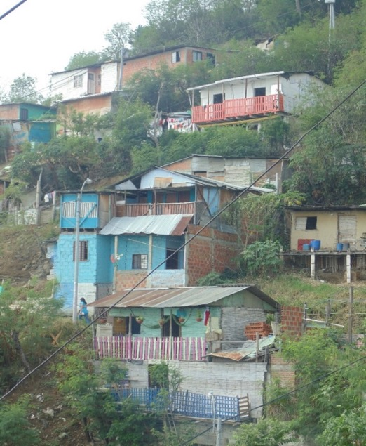{width="3.4854166666666666in" height="4.245138888888889in"}

Figura 2. Panorámica comuna 1, Yumbo. Los barrios de esta comuna tienen como rasgo en común ubicarse en una zona de ladera, con historia de excavaciones mineras y altos índices de deslizamientos.

Pero, así como estos incendios se han convertido en problema de verano, también lo es la difícil situación en la cual se encuentra el rio Yumbo que atraviesa el municipio. En palabras de un vendedor de frutas de la Galería Municipal: "hoy por hoy lastimosamente nuestro rio es casi que una alcantarilla, por donde corren muy pocas aguas ya. Total, de que es difícil ya pensar que (sic) nuestro rio realmente represente algún tipo de riesgos para la municipalidad". Y su opinión no es una exageración, porque en un recorrido por la zona urbana, que le sirve de cauce, es el reflejo de su decadencia y maltrato. Bolsas de basura, colchones viejos, utensilios de cocina y las paredes de las casas que le dan la espalda, son las señales de quizás no se vea como un riesgo. En el pasado éste fue una fuente hídrica importante, pero llama la atención que en los adultos esa función se asocia a las inundaciones que este causaba, además de los paseos de olla. Fernando Quiroz, actual Secretario de Educación, relaciona estas inundaciones con las fuertes lluvias y la falla geológica que atraviesa al municipio.

> "El municipio históricamente ha tenido que enfrentar algunos riesgos, no conozco a profundidad el tema, pero Yumbo está atravesado por una falla geológica, que ha ocasionado en tiempos de lluvias intensas, movimientos de tierra que ha ocasionado que diferentes grupos poblacionales, familias enteras, hayan tenido que ser reubicadas de un sector a otro, especialmente los habitantes del sector conocido como las Cruces, Buenos Aires parte alta".

Lo sectores señalados y afectados por estos riesgos tienen la característica de ser habitados por gentes de clase popular, que como en muchas ciudades del país, han hecho de las laderas su sitio de vivienda y se han apropiado y asentado hasta configurar conglomerados humanos. Si bien la existencia de la falla geológica es un rasgo natural del territorio, los pobladores han construido su lugar, su hábitat, quizás sin conocer los riesgos de ello, pero encontrando en esos territorios la posibilidad de vivienda. Roberto, un llegado hace cuarenta años a la zona de laderas de Yumbo y de origen patiano, resume en una frase el sentido del lugar: "hace mucho llegamos y nos tocó hacer la casita aquí, este pedacito de tierra es la vida de muchos de nosotros". Aferrado a esa historia y a los años de andar y vivir en este lugar, Roberto termina sus palabras mirando las calles entrecruzadas por las casas de bahareque que aún son señal de los tiempos: "Esta loma se nos tragó la vida, por eso de aquí no nos vamos. Imagínese, yo con hijos y nietas".

El fanzine. La comunicación flexible
------------------------------------

El diagnóstico inicial de las estrategias comunicativas que los entes de gobierno tenían e implementaban, se reducía a las cartillas que desde el gobierno nacional se proponían, con sus características genéricas y lenguajes técnico-instrumentales que terminaban convirtiéndose en política para la gestión de riesgo. Algunas de esas cartillas tenían años de desactualización que se confirmaba en las entrevistas con los funcionarios a cargo de estos temas. La segunda estrategia identificada, en algunos de los municipios, eran noticias audiovisuales que comentaban sobre los riesgos y vulnerabilidades de sectores específicos, invitando a la comunidad a tener cuidado y a ser corresponsables con la gestión del riesgo. Lo preocupante de estas noticias, como casi todas, era su efecto post-facto, es decir, aparecen y comunican cuando ya han sucedió los hechos.

+-----------------------------------------------------------------------------------------------------------------------------------------------------------------------------------------------------------------------------------------------------------------------------------------------------------------------------------------------------------------------------------------------------------------------------------------------------+
| Caja 6. El Fanzine                                                                                                                                                                                                                                                                                                                                                                                                                              |
|                                                                                                                                                                                                                                                                                                                                                                                                                                                     |
| El Fanzine es una herramienta importante para la comunicación social del riesgo, dado que sus cualidades y características lo acercan significativamente al sentido social del conocimiento; es fácil de construir y de reproducir e incorpora un lenguaje lo suficientemente sugestivo como para canalizar la atención de aquellos que lo tengan en su poder. Éste, sin duda, posibilita lenguajes renovados para la gestión municipal del riesgo. |
+-----------------------------------------------------------------------------------------------------------------------------------------------------------------------------------------------------------------------------------------------------------------------------------------------------------------------------------------------------------------------------------------------------------------------------------------------------+

Teniendo en cuenta este hallazgo, y reconociendo que las comunidades dependen de las comunicaciones que las instituciones producen y circulan sobre los riesgos, se pensó en los talleres como una posibilidad para que las comunidades mismas pudiesen diseñar y comunicar con sus propias estrategias. Del conjunto de estrategias posibles, se escogió al fanzine por su versatilidad, flexibilidad y potencial comunicativo, en tanto es la comunidad con sus saberes y recursos, quienes elaboran y ponen a circular los fanzines. Además, estos pueden ser una herramienta importante para la prevención y advertir sobre situaciones problemáticas. Lo más significativo de esta estrategia, es la producción colectiva de conocimiento y el diseño colectivo de la comunicación que se valora pertinente socializar.

{width="5.915277777777778in" height="1.4680555555555554in"}

Figura 3. Taller Fanzine. Jamundí. Luego de las explicaciones sobre la importancia de la comunicación del riesgo (A), los participantes diseñan en grupos (B) un fanzine, a partir de problemáticas identificadas en los territorios donde habitan (C).

Entendiendo lo anterior y reconociendo la flexibilidad enorme de esta herramienta, se subrayan una serie de rasgos o características que orientan la producción del fanzine, no solo en lo técnico, sino su labor y papel comunicativo. Las características más sobresalientes del fanzine son las siguientes [8]:

-   Una publicación independiente. El propósito es que los sujetos y/o comunidades tenga la libertad y oportunidad de comunicar sus saberes e interpretaciones sobre determinadas situaciones. No pretende la reproducción de un saber experto o institucional. Promueve la expresión de quienes participan en su elaboración.

-   Un libro sin límites editoriales. Se parte del principio de creatividad, libertad y pluralidad en la comunicación y en el diseño que este puede tener. Ello supone la inexistencia de criterios editoriales fijos, porque depende de los sujetos singulares, pero al mismo tiempo pretende una circulación masiva y legible de los temas que aborda.

-   Una comunicación ágil y viajera. Debe ser en su diseño un formato ágil que garantice, además de su legibilidad, su circulación o viaje sin contratiempos. Es vital que los lectores lo lleven consigo y lo puedan compartir con otras personas.

-   Expresión lúdica y didáctica. En su dimensión educativa, esta herramienta, que se produce en un taller de actores o sujetos ciudadanos, institucionales y académicos, debe propiciar el diálogo en un ambiente de respeto y goce del trabajo colectivo, que potencie la producción de la información y su comunicación de tal manera que sea entendible y replicable por el ciudadano o usuario de la herramienta.

CONCLUSIONES
============

Las experiencias mostradas han permitido reconocer que es posible construir espacios y mecanismos de divulgación de saber, técnico y comunitario, que de forma situada, responde en forma más orgánica a códigos, símbolos y significados de las comunidades, y en esa medida, puedan ser más eficientes como proceso de gestión del riesgo.

Sobre la comunicación del riesgo podemos decir que, definitivamente, es un reto de futuro; aún no se entiende en su justa dimensión, ni de parte de las autoridades municipales, que las confunden con informar, ni de las mismas comunidades, que desconocen su papel y posibilidades en ella. Se debe trascender la percepción mecánica de ésta, de su sentido finalista en el proceso (al final se informa a las comunidades de los riesgos a los que se expone), donde la única responsabilidad es del sector público, quién cumple su función al emitir un mensaje, sin importar el tipo de formato, a las comunidades a las que va dirigida.

El trabajo desarrollado en este lustro ha permitido desde la academia, innovar, pero se pretende que sean las mismas comunidades las que lo hagan, como forma y posibilidad también, de resignificar y sistematizar la información para la gestión del riesgo, valorar la experiencia propia como conocimiento complementario al técnico y especializado y articular las diversas instituciones, organismos y grupos comunitarios, para que las acciones se desarrollen coherentemente amplificando así su capacidad sinérgica.

Finalmente, la comunicación del riesgo y las estrategias comunicativas son definitivamente un reto para todos: gestores del riesgo, academia y comunidades, ya que sin espacios y herramientas que potencien una comunicación interactiva, social y contextual, será muy difícil que procesos graduales de reducción de la vulnerabilidad y seguridad territorial se den de forma masiva y generalizada.

+---------------------------------------------------------------------------------------------------------------------------------------------------------------------------------------------------------------------------------------------------------------------------------------------------------------------------------------+
| PUNTOS CLAVE                                                                                                                                                                                                                                                                                                                      |
|                                                                                                                                                                                                                                                                                                                                       |
| 1.  La comunicación del riesgo debe propender por construir, no sólo mayores niveles de consciencia social y política sobre los riesgos, sino una mayor simetría en la distribución global del riesgo.                                                                                                                                |
|                                                                                                                                                                                                                                                                                                                                       |
| 2.  La comunicación del riesgo no se puede separar artificialmente de aspectos como su visibilización, significación y percepción social de la gestión de la confianza institucional y social o nivel de indignación que se construye, y como producto de todas las anteriores, de la regulación que se produzca.                     |
|                                                                                                                                                                                                                                                                                                                                       |
| 3.  La comunicación del riesgo no puede ser efectiva sin una comprensión integral de cómo perciben, sienten, ponderan y evalúan los riesgos, los individuos, y cuáles son los factores que determinan la variación de la percepción del riesgo, sujeto a sujeto, comunidad por comunidad.                                             |
|                                                                                                                                                                                                                                                                                                                                       |
| 4.  La comunicación del riesgo debe propiciar la formación de sujetos activos capaces de valorar la información disponible para formar juicios bien equilibrados, de acuerdo con la evidencia de los hechos, el peso de los diversos argumentos y sus propias necesidades, intereses y expectativas.                                  |
|                                                                                                                                                                                                                                                                                                                                       |
| 5.  El objetivo final de la comunicación de riesgos es reconciliar la experiencia, los intereses y las preferencias públicas, con las realidades políticas e institucionales de la sociedad, para así coadyuvar en la construcción de comunidades más informadas y conscientes y situaciones territoriales más equitativas y seguras. |
|                                                                                                                                                                                                                                                                                                                                       |
| 6.  Es imprescindible que las diversas autoridades públicas incorporen en los procesos de comunicación del riesgo estrategias comunicativas participativas, plurales, contextuales y democráticas, donde se reconozcan y validen experiencias, saberes e intereses de las comunidades.                                                |
+---------------------------------------------------------------------------------------------------------------------------------------------------------------------------------------------------------------------------------------------------------------------------------------------------------------------------------------+

CONFLICTO DE INTERESES

Los autores no declaran conflicto de intereses

IDENTIFICACIÓN DEL AUTOR

Javier Thomas <https://orcid.org/0000-0001-5404-7574>

Julio Rubio <https://orcid.org/0000-0003-0233-1519>

BIBLIOGRÁFIA

1.  Carey, J. (1992). *Communication as Culture. Essays on Media and Society*. Nueva York, Routledge.

2.  Anderson, J. (1996). *Communication Theory: Epistemological Foundations*. Londres, Guilford Press.

3.  Holmes, D. (2005). *Communication Theory. Media Technology and Society.* Londres Sage.

4.  Lunenburg, F. (2010). *Communication: The Process, Barriers, And Improving Effectiveness*. Sam Houston State University, 3-6.

5.  Luhmann, N. (2006). *Sociología del Riesgo*. Universidad Iberoamericana, México, D.F.

6.  Beck, U. (2008). *La sociedad del riesgo mundial: En busca de la seguridad perdida*. Paidós Estado y Sociedad.

7.  Gonzalo, J. & Farré, J. (2011). *Teoría de la comunicación del riesgo*. Barcelona, Editorial UOC.

8.  Thomas, J., Rubio, J. & Muñoz, I. (2018). El Fanzine y la comunicación del riesgo: Una propuesta para el Valle del Cauca, Colombia. *REDER*, 2(1), 53-70.

9.  Shannon, C (1948). A Mathematical Theory of Communication. *The Bell System Technical Journal*, 27(4), 623-656. <https://doi.org/10.1002/j.1538-7305.1948.tb00917.x>

10. Algarra, M. (2009). *La comunicación como objeto de estudio de la teoría de la comunicación,* en *Revista Anàlisi* 38, 2009, 151-172.

11. Gifreu, J. (1991). *Estructura general de la comunicación pública*. Barcelona: Pòrtic.

12. Burke, K. (1969). *A Rhetoric of Motives.* University of California Press.

13. Bateson, G. & Ruesch, J. (1986). Comunicación. La matriz social de la psiquiatría. *Revista Española de Investigaciones Sociológicas*, 33, 241-243. <https://doi.org/10.2307/40183202>

14. Beck, U. (2002*). La sociedad del riesgo global*. Siglo XXI. Madrid.

15. Giddens, A. & Pierson, C. (1998). *Making Sense of Modernity. Conversations with Anthony Giddens*. Cambridge: Cambridge University Press.

16. Sandman, P. (2003), Four Kinds of Risk Communication. *The Synergist, Journal of the American Industrial Hygiene Association*, 26--27.

17. Renn, O. (1990). Risk perception and risk management: A review. Pt. 2, Lessons for risk management. *Risk Abstracts*, 8 (1), 1-9. https://doi.org/10.1007/978-1-4757-4891-8_6

18. Rohrmann B. & Renn O. (2000). Risk Perception Research. En: O. Renn & B. Rohrmann B. (Eds.), *Cross-Cultural Risk Perception. Technology, Risk, and Society* *(An International Series in Risk Analysis)* (pp. 11-53*)*, vol 13. Springer, Boston, MA. <https://doi.org/10.1007/978-1-4757-4891-8_1>

19. Sjöberg, L. (1997). Explaining risk perception: An empirical evaluation of cultural theory. *Risk Decision and Policy*, 2, 113-130. <https://doi.org/10.1080/135753097348447>

20. Kals, Elisabeth; Schumacher, Daniel & Montada, Leo. (1999). Emotional affinity toward nature as motivational basis to protect nature. *Environment & Behavior*, 31(2), 178-202. https://doi.org/10.1177/00139169921972056

21. Linnerooth-Bayer, Joanne & Fitzgerald, Kevin. (1996). Conflicting views on fair siting processes: Evidence from Austria and the U.S. *Risk: Health, Safety & Environment*, 7(2), 119-134.

22. Luhmann Niklas. (1990), Technology, environment, and social risk: a systems perspective. *Industrial Crisis Quarterly*, 4, 223-231. <https://doi.org/10.1177/108602669000400305>

23. Giddens, Anthony. (1990). *The consequences of modernity*. Stanford: Stanford University Press.

24. Renn O., Rohrmann B. (2000) Cross-Cultural Risk Perception: State and Challenges. En: O. Renn O. & B. Rohrmann (eds), *Cross-Cultural Risk Perception. Technology, Risk, and Society (An International Series in Risk Analysis)* (pp. 211-233), vol 13. Springer, Boston, MA. <https://doi.org/10.1007/978-1-4757-4891-8_6>

25. Montoya, John. (2003). Geografía contemporánea y geografía escolar: algunas ideas para una agenda en Colombia. *Cuadernos de Geografía*, XII (1-2), Universidad Nacional de Colombia.

26. Lindón, Alicia. (2008). De las geografías constructivistas a las narrativas de vida espaciales como metodologías geográficas cualitativas. *Revista ANPEGE*, 4(4). <https://doi.org/10.5418/RA2008.0404.0001>

9

[]{#_Toc47894932 .anchor}La perspectiva histórica en la gestión del riesgo de desastres: aplicación en Santiago de Cali, Colombia

Nathalie García-Millán^1,2*^, Jorge A. Vélez-Correa^1,2,4^, Karen A. Sánchez-Estupiñán^1^,

Nisley Zúñiga Estacio^1^, Yeli C. Castillo-González^1^, Alba N. Castaño-Castaño^1,4^,

Jorge A. Diaz-Rentería^1^ & Elkin De J. Salcedo-Hurtado^1,2,3^

Grupo de Investigación Georiesgos, Observatorio Sismológico y Geofísico del Suroccidente Colombiano (OSSO), Universidad del Valle, Ciudad Universitaria, Cali, Colombia

^2^Estudiante Doctorado Ciencias Ambientales, Universidad del Valle, Cali, Colombia

^3^Universidad del Valle, Departamento de Geografía, Ciudad Universitaria, Cali, Colombia

^4^Catedrático de la Maestría en Desarrollo Sustentable, Universidad del Valle, Cali, Colombia

*Autor de contacto: Nathalie García-Millán. Grupo de Investigación Georiesgos, Observatorio Sismológico y Geofísico del Suroccidente Colombiano (OSSO), Universidad del Valle, Ciudad Universitaria. Cali, Colombia. Calle 100 No. 13-00. Correo-e: nathalie.garcia@correounivalle.edu.co

Resumen

En este estudio se presenta la importancia de realizar estudios históricos de fenómenos naturales amenazantes para lograr un mayor conocimiento de los eventos ocurridos en el territorio, en la toma de decisiones en cuanto a la formulación medidas de gestión del riesgo y como insumo fundamental para la calibración de los modelos de amenaza. Se detallan los objetivos indirectos y directos de la realización de este tipo estudios. Se presenta su aplicabilidad para el municipio de Santiago de Cali en el marco del Plan Municipal de Gestión del Riesgo, para el cual se realizó un estudio de historicidad por sismos, movimientos en masa e inundaciones. Se implementó la metodología intensivista para la búsqueda de registros sobre la ocurrencia de eventos en diferentes fuentes de información, lo que permitió la construcción de una sólida y amplia base de datos y de catálogos en torno a la ocurrencia de estos fenómenos. En cuanto a los resultados, para el caso de los sismos, la búsqueda documental arrojó un total de 97 eventos sísmicos que generaron algún tipo de impacto para el periodo comprendido entre 1566 y 2018. Para los movimientos en masa se encontraron un total de 342 eventos, ocurridos en su mayoría en el área urbana del municipio. Para este mismo periodo, se encontraron 227 eventos de inundación relevantes, siendo la mayoría, de origen pluvial.

Palabras clave

Estudios históricos, gestión del riesgo, historicidad, inundaciones movimientos en masa, sismos

The historical perspective in disaster risk management: Applications in Santiago de Cali- Colombia

Abstract

This document presents the importance of carrying out historical studies of natural phenomena hazardness to achieve a greater knowledge of the events that occurred in the territory, in decision-making regarding the formulation of risk management measures and as a fundamental input for the calibration of hazards models. The indirect and direct aims of conducting such studies are detailed. Its applicability for the municipality of Santiago de Cali is presented in the framework of the Municipal Risk Management Plan, for which a survey of historicity was carried out by earthquakes, mass movements and floods. The intensivist method for the search of records on the occurrence of events in different sources of information was implemented, which allowed the construction of a robust and broad database and catalogs around the occurrence of these phenomena. Regarding the results, in the case of earthquakes, the documentary search produced a total of 97 seismic events that generated some type of impact for the period between 1566 and 2018. For mass movements, a total of 342 events were found, mostly in the urban area of ​​the municipality. For this same period, 227 relevant flooding events were found, the majority being of pluvial origin.

Keywords

Earthquakes, floods, historical studies, historicity, mass movements, risk management.

1.  INTRODUCCIÓN 
    ============

    El presente trabajo sugiere que los estudios históricos --es decir la historicidad de los fenómenos naturales y de los desastres asociados-- son de suma importancia en la gestión del riesgo y cobran preponderancia al tomarse como el primer paso para realizar estudios de predicción o valoración de la amenaza o tomar decisiones sobre medidas de prevención y mitigación en una región determinada. Los estudios historicos permitien el acercamiento a los procesos de conocimiento y reducción del riesgo de desastres como son definidos en la Ley 1523 de 2012 que adopta la política nacional de gestión del riesgo de desastres en el territorio colombiano. Por tanto, se plantea que dichos estudios se consideran como la llave que abre la puerta para la percepción del riesgo y la caracterización de los escenarios de riesgos ya que a través de ellos, en primera instancia, se pueden reconocer las zonas propensas o susceptibles a la ocurrencia de eventos amenazantes, la espacialidad, temporalidad y grado de afectación de los eventos ocurridos en el pasado.

    En este estudio se muestran algunos de los resultados obtenidos en el marco de la caracterización de escenarios de riesgo para el Plan Municipal de Gestión del Riesgo de Santiago de Cali desarrollado en el año 2018 por profesionales adscritos al Observatorio Sismológico y Geofísico del Suroccidente Colombiano (OSSO) y el grupo de investigación Georiesgos de la Universidad del Valle, con recursos de la Alcaldía. Se presenta la información sobre la búsqueda documental para la obtención de noticias relacionadas con los diferentes eventos naturales amenazantes, su tipificación como evento específico, la frecuencia de ocurrencia y los respectivos inventarios o catálogos.

    Para el desarrollo de la historicidad del municipio de Santiago de Cali se consideran los fenómenos de sismos, movimientos en masa e inundaciones con el propósito de aportar información fundamental para la evaluación de la amenaza y caracterización del riesgo ante cada tipo de evento, y para la posterior implementación de estos conocimientos en la planificación del territorio. Estos fenómenos se definieron teniendo en cuenta que históricamente son aquellos que han generado mayor recurrencia y severidad en la ciudad.

LOS ESTUDIOS HISTÓRICOS EN LA GESTION DEL RIESGO 
================================================

Los impactos que deja la ocurrencia de fenómenos naturales amenazantes como terremotos, erupciones volcánicas, deslizamientos e inundaciones, etc., han ocupado un papel preponderante en la historia de la humanidad, por cuanto los daños y efectos causados, en algunos casos, han destruido completa o parcialmente pueblos y civilizaciones y, en otros casos, han truncado el desarrollo de muchos países del mundo. Por tal razón, el riesgo y los desastres generados por estos fenómenos son materia de estudio de profesionales de diversas disciplinas, incluso del público en general, quienes, a partir de diferentes métodos y enfoques teóricos, analizan no solo los procesos físicos asociados con su ocurrencia sino también los aspectos relacionados con la distribución espacial, la frecuencia o regularidad temporal, la valoración socio económica de los daños y efectos, el diseño y construcción de obras resistentes a sus fuerzas, la planificación de medidas de mitigación y prevención, entre otros.

Sin embargo, a pesar que la ocurrencia de estos fenómenos tiene una larga trazabilidad temporal en la historia de la Tierra y la humanidad, el estudio histórico de los desastres, hasta hace muy poco tiempo, era un campo no atendido por los investigadores, esto debido a que la ausencia de marcos teóricos y metodológicos específicos para llevar a cabo estudios históricos sobre desastres desde una perspectiva social, fue quizás una de las razones que inhibió durante mucho tiempo su desarrollo [1].

Es así como podemos afirmar que la ocurrencia de desastres causados por fenómenos naturales amenazantes ha sido un problema frecuente con el que toda la humanidad ha tenido que lidiar. El estudio histórico sistemático, como elemento relevante para la gestión del riesgo y la planificación territorial, puede considerarse como un campo poco explorado y desarrollado, puesto que generalmente no se ha tenido claridad sobre el significado e importancia de la historicidad de estos fenómenos y sus desastres. Entendiendo la historicidad como el conjunto complejo de condiciones y circunstancias que a lo largo del tiempo constituyen el entramado de relaciones en las cuales se inserta y cobra sentido algo: puede ser un proceso, un concepto o la propia vida [2].

El principal objetivo de un estudio histórico o de historicidad sobre fenómenos naturales o de los desastres es aumentar el grado de conocimiento de su ocurrencia en una región, aspecto que se materializa con la identificación y tipificación del mayor número de eventos ocurridos y la determinación precisa de sus parámetros físicos y efectos socioeconómicos, logrando con ello tener mejores elementos para la toma de decisiones en cuanto a las medidas de mitigación o prevención, e insumos fundamentales para la calibración de los modelos de amenaza. Sin embargo, acorde con Salcedo-Hurtado [3] se puede decir que la importancia real de los estudios históricos sobre los fenómenos naturales amenazantes o de desastres depende de la aplicación para la cual se desarrolla el estudio, conforme a objetivos prácticos, los cuales pueden ser directos o indirectos (Fig. 1).

{width="6.530555555555556in" height="3.673611111111111in"}

Figura 1. Objetivos de los estudios históricos para la gestión del riesgo. Fuente: elaboración propia.

Los objetivos directos se relacionan con el conocimiento necesario que debe tenerse sobre los diferentes eventos ocurridos en un sitio y periodo específicos para determinar todas las circunstancias de tiempo, modo y lugar, como para establecer sus posibles causas y efectos que haya dejado. En este caso, los objetivos directos se pueden agrupar de la siguiente manera:

a.  Geo-Históricos: se refieren a la necesidad de precisar el lugar y fecha del evento, detallando los nombres de los sitios y elementos geográficos de ocurrencia o de afectación. Contribuyen a la determinación de los parámetros del evento, intensidades y aportan información que alimenta los catálogos o inventarios de eventos en una región determinada.

b.  Geomorfológicos: sirven para asociar o correlacionar la ocurrencia de los diferentes eventos con unidades geomorfológicas o geológicas, tal como la ocurrencia de terremotos con el tipo de estructura tectónica, fallas activas y terreno geológico que pudo estar involucrado en su origen. También pueden ser útiles para establecer la relación que guarda la ocurrencia de un determinado evento con otros fenómenos geológicos, por ejemplo, la correlación entre, terremotos con movimientos en masa, erupciones volcánicas, o avenidas torrenciales, etc.

c.  Estadísticos: a partir de la asignación de intensidades y otros parámetros físicos que describan los diversos fenómenos naturales amenazantes, los estudios de historicidad permiten identificar zonas susceptibles, en las cuales es posible definir variables estadísticas (frecuencia de ocurrencia, período de recurrencia o de retorno para eventos extremos o máximos) y la elaboración de inventarios o catálogos.

d.  Socio-Económicos: un aspecto interesante de los estudios históricos de fenómenos naturales consiste en la evaluación socioeconómica de los efectos y daños causados en una región determinada. Es una forma de valorar el impacto o severidad de los efectos no deseados de los fenómenos naturales o desastres sobre los humanos y el medio ambiente. Además, aportan información valiosa para los tomadores de decisión en torno a la dimensión presupuestal asociada a las pérdidas y daños causados por estos eventos.

Los objetivos indirectos se orientan a la aplicación social de los estudios históricos de fenómenos naturales y los desastres, es decir, muestran la utilidad práctica y el servicio que prestan estos estudios en la planificación territorial y urbana, planes de emergencia y en los estudios de zonificación de amenazas a diferentes escalas. Así, los objetivos indirectos de los estudios históricos de fenómenos naturales y desastres, muestran ser útiles en áreas como:

a.  *Percepción del riesgo: permitiendo que los individuos y la comunidad en general interpreten y comprendan donde pueden ocurrir eventos o fenómenos naturales amenazantes, que pueden causarles daños.*

b.  *Planificación territorial y urbanismo: permitiendo establecer las restricciones de actividades socio-económicas en torno a los eventos amenazantes recurrentes en el territorio o en una zona determinada.*

c.  *Definición de planes de emergencia: la definición de zonas susceptibles a presentar eventos amenazantes, identificados a partir de la frecuencia de ocurrencia, permite establecer medidas para los planes de emergencia.*

d.  *Zonificación de amenazas: Con* la elaboración de catálogos homogéneos sobre determinado tipo de fenómeno natural, se establecen periodos de recurrencia de fenómenos y posibles funciones de probabilidad que expliquen el régimen de su ocurrencia, información necesaria para los estudios de zonificación de amenazas.

    Es necesario plantear que en los estudios históricos de los fenómenos naturales o de los desastres producidos deben proponerse objetivos sociales que apunten no sólo al hecho de saber qué tipos de eventos ocurren en una zona determinada, sino que a través de ellos se logre avanzar en la determinación de los diversos escenarios de riesgos que conduzcan a la formulación de los planes de gestión del riesgo y su correspondiente apoyo en la planeación y ordenación del territorio en diversas escalas para los tipos de suelo urbano, de expansión urbana y rural.

    Para que los estudios históricos sean de utilidad en gestión del riesgo deben tener un sentido práctico social, de tal manera que se analicen a la luz del contexto histórico y geográfico de una región determinada. Es decir, que si se estudia un evento catastrófico especifico ocurrido en un periodo lejano o cercano, debe establecerse como pudo modificar las relaciones y procesos económicos y políticos que caracterizaron o caracterizan a una población, lo cual servirá para la planificación de las medidas de desarrollo y la toma de decisiones en los planes de ordenamiento del territorio. Sólo así se puede garantizar un interés común, al igual que la continuidad y vigencia de este tipo de estudios.

APLICACIONES EN LA CIUDAD SANTIAGO DE CALI 
==========================================

Como aplicación, en el presente trabajo se enseña el estudio de historicidad por sismos, movimientos en masa e inundaciones realizado para el municipio de Santiago de Cali en el marco de la formulación del Plan Municipal de Gestión del Riesgo, el cual fue desarrollado por el Observatorio Sismológico y Geofísico del Suroccidente Colombiano (OSSO) y el grupo de investigación Georiesgos de la Universidad del Valle, con recursos de la Alcaldía.

Como aplicación, el presente trabajo muestra algunos de los resultados obtenidos en el marco de la caracterización de escenarios de riesgo para el Plan Municipal de Gestión del Riesgo, desarrollado por profesionales adscritos al Observatorio Sismológico y Geofísico del Suroccidente Colombiano (OSSO) y el grupo de investigación Georiesgos de la Universidad del Valle, con recursos de la Alcaldía.

 Área de estudio
---------------

El área de estudio se enmarca en el municipio de Santiago de Cali, el cual se localiza al suroccidente colombiano, entre las coordenadas 3°27'26"N y 76°31'42"W. Geográficamente, se situa en la región sur del departamento del Valle del Cauca, entre la cordillera Occidental y el valle del río Cauca a una altura promedio de 1,000 m.s.n.m. [4]. Presenta una superficie total de 561.7 km^2^, distribuida en 120.4 km^2^ del área urbana, 424.4 km^2^ del área rural, 16.3 km^2^ de la zona expansión urbana y 0.5 km^2^ área de protección del río Cauca [5] (Fig. 2).

Dada su localización geográfica, en el municipio se distinguen claramente tres unidades de paisaje distribuidas de occidente a oriente: la cordillera, el piedemonte y la zona plana, cada una con características particulares en los aspectos geológicos, geomorfológicos y climáticos, que a su vez influyen en la ocurrencia de fenómenos de origen natural.

A nivel hídrico, el sistema se conforma por ecosistemas acuáticos lóticos y lénticos, tales como ríos, quebradas, nacimientos, humedales y aguas subterráneas. Los ríos Cauca, Cali, Aguacatal, Pance, Meléndez, Lili y Cañaveralejo forman la red hídrica que ha determinado focos de desarrollo habitacional y económico en el municipio de Santiago de Cali, desde las zonas altas de las cuencas hasta su desembocadura o canalización en la zona baja de la ciudad [4].

{width="5.375523840769904in" height="7.59405949256343in"}

Figura 2. Mapa de localización de la ciudad de Santiago de Cali. Fuente: elaboración propia.

Además, como producto del contexto tectónico presente en el suroccidente del país y del fallamiento regional, la ciudad es definida con un nivel de amenaza sísmica alta con un valor de aceleración pico efectiva promedio por encima de los Aa = 2.84 m/s² donde, según el Estudio de Microzonificación Sísmica de Cali [6], la zona con mayor aceleración tiene un valor Aa = 3.92 m/s².

MÉTODOLOGÍA Y FUENTES DOCUMENTALES 
==================================

 Metodología
-----------

El desarrollo metodológico para la ejecución de los estudios históricos por sismos, movimientos en masa e inundaciones en el municipio de Santiago de Cali, consistió en la búsqueda sistemática de fuentes primarias y secundarias de información. Se realizó siguiendo la metodología intensivista propuesta por Rodríguez de la Torre [7], la cual plantea que al tener un previo conocimiento de la ocurrencia de un determinado evento y mediante la búsqueda de diversas fuentes (publicaciones periódicas, archivo, documentos, bases de datos, catálogos) puede adquirirse una mayor y mejor cantidad de información con el fin de precisar datos de los eventos y establecer parámetros de medición acerca de la frecuencia de estos.

La historicidad se realizó para el municipio de Santiago de Cali en el periodo 1949--2018. Una aproximación inicial consistió en datar eventos históricos asociados a los fenómenos arriba indicados a partir de la revisión de diferentes bases de datos de carácter abierto. Una vez obtenido el registro de las diferentes bases, se procedió con la búsqueda en fuentes de información primarias, tales como periódicos, informes técnicos o bases de datos de las instituciones relacionadas con la gestión del riesgo en el municipio. Posteriormente, la búsqueda se complementó con la revisión de fuentes bibliográficas.

Después de reunir la mayor cantidad de información, se analiza individualmente y se unifica para extraer los parámetros más importantes como fecha de ocurrencia, lugar, tipo de evento y los posibles daños y efectos. Cada registro o noticia encontrada se transcribe textualmente en fichas bibliográficas, para finalmente construir un catálogo para cada fenómeno bajo estudio. En la Figura 3 se esquematiza el proceso metodológico llevado a cabo.

+---------------------------------------------------------------------------------------------------------------------------------------------------------------------------------------------------------------------------------------------------------------------------------------------------------------------------------------------------+
| Caja 1. Método extensivista                                                                                                                                                                                                                                                                                                                   |
|                                                                                                                                                                                                                                                                                                                                                   |
| Existe otro método para el desarrollo de estudios históricos denominado extensivista. Se refiere a la búsqueda de fuentes de información que den cuenta de la ocurrencia de eventos que no aparecen registrados en bases de datos, ni catálogos oficialmente conocidos. Con este método extiende el conocimiento de eventos históricos ocurridos. |
+---------------------------------------------------------------------------------------------------------------------------------------------------------------------------------------------------------------------------------------------------------------------------------------------------------------------------------------------------+

{width="3.440850831146107in" height="3.9702974628171477in"}

Figura 3. Diseño metodológico intensivista. Se representa esquemáticamente el tratamiento de la información histórica desde su búsqueda hasta la elaboración de catálogos y cartografía. Fuente: elaboración propia.

 Fuentes y documentos consultados
--------------------------------

### Bases de datos y catálogos 

En la actualidad se dispone de inventarios de desastres no solo a escala global, sino también a escala local y regional, que permiten dar cuenta de eventos históricos. Se realizó la revisión de bases de datos como Sistema de Inventario de Efectos de Desastres (Desinventar), Sistema de Información de Movimientos en Masa (SIMMA) --SGC, Catálogo Sismicidad Histórica de Colombia--SGC, Catálogo de Terremotos para América del Sur- Colombia (CERESIS), Consolidado de emergencias -- UNGRD y Datos Abiertos Colombia-- UNGRD. Además, se obtuvo información de las bases de datos de la Defensa Civil Colombiana y Cuerpo de Bomberos Voluntarios de Cali.

### Archivos

Como archivo se designa el lugar que tiene como finalidad la recopilación y conservación de documentos. En los archivos se localizan una serie de documentos no publicados, donde se registra la información de la entidad y se utiliza como evidencia de las acciones realizadas y eventos ocurridos. Estos documentos pueden ser actas de visitas, fotografías, fotocopias, documentos de administración, legislación, etc. Dentro de esta categoría se consultaron los documentos de las oficinas de la Cruz Roja, Empresas Municipales de Cali- EMCALI y de los Talleres del Municipio.

####  {#section-8 .list-paragraph}

### Fuentes bibliográficas

Las fuentes bibliográficas se refieren a documentos de [publicación](https://es.wikipedia.org/wiki/Publicaci%C3%B3n) puntual especializada de un tema específico. En esta categoría se encuentran  [libros](https://es.wikipedia.org/wiki/Libro), informes técnicos de investigaciones, etc. Algunos de los documentos bibliográficos consultados son Historia de los Terremotos en Colombia (Ramírez, 1975), el informe de sismicidad histórica regional del Estudio de Microzonificación Sísmica de Cali (INGEOMINAS-DAGMA, 2005) y la Historia Sísmica de Colombia 1550--1830 (Espinosa, 2012).

### Hemerográficas

La fuente hemerográfica se refiere a los documentos de [publicación con cierta periodicidad](https://es.wikipedia.org/wiki/Publicaci%C3%B3n_peri%C3%B3dica) como  [revista](https://es.wikipedia.org/wiki/Revistas)s y periódicos, en ellos se registran los hechos y sucesos a nivel local, regional, nacional y mundial. Los documentos hemerográficos consultados se localizan en la Hemeroteca de la Biblioteca Departamental Jorge Garcés Borrero y en el Observatorio Sismológico y Geofísico del Suroccidente Colombiano (OSSO) de la Universidad del Valle.

Se consultaron los principales diarios locales y regionales de acuerdo con el periodo trabajado y a la temporalidad de circulación, entre estos El Tiempo, Diario El País, Diario Occidente, El Caleño, El Espectador, El Relator, El Pueblo, El Constitucional del Cauca, Correo ABC, Correo del Cauca y Diario El Liberal. La síntesis de las fuentes de información utilizadas para abordar el estudio de historicidad para los diferentes fenómenos trabajados en el presente Plan, se describen en el Cuadro 1.

+------------------------------------------------------------------------------------------------------------------------------------------------------------------------------------------------------------------------------------------------------------------------------------------------------------------------------------------------------------------------+
| Cuadro *1*. Listado de Fuentes de información utilizadas para el desarrollo del trabajo                                                                                                                                                                                                                                                                            |
|                                                                                                                                                                                                                                                                                                                                                                        |
| Bases de datos                                                                                                                                                                                                                                                                                                                                                     |
|                                                                                                                                                                                                                                                                                                                                                                        |
| -   Red de Estudios Sociales en Prevención de Desastres en América Latina (LA RED). DesInventar. 1949-2018. En línea <http://www.desinventar.org/es/>                                                                                                                                                                                                                  |
|                                                                                                                                                                                                                                                                                                                                                                        |
| -   Servicio Geológico Colombiano (SGC). Sistema de Información de Movimientos en Masa (SIMMA). 2018. Versión electrónica disponible en: <http://simma.sgc.gov.co>                                                                                                                                                                                                     |
|                                                                                                                                                                                                                                                                                                                                                                        |
| -   Servicio Geológico Colombiano (SGC). Red Sismológica Nacional de Colombia- RSNC (2018). Sismicidad Histórica de Colombia. Versión electrónica disponible en: <http://sish.sgc.gov.co/visor/>                                                                                                                                                                       |
|                                                                                                                                                                                                                                                                                                                                                                        |
| -   Defensa Civil Colombiana. Territorial Cali. 2018. Sistema Nacional de Información para la Prevención y Atención de Desastres -- SINPAD.                                                                                                                                                                                                                            |
|                                                                                                                                                                                                                                                                                                                                                                        |
| -   Unidad Nacional de Gestión del Riesgo de Desastres (UNGRD. 2018. Consolidado de emergencias. Versión electrónica disponible en: http://portal.gestiondelriesgo.gov.co/Paginas/Consolidado-Atencion-de-Emergencias.aspx                                                                                                                                             |
|                                                                                                                                                                                                                                                                                                                                                                        |
| -   Gobierno Digital de Colombia.2018. Datos Abiertos Colombia. Versión electrónica disponible en: <https://www.datos.gov.co/>                                                                                                                                                                                                                                         |
|                                                                                                                                                                                                                                                                                                                                                                        |
| -   Cuerpo de Bomberos Voluntarios de Cali. 2013-2018. Base de datos de incendios forestales.                                                                                                                                                                                                                                                                          |
|                                                                                                                                                                                                                                                                                                                                                                        |
| Periódico                                                                                                                                                                                                                                                                                                                                                          |
|                                                                                                                                                                                                                                                                                                                                                                        |
| -   Diario El País. 1949-2018. Hemeroteca Biblioteca Departamental de Santiago de Cali.                                                                                                                                                                                                                                                                                |
|                                                                                                                                                                                                                                                                                                                                                                        |
| -   Occidente. 1962-2018. Hemeroteca Biblioteca Departamental de Santiago de Cali.                                                                                                                                                                                                                                                                                     |
|                                                                                                                                                                                                                                                                                                                                                                        |
| -   El Tiempo. 1980-2018. Hemeroteca Biblioteca Departamental de Santiago de Cali.                                                                                                                                                                                                                                                                                     |
|                                                                                                                                                                                                                                                                                                                                                                        |
| -   El Caleño. 1976-2018. Hemeroteca Biblioteca Departamental de Santiago de Cali.                                                                                                                                                                                                                                                                                     |
|                                                                                                                                                                                                                                                                                                                                                                        |
| -   El Pueblo. 1976-1986. Hemeroteca Biblioteca Departamental de Santiago de Cali.                                                                                                                                                                                                                                                                                     |
|                                                                                                                                                                                                                                                                                                                                                                        |
| -   El Relator. 1954-1961. Hemeroteca Biblioteca Departamental de Santiago de Cali.                                                                                                                                                                                                                                                                                    |
|                                                                                                                                                                                                                                                                                                                                                                        |
| -   El Constitucional del Cauca. Observatorio Sismológico y Geofísico del Sur Occidente Colombiano- OSSO- Universidad del Valle.                                                                                                                                                                                                                                       |
|                                                                                                                                                                                                                                                                                                                                                                        |
| -   Correo ABC. Observatorio Sismológico y Geofísico del Sur Occidente Colombiano- OSSO- Universidad del Valle.                                                                                                                                                                                                                                                        |
|                                                                                                                                                                                                                                                                                                                                                                        |
| -   Correo del Cauca. Observatorio Sismológico y Geofísico del Sur Occidente Colombiano- OSSO- Universidad del Valle                                                                                                                                                                                                                                                   |
|                                                                                                                                                                                                                                                                                                                                                                        |
| -   Diario El Liberal. Observatorio Sismológico y Geofísico del Sur Occidente Colombiano- OSSO- Universidad del Valle.                                                                                                                                                                                                                                                 |
|                                                                                                                                                                                                                                                                                                                                                                        |
| Libros                                                                                                                                                                                                                                                                                                                                                             |
|                                                                                                                                                                                                                                                                                                                                                                        |
| -   Centro Regional de Sismología para América del Sur. Colombia (CERESIS). 1985. Catálogo de terremotos para América del Sur. Datos de hipocentros e intensidades. Volumen 4. 136 p.                                                                                                                                                                                  |
|                                                                                                                                                                                                                                                                                                                                                                        |
| -   Ramírez, J. E. 1975. Historia de los terremotos en Colombia. Bogotá: Instituto Geográfico Agustin Codazzi. 250 p.                                                                                                                                                                                                                                                  |
|                                                                                                                                                                                                                                                                                                                                                                        |
| CD                                                                                                                                                                                                                                                                                                                                                                 |
|                                                                                                                                                                                                                                                                                                                                                                        |
| -   Espinosa, A. 2012. Enciclopedia de desastres naturales históricos de Colombia. Volúmenes 1-7.                                                                                                                                                                                                                                                                      |
|                                                                                                                                                                                                                                                                                                                                                                        |
| Documentos                                                                                                                                                                                                                                                                                                                                                         |
|                                                                                                                                                                                                                                                                                                                                                                        |
| -   INGEOMINAS-DAGMA. 2005. Informe No.1-4 Estudio de Sismicidad Histórica Regional. Capítulo 4.3. Características de los terremotos históricos importantes para la amenaza sísmica de la ciudad de Santiago de Cali. 86 p. Versión electrónica disponible en: <https://miig.sgc.gov.co/Paginas/Resultados.aspx?k=BusquedaPredefinida=DGAMicrZonSismSantiagoCali>. |
|                                                                                                                                                                                                                                                                                                                                                                        |
| -   Empresas Municipales de Cali (EMCALI). 2016-2018. Formato para evaluación de daños. Plan de emergencia y contingencias UENAA.                                                                                                                                                                                                                                      |
|                                                                                                                                                                                                                                                                                                                                                                        |
| -   Cruz Roja. 2013-2018. Censo para damnificados.                                                                                                                                                                                                                                                                                                                     |
|                                                                                                                                                                                                                                                                                                                                                                        |
| -   Talleres del Municipio. 2013-2018. Informe de talleres del municipio.                                                                                                                                                                                                                                                                                              |
+------------------------------------------------------------------------------------------------------------------------------------------------------------------------------------------------------------------------------------------------------------------------------------------------------------------------------------------------------------------------+

RESULTADOS
==========

A continuación, se presentan los principales resultados y conclusiones del estudio de historicidad de fenómenos naturales realizado para la caracterización de escenarios de riesgos dentro del Plan Municipal de Gestión del Riesgo del municipio Santiago de Cali, en el cual se tuvieron en cuenta los eventos sísmicos, movimientos en masa e inundaciones, aportando información fundamental para la evaluación de la amenaza y caracterización del riesgo en el municipio ante cada tipo de evento y, posteriormente, la implementación de estos conocimientos en la planificación del territorio.

Sismos históricos en Santiago de Cali
-------------------------------------

La búsqueda documental para la identificación de los sismos históricos ocurridos en Santiago de Cali, contempló una ventana de tiempo que abarca los eventos registrados por diferentes fuentes desde 1566 hasta el 2018. La principal consigna fue evidenciar los factores de ocurrencia, frecuencia y las consecuencias sufridas por el municipio frente a la ocurrencia de estos fenómenos, siendo un insumo fundamental para la caracterización de escenarios de riesgo de la ciudad. A continuación, se muestran los resultados obtenidos de la búsqueda documental a partir de la consulta en bases de datos, informes técnicos, periódicos y libros, correspondientes a la aplicación rigurosa de la metodología abordada en los primeros apartes del capítulo.

### Conceptualización de sismos

Un terremoto es la vibración de la Tierra producida por una rápida liberación de energía. Los terremotos se producen por la interacción de las placas tectónicas que componen la corteza y por la liberación de esfuerzos de las fallas geológicas presente en el interior del continente. Los sismos se propagan en todas direcciones en forma de ondas [8]. Los esfuerzos en los límites de placa producen numerosas fracturas, dando lugar a grandes fallas con desplazamientos importantes, y a lo largo de estas zonas de falla se producen movimientos repetidamente, por lo que la mayoría de los sismos se concentran en dichos límites de placa [9].

Los principales parámetros de un evento sísmico son los de localización y tamaño [10], los cuales, son esenciales para definir las fuentes sismogénicas presentes en un determinado territorio. Estos pueden ser representados en niveles de magnitud, intensidad, aceleración, velocidad y desplazamiento del suelo. La magnitud se relaciona con la energía liberada en el foco del terremoto, la intensidad con los efectos ocasionados por el evento y la aceleración, velocidad y desplazamiento del suelo se relaciona con la energía recibida en un punto cualquiera de la superficie.

La sismicidad en Colombia se relaciona con la actividad en la zona de subducción del pacífico colombiano y con sus principales fallas geológicas.

###  Reportes sobre eventos sísmicos 

En la búsqueda de información para la elaboración del documento de historicidad para eventos sísmicos, se recurrió a diferentes fuentes de información, cubriendo el periodo entre 1566 y 2018. Esto se hizo para abarcar un amplio periodo de tiempo y lograr identificar la mayor cantidad de eventos sísmicos que han sido relevantes para la ciudad de Santiago de Cali a lo largo de su historia.

En la Figura 4 se presenta un histograma que sintetiza el resultado del número de eventos sísmicos encontrados en el periodo señalado que dejaron algún tipo de afectación en la ciudad Santiago de Cali.

  --
  --

{width="6.312905730533683in" height="3.643564085739283in"}

Figura 4. Distribución por año del número de sismos para el municipio de Santiago de Cali, ocurridos en el periodo 1566-2018. Fuente: elaboración propia.

La búsqueda documental arrojó un total de 97 eventos sísmicos relevantes para el periodo comprendido entre 1566 y 2018. Es importante mencionar que para el desarrollo del informe de historicidad en la formulación del Plan Municipal de Gestión de Riesgo de Desastre del municipio de Santiago de Cali, se definió como periodo de tiempo de análisis el comprendido entre 1949 y 2018; sin embargo, dada la naturaleza de la sismicidad, en donde los periodos de retorno son largos y su frecuencia de ocurrencia es menor, comparada con otros fenómenos, se decidió realizar la búsqueda documental, solo para este tipo de fenómeno, desde 1566, año en el cual se tiene el primer registro de un terremoto en Colombia, el cual precisamente afectó las poblaciones de Cali y Popayán. Se tomaron sismos sentidos desde la época de la Conquista y la Colonia, que hayan tenido efectos regionales o locales con influencia sobre la ciudad de Cali. [11,12].

El estudio de historicidad permite analizar que los eventos sísmicos en la ciudad de Cali, han generado afectaciones de consideración a través de los años en las estructuras y personas, concentrándose en un inicio en lo que ahora se considera el centro de la ciudad, dado que por esa zona inició la urbanización. Para sismos recientes, las afectaciones se han presentado principalmente en la zona del Cono Cañaveralejo, que debido a las características del suelo tiene una respuesta sísmica alta [6], sobre todo por sismos regionales que tienen ocurrencia en fuentes sismogénicas lejanas a la ciudad.

### Mapa de sismos históricos del municipio de Santiago de Cali en el periodo 1566--2018

En la Figura 5 se presenta la distribución espacial de los eventos sísmicos encontrados que han generado efectos en el municipio de Santiago de Cali. Para el presente informe, se tomaron los epicentros estimados en el Catálogo de terremotos para América del Sur [13] y la información del Catálogo de Sismicidad Histórica de Colombia, del Servicio Geológico de Colombia [14] con el fin de mostrar un marco general de la distribución espacial de los eventos sísmicos. Cabe mencionar, que la distribución espacial de los eventos sísmicos se trabaja a una escala regional, dado que su ocurrencia no se presenta de manera puntual sobre el municipio como en el caso de otros fenómenos [15--24].

Se puede observar que los sismos que han generado algún impacto sobre el municipio se concentran en gran medida en la zona límite del Valle del Cauca con el Chocó, Quindío y Risaralda [25--34].

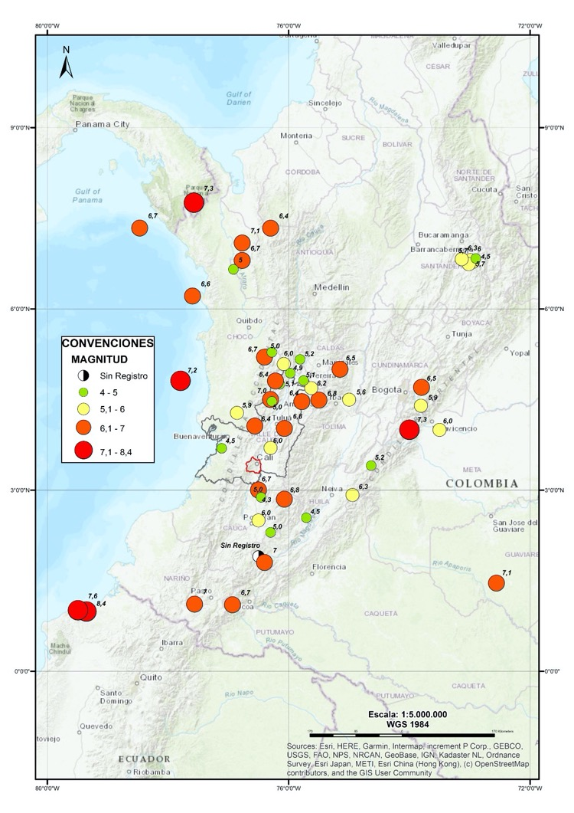{width="5.00135498687664in" height="7.069306649168854in"}

Figura 5. Mapa histórico de eventos sísmicos de influencia en Santiago de Cali. Se representan los eventos sísmicos en diferente tamaño y color de acuerdo con su magnitud. Fuente: elaboración propia.

 Movimientos en Masa históricos en Santiago de Cali
--------------------------------------------------

A continuación, se presentan los resultados sobre los eventos por movimientos en masa ocurridos en la ciudad Santiago de Cali en el periodo entre 1949 y 2018, obtenidos de la búsqueda documental en bases de datos, informes técnicos, periódicos y libros.

### Conceptualización de movimientos en masa

Los movimientos en masa o movimientos de ladera, se definen como "todo desplazamiento hacia abajo (vertical o inclinado en dirección del pie de una ladera) de un volumen de material litológico importante, en el que el principal agente es la gravedad" [35]. Para Calvo [36], los movimientos de ladera son eventos que suelen asociarse a otros procesos, como los terremotos, lluvias extraordinarias, procesos morfológicos (que no incluyen riesgo necesariamente, como puede ser la erosión fluvial) y la acción antrópica la cual tiene un papel de primer orden al modificar las características del terreno. Los elementos que permiten definir el grado de peligrosidad de un deslizamiento de terreno son la velocidad del fenómeno y la superficie afectada.

### Reportes sobre eventos por movimientos en masa 

Con respecto al número de noticias por movimientos en masa encontrados para el área urbana y rural del municipio Santiago de Cali, en el periodo 1949--2018 se encontraron 342 noticias, siendo los años 2016 y 2017 los que presentan la mayor cantidad de reportes (Fig. 6). En 1999 se muestra un número representativo de 21 noticias, que se relacionan con un periodo de lluvia que afectó significativamente las zonas de ladera de la zona urbana de la ciudad y sus corregimientos. Para los años más recientes las noticias corresponden principalmente a información referente a trabajos de recolección de deslizamientos en todo el municipio [37--46].

> El histograma del número de eventos por año denota tres periodos marcados en los cuales el promedio de noticias se duplica o triplica con respecto al primer periodo (Fig. 7). El primer periodo va desde 1949 a 1983, donde el promedio de eventos es 2. El segundo comprende los años 1984 a 1992 con promedio de 4 eventos por año, y finalmente, el tercero corresponde al periodo 1991--2018, donde se aprecian en promedio 9 eventos por año [47--53].

{width="6.199840332458443in" height="3.6138615485564305in"}

Figura 6. Distribución anual del número de noticias de movimientos en masa por año en el municipio de Santiago de Cali, periodo 1949--2018. Fuente: elaboración propia.

{width="6.288327865266842in" height="3.297029746281715in"}

Figura 7. Distribución anual del número de eventos por año de movimientos en masa en el municipio Santiago de Cali en periodo 1949--2018. Fuente: elaboración propia.

En lo que se refiere a la distribución en el área de estudio, el 66% de los eventos se presentan en el casco urbano y un 25% en el área rural (Fig. 8a), lo cual puede asociarse al número de viviendas ubicadas en la zona de ladera y actividades desarrolladas en ellas con relación a los corregimientos, el 9% restante no se reporta a un área específica en de las fuentes consultadas.

De la historicidad revisada se encontró, que las zonas más afectadas corresponden a las comunas 20, 18 y 1 (Fig. 8b) donde se presentan movimientos en masa tipo deslizamientos de tierra y flujo, provocados por la inestabilidad del terreno en temporada de lluvias. En la comuna 20, los movimientos en masa se concentran principalmente en Siloé, el barrio Brisas de Mayo y Tierra Blanca, en la comuna 18 en el barrio Los Chorros y, finalmente, en la comuna 1 en los barrios Terrón Colorado y Aguacatal (Fig. 9). Los corregimientos de la ciudad también sufren por el desenlace de este fenómeno natural, siendo Felidia, La Buitrera, Los Andes y El Saladito los más afectados (Fig. 10).

{width="6.0396041119860016in" height="2.484563648293963in"}

Figura 8. Distribución del número por movimientos en masa (MM) por localización en el municipio de Santiago de Cali, durante el periodo 1949 -2018. Representa la distribución de eventos entre el área urbana y rural (izquierda), y la distribución del número de eventos por comunas (derecha). Fuente: elaboración propia.

{width="5.41496719160105in" height="3.41584208223972in"}

Figura 9. Distribución de eventos de movimientos en masa por barrios en el municipio de Santiago de Cali, durante el periodo 1949 -2018. Fuente: elaboración propia.

{width="4.533603455818023in" height="2.6819444444444445in"}

Figura 10. Número de eventos de movimientos en masa por corregimiento en el municipio de Santiago de Cali, durante el periodo 1949 -2018. Fuente: elaboración propia.

### Cartografía de movimientos en masa

Con la información obtenida y debidamente espacializada se presentan a continuación los mapas de movimientos en masa para la zona urbana y rural del municipio de Santiago de Cali (Fig. 11 y 12).

{width="4.373657042869641in" height="6.186046587926509in"}

Figura 11. Historicidad de movimiento en masa zona urbana. Los colores representan la frecuencia de eventos en cada barrio. Fuente: elaboración propia.

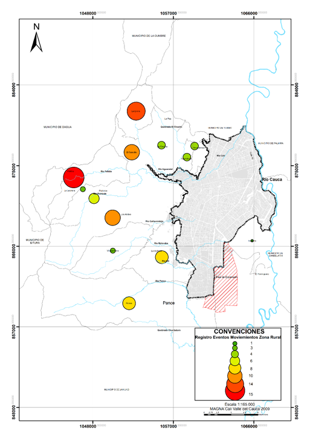{width="4.287882764654418in" height="6.064727690288714in"}

Figura 12. Historicidad de movimientos en masa zona rural. Los colores y tamaños de los círculos representan la cantidad de registros por movimientos en masa. Fuente: elaboración propia.

 Inundaciones históricas en Santiago de Cali
-------------------------------------------

A continuación, se muestran los resultados obtenidos de la búsqueda documental a partir de la consulta en bases de datos, informes técnicos, periódicos y libros, correspondientes a la aplicación rigurosa de la metodología abordada en los primeros apartes del capítulo.

### Conceptualización de inundación

Una inundación es un evento natural y recurrente que se produce como resultado de la acumulación de agua causada por intensas o continuas lluvias sobre áreas planas o llanuras de inundación que, al sobrepasar la capacidad de retención del suelo y de los cauces se desbordan e inundan los terrenos aledaños a los cursos de agua [54]. Para el Ministerio de Ambiente y Desarrollo Sostenible -- Universidad Nacional de Colombia [55], las inundaciones son parte de un proceso natural como respuesta a eventos climáticos de autorregulación del propio ciclo hidrológico.

El territorio colombiano se caracteriza por tener un régimen bimodal, es decir, temporadas alternadas de bajas precipitaciones y altas precipitaciones, en estas últimas hay probabilidad de que se presenten crecientes de los afluentes y cuerpos de agua generando inundaciones que pueden ocasionar afectaciones en la población.

+---------------------------------------------------------------------------------------------------------------------------------------------------------------------------------------------------------------------------------------------------------------------------------------------------------------------------------------------------------------------------------------------------------------------------------------------------------------------------------------------------------------------------------------------------------------------------------------------------------------------------------------------------------------------------------------------------------------------------------------------------------------------------------------------------------------------------------------------------------------------------------------------------------------------------------------------------------------------------------------------------------+
| Caja 2. Definiciones para la clasificación de las inundaciones fluviales y pluviales:                                                                                                                                                                                                                                                                                                                                                                                                                                                                                                                                                                                                                                                                                                                                                                                                                                                                                                               |
|                                                                                                                                                                                                                                                                                                                                                                                                                                                                                                                                                                                                                                                                                                                                                                                                                                                                                                                                                                                                         |
| Inundaciones fluviales por desbordamientos de los ríos: son causadas por los desbordamientos de los ríos y los arroyos, lo cual se atribuye, en primera instancia, a un excedente de agua. El aumento brusco del volumen de agua que un lecho o cauce es capaz de transportar sin desbordarse produce lo que se denomina como avenida o riada, un mayor aumento del volumen es la causa de la inundación [56].                                                                                                                                                                                                                                                                                                                                                                                                                                                                                                                                                                                    |
|                                                                                                                                                                                                                                                                                                                                                                                                                                                                                                                                                                                                                                                                                                                                                                                                                                                                                                                                                                                                         |
| Inundaciones pluviales por precipitaciones in situ*:* son las que se producen por la acumulación de agua de lluvia en un determinado lugar o área geográfica sin que ese fenómeno coincida necesariamente con el desbordamiento de un cauce fluvial. Este tipo de inundación se genera tras un régimen de precipitaciones intensas o persistentes, es decir, por la concentración de un elevado volumen de lluvia en un intervalo de tiempo muy breve o por la incidencia de una precipitación moderada y persistente durante un amplio período de tiempo. Lógicamente, es el primero de estos casos el que conlleva el mayor peligro para la población y sus bienes y el que plantea los principales inconvenientes a los servicios de coordinación e intervención para prevenir y controlar sus daños. Las precipitaciones torrenciales, que se acumulan peligrosamente en un lapso muy breve de tiempo, hacen que el tiempo de respuesta de los servicios de emergencia sea más reducido [56]. |
+---------------------------------------------------------------------------------------------------------------------------------------------------------------------------------------------------------------------------------------------------------------------------------------------------------------------------------------------------------------------------------------------------------------------------------------------------------------------------------------------------------------------------------------------------------------------------------------------------------------------------------------------------------------------------------------------------------------------------------------------------------------------------------------------------------------------------------------------------------------------------------------------------------------------------------------------------------------------------------------------------------+

### Reportes sobre eventos por inundación

En la búsqueda de información en diferentes fuentes, se encontró un total de 227 eventos relevantes por inundaciones en el municipio de Santiago de Cali para el periodo comprendido entre 1949 y 2018 [57-- 59]. En la Figura 13 se muestra el histograma con número de reportes de eventos de inundación que se presentaron por cada año de la ventana de tiempo seleccionada [60--65].

{width="5.595657261592301in" height="3.188117891513561in"}

Figura 13. Número de reportes sobre eventos por año inundación en el municipio de Santiago de Cali, encontrados en el periodo entre 1949--2018. Fuente: elaboración propia.

En la Figura 14a se muestra el número de eventos por inundación que se han presentado en cada una de las comunas del municipio durante el periodo indicado. En la Figura 14b se muestran los eventos por inundación registrados en la zona rural del municipio, donde el corregimiento que más eventos se han registrado es el de Navarro con 40 registros. Seguido por el corregimiento de Pance con 18 eventos registrados. Los corregimientos de El Hormiguero y Montebello se han registrado siete y seis eventos respectivamente. Por último, se encuentran los corregimientos de La Buitrera, La Castilla y Pichinde con un evento cada uno.

{width="5.79207895888014in" height="2.92007217847769in"}

Figura 14. Distribución de eventos por inundación en el municipio de Santiago de Cali para el periodo de 1949-2018 (izquierda). Registro de eventos por comunas. Registro por corregimientos (derecha). Fuente: elaboración propia.

Las inundaciones que se presentan en el municipio son pluviales y fluviales (Fig. 15). Se observa que 195 de las inundaciones ocurridas en el municipio Santiago de Cali son pluviales, correspondientes al 61% del total de las inundaciones y 125 son de tipo fluvial, es decir el 39% de total de los eventos que se registraron en el municipio.

{width="4.058333333333334in" height="2.286046587926509in"}

Figura 15. Número de eventos por tipo de inundación en el municipio de Santiago de Cali, periodo 1949 -- 2018. Fuente: elaboración propia.

Las Figuras 16, 17 y 18 muestran la representación cartográfica o distribución espacial de los eventos por inundación reportados en la ciudad Santiago de Cali.

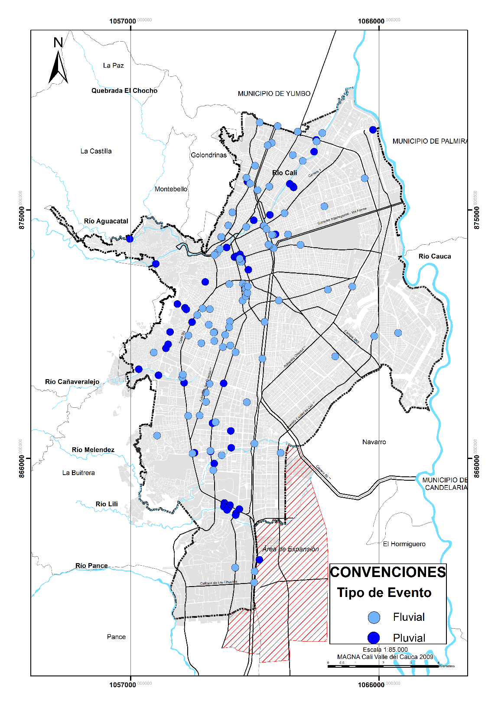{width="4.8511351706036745in" height="6.861385608048994in"}

Figura 16. Historicidad de eventos de inundación fluvial y pluvial en la zona urbana del municipio de Santiago de Cali. Fuente: elaboración propia.

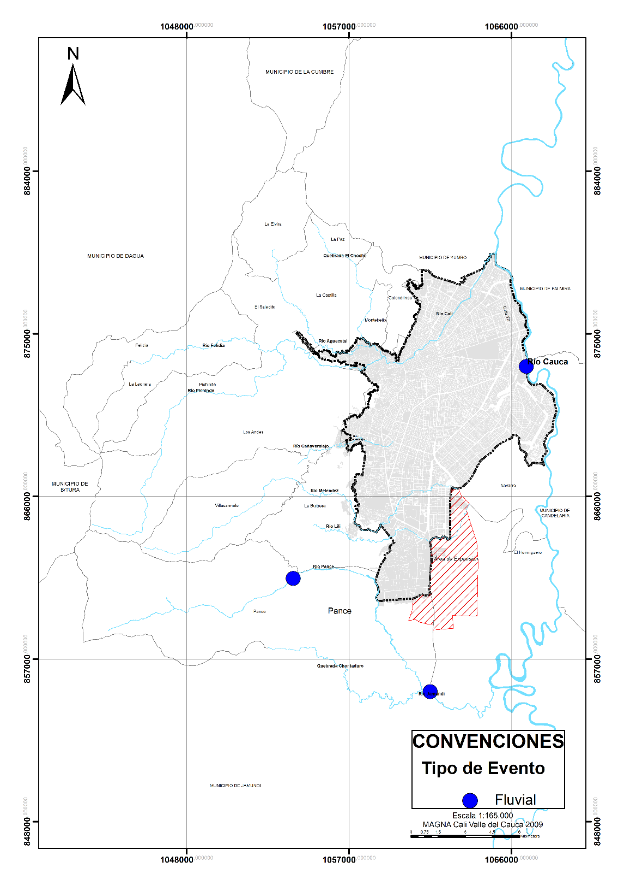{width="4.905601487314086in" height="6.9384208223972in"}

Figura 17. Historicidad de eventos de inundación fluvial en la zona rural del municipio de Santiago de Cali. Fuente: elaboración propia.

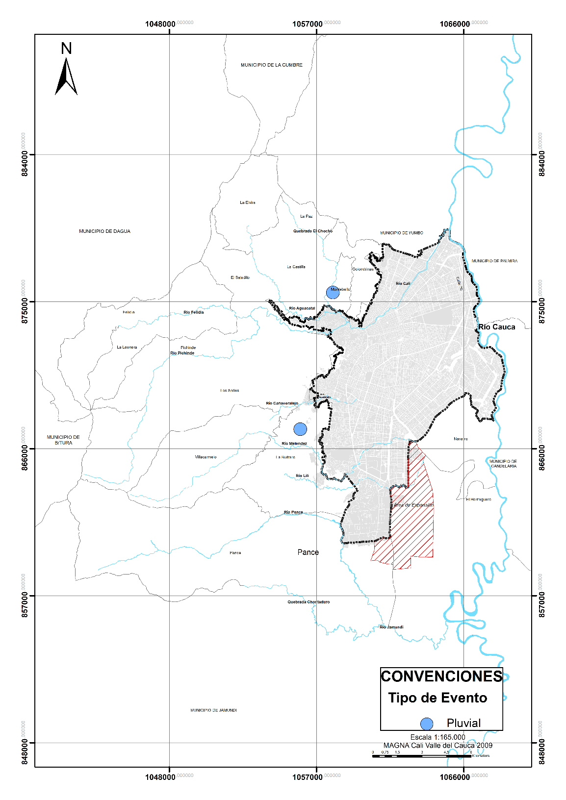{width="5.677297681539808in" height="8.029898293963255in"}

Figura 18. Historicidad de eventos de inundación pluvial en la zona rural del municipio de Santiago de Cali. Fuente: elaboración propia.

GESTIÓN DEL RIESGO EN CALI Y SU RELACIÓN CON LA OCURRENCIA DE EVENTOS HISTÓRICOS 
================================================================================

El municipio de Santiago de Cali, específicamente su área urbana, fue un epicentro importante de recepción de flujos migratorios, convirtiéndose en un centro de actividades económicas para una vasta porción del eje comercial y en un polo de desarrollo para la región [66]. Sin embargo, al mismo tiempo fue consolidando un desarrollo desordenado de su trama urbana.

En este contexto, debido a la carencia de instrumentos institucionales para una adecuada planificación de la ciudad, se conformaron asentamientos ilegales que derivaron posteriormente en conflictos por la tierra [67] y en la toma de acciones populares por parte de la población migrante para acceder a un predio y a la aplicación de políticas de desarrollo urbano, propiciando la dilatación físico-urbana y la ampliación del perímetro urbano entre 1950 y 1990 hacia el oriente de la ciudad [68]. Se consolido un modelo de ciudad que muestra una expansión discontinua, dispersa e incontrolada, mediante la ocupación de terrenos aislados y sin urbanizar.

Cuando se analiza la distribución espacial de los eventos históricos ocurridos en el municipio, específicamente para el caso de inundaciones y movimientos en masa, se logra evidenciar que existe una mayor concentración hacia las zonas y barrios que recibieron la mayor parte de la población inmigrante y que se consolidaron de manera ilegal. Situación que, demuestra como los problemas en planificación se ven materializados en la ocurrencia fenómenos que pueden dejar un impacto sobre el territorio urbano.

A nivel reglamentario, el municipio cuenta con diferentes instrumentos para la gestión del riesgo que se han desarrollado a través de los años. El primero de estos, corresponde al Plan General para la Atención de Emergencias en Cali, realizado en el año 1989 por el Fondo de Emergencia Ciudadana (FES) y el Comité Operativo de Emergencia (COE) [69]. Este instrumento, tuvo como objetivo principal, plantear estrategias previas a la ocurrencia de los eventos, durante el periodo de emergencia y medidas de reparación de daños.

*En el 1996, se formuló el Plan de Mitigación de Riesgos para Cali, el cual* generó acciones de mitigación, intervenciones físicas y de planeación territorial, constituyéndose en una base aprovechable para el diseño y puesta en funcionamiento a futuro de un Plan de Gestión de Riesgos [70].

Posteriormente, en el año 2009 mediante el acuerdo Decreto 411.020.0744 se adopta el Plan Local de Emergencias y Contingencias del municipio de Santiago de Cali (PLEC) [70]. Prioriza los escenarios de riesgo, de sismos e inundaciones como los que podrían generar más daños y mayores damnificados en el municipio.

Todos estos instrumentos anteriormente mencionados, se enmarcaron en un enfoque de la atención del desastre, de acuerdo a la normatividad vigente a la fecha de su formulación. Con la entrada en vigencia de la Ley 1523 de 2012 [71] y del Decreto 1807 de 2014 [72], se cambia el paradigma de la gestión del riesgo en el país y se resalta la importancia de incorporarla en los procesos de planificación del territorio.

En sentido, surge la obligatoriedad para todas las entidades de formular planes de gestión del riesgo. El municipio de Santiago de Cali, en cumplimiento con la normatividad establecida, adopta en el año 2012 su Plan Municipal de Gestión del Riesgo de Desastres, mediante Decreto 411.020.0681 [73]. Sin embargo, este proceso solamente se realizó en el papel, dado que no llegó a la caracterización de escenarios de riesgos y a la formulación de un componente programático.

Por otro lado, en el año 2014 en la Revisión y Ajuste del de Plan de Ordenamiento Territorial del municipio, se involucra la gestión del riesgo en todos los componentes del plan, teniendo en cuenta estudios existentes, el planteamiento de acciones y medidas [4].

Con base a todo lo anterior, se debe mencionar que, de acuerdo al estudio de historicidad realizado en el presente trabajo, estos instrumentos para la gestión del riesgo no han representado una herramienta contundente que permitan dar frente a la ocurrencia de fenómenos en el municipio, sobretodo de inundación y movimiento en masa, pues en los últimos años se muestra un aumento significativo en la frecuencia de ocurrencia de estos eventos.

Finalmente, dado que este trabajo hace parte de la formulación del Plan Municipal de Gestión del Riesgo de Santiago de Cali, desarrollado en el año 2018, resulta conveniente analizar en un futuro, su impacto en la frecuencia de ocurrencia y severidad de eventos.

 CONCLUSIONES 
============

En este estudio historicidad se encontraron 97 sismos que por sus características de localización y efectos, son importantes para entender la dinámica sísmica de la ciudad de Santiago de Cali; aunque muchos no dejaron grandes efectos negativos para la ciudad, siendo los de mayor intensidad y consecuencia los de 7 de junio de 1925, 30 julio de 1962, 23 de noviembre de 1979, 8 de febrero de 1995 y 15 de noviembre de 2004.

La mayoría de los efectos negativos tanto estructurales, como en personas se evidenciaron en la zona del Cañaveralejo, debido a las características del suelo que ocasionan una respuesta sísmica es alta.

Del análisis de historicidad realizado para movimiento en masa, se puede concluir que las zonas más propensas a presentar este fenómeno, corresponden a barrios ubicados en zonas de ladera en el municipio de Santiago de Cali, donde las pendientes superan los 5°, los suelos son inestables por las actividades antrópicas que en un momento se desarrollaron en ellos y los canales de drenaje no son adecuados permitiendo en temporada de lluvias la acumulación y posterior infiltración del agua en el suelo, generando la inestabilidad del mismo. Esta situación se da, para el área urbana principalmente en el sector de Siloé en la comuna 20, en el barrio Los Chorros (Comuna 18) y en el Sector de Terrón colorado (Comuna 1).

Para la zona rural, la mayoría de los deslizamientos en masa se presentan en los corregimientos localizados al Noroccidente de la Ciudad, de los cuales, Felidia, La Elvira, Los Andes y El Saladito, se ven constantemente afectados por este fenómeno.

En el municipio de Santiago de Cali se han presentado varios eventos por inundación afectando la población durante los periodos de altas precipitaciones. Por tal motivo, es de vital importancia mantener la huella histórica en documentos, reportes e informes para que se puedan realizar estudios que permitan identificar la recurrencia de las inundaciones, logrando así, plantear acciones para la prevención y mitigación de los daños a futuro.

La revisión histórica se planteó desde el año de 1949 de acuerdo a la inundación presentada entre 1949 y 1950, dado que fue uno de los eventos que ha dejado mayores afectaciones, dejando incomunicados por 10 días los municipios de Santiago de Cali y Candelaria.

En el periodo comprendido desde el año de 1949 hasta mayo de 2018, se puede concluir que el municipio de Santiago de Cali ha sido afectado por inundaciones fluviales y pluviales. Las inundaciones fluviales, han sido producto del desbordamiento de los ríos Cali, Aguacatal, Cañaveralejo, Meléndez, Lili, Pance y el río Cauca, afectando el municipio en mayor medida en la zona urbana. Las inundaciones pluviales, se deben al desbordamiento de los canales, colectores y el colapso del sistema de alcantarillado.

Según lo consultado, las afectaciones presentadas corresponden en parte a la baja capacidad hidráulica por la sedimentación y los residuos sólidos que son arrojados a estos afluentes y canales que en época de máximas precipitaciones afectan su dinámica. Además, el municipio al estar localizado entre el piedemonte de la cordillera Occidental y la llanura de inundación del río Cauca, presenta una baja capacidad para drenar sus aguas por gravedad en época de máximas precipitaciones al río Cauca.

Finalmente, la distribución espacial de los eventos históricos, específicamente para el caso de las inundaciones y movimientos en masa, permite vislumbrar una relación con las debilidades en los procesos de planificación del municipio y su crecimiento desordenado. Evidenciándose carencias en la formulación de instrumentos de gestión del riesgo para evitar la nueva ocurrencia de eventos.

+------------------------------------------------------------------------------------------------------------------------------------------------------------------------------------------------------------------------------------------------------------------------------------------------------------------------------------------------------------------------------------------------------------------------------------------------------------------------------------------------------------------------------------------------------------------------------------------------------------------------+
| RECOMENDACIÓNES PARA TOMAR DECISIONES                                                                                                                                                                                                                                                                                                                                                                                                                                                                                                                                                                              |
|                                                                                                                                                                                                                                                                                                                                                                                                                                                                                                                                                                                                                        |
| 1.  Con el propósito de cumplir con los objetivos de los estudios históricos y que representen una herramienta útil en los procesos de gestión del riesgo y de la planificación del territorio, es fundamental que, desde las diferentes administraciones municipales e instituciones, se reconozca la importancia de llevar una adecuada sistematización de los eventos que ocurren en el territorio. Es común encontrar que en los diferentes municipios no se tiene registro de los eventos ocurridos o de las emergencias atendidas, y cuando lo tienen, no detallan las características del evento y sus efectos. |
+------------------------------------------------------------------------------------------------------------------------------------------------------------------------------------------------------------------------------------------------------------------------------------------------------------------------------------------------------------------------------------------------------------------------------------------------------------------------------------------------------------------------------------------------------------------------------------------------------------------------+

CONFLICTO DE INTERESES

Los autores no declaran conflicto de intereses

AGRADECIMIENTOS

A la Alcaldía Municipal de Santiago de Cali por intermedio de la Secretaria Municipal de Gestión del Riesgo de Desastres y Emergencias quienes priorizaron dentro de sus proyectos el contrato interadministrativo 4163.00126.1.357 de 2018 cuya ejecución estuvo a cargo del Observatorio Sismológico de la Universidad del Valle y de la cual se derivan los resultados del PMGRD de Santiago de Cali.

IDENTIFICACIÓN DE AUTORES

Nathalie Garcia-Millan <https://orcid.org/0000-0002-0002-3881>

Jorge Andrés Velez Correa [https://orcid.org/0000-0003-2314-4253](https://orcid.org/0000-0003-2314-4253)

Karen Sanchez Estupiñan <https://orcid.org/0000-0002-3308-1340>

Nisley Zuñiga Estacio <https://orcid.org/0000-0002-6211-3196>

Yeli C Castillo Gonzales <https://orcid.org/0000-0002-0563-3056>

Alba Nidia Castaño Castaño <https://orcid.org/0000-0002-8126-255X>

Jorge Andrés Diaz Renteria <https://orcid.org/0000-0002-0503-6737>

Elkin de J. Salcedo Hurtado <https://orcid.org/0000-0002-6753-7094>

BIBLIOGRAFÍA

1.  García-Acosta, V. (1996). El estudio histórico de los desastres. *Historia y Desastres en América Latina*, 1, 15--37.

2.  Girola, L. (2011). Historicidad y temporalidad de los conceptos sociológicos. *Sociológica*, 26(73), 13-46.  <http://www.scielo.org.mx/pdf/soc/v26n73/v26n73a2.pdf>

3.  Salcedo-Hurtado, E. (2002). Sismicidad Histórica y Análisis Macrosísmico de Bucaramanga. Boletín Geológico. *Boletín Geológico*, 40 (1).

4.  DAP (Departamento Administrativo de Planeación Municipal). (2014). *Plan de Ordenamiento Territorial de Santiago de Cali*. Documento Técnico de Soporte. 1170 p.

5.  DAP (Departamento Administrativo de Planeación Municipal). (2016). *Cali en cifras 2016*. 244 p.

6.  INGEOMINAS & DAGMA. (2005). *Estudio de Microzonificación Sísmica de Santiago de Cali*

7.  Rodríguez de la Torre, F. (1993). Lecturas sistemáticas de prensa periódica. Hacia una revisión de la sismicidad europea durante los siglos XVII y XVIII. En *Historical investigation of European earthquakes. Materials of the CEC project Review of Historical Seismicity in Europe*. pp. 247-258.

8.  Tarbuck, E. J., Lutgens, F. K., Tasa, D., & Científicas, A. T. (2005). *Ciencias de la Tierra*. Madrid: Pearson Educación.

9.  Olcina Cantos, J., & Ayala-Carcedo, F. J. (2002*). Riesgos naturales*. *Ariel SA*.

10. Muñoz, D (1989). Conceptos básicos en riesgo sísmico. *Física de la Tierra. 1*. 199-215.

11. Arboleda, G. (1956). *Historia de Cali: desde los orígenes de la ciudad hasta la expiración del período colonial*. Tomo II, Capitulo LI. Cali. Universidad del Valle. 420 pp.

12. Arroyo, J. (1955*). Historia de la Gobernación de Popayán*. Bogotá. Santafe. 264 pp.

13. CERESIS (Centro Regional de Sismología e Intensidades). (1985). *Datos e Intensidades*

14. Servicio Geológico Colombiano (2018). *Sismicidad Histórica de Colombia*. Disponible en línea <http://sish.sgc.gov.co/visor/>

15. Diario Correo del Cauca (1925 a). *Cali al influjo de un terremoto. - la catástrofe sísmica de anoche - el fatídico domingo 7*.

16. Diario Correo del Cauca (1925 b). *Ecos del terremoto.*

17. Diario Correo ABC (1925). *El domingo a las 7 menos 10 minutos de la noche, se sintió un fuerte temblor.*

18. Diario El Espectador (junio 9 de 1925). *Nuevas informaciones sobre los temblores del domingo*

19. Diario El Relator (1925 a). *El pavoroso terremoto de anoche.*

20. Diario El Relator (1925 b). *Resumen noticioso de la semana.*

21. Diario El Tiempo (1925 a). *Ayer se sintieron fortísimos temblores en casi todo el país.*

22. Diario El Tiempo (1925 b). *El temblor del domingo.*

23. Diario Occidente (1962). *Instantes de terror vivió Cali con el terremoto.*

24. Diario El País (1962). *Drama de Cali Instantes Después del Sismo. Muerte y desesperación.*

25. Diario El Tiempo 1962). *Pánico por el terremoto Calda, Valle, y Antioquia resultaron los sectores más castigados por la tragedia. Cuarenta muertos y cuantiosos daños.*

26. Diario El País (1979 a). *35 muertos. Tembló durante sesenta segundos en Colombia.*

27. Diario El País (1979 b). *Cali se defendió bien "Hubo daños costosos pero no graves", dicen arquitectos.*

28. Diario El País (1979 c). *Temblor afectó la normal de señoritas.*

29. Diario El Pueblo (1979). *Manizales, epicentro del terremoto.*

30. Diario El País (1995 a). *Sismo, muerte y destrucción. Más de una veintena de muertos y alrededor de 250 heridos. Pereira en emergencia*.

31. Diario El País (1995 b). *Daños en 77 edificaciones. El CLE hizo el balance de los efectos en Cali del sismo del 8 febrero.*

32. Diario El País (2004). *Caleños vivieron madrugada de pánico*.

33. Diario El Tiempo (2004). *Sismo sacude a Valle y Chocó*.

34. Diario El Caleño (2004). *En Cali amaneció temblando. Segundos de terror vivió la población.*

35. Moncayo J., Castro Marín E., Valencia Núñez A., y Fonseca González S. (2001). *Evaluación de riesgo por fenómenos de remoción en masa: Guía Metodológica*. Colombia: Escuela Colombiana de Ingeniería. 166p.

36. Calvo García, Francisco (2001). *Sociedades y territorios en riesgo*. Barcelona, España: Ediciones el Serbal. 186p.

37. Diario El País. (1955). *Tragedia en Golondrinas: Un minero muerto y varios heridos por un alud de rocas en las minas.*

38. Diario El País. (1965). *Mueren dos niños al derrumbarse una casa en la parte alta de Cali, menor*.

39. Diario El País. (1970). *11 muertos en explosión y derrumbe.*

40. Diario El País. (1973). *En Terrón Colorado dos niñas heridas al desplomarse vivienda.*

41. Diario El País. (1984 a). *Deslizamiento en Siloé.*

42. Diario El Pueblo. (1984 b). *Drama en Lleras Restrepo: Emergencia en Siloé por deslizamientos.*

43. Diario El País. (1989). *Seis los muertos por el invierno: Alud mató a cuatro miembros de una familia en El Aguacatal.*

44. Diario El País. (1993). *Familias de los cerros en la calle. Crece emergencia en las laderas.*

45. Diario El País. (1995). *Derrumbe en la obra tumbó dos casas: Canal de Nápoles causa accidente.*

46. Diario El País. (1996). *El invierno afectó a cuatro familias en laderas de Cali.*

47. Diario El País. (1997). *Se desmoronan 20 casas.*

48. Diario El País. (1999). *Deslizamientos en la Comuna 20.*

49. Diario El País. (1999). *La vía a Pance se desmorona.*

50. Diario El País. (1999). *Tragedia en la loma de Belén.*

51. Diario El País. (2004). *Los Chorros, en alto riesgo.*

52. Diario El País. (2006). *Zona de ladera, en alerta por deslizamientos.*

53. Diario El País. (2013). *Lluvias causaron estragos. Lluvias causaron deslizamientos*.

54. Ministerio de Medio Ambiente y Desarrollo Sostenible (2014). *Guía técnica para la formulación de los planes de ordenación y manejo de cuencas hidrográficas*.

55. Ministerio de Hacienda y Crédito Público. (2013). *Estrategia de protección financiera para la reducción de la vulnerabilidad fiscal ante la ocurrencia de desastres naturales en Colombia*. Bogotá D.C. Colombia.

56. Aparicio, J. (2003). *Lluvias e inundaciones*. Recuperado el 24 de febrero del 2012 de la Web: <http://www.iaem.es/GuiasRiesgos/Lluviaseinundaciones.pdf>

57. Corporación OSSO- Colombia, LA RED y UNIDR (2017). *Desinventar. Sistema de inventario de efectos de desastres.* Recuperado dehttp://www.deSinventar.org/es/

58. Diario el País (20 de abril de 1998). *Un muerto y cien viviendas inundadas dejó el aguacero de ayer. Cali, en emergencia invernal un muerto*.

59. Diario el País. (05 de mayo de 2010). *Invierno sigue causando estragos. El invierno colapsó al Nororiente. Altos niveles del rio Cauca provocaron la emergencia. Una mujer habría muerto electrocutada en Calimio.*

60. Diario el País. (07 de noviembre de 2011). *Baño dominical en el río terminó en tragedia*.

61. Diario el País. (18 de abril de 2018). *Trágico aguacero causó dos muertos y generó caos*.

62. Diario el País. (21 de mayo de 1971). *Cali baja la furia de las aguas. Estragos por las inundaciones en la ciudad*.

63. Diario el País. (24 de febrero de 1999). *Emergencia por ola invernal.*

64. Diario el País. (29 de junio de 1959). *Rescatados sin vida los 4 menores.*

65. Diario El Pueblo. (01 de julio de 1984). *Por desbordamiento del rio Cali. Más de $500 millones en pérdidas.*

66. Castillo, C. (2014). *El Control Territorial en el Departamento del Valle del Cauca*. Primera edición. Programa Editorial Universidad del Valle. Cali.

67. Vásquez, H. (1985). *El proceso de urbanización en la historia colombiana. Primera edición.* Bogotá. Universidad Externado de Colombia.

68. Mosquera, G. (2011). *Expansión urbana y políticas estatales en Cali.* POLIS. Observatorio De Políticas Públicas. Sexta edición.

69. Fondo de Emergencia Ciudadana (FES) & Comité Operativo de Emergencia (COE) (1989). *Plan General para la Atención de Emergencias en Cali.*

70. Alcaldía de Santiago de Cali & CORPORIESGOS (2009). *Plan Local de Emergencias y Contingencias del municipio de Santiago de Cali* (PLEC). 253 pp.

71. República de Colombia. Congreso de la República (2012). *Ley 1523 de 2012*. Bogotá, Colombia.

72. República de Colombia. Ministerio de Vivienda, Ciudad y Territorio (2014). *Decreto número 1807 de 2014*. Bogotá, Colombia.

73. Alcaldía de Santiago de Cali (2012). *Decreto 411.020.0681*. Cali, Colombia.

10

[]{#_Toc47894933 .anchor}Estudio de riesgo por movimientos en masa en cuencas hidrográficas abastecedoras en el suroeste antioqueño usando métodos probabilistas

Cesar Augusto Hidalgo M.^1*^ & Johnny Alexander Vega G.^2^

^1^Facultad de Ingeniería. Programa de Ingeniería Civil. Universidad de Medellín, Medellín, Colombia

^2^ Facultad de Ingeniería. Programa de Ingeniería Civil. Universidad de Medellín, Medellín, Colombia

*Autor de contacto: Cesar Augusto Hidalgo M. Facultad de Ingeniería. Programa de Ingeniería Civil. Universidad de Medellín. Carrera 87 N° 30 -- 65, Medellín, Colombia. Correo-e <chidalgo@udem.edu.co>

Resumen

Los movimientos en masa se consideran uno de los peligros naturales que causan mundialmente mayor cantidad de pérdidas. En países como Colombia, los movimientos en masa que causan el mayor número de muertes y pérdidas económicas se relacionan con avenidas torrenciales causadas por movimientos en masa en cuencas. Este capítulo presenta una metodología para evaluar el riesgo asociado con movimientos en masa en cuencas abastecedoras. La amenaza se evalúa considerando métodos probabilistas que incluyen los efectos de la lluvia y los sismos. Además, este estudio evalúa la probabilidad de que una masa deslizante llegue a los lechos de los ríos y la probabilidad de obstrucción en sus cauces. Por otro lado, la vulnerabilidad se estima utilizando curvas de daño basadas en la altura de obstrucción de los cauces. Finalmente, el riesgo se estima como la probabilidad de que ocurran pérdidas económicas a lo largo del lecho del río. Esta metodología se basa en métodos de probabilidad, como el método de primer orden segundo momento (FOSM) y el método de estimaciones puntuales (MEP), y se ha aplicado en la cuenca del río San Juan, en el suroeste Antioqueño, donde las condiciones morfodinámicas e hidrometeorológicas han generado desastres que han causado daños a la infraestructura y población con pérdidas económicas significativas. Los resultados evidencian alta coincidencia de zonas afectadas con movimientos en masa de acuerdo al inventario de eventos en la zona, con áreas de alta probabilidad de falla predichas por el modelo, indicando su coherencia para identificar zonas a estudiar con mayor detalle. En conclusión, las pérdidas directas estimadas en la cuenca de la zona de estudio, sin considerar edificaciones, serían del orden de $3,782 millones de pesos colombianos, valor que sirve de referencia para evaluaciones más detalladas y la toma de decisiones para la gestión del riesgo.

Palabras clave

Amenaza, deslizamientos, cuencas, movimientos en masa, riesgo, vulnerabilidad

> Landslide risk study in supplying hydrographic basins in the southwest of Antioquia using probabilistic methods

Abstract

Landslides are considered one of the natural hazards that cause the most significant losses worldwide. In countries such as Colombia, landslides events that cause the highest number of deaths and economic losses are related to flash floods or debris flow caused by landslides in basins. This chapter presents a methodology to assess the associated risk with landslides in water supply basins. The hazard is assessed considering probabilistic methods that include the effects of rainfall and earthquakes. Furthermore, this study assesses the probability of a sliding mass reaching riverbeds and the probability of obstructions in its channels. Besides, vulnerability is assessed using damage curves based on the obstruction height of the channel. Finally, the risk is estimated as the probability of the most likely economic losses occurring along the riverbed. This methodology is based on probability methods, such as the first-order second-moment method (FOSM) and the point estimate method (PEM). It was applied in the San Juan River basin, in the southwest of Antioquia, where morphodynamic and hydrometeorological conditions have generated several disasters that have caused damage to the infrastructure and its population with significant economic losses. The results show a high coincidence of affected areas with landslides according to the inventory of events in the study zone, with areas of a high probability of failure predicted by the model, indicating its coherence to identify areas to be studied with more detail. In conclusion, the estimated direct losses in the basins of the study area, without considering buildings, would be of the order of $ 3,782 millions of Colombian pesos, a reference value for more detailed assessments and decision-making for risk management.

Keywords

Hazard, landslide, mass movement, risk, vulnerability, water supply basins

INTRODUCCIÓN 
============

Debido a los altos niveles de afectación de los movimientos en masa, a nivel mundial se ha generado una gran dinámica en el estudio de los fenómenos asociados en procura de entender los aspectos físicos [1-6] y económicos [7-11] relacionados con los movimientos en masa. En particular, se ha identificado la ocurrencia de procesos complejos en los cuales de movimientos en masa de suelo obstruyen corrientes de agua relativamente pequeños formando represamientos que al romperse generan avenidas torrenciales que terminan generando una gran afectación a las comunidades asentadas en las riberas y una gran afectación a la infraestructura.

El suroeste antioqueño, y en particular las cuencas de esta subregión, son frecuentemente afectadas por movimientos en masa, los cuales han causado numerosas pérdidas de vidas, heridos, damnificados y cuantiosas pérdidas económicas. Muchos de ellos asociados a cuencas hidrográficas abastecedoras de acueductos como el río Tapartó, la quebrada La Liboriana y el cerro Las Nubes, por citar algunos de los más emblemáticos. Una fuente abastecedora, se entiende como una corriente de agua que se utiliza para el suministro de agua potable, riego de cultivos o para actividades industriales. Entendiendo que la estimación y evaluación del riesgo por movimientos en masa y su afectación a las fuentes de abastecimiento de agua es un problema complejo, en el marco del proyecto Piragua de la Corporación Autónoma Regional del Centro de Antioquia-Corantioquia, la Universidad de Medellín ha desarrollado una metodología para la evaluación de riesgos por movimientos en masa en fuentes hídricas abastecedoras de agua potable.

En este capítulo se presenta la metodología aplicada a un caso de estudio en la cuenca del río San Juan. En primer lugar, se presenta una evaluación de la información disponible para la elaboración de un inventario de movimientos en masa (Fig. 1). Segundo, se presenta la evaluación de amenaza por movimientos en masa detonados por sismos y lluvia a escala regional, se presentan los materiales usados y los resultados obtenidos; por último, se presenta el análisis de riesgo, y finalmente se presentan conclusiones y recomendaciones para futuros trabajos.

Tabla 1. Se estima que los costos directos e indirectos de los movimientos en masa en pueden ser significativas en términos del producto interno bruto (PIB), incluso en países desarrollados [16].

  País         Pérdidas anuales (USD miles de millones   Pérdidas (% PIB)
  ---------------- --------------------------------------------- ----------------------
  Estados Unidos   2.1 - 4.3                                     0.01 - 0.03
  Japón            3.0                                           0.06
  Italia           3.9                                           0.19
  India            2.0                                           0.11
  China            1.0                                           0.01
  Alemania         0.3                                           0.01

{width="6.04830927384077in" height="1.95625in"}

Figura 1. Pérdida de vidas (A) y daño a propiedades (B) por diversos fenómenos naturales en el Valle de Aburrá entre 1880--2007 (adaptado de [19]).

En recientes años, se han presentado varios movimientos en masa que han causado numerosas muertes y pérdidas económicas. La Tabla 2 muestra algunos movimientos en masa seleccionados por su gran impacto a nivel mundial y también en área en estudio. La mayoría de estos eventos ocurrieron en zonas de ocupación irregular; sin embargo, taludes en proyectos formales también han presentado problemas [20].

Tabla 2. Algunas tragedias debidas a movimientos en masa (Modificado de [15]).

  Clasificación de los movimientos en masa   Fecha       Localización                   Daños     
  ---------------------------------------------- --------------- ---------------------------------- ------------- ------------------------
                                                                                                    Muertes   Personas afectadas
  Flujo de lodos                                 Feb. 4, 2005    *El Barro (Bello-Colombia)*        42            60
  Deslizamiento rotacional complejo              May 28, 2007    *La Cruz (Medellín-Colombia)*      8             > 60
  Flujo de escombros                             May 31, 2008    *El Socorro (Medellín-Colombia)*   27            > 60
  Deslizamiento                                  Nov. 16, 2008   *Alto Verde (Medellín-Colombia)*   12            > 12
  Deslizamiento                                  Dic. 5, 2010    *La Gabriela (Bello-Colombia)*     85            > 130
  Deslizamiento                                  Mar 22, 2014    *Oso (USA)*                        43            > 100
  Deslizamiento                                  Oct 29, 2014    *Badulla (Sri Lanka)*              22            > 300
  Deslizamiento                                  May 28, 2015    *Salvador (Brasil)*                14            -
  Deslizamiento                                  Oct 2, 2015     *El Cambray II (Guatemala)*        280           > 200
  Deslizamiento                                  Abr 23, 2015    *Badakhshan(Afganistán)*           52            > 100
  Avenida torrencial                             Mar 31, 2017    Mocoa (*Colombia)*                 300           > 1000
  Avenida torrencial                             May 18, 2015    Salgar (*Colombia)*                104           542
  Deslizamiento                                  Oct 26, 2016    Cabuyal, Copacabana                16            -
  Avenida torrencial                             Abr 26, 1993    Tapartó (Andes*-Colombia)*         92            -

El control de estos eventos es una prioridad para las autoridades alrededor del mundo. Sin embargo, la ausencia de una delimitación racional y clara de las zonas susceptibles a movimientos en masa resulta en la ocupación de zonas inadecuadas creando escenarios de alto riesgo para la vida y pérdidas materiales [13, 16, 21]. En este contexto, surge la necesidad de adaptar o desarrollar nuevas metodologías para entender mejor las condiciones que causan los movimientos en masa en zonas montañosas y crear herramientas de planeación que permitan un mejor manejo de los procesos de ocupación de laderas.

En Colombia, los movimientos en masa, al igual que las inundaciones, constituyen los fenómenos naturales que traen consigo los riesgos más severos para la sociedad, lo cual se debe principalmente a sus diversas y variadas características geográficas y fisiográficas, siendo detonados por factores tanto naturales como antrópicos. Como caso particular de esto, las condiciones de la zona montañosa de la ciudad de Medellín y los municipios vecinos, en cuanto a relieve, clima, topografía, geología, entre otros, hacen a la región susceptible para la ocurrencia de procesos morfodinámicos, que pueden afectar tanto a la población como a su infraestructura [10].

De acuerdo con la información del Servicio Geológico Colombiano, en Colombia para el periodo 1970--2011, excluyendo las pérdidas asociadas a la erupción del Volcán Nevado del Ruiz en 1985, los mayores porcentajes de pérdidas de vidas y de viviendas destruidas correspondieron a los movimientos en masa y a las inundaciones, respectivamente; a los primeros se les atribuye la destrucción del 10% de las viviendas y el 36% de las pérdidas de vidas, en tanto que las inundaciones destruyeron el 43% de las casas y ocasionaron el 10% de las muertes [22]. Igualmente, entre 1900 y 2015 en Colombia se han reportado 16,969 movimientos en masa. Debido a estos, 5,119 personas han perdido la vida y 548,810 familias se han visto afectadas; el departamento de Antioquia cuenta con el mayor número de registros (5,495), seguido por Cundinamarca (1,552) y Cauca (1,280). Los departamentos con mayor número de personas y familias afectadas han sido Caldas, Caquetá, Tolima, Antioquia, Bolívar, Boyacá, Cauca, Cesar, Cundinamarca, Huila, Meta, Nariño, Norte de Santander, Putumayo, Quindío y Santander [23].

En general, los movimientos en masa pueden ser originados por la conjugación de diversos factores detonantes como sismos o lluvia, y se constituyen en una causa frecuente de desastres alrededor del mundo [24]. Específicamente en el Valle de Aburrá (VA), subregión político administrativa ubicada en el centro-sur del departamento de Antioquia y que reúne a diez municipios conurbados (Barbosa, Girardota, Copacabana, Bello, Itagüí, Sabaneta, Envigado, La Estrella, Medellín y Caldas), los movimientos en masa han causado considerables pérdidas económicas y humanas. Debido a la ocupación de las laderas por asentamientos humanos y por obras de infraestructura, los riesgos asociados a los movimientos en masase han incrementado en los últimos años. Se estima que en el VA el 35% de los daños a edificaciones y 74% de las muertes debidas a fenómenos naturales se asocian con movimientos en masa [19], mientras que a nivel mundial, se les atribuye a tales movimientos el 14% de las pérdidas económicas y el 0.53% de las muertes debidas a desastres por fenómenos naturales [18].

En el Plan Departamental para La Gestión del Riesgo de Desastres de Antioquia (PDGRA) [25], se advierte de falencias en la disponibilidad y calidad de las fuentes de información para la verificación de los antecedentes históricos en el departamento, y que se hace necesario desarrollar una plataforma, que pueda ser alimentada de manera ágil y oportuna y poder así obtener registros confiables, que permitan una adecuada toma de decisiones. También se advertía la importancia de que las fichas se completen en su totalidad en campos específicos como el de pérdidas económicas y causas del desastre. Igualmente, se llamaba la atención respecto a la necesidad de que los municipios registren los llamados "pequeños desastres", que muchas veces son ignorados, porque no superan la capacidad de respuesta y sus efectos no son de consideración a escala departamental, pero que sumados pueden llegar a generar pérdidas tan o más significativas que las que causan los grandes desastres. A partir de estos resultados se realizó un análisis por cada región encontrando que las de mayor afectación por movimientos en masa son el suroeste y la del Oriente. Respecto a la región del suroeste, se indica que históricamente los eventos de origen hidrometeorológico han tenido gran significancia en esta zona por tratarse de municipios ubicados en la vertiente oriental de la cordillera occidental en laderas de alta pendiente, lo que los hace altamente susceptibles a sufrir daño por fenómenos como movimientos en masa. En el periodo 1894--2014 se registraron 391 movimientos en masa y los municipios que registraron mayor ocurrencia de este evento fueron: Andes, Támesis, Santa Bárbara, Betania, Betulia, Fredonia, Ciudad Bolívar y Salgar.

En el informe final del estudio de Actualización de la Línea Base de Gestión del Riesgo y Mapa de Susceptibilidad al Cambio Climático 2014--2015 en la Jurisdicción de Corantioquia [26], se reporta un total de 322 movimientos en masa en la jurisdicción de Corantioquia, cada uno con su respectiva localización, pero no se reporta la fecha de ocurrencia. De acuerdo con este trabajo, y como se observa en las zonas que presentan una mayor recurrencia de movimientos en masa es el suroeste con 109 reportes, el Valle de Aburra con 68 y el Norte con 56. Los movimientos en masa de este informe se obtuvieron a partir de reportes directos de los municipios.

Para ampliar la información y obtener un análisis más concluyente sobre la ocurrencia de movimientos en masa en el suroeste Antioqueño, se recurrió a los reportes del sistema Desinventar hasta el año 2019. De acuerdo con los datos que para Antioquia se encuentran en Desinventar (Fig. 2A), los movimientos en masa se presentan con mayor frecuencia en los trimestres mayo-junio-julio y septiembre-octubre-noviembre como se observa en la Figura 2B. En total se tienen 1,566 registros, los cuales muestran que las zonas con mayor ocurrencia son la zona del suroeste (462 registros) y la del oriente (358 registros) como se aprecia en la Figura 2C. Los 462 registros de la región de suroeste cubren un periodo desde 1921 hasta 2019 como se muestra en la Figura 2A y al igual que para el departamento de Antioquia en general, para la región del suroeste también se observa que los movimientos en masa son más frecuentes en los trimestres mayo-junio-julio y septiembre-octubre-noviembre como se observa en la Figura 2D. El municipio del Suroeste que presenta el mayor número de reportes de eventos es Andes como se observa en la Figura 2E.

{width="6.130122484689414in" height="6.038884514435695in"}

Figura 2. Registros de movimientos en masa para el departamento de Antioquia (Desinventar) (A). Distribución mensual de los movimientos en masa en Antioquia (B). Distribución de movimientos en masa en Antioquia por regiones (excluyendo el Valle de Aburrá) (C). Distribución mensual de movimientos en masa en el Suroeste (D). Movimientos en masa por municipios del Suroeste (E).

RESULTADOS DE LOS MODELOS DE ESTIMACIÓN
=======================================

Amenaza
-------

Se aplicó la metodología mostrada en la Figura 6 y descrita en la Sección 6, para calcular la probabilidad de falla, considerando que la superficie de falla se presenta a una profundidad media de *H* = 2 m, con coeficiente de variación de 25%, para simular un deslizamiento superficial, que corresponde al tipo característico de movimiento en masa en terrenos montañosos tropicales como la zona de estudio, los cuales suelen inducirse por lluvias de alta intensidad o larga duración principalmente. Los coeficientes de variación empleados para los demás parámetros corresponden a 5% para el peso específico del suelo, 10% para el ángulo de fricción interna, 30% para la cohesión, y finalmente, 50% para el coeficiente de aceleración horizontal de sismo. La lluvia usada para la evaluación de la probabilidad de saturación del suelo y la probabilidad anual de falla del terreno, tiene un periodo de retorno de 20 años.

+---------------------------------------------------------------------------------------------------------------------------------------------------------------------------------------------------------------------------------------------------------------------------------------------------------------------------------------------------------------------------------------------------------------------------------------------------------------------------------------------------------------------------------------------------------------------------------------------------------------------------------------------------------------------------------------------------------------------------------------------+
| Caja 1. Teoría del equilibro límite                                                                                                                                                                                                                                                                                                                                                                                                                                                                                                                                                                                                                                                                                                     |
|                                                                                                                                                                                                                                                                                                                                                                                                                                                                                                                                                                                                                                                                                                                                             |
| Los movimientos en masa superficiales en las laderas boscosas generalmente involucran horizontes superficiales del suelo y pueden modelarse como un volumen rígido de tierra delgada que se desliza sobre una superficie de corte plana. Por lo tanto, la estabilidad de la pendiente puede evaluarse esquemáticamente aplicando la teoría del equilibrio límite. Esto significa que se establece una relación entre la resistencia al corte de un material disponible para resistir la falla y alguna condición de las fuerzas de corte que están presentes para causar la falla.                                                                                                                                                          |
|                                                                                                                                                                                                                                                                                                                                                                                                                                                                                                                                                                                                                                                                                                                                             |
| > La teoría de la falla de Mohr-Coulomb establece que, si bien la falla es esencialmente por corte, el esfuerzo crítico de corte es una función del esfuerzo normal como una combinación de la cohesión y la resistencia a la fricción que actúa sobre una superficie potencial de falla.                                                                                                                                                                                                                                                                                                                                                                                                                                                   |
|                                                                                                                                                                                                                                                                                                                                                                                                                                                                                                                                                                                                                                                                                                                                             |
| Esta relación se expresa comúnmente en la forma de un "Factor de seguridad (*FS*)", un indicador global que permite medir el grado de estabilidad del terreno. El factor se expresa por la relación de la resistencia al cizallamiento del suelo (fuerzas estabilizadoras que actúan sobre el terreno) con respecto las solicitaciones que tienden al movimiento (fuerzas desestabilizadoras). La naturaleza de la relación definitoria de los cálculos del FS significan que las situaciones inestables se representan por un número entre 0 y 1, mientras que las consideraciones estables se representan por un número entre 1 e infinito. Este indicador de estabilidad de la pendiente se representa mediante la siguiente ecuación: |
|                                                                                                                                                                                                                                                                                                                                                                                                                                                                                                                                                                                                                                                                                                                                             |
| $$FS = frac{c}{text{γH}left( sinalpha + A_{h}cosalpha right)} + frac{left( gamma H - gamma_{w}H_{w} right)cosalphatanvarphi}{text{γH}left( sinalpha + A_{h}cosalpha right)}$$                                                                                                                                                                                                                                                                                                                                                                                                                                                                                                                                       |
|                                                                                                                                                                                                                                                                                                                                                                                                                                                                                                                                                                                                                                                                                                                                             |
| Dónde: *Ah* es la aceleración horizontal del suelo dada como fracción de la gravedad *g*, *H* es el espesor de la zona de falla [m], *H~w~* es la altura medida desde el nivel freático hasta la superficie de agua [m], *c* es la cohesión del suelo [kPa], *φ* es el ángulo de fricción interna del suelo [°], *γ*  es el peso unitario del suelo en condición húmeda [kN/m^3^], y *γw* es el peso unitario del agua [kN/m^3^].                                                                                                                                                                                                                                                                                               |
|                                                                                                                                                                                                                                                                                                                                                                                                                                                                                                                                                                                                                                                                                                                                             |
| En este estudio, el factor de seguridad se evalúa en dos condiciones de saturación del suelo (húmedo y saturado) bajo dos escenarios (estático y sísmico), obteniendo así, el factor de seguridad húmedo estático (*FSHE*), saturado estático (*FSSE*), húmedo sísmico (*FSHS*) y saturado sísmico (*FSSS*).                                                                                                                                                                                                                                                                                                                                                                                                                                |
+---------------------------------------------------------------------------------------------------------------------------------------------------------------------------------------------------------------------------------------------------------------------------------------------------------------------------------------------------------------------------------------------------------------------------------------------------------------------------------------------------------------------------------------------------------------------------------------------------------------------------------------------------------------------------------------------------------------------------------------------+

En el proceso de estimación de la amenaza, se calculan los factores de seguridad considerando dos escenarios de condiciones de humedad del suelo. El primer caso, corresponde a un escenario estático, es decir, sin la inclusión de un detonante del movimiento en masa por condición sísmica. El segundo caso, corresponde a un escenario que considera la inclusión de un movimiento sísmico, por medio de un coeficiente de aceleración horizontal del suelo (*A~h~*) de 0.2 *g*. Ambos casos fueron evaluados para condiciones de humedad natural del suelo (*H~w~ = 0*) y una eventual condición de saturación total por efecto de la lluvia (*H~w~ = H*). En la Figura se presentan los resultados de factores de seguridad en condición saturada estática y en la Figura 4A la probabilidad de total de falla (*PTF*).

{width="3.0162390638670167in" height="3.9030446194225723in"}

Figura 3. Resultados del factor de seguridad (*FS*) en condición saturada estática para la cuenca del río San Juan (A). Se hace un zoom sobre la quebrada La Liboriana para presentar y detallar los resultados del factor de seguridad en condición húmeda estática (*FSHE*) (B) y en condición saturada estática (*FSSE*) (C).

Vulnerabilidad
--------------

Se realizó el análisis de vulnerabilidad física calculando para esto la intensidad de acuerdo con las Ecuaciones 6 y 7. Analizando la intensidad de afectación de los cauces en una zona de 100 m a lado y lado de los mismos, se obtiene un valor promedio de 0.052 (grado de afectación del 5.2%) en las corrientes principales de la zona de estudio. Como ejemplo, en la Figura 4B se muestran los resultados de vulnerabilidad obtenidos para la quebrada La Liboriana.

### 3.3 Riesgo {#riesgo .list-paragraph}

Usando el procedimiento descrito en la Sección 6 e ilustrado en la Figura , se estimó el riesgo en los cauces en una zona de 100 m a cada lado. Se realizó el análisis de riesgo calculando las perdidas probables de acuerdo con las ecuaciones 9 y 10. Como ejemplo, en la Figura se muestran los resultados de pérdidas estimadas obtenidos para la quebrada La Liboriana.

{width="4.505833333333333in" height="5.830594925634296in"}

Figura 4. Resultados de probabilidad total de falla en la cuenca del río San Juan (A). Vulnerabilidad (en término de "Intensidad") en una zona de influencia de 100 m a cada lado de la quebrada La Liboriana (B). Riesgo anual ($) en una zona de influencia de 100 m a cada lado de la quebrada La Liboriana (C).

DISCUSIÓN
=========

Factor de seguridad 
-------------------

Se consideraron como zonas críticas de estabilidad, aquellas celdas con un valor de factor de seguridad (*FS)* < 1.1, obteniendo los resultados mostrados en la Tabla .

Tabla 3. Comparativo celdas críticas de estabilidad del terreno en la cuenca de estudio.

+-------------------------------+------------------+-----------------------------+
| Escenario/Condición suelo | Área (km^2^) | Área total de la cuenca |
|                               |                  |                             |
|                               |                  | San Juan (%)            |
+===============================+==================+=============================+
| Estático/Húmedo               | 6.1              | 0.4                         |
+-------------------------------+------------------+-----------------------------+
| Estático/Saturado             | 221.6            | 15.8                        |
+-------------------------------+------------------+-----------------------------+
| Dinámico/Húmedo               | 118.9            | 8.5                         |
+-------------------------------+------------------+-----------------------------+
| Dinámico /Saturado            | 815.9            | 58.2                        |
+-------------------------------+------------------+-----------------------------+

En ambos escenarios se aprecia un incremento notable las áreas inestables en la eventual condición de saturación del suelo, puesto que la presencia de agua en la masa de suelo tiene un efecto negativo en la estabilidad dado que ésta reduce el esfuerzo cortante, disminuye la cohesión e incrementa la presión de poros, facilitando un potencial movimiento en masa.

También es muy claro el efecto inducido por un sismo, dado que, con respecto a las condiciones más adversas de ambos escenarios, se puede deducir un incremento de las zonas inestables dentro de la cuenca, de aproximadamente un 40%.

Para evaluar la capacidad de predicción del modelo de evaluación de amenaza por movimientos en masa propuesto, se seleccionó una subcuenca de validación (quebrada La Liboriana) en el municipio de Salgar, dado que se encuentra bien documentada a raíz de la tragedia ocurrida en mayo de 2015, donde decenas movimientos en masa fueron desencadenados por lluvia, con su consecuente avenida torrencial y flujo de lodos y escombros, causando centenares de muertes y una pérdida económica considerable. Para el proceso de validación, se usó un inventario de movimientos en masa en la cuenca de La Liboriana levantado y documentado en Ruiz-Vásquez & Aristizábal [28], el cual fue generado a partir de un análisis multi-temporal de imágenes de satélite y fotografías aéreas, obteniendo un área de movimientos en masa en la zona que cubre aproximadamente 0.6 km^2^ correspondiente al 1% de la cuenca.

En primera instancia, se realizó una correlación espacial de los movimientos en masa documentados y georreferenciados en la zona de estudio con respecto a los resultados obtenidos, encontrando que en aproximadamente el 74% de los polígonos del inventario de movimientos en masa usado como referencia, se detectaron zonas de inestabilidad (Factor de seguridad saturado estático *FSSE* < 1.1, de acuerdo al valor umbral propuesto en [23], clasificado como amenaza alta) con el modelo propuesto, lo cual indica una buena aproximación en la evaluación de este complejo fenómeno. Así mismo, en un 17% de los polígonos restantes del inventario, se encontraron valores promedio de *FSSE* entre 1.1 y 1.25, y que cuyo límite superior corresponde al umbral establecido por la norma sismo resistente colombiana (NSR-10) para taludes en condición de agua subterránea normal para la etapa de construcción, indicando zonas potenciales de inestabilidad ante un cambio moderado en las condiciones de saturación del suelo por efecto de las lluvias. Igualmente, el valor de 1.25 es considerado como un indicador de amenaza media para estudios de amenaza y riesgo por movimientos en masa [23]. Un 5% de polígonos del inventario presentan un *FSSE* promedio entre 1.25 y 1.5, cuyo valor superior corresponde al umbral de diseño de taludes según NSR-10, lo cual se considera como amenaza baja [23]. El porcentaje restante, supera el valor umbral de *FSSE* de 1.5, lo cual se considera como de amenaza baja. Sólo en un 4% de los polígonos del inventario de los movimientos en masa, se presentan valores de *FSSE* superiores a 1.5.

Con el fin de establecer un proceso de validación de mayor robustez cuantitativa en torno a la capacidad predictiva del modelo propuesto, se efectuó un análisis ROC (Receiver Operating Characteristic, por su sigla en inglés), el cual es un método de evaluación del desempeño de un modelo para predecir valores clasificados [29], el cual permite explicar que tan bien el modelo y las variables involucradas predicen un evento [30], en este caso, una potencial zona inestable conducente a un movimiento en masa. Si bien este método es comúnmente aplicado a la validación de modelos estadísticos de susceptibilidad de movimientos en masa, también puede ser aplicado para la validación de modelos físicamente basados [31] como el propuesto en este capítulo, mediante el uso de un valor umbral en el indicador de estabilidad usado (en este contexto corresponde al *FSSE*), cuyo valor umbral para indicar una condición de inestabilidad del terreno corresponde a un valor inferior a 1.1 [23].

Se usó el análisis ROC para determinar la confiabilidad de los valores predichos de estabilidad, usando los resultados obtenidos del *FSSE* como indicador de estabilidad del terreno bajo condiciones de saturación del suelo. Para ello, cada celda de los mapas de factor de seguridad se categorizó en una de las cuatro categorías de interpretación posibles, las cuales corresponden a la denominada matriz de confusión o tabla de contingencia: [1] Verdadero positivo (true positive, *TP*), que representa celdas con un valor de *FSSE* inferior a 1.1 (inestables de acuerdo al modelo físico) y que fueron correctamente predichas como inestables dado que en el inventario se clasifican como "movimiento en masa"; [2] Verdadero negativo (true negative, *TN*), que representa celdas con valor de *FSSE* superior a 1.1 (estables según el modelo físico) y correctamente predicha como estable en el inventario (no movimiento en masa); [3] Falso positivo (false positive, *FP*), que representa aquellas celdas con valores de *FSSE* inferior a 1.1 (inestables) y representan falsas predicciones de inestabilidad dado que no aparecen reportadas en el inventario de movimientos en masa; [4] Falso negativo (false negative, *FN*), que representa aquellas celdas consideras estables por el modelo físico (*FSSE* superior a 1.1) pero que aparecen reportadas en el inventario como zonas con un movimiento en masa ocurrido, y por tanto no fueron correctamente predichas inestables por el modelo físico.

Para el análisis ROC, se calculó la tasa de aciertos (hit rate o true positive rate, *TPR*), que corresponde a una cuantificación de las celdas correctamente clasificadas como inestables respecto al total de casos positivos (clasificados como movimientos en masa) en el inventario. Así mismo, se calculó la tasa de falsa alarma (false positive rate, *FPR*), que corresponde a una cuantificación de las celdas incorrectamente clasificadas como inestables respecto al total de casos negativos (clasificados como no movimientos en masa) en el inventario. De acuerdo al valor umbral de *FSSE* adoptado, se obtuvo un *TPR* de 54% y un *FPR* de 39%, que ubica este punto en la parte central izquierda de la gráfica ROC. Según [29], los resultados que aparecen tienden hacia el lado inferior izquierdo (por encima de la diagonal principal) de un gráfico ROC pueden considerarse "conservadores", es decir que corresponden a clasificaciones positivas solo con evidencia sólida, con sus consecuentes pocos errores falsos positivos y bajas tasas verdaderas positivas.

Adicionalmente, el área bajo la curva ROC (area under curve, AUC) se puede usar como una métrica para cuantificar el rendimiento general de un modelo, de modo que cuanto mayor sea esta área, mejor será el rendimiento del mismo. Para clasificar la precisión, se consideró la clasificación propuesta por Hosmer y Lemeshow, citada por [32]: 0.9 --1.0 (excelente), 0.8 -- 0.9 (bueno), 0.7 -- 0.8 (regular), 0.6 -- 0.7 (pobre), y 0.5 -- 0.6 (falla). El área bajo la curva ROC obtenida para el umbral *FSSE* usado es de 0.61, lo que significa que la tasa de éxito general de la evaluación de amenaza por movimientos en masa con el modelo propuesto es del 61%, de manera que el rendimiento del modelo se considera pobre ya que se acerca a una predicción que tiende a la aleatoriedad [33], y valores cercanos a 0.5 reflejan modelos neutrales [34]. En este contexto es pertinente considerar que la incertidumbre de varios parámetros involucrados durante el proceso de cálculo del factor de seguridad, tienen una alta incidencia en la tasa de éxito predictivo del modelo físico propuesto, más aún cuando varios de los parámetros involucrados se obtuvieron de información secundaria.

Es importante destacar que tanto en el enfoque de validación por correlación espacial efectuado inicialmente como en el análisis de área bajo la curva ROC, se obtuvo un resultado promedio del orden de 68% de correspondencia para un valor umbral de *FSSE* de 1.1, que quizá en las condiciones de alta variabilidad espacial de los parámetros geomecánicos, no sea el valor umbral más apropiado para determinar rigurosamente la estabilidad del terreno. En este sentido, y para analizar la sensibilidad de este valor umbral, se recalcularon las tasas ROC para un umbral de *FSSE* < 1.25, valor referenciado por la norma NSR-10 para taludes en condiciones de saturación normal del suelo por efecto de las lluvias, obteniendo un *TPR* de 75% y un *FPR* de 58%, lo refleja un incremento en la capacidad de predicción del modelo propuesto.

Probabilidad de falla 
---------------------

Se calculó la probabilidad de falla (PF) considerando las dos metodologías de evaluación de la probabilidad de saturación del suelo (*P~s~*), es decir, mediante el establecimiento de umbrales de lluvia a partir de los registros de la base datos de lluvia censados a partir de satélite CHIRPS, y mediante la evaluación del avance del frente húmedo a partir curvas de saturación del suelo.

De acuerdo con los resultados obtenidos para la probabilidad de saturación del suelo, según la metodología de umbral de lluvia se obtuvieron valores interpolados por el método de Kriging, que oscilan entre 36% y 75%, mientras que, según la metodología del avance del frente húmedo, se obtuvieron valores discretos del 83% y 93% según el tipo de suelo generado en función de las unidades geológicas de la zona de estudio. Sin embargo, es preciso destacar que, pese a las variaciones en los resultados de la *P~s~* del suelo, los valores de probabilidad total de falla (*PTF*) obtenidos por ambas metodologías presentan un 99.96% de correlación.

Vale resaltar que, tanto las zonas de *FSSE* < 1.1 como de *PTF* > 50%, se presentan en mayor porcentaje en zonas de fuertes pendientes (> 30°) en zonas de cobertura vegetal tipo bosque de alta montaña, aproximadamente en el 4% del área de la cuenca de estudio, y en una combinación de zonas de pastos y cultivos con fuertes pendientes, que cubren más del 7%.

En cuanto a la probabilidad anual de falla (*PAF*), usando una lluvia detonante de los movimientos en masa con periodo de retorno de 20 años, se encontró que la cuenca de estudio presenta una amenaza alta según la clasificación establecida por Chowdhury et al., [18], con valores que oscilan entre 2.3 y 2.8%, cuyos valores altos predominan en los municipios de Salgar, Ciudad Bolívar y Andes.

Usando los datos del inventario de movimientos en masa para la subcuenca de validación, se encuentra que los polígonos del inventario presentan un valor promedio de *PAF* de 2.5% (Alta) que presenta correspondencia con las zonas de inestabilidad encontradas con el indicador de estabilidad *FSSE*. De acuerdo a las directrices dadas por el Servicio Geológico Colombiano [23] para el territorio nacional, la clasificación de la amenaza en función de la probabilidad de falla anual queda definida en la categoría "media".

De acuerdo con los resultados obtenidos con relación a las zonas críticas de estabilidad, el municipio de Andes presenta una alta ocurrencia de movimientos en masa en condición de saturación del suelo, lo cual es habitual en temporada de invierno. Esto se ve reflejado también, en la frecuencia de eventos geodinámicos registrados en la base de datos Desinventar, donde este municipio presenta el pico más alto de desastres registrados hasta el año 2019 (Fig. 2E). Sin embargo, los eventos registrados en esta base de datos para municipios como Salgar y Ciudad Bolívar con gran porcentaje de su área en condición de inestabilidad, no reflejan las cifras reportadas, lo cual no necesariamente implica falta de correlación con el modelo propuesto, dado que no en todos los municipios se mantiene actualizado el inventario desastres y hay eventos ocurridos que no se reportaron.

A continuación, en la Tabla se presenta el análisis de resultados de la amenaza por municipios en la cuenca de estudio, y se hace énfasis en aquellas zonas consideradas como críticas por presentar niveles de potencial afectación altos.

Tabla 4. Resultados de la amenaza por municipios en la cuenca de estudio.

+----------------+------------------------------------------------------------+----------------------------------------------------------------------------------------------------------------------------------------------------------------------------------------------------------------------------------------------------------------------------------------------------------------------------------------------------------------------------------------------------------------------------------------------------+
| Municipio  | Probabilidad anual de falla [18]                     | Zonas críticas por inestabilidad de taludes                                                                                                                                                                                                                                                                                                                                                                                                    |
+================+============================================================+====================================================================================================================================================================================================================================================================================================================================================================================================================================================+
| Ciudad Bolívar | El municipio presenta una PAF promedio de 0.024974 (Alta)  | ZONA 1. Corresponde a la cuenca de la quebrada La Linda entre las veredas La Linda, Ciudad Bolívar y Cabecera, la cual hace parte de la sub-cuenca del río Bolívar. La zona sugerida para seguimiento corresponde a la parte alta y media del cauce de la quebrada La Linda. Entre la infraestructura expuesta en esta zona se destaca la cabecera municipal (con toda su infraestructura) y algunos puentes a las afueras de la cabecera.     |
|                |                                                            |                                                                                                                                                                                                                                                                                                                                                                                                                                                    |
|                |                                                            | ZONA 2. Corresponde a la zona alta de la cuenca del río Farallones, en la vereda San Bernardo de Los Farallones. La zona de seguimiento corresponde a las confluencias de La quebrada Sucre, Colecaballo y San José con el río Farallones. En esta zona, existe la presencia de varias edificaciones.                                                                                                                                          |
|                |                                                            |                                                                                                                                                                                                                                                                                                                                                                                                                                                    |
|                |                                                            | ZONA 3. Corresponde a parte de la cuenca del río Bolívar, veredas San Miguel y Remolino. La zona de seguimiento corresponde a una franja de terreno desde la quebrada La Soledad hasta la confluencia del río Bolívar con el río San Juan. Cerca de esta zona (aproximadamente unos kilómetros, se puede encontrar un sistema de cable de transporte). Se destaca la presencia de varias edificaciones a lo largo de la zona.                  |
+----------------+------------------------------------------------------------+----------------------------------------------------------------------------------------------------------------------------------------------------------------------------------------------------------------------------------------------------------------------------------------------------------------------------------------------------------------------------------------------------------------------------------------------------+
| Salgar         | El municipio presenta una PAF promedio de 0.025044 (Alta). | ZONA 1. Corresponde a la cuenca del río Barroso, parte alta de la quebrada La Liboriana, que se ubica en la vereda La Liboriana. Específicamente, corresponde a la parte alta de la quebrada La Liboriana y llega hasta las cercanías con la vereda Las Margaritas. En esta vereda se encuentra un centro poblado importante, cercano a la cabecera municipal ubicada aguas abajo de esta zona entre las veredas Montañita y Montebello Abajo. |
|                |                                                            |                                                                                                                                                                                                                                                                                                                                                                                                                                                    |
|                |                                                            | ZONA 2. Corresponde a la cuenca del río Barroso, parte alta de éste río. Ubicado entre las veredas El León, Las Andes y La Clara Arriba. Se destaca la presencia de varias edificaciones.                                                                                                                                                                                                                                                      |
|                |                                                            |                                                                                                                                                                                                                                                                                                                                                                                                                                                    |
|                |                                                            | ZONA 3. Corresponde a la cuenca del río Barroso, parte alta de éste río, específicamente en la confluencia con el Río San Juan. Ubicado entre las veredas El Junco, La Siberia, y La Chuchita.                                                                                                                                                                                                                                                 |
+----------------+------------------------------------------------------------+----------------------------------------------------------------------------------------------------------------------------------------------------------------------------------------------------------------------------------------------------------------------------------------------------------------------------------------------------------------------------------------------------------------------------------------------------+
| Hispania       | El municipio presenta una PAF promedio de 0.024831 (Alta). | ZONA 1. Corresponde a la cuenca del río Pedral entre las veredas Cortaderal, Potrerillo, La Palmira y la Cabecera Municipal. Corresponde a una zona demarcada por una franja al lado del río Pedral hasta la cabecera del municipio.                                                                                                                                                                                                           |
|                |                                                            |                                                                                                                                                                                                                                                                                                                                                                                                                                                    |
|                |                                                            | ZONA 2. Corresponde a parte de la cuenca del río San Juan, específicamente en la zona norte del municipio, entre la desembocadura del río Pedral con el río San Juan hasta la confluencia de la quebrada La Tirana, con esta gran corriente, en la vereda Zarzagueta.                                                                                                                                                                          |
+----------------+------------------------------------------------------------+----------------------------------------------------------------------------------------------------------------------------------------------------------------------------------------------------------------------------------------------------------------------------------------------------------------------------------------------------------------------------------------------------------------------------------------------------+
| Betania        | El municipio presenta una PAF promedio de 0.024871 (Alta). | ZONA 1. Corresponde a una zona en la cuenca del río Pedral, entre las veredas Pedral Arriba, Las Mercedes, Pedral Abajo y El Tablazo. Se aprecian varias edificaciones de vivienda en la zona.                                                                                                                                                                                                                                                 |
|                |                                                            |                                                                                                                                                                                                                                                                                                                                                                                                                                                    |
|                |                                                            | ZONA 2. Corresponde a una zona en las veredas de Guadalejo y Las Ánimas, cuenca del río Guadalejo. Corresponde en parte a una franja al margen de la quebrada Angosturas (El Carmelo) que se extiende hasta la quebrada La Libia. De ahí continúa siguiendo la quebrada El Carmelo extendiéndose hasta el municipio de Hispania. Se aprecia una hacienda dentro de la zona propensa a movimientos en masa.                                     |
|                |                                                            |                                                                                                                                                                                                                                                                                                                                                                                                                                                    |
|                |                                                            | ZONA 3. Corresponde a la parte alta de la cuenca del río Guadalejo, vereda Bellavista, Santa Ana y La Florida. Corresponde a una faja del río hasta cercanías con la cabecera municipal, cerca de la confluencia con la quebrada La Sucia.                                                                                                                                                                                                     |
+----------------+------------------------------------------------------------+----------------------------------------------------------------------------------------------------------------------------------------------------------------------------------------------------------------------------------------------------------------------------------------------------------------------------------------------------------------------------------------------------------------------------------------------------+
| Andes          | El municipio presenta una PAF promedio de 0.024920 (Alta). | ZONA 1. Corresponde a una zona al margen derecho del río Tapartó desde la quebrada La Zarca del municipio de Betania hasta la quebrada Cementio. Compromete algunas zonas de las veredas La Rochela y La Siria, que se encuentra al borde del rio. Se aprecia expuesta la infraestructura de Tapartó como la Inspección Departamental de Policía, el SENA y gran cantidad de viviendas.                                                        |
|                |                                                            |                                                                                                                                                                                                                                                                                                                                                                                                                                                    |
|                |                                                            | ZONA 2. Corresponde a la zona media de la cuenca del río La Chaparrala, en la vereda La Piedra. Corresponde a una franja de terreno siguiendo la quebrada El Silencio que luego se pasa a llamar La Chaparrala hasta la quebrada Santa Teresa.                                                                                                                                                                                                 |
|                |                                                            |                                                                                                                                                                                                                                                                                                                                                                                                                                                    |
|                |                                                            | ZONA 3. Margen derecho del río La Chaparrala en la vereda El Chispero.                                                                                                                                                                                                                                                                                                                                                                         |
|                |                                                            |                                                                                                                                                                                                                                                                                                                                                                                                                                                    |
|                |                                                            | ZONA 4. Sub-cuenca Río San Agustín hasta su confluencia con el río Santa Rita, a ambos lados del río.                                                                                                                                                                                                                                                                                                                                          |
|                |                                                            |                                                                                                                                                                                                                                                                                                                                                                                                                                                    |
|                |                                                            | ZONA 5. Sub-cuenca río Santa Rita, sobre ambos lados del río en toda su extensión, hasta su desembocadura con el río San Agustín, desde la reserva forestal en la parte alta de la cuenca hasta la vereda San Agustín.                                                                                                                                                                                                                         |
|                |                                                            |                                                                                                                                                                                                                                                                                                                                                                                                                                                    |
|                |                                                            | ZONA 6. Confluencia río Santa Rita con la quebrada El Silencio.                                                                                                                                                                                                                                                                                                                                                                                |
|                |                                                            |                                                                                                                                                                                                                                                                                                                                                                                                                                                    |
|                |                                                            | ZONA 7. Sub-cuenca de la quebrada Santa Bárbara, a lo largo de la corriente hasta su desembocadura con el río San Juan, entre las veredas Santa Isabel, La Borraja, Las Flores, El Crucero, San Julián y San Antonio. En la zona aledaña a la parte central de la corriente existe aglomeración de edificaciones.                                                                                                                              |
+----------------+------------------------------------------------------------+----------------------------------------------------------------------------------------------------------------------------------------------------------------------------------------------------------------------------------------------------------------------------------------------------------------------------------------------------------------------------------------------------------------------------------------------------+
| Jardín         | El municipio presenta una PAF promedio de 0.024795 (Alta). | ZONA 1. Desembocadura del rio Dojurgo con el río San Juan a ambos lados del río en la vereda Macanas. Así mismo, en la parte media de esta corriente (llamada a esta altura quebrada Los Chorros) en ambos lados de la corriente.                                                                                                                                                                                                              |
|                |                                                            |                                                                                                                                                                                                                                                                                                                                                                                                                                                    |
|                |                                                            | ZONA 2. Zona de confluencia de las quebradas La Bonita (más adelante Volcanes), La Soñadora y San Rafael, en la vereda quebrada Bonita.                                                                                                                                                                                                                                                                                                        |
|                |                                                            |                                                                                                                                                                                                                                                                                                                                                                                                                                                    |
|                |                                                            | ZONA 3. Cercanías a la cabecera municipal, al margen izquierdo de la quebrada Volcanes, en la vereda Serranías.                                                                                                                                                                                                                                                                                                                                |
+----------------+------------------------------------------------------------+----------------------------------------------------------------------------------------------------------------------------------------------------------------------------------------------------------------------------------------------------------------------------------------------------------------------------------------------------------------------------------------------------------------------------------------------------+
| Tarso          | El municipio presenta una PAF promedio de 0.024957 (Alta). | ZONA 1. Corresponde a parte de la cuenca del río San Juan, al margen derecho del río, entre las veredas La Herradura y San Francisco.                                                                                                                                                                                                                                                                                                          |
+----------------+------------------------------------------------------------+----------------------------------------------------------------------------------------------------------------------------------------------------------------------------------------------------------------------------------------------------------------------------------------------------------------------------------------------------------------------------------------------------------------------------------------------------+
| Pueblorrico    | El municipio presenta una PAF promedio de 0.025107 (Alta). | ZONA 1. Corresponde a parte de la cuenca del río San Juan, al margen derecho del río, entre las desembocaduras del río Bolívar y el río Barroso con el río San Juan, jurisdicción de la vereda Hoyo Grande.                                                                                                                                                                                                                                    |
+----------------+------------------------------------------------------------+----------------------------------------------------------------------------------------------------------------------------------------------------------------------------------------------------------------------------------------------------------------------------------------------------------------------------------------------------------------------------------------------------------------------------------------------------+

Vulnerabilidad
--------------

Aplicando el procedimiento descrito en el Capítulo 6.2, se estimó la vulnerabilidad de la quebrada. Los valores más altos de vulnerabilidad (> 0.06) corresponden a zonas escarpadas de alta montaña con pendientes que superan los 30° en las riberas de los cauces, los cuales se presentan generalmente en la parte alta de las sub cuencas que conforman la cuenca del río San Juan. Esto implica que la masa deslizante proveniente de un movimiento en masa puede generar una mayor obstrucción en los cauces debido a la geomorfología encañonada de las corrientes de agua en estas zonas.

De acuerdo a los resultados obtenidos, se debe prestar especial atención en la parte alta de las quebradas La Liboriana y el río Barroso en el municipio de Salgar; Santa Rosa, La Linda y Sucre en el Municipio de Ciudad Bolívar; quebrada San Antonio, Guadalejo y río Pedral en el municipio de Betania; quebradas Santa Rita, El Silencio, Santa Bárbara, ríos Chaparrala y San Agustín en el municipio de Andes; parte baja del río Dojurgo en el municipio de Jardín, y del río San Juan en la jurisdicción de los municipio de Salgar, Ciudad Bolívar y Pueblorrico.

Riesgo
------

Con respecto al riesgo anual asociado a un periodo de retorno de 20 años para la lluvia detonante de los movimientos en masa, se obtiene un valor promedio de $58,990 y un valor total de $3,782,883,043 en potenciales pérdidas económicas directas por efecto de obstrucciones de los principales cauces de la cuenca de estudio. A esto, se le debe tener en cuenta adicionalmente, los costos indirectos y el impacto social generado por los potenciales desabastecimientos hídricos parciales o totales de las comunidades aledañas.

Los resultados indican que los valores más altos de riesgo corresponden a zonas con alta probabilidad de ocurrencia de un movimiento en masa en zonas de riberas escarpadas cerca de las corrientes de agua, las cuales poseen una cobertura vegetal tipo mosaico de cultivos, es decir, tierras productivas con alto valor comercial, en especial zonas cafeteras dentro de las cuencas de los Municipio de Andes, Ciudad Bolívar, Betania, Salgar y Jardín.

CONCLUSIONES
============

Se realizó un análisis de ocurrencia de movimientos en masa en Antioquia usando la base de datos de Desinventar sin incluir el Valle de Aburrá, a partir del cual se ha identificado que la subregión de mayor afectación es el suroeste, en especial los municipios como Andes y Támesis. Igualmente, se identifica que los movimientos en masa se presentan más frecuentemente en los trimestres abril-junio y septiembre-noviembre meses que corresponden a las temporadas lluviosas de la región. Con base en los registros existentes es difícil identificar si todos los municipios tienen la misma calidad en la información. Con base en lo anterior se seleccionó la cuenca del rio San Juan como el caso de estudio para la metodología de evaluación de riesgo en cuencas abastecedoras. Es de anotar que la información de movimientos en masa en general es incompleta en cuanto a ubicación, tipología del movimiento y sus consecuencias. Por lo anterior es recomendable que se propenda por mejorar el sistema de recolección y gestión de esta información en el departamento. Una alternativa para mejorar esto registros, es usar imágenes de satélite de alta resolución espacial y temporal y herramientas informáticas que competen a la rama de la geomática como los Sistemas de Información Geográfica (SIG).

Se presenta una metodología para evaluación de riesgo por movimientos en masa detonados por sismo y lluvias en cuencas abastecedoras. El módulo de amenaza ha mostrado la capacidad de identificar zonas inestables, usando para esto información secundaria. Con base en esto se evaluó la amenaza en la cuenca y se identificaron las zonas de mayor amenaza, se compararon las zonas de mayor amenaza con las áreas afectadas por movimientos en masa en la cuenca de la quebrada La Liboriana, evidenciándose una alta coincidencia de zonas afectadas con movimientos en masa, con áreas de alta probabilidad de falla, lo cual indica que el modelo es robusto para identificar zonas a ser estudiadas con mayor detalle.

La evaluación de vulnerabilidad muestra que en general la zona de La Liboriana presenta una vulnerabilidad entre baja y media, sin embargo, se debe tener en cuenta que no se ha considerado el efecto acumulativo de eventos con diferentes periodos de retorno. También es importante determinar curvas de daño a partir de registros de movimientos en masa en diferentes lugares y épocas. Esto debe incluir pérdidas directas e indirectas.

En cuanto al riesgo, se encontró que en un eventual sismo que genere aceleraciones del orden de 0.2 g, las pérdidas estimadas en la zona, sin considerar edificaciones, sería del orden de $3,782 millones, en las cuencas de la zona estudiada. Esta estimativa debe servir de referencia para evaluaciones más detalladas y la toma de decisiones para la gestión del riesgo.

Como una recomendación general para la evaluación de estos riesgos, se propone que se realice una caracterización geotécnica de los suelos superficiales. Esto debe incluir parámetros de resistencia al cortante y parámetros hidráulicos en condiciones no saturadas. Esto permitirá disminuir la incertidumbre en los parámetros usados y la inclusión del proceso de infiltración bajo modelos de base física.

+--------------------------------------------------------------------------------------------------------------------------------------------------------------------------------------------------------------------------------------------------------------------------------------------------------------------------------------------------------------------------------------+
| PUNTOS CLAVE                                                                                                                                                                                                                                                                                                                                                                     |
|                                                                                                                                                                                                                                                                                                                                                                                      |
| 1.  Se analiza la ocurrencia de movimientos en masa en Antioquia a partir del cual se ha identificado que la subregión de mayor afectación es el suroeste y municipios como Andes y Támesis.                                                                                                                                                                                         |
|                                                                                                                                                                                                                                                                                                                                                                                      |
| 2.  Se presenta una metodología para evaluación de riesgo por movimientos en masa detonados por sismo y lluvias en cuencas abastecedoras. El módulo de amenaza ha mostrado la capacidad de identificar zonas inestables, usando para esto información secundaria y un enfoque que considera modelos físicos y probabilísticos.                                                       |
|                                                                                                                                                                                                                                                                                                                                                                                      |
| 3.  En cuanto al riesgo, se encontró que en un eventual sismo que genere aceleraciones del orden de 0.2 g, las pérdidas estimadas en la zona, sin considerar edificaciones, sería del orden de $3,782 millones, en las cuencas de la zona estudiada. Esta estimativa debe servir de referencia para evaluaciones más detalladas y la toma de decisiones para la gestión del riesgo. |
+--------------------------------------------------------------------------------------------------------------------------------------------------------------------------------------------------------------------------------------------------------------------------------------------------------------------------------------------------------------------------------------+

+------------------------------------------------------------------------------------------------------------------------------------------------------------------------------------------------------------------------------------------------------------------------------------------------------------------+
| TRABAJO FUTURO                                                                                                                                                                                                                                                                                               |
|                                                                                                                                                                                                                                                                                                                  |
| 1.  Para disminuir la incertidumbre en los parámetros usados y la inclusión del proceso de infiltración con base física, se deben efectuar caracterizaciones geotécnicas de los suelos superficiales en esta región tanto de parámetros de resistencia al cortante como hidráulicos en condiciones no saturadas. |
+------------------------------------------------------------------------------------------------------------------------------------------------------------------------------------------------------------------------------------------------------------------------------------------------------------------+

MATERIALES Y MÉTODOS
====================

Se planteó una metodología que permite el cálculo del riesgo definido mediante la ecuación general:

$R = Plbrack Trbrack times Plbrack C/Trbrack times u(C)$ (1)

donde *R* es el riesgo, *P[T]* es la amenaza entendida como la probabilidad de que ocurra un evento amenazante, *P[C|T]* es la vulnerabilidad (*V*) entendida como la probabilidad condicional de que se produzcan daños considerando que ya ocurrió una falla y *u(C)* es el costo de las consecuencias. Para el caso de los movimientos en masa, la *P[T]* se entenderá como la probabilidad de falla, es decir la probabilidad de que un talud falle, que este caso corresponde a la *PTF*. Aunque la falla se podría dar solo por efecto de la gravedad, lo más común es que la falla sea desencadenada por un agente detonante como los sismos o la lluvia. La Figura muestra esquemáticamente el modelo propuesto.

+-------------------------------------------------------------------------------------------------------------------------------------------------------------------------------------------------------------------------------------------------------------------------------------------------------------------------------------------------------------------------------------------------------------------------------------------------------------------------------------------------------------------------------------------------------------------------------------------------------------------------------------------------------------------------------+
| Caja 2. Definiciones                                                                                                                                                                                                                                                                                                                                                                                                                                                                                                                                                                                                                                                      |
|                                                                                                                                                                                                                                                                                                                                                                                                                                                                                                                                                                                                                                                                               |
| Cuantitativamente, se puede definir el riesgo como la probabilidad de que se presente una pérdida o un daño del elemento expuesto cuando se presenta un evento con una intensidad mayor que la intensidad considerada como límite en el análisis. De acuerdo con la Sociedad Internacional de Mecánica de Suelos e Ingeniería Geotécnica (ISSMGE, por su sigla en inglés, 2004), riesgo es la probabilidad y severidad de un efecto adverso para la vida, la salud, la propiedad o el medio ambiente. También puede definirse de forma cuantitativa, como la probabilidad de que un evento adverso ocurra multiplicada por las consecuencias de la ocurrencia del evento. |
|                                                                                                                                                                                                                                                                                                                                                                                                                                                                                                                                                                                                                                                                               |
| La amenaza, es la probabilidad de que se presente un evento con una intensidad mayor o igual que la considerada en el proceso de análisis. De acuerdo con la Sociedad Internacional de Mecánica de Suelos e Ingeniería Geotécnica (ISSMGE, 2004), la probabilidad de que un particular peligro ocurra dentro de un determinado período de tiempo.                                                                                                                                                                                                                                                                                                                         |
|                                                                                                                                                                                                                                                                                                                                                                                                                                                                                                                                                                                                                                                                               |
| La vulnerabilidad es la predisposición de un elemento a sufrir daños o afectarse debido a la ocurrencia de un evento de cierta intensidad. Según la ISSMGE, la vulnerabilidad se define como el nivel de perdidas esperadas en un elemento o sistema en relación a una amenaza especificada. La vulnerabilidad depende de la exposición a la amenaza, la propensión del elemento expuesto a sufrir daños, de las consecuencias de los daños y de los posibles costos de los daños y las consecuencias.                                                                                                                                                                    |
+-------------------------------------------------------------------------------------------------------------------------------------------------------------------------------------------------------------------------------------------------------------------------------------------------------------------------------------------------------------------------------------------------------------------------------------------------------------------------------------------------------------------------------------------------------------------------------------------------------------------------------------------------------------------------------+

{width="5.7018744531933505in" height="4.192828083989501in"}

Figura 5. Presentación esquemática del modelo de análisis de riesgo.

Como se observa en la Figura , la determinación de la amenaza se hace considerando la saturación del suelo y el efecto de los sismos, y la vulnerabilidad considera la exposición y las consecuencias de la falla.

Amenaza
-------

El modelo de estimación de la amenaza fue implementado usando el software EPADYM, desarrollado por el Grupo de Investigación en Ingeniería Civil (GICI) de la Universidad de Medellín, y que calcula el índice de confiabilidad, la probabilidad de falla y el factor de seguridad del terreno bajo condiciones sísmicas y estáticas.

La metodología implementada para la estimación de la amenaza [6] y [27] se basa en el método FOSM. Esta metodología, que se muestra gráficamente en la Figura , permite calcular la probabilidad de falla del terreno (PTF) de acuerdo con teorema de probabilidad total por medio de la ecuación:

$Pleftlbrack T rightrbrack = {PTF = P}_{text{fs}} times P_{s} + P_{text{fns}} times (1 - P_{s})$ (2)

Donde *P~fs~* es la probabilidad de falla del talud debido a la acción de un sismo en condición de saturación de suelos, *P~fns~* es la probabilidad de falla en condición no saturada, *P~s~* es la probabilidad marginal de que el suelo este saturado y (1 - *P~s~*) representa la probabilidad marginal de que el suelo no esté saturado. La probabilidad de falla de los taludes las condiciones saturada y no saturada pueden ser calculadas independientemente, pero la determinación de la probabilidad que el suelo este saturado es difícil debido a la complejidad del fenómeno de variación de las condiciones del contenido de agua en el suelo. Una descripción detallada del modelo para la evaluación de probabilidad de falla se puede consultar en [35].

{width="6.137498906386702in" height="3.6665168416447944in"}

Figura 6. Esquema de la metodología adoptada para la evaluación de la amenaza.

+-----------------------------------------------------------------------------------------------------------------------------------------------------------------------------------------------------------------------------------------------------------------------------------------------------------------------------------------------------------------------------------------------------------------------------------------------------------------------------------------------------------------------------------------------------------------------------------------------------------------------------------------------------------------------------------------------------------------------------------------------------------------------------------+---+
| Caja 3. Datos estadísticos de las propiedades del suelo                                                                                                                                                                                                                                                                                                                                                                                                                                                                                                                                                                                                                                                                                                                       |   |
|                                                                                                                                                                                                                                                                                                                                                                                                                                                                                                                                                                                                                                                                                                                                                                                   |   |
| En análisis probabilistas es necesario disponer de información de las distribuciones de probabilidad de las variables, sin embargo, diversos estudios han mostrado que cuando no se dispone de un número suficiente de datos se pueden obtener buenas estimativas conociendo la media del parámetro y utilizando valores típicos del coeficiente de variación (desviación estándar sobre la media), que han mostrado tener poca sensibilidad temporal y espacial. En la siguiente tabla se presentan rangos típicos de coeficientes de variación de parámetros geotécnicos de interés para análisis de estabilidad de taludes medidos en suelos del Valle de Aburra. Con base en estos datos, se hizo la estimativa de los CV usados en la evaluación de amenaza en este trabajo. |   |
|                                                                                                                                                                                                                                                                                                                                                                                                                                                                                                                                                                                                                                                                                                                                                                                   |   |
| Resultados de ensayos de corte directo [24]                                                                                                                                                                                                                                                                                                                                                                                                                                                                                                                                                                                                                                                                                                                                     |   |
|                                                                                                                                                                                                                                                                                                                                                                                                                                                                                                                                                                                                                                                                                                                                                                                   |   |
| +--------------------------+----------------+-------+--------+-------+------------+                                                                                                                                                                                                                                                                                                                                                                                                                                                                                                                                                                                                                                                                                               |   |
| | Unidad geológica     | Parámetro  | n | 𝑥 ̅ | σ | CV (%) |                                                                                                                                                                                                                                                                                                                                                                                                                                                                                                                                                                                                                                                                                               |   |
| +==========================+================+=======+========+=======+============+                                                                                                                                                                                                                                                                                                                                                                                                                                                                                                                                                                                                                                                                                               |   |
| | Residual de diorita      | γ~h~ (kN/m^3^) | 59    | 15.1   | 1.4   | 11         |                                                                                                                                                                                                                                                                                                                                                                                                                                                                                                                                                                                                                                                                                               |   |
| +--------------------------+----------------+-------+--------+-------+------------+                                                                                                                                                                                                                                                                                                                                                                                                                                                                                                                                                                                                                                                                                               |   |
| |                          | γ~d~ (kN/m^3^) | 59    | 11.3   | 1.2   | 9          |                                                                                                                                                                                                                                                                                                                                                                                                                                                                                                                                                                                                                                                                                               |   |
| +--------------------------+----------------+-------+--------+-------+------------+                                                                                                                                                                                                                                                                                                                                                                                                                                                                                                                                                                                                                                                                                               |   |
| |                          | c (kPa)        | 59    | 7.6    | 7.6   | 100        |                                                                                                                                                                                                                                                                                                                                                                                                                                                                                                                                                                                                                                                                                               |   |
| +--------------------------+----------------+-------+--------+-------+------------+                                                                                                                                                                                                                                                                                                                                                                                                                                                                                                                                                                                                                                                                                               |   |
| |                          | φ (º)          | 59    | > 37.1 | 4.8   | 13         |                                                                                                                                                                                                                                                                                                                                                                                                                                                                                                                                                                                                                                                                                               |   |
| +--------------------------+----------------+-------+--------+-------+------------+                                                                                                                                                                                                                                                                                                                                                                                                                                                                                                                                                                                                                                                                                               |   |
| | Depósito de vertiente    | γ~h~ (kN/m^3^) | 78    | 14.42  | 1.47  | 8.45       |                                                                                                                                                                                                                                                                                                                                                                                                                                                                                                                                                                                                                                                                                               |   |
| +--------------------------+----------------+-------+--------+-------+------------+                                                                                                                                                                                                                                                                                                                                                                                                                                                                                                                                                                                                                                                                                               |   |
| |                          | γ~d~ (kN/m^3^) | 78    | 11.72  | 2.11  | 18.03      |                                                                                                                                                                                                                                                                                                                                                                                                                                                                                                                                                                                                                                                                                               |   |
| +--------------------------+----------------+-------+--------+-------+------------+                                                                                                                                                                                                                                                                                                                                                                                                                                                                                                                                                                                                                                                                                               |   |
| |                          | c (kPa)        | 78    | 19.91  | 10.42 | 52.34      |                                                                                                                                                                                                                                                                                                                                                                                                                                                                                                                                                                                                                                                                                               |   |
| +--------------------------+----------------+-------+--------+-------+------------+                                                                                                                                                                                                                                                                                                                                                                                                                                                                                                                                                                                                                                                                                               |   |
| |                          | φ (º)          | 78    | 24.11  | 5.52  | 22.89      |                                                                                                                                                                                                                                                                                                                                                                                                                                                                                                                                                                                                                                                                                               |   |
| +--------------------------+----------------+-------+--------+-------+------------+                                                                                                                                                                                                                                                                                                                                                                                                                                                                                                                                                                                                                                                                                               |   |
| | Suelo residual de dunita | γ~h~ (kN/m^3^) | 56    | 17.75  | 1.21  | 6.84       |                                                                                                                                                                                                                                                                                                                                                                                                                                                                                                                                                                                                                                                                                               |   |
| +--------------------------+----------------+-------+--------+-------+------------+                                                                                                                                                                                                                                                                                                                                                                                                                                                                                                                                                                                                                                                                                               |   |
| |                          | γ~d~ (kN/m^3^) | 56    | 12.04  | 1.59  | 13.19      |                                                                                                                                                                                                                                                                                                                                                                                                                                                                                                                                                                                                                                                                                               |   |
| +--------------------------+----------------+-------+--------+-------+------------+                                                                                                                                                                                                                                                                                                                                                                                                                                                                                                                                                                                                                                                                                               |   |
| |                          | c (kPa)        | 56    | 20.76  | 14.66 | 70.62      |                                                                                                                                                                                                                                                                                                                                                                                                                                                                                                                                                                                                                                                                                               |   |
| +--------------------------+----------------+-------+--------+-------+------------+                                                                                                                                                                                                                                                                                                                                                                                                                                                                                                                                                                                                                                                                                               |   |
| |                          | φ (º)          | 56    | 23.87  | 7.31  | 30.88      |                                                                                                                                                                                                                                                                                                                                                                                                                                                                                                                                                                                                                                                                                               |   |
| +--------------------------+----------------+-------+--------+-------+------------+                                                                                                                                                                                                                                                                                                                                                                                                                                                                                                                                                                                                                                                                                               |   |
| | Saprolito de dunita      | γ~h~ (kN/m^3^) | 59    | 17.29  | 1.41  | 8.16       |                                                                                                                                                                                                                                                                                                                                                                                                                                                                                                                                                                                                                                                                                               |   |
| +--------------------------+----------------+-------+--------+-------+------------+                                                                                                                                                                                                                                                                                                                                                                                                                                                                                                                                                                                                                                                                                               |   |
| |                          | γ~d~ (kN/m^3^) | 59    | 10.96  | 1.95  | 17.79      |                                                                                                                                                                                                                                                                                                                                                                                                                                                                                                                                                                                                                                                                                               |   |
| +--------------------------+----------------+-------+--------+-------+------------+                                                                                                                                                                                                                                                                                                                                                                                                                                                                                                                                                                                                                                                                                               |   |
| |                          | c (kPa)        | 59    | 15.56  | 12.11 | 77.80      |                                                                                                                                                                                                                                                                                                                                                                                                                                                                                                                                                                                                                                                                                               |   |
| +--------------------------+----------------+-------+--------+-------+------------+                                                                                                                                                                                                                                                                                                                                                                                                                                                                                                                                                                                                                                                                                               |   |
| |                          | φ (º)          | 59    | 24.04  | 7.07  | 29.39      |                                                                                                                                                                                                                                                                                                                                                                                                                                                                                                                                                                                                                                                                                               |   |
| +--------------------------+----------------+-------+--------+-------+------------+                                                                                                                                                                                                                                                                                                                                                                                                                                                                                                                                                                                                                                                                                               |   |
+-----------------------------------------------------------------------------------------------------------------------------------------------------------------------------------------------------------------------------------------------------------------------------------------------------------------------------------------------------------------------------------------------------------------------------------------------------------------------------------------------------------------------------------------------------------------------------------------------------------------------------------------------------------------------------------------------------------------------------------------------------------------------------------+---+

*El cálculo de la probabilidad de saturación se efectuó usando la metodología descrita por [35]* usando de precipitación diaria de la base de datos CHIRPS entre el año 1951 y 1996. Los registros se organizaron con ventanas móviles de lluvia acumulada de 15 y 3 días para cada fecha. Igualmente, para cada fecha se calculó la lluvia de 3 días usando la ecuación del umbral de falla de la Ecuación 4. La comparación de los valores reales con los valores estimados se realizó usando la Ecuación 3. Con el fin de establecer la probabilidad de excedencia del umbral, se determinó el número de veces que se excedió el umbral durante el tiempo de registros y luego este número de ocurrencias se dividió por el número total de registros. Con base en los análisis realizados, se estima que las precipitaciones que superan el umbral de falla, tienen un periodo de recurrencia de 20 años. La Figura esquematiza el proceso seguido aquí.

$R_{3m} geq R_{3}$ (3)

Donde R~3m~ es la lluvia acumulada de 3 días calculada a partir de registros de pluviómetros y R~3~ es la lluvia acumulada de 3 días calculada usando la ecuación del umbral de falla.

$R_{3} = 75 - 0.5R_{15}$ (4)

Donde R~15~ es la lluvia acumulada precedente de 15 días y R~3~ la lluvia acumulada antecedente de 3 días.

Vulnerabilidad
--------------

La vulnerabilidad (*V*) de un elemento puede ser entendida como la probabilidad de daño que ésta presenta cuando se somete al efecto particular de un fenómeno natural o antropogénico potencialmente dañino, pero en este caso se asocia a un movimiento en masa. Cuantitativamente se puede establecer como una función de la intensidad (*I*) de un movimiento en masa y de la fragilidad (*S*) de los elementos expuestos a tal movimiento, es decir:

$V = f(I,S)$ (5)

La intensidad se asocia al potencial destructivo de la masa de suelo que se desliza, la cual se influencia directamente por factores como la velocidad de la masa deslizante de suelo, volumen, energía cinética, energía cinemática, área de afectación, etc. La evaluación de este parámetro se encuentra ligada a la magnitud (volumen) de la masa potencialmente inestable y a su distancia de viaje, la cual depende de la configuración geométrica de la ladera.

En este trabajo se calcula la intensidad en función de la altura de la obstrucción que se puede generar por el suelo deslizado en el cauce de una quebrada, en la Figura puede apreciarse el esquema adoptado para el cálculo de la intensidad. La altura *h~T~* de la obstrucción, depende del volumen del material removido, de la distancia que debe recorrer el material, de la pendiente del terreno y de la forma de la geometría del cauce de la corriente. El volumen movilizado se calcula como el producto del área de la celda y la profundidad de la superficie de falla asumida, en este caso *H* = 2 m. La distancia que recorre el material deslizante se determina como la longitud de la trayectoria más corta entre los centroides de la celda que falla y la celda donde se acumula. La obstrucción puede ser total como muestra en la Figura , o puede afectar solo una parte de la quebrada, caso en el cual el nivel de afectación cambia. El grado de obstrucción de la quebrada dependerá de factores como la cantidad y tipo de material deslizado, la forma del canal de la quebrada (altura, ancho, pendiente de los taludes). La afectación se considerará con la altura total de depositación del movimiento en masa actuante en la quebrada (*h~T~*) calculada con la Ecuación 6:

$h_{T} = sum_{1}^{n}h_{i}$ (6)

donde *h~i~* es la altura que puede ser generada por cada celda inestable. El proceso para estimar *h~i~* se puede ver detalladamente en [11].

{width="6.1375in" height="3.450744750656168in"}

Figura 7. Esquema adoptado para el cálculo de la altura de depositación del movimiento en masa (*h~T~*).

{width="6.1375in" height="3.533857174103237in"}

Figura 8. Esquema adoptado para el cálculo de la vulnerabilidad cuencas/cauces.

La fragilidad (*S*) o probabilidad de daño se asocia a la resistencia de los elementos expuestos, para garantizar su funcionalidad e integridad física ante la interacción ejercida por la masa deslizante de suelo. En este trabajo se usó el concepto de las curvas de daño, las representan la probabilidad de que un elemento expuesto esté en un estado de daño determinado para un nivel de demanda dado. Se elaboraron curvas que describen la probabilidad de excedencia de un estado límite predeterminado de exposición de las quebradas ante la amenaza de un movimiento en masa, dada una medida de intensidad del mismo como se ilustra en la Figura , que depende de la altura de depositación del movimiento en masa (*h~T~*). Para el cálculo de la intensidad (*I*) o *P[C|T]* que puede generar la masa de suelo deslizante sobre una quebrada se utilizó la Ecuación 7. Esta ecuación se obtuvo mediante la adaptación de curvas de fragilidad para vías usadas por el programa europeo de gestión de riesgo Safeland [36] mediante ajustes de regresión.

$Pleftlbrack frac{C}{T} rightrbrack = I = frac{1}{left( 1 + left( text{αe}^{- h_{T}} right)^{n} right)^{m}}$ (7)

Donde:

α, n y m son constantes que toman valores de 2350, 0.71 y 0.57 respectivamente.

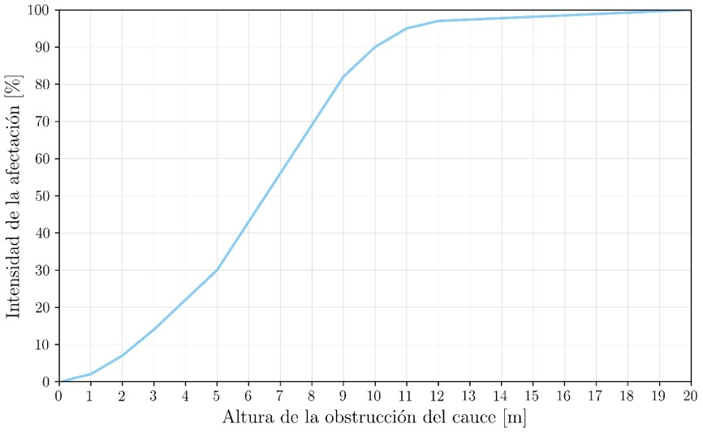{width="5.769995625546807in" height="3.5507655293088365in"}

Figura 9. Ejemplo de curva de daño para la afectación de una quebrada.

Costos de los elementos expuestos
---------------------------------

La afectación a la corriente debido a la obstrucción se puede considerar de varias formas:

1.  Interrupción de los acueductos y otros suministros que se obtienen aguas abajo de la obstrucción.

2.  Afectación al ecosistema acuático.

3.  Posible generación de avalanchas debido al embalse que se genera por la obstrucción.

Como punto de partida para la evaluación del riesgo, se tiene la identificación de los elementos en riesgo (Elementos expuestos). En zonas rurales de Antioquia, los elementos físicos afectados por amenaza ante movimientos en masa pueden ser calificados dentro de cuatro categorías principales:

-   Edificaciones de diferentes categorías y tipologías.

-   Líneas Vitales: Sistemas de transportes (incluidas autopistas, vías de tren, aeropuertos y accesos), líneas de conducción de agua potable, alcantarillado, gas natural, redes de energía eléctrica.

-   Zonas de bosques.

-   Cultivos arbustivos, cafetales y frutales.

-   Pastizales ganaderos.

En este caso, no se incluye el efecto de los elementos físicos sobre la población, excluyendo edificaciones.

Los costos se determinaron para cada celda de 30 m en que fue dividida la zona de estudio, considerando la proporción de elementos expuestos existentes en ella. Con base en estas áreas y usando el método de las estimativas puntuales, se determinó el valor medio del costo de cada celda y la desviación estándar de ese costo considerando para ello una distribución triangular de los costos usando la siguiente ecuación:

$C_{text{celda}} = C_{text{vias}} + C_{text{zv}} + C_{text{const}}$ (8)

Donde *C~celda~* es el costo total de la celda ($), *C~vias~* es el costo de las vías ($) que se obtiene como el costo de las vías por el área de vías en la celda, *C~zv~* es el costo de las zonas verdes que se obtiene como el costo de las zonas verdes por el área de zonas verdes en la celda ($) y *C~const~* es el costo de las construcciones ($).

Riesgo
------

El riesgo se calcula en términos de las pérdidas económicas que pueden ser generadas en la corriente de agua debido a los movimientos en masa, de acuerdo a la ecuación:

$R = TPF  times  I  times C_{text{celda}}$ (9)

Se estimó el riesgo en cada celda localizada sobre la corriente de agua en las condiciones actuales. En la Figura 10 se presenta la forma de cálculo de un índice de riesgo (*R*), obtenido como el producto de la probabilidad anual de falla (*PAF*), y la pérdida económica potencial (*PEP*) derivada de la vulnerabilidad de un cauce en términos de la intensidad y de la valoración económica del tipo de cobertura vegetal.

$R = PAF times PEP$ (10)

{width="6.153716097987751in" height="3.685819116360455in"}

Figura 10. Esquema metodología adoptada para la evaluación del riesgo

CASO DE APLICACIÓN
==================

Para el desarrollo y explicación de la metodología propuesta, se tomó como caso de estudio la cuenca del río San Juan. Esta cuenca presenta unas condiciones geomorfológicas, geológicas y climáticas que la hacen particularmente susceptible a movimientos en masa, como lo demuestra la información existente en las bases de datos. En específico, las corrientes de agua han causado grandes avenidas torrenciales, que a su vez han estado ligadas a la ocurrencia previa de movimientos en masa debidos a las lluvias. Debido a la complejidad de cada proceso, la amenaza por movimiento en masa se determinó para la totalidad de la cuenca, mientras que la vulnerabilidad y el riesgo se determinaron en la subcuenca de la quebrada La Liboriana en jurisdicción del municipio de Salgar, la cual se encuentra bien documentada y facilitó el proceso de validación de los resultados obtenidos con el modelo propuesto.

+--------------------------------------------------------------------------------------------------------------------------------------------------------------------------------------------------------------------------------------------------------------------------------------------------------------------------------------------------------------------------------------------------------------------------------------------------------------------------------------------------------------------------------------------------+
| Caja 4. Cuenca río San Juan                                                                                                                                                                                                                                                                                                                                                                                                                                                                                                                  |
|                                                                                                                                                                                                                                                                                                                                                                                                                                                                                                                                                  |
| La cuenca del rio San Juan se localiza en la vertiente oriental de la cordillera occidental de los Andes colombianos. El relieve es montañoso con pendientes fuertes. Abarca tierras en las márgenes del Río Cauca y es la más cafetera del departamento de Antioquia. También existen cultivos de caña de azúcar, frutales, plátano y algunas áreas se dedican a la ganadería. La cuenca del Río San Juan se extiende desde el nacimiento del rio en el nudo Paramillo (3000 m.s.n.m) y la desembocadura en el Río Cauca (1000 m.s.n.m) [37]. |
+--------------------------------------------------------------------------------------------------------------------------------------------------------------------------------------------------------------------------------------------------------------------------------------------------------------------------------------------------------------------------------------------------------------------------------------------------------------------------------------------------------------------------------------------------+

{width="5.756895231846019in" height="5.560318241469816in"}

Figura 11. Localización del área en estudio (Cuenca río San Juan).

Para la aplicación de la metodología propuesta se tienen las siguientes consideraciones:

-   El tamaño de las celdas de análisis es: 30 m (cuadradas).

-   Los movimientos en masa probables en la zona tienen espesores del orden de 2 m.

-   Tipo de movimiento en masa: Movimiento en masa lento (descartados movimientos con desprendimientos de roca o tipo avalanchas).

De acuerdo a lo planteado mediante la Ecuación 1, es posible obtener el riesgo asociado a los daños que puede llegar a ocasionar un movimiento en masa accionado por un evento sísmico en las corrientes de agua de la zona de estudio. Para ello, fue preciso determinar un índice de riesgo (*R*), obtenido como el producto de la probabilidad anual de falla (*PAF*) para un periodo de retorno de la lluvia detonante de 20 años, y la pérdida económica potencial (*PEP*) derivada de la vulnerabilidad de un cauce en términos de la intensidad y de los costos suscitados por un eventual desastre a partir de los valores promedio de cada celda obtenidos a partir de precios comerciales y registros catastrales según el tipo de cobertura del suelo, y una valoración de la infraestructura. La información utilizada para este trabajo se obtuvo de las siguientes fuentes secundarias:

-   Cartografía Base: Base de datos suministrada por la Corporación Regional CORANTIOQUIA.

-   Precipitación: Registros diarios de lluvia obtenidos de la base de datos CHIRPS (US Geological Survey).

-   Unidades Geológicas: Corporación Regional CORANTIOQUIA, IGAC--Ingeominas. Planchas 1:25,000.

-   Parámetros geotécnicos: Bases de datos de los proyectos de la Universidad de Medellín.

CONFLICTO DE INTERESES

Los autores no declaran conflicto de intereses

AGRADECIMIENTOS {#agradecimientos-3 .list-paragraph}
===============

Los autores agradecen a la Universidad de Medellín y a Corantioquia por el apoyo en la realización de la investigación que dio pie a este estudio.

IDENTIFICACIÓN DEL AUTOR {#identificación-del-autor-3 .list-paragraph}
========================

Cesar Hidalgo <https://orcid.org/0000-0002-1796-8945>

Johnny Vega <https://orcid.org/0000-0002-0662-7213>

BIBLIOGRAFÍA

1.  Jibson, R. W., Harp, E. L., & Michael, J. A. (1998). A method for producing digital probabilistic seismic landslide hazard maps. *Engineering Geology*, 58, 271-289. <https://doi.org/10.1016/S0013-7952(00)00039-9>

2.  Jaiswal, P., & Van Westen, C. J. (2009). Estimating temporal probability for landslide initiation along transportation routes based on rainfall thresholds. *Geomorphology*, 112, 96-105. <https://doi.org/10.1016/j.geomorph.2009.05.008>

3.  Jaiswal, P., Van Westen, C., & Jetten, V. (2010). Quantitative landslide hazard assessment along a transportation corridor in southern India. *Engineering Geology*, 116, 236-250. <https://doi.org/10.1016/j.enggeo.2010.09.005>

4.  AMVA. (2009). *Amenaza, vulnerabilidad y riesgo por movimientos en masa, avenidas torrenciales e inundaciones en el Valle de Aburrá*. Formulación de propuestas de gestión. Medellín.

5.  Hidalgo, C. A., Vega, J. A., Assis, A. P., & Villarraga, M. R. (2012). Estimation of sliding threat in linear projects: roads in residual soils (Spanish). *Memorias del IV Simposio Panamericano de Deslizamientos*. Paipa: Sociedad Colombiana de Geotecnia.

6.  Hidalgo, C., & Vega, J. (2014). Estimación de la amenaza por deslizamientos detonados por sismos y lluvia (Valle de Aburrá-Colombia). *Revista EIA*, 11(22), 3-117.

7.  Zêrere, J., García, R., Oliveira, S., & Reis , E. (2008). Probabilistic landslide risk analysis considering direct costs in the area north of Lisbon (Portugal). *Geomorphology* (94), 467--495. <https://doi.org/10.1016/j.geomorph.2006.10.040>

8.  Remondo, J., Bonachea, J., & Cendrero, A. (2008). Quantitative landslide risk assessment and mapping on the basis of recent occurrences. *Geomorphology*, 98(3-4), 496-507. <https://doi.org/10.1016/j.geomorph.2006.10.041>

9.  Godt, J. W., Sener, B., Verdin, K. L., Wald, D. J., Harp, E. L., & Jibson, R. W. (2008). Rapid assessment earthquake-induced landsliding. *Proceedings of the First World Landslide Forum*, November, Parallel Sessions Volume, International Program on. Tokyo, Japan.

10. Vega, J. A. (2013). *Estimación del riesgo por deslizamientos de laderas generados por eventos sísmicos en la ciudad de Medellín usando herramientas de la Geomática. Caso aplicado a edificaciones urbanas*. La Plata, Argentina: Facultad de Ingeniería y Ciencias Astronómicas y Geofísicas de la Universidad Nacional de La Plata.

11. Vega, J. A., & Hidalgo, C. A. (2017). Risk Assessment of Earthquake-Induced Landslides in Urban Zones. En M. Mikoš, B. Tiwari, Y. Yin & K. Sassa (Eds.), *Advancing Culture of Living with Landslide -- Advances in Landslide Science,* (pp. 953-963), Volume 2. Springer International Publishing. [https://doi:10.1007/978-3-319-53498-5](https://doi:10.1007/978-3-319-53498-5)

12. Dragicevic, S., Lai, T., & Balram, S. (2015). GIS-based multicriteria evaluation with multiscale analysis to characterize urban landslide susceptibility in data-scarce environments. *Habitat International*, 45, 114-125. <https://doi.org/10.1016/j.habitatint.2014.06.031>

13. Saboya, F., Alves, M., & Pinto, W. (2006). Assessment of failure susceptibility of soil slopes using fuzzy logic. *Engineering Geology*, 86, 211--224. <https://doi.org/10.1016/j.enggeo.2006.05.001>

14. Sepulveda, S. A., & Petley, D. N. (2015). Regional trends and controlling factors of fatal landslides in Latin America and the Caribbean. *Natural Hazards and Earth Systems Science*, 15, 1821--1833. <https://doi.org/10.5194/nhess-15-1821-2015>

15. Isaza-Restrepo, P. A., Martinez, H. E., & Hidalgo, C. A. (April de 2016). Methodology for quantitative landslide risk analysis in residential projects. Habitat International, 53, 403-412. https://doi.org/10.1016/j.habitatint.2015.12.012

16. Klose, M. (2015). *Landslide Databases as Tools for Integrated Assessment of Landslide Risk*. Switzerland: Springer, p. 156. <https://doi.org/10.1007/978-3-319-20403-1>

17. Bryant, E. A., Head, L., & Morrison, R. J. (2005). Planning for natural hazards-how can we mitigate the impacts. En R. J. Morrison, S. Quin, & E. A. Bryant (Eds.), *Proceedings of a symposium Planning for natural hazards-how can we mitigate the impacts,* (pp. 1-21). Wollongong: GeoQuEST Research Centre and School of Earth and Environmental Sciences, University of Wollongong.

18. Chowdhury, R., Flentje, P., & Bhattacharya, G. (2010). *Geotechnical Slope Analysis*. London, England: Taylor & Francis, p. 737. <https://doi.org/10.1201/9780203864203-f>

19. Aristizabal, E., & Gomez, J. (2007). Inventario de emergências e desastres no vale de Aburrá originados por fenómenos naturais e antrópicos no período 1880-2007. *Revista Gestión y Ambiente,* 10(2), 17-30.

20. Isaza, P. (2011). *Avaliação do Risco Aceitável por Escorregamentos de Encostas em Regiões Tropicais Montanhosas: Caso de Aplicação, Medellín - Colômbia*. Dissertação de Mestrado. Brasilia: Departamento de Engenharia Civil, Universidade de Brasilia.

21. Vélez, M., Hoyos, F., Vélez, J., & Gómez, S. (1993). A methodology for the study of the hydrogeologic parameters in landslides. *3a Conferencia Latinoamericana de Hidrogeología Urbana*, 349 -- 359. Cartagena.

22. SGC. (2017). *Las amenazas por movimientos en masa de Colombia. Una visión a escala 1:100.000.* Bogotá: Servicio Geológico Colombiano, Bogotá: Servicio Geológico Colombiano, 2017, p. 319.

23. SGC. (2015). *Guía metodológica para estudios de amenaza, vulnerabilidad y riesgo por movimientos en masa*. Bogotá: Servicio Geológico Colombiano, 2015, 179 p.

24. Hidalgo, C. A. (2013). *Incertezas, Vulnerabilidade e Avaliação de Risco Devido a Deslizamento em Estradas, Brasilia*. Tesis de doctorado Departamento de Engeniería Civil y Ambiental, Universidad de Brasilia, 2013, 250 p.

25. DAPARD. (2015). *Plan Departamental para La Gestión del Riesgo de Desastres. Gobernación de Antioquia*. Medellín: Departamento Administrativo del Sistema de Prevención, Atención y Recuperación de Desastres en Antioquia.

26. GAIA. (2015). *Actualización de la Línea Base de Gestión del Riesgo y Mapa de Susceptibilidad al Cambio Climático 2014-2015 en la Jurisdicción de Corantioquia*. Corantioquia. Medellín: Corantioquia.

27. Vega, J. A., & Hidalgo, C. A. (2016). Quantitative risk assessment of landslides triggered by earthquakes and rainfall based on direct costs of urban buildings. *Geomorphology*, 273, 217--235. <https://doi.org/10.1016/j.geomorph.2016.07.032>

28. Ruiz-Vásquez, D., & Aristizábal, E. (2018). Landslide susceptibility assessment in mountainous and tropical scarce-data regions using remote sensing data: A case study in the Colombian Andes. *Geophysical Research Abstracts*, 20, EGU2018-3408

29. Fawcett, T. (2006). An introduction to ROC analysis. Pattern Recognition Letters, 27, 861--874. [https://doi:10.1016/j.patrec.2005.10.010](https://doi:10.1016/j.patrec.2005.10.010)

30. Pourghasemi, H. R., Jirandeh, A. G., Pradhan, B., Xu, C., Gokceoglu, C. (2013). Landslide susceptibility mapping using support vector machine and GIS at the Golestan Province, Iran. *Journal of Earth System Science*, 122, 2, 349--369. [https://doi:10.1007/s12040-013-0282-2](https://doi:10.1007/s12040-013-0282-2)

31. Dikshit, A., Satyam, N., Pradhan, B. (2019). Estimation of Rainfall‑Induced Landslides Using the TRIGRS Model. *Earth Systems and Environment*, 3, 575--584. <https://doi.org/10.1007/s41748-019-00125-w>

32. Pradhan, A. M. S., Kim, Y. T. (2016). Evaluation of a combined spatial multi-criteria evaluation model and deterministic model for landslide susceptibility mapping. *Catena* 140, 125--139. [https://doi.org/10.1016/j.catena.2016.01.022](%20https://doi.org/10.1016/j.catena.2016.01.022)

33. Kritikos, T., Davies, T. (2015). Assessment of rainfall-generated shallow landslide/debris-flow susceptibility and runout using a GIS-based approach: application to western Southern Alps of New Zealand. *Landslides*, 12, 1051--1075. <https://doi.org/10.1007/s10346-014-0533-6>

34. Chen, W., Pourghasemib, H. R., Kornejadyc, A., Zhanga, N. (2017). Landslide spatial modeling: Introducing new ensembles of ANN, MaxEnt, and SVM machine learning techniques. *Geoderma*, 305, 314--327. <https://doi.org/10.1016/j.geoderma.2017.06.020>

35. Hidalgo, C.A., Vega, J.A., & Parra, M. (2017). Effect of the rainfall infiltration processes on the landslide hazard assessment of unsaturated soils in tropical mountainous regions. Engineering and Mathematical Topics in Rainfall, T. V. V. Hromadka II y P. Rao, Edits. Londres, Intechopen, pp. <https://doi.org/10.5772/intechopen.70821>

36. Safeland. (2011). D2.5: Physical vulnerability of elements at risk to landslides: Methodology for evaluation, fragility curves and damage states for buildings and lifelines. *SafeLand Living with landslide risk in Europe: Assessment, effects of global change, and risk management strategies*. 195 p.

37. Marin, A. L., Toro, L. J., & Uribe, S. I. (2008). Conectividad estructural del paisaje cafetero en la cuenca alta del rio San Juan, Suroeste Antioqueño, Colombia*. Boletín de Ciencias de la Tierra*, (23), 43-54.

11

[]{#_Toc47894934 .anchor}De la percepción de la amenaza a su cuantificación. Caso de estudio: desbordamiento del río Unete en Aguazul, Casanare, Colombia

Rafael Muñoz Quintero^1*^, Daniela Jácome Hernández^1^, Alejandro Franco Rojas^1^ & Alexander Padilla González^1^

^1^Departamento de Ingeniería Civil, Universidad de La Salle. Carrera 2 No. 10-70, Bogotá, Colombia

*Autor de contacto: Rafael Muñoz Quintero. Departamento de Ingeniería Civil, Universidad de La Salle. Carrera 2 No. 10-70, Bogotá, Colombia. Correo-e: rmunoz02@unisalle.edu.co

Resumen

Históricamente las crecientes del río Unete han afectado el área urbana de Aguazul (Casanare) impactando su población, economía e infraestructura, condición que se agrava tanto por el desarrollo de barrios sobre geoformas susceptibles a inundaciones (caños y vegas), como por el desconocimiento de sus habitantes a la amenaza a la cual se encuentran expuestos, por cuanto, la percepción suele construirse con antecedentes de los eventos ocurridos en los últimos años, caracterizados por alta frecuencia y poca magnitud, siendo preciso contrastar dicha percepción con registros históricos y modelos hidráulicos. Al igual que, en muchos otros municipios, en Aguazul se han construido estructuras de mitigación, que, aunque aportan a reducir los efectos de las crecientes, tienen una eficiencia limitada y persiste la amenaza sobre los barrios y las obras públicas, e incluso, se desconocen los criterios de diseño. Lo anterior, conduce a la necesidad de cuantificar dicha amenaza aun en condiciones de escasez de información, para esto se realizó un modelo hidráulico 2D en Iber para periodos de retorno de hasta 200 años, demandando, entre otros insumos, el levantamiento topográfico y cálculo del caudal para cada periodo de retorno. Como resultado se obtuvieron mapas que indican el grado de amenaza por inundación en el casco urbano de Aguazul debido al desbordamiento del río Unete, correspondiendo a 72.94% a amenaza alta, 13.92% media y 13.13% baja, afectando los barrios Porvenir, Las Vegas, Villaluz y Los Esteros, así como infraestructura pública como un colegio y el matadero municipal, demostrando que los sistemas de contención existentes resultan insuficientes para contrarrestar crecientes con periodo de retorno superiores a 10 años, hallazgos que permiten formular nuevas obras de mitigación y estrategias para una ocupación del territorio más segura y planificada.

Palabras clave

Amenaza, modelación hidráulica, inundaciones, Aguazul, Iber 2D

From hazard´s perception to its quantification. Case study: Overflow of the Unete river in Aguazul, Casanare, Colombia

Abstract

Historically, the floods of the Unete River have affected the urban area of Aguazul (Casanare), impacting its population, economy and infrastructure, a condition that is aggravated both by the development of neighborhoods on geo forms susceptible to floods (pipes and vegas), as well as by the lack of knowledge of its inhabitants to the threat to which they are exposed, since, perception usually is constructed with a history of the events that have occurred in recent years, characterized by high frequency and low magnitude, it is necessary to contrast this perception with historical records and hydraulic models. As in many other municipalities, mitigation structures have been built in Aguazul, which, although they contribute to reducing the effects of floods, have limited efficiency, and the threat to neighborhoods and public works persists, and even unknown The design criteria. This leads to the need to quantify this threat even in conditions of information shortages; for this, a 2D hydraulic model was carried out in Iber for return periods of up to 200 years, demanding, among other inputs, the topographic survey and flow calculation for each return period. As a result, maps were obtained indicating the degree of flood threat in the urban area of Aguazul due to the overflow of the Unete River, corresponding to 72.94% of high, 13.92% average and 13.13% low threat, affecting the neighborhoods Porvenir, Las Vegas, Villaluz and Los Esteros, as well as public infrastructure such as a school and the municipal slaughterhouse, demonstrating that the existing containment systems are insufficient to offset floods with a return period of more than 10 years, findings that allow formulating new mitigation works and strategies for occupation of the safest and most planned territory.

Keywords

Threat, hydraulic modeling, flooding, Aguazul, Iber 2D

INTRODUCCIÓN
============

En Colombia, la combinación entre las cordilleras y altas precipitaciones dan lugar a un alto nivel de amenaza por inundaciones y avenidas torrenciales, afectando especialmente algunos municipios y ciudades localizadas en zonas de piedemonte. Estas amenazas ocurren en Aguazul, en el departamento de Casanare, donde producto del desbordamiento del río Unete se registran frecuentes inundaciones sobre el área urbana que alberga alrededor de 29,000 habitantes.

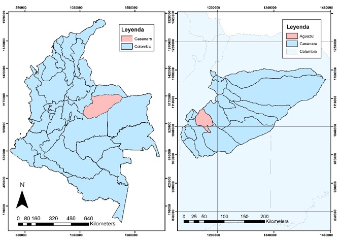{width="4.4548643919510065in" height="3.1496062992125986in"}

Figura *1*. Localización de Aguazul en el departamento de Casanare, Colombia.

+--------------------------------------------------------------------------------------------------------------------------------------------------------------------------------------------------------------------------------------------------------------------------------------------------------------------------------------------+
| Caja 1 1. Antecedentes                                                                                                                                                                                                                                                                                                                 |
|                                                                                                                                                                                                                                                                                                                                            |
| 1.  El 30 de noviembre del 2000 se cayó nuevamente el puente sobre el río Unete en la vía Boyacá Casanare. Este puente estaba en reparación hace más de tres meses cuando colapsó por acción del río [1].                                                                                                                                |
|                                                                                                                                                                                                                                                                                                                                            |
| 2.  El 17 de agosto de 2002 se presentó el desbordamiento del río Unete, inundando los barrios El Porvenir, Porvipaz, Villaluz, Seila, Los Esteros y Los Guaduales dejando por la fuerte corriente del río 645 familias damnificadas, 19 viviendas destrozadas y 20 viviendas afectadas [2].                                             |
|                                                                                                                                                                                                                                                                                                                                            |
| 3.  El 12 de septiembre de 2012 se presentó el desbordamiento del río Unete, afectando las veredas de Guadualito, Manoguia, San José del Bubuy, Vegana, Cachiza, Los Lirios, Bella Vista, Guaduales, Sabanales y el casco urbano además de siete vías principales, se registran 800 familias damnificadas y 160 viviendas afectadas [2]. |
|                                                                                                                                                                                                                                                                                                                                            |
| 4.  El 1 de septiembre de 2016, una avalancha del río Unete ocasionó la caída de la banca en el kilómetro 7 hacia el municipio de Pajarito en Boyacá. Dos viviendas también resultaron afectadas y los organismos de socorro tuvieron que rescatar a sus habitantes [3].                                                                 |
+--------------------------------------------------------------------------------------------------------------------------------------------------------------------------------------------------------------------------------------------------------------------------------------------------------------------------------------------+

Históricamente en Colombia, la principal amenaza hidrometereológica generadora de daños económicos y población afectada es la inundación [4], muestra de ello, es que el 28% del territorio está en alto potencial de inundación y el 8% en amenaza alta por movimientos en masa [5], como se demuestra con los casos de Mocoa (marzo 2017), Choachí (octubre 2018), Canal del Dique (diciembre 2010) y los continuos cierres de la vía Bogotá-Villavicencio.

+---------------------------------------------------------------------------------------------------------------------------------------------------------------------------------------------------------------------------------------------------------------------------------------------------------------------------------------------------------------------------------------------------------------------------------------------------------------------------------------------------------------------------------------------------------------------------------------------------------------------------------------------------------------------------------------------------------------------------------------------------+
| Cuadro 2. Antecedentes                                                                                                                                                                                                                                                                                                                                                                                                                                                                                                                                                                                                                                                                                                                        |
|                                                                                                                                                                                                                                                                                                                                                                                                                                                                                                                                                                                                                                                                                                                                                   |
| Los eventos geológicos ocasionan grandes pérdidas concentradas en un territorio y en un lapso relativamente corto de tiempo los fenómenos hidrometereológicos generan impactos más localizados, pero de alta frecuencia, lo cual de manera acumulativa significa pérdidas, incluso mayores a las asociadas a los eventos sísmicos y erupciones volcánicas. La posición de Colombia en la zona de confluencia intertropical hace que se presente un patrón de lluvias unimodal en las regiones Amazonía, Orinoquía y en la mayor parte del Caribe, y una distribución bimodal en la región Andina, en donde los valores extremos de precipitación y sequía se exacerban fuertemente por la influencia de los fenómenos de El Niño y La Niña [5]. |
+---------------------------------------------------------------------------------------------------------------------------------------------------------------------------------------------------------------------------------------------------------------------------------------------------------------------------------------------------------------------------------------------------------------------------------------------------------------------------------------------------------------------------------------------------------------------------------------------------------------------------------------------------------------------------------------------------------------------------------------------------+

Acorde con los antecedentes en el municipio de Aguazul, el esquema de ordenamiento territorial (EOT) en el mapa riesgos y amenazas delimita una zona con riesgo por inundación sin definir ni delimitar el nivel de amenaza (alto, medio o bajo) y sin una aparente correlación con las geoformas (Fig. 2). En el plan municipal de gestión de riesgos de desastres actualizado en el año 2012 se proponen medidas estructurales y no estructurales, incluyendo la reubicación de familias en alto riesgo, así como la delimitación de las zonas de expansión acorde con la zonificación de amenazas, aunque persiste la carencia de zonificación según el nivel de amenaza [6], razón por la cual se consideró pertinente mejorar el conocimiento de riesgo por inundación en el municipio mediante la modelación hidráulica y la construcción de mapas de inundación.

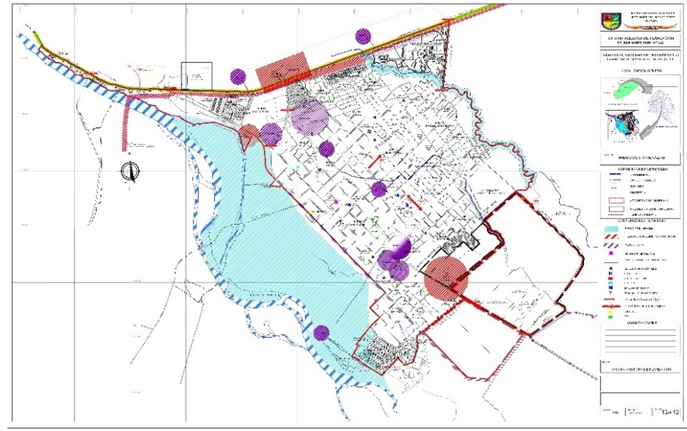{width="6.526491688538933in" height="4.095744750656168in"}

Figura *2.* Mapa de riesgos y amenazas del EOT de Aguazul.

Para zonificar el nivel de amenaza al cual se encuentra expuesta el área urbana delmunicipio de Aguazul, resulta pertinente realizar una modelación hidráulica bidimensional que permita simular el flujo hacia zonas inundables, como vegas y planicies aluviales, para lo cual Iber ofrece esquemas numéricos especialmente estables y robustos para simular flujos en cauces torrenciales y regímenes irregulares, donde predominan los flujos horizontales [7]. Sin embargo, las carencias en la información topográfica implicaron realizar el levantamiento sobre el lecho del río y su posterior complemento con un modelo de elevación digital, estrategia que permitió un mejor desempeño del modelo y a su vez constituye la principal limitación de este estudio. De igual forma, se combinan métodos tradicionales en estudios de gestión del riesgo con herramientas novedosas como son la construcción de mapas a partir de encuestas y el análisis multitemporal de fotografías aéreas.

MATERIALES Y MÉTODOS
====================

Este proyecto se desarrolló en tres etapas. La primera incluyó la toma de datos en campo (topografía, aforo líquido, encuestas, registro fotográfico y georreferenciación de estructuras hidráulicas). La segunda etapa comprendió el procesamiento de la información (topografía, cálculo de coeficiente de rugosidad de Manning, modelos de distribución de probabilidad de precipitación, construcción de hidrogramas, análisis de encuestas, entre otros) y el modelo hidráulico empleando el software Iber 2D (versión 2.4) que de acuerdo a análisis geomorfológicos, del tipo de flujo y a la información disponible, ofrece el mejor desempeño en la simulación 2D del nivel del agua para eventos de inundación en ríos de piedemonte y planicie de inundación [8]. Finalmente, se delimitaron y categorizaron las zonas de amenaza siguiendo los lineamientos de la UNGRD en la *Guía Metodológica Para la Elaboración de Planes Departamentales para la Gestión del Riesgo* [9].

{width="6.382979002624672in" height="5.37380249343832in"}

Figura 3. Diagrama de flujo para la cuantificación de la amenaza.

Gracias a las actuales herramientas SIG, los resultados de la modelización numérica se pueden combinar con datos georreferenciados para realizar una cuantificación sistemática del riesgo de inundación [9]. Iber 2D se desarrolló por el Instituto Flumen y GEAMA, el cual aporta mayor precisión respecto a un software de modelación hidráulica en una dimensión debido a que permite construir la topografía mediante una malla no estructurada de elementos finitos [10], tiene en cuenta la dirección del vector de velocidad, resuelve las ecuaciones de Saint Vennat 2D que son la expresión matemática de las leyes de conservación de masa y de la cantidad de movimiento [11] y predice de forma más precisa las zonas de inundación y su profundidad. Adicionalmente, es de uso libre (www.iberaula.es), ofrece documentación adicional y soporte a través de un foro de discusión y cursos de formación [7].

Tabla 1. Calificación de la frecuencia. La frecuencia determina cada cuanto se presentan eventos amenazantes a partir de la cronología de eventos ocurridos. UNGRD, 2012, p. 28.

  Descripción                                                                              Valor   Calificación
  -------------------------------------------------------------------------------------------- ----------- ------------------
  Evento que se presenta una vez aproximadamente cada 10 años.                                 3           Alta
  Evento que se presenta por lo menos una vez en un período de tiempo aproximado de 50 años.   2           Media
  Evento que se presenta al menos una vez en un período de tiempo aproximado a 100 años.       1           Baja
                                                                                                           

Para el río Unete la modelación se realizó en dos dimensiones sin considerar flujos hiperconcentrados, por cuanto no se evidencian geoformas asociadas a este tipo de flujos, como son conos de deyección y abanicos aluviales. Como resultado de la modelación hidráulica se obtuvieron mapas de intensidad de inundación para distintos periodos de retorno, que son un insumo indispensable para definir el nivel de amenaza como la sumatoria de frecuencia, territorio afectado e intensidad. Cada indicador se evalúa en escala de 1 a 3, de tal forma que la sumatoria fluctúa entre 3 (amenaza mínima) y 9 (amenaza máxima) [9]. Para evaluar la intensidad de la inundación en términos del territorio afectado, se adopta como 100% la mancha de inundación con período de retorno de 200 años.

Tabla 2. Porcentaje y calificación del territorio afectado. Fuente: UNGRD, 2012, p. 29.

+----------------------------------------------------------------+-------------+--------------------+
| > Descripción                                              | > Valor | > Calificación |
+================================================================+=============+====================+
| > Más del 80% del territorio afectado por la inundación        | > 3         | > Alta             |
+----------------------------------------------------------------+-------------+--------------------+
| > Entre el 50% y 80% del territorio afectado por la inundación | > 2         | > Media            |
+----------------------------------------------------------------+-------------+--------------------+
| > Menos del 50% del territorio afectado por la inundación      | > 1         | > Baja             |
+----------------------------------------------------------------+-------------+--------------------+

La intensidad representa el nivel potencial de daños materiales y de pérdida de vidas humanas, valorada igualmente en escala de 1 a 3, según la profundidad y velocidad de flujo, siendo conveniente diferenciar entre inundaciones estáticas y dinámicas [12]. Si la inundación es estática, la velocidad del flujo es inferior a 0.50 m/s y la variable a tener en cuenta es la profundidad; mientras que si es dinámica, se tendrá en cuenta el producto de la velocidad por la profundidad de flujo, y es este el criterio adoptado en Aguazul, para lo cual los resultados de la simulación en Iber 2D se exportaron al software Arcgis y se reclasificaron estableciendo tres rangos: profundidad baja (0 -- 1.0 m), profundidad media (1.0 -- 1.5 m) y profundidad alta (1.5 m -- profundidad máxima).

Tabla 3. Criterios valoración intensidad de inundación. Fuente: Instituto Nicaragüense de Estudios Territoriales, 2005, p. 16.

+-------------------------+-----------+------------------------------------------------------------+----------------------------------------------------------------+
| Nivel de intensidad | Valor | Profundidad del flujo (H) (m) (inundaciones estáticas) | Profundidad × vol. de flujo (m/s) (inundaciones dinámicas) |
+=========================+===========+============================================================+================================================================+
| > Alto                  | 3         | H ≥ 1.0                                                    | > H*V ≥ 1.5                                                   |
+-------------------------+-----------+------------------------------------------------------------+----------------------------------------------------------------+
| > Medio                 | 2         | 0.5 ≤ H < 1.0                                             | > 0.5 ≤ H*V < 1.5                                            |
+-------------------------+-----------+------------------------------------------------------------+----------------------------------------------------------------+
| > Bajo                  | 1         | 0.25 ≤ H < 0.5                                            | > H*V < 0.5 y H ≥ 0.25 m                                     |
+-------------------------+-----------+------------------------------------------------------------+----------------------------------------------------------------+

Para los mapas de velocidad se siguió un proceso similar para cada uno de los periodos de retorno (200 años, 50 años, 10 años y 1.3 años), los cuales se exportaron y reclasificaron en el software Arcgis estableciendo tres rangos: velocidad baja (0 -- 1.0 m/s), velocidad (1.0 -- 1.5 m/s) y velocidad alta (1.5m/s -- velocidad máxima). Finalmente, la amenaza es el resultado de sumar frecuencia, territorio afectado e intensidad, cuyo resultado se reclasifica en tres intervalos.

Tabla 4. Calificación de amenazas. Fuente: UNGRD, 2012, p. 29.

+-----------------+----------------------------------+
| > Intervalo | > Calificación de la amenaza |
+=================+==================================+
| > 7-9           | > Alta                           |
+-----------------+----------------------------------+
| > 4-6           | > Media                          |
+-----------------+----------------------------------+
| > 1-3           | > Baja                           |
+-----------------+----------------------------------+

Previo a la modelación hidráulica, se realizó una visita de campo donde se realizó el aforo líquido y levantamiento topográfico. Esta información se utilizó para calcular el coeficiente de rugosidad de Manning, definir la geometría del modelo y sus condiciones de control.

{width="5.180555555555555in" height="2.673611111111111in"}

Figura 4. Trabajo de batimetría efectuado en el río Unete en enero de 2018 (izq) y (der).

En el sitio del aforo se obtuvo una pendiente del lecho del río (S) del 3.0%, área (A) de 46.17 m^2^ y perímetro (P) de 90.74 m. Seguidamente se calculó el caudal (Q) por el método área -- velocidad, para ello, la sección transversal se dividió en 18 secciones, en cada una se registra el área y la velocidad, cuyo producto es el caudal, que en este caso fue de 107.09 m^3^/s, caudal aforado en noviembre de 2017 tras precipitaciones la noche anterior.

{width="6.50755249343832in" height="2.414893919510061in"}

Figura 5. Aforo líquido del río Unete realizado el 04-11-2017.

Con estos valores, se llegó a un coeficiente de rugosidad de Manning (n) de 0.048, que concuerda con la clasificación dada en la literatura técnica [13], cuya descripción corresponde a un cauce con presencia de gravas, cantos rodados y algunas rocas grandes.

$n =  frac{1}{Q}*frac{A^{frac{5}{3}}}{P^{frac{2}{3}}}*sqrt{S}$ $n =  frac{1}{107.09}*frac{{46.17}^{frac{5}{3}}}{{90.74}^{frac{2}{3}}}*sqrt{0.03} = 0.048$ (1)

En la Figura 6 se observa el lecho del río Unete, incluyendo una barra de sedimento compuesta por arenas, gravas y cantos rodados, así como, espolones y una estructura de contención construida con rocas y hexápodos posicionada sobre la margen izquierda del río y una terraza en la margen derecha.

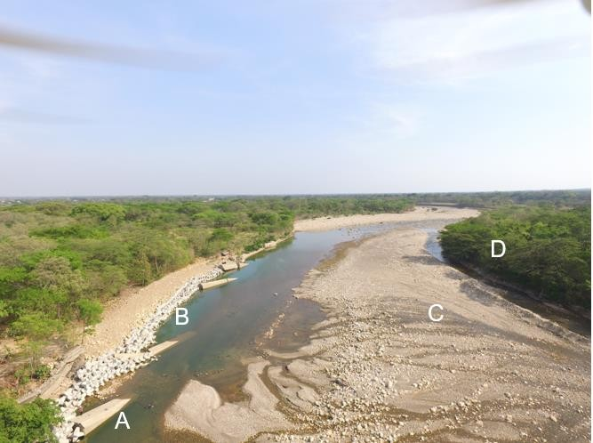{width="4.374027777777778in" height="3.265971128608924in"}

Figura 6. Vista panorámica del río Unete tomada con drone. Trabajo de campo efectuado en el río Unete en enero de 2018. (A) Espolones en concreto, (B) Estructura de contención con hexápodos, (C) Barra de sedimentos y (D) Terraza.

Las geoformas identificadas en el río Unete en proximidad al área urbana de Aguazul, incluyen barras de sedimento, vega, terrazas de distintos niveles y planicie de inundación (Fig. 7), su identificación y delimitación permite establecer la susceptibilidad del terreno ante el desbordamiento del río.

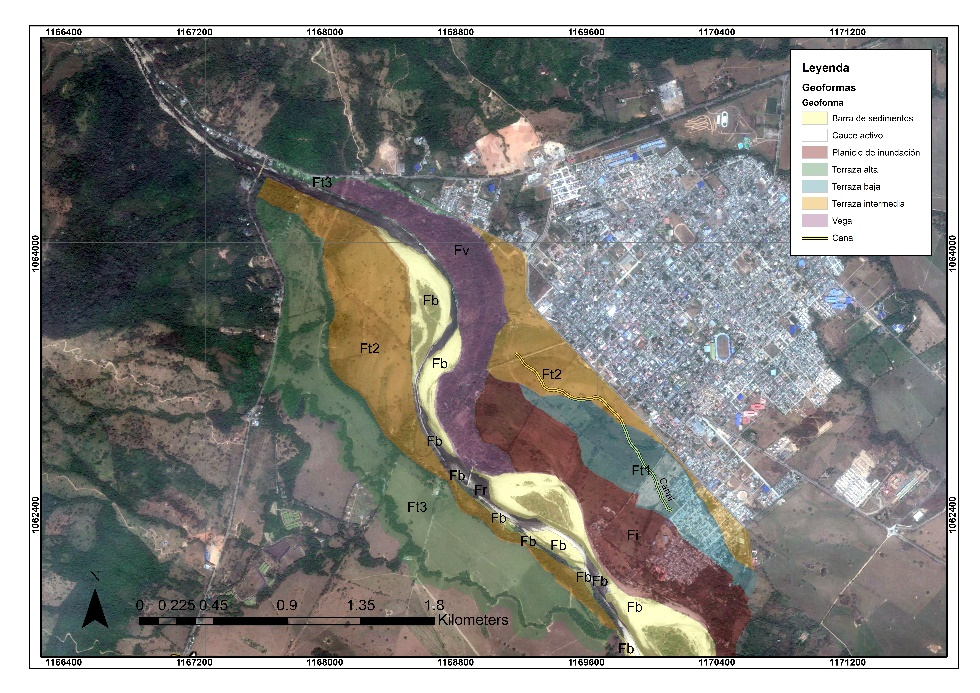{width="6.592831364829396in" height="4.66115813648294in"}

Figura *7*. Geoformas río Unete.

La susceptibilidad hace referencia a la facilidad con que un fenómeno puede ocurrir sobre la base de las condiciones locales del terreno, en este caso la susceptibilidad es una propiedad del terreno que indica qué tan favorables son las condiciones de éste, para que pueda ocurrir una inundación, en función de las geoformas, que son indicador del tipo de material, origen, granulometría y edad del depósito, condición que es validada con el análisis de amenaza.

Tabla 5. Susceptibilidad de inundación según geoformas.

+--------------------------------------+---------+--------------------------------------------------------------------------------------------------------------------------------------------------------------------------------------------------------------+-----------------+
| Geoforma                             | Símbolo | Tipo                                                                                                                                                                                                         | Susceptibilidad |
+======================================+=========+==============================================================================================================================================================================================================+=================+
| > Cauce activo                       | Fr      | Depósitos aluviales conformado por suelo transportado, con tamaño desde arenas hasta bloques                                                                                                                 | Alta            |
+--------------------------------------+---------+--------------------------------------------------------------------------------------------------------------------------------------------------------------------------------------------------------------+-----------------+
| > Vega aluvial                       | Fv      | Depósitos aluviales conformado por suelo transportado subreciente, con tamaño desde limos hasta arenas, inundado periódicamente                                                                              | Alta            |
+--------------------------------------+---------+--------------------------------------------------------------------------------------------------------------------------------------------------------------------------------------------------------------+-----------------+
| > Planicie de inundación             | Fi      | Depósitos aluviales conformado por suelo transportado, matriz soportados con arenolimosa, afectados por inundaciones periódicas y/o excepcionales                                                            | Alta            |
+--------------------------------------+---------+--------------------------------------------------------------------------------------------------------------------------------------------------------------------------------------------------------------+-----------------+
| > Barra de sedimento                 | Fb      | Depósitos aluviales conformado por suelo transportado reciente, con tamaño desde gravas hasta arenas, generalmente inestable, que bajo ciertas condiciones puede llegar a ser estabilizada por la vegetación | Alta            |
+--------------------------------------+---------+--------------------------------------------------------------------------------------------------------------------------------------------------------------------------------------------------------------+-----------------+
| > Terraza de acumulación baja        | Ft1     | Depósitos fluviotorrenciales transportado reciente con tamaño desde gravas hasta arenas, matriz soportados con arenolimosa                                                                                   | Media           |
+--------------------------------------+---------+--------------------------------------------------------------------------------------------------------------------------------------------------------------------------------------------------------------+-----------------+
| > Terraza de acumulación subreciente | Ft2     | Depósitos fluviotorrenciales matriz soportados con tamaño desde gravas hasta guijarros, la matriz es arenolimosa                                                                                             | Media           |
+--------------------------------------+---------+--------------------------------------------------------------------------------------------------------------------------------------------------------------------------------------------------------------+-----------------+
| > Terraza de acumulación alta        | Ft3     | Suelos transportados limoarenosos generados a partir de acumulación de materiales de lavado de laderas                                                                                                       | Baja            |
+--------------------------------------+---------+--------------------------------------------------------------------------------------------------------------------------------------------------------------------------------------------------------------+-----------------+
| > Escarpe de terraza                 | Fs      | Depósitos fluviotorrenciales matriz soportados con tamaño desde gravas hasta bloques, de formas redondeadas, la matriz es arenolimosa                                                                        | Media           |
+--------------------------------------+---------+--------------------------------------------------------------------------------------------------------------------------------------------------------------------------------------------------------------+-----------------+

Para la caracterización del régimen de precipitación se utilizaron los registros de 15 estaciones hidrológicas, entre ellas la estación Aguazul (3519530) posicionada en el piedemonte de la cordillera oriental, está última con registros continuos desde 1974 y un 10.7% de datos faltantes. Una vez la serie de datos suministrada por el IDEAM fue validada y completada, se obtuvo un régimen monomodal con periodo húmedo entre abril y octubre, precipitación anual de 2,796 mm, distribuidos en promedio en 158 días al año.

Tabla 6. Resumen registro de precipitación en la estación Aguazul (3519530) del IDEAM.

  Parámetro                               Ene    Feb    Mar     Abr     May     Jun     Jul     Ago     Sep     Oct     Nov     Dic    
  --------------------------------------- ------ ------ ------- ------- ------- ------- ------- ------- ------- ------- ------- ------ ------
  Precipitación media mensual (mm)        12.8   41.0   125.2   286.1   426.2   410.2   357.0   310.7   329.3   287.5   163.0   46.9   2796
  Precipitación mínima mensual (mm)       0      0      3.6     68.2    191.4   204     169.1   100.4   73.4    151.3   2.7     0      0
  Precipitación máxima en 24 horas (mm)   35     105    146     131     136.3   136.2   170.1   121.4   134.6   155     187     85     187
  Promedio No de días con precipitación   2      4      9       17      20      20      21      18      16      16      12      4      158

A nivel regional, la menor precipitación tiene lugar en la parte alta de la cuenca hacia la zona de páramo (1,313.7 mm en la estación Toquilla), mientras que las máximas precipitaciones se desarrollan en el piedemonte (4,806.1 mm en la estación Chameza), de tal forma que la cuenca del río Unete se posiciona en el corredor de máximas precipitaciones, con valores entre 2,500 y 3,500 mm anuales.

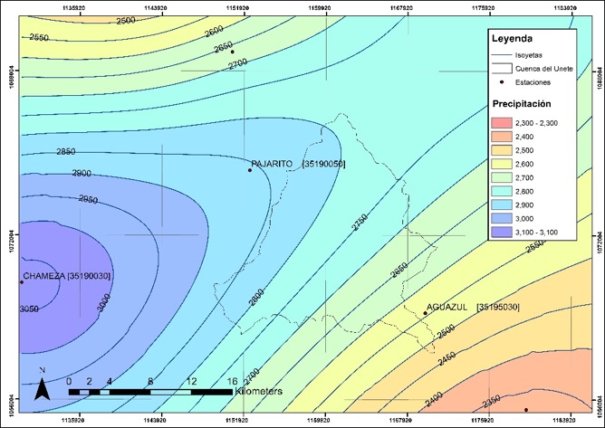{width="4.4548643919510065in" height="3.1496062992125986in"}

Figura *8*. Precipitación en la cuenca del Unete.

Los caudales para cada periodo de retorno (200 años, 50 años, 10 años y 1.3 años) se analizaron a partir de registros históricos de la estación limnigráfica Los Esteros (35197030) del IDEAM [14], con estos se realizaron las distribuciones de probabilidad tipo Gumbel y Pearson tipo III, obteniendo los respectivos caudales máximos y el cálculo de los hidrogramas. Así, el caudal de diseño para cada periodo de retorno fue de 361.78 m^3^/s (1.3 años), de 1,161.3 m^3^/s (10 años), de 1,645.65 m^3^/s (50 años) y de 2,054.43 m^3^/s (200 años) (Figura 9). {width="6.148937007874015in" height="2.6765638670166227in"}

{width="6.148937007874015in" height="2.6765638670166227in"}

Figura 9. Hidrograma del río Unete para distintos periodos de retorno; elaborado a partir de registros históricos de la estación Los Esteros (35197030) del IDEAM del año 2018

Por otro lado, se realizó el levantamiento de 13 secciones transversales del lecho del río Unete (Fig. 10), en el tramo próximo al área urbana de Aguazul, abarcando una longitud de 3.7 km sobre el eje del cauce. Cada sección incluyó las terrazas de margen derecha e izquierda, barras de sedimento intermedias, así como el canal principal y secundarios. En la Figura 11 se observar la sección número 6 del río Unete, con poca profundidad (1.05 m) respecto a su ancho.

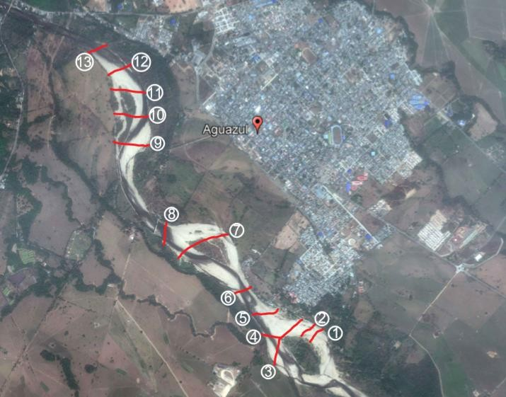{width="4.2444444444444445in" height="3.311111111111111in"}

Figura 10. Localización de secciones topográficas en el río Unete. Las secciones transversales obtenidas del río Unete se representaron en una imagen de Google Earth de 2018.

{width="6.346919291338582in" height="2.4680850831146106in"}

Figura 11. Sección transversal del río Unete. El perfil se utiliza como ejemplo para representar como es la vista transversal de las secciones tomadas.

Es importante mencionar que la metodología utilizada para la integración de las dos fuentes de información no es propia de este estudio. Se ha visto implementada en trabajos como Modelación Hidráulica 2D de Inundaciones en Regiones con Escasez de Datos. Tal es el caso del Delta del Río Ranchería, Riohacha-Colombia, donde se digitalizó la elevación disponible en Google Earth y está se integró con secciones levantadas en el río y datos topográficos, obteniendo una nube de puntos topográfica, la cual fue interpolada a una red de triángulos irregular, y finalmente, transformada en un Modelo Digital del Terreno [15].

Utilizando el software Arcgis, se integraron las 13 secciones transversales levantadas mediante topografía y el modelo de elevación digital (DEM), obteniendo el relieve y lecho del río requeridos para el modelo hidráulico, estas se combinaron a partir de la conversión de las dos fuentes de información a formato vectorial de puntos, estos fueron interpolados mediante la función merge y finalmente transformado a formato raster. El DEM fue descargado del satélite ALOS PALSAR [16], con tamaño de celda de 12.5 × 12.5 m.

En campo se realizó la georreferenciación con GPS de las estructuras hidráulicasexistentes en el cauce del río Unete para el control de procesos de socavación y de la dinámica fluvial, incluyendo gaviones o espigones de hexápodos en concreto, muros de contención y muros de gavión (Fig. 12). Igualmente se realizó el reconocimiento y georreferenciación de taludes con erosión en las dos márgenes del río.

{width="6.518899825021872in" height="2.7765955818022747in"}

Figura 12. Estructuras hidráulicas para control de socavación en el río Unete. Trabajo de campo de topografía e identificación de estructuras hidráulicas efectuado en el río Unete en enero de 2018 (izq) y (der).

La información anteriormente descrita se incorporó al modelo hidráulico en el software Iber. Se tuvieron en cuenta tres usos de suelo, con su respectivo coeficiente de rugosidad: 0.048 para el lecho calculado a partir de datos experimentales con la Ecuación 1 (0.15 para el área urbana y 0.05 para praderas y terrazas aluviales) estos últimos corresponden a valores predeterminados por el software Iber. Como condición inicial se adoptó una profundidad media de 0.55 m con base en el caudal medio de 27.57 m^3^/s, este último a partir de los registros históricos del IDEAM y lo observado durante las visitas de campo (Fig. 13)

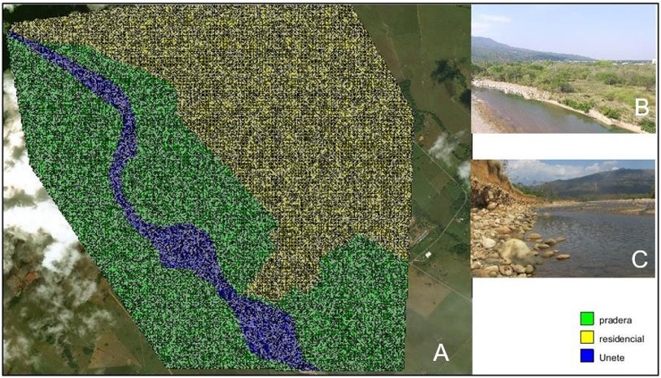{width="5.414583333333334in" height="3.091388888888889in"}

Figura 13. Usos de suelo en Iber. Los usos de suelo se determinaron a partir de las imágenes satelitales y las visitas realizadas a la zona del proyecto. (A) Usos de suelo identificados a partir de malla triangular no estructurada en el software Iber, (B) Terraza aluvial y (C) Material del lecho del río Unete.

Para realizar los mapas de amenaza por inundación se definió una reclasificación con el fin de ponderar la amenaza obtenida para cada periodo de retorno (10, 50 y 200 años) y generar un mapa definitivo, reflejando la situación del municipio Aguazul debido al desbordamiento del río Unete, siguiendo la metodología de la UNGRD [9]. Para cada periodo de retorno (10, 50 y 200 años) se evaluó la intensidad en escala de 1 a 3, la frecuencia asignando 3 para Tr de 10 años, 2 para Tr de 50 años y 1 para Tr de 200 años, y el área inundada tomando como 100% el área correspondiente a Tr 200 años. De esta manera, la suma de las tres variables alcanza un valor entre 3 y 9, cuyo resultado se clasifica en amenaza baja (1-3), media (4-6) y alta (7-9).

Para validación de resultados, se realizaron 40 encuestas a los habitantes de los barrios El Porvenir, Las Vegas y Los Esteros en el municipio de Aguazul, de forma que se contara con un periodo de residencia en el sector superior a 10 años, con el fin de garantizar el conocimiento del entorno, estrategia utilizada en estudios similares en la etapa de validación [8]. Las preguntas realizadas fueron: ¿Se le ha inundado su casa? ¿Se inundó el patio o la vivienda? ¿Cada cuánto se inunda? ¿Cuántas veces se ha inundado? ¿Hasta qué altura llego el agua? ¿Cuándo fue la última inundación? ¿Ha tenido pérdidas? ¿Qué tipo de pérdidas?

{width="6.569777996500437in" height="2.3829790026246718in"}

Figura 14. Registro fotográfico de encuestas. Las fotografías muestran evidencia de la realización de las encuestas, para este caso, en los barrios Los Esteros y Las Vegas (izq) y (der).

Los resultados de las encuestas se contrastaron con las geoformas del río, obteniendo un mapa de amenaza por inundación según la percepción de la comunidad. Finalmente, este mapa se comparó con los resultados de modelación hidráulica y con fotografías aéreas de distintos años, permitiendo validar e interpretar el mapa final de amenaza por inundación.

RESULTADOS Y DISCUSIÓN
======================

La modelación hidráulica considerando únicamente el DEM (12.5 × 12.5 metros) como el relieve, no permitió definir con claridad el lecho del río y arrojó el desbordamiento del río por toda el área urbana, lo cual no resulta razonable a partir de los antecedentes históricos ni con las geoformas identificadas que incluyeron terrazas altas en donde se posiciona la mayor parte del área urbana (Fig. 15).

{width="6.530555555555556in" height="4.622916666666667in"}

Figura 15. Resultados de profundidad para la modelación hidráulica considerando el modelo digital de elevación obtenido de ALOS PALSAR para un tiempo de retorno de 200 años. Los resultados sin topografía demuestran la importancia del trabajo de campo para el desarrollo de modelos hidráulicos en Iber 2D.

Una vez complementado el DEM con las secciones trasversales, la simulación hidráulica en Iber 2D arrojó mapas de profundidad de flujo donde se identifica con claridad el lecho del río y la inundación aumenta progresivamente conforme al periodo de retorno, al incluir las secciones transversales se permite que el modelo reconozca el lecho del río como zona de flujo preferente y se reduzca la afectación en las zonas de terraza y planicies de inundación, pasando de parches desconectados a zonas inundadas más compactas.

Se observa que, para el periodo de retorno de 1.3 años, correspondiente con la creciente anual (361.78 m^3^/s), se afecta un sector del barrio Las Vegas, coincidiendo con lo expuesto en las encuestas. El área afectada por las inundaciones aumenta progresivamente con el periodo de retorno, de tal forma que el río Unete alcanza en su lecho profundidades máximas de 12.28 m para un tiempo de retorno de 10 años (1,161.3 m^3^/s), 12.48 m para un tiempo de retorno de 50 años (1,645.65 m^3^/s) y 12.64m para un tiempo de retorno de 200 años (2,054.43 m^3^/s). Los barrios más afectados son: Los Esteros, Las Vegas, Villaluz y El Porvenir (Fig. 16).

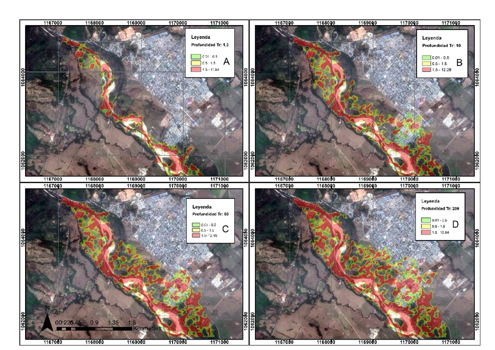{width="6.680873797025372in" height="4.723403324584427in"}

Figura 16. Mapa de profundidad de flujo en el río Unete según período de retorno.

En la figura anterior se observa que la profundidad y área inundada con la creciente con periodo de retorno de 1.3 años representa la condición anual del río Unete con una probabilidad de ocurrencia del 80% (Fig. 16A). La profundidad correspondiente a un periodo de retorno representa una probabilidad de ocurrencia del 10%, condición en la cual se afectan parcialmente de 10 años, los barrios Villaluz y Porvenir (Fig. 16B). La profundidad correspondiente a un periodo de retorno de 50 años, representa una probabilidad de ocurrencia del 2% afectando todo el barrio Porvenir (Fig. 16C). Por su parte, la profundidad correspondiente a un periodo de retorno de 200 años representa una probabilidad de ocurrencia de 0.5%, superando la rasante de la Calle 7 y afectando otros barrios y la estación de bomberos (Fig. 16D).

Lo anterior refleja la importancia del trabajo de campo, por cuanto al predominar una topografía plana y ante la ausencia de grandes cambios de nivel entre geoformas, el DEM no logra diferenciar entre el cauce principal, cauces secundarios, terrazas y planiciesinundables. No obstante, aún se observan parches de zonas inundadas aparentemente desconectadas, condición que no corresponde con la realidad y que en la simulación es resultado de la sobreestimación de la elevación en algunas celdas del DEM por la presencia de vegetación densa y cercas vivas [15], razón por la cual se hace preciso editar en formato vector las manchas de inundación uniendo zonas que según resultados de IBER están aisladas.

La velocidad máxima registrada para el periodo de retorno de 10 años fue de 7.19 m/s, para el periodo de retorno de 50 años fue de 7.65 m/s y para el periodo de retorno de 200 años fue de 8.1 m/s. La simulación demuestra que las zonas de mayor velocidad corresponden al lecho o cauce principal del río en el cual también se registraron las profundidades máximas, además se evidencia que las velocidades disminuyen en las zonas donde se desborda el río, esto debido al cambio del coeficiente de rugosidad de Manning puesto que la vegetación disminuye la velocidad del flujo significativamente (Fig. 17).

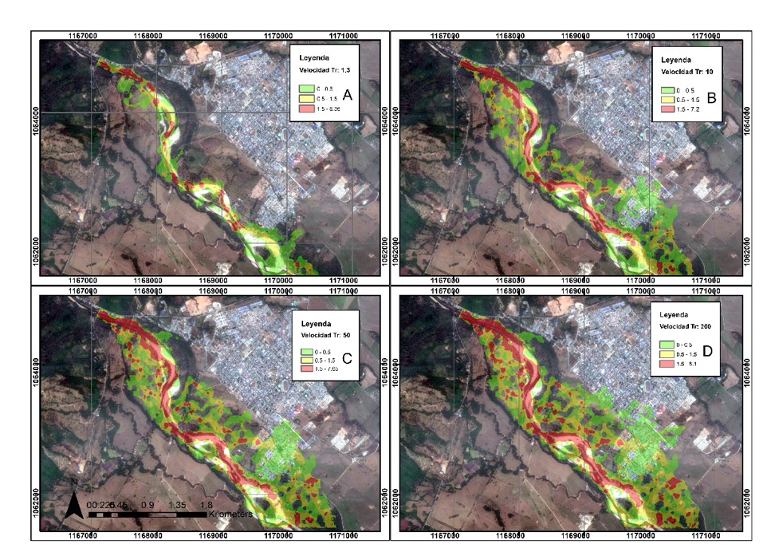{width="6.470215441819772in" height="4.5744674103237095in"}

Figura 75. Mapa de velocidad de flujo en el río Unete según período de retorno.

En el periodo de retorno de 10 años aumenta la inundación en los barrios Los Esteros y Las Vegas y se observa afectación adicional en los barrios Villaluz y El Porvenir. Adicionalmente, se reconoce que la función principal del muro de contención es el control geomorfológico debido a que una vez que el nivel del agua sobrepasa el muro, el flujo sigue la geoforma del río, que corresponde con un canal de estiaje o una vega, afectando las viviendas localizadas en dicha geoforma (Fig. 18).

A partir de los resultados de la modelación hidráulica se determina que en el barrio Los Esteros se presenta una inundación dinámica con una intensidad alta producto de un cauce más estrecho y un flujo más veloz, mientras que en los barrios Las Vegas, El Porvenir y Villaluz se presenta una inundación estática asociada al cambio hacia un rio trenzado con planicies de desborde, y a la derivación de parte del flujo hacia el caño El Samán.

Para el periodo de retorno de 50 años se observa un aumento en el área e intensidad en los barrios Villaluz y Los Esteros, especialmente en inmediaciones al caño El Samán, por donde se desarrolla una zona de flujo preferente, es así que, el barrio El Porvenir progresivamente va quedando aislado del casco urbano, limitando las posibles acciones de evacuación y atención de la emergencia. Finalmente, en el periodo de retorno de 200 años se evidenció una afectación total con una intensidad alta en los barrios El Porvenir, Las Vegas, Los Esteros, Villaluz. Así mismo, la Estación de Bomberos y los barrios San Agustín y El Centro se empiezan a afectarse por la inundación (Fig. 18).

En la Figura 18A se observa que la intensidad correspondiente a un periodo de retorno de 1.3 años, representa la condición anual del río Unete en la cual la creciente es contenida por el lecho del río sin afectar ningún área urbana. La intensidad de la creciente para un período de retorno de 10 años representa una probabilidad de ocurrencia del 10% en cuyo caso el barrio Las Vegas (Fig. 18B) y Los Esteros alcanzan una valoración de alta y el barrio Porvenir baja (Fig. 18C). El mapa de intensidad de amenaza por inundación en el río Unete para un período de retorno de 50 años demuestra un aumento en extensión e intensidad en los barrios Villaluz y Porvenir donde predomina una amenaza alta (Fig. 18D). Para la creciente con período de retorno de 200 años la mayor parte del área inundable alcanza una valoración de alta con una probabilidad de ocurrencia del 0.5%, llegando hasta el barrio San Agustín y Centro.

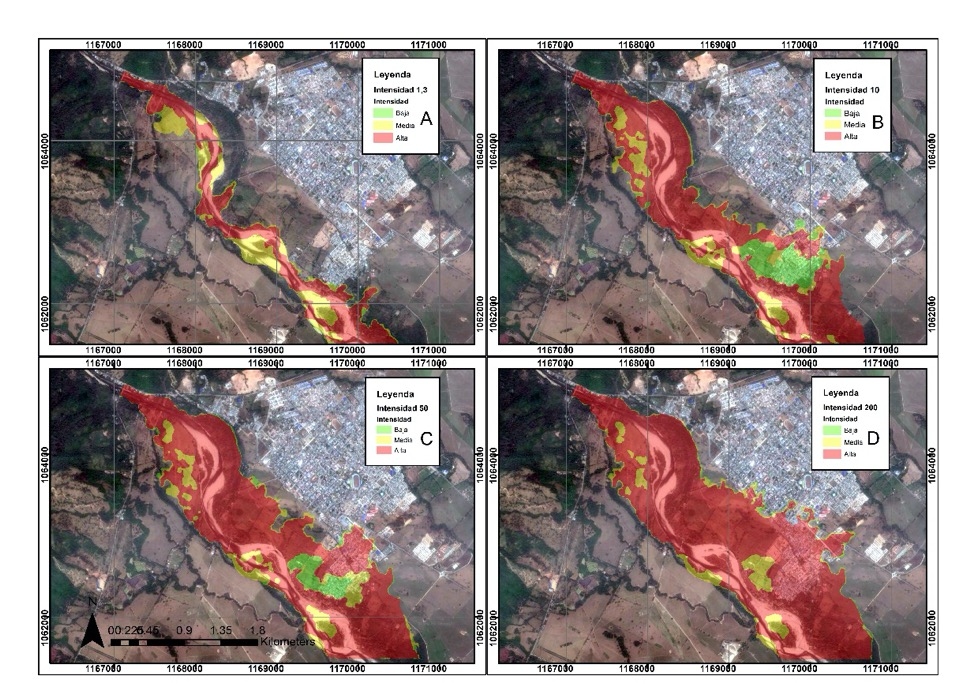{width="6.425075459317585in" height="4.542553587051619in"}

Figura 76. Mapa de intensidad de amenaza por inundación en el río Unete según período de retorno.

Considerando que el 100% del área afectada corresponde al periodo de retorno de 200 años con un área 460.97 hectáreas, se determinó el porcentaje de afectación para cada periodo de retorno, según se indica a continuación (Figura 77).

Tabla 7. Clasificación de territorio afectado por inundación del río Unete.

+--------------------------+---------------------------+-----------------------------+--------------------+
| > Periodo de retorno | > Territorio afectado | > Porcentaje            | > Calificación |
| >                        | >                         | >                           |                    |
| > (años)             | > (ha)                | > respecto a Tr 200 (%) |                    |
+==========================+===========================+=============================+====================+
| > 200                    | > 460.97                  | > 100                       | > 3                |
+--------------------------+---------------------------+-----------------------------+--------------------+
| > 50                     | > 400.58                  | > 86.9                      | > 3                |
+--------------------------+---------------------------+-----------------------------+--------------------+
| > 10                     | > 347.64                  | > 75.4                      | > 2                |
+--------------------------+---------------------------+-----------------------------+--------------------+
| > 1.3                    | > 163.39                  | > 35.5                      | > 1                |
+--------------------------+---------------------------+-----------------------------+--------------------+

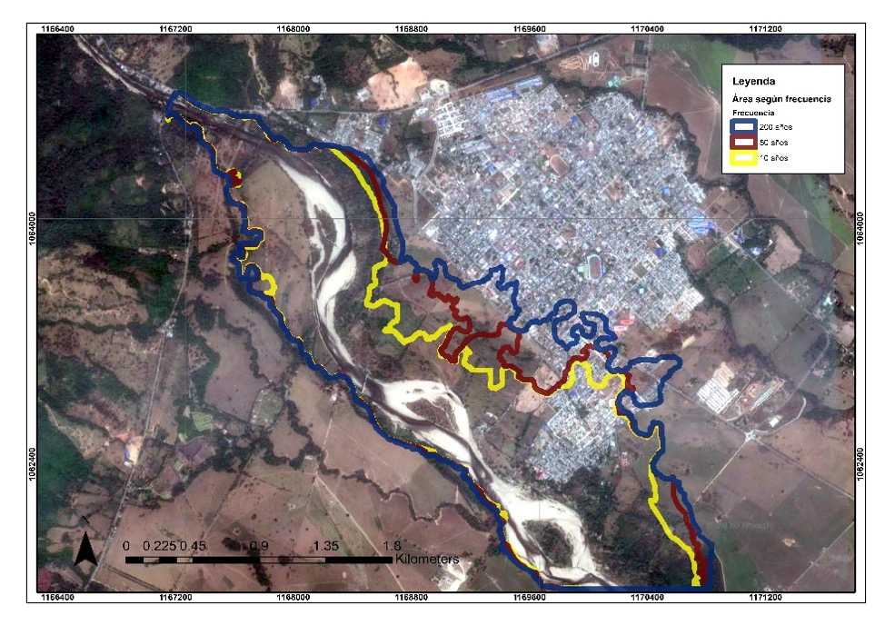{width="6.465076552930884in" height="4.5708344269466314in"}

Figura 19. Mapa de área según frecuencia. Las áreas identificadas corresponden a los periodos de retorno de 10, 50 y 200 años.

Como resultado de la suma o combinación de intensidad, frecuencia y territorio afectado se obtuvo la amenaza de cada periodo de retorno, según tres intervalos de valores entre 1 y 3 que corresponden a amenaza baja, entre 3 y 6 a amenaza media y entre 6 y 9 amenaza alta, concluyendo que todo el territorio alcanza una amenaza entre media (amarillo) y alta (rojo) (Fig. 20).

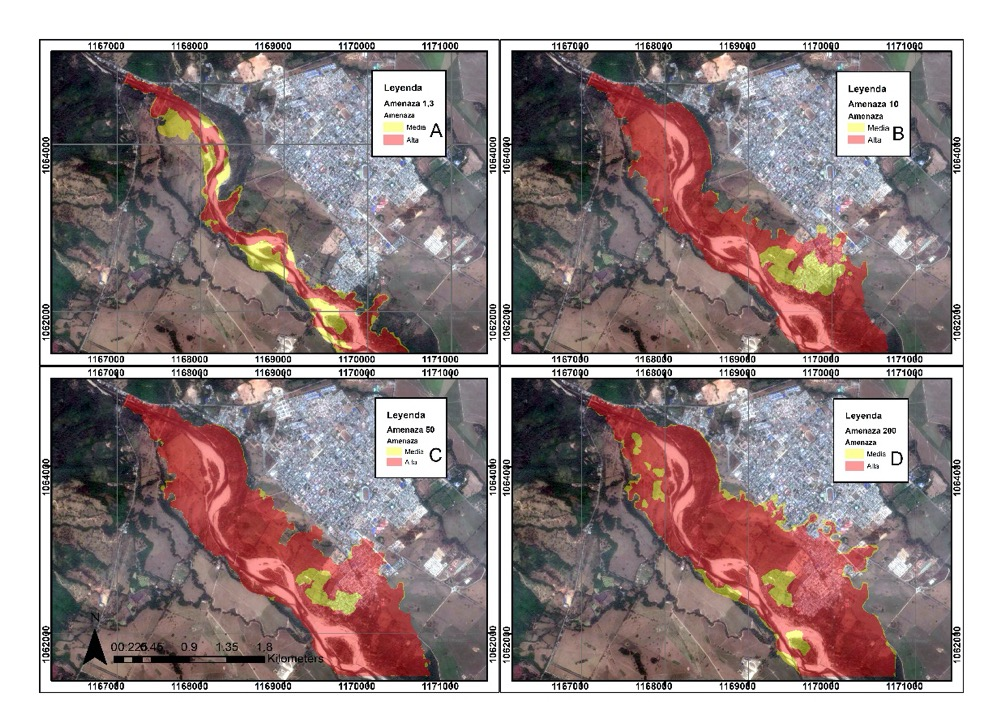{width="6.620686789151356in" height="4.680851924759405in"}

Figura 20. Mapa de amenaza por inundación en el río Unete según período de retorno.

En la figura anterior (Fig. 20A), la amenaza correspondiente a un periodo de retorno de 1.3 años representa la condición anual del río Unete. A partir de la creciente con período de retorno de 10 años los barrios Los Esteros y Las Vegas se afectan con amenaza alta, con una probabilidad de ocurrencia del 10% (Fig. 20B). Para la creciente con período de retorno de 50 años los barrios Villaluz y Porvenir llegan a amenaza alta (Fig. 20C), condición que se incrementa con la inundación en el río Unete para un período de retorno de 200 años (Fig. 20D).

De acuerdo con los resultados obtenidos de los mapas de amenaza parciales se construyó el mapa de amenaza definitivo a partir del promedio de la amenaza en cada periodo de retorno, reflejando la situación del municipio Aguazul debido al desbordamiento del río Unete (Fig. 21).

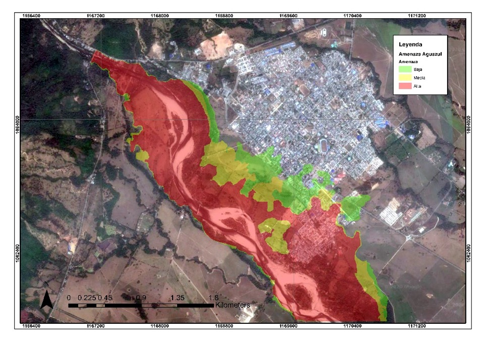{width="6.334792213473316in" height="4.47872375328084in"}

Figura 21. Mapa de amenaza por inundación en el municipio de Aguazul. La clasificación de amenaza por inundación se realizó a partir de los periodos de retorno de 10, 50 y 200 años.

De esta manera se concluye que Los barrios Los Esteros, Las Vegas y El Porvenir obtuvieron una calificación de amenaza alta, por otro lado, el barrio Villaluz presenta una transición entre los tres niveles de amenaza, mientras que barrios como San Agustín y El Centro solo alcanzan una amenaza baja.

Igualmente, se evidencia que la afectación por inundación por la creciente con periodo de retorno de 10 años coincide con los antecedentes registrados el 17 de agosto de 2002, en los cuales el desbordamiento del río Unete afectó los barrios El Porvenir, Villaluz, Los Esteros y Los Guaduales.

En los resultados obtenidos de la modelación hidráulica se observa que el río Unete no desborda por la margen del río opuesta al municipio, esto se justifica por la presencia de terrazas de acumulación alta (Fig. 7) con menor susceptibilidad a inundación y que funcionan como barreras protectoras, que impiden el desbordamiento hacia la margen derecha, por tanto, el río siempre va a desbordar hacia el área urbana en la margen izquierda, donde las geoformas de planicie aluvial, planicie aluvial, terraza baja y terraza de acumulación subreciente tienen una susceptibilidad alta y media ante inundaciones.

VALIDACIÓN DE RESULTADOS
========================

Aunque la modelización numérica es una de las herramientas más utilizadas para representar la amenaza por inundación, es preciso la búsqueda de soluciones dinámicas o evolutivas que permitan superar el déficit de información, siendo importante recurrir a registros históricos y datos geomorfológicos, entre otros, como lo recomienda la directiva europea 2007/60CE [10].

Para la validación de los resultados del modelo hidráulico y ante la falta de información geográfica se buscó solventar complementando métodos tradicionalmente utilizados con el calculó el porcentaje de área en cada nivel de amenaza para cada geoforma, se realizó un análisis multitemporal por medio de fotografías aéreas de los años 1995 y 2004, y se construyó un mapa a partir de encuestas a pobladores ribereños.

De acuerdo con los resultados obtenidos en la Figura 7 en la delimitación de geoformas se calculó el porcentaje de cada una respecto a la Figura 21 correspondiente al mapa definitivo de amenaza del municipio de Aguazul.

Tabla 8. Porcentaje de área en amenaza por geoforma.

+--------------------------+---------------------------+-------+-------+
| Geoforma             | Porcentaje de amenaza |       |       |
+==========================+===========================+=======+=======+
|                          | Alta                      | Media | Baja  |
+--------------------------+---------------------------+-------+-------+
| > Cauce activo           | 100                       | 0     | 0     |
+--------------------------+---------------------------+-------+-------+
| > Barras de sedimentos   | 100                       | 0     | 0     |
+--------------------------+---------------------------+-------+-------+
| > Vega                   | 78.16                     | 11.35 | 10.49 |
+--------------------------+---------------------------+-------+-------+
| > Planicie de inundación | 91.48                     | 7.04  | 1.48  |
+--------------------------+---------------------------+-------+-------+
| > Terraza baja           | 52.87                     | 25.90 | 21.23 |
+--------------------------+---------------------------+-------+-------+
| > Terraza intermedia     | 70.06                     | 15.68 | 14.25 |
+--------------------------+---------------------------+-------+-------+
| > Terraza alta           | 70.74                     | 11.75 | 17.51 |
+--------------------------+---------------------------+-------+-------+

Debido a que el municipio de Aguazul no cuenta con un mapa de eventos históricos de inundación y que el mapa de riesgos e inundaciones del EOT de Aguazul del año 2010 [17] tan solo identifica un área susceptible a inundaciones sin delimitar las zonas de amenaza alta, media y baja, fue preciso incorporar para la validación de los resultados del modelo: encuestas a pobladores ribereños, análisis multitemporal de fotografías aéreas y valoración de susceptibilidad según geoformas.

Cabe resaltar en el caso del barrio El Porvenir que en la fotografía aérea del año 2004 el caño El Samán atravesaba el barrio El Porvenir, coincidiendo con la mancha deinundación con periodo de retorno de 10 años que rodea el barrio El Porvenir y afecta directamente el barrio Villaluz (Fig. 22).

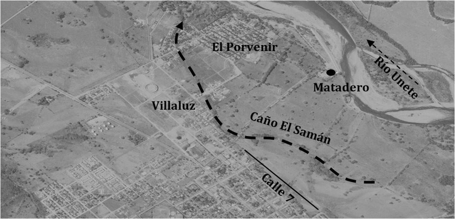{width="6.132354549431321in" height="2.9583333333333335in"}

Figura 22. Cruce del caño Samán por el barrio Porvenir. Fotografía aérea de Aguazul del año 2004. Modificado a partir del vuelo C-2710, n°. 207, 2004.

A su vez, en la fotografía aérea del año 1995 se observa que el caño El Samán y el canal de estiaje se encuentran activos y no estaba construido el muro de contención, demostrando que ante una posible creciente que supere la cresta del muro, la zona de Las Vegas y Los Esteros se inundan siguiendo la geoforma natural del río. De igual forma, se observa que para 1995 el barrio El Porvenir se empieza a desarrollar, ocupando áreas en condición de amenaza por inundación, ignorando la presencia del caño El Samán (Fig. 23).

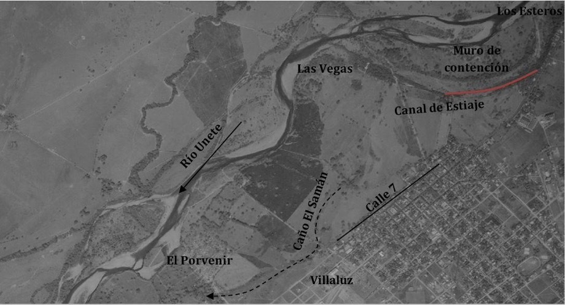{width="6.137498906386702in" height="3.3229166666666665in"}

Figura 23. Canal de estiaje en el sector Las Vegas. Fotografía aérea de Aguazul del año 1995. Modificado a partir del vuelo C-2564, n°. 3, 1995.

En contraste, en la fotografía aérea del año 1995 no existían los barrios El Porvenir y Villaluz, pero el caño El Samán se encontraba seco, permitiendo inferir que el desarrollo de estos barrios se dio durante un periodo de fuerte estiaje, desconociendo el recorrido histórico de este cuerpo de agua, es decir, las viviendas y barrios afectadas por inundaciones se desarrollaron sobre geoformasasociadas a vegas y antiguo cauce del río Unete, caracterizadas por alta susceptibilidad a inundaciones.

Las encuestas establecen que el 72.5% de la muestra encuestada ha sufrido inundaciones por el río Unete, las cuales han alcanzado profundidades superiores a los 50 cm correspondiendo a una intensidad alta. En cuanto a la frecuencia, se asigna categoría alta debido al predominio de inundaciones una vez cada dos años, que corresponde a un periodo de retorno inferior a 10 años.

Tabla 9. Resultados encuestas municipio de Aguazul.

+--------------------------------------+--------------------------+-------------------+
| > Pregunta                       | > Respuesta          | > Porcentaje% |
+======================================+==========================+===================+
| > ¿Se le ha inundado su casa?        | > Si                     | > 72.5            |
+--------------------------------------+--------------------------+-------------------+
|                                      | > No                     | > 27.5            |
+--------------------------------------+--------------------------+-------------------+
|                                      | > Menos de 3 veces       | > 62.1            |
+--------------------------------------+--------------------------+-------------------+
| > ¿Cuántas veces se ha inundado?     | > 4 a 8 veces            | > 34.5            |
+--------------------------------------+--------------------------+-------------------+
|                                      | > Más de 10 veces        | > 3.4             |
+--------------------------------------+--------------------------+-------------------+
|                                      | > Más de una vez por año | > 13.8            |
+--------------------------------------+--------------------------+-------------------+
| > ¿Cada cuánto se inunda?            | > Una vez por año        | > 17.2            |
+--------------------------------------+--------------------------+-------------------+
|                                      | > Una vez cada dos años  | > 58.6            |
+--------------------------------------+--------------------------+-------------------+
|                                      | > otro                   | > 10.3            |
+--------------------------------------+--------------------------+-------------------+
| > ¿Se inundó el patio o la vivienda? | > Patio                  | > 37.9            |
+--------------------------------------+--------------------------+-------------------+
|                                      | > Vivienda               | > 17.3            |
+--------------------------------------+--------------------------+-------------------+
|                                      | > Ambos                  | > 44.8            |
+--------------------------------------+--------------------------+-------------------+
|                                      | > Menos de 10 cm         | > 6.9             |
+--------------------------------------+--------------------------+-------------------+
| > ¿Hasta qué altura llego el agua?   | > Entre 10 y 30 cm       | > 20.7            |
+--------------------------------------+--------------------------+-------------------+
|                                      | > Entre 30 cm y 50 cm    | > 13.8            |
+--------------------------------------+--------------------------+-------------------+
|                                      | > Más de 50 cm           | > 58.6            |
+--------------------------------------+--------------------------+-------------------+
| > ¿Ha tenido pérdidas?               | > Si                     | > 100             |
+--------------------------------------+--------------------------+-------------------+
|                                      | > No                     | > 0               |
+--------------------------------------+--------------------------+-------------------+
|                                      | > Año anterior           | > 41.4            |
+--------------------------------------+--------------------------+-------------------+
| > ¿Cuándo fue la última inundación?  | > Hace 2 años            | > 34.5            |
+--------------------------------------+--------------------------+-------------------+
|                                      | > Hace 5 años            | > 10.3            |
+--------------------------------------+--------------------------+-------------------+
|                                      | > Hace 10 años           | > 13.8            |
+--------------------------------------+--------------------------+-------------------+
|                                      | > Más de 10 años         | > 0               |
+--------------------------------------+--------------------------+-------------------+

Para calificar la amenaza a partir de estos atributos, se definieron 3 indicadores (frecuencia, profundidad y última vez que ocurrió el evento), teniendo en cuenta la severidad de cada uno de los parámetros se asignó un valor que varía entre 1 y 5, siendo 5 el más crítico y 1 el menos crítico, tal y como se muestra a continuación:

Tabla 10. Clasificación de amenaza por inundación según resultados de encuestas.

+-------------------+-----------+----------------------------+-----------+----------------------+-----------+
| > Profundidad | Valor | > Frecuencia           | Valor | > Ultima vez     | Valor |
+===================+===========+============================+===========+======================+===========+
| No se inunda      | 1         | No se inunda           | 1         | No se inunda     | 1         |
+-------------------+-----------+----------------------------+-----------+----------------------+-----------+
| Menor a 10cm      | 2         | Otro                   | 2         | Mayor a 9 años   | 2         |
+-------------------+-----------+----------------------------+-----------+----------------------+-----------+
| Entre 10 y 30cm   | 3         | Una vez cada dos años  | 3         | Entre 6 y 8 años | 3         |
+-------------------+-----------+----------------------------+-----------+----------------------+-----------+
| Entre 30 y 50cm   | 4         | Una vez por año        | 4         | Entre 3 y 5 años | 4         |
+-------------------+-----------+----------------------------+-----------+----------------------+-----------+
| Mayor 50cm        | 5         | Más de una vez por año | 5         | Entre 1 y 2 años | 5         |
+-------------------+-----------+----------------------------+-----------+----------------------+-----------+

Los umbrales de la tabla anterior se determinaron de acuerdo al planteamiento de preguntas abiertas, las respectivas respuestas se reclasificaron conservando una escala de 1 a 5 de tal manera que los rangos son particulares para cada área específica, especialmente para la profundidad de inundación. A partir de los indicadores definidos se categorizó la amenaza en tres rangos: Baja (1 -- 2.5), Media (2.5 -- 4) y Alta (> 4). Para esto se sumaron los valores obtenidos en los indicadores de profundidad, última vez que ocurrió el evento y frecuencia, posteriormente, el número resultante se dividió en 3, obteniendo una escala de amenaza entre 1 y 5. Con estos resultados se realizó un mapa de amenaza por inundación del río Unete en el cual a partir del color de los puntos obtenidos y siguiendo las geoformas del río se delimitaron áreas homogéneas según cada nivel de amenaza (Fig. 24).

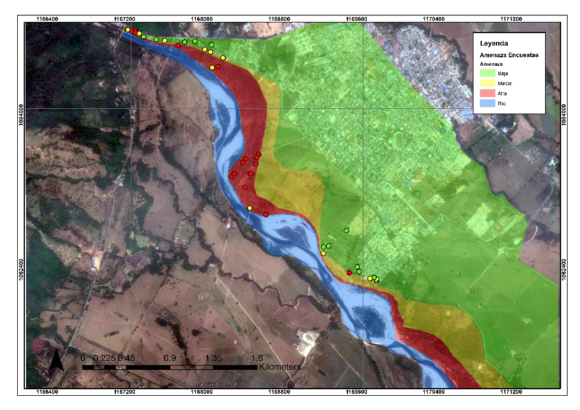{width="6.635733814523185in" height="4.691489501312336in"}

Figura 24. Mapa de amenaza por inundación en el municipio de Aguazul a partir de encuestas. Las zonas de amenaza corresponden a las áreas que la comunidad identifico y los límites se trazaron a partir de las geoformas.

Comparando los resultados obtenidos de la modelación hidráulica por medio del software Iber y las encuestas realizadas a la población en el municipio de Aguazul, se encontró que las manchas de inundación del periodo de retorno 1.3 años coinciden con los testimonios de los habitantes de los barrios encuestados. Sin embargo, evaluando periodos de retorno superiores, los resultados difieren entre la modelación hidráulica y las encuestas, debido a que la construcción de mapas de inundación a partir de encuestas solo logra reproducir eventos recientes, con alta frecuencia y poca magnitud, permitiendo afirmar la necesidad de apoyarse en modelación hidráulica y registros históricos de caudal para determinar los mapas de amenaza por inundación, mientras que las encuestas son una herramienta útil para validar los resultados del modelo para los eventos de menor frecuencia.

CONCLUSIONES
============

El grado de amenaza encontrado en el casco urbano del municipio de Aguazul debido al desbordamiento del río Unete corresponde a 72.94% a amenaza alta, 13.92% a amenaza media y 13.13% a amenaza baja. Además de esto, a través de la modelación hidráulica fue posible evidenciar que los sistemas de contención y protección no son suficientes para contrarrestar el desbordamiento del río a partir de un periodo de retorno de 10 años.

Particularmente, por medio de las encuestas realizadas a la población se evidenció que los habitantes de los barrios cercanos a la ribera del río Unete desconocen la posibilidad de una inundación producto de una creciente con periodo de retorno superior a 10 años, por lo tanto, en el momento en que ocurra una creciente de magnitud superior a esta, la población no estará preparada para la atención de esta amenaza. Se demuestra una memoria corta en la población respecto a la ocurrencia de fenómenos amenazantes que solo puede ser superada apoyándose en el uso de registros históricos (IDEAM, Desinventar, entre otros) y modelos hidráulicos.

Se pudo reconocer el proceso de urbanización de barrios en zonas de amenaza por inundación, desconociendo la existencia de antiguos cauces y geoformas (vegas, terrazas bajas y canales de estiaje). Así mismo, se evidenció que la población no dimensiona de forma adecuada la amenaza a la cual se exponen y que tienen memoria únicamente de los eventos ocurridos en los últimos años (alta frecuencia y poca magnitud), lo cual condicionó los resultados de las encuestas.

Para determinar la amenaza por inundación en Aguazul se utilizó el software Iber,demostrando mejores resultados en términos de resolución, profundidad y vector de velocidad, aunque para su correcta utilización es preciso disponer de excelente informacióntopográfica. De esta forma, se concluye la importancia de soportar los estudios de amenaza con trabajo de campo e información primaria, contrario a la práctica habitual del contexto colombiano.

Obtener un modelo de elevación con la escala y nivel de detalle apropiado para la modelación hidráulica 2D constituye un desafío, especialmente, porque la información disponible de forma gratuita es de baja resolución y con frecuencia tiende a sobreestimar la elevación en algunas celdas por la presencia de vegetación. Para superar este déficit de información topográfica es necesario integrar secciones transversales levantadas mediante topografía y un modelo de elevación digital (DEM), acompañado de ajustes manuales a criterio del modelador tendientes a mejoraban visualmente la respuesta de las simulaciones y lograr mayor correlación entre las manchas de inundación y la susceptibilidad de las geoformas existentes.

Para la validación de resultados el análisis de susceptibilidad por geoformas, las encuestas a pobladores ribereños y el análisis multitemporal por medio de fotografías, constituyen alternativas valiosas que permiten conocer los procesos que configuran los escenarios de riesgo y tomar acciones correctivas en los procesos de simulación.

+-------------------------------------------------------------------------------------------------------------------------------------------------------------------------------------------------------------------------------------------------------------------------------------------------------------------------------------------------------------------------------------------------------------------------------------------------------------------------------------------------+
| RECOMENDACIÓNES PARA TOMAR DECISIONES                                                                                                                                                                                                                                                                                                                                                                                                                                                       |
|                                                                                                                                                                                                                                                                                                                                                                                                                                                                                                 |
| 1.  Validar los criterios de diseño para las estructuras de contención y mitigación (muros de contención, hexápodos, otros), en caso de no contar con dicha información se recomienda modelarlos y verificar si aún cumplen las características de diseño debido al tiempo en el cual fueron diseñados y el cambio da las condiciones hidrometeorológicas.                                                                                                                                      |
|                                                                                                                                                                                                                                                                                                                                                                                                                                                                                                 |
| 2.  Realizar análisis multitemporales por medio de sensores remotos (fotografías aéreas e imágenes satelitales) para proyectos que se desarrollen en zonas aledañas a las riberas con el fin de identificar antiguas áreas sujetas a inundación, la dinámica de los cauces y geoformas con mayor susceptibilidad a desastres naturales.                                                                                                                                                         |
|                                                                                                                                                                                                                                                                                                                                                                                                                                                                                                 |
| 3.  En busca de un mejor planeamiento municipal, es indispensable apoyar la identificación de áreas sujetas a amenazas naturales mediante trabajo de campo, información primaria y modelamiento numérico, cuyos resultados deben validarse con la percepción y conocimiento experto de la comunidad.                                                                                                                                                                                            |
|                                                                                                                                                                                                                                                                                                                                                                                                                                                                                                 |
| 4.  Los resultados obtenidos reflejan la amenaza a la cual se encuentra expuesto el municipio de Aguazul, sin embargo, reconociendo como principal limitación de este estudio la falta de topografía de detalle en el área urbana y zona inundables, es pertinente realizar estudios de detalle en las zonas identificadas con amenaza para obtener resultados más precisos, condición que no es única del municipio de Aguazul, si no que resulta común en la mayoría del contexto colombiano. |
|                                                                                                                                                                                                                                                                                                                                                                                                                                                                                                 |
| 5.  Ante los escenarios de cambio climático e*s recomendable modelar escenarios de amenaza por el desbordamiento del río Unete considerando el cambio climático, ya que el IPCC pronostica aumento de precipitaciones.*                                                                                                                                                                                                                                                                         |
+-------------------------------------------------------------------------------------------------------------------------------------------------------------------------------------------------------------------------------------------------------------------------------------------------------------------------------------------------------------------------------------------------------------------------------------------------------------------------------------------------+

CONFLICTO DE INTERES {#conflicto-de-interes .list-paragraph}
====================

Los autores no declaran conflicto de intereses.

IDENTIFICACIONES DE AUTORES

Rafael Muñoz Quintero <https://orcid.org/0000-0002-6359-3347>

Daniela Jácome Hernández <https://orcid.org/0000-0002-1295-1116>

Alejandro Franco Rojas [CvLAC](https://scienti.colciencias.gov.co/cvlac/visualizador/generarCurriculoCv.do?cod_rh=0000033572)

Alexander Padilla González [CvLAC](https://scienti.colciencias.gov.co/cvlac/visualizador/generarCurriculoCv.do?cod_rh=0001416023)

 {#section-9 .list-paragraph}

BIBLIOGRAFÍA {#bibliografía-2 .list-paragraph}
============

1.  El Tiempo. (2000). *Por segunda vez se cae el puente*. Consultado el 03 de octubre de 2017. https://www.eltiempo.com/archivo/documento/MAM-1289533

2.  Desinventar. (2018). *Sistema de inventario de efectos de desastres*. Consultado el 03 de octubre de 2017. https://online.desinventar.org/desinventar/#COL-1250694506- colombia_inventario_historico_de_desastres.

3.  Caracol Radio. (2016). *Avalancha en el río Unete incomunica a Boyacá y Casanare*. Consultado el 03 de octubre de 2017. https://caracol.com.co/emisora/2016/09/01/tunja/1472737110_176330.html

4.  IDIGER (Instituto Distrital de Gestión de Riesgo y Cambio Climático). (2018). *Riesgo por Inundación*. Consultado el 31 de marzo de 2018. <http://www.idiger.gov.co/rinundacion>

5.  UNGRD (Unidad Nacional pala la Gestión del Riesgo de Desastres). (2014). *Plan Estratégico Institucional (2014 -- 2018).* Bogotá: UNGRD.

6.  Alcaldía Municipal de Aguazul. (2016). *Plan Municipal de Gestión de Riegos y Desastres*. Aguazul, Casanare: Alcaldía Municipal de Aguazul.

7.  E. Blade, L. Cea, G. Corestein, J. Puertas, E Vásquez-Cendón, J. Dolz & A. Coll. (2012). *Iber: herramienta de simulación numérica del flujo en ríos*. España, Elsevier. <https://doi.org/doi:10.4995/ia.2014.3144>

8.  J. Pinos & L. Tumbe, (2019). Evaluación del desempeño de modelos hidráulicos bidimensionales para la generación de mapas de inundación en ríos de montaña. *Ciencia e ingeniería del agua*. 12(1). 11-18. Ecuador. Elsevier. <https://doi.org/10.1016/j.wse.2019.03.001>

9.  UNGRD (Unidad Nacional para la Gestión del Riesgo de Desastres). (2012). *Programa de Naciones Unidas para el desarrollo Colombia., y Proyecto gestión integral del riesgo y adaptación al cambio climático caribe. Guía metodológica para la elaboración de planes departamentales para la gestión del riesgo*. Bogotá: UNGRD.

10. E. Blade, L. Cea & G. Corestein. (2014). Modelación numérica de inundaciones fluviales. *Ingeniería del agua,* 18(1), 71-82.

11. Ministerio de Medio Ambiente y Medio Rural & Marino de España, CEDEX, Grupo de Ingeniería del Agua y del Medio Ambiente & Flumen. (2010). *Iber, Modelización bidimensional del flujo en lámina libre de aguas poco profundas: Manual básico de usuario*. España, Ceres.

12. Instituto Nicaragüense de Estudios Territoriales & Agencia Suiza para el Desarrollo yla Cooperación. (2005). Inundaciones fluviales: Mapas de amenazas. Recomendaciones técnicas para su elaboración. Managua, Nicaragua, Proyecto Met-Alarn.

13. Ven Te Chow. (1994). *Hidráulica de canales abiertos.* McGraw Hill, México.

14. IDEAM (Instituto de Hidrología, Meteorología y Estudios Amiéntales). (2018). *Solicitud de información*. Consultado el 09 de enero de 2018. <http://www.ideam.gov.co/solicitud-de-informacion>.

15. J, Pérez, I, Escobar & J, Frangozo. (2018). Modelación Hidráulica 2D de Inundaciones en Regiones con Escacez de Datos: El Caso del Delta del Río Ranchería, Riohacha-Colombia. *Información tecnológica*, 29(4), 143-146. <https://doi.org/10.4067/S0718-07642018000400143>

16. ALOS PALSAR L 1.0: © JAXA / METI ALOS PALSAR [ALPSRS270523500] [2018] Accedido a través de ASF DAAC, https://j.mp/2ON8GK4 [28 de enero de 2018].

17. Alcaldía Municipal de Aguazul. (2011). *Esquema de Ordenamiento Territorial del Municipio de Aguazul, Casanare*. Aguazul, Casanare: Alcaldía Municipal de Aguazul.

12

[]{#_Toc47894935 .anchor}Obras costeras y clima marítimo: casos del Caribe colombiano

Serguei Lonin^1*^ & Julio Monroy^1^

^1^Grupo de Investigación en Oceanología; Facultad de Oceanografía Física -- Escuela Naval de Cadetes "Almirante Padilla". Isla Naval Manzanillo, El Bosque, Cartagena de Indias, Colombia

^*^Autor de contacto: Serguei Lonin, <slonin@costa.net.co>

Resumen

Las estructuras costeras *duras* son el método preferido usado tanto para mitigar los efectos amenazantes de la erosión en varios ecosistemas como para garantizar el seguro desarrollo de actividades marítimas a lo largo de la costa del Caribe colombiano. Sin embargo, estas obras con frecuencia producen efectos negativos en la zona costera o, eventualmente, resultan siendo obsoletas al no considerar las causas técnicas de la erosión. Las obras costeras, modificando la dinámica local, pueden producir efectos negativos de déficit de sedimentos flujo abajo, provocando erosión. En este capítulo se analizan tres casos relacionados con actividades antropogénicas y procesos naturales cuyo impacto en la dinámica costera se han vuelto progresivamente evidente a través de los años: los tajamares de Bocas de Ceniza, las estructuras costeras del golfo de Morrosquillo y el caso del río Turbo. Las consecuencias no deseadas de estas actividades demostraron la necesidad de generación de conocimiento preliminar detallado de la dinámica costera y de los efectos potenciales de obras de gran escala, previa a la intervención. De todos modos, aunque podría ser imposible de combatir aisladamente (en un solo país) los efectos de largo plazo de los cambios globales tales como el aumento continuo del nivel del mar, los impactos antrópicos locales y regionales todavía pueden ser evitados con un conocimiento más profundo de los procesos costeros.

Palabras clave

Clima marítimo, espolones, erosión, nivel del mar, protección costera, tajamares

Coastal Constructions and Maritime Climate: Cases from the Colombian Caribbean

Abstract

*Hard coastal* protection structures are the preferred method used both to mitigate the threatening effects of erosion on various ecosystems and to guarantee the safe development of maritime activities along the Colombian Caribbean coast. However, these structures have frequently produced adverse responses in the coastal zones or have eventually become obsolete given the lack of consideration of the technical causes of erosion. Coastal works, modifying local dynamics, can produce negative effects like sediment deficit downstream, triggering coastal erosion. In this chapter, we analyze three cases related to anthropogenic activities and natural processes whose impact on coastal dynamics has become increasingly evident over the years: the jetties at the Bocas de Ceniza, the coastal structures of the Gulf of Morrosquillo, and the Turbo River case. These activities' undesired consequences have demonstrated the necessity of generating detailed preliminary knowledge on coastal dynamics and the potential effects of large-scale works prior to performing interventions. Overall, although it might be impossible to fight, inside one country, the long-term effects of global changes such as the continuous rise of the sea level, the local and regional anthropic impacts may still be avoided by a deeper knowledge of coastal processes.

Keywords

Breakwaters, coastal protection, erosion, jetties, maritime climate, sea level

INTRODUCCIÓN
============

Las costas del Caribe colombiano en gran parte están compuestas de material arenoso con poca fracción de los finos cohesivos. En su mayoría, estas arenas son resultado del aporte de los ríos, arroyos y, en menor medida, de la abrasión de acantilados. Para las áreas coralinas, el material es calcáreo resultado del ciclo de vida de arrecifes de coral y la erosión paulatina de las terrazas marinas.

La predominancia del oleaje sobre la marea astronómica (costa dominada por energía de olas) hace importantes las corrientes inducidas por olas en las zonas de rotura como el principal mecanismo de transporte litoral de arenas, conformación de playas o erosión costera. Por lo anterior, la estabilidad de una franja costera naturalmente depende de la disponibilidad de sedimentos de una fuente, pero también de la redistribución espacial de sedimentos a lo largo de la costa. Este último está relacionado con los procesos geológicos y geomorfología costera. Los efectos de las obras antrópicas, a su vez, *compiten* con los de las geoformas naturales y su influencia puede tener efectos dramáticos, si previamente no se estudian profundamente sus impactos.

Las obras costeras más empleadas en Colombia son los espolones, debido a su bajo costo por ser construidos desde la tierra (*sin requerir embarcaciones, por lo tanto más económicos*). Normalmente los espolones son retenedores de sedimento, generando una acumulación de arenas en un lado y erosión por el otro, dependiendo de la dirección de la deriva litoral. El clima del Caribe posee carácter bimodal, combinando el oleaje del régimen de los vientos alisios y los casos atípicos de los frentes fríos y ciclones tropicales. Como regla, los espolones se orientan de acuerdo con la dirección de las olas del régimen y cualquier alteración de este régimen por los eventos extremos resulta en que los espolones produzcan efectos nocivos, normalmente relacionados con la pérdida de sedimentos en las playas. Además, su construcción debe ser bien justificada, teniendo en cuenta que la ausencia de los sedimentos en la fuente hace que dichas obras tiendan a quedar obsoletas. Desafortunadamente, la no identificación previa (diagnóstico mal realizado o faltante) de las causas de erosión en un sector dado y los métodos empíricos que se emplean en la mayoría de los casos para el diseño de estas obras, son dos principales razones de los fracasos o de la poca eficiencia de las estructuras de protección costera.

En el presente capítulo se describen algunos casos de efectos naturales y obras construidas en la costa del Caribe colombiano, haciendo énfasis en las causas antrópicas regionales y locales versus el aumento del nivel del mar, cuyo efecto, aunque existe, no debe considerarse como la única o principal causa de los problemas costeros. Sin pretender ahondar demasiado en los aspectos técnicos, este apartado busca dejar en evidencia ante el público general que se hace necesario una gestión inteligente de la protección costera, donde se tomen decisiones bien informadas sobre una sólida base científica por encima de otras consideraciones.

+---------------------------------------------------------------------------------------------------------------------------------------------------------------------------------------------------------------------------------------------------------+
| Caja 1. Definiciones                                                                                                                                                                                                                                |
|                                                                                                                                                                                                                                                         |
| Costa dominada por energía de olas: predominancia climática de la acción de olas sobre la variación de la marea astronómica como una proporción entre altura significante de la ola (H) y el rango de la marea (TR), 0.5 < TR/H < 1 [9].        |
|                                                                                                                                                                                                                                                         |
| Aumento del nivel del mar: usualmente se refiere al aumento global del nivel medio de la superficie de los océanos debido al calentamiento de la Tierra.                                                                                            |
|                                                                                                                                                                                                                                                         |
| Erosión costera: retroceso de la línea de costa y pérdida de los sedimentos en el perfil subacuático adyacente relacionados con déficit de aporte sedimentario de una fuente o con la obstaculización, antrópica o natural, del transporte litoral. |
+---------------------------------------------------------------------------------------------------------------------------------------------------------------------------------------------------------------------------------------------------------+

OBRAS COSTERAS Y SU EFECTO
==========================

El aumento global del nivel del mar es un hecho y para el futuro próximo tendrá un incremento más progresivo [1-4]. También es conocido y cuantificable con una *regla de Bruun* [5] que las playas con menor pendiente sufren la erosión costera debido al aumento del nivel con mayor magnitud que las costas abruptas. Por lo anterior, los escenarios de riesgo podrían caracterizarse en una primera aproximación para todo el país con base en un relativamente simple análisis topográfico de los perfiles subacuáticos de las playas.

Sin embargo, la vulnerabilidad de las costas depende también de una serie de factores de carácter regional y local, frecuentemente causadas por otros impactos antrópicos inconscientes desde el punto de vista de la magnitud de las consecuencias que generan. Si la causa global del calentamiento y aumento del nivel del mar no se puede combatir a nivel de un solo país, las causas regionales y locales sí se pueden regular y controlar y, de esta forma, mitigar el efecto de la erosión costera en muchos casos específicos.

Uno de los primeros ejemplos presentados aquí, se refiere al efecto de los tajamares de Bocas de Ceniza. Son obras costeras conocidas como *jetties*, cuyo propósito es estabilizar la desembocadura de un río, en el caso dado, del río Magdalena. Inaugurados en el año 1936, causaron un efecto regional de erosión costera, el cual se manifestó de forma evidente durante las décadas posteriores a su construcción. El río Magdalena es uno de los aportantes más significativos de sedimentos para las costas caribeñas de Colombia [6]: alrededor de un 85% del material que transporta son limos y arcillas; siendo éstas partículas muy finas, generalmente se propagan en estado de suspensión, generan una pluma turbia en la desembocadura y parcialmente se precipitan en su vecindad por el proceso de floculación de las partículas en un frente halino con una salinidad entre 5 y 10. Sin embargo, por los mecanismos del lavado por oleaje, estas partículas no componen mayor parte de los sedimentos en las playas del Caribe colombiano en el tramo de influencia del río. El 15% del material restante transportado por el Magdalena, son arenas, cuya predominancia en las playas es evidente.

En los años 50, el ingeniero español Iribarren proyectó el espolón más largo en Colombia de aquella época (150 metros construidos), considerando que el *fin de la deriva litoral* de sedimentos del río Magdalena en el margen occidental es la ciudad de Cartagena, concretamente el extremo de su flecha litoral de Bocagrande (Fig. 1). Por otro lado, actualmente se considera [7, 8] que el fin de la deriva litoral por el lado oriental es la Boca de la Barra de la Ciénaga Grande de Santa Marta, la parte más *frágil* de la flecha litoral conformada por la deriva, separando el mar Caribe y la ciénaga. Una vez diagnosticado el tramo de influencia del río, se puede realizar el análisis de los procesos de erosión-sedimentación, relacionados con el aporte de las arenas por el río, la principal fuente de sedimentos en esta región (la abrasión de acantilados) produce una cantidad de sedimentos, pero se sabe que es una fuente secundaria para la mayoría de las costas en el mundo [9]).

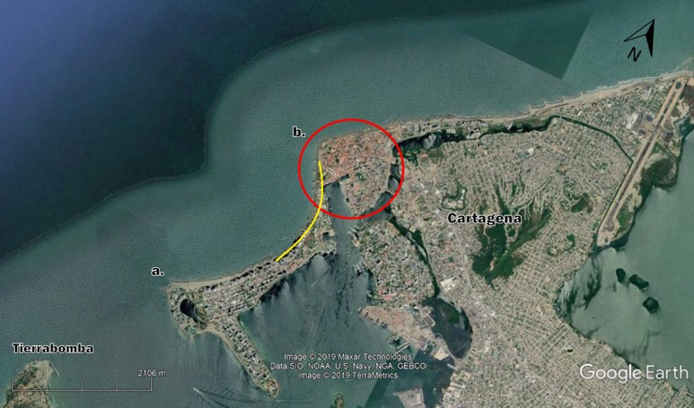{width="5.15422353455818in" height="3.0325820209973755in"}

Figura 1. Características de la dinámica litoral de la flecha de Bocagrande: a) Espolón de Iribarren; b) Ciudad antigua, *head-land*; la línea amarilla demuestra el perfil de equilibrio en planta de Hsu que evidencia que en la época colonial existió una comunicación entre el mar y la bahía de Las Animas. Fuente: Google Earth (2019), autores.

Los tajamares de las Bocas de Ceniza interrumpieron el transporte de la deriva litoral de sedimentos. El efecto negativo fue observado prácticamente de inmediato en el retroceso de la flecha de la Ciénaga de Mallorquín. La dinámica multianual de esta flecha se presenta en la Figura 2.

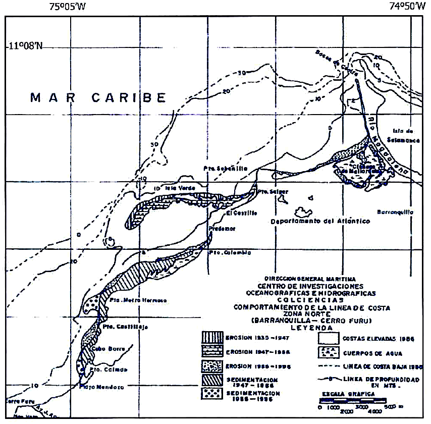{width="4.016040026246719in" height="3.915262467191601in"}

Figura 2. Comportamiento de la línea de costa en la zona norte del departamento del Atlántico entre 1935 y 1996 [10], se reproduce bajo licencia Creative Commons.

Era de esperar que la respuesta del sistema costero en forma de retroceso tuviera efecto en los tiempos directamente proporcionales a la distancia de la fuente de arena (Bocas de Ceniza). Por lo tanto, el caso de desaparición de la Isla Verde en los años 1935 a 1947 fue detalladamente estudiado en [10], entre otros. En [11] incluso calculan una tasa de desplazamiento de sedimentos en el tramo de Isla Verde a Puerto Colombia de 430 m/año, formando nuevas acumulaciones de arena frente a la costa de este municipio. Lo sorprendente es que, en distancias de más de una centena de kilómetros desde la boca del río, el estudio [12] demostró una respuesta drástica en la zona norte de Cartagena (Fig. 3) para los años 60--70 del siglo pasado con un retroceso de orden de 100 m, es decir, unos 30 años después de la culminación de la obra de los tajamares.

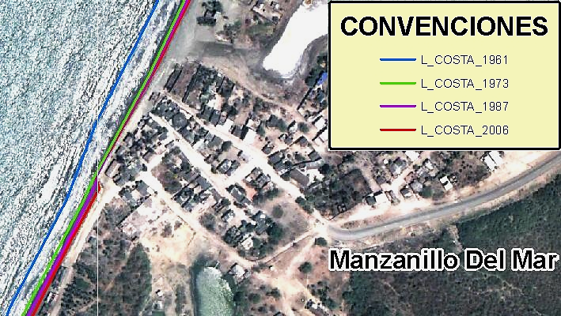{width="4.932516404199475in" height="2.783261154855643in"}

Figura 3. Variación multianual de la línea de costa en el sector Manzanillo del Mar (zona norte de Cartagena de Indias). Imagen del fondo: Google Earth. Estudio geomático [12].

Por el otro lado de la desembocadura del río Magdalena, la isla de Salamanca aún sigue sufriendo el impacto de las obras de los años 30 (Fig. 4), dónde el retroceso para los últimos 60 a 70 años es del orden de los 800 metros.

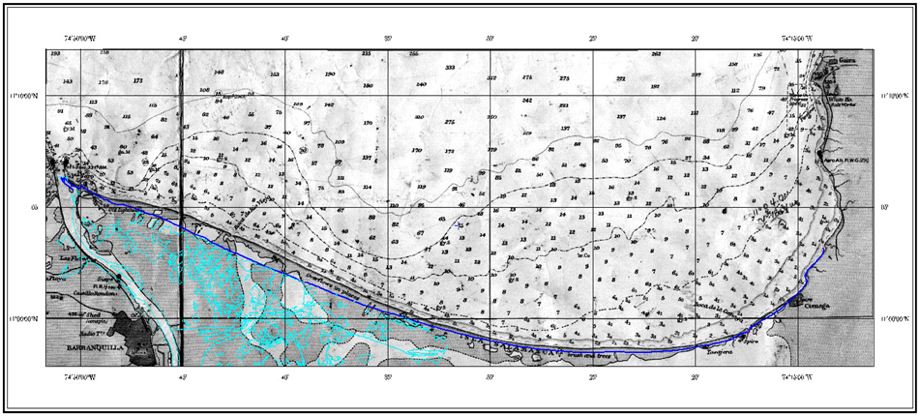{width="6.1375in" height="2.775in"}

Figura 4. Retroceso costero (línea azul) con respecto a la cartografía del año 1944 en el sector de la Isla Salamanca. Se observa el efecto del déficit de sedimentos provocado por las obras de tajamares. Tramo: Barranquilla-Ciénaga. Fuente: [7].

Siendo los tajamares de Bocas de Ceniza la principal causa de erosión costera durante las décadas en la región de influencia del río Magdalena, es importante señalar que a nivel local existen otras causas antrópicas de este proceso. Volviendo a la Figura 1, se puede observar que la ciudad de Cartagena de Indias fue fundada sobre una base sólida, conocida en la bibliografía como *head-land* [9]. Esta punta, indicada en la Figura 1 con un círculo rojo, produce una difracción importante de oleaje en la flecha litoral de Bocagrande tendiendo a romper sobre una línea de equilibrio en planta, llamada el perfil de Hsu [9]. Resulta que la expansión de la ciudad durante los últimos 50 años hacia la flecha de Bocagrande se materializó en el enrocado de la orilla en el tramo cercano a la punta (de cierta forma con el intento de estabilizar la flecha), y en las construcciones costeras, como la primera avenida y las edificaciones a lo largo de Bocagrande.

El primer factor (*head-land*) ha venido generando una manifestación natural de los procesos morfodinámicos en planta, mientras que el segundo (infraestructura urbana) provocó un déficit de sedimentos a lo largo del perfil activo subacuático. La Figura 5 muestra la forma no equilibrada de la línea de costa, el resultado del enrocado y también permite observar que debajo de la superficie del agua, entre 1 y 5 m de profundidad (a distancias de 100 y 800 m de la orilla) hay un déficit de sedimentos. Mientras que este déficit exista, ningún espolón con longitudes inferiores a las distancias señaladas y ningún relleno hidráulico de la parte seca de la playa recuperarían la situación crítica, plenamente antrópica.

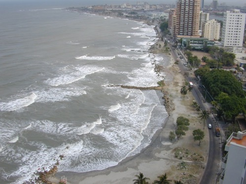{width="3.3243274278215225in" height="2.4930555555555554in"} 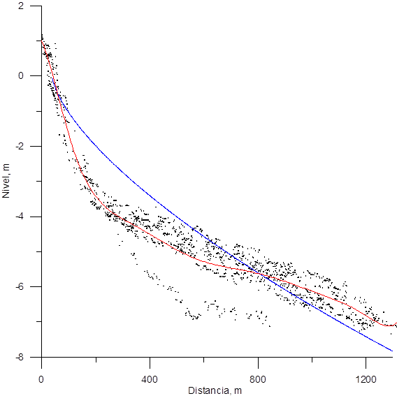{width="2.4977099737532806in" height="2.493312554680665in"}

Figura 5. Izquierda: vista de Cartagena desde el espolón Iribarren hacia head-land de la ciudad vieja (Fig. 1). Derecha: Perfiles subacuáticos de la playa de Bocagrande (puntos negros) con un perfil promedio (en rojo) y el perfil de equilibrio de Dean (en azul). Fuente: propia.

Cabe mencionar que las inundaciones de las calles marginales al malecón de Bocagrande, incluso cuando inicialmente sean producto de lluvias fuertes, vuelven a terminar como una intrusión del agua salada del mar. El agua de lluvia, evacuándose por las calles hacia el mar, socava unos canales de escorrentía, a través de los cuales el agua salada entra con ayuda de olas de mar de fondo de los frentes fríos, típicos para la época húmeda del año.

El efecto de los ciclones tropicales sobre las costas del Caribe colombiano es poco evaluado. La Figura 6 (arriba) muestra el mapa sinóptico correspondiente al ciclón tropical Tomas (año 2010) en el centro del Caribe en su categoría de depresión tropical. Al momento de esperar las ondas de mar de fondo irradiadas por el ciclón y provenientes de él hacía las costas colombianas, el modelo espectral de oleaje (Fig. 6 abajo) implementado en el Centro de Investigaciones Oceanográficas e Hidrográficas del Caribe [13, 14] mostró un efecto particular: La Zona de Convergencia Intertropical, atraída por el sistema de baja presión asociado al centro de la D.T. Tomas, generó vientos fuertes y oleaje que afectaron de manera progresiva todas las costas del Caribe colombiano desde del Golfo de Urabá (en menor medida) hasta la Guajira (daños importantes y retroceso de la línea de costa en algunos sectores superando 50-80 m), evidenciado en posterior inspección física por parte de las autoridades [15]. Por lo anterior, es importante tener en cuenta el clima marítimo en el momento de toma de decisiones sobre las posibles medidas de mitigación de impactos de la naturaleza.

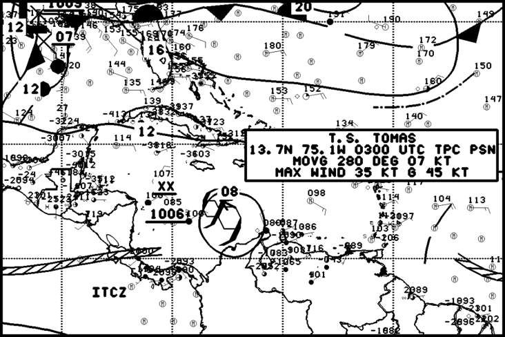{width="4.844828302712161in" height="3.232625765529309in"}

{width="6.137110673665791in" height="4.137931977252843in"}

Figura 6. Arriba: Situación sinóptica para el día 3 de noviembre del 2010, indicando el paso de la depresión tropical Tomas. Fuente: Centro Nacional de Huracanes, 2010. Abajo: Pronóstico de oleaje con el sistema SPOA para la fecha 02/11/2010 [13].

Ahora bien, si las condiciones climáticas son tan relevantes, sin discutir los eventos más extremos posibles ocurridos en las costas del Caribe, es evidente que nuestra actuación sobre las medidas de recuperación de playas no es siempre adecuada. Las razones de una mala interpretación de la dinámica marina y costera principalmente se encuentran en el desconocimiento o desconsideración de las causas de los procesos costeros. Las fotos de la Figura 7 demuestran completa ausencia de las arenas en dos sectores del Golfo de Morrosquillo donde en épocas anteriores se encontraban playas, como lo refieren los nativos del sector. La razón de ser construidas estas obras era la expectativa de ganar las playas mediante unas obras duras, sin considerar la viabilidad técnica y sin estudios previos.

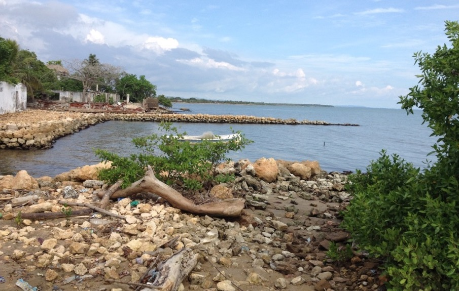{width="5.986010498687664in" height="3.805770997375328in"}

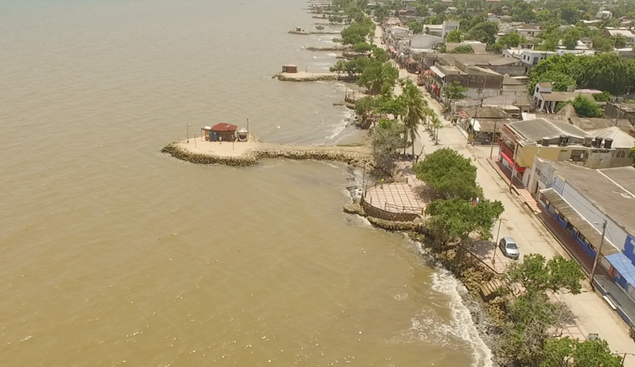{width="6.044390857392826in" height="3.5in"}

Figura 7. Fotos de obras de protección costera en el Golfo de Morrosquillo, donde se evidencia su obsolescencia. Arriba: Berrugas. Abajo: Santiago de Tolú. Fuente: propia.

El caso del Golfo de Morrosquillo es un ejemplo muy ilustrativo, cuando en el medio de más de 150 espolones construidos, ninguno resulta ser útil. Desde la época de los trabajos de Lorin et al. [16], mediante el análisis de granulometría de sedimentos del fondo fue determinado que la deriva litoral en este golfo proviene desde el río Sinú, abasteciendo con el material arenoso al menos la mitad de sus playas. El estudio [17], basado en la modelación numérica de la deriva litoral de sedimentos, confirmó esta conclusión. Sin embargo, si se analiza el avance de la acreción del delta del río Sinú (Fig. 8), es evidente de que la formación deltaica de las últimas décadas frenó el aporte de sedimentos, tanto para el norte, como para el sur de la desembocadura [18]. El golfo actualmente no posee los sedimentos arenosos en abundancia, como en el pasado, tanto en sus orillas, como el mar afuera. El anterior es un caso que está asociado con la posición geográfica (que influye directamente en la energía del oleaje y la capacidad potencial de transporte de sedimentos) combinada con cambios morfodinámicos en la fuente del material, naturales [18] o antrópicos [8]. De hecho, si en el estudio [8] se afirma la construcción de embalses en el cauce del río mucho más arriba de su delta, estancando los sedimentos gruesos, entonces en el trabajo [18] se señalan, como las causas del crecimiento del delta, tanto los procesos naturales, como la construcción alrededor del año 1938 de un canal próximo a la costa, resultando el abandono del delta de la bahía de Cispatá y la formación del delta de Tinajones (Fig. 8b).

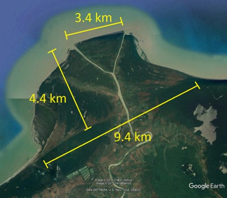{width="2.943956692913386in" height="2.563221784776903in"}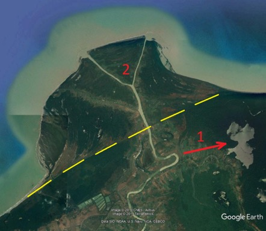{width="2.941349518810149in" height="2.5609525371828523in"}

Figura 8. Delta del río Sinú en acreción. Fuente: Google Earth, 2019. Izquierda: Dimensiones del delta crecido desde el año 1938. Derecha: Dirección del cauce antiguo (1) según [18] y el brazo de Tinajones (2); la línea amarilla está trazada por el contorno visible en la figura izquierda de cambios fisiográficos y de vegetación.

Las dimensiones de acreción del delta, observadas en la Figura 8, se estiman alrededor de 18 km^2^ del área, lo que implica una acumulación superior a 200 millones de metros cúbicos de las arenas (estimación propia). Sin embargo, a pesar de que este sedimento, debido a causas naturales o antrópicas, dejó de llegar a las playas de la región, la *inercia* en la mentalidad sobre las posibles medidas de recuperación de playas continúa desde hace varias décadas, resultando la presencia y tendencia actual de seguir construyendo las obras pétreas de la protección costera, donde su efecto es nulo debido al déficit del sedimento.

En el caso del río Magdalena el impacto fue causado por una mega obra construida entre 1930 y 1936, sin embargo, en el clima de olas existe suficiente energía para el transporte del material; para el caso de los aportantes más pequeños, las alteraciones en la fuente de sedimentos pueden ser poco apreciables, pero las consecuencias igualmente notorias. Es el caso del río Turbo. La Figura 9 demuestra la evolución de la línea de costa del sector entre 1946 y 2005.

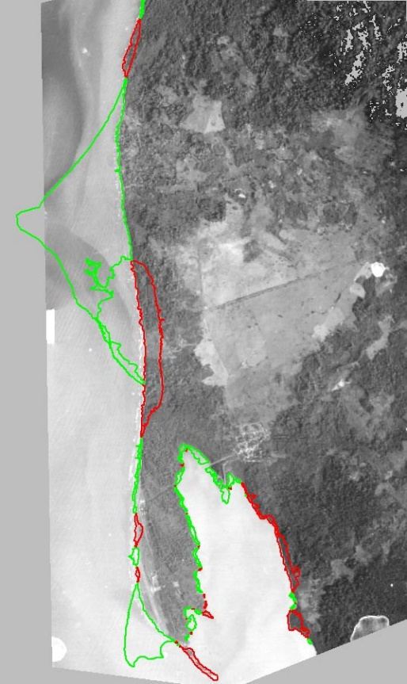{width="4.0538342082239724in" height="6.809232283464567in"}

Figura 9. Variación de la línea de costa entre la desembocadura del río Turbo, la flecha de Yarumal y la flecha de Punta de Las Vacas entre 1946 (foto aérea) y 2005. (Golfo de Urabá). Los contornos en color representan áreas erosionadas (rojo) y sedimentadas (verde) [19].

Resulta que el uso del agua del río en agricultura, la alteración de su caudal y cauce [20], produjo a partir de los años 60 del siglo XX unas alteraciones en la dinámica de la desembocadura con el crecimiento de su espacio deltaico. Interactuando con el oleaje del clima regional (cuya energía se conserva), el crecimiento deltaico progresó, haciendo la incidencia de los trenes de olas más perpendicular con respecto a la costa norte del delta [19] e impidiendo el transporte de sedimentos hacia el sur de la desembocadura. A su vez, esto produce mayor acumulación del sedimento en el delta, creciendo de manera proporcional a la tasa de avance de erosión costera flujo abajo, provocando la pérdida del terreno en el casco urbano de la ciudad, considerado en [20] como un ejemplo más para ilustrar la importancia del conocimiento científico sobre los procesos costeros y las afectaciones que hemos hecho a nivel regional y local.

+------------------------------------------------------------------------------------------------------------------------------------------------------------------------------------------------------------------------------------------------------------------------------------------------------------------------------------------------------------------------------------------------------------------------------------------------------------------------------------------------------------------------------------------------------------------------------------------------------------------------------------------------------------------------------------------------------------------------------------------------------------------------------------------------------------------------------------------------------------------------------------------+
| Caja 2. Causas del transporte litoral de sedimentos                                                                                                                                                                                                                                                                                                                                                                                                                                                                                                                                                                                                                                                                                                                                                                                                                                  |
|                                                                                                                                                                                                                                                                                                                                                                                                                                                                                                                                                                                                                                                                                                                                                                                                                                                                                          |
| El transporte litoral de sedimentos bajo el régimen micro-mareal está causado por la rotura de olas de viento en la zona costera, donde el frente de oleaje se refracta buscando llegar de forma normal a las isóbatas. Un pequeño ángulo entre la incidencia de las olas y los contornos batimétricos provoca un movimiento de aguas y sedimentos a lo largo de la costa. En presencia de una desembocadura, el aporte sedimentario del río es capaz de producir una acreción y hasta una formación deltaica. El crecimiento del delta de un río, por causa natural o antrópica, puede obstaculizar el transporte litoral debido al cambio de incidencia del oleaje sobre esta costa deformada. El proceso es progresivo en la medida de que a mayor crecimiento del delta, mayor alteración de la deriva litoral se produce y menor cantidad de sedimento flujo abajo aporta este río. |
+------------------------------------------------------------------------------------------------------------------------------------------------------------------------------------------------------------------------------------------------------------------------------------------------------------------------------------------------------------------------------------------------------------------------------------------------------------------------------------------------------------------------------------------------------------------------------------------------------------------------------------------------------------------------------------------------------------------------------------------------------------------------------------------------------------------------------------------------------------------------------------------+

¿Cuál es entonces el impacto de los cambios climáticos en la erosión costera, manifestados al menos en el aumento del nivel del mar, en comparación con las causas antrópicas locales? Definitivamente, el aumento del nivel del mar está causando siempre una erosión, nunca acreción en una costa dada. Estos cambios de escala global, al sumarse con aquellos de escala local y regional, incrementan el proceso de erosión costera, cuya dinámica sería menos pronunciada con un buen manejo de las costas.

CONCLUSIONES
============

La erosión se clasifica como una amenaza para la población, infraestructura y actividades humanas en la zona costera. Las obras de mitigación de la erosión en las costas del Caribe colombiano, en general, hasta la fecha se caracterizan como obras *duras*, generalmente de material pétreo y, con mayor frecuencia, éstas son espolones debido a su bajo costo de construcción y mantenimiento.

Sin embargo, es de resaltar la importancia de un diagnóstico detallado de las causas de erosión costera, antes de cualquier intervención mediante las obras. Las mismas estructuras podrían generar efectos negativos si las causas no fueron determinadas.

De acuerdo con lo analizado, dichas causas pueden tener el carácter global, regional, de meso-escala y/o local. La primera y segunda pueden ser reflejo de las actividades humanas a nivel global: el calentamiento global afecta el nivel del mar, lo que directamente tiene influencia sobre la erosión costera; otros efectos de variación climática cambian caudales de los ríos, el transporte de sedimentos y, por ende, posible disminución del transporte en la deriva litoral. Estos factores son *externos* en el sentido que deben ser estudiados, pero no pueden ser mitigados a nivel de un solo país.

Existen casos cuando las acciones antrópicas mediante mega obras afectan toda una región, pero, sin embargo, lo más frecuente es observar los efectos de menor escala de obras costeras pequeñas, también impactantes, pero inconscientemente ignorados. Son aquellos que corresponden a las construcciones urbanas dentro de la franja activa de una playa, pavimento y enrocado de las orillas, edificaciones, préstamo del material mineral y, finalmente, obras de protección costera no adecuadas para los sectores aledaños.

El problema de erosión crónica usualmente se asocia con el déficit de sedimentos de origen lejano o el aumento paulatino del nivel del mar, pero también puede depender de la estabilidad del perfil subacuático. Este caso se relaciona directamente con el impacto antrópico sobre las costas (construcciones en la playa seca).

En la práctica de la ingeniería costera hay que implementar las obras acordes con el clima marítimo, siempre y cuando las consecuencias de las condiciones atípicas (no del régimen) se minimicen pronto de manera natural o deben ser recuperadas mediante rellenos de mantenimiento. Las canteras en muchos casos podrían considerarse como posibles zonas de préstamo con un relleno mecánico de las playas, teniendo en cuenta que el clima de oleaje no presenta una estacionalidad fuerte, diferente de los países nórdicos donde el mantenimiento del relleno se realiza anualmente. La principal recomendación para el material de préstamo para el relleno es que éste debe ser preferiblemente más grueso que el sedimento nativo para garantizar mejor estabilidad de la playa; con esto, además, el perfil de equilibrio va a tener una inclinación mayor, lo que requiere menor volumen de material que un relleno de composición similar al sedimento original.

Pero lo más relevante en este proceso es un diseño adecuado basado en el diagnóstico de causas y correcta elección entre diversas alternativas de solución. Esta gestión inteligente de las obras costeras, puede ser una garantía en la mitigación de los posibles efectos negativos. El entender que la base científica de la dinámica litoral es primordial ante las evaluaciones económicas de corto plazo, seguramente llevará a una eficiente protección de las actividades marítimas en nuestras costas.

Además, es relevante quitar la brecha entre la teoría y la práctica, el conocimiento de la academia y la experiencia de la ingeniería costera [21].

+-----------------------------------------------------------------------------------------------------------------------------------------------------------------------------------------------------------------------------------------------------------------------------------------------------------------------------------------------------------------------------------------------------------------------------------------------------------------------------------------------------------------------------------------------------------------------------+
| PUNTOS CLAVE                                                                                                                                                                                                                                                                                                                                                                                                                                                                                                                                                            |
|                                                                                                                                                                                                                                                                                                                                                                                                                                                                                                                                                                             |
| 1.  En la erosión costera existen causas locales, regionales y globales. Usualmente las causas globales se relacionan con el aumento de nivel del mar y probablemente con alteraciones de otros parámetros del sistema climático de la Tierra. Las causas locales y regionales generalmente se deben a las intervenciones de los sistemas marítimos y fluviales mediante estructuras costeras, las cuales pueden tener un propósito para protección o aprovechamiento del litoral. Una obra de protección mal diseñada puede causar erosión en las áreas adyacentes a ella. |
|                                                                                                                                                                                                                                                                                                                                                                                                                                                                                                                                                                             |
| 2.  A lo largo de las costas del Caribe colombiano se ubican varias construcciones con diferentes fines, que causan impactos negativos de retroceso de la costa a mediano y largo plazo, comparables con el efecto paulatino de aumento del nivel del mar.                                                                                                                                                                                                                                                                                                                  |
|                                                                                                                                                                                                                                                                                                                                                                                                                                                                                                                                                                             |
| 3.  Con el fin de tomar decisiones más acertadas sobre la gestión de riesgos costeros, se debe contar con la participación de personal capacitado, herramientas científicas y capacidades tecnológicas, específicamente enfocadas en esta problemática.                                                                                                                                                                                                                                                                                                                     |
+-----------------------------------------------------------------------------------------------------------------------------------------------------------------------------------------------------------------------------------------------------------------------------------------------------------------------------------------------------------------------------------------------------------------------------------------------------------------------------------------------------------------------------------------------------------------------------+

CONFLICTO DE INTERESES

Los autores no declaran conflicto de intereses.

IDENTIFICACIÓN DE AUTOR

Serguei Lonin <https://orcid.org/0000-0001-9561-0554>

Julio Monroy <https://orcid.org/0000-0002-3981-7486>

BIBLIOGRAFÍA

1.  Douglas, B. C. (1991). Global sea level rise. *Journal of Geophysical Research: Oceans*, 96(C4), 6981-6992. <https://doi.org/10.1029/91JC00064>

2.  Rahmstorf, S. (2007). A semi-empirical approach to projecting future sea-level rise. *Science*, 315(5810), 368-370. <https://doi.org/10.1126/science.1135456>

3.  Cazenave, A., & Llovel, W. (2010). Contemporary sea level rise. *Annual review of marine science*, 2, 145-173. <https://doi.org/10.1146/annurev-marine-120308-081105>

4.  DeConto, R. M., & Pollard, D. (2016). Contribution of Antarctica to past and future sea-level rise. *Nature*, 531(7596), 591. <https://doi.org/10.1038/nature17145>

5.  Bruun, P. (1988). The Bruun rule of erosion by sea-level rise. *Journal of Coastal Research,* 4(4), 627-648.

6.  Corredor, H., J.C. Mantilla, G. Vargas (2008) Caracterización hidráulica y Sedimentológica del Río Magdalena entre El Puente Pumarejo (k22) y Bocas de Ceniza (k0). En M. Alvarado (Ed.) *Río Magdalena. Navegación Marítima y Fluvial* (1986-2008). Ediciones Uninorte, Barranquilla, Colombia.

7.  Promigas (2003). *Estudio de la línea de costa entre Bocas de Ceniza y la boca del río Toribio*. Informe técnico CIOH, mayo de 2003.

8.  Rangel-Buitrago, N.G., Anfuso, G., & Williams, A.T. (2015). Coastal erosion along the Caribbean coast of Colombia: Magnitudes, causes and management. *Ocean & Coastal Management*, 114, 129-144.

9.  Van Rijn, L.C. (1998). *Principles of Coastal Morphology*. Aqua Publ. The Netherlands.

10. Molina, A., Molina, C., Thomas, Y., & Molina, L. E. (2001). Comportamiento de la línea de costa del Caribe colombiano (Sector entre Barranquilla, desde Bocas de Ceniza hasta la Flecha de Galerazamba 1935-1996). *Boletín Científico CIOH*, 19, 68-79. https://doi.org/10.26640/22159045.101

11. Martinez, J. O., Pilkey, O. H., & Neal, W. J. (1990). Rapid formation of large coastal sand bodies after emplacement of Magdalena river jetties, Northern Colombia. *Environmental Geology and Water Sciences*, 16(3), 187-194. <https://doi.org/10.1007/BF01706043>

12. Oceanmet (2011). *Estudio Oceanográfico para el área de Los Morros. Empresa de Desarrollo de Los Morros, Sucursal Colombia*. Informe Técnico.

13. Pronósticos meteomarinos del CIOH: [www.cioh.org.co](http://www.cioh.org.co)

14. Anduckia, J.C. & Lonin, S. (2014). Acople entre modelos numéricos en el Sistema de Pronósticos Oceánicos y Atmosféricos (SPOA). *Boletín Científico CIOH*, 32, 197-210. <https://doi.org/10.26640/01200542.32.197_210>

15. Lonin, S. (2010). *Informe pericial de la Capitanía de Puerto de Cartagena*. Diciembre de 2010.

16. Lorin et al. (1973). *Estudio del régimen del Golfo de Morrosquillo, Protección de playas en Tolú. Informe General*. Cartagena.

17. Lonin, S.A. (2002). Aplicación del modelo LIZC (CIOH) para el estudio de la dinámica de playa en un sector del Golfo de Morrosquillo. *Boletín Científico CIOH*, 20, 18-27. <https://doi.org/10.26640/22159045.106>

18. Robertson, K., & Chaparro, J. (1998). Evolución histórica del delta del río Sinú. *Cuadernos de Geografía*, VII(1-2), 70-86.

19. N&M (2005). *Estudio de factibilidad de construcción de un puerto marítimo en el Golfo de Urabá*. Informe técnico - Naval & Marítima Ingeniería Ltda.

20. Alcántara-Carrió, J., Caicedo, A., Hernández, J.C., Jaramillo-Vélez, A., & Manzolli, R.P. (2019). Sediment Bypassing from the New Human-Induced Lobe to the Ancient Lobe of the Turbo Delta (Gulf of Urabá, Southern Caribbean Sea). *Journal of Coastal Research*, 35(1), 196-209.

21. Kamphuis, J.W. (2011). Coastal Engineering -- Theory and Practice. *The Proceedings of the Coastal Sediments 2011*, Miami, FL, 02-06 May 2011, 1-14.

13

[]{#_Toc47894936 .anchor}Modelo de gestión y análisis del riesgo por erosión costera. Caso de estudio departamento de Córdoba

Oswaldo Coca-Domínguez^1^, Constanza Ricaurte-Villota^1^* & David Fernando Morales Giraldo^1^

^1^Programa de Geociencias Marinas y Costeras GEO. Instituto de Investigaciones Marinas y Costeras "José Benito Vives de Andréis" INVEMAR, Calle 25 #2-55, playa Salguero, Rodadero, Santa Marta, Colombia.

*Autor de contacto: Constanza Ricaurte Villota. Programa de Geociencias Marinas y Costeras GEO. Instituto de Investigaciones Marinas y Costeras "José Benito Vives de Andréis" INVEMAR, Calle 25 #2-55, playa Salguero, Rodadero, Santa Marta, Colombia. Correo-e: <constanza.ricaurte@invemar.org.co>

Resumen

El modelo de gestión del riesgo para la erosión costera, propone un proceso integral que va de una escala regional a una local, partiendo del conocimiento del fenómeno. Incluye el trabajo integrado entre las instituciones ambientales, los entes territoriales y la comunidad, el monitoreo técnico del fenómeno y los estudios de amenaza y vulnerabilidad por erosión costera, los cuales permitieron identificar las zonas críticas del departamento. Al aumentar la escala y resolución del estudio se definió un modelo conceptual con una propuesta de alternativas mixtas, donde se incluye métodos basados en ecosistemas, que puedan mitigar los impactos. Por último, se realizaron los estudios científicos de detalle (físico, biótico y social) y de validación de estas alternativas y su priorización para ejecución, teniendo en cuenta las políticas o herramientas de planificación del territorio. Convirtiéndose este, en un proceso detallado y planificado para hallar las mejores alternativas de mitigación, prevenir daños y ahorrar costos en alternativas que no generen los efectos positivos esperados. La implementación de esta metodología en el corregimiento de Santander de la Cruz permitió priorizar las alternativas de la siguiente manera: (1) recuperación de las puntas de la bahía con base en la estabilidad del acantilado, (2) manejo de las fuentes de sedimento, (3) control de la extracción de arena, (4) intervención con arrecifes artificiales o barreras sumergidas, (5) reforestación de manglar o bosque seco, y (6) reubicación.

Palabras clave

Adaptación basada en ecosistemas, alternativas de mitigación y control, amenaza y vulnerabilidad, geoamenazas, gestión del riesgo

Risk Management and Analysis Model for Coastal Erosion. Case Study Department of Córdoba

Abstract

The risk management model for coastal erosion proposes an integral process that goes from a regional to a local scale, based on knowledge of the phenomenon. It includes integrated work between environmental institutions, territorial entities and the community, technical monitoring of the phenomenon and studies of hazard and vulnerability by coastal erosion, which allowed identifying the department's critical areas. By increasing the study's scale and resolution, a conceptual model was defined with a proposal for mixed alternatives, including ecosystem-based methods that can mitigate the impacts. Finally, the detailed scientific studies (physical, biotic and social) and validation of these alternatives and their prioritization for execution were carried out, taking into account the planning policies or tools of the territory. Turning this into a detailed and planned process to find the best mitigation alternatives, prevent damage and save costs on alternatives that do not generate the expected positive effects. The implementation of this methodology in the district of Santander de la Cruz allowed prioritizing the alternatives as follows: (1) Recovery of the tips of the bay based on the stability of the cliff, (2) management of sediment sources, (3) control of sand extraction, (4) intervention with artificial reefs or submerged barriers, (5) reforestation of mangroves or dry forest, and (6) relocation.

Keywords

Alternatives for mitigation and control, ecosystem-based adaptation, geohazards, hazard and vulnerability, risk management

INTRODUCCIÓN
============

Las zonas costeras cada vez tienen más presiones antrópicas, principalmente asociadas al turismo y las actividades portuarias, generando mayor ocupación, transformación y degradación de ecosistemas, lo que muchas veces se refleja en impactos negativos sobre el paisaje y el territorio. Sumado a todo esto, se encuentran las diferentes amenazas costeras, que en algunos casos se aceleran por procesos relacionados con el cambio climático, entre ellos encontramos huracanes, tsunamis, mares de leva, frentes fríos, erosión costera y ascenso del nivel de mar [1], que terminan por aumentar el peligro y por consiguiente el riesgo de los diferentes elementos expuestos de la zona costera [2].

Con respecto a la erosión costera, esta se define como la invasión de la tierra por el mar, o como el retroceso de la línea de costa con pérdidas importantes de terrenos que albergan ecosistemas aptos para las actividades humanas [3] y entre las causas naturales de la erosión costera se encuentran el aumento del nivel del mar (ANM), los eventos climáticos extremos, las características de las rocas y sedimentos, movimientos verticales del terreno, entre otros [4], lo cual desequilibra el balance de sedimentos, fundamental en sectores de playa. Pero también se encuentran causas relacionadas con la intervención humana, las cuales son muchas y son probablemente las responsables del aumento en la tasa de erosión, como por ejemplo la mala gestión de las zonas costeras, la extracción de arenas y guijos en las playas o en el lecho de los ríos; la tala indiscriminada del mangle y el daño a los arrecifes de coral (ecosistemas que dan una importante protección natural a la línea de costa), la construcción de represas que alteran el aporte de sedimentos desde las cuencas, la instalación de obras fijas que perturban los procesos de transporte litoral, etcétera .

Para poder sobrellevar todas estas acciones, impactos y causas, toma importancia la planificación costera, la cual en general se desarrolla en el mundo y en Colombia [5,6], y la planificación en relación directa con los procesos de erosión costera, la cual se ha visto con diferentes enfoques como la gestión del territorio y específicamente las alternativas de adaptación y mitigación de obras en general [7,8,9], y basada en ecosistemas [10,11,12]. No hay muchos trabajos relacionados con la gestión del riesgo para la erosión costera y los que se han realizado abordan índices de riesgo, políticas o estrategias integrales [13,14,8].

La gestión del riesgo de desastres es un enfoque de gestión por procesos, lo que permite implementar la gestión en un sentido transversal, que parte del conocimiento del riesgo de desastres, permitiendo tomar medidas correctivas y prospectivas para la reducción del riesgo y fortalecer el proceso del manejo de desastres [4]. En la gestión del riesgo de desastres es de vital importancia el conocimiento de las amenazas como la erosión costera, y su mitigación es un reto para el mundo y para el país. Para lo cual el análisis de amenaza y vulnerabilidad por erosión costera se convierte en un insumo importante en la gestión del riesgo por este fenómeno, además de constituir información clave para el ordenamiento de las zonas costeras y la generación de los planes o esquemas de ordenamiento territorial, y donde se debe velar por su inclusión en los instrumentos de planificación, en la educación ambiental y los proyectos de adaptación basados en ecosistemas [4,15].

A nivel mundial son diversos los métodos o alternativas que existen para defender la costa de la erosión. Sin embargo, ninguna técnica resulta adecuada si carece de estudios pertinentes que garanticen su eficiencia. Algunos de los métodos más empleados comprenden "obras duras" que modifican la dinámica (muros, espigones, rompeolas) causando la reflexión, difracción o refracción de las olas incidentes, pero la experiencia a nivel mundial ha demostrado que estos tipos de estructuras solo tienen efectos positivos en el ámbito local y a corto plazo [16,17]. Por otro lado, también existen alternativas y métodos blandos o algunos ejemplos de estrategias de defensa basadas en la naturaleza, como restauración de manglares, arrecifes, cultivo de ostras, entre otros [18], las cuales no alteran la dinámica costera normal, ya que proponen la simple reconstitución de la playa o ecosistema costero original, controlando la energía de olas, la composición granulométrica y la pendiente de la playa [19]. De acuerdo con ello y fundamentados en los estudios realizados anteriormente en cada una de las áreas prioritarias, y como avance en el conocimiento y aportando lineamientos para el control de la erosión en la zona costera del departamento de Córdoba, se plantean alternativas para la mitigación basadas en medidas blandas y duras o mixtas, que incluyen además estrategias de planificación y ordenamiento del territorio.

Por último, para poder llegar a los Planes Locales de Ordenamiento del Territorio (POT) o planes de etno-desarrollo, es necesario entender el territorio, el cual es un concepto multidimensional que delimita la propiedad y garantiza el uso de los recursos contenidos en una porción de superficie terrestre, en donde al interior cohabitan o coexisten grupos sociales con diversos intereses económicos, sociales y culturales, destacando la relación entre el capital y las comunidades locales que privilegian usos ancestrales [20]. En este mismo territorio convergen estas prácticas sociales, económicas y culturales con todo lo relacionado con el ambiente y sus recursos, obteniendo una visión de paisaje, donde los ecosistemas, el agua, la tierra y el clima juegan un papel fundamental en esta visión integradora del territorio. Bajo esta premisa, la ordenación del territorio debe abordarse a partir de conceptos híbridos como topo-climatología cultural, ciclos hidro-sociales [21] o ecología cultural [22,23] y perspectivas multidisciplinarias que integren la naturaleza y la sociedad.

Área de estudio
---------------

El Departamento de Córdoba tiene 172.67 km de línea de costa (WGS-1984-UTM) sobre el mar Caribe, de los cuales 115.62 km son acantilados y 57.05 km son playas y manglares [4], se divide administrativamente en cinco municipios costeros: Los Córdobas, Puerto Escondido, Moñitos, San Bernardo del Viento y San Antero (Fig. 1).

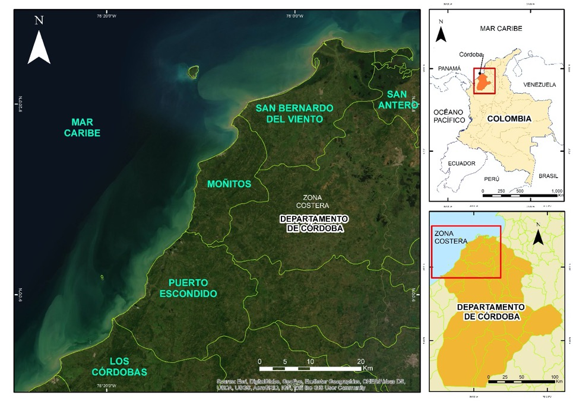{width="6.435583989501312in" height="4.54982283464567in"}Figura 1. Área de estudio: Departamento de Córdoba (Municipios de Los Córdobas, Puerto Escondido, Moñitos, San Bernardo del Viento y San Antero).

El corregimiento de Santander de la Cruz hace parte del municipio de Moñitos (Córdoba) y se encuentra entre la punta Coquito y la punta de la Cruz o del Cementerio (Fig. 2). El acceso al corregimiento es por una vía destapada de 9 km desde la entrada sur de la cabecera municipal de Moñitos. El paisaje lo conforman un mosaico de cultivos de plátano, palmas de coco, pastos y bosques.

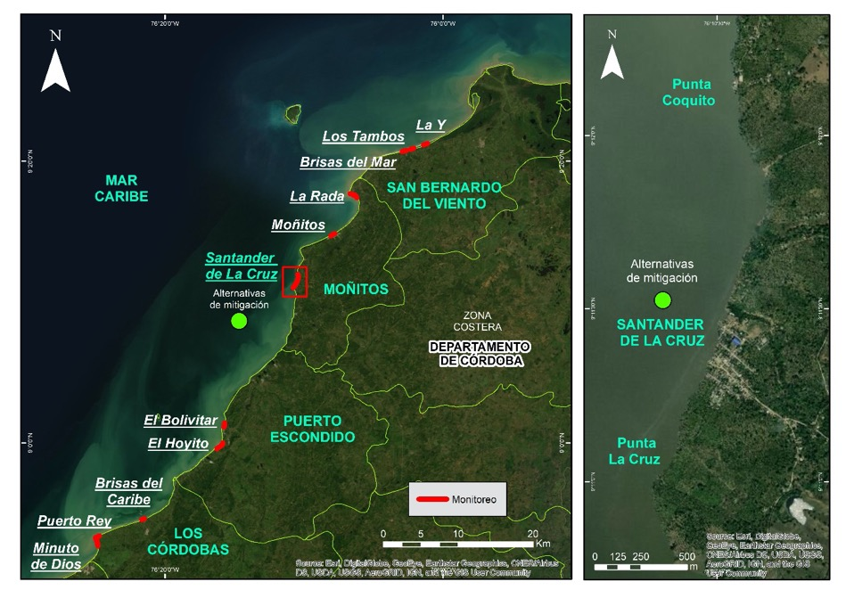{width="6.324295713035871in" height="4.471145013123359in"}Figura 2. Ubicación del área de estudio para alternativas de adaptación (Santander de la Cruz) y monitoreo basado en cambios de línea de costa (Localidades de municipios).

LINEAMIENTOS PARA LA GESTIÓN DEL RIESGO POR EROSIÓN COSTERA (PLAN DE ACCIÓN 2016 -- 2020, DEPARTAMENTO DE CÓRDOBA)
==================================================================================================================

El Plan de Acción para la Gestión del Riesgo y la Erosión Costera en el departamento de Córdoba 2016--2020, junto con los lineamientos fueron una herramienta de contribución a la implementación de acciones para el manejo, control, prevención y mitigación de la erosión costera; así como también a la inclusión de la gestión del riesgo por erosión costera. Estos lineamientos se articularon con el PNIEC (Plan Nacional de Investigación de la Erosión Costera [24], el cual incluye nueve objetivos que propenden por: 1) caracterizar el riesgo, 2) analizar el escenario de riesgo, 3) mitigar, 4) monitorear, 5) controlar, 6) prevenir y capacitar, 7) intervención correctiva, 8) intervención prospectiva y 9) gestionar. Se sugiere que las autoridades ambientales regionales procuren su ejecución a corto y largo plazo.

+---------------------------------------------------------------------------------------------------------------------------------------------------------------------------------------------------------------------+
| Caja 1. Medidas blandas y duras de acuerdo con escenarios de riesgo                                                                                                                                             |
|                                                                                                                                                                                                                     |
| De acuerdo con el análisis de los escenarios de riesgo por erosión costera en el departamento de Córdoba, como medidas de mitigación se sugiere la implementación de medidas blandas y duras de la siguiente forma: |
|                                                                                                                                                                                                                     |
| 1.  Siembra y restauración ecológica del ecosistema de manglar, corales, entre otros.                                                                                                                               |
|                                                                                                                                                                                                                     |
| 2.  Diseño de relleno artificial de arena y restauración de playas.                                                                                                                                                 |
|                                                                                                                                                                                                                     |
| 3.  Obras de disminución de la pendiente de acantilados.                                                                                                                                                            |
|                                                                                                                                                                                                                     |
| 4.  Construcción de estructuras duras para la recuperación de las puntas.                                                                                                                                           |
+---------------------------------------------------------------------------------------------------------------------------------------------------------------------------------------------------------------------+

Para el desarrollo del Plan de Acción 2016--2020 se identificaron actores de relevancia tales como MADS (Ministerio de Ambiente y Desarrollo Sostenible), DIMAR (Dirección General Marítima de la armada), SGC (Servicio Geológico Colombiano), CIOH (Centro de Investigaciones Oceanográficas e Hidrográficas), INVEMAR (Instituto de Investigaciones Marinas y Costeras, IDEAM (Instituto de Hidrología, Meteorología y Estudios Ambientales), IAVH (Instituto Alexander Von Humboldt), ASOCARS (Asociación de Corporaciones Autónomas Regionales), entes territoriales (alcaldías, gobernaciones), IGAC (Instituto Geográfico Agustín Codazzi), ANLA (Autoridad de Licencias Ambientales), y DNP (Departamento Nacional de Planeación), entre otros.

Finalmente, el avance del plan de acción 2016--2020 para la Gestión del Riesgo y la Erosión Costera en el departamento de Córdoba, armonizado con los objetivos planteados en el PNIEC se puede resumir de la siguiente manera:

-   Objetivo 1. Conocimiento del riesgo -- caracterización: Abarcó el levantamiento de la línea base de la caracterización del riesgo por erosión costera en el departamento de Córdoba, involucrando la inter institucionalidad representada por CVS, SGC, IGAC, IDEAM, DIMAR, INVEMAR, CIOH, entre otros.

-   Objetivo 2. Análisis del riesgo: Para realizar un análisis del riesgo asociado a la problemática de erosión costera en el departamento de Córdoba se identificó y evaluó la amenaza y vulnerabilidad de los elementos expuestos de la zona costera de la región.

-   Objetivo 3. Mitigar: La mitigación de los efectos ocasionados por la erosión costera en el departamento de Córdoba se abordó desde el diseño de alternativas de solución de la problemática, posteriormente el monitoreo de las alternativas implementadas evaluará la eficacia de las acciones desarrolladas.

-   Objetivo 4. Monitorear: La implementación de sistemas de monitoreo de litorales en el departamento de Córdoba ha contribuido al conocimiento de la dinámica litoral en la región y la toma adecuada de decisiones por parte de autoridades ambientales y entes territoriales locales.

-   Objetivo 5. Controlar: El ejercicio de control de las actividades que contribuyen y acrecientan la problemática de la erosión costera, reducirá la problemática y fortalecerá las competencias de la autoridad ambiental en el departamento.

-   Objetivo 6. Prevenir -- capacitar: La prevención aporta significativamente a la reducción de la problemática a través de medidas que contribuyan a la conservación de los ecosistemas que dan protección a la costa, así como preparar a la comunidad.

-   Objetivo 7. Intervención correctiva: Para el desarrollo de este objetivo se plantea la definición de las alternativas de intervención para reducir la vulnerabilidad y riesgo por erosión costera en el departamento de Córdoba.

-   Objetivo 8. Intervención prospectiva: La proyección de intervención prospectiva incluye la incorporación de los escenarios de riesgos por erosión costera en los instrumentos de planificación para su adecuado manejo, y la implementación de tecnologías que permitan anticiparse a eventos de riesgo por erosión costera.

-   Objetivo 9. Gestionar: La inclusión de la gestión del riesgo en las políticas de manejo y ordenamiento costero del departamento de Córdoba por parte las instituciones involucradas.

El plan de acción y los lineamientos se integraron bajo un esquema conceptual (Fig. 3), donde en primera instancia, se debe tener en cuenta las perspectivas marinas y continentales, esto significa que cada zona tomará en cuenta las condiciones ambientales intrínsecas, este es la premisa para llevar a cabo este proceso, conocer los parámetros naturales y sociales de cada zona o región. Otro factor de gran importancia son los impactos generados por el cambio climático, las variaciones del clima a gran escala en espacio y tiempo, las decisiones que se tomen deberán tener en cuenta las condiciones de cambio de climático futuro como factores de riesgo y estrategias de adaptación.

{width="6.692853237095363in" height="4.525in"}

Figura 3. Esquema conceptual de los lineamientos para la gestión del riesgo por erosión costera.

IDENTIFICACIÓN DE ZONAS CRÍTICAS: DEPARTAMENTO DE CÓRDOBA
=========================================================

Para la identificación de zonas críticas se relacionaron los resultados de amenaza y vulnerabilidad por erosión costera, así mismo se tuvo en cuenta la información de los monitoreos de la zona costera y el análisis de cambios de la línea de costa.

Amenaza y vulnerabilidad por erosión costera
--------------------------------------------

Los resultados de amenaza y vulnerabilidad por erosión costera para el departamento de Córdoba, se basaron en la metodología propuesta por Coca-Domínguez y Ricaurte-Villota [15]. Donde para la amenaza tuvieron en cuenta diferentes variables físicas para tres componentes: magnitud, susceptibilidad y ocurrencia. De la misma manera para la vulnerabilidad, se enfocaron en tres componentes (variables socioeconómicas y ecológicas): elementos expuestos, fragilidad y falta de resiliencia. Todo esto se presenta en cinco niveles de calificación: muy alta, alta, media, baja y muy baja [4,15]. De igual manera, los resultados para Colombia obtenidos con este método se presentaron en Ricaurte-Villota *et al*., [4]. Se observó para el departamento de Córdoba, que la amenaza muy alta por erosión costera se presenta en el 6% de la línea de costa, localizada sobre los poblados de Santander de la Cruz, Puerto Rey y Minuto de Dios; la amenaza alta es la de mayor cobertura con un 51%, seguido por el 31% de la clasificación media, y por último, la amenaza baja con un 12% (Fig. 4a).

En cuanto la vulnerabilidad de la población y los ecosistemas por erosión, la zona costera de Córdoba presenta una vulnerabilidad media de 26%, alta de 69%, y muy alta de 5%. En este último rango se encuentran los sectores de Santander de la Cruz, Moñitos y La Rada [4] (Fig. 4b).

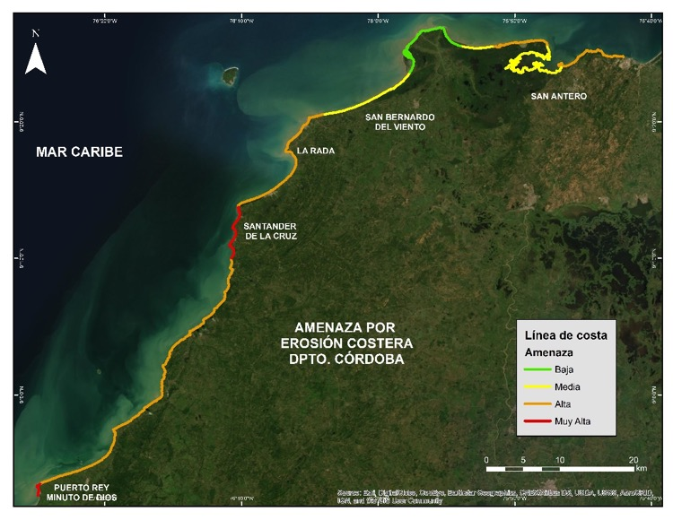{width="4.999877515310586in" height="3.8635411198600176in"}

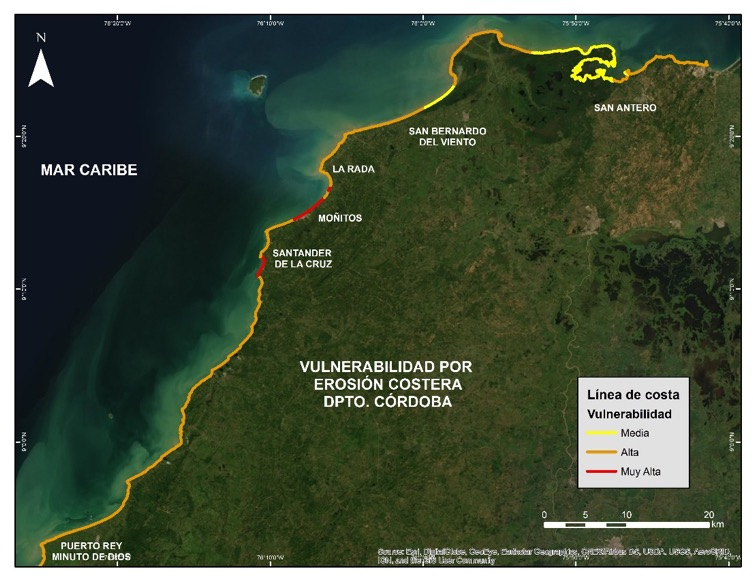{width="5.020933945756781in" height="3.8798129921259843in"}

Figura 4. Mapas de amenaza (arriba) y vulnerabilidad (abajo) por erosión costera en el departamento de Córdoba. Modificado de Ricaurte-Villota *et al*. [4]. Con permiso de modificación.

Monitoreo de la erosión costera
-------------------------------

El Monitoreo se hace a partir de la toma de datos estacionales, levantados *in situ* con DGPS y con el fin de conocer fluctuaciones intranuales, la cual es independiente de metodologías que usan otro tipo de sensores remotos y se emplean para temporalidades más amplias. En este caso, los resultados también permiten identificar una tendencia a corto plazo y es óptima para la toma de decisiones. Para este monitoreo, los levantamientos de líneas de costa se llevaron a cabo entre 2015 y 2019, siendo tomados en época seca y época húmeda, esto para observar los cambios estacionales, definidos por Ricaurte-Villota y Bastidas-Salamanca [25].

Cambios de la línea de costa

La línea de costa se adquirió en campo a través de recorridos paralelos al mar, delineando la zona de cambio de pendiente en las playas, es decir el límite entre el frente de playa y la playa trasera, igualmente se tomó en la zona de acantilados el borde alto, esta definición es usada como variación morfodinámica y permite determinar la variación estacional [26]. Esta adquisición se realizó mediante tecnología GNSS con corrección diferencial post-proceso, posteriormente se estimaron los cálculos de los cambios cuantitativos (acumulación y/o erosión) de las líneas de costa, obteniendo su evolución.

Las variaciones se midieron empleando la extensión Digital Shoreline Analysis System (DSAS) [27] en el software ArcGIS 10.5. Esta extensión permite calcular estadísticas para analizar el comportamiento o los cambios en la línea de costa, dentro de un intervalo de tiempo estudiado [28]. Se tomaron como datos estadísticos el Linear Regression (LRR), el cual permite determinar la tasa de regresión lineal según la posición de la línea de costa con respecto al tiempo o fecha, tomando todas las líneas de costa del monitoreo y calculando bajo ecuación, donde la pendiente describe las tasas de cambio de la línea, dada en metros por año. Se clasificaron los resultados así: Muy Alta (LRR<-1 m/año), Alta (-1>LRR<-0.5), Estable (-0.5<LRR>0.5) y Acreción (LRR>0.5). Este resultado nos ayuda a entender cómo y cuál es la tendencia de la línea de costa, teniendo en cuenta las épocas climáticas, las cuales modulan su comportamiento. Resultados y análisis en la Tabla 1.

Tabla 1. Resultados de los cambios en la línea de costa para cada sector.

  Lugar                           Resultado
  ----------------------------------- -----------------------------------------------------------------------------------------------------------------------------------------------------------------------------------------------------------------------------------------------------------------------------------------------------------------------------------------------------------------------------------------------------------------------------------------
  Puerto Rey                          Se observó el retroceso continuo en los sectores adyacentes al enrocado protector de la vía y en las viviendas que se sitúan en dirección sur de la línea de costa (Fig. 5a). Valores máximos = MUY ALTA
  Minuto de Dios                      Presenta retroceso en toda la zona del poblado (se excluye la zona no poblada); la regresión lineal presenta pérdidas de -24.28 m/año (Fig. 5a). Valores máximos = MUY ALTA
  El Bolivitar                        Está marcada en la zona sur, por una estabilidad (valores que no superan 1 m/año) y acreción en la sombra de los rompeolas que apenas llega a los 1.29 m/año; en la zona norte se observaron procesos de retroceso que llegan a los -1.84 m/año (Fig. 5b). Estos valores muestran que la playa fluctúa con valores cercanos a cero (0), responde a las variaciones estacionales, pero con una tendencia a la erosión costera. ACRECIÓN.
  Brisas del Caribe                   La tendencia general es de acreción, lo que quiere decir que esta playa se mantiene bajo los procesos estacionales sin procesos tendenciales de erosión costera (Fig. 5c).
  El Hoyito                           La tendencia mostró una playa en acreción, sin procesos de erosión costera y en buen estado, respondiendo a la variación estacional sin afectaciones negativas.
  Moñitos                             La playa presenta una tendencia de acreción -- estabilidad (hasta 7.08 m/año) (Fig. 5d).
  La Rada                             La costa puede dividirse en 3 partes de acuerdo a su tendencia: la primera parte es hacia el acantilado (al norte), donde los valores tienen tramos de estabilidad y erosión leve; la segunda es de acreción, la cual se genera en la playa norte; por último, el tramo de playa del sur, donde la erosión es alta y alcanza los -21.57 m/año (Fig. 5e). MUY ALTA.
  Playas de San Bernardo del Viento   La tendencia en La Y es de acreción (4.66 m/año), con algunos tramos de estabilidad (Fig. 5f). En Brisas del Mar la tendencia es hacia la acreción (4.2 m/año) (Fig. 5g). En Los Tambos la tendencia es hacia la acreción costera, la cual alcanzo los 12.18 m/año (Fig. 5h). ACRECIÓN.
  Santander de la Cruz                Presenta una tendencia general hacia la erosión costera con tasas de hasta -4 m/año (Fig. 5i). MUY ALTA.

{width="6.047931977252843in" height="7.272221128608924in"}

Figura 5. Cambios en línea de costa tendenciales para las zonas de monitoreo del departamento. (a) Minuto de Dios y Puerto Rey, (b) playa El Bolivitar, (c) playa Brisas del Caribe, (d) Moñitos, (e) La Rada, (f) La Y, (g) Brisas del Mar, (h) Los Tambos, (i) Santander de la Cruz. Clasificación: Muy Alta (LRR<-1 m/año), Alta (-1>LRR<-0.5), Estable (-0.5<LRR>0.5) y Acreción (LRR>0.5).

Priorización de áreas o definición de puntos críticos por erosión costera
-------------------------------------------------------------------------

La priorización de áreas o definición de puntos críticos de erosión costera, corresponde con los sitios donde dicho fenómeno podría generar daños en población o pérdida de ecosistemas, lo que permite identificar las áreas que requieren medidas a corto, mediano y largo plazo. Para la priorización de áreas, inicialmente se relacionaron los resultados de amenaza y vulnerabilidad mediante una matriz, donde se tomaron la clasificación media, alta y muy alta. Se asignaron valores a cada clase: media (1), alta (3) y muy alta (5), siendo en sumatoria el máximo valor 10 y el mínimo 2, clasificando con intervalos iguales se tuvo: media <4.6, alta 7.3 > 2.6 y muy alta >7.3 (Tabla 2).

Adicionalmente se tomaron en cuenta los resultados del monitoreo de erosión costera, para lo cual se asignaron tres clasificaciones: los que mostraban una tendencia hacia la erosión costera (Alta y Muy Alta) o hacia procesos de acreción. Con valores asignados de acreción (1), erosión Alta (4) y Muy Alta (5). Posteriormente se cruzó con los resultados de la matriz A*V y se usó la misma clasificación de intervalos de la Tabla 2 para obtener las zonas prioritarias (Tabla 3).

Tabla 2. Relación entre amenaza y vulnerabilidad para priorización de áreas.

+----------------------+--------------+-----------------------------+--------------+---------------+----------------------+
|                      |              | Grado de vulnerabilidad |              |               |                      |
+======================+==============+=============================+==============+===============+======================+
|                      |              | Media (1)                   | Alta (3)     | Muy Alta (5)  |                      |
+----------------------+--------------+-----------------------------+--------------+---------------+----------------------+
| Grado de Amenaza | Media (1)    | Media (2)                   | Media (4)    | Alta (6)      | A * V           |
|                      |              |                             |              |               |                      |
|                      |              |                             |              |               | Zona Prioritaria |
+----------------------+--------------+-----------------------------+--------------+---------------+----------------------+
|                      | Alta (3)     | Media (4)                   | Alta (6)     | Muy Alta (8)  |                      |
+----------------------+--------------+-----------------------------+--------------+---------------+----------------------+
|                      | Muy Alta (5) | Alta (6)                    | Muy Alta (8) | Muy Alta (10) |                      |
+----------------------+--------------+-----------------------------+--------------+---------------+----------------------+

Los poblados que tienen prioridad Muy Alta para intervención son Puerto Rey, Minuto de Dios, La Rada, Santander de la Cruz y Broqueles. El resto del departamento estudiado se encuentra en prioridad Alta, lo que significa que se debe intervenir de corto a mediano plazo, ya que, si no se toman medidas, los riesgos pueden ir en aumento (Tabla 3).

Tabla 3. Tabla de priorización de áreas. Información derivada del monitoreo*.

  Municipio                 Localidad                Erosión costera*   Amenaza X Vulnera   Prioridad
  ----------------------------- ---------------------------- ----------------------- ----------------------- ---------------
  Los Córdobas              Puerto Rey                   Muy Alta (5)            Muy Alta (5)            Muy Alta (10)
                                Minuto de Dios               Muy Alta (5)            Muy Alta (5)            Muy Alta (10)
                                Brisas del Caribe            Acreción (1)            Alta (3)                Media (4)
  Puerto Escondido          El Bolivitar                 Acreción (1)            Alta (3)                Media (4)
                                San Miguel                   (0)                   Alta (3)                Media (3)
  Moñitos                   La Rada                      Muy Alta (5)            Muy Alta (5)            Muy Alta (10)
                                Santander de la Cruz         Muy Alta (5)            Muy Alta (5)            Muy Alta (10)
                                Moñitos                      Acreción (1)            Muy Alta (5)            Alta (6)
  San Bernardo del Viento   Paso Nuevo                   (0)                   Alta (3)                Media (3)
                                Playas del viento            Acreción (1)            Media (1)               Media (2)
  San Antero                Playa Blanca y El Porvenir   (0)                   Alta (3)                Media (3)

MODELO CONCEPTUAL DE ALTERNATIVAS DE MITIGACIÓN: SANTANDER DE LA CRUZ.
======================================================================

Alternativas propuestas
-----------------------

Las alternativas propuestas se adaptaron a partir del trabajo desarrollado por MADS-DELTARES-INVEMAR. (2013) [10], con base en la iniciativa *Building with Nature,* tomando en cuenta en el caso específico de Santander de la Cruz otras necesidades derivadas de trabajos con la comunidad y estudios previos. Para cada zona se elaboraron dos modelos, uno del estado actual y el segundo con las alternativas de mitigación propuestas, estos se desarrollaron a través de cartografía social, en talleres con la comunidad e imágenes de sensores remotos. Las propuestas principales son las siguientes (Tabla 4):

Tabla 4 Alternativas propuestas.

  Alternativa                                                                     Descripción
  ----------------------------------------------------------------------------------- -----------------------------------------------------------------------------------------------------------------------------------------------------------------------------------------------------------------------------------------------------------------------------------------------------------------------------------------------------------------------------------------------------------------------------------------------------------------------------------------------------------------------------------------------------------------------------------------------------------------------------------------------------------------------------------------------------------------------------------
  Reforestación y restauración (manglares, arrecifes artificiales, entre otros)   La estructura de los manglares, en virtud de sus raíces aéreas ayuda a contrarrestar los efectos de la energía del oleaje y propicia paralelamente la sedimentación y la estabilidad de la línea de costa [29]. La implementación de arrecifes artificiales consiste en estructuras aisladas metálicas (preferiblemente no de concreto) que no causan interrupción de la deriva litoral [30], esta forma es diferente a la siembra de arrecife, la cual depende de la previa existencia de manera natural. Su implementación permite la disminución de la energía del oleaje incidente, con el objetivo de generar una zona de calma en la parte posterior que disminuya la erosión y propicie la regeneración en las costas.
  Alimentación de playas                                                          Consiste en provocar en la playa un aumento artificial del volumen de arena a través de un suministro externo de arena en el segmento de la misma que se pretende proteger. Puede colocarse la arena en un solo tramo aguas arriba de la playa o renovarse en varios puntos a lo largo de ella, cerca de la línea de costa. Para que el transporte de deriva se encargue de distribuir los sedimentos (Esta técnica exige mantenimiento periódico) [29].
  Reubicación de viviendas                                                        Esta alternativa no pretende ser la única para una zona en particular, primordialmente esta solución se usa con otras de manera integral, y solo se propuso para casos extremos. La reubicación de viviendas en muchos casos es costosa, pero la solución es a largo plazo. En la medida de lo posible la relocalización de viviendas se presenta haciendo énfasis en los aspectos socio-económicos y de zonas seguras.
  Estabilización de acantilados y perfilamiento                                   El objetivo de esta técnica es definir el ángulo adecuado y aumentar la estabilidad del talud, la cual está en función del tipo de roca, la estructura geológica, el contenido de agua y la altura, el perfilador no es sin embargo aplicable a todos los tipos de rocas y requiere que haya espacio suficiente para que el talud pueda extenderse; además, debe ir acompañada de obras complementarias de drenaje y regeneración de cobertura vegetal [19].

Santander de la Cruz
--------------------

Santander de la Cruz es una de las áreas más afectadas por la erosión costera en el departamento de Córdoba. Actualmente la población se encuentra sobre la playa y la acción de las olas incide sobre los patios de las viviendas causando grandes pérdidas económicas (Fig. 6a). A partir de la configuración del estado actual y de los talleres con la comunidad, se propusieron las siguientes alternativas de mitigación y se generó el siguiente modelo conceptual.

Debido a la proximidad de las casas con el mar, se hace necesario un plan de reubicación para la primera línea de viviendas y una reforestación de manglar en toda la zona litoral, principalmente en las áreas aledañas a los ríos. A pesar de la presencia de afluentes y que la deriva litoral no presenta ninguna intervención de obras de contención, la dinámica del oleaje no permite la sedimentación en la costa y la tendencia históricamente se ha marcado por procesos de retrocesos de la línea (Fig. 6b). Por otro lado, se hace importante la intervención de arrecifes artificiales en pro de reducir la energía incidente de las olas sobre la costa. Se debe tener control de la extracción de arena que padecen las playas actualmente y los procesos de deforestación del manglar alrededor de los ríos, cada una de estas intervenciones aportan al desequilibrio del sistema.

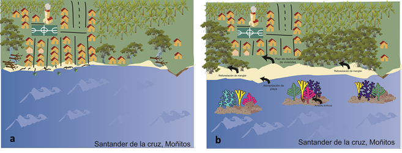{width="6.125in" height="2.339770341207349in"}

Figura 6. Estado identificado (2017) de zona costera de Santander de la Cruz (a) y Modelo conceptual de las alternativas para el control de la erosión costera en Santander de la Cruz (b).

ESTUDIOS TÉCNICOS DE VALIDACIÓN Y PRIORIZACIÓN DE ALTERNATIVAS DE MITIGACIÓN: SANTANDER DE LA CRUZ
==================================================================================================

A partir del análisis de las alternativas de mitigación definidas en la sección anterior, de los resultados del monitoreo de erosión costera y los componentes de investigación, se establecieron los estudios base requeridos para la evaluación de factibilidad de las estrategias de mitigación planteadas. Los estudios contemplaron ocho componentes o disciplinas científicas, los cuales a su vez poseen unas variables o sub-disciplinas que permitieron desarrollar el tipo de muestreo o adquisición de información general. Teniendo en cuenta lo anterior, las alternativas de mitigación se relacionaron con los componentes o disciplinas, los cuales a su vez permitieron identificar la información específica a levantar (Tabla 5).

Tabla 5. Relación de las alternativas de mitigación con los componentes principales, mostrando la información a levantar.

  #   Alternativas                                                                                                                                                                                                                                      Componentes                 Información
  -------- ----------------------------------------------------------------------------------------------------------------------------------------------------------------------------------------------------------------------------------------------------- ------------------------------- ----------------------------------------------------------------------------------------------------------
  1        Debido a la proximidad e inminente riesgo de las casas frente al mar, se analizó la posibilidad de reubicación para la primera línea de viviendas.                                                                                                    Socioeconómico y físico         Usos del suelo, POT, geomorfología, geología, riesgos, pronóstico de comportamiento de la línea de costa
  2        Reforestación de manglar en toda la zona litoral, principalmente en las áreas aledañas a los ríos.                                                                                                                                                    Biofísico                       Sedimentos y flora
  3        Intervención con arrecifes artificiales en pro de reducir la energía incidente de las olas sobre la costa o estructura de baja cota de coronación o rompeolas.                                                                                        Hidrodinámica                   Oleaje, corrientes, turbidez, etc. Batimetrías, fondos, sedimentos, etc.
  4        Ninguna construcción de obras duras sobre la línea de costa de Santander, el sistema puede tener la capacidad en la producción de sedimento para la evolución acumulativa de la playa, pero se debe revisar que sucede con la fuente de sedimentos.   Dinámica litoral                Transporte de sedimentos, sedimentología.
  5        Control de la extracción de arena que padecen las playas actualmente y los procesos de desforestación sobre los ríos, cada una de estas intervenciones aportan al desequilibrio del sistema                                                           Sedimentológico, biótico         Áreas deforestadas y fuentes de material
  6        Al igual que La Rada, los representantes de Santander proponen la implantación y recuperación de las puntas de la bahía.                                                                                                                              Hidrodinámica y Morfodinámica   Oleaje, corrientes, Transporte de sedimentos

Reubicación

A partir del estudio de cambios en la línea de costa entre los años 1981 y 2018, es decir 37 años de intervalo, usando imágenes de sensores remotos (1981, 2004, 2007, 2011, 2015 y 2018), y tomando como base la regresión lineal del DSAS (LRR), se realizó la proyección de la línea de costa hasta el año 2028, el cual mostró como se perderían viviendas que se localizan en la primera línea, generando pérdida de infraestructura local (Fig. 7a). La alternativa de reubicación en el corregimiento de Santander de La Cruz es poco factible debido a dos razones principales. La primera, es la falta de confianza de los habitantes en los gobiernos locales o regionales, así como la poca capacidad y voluntad institucional para llevar a cabo una alternativa de gran magnitud, debido a que se requeriría de buena planificación, negociaciones con propietarios y amplios recursos económicos, que garanticen el éxito de una reubicación para minimizar los impactos en los pobladores y el corregimiento. La segunda, es el uso turístico y recreacional del 33% de las construcciones en el frente de playa (Fig. 7b), lo que dificultaría la voluntad de sus dueños frente a una negociación de relocalización por no poder ejercer la actividad económica. Solo el grupo de viviendas de uso residencial podrían ser manejadas con este tipo de intervención.

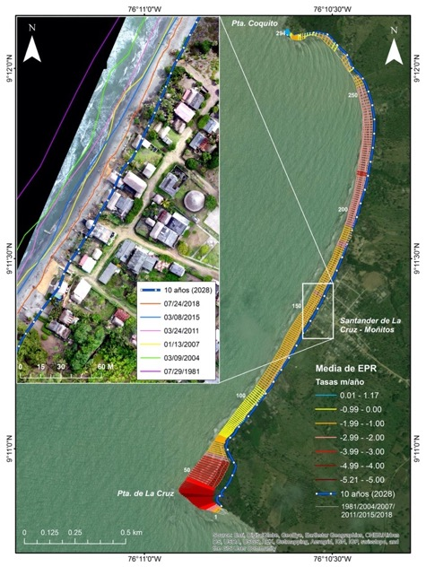{width="3.1345931758530186in" height="4.17624343832021in"}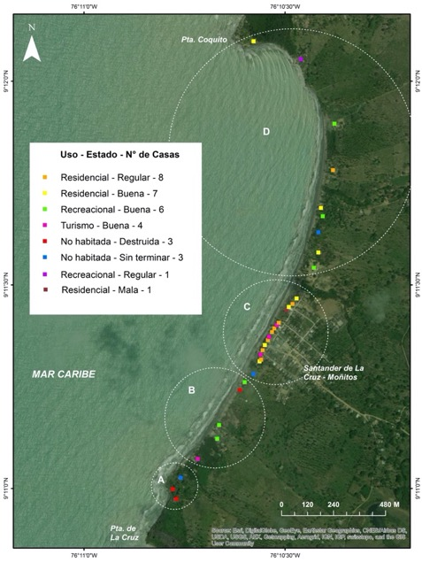{width="3.1392410323709536in" height="4.181587926509186in"}

Figura 7. Mapa de tendencia de evolución de línea de costa y proyección a 10 años (2028) (izquierda). Mapa de uso y estado de las viviendas, divido espacialmente en cuatro grupos (A, B, C y D) (derecha).

Recuperación de puntas

Para este análisis se realizó el levantamiento topográfico del acantilado a través de un Modelo de Elevación Digital, utilizando el Escáner Laser Terrestre (TLS) FARO FOCUS 3D X330 y el sistema de posicionamiento GeoMax Zenith35 Pro GNSS en modo estático como herramienta para la toma de los puntos de amarre. El procesamiento de los datos se ejecutó en el software SCENE para el ajuste y agrupación de los levantamientos topográficos realizados. Posteriormente se exportó la nube de puntos para realizar el modelo de elevación en el software ArcGIS utilizando el método de interpolación *Natural Neighbor.*

La Punta de la Cruz ha retrocedido desde 1981 una distancia de 170.20 m con una tasa de erosión de -5.21 m/año. El acantilado presenta pendientes fuertes y escarpadas contrastantes en su base con el nivel plano de la playa expuesta en su base durante condiciones de baja energía del oleaje. Se determinó que existen dos tipos de movimientos en masa en este sector. Uno relacionado con la caída de bloques en las puntas con litologías de mayor resistencia y otro, deslizamientos traslacionales con componente rotacional en la zona intermedia de litologías blandas meteorizadas (Fig. 8). Por lo tanto, se recomienda a corto plazo realizar una estabilización con el perfilamiento de taludes y la revegetalización de las bermas, a mediano plazo un revestimiento con roca o geotextiles en la base del acantilado y finalmente, a largo plazo realizar una barrera perpendicular a la línea de costa apoyada por la regeneración artificial de sedimentos que requeriría estudios específicos de ingeniería para su diseño.

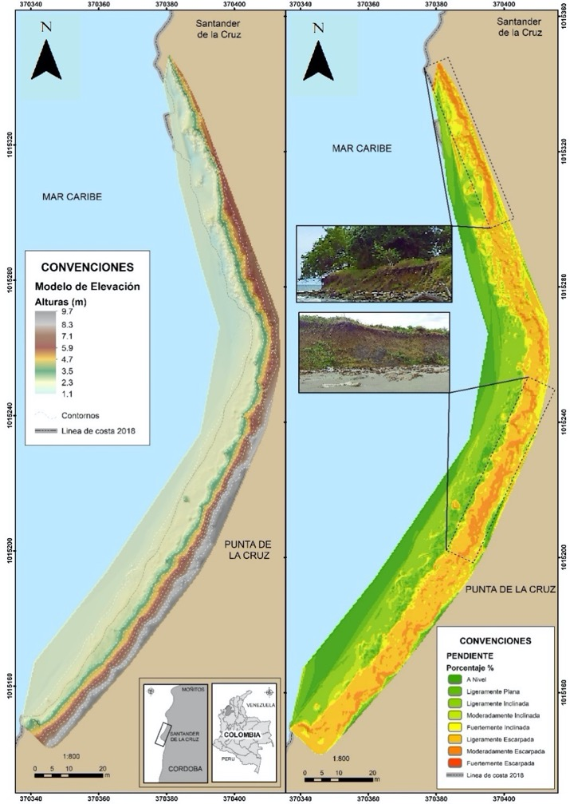{width="4.76873031496063in" height="6.715242782152231in"}

Figura 8. Modelos de elevación y pendiente en el sector acantilado de Punta de la Cruz.

Fuentes de sedimentos

Se realizó el muestreo sedimentológico en zona de playa (15 estaciones) utilizando una pala sobre un recuadro superficial de 10×10 cm hasta conseguir 500 g de muestra aproximadamente, de acuerdo con el protocolo del Laboratorio de Instrumentación Marina de INVEMAR. De igual manera, se colectaron muestras de sedimento en fondos someros (10 estaciones) a través de una campaña de buceo con recolección manual hasta conseguir 500 g de muestra aproximadamente. Las muestras se almacenaron en bolsas para ser transportadas a INVEMAR donde se realizó el análisis de laboratorio. En los sedimentos se realizó análisis de granulometría por tamices, mineralogía óptica y calcimetría con el objetivo de determinar facies sedimentarias.

Los sedimentos de las playas de Santander de la Cruz corresponden a arenas finas a medias con selección buena a moderadamente buena, provenientes de aportes de escorrentía local. De acuerdo con la composición del tamaño medio de grano, los sedimentos en la playa se distribuyen desde el norte hacia el sur, predominando en la granulometría las arenas finas. Con esto, también cambia la pendiente y la playa reduce su ancho, indicando influencia de oleaje de mayor energía en la parte sur. Los sedimentos del fondo somero presentaron dos tendencias, aquellos localizados en las zonas de baja pendiente corresponden a limo muy grueso a arenas finas, pobremente seleccionados característicos de los ambientes marinos (Fig. 9 a--d), los sedimentos obtenidos en inmediaciones de una franja arrecifal dieron como tamaño medio arena media a gruesa con contenidos de grava, de selección moderada reflejando condiciones ambientales de sedimentación con mayor energía.

En Santander de La Cruz la arena es también una materia prima cuyo uso es destinado principalmente como material de construcción. Por consiguiente, se recomienda minimizar la extracción de material de las playas en Santander a través de la concientización de la población o la regulación del material extraído, para que no sobrepase la capacidad de carga del sistema natural.

{width="0.27152777777777776in" height="0.30625in"}{width="6.241666666666666in" height="7.9945330271216095in"}

Figura 9. Mapas de distribución de parámetros estadísticos de sedimentos: Media (a), Selección (b), Simetría (c), Curtosis (d) (+ estaciones de muestreo).

Alternativas basadas en ecosistemas

En cuanto a medidas blandas que incluyen ecosistemas, se realizó una revisión bibliográfica correspondiente a los ecosistemas de manglares y arrecifes por estar relacionados con las alternativas de mitigación propuestas y se identificaron las condiciones oceanográficas *in situ* (Tabla 6). Además, la oceanografía del área en estudios anteriores ha identificado que la zona costera del departamento de Córdoba está directamente influenciada por el oleaje [17], lo cual indica que los vientos y el oleaje son factores importantes en la configuración de la costa. En la zona marina frente a Santander de La Cruz, Ricaurte-Villota y Bastidas-Salamanca [25] emplearon datos del Reanálisis Regional de América del Norte (NARR) y realizaron la caracterización de los vientos en una estación a 35 km de Santander de la Cruz llamada BV_03. Estos autores encontraron que la mayor magnitud del viento se registra entre los meses de diciembre a abril, alcanzando máximos para el mes de febrero con una dirección predominante norte-noroeste. En contraste, de mayo a noviembre disminuye la velocidad del viento, registrando mínimos en el mes de octubre y una dominancia de la dirección proveniente del oeste.

Tabla 6. Características deseadas en los ecosistemas propuestos como medida de mitigación.

+----------------+---------------+--------------------------------------------------------+-----------------------------------------------------------------------+
| Ecosistema | Parámetro | Intervalo                                          | Medición en campo                                                 |
+================+===============+========================================================+=======================================================================+
| Corales        | Temperatura   | 18 - 30 °C [31]                                      | Perfilador marino                                                     |
+----------------+---------------+--------------------------------------------------------+-----------------------------------------------------------------------+
|                | Salinidad     | 32 -- 38 [32]                                        | Perfilador marino                                                     |
+----------------+---------------+--------------------------------------------------------+-----------------------------------------------------------------------+
|                | Tipo sustrato | Duro y consolidado [33]                              | Observación directa                                                   |
+----------------+---------------+--------------------------------------------------------+-----------------------------------------------------------------------+
|                | Turbidez      | Aguas claras con baja turbidez                         | Disco Secchi o muestra de agua para solidos suspendidos totales - SST |
|                |               |                                                        |                                                                       |
|                |               | [32]                                                 |                                                                       |
+----------------+---------------+--------------------------------------------------------+-----------------------------------------------------------------------+
|                | Hidrodinámica | 0.5 - 0.7 m/s [34]                                   | Correntómetro                                                         |
+----------------+---------------+--------------------------------------------------------+-----------------------------------------------------------------------+
|                | Profundidad   | 3 a 25 m                                               | Ecosonda manual                                                       |
+----------------+---------------+--------------------------------------------------------+-----------------------------------------------------------------------+
| Manglares      | Temperatura   | 20 a 35 °C [35]                                      | Sonda portátil                                                        |
+----------------+---------------+--------------------------------------------------------+-----------------------------------------------------------------------+
|                | Salinidad     | 33 a 38.5 [36]                                       | Sonda portátil                                                        |
+----------------+---------------+--------------------------------------------------------+-----------------------------------------------------------------------+
|                | Tipo sustrato | Sustratos arcillosos u arenosos, según especie. [37] | Muestra de sedimentos con pala.                                       |
+----------------+---------------+--------------------------------------------------------+-----------------------------------------------------------------------+

El comportamiento del oleaje a partir de la serie sintética de la boya virtual (BV_03) ubicada a 35 km al noroeste de Santander de la Cruz, mostró que para la época seca (diciembre marzo) el oleaje presenta máximos con alturas de ola promedio de 1.35 ± 0.56 m con un periodo de 6.5 s y una probabilidad del 37% de ocurrencia de olas provenientes del NNO, seguido de direcciones al NO y O-NO. En contraste, para los meses de abril a noviembre (época húmeda), la altura de la ola disminuye hasta un promedio de 1.08 ± 0.56 m, un periodo de 6.4 s y la dirección predominante proviene del tercer cuadrante (entre 180° y 270°), con mayor probabilidad del oeste-noroeste [25]. Durante los días de muestreo, la altura de ola osciló entre 0.67 y 0.28 m con un promedio de 0.45 ± 0.12 m. La dirección predominante en la zona fue de 306.00º (provenientes del Noroeste) (Fig. 10).

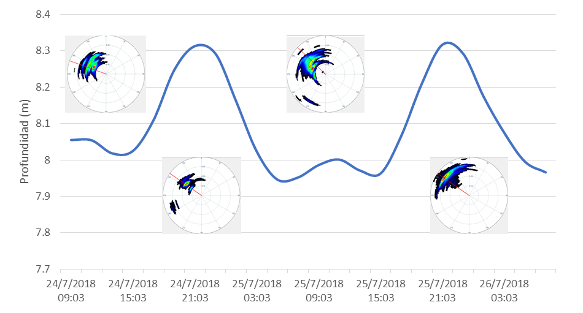{width="5.732171916010499in" height="3.0729166666666665in"}

Figura 10. Nivel del agua y dirección de procedencia del oleaje durante los días 24 al 26 de julio de 2018.

Reforestación de manglar

La reforestación de manglar es ideal para cualquier playa o zona estuarina, puesto que su presencia conlleva varios servicios ecosistémicos como transferencia al mar de detritos y material vegetal y como protección contra oleajes fuertes y continuos de forma que hace que se disipe dicha energía del oleaje [38]. Para evaluar la potencialidad de su reforestación en la zona de estudio, se realizó un análisis de ecosistemas (coberturas vegetales) empleando imágenes de satélite (2012 y 2018) e imágenes obtenidas durante la salida de campo empleando un Drone DJI Phantom 4 Pro, así como mediciones de variables fisicoquímicas (temperatura y salinidad) y observaciones de campo sobre los cuerpos hídricos existentes.

Los resultados obtenidos al analizar los años 2012 a 2018 muestran que los manglares de Santander de la Cruz, se redujeron por efecto del aumento de la frontera agrícola en el área. Para el año 2012, se calculó una cobertura de manglar de 15.66 ha ubicada en los alrededores de las riberas de las quebradas Pequín, arroyo Culebra y quebrada San Martín, las cuales fueron reducidas hasta llegar a 8.20 ha aproximadamente para el año 2018, lo que corresponde una pérdida del 47.6% de la cobertura inicial de estos manglares (Fig. 11a, b).

{width="6.0in" height="4.023179133858267in"}

Figura 11. Coberturas de manglar en los años 2012 (izquierda) y 2018 (derecha); muestran que los manglares de Santander de la Cruz, se reducen por efecto del aumento de la frontera agrícola que ocurre en el área.

La temperatura del agua fluctuó entre 29.70 y 33.80 °C y la salinidad entre 24.32 y 34.90; el pH mostró condiciones de basicidad con valores entre 7.06 hasta 8.29. El oxígeno disuelto (OD) osciló entre 4.65 y 8.90 mg/L, encontrándose las mayores concentraciones en los arroyos y quebradas. Estos resultados indicaron que para el momento de la medición (24 de julio de 2018), el agua, tanto en los arroyos, quebradas y pequeños caños, se encontraba estancada y no había comunicación aparente con el mar; de allí, los valores obtenidos: aguas con características salobres o dulces. En algunos lugares, se pudo observar mucha materia orgánica natural (hojarasca, algas, trozos de trocos), que hacen que se aumente el proceso de baja de oxígeno y afectan el movimiento del agua (Fig. 12).

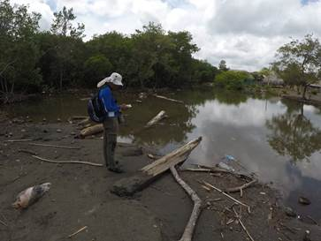{width="2.9476060804899387in" height="2.1354166666666665in"}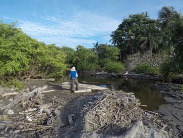{width="3.125in" height="2.135579615048119in"}

Figura 12. Boca del arroyo Culebra y quebrada San Martín.

+------------------------------------------------------------------------------------------------------------------------+
| Caja 1. Conceptos clave                                                                                            |
|                                                                                                                        |
| Cambio de coberturas: permiten evidenciar cambios en extensión, tipo de especie y aumento de la frontera agrícola. |
|                                                                                                                        |
| Características fisicoquímicas: determinan el asentamiento o no de determinada especie.                            |
+------------------------------------------------------------------------------------------------------------------------+

Intervención con arrecifes artificiales

Los arrecifes artificiales se han utilizado con éxito en algunos países de Europa y Sudáfrica para la recuperación o formación de playas, así como en la protección de caminos e infraestructura [39]. Adicionalmente, pueden servir como base para nuevos ecosistemas, albergando variedad de especies marinas. Para identificar su potencialidad en la zona de estudio, se realizaron estudios que incluyeron caracterización del fondo marino (sustrato con perfilador de subsuelo), hidrodinámica de la bahía (mediciones de oleaje y nivel con correntómetro acústico) y propiedades físicas de la columna de agua (temperatura con sonda y sólidos suspendidos totales mediante determinación en laboratorio en muestra de agua superficial). Se tuvo como base la batimetría levantada en la zona (Fig. 13), la cual permitió identificar posibles zonas de restauración. De igual manera se muestra un perfil transversal 2D (Fig. 13 y 14).

En el modelo batimétrico y el perfil transversal se puede observar una franja rocosa sumergida (Fig. 13 y 14), la cual tiene características naturales para la conformación de un arrecife. Un fragmento de roca obtenido en campo muestra que corresponde a la continuidad de las lutitas de la Unidad Moñitos sobre la que se incrustan nemátodos y briozoos entre otros organismos que forman biohermos (acumulaciones biogénicas). Esta estructura podría utilizarse como base la conformación de una barrera natural y con mayor resistencia que permita la reducción de energía del oleaje al que se expone el área de estudio durante los primeros meses del año.

{width="5.008333333333334in" height="7.345010936132983in"}

Figura 13. Modelo batimétrico para Santander de la Cruz.

{width="4.983594706911636in" height="1.7604166666666667in"}

Figura 14. Perfil en el área central del área de estudio, nótese la elevación de la franja rocosa a aproximadamente 400 m de la línea de costa.

+---------------------------------------------------------------------------------------------------------------------------------------------------------------------------------------------------------------------------------------------------------+
| Caja 2. Conceptos clave                                                                                                                                                                                                                             |
|                                                                                                                                                                                                                                                         |
| Sustrato: Está relacionado con la disponibilidad de superficie favorable para el asentamiento de especies sedentarias y larvales.                                                                                                                   |
|                                                                                                                                                                                                                                                         |
| Oleaje: su magnitud y dirección son los factores que más inciden en la dinámica litoral. Permitirá determinar la ubicación de estructuras de protección costera.                                                                                    |
|                                                                                                                                                                                                                                                         |
| Temperatura: cumple un papel imprescindible para el asentamiento y crecimiento de los reclutas coralinos; mientras que la Turbidez hace referencia a la disponibilidad de luz solar para realizar fotosíntesis de las zooxantelas (simbiontes). |
+---------------------------------------------------------------------------------------------------------------------------------------------------------------------------------------------------------------------------------------------------------+

Se encontró que no es posible hacer siembra de corales en la bahía, ya que la temperatura sobrepasa el rango permitido para un estado óptimo de estos organismos. Lo mismo pasa con la salinidad, la cual se encuentra por debajo del intervalo adecuado para su crecimiento. Esto explica la ausencia de este ecosistema en cercanías a la zona de estudio. Con respecto a la turbidez, los mayores valores de SST se encontraron al norte de la bahía; mientras que los menores (correspondientes con las mayores transparencias), se encontraron en la parte más alejada de la costa, donde la influencia continental es menor. Se procede con otro tipo de ecosistemas que sirvan como barreras vivas (Fig. 15).

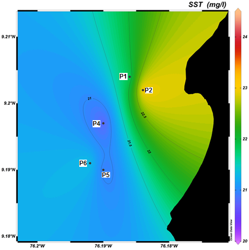{width="4.428706255468066in" height="4.466666666666667in"}

Figura 15. Concentración de SST (mg/l) en la bahía frente a Santander de la Cruz.

CONCLUSIONES
============

Este modelo de gestión del riesgo en erosión costera pretende generar oportunidades para que los entes territoriales y corporaciones ambientales puedan tomarlo como guía para generar acciones correctivas y prospectivas adecuadas en sus regiones frente a la erosión costera, ya que este es un fenómeno en aumento y con daños materiales importantes.

Este es un estudio de procesos integrales en cuanto a la gestión del riesgo para la erosión costera, donde se tienen en cuenta las diferentes escalas de trabajo, las necesidades institucionales y de comunidades locales, para así generar las alternativas que faciliten su ejecución y además sean incluidas en las herramientas de planificación de las zonas costeras con énfasis en gestión del riesgo.

Este modelo genera la necesidad de ordenar los territorios en una perspectiva encaminada hacia la corrección prospectiva y de largo plazo, y a escala local, con el fin de poder plantear planes locales de ordenamiento del territorio o planes de etno-desarrollo [40]. Para llevar a cabo esto se debe partir desde el termino de territorio, el cual se concibe de diferentes maneras, pero es indispensable entenderlo llevado a cabo desde la comunidad a lo institucional y que sirva como hoja de ruta para la gestión del riesgo con un enfoque de desarrollo sostenible.

Las correcciones prospectivas permitirán reducir la vulnerabilidad, interviniendo la falta de resiliencia a través del fortalecimiento de la institucionalidad de la comunidad como la Junta de Acción Comunal (JAC) y disminuyendo la fragilidad en sus diferentes dimensiones.

Entre las alternativas de adaptación analizadas se determinó que: la estabilidad del acantilado permitiría mitigar el efecto de erosión costera en la Punta de la Cruz, la cual se consideraba una barrera natural entre las celdas de transporte de sedimento, se recomienda la prioridad de esta alternativa con las medidas de corto plazo. Seguido a esto, debido al carácter local de procedencia de los sedimentos y su distribución es necesario mejorar el manejo de las fuentes hídricas y ecosistemas costeros (bosque seco tropical, relictos de manglar, playa) que permiten el flujo durante las épocas de lluvia, sin embargo, debe analizarse con detalle la reestructuración de una barrera exenta para arrecife como tal, es decir, que las condiciones no están dadas para la siembra de corales y la alternativa propuesta son estructuras que se pueden acompañar con otro tipo de organismo o barrera viva, cuyas condiciones podrían ser óptimas. Esta estructura se encuentra asociada a las elevaciones rocosas existentes a 400 m de la línea de costa y se debe determinar el diseño apropiado para la reducción de energía del oleaje que afecta la región de manera negativa en las épocas secas. Finalmente, la reubicación se dejó como última alternativa en caso que el proceso no se logre mitigar, en tal caso se daría prioridad a las viviendas residenciales, y se requiere de un plan de compensación a las construcciones de tipo turístico.

+-------------------------------------------------------------------------------------------------------------------------------------------------------------------------------------------------------------------------------------------------------------------------------------------------------------------------------------------------------------------------------------------------------------------------------------------------------------------------------------------------------------------------------------------------------------------------------------------------------------------------------------------------+
| RECOMENDACIÓNES PARA TOMAR DECISIONES                                                                                                                                                                                                                                                                                                                                                                                                                                                                                                                                                                                                       |
|                                                                                                                                                                                                                                                                                                                                                                                                                                                                                                                                                                                                                                                 |
| La problemática de la erosión costera en el departamento de Córdoba requiere abordarse de forma prioritaria por parte de las entidades del orden nacional y regional pertenecientes al SINA.                                                                                                                                                                                                                                                                                                                                                                                                                                                    |
|                                                                                                                                                                                                                                                                                                                                                                                                                                                                                                                                                                                                                                                 |
| Como corrección prospectiva, se proponen los lineamientos de ordenamiento local del territorio de Santander de la Cruz, los cuales tendrán los siguientes puntos como factores de hoja de ruta para su formulación:                                                                                                                                                                                                                                                                                                                                                                                                                             |
|                                                                                                                                                                                                                                                                                                                                                                                                                                                                                                                                                                                                                                                 |
| -   El desarrollo deberá tener principalmente la participación de todos los actores locales: comunidad, privados, industria (cultivos y ganadería) e instituciones. De igual manera, también la participación de instituciones regionales y nacionales.                                                                                                                                                                                                                                                                                                                                                                                         |
|                                                                                                                                                                                                                                                                                                                                                                                                                                                                                                                                                                                                                                                 |
| -   Ordenar la ocupación de las microcuencas (quebrada Pequín, arroyo Culebra y quebrada San Martín) y restaurar los ecosistemas presentes, partiendo de la conservación de la ronda hídrica, lo que permitirá restablecer flujos y descargas de sedimentos.                                                                                                                                                                                                                                                                                                                                                                                    |
|                                                                                                                                                                                                                                                                                                                                                                                                                                                                                                                                                                                                                                                 |
| -   Formular proyectos comunitarios alternativos que permitan el manejo de la extracción del material de playa con un enfoque de desarrollo sostenible.                                                                                                                                                                                                                                                                                                                                                                                                                                                                                         |
|                                                                                                                                                                                                                                                                                                                                                                                                                                                                                                                                                                                                                                                 |
| En cuanto a investigación, diferentes estudios se enfocan en los diferentes componentes de la gestión, sin llegar a ser integrales, aunque se han realizado algunos esfuerzos [41], mostrando solo las alternativas de mitigación, sus efectos y problemáticas [42,43,44], obras de ingeniería [45] u obras basada en ecosistemas presentes [12,46]. Otros estudios se enfocan en las políticas, programas o regulaciones [47,48], o las deficiencias de estas herramientas [49]. Por último, otros se basan en el monitoreo de playas o línea de costa [50,51], de ahí la importancia de realizar estudios de carácter integral. |
+-------------------------------------------------------------------------------------------------------------------------------------------------------------------------------------------------------------------------------------------------------------------------------------------------------------------------------------------------------------------------------------------------------------------------------------------------------------------------------------------------------------------------------------------------------------------------------------------------------------------------------------------------+

MATERIALES Y MÉTODOS
====================

El esquema metodológico propuesto como modelo para la gestión del riesgo por erosión costera (Fig. 16), partió de los lineamientos del plan de acción 2016--2020 para la gestión del riesgo por erosión costera para el departamento de Córdoba y que consta de nueve objetivos, los cuales se han llevado cabo.

Para empezar, se tomó como información base el diagnóstico por erosión costera para el Caribe [29] y cambios en la línea de costa para Colombia [52]. Seguidamente, el monitoreo de la erosión costera permitió entender que lugares presentan una tendencia hacia la erosión costera y conocer el comportamiento y/o patrones estacionales de la zona costera en relación con los procesos costeros y cambios ambientales. Este monitoreo junto con los resultados de los análisis de amenaza y vulnerabilidad por erosión costera [4], permitió identificar los sitios críticos del departamento que están siendo afectados por este fenómeno.

Posteriormente, en cada sitio critico se realizaron modelos conceptuales de alternativas de mitigación basada en ecosistemas o en construcción con la naturaleza [10], donde se hizo una aproximación al estado actual y al estado ideal con las obras o estrategias que mitigarían la erosión costera. Obtenidos estos modelos fue necesario validar las alternativas propuestas en estos, verificar si son válidos, realizables y acordes con los procesos ambientales, de igual manera priorizarlos a corto, mediano y largo plazo. Para obtener esto, se realizaron diferentes estudios de detalle en el poblado de Santander de la Cruz, iniciando por discriminar las variables que dependían de cada alternativa (físicas, bióticos, sociales y económicos), para finalmente obtener un listado priorizado de las alternativas viables y las descartadas que se deben ejecutar para prevenir y mitigar los procesos de la erosión costera en el poblado.

{width="5.5625in" height="6.687527340332458in"}

Figura 16. Esquema metodológico propuesto como modelo de gestión del riesgo para la erosión costera.

CONFLICTO DE INTERESES

Los autores no declaran conflicto de intereses

AGRADECIMIENTOS

A la Corporación Autónoma Regional de los Valles del Sinú y San Jorge -- CVS, Córdoba, bajo los convenios 020 de 2015, 022 de 2017 y 022 de 2018. A los investigadores del programa de Geociencias Marinas y Costeras que han participado en la investigación de la zona costera del departamento de Córdoba en especial Ana Caicedo, Mauricio Bejarano Espinosa, Cesar García Llano, Juan Sebastián Ponce Bastidas, Silvio Andrés Ordóñez Zúñiga y Karla Vanessa Castro Ramírez, quienes aportaron a la propuesta y análisis de las alternativas. A las comunidades y entes territoriales de los municipios costeros del departamento y a los funcionarios de la CVS que han aportado a la adquisición de información durante de las salidas de campo dentro de la ejecución de los convenios. El numero de contribución del INVEMAR es 1264.

IDENTIFICACIÓN DE AUTOR

Oswaldo Coca Domínguez <https://orcid.org/0000-0002-3987-4376>

Constanza Ricaurte Villota <https://orcid.org/0000-0003-1554-4994>

David F. Morales Giraldo <https://orcid.org/0000-0003-2531-6143>

BIBLIOGRAFÍA

1.  Martínez-Iglesias, J. C., Areces, A. J., Quintana, M., Viña, L., Zúñiga, A., y Beyris, A. (2007). Lineamientos metodológicos para la gestión integrada de la zona marina--costera (GIZMC) Cuba. *Serie Oceanológica*, (3), 1--37.

2.  Yáñez-Arancibia, A., y W. Day, J. (2010). La zona costera frente al cambio climático: vulnerabilidad de un sistema biocomplejo e implicaciones en el manejo costero. En: *Cambio climático en México un enfoque costero-marino. Elementos ambientales para tomadores de decisiones*, 33--60. Estado de Campeche: Universidad Autónoma de Campeche Cetys-Universidad. http://etzna.uacam.mx/epomex/publicaciones/Cambio_ Climatico/CCMexico1B.pdf

3.  Merlotto, A., Bértola, G. (2007). Consecuencias socio-económicas asociadas a la erosión costera en el Balneario Parque Mar Chiquita, Argentina. Investigaciones Geográficas, 43, 143--160. https://doi.org/10.14198/INGEO2007.43.08

4.  Ricaurte-Villota, C., Coca-Domínguez, O., González, M.E., Bejarano-Espinosa, M., Morales, D.F., Correa-Rojas, C., Briceño-Zuluaga, F., Legarda, G.A. y Arteaga, M.E. (2018). *Amenaza y vulnerabilidad por erosión costera en Colombia: enfoque regional para la gestión del riesgo*. Instituto de Investigaciones Marinas y Costeras "José Benito Vives De Andréis" --INVEMAR--. Serie de Publicaciones Especiales de INVEMAR # 33. Santa Marta, Colombia. 268 p.

5.  Política nacional ambiental para el desarrollo sostenible de los espacios oceánicos y las zonas Costeras e insulares de Colombia (PNAOCI), 2009.

6.  Charles, E., Douvere, F. (2009). *Planificación especial marina una guía paso a paso hacia la gestión ecosistémica.* Planificación especial marina una guía paso a paso hacia la gestión ecosistémica. 99 p.

7.  Rangel-Buitrago, N., Williams, A. T. Pranzini, E., Anfuso, G. (2018). Preface to the special issue: management strategies for coastal erosion processes. *Ocean and coastal management*, 156, 1. <https://doi.org/10.1016/j.ocecoaman.2017.11.020>

8.  Simm, J.D.and Samuels, M. (2006). Telling good stories: engaging in dialogue with communities about flood and coastal erosion risk management in a post-modern society. En *41st Defra Flood and Coastal Management Conference*, 4 - 6 July 2006, York, UK.

9.  Rangel-Buitrago, N., Anfuso, G., Williams, A. (2015). Coastal erosion along the Caribbean coast of Colombia: Magnitudes, causes and management. *Ocean & Coastal Management,* 114, 129-144. <https://doi.org/10.1016/j.ocecoaman.2015.06.024>

10. MADS-DELTARES-INVEMAR. (2013). *A quickscan of building-with-nature solutions to mitigate coastal erosión in Colombia. Interim report*. Delft, Holanda. 85 p.

11. Stronkhorst, J., Levering, A., Hendriksen, G., Rangel-Buitrago, N., Rosendahl Appelquist, L. (2018). Regional coastal erosion assessment based on global open access data: A case study for Colombia. J. Coast. Conserv. 2018, 22, 787--798. <https://doi.org/10.1007/s11852-018-0609-x>

12. Karl F. Nordstrom a, Bingyi Liang b, Emir S. Garilao b, Nancy L. Jackson b, (2018). Topography, vegetation cover and below ground biomass of spatially constrained and unconstrained foredunes in New Jersey, USA*. Ocean & Coastal Management*. Vol 156.

13. Dodds, W., Cooper, J.A.G., McKenna, J. (2010). Flood and coastal erosion risk management policy evolution in Northern Ireland: "Incremental or leapfrogging?". *Ocean & Coastal Management,* 53(12), 779-786. <https://doi.org/10.1016/j.ocecoaman.2010.10.017>

14. Souza, C.R.G., Suguio, K. (2003). The Coastal Erosion Risk Zoning and the São Paulo State Plan for Coastal Management. Journal of Coastal Research, SI 35. *Proceedings of the Brazilian Symposium on Sandy Beaches: Morphodynamics, Ecology, Uses, Hazards and Managemen*t, 530- 547. Itajaí, SC -- Brazil.

15. Coca-Domínguez, O., Ricaurte-Villota, C. (2019). Validation of the Hazard and Vulnerability Analysis of Coastal Erosion in the Caribbean and Pacific Coast of Colombia. J. Mar. Sci. Eng. 2019, 7, 260. <https://doi.org/10.3390/jmse7080260>

16. Wang, L., Li, C., Ying Q., Cheng, X., Wang, X., Li, X., Hu, L., Liang, L., Yu, L., Huang, H., Gong, P. (2012). Urban expansion from 1990 to 2010 determined with satellite remote sensing. *Chinese Science Bulletin*, 57, 2802-2812. <https://doi.org/10.1007/s11434-012-5235-7>

17. Serrano-Suarez, B.E. (2004). The Sinú river delta on the northwestern Caribbean coast of Colombia: Bay infilling associated with delta development. *Journal of South American Earth Sciences*, 16, 623--631. https://doi.org/10.1016/j.jsames.2003.10.005

18. Morris, R.L., Strain, M.A., Konlechner, T., Fest, B., Kennedy, D., Arndt, E., Swearer, E. (2018). Developing a nature-based coastal defence strategy for Australia. *Australian Journal of Civil Engineering*, 17(2), 167-176. <https://doi.org/10.1080/14488353.2019.1661062>

19. Isla, F., Lasta, C. (2006). *Manual de manejo costero para la Provincia de Buenos Aires*. Eudem.

20. Moreira, R. (2007). O espaco e o contra-espaco: as dimensoes territoriais da sociedade civil e do estado; do privado ao público na orden especial burguesa. En *Território, territórios: ensaios sobre o ordenamento territorial*, Milton Santos (Ed), 72-107. Río de Janeiro: Lamparina.

21. Aravena, R., Romero-Toledo, H., Opazo, D. (2018). Topoclimatología cultural y ciclos hidrosociales de comunidades andinas chilenas: híbridos geográficos para la ordenación de los territorios. *Cuadernos de Geografía: Revista Colombiana de Geografía,* 27(2): 242-261. <https://doi.org/10.15446/rcdg.v27n2.66599>

22. Meza, C. A. (2010). *Tradiciones elaboradas y modernizaciones vividas por pueblos Afrochocoanos en la vía al mar*. Bogotá, Colombia: Instituto Colombiano de Antropología e Historia.

23. Coca Domínguez, O y Ricaurte Villota, C. (2019). Análisis de la evolución litoral y respuesta de las comunidades afro-descendientes asentadas en la zona costera: caso de estudio La Barra, Buenaventura, Pacífico colombiano. *Revista Entorno Geográfico*, 17, 7-26. <https://doi.org/10.25100/eg.v0i17.7918>

24. MADS-INVEMAR. (2014). Componente N°9. Formular el Programa Nacional de Monitoreo, Prevención, Mitigación y Control de la erosión costera. Convenio interadministrativo No 190 de 2014 entre el MADS y el INVEMAR: elementos técnicos que permitan establecer medidas de manejo, control, uso sostenible y restauración de los ecosistemas costeros y marinos del país. Código: ACT-BEM-001-014. Informe técnico. 63 p.

25. Ricaurte-Villota, C., Bastidas-Salamanca, M., (Eds.). (2017). *Regionalización oceanográfica: una visión dinámica del Caribe*. Instituto de Investigaciones Marinas y Costeras -- INVEMAR. Serie de publicaciones especiales # 14. Santa Marta, Colombia 180 p.

26. Ojeda-Zújar, J., Díaz-Cuevas, M.P., Prieto-Campos, A., Álvarez-Francoso, J. (2013). Línea de costa y Sistemas de Información Geográfica: modelo de datos para la caracterización y cálculo de indicadores en la costa andaluza. *Investigaciones Geográficas*, 60: 37 -- 52. <https://doi.org/10.14198/INGEO2013.60.02>

27. Thieler E., Himmelstoss E., Zichichi J., Ergul, A. (2010). *The Digital Shoreline Analysis System (DSAS) Version 4.0 - An ArcGIS extension for calculating shoreline change (2008-1278).* <https://doi.org/10.3133/ofr20081278>

28. Thieler E. R. y Danforth W. (2005). Historical shoreline mapping: improving techniques and reducing positioning errors*. Journal of Coastal Research*, 10(3), 549-563.

29. Posada-Posada, B. O., y Henao P., W. (2008). *Diagnóstico de la erosión en la zona costera del Caribe colombiano*. INVEMAR, serie Publicaciones Especiales N°13, Santa Marta ,124 pp.

30. EUROSION. (2005). *Vivir con la erosión costera en Europa, Sedimentos y espacios para la sostenibilidad*. Luxembourg: Office for Official Publications of the European Communities. <http://www.eurosion.org/project/eurosion_en.pdf>

31. GREENPEACE. (1999). *El cambio climático y los arrecifes coralinos del planeta*. Recuperado de http://archivo-es.greenpeace.org/espana/Global/espana/report/cambio_climatico/el-cambio-climatico-y-los-arre.pdf.

32. Romero Rodríguez, D. A. (2014). *Variables ambientales durante eventos de blanqueamiento coralino en el Caribe colombiano*. Universidad Nacional de Colombia, Medellín. https://doi.org/[10.18257/raccefyn.49](https://doi.org/10.18257/raccefyn.49)

33. Westmacott, S., Teleki, K., Wells, S and West, J. M. (2000). *Manejo de arrecifes de coral blanqueados o severamente dañados*. UICN, Gland, Suiza y Cambridge, Reino Unido. VII + 36 pp.

34. Riveron-Enzastiga, M. L., Carbajal, N., y Salas-Monreal, D. (2016). Tropical coral reef system hydrodynamics in the western Gulf of Mexico. *Scientia Marina*, 802, 237-246. https://doi.org/[10.3989/scimar.04259.15B](https://doi.org/10.3989/scimar.04259.15B)

35. Noor, T., Batool, N., Mazhar, N., Ilyas, N. (2015). Effects of siltation, temperature and salinity on mangrove plants. European Academic Research, 2, 14172-14179.

36. Ahmed, N. Amir, R. y Talat, M. (1993). Salt-tolerance in mangrove soil bacteria. *Pakistan Journal of Marine Sciences*, 2(2), 129-135.

37. Sánchez-Páez, H., Ulloa-Delgado, G. A., Tavera-Escobar, H. A., Gil-Torres, W. O. (2005). *Plan de manejo integral de los manglares de la zona de uso sostenible del sector estuarino de la Bahía de Cispatá: Departamento de Córdoba No. 333.91809861 S211p*. OIMT, Santa Fé de Bogotá Colombia. Proyecto Conservación y Manejo para el Desarrollo de los Manglares en Colombia Corporación Autónoma Regional de los Valles del Sinú y del San Jorge, Córdoba Colombia Corporación Nacional de Investigación y Fomento Forestal, Bogotá Colombia Proyecto PD 60/01 Rev. 1 F Manejo Sostenible y Restauración de los Manglares por Comunidades Locales del Caribe de Colombia, Bogotá Colombia Ministerio de Ambiente, Vivienda y Desarrollo Territorial, Bogotá Colombia.

38. Giri, C., Ochieng, E., Tieszen, L. L., Zhu, Z., Singh, A., Loveland, T., Duke, N. (2011). Status and distribution of mangrove forests of the world using earth observation satellite data. *Global Ecology and Biogeography*, 201, 154-159. https://doi.org/[10.1111/j.1466-8238.2010.00584.x](https://doi.org/10.1111/j.1466-8238.2010.00584.x)

39. Arellano, V.A. 2011. *Arrecifes artificiales de enrocamiento para protección de playas*. Tesis de grado para obtener el título de Maestro en Ingeniería Civil. Instituto Politécnico Nacional. México. 132 p.

40. Consejo Comunitario La Barra. (2015*). Plan de Etnodesarrollo 2014 -- 2017*. Consejo Comunitario Comunidad Negra de La Barra, Buenaventura, Colombia. Buenaventura, Colombia: Fundación Suiza de cooperación al desarrollo SWISSAID.

41. Rangel-Buitrago, N., de Jongeb, V., Nealc, W., (2018). How to make Integrated Coastal Erosion Management a reality. *Ocean and Coastal Management*, 156, 290-299. <https://doi.org/10.1016/j.ocecoaman.2018.01.027>

42. Williams, A.T., Rangel-Buitrago, N., Pranzini, E., Anfuso, G. (2018). The management of coastal erosion. *Ocean and Coastal Management*, 156, 4-20. <https://doi.org/10.1016/j.ocecoaman.2017.03.022>

43. Pranzini, E. (2018) Shore protection in Italy: From hard to soft engineering ... and back. *Ocean and Coastal Management,* 156, 43-57. <https://doi.org/10.1016/j.ocecoaman.2017.04.018>

44. Isla, F., Cortizo, L., Merlotto, A., Bertola, G., Pontrelli, M., Finocchietti, C. (2018). Erosion in Buenos Aires province: Coastal-management policy revisited. *Ocean and Coastal Management*,156, 107-116. <https://doi.org/10.1016/j.ocecoaman.2017.09.008>

45. Neelamani, S. (2018). Coastal erosion and accretion in Kuwait e Problems and management strategies. *Ocean and Coastal Management*, 156, 76-91. <https://doi.org/10.1016/j.ocecoaman.2017.05.014>

46. Gracia, A., Rangel-Buitrago, N., Oakley, J., Williams, A.T. (2018). Use of ecosystems in coastal erosion management. *Ocean and Coastal Management*, 156, 277-289. <https://doi.org/10.1016/j.ocecoaman.2017.07.009>

47. Neal, W., Pilkey, O., Cooper, A., Longo, N. (2018). Why coastal regulations fail. *Ocean and Coastal Management*, 156, 21-34. <https://doi.org/10.1016/j.ocecoaman.2017.05.003>

48. Leatherman, S. (2018). Coastal Erosion and the United States National Flood Insurance Program. *Ocean and Coastal Management*, 156, 35-42. <https://doi.org/10.1016/j.ocecoaman.2017.04.004>

49. Ndour, Raoul, A. Laïbi, Sadio, M., Degbe, C., Diaw, A., Oy, M., Anthony, E., Dussouillez, P., Sambou, H., Balla Di, E. (2018). Management strategies for coastal erosion problems in west Africa: Analysis, issues, and constraints drawn from the examples of Senegal and Benin. Abdoulaye. *Ocean and Coastal Management*, 156, 92-106. <https://doi.org/10.1016/j.ocecoaman.2017.09.001>

50. Psuty, N., Ames, K., Habeck, A., Schmelz, W. (2018). Responding to coastal change: Creation of a regional approach to monitoring and management, northeastern region, U.S.A. *Ocean and Coastal Management*, 156, 170-182. <https://doi.org/10.1016/j.ocecoaman.2017.08.004>

51. Pikelja, K., Ružić, I., Ilića, S., Jamesa, M., Kordićd, B. (2018). Implementing an efficient beach erosion monitoring system for coastal management in Croatia. *Ocean and Coastal Management*, 156, 223-238. <https://doi.org/10.1016/j.ocecoaman.2017.11.019>

52. Gutiérrez, J., Carvajal, A., Pabón, J., Ruiz, F., Cusva, A., Verdugo, F., Nieto, V., Lecanda, A., Rodríguez, J., Mendoza, J., Álvarez, J., Quimbayo, G., Dorado, J., Camacho, A., Sierra, P., Zamora, A., Ricaurte-Villota, C., Bastidas-Salamanca, M., Ordóñez, S., Navia, j., Coca-Domínguez, O., Andrade, C., Tigreros, P., Rojas, X., Hernández, D., Hernández, T., Vega, A., Romero, D., Pizarro, J. (2017). Capítulo 4: Vulnerabilidad y riesgo por cambio climático. En: IDEAM, PNUD, MADS, DNP, CANCILLERÍA. (2017). *Tercera Comunicación Nacional de Colombia a la Convención Marco De Las Naciones Unidas Sobre Cambio Climático (CMNUCC).* Tercera Comunicación Nacional de Cambio Climático. IDEAM, PNUD, MADS, DNP, CANCILLERÍA, FMAM. Bogotá D.C., Colombia.

14

[]{#_Toc47894937 .anchor}Gestión del riesgo por inundaciones: un metamodelo para el desarrollo de artefactos participativos. Caso de estudio en la ecorregión de La Mojana (Colombia)

Paula Andrea Villegas González^1*^ & Nelson Obregón Neira^1^

^1^Instituto Geofísico, Pontificia Universidad Javeriana. Carrera 7 No. 40 -- 62, Bogotá, Colombia

^*^Autor de contacto: Paula Andrea Villegas González. Instituto Geofísico, Pontificia Universidad Javeriana. Carrera 7 No. 40 -- 62, Bogotá, Colombia. Correo-e: <pvillegas@javeriana.edu.co>

Resumen

Los análisis de riesgo por inundación en Colombia, se han enfocado en la modelación física de la amenaza y en la valoración de la vulnerabilidad física y social, pero no se han integrado estos dos análisis en la evaluación del riesgo. El trabajo presentado hace énfasis en la inclusión de los elementos sociales y el conocimiento de las comunidades, como base para la generación de modelos de evaluación del riesgo. Específicamente, se propone un modelo para hacer modelos, en el marco de procesos de participación local. Para esto se utiliza la metodología GAIA. Los artefactos desarrollados son: MOJANA, MOJANACOOP y MOJANAREAL, los cuales reflejan en su diseño los principales componentes del metamodelo. Las variables y procesos a modelar se representan a través de las reglas, que permiten integrar el fenómeno de la inundación y las características del sistema social. Para el desarrollo de los modelos se utiliza el caso de estudio de la ecorregión de la Mojana y se pudo concluir que las variables más importantes para analizar la vulnerabilidad social son: la condición de habitabilidad, las actividades productivas, los procesos de cooperación y, el acceso a la salud y educación de las comunidades locales. Para el caso específico de la ecorregión de la Mojana, la vulnerabilidad social es media y esta se encuentra relacionada con las formas de adaptación a los procesos de inundación.

Palabras clave

Amenaza, comunidades, inundación, modelación, riesgo, vulnerabilidad

Flood risk management: a metamodel for the development of participatory artifacts. Case study in the ecoregion of La Mojana (Colombia)

Abstract

Flood risk analyzes in Colombia have been focused on the threat of physical modeling and social vulnerability and physical assessment, yet these two analyzes have not been integrated into the risk assessment. The research goal is to include the social elements and the communities' knowledge for the risk assessment models generation. Specifically, the research proposes a model to make models with the local participation processes. The GAIA methodology was used. The artifacts developed are MOJANA, MOJANACOOP, and MOJANAREAL. They reflect in their design the main metamodel components. The variables and processes were represented through the rules. The rules integrate the flooding phenomenon and social system characteristics. For the model's development, the case study is the Mojana ecoregion. In conclusion, the essential variables to analyze social vulnerability are the habitability condition, the productive activities, the cooperation processes, and the access to health and education of local communities. In the specific case of the Mojana ecoregion, social vulnerability is medium. The vulnerability was related to the types of adaptation to flooding processes.

Keywords

Communities, flooding, hazard, modelling with stakeholders, risk, vulnerability

INTRODUCCIÓN
============

La gestión del riesgo es "un proceso social orientado a la formulación, ejecución, seguimiento y evaluación de políticas, estrategias, planes, programas, regulaciones, instrumentos, medidas y acciones permanentes para el conocimiento y la reducción del riesgo y para el manejo de desastres, con el propósito explícito de contribuir a la seguridad, el bienestar, la calidad de vida de las personas y al desarrollo sostenible" [1].

La Ley 1523 de 2012, afirma que se deben desarrollar los planes departamentales, distritales y municipales de gestión del riesgo y estrategias de respuesta. El Decreto 1807 de 2014 "relativo a la incorporación de la gestión del riesgo en los planes de ordenamiento" [2], explica que para la evaluación del riesgo de desastres por inundación se deben hacer: análisis detallado de amenaza, evaluación de vulnerabilidad, evaluación del riesgo y determinación de medidas de mitigación. En conclusión, el problema de la gestión del riesgo por inundaciones en el país implica comprender el fenómeno natural de la inundación y los impactos que este tiene en el territorio; con el propósito no solo de conocer el problema, sino también generar soluciones de prevención, reducción y manejo. En este sentido, esta investigación plantea que no solo se deberían generar modelos que representan la dinámica física de inundación; sino también incorporar el sentido que para las personas tiene su territorio, el lugar que habitan. Una de las formas de integrar estos modelos es a través de artefactos participativos, incorporando el conocimiento local.

Según Medina-Sanson et al [2014], el territorio en esta investigación es entendido como ese espacio que "articula estructuras y procesos bióticos y ecológicos con la dinámica política, económica y cultural de las sociedades humanas. El territorio es un espacio con elementos y recursos de diferente naturaleza,

ocupado, modificado y regulado por grupos humanos con perspectivas e intereses diferenciados, dentro del cual se dan procesos de disputa, negociación y concertación" [3]. De esta manera el territorio es concebido como un concepto integrador, que no se restringe a dimensiones físicas y es visto como un sistema complejo que se encuentra compuesto por elementos ecológicos, sociales, culturales, económicos, político institucionales y urbano-regionales. Abordar el análisis de un territorio implica reconocer diferentes escalas espaciales y temporales, procesos "horizontales y verticales de negociación, ocupación y control" [3], procesos de cooperación, diversidad de actores e instituciones, así como relaciones. El territorio puede asumir las más diversas "escalas, formas y manifestaciones" [4]. Esta investigación soporta el análisis de ese territorio desde el concepto de sistemas socio-ecológicos (Social-Ecological System-SES) a través de un modelo de sistema genérico y que se utiliza como herramienta de gestión [5].

+--------------------------------------------------------------------------------------------------------------------------------------------------------------------------------------------------------------------------------------------------------------------------------------------------------------------------------------------------------------------------------------------------------------------------------------------------------------------------------------------------------------------------------------------------------------------------------------------------------------------------------------------------------------------------------------------------------------------------------------------------------------------------+
| Caja 1. Conceptos clave                                                                                                                                                                                                                                                                                                                                                                                                                                                                                                                                                                                                                                                                                                                                              |
|                                                                                                                                                                                                                                                                                                                                                                                                                                                                                                                                                                                                                                                                                                                                                                          |
| Los sistemas socio-ecológicos contemplan cuatro subsistemas: natural, visión del mundo, control/gestión y tecnología. Además, tiene cuatro órdenes de complejidad: físicos, biológicos, sociales y semióticos. Los problemas sociales y ecológicos son problemas sistémicos y de gestión, que operan en diferentes escalas, desde lo global a lo local. Son problemas de gestión que requieren una solución sostenida, coordinada y una respuesta impulsada por responsables políticos. Este término se relaciona con el sistema holístico hacía elementos humanos y no humanos del problema de interés. Este concepto se ha creado con la idea que "los ecosistemas que muchos quieren proteger se embeben en los diferentes niveles de organización social" [5]. |
|                                                                                                                                                                                                                                                                                                                                                                                                                                                                                                                                                                                                                                                                                                                                                                          |
| La noción de Buen vivir esta relacionada con vivir en plenitud, saber vivir en armonía con los ciclos de la Madre Tierra, del cosmos, de la vida y de la historia, y en equilibrio con toda forma de existencia en permanente respeto [6].                                                                                                                                                                                                                                                                                                                                                                                                                                                                                                                         |
+--------------------------------------------------------------------------------------------------------------------------------------------------------------------------------------------------------------------------------------------------------------------------------------------------------------------------------------------------------------------------------------------------------------------------------------------------------------------------------------------------------------------------------------------------------------------------------------------------------------------------------------------------------------------------------------------------------------------------------------------------------------------------+

En este sentido, los sistemas socio-ecológicos en la investigación se pueden ver representados en los artefactos diseñados, y tienen como propósito servir de herramientas de apoyo para orientar procesos de planeación en el territorio y de esta manera, generar estrategias que aporten al bienestar de la población. Este bienestar, puede ser entendido desde diferentes modelos y enfoques. El "Buen vivir" (Caja 1 [6]) es uno de ellos y resulta del trabajo con las comunidades.

Por otro lado, esta investigación se aborda desde un enfoque interdisciplinar y orientada por el dialogo de saberes, donde se busca analizar la modelación integrada teniendo en cuenta que la multidimensionalidad de los problemas exige ir más allá de la disciplina de la ingeniería hidráulica. Por ejemplo, de la física (dado que el agua es uno de los componentes estructurales del territorio) o de las ciencias sociales (para considerar las dinámicas sociales y comunitarias como otros determinantes de las dinámicas territoriales).

Remolina (2014) [7] entiende la interdisciplinariedad "como el paso de la multiplicidad de las disciplinas a su integración en un pensamiento complejo" y él enfatiza en tres niveles. El primero, la uni-disciplinariedad y multidisciplinariedad que consiste en el estudio de un mismo objeto por varias disciplinas. El segundo, Inter-disciplinariedad que implica la transferencia de métodos de una disciplina a otra. El tercero, la trans-disciplinariedad que se basa en la existencia de diversos niveles de realidad, entre los cuales se da discontinuidad, con saltos cualitativos entre uno y otro nivel. De esta manera, "la interdisciplinariedad busca restituirle a la realidad su integridad reconstruyéndola en su complejidad por medio de la integración de los conocimientos". Pero, advierte, no todo es integrable inmediatamente dado que la complejidad de la realidad es orgánica, y en un organismo cada dimensión o componente tiene funciones y conectores diferentes. En el proceso interdisciplinar que se quiere abordar en esta investigación, las diversas disciplinas han de integrarse de manera orgánica y gradual. Aquí se dan los primeros pasos para pasar del primer nivel de interdisciplinariedad al segundo, pues se asume que no es suficiente el abordaje del territorio desde la Ingeniería hidráulica, sino que debe empezar a contemplar aportes de las ciencias sociales para entrar en diálogo con los conocimientos locales.

ZONA DE ESTUDIO
===============

La Mojana es una ecorregión (Fig. 1) de especial importancia en Colombia que hace parte del complejo de humedales de la Depresión Momposina, la cual es una cuenca hidrográfica sedimentaria de 24,650 km^2^ reguladora de los caudales de los ríos Magdalena, Cauca y San Jorge. Estos humedales cumplen la función de amortiguación de inundaciones ya que permiten distribuir las cabezas de agua originadas por lluvias en las partes altas de la región Andina, facilitando la decantación y acumulación de sedimentos, funciones de control indispensables para la Costa Caribe [6]. La ecorregión se localiza en jurisdicción de cuatro departamentos (Sucre, Bolívar, Córdoba y Antioquia) y comprende 28 municipios, con una población de alrededor de 929,669 habitantes y una superficie de 28,461 Km^2^ [7].

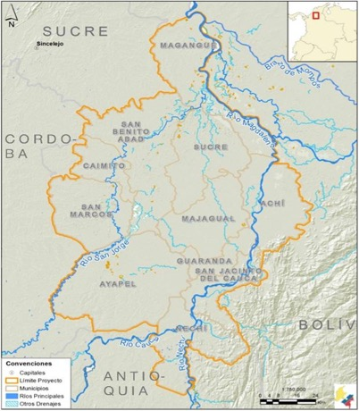{width="2.6655697725284337in" height="3.043478783902012in"}

Figura 1. Mapa de la ecorregión de la Mojana (Fondo de Adaptación).

Los primeros pobladores de la región de La Mojana fueron los indígenas Zenues, quienes colonizaron y adecuaron la depresión Momposina e iniciaron su poblamiento desde el siglo IX a.C, hasta los siglos X-XII d.C [8]. En este proceso de poblamiento aparecen importantes ingenieros hidráulicos que han marcado la historia del manejo de los recursos hídricos en Colombia y en Latinoamérica. Con el fin de adaptarse a los periodos de inundación construyeron plataformas artificiales (2 o 3 m de altura) para instaurar sus viviendas, de esta forma los niveles del agua no lograban afectar su hábitat. Adicionalmente este sistema estaba compuesto por canales artificiales y camellones --partes elevadas entre canal y canal-- que encausaban las aguas facilitando su salida al mar. Las aguas se distribuían de manera uniforme, circulaban más lentamente durante la época de inundaciones y, en época de sequía, permanecían humedeciendo los camellones donde se ubicaban los cultivos [8].

Dichas técnicas se abandonaron y las causas no se establecieron. Sin embargo se le atribuyen a fenómenos ambientales relacionados con periodos de sequías. En el siglo XVI empieza el proceso de poblamiento español, que se caracteriza especialmente por la introducción de ganado en la zona de parte de los hermanos Heredia. Apareciendo de esta forma la ganadería y explotación agrícola. Los hechos del proceso de colonización marcan una nueva historia para la región. Donde las actividades económicas, ya no vistas como procesos de subsistencia de sus habitantes empiezan a enfocarse en la sobreexplotación del suelo, el agua y los seres humanos [9].

En los últimos años, la ecorregión ha cambiado debido al uso, ocupación del territorio y por el manejo de las cuencas de los ríos que confluyen en el delta hídrico. Adicionalmente la construcción de obras civiles ha generado cambios en el complejo cenagoso y fluvial. La infraestructura se ha orientado al control del agua mediante obras que afectan la dinámica hídrica y desestabilizan los sistemas hidrobiológicos, en lugar de adaptarse a las condiciones del medio natural para su aprovechamiento.

La ecorregión de la Mojana ha sido el caso de estudio para aplicar los modelos integrados provenientes del metamodelo. Específicamente la información y los procesos fueron desarrollados en los municipios de Nechí (Antioquia), San Marcos (Sucre), Magangué (Bolivar), Montelíbano (Córdoba) y en la Depresión Momposina en Mompox (Bolívar).

MATERIALES Y MÉTODOS
====================

Según Kroes el diseño "es un proceso de invención, una generación inteligente y evaluación de especificaciones de nuevos objetos, artefactos; cuya forma y función logren los objetivos establecidos y satisfagan las necesidades, pero también contemplen limitaciones y restricciones" [10]. Ejemplos de artefactos pueden ser: una organización, una máquina, una herramienta, entre otros. El diseño tiene una actividad mental y una actividad física. Respecto al aspecto mental "El verdadero trabajo de fabricación se realiza bajo la guía de un modelo, de acuerdo con el cual se construye el objeto. Dicho modelo puede ser una imagen contemplada por la mente o bien un boceto en el que la imagen tenga ya un intento de materialización mediante el trabajo" [11]. Según Epstein "Cualquiera que se aventure a proyectar, o imaginar una dinámica" ejecuta un modelo [12].

+----------------------------------------------------------------------------------------------------------------------------------------------------------------------------------------------------------------------------------------------------------------------------------------------------------------------------------------------------------------------------------------------------------------------------------------------------------------------------------------------------------------------------------------------------------------------------------------------------------------------------------------------------------------------------------------------------------------------------------+
| Caja 2. Según Epstein [12], además de predecir, los modelos son para                                                                                                                                                                                                                                                                                                                                                                                                                                                                                                                                                                                                                                                   |
|                                                                                                                                                                                                                                                                                                                                                                                                                                                                                                                                                                                                                                                                                                                                  |
| (i) explicar, (ii) recopilar datos, (iii) iluminar la dinámica del núcleo, (iv) sugerir analogías, (v) descubrir nuevas preguntas, (vi) fomentar el hábito de la mente crítica, (vii) soportar los resultados de los rangos plausibles, (viii) iluminar las incertidumbres principales, (ix) ofrecer opciones de crisis en tiempo real, (x) demostrar compensaciones y sugerir eficiencia, (xii) desafiar a la robustez que prevalece a través de las perturbaciones, (xiii) exponer lo que suele pensarse como incompatible con los datos disponibles, (xiv) capacitar practicantes, (xv) disciplinar el diálogo sobre políticas, (xvi) educar al público en general y (xvi) revelar lo aparentemente simple al ser complejo. |
+----------------------------------------------------------------------------------------------------------------------------------------------------------------------------------------------------------------------------------------------------------------------------------------------------------------------------------------------------------------------------------------------------------------------------------------------------------------------------------------------------------------------------------------------------------------------------------------------------------------------------------------------------------------------------------------------------------------------------------+

 Modelos usados en el diseño
---------------------------

Modelos participativos: según Voinov y Bousquet [13] tiene entre sus propósitos el aprendizaje compartido, la colaboración y participación de actores en los procesos de modelado. La eficiencia de la participación depende entre otras, de la relación entre los actores, la habilidad para comunicar e intercambiar información y conocimiento, y los métodos que apoyan esta actividad.

Modelos mentales: se enfoca en la habilidad de las personas para predecir ciertos resultados, usando razonamientos basados en observaciones previas. Estos razonamientos trasladan los procesos del mundo externo a palabras, números o símbolos [14].

Modelos hídricos: el modelado hídrico puede realizarse utilizando dos tipos de enfoques: hidrodinámico e hidrológico. Ambos pueden estar relacionados en un modelo de inundación. Para conocer variables como el caudal, la velocidad y la profundidad se pueden utilizar modelos hidrodinámicos, que utilizan métodos numéricos para resolver las ecuaciones de Navier-Stokes, para un flujo incomprensible. De esta manera se puede conocer la forma de la inundación, representada sobre un modelo de elevación digital. Los modelos pueden ser de tipo unidimensional o bidimensional [15]. Para el modelado de inundaciones se utilizan las ecuaciones de aguas someras donde se parte de las siguientes suposiciones [16]: (a) fluido homogéneo "H", (b) velocidades verticales mucho menores que las velocidades horizontales, (c) la extensión vertical es mucho menor que la horizontal, (d) las aceleraciones verticales pueden despreciarse, (e) la distribución de las presiones es hidrostática, (f) las partículas tienen un movimiento rectilíneo en el plano horizontal, (g) las fuerzas inerciales son mucho mayores que las fuerzas viscosas.

El sistema de ecuaciones consta de las correspondientes al movimiento horizontal, la ecuación de continuidad y las ecuaciones de transporte. El conjunto de ecuaciones diferenciales parciales en combinación con condiciones iniciales y de frontera se resuelven en una cuadrícula de diferencias finitas.

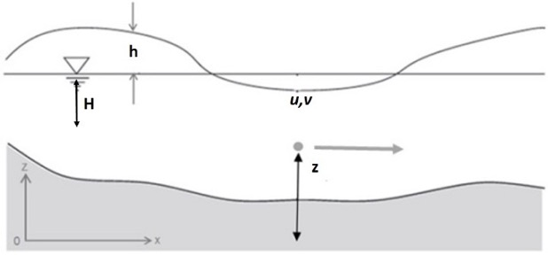{width="4.091734470691164in" height="1.9069772528433946in"}

Figura 2. Representación de las ecuaciones de aguas someras [17].

Donde H es la profundidad promedio del agua, h la perturbación de la superficie libre y u, v las velocidades horizontales, g la gravedad, Sx y Sy representan los términos fuente (fricción, viento coriolis, etc) [9].

$$frac{partial u}{partial t} + ufrac{partial u}{partial x} + vfrac{partial u}{partial y} + zleft( u,v right) = - g frac{partial h}{partial x} + Sx              (1)$$

$$frac{partial v}{partial t} + ufrac{partial v}{partial x} + vfrac{partial v}{partial y} + zleft( u,v right) = - g frac{partial h}{partial y}    + Sy           (2)$$

$$frac{partial h}{partial t} + frac{partial u}{partial x}left( H + h right) + frac{partial}{partial y}leftlbrack left( H + h right)v rightrbrack = 0                       left( 3 right)$$

Modelos basados en agentes: los modelos basados en sistemas de agentes tienen la capacidad de representar el comportamiento de actores humanos de manera realista, su heterogeneidad, interacción con el ambiente natural y el aprendizaje evolutivo [18].

+-------------------------------------------------------------------------------------------------------------------------------------------------------------------------------------------------------------------------------------------------------------------------------------------------------------------------------------------------------------------------------------------------------------------------------------------------------------------------------------------------------------------------------------------------+
| Caja 3. Retos de la modelación basada en agentes [18]                                                                                                                                                                                                                                                                                                                                                                                                                                                                                 |
|                                                                                                                                                                                                                                                                                                                                                                                                                                                                                                                                                 |
| > El modelado de la conducta de los agentes: la exploración del diseño de las decisiones de los agentes es un reto en la medida que se debe generar un balance en las teorías de toma de decisiones, pero también de las observaciones empíricas.                                                                                                                                                                                                                                                                                           |
| >                                                                                                                                                                                                                                                                                                                                                                                                                                                                                                                                               |
| > Análisis de sensibilidad, verificación y validación: el grado de fiabilidad y robustez de este tipo de sistemas pide información de microescala de los comportamientos e interacciones de los agentes. Lo que implica un gran número de parámetros por los cuales el modelo es sensible. Es importante precisar que un análisis de este tipo puede ser vital cuando se aplican en un contexto de políticas. Por lo que se exige solidez en la construcción y éxito en lo relacionado con la reproducción de tendencias y patrones reales. |
| >                                                                                                                                                                                                                                                                                                                                                                                                                                                                                                                                               |
| > El acoplamiento de modelos socio-demográficos, ecológico y biofísico: cuando se usan para estudiar las dinámicas de los sistemas complejos se concentran en la necesidad de integrar la conducta humana con otros modelos. Un reto es poder identificar la vinculación de variables y reunir en el mundo real los datos para vincular el modelo.                                                                                                                                                                                          |
+-------------------------------------------------------------------------------------------------------------------------------------------------------------------------------------------------------------------------------------------------------------------------------------------------------------------------------------------------------------------------------------------------------------------------------------------------------------------------------------------------------------------------------------------------+

Metamodelo: el prefijo meta, en griego, significa superior o posterior. En filosofía, es usado a menudo para hablar sobre una propia categoría. En el contexto de la ingeniería de software, meta significa que el modelo que se construye representa otros modelos, es un modelo de modelos [19].

Propuesta de un metamodelo de modelos integrados para el desarrollo de artefactos participativos
------------------------------------------------------------------------------------------------

En las comunidades que se encuentran ubicadas en zonas de amenaza por inundación periódicas, se ha observado que muchos de sus hábitos se relacionan con la variación de los niveles del agua. En este sentido, comprender los cambios en los niveles del agua y aquellos generados en los hábitos de las comunidades resulta importante para el diseño e implementación de estrategias que promueven disminuir la vulnerabilidad de las comunidades y hacerlas más resilientes frente a dichas amenazas.

Recientemente, en Colombia se han desarrollado diferentes instrumentos como los planes de gestión del riesgo, los sistemas de alertas tempranas, los planes de ordenamiento y manejo de cuencas, entre otros, que han ganado importancia como herramientas de política pública para disminuir la vulnerabilidad y generar estrategias de gestión del riesgo en el territorio. Para generar escenarios relacionados con la interacción agua-comunidad es fundamental la integración de variables que representan procesos sociales y procesos ecológicos. La dinámica natural de las causas y efectos en cadena, la consideración de los efectos y la no linealidad. A partir del trabajo de campo, realizado en la ecorregión de la Mojana, surge el metamodelo. La selección de los municipios en donde se hizo el trabajo de campo consideró los siguientes criterios: (i) hicieran parte de la ecorregión de la Mojana y hubieran tenido impactos por las inundaciones durante los años 2010-2011, (ii) se pudiera acceder por transporte terrestre, (iii) se hubieran considerado en el proyecto de "Evaluación Probabilística de Riesgo por Inundación" liderado por la UNGRD.

La información de los talleres se construyó principalmente con el apoyo de las Instituciones educativas, donde se llevaron a cabo espacios de participación que incluyeron jóvenes, profesores y padres de familia. Quienes estuvieron de acuerdo con el uso de los resultados en el proceso de investigación. Los recorridos territoriales se llevaron a cabo en zonas que tuvieron afectaciones por las inundaciones, durante los años 2010 y 2011 y contaron con el consentimiento de los entrevistados. También fueron utilizados los resultados de los ejercicios de participación para el análisis de la vulnerabilidad social, en el marco del proyecto liderado por la UNGRD [22] donde se establecen los criterios para realizar dicho análisis a partir de hogares e individuos, con el soporte de los Consejos Municipales para la Gestión del Riesgo. A continuación, se presenta la descripción de algunos de los insumos que fueron usados para el diseño, los cuales se encuentran de manera detallada en la tesis doctoral "Gestión del riesgo por inundaciones: un metamodelo para el desarrollo de artefactos particitipativos" [23].

En los talleres llevados a cabo en septiembre del año 2013 en el municipio de San Marcos (Sucre), se identificó con las comunidades que el eje estructurante de las dinámicas del territorio en la región de la Mojana es el agua. Los municipios que habitan esta zona del país están rodeados por agua y allí se presentan inundaciones lentas. En los talleres con las comunidades se observa que el municipio de San Marcos se encuentra rodeado por ciénagas y caños. El problema más relevante que han tenido durante los últimos años ha sido la inundación ocasionada por el Fenómeno de la Niña 2010--2011. Respecto a esta situación hay diferentes percepciones. Los niños consideran que la inundación es un sinónimo de alegría y recreación. Sin embargo, no les gusta que se suspendan las clases en el Colegio. Respecto a los adultos, se identifican problemas en la medida que tuvieron que desplazarse a otros lugares, hubo daños en las viviendas y problemas en los cultivos. En la Figura 3, se observa la descripción que hace la comunidad sobre los efectos de las inundaciones.

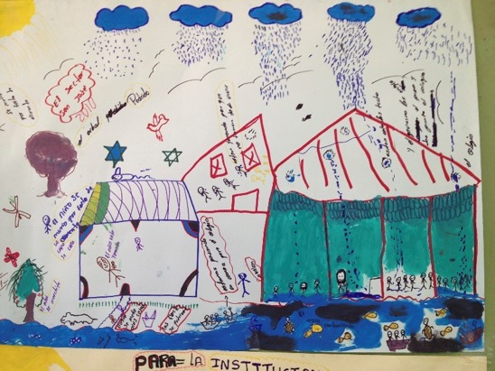{width="3.6521741032370953in" height="2.7393372703412076in"}

Figura 3. Descripción de inundaciones, en el municipio de San Marcos (Sucre) [21].

En los recorridos territoriales se observaron las formas de adaptación de las comunidades a las inundaciones, principalmente reflejadas en las viviendas. Una característica es el uso de infraestructura palafítica en escuelas, que permite mejorar las condiciones de permanencia de los estudiantes durante períodos de inundación. Además de estos mecanismos, la comunidad construye tambos artesanales (uso de madera) al interior de las viviendas o desarrolla el enterrado, que consiste en rellenar el piso de las viviendas (tierra y residuos sólidos) para levantarlas. De esta forma, el nivel de la inundación no afecta los electrodomésticos, los diferentes elementos de las edificaciones y directamente a los seres humanos.

En los talleres realizados con la Unidad Nacional para la Gestión del Riesgo de Desastres-UNGRD durante el año 2018, se identificaron las mismas formas de adaptación, no solo en el municipio de San Marcos, sino también en Montelíbano, Magangué y Mompox. Lo que refleja la cultura anfibia de estas comunidades. Se identifican los tambos al interior de las viviendas y también el uso de bolsacretos para controlar el paso del agua a las viviendas. Se puede observar que, durante los períodos de inundación, aumenta la producción de peces y se incrementa esta actividad económica en los municipios. En muchos casos, los pescadores tienen dos viviendas, una en la zona de la inundación (generalmente con tambos) y otra en la zona no inundada. La inundación también resulta clave para la producción de cultivos como el arroz. Sin embargo, en algunos casos los niveles del agua pueden llegar a afectar la cosecha.

Además de la relación de la inundación con las actividades productivas, también se encontró una relación con la salud. Durante los talleres con las comunidades se identificó que durante los meses de lluvias se presentan epidemias como se observa en la Figura 3 que afectan principalmente a los niños. En los recorridos territoriales que se hicieron en el año 2017, se identificó que las personas se mueven de sus viviendas y no se adaptan, solo en los momentos que el agua empieza a afectar la salud de los habitantes o cuando la vivienda se ha inundado totalmente. Según los relatos, cuando el agua supera los 40 cm y se queda estancada durante varios meses (más de un mes) se empiezan a generar problemas de salud. En estos momentos la comunidad se une y coopera de diferentes formas. Por ejemplo, facilitando entre varias personas el transporte de los niños al centro de salud en canoas.

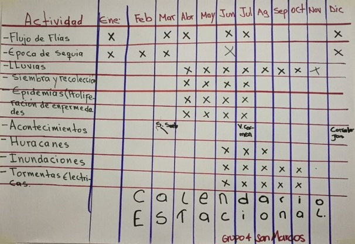{width="4.034782370953631in" height="2.7683781714785654in"}

Figura 4. Calendario estacional en el municipio de Magangué (Bolívar) [22].

En los talleres llevados a cabo en la UNGRD durante el año 2018 [22], se pudo identificar la cooperación como una fortaleza de las comunidad que la hace menos vulnerable. Durante la inundación, las personas se unen para vigilar las viviendas evacuadas, hay personas transmitiendo comunicados de la situación con el apoyo de megáfonos, se hacen monitoreos en el río, y también se unen para hacer la comida y trabajar en equipo en los campamentos (albergues). Diferentes entidades apoyan la situación de emergencia, y allí se destaca el papel de los organismos de socorro y aquellos relacionados con la gestión del riesgo en el municipio como: La Policía, La Defensa Civil, La Iglesia, La Alcaldía y La Emisora. Del procesamiento del trabajo de campo, resultan relatos y análisis que son el insumo para el metamodelo [20], y las variables que resultan claves para el análisis de la vulnerabilidad se presentan en la Figura 5.

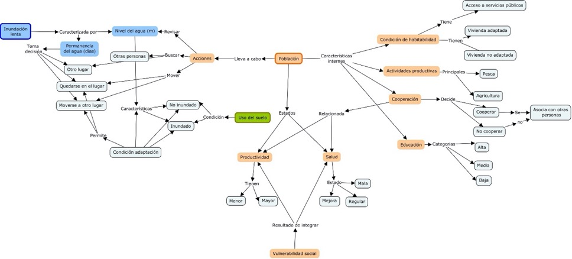{width="6.420819116360455in" height="2.900919728783902in"}

Figura 5. Elementos claves para el diseño del metamodelo a partir del trabajo de campo en la ecorregión de la Mojana.

La metodología utilizada para el análisis y diseño del metamodelo se titula GAIA [23]. Esta metodología se enfoca en una visión de sistemas multiagentes como una organización computacional consistente en la interacción de varios roles. Los agentes representan un avance en la abstracción, dado que pueden ser usados para entender naturalmente los modelos y desarrollar sistemas complejos distribuidos. A través de esta metodología se realiza un análisis que va desde unos requerimientos del diseño que es suficientemente detallado y que se pueden implementar directamente. El principal modelo usado en GAIA incluye dos modelos, el primero de roles y el segundo de interacciones. El rol se define por cuatro atributos: funcionalidad, permisos, actividades y protocolos. Las responsabilidades determinan la funcionalidad. Los permisos son los derechos u obligaciones asociados con el rol. Se relacionan directamente con los recursos que se encuentran disponibles para realizar sus responsabilidades. Las actividades son las acciones privadas de los agentes, sin interactuar con otros agentes. El rol se identifica con un número de protocolos, que se definen por la interacción con otros roles [23].

+----------------------------------------------------------------------------------------------------------------------------------+
| Caja 4. Modelo de roles: permisos                                                                                            |
|                                                                                                                                  |
| -   Anfibios: el propósito de este rol es adaptarse a las condiciones de inundación y llevar a cabo sus actividades productivas. |
|                                                                                                                                  |
| ```{=html}                                                                                                                       |
| <!-- -->                                                                                                                         |
| ```                                                                                                                              |
| -   Permisos: revisar *Uso del suelo // inundado o seco.*                                                                        |
|                                                                                                                                  |
| -   Mover *Tomar la decisión* // *moverse a otro lugar si no está inundado o quedarse en el lugar si está inundado.*             |
|                                                                                                                                  |
| -   Asentarse *Tomar la decisión* // *asentarse y llevar a cabo sus actividades productivas o seguir moviéndose.*                |
|                                                                                                                                  |
| ```{=html}                                                                                                                       |
| <!-- -->                                                                                                                         |
| ```                                                                                                                              |
| -   Agrícolas: el propósito de este rol es llevar a cabo sus actividades productivas en zonas secas.                             |
|                                                                                                                                  |
| ```{=html}                                                                                                                       |
| <!-- -->                                                                                                                         |
| ```                                                                                                                              |
| -   Permisos: revisar *Uso del suelo // inundado o seco.*                                                                        |
|                                                                                                                                  |
| -   Mover *Tomar la decisión* // *moverse a otro lugar si no está seco o quedarse en el lugar si está seco.*                     |
|                                                                                                                                  |
| -   Asentarse *Tomar la decisión // asentarse y llevar a cabo sus actividades productivas o seguir moviéndose.*                  |
+----------------------------------------------------------------------------------------------------------------------------------+

En el metamodelo diseñado en esta investigación son identificados dos roles, los anfibios y los agrícolas. Los cuales representan el comportamiento de la población en la Mojana. Estos a su vez pueden adoptar dos estados: buscadores y asentados. Al comienzo el sistema inicializa el número total de agentes; para cada uno de los cuales las rutinas son las mismas por población (buscar, moverse, asentarse, reproducirse y morir). La principal diferencia entre los dos tipos de agentes consiste en que el proceso de asentarse depende de la condición del suelo (seco o inundado). Las rutinas se predefinen en función de la riqueza de las parcelas, no obstante, su incremento y estabilidad dependen adicionalmente de la velocidad de búsqueda y de la riqueza acumulada. Asimismo, estas últimas dan lugar a la configuración de tres clases sociales alta, media y baja. Cuando el tiempo de búsqueda de un agente se agota, este puede cambiar su condición de anfibio a agrícola o viceversa [27].

+---------------------------------------------------------------------------------------------------------+
| Caja 5. Modelo de roles: responsabilidades                                                          |
|                                                                                                         |
| -   Anfibios: *siempre que haya agua, adaptarse y llevar a cabo actividades de pesca*.                  |
|                                                                                                         |
| -   Agrícolas: *siempre que haya cultivos y el terreno esté seco, realizar las labores de agricultura.* |
+---------------------------------------------------------------------------------------------------------+

Para el caso del metamodelo se tienen dos roles: anfibios y agrícolas. A continuación, se presenta un ejemplo de uno de ellos. El operador w significa infinitas repeticiones:

Tabla 3. Esquema para el rol del anfibio.

  Esquema del rol Anfibio   Anfibio
  ----------------------------- -------------------------------------------------------------------------------------------------------------------------------------------------------------------------------------------------------------------------------------------------------------------------------
  Descripción                   Este rol se relaciona con garantizar que durante los períodos de inundación se realice una adaptación en términos de habitabilidad y actividades productivas. Además, que se lleven a cabo actividades de cooperación para disminuir las condiciones de vulnerabilidad social
  Protocolos y actividades      Moverse, asentarse, colaborar, reproducirse, morir
  Permisos                      Revisar *Uso del suelo // inundado o seco.*
  Permisos                      Asentarse *Tomar la decisión // asentarse y llevar a cabo sus actividades productivas o seguir moviéndose*
  Permisos                      Aprovechar *Valores de riqueza // a través de sus actividades productivas mejorar o no su riqueza acumulada*
  Responsabilidades             
  Vida                          Anfibio: moverse, asentarse, colaborar, reproducirse, morir
  Seguridad                     *Riqueza >0*
  Seguridad                     *edad <esperanza de vida*

Un ejemplo de los protocolos presentados en los modelos se presenta en la Figura 5 [24].

-   Clase baja: cuando está rodeado de agentes clase alta (A), media (M) o no tiene vecinos (N) en su vecindad de Moore [28], el agente decide tomar todos los recursos de la tierra para su beneficio individual. Cuando está rodeado de algún agente clase baja (B) en su vecindad de Moore, el agente decide cooperar con el agente de clase baja, pues este basado en el concepto de la igualdad ayuda a sus semejantes.

-   Clase media: cuando está rodeado de agentes clase alta (A), o no tiene vecinos (N) en su vecindad de Moore, el agente decide tomar todos los recursos de la tierra para su beneficio individual. Con los individuos de clase superior a él no colabora porque tienen demasiados recursos. Cuando está rodeado de algún agente clase baja (B) o media (M) en su vecindad de Moore, el agente decide cooperar con el agente de clase baja o media, pues con su ideal de sociedad equitativa cree que lo mejor es ayudar a sus semejantes y los menos favorecidos.

-   Clase alta: cuando está rodeado de agentes clase alta (A) o no tiene vecinos (N) en su vecindad de Moore, el agente decide tomar todos los recursos de la tierra para su beneficio individual. Este agente tiende a competir con los mismos individuos de su clase. Cuando está rodeado de algún agente clase baja (B), o media (M) en su vecindad de Moore, el agente decide cooperar, pues también es consiente que la sociedad debería ser equitativa y por esta razón decide donar parte de sus recursos con sus vecinos.

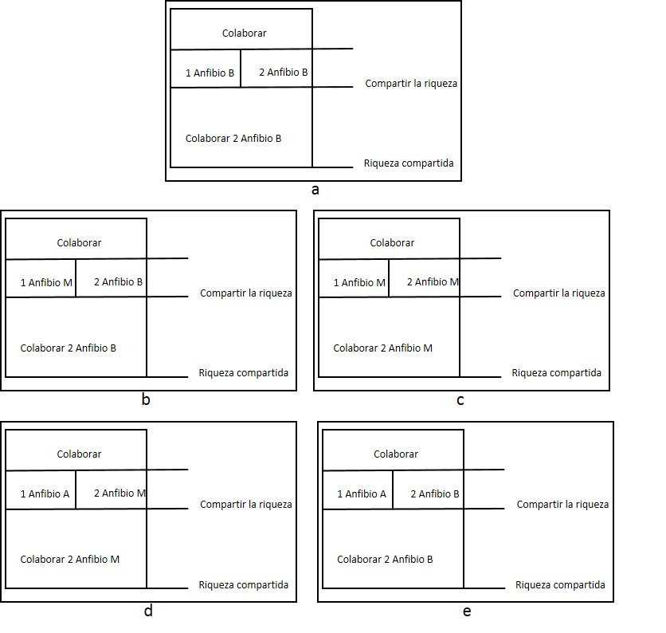{width="5.573333333333333in" height="5.293333333333333in"}

Figura 6. Modelos de interacción. a reglas clase baja. b y c reglas clase media. d y e reglas clase alta. Para la estructura de un autómata celular se puede definir una vecindad establecida para cada celda, la que consiste en un conjunto contiguo de celdas. Esta vecindad puede estar formada por las celdas inmediatamente contiguas a la celda en cuestión (vecindad de Von Neuman , cuatro celdas, o vecindad de Moore, ocho celdas).

RESULTADOS
==========

Fueron desarrollados diferentes modelos que generaron artefactos, esto a partir del metamodelo presentado. El primer artefacto de simulación que se presenta se denomina MOJANA: Modelo Organizacional Jerárquico de Agentes Naturales del Agua. Este modelo fue evolucionando a partir de los hallazgos encontrados en campo, dando paso al segundo artefacto denominado MOJANACOOP: Modelo Organizacional Jerárquico de Agentes Naturales del Agua Cooperativos. El tercero MOJANAREAL: Modelo Organizacional Jerárquico de Agentes Naturales del Agua en tiempo real. A continuación, se hace una descripción del desarrollo y resultados de cada uno. Para los dos primeros se utiliza como medio para la integración la plataforma NetLogo y para el tercero, se construye un modelo con actores en el municipio de San Marcos que integran su conocimiento al artefacto.

 MOJANA: Modelo Organizacional Jerárquico de Agentes Naturales del Agua [25]
-----------------------------------------------------------------------------

Propósito del modelo: analizar la influencia de la inundación y de los usos del suelo en las variables correspondientes a la desigualdad en el territorio y las dinámicas de asentamiento. Variables que son conocidas, que se acostumbran a usar en ejercicios de planeación y en la generación de escenarios de desarrollo territorial [26].

Usuarios y actores: los usuarios iniciales fueron el equipo de modeladores. Se considera que este tipo de modelos inspirados en una problemática local, pero que no tienen información real del territorio, podrían servir para el diseño de políticas públicas en el marco de la gestión del riesgo por inundación.

Conceptualización del sistema: los procesos que se modelan son el fenómeno de inundación, el aprovechamiento del territorio y la interacción de la población con estos. El territorio está modelado como un autómata celular cuyas celdas albergan una cantidad de grano, que representa la riqueza de dicha unidad territorial, medida no solo en términos de recursos naturales sino también en elementos humanos como infraestructura y servicios, entre otros. El territorio tiene capacidad de regeneración por tanto la cantidad de grano que se consuma puede ser recuperada en el tiempo. Las poblaciones humanas se representan por un sistema de agentes que toman provecho del territorio para mejorar su riqueza acumulada, sin embargo, la no adaptación puede degradarla. La interacción de los agentes con el territorio conlleva al mejoramiento o empobrecimiento de este. Otro autómata celular simula una inundación que se produce periódicamente. El nivel de agua en las unidades territoriales puede ser atractivo o repulsivo para los agentes. Dependiendo de la adaptación del agente al agua, esta degrada o no su bienestar. La presencia periódica de la inundación, la capacidad de regeneración y modificación del territorio sumado a la posibilidad de cambio en los agentes hacen que la herramienta computacional se caracterice por exhibir un entorno variante en el tiempo.

Variables a modelar: en el aplicativo se consideran dos tipos de agentes que emulan el comportamiento de la población en la ecorregión: agrícolas y anfibios. Al comienzo el sistema inicializa el número total de agentes (agrícolas y anfibios); para cada uno de los cuales las rutinas son las mismas por población (i.e. buscar, moverse, asentarse, reproducirse y morir). La principal diferencia entre los dos tipos de agentes consiste en que el proceso de asentarse depende de la condición del territorio (i.e. seco o inundado).

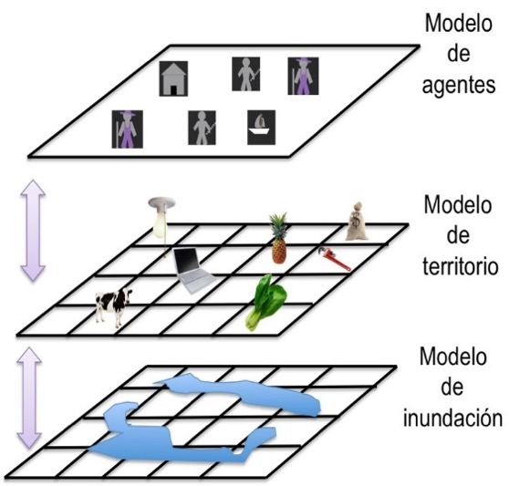{width="3.6868580489938756in" height="3.5229166666666667in"}

Figura 7. Componentes modelo MOJANA [25].

Disponibilidad de códigos: integra una jerarquía de tres submodelos (Fig. 7). Estos toman como base a los aplicativos: NetLogo wealth distribution model (Wilensky, 1998), NetLogo Urban Suite-Sprawl Effect model (Felsen y Wilensky, 2007) y NetLogo Erosion model (Dunham, Tisue y Wilensky, 2004) [25].

Implementación: se hizo en la plataforma NetLogo y los detalles se pueden encontrar en [25] . En la Figura 8 se observa la interfase del artefacto construido en NetLogo.

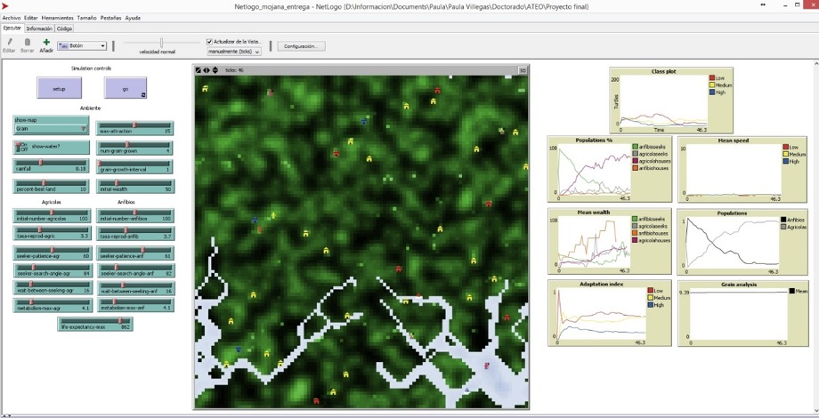{width="6.1375in" height="3.1375in"}

Figura 8. Interfase del modelo MOJANA [25]*.*

  -------------------------------------------------------------------------------------------------------------------------------------------------------- -----------------------------------------------------------------------------------------------------------------------------------------------------------------
  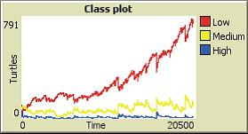{width="2.90625in" height="1.5729166666666667in"}   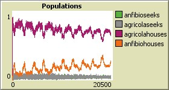{width="2.95420384951881in" height="1.5826093613298338in"}
  -------------------------------------------------------------------------------------------------------------------------------------------------------- -----------------------------------------------------------------------------------------------------------------------------------------------------------------

Figura 9. Resultados del modelo MOJANA (izquierda) Cantidad de agentes por clases sociales. (derecha) Cantidad de agentes por tipos de agentes.

Se observa en la Figura 9 (izquierda), como la clase social baja predomina. Las presiones del entorno son representadas en la cantidad de grano, que seleccionan las clases existentes. En la Figura 9 (derecha) se observa cómo predominan los agrícolas asentados, dado que existe mayor cantidad de territorio sin agua. Un comportamiento similar tiene actualmente la región, donde los niveles de pobreza son muy altos, reflejados en un NBI promedio de: 64.4 y la cantidad de terratenientes es baja.

MOJANACOOP: Modelo Organizacional Jerárquico de Agentes Naturales del Agua Cooperativos
---------------------------------------------------------------------------------------

Propósito del modelo: analizar la influencia de la inundación y de los usos del suelo en la variable correspondientes a la vulnerabilidad social. Esto en el marco del riesgo por inundación.

Usuarios y actores: los usuarios iniciales fueron el equipo de modeladores. Se considera que este tipo de modelos inspirados en una problemática local, pero que no tienen información real del territorio, podrían servir para el diseño de políticas públicas en el marco de la gestión del riesgo por inundación.

Conceptualización del sistema: los procesos que se modelan son el fenómeno de inundación, el aprovechamiento del territorio y la interacción de la población con estos. El territorio está modelado como un autómata celular cuyas celdas albergan una cantidad de grano, que representa la riqueza de dicha unidad territorial, medida no solo en términos de recursos naturales sino también en elementos humanos como infraestructura y servicios, entre otros. El territorio tiene capacidad de regeneración por tanto la cantidad de grano que se consuma puede ser recuperada en el tiempo.

Las poblaciones humanas se representan por un sistema de agentes que toman provecho del territorio para mejorar su riqueza acumulada, sin embargo, la no adaptación puede degradarla. La interacción de los agentes con el territorio conlleva al mejoramiento o empobrecimiento de este. En esta versión las poblaciones de agentes tienen la capacidad de cooperar. Además, dependiendo de sus características individuales, presentan unos niveles de vulnerabilidad social. Los resultados de un modelo hidrodinámico de la ecorregión representan una inundación que se produce periódicamente. El nivel de agua en las unidades territoriales puede ser atractivo o repulsivo para los agentes. Dependiendo de la adaptación del agente al agua, su vulnerabilidad social cambia. La presencia periódica de la inundación, la capacidad de regeneración y modificación del territorio sumado a la posibilidad de cambio en los agentes hacen que la herramienta computacional se caracterice por exhibir un entorno variante en el tiempo.

Variables a modelar: similar al modelo MOJANA.

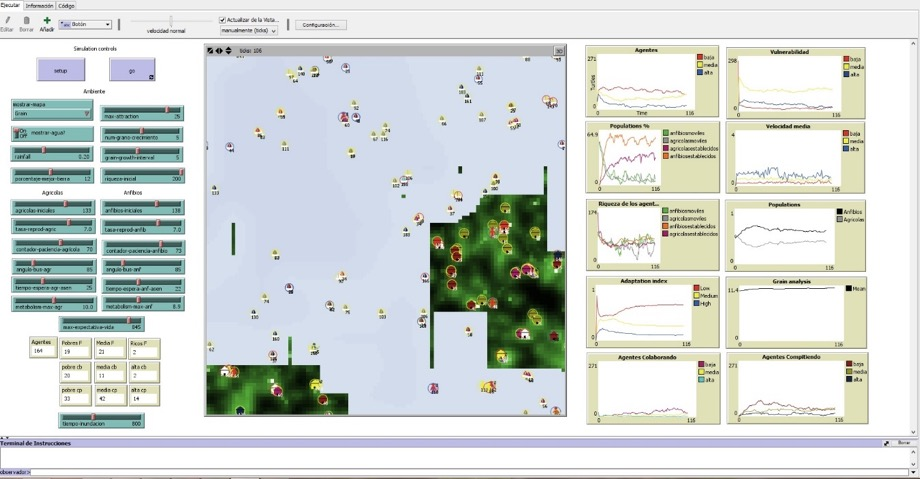{width="6.1375in" height="3.1951388888888888in"}

Figura 10. Interfase del modelo MOJANACOOP [20] .

Disponibilidad de códigos: usa los incluidos en MOJANA y además, integra un modelo de cooperación [24].

Implementación: la implementación del modelo se hizo en la plataforma NetLogo y los detalles se pueden encontrar en [20]. En la Figura 10 se observa la interface del artefacto construido en NetLogo. Las reglas para el cálculo de la vulnerabilidad se presentan en la Tabla 4:

Tabla 4. Reglas de cálculo para la vulnerabilidad social.

  Variables por agente         Condición                                                   Nivel de vulnerabilidad   Valores
  -------------------------------- --------------------------------------------------------------- ----------------------------- -------------
  Habitabilidad                    Si el agente se adapta a la condición de inundación o seca      Vulnerabilidad baja           0
  Habitabilidad                    Si el agente no se adapta a la condición de inundación o seca   Vulnerabilidad alta           1
  Actividades productivas          Clase alta                                                      Vulnerabilidad baja           0
  Actividades productivas          Clase media                                                     Vulnerabilidad baja           0.5
  Actividades productivas          Clase baja                                                      Vulnerabilidad baja           1
  Cooperación                      Coopera                                                         Vulnerabilidad baja           0
  Cooperación                      No coopera                                                      Vulnerabilidad alta           1
  Educación                        Nivel de educación: alto                                        Vulnerabilidad baja           0
  Educación                        Nivel de educación: medio                                       Vulnerabilidad media          0.5
  Educación                        Nivel de educación: bajo                                        Vulnerabilidad alta           1
  Salud                            Nivel de salud: alto                                            Vulnerabilidad baja           0
  Salud                            Nivel de salud: medio                                           Vulnerabilidad media          0.5
  Salud                            Nivel de salud: bajo                                            Vulnerabilidad alta           1
  Salud en función de la amenaza   Si el agua sube más de 40 cm                                    Vulnerabilidad alta           1
  Salud en función de la amenaza   Si el agua no sube más de 40 cm                                 Vulnerabilidad baja           0
  Vulnerabilidad social            Corresponde a la sumatoria de las variables anteriores          Vulnerabilidad social alta    4.5-6
  Vulnerabilidad social            Corresponde a la sumatoria de las variables anteriores          Vulnerabilidad social media   1.5-4.49
  Vulnerabilidad social            Corresponde a la sumatoria de las variables anteriores          Vulnerabilidad social baja    0-1.49

  ------------------------------------------------------------------------------------------------------------------------------------------------------------------ ------------------------------------------------------------------------------------------------------------------------------------------------------------------
  {width="2.917073490813648in" height="1.5627176290463691in"}   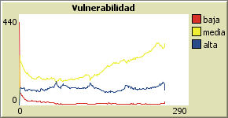{width="3.021255468066492in" height="1.5627176290463691in"}
  ------------------------------------------------------------------------------------------------------------------------------------------------------------------ ------------------------------------------------------------------------------------------------------------------------------------------------------------------

Figura *11*. Resultados del modelo MOJANACOOP. Cantidad de agentes por clases sociales *(izquierda)*. Cantidad de agentes acorde a los niveles de vulnerabilidad social (derecha).

Se observa en la Figura 11 (izquierda), como la clase social baja predomina, seguida de la media y la alta. Las presiones del entorno son representadas en la cantidad de grano, que seleccionan las clases existentes. En la Figura 11 (derecha) se observa como la vulnerabilidad media es la predominante. Este resultado fue similar en el proyecto generado por la Unidad Nacional para la Gestión del Riesgo de Desastres [27]. Los factores que inciden en este valor son: las condiciones de habitabilidad, las actividades productivas, la capacidad de cooperación y, el acceso a educación y salud.

MOJANAREAL: Modelo Organizacional Jerárquico de Agentes Naturales del Agua en tiempo real 
-----------------------------------------------------------------------------------------

Propósito del modelo: generar escenarios de inundación para la ecorregión de la Mojana, donde se puedan discutir estrategias para disminuir la vulnerabilidad social en el territorio. Esto se propone a través de un ejercicio de modelado participativo.

Usuarios y actores: los actores que participaron fueron los padres de familia, profesores y estudiantes del grado noveno, de la Institución Educativa San José San Marcos. Los usuarios son los demás grados de la Institución, liderado por los coordinadores del curso.

Conceptualización del sistema: los procesos que se modelan son el fenómeno de inundación, el aprovechamiento del territorio y la interacción de la población con estos. El territorio está modelado utilizando fichas de color azul y de color verde. Las primeras corresponden a las zonas inundadas y las segundas a las zonas secas. En dichas celdas, se encuentran recursos naturales como fauna y flora. También se ubican las viviendas, las canoas, y la infraestructura es dibujada (puente, vía y monumento a la cultura anfibia). Las poblaciones humanas están representadas por familias, a las cuales pertenecen las diferentes viviendas y las cuales llevan a cabo diversas actividades productivas. La interacción de las personas con el territorio conlleva a aumentar o disminuir la vulnerabilidad social. La inundación se produce de manera hipotética en la generación de los escenarios. Esto se hace precisando un nivel del agua que aumenta en las unidades territoriales. El cual puede ser atractivo o repulsivo para las familias. Dependiendo de la adaptación de la población al agua, esta disminuye o no su vulnerabilidad social. La presencia periódica de la inundación, la modificación del territorio sumado a la posibilidad de cambio en la población y sus viviendas hacen que el artefacto se caracterice por exhibir un entorno variante en el tiempo.

Variables a modelar: se consideran dos tipos de agentes que emulan el comportamiento de la población en la ecorregión: agrícolas y anfibios. Esto es caracterizado acorde al tipo de vivienda que cada familia tiene. Al comienzo el sistema inicializa el número total de agentes (agrícolas y anfibios) que hacen parte de cada familia. La principal diferencia entre los dos tipos de agentes consiste en que el proceso de asentarse depende de la condición del territorio y de la tipología de las viviendas. Las rutinas se predefinen en función de la caracterización de la familia.

Disponibilidad de códigos: MOJANAREAL utiliza un ejercicio de juego de rol como metodología.

Implementación: la implementación del modelo se hizo en tiempo real, como se observa en la

Figura 12.

> 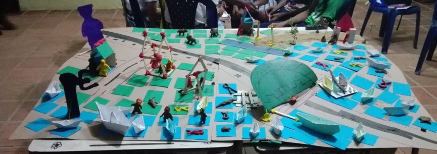{width="5.762892607174103in" height="2.0346970691163606in"}

Figura 12. MOJANAREAL.

Respecto a la resolución del modelo, hay cuatro formas de aproximación para la generación de salidas de modelos. La usada en este caso es: escenarios, donde el modelo es desarrollado para analizar los cambios en la vulnerabilidad social de la población, generados por la inundación y los usos del suelo. Se usó el análisis tipo ¿y si? para explorar resultados de diferentes acciones y sus efectos.

Escenario 1 de condiciones iniciales: se construye por parte de los participantes el estado actual del territorio. Se representa la zona de inundación y agrícola del municipio de San Marcos. Los cuadrados azules representan el agua y los verdes las zonas de cultivos. Son localizadas las casas teniendo en cuenta los patrones de ocupación del territorio. Se diseñan las casas dependiendo de la zona donde se encuentran ubicadas. Son localizados los peces y demás animales. Así como la vegetación. Se definen el número de familias, su conformación y la dedicación laboral (pesca o agricultura). Son localizadas las personas en el modelo. Así como las canoas. Por iniciativa de los actores, se incluyen obras de infraestructura importantes: puente, vía y monumentos.

Escenario 2 de condiciones de inundación: llega la inundación y el agua sube hasta las rodillas de las personas, se hace el escenario moviendo los diferentes elementos del modelo, de qué impacto tiene este fenómeno. Cada grupo construye un relato de lo que ocurre en un día con esta situación.

Escenario 3 condiciones de inundación: llega la inundación y el agua sube hasta las rodillas de las personas, se hace un escenario deseado moviendo los diferentes elementos del modelo, de qué acciones tendrían que implementarse en los hogares para disminuir la vulnerabilidad social y física.

Algunos de los resultados de la modelación participativa se presentan a continuación:

> Grupo 1: *Llegó la inundación, el esposo y su mujer al ver que el agua le llegaba arriba de la rodilla decidieron alzar sus pertenencias para que no se les dañaran sus pertenencias. Dialogaron y decidieron no salir por temor a que los picara una culebra o algo, sabiendo el riesgo que correrían respecto a enfermedades. También esperando alguna ayuda comunitaria. A pesar de su desesperación al ver que el agua no bajara y no llegara ayuda, se sintieron frustrados. Llegaron a un punto en que no sabían que hacer. Nerviosos a la situación empezaron a discutir que el esposo llegó a un punto, donde decidió salir, sin saber lo que le ocurriría.*
>
> Grupo 2: *Ante la situación los esposos no perdieron las esperanzas y trabajaron en unión y equipo para enfrentar la situación vivida. Y aunque la inundación empeoraba, ellos siguieron y lucharon y decidieron alzar la casa para que el agua no inundara la casa. Cuando llega la inundación, unos quedan, otros se van. Para no afectar la salud de los bebes cogen mucha infección, le afecta, les hace daño, les da gripa y se les aprieta el pechito a los más débiles y hay veces que el carnet que no les da apoyo y hay que mandar a la EPS. Y tampoco les cubren las medicinas. Cuando llega la inundación, lo que nosotros creemos que lo mejor para las personas que viven en esas casas afectadas, es que las trasladen a zonas más altas para que las inundaciones no las afecten en problemas de salud, de educación. Aunque hay algunas personas que se quedan viviendo en esas zonas inundadas porque hacen construcciones de tambos que hacen más resistentes las casas.*

DISCUSIÓN
=========

En los últimos años, los trabajos de modelación integrada del territorio han aumentado [28], debido a que en algunas situaciones los modelos convencionales, o las herramientas empleadas, no logran llegar al nivel de detalle requerido y tampoco integran diferentes técnicas de modelación, y el conocimiento de los expertos y las comunidades. Con los procesos de modelación integrada se busca abordar el problema de la modelación desde una perspectiva que contemple escenarios de modelación espacio-temporal, donde puedan participar diseñadores y actores interesados. Sin embargo, surge la discusión respecto al significado de la palabra integración. En este trabajo la integración surge en la medida que los procesos se piensan integrados y articulados. Por diferentes personas, tantos los modeladores como los actores e instituciones interesadas. Pero los artefactos, surgen del acoplamiento de diferentes fuentes de información. Esto ocurre dada la diversidad de escalas y aplicativos, donde se pueden trabajar los diferentes temas.

Los artefactos desarrollados no pretenden reemplazar a realidad. Tiene como propósito servir de herramientas de apoyo para propiciar diálogos y poder orientar las estrategias al "buen vivir". En las dinámicas locales de regiones como la Mojana, se encuentra que a través de la cooperación se aprovechan los bienes comunes como el agua. Este bien común permite el "buen vivir", dado que se puede acceder a la alimentación, recreación y habitabilidad. Ese "buen vivir" le da a la población felicidad. En algunos casos surgen problemas y se ve afectada la salud, o los cultivos.

La Ley 1523 de 2012 presenta una nueva visión de la gestión del riesgo en Colombia. Esto teniendo en cuenta que presenta un enfoque social, convirtiéndola en un proceso social que tiene como propósito contribuir a la seguridad, el bienestar, la calidad de vida de las personas y el desarrollo sostenible. Dicha conceptualización abre una discusión respecto al significado de bienestar, calidad de vida y desarrollo sostenible. Lo que implica que esa gestión del riesgo se haga a través del uso de políticas y programas diferenciados, que consideren las características particulares de las poblaciones. Dado que su "desarrollo" o "buen vivir", puede tener enfoques diversos. El desarrollo y bienestar para una comunidad asentada en La Mojana, puede ser diferente a una que se encuentre asentada en la selva amazónica. Lo que implicaría flexibilidad en dichas políticas y por consecuencia en el diseño de sistemas sociales.

El Decreto 1807 de 2014, sobre la incorporación de la gestión del riesgo en los planes de ordenamiento territorial abre otra discusión. Esta se encuentra relacionada con la posibilidad y viabilidad que tiene un municipio de hacer análisis detallados de riesgo. Dichos estudios, en las escalas propuestas resultan muy costosos. Lo que generalmente sucede, es que los municipios no cuentan con los recursos para cubrirlos. Incluir el componente de vulnerabilidad social, aumenta esos costos, al tener que generar esfuerzos adicionales para los estudios detallados en campo y espacios de participación. Sin embargo, lo que muestran las herramientas de simulación desarrolladas en esta investigación, es que, a través del modelado participativo, se pueden encontrar estrategias para la prevención de desastres sin necesitar altos presupuestos. En este sentido se observan dos retos, el primero relacionado con el aumento de presupuesto para el conocimiento del riesgo, en municipios con posibilidades de amenazas altas y el segundo, es metodológico.

CONCLUSIONES
============

Fue propuesto un metamodelo, que permite desarrollar modelos para la generación de escenarios donde se pueden analizar los cambios en la vulnerabilidad social en un territorio. Esto en el marco de la gestión del riesgo por inundaciones. El metamodelo incluye como componentes fundamentales los niveles del agua, los usos del suelo y las características de la población. Estos elementos se identificaron como los más importantes para el análisis de la vulnerabilidad social, durante el trabajo de campo y con las comunidades. Específicamente se relacionan con las condiciones de habitabilidad, las actividades productivas, la capacidad y oportunidad de cooperación y, el acceso a servicios de salud y educación.

Los artefactos reflejan en su diseño los principales componentes del metamodelo. Lo cual evidencia que las variables y procesos a modelar, incluidos en este, son los suficientemente versátiles para representar las reglas que permitan integrar el fenómeno de inundación y las características del sistema social. En el marco de la gestión del riesgo por inundación, se logra integrar el área de inundación, los elementos sociales y los actores.

Los artefactos se diseñaron para el caso de estudio en la ecorregión de la Mojana. Sin embargo, evidencian un potencial uso para su aplicación en otras zonas de inundación en el país. Siempre y cuando, cuente con el rediseño de los actores locales.

En los ejercicios de postprocesamiento de los artefactos, específicamente en MOJANACOOP, se encontró que la variable más sensible y que genera mayores impactos en la variación de la vulnerabilidad social, es la relacionada con la actividad productiva de los agentes y su desarrollo. Esto ocurre porque se encuentra relacionada con la posibilidad de acceso de la población a diferentes servicios, como salud y educación.

Esta investigación muestra como la interdisciplinariedad puede pensarse como un estado mental. Diferentes asesores desde las ciencias sociales, la filosofía, la ecología, la ingeniería; así como desde los saberes de las comunidades, contribuyeron a generar un diálogo y proceso de síntesis en el proceso de investigación. Lo cual se refleja en las variables y reglas de los modelos. Además, sirvió de inspiración para el desarrollo del metamodelo.

Al analizar los instrumentos de planeación para la gestión del riesgo por inundación, se lográ identificar la falta de armonización entre estos. Específicamente a nivel de escalas espaciales y temporales. Lo que genera un reto para el desarrollo de modelos integrados. Se observa en la modelación participativa un gran potencial para su armonización, donde más que la integración de los modelos, se logre la integración de las ideas por parte de los actores participantes en los ejercicios de modelación.

+---------------------------------------------------------------------------------------------------------------------------------------------------------------------------------------------------------------------------------------------------------------------------------------------------------------------------------------------------------------------------------------------------------------------------------------------------------------------------------------------------------------------------------------------------------------------------------------------------------------------------+
| TRABAJO FUTURO                                                                                                                                                                                                                                                                                                                                                                                                                                                                                                                                                                                                        |
|                                                                                                                                                                                                                                                                                                                                                                                                                                                                                                                                                                                                                           |
| 1.  A futuro, resulta interesante realizar ejercicios de modelado participativo con actores vinculados a Entidades Nacionales y analizar cómo la imagen que tienen del territorio interactúa con la imagen que tienen las comunidades que allí habitan. El hecho de tener diferentes enfoques sobre "desarrollo" o "buen vivir" genera aún mayores retos en términos de valores, convivencia y generación de acuerdos.                                                                                                                                                                                                    |
|                                                                                                                                                                                                                                                                                                                                                                                                                                                                                                                                                                                                                           |
| 2.  La integración de los tres modelos también es un reto y puede ser viable como trabajo futuro. Por ejemplo, se podrían procesar imágenes y videos de MOJANAREAL para extraer patrones, reglas y atributos que se pudieran integrar en MOJANA y MOJANACOOP. Esto evidencia que la integración puede ser viable no solo al interior de cada artefacto, sino también entre los artefactos.                                                                                                                                                                                                                                |
|                                                                                                                                                                                                                                                                                                                                                                                                                                                                                                                                                                                                                           |
| 3.  Uno de los principales retos a futuro, es trabajar en la incorporación de la vulnerabilidad social en la evaluación de riesgo por inundación. Abordándola de manera integrada con la amenaza y los demás componentes de la vulnerabilidad. En este trabajo se demostró que las condiciones de vulnerabilidad social pueden aumentar o disminuir el riesgo por inundación. Actualmente, si esto no se tienen en cuenta, muchas de las intervenciones podrían estar sobreestimándose o subestimándose. Lo que afecta directamente los procesos de gestión presupuestal del riesgo y la calidad de vida de la población. |
+---------------------------------------------------------------------------------------------------------------------------------------------------------------------------------------------------------------------------------------------------------------------------------------------------------------------------------------------------------------------------------------------------------------------------------------------------------------------------------------------------------------------------------------------------------------------------------------------------------------------------+

AGRADECIMIENTOS

Se agradece a las comunidades de la Mojana que hicieron parte de este proyecto en San Marcos (Sucre), Nechí (Antioquia), Mompox (Bolívar), Magangué (Bolívar), Montelíbano (Córdoba). A Colciencias, entidad que otorgó la beca doctoral para el desarrollo de esta investigación, en el marco de la Convocatoria 567 de 2012. A la Unidad Nacional para la Gestión del Riesgo de Desastres, donde a través del proyecto "Evaluación probabilista del riesgo por inundación lenta en las cabeceras municipales de San Marcos (Sucre), Montelíbano (Córdoba), Mompox (Bolívar) y Magangué (Bolívar)", se pudo complementar el trabajo de campo. A la Pontificia Universidad Javeriana, donde se desarrolló la tesis doctoral.

IDENTIFICACIÓN DE AUTORES

Paula Andrea Villegas González [CvLAC](https://scienti.minciencias.gov.co/cvlac/visualizador/generarCurriculoCv.do?cod_rh=0000438405)

Nelson Obregón Neira [CvLAC](http://scienti.colciencias.gov.co:8081/cvlac/visualizador/generarCurriculoCv.do?cod_rh=0000194077)

BIBLIOGRAFÍA

1.  Congreso de Colombia. (2012). Ley 1523 de 2012. 58 p.

2.  Ministerio de Vivienda Ciudad y Territorio (2014). Decreto 1807 de 2014. Bogotá. D.C. 19 p.

3.  Medina-Sanson, L., Guevara-Hernández. F. & Tejeda-Cruz C. (2014). Urbis: Revisión crítica y propuesta para integrar los conceptos de tierra, paisaje y territorio. *Boletín Científico Sapiens Research*, 4(1), 54--60.

4.  Schneider, S. & Peyré Tartaruga, I. (2006). Territorio y enfoque territorial: de las referencias cognitivas a los aportes aplicados al análisis de los procesos. *Desarro Rural Organizaciones, Instituciones y Territorio*, 71--102.

5.  Halliday, A., & Glaser M. A. (2011). Management Perspective on Social Ecological Systems: A generic system model and its application to a case study from Peru. *Human Ecology Review*, 18(1), 1--18.

6.  Vanhulst, J., & Beling, A. E. (2013). El Buen vivir: una utopía latinoamericana en el campo discursivo global de la sustentabilidad. *Polis*, 36.

7.  Remolina, G. (2014). *Del BIG BANG de las ciencias a su integración en el pensamiento complejo*. 17 p.

8.  DNP (Departamento Nacional de Planeación), FAO (Organización de las Naciones Unidas para la Agricultura y la Alimentación). (2003). *Programa de desarrollo sostenible de la región de la Mojana, Colombia*. Primera edición. Comunicaciones IG, editor. Bogotá. 48 p.

9.  DNP (Departamento Nacional de Planeación). (2012). *Plan integral de ordenamiento ambiental y desarrollo territorial de la región de la Mojana: caracterización territorial*. 91 p.

10. Aguilera, M. (2004) *La Mojana: riqueza natural y potencial económico*. Documentos de trabajo sobre economía regional.

11. Villegas-González, P. A., Triviño-León, N., Escobar-Vargas, J. A., Obregón-Neira, N., González-Méndez, M., González-Salazar, R. E., et al. (2016). Modelación Integrada de Sistemas socio-ecologicos Complejos: Caso de Estudio la Ecorregión de la Mojana. *Revista de Ingenieria Universidad Distrital*, 391--410.

12. Kroes, P. (2012). Engineering design. En P. Kroes (Ed.), *Technical Artefacts: Creations of Mind and Matter: A Philosophy of Engineering Design* (pp. 127-161). Dordrecht: Springer Netherlands.

13. Arendt H. (2009). *La condición humana*. Editorial Paidos. Buenos aires.

14. Epstein, J. (2008). Why model? *Journal of Artificial Societies and Social Simulation*, 11(4), 12.

15. Voinov, A., & Bousquet, F. (2010). Modelling with stakeholders. *Environmental Modelling & Software*, 25(11), 1268-1281. https://doi.org/10.1016/j.envsoft.2010.03.007

16. Abel, N., Ross, H., Herbert, A., Manning, M., Walker, P. & Wheeler, H. (1998). *Mental models and communication in agriculture*. 90 p.

17. Molero Melgarejo, E. (2018) *La modelización hidrológica-hidráulica y los sistemas de información geográfica* (pp 1--5).

18. Escobar-Vargas, J. A. (2015). *Notas de clase Mecánica de Fluidos Computacional*.

19. Wirasaet, D., Kubatko, E. J., Michoski, C. E., Tanaka, S., Westerink, J. J. & Dawson, C. (2014) Discontinuous Galerkin methods with nodal and hybrid modal/nodal triangular, quadrilateral, and polygonal elements for nonlinear shallow water flow. *Computer Methods in Applied Mechanics and Engineering*, 270(1), 113--49. <https://doi.org/10.1016/j.cma.2013.11.006>

20. Filatova, T., Verburg, P. H., Parker, D. C., & Stannard, C. A. (2013). Spatial agent-based models for socio-ecological systems: Challenges and prospects. *Environmental Modelling & Software*, 45, 1-7. <https://doi.org/10.1016/j.envsoft.2013.03.017>

21. González-Pérez C, Henderson-Sellers B. (2008). *Metamodelling for Software Engineering*. John Wiley & Sons. 219 p.

22. UNGRD (Unidad Nacional para la Gestión del Riesgo de Desastres). (2018). *Evaluación probabilista del riesgo por inundación lenta en las cabeceras municipales de San Marcos (Sucre), Montelíbano (Córdoba), Mompox (Bolívar) y Magangué (Bolívar)*. Bogotá, D.C.

23. Villegas González, P. A. (2018). *Gestión del riesgo por inundaciones: un metamodelo para el desarrollo de artefactos participativos Modelos integrados de sistemas socio-ecológicos: caso de estudio en la ecorregión de la Mojana*. Pontificia Universidad Javeriana.

24. Villegas-González, P. A., Ramos-Cañón. A. M., González-Méndez, M., González-Salazar, R. E., Durán Gaviria, E. D., De Plaza Solórzano, J. S., et al. (2017). *Gestión del riesgo en Colombia: vulnerabilidad, reducción y manejo de desastres*. Bogotá, D. C. 111 p.

25. UNGRD (Unidad Nacional para la Gestión del Riesgo de Desastres). (2018). *Evaluación probabilística del riesgo por inundación lenta en municipios priorizados*. Bogotá.

26. Wooldridge, M., Jennings, N. R., & Kinny, D. (2000). The Gaia Methodology for Agent-Oriented Analysis and Design. *Autonomous Agents and Multi-Agent Systems*, 3(3), 285-312. <https://doi.org/10.1023/A:1010071910869>

27. Villegas, P. A., Melgarejo, M. & Pérez, E. (2014). *MOJANA: Modelo Organizacional Jerárquico de Agentes Naturales del Agua*. Pontificia Universidad Javeriana

28. Pulido, H. A. (2015). *Modelo de interacción social para agentes artificiales en la arquitectura Mojana* (Tesis de grado). Universidad Distrital Francisco José de Caldas. Bogotá, D.C.

29. DNP (Departamento Nacional de Planeación). (2010). *Orientaciones conceptuales y metodológicas para la formulación de visiones de desarrollo territorial*. Dirección de Desarrollo Territorial Sostenible, Subdirección de Ordenamiento y Desarrollo Territorial. Bogotá, D.C.

30. Berger, T., Birner, R., McCarthy, N., DíAz, J., & Wittmer, H. (2007). Capturing the complexity of water uses and water users within a multi-agent framework. *Water Resources Management*, 21(1), 129-148. <https://doi.org/10.1007/s11269-006-9045-z>

Lista de pares revisores

Roberto Ariel Abeldaño | Universidad de la Sierra Sur y CONACYT, México

Ana Beatriz Acevedo Jaramillo | Departamento de Ingeniería Civil, Universidad EAFIT, Medellín, Colombia

Melissa Acosta | Universidad de la Costa, Barranquilla, Colombia

Franck A. Audemard M. |Escuela de Geología, Minas y Geofísica, Universidad Central de Venezuela

Edier Aristizábal | Departamento de Geociencias y Medio Ambiente, Universidad Nacional de Colombia, Sede Medellín

Álvaro Ávila-Díaz | Department of Agricultural Engineering, Universidade Federal de Viçosa, Brasil

José Emilio Baró Suárez | Facultad de Geografía, Universidad Autónoma del Estado de México, México

Gustavo Barrantes | Escuela de Ciencias Geográficas, Universidad Nacional, Costa Rica

Huáscar Bolívar Vallejo | Universidad Mayor de San Simón, Bolivia

Mireille Escudero | Instituto de Ingeniería, Universidad Nacional de México, Ciudad de México, México

María Adelaida Farah | Facultad de Estudios Ambientales y Rurales, Pontificia Universidad Javeriana, Colombia

Silvia E. Fontana | Universidad Católica de Córdoba, Argentina

Jorge Pedro Galve | Departamento de Geodinámica, Universidad de Granada, España

Helbert García-Delgado | Servicio Geológico Colombiano, Grupo de evaluación de amenazas por movimientos en masa, Colombia

Victor Manuel García Lemus | Presidente de la Red Universitaria de las Américas y el Cribe para la RRD

Miguel Ángel Imaz | Universidad Autónoma de Baja California Sur, México

Miguel Ángel Jaimes Téllez | Instituto de Ingeniería, UNAM, México

Santiago Henao Villegas |Facultad de Medicina Veterinaria y Zootecnia, Escuela de Graduados, Universidad CES, Medellín, Colombia

David Ortega-Gaucin | Instituto Mexicano de Tecnología del Agua, México

Juan Diego Jaramillo Fernández | Departamento de Ingeniería Civil, Universidad EAFIT, Medellín, Colombia

Andrés León Prieto | Universidad del Bosque - Escuela Colombiana de Medicina, Colombia

Ana Lucía Maldonado | Instituto de Investigaciones en Educación, Universidad Veracruzana, Xalapa, México

Roberto J. Marín | Facultad de Ingeniería, Universidad de Antioquia, Medellín, Colombia

Hazel Marsh | University of East Anglia, Reino Unido

Mónica Elizabeth Mejía Escalante | Escuela del Hábitat, Facultad de Arquitectura, Universidad Nacional de Colombia, Sede Medellín

Ricardo J. Molares B. | Perito oceanógrafo -- DIMAR -- CP3, Colombia

Erick Cajigal Molina | Universidad Autónoma del Carmen, México

Claudia Montero-Liberona | Facultad de Comunicaciones, Pontificia Universidad Católica de Chile, Chile

Nelson Obregón | Instituto Javeriano del Agua, Pontificia Universidad Javeriana, Colombia

Juan Andrés Oviedo Amézquita | FC Control y Diseño de Estructuras SAS, Colombia

Aceneth Perafán Cabrera | Departamento de Historia, Universidad del Valle, Colombia

Rogelio Pineda Murillo | Consultor, Planificación Territorial, Desarrollo Sostenible y Medio Ambiente, Geografía y Cambio Climático, Colombia

Carlos E. Reinoza | CICESE - Centro de Investigación Científica y de Educación Superior de Ensenada, Baja California, México

Eduardo Reinoso |Instituto de Ingeniería, UNAM, México

Miguel Enrique Sarmiento | Dirección de Gestión del Ordenamiento Ambiental y Territorial, CAR de Cundinamarca, Colombia

Juan Sebastián de Plaza Solórzano | Universidad Católica de Colombia

Olga Patricia Quintero García | Corpocaldas, Manizales, Colombia

Vladimir G. Toro | Facultad de Ingeniería, Universidad de Antioquia, Medellín, Colombia

Mauricio A. Torres Méndez | Universidad de Concepción, Chile

Diego Soler Tovar | Universidad de la Salle, Bogotá, Colombia

Hernando Uribe Castro | Universidad Autónoma de Occidente, Cali, Colombia

Jairo Andrés Valcárcel Torres | I+R Consultores en Ingeniería y Riesgos. S.A.S, Bogotá, D.C, Colombia

Francisco A. Velandia | Escuela de Geología, Universidad Industrial de Santander, Bucaramanga, Colombia

[]{#_Toc47894938 .anchor}Índice temático

AAbrasión de acantilados, 417Acompañamiento psicosocial, 201Actividades agropecuarias, 232Adaptación basada en ecosistemas, 434Adaptación basados en ecosistemas, 436*Adaptación socio-económica*, 272AIS-300, 4Alternativas de mitigación y control, 434Amenaza, 340, 378, 448, 474Amenaza probabilista, 51Amenaza sísmica, 4Amenaza y vulnerabilidad, 434Amenaza y vulnerabilidad por erosión costera, 436Análisis de riesgo, 342Animales, 230Animales en la sociedad, 232Artefactos, 500Aumento del nivel del mar, 416BBienestar animal, 234Bioseguridad para respuesta a animales, 240Bloque Norte de los Andes, 161, 167Buen vivir, 476CCambio climático, 106Clima extremo, 106Clima marítimo, 414COCONet, 167Coeficientes óptimos de diseño, 4Coeficientes sísmicos de diseño, 4Componentes psicosociales, 202, 205, 207, 221, 222Comportamiento animalComportamiento animal bajo condiciones de stress, 238Comportamiento animal en incidentes, 237Comunicación del riesgo, 279Comunición del riesgo, 284Comunición humana, 282Comunidades, 474Concentración de animales, 236Concreto reforzado, 58Cuencas, 340Cuidado de los animales y manejo de emergencias, 234Cultivo de maíz, 91DDegradación ambiental, 257Deslizamientos, 340Diseño, 479EEnfermedades zoonóticas, 233Equilibro ecosistémico, 203Erosión costera, 414, 416, 435Escenario de riesgo, 439Especies silvestres, 231Espectros de diseño, 4Espolones, 414, 415Estrategias comunicativas, 279Estructuras organizativas, 209Estudios históricos, 301, 302, 303, 304historicidad por sismos, 301objetivos directos, 305objetivos indirectos, 306planificación territorial, 306Evaluación de amenaza por movimientos en masa, 341Evaluación de riesgo por inundación., 503evaluación probabilista de la amenaza por sequía, 97Evaluación probabilista del riesgo, 92evaluación probabilista del riesgo por sequía, 95Evaluación prospectiva del riesgo, 91Eventos hidrometeorológicos, 92Experiencia educativa, 256Experiencias locales, 279Exposición agrícola, 111Exposición de edificaciones, 51FFactor de seguridad, 350Factores detonantes, 344Factores para manejar animales, 238Floculación, 417Frecuencia en el nivel de amenaza, 384Frente halino, 417GGenerador de clima estocástico, 92Geoamenazas, 434Geodesia de imágenes, 177Geodesia espacial GPS, 163Geodinámica, 161Geoformas, 406Geomática, 360GeoRED, 167Gestión del riesgo, 91Gestión integral del riesgo, 92GNSS, 161Gobernanza del riesgo, 287GPS De-ramping, 187HHistoricidad, 302, 304, 315, 321, 332IIber 2D, 378Infraestructura escolar, 45InSAR, 161, 177Integración de resultados GPS-InSAR, 189Integridad socio-ambiental, 201Intensidad en el nivel de amenaza, 384Interferograma diferencial, 178Intervención correctiva, 439Intervención prospectiva, 439Inundación, 324, 474Inundaciones, 302, 325, 327, 333, 377, 378MMampostería, 58Mampostería confinada, 62Mampostería no reforzada, 61Mampostería reforzada, 63Manejo de animales, 237Manejo de especies silvestres, 241Mantenimiento de la salud pública, 236Mapas de amenaza integrada por sequía, 91Marco de Referencia Terrestre, 168Marco de Sendai, 218Marco global de referencia, 164Medidas blandas y duras o mixtas, 436Medidas de Bioseguridad, 241Medios de vida, 232Metodología intensivista, 301Mitigación, 378, 439Mitigación del riesgo, 49Mitigación del riesgo sísmico, 45Modelación, 474Modelación hidráulica, 378Modelación integrada, 500Modelo de elevación digital (DEM), 393Modelo hidráulico 2D, 377Modelos basados en agentes, 481Modelos de bloques cinemáticos, 164Modelos probabilistas, 91Modos de habitar, 217Modos de vida, 203, 204, 221Monitoreo, 439Movimientos en masa, 301, 302, 319, 321, 322, 340, 341, 380Movimientos en masa e inundaciones, 301NNivel del mar, 414Norma Colombiana de Construcción Sismo Resistente, 4NSR 10, 4OObras costeras, 416Oleaje, 417One Health, 231Optimización de costos totales, 4PPaisaje, 435Participación ciudadana, 204Participación comunitaria, 267*Participación y organización social*, 207, 209, 214Percepción de la comunidad, 395Percepción del riesgo, 286Pérdida anual esperada, 91Pérdidas probables, 349Performativo, 221Periodo de retorno, 4, 377Planes de mitigación del riesgo, 56Planificación costera, 435Políticas de los albergues, 246Polo de Euler, 169, 175Pórticos de concreto reforzado, 58Pórticos de concreto reforzado con muros de mamposteria, 59Pórticos de concreto reforzado con muros de mampostería generando columna corta, 60Preocupaciones medioambientales., 248Priorización de edificaciones, 57Protección costera, 414Proyección social, 265Psicosocial, 203RRadar de Apertura Sintética, 187Radar Interferométrico de Apertura Sintética, 187Reasentamiento social, 201, 204Reducción del riesgo de desastres, 201Reforzamiento estructural, 45, 55Registro e identificación de animales, 239Responsabilidad social, 255, 256Responsabilidad social universitaria, 265Respuesta de las personas a los animales en desastres, 233Riesgo, 349, 359, 474Riesgo por sequía, 91Riesgo por sequía para el cultivo de maíz, 120Riesgo sísmico, 50RINEX, 168Risk Targeted Ground Motion, 4SSalud física y mental, 220Salud mental, 247Salud pública, 234Salud pública y epidemiologia de los animales en desastres, 247Sector agropecuario, 91, 92Sector escolar, 46Seguridad alimentaria, 231Sequía, 91Sequía en Colombia, 108Series climáticas, 101Servicio Geológico Colombiano, 167Sismos, 301, 302, 314, 315, 316, 317, 332Sistema Terrestre de Referencia, 168Sistemas de Información Geográfica, 360Sistemas socio-ecológicos, 475, 476Sostenibilidad, 201, 221Subsidencia, 161, 177TTajamares, 414, 417Taller comunitario, 279Tectónica de placas, 161Tejido social, 255Teoría de la comunicación, 279Territorio, 435, 475Territorio afectado, 384Tipologías de concreto reforzado, 58Tipologías de construcción escolar, 57Tipologías de mampostería, 61Trabajo colaborativo, 256UUna salud, 230Vvectores de velocidad geodésica, 171Vientos alisios, 415Vulnerabilidad, 91, 340, 349, 359, 448, 474Vulnerabilidad de cultivos, 92Vulnerabilidad de los animales en la agricultura, 245*Vulnerabilidad hídrica*, 272Vulnerabilidad sísmica, 54Vulnerabilidad social, 503Vulnerabilidad socioeconómica y ambiental, 257ZZona de Convergencia Intertropical, 264Zonas de deformación en límites de placas, 164Zoonosis, 237Zootecnia, 232

[^1]: No se consideran sistemas de protección sísmica en la estimación de los costos futuros.

[^2]: La drástica reducción de las aceleraciones de diseño en Bucaramanga se debe, aparentemente, a errores de modelación en versiones anteriores del código NSR. Los nuevos modelos de amenaza sísmica han revelado que las aceleraciones esperadas en la ciudad no son tan altas como se creía.
