En este Anexo se presentan los espectros de diseño propuestos para todas las capitales de departamento en Colombia, comparados con los espectros actualmente vigentes en la NSR-10. Se listan las ciudades en orden alfabético. Las fichas presentadas contienen los valores de los coeficientes de diseño, zona de amenaza sísmica y periodos de retorno de las aceleraciones de diseño propuestas.

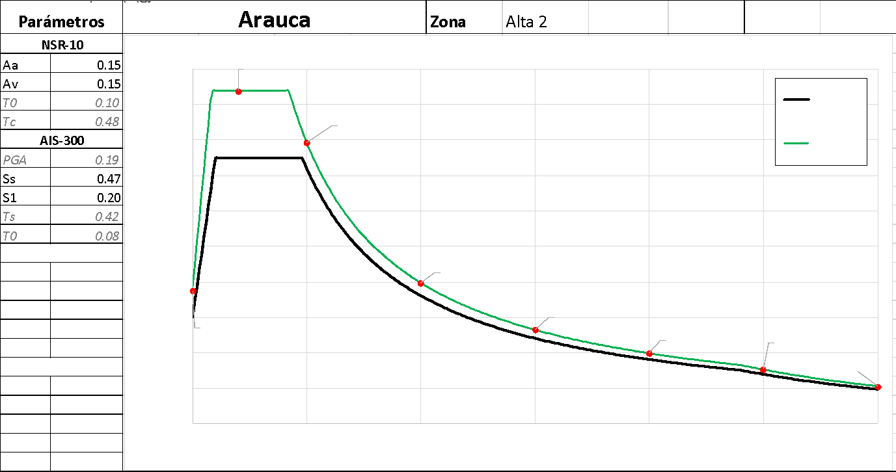

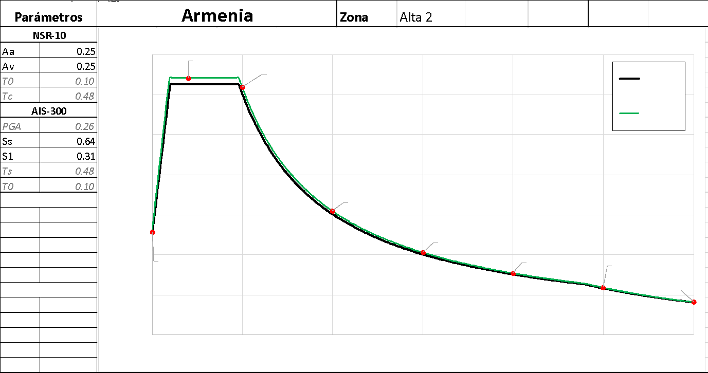

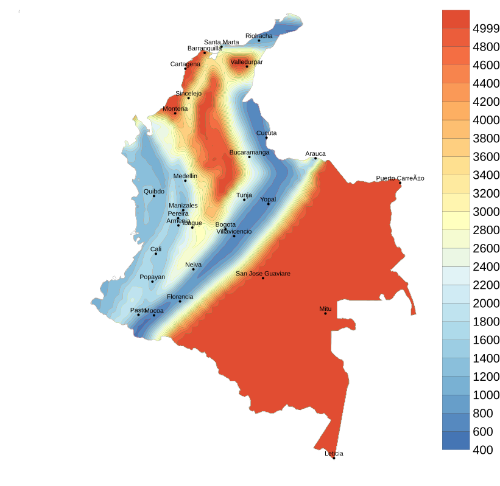

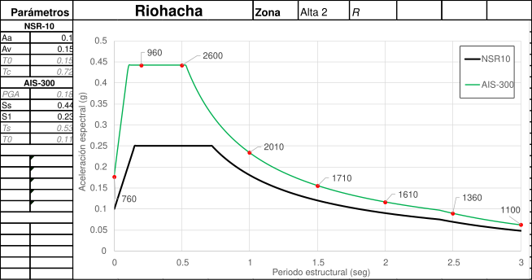

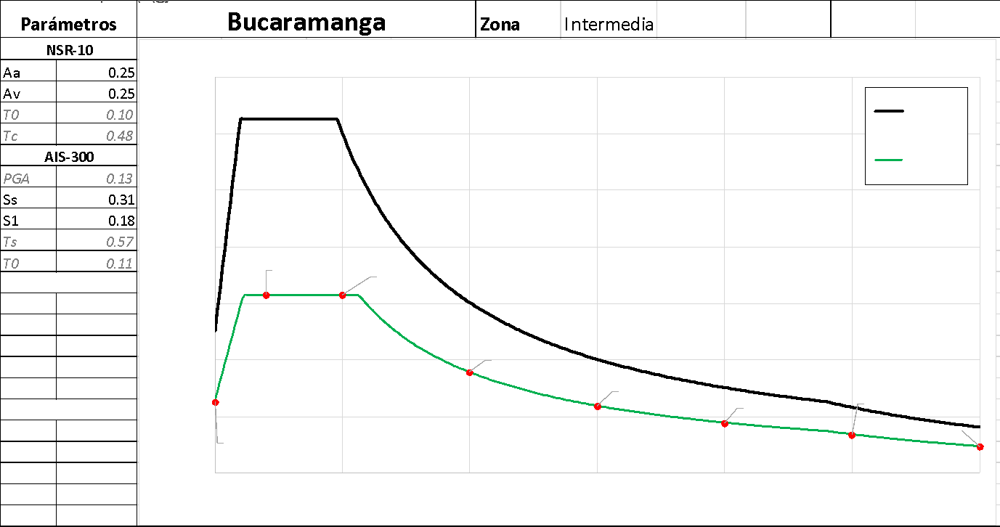\[2\]

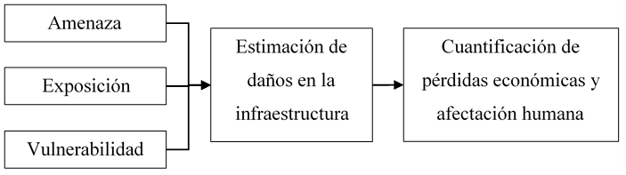

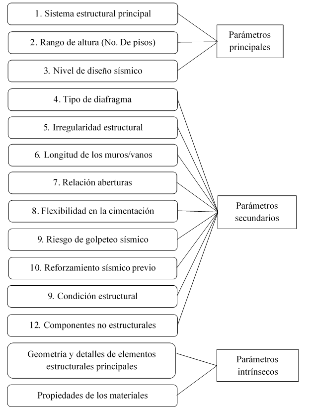

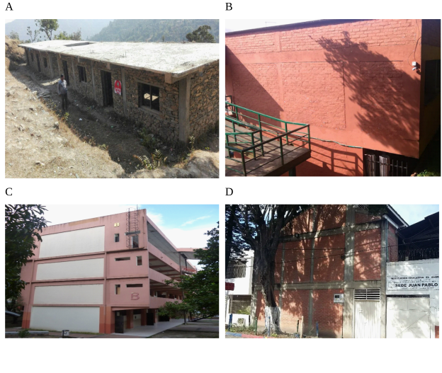

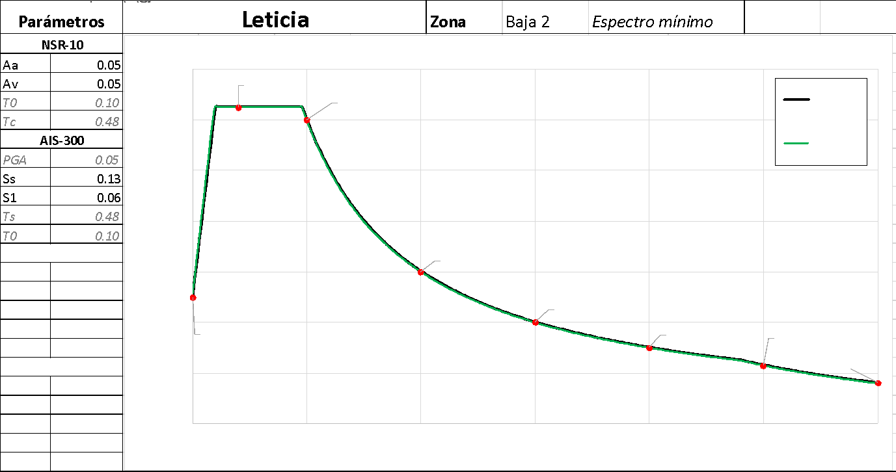

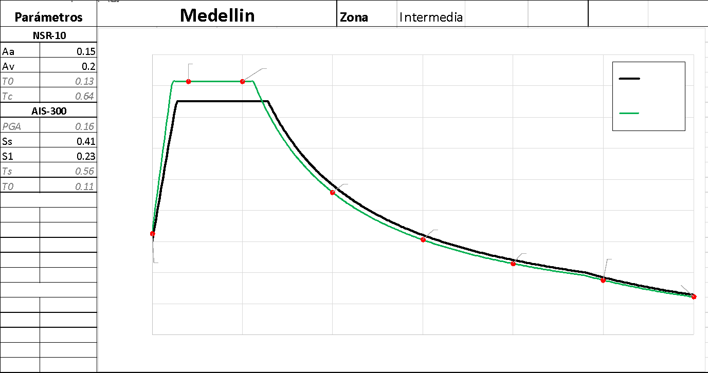

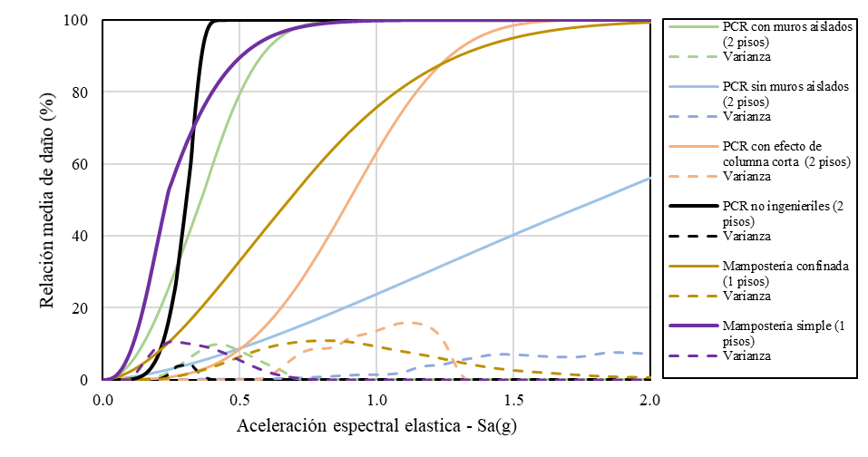

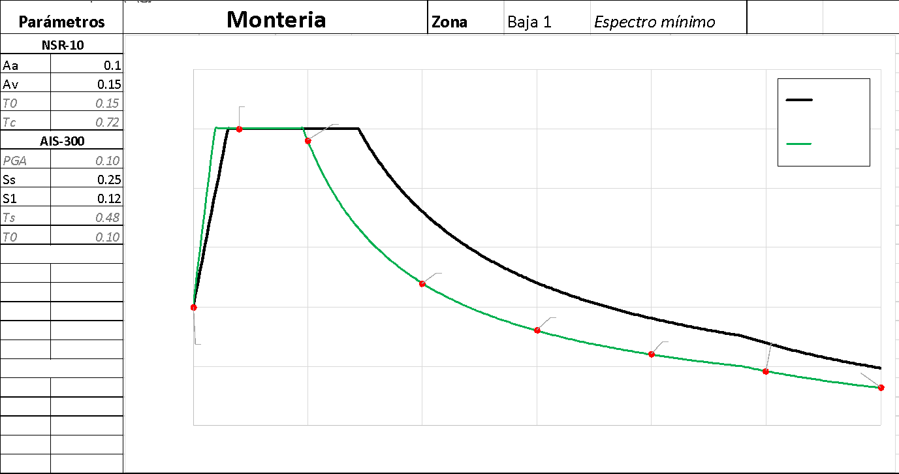

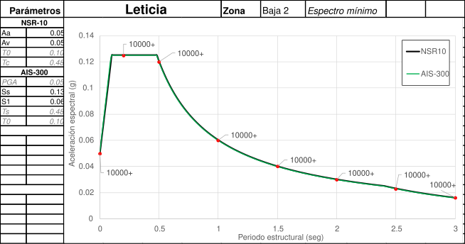

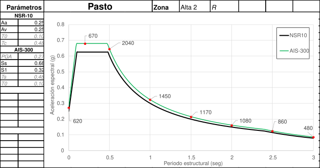

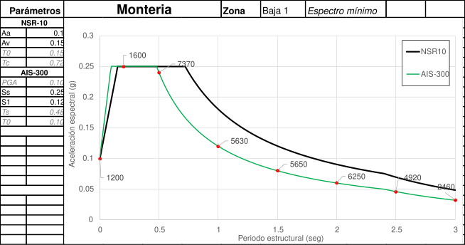

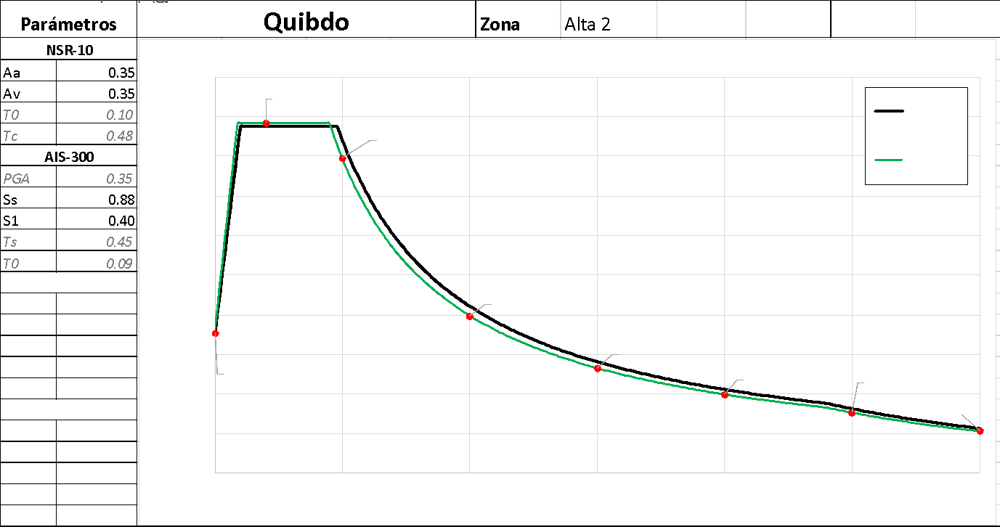

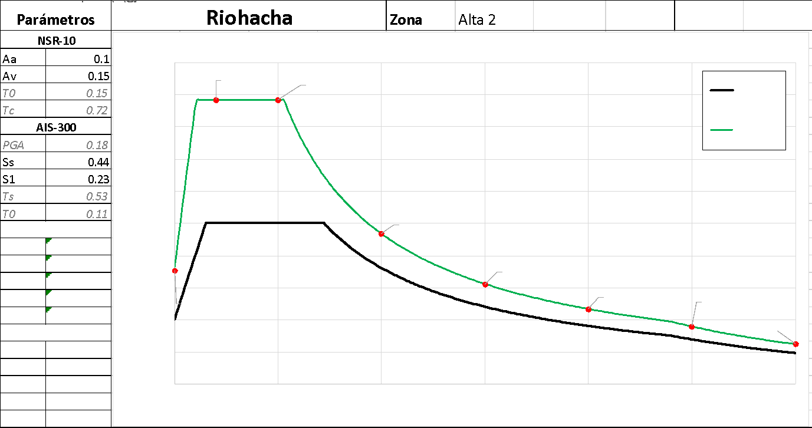

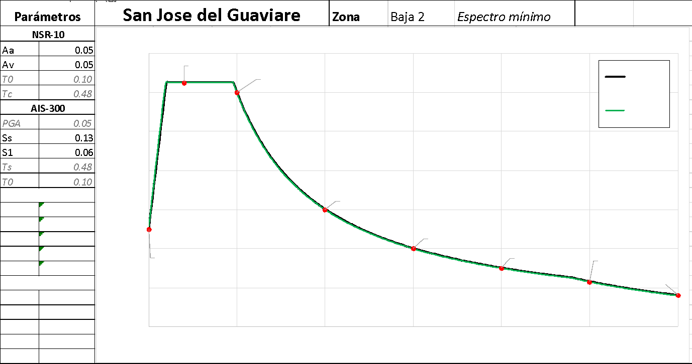

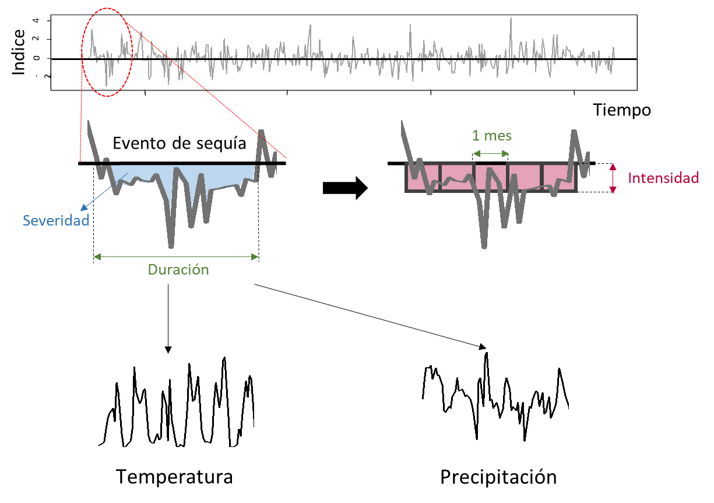

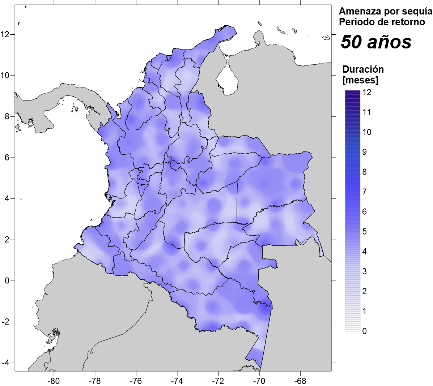

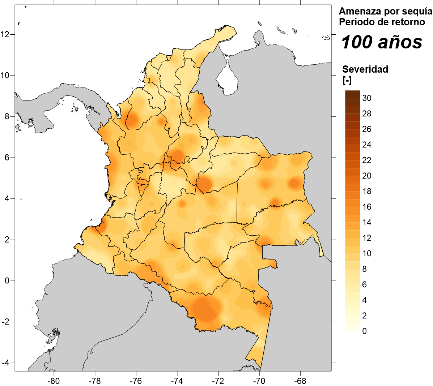

**CONFLICTO DE INTERESES**

Los autores no declaran conflicto de intereses

# 

