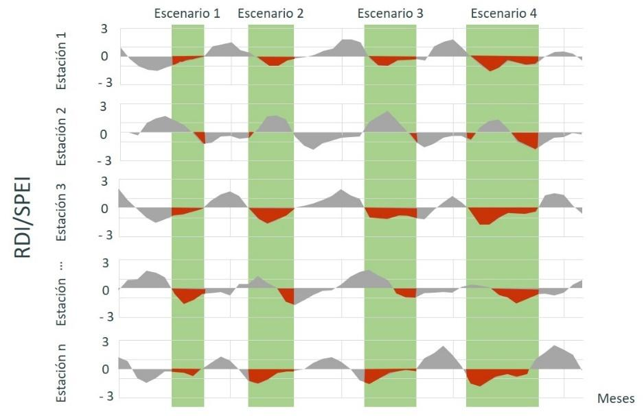
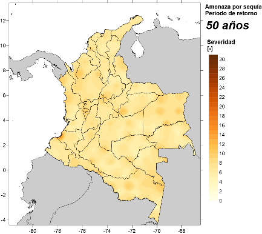
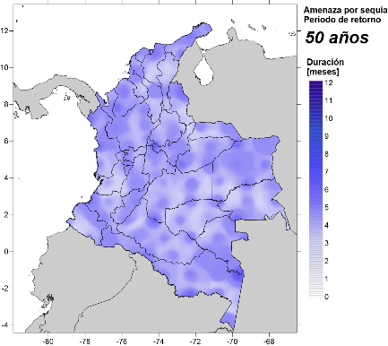
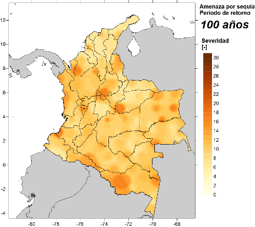
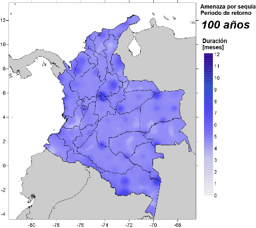
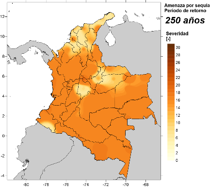
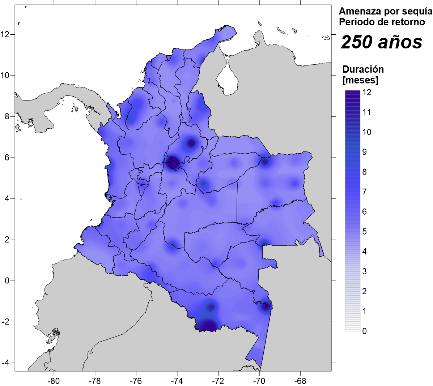
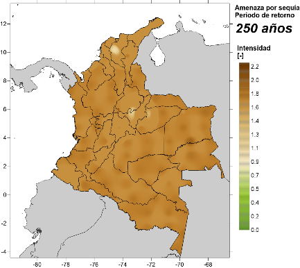
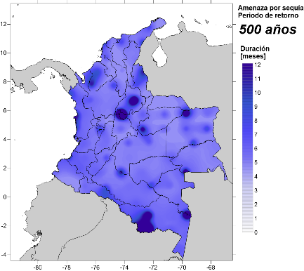
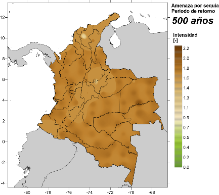

Para el caso de la sequía, a partir de las series históricas y sintéticas de precipitación y temperatura se calculan los indicadores de sequía (SPI, SPEI, RDI y otros incluidos en la literatura especializada) para todas las estaciones y a diferentes escalas de tiempo en pasos mensuales. Una vez que se obtiene la serie temporal del indicador seleccionado en cada estación, se identifican los eventos de sequía, que ocurren cuando el indicador toma un valor por debajo de un umbral crítico. La descripción detallada de la metodología de indicadores de sequía se presenta en la sección de Materiales y Métodos al final de este documento.

El siguiente paso es identificar los eventos de sequía que ocurren simultáneamente en varias estaciones de la región de estudio. Para cada mes, se identifican las estaciones con un valor de indicador por debajo del umbral definido para la evaluación. Si el número total de estaciones con valores por debajo del umbral es mayor que un cierto porcentaje (por ejemplo, 50%), entonces se identifica una sequía regional. Con cálculos consecutivos para todos los años de simulación, se pueden detectar múltiples sequías regionales, con su valor asociado de duración, severidad e intensidad en cada estación. Cada una de las sequías regionales es un escenario de sequía individual, con una frecuencia anual de ocurrencia igual a 1/N, en donde N es el número total de años de simulación. La Figura 6 muestra esquemáticamente cómo se identifican las sequías regionales, de acuerdo con los criterios de selección definidos por un valor umbral de indicador y un número mínimo de estaciones que satisfacen dicha condición. Este procedimiento puede aplicarse para toda la región de estudio, o para subregiones definidas por otros criterios, como zonas climáticas, zonas productivas, entidades territoriales, etcétera.

**Figura 34.** Identificación de sequías regionales sobre las series de tiempo de todas las estaciones del área de estudio (Fuente: elaboración propia).

## Mapas de amenaza integrada

Los resultados de la modelación de la amenaza se presentan en formato de mapas de amenaza integrada para la región de estudio, que permiten comparar las intensidades según el periodo de retorno y establecer zonas que están más o menos expuestas a la amenaza de sequía dentro de la región. La metodología para integrar la amenaza se incluye en la sección de Materiales y Métodos. En los mapas se presenta la severidad como el valor absoluto del acumulado del indicador de sequía, e indica la gravedad de las sequías, la duración se presenta en número de meses y la intensidad como la división entre nivel acumulado del indicador de sequía por debajo del umbral definido para el análisis y el número de meses en que el indicador estuvo bajo el umbral.

Hay que tener en cuenta que la severidad por sí sola no puede definir la gravedad de una sequía, se requiere complementar con los parámetros de duración e intensidad \[23\]. Por ejemplo, el valor máximo de severidad que se muestra en los mapas igual a 15 se puede interpretar como una sequía severa y baja duración (5 meses de sequía con valores de SPEI = -3) o una sequía moderada con larga duración (10 meses de sequía con valores de SPEI = -1.5). Por esta razón, al interpretar los mapas de amenaza integrada se recomienda analizar en simultánea los indicadores de duración e intensidad, que complementan el análisis espacial de los resultados y brindan más información para la toma de decisiones.

Los mapas de severidad, duración e intensidad calculados para Colombia se muestran en la Figura 7, para diferentes periodos de retorno. Según los resultados, se puede ver que la intensidad de la sequía tiende a ser uniforme en el país, con valores por encima de 1.5, lo que indica sequías severas para periodos de retorno altos (mayores a 50 años). Sin embargo, en la zona de la cordillera central del país, la intensidad de la sequía tiene a ser más baja.

Un resultado importante a resaltar son los valores de severidad de la sequía en la zona de La Guajira. Los mapas muestran que para la región caribe la severidad es menor que para el resto del país, al igual que algunas zonas de Cundinamarca y Boyacá. Es importante notar que el valor de severidad de la sequía se calcula a partir de los valores normales de la zona de evaluación, por lo que, aunque la región Caribe y en especial La Guajira son de climas secos o desérticos, los mapas que aquí se presentan muestran que en estas zonas las sequías meteorológicas son potencialmente menos graves que en otras zonas del país. Sin embargo, los impactos reales del riesgo a la sequía se determinan al considerar no sólo la amenaza, desde el enfoque meteorológico, sino también condiciones de exposición y vulnerabilidad, tanto física como socioeconómica, que puede incrementar los efectos de la amenaza.

|  |  |  |
| ------------------------- | ------------------------- | ------------------------- |
|  |  |  |
|  |  |  |
|  |  |  |

**Figura 35.** Mapas de amenaza integrada de sequía para 50, 100, 250 y 500 años de periodo de retorno. Severidad (izquierda), duración en meses (centro) e intensidad (derecha) (Fuente: elaboración propia).

