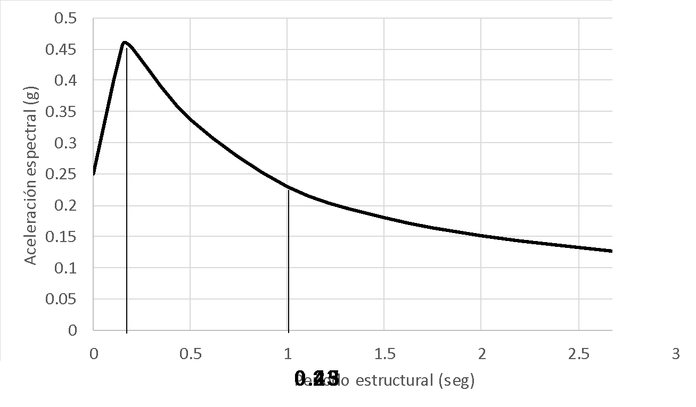
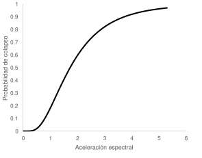
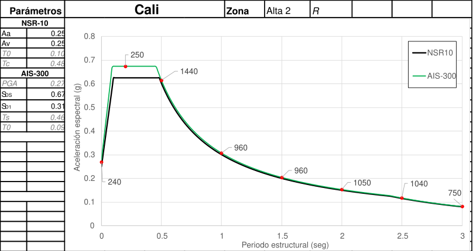
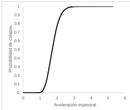
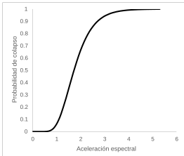
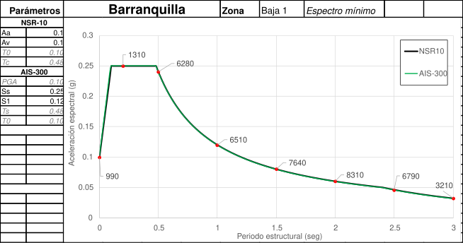

Usando el software R-CRISIS \[7\], mismo usado en la evaluación de la amenaza sísmica del país y del proyecto ASLAC, se aplicó la metodología presentada anteriormente, buscando encontrar los coeficientes óptimos de diseño para diferentes aceleraciones espectrales. Como ejemplo, la Figura 6 muestra los espectros de aceleraciones óptimas para Bogotá y Cúcuta, a nivel de roca firme. Se marcan en la imagen los valores de aceleración en 0.2 y 1 segundos (correspondientes a SDS y SD1 respectivamente). Se muestra también los periodos de retorno de las aceleraciones espectrales. Nótese como los menores periodos de retorno se asocian a periodos bajos (cercanos a 0.2 segundos), punto desde el cual el periodo de retorno es creciente con el periodo estructural.

|  |  |
| ------------------------ | ------------------------ |
|  |  |

**Figura 6.** Ejemplo de cálculo de coeficientes de diseño óptimos. Arriba: Bogotá. Abajo: Cúcuta. Izquierda: Aceleraciones espectrales óptimas. Derecha: Periodos de retorno de las aceleraciones óptimas.

También es posible ver en la Figura 6 que para mayor amenaza sísmica (Cúcuta), los periodos de retorno requeridos son menores que en una zona de amenaza intermedia (Bogotá). Esto puede entenderse de dos maneras. Primero, nótese que a medida que la amenaza sísmica disminuye, la resistencia lateral gratuita de la estructura (aquella que se obtiene de la capacidad a cargas verticales) empieza a aportar cada vez más a la seguridad sísmica de la edificación, llevando el problema a que, en zonas de amenaza baja, sea muy “barato” comprar seguridad sísmica, lo que implica el poder usar periodos de retorno muy altos. Segundo, a medida que la amenaza sísmica se incrementa, lo hace también la frecuencia con la que se superan los valores de aceleración de diseño. Esto conlleva un altísimo costo inicial si se quiere reducir el número de veces en que se superará en el futuro, llegando a un punto en el cual incrementar ampliamente el costo inicial puede no ser igualmente efectivo en reducir las pérdidas. Por esta razón, lo más costo-efectivo es precisamente diseñar para un periodo de retorno menor.

Este mismo tipo de resultados puede verse espacialmente. Las Figuras 7 y 8 presentan los mapas de periodos de retorno óptimos para la aceleración espectral de 0.2 segundos y 1 segundo, respectivamente. Nótese como las zonas de alta amenaza sísmica del país implican menores periodos de retorno para el parámetro de diseño, y viceversa.

**Figura 7.** Periodos de retorno óptimos para aceleración espectral de 0.2 segundos.

**Figura 8.** Periodos de retorno óptimos para aceleración espectral de 1 segundo (derecha).

<table>
<tbody>
<tr class="odd">
<td>
<strong>Caja 4. R-CRISIS</strong>

R-CRISIS (Ordaz et al. 2018) es una herramienta versátil para realizar el análisis probabilista de amenaza sísmica (PSHA). Desde su primera versión, desarrollada en 1998, R-CRISIS ha sido utilizado en diferentes proyectos de evaluación de amenaza sísmica alrededor del mundo. Las evaluaciones probabilistas realizada con R-CRISIS se ajustan en su totalidad a los resultados considerados válidos en la más reciente edición del proyecto PEER para validación de software para cálculos sísmicos. R-CRISIS está actualmente avalado para usarse en evaluaciones de amenaza sísmica de instalaciones nucleares en Europa. En Aguilar-Meléndez et al. (2017) se puede encontrar una completa revisión de R-CRISIS.

R-CRISIS admite la definición de fuentes sísmicas de diversos tipos, desde puntos y líneas, hasta complejas estructuras tridimensionales, que se combinan con una importante variedad de modelos de sismicidad. R-CRISIS facilita el uso de diferentes modelos de atenuación <em>(GMPM),</em> incorporando actualmente más de 60 modelos diferentes. R-CRISIS permite calcular: Mapas de amenaza, espectros de amenaza uniforme, desagregación M-R, desagregación M-R-Epsilon, escenarios sísmicos/mapas de movimiento sísmico y conjunto de eventos (archivo CAPRA <em>ame</em>), entro otros resultados.

<strong>Pantalla principal de R-CRISIS</strong>

Manuales de usuario y referencia técnica, bases documentales, tutoriales y otros recursos pueden ser consultados en <a href="http://www.r-crisis.com">www.r-crisis.com</a>
</td>
</tr>
</tbody>
</table>

