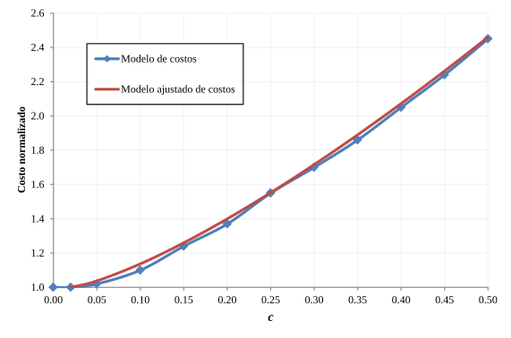

De acuerdo con la especificación del ASCE 7 -10/16, los coeficientes de diseño se obtienen a partir de los coeficientes del sismo máximo considerado. Los coeficientes óptimos calculados y presentados anteriormente son para diseño estructural, por lo cual es necesario, buscando la adopción del reglamento ASCE, encontrar los coeficientes SSM y SS1 que deriven en los coeficientes de diseño óptimos encontrados. Estos coeficientes se encuentran usando la Ecuación 1. Sus respectivos periodos de retorno deben determinarse en las curvas de amenaza correspondientes a cada aceleración espectral (0.2 y 1 segundos).

## Coeficiente SMS

Este coeficiente corresponde a la aceleración espectral de 0.2 segundos del sismo máximo considerado según la especificación del ASCE 7 – 10/16. Este coeficiente determina la altura de la meseta en el espectro de aceleraciones, por lo cual es el que controla los diseños estructurales de edificaciones de altura intermedia. Las bajas alturas (1 y 2 pisos) se diseñan en Colombia haciendo uso del Título E de la NSR, en el cual no participan los espectros de diseño. Las características de las edificaciones de altura intermedia se ligan fuertemente al nivel socioeconómico de la región, es decir, que se reconoce la incidencia del factor de impacto en determinar las aceleraciones óptimas. Esta incidencia pudo ser verificada al analizar los valores de aceleración óptima espectral de 0.2 segundos en las cabeceras municipales, los cuales presentan periodos de retorno muy similares entre sí, para un mismo nivel o factor de impacto. Se definieron tres niveles de desarrollo, según las clasificaciones dadas en el mapa de la Figura 5, estableciendo los periodos de retorno como el promedio de los municipios de una misma clasificación, como se indica en la Tabla 1.

**Tabla 1.** Periodos de retorno del parámetro SMS según el nivel de desarrollo  
(Código de colores según el mapa de la Figura 5)

|  | **Nivel** | **Periodo de retorno SMS** |
|  | --------- | ------------------------------------- |
|  | I         | 1500                                  |
|  | II        | 2000                                  |
|  | III       | 2500                                  |

## Coeficiente SM1

Este coeficiente corresponde a la aceleración espectral de 1 segundo del sismo máximo considerado según la especificación del ASCE 7 – 10/16. Esto significa que el diseño de edificaciones de gran altura estará principalmente dominado por este parámetro. Estas edificaciones típicamente se diseñan con ingeniería de mayor sofisticación, usando métodos más rigurosos y exigentes. Si bien este puede no ser el caso siempre, se espera aquella que en líneas generales se de un tratamiento especial a edificaciones de esta característica. Por esta razón, no se buscó vincular su periodo de retorno directamente al nivel de desarrollo, sino a la ubicación geográfica, tal y como se muestra en el mapa de la Figura 8. A partir de este mapa de periodos de retorno óptimos, se propone una zonificación de la amenaza sísmica del país (Fig. 9) que determina el periodo de retorno del parámetro SM1, así como el nivel de disipación de energía mínimo requerido en cada zona, es decir, reemplazaría el mapa de zonas de amenaza actualmente vigente. Este nuevo mapa, define 5 zonas de amenaza: Alta 1, Alta 2, Intermedia, Baja 1 (Norte), Baja 2 (Llanos).

**Figura 9.** Nuevo mapa de zonificación sísmica propuesto.

A partir de las zonas de amenaza de la Figura 9 es posible establecer los periodos de retorno del parámetro SM1, como se presenta en la Tabla 2.

**Tabla 2.** Periodos de retorno del parámetro SM1 según zona de amenaza  
(Código de colores según el mapa de la Figura 8).

|  | **Zona**   | **Periodo de retorno SM1** |
|  | ---------- | ------------------------------------- |
|  | Alta 1     | 2500                                  |
|  | Alta 2     | 5000                                  |
|  | Intermedia | 5000                                  |

## Espectros mínimos

Para las zonas de amenaza baja (Norte y Llanos), se definieron espectros mínimos buscando que estos coincidan con los actuales espectros de diseño dados por la NSR 10 en estas regiones del país. Esta condición, si bien es arbitraria, implica aceleraciones espectrales de más de 5000 años de periodo de retorno en todos los casos, manteniendo además el mismo nivel de seguridad que el actualmente exigido. Los coeficientes SMS y SM1 para las zonas bajas se presentan en la Tabla 3.

**Tabla 3.** Coeficientes SMS y SM1 para zonas de amenaza baja. Valores dados como fracción de g.

| **Zona**        | **SMS** | **SM1** |
| --------------- | ------------------ | ------------------ |
| Baja 1 (Norte)  | 0.38               | 0.18               |
| Baja 2 (Llanos) | 0.19               | 0.09               |

## Parámetro TL

El parámetro TL (Fig. 1) define el punto a partir del cual las aceleraciones espectrales decrecen con el inverso del periodo al cuadrado. Esta formulación permite controlar los desplazamientos espectrales en la zona de periodos largos. En este trabajo no se incluye una evaluación de los valores para TL, sin embargo, cabe mencionar que este parámetro estará principalmente controlado por la cercanía a fuentes sismogénicas importantes (campo cercano). En principio, TL se mantiene en su definición actual (la dada por la NSR 10) como \(T_{L}\  = \ 2.4{\bullet F}_{V}\), siendo FV el parámetro de amplificación del suelo en la zona de velocidades constantes. No obstante, en condición de campo cercano (i.e. a menos de 10 km de un lineamiento de falla activa) se requiere de la definición de este parámetro por medio de un estudio de amenaza local que considere el campo cercano.

