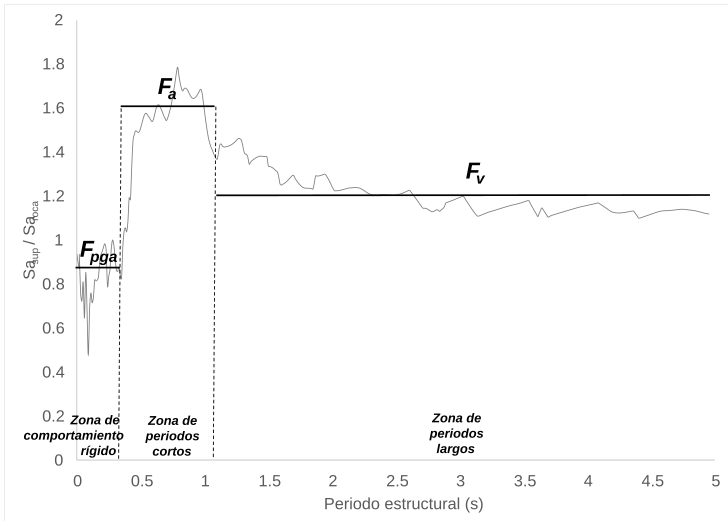
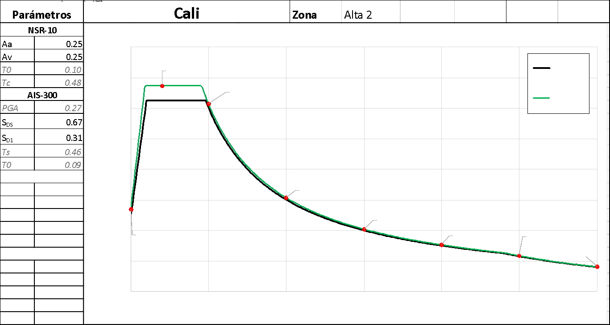

A continuación, se presentan los espectros de diseño propuestos en comparación con los correspondientes dados por la NSR-10, para Bogotá, Medellín y Cali. Los espectros propuestos para todas las capitales de departamento se incluyen en el Anexo 1. Sobre los espectros propuestos se indican los periodos de retorno de las aceleraciones en diferentes puntos, con el objetivo de hacer énfasis en que no se trata de espectros de diseño asociados a un periodo de retorno. Se indica también la zona de amenaza, y los parámetros de las formas espectrales, tanto de la NSR-10 como los nuevos propuestos.

**Figura 10.** Comparación de espectros de diseño de NSR-10 y propuestos para Bogotá.

**Figura 11.** Comparación de espectros de diseño de NSR-10 y propuestos para Medellín.

**Figura 12.** Comparación de espectros de diseño de NSR-10 y propuestos para Cali.

