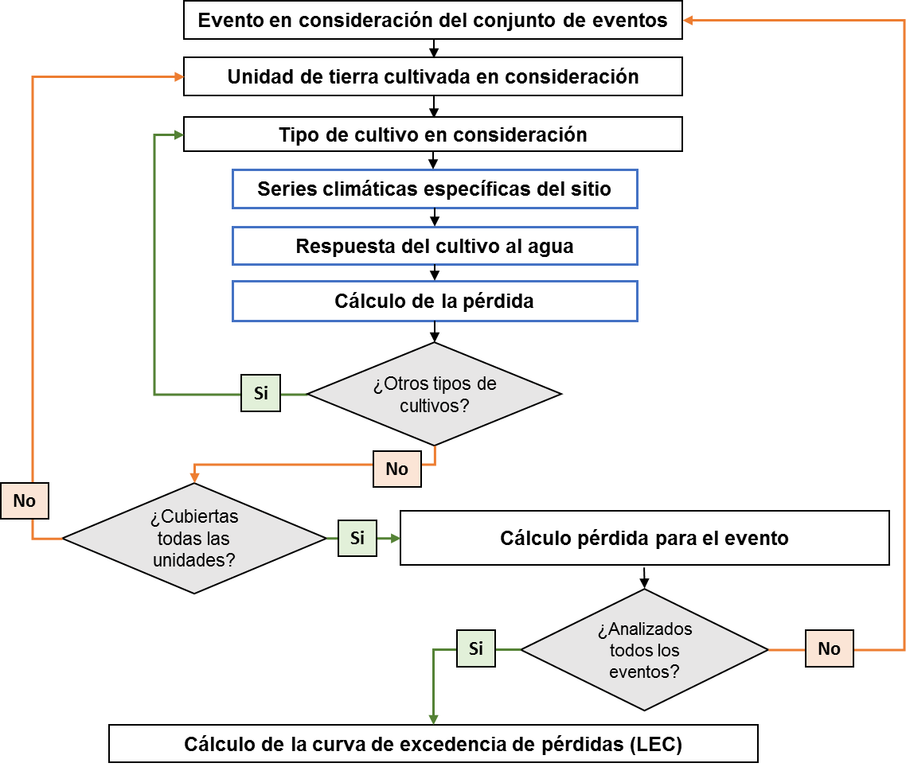
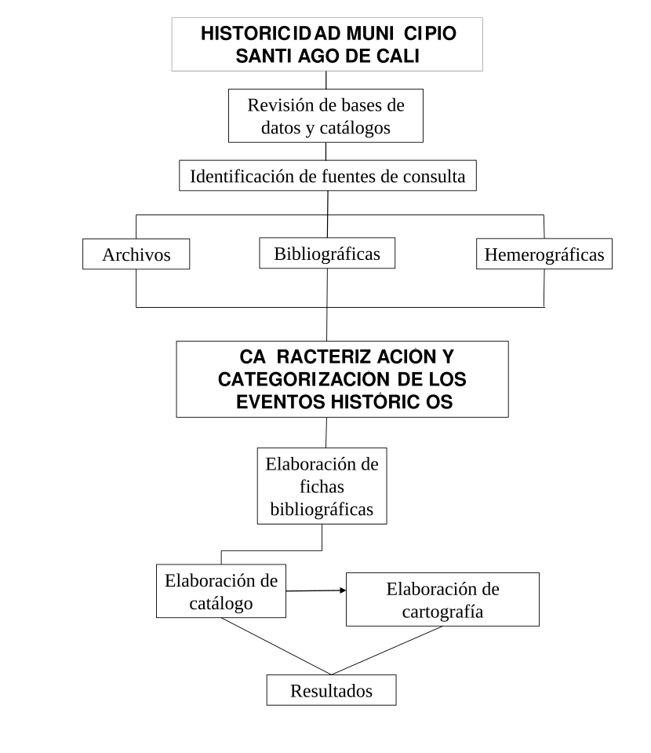
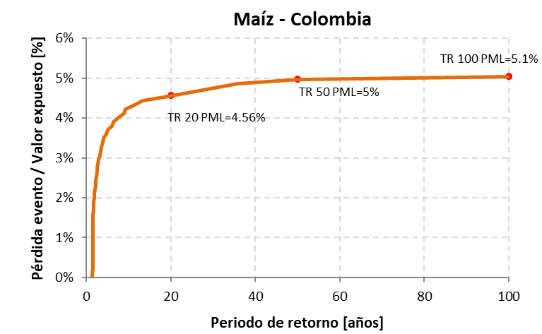
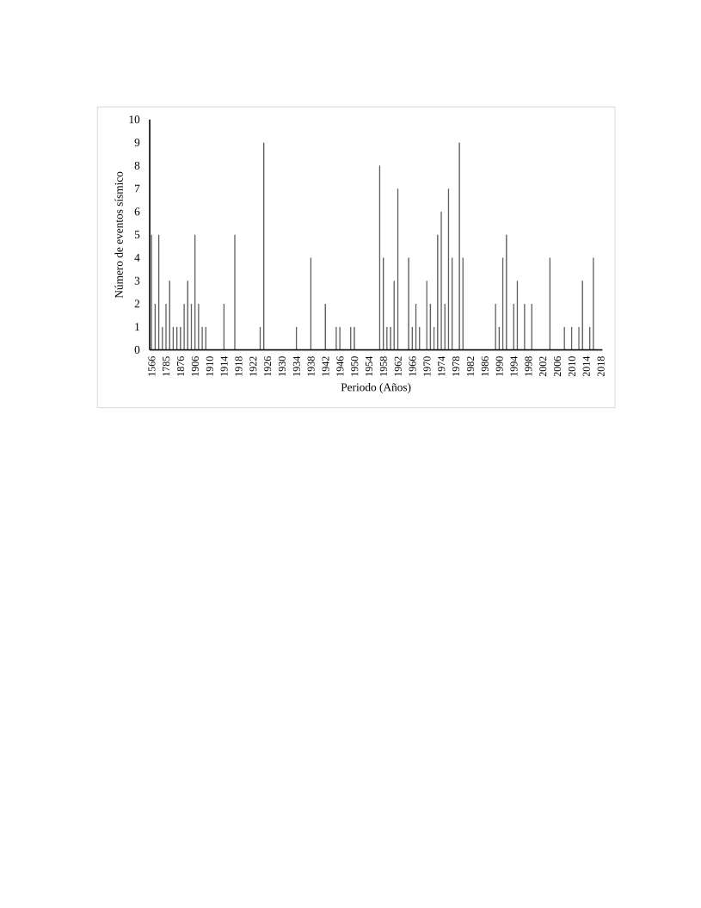

Como se muestra en la Figura 11, la evaluación probabilista del riesgo se puede resumir en los siguientes pasos (más detalles en la sección de Materiales y Métodos):

1.  > Para cada evento, se determina la pérdida en todas y cada una de las unidades cultivadas, considerando tipo de suelo, tipo de cultivo, estacionalidad y fase fenológica.

2.  > Se calcula la pérdida causada por todo el evento, como la suma de las pérdidas individuales causadas en las unidades cultivadas.

3.  > Una vez se conocen las pérdidas de todos los escenarios, se calculan las tasas de excedencia.

**Figura 39.** Diagrama de flujo para la metodología de evaluación de riesgo por sequía

<table>
<tbody>
<tr class="odd">
<td>
<strong>Caja 5. Cuantificación del impacto de los desastres en el sector agrícola</strong>

En términos generales, la cuantificación del impacto de los desastres en el sector agrícola hace una diferencia importante entre los conceptos de daño y pérdida:

<ul>
<li><blockquote>

Daño: es la destrucción parcial o total de los activos físicos e infraestructura en áreas afectadas por desastres. Se expresa en términos de los costos de reemplazo o reparación. En el sector agrícola, el daño incluye impactos a cultivos permanentes, maquinaria, sistemas de irrigación, refugios de ganado, entre otros.

</blockquote></li>
<li><blockquote>

Pérdida: se refiere a los cambios en los flujos económicos derivados de un desastre. En el sector agrícola, las pérdidas incluyen la disminución de ingresos asociado a reducción del rendimiento de la cosecha, disminución de ingresos asociados a reducción en la producción de derivados pecuarios. También se puede considerar el momento después de ocurrido el desastre en el que el incremento de los costos de los insumos, mayores costos operacionales, gastos más altos en imprevistos significan menores ganancias de la actividad agrícola general.

</blockquote></li>
</ul>

La siguiente figura muestra la diferencia que hace la FAO [29] en términos de daño y pérdida para la producción y los activos en el sector agrícola y que aplica en la metodología propuesta de evaluación de riesgo por eventos climáticos extremos.

<strong>Diferencias entre pérdidas y daños en el sector agrícola (</strong>Elaboración propia a partir de [29]<strong>)</strong>

En cuanto a la producción, el daño corresponde a los impactos de los desastres a insumos y producción almacenada, así como impactos en cultivos permanentes; mientras que, para la pérdida, los impactos se ven reflejados en la variación de los ingresos al productor asociado con disminuciones en los rendimientos de la cosecha. Por otro lado, para los activos los daños se asocian a impactos en maquinaria, equipo y herramienta y no se consideran pérdidas, al no asociar cambios en flujos económicos a los activos.

La medición se hace a partir de avalúos y costos de reparación/reemplazo estimados en condiciones anteriores al evento y diferencias en ingresos percibidos entre cosecha óptima y cosecha en condición de desastre. La metodología también puede incluir los costos temporales que deben incurrir los productores para mantener las actividades agrícolas durante o luego de la ocurrencia de un desastre. La metodología puede entonces incluir todos estos factores según la disponibilidad de la información y la amenaza analizada (por ejemplo, para el caso de la sequía no se consideran afectaciones a activos).
</td>
</tr>
</tbody>
</table>

## Riesgo por sequía para el cultivo de maízen Colombia 

Con el fin de ilustrar los resultados de la metodología de evaluación de riesgos con enfoque probabilista, a continuación, se presentan los resultados de una evaluación preliminar de caso de riesgo por sequía para Colombia. Estos resultados son ilustrativos y hacen parte del desarrollo actual de la metodología, por lo que no se consideran definitivos.

<table>
<tbody>
<tr class="odd">
<td>
<strong>Caja 6. Métricas de riesgo</strong>

A partir de la curva de excedencia de pérdidas es posible obtener diversas métricas del riesgo, las cuales son útiles para diferentes fines dentro de la toma de decisiones y la gestión del riesgo. Estas métricas pretenden proporcionar una representación integral del riesgo, por lo general condensada en uno o unos pocos números, en lugar de proporcionar todo el conjunto de las pérdidas por escenarios o la curva de excedencia de pérdidas completa.

<ul>
<li><blockquote>

La pérdida anual esperada (PAE)

</blockquote></li>
</ul>

La PAE corresponde al valor esperado de la pérdida anual. Indica el valor anual que debe pagarse para compensar, en el largo plazo, todas las pérdidas futuras. En un esquema simple de seguro, la PAE sería la prima pura anual justa. Se calcula como a partir del conjunto de eventos como:

<table>
<tbody>
<tr class="odd">
<td>$PAE = \frac{p_{i}}{T}$</td>
<td></td>
</tr>
</tbody>
</table>

Es decir, se trata del valor esperado de las pérdidas anuales. La PAE se puede obtener también como el área bajo la curva de excelencia de pérdidas.

La pérdida anual esperada es un indicador importante dado que integra en un único valor el efecto, en términos de pérdida, de la ocurrencia de los escenarios de amenaza sobre los elementos expuestos vulnerables. Se considera como el indicador más robusto de riesgo, no solo por su capacidad de resumir el proceso de generación de pérdidas en un solo número, sino por ser relativamente insensible a la incertidumbre.

<ul>
<li><blockquote>

La pérdida máxima probable (PML)

</blockquote></li>
</ul>

Se denota PML por sus siglas en inglés (Probable Maximum Loss). La PML es una curva que relaciona las pérdidas a su correspondiente periodo de retorno. No obstante, es práctica común definir la PML como un único valor y corresponde a una pérdida que ocurre poco frecuentemente, es decir, que se asocia a un periodo de retorno grande. La selección del periodo de retorno de la PML depende exclusivamente de la aversión al riego del tomador de decisiones. Por ejemplo, en la industria aseguradora el periodo de retorno de la PML se toma usualmente entre 200 y 1,500 años. La selección del periodo de retorno la hace el tomador de decisión, según el objetivo de la evaluación, ya que no existe un estándar aceptado mundialmente.

<ul>
<li><blockquote>

La probabilidad de quiebra (PQ)

</blockquote></li>
</ul>

Asumiendo que el proceso de ocurrencia de las pérdidas en el tiempo sigue un proceso de Poisson, es posible determinar la probabilidad de alcanzar o exceder un nivel de pérdida dado, en un periodo de exposición particular,

<table>
<tbody>
<tr class="odd">
<td>Pr Pr  (<em>P</em>&gt;<em>p</em>)  = 1 − <em>e</em> − <em>ν</em>(<em>p</em>) • <em>T</em></td>
<td></td>
</tr>
</tbody>
</table>

en donde Pr(<em>P</em>&gt;<em>p</em>)<em>T</em> es la probabilidad de excedencia de la pérdida <em>p</em>, en el lapso de tiempo <em>T</em> (dado en años). Si la pérdida <em>p</em> corresponde a la PML, entonces el término Pr(<em>P</em>&gt;<em>p</em>)<em>T</em> se conoce como la probabilidad de quiebra (<em>PQ</em>), la cual no es más que la probabilidad de exceder la PML en un lapso de tiempo <em>T</em>.
</td>
</tr>
</tbody>
</table>

Inicialmente se presentan los resultados para un evento de sequía en la Región Caribe de Colombia. Este evento no es un pronóstico, es una condición que se puede presentar en el futuro en esta región. La Figura 12 muestra los mapas de gravedad del evento de sequía, en términos de su severidad, duración e intensidad. Para este mismo evento se evaluó el rendimiento del cultivo de maíz, y los resultados se presentan en términos de la relación entre la producción real alcanzada bajos las condiciones de estrés hídrico y la producción potencial que se alcanzaría sin restricciones de agua o nutrientes. A partir de estos resultados se puede ver en qué lugares se esperan mayores pérdidas en producción, asociados a un evento de condiciones climáticas desfavorables.

**Figura 40.** Caracterización de un evento de sequía en la Región Caribe de Colombia (elaboración propia).

La evaluación del riesgo se completó también a escala nacional, analizando los potenciales eventos de sequía que pueden ocurrir en el país y que fueron identificados en la etapa de la evaluación de la amenaza. El riesgo se estimó para el cultivo de maíz en Colombia, cuya localización y densidad de área sembrada se estimó en la etapa de modelación de la exposición. Haciendo uso de la metodología de la FAO para la evaluación de la vulnerabilidad y la evaluación del riesgo con enfoque probabilista, se obtuvo la curva de Pérdida Máxima Probable que se muestra en la Figura 13. Esta curva relaciona la pérdida relativa (pérdida del evento dividida por el valor expuesto total) con el periodo de retorno de esta pérdida. Entonces, para Colombia se espera una pérdida máxima probable del 5% para un periodo de retorno de 50 años, esto en términos de reducción de los ingresos del productor asociados a la reducción en el rendimiento de su cultivo.

**Figura 41.** Curva de Pérdida Máxima Probable para el cultivo de Maíz en Colombia (Elaboración propia).

Los resultados también se presentan distribuidos espacialmente en los mapas de la Figura 14, en los que se muestra la ubicación de los cultivos de maíz (mapa de la izquierda) y los resultados de la pérdida anual esperada relativa al valor expuesto (mapa de la derecha). A partir de estos mapas se pueden reconocer las zonas en las que el cultivo de maíz está en mayor riesgo (pixeles en rojo). Es interesante notar que, aunque la severidad e intensidad de la sequía en la Región Caribe tiende a ser más baja que en otras zonas del país como se muestra en la Figura 7, los resultados de riesgo indican que las pérdidas relativas pueden ser más altas en esta zona. Esta situación refuerza la idea de la necesidad de evaluar tanto la amenaza como el riesgo para brindar insumos a los procesos de gestión de riesgo de desastres. En este caso, la combinación de las condiciones de clima, de calidad del suelo y de superficie sembrada permiten abordar el problema de la sequía desde un enfoque integral.

**Figura 42.** Mapas de ubicación y densidad de área sembrada de maíz (izquierda) y de pérdida anual esperada relativa (derecha) de riesgo por sequía (Elaboración propia).

## Alcance de la metodología 

La metodología de evaluación de riesgo pretende evaluar las pérdidas en la producción potencial de cultivos expuestos a eventos extremos de clima. Esto es lo mismo que evaluar la disminución en el rendimiento de los cultivos bajo condiciones de estrés hídrico o térmico, aplicando la metodología de dinámica de respuesta de las plantas a la disponibilidad de agua. Al definir el alcance de la metodología a la estimación de pérdidas en el sector agrícola, esta metodología no considera pérdidas o afectaciones de vidas humanas. Incluso, la presente metodología no considera efectos sobre la disponibilidad de agua para suministro de agua potable, generación de energía o dinámicas del agua subterránea.

Otras consideraciones sobre el alcance de la metodología son:

  - > La metodología de amenaza contempla en su alcance la generación estocástica de series de precipitación y temperatura (proceso estadístico de simulación del clima a partir de registros históricos) que no pretende ser un pronóstico. La modelación de otras variables climáticas (humedad, radiación, velocidad del viento) implica el uso de modelos complejos de circulación atmosférica e interacción de sistemas terrestres, que no está dentro del alcance de este estudio.

  - > En la creación del modelo de exposición, la selección de los productos se hace a partir del nivel de detalle de la información disponible, además de considerar los cultivos más importantes y representativos de la economía del país, tanto en términos de subsistencia como producción con fines comerciales.

  - > Si este modelo se enfoca en la escala nacional, no es posible diferenciar de forma directa áreas cultivadas para subsistencia o explotación agroindustrial si no existe la información correspondiente. El modelo no está en la capacidad de diferencias tipos de pasturas naturales.

  - > La base de datos de cultivos generada en este estudio también incluye las prácticas agrícolas típicas de la región. El modelo de exposición incluye detalles como las épocas de primera y segunda siembra, ajustando las áreas y duración del ciclo de crecimiento del cultivo en cada caso. Estos modelos no consideran la rotación de cultivos. En el caso de cultivos permanentes, se considera que los cultivos están en etapa productiva, es decir, los árboles ya completaron su crecimiento vegetativo.

  - > El modelo de vulnerabilidad de este estudio sigue la metodología de cálculo de rendimiento de productos agrícolas propuesta por la FAO. En el marco de este estudio, la vulnerabilidad se define en términos de la pérdida de rendimiento que sufre el cultivo durante un período prolongado de escasez de agua. Dado que se aplica un modelo agronómico de respuesta de cultivos, no se emplearán curvas o funciones de vulnerabilidad.

  - > La estimación de impactos económicos para el sector agrícola se limita a la estimación de pérdidas asociadas a la diferencia entre la cosecha óptima y la alcanzada bajo condiciones de estrés hídrico, avaluadas según costos de producción. No se consideran pérdidas asociadas con disminución en la calidad del producto, que puede implicar un menor precio de venta. Las pérdidas se suponen que son producto del evento amenazante y no considera factores externos como variaciones del mercado, brotes de enfermedades, entre otros.

  - > La metodología hace uso de rendimientos de producción (total de cosecha producida en toneladas por unidad de área en hectáreas) para las condiciones locales. Estos rendimientos, obtenidos de fuentes oficiales, son rendimientos de referencia que permiten verificar los resultados de rendimiento obtenidos con el modelo para estimar las pérdidas. Sin embargo, cabe resaltar que dichos rendimientos se asumen estáticos en el modelo dado que no se tienen en cuenta las mejores prácticas agrícolas que en un futuro puedan adoptarse y que resulten en un incremento del rendimiento de los cultivos.

<table>
<tbody>
<tr class="odd">
<td>
<strong>Caja 7. DroughtPro.</strong>

Drought Pro es un software desarrollado por INGENIAR Risk Intelligence Ltda, cuyo objetivo es la evaluación de la amenaza, vulnerabilidad y riesgo por sequía y está en desarrollo para incluir otros tipos de amenazas asociadas a eventos climáticos extremos. Permite estimar las pérdidas en los cultivos expuestos a eventos de sequía, haciendo uso de modelos de vulnerabilidad que relacionan el déficit de agua disponible para el cultivo con su crecimiento y producción de cosecha, y la vulnerabilidad del sector pecuario en términos de la disminución de la capacidad de carga de la pastura. A continuación se observa una ventana ejemplo del programa Drought Pro para la evaluación del riesgo por sequía. Drought Pro permite almacenar, editar y actualizar la información de amenazas, exposición, vulnerabilidad y riesgo. Este software es una plataforma independiente, desarrollada con herramientas de programación avanzadas.

Drought Pro integra los módulos de amenaza con los módulos de exposición y vulnerabilidad para hacer una estimación de riesgo, que se presenta en términos de pérdidas económicas o de producción, para el sector agrícola y pecuario. Para calcular el riesgo por sequía en el sector agrícola en primer lugar, se modela la amenaza a partir de los registros históricos de precipitación y temperatura, con el fin de generar series futuras correlacionadas de parámetros climáticos e identificar condiciones de sequía a muy largo plazo. Posteriormente, se ingresa la base de datos de elementos expuestos con datos sobre ubicación, características de los cultivos (parámetros propios, tipo y estacionalidad), área, productividad y costo de producción de cada unidad de tierra cultivada. Luego, la vulnerabilidad de los cultivos se define a partir de parámetros fenológicos y físicos que representan el desarrollo de los cultivos y permiten estimar la diferencia entre la producción óptima de rendimiento (si no hay límites para agua y nutrientes) y producción bajo déficit hídrico. Por último, el riesgo de sequía agrícola se modela en términos de pérdidas económicas derivadas de la pérdida de rendimiento debido a la escasez de agua. El riesgo se expresa en términos de la curva de excedencia de pérdidas, la pérdida anual esperada y las pérdidas máximas probables; métricas de riesgo que son útiles para los procesos de toma de decisiones. En el caso del cálculo de riesgo del sector pecuario se ingresa la información asociada a la exposición en términos de pasturas y stock ganadero y el programa evalúa su vulnerabilidad en términos de la reducción de capacidad de carga de la pastura natural.

<strong>Software Drought Pro para estimación de pérdidas en producción agrícola por sequía.</strong>

Drought Pro calcula para múltiples escenarios de clima y cultivos las principales métricas de riesgo de forma simultánea. Se obtienen entonces resultados tanto para el portafolio completo de cultivos, como desagregado por producto. Para más información visitar <a href="http://www.ingeniar-risk.com/servicios/software/capra/drought-pro">http://www.ingeniar-risk.com/servicios/software/capra/drought-pro</a>
</td>
</tr>
</tbody>
</table>

