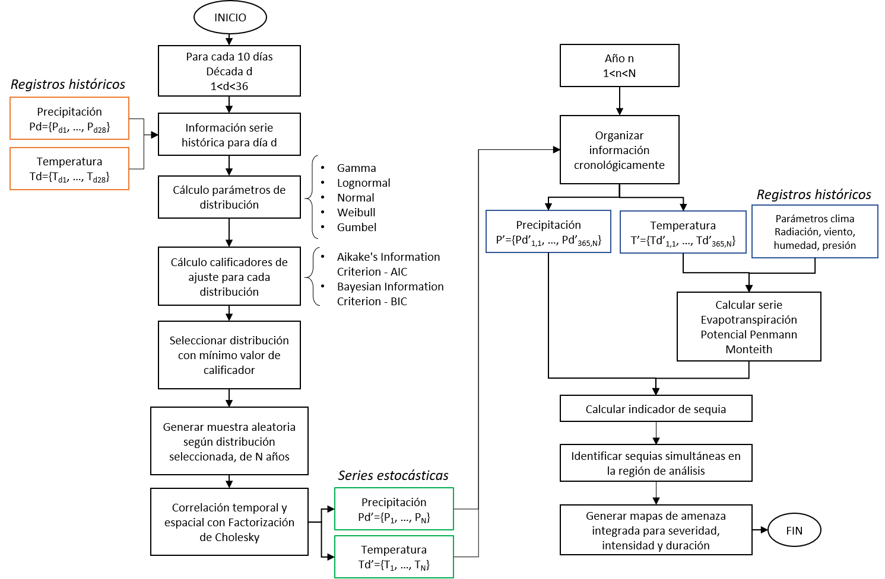
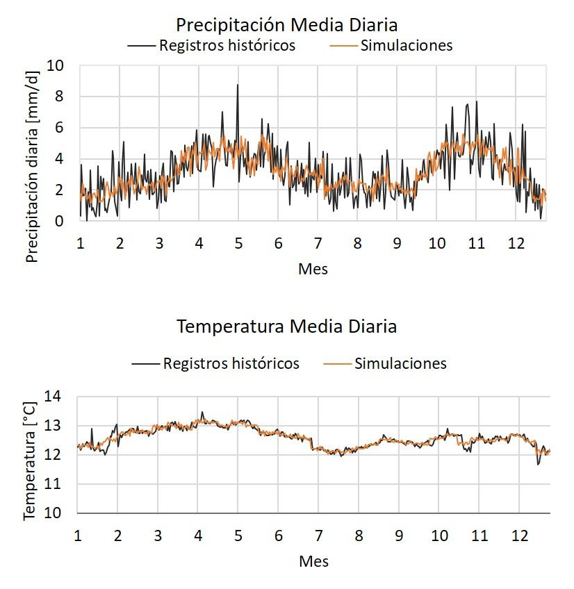

La metodología propuesta considera que los escenarios de amenaza corresponden a eventos de condiciones continúas y simultáneas de estrés hídrico y alta temperatura. Para la evaluación prospectiva del riesgo por fenómenos meteorológicos, el componente de amenaza se define como un conjunto de cientos de eventos estocásticos, derivados de la simulación de variables de precipitación y temperatura, que son colectivamente exhaustivos y mutuamente excluyentes. Estos escenarios describen la distribución espacial, la frecuencia de ocurrencia y la aleatoriedad de la intensidad de eventos extremos de sequía en la región de interés. En un marco más amplio, a partir de las simulaciones de series de precipitación y temperatura, la metodología permite identificar eventos extremos no sólo de sequía, sino también de inundación, olas de calor o heladas, aplicando en cada caso los indicadores pertinentes, y así poder comparar sus potenciales impactos en la zona de interés.

El paso preliminar en la generación de eventos de amenaza de fenómenos meteorológicos es la definición de la accesibilidad a los registros de datos climáticos históricos, para verificar qué parámetros están disponibles (precipitación, temperatura, viento, radiación y humedad) y en qué resolución (espacial y temporal). Después de una evaluación de la calidad de los registros, se generan series estocásticas de parámetros climáticos utilizando un generador de clima sintético que ajusta una distribución de probabilidad para cada día del año y para cada estación en el área bajo estudio para luego hacer la correspondiente correlación temporal y espacial entre estaciones. Posteriormente, se calculan parámetros climáticos adicionales, como la evapotranspiración potencial, que son útiles para definir los índices de evento extremo de clima (sequía, exceso de lluvia, heladas y olas de calor). Al calcular los índices para todo el período de simulación y para todas las estaciones analizadas, se identifican los episodios extremos que ocurren simultáneamente en la región. Los eventos peligrosos, en su conjunto cubren toda el área de estudio, razón por la cual se pueden derivar los mapas de amenaza integrada con un enfoque de evaluación probabilista y con esto obtener medidas de intensidad de la amenaza para diferentes periodos de retorno en toda el área estudiada.

## Información climática

La metodología propuesta utiliza datos climáticos históricos de la región de interés, principalmente la acumulación diaria de precipitación y mediciones de temperatura máxima, mínima y media. También hace uso de mediciones de velocidad y dirección del viento, radiación neta, humedad y presión atmosférica, a escala diaria de ser posible. La metodología propuesta permite el uso de datos medidos en estaciones meteorológicas en superficie y también el uso de datos recopilados por teledetección, los cuales son útiles principalmente en caso de que no se puedan obtener registros históricos de las estaciones, para complementar valores faltantes, ante la existencia de datos de baja calidad o la ausencia de estaciones operativas.

Dado que el uso de registros históricos de clima de estaciones meteorológicos es restringido por la cantidad y calidad de la información, al aplicar esta metodología se han utilizado bases de datos globales de información satelital analizada y ajustada por importantes centros de investigación a nivel mundial. Entre estas bases de datos se encuentra CHIRPS Climate Hazards Group InfraRed Precipitation with Station data \[17\] y el dataset desarrollado por el equipo de hidrología de la Universidad de Princeton en Estados Unidos \[18\]. Estas bases de datos cuentan con más de 30 años de registros diarios de información global con mallas desde 1° hasta 0.25° de resolución. Los parámetros disponibles son precipitación, temperatura (media, mínima y máxima), radiación de onda corta y de onda larga, humedad específica, presión de aire en la superficie y velocidad del viento, que son ajustadas a los cambios de elevación. También está disponible la base de datos ERA5 del Copernicus Climate Change Service \[19\] con resolución de 0.1° y registros a escala horaria.

Es importante notar que dentro de las limitaciones de la metodología se reconoce que las bases de datos globales tienen dificultades para representar las variables a escala diaria, y se debe validar con registros de estaciones en tierra. La Figura 2 muestra el ejemplo de comparación entre una estación en tierra administrada por el IDEAM (Aeropuerto Santiago de Vila) y la estación virtual más cercana. Los registros históricos para estas dos estaciones se muestran en el histograma de precipitación diaria, las series del promedio multianual de precipitación mensual y precipitación total anual, y un ejemplo de serie diaria de precipitación para el año 1981. En este caso, la estación en tierra tiene el 98% de los registros para el rango desde enero de 1981 hasta diciembre de 2010. El valor del coeficiente de correlación para valores diarios es de 0.19 y el error cuadrático medio es de 11.25 mm, que son valores que indican poca correspondencia entre los datos registrados y los del dataset.

Sin embargo, la Probabilidad de detección de días con lluvia es de 0.77, la relación de falsa alarma es de 0.18 y el índice de éxito es 0.65. Estos indicadores muestran que CHIRPS reconoce en una buena medida los días de no precipitación (ver serie diaria de 1981). De otro lado, los coeficientes de relación y los errores cuadráticos medios de valores mensuales, que se muestran en la Figura 2 indican una mejor correlación al agregar los registros a escala mensual. A estas mismas conclusiones llegó en un ejercicio de validación de CHIRPS en Colombia, en el que se encontró un buen desempeño de la base de datos al compararlo con 338 estaciones en tierra administradas por IDEAM (R = 0.97 y MAE = 38 mm) \[17\] y se comprobó su buen uso para la identificación de sequías. En un análisis descriptivo y comparativo para Colombia que consideró 902 estaciones del IDEAM \[20\], se concluyó que CHIRPS conserva características importantes de precipitación como la media y la estacionalidad para escala anual, mensual y diaria, aunque la varianza se representa mejor a escala mensual y anual. Este estudio encontró que CHIRPS sobreestima los valores de precipitación en la región Andina y Pacífica, mientras que subestima las precipitaciones en La Guajira, la Región de la Orinoquía y Amazonía. Además, CHIRPS acierta en más de un 60% los días de lluvia y de no lluvia.

**Figura 30.** Comparación de registros de estación en tierra y registros CHIRPS en estación virtual (Fuente: elaboración propia).

Se han adelantado iniciativas para mejorar la calidad de los registros de CHIRPS a escala diaria \[21\], y en el caso colombiano el IDEAM genera mapas de seguimiento de la lluvia decadal CHIRPS-IRE/IDEAM, pero esta información no tiene acceso libre. A pesar de estas limitaciones, se considera que las bases de datos globales tienen fortalezas para su uso como valores de entrada al generador de clima, entre las que se reconoce la alta resolución espacial y temporal y que se representan bien los valores medios multianuales, la estacionalidad y la precipitación acumulada total, que son los indicadores seleccionados para medir el ajuste de las simulaciones en esta metodología. Esto se hace considerando que el generador de clima no tiene como objetivo hacer pronósticos de clima, sino generar eventos extremos que se puedan presentar y deriven en peligros y desastres.

## Generación estocástica de series climáticas

La metodología propuesta utiliza un generador de clima sintético a partir de distribuciones paramétricas de probabilidad para definir conjuntos de datos climáticos históricos y estimar la probabilidad de ocurrencia de un determinado valor de precipitación o temperatura, incluso fuera del rango de observaciones históricas. La metodología toma cada día del año hidrológico en un análisis separado, y encuentra la distribución de probabilidad que se ajusta mejor a los registros históricos. Posteriormente, se generan números aleatorios para la precipitación y la temperatura diaria para un determinado número de años de simulación, usando los parámetros de las distribuciones seleccionadas. Las series sintéticas de clima son luego utilizadas para generar mapas de amenaza integrada para diferentes periodos de retorno para toda el área de análisis. El esquema que describe el paso a paso del generador sintético de clima se presenta en la Figura 3 y la descripción detallada de la metodología se presenta en la sección de Materiales y Métodos al final de este documento.

**Figura 31.** Proceso de generación de series sintéticas de precipitación y temperatura para identificación de eventos meteorológicos extremos (Fuente: elaboración propia).

En la Figura 4 se muestra un ejemplo, para el caso de Colombia, del ajuste del promedio diario multianual de las series históricas del periodo 1981–2010 y de la serie sintética simulada aleatoriamente para 1,000 años. Se puede ver cómo la metodología propuesta resulta en series sintéticas con un ajuste preciso a los datos históricos, lo que indica que la serie aleatoria conserva adecuadamente las características del clima de la zona.

**Figura 32.** Promedio diario multianual de precipitación (arriba) y de temperatura media (abajo) para serie histórica (1981**–**2010) y serie sintética (1,000 años de simulación) (Fuente: elaboración propia).

Una de las ventajas de la metodología de generación estocástica de series climáticas es la obtención de valores atípicos extremos, que hacen referencia a valores de precipitación por encima de los máximos de los registros históricos, y valores de temperatura por fuera del rango medio registrado en estaciones. Esto quiere decir que las series modeladas incluyen valores de precipitación y temperatura que no se han presentado, pero pueden ocurrir con una baja probabilidad en el futuro.

Para el caso de Colombia, los resultados en escala espacial de la simulación de series de precipitación y temperatura se muestran en la Figura 5 Estos mapas muestran los valores medios multianuales para la precipitación anual y temperatura media, mínima y máxima, a partir de los registros históricos (columna de la izquierda) y de los valores simulados (columna de la derecha). Los resultados, tanto para precipitación como para temperatura muestran que las simulaciones conservan los valores medios en toda el área de estudio y representan la distribución espacial de estas variables climáticas. Los mapas muestran las zonas de clima predominantemente seco, como La Guajira en el norte, y zonas reconocidas por sus intensas lluvias como el Choco. También se reconocen en los mapas de temperatura las zonas más altas del país, como son las cordilleras y la Sierra Nevada de Santa Marta.

<table>
<thead>
<tr class="header">
<th>

<ol start="7" type="a">
<li><blockquote>

<strong>Precipitación Registros 1981-2010</strong>

</blockquote></li>
</ol></th>
<th>

<ol start="8" type="a">
<li><blockquote>

<strong>Precipitación Simulada</strong>

</blockquote></li>
</ol></th>
</tr>
</thead>
<tbody>
<tr class="odd">
<td>

<ol type="a">
<li><blockquote>

<strong>Temperatura Media Registros 1981-2010</strong>

</blockquote></li>
</ol></td>
<td>

<ol start="2" type="a">
<li><blockquote>

<strong>Temperatura Media Simulada</strong>

</blockquote></li>
</ol></td>
</tr>
<tr class="even">
<td>

<ol start="3" type="a">
<li><blockquote>

<strong>Temperatura máxima Registros 1981-2010</strong>

</blockquote></li>
</ol></td>
<td><blockquote>

</blockquote>
<ol start="4" type="a">
<li><blockquote>

<strong>Temperatura máxima Simulada</strong>

</blockquote></li>
</ol></td>
</tr>
<tr class="odd">
<td>

<ol start="5" type="a">
<li><blockquote>

<strong>Temperatura mínima Registros 1981-2010</strong>

</blockquote></li>
</ol></td>
<td>

<ol start="6" type="a">
<li><blockquote>

<strong>Temperatura mínima Simulada</strong>

</blockquote></li>
</ol></td>
</tr>
</tbody>
</table>

**Figura 33.** Mapas de valores medios multianuales para precipitación, temperatura media, máxima y mínima de registros históricos (izquierda) y series modeladas (derecha).

Con la verificación de estos resultados, se procede a calcular la evapotranspiración y los indicadores de sequía.

<table>
<tbody>
<tr class="odd">
<td><h3 id="caja-2.-incorporación-del-cambio-climático-en-la-generación-de-series-climáticas-futuras">Caja 2. Incorporación del Cambio Climático en la generación de series climáticas futuras</h3>

De acuerdo con el Reporte AR5 del IPCC (Intergovernmental Panel on Climate Change): "el calentamiento del sistema climático es inequívoco, y desde 1950, muchos de los cambios observados son sin precedentes sobre décadas y hasta milenios. La atmósfera y océano se han calentado, las cantidades de nieve y hielo han disminuido, el nivel del mar ha aumentado, y la concentración de gases de efecto invernadero ha aumentado" [22]. Debido a esto es importante considerar los efectos de este cambio climático en la evaluación del riesgo por eventos extremos climáticos.

Con este fin, en la metodología propuesta es posible analizar los modelos de cambio climático y los cuatro diferentes escenarios de forcings antropogénicos (RCP o Representative Concentration Pathways) definidos en el informe AR5 del IPCC, y se escoger los modelos más adecuados para determinar los efectos específicos sobre la temperatura y precipitación para el área de estudio. En total se pueden llegar a evaluar 311 proyecciones, considerando las diferentes corridas de cada modelo. Una vez se determina el/los modelos de cambio climático más adecuado(s), se determinan las proyecciones de temperatura y precipitación en el futuro para la región de estudio, y con esto se perturbarán las series estocásticas de temperatura y precipitación que serán generadas para la modelación de los eventos climáticos extremos. Cada serie modelada debe ser perturbada según su ubicación y los resultados del modelo para ese mismo punto. Esto permite caracterizar completamente las condiciones futuras de ocurrencia de eventos hidrometeorológicos extremos en todo el territorio de análisis.

La incorporación del efecto del cambio climático está por fuera del alcance de la evaluación de riesgo por sequía para el sector agropecuario en Colombia que se presenta en este documento. Para más información visitar <a href="https://www.researchgate.net/project/Drought-hazard-and-risk-assessment-New-probabilistic-and-holistic-methodology-Evaluacion-de-amenza-y-riesgo-por-sequia-Nueva-metodologia-probabilista-y-holistica">https://www.researchgate.net/project/Drought-hazard-and-risk-assessment-New-probabilistic-and-holistic-methodology-Evaluacion-de-amenza-y-riesgo-por-sequia-Nueva-metodologia-probabilista-y-holistica</a>
</td>
</tr>
</tbody>
</table>

## Identificación de eventos estocásticos de clima extremo

Los indicadores son ampliamente utilizados para identificar eventos extremos de clima, como por ejemplo las sequías o inundaciones. Los indicadores pueden definir la *duración* y la *severidad* de los eventos extremos detectando condiciones anómalas de precipitación (exceso o déficit) y de temperatura (por debajo o por encima del promedio histórico para cada temporada del año). Las fechas de inicio y terminación establecen el período de duración en el que un indicador de clima extremo está continuamente por debajo de un nivel o umbral crítico predefinido. La severidad de un evento denota la deficiencia acumulativa de un parámetro por debajo de un umbral entre las fechas de iniciación y terminación.

Dependiendo del tiempo de evento climático a evaluar, se pueden incluir diferentes variables en el cálculo de los índices. Por ejemplo, para encharcamientos por exceso de lluvia, el parámetro que controla el proceso es la lluvia acumulada en un cierto número de días y la humedad inicial del suelo. Para eventos de sequía meteorológica se tiene en cuenta la precipitación acumulada y la evapotranspiración potencial, que se calcula a partir de la temperatura, viento, humedad, radiación y presión atmosférica. Para el caso de heladas y olas de calor se debe tener en cuenta la humedad del aire además de la temperatura.

<table>
<tbody>
<tr class="odd">
<td>
<strong>Caja 3. ¿Cómo se caracteriza un evento de sequía?</strong>

A partir de la serie de indicadores de sequía se puede caracterizar cada evento según los siguientes parámetros:

<strong>Definición de un evento de sequía dentro de la serie de tiempo sintética</strong>

<ul>
<li><blockquote>

<em>Severidad</em>: corresponde al área bajo la curva del evento, es decir, el valor acumulado del indicador durante el evento. Se puede entender como la gravedad de la sequía.

</blockquote></li>
<li><blockquote>

<em>Duración</em>: es el tiempo que dura el evento o el número de meses en el que el indicador de sequía está por debajo del umbral que define la severidad.

</blockquote></li>
<li><blockquote>

<em>Intensidad</em>: se calcula como la severidad dividida por la duración. Es una medida unitaria de la magnitud del evento.

</blockquote></li>
<li><blockquote>

<em>Serie de temperatura</em>: valores contra el tiempo de temperatura diaria (promedio, máxima y mínima) dentro de la duración del evento. Se obtienen de la serie sintética empleada en el cálculo del indicador.

</blockquote></li>
<li><blockquote>

<em>Serie de precipitación</em>: valores contra el tiempo de precipitación diaria dentro de la duración del evento. Se obtienen de la serie sintética empleada en el cálculo del indicador.

</blockquote></li>
</ul></td>
</tr>
</tbody>
</table>

