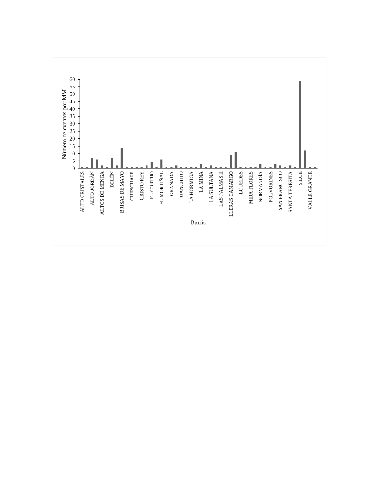

La metodología propuesta considera los elementos expuestos como uno de los componentes de riesgo, junto con la amenaza y la vulnerabilidad. Un elemento expuesto es cualquier objeto, geográficamente referenciado, que es susceptible de ser afectado por la ocurrencia de un fenómeno amenazante. Los elementos expuestos para la actividad agrícola son los cultivos ubicados en el área donde se estima el riesgo asociado a eventos climáticos extremos. Los elementos expuestos son fundamentales dentro del análisis de riesgo, debido a que comprenden los objetos sobre los cuales se evalúan las pérdidas, es decir, son la fuente de las pérdidas potenciales debido al hecho de estar expuestos a una amenaza y ser susceptibles de sufrir un daño.

Para cada elemento expuesto o unidad de tierra cultivada en la región de análisis, es necesario conocer las características del cultivo que típicamente se siembra en esa ubicación. La información que se debe conocer incluye el tipo de cultivo, su estacionalidad y área sembrada. También se debe contar con información de rendimientos típicos (toneladas producidas por unidad de área). En la medida de lo posible, esta información debe obtenerse de fuentes oficiales. La información mínima para crear la base de datos de elementos expuestos del sector agrícola se muestra en la siguiente tabla.

**Tabla 6.** Información de entrada para modelo de exposición del sector agropecuario

| **Información de entrada**               | **Descripción**                                                                                      | **Posibles fuentes**                                                                              |
| ---------------------------------------- | ---------------------------------------------------------------------------------------------------- | ------------------------------------------------------------------------------------------------- |
| **Mapas de ubicación de cultivos**       | Ubicación de cultivos y unidades de tierra cultivada georeferenciadas.                               | Mapas oficiales de uso de la tierra y coberturas, censos nacionales agrícolas.                    |
| **Rendimiento de cultivos**              | Valores de referencia de rendimiento de cultivos para la producción anual y el área total cultivada. | Censos y encuestas agrícolas.                                                                     |
| **Valoración económica de los cultivos** | Costo de producción unitario.                                                                        | Censos y encuestas agrícolas.                                                                     |
| **Mapas de tipo de suelo**               | Textura, grupo hidrológico, y número de curva.                                                       | Mapas oficiales de la clasificación taxonómica del suelo, mapas de uso de la tierra y coberturas. |

## Mapas de ubicación de cultivos

La información detallada de localización y caracterización de los cultivos es requerida para modelar la vulnerabilidad de los elementos expuestos; no obstante, esta información por lo general es difícil de obtener. Por tal razón, para recopilarla se consultan fuentes oficiales para desarrollar un proxy con la información más pertinente para zona de estudio.

Para el caso de Colombia se consultó información publicada por fuentes oficiales como el Mapa de Cobertura el Suelo publicado por el IDEAM \[24\], los resultados del Tercer Censo Nacional Agropecuario 2014 \[25\] y las Encuestas Nacionales Agropecuarias \[26\] anuales publicadas por el DANE. De esta forma se obtienen mapas de localización y área de los cultivos más importantes del país, en una malla de resolución ajustable según la resolución del modelo de amenaza y el uso final de la evaluación de riesgo.

Con el objetivo de obtener la base de datos de elementos expuestos, se realizó el análisis de ubicación y cantidad de área sembrada de los principales productos agrícolas producidos en Colombia, así como la localización de pasturas y caracterización de ganado para evaluar el riesgo agropecuario del país a partir de la información del mapa de coberturas, el censo nacional y las encuestas agrícolas. Como resultado se obtuvieron mapas a nivel nacional, en los que el territorio se divide en una malla de 10 km × 10 km y en donde cada celda contiene una cierta área sembrada de cada uno de los productos analizados, para diferentes fechas de siembra (primer y segundo semestre) y tipo de cultivo (monocultivo o asociado).

Esta metodología permite incluir las diferentes prácticas agrícolas que se realizan en diferentes regiones. Estas pueden incluir la siembra de cultivos anuales en varios ciclos (siembra de primer y segundo semestre), siembra en monocultivo o cultivo asociado (por ejemplo, café y plátano en la misma unidad de tierra cultivada). También se consideran cultivos permanentes dentro del análisis. Esto se resume en la Figura 8.

**Figura 36.** Esquema de análisis de cultivos considerado en la generación del modelo de exposición (Fuente: elaboración propia).

Para la generación de los mapas de ubicación y área sembrada de cultivos se consideraron además restricciones en los cultivos en áreas protegidas y se priorizaron zonas cercanas a centros poblados. La validación del área resultante se hizo al comparar la sumatoria del área asignada a cada pixel del mismo municipio con el área total sembrada por municipio reportada en la última versión de la ENA. Por ejemplo, en Colombia la superficie cultivada de maíz a nivel nacional se estimó en 693,800 ha, la distribución espacial de esta área se muestra en la Figura 9, donde también se hace un detalle a los departamentos de Antioquía y Tolima.

**Figura 37.** Localización y área de cultivos de maíz en Colombia (izquierda), en Antioquía (derecha arriba) y en Tolima (derecha abajo) (Fuente: elaboración propia).

## Estacionalidad

Un parámetro de entrada específico para cada región de análisis y tipo de planta es el tiempo en el cual se completa el ciclo de desarrollo del cultivo. Dentro de la modelación de la vulnerabilidad de las plantas, es importante definir, en términos de días calendario, las diferentes etapas de crecimiento del cultivo, desde su siembra hasta la madurez, como se muestra en la Figura 10. Además, se debe contar con información sobre la fecha típica de siembra y cosecha de cada producto. Estos datos van a ser luego utilizados en el módulo de vulnerabilidad que relaciona el desarrollo día a día del cultivo con las series diarias de precipitación y temperatura, para evaluar posibles reducciones en el rendimiento de la cosecha debido a condiciones de déficit de agua.

**Figura 38.** Esquema de etapas de crecimiento de una planta (Fuente: elaboración propia).

## Rendimiento

Dentro de la información que se debe conocer en el modelo de exposición se incluye el rendimiento típico de cada cultivo, que dentro del modelo se define como la producción total en toneladas de un cultivo por hectárea de terreno sembrada. Estos datos se utilizan en el módulo de vulnerabilidad, que relaciona el desarrollo día a día del cultivo con las series diarias de precipitación y temperatura, para evaluar posibles reducciones en el rendimiento de la cosecha debido a condiciones extremas de clima.

Estos rendimientos, obtenidos de fuentes oficiales, son rendimientos de referencia que permiten verificar los resultados de rendimiento obtenidos con el modelo para estimar las pérdidas. Sin embargo, cabe resaltar que dichos rendimientos se asumen estáticos en el modelo dado que no se tienen en cuenta las mejores prácticas agrícolas que en un futuro puedan adoptarse y que resulten en un incremento del rendimiento de los cultivos.

El modelo de vulnerabilidad, acoplado al modelo de amenaza que incluye generación estocástica de eventos climáticos extremos, permite el cálculo de rendimientos tanto para la serie de clima histórico como para la serie de clima simulado. De esta forma se genera mayor cantidad de información de la relación entre la severidad del daño por el evento climático y el rendimiento del cultivo, y se incorporan eventos que no han ocurrido en la historia y que son importantes para la evaluación probabilista del riesgo.

## Avalúo

Para cuantificar las pérdidas generadas al momento de exponer los cultivos a los escenarios que definen la amenaza por sequía, es necesario realizar una valoración económica de la producción obtenida por cultivo, para ello se considera el valor unitario en dólares (USD) o moneda local de una tonelada producida para cada cultivo. La valoración económica es considerada como el precio recibido por los agricultores por sus productos, sin considerar los costos de transporte, almacenamiento, procesamiento, comercialización ni impuestos; es decir, no cubre ningún otro costo después de que el producto deja la unidad de tierra cultivada. La información sobre avalúos se obtiene de fuentes oficiales como ministerios de agricultura y ganadería o institutos estadísticos de los países. Por ejemplo, en Colombia las series históricas del precios a mayoristas por tipo de cultivo se puede encontrar en servicios como AGRONET \[27\].

## Mapas de suelo

La base de datos de elementos expuestos de cultivos incluye las variables necesarias para parametrizar el suelo, que sirve de soporte para el crecimiento de las plantas, y son parámetros de entrada para el modelo de vulnerabilidad. El modelo que se aplica en este estudio toma un volumen de referencia del suelo, en la que se ubica la zona radicular, y estima su balance hídrico para determinar la cantidad de agua que tiene disponible la planta. Con esto se evalúan las interacciones suelo-planta-atmósfera que permiten modelar el crecimiento de cultivos y su rendimiento.

La información de suelos puede ser generada a múltiples escalas, según la información disponible. Por ejemplo, el modelo a escala nacional, al ser una resolución de trabajo gruesa no incluye parámetros de afectación local como presencia de múltiples horizontes de suelo o variaciones en el nivel freático. En ese caso del perfil de suelo se supone un perfil homogéneo para la profundidad máxima que alcanzan las raíces según cultivo y no se considera la presencia de barreras físicas que limiten la profundización de las raíces. Entonces, el modelo de suelo se complementa en la medida en que se obtenga información detallada del área de estudio.

Ahora bien, en caso de no contar con información de tipo y textura de suelo, se puede hacer uso de la Base de Datos Armonizada de los Suelos del Mundo \[28\], que tiene información global de 15,000 unidades cartográficas de suelo. Esta base de datos es el resultado de la base de datos de la Organización de las Naciones Unidas para la Alimentación y la Agricultura (FAO) con el Instituto Internacional de Análisis de Sistemas Aplicados (IIASA), Información Mundial de los Suelos (ISRIC), Instituto de Ciencias de Suelos, Academia China de las Ciencias (ISSCAS), y el Centro Común de Investigación de la Comisión Europea (JRC). La base de datos se puede descargar de forma gratuita de la página web de la FAO.

