## 3.1 Introducción

El término subsidencia hace referencia al fenómeno que corresponde al hundimiento de la superficie terrestre en un área determinada, lo cual es posible debido a varios factores, tanto naturales como antrópicos \[58\]**.** La Sabana de Bogotá, donde se ubica la ciudad de Bogotá, corresponde a una cuenca tectónica-sedimentaria consolidada después de la elevación del Norte de los Andes, ocurrida hace alrededor de 5 Ma \[59\]**,** localizada en zona sísmica moderada, es propensa a la ocurrencia de deslizamientos e inundaciones por su compleja topografía. La subsidencia de la ciudad de Bogotá ha sido objeto de discusión y análisis en diversos escenarios; varios autores y entidades han adelantado investigaciones en este tema, dado que este fenómeno puede afectar directamente las edificaciones y obras civiles de la ciudad.

## Metodología

Bajo el concepto de geodesia de imágenes, la técnica conocida como InSAR (Interferometric Synthetic Aperture Radar), permite determinar cambios de posición del terreno, especialmente en su componente vertical, mediante el uso imágenes de radar de apertura sintética adquiridas en diversos períodos de tiempo \[60\]. La Figura 5 muestra la forma cómo funciona esta técnica a partir de dos imágenes de dos épocas diferentes para un caso de subsidencia.

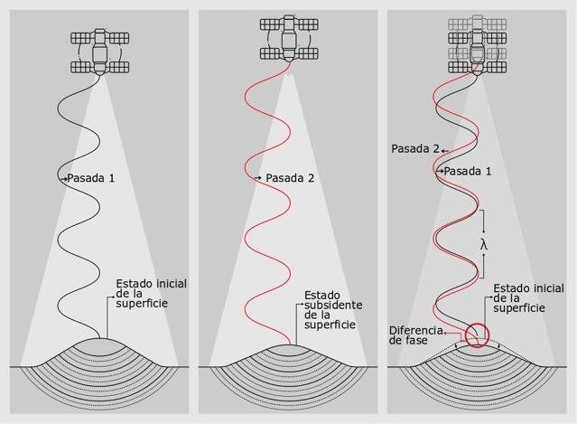

**Figura 5.** Medición mediante InSAR. Se aprecia la diferencia de fase entre una primera toma (pasada 1) respecto a una segunda toma (pasada 2); λ corresponde a la longitud de onda.

### Generación de interferogramas

La comparación de las fases de las imágenes de radar requiere contar con dos imágenes: la primera, maestra, adquirida en una fecha inicial, y la segunda, denominada esclava, con fecha posterior, lo cual permite generar el producto de dicha comparación, conocido como interferograma diferencial. Los interferogramas diferenciales son imágenes que contienen un ciclo de colores (rojo, naranja, amarillo, verde, azul, púrpura) conocido como franjas (fringes) interferométricas. Cada ciclo de colores corresponde a la mitad de la longitud de onda del sensor con el cual se obtuvo el interferograma; por lo tanto, se pueden estimar los cambios relativos en la superficie terrestre contando la cantidad de franjas interferométricas respecto a un sitio que aparentemente no presenta cambios \[61\].

La Figura 6 muestra un interferograma compuesto por una rampa de colores que va del cian hasta el verde pasando por morado, magenta, amarillo, verde, y nuevamente cian. Este patrón corresponde a un ciclo colores expresado en el módulo 2π, donde cada ciclo representa un desplazamiento vertical equivalente a la mitad de la longitud de onda del sensor, este caso es de 1.6 cm considerando que las imágenes interferométricas de TerraSAR-X tiene una longitud de onda de 3.2 cm. El sentido del desplazamiento vertical está en función del orden de colores de –π a π, indicado en la barra de colores, el cual en este caso indica subsidencia. De esta manera, se podría estimar el desplazamiento relativo de un punto respecto a otro; por ejemplo, si se tiene como referencia un punto denominado 1 y se compara con otro denominado 2, se observa que entre los dos hay una diferencia de 3 ciclos de colores es decir 4.8 centímetros en el sentido de la subsidencia.

**Figura 6.** Ejemplo de interferograma diferencial generado a partir de imágenes TerraSAR-X para la ciudad de Bogotá entre el 28/09/2011 y 17/10/2012. Modificado de Mora-Páez et al. \[62\]

La Figura 7 complementa la interpretación de un interferograma diferencial que representa el hundimiento de la superficie del terreno mediante el ciclo de colores. Tomando como referencia un punto de inicio del ciclo de colores (rojo, naranja, amarillo, verde, azul, púrpura), se puede estimar el cambio relativo del terreno. Para este caso, dos ciclos, cada uno correspondiente a 1.6 cm (banda X), arroja un total de 3.2 cm; la barra de colores indica el sentido de la subsidencia.

|                                                                                   |
| --------------------------------------------------------------------------------- |
| 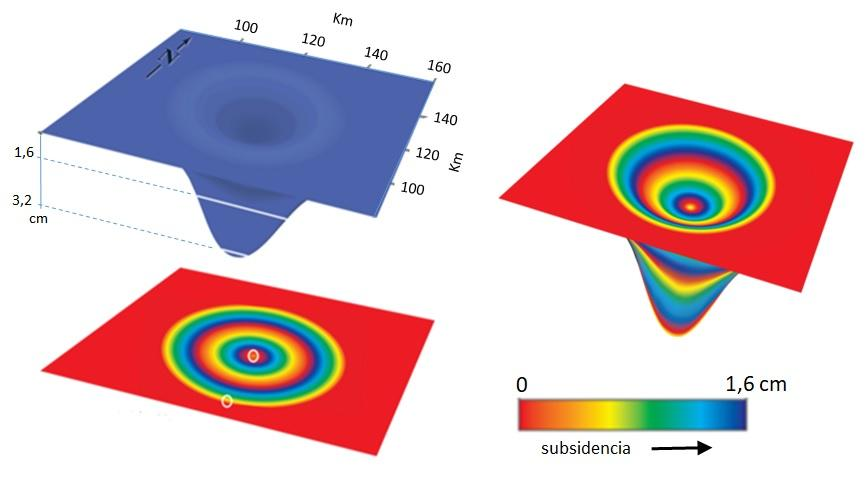 |

**Figura 7.** Representación de la interpretación de un interferograma diferencial correspondiente a subsidencia de un terreno. Fuente: modificado de https://ca.water.usgs.gov/land\_subsidence (2019).

Generado el interferograma, se realiza otro procesamiento llamado “*desenrollo” de la fase*, que permite calcular el desplazamiento vertical. Dichas imágenes, denominadas “desenrolladas”, se “apilan” digitalmente, también conocido como stacking, para obtener los desplazamientos acumulados en el tiempo respecto a la imagen maestra, Figura 8. Este procesamiento permite generar tanto mapas de desplazamiento acumulado como series de tiempo.

|                           |
| ------------------------- |
| 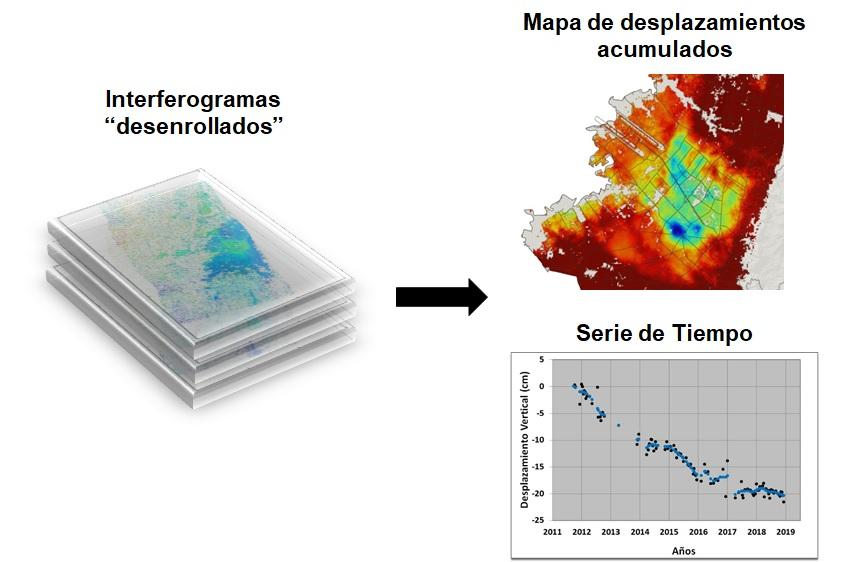 |

**Figura 8.** Esquema representativo de un “stacking” ó “apilación”, generándose un cubo de datos de desplazamiento acumulados para cada periodo de toma de imagen, obtenido a partir de los interferogramas “desenrollados”. Mediante este *stack* se obtienen los mapas de desplazamiento acumulado, así como series de tiempo.

Los interferogramas se generan en el GIGE mediante el empleo del paquete científico ISCE (InSAR Scientific Computing Environment) \[63, 64\], los cuales se analizan conjuntamente con la técnica denominada “stacking”, correspondiente al apilamiento digital en un cubo haciendo uso del paquete científico GIAnT (Generic InSAR Analysis Toolbox) \[65\], empleado además para detectar y corregir errores orbitales. El paquete PyAPS (Python-Based Atmospheric Phase Screen estimator) \[65\] es utilizado para los modelos de corrección atmosféricos en cada interferograma. Como estrategia de procesamiento del “stack” de interferogramas se aplicó el algoritmo NSBAS (New-Small BAseline Subset) \[66\], que permite la estimación del desplazamiento entre la fecha de adquisición de las imágenes objeto del análisis, basado en mínimos cuadrados. Este algoritmo corresponde a una extensión del enfoque SBAS (Small Baseline Subset) que usa una función de regularización para compensar los enlaces faltantes en las redes interferométricas debido a la falta de superposiciones temporales y geométricas que permitan generar correlaciones temporales y espaciales \[65, 66, 67\]. De esta forma, se generaron los mapas de desplazamiento acumulado en función de la época de toma de la imagen, así como las respectivas series de tiempo.

Previamente, Mora-Páez et al. \[62\], empleando 76 imágenes TerraSAR-X para el período septiembre 28 de 2011 a octubre 17 de 2017 en la ciudad de Bogotá, obtuvieron un valor máximo de desplazamiento vertical acumulado de 19. cm. El presente estudio emplea 35 imágenes adicionales a las empleadas por Mora-Páez et al. \[62\], contando así con un total de 111 imágenes Terrasar-X, lo cual extiende el período de observación hasta diciembre de 2018 y permitió generar 501 interferogramas con una línea base menor o igual a 250 m \[68\]. La Figura 9 corresponde al mapa de desplazamientos generado a partir del nuevo procesamiento.

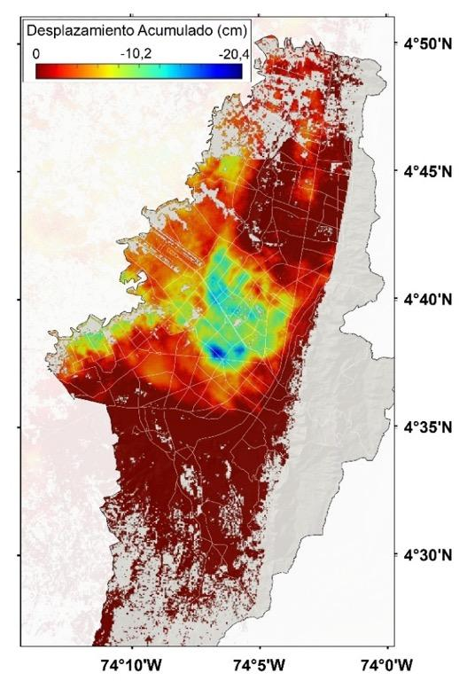

**Figura 9.** Mapa de desplazamientos verticales acumulados para el periodo septiembre de 2011 a diciembre de 2018.

La Figura 10A muestra un sector del mapa de desplazamientos, resaltándose la zona de máxima subsidencia en Bogotá de -20.4 cm, localizada en la zona de Puente Aranda, (punto 1); la Figura 10B presenta la respectiva serie de tiempo. Los círculos negros corresponden con la fecha de adquisición de la imagen, mientras que los círculos azules son los valores obtenidos mediante la aplicación en GIAnT del filtro Media Móvil Ponderado Gaussiano \[64\], cuyo valor se ve reflejado en el eje de desplazamiento vertical.

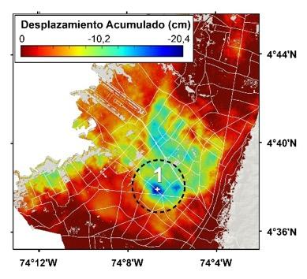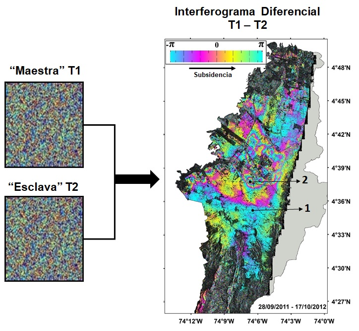

**Figura 10.** Mapa de desplazamientos acumulados del punto 1 sector Puente Aranda (izquierda). Serie de tiempo del Punto 1 (derecha). Los puntos de color negro corresponden a los valores observados del procesamiento del “stacking”, mientras que los puntos azules a los valores obtenidos mediante la aplicación del filtro Media Móvil Ponderado Gaussiano.

La Figura 11a presenta otro sitio, punto 2, localizado en Normandía, cercano al aeropuerto, con valor de -15.7 cm; la Figura 11b muestra la respectiva serie de tiempo. A su vez, la Figura 12A muestra desplazamiento acumulado a diciembre de 2018 de -0.83 cm, considerado como mínimo para el caso de Bogotá; este sitio, en algunas ocasiones, ha mostrado variaciones del orden de 2 cm. La Figura 12B muestra la respectiva serie de tiempo.

 

**Figura 11.** Mapa de desplazamientos acumulados del punto 2 (Normandía) (izquierda). Serie de tiempo del Punto 2 (derecha).

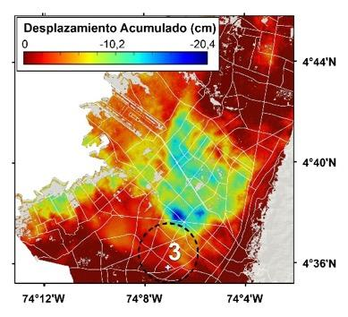 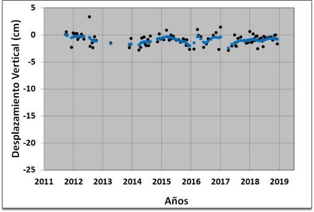

**Figura 12.** Mapa de desplazamientos acumulados del punto 3 (La Guaca) (izquierda), y serie de tiempo del punto 3 (derecha).

**3.2.2 Integración de resultados InSAR con datos GPS**.

Para este estudio, se realizó la integración de resultados de InSAR con los resultados obtenidos en las estaciones permanentes y de campo GPS del GIGE-SGC, así como estaciones de campo de la Red Geodésica de la ciudad de Bogotá, iniciativa conjunta desarrollada entre la Unidad Administrativa Especial Catastro Distrital de la Alcaldía de Bogotá y el Servicio Geológico Colombiano mediante ocupación episódica bajo la modalidad de campañas anuales de toma de datos, realizadas a partir de 2011, con observaciones en estación de alrededor 96 horas cada año, y cuyo procesamiento se ha realizado por GIGE.

Para la integración GPS-InSAR se seleccionaron estaciones permanentes con datos de observación mínima de 2.5 años, y estaciones de campo que han sido objeto de toma de datos por lo menos en tres campañas. Así, se contó para esta integración con 58 estaciones GPS, algunas de ellas por fuera del perímetro de la ciudad de Bogotá, de las cuales 4 son estaciones permanentes (BOGT, AEDO, VSOA, VROS). La localización de estas estaciones se puede observar en el mapa de la Figura 13.

**Figura 13.** Mapa de localización de estaciones GPS empleadas para la integración con InSAR. Los círculos amarillos corresponden a estaciones permanentes, mientras los círculos blancos a estaciones de campo. El recuadro morado es la zona de cobertura de las imágenes TerraSAR-X empleadas.

De esta red de estaciones GPS, se destaca la estación permanente BOGT, dada su importancia y su registro histórico como se mencionó con anterioridad. La componente vertical de la serie de tiempo de esta estación ha mostrado un significativo comportamiento descendente vertical desde sus comienzos. Las líneas azules corresponden a *offsets* asociados a cambios de instrumental a través del tiempo. La Figura 14A muestra la serie de tiempo, así como la estimación de la velocidad anual en esta estación para el mismo período de tiempo de cobertura de las imágenes interferométricas de radar empleadas. Por su parte la Figura 14B muestra la serie de tiempo estimada InSAR para el píxel de localización de la estación GPS BOGT.

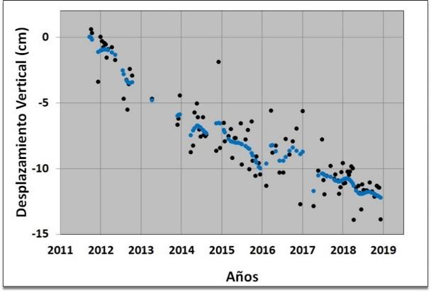

**Figura 14**. Serie de tiempo estación GPS permanente BOGT, imagen superior. Serie de tiempo InSAR para el sitio de localización de la estación BOGT, imagen inferior.

Las dos series de tiempo permiten observar una marcada tendencia de descenso vertical, probablemente asociada a la subsidencia. La serie de tiempo GPS presenta una velocidad basada en tendencia lineal de -28.68 mm/año con un error de ± 1.07 mm/año. La línea de tendencia marcada en color rojo en la gráfica señala el comportamiento de la estación a través del tiempo. El resultado del procesamiento de los datos observados se ajusta al modelo aplicado, y permiten identificar un patrón periódico en el tiempo, observándose oscilaciones anuales, que puede deberse a cambios hidrológicos estacionales; por ejemplo, precipitación de aguas lluvias y/o extracción de agua subterránea. Este componente vertical, por su alto contenido de ruido, influye en el valor estimado de la incertidumbre. El valor de velocidad anual permite estimar un valor de desplazamiento acumulado de -18.06 cm para el mismo período de observación con InSAR. Por su parte, los datos observados (círculos negros) de la serie de tiempo de InSAR, correspondientes a cada época de toma de imágenes antes de la integración con GPS, presentan un valor de correlación R² = 0.82.

<table>
<tbody>
<tr class="odd">
<td>
<strong>Caja 3. Conceptos de interferometría de radar</strong>

<strong>Radar de Apertura Sintética, SAR</strong> (del inglés), es un sistema satelital de adquisición de imágenes con características especiales, con capacidades operativas diurnas, nocturnas y de penetración a través de las nubes por ser un sistema activo. Esta condición es posible porque el sistema de radar trabaja en longitudes de onda larga comparado con otros sensores como los ópticos. Las imágenes interferométricas tienen dos componentes, que las diferencias de las otras imágenes: el primero, denominado Amplitud, el cual depende más de la rugosidad que de la composición química de los dispersores en el terreno; las rocas expuestas y las áreas urbanas muestran amplitudes fuertes, mientras que las superficies planas, como cuencas de agua tranquilas muestran amplitudes bajas. El segundo componente, la Fase, se basa en la radiación transmitida desde el satélite a los elementos de la superficie, que es retornada al sensor, lo que permite formar una imagen SAR. Estas imágenes contienen la información distancia-sensor, en cada uno de los pixeles [61, 69].

<strong>Radar Interferométrico de Apertura Sintética-InSAR</strong> (del inglés), es un método de detección remota que utiliza microondas para detectar cambios en la elevación de la superficie terrestre. Esta técnica se utiliza para investigar la deformación resultante por la ocurrencia de terremotos, volcanes y subsidencia. La interferometría se basa en la interferencia de las ondas electromagnéticas; el patrón de interferencia se construye a partir de la diferencia de fase de dos imágenes SAR, adquiridas en diferentes épocas, con una separación entre tomas denominada línea base [61, 69].
</td>
</tr>
</tbody>
</table>

La integración de resultados GPS-InSAR significa incorporar las velocidades de estaciones GPS localizadas dentro de la escena de la imagen empleando la técnica conocida como GPS De-ramping, componente de GIAnT \[60\], que permite mejorar, a partir de los resultados GPS, las soluciones InSAR reduciendo los errores generados por retardo atmosférico o en las rampas de fase atribuidas a los residuos de la fase geométrica causada por inexactitudes en las órbitas de los satélites.

Como resultado de esta integración se muestra el ejemplo de la serie de tiempo InSAR del sitio de localización de la estación GPS BOGT, Figura 15. Se aprecia que la correlación obtenida en los datos integrados corresponde ahora a un valor de R² = 0.95, mejorando el valor estimado antes de la integración.

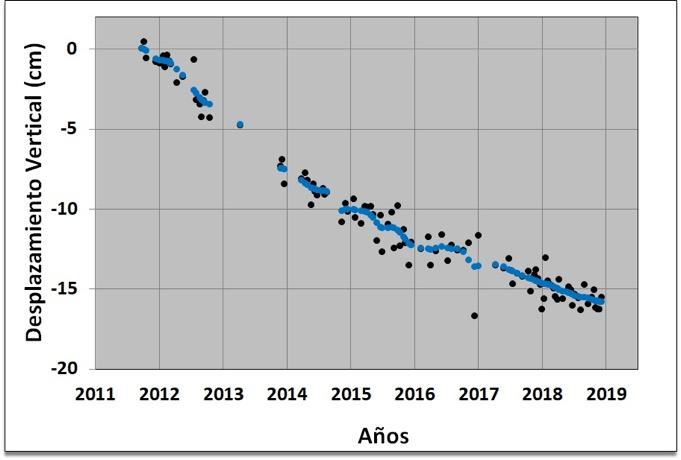

**Figura 15.** Serie de tiempo InSAR integrada con GPS correspondiente al sitio de ubicación de estación BOGT.

Como consecuencia de esta integración, el valor final del desplazamiento en la nueva serie de tiempo InSAR para este punto es ahora -15.83 cm, mayor que el valor de 12.25 cm obtenido antes de la integración.

La Figura 16 muestra el mapa de desplazamientos acumulados para la ciudad de Bogotá generado con la integración GPS-InSAR, donde se evidencian incrementos sustanciales en los valores de subsidencia respecto al mapa presentado en la Figura 9; antes de la integración con GPS, los valores de desplazamiento acumulado máximos estimados con InSAR eran 20.4 cm, y ahora, con la integración son de 24 cm.

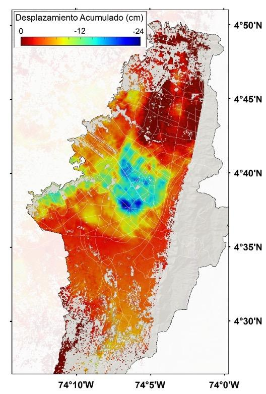

**Figura 16.** Mapa de desplazamientos verticales acumulados para el periodo septiembre de 2011 a diciembre de 2018 como resultado de la integración GPS-InSAR.

Realizada la integración de resultados GPS-InSAR, se efectuó un análisis similar para los puntos ubicados en las tres zonas diferentes, Figuras 10, 11 y 12. Así, se obtiene ahora un valor de desplazamiento acumulado hasta diciembre de 2018 para el punto 1 de -23.7 cm, -16.9 cm para el punto 2 y -5 cm para el punto 3, Figuras 17, 18 y 19 respectivamente.

**Figura 17.** Mapa de desplazamientos acumulados del punto 1 sector Puente Aranda (izquierda). Serie de tiempo del Punto 1 (derecha).

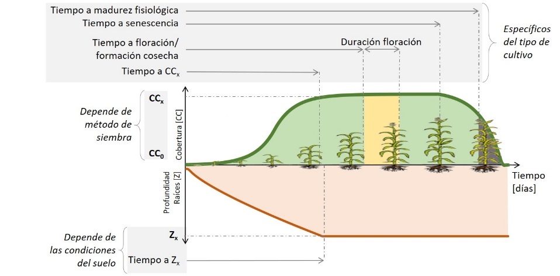

**Figura 18.** Mapa de desplazamientos acumulados del punto 2 (Normandía) (izquierda). Serie de tiempo del Punto 2, sector de Normandía (derecha).

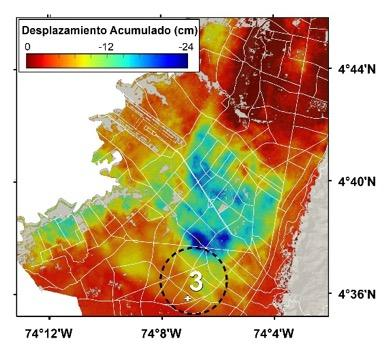 

**Figura 19.** Mapa de desplazamientos acumulados del punto 3 (La Guaca) (izquierda). Serie de tiempo del punto 3 (derecha).

<table>
<tbody>
<tr class="odd">
<td>
<strong>Caja 4. Glosario de términos de InSAR</strong>

<strong>Coherencia</strong>: coeficiente de correlación cruzada del par de imágenes SAR estimado en una pequeña ventana (pocos píxeles en rango y azimut), una vez que se compensan todos los componentes deterministas de fase.

<strong>Decorrelación</strong>: pérdida de coherencia entre un par interferométrico, lo que se traduce como ruido en la fase y afectación directa en el desarrollo de ésta.

<strong>Espectro electromagnético</strong>: Es la distribución energética del conjunto de ondas electromagnéticas, a partir de la cual se puede identificar la energía que emiten los cuerpos en virtud de su longitud de onda. Dicha distribución inicia con longitudes de onda muy cortas como los rayos gamma hasta la mayor longitud de onda que son las ondas de radio.

<strong>Fase interferométrica</strong>: medición de la posición de un punto en un momento especifico en el ciclo de la onda. El radar solo puede medir la parte del eco reflejada en la dirección de la antena (retrodispersión).

<strong>Geocodificación</strong>: corrección geométrica de la imagen y consiste en el remuestreo de la imagen teniendo en cuenta la geometría de la toma del sensor y el elipsoide de referencia.

<strong>Sensor activo</strong>: dispositivo capaz de emitir un haz energético que es posteriormente captado tras su reflexión sobre la superficie que se pretende observar. Entre ellos, el sistema más conocido es el Radar.

<strong>Sensor pasivo</strong>: plataforma que obtiene la energía electro-magnética procedente de la cobertura terrestre, sea ésta reflejada de los rayos solares o emitida en virtud de su propia temperatura.

<strong>Resolución espacial</strong>: tamaño de la mínima unidad de información incluida en una imagen denominada píxel.
</td>
</tr>
</tbody>
</table>

