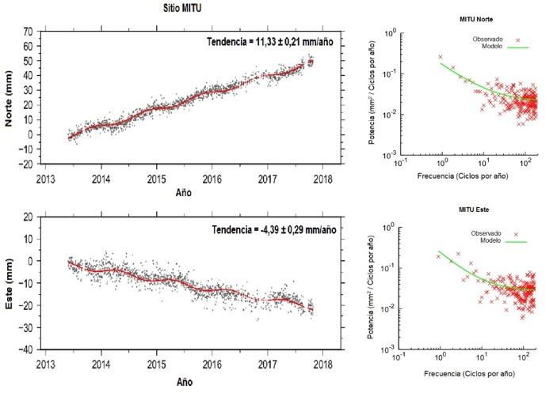
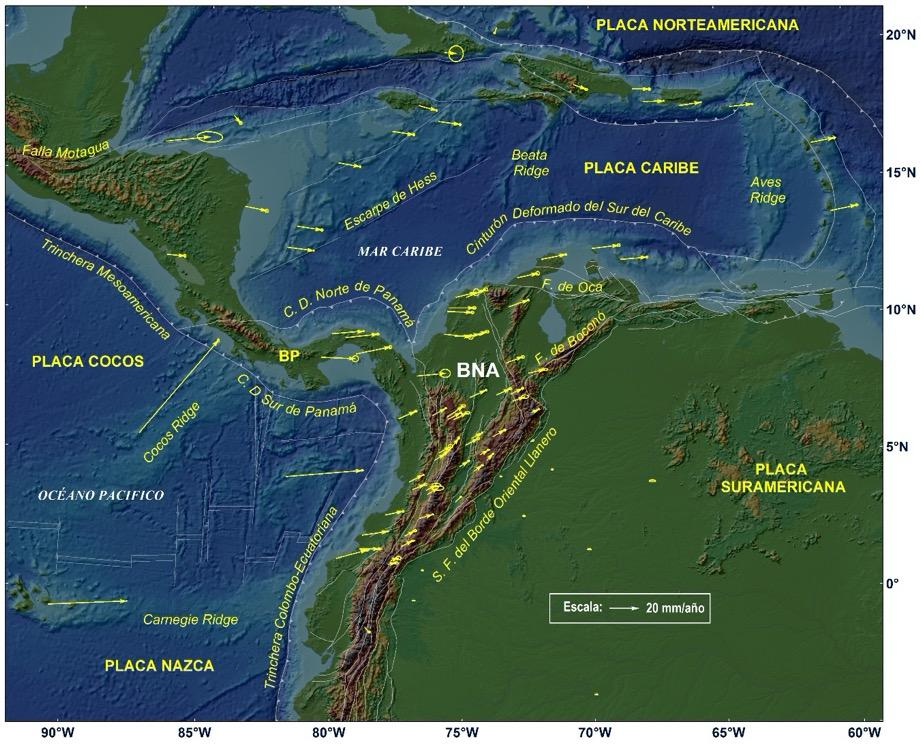
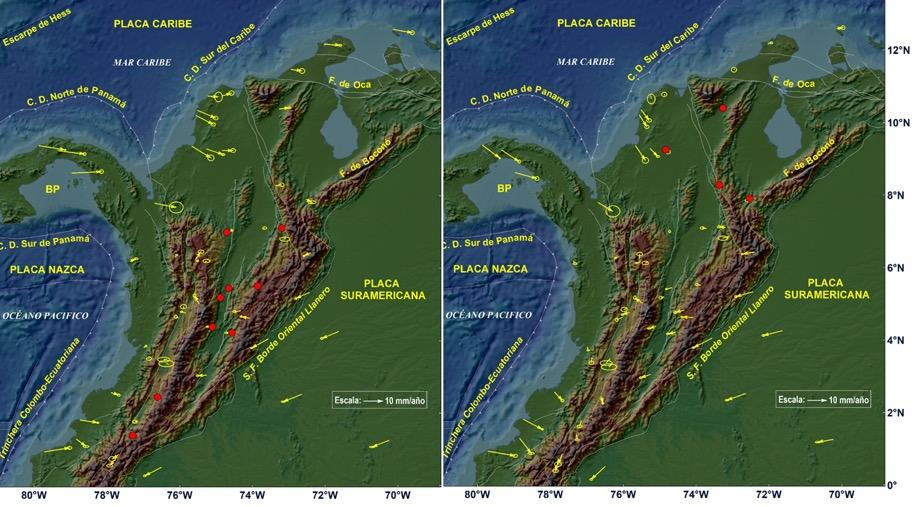

La esquina noroccidental de Suramérica y sureste de Centroamérica es una zona de alto interés científico en las geociencias donde se conjugan diferentes elementos de orden tectónico y volcánico. No hay otra parte en el mundo en la cual exista una placa tectónica mayor subduciendo por debajo de una gran placa continental a lo largo de una trinchera de casi 6,000 km, como es el caso de la subducción de la placa de Nazca por debajo de Suramérica \[2\]. Esta región se caracteriza por una directa relación de la actividad tectónica y volcánica con la interacción de las placas tectónicas de Suramérica, Nazca, Cocos y Caribe y los bloques Norte de los Andes, Maracaibo, Chocó y Panamá acuñados dentro de dichas placas, Figura 1 \[3 -15\].

**Figura 1.** Marco tectónico de la zona de estudio. Fuente del mapa: ETOPO1 \[16\].

Esta compleja tectónica dinámica e intensa deformación interplaca se manifiesta en una alta densidad de fallas, muchas de las cuales se consideran como activas o potencialmente activas. Además, la sismicidad se distribuye sobre un área que corresponde a un límite amplio que abarca el noroeste de Suramérica, Centro América y suroeste del Caribe, complejidad referida por Trenkamp \[12\] como un Margen amplio de placas. Dicha condición, junto con el potencial de ocurrencia de grandes sismos megathrust y tsunamis relacionados con la zona de subducción en el océano Pacífico, significa que un alto porcentaje de la población colombiana habita bajo una amenaza permanente de ocurrencia de sismos y tsunamis, con el potencial de causar grandes daños en términos de pérdida de vidas y destrucción de infraestructura \[17\]. Otra amenaza se asocia a los volcanes activos localizados en la región norte de los Andes, que tienen el potencial de generar erupciones devastadoras como la ocurrida en el volcán Nevado del Ruiz en noviembre 13 de 1985, el segundo peor desastre a nivel mundial de origen volcánico del siglo pasado \[18-19\].

##  Impacto de la geodesia espacial GNSS con propósitos científicos

Dada la complejidad de la región y la potencialidad de ocurrencia de grandes sismos y tsunamis así como de erupciones volcánicas entre otros eventos de origen geológico, se requiere adelantar un estudio sistemático para determinar la actual situación de la deformación de la corteza terrestre. Hay una conciencia creciente a nivel mundial acerca de la valiosa contribución de la geodesia espacial para la observación detallada, análisis y comprensión de la cinemática de la corteza terrestre en regiones tectónicamente activas. Los estudios geodésicos espaciales son ahora el principal método para el estudio de la cinemática en los límites de placas en la superficie terrestre; las mediciones geodésicas espaciales se estiman en virtud de un marco global de referencia, lo cual permite medir los movimientos en los límites de placas así como los movimientos relativos globales al interior de las placas \[20\]. Así, las redes integradas GPS/GNSS suministran un excelente marco de referencia para el estudio de los procesos tanto en la tierra sólida como en la tierra atmosférica, a escalas globales, regionales y locales. La posición de las estaciones geodésicas a través del tiempo permite generar campos de velocidad para constreñir modelos de bloques cinemáticos y de zonas de deformación en límites de placas \[21\].

A pesar de las limitaciones espaciales debido a la cobertura incompleta de redes nacionales GPS/GNSS, algunas redes en Suramérica contribuyen en la investigación sistemática de la magnitud y variabilidad espacial del acoplamiento interplaca, así como de la liberación episódica y asísmica de energía relacionada a fallas \[22\]. Estas observaciones permiten un mejor entendimiento de la mecánica de procesos que gobiernan el comportamiento de sistemas de fallas. Las redes GPS/GNSS permanentes y en tiempo real tienen además el gran potencial de suministrar datos del movimiento de fallas individuales, que junto con resultados neotectónicos y paleosismológicos, constituyen un insumo esencial para la evaluación del potencial sismogénico de fallas, mencionado por Barka y Reilinger \[23\], y Blewitt \[24\], entre varios autores. Hay también muchos estudios que han demostrado la utilidad de redes geodésicas regionales para analizar límites de colisión y la cinemática de la deformación en la parte superior de placas, como los realizados por Sagiya \[25\] en Japón, y Wallace \[26- 27\] en Nueva Zelanda, entre otros.

<table>
<tbody>
<tr class="odd">
<td>
<strong>Caja 1. Términos comunes en geodesia espacial GNSS de posicionamiento</strong>

<strong>BEIDOU:</strong> sistema de navegación por satélite desarrollado por China.

<strong>CORS:</strong> estación geodésica GPS/GNSS de referencia de operación continua.

<strong>GALILEO:</strong> sistema europeo de radionavegación y posicionamiento por satélite desarrollado por la Unión Europea mediante operación de la Agencia Espacial Europea.

<strong>GIPSY-OASIS</strong>: (<strong>G</strong>NSS-<strong>I</strong>nferred <strong>P</strong>ositioning <strong>Sy</strong>stem and <strong>O</strong>rbit <strong>A</strong>nalysis <strong>Si</strong>mulation <strong>S</strong>oftware), software científico desarrollado por JPL-NASA de Estados Unidos.

<strong>GLONASS:</strong> sistema de posicionamiento y navegación por satélite desarrollado por la Unión Soviética y administrado en la actualidad por la Federación Rusa.

<strong>GNSS:</strong> (Global Navigation Satellite System). Constelación de satélites que transmite señales de radio utilizadas para posicionamiento y localización en cualquier parte del mundo. En la actualidad, solo los sistemas GPS y GLONASS forman parte del concepto de GNSS. En un futuro cercano, GALILEO y BEIDOU serán parte integrante de este concepto.

<strong>GPS:</strong> Sistema de Posicionamiento Global de Estados Unidos.

<strong>IERS</strong>: Servicio Internacional de Rotación de la Tierra y Sistemas de referencia.

<strong>IGS:</strong> Servicio Internacional GNSS.

<strong>ITRF:</strong> Marco Internacional Terrestre de Referencia.

<strong>PPP:</strong> Punto preciso de posicionamiento.

<strong>RINEX:</strong> formato universal de intercambio de datos GNSS independiente del receptor.

<strong>TEQC:</strong> herramienta desarrollada por UNAVCO para conversión, edición y análisis de calidad de datos GNSS.

<strong>UNAVCO:</strong> University NAVSTAR Consortium. Consorcio sin ánimo de lucro creado para facilitar la investigación y educación en geodesia.
</td>
</tr>
</tbody>
</table>

## Geodesia espacial GPS en Colombia con propósitos geodinámicos

Colombia empezó en 1988 a incursionar en la aplicación de geodesia espacial GPS con el proyecto internacional CASA (Central And South America GPS Project), en el cual científicos de más de 25 organizaciones y 13 países cooperaron en el entonces proyecto más grande de GPS en el mundo, patrocinado por National Science Foundation-NSF y la Agencia Espacial-NASA de Estados Unidos junto con las instituciones de cada uno de los países participantes, el cual permitió establecer una red de estaciones de campo de ocupación episódica en Costa Rica, Panamá, Venezuela, Ecuador y Colombia \[28\]. Colombia fue el centro de las campañas de campo en el norte de los Andes; la participación entusiasta del entonces INGEOMINAS, hoy Servicio Geológico Colombiano, con logística, entrenamiento y personal fue la clave del éxito del proyecto.

Un hecho significativo en el desarrollo de la red geodésica con propósitos geodinámicos en Colombia, lo constituye la instalación el 4 de noviembre de 1994 en Bogotá, mediante convenio con la agencia espacial estadounidense NASA, de la primera estación GPS permanente de operación continua en Colombia, denominada BOGT, como parte de la entonces iniciativa Laboratorios Fiduciales para una Red Internacional Científica (FLINN, de sus siglas en inglés), que hoy constituye la Red Global de Observación GNSS operada por el IGS \[29\].

A la terminación del proyecto CASA, el entonces INGEOMINAS comenzó anualmente un proceso sistemático de construcción de estaciones de campo para ampliar la cobertura de la red CASA. En el año 2003, un conjunto de 36 sitios GPS se seleccionaron para toma de datos dentro del marco de un proyecto geológico y geofísico para entender el estado de los esfuerzos y la deformación neotectónica en la región central del Valle del Cauca y la ciudad de Cali, y determinar la amenaza sísmica potencial de Cali y áreas adyacentes \[30\].

En la actualidad, los resultados de la implementación de redes de estaciones GPS/GNSS permanentes de operación continua en Colombia y regiones vecinas ha comenzado a contribuir en el entendimiento de los procesos dinámicos en la corteza terrestre, que ocurren como consecuencia de la interacción de las placas tectónicas en la esquina noroccidental de Suramérica y sureste de Centro América, permitiendo el monitoreo de la deformación elástica de la corteza, el modelamiento de procesos de acoplamiento intersísmico de placas a lo largo de la interfase de la subducción, y la estimación de la acumulación de deformación a lo largo de fallas de corteza. Durante los últimos 12 años, los esfuerzos en Colombia se han orientado al diseño e instalación de una red con propósitos geodinámicos, conocida como GeoRED (acrónimo de Geodesia: Red de Estudios de Deformación), y el proceso gradual de obtención de datos permite generar un campo de velocidades, el cual registra la tectónica de escape del Bloque Norte de los Andes \[31\]. Varias redes compuestas por diversos tipos de instrumentación se han instalado con el fin de entender la dinámica de la corteza terrestre en Colombia \[32\], siendo la más reciente la Red Nacional de Estaciones Geodésicas GPS/GNSS con propósitos geodinámicos, instalándose la primera estación en febrero de 2008.

GeoRED es un proyecto de investigación y desarrollo basado en tecnología geodésica espacial para estudiar la geodinámica en el noroeste de Suramérica. GeoRED, que tiene como propósito principal mejorar la capacidad técnica, científica y operacional en Colombia para el análisis e interpretación del estado actual de deformación de la corteza en Colombia usando tecnología geodésica GNSS \[33\] es ejecutado por el Grupo Investigaciones Geodésicas Espaciales-GIGE de la Dirección de Geoamenazas del Servicio Geológico Colombiano. GeoRED se compone por dos sub-redes: la primera, por estaciones permanentes de operación continua (CORS), y la segunda, por estaciones geodésicas de ocupación episódica bajo la modalidad de campañas de campo. Es importante señalar que la entidad, a través de los observatorios vulcanológicos y sismológicos establecidos en las ciudades de Manizales, Popayán y Pasto, también han desplegado redes de estaciones geodésicas GNSS para el monitoreo y estudio de la deformación volcánica, empleando algunas de las estaciones de GeoRED como estaciones de referencia \[34\].

##  Datos y procesamiento

El Centro Regional de Procesamiento de Datos GNSS del GIGE procesa en la actualidad más de 180 estaciones permanentes de operación continua localizadas en Colombia, Ecuador, Venezuela, Panamá, Costa Rica, en algunos países de Centro América y de la región Caribe. Los datos de los otros países se obtienen mediante intercambio de datos, o del proyecto COCONet (Continuously Operating Caribbean GPS Observational Network), el cual surgió a raíz de la ocurrencia del sismo de Haití de magnitud 7 en enero de 2010, que ocasionó más de 300 mil víctimas \[35\]. Este proyecto, patrocinado por NSF, se concibió con el fin de implementar una infraestructura geodésica y meteorológica de última generación en el Caribe, que sirviera además como plataforma para establecer alianzas internacionales para aplicaciones científicas y sociales \[36, 37\]. Bajo este proyecto, se instalaron cuatro estaciones en Colombia, las cuales se integraron a GeoRED; además, se actualizó la estación SAN0 de la isla de San Andrés, la cual se instaló en diciembre de 2007 mediante convenio con UCAR (University Corporation for Atmospheric Research) de Estados Unidos.

Los datos de las estaciones se convirtieron del formato propio de cada receptor a archivos del formato universal RINEX empleando la herramienta TEQC (Translating, Editing, Quality Check) desarrollada por UNAVCO \[38\], los cuales se procesaron con el software científico GIPSY-OASIS II v. 6.3, desarrollado por JPL (Jet Propulsion Laboratory) de CALTECH (California Institute of Technology) \[39, 40\], diseñado para aplicaciones geodésicas de alta precisión. Las coordenadas de cada estación, obtenidas diariamente usando la estrategia de procesamiento conocida como PPP (Precise Point Positioning), se calcularon en un marco no-fiducial y transformadas al marco internacional terrestre de referencia ITRF2008 (International Terrestrial Reference Frame) \[41, 42\]. Posteriormente, las posiciones diarias X, Y, Z se transformaron en coordenadas topocéntricas, lo cual permite expresar los cambios de las coordenadas diarias en cada estación en términos de desplazamientos locales en las componentes Norte, Este y Vertical (N, E, U) con respecto a una posición en una época inicial.

<table>
<tbody>
<tr class="odd">
<td>
<strong>Caja 2. Conceptos fundamentales en geodesia aplicada en geodinámica</strong>

Un <strong>Sistema Terrestre de Referencia-TRS</strong> (por sus siglas en inglés) es un sistema de referencia espacial co-rotante con la Tierra en su movimiento diurno en el espacio. Así, las posiciones de los puntos anclados a la superficie sólida de la Tierra tienen coordenadas que experimentan solo pequeñas variaciones en el tiempo debido a efectos geofísicos tales como deformaciones de orden tectónico o debido a las mareas.

Un <strong>Marco de Referencia Terrestre-TRF</strong> (por sus siglas en inglés) se define como la realización del TRS a través de su origen ejes de orientación y escala, así como su evolución temporal. El término realización significa que se obtiene por un conjunto de puntos físicamente establecidos con coordenadas determinadas con precisión expresadas en un sistema de coordenadas específico como realización de un TRS [43]. Así, un TRF es un marco de referencia global, geocéntrico, basado en el empleo de técnicas geodésicas espaciales diferentes tales como GPS, VLBI, SLR y DORIS, y ser tridimensional y dinámico.

El <strong>Marco Internacional Terrestre de Referencia-ITRF</strong> (por sus siglas en inglés) es la referencia que permite cuantificar, mediante técnicas geodésicas espaciales, la deformación observada en la Tierra. Corresponde a una iniciativa global liderada por el IERS (Servicio Internacional de Rotación y Sistemas de Referencia de la Tierra, de sus siglas en inglés), que realiza la actualización de los TRF a través del tiempo considerando diferentes fenómenos geodinámicos tales como los movimientos de las placas, entre otros.

El <strong>Polo de Euler</strong> es un teorema empleado para entender los movimientos de placas o bloques tectónicos, en el cual se establece que cualquier movimiento de un cuerpo rígido en la superficie de una esfera puede representarse como una rotación sobre un polo denominado Polo de Euler. Dichos movimientos se observan en la actualidad mediante estaciones GPS.
</td>
</tr>
</tbody>
</table>

Para el procesamiento se emplearon productos de órbitas finales JPL-NASA v2.1, que incluyen órbitas de los satélites, parámetros de relojes de los satélites y de orientación de la Tierra, offsets del centro de fase de la antena del satélite, y se suministran en formatos nativos para GIPSY. Como la troposfera en los últimos 10 km retarda las señales emitidas por los satélites GNSS, los modelos numéricos de clima son una importante fuente de datos para el modelamiento de las fuentes de error en posicionamiento geodésico, mejorando la exactitud en el análisis de las observaciones geodésicas. Así, se emplearon las Funciones de Mapeo de Viena (VMF1), que es la actualización del modelo previo VMF \[44\]; las correcciones se obtuvieron de la Universidad Tecnológica de Viena \[45\]. Se aplicaron además modelos de correcciones de carga oceánica para remover la carga de mareas tanto en la tierra sólida como en el océano, empleando el modelo GOT4.8 (Goddard Ocean Tide), derivado de datos de altimetría de las misiones satelitales TOPEX/Poseidon, Jason-1, ERS y GFO \[46\], OSO \[47\].

Las series de tiempo de los datos GPS se generaron mediante el empleo del software HECTOR \[48\], desarrollado por SEGAL (Space & Earth Geodetic Analysis Laboratory, University of Beira Interior, Portugal), que permite estimar la tendencia lineal en series de tiempo con ruido temporal correlacionado. A cada serie de tiempo se le aplicó el modelo de ruido combinado de ley de potencia + ruido blanco; el modelo de ruido de ley de potencia es el más popular para las series de tiempo GNSS. Para verificar que el modelo estimado corresponde al más adecuado, se generaron diagramas de densidad espectral de potencia que permiten analizar los residuos de los valores observados con respecto al modelo empleado en la serie de tiempo, y su comportamiento con respecto a la frecuencia. Se tuvo en cuenta además la señal estacional anual, así como los *offsets* instrumentales debido a factores tales como cambio de instrumental GNSS, como antena y/o receptor, actualización de firmware, reorientación de antena. Para el tratamiento de datos atípicos o *outliers* se usó el rango intercuartil 3.0 \[49\], con el objeto de reducir su influencia en la estimación de las velocidades. Se usó como época de referencia enero 1 de 2010 para todas las estimaciones en lugar del punto medio de cada serie de tiempo individual.

La Figura 2 muestra ejemplos de series de tiempo y los correspondientes diagramas de densidad espectral de potencia para dos estaciones GPS de GeoRED, denominadas MITU y UWAS. La estación MITU (Vaupés) ha operado ininterrumpidamente desde su fecha de instalación. Por su parte, la estación UWAS (Guicán, Boyacá) señala con la línea azul, la interrupción en la obtención de los datos y la afectación (*offset*) en el comportamiento de las componentes debido tanto al cambio de la antena GPS así como a problemas en su operación. Todos estos factores se evaluaron para generar una serie de tiempo confiable, y así obtener un vector de velocidad coherente con los datos. En los dos casos, los errores en las estimaciones de las velocidades son iguales o menores a 0.23 mm/año, indicando la bondad de cada estación, lo cual es posible de obtenerse mediante adecuada monumentación de la antena y prolongados tiempos de observación.

**Figura 2.** Series de tiempo GPS y diagramas de densidad espectral de las estaciones MITU (A) y UWAS (B). El término *cpy* en la frecuencia significa ciclos por año.

A partir de las series de tiempo con observaciones hasta finales de 2017 superiores a 2.5 años \[50\], se realizó la estimación de las velocidades geodésicas horizontales con respecto al marco de referencia ITRF2008 \[51\].

##  Resultados

El uso de datos de estaciones geodésicas permanentes permite estudiar procesos de deformaciones transitorias, así como aquellos asociados a actividad sismotectónica y otros tipos de señales geofísicas. Esto es posible a partir de las soluciones diarias de las estaciones permanentes, que permiten obtener una estimación más precisa de las tasas de deformación que aquellas obtenidas con mediciones episódicas mediante la ejecución de campañas de campo \[52\]. Cuando por condiciones de seguridad no es posible la instalación de estaciones permanentes, las estaciones de campo son esenciales en el estudio de la cinemática de fallas, con arreglos geométricos acordes con el tipo de análisis que se requiere obtener, complementando la información obtenida con estaciones permanentes.

Mora-Páez et al. \[53\] realizaron la estimación de vectores de velocidad geodésica con respecto a Suramérica empleando datos obtenidos hasta marzo 31 de 2016 en 60 estaciones permanentes instaladas en Colombia y países vecinos, 46 de ellas localizadas en nuestro país. En esta ocasión, se emplean datos obtenidos hasta finales del 2017 en 86 estaciones geodésicas permanentes de operación continua para estimar las velocidades geodésicas con respecto a Suramérica siguiendo el procedimiento establecido por Mora-Páez et al. \[53\]. Los resultados presentados en este artículo, Figura 3, Tabla 1, corresponden a una solución más robusta, con mayor número de estaciones en una distribución espacial más amplia y mayor tiempo de observación en las estaciones, de velocidades de estaciones localizadas en Colombia (57), Ecuador (6), Panamá (4), Costa Rica (1), Honduras (2) y Nicaragua (2), así como en algunos países del Caribe (14), lo que permite tener un mejor panorama del contexto geodinámico de la región.

De la Figura 3 se puede observar la subducción oblicua de la placa de Nazca, representada en el movimiento hacia el este de dos estaciones GPS, localizadas en las islas de Galápagos (Ecuador) y Malpelo (Colombia). El Bloque Norte de los Andes-BNA, definido originalmente por \[5\], se limita por la trinchera colombo-ecuatoriana y el bloque de Panamá al oeste, el Cinturón Deformado del Caribe Sur al norte, y las zonas del Borde Oriental Llanero y Falla de Boconó al este.

**Figura 3.** Mapa de velocidades geodésicas de la zona de estudio con respecto a Suramérica, expresadas en ITRF2008.

Dentro del BNA, los vectores de velocidad de las estaciones GPS localizadas en la costa ecuatoriana y colombiana del océano Pacífico, al sur de la latitud 3°N, muestran magnitudes mayores que los obtenidos en las estaciones localizadas al interior del continente, y una tendencia general este-noreste. Por consiguiente, los vectores de velocidad de las estaciones localizadas al sur de 3° de latitud representan acumulación de deformación en la trinchera colombo-ecuatoriana de la placa de Nazca, que implica contracción normal al margen a lo largo de la zona de subducción, lo cual permite concluir que esta zona es potencialmente generadora de sismos representativos, tal como ocurrió en el pasado con los eventos de 1906, 1942, 1958 y 1979, y el más reciente en Ecuador en el 2016, similar al evento de 1942 \[54\]. Sagiya y Mora-Páez \[55\] realizaron análisis de la inversión de la tasa de variación de la longitud de las líneas base entre estaciones GPS a lo largo de la costa de Colombia y Ecuador, concluyendo que las regiones fuentes de los sismos de 1942 y 1958 están casi completamente bloqueadas, resultado preliminar que requiere más estudios.

Por su parte, las estaciones localizadas dentro del BNA entre las latitudes 3°N y 7.5°N muestran tendencia general hacia el noreste, y a partir de esta latitud, una tendencia predominante hacia el este, similar a lo expuesto por Mora-Páez et al. \[53\]. A su vez, las velocidades de las estaciones localizadas en el Bloque de Panamá-BP indican colisión con el Bloque Norte de los Andes, mientras que las estaciones GPS ubicadas en la placa Caribe presentan una dirección general hacia el este-sureste con respecto a Suramérica.

**Tabla 1.** Velocidades con respecto a Suramérica expresadas en ITRF2008.

<table>
<thead>
<tr class="header">
<th><strong>Estación</strong></th>
<th>
<strong>Longitud</strong>

<strong>(grados)</strong>
</th>
<th>
<strong>Latitud</strong>

<strong>(grados)</strong>
</th>
<th>
<strong>Vel E</strong>

<strong>(mm/año)</strong>
</th>
<th>
<strong>Vel (N)</strong>

<strong>(mm/año)</strong>
</th>
<th>
<strong>Sig (E)</strong>

<strong>(mm)</strong>
</th>
<th>
<strong>Sig (N)</strong>

<strong>(mm)</strong>
</th>
</tr>
</thead>
<tbody>
<tr class="odd">
<td>ABMF</td>
<td>-61.527535</td>
<td>16.262305</td>
<td>16.4</td>
<td>3.3</td>
<td>0.7</td>
<td>0.5</td>
</tr>
<tr class="even">
<td>ACP1</td>
<td>-79.949858</td>
<td>9.371392</td>
<td>22.1</td>
<td>1.8</td>
<td>0.3</td>
<td>0.3</td>
</tr>
<tr class="odd">
<td>ACP6</td>
<td>-79.407822</td>
<td>9.238476</td>
<td>22.1</td>
<td>2.3</td>
<td>0.6</td>
<td>0.6</td>
</tr>
<tr class="even">
<td>AJCM</td>
<td>-74.884547</td>
<td>5.210409</td>
<td>8.8</td>
<td>4.7</td>
<td>0.8</td>
<td>0.6</td>
</tr>
<tr class="odd">
<td>ALPA</td>
<td>-72.917755</td>
<td>11.527983</td>
<td>14.3</td>
<td>3.2</td>
<td>1.1</td>
<td>1.0</td>
</tr>
<tr class="even">
<td>ANCH</td>
<td>-76.870138</td>
<td>3.534661</td>
<td>9.1</td>
<td>3.6</td>
<td>1.0</td>
<td>0.7</td>
</tr>
<tr class="odd">
<td>AUCA</td>
<td>-76.882732</td>
<td>-0.640818</td>
<td>1.7</td>
<td>-0.2</td>
<td>0.5</td>
<td>0.2</td>
</tr>
<tr class="even">
<td>BAAP</td>
<td>-73.554010</td>
<td>4.071802</td>
<td>0.1</td>
<td>-0.7</td>
<td>0.6</td>
<td>0.3</td>
</tr>
<tr class="odd">
<td>BACO</td>
<td>-75.691927</td>
<td>9.402437</td>
<td>18.4</td>
<td>-2.0</td>
<td>1.3</td>
<td>1.2</td>
</tr>
<tr class="even">
<td>BAME</td>
<td>-74.565083</td>
<td>4.235596</td>
<td>5.9</td>
<td>4.0</td>
<td>0.7</td>
<td>0.3</td>
</tr>
<tr class="odd">
<td>BAPA</td>
<td>-74.657507</td>
<td>5.466415</td>
<td>7.6</td>
<td>4.2</td>
<td>0.4</td>
<td>0.3</td>
</tr>
<tr class="even">
<td>BARU</td>
<td>-75.589981</td>
<td>10.257608</td>
<td>17.7</td>
<td>-0.7</td>
<td>0.9</td>
<td>0.7</td>
</tr>
<tr class="odd">
<td>BASO</td>
<td>-77.393229</td>
<td>6.202969</td>
<td>11.9</td>
<td>5.3</td>
<td>0.8</td>
<td>0.4</td>
</tr>
<tr class="even">
<td>BOBG</td>
<td>-73.357552</td>
<td>8.312444</td>
<td>11.9</td>
<td>4.4</td>
<td>0.9</td>
<td>0.7</td>
</tr>
<tr class="odd">
<td>BOGT</td>
<td>-74.080937</td>
<td>4.640073</td>
<td>4.4</td>
<td>4.8</td>
<td>0.5</td>
<td>0.3</td>
</tr>
<tr class="even">
<td>BUGT</td>
<td>-76.995796</td>
<td>3.825685</td>
<td>9.9</td>
<td>4.7</td>
<td>0.5</td>
<td>0.3</td>
</tr>
<tr class="odd">
<td>CAPI</td>
<td>-72.427755</td>
<td>5.351423</td>
<td>1.8</td>
<td>0.9</td>
<td>0.5</td>
<td>0.4</td>
</tr>
<tr class="even">
<td>CAYS</td>
<td>-79.846118</td>
<td>15.795140</td>
<td>15.2</td>
<td>-2.8</td>
<td>0.4</td>
<td>0.5</td>
</tr>
<tr class="odd">
<td>CCAN</td>
<td>-76.299870</td>
<td>3.360122</td>
<td>7.4</td>
<td>4.4</td>
<td>3.2</td>
<td>1.3</td>
</tr>
<tr class="even">
<td>CIA1</td>
<td>-76.357424</td>
<td>3.505288</td>
<td>7.1</td>
<td>3.7</td>
<td>2.5</td>
<td>1.0</td>
</tr>
<tr class="odd">
<td>CIOH</td>
<td>-75.533882</td>
<td>10.390817</td>
<td>17.9</td>
<td>0.1</td>
<td>1.0</td>
<td>0.7</td>
</tr>
<tr class="even">
<td>CN05</td>
<td>-68.359391</td>
<td>18.563901</td>
<td>12.2</td>
<td>0.0</td>
<td>0.6</td>
<td>0.6</td>
</tr>
<tr class="odd">
<td>CN06</td>
<td>-70.656108</td>
<td>18.789824</td>
<td>9.0</td>
<td>-3.4</td>
<td>0.8</td>
<td>0.6</td>
</tr>
<tr class="even">
<td>CN10</td>
<td>-75.970551</td>
<td>17.415190</td>
<td>15.1</td>
<td>-2.0</td>
<td>0.5</td>
<td>0.7</td>
</tr>
<tr class="odd">
<td>CN11</td>
<td>-77.784116</td>
<td>17.021179</td>
<td>15.2</td>
<td>-2.3</td>
<td>0.6</td>
<td>0.6</td>
</tr>
<tr class="even">
<td>CN12</td>
<td>-76.749050</td>
<td>18.004481</td>
<td>12.3</td>
<td>-3.3</td>
<td>0.2</td>
<td>0.6</td>
</tr>
<tr class="odd">
<td>CN14</td>
<td>-73.677948</td>
<td>20.975328</td>
<td>-1.5</td>
<td>-3.9</td>
<td>0.5</td>
<td>0.5</td>
</tr>
<tr class="even">
<td>CN18</td>
<td>-83.944310</td>
<td>17.407672</td>
<td>4.5</td>
<td>-5.2</td>
<td>0.7</td>
<td>0.9</td>
</tr>
<tr class="odd">
<td>CN19</td>
<td>-70.048500</td>
<td>12.611848</td>
<td>18.7</td>
<td>2.2</td>
<td>0.8</td>
<td>0.8</td>
</tr>
<tr class="even">
<td>CN28</td>
<td>-79.033718</td>
<td>8.625063</td>
<td>24.0</td>
<td>4.8</td>
<td>0.8</td>
<td>0.8</td>
</tr>
<tr class="odd">
<td>CN29</td>
<td>-83.374636</td>
<td>14.048796</td>
<td>15.2</td>
<td>-3.2</td>
<td>0.9</td>
<td>0.9</td>
</tr>
<tr class="even">
<td>CN33</td>
<td>-80.326666</td>
<td>8.487239</td>
<td>23.6</td>
<td>-1.1</td>
<td>1.8</td>
<td>1.7</td>
</tr>
<tr class="odd">
<td>CN35</td>
<td>-81.362919</td>
<td>13.375495</td>
<td>17.2</td>
<td>-2.7</td>
<td>0.7</td>
<td>0.6</td>
</tr>
<tr class="even">
<td>CN37</td>
<td>-75.263173</td>
<td>10.792576</td>
<td>14.3</td>
<td>3.5</td>
<td>1.6</td>
<td>2.0</td>
</tr>
<tr class="odd">
<td>CN38</td>
<td>-71.988025</td>
<td>12.221821</td>
<td>17.0</td>
<td>3.4</td>
<td>0.6</td>
<td>0.4</td>
</tr>
<tr class="even">
<td>CN40</td>
<td>-68.958013</td>
<td>12.180043</td>
<td>18.3</td>
<td>1.6</td>
<td>0.7</td>
<td>0.6</td>
</tr>
<tr class="odd">
<td>CN47</td>
<td>-60.940494</td>
<td>13.710786</td>
<td>18.4</td>
<td>4.0</td>
<td>0.8</td>
<td>0.5</td>
</tr>
<tr class="even">
<td>COEC</td>
<td>-77.786983</td>
<td>0.716067</td>
<td>6.1</td>
<td>1.0</td>
<td>1.2</td>
<td>0.6</td>
</tr>
<tr class="odd">
<td>CORO</td>
<td>-75.287853</td>
<td>9.328087</td>
<td>17.3</td>
<td>1.1</td>
<td>0.7</td>
<td>0.4</td>
</tr>
<tr class="even">
<td>CRO1</td>
<td>-64.584317</td>
<td>17.756898</td>
<td>16.1</td>
<td>1.9</td>
<td>0.4</td>
<td>0.3</td>
</tr>
<tr class="odd">
<td>CUC1</td>
<td>-72.512812</td>
<td>7.932275</td>
<td>11.8</td>
<td>2.5</td>
<td>1.6</td>
<td>0.6</td>
</tr>
<tr class="even">
<td>ESMR</td>
<td>-79.724371</td>
<td>0.934648</td>
<td>21.7</td>
<td>6.0</td>
<td>1.0</td>
<td>0.6</td>
</tr>
<tr class="odd">
<td>GLPS</td>
<td>-90.303667</td>
<td>-0.742999</td>
<td>54.9</td>
<td>2.2</td>
<td>0.2</td>
<td>0.2</td>
</tr>
<tr class="even">
<td>GUAP</td>
<td>-77.894678</td>
<td>2.574479</td>
<td>12.7</td>
<td>2.7</td>
<td>0.6</td>
<td>0.5</td>
</tr>
<tr class="odd">
<td>INRI</td>
<td>-75.897181</td>
<td>4.908586</td>
<td>8.6</td>
<td>4.9</td>
<td>1.3</td>
<td>0.9</td>
</tr>
<tr class="even">
<td>INTO</td>
<td>-76.042778</td>
<td>4.642218</td>
<td>7.4</td>
<td>4.6</td>
<td>0.7</td>
<td>0.6</td>
</tr>
<tr class="odd">
<td>ISCO</td>
<td>-87.055829</td>
<td>5.544342</td>
<td>55.1</td>
<td>64.1</td>
<td>0.6</td>
<td>0.8</td>
</tr>
<tr class="even">
<td>MALO</td>
<td>-81.606138</td>
<td>4.003245</td>
<td>53.2</td>
<td>4.2</td>
<td>0.7</td>
<td>0.3</td>
</tr>
<tr class="odd">
<td>MANA</td>
<td>-86.248991</td>
<td>12.148939</td>
<td>12.5</td>
<td>-1.2</td>
<td>0.6</td>
<td>0.8</td>
</tr>
<tr class="even">
<td>MECE</td>
<td>-73.712014</td>
<td>7.107247</td>
<td>9.6</td>
<td>4.5</td>
<td>0.9</td>
<td>0.5</td>
</tr>
<tr class="odd">
<td>MIPR</td>
<td>-66.526960</td>
<td>17.886223</td>
<td>15.1</td>
<td>2.2</td>
<td>0.3</td>
<td>0.2</td>
</tr>
<tr class="even">
<td>MITU</td>
<td>-70.232124</td>
<td>1.260781</td>
<td>-0.1</td>
<td>0.5</td>
<td>1.1</td>
<td>0.3</td>
</tr>
<tr class="odd">
<td>MOPR</td>
<td>-67.931152</td>
<td>18.076898</td>
<td>14.5</td>
<td>0.6</td>
<td>0.2</td>
<td>0.2</td>
</tr>
<tr class="even">
<td>MZAL</td>
<td>-75.470523</td>
<td>5.029994</td>
<td>6.3</td>
<td>8.4</td>
<td>0.6</td>
<td>0.7</td>
</tr>
<tr class="odd">
<td>OCEL</td>
<td>-71.615810</td>
<td>4.271182</td>
<td>0.0</td>
<td>0.4</td>
<td>0.6</td>
<td>0.4</td>
</tr>
<tr class="even">
<td>PAL1</td>
<td>-73.189135</td>
<td>7.136240</td>
<td>8.5</td>
<td>4.2</td>
<td>0.6</td>
<td>0.5</td>
</tr>
<tr class="odd">
<td>PASI</td>
<td>-76.499398</td>
<td>0.512778</td>
<td>0.2</td>
<td>-0.4</td>
<td>0.6</td>
<td>0.4</td>
</tr>
<tr class="even">
<td>POVA</td>
<td>-76.614742</td>
<td>2.449089</td>
<td>9.5</td>
<td>2.8</td>
<td>0.5</td>
<td>0.3</td>
</tr>
<tr class="odd">
<td>PUIN</td>
<td>-67.903339</td>
<td>3.851199</td>
<td>0.6</td>
<td>-0.1</td>
<td>1.8</td>
<td>0.5</td>
</tr>
<tr class="even">
<td>QUIL</td>
<td>-77.290947</td>
<td>1.393925</td>
<td>8.4</td>
<td>4.0</td>
<td>1.0</td>
<td>0.3</td>
</tr>
<tr class="odd">
<td>RIOP</td>
<td>-78.651105</td>
<td>-1.650595</td>
<td>3.3</td>
<td>-3.2</td>
<td>0.7</td>
<td>0.5</td>
</tr>
<tr class="even">
<td>ROA0</td>
<td>-86.526839</td>
<td>16.318152</td>
<td>30.8</td>
<td>2.9</td>
<td>7.0</td>
<td>2.9</td>
</tr>
<tr class="odd">
<td>SAN0</td>
<td>-81.715720</td>
<td>12.580450</td>
<td>18.4</td>
<td>-2.5</td>
<td>0.4</td>
<td>0.3</td>
</tr>
<tr class="even">
<td>SCUB</td>
<td>-75.762315</td>
<td>20.012063</td>
<td>8.1</td>
<td>-0.6</td>
<td>4.1</td>
<td>4.5</td>
</tr>
<tr class="odd">
<td>SEL1</td>
<td>-75.529123</td>
<td>6.190869</td>
<td>8.9</td>
<td>4.7</td>
<td>0.5</td>
<td>0.3</td>
</tr>
<tr class="even">
<td>SNLR</td>
<td>-78.847003</td>
<td>1.292516</td>
<td>13.8</td>
<td>0.1</td>
<td>1.2</td>
<td>0.4</td>
</tr>
<tr class="odd">
<td>TICU</td>
<td>-69.939384</td>
<td>-4.187084</td>
<td>-0.3</td>
<td>0.1</td>
<td>0.8</td>
<td>0.2</td>
</tr>
<tr class="even">
<td>TONE</td>
<td>-76.139307</td>
<td>6.324426</td>
<td>9.5</td>
<td>5.2</td>
<td>0.5</td>
<td>0.3</td>
</tr>
<tr class="odd">
<td>TUCO</td>
<td>-78.747701</td>
<td>1.814852</td>
<td>17.9</td>
<td>2.6</td>
<td>0.5</td>
<td>0.3</td>
</tr>
<tr class="even">
<td>UNME</td>
<td>-75.577110</td>
<td>6.263983</td>
<td>11.5</td>
<td>8.0</td>
<td>1.2</td>
<td>0.7</td>
</tr>
<tr class="odd">
<td>UWAS</td>
<td>-72.391332</td>
<td>6.450714</td>
<td>5.3</td>
<td>2.3</td>
<td>0.4</td>
<td>0.3</td>
</tr>
<tr class="even">
<td>VBUV</td>
<td>-73.858933</td>
<td>5.533207</td>
<td>8.5</td>
<td>4.7</td>
<td>0.7</td>
<td>0.5</td>
</tr>
<tr class="odd">
<td>VDPR</td>
<td>-73.247825</td>
<td>10.435805</td>
<td>13.9</td>
<td>4.6</td>
<td>0.5</td>
<td>0.4</td>
</tr>
<tr class="even">
<td>VMAG</td>
<td>-74.847318</td>
<td>9.286741</td>
<td>14.3</td>
<td>3.9</td>
<td>1.0</td>
<td>0.8</td>
</tr>
<tr class="odd">
<td>VMAR</td>
<td>-75.324233</td>
<td>6.176058</td>
<td>9.6</td>
<td>4.9</td>
<td>1.4</td>
<td>0.7</td>
</tr>
<tr class="even">
<td>VMER</td>
<td>-77.153294</td>
<td>1.785013</td>
<td>7.2</td>
<td>3.7</td>
<td>1.0</td>
<td>0.6</td>
</tr>
<tr class="odd">
<td>VMES</td>
<td>-73.091681</td>
<td>6.883333</td>
<td>8.5</td>
<td>3.0</td>
<td>2.0</td>
<td>0.9</td>
</tr>
<tr class="even">
<td>VNEI</td>
<td>-75.255303</td>
<td>3.062246</td>
<td>3.9</td>
<td>3.7</td>
<td>0.5</td>
<td>0.4</td>
</tr>
<tr class="odd">
<td>VORA</td>
<td>-76.721806</td>
<td>7.818440</td>
<td>19.8</td>
<td>1.8</td>
<td>2.9</td>
<td>2.3</td>
</tr>
<tr class="even">
<td>VORI</td>
<td>-77.672487</td>
<td>0.863038</td>
<td>5.3</td>
<td>1.7</td>
<td>1.4</td>
<td>1.0</td>
</tr>
<tr class="odd">
<td>VOTU</td>
<td>-74.710301</td>
<td>7.018650</td>
<td>11.2</td>
<td>5.0</td>
<td>0.4</td>
<td>0.5</td>
</tr>
<tr class="even">
<td>VPIJ</td>
<td>-75.106690</td>
<td>4.396687</td>
<td>6.4</td>
<td>4.1</td>
<td>0.7</td>
<td>0.3</td>
</tr>
<tr class="odd">
<td>VPOL</td>
<td>-74.860843</td>
<td>10.793771</td>
<td>13.6</td>
<td>5.5</td>
<td>1.1</td>
<td>0.9</td>
</tr>
<tr class="even">
<td>VROS</td>
<td>-74.323327</td>
<td>4.847047</td>
<td>5.6</td>
<td>3.5</td>
<td>0.7</td>
<td>0.4</td>
</tr>
<tr class="odd">
<td>VSJG</td>
<td>-72.638968</td>
<td>2.532512</td>
<td>-0.8</td>
<td>0.2</td>
<td>0.8</td>
<td>0.3</td>
</tr>
<tr class="even">
<td>VSJP</td>
<td>-75.835558</td>
<td>4.781177</td>
<td>6.5</td>
<td>4.6</td>
<td>0.6</td>
<td>0.3</td>
</tr>
</tbody>
</table>

Una solución combinada de resultados de GeoRED con los de Nocquet et al. \[56\], permitió a Mora-Páez et al. \[53\] la estimación del polo de Euler del BNA basado en observaciones de estaciones de campo localizadas principalmente en territorio ecuatoriano, las cuales, al estar localizadas al sur de 7.5°N de latitud, representarían el movimiento rígido del movimiento del Bloque Norte de los Andes en la región central de Colombia y suroeste de Ecuador. Como es establecido a partir de los resultados geodésicos, se aprecia la colisión del BP con el BNA y la convergencia de la placa Caribe con respecto a Suramérica. Por tanto, el polo estimado por Mora-Páez et al. \[53\] no representaría el movimiento rígido del BNA en la zona norte, lo cual permitiría considerar, basado en resultados geodésicos, la segmentación del BNA en dos bloques. Esta consideración debe tenerse en cuenta en estudios posteriores relacionados con la subducción de la placa Caribe debajo de la placa suramericana \[57\].

Con el fin de determinar la deformación en el Bloque Norte de los Andes, se realizó el cálculo de los polos de Euler que mejor represente a cada una de las dos zonas, cuyo límite, basado en resultados geodésicos, se señala en 7.5°N de latitud. Para la zona central y sur de NAB, se tomaron 9 estaciones permanentes localizadas al sur del límite mencionado, las cuales fueron seleccionadas evitando estaciones ubicadas cerca a la costa Pacífica y al Sistema de Fallas del Borde Oriental Llanero. De igual manera, para la zona norte del BNA se estimó el polo de Euler a partir de 4 estaciones permanentes, alejadas de la costa caribe. La Tabla 2 indica los parámetros de los polos de Euler estimados.

**Tabla 2.** Polos de Euler para las dos zonas del Bloque Norte de los Andes.

| **BNA sector Central-Sur** | **BNA sector Norte** |              |               |                |              |
| -------------------------- | -------------------- | ------------ | ------------- | -------------- | ------------ |
| **Latitud °**              | **Longitud °**       | **Ω (°/Ma)** | **Latitud °** | **Longitud °** | **Ω (°/Ma)** |
| 65.48                      | \-163.7              | 0.086        | 9.96          | 112.52         | 0.361        |

El modelo de la Figura 4 izquierda, de la zona Centro-Sur del BNA, confirma la acumulación de la deformación en la región de la costa Pacífica de Ecuador y Colombia, asociada a la subducción de la placa de Nazca, mientras que el modelo de la Figura 4 derecha, zona norte del BNA, permite apreciar deformación acumulada en un sector de la región de la costa caribe.

|                                                                                  |
| -------------------------------------------------------------------------------- |
|  |

**Figura 4.** Modelos de deformación de los sectores Centro-Sur y Norte del Bloque Norte de los Andes. Los círculos rojos corresponden a las estaciones empleadas para la estimación de los respectivos polos de Euler.

