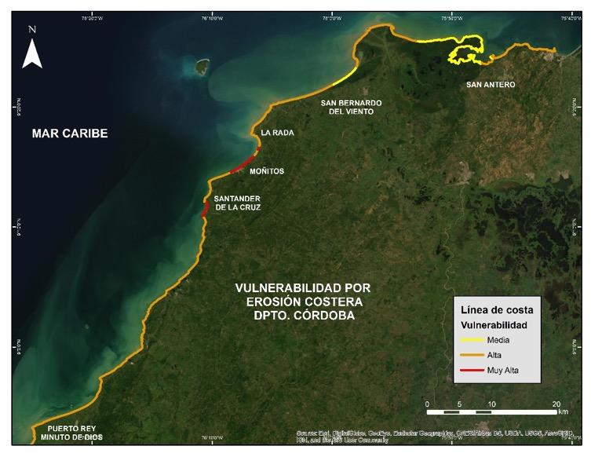
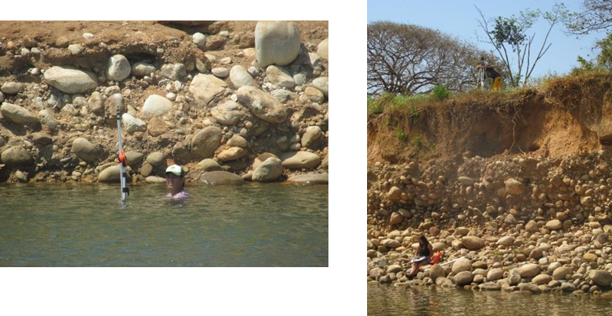
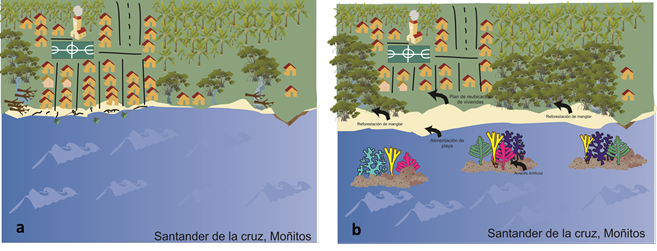

Para la identificación de zonas críticas se relacionaron los resultados de amenaza y vulnerabilidad por erosión costera, así mismo se tuvo en cuenta la información de los monitoreos de la zona costera y el análisis de cambios de la línea de costa.

## Amenaza y vulnerabilidad por erosión costera

Los resultados de amenaza y vulnerabilidad por erosión costera para el departamento de Córdoba, se basaron en la metodología propuesta por Coca-Domínguez y Ricaurte-Villota \[15\]. Donde para la amenaza tuvieron en cuenta diferentes variables físicas para tres componentes: magnitud, susceptibilidad y ocurrencia. De la misma manera para la vulnerabilidad, se enfocaron en tres componentes (variables socioeconómicas y ecológicas): elementos expuestos, fragilidad y falta de resiliencia. Todo esto se presenta en cinco niveles de calificación: muy alta, alta, media, baja y muy baja \[4,15\]. De igual manera, los resultados para Colombia obtenidos con este método se presentaron en Ricaurte-Villota *et al*., \[4\]. Se observó para el departamento de Córdoba, que la amenaza muy alta por erosión costera se presenta en el 6% de la línea de costa, localizada sobre los poblados de Santander de la Cruz, Puerto Rey y Minuto de Dios; la amenaza alta es la de mayor cobertura con un 51%, seguido por el 31% de la clasificación media, y por último, la amenaza baja con un 12% (Fig. 4a).

En cuanto la vulnerabilidad de la población y los ecosistemas por erosión, la zona costera de Córdoba presenta una vulnerabilidad media de 26%, alta de 69%, y muy alta de 5%. En este último rango se encuentran los sectores de Santander de la Cruz, Moñitos y La Rada \[4\] (Fig. 4b).

**Figura 4.** Mapas de amenaza (arriba) y vulnerabilidad (abajo) por erosión costera en el departamento de Córdoba. Modificado de Ricaurte-Villota *et al*. \[4\]. Con permiso de modificación.

## Monitoreo de la erosión costera

El Monitoreo se hace a partir de la toma de datos estacionales, levantados *in situ* con DGPS y con el fin de conocer fluctuaciones intranuales, la cual es independiente de metodologías que usan otro tipo de sensores remotos y se emplean para temporalidades más amplias. En este caso, los resultados también permiten identificar una tendencia a corto plazo y es óptima para la toma de decisiones. Para este monitoreo, los levantamientos de líneas de costa se llevaron a cabo entre 2015 y 2019, siendo tomados en época seca y época húmeda, esto para observar los cambios estacionales, definidos por Ricaurte-Villota y Bastidas-Salamanca \[25\].

**Cambios de la línea de costa**

La línea de costa se adquirió en campo a través de recorridos paralelos al mar, delineando la zona de cambio de pendiente en las playas, es decir el límite entre el frente de playa y la playa trasera, igualmente se tomó en la zona de acantilados el borde alto, esta definición es usada como variación morfodinámica y permite determinar la variación estacional \[26\]. Esta adquisición se realizó mediante tecnología GNSS con corrección diferencial post-proceso, posteriormente se estimaron los cálculos de los cambios cuantitativos (acumulación y/o erosión) de las líneas de costa, obteniendo su evolución.

Las variaciones se midieron empleando la extensión Digital Shoreline Analysis System (DSAS) \[27\] en el software ArcGIS 10.5. Esta extensión permite calcular estadísticas para analizar el comportamiento o los cambios en la línea de costa, dentro de un intervalo de tiempo estudiado \[28\]. Se tomaron como datos estadísticos el Linear Regression (LRR), el cual permite determinar la tasa de regresión lineal según la posición de la línea de costa con respecto al tiempo o fecha, tomando todas las líneas de costa del monitoreo y calculando bajo ecuación, donde la pendiente describe las tasas de cambio de la línea, dada en metros por año. Se clasificaron los resultados así: Muy Alta (LRR\<-1 m/año), Alta (-1\>LRR\<-0.5), Estable (-0.5\<LRR\>0.5) y Acreción (LRR\>0.5). Este resultado nos ayuda a entender cómo y cuál es la tendencia de la línea de costa, teniendo en cuenta las épocas climáticas, las cuales modulan su comportamiento. Resultados y análisis en la Tabla 1.

**Tabla 1.** Resultados de los cambios en la línea de costa para cada sector.

| **Lugar**                         | **Resultado**                                                                                                                                                                                                                                                                                                                                                                                                                           |
| --------------------------------- | --------------------------------------------------------------------------------------------------------------------------------------------------------------------------------------------------------------------------------------------------------------------------------------------------------------------------------------------------------------------------------------------------------------------------------------- |
| Puerto Rey                        | Se observó el retroceso continuo en los sectores adyacentes al enrocado protector de la vía y en las viviendas que se sitúan en dirección sur de la línea de costa (Fig. 5a). Valores máximos = MUY ALTA                                                                                                                                                                                                                                |
| Minuto de Dios                    | Presenta retroceso en toda la zona del poblado (se excluye la zona no poblada); la regresión lineal presenta pérdidas de -24.28 m/año (Fig. 5a). Valores máximos = MUY ALTA                                                                                                                                                                                                                                                             |
| El Bolivitar                      | Está marcada en la zona sur, por una estabilidad (valores que no superan 1 m/año) y acreción en la sombra de los rompeolas que apenas llega a los 1.29 m/año; en la zona norte se observaron procesos de retroceso que llegan a los -1.84 m/año (Fig. 5b). Estos valores muestran que la playa fluctúa con valores cercanos a cero (0), responde a las variaciones estacionales, pero con una tendencia a la erosión costera. ACRECIÓN. |
| Brisas del Caribe                 | La tendencia general es de acreción, lo que quiere decir que esta playa se mantiene bajo los procesos estacionales sin procesos tendenciales de erosión costera (Fig. 5c).                                                                                                                                                                                                                                                              |
| El Hoyito                         | La tendencia mostró una playa en acreción, sin procesos de erosión costera y en buen estado, respondiendo a la variación estacional sin afectaciones negativas.                                                                                                                                                                                                                                                                         |
| Moñitos                           | La playa presenta una tendencia de acreción – estabilidad (hasta 7.08 m/año) (Fig. 5d).                                                                                                                                                                                                                                                                                                                                                 |
| La Rada                           | La costa puede dividirse en 3 partes de acuerdo a su tendencia: la primera parte es hacia el acantilado (al norte), donde los valores tienen tramos de estabilidad y erosión leve; la segunda es de acreción, la cual se genera en la playa norte; por último, el tramo de playa del sur, donde la erosión es alta y alcanza los -21.57 m/año (Fig. 5e). MUY ALTA.                                                                      |
| Playas de San Bernardo del Viento | La tendencia en La Y es de acreción (4.66 m/año), con algunos tramos de estabilidad (Fig. 5f). En Brisas del Mar la tendencia es hacia la acreción (4.2 m/año) (Fig. 5g). En Los Tambos la tendencia es hacia la acreción costera, la cual alcanzo los 12.18 m/año (Fig. 5h). ACRECIÓN.                                                                                                                                                 |
| Santander de la Cruz              | Presenta una tendencia general hacia la erosión costera con tasas de hasta -4 m/año (Fig. 5i). MUY ALTA.                                                                                                                                                                                                                                                                                                                                |

**Figura 5.** Cambios en línea de costa tendenciales para las zonas de monitoreo del departamento. (**a**) Minuto de Dios y Puerto Rey, (**b**) playa El Bolivitar, (**c**) playa Brisas del Caribe, (**d**) Moñitos, (**e**) La Rada, (**f**) La Y, (**g**) Brisas del Mar, (**h**) Los Tambos, (**i**) Santander de la Cruz. Clasificación: Muy Alta (LRR\<-1 m/año), Alta (-1\>LRR\<-0.5), Estable (-0.5\<LRR\>0.5) y Acreción (LRR\>0.5).

## Priorización de áreas o definición de puntos críticos por erosión costera

La priorización de áreas o definición de puntos críticos de erosión costera, corresponde con los sitios donde dicho fenómeno podría generar daños en población o pérdida de ecosistemas, lo que permite identificar las áreas que requieren medidas a corto, mediano y largo plazo. Para la priorización de áreas, inicialmente se relacionaron los resultados de amenaza y vulnerabilidad mediante una matriz, donde se tomaron la clasificación media, alta y muy alta. Se asignaron valores a cada clase: media (1), alta (3) y muy alta (5), siendo en sumatoria el máximo valor 10 y el mínimo 2, clasificando con intervalos iguales se tuvo: media \<4.6, alta 7.3 \> 2.6 y muy alta \>7.3 (Tabla 2).

Adicionalmente se tomaron en cuenta los resultados del monitoreo de erosión costera, para lo cual se asignaron tres clasificaciones: los que mostraban una tendencia hacia la erosión costera (Alta y Muy Alta) o hacia procesos de acreción. Con valores asignados de acreción (1), erosión Alta (4) y Muy Alta (5). Posteriormente se cruzó con los resultados de la matriz A\*V y se usó la misma clasificación de intervalos de la Tabla 2 para obtener las zonas prioritarias (Tabla 3).

**Tabla 2.** Relación entre amenaza y vulnerabilidad para priorización de áreas.

<table>
<thead>
<tr class="header">
<th></th>
<th></th>
<th><strong>Grado de vulnerabilidad</strong></th>
<th></th>
<th></th>
<th></th>
</tr>
</thead>
<tbody>
<tr class="odd">
<td></td>
<td></td>
<td>Media (1)</td>
<td>Alta (3)</td>
<td>Muy Alta (5)</td>
<td></td>
</tr>
<tr class="even">
<td><strong>Grado de Amenaza</strong></td>
<td>Media (1)</td>
<td>Media (2)</td>
<td>Media (4)</td>
<td>Alta (6)</td>
<td>
<strong>A * V</strong>

<strong>Zona Prioritaria</strong>
</td>
</tr>
<tr class="odd">
<td></td>
<td>Alta (3)</td>
<td>Media (4)</td>
<td>Alta (6)</td>
<td>Muy Alta (8)</td>
<td></td>
</tr>
<tr class="even">
<td></td>
<td>Muy Alta (5)</td>
<td>Alta (6)</td>
<td>Muy Alta (8)</td>
<td>Muy Alta (10)</td>
<td></td>
</tr>
</tbody>
</table>

Los poblados que tienen prioridad Muy Alta para intervención son Puerto Rey, Minuto de Dios, La Rada, Santander de la Cruz y Broqueles. El resto del departamento estudiado se encuentra en prioridad Alta, lo que significa que se debe intervenir de corto a mediano plazo, ya que, si no se toman medidas, los riesgos pueden ir en aumento (Tabla 3).

**Tabla 3**. Tabla de priorización de áreas. Información derivada del monitoreo\*.

| **Municipio**               | **Localidad**              | **Erosión costera\*** | **Amenaza X Vulnera** | **Prioridad** |
| --------------------------- | -------------------------- | --------------------- | --------------------- | ------------- |
| **Los Córdobas**            | Puerto Rey                 | Muy Alta (5)          | Muy Alta (5)          | Muy Alta (10) |
|                             | Minuto de Dios             | Muy Alta (5)          | Muy Alta (5)          | Muy Alta (10) |
|                             | Brisas del Caribe          | Acreción (1)          | Alta (3)              | Media (4)     |
| **Puerto Escondido**        | El Bolivitar               | Acreción (1)          | Alta (3)              | Media (4)     |
|                             | San Miguel                 | (0)                   | Alta (3)              | Media (3)     |
| **Moñitos**                 | La Rada                    | Muy Alta (5)          | Muy Alta (5)          | Muy Alta (10) |
|                             | Santander de la Cruz       | Muy Alta (5)          | Muy Alta (5)          | Muy Alta (10) |
|                             | Moñitos                    | Acreción (1)          | Muy Alta (5)          | Alta (6)      |
| **San Bernardo del Viento** | Paso Nuevo                 | (0)                   | Alta (3)              | Media (3)     |
|                             | Playas del viento          | Acreción (1)          | Media (1)             | Media (2)     |
| **San Antero**              | Playa Blanca y El Porvenir | (0)                   | Alta (3)              | Media (3)     |

4.  # MODELO CONCEPTUAL DE ALTERNATIVAS DE MITIGACIÓN: SANTANDER DE LA CRUZ.
    
    1.  ## Alternativas propuestas

Las alternativas propuestas se adaptaron a partir del trabajo desarrollado por MADS-DELTARES-INVEMAR. (2013) \[10\], con base en la iniciativa *Building with Nature,* tomando en cuenta en el caso específico de Santander de la Cruz otras necesidades derivadas de trabajos con la comunidad y estudios previos. Para cada zona se elaboraron dos modelos, uno del estado actual y el segundo con las alternativas de mitigación propuestas, estos se desarrollaron a través de cartografía social, en talleres con la comunidad e imágenes de sensores remotos. Las propuestas principales son las siguientes (Tabla 4):

**Tabla 4** Alternativas propuestas.

| **Alternativa**                                                                   | **Descripción**                                                                                                                                                                                                                                                                                                                                                                                                                                                                                                                                                                                                                                                                                                                   |
| --------------------------------------------------------------------------------- | --------------------------------------------------------------------------------------------------------------------------------------------------------------------------------------------------------------------------------------------------------------------------------------------------------------------------------------------------------------------------------------------------------------------------------------------------------------------------------------------------------------------------------------------------------------------------------------------------------------------------------------------------------------------------------------------------------------------------------- |
| **Reforestación y restauración (manglares, arrecifes artificiales, entre otros)** | La estructura de los manglares, en virtud de sus raíces aéreas ayuda a contrarrestar los efectos de la energía del oleaje y propicia paralelamente la sedimentación y la estabilidad de la línea de costa \[29\]. La implementación de arrecifes artificiales consiste en estructuras aisladas metálicas (preferiblemente no de concreto) que no causan interrupción de la deriva litoral \[30\], esta forma es diferente a la siembra de arrecife, la cual depende de la previa existencia de manera natural. Su implementación permite la disminución de la energía del oleaje incidente, con el objetivo de generar una zona de calma en la parte posterior que disminuya la erosión y propicie la regeneración en las costas. |
| **Alimentación de playas**                                                        | Consiste en provocar en la playa un aumento artificial del volumen de arena a través de un suministro externo de arena en el segmento de la misma que se pretende proteger. Puede colocarse la arena en un solo tramo aguas arriba de la playa o renovarse en varios puntos a lo largo de ella, cerca de la línea de costa. Para que el transporte de deriva se encargue de distribuir los sedimentos (Esta técnica exige mantenimiento periódico) \[29\].                                                                                                                                                                                                                                                                        |
| **Reubicación de viviendas**                                                      | Esta alternativa no pretende ser la única para una zona en particular, primordialmente esta solución se usa con otras de manera integral, y solo se propuso para casos extremos. La reubicación de viviendas en muchos casos es costosa, pero la solución es a largo plazo. En la medida de lo posible la relocalización de viviendas se presenta haciendo énfasis en los aspectos socio-económicos y de zonas seguras.                                                                                                                                                                                                                                                                                                           |
| **Estabilización de acantilados y perfilamiento**                                 | El objetivo de esta técnica es definir el ángulo adecuado y aumentar la estabilidad del talud, la cual está en función del tipo de roca, la estructura geológica, el contenido de agua y la altura, el perfilador no es sin embargo aplicable a todos los tipos de rocas y requiere que haya espacio suficiente para que el talud pueda extenderse; además, debe ir acompañada de obras complementarias de drenaje y regeneración de cobertura vegetal \[19\].                                                                                                                                                                                                                                                                    |

## Santander de la Cruz

Santander de la Cruz es una de las áreas más afectadas por la erosión costera en el departamento de Córdoba. Actualmente la población se encuentra sobre la playa y la acción de las olas incide sobre los patios de las viviendas causando grandes pérdidas económicas (Fig. 6a). A partir de la configuración del estado actual y de los talleres con la comunidad, se propusieron las siguientes alternativas de mitigación y se generó el siguiente modelo conceptual.

Debido a la proximidad de las casas con el mar, se hace necesario un plan de reubicación para la primera línea de viviendas y una reforestación de manglar en toda la zona litoral, principalmente en las áreas aledañas a los ríos. A pesar de la presencia de afluentes y que la deriva litoral no presenta ninguna intervención de obras de contención, la dinámica del oleaje no permite la sedimentación en la costa y la tendencia históricamente se ha marcado por procesos de retrocesos de la línea (Fig. 6b). Por otro lado, se hace importante la intervención de arrecifes artificiales en pro de reducir la energía incidente de las olas sobre la costa. Se debe tener control de la extracción de arena que padecen las playas actualmente y los procesos de deforestación del manglar alrededor de los ríos, cada una de estas intervenciones aportan al desequilibrio del sistema.

**Figura 6.** Estado identificado (2017) de zona costera de Santander de la Cruz (a) y Modelo conceptual de las alternativas para el control de la erosión costera en Santander de la Cruz (b).

