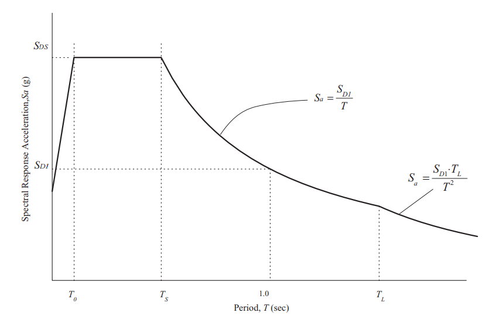

Para la actualización de la norma sismo resistente de edificaciones NSR 22 se plantea el uso de las formas espectrales de los códigos ASCE 7 - 10 y 16 \[1\], las cuales se establecen en función de dos parámetros: *SDS* (aceleración espectral de diseño en periodo corto, 0.2 seg) y *SD1* (espectral de diseño para un periodo de 1 segundo). La forma espectral se presenta en la Figura 1.

**Figura 1.** Espectro de aceleraciones según ASCE 7 - 10/16. Tomado de ASCE 7 - 16.

<table>
<tbody>
<tr class="odd">
<td>
<strong>Caja 1. Características de los movimientos sísmicos de diseño</strong>

Los movimientos sísmicos para el diseño estructural se representan por medio de Espectros de Diseño, los cuales indican los valores mínimos requeridos de aceleración espectral según diferentes periodos de vibración de estructuras. A lo largo de muchos años la ingeniería estructural ha desarrollado los métodos necesarios para operar con este tipo de descripción del movimiento fuerte dentro de los procesos de diseño y verificación de una estructura.

Lo que conocemos como espectro de respuesta no es más que la colección de valores máximos de movimiento (respuesta estructural) de osciladores de un grado de libertad con periodo fundamental variable (cubriendo un rango relevante y representativo), ante un mismo movimiento sísmico en la base.

Los espectros de respuesta, entre muchas otras propiedades interesantes, exhiben un comportamiento como el ilustrado en la Figura. Se presenta un espectro de velocidad para el acelerograma registrado en la estación Bocatoma durante el sismo de Armenia (Eje Cafetero) del 25 de enero de 1999.

<strong>Espectro de velocidad del registro Bocatoma del sismo del Eje Cafetero (Colombia) del 25/01/1999</strong>

Nótese que, al dibujar los espectros de velocidad en escala logarítmica, es posible encontrar rangos de periodos en donde los valores calculados de respuesta estructural no varían significativamente unos con otros. En particular se revelan tres zonas en el espectro: una de aceleración aproximadamente constante, otra de velocidad aproximadamente constante y una tercera de desplazamiento aproximadamente constante. Las formas espectrales de diseño, similares a la línea negra presentada en la Figura, buscan aproximar lo mejor posible la forma y características de los espectros de respuesta.
</td>
</tr>
</tbody>
</table>

Según el reglamento ASCE 7, los coeficientes de diseño se obtienen de los coeficientes SMS y SM1, llamados el sismo máximo considerado, de la siguiente manera.

<table>
<tbody>
<tr class="odd">
<td>
$S_{\text{DS}} = \frac{2}{3}S_{\text{MS}}$

$S_{D1} = \frac{2}{3}S_{M1}$
</td>
<td><strong>(1)</strong></td>
</tr>
</tbody>
</table>

Los valores de los coeficientes SMS y SM1 no corresponden a valores de aceleración espectral de algún periodo de retorno. En estos reglamentos, se emplea movimiento fuerte orientado al riesgo (*Risk Targeted Ground Motion* – RTGM) \[2\], el cual tiene la característica de calcularse como el valor de aceleración asociado a una probabilidad de colapso del 1% en 50 años. Nótese que la definición probabilista se refiere al colapso como variable de decisión, y no a una eventual excedencia de los valores de aceleración.

La construcción de movimiento de tipo RTGM implica la definición de funciones de fragilidad que permitan dar cuenta de la vulnerabilidad de las edificaciones futuras. Adicionalmente, esta fragilidad se altera de forma iterativa hasta encontrar el punto en el cual la aceleración espectral induce una probabilidad de colapso del 1%. Este procedimiento es, a juicio de los autores, difícil de justificar, no solo por su arbitrariedad (lo cual es más o menos normal en todas las definiciones de movimiento fuerte de diseño normativas) sino por proveer un mensaje de falsa seguridad que no es posible establecer desde antes de iniciar un proceso de diseño estructural. Surgen inquietudes importantes al analizar el significado y procedimientos de la RTGM:

  - > ¿Es posible establecer, desde el espectro de diseño, la probabilidad futura de colapso de una estructura?

  - > ¿Son las funciones de fragilidad empleadas, realmente representativas de la probabilidad de colapso de cualquier tipo de estructura?

  - > ¿Es apropiado afirmar que, siguiendo estas regulaciones para el movimiento sísmico de diseño, las edificaciones futuras tendrán, todas, la misma probabilidad de colapso de, máximo, 1% en 50 años?

A nuestro juicio, no es correcto ni conveniente establecer la probabilidad de colapso de las estructuras desde el movimiento de diseño. No obstante, la RTGM tiene algunas ventajas o bondades que también conviene mencionar. Primero, lo que busca en esencia es reducir el riesgo de las edificaciones futuras, haciendo explícito un objetivo de desempeño, lo cual es algo deseable. También creemos que es correcto no asociar los coeficientes de diseño (y en general los espectros) a periodos de retorno. En el pasado, la asociación de los coeficientes de diseño a un periodo de retorno establecido ha llevado a múltiples malinterpretaciones del nivel de seguridad que se provee, desde el diseño estructural, a las edificaciones futuras. Nótese el espectro presentado en la Figura 2. Este espectro de diseño fue construido siguiendo las formas espectrales del CCP 14, usando tres coeficientes de diseño con periodo de retorno de 1,000 años. Se presenta también el espectro de amenaza uniforme de 1,000 años, el cual es un espectro construido mediante una evaluación probabilista de la amenaza sísmica, y que sí tiene el mismo periodo de retorno en todas las ordenadas espectrales. Como puede observarse, el espectro de diseño resultante solamente tiene 1,000 años de periodo de retorno en los tres puntos en donde de cruza con el de amenaza uniforme. En ciertas porciones del espectro, el periodo de retorno real de las aceleraciones espectrales es mayor a 1,000 y en otras partes es menor a 1,000. Esto no constituye realmente una deficiencia de las formas espectrales, pues este es en general el caso en todos los códigos de diseño sismo resistente conocidos. En conclusión, no es posible, ni lógico, afirmar que un espectro de diseño tiene determinado periodo de retorno. La desvinculación del periodo de retorno de la definición de los coeficientes de diseño en la RTGM es un acierto.

**Figura 2.** Espectro de diseño y espectro de amenaza uniforme. Se indican los periodos de retorno reales de las aceleraciones espectrales de diseño.

Cabe anotar que en este trabajo se mantienen siempre los coeficientes de sitio, asociados a la respuesta del suelo, en un valor constante igual a 1. La respuesta de sitio es materia de investigación profunda y de reflexión también para la actualización de la NSR 22, pero excede el alcance de este trabajo.

<table>
<tbody>
<tr class="odd">
<td>
<strong>Caja 2. Efecto del suelo</strong>

Los depósitos de suelo blando modifican en amplitud y contenido frecuencial el movimiento sísmico, como resultado del tránsito de las ondas sísmicas por los materiales geotécnicos, los cuales exhiben un comportamiento fuertemente no lineal, aumentando los amortiguamientos totales y degradando su módulo de rigidez a medida que son sometidos a mayores deformaciones cortantes. Este comportamiento tiende a modificar radicalmente la forma de los espectros de respuesta a nivel de la superficie del terreno (o a nivel de la cimentación de las estructuras), en comparación con el movimiento en la base del depósito.

Este comportamiento se ilustra a continuación a partir de la respuesta sísmica de un perfil conformado totalmente por materiales aluviales, granulares, de profundidad intermedia (30 metros) y rigidez intermedia (<em>Vs</em>30 = 530 m/s). Este perfil es de tipo C según la clasificación NHERP, misma usada en el NSR-10. La Figura presenta la relación de amplificación de aceleraciones espectrales (superficie/ roca) ante un acelerograma hipotético incidente en la base.

<strong>Relación de amplificación de las aceleraciones espectrales</strong>

El comportamiento de la relación de amplificación típicamente es el presentado en la Figura. Nótese que es posible identificar tres zonas principales: una de periodos muy cortos (o zona de comportamiento rígido), otra de periodo corto y otra de periodo largo, para las cuales es posible establecer valores de amplificación en términos de un único parámetro representativo. Estos parámetros son los mismos que se emplean en la formulación de las formas espectrales de la NSR 10 (<em>Fa</em> y <em>Fv</em>), despreciando la zona de comportamiento rígido, en donde prácticamente no es posible encontrar ninguna estructura convencional.
</td>
</tr>
</tbody>
</table>

