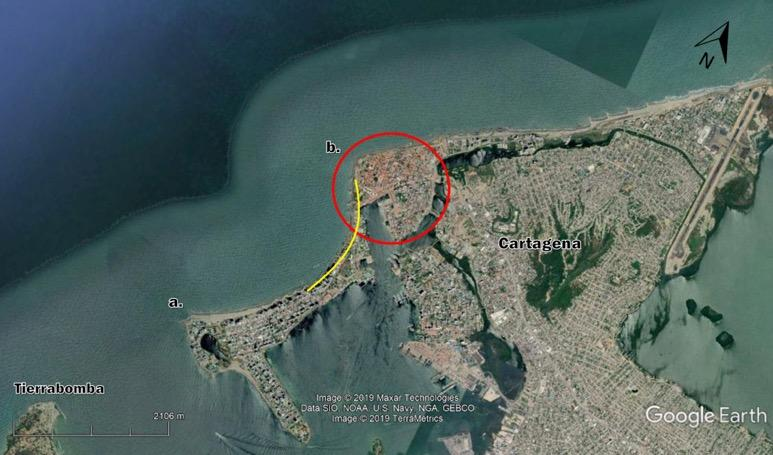
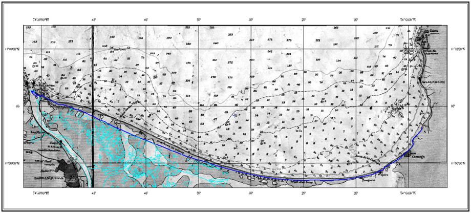
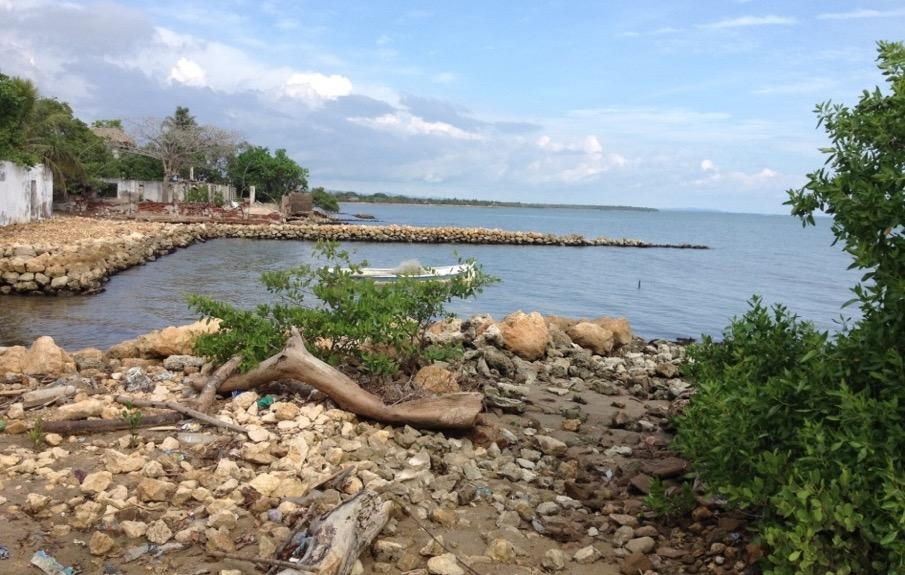
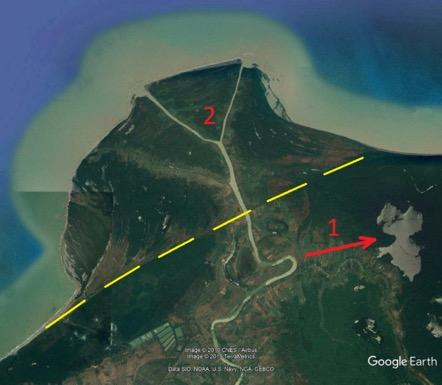
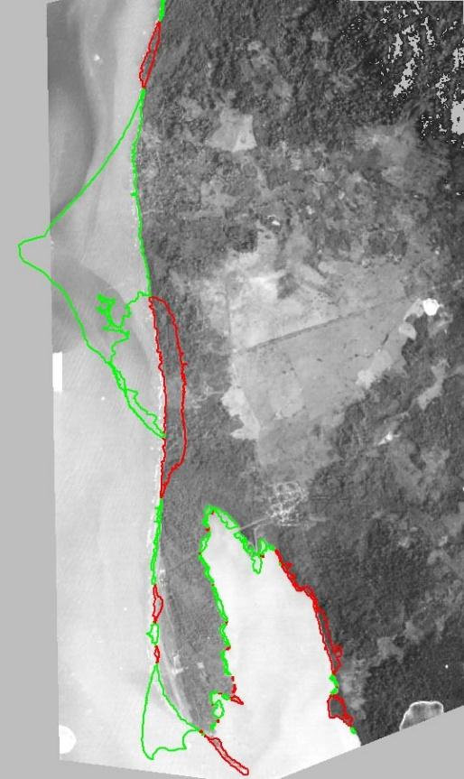

El aumento global del nivel del mar es un hecho y para el futuro próximo tendrá un incremento más progresivo \[1-4\]. También es conocido y cuantificable con una regla de Bruun \[5\] que las playas con menor pendiente sufren la erosión costera debido al aumento del nivel con mayor magnitud que las costas abruptas. Por lo anterior, los escenarios de riesgo podrían caracterizarse en una primera aproximación para todo el país con base en un relativamente simple análisis topográfico de los perfiles subacuáticos de las playas.

Sin embargo, la vulnerabilidad de las costas depende también de una serie de factores de carácter regional y local, frecuentemente causadas por otros impactos antrópicos inconscientes desde el punto de vista de la magnitud de las consecuencias que generan. Si la causa global del calentamiento y aumento del nivel del mar no se puede combatir a nivel de un solo país, las causas regionales y locales sí se pueden regular y controlar y, de esta forma, mitigar el efecto de la erosión costera en muchos casos específicos.

Uno de los primeros ejemplos presentados aquí, se refiere al efecto de los tajamares de Bocas de Ceniza. Son obras costeras conocidas como *jetties*, cuyo propósito es estabilizar la desembocadura de un río, en el caso dado, del río Magdalena. Inaugurados en el año 1936, causaron un efecto regional de erosión costera, el cual se manifestó de forma evidente durante las décadas posteriores a su construcción. El río Magdalena es uno de los aportantes más significativos de sedimentos para las costas caribeñas de Colombia \[6\]: alrededor de un 85% del material que transporta son limos y arcillas; siendo éstas partículas muy finas, generalmente se propagan en estado de suspensión, generan una pluma turbia en la desembocadura y parcialmente se precipitan en su vecindad por el proceso de floculación de las partículas en un frente halino con una salinidad entre 5 y 10. Sin embargo, por los mecanismos del lavado por oleaje, estas partículas no componen mayor parte de los sedimentos en las playas del Caribe colombiano en el tramo de influencia del río. El 15% del material restante transportado por el Magdalena, son arenas, cuya predominancia en las playas es evidente.

En los años 50, el ingeniero español Iribarren proyectó el espolón más largo en Colombia de aquella época (150 metros construidos), considerando que el fin de la deriva litoral de sedimentos del río Magdalena en el margen occidental es la ciudad de Cartagena, concretamente el extremo de su flecha litoral de Bocagrande (Fig. 1). Por otro lado, actualmente se considera \[7, 8\] que el fin de la deriva litoral por el lado oriental es la Boca de la Barra de la Ciénaga Grande de Santa Marta, la parte más frágil de la flecha litoral conformada por la deriva, separando el mar Caribe y la ciénaga. Una vez diagnosticado el tramo de influencia del río, se puede realizar el análisis de los procesos de erosión-sedimentación, relacionados con el aporte de las arenas por el río, la principal fuente de sedimentos en esta región (la abrasión de acantilados) produce una cantidad de sedimentos, pero se sabe que es una fuente secundaria para la mayoría de las costas en el mundo \[9\]).

**Figura 1.** Características de la dinámica litoral de la flecha de Bocagrande: a) Espolón de Iribarren; b) Ciudad antigua, *head-land*; la línea amarilla demuestra el perfil de equilibrio en planta de Hsu que evidencia que en la época colonial existió una comunicación entre el mar y la bahía de Las Animas. Fuente: Google Earth (2019), autores.

Los tajamares de las Bocas de Ceniza interrumpieron el transporte de la deriva litoral de sedimentos. El efecto negativo fue observado prácticamente de inmediato en el retroceso de la flecha de la Ciénaga de Mallorquín. La dinámica multianual de esta flecha se presenta en la Figura 2.

**Figura 2.** Comportamiento de la línea de costa en la zona norte del departamento del Atlántico entre 1935 y 1996 \[10\], se reproduce bajo licencia Creative Commons.

Era de esperar que la respuesta del sistema costero en forma de retroceso tuviera efecto en los tiempos directamente proporcionales a la distancia de la fuente de arena (Bocas de Ceniza). Por lo tanto, el caso de desaparición de la Isla Verde en los años 1935 a 1947 fue detalladamente estudiado en \[10\], entre otros. En \[11\] incluso calculan una tasa de desplazamiento de sedimentos en el tramo de Isla Verde a Puerto Colombia de 430 m/año, formando nuevas acumulaciones de arena frente a la costa de este municipio. Lo sorprendente es que, en distancias de más de una centena de kilómetros desde la boca del río, el estudio \[12\] demostró una respuesta drástica en la zona norte de Cartagena (Fig. 3) para los años 60–70 del siglo pasado con un retroceso de orden de 100 m, es decir, unos 30 años después de la culminación de la obra de los tajamares.

**Figura 3.** Variación multianual de la línea de costa en el sector Manzanillo del Mar (zona norte de Cartagena de Indias). Imagen del fondo: Google Earth. Estudio geomático \[12\].

Por el otro lado de la desembocadura del río Magdalena, la isla de Salamanca aún sigue sufriendo el impacto de las obras de los años 30 (Fig. 4), dónde el retroceso para los últimos 60 a 70 años es del orden de los 800 metros.

**Figura 4.** Retroceso costero (línea azul) con respecto a la cartografía del año 1944 en el sector de la Isla Salamanca. Se observa el efecto del déficit de sedimentos provocado por las obras de tajamares. Tramo: Barranquilla-Ciénaga. Fuente: \[7\].

Siendo los tajamares de Bocas de Ceniza la principal causa de erosión costera durante las décadas en la región de influencia del río Magdalena, es importante señalar que a nivel local existen otras causas antrópicas de este proceso. Volviendo a la Figura 1, se puede observar que la ciudad de Cartagena de Indias fue fundada sobre una base sólida, conocida en la bibliografía como *head-land* \[9\]. Esta punta, indicada en la Figura 1 con un círculo rojo, produce una difracción importante de oleaje en la flecha litoral de Bocagrande tendiendo a romper sobre una línea de equilibrio en planta, llamada el perfil de Hsu \[9\]. Resulta que la expansión de la ciudad durante los últimos 50 años hacia la flecha de Bocagrande se materializó en el enrocado de la orilla en el tramo cercano a la punta (de cierta forma con el intento de estabilizar la flecha), y en las construcciones costeras, como la primera avenida y las edificaciones a lo largo de Bocagrande.

El primer factor (*head-land*) ha venido generando una manifestación natural de los procesos morfodinámicos en planta, mientras que el segundo (infraestructura urbana) provocó un déficit de sedimentos a lo largo del perfil activo subacuático. La Figura 5 muestra la forma no equilibrada de la línea de costa, el resultado del enrocado y también permite observar que debajo de la superficie del agua, entre 1 y 5 m de profundidad (a distancias de 100 y 800 m de la orilla) hay un déficit de sedimentos. Mientras que este déficit exista, ningún espolón con longitudes inferiores a las distancias señaladas y ningún relleno hidráulico de la parte seca de la playa recuperarían la situación crítica, plenamente antrópica.

 

**Figura 5.** Izquierda: vista de Cartagena desde el espolón Iribarren hacia head-land de la ciudad vieja (Fig. 1). Derecha: Perfiles subacuáticos de la playa de Bocagrande (puntos negros) con un perfil promedio (en rojo) y el perfil de equilibrio de Dean (en azul). Fuente: propia.

Cabe mencionar que las inundaciones de las calles marginales al malecón de Bocagrande, incluso cuando inicialmente sean producto de lluvias fuertes, vuelven a terminar como una intrusión del agua salada del mar. El agua de lluvia, evacuándose por las calles hacia el mar, socava unos canales de escorrentía, a través de los cuales el agua salada entra con ayuda de olas de mar de fondo de los frentes fríos, típicos para la época húmeda del año.

El efecto de los ciclones tropicales sobre las costas del Caribe colombiano es poco evaluado. La Figura 6 (arriba) muestra el mapa sinóptico correspondiente al ciclón tropical Tomas (año 2010) en el centro del Caribe en su categoría de depresión tropical. Al momento de esperar las ondas de mar de fondo irradiadas por el ciclón y provenientes de él hacía las costas colombianas, el modelo espectral de oleaje (Fig. 6 abajo) implementado en el Centro de Investigaciones Oceanográficas e Hidrográficas del Caribe \[13, 14\] mostró un efecto particular: La Zona de Convergencia Intertropical, atraída por el sistema de baja presión asociado al centro de la D.T. Tomas, generó vientos fuertes y oleaje que afectaron de manera progresiva todas las costas del Caribe colombiano desde del Golfo de Urabá (en menor medida) hasta la Guajira (daños importantes y retroceso de la línea de costa en algunos sectores superando 50-80 m), evidenciado en posterior inspección física por parte de las autoridades \[15\]. Por lo anterior, es importante tener en cuenta el clima marítimo en el momento de toma de decisiones sobre las posibles medidas de mitigación de impactos de la naturaleza.

**Figura 6.** Arriba: Situación sinóptica para el día 3 de noviembre del 2010, indicando el paso de la depresión tropical Tomas. Fuente: Centro Nacional de Huracanes, 2010. Abajo: Pronóstico de oleaje con el sistema SPOA para la fecha 02/11/2010 \[13\].

Ahora bien, si las condiciones climáticas son tan relevantes, sin discutir los eventos más extremos posibles ocurridos en las costas del Caribe, es evidente que nuestra actuación sobre las medidas de recuperación de playas no es siempre adecuada. Las razones de una mala interpretación de la dinámica marina y costera principalmente se encuentran en el desconocimiento o desconsideración de las causas de los procesos costeros. Las fotos de la Figura 7 demuestran completa ausencia de las arenas en dos sectores del Golfo de Morrosquillo donde en épocas anteriores se encontraban playas, como lo refieren los nativos del sector. La razón de ser construidas estas obras era la expectativa de ganar las playas mediante unas obras duras, sin considerar la viabilidad técnica y sin estudios previos.

**Figura 7.** Fotos de obras de protección costera en el Golfo de Morrosquillo, donde se evidencia su obsolescencia. Arriba: Berrugas. Abajo: Santiago de Tolú. Fuente: propia.

El caso del Golfo de Morrosquillo es un ejemplo muy ilustrativo, cuando en el medio de más de 150 espolones construidos, ninguno resulta ser útil. Desde la época de los trabajos de Lorin et al. \[16\], mediante el análisis de granulometría de sedimentos del fondo fue determinado que la deriva litoral en este golfo proviene desde el río Sinú, abasteciendo con el material arenoso al menos la mitad de sus playas. El estudio \[17\], basado en la modelación numérica de la deriva litoral de sedimentos, confirmó esta conclusión. Sin embargo, si se analiza el avance de la acreción del delta del río Sinú (Fig. 8), es evidente de que la formación deltaica de las últimas décadas frenó el aporte de sedimentos, tanto para el norte, como para el sur de la desembocadura \[18\]. El golfo actualmente no posee los sedimentos arenosos en abundancia, como en el pasado, tanto en sus orillas, como el mar afuera. El anterior es un caso que está asociado con la posición geográfica (que influye directamente en la energía del oleaje y la capacidad potencial de transporte de sedimentos) combinada con cambios morfodinámicos en la fuente del material, naturales \[18\] o antrópicos \[8\]. De hecho, si en el estudio \[8\] se afirma la construcción de embalses en el cauce del río mucho más arriba de su delta, estancando los sedimentos gruesos, entonces en el trabajo \[18\] se señalan, como las causas del crecimiento del delta, tanto los procesos naturales, como la construcción alrededor del año 1938 de un canal próximo a la costa, resultando el abandono del delta de la bahía de Cispatá y la formación del delta de Tinajones (Fig. 8b).

**Figura 8.** Delta del río Sinú en acreción. Fuente: Google Earth, 2019. Izquierda: Dimensiones del delta crecido desde el año 1938. Derecha: Dirección del cauce antiguo (1) según \[18\] y el brazo de Tinajones (2); la línea amarilla está trazada por el contorno visible en la figura izquierda de cambios fisiográficos y de vegetación.

Las dimensiones de acreción del delta, observadas en la Figura 8, se estiman alrededor de 18 km2 del área, lo que implica una acumulación superior a 200 millones de metros cúbicos de las arenas (estimación propia). Sin embargo, a pesar de que este sedimento, debido a causas naturales o antrópicas, dejó de llegar a las playas de la región, la *inercia* en la mentalidad sobre las posibles medidas de recuperación de playas continúa desde hace varias décadas, resultando la presencia y tendencia actual de seguir construyendo las obras pétreas de la protección costera, donde su efecto es nulo debido al déficit del sedimento.

En el caso del río Magdalena el impacto fue causado por una mega obra construida entre 1930 y 1936, sin embargo, en el clima de olas existe suficiente energía para el transporte del material; para el caso de los aportantes más pequeños, las alteraciones en la fuente de sedimentos pueden ser poco apreciables, pero las consecuencias igualmente notorias. Es el caso del río Turbo. La Figura 9 demuestra la evolución de la línea de costa del sector entre 1946 y 2005.

**Figura 9.** Variación de la línea de costa entre la desembocadura del río Turbo, la flecha de Yarumal y la flecha de Punta de Las Vacas entre 1946 (foto aérea) y 2005. (Golfo de Urabá). Los contornos en color representan áreas erosionadas (rojo) y sedimentadas (verde) \[19\].

Resulta que el uso del agua del río en agricultura, la alteración de su caudal y cauce \[20\], produjo a partir de los años 60 del siglo XX unas alteraciones en la dinámica de la desembocadura con el crecimiento de su espacio deltaico. Interactuando con el oleaje del clima regional (cuya energía se conserva), el crecimiento deltaico progresó, haciendo la incidencia de los trenes de olas más perpendicular con respecto a la costa norte del delta \[19\] e impidiendo el transporte de sedimentos hacia el sur de la desembocadura. A su vez, esto produce mayor acumulación del sedimento en el delta, creciendo de manera proporcional a la tasa de avance de erosión costera flujo abajo, provocando la pérdida del terreno en el casco urbano de la ciudad, considerado en \[20\] como un ejemplo más para ilustrar la importancia del conocimiento científico sobre los procesos costeros y las afectaciones que hemos hecho a nivel regional y local.

<table>
<tbody>
<tr class="odd">
<td>
<strong>Caja 2. Causas del transporte litoral de sedimentos</strong>

El transporte litoral de sedimentos bajo el régimen micro-mareal está causado por la rotura de olas de viento en la zona costera, donde el frente de oleaje se refracta buscando llegar de forma normal a las isóbatas. Un pequeño ángulo entre la incidencia de las olas y los contornos batimétricos provoca un movimiento de aguas y sedimentos a lo largo de la costa. En presencia de una desembocadura, el aporte sedimentario del río es capaz de producir una acreción y hasta una formación deltaica. El crecimiento del delta de un río, por causa natural o antrópica, puede obstaculizar el transporte litoral debido al cambio de incidencia del oleaje sobre esta costa deformada. El proceso es progresivo en la medida de que a mayor crecimiento del delta, mayor alteración de la deriva litoral se produce y menor cantidad de sedimento flujo abajo aporta este río.
</td>
</tr>
</tbody>
</table>

¿Cuál es entonces el impacto de los cambios climáticos en la erosión costera, manifestados al menos en el aumento del nivel del mar, en comparación con las causas antrópicas locales? Definitivamente, el aumento del nivel del mar está causando siempre una erosión, nunca acreción en una costa dada. Estos cambios de escala global, al sumarse con aquellos de escala local y regional, incrementan el proceso de erosión costera, cuya dinámica sería menos pronunciada con un buen manejo de las costas.

