Los resultados del presente estudio se categorizaron en diez componentes psicosociales del reasentamiento social. La tabla 1 sintetiza los componentes encontrados en la revisión documental según país, por su parte la figura 1 condensa la relación encontrada entre los componentes psicosociales.

**Tabla 1.** Componentes psicosociales investigados por país. Fuente: propia.

<table>
<thead>
<tr class="header">
<th><strong>Componente</strong></th>
<th><strong>País</strong></th>
<th></th>
<th></th>
<th></th>
<th></th>
<th></th>
<th></th>
<th></th>
<th></th>
<th></th>
<th></th>
<th></th>
<th></th>
<th></th>
<th></th>
</tr>
</thead>
<tbody>
<tr class="odd">
<td></td>
<td>Argentina</td>
<td>Bolivia</td>
<td>Chile</td>
<td>Colombia</td>
<td>Cuba</td>
<td>Ecuador</td>
<td>El Salvador</td>
<td>México</td>
<td>Perú</td>
<td>Costa Rica</td>
<td>Uruguay</td>
<td>Venezuela</td>
<td>Paraguay</td>
<td>Honduras</td>
<td>Otros</td>
</tr>
<tr class="even">
<td>
Estrategias sociales

de afrontamiento
</td>
<td>X</td>
<td></td>
<td></td>
<td>X</td>
<td>X</td>
<td></td>
<td></td>
<td>X</td>
<td></td>
<td></td>
<td></td>
<td></td>
<td></td>
<td></td>
<td></td>
</tr>
<tr class="odd">
<td>
Participación y

organización social
</td>
<td>X</td>
<td></td>
<td>X</td>
<td>X</td>
<td>X</td>
<td></td>
<td>X</td>
<td>X</td>
<td>X</td>
<td></td>
<td></td>
<td>X</td>
<td></td>
<td></td>
<td></td>
</tr>
<tr class="even">
<td>
Percepción

social del riesgo
</td>
<td></td>
<td></td>
<td></td>
<td>X</td>
<td></td>
<td>X</td>
<td></td>
<td>X</td>
<td></td>
<td></td>
<td></td>
<td></td>
<td></td>
<td></td>
<td>X</td>
</tr>
<tr class="odd">
<td>
Prácticas

socioculturales
</td>
<td>X</td>
<td></td>
<td>X</td>
<td>X</td>
<td>X</td>
<td></td>
<td></td>
<td>X</td>
<td></td>
<td></td>
<td></td>
<td>X</td>
<td></td>
<td></td>
<td>X</td>
</tr>
<tr class="even">
<td>
Salud

mental y física
</td>
<td>X</td>
<td></td>
<td></td>
<td>X</td>
<td>X</td>
<td></td>
<td></td>
<td>X</td>
<td></td>
<td></td>
<td></td>
<td>X</td>
<td></td>
<td></td>
<td>X</td>
</tr>
<tr class="odd">
<td>Territorio</td>
<td></td>
<td></td>
<td></td>
<td>X</td>
<td>X</td>
<td>X</td>
<td></td>
<td>X</td>
<td></td>
<td></td>
<td></td>
<td></td>
<td></td>
<td></td>
<td></td>
</tr>
<tr class="even">
<td>Jurídico-político</td>
<td></td>
<td>X</td>
<td></td>
<td>X</td>
<td>X</td>
<td></td>
<td>X</td>
<td>X</td>
<td>X</td>
<td>X</td>
<td>X</td>
<td>X</td>
<td>X</td>
<td>X</td>
<td></td>
</tr>
<tr class="odd">
<td>Ambiental</td>
<td></td>
<td></td>
<td></td>
<td>X</td>
<td>X</td>
<td></td>
<td></td>
<td>X</td>
<td></td>
<td></td>
<td></td>
<td>X</td>
<td></td>
<td></td>
<td></td>
</tr>
<tr class="even">
<td>Institucional</td>
<td></td>
<td>X</td>
<td></td>
<td>X</td>
<td></td>
<td></td>
<td></td>
<td>X</td>
<td></td>
<td>X</td>
<td>X</td>
<td>X</td>
<td></td>
<td>X</td>
<td></td>
</tr>
<tr class="odd">
<td>Económico</td>
<td>X</td>
<td></td>
<td>X</td>
<td>X</td>
<td></td>
<td></td>
<td></td>
<td>X</td>
<td>X</td>
<td></td>
<td></td>
<td>X</td>
<td>X</td>
<td></td>
<td></td>
</tr>
</tbody>
</table>

Se establece una correlación entre los países donde se encontró mayor prevalencia de bibliografía según componente. Es preciso mencionar que los países que abordan la totalidad o gran mayoría de estos son Colombia y México situación que no sería menor dado que como ya han expresado otros estudios, estos países concentran la mayor cantidad de daños y pérdidas asociados a situaciones de desastre en América Latina \[CEPAL\].

**Figura 1.** La figura sintetiza los componentes psicosociales del reasentamiento social y la relación que se genera entre ellas. Participación y organización social junto con el componente institucional resultan ser los vectores de los ocho componentes restantes. Fuente: propia.

**Componente institucional**

El componente institucional se entiende como la asistencia, orientación y acompañamiento en las comunidades por las instituciones, de carácter público y privado, en función de planes de reasentamiento que logren el aporte a una mayor calidad de vida de las personas participantes del proceso. La articulación interinstitucional en función de los derechos constitucionales y las rutas de comunicación entre la institución y las familias, comunidades y organizaciones, se convierte en uno de los principales aspectos para concretar este componente, donde la actuación ética de cada uno de los implicados es primordial para cumplir los objetivos del reasentamiento social.

Anzellini \[22\] resalta la importancia de coordinar conjuntamente entre organizaciones los procesos, en las fases de planeación, ejecución y seguimiento. Es necesario que el actuar institucional esté mediado por la retroalimentación de las actividades, propósitos comunes, y ejecución conjunta debido a que, como lo refieren Gallart y Greaves “es de suma importancia que el trabajo de monitoreo se inicie paralelamente al de la entidad ejecutora, ya que, si no se comparte una base informativa y analítica (diagnóstico común) los problemas planteados por los monitores parecen ilegítimos, resultan extemporáneos o son de difícil absorción por el ejecutor” \[23\]. En complemento, y como fue expresado en uno de los grupos focales “no se puede trabajar con la comunidad si primero no se han reunido las entidades, si hay ambigüedades la gente la coge (lo percibe) ahí mismo” \[69\]. De allí que la prioridad, tal como se planteaba en una de las entrevistas, es ponerse “el chaleco del proceso y no de la institución” \[61\]. Este componente logra ser representativo en algunas experiencias de México, especialmente los reasentamientos de Aguamilpa y Zimapán (1992). Allí se establecieron propósitos interinstitucionales en proyectos de reasentamiento direccionados a responder las necesidades comunitarias actuales, futuras, desde la optimización de recursos.

<table>
<tbody>
<tr class="odd">
<td>
<strong>Caja 2. Puntos orientadores para el componente institucional</strong>

<ul>
<li><blockquote>

Claridad en la entidad o entidades que coordinan el proceso de reasentamiento social, responsabilidades de cada una, alcance y presupuesto.

</blockquote></li>
<li><blockquote>

Estrategias de ejecución y seguimiento conjunto.

</blockquote></li>
<li><blockquote>

Planeación participativa de un monitoreo y evaluación de cada una de las fases diseñadas.

</blockquote></li>
<li><blockquote>

Definición de principios éticos que guíen la actuación institucional en cada una de las fases.

</blockquote></li>
<li><blockquote>

Vinculación de representantes comunitarios en la toma de decisiones desde la planeación del proyecto.

</blockquote></li>
<li><blockquote>

Mecanismos conjuntos para el tratamiento de conflictos.

</blockquote></li>
<li><blockquote>

Objetivos a corto, mediano y largo plazo en el ámbito social.

</blockquote></li>
<li><blockquote>

Mensajes conjuntos y congruentes entre actores institucionales.

</blockquote></li>
<li><blockquote>

Las instituciones participantes deben concebirse como un equipo de trabajo con metas comunes, para evitar acciones aisladas que generen desconfianza.

</blockquote></li>
</ul></td>
</tr>
</tbody>
</table>

**Componente participación y organización social**

Este componente se entiende como el ejercicio donde los miembros de una familia y/o comunidad opinan libremente sobre algún tema, concertando las decisiones consideradas más adecuadas para su sostenibilidad bio-psico-socio-histórica. De esta manera, las decisiones deben ser concertadas desde el marco de los Derechos Humanos, reconociendo estructuras organizativas definidas a nivel local, tales como, juntas de acción comunal, organizaciones de la sociedad civil, consejos comunitarios (forma de organización específica para comunidades afrodescendientes), resguardos y cabildos (forma de organización de comunidades indígenas).

Este componente reconoce la diversidad cultural y las perspectivas de enfoque diferencial para la participación. Ver el reasentamiento social, como un ejercicio mancomunado implica entonces “construir esto con la comunidad, pero no es imposición, o si no va a haber todas las resistencias…” \[62\].

Bajo este marco, Rey \[24\] al analizar los reasentamientos en el departamento de Bolívar y Molina-Prieto y Victoria \[12\] en Bogotá, enfatizan la participación y organización social como dinamizadora de la planificación, ejecución y seguimiento de los proyectos de reasentamiento. En sintonía, uno de los grupos focales con representantes comunitarios consideró: “en una asamblea, nosotros nos fuimos notando sin tener estudio, por actividad y por amor a esto, por el sentido de pertenencia, entonces a uno lo van identificando, este es líder, este le gusta, este trabaja para la comunidad no para él y vivimos como empresa comunitaria unos siete años” \[71\]. Este componente así, aborda las dificultades sociales desde las potencialidades comunitarias, permitiendo que sus estructuras y formas de organización sean recursos para la concertación.

<table>
<tbody>
<tr class="odd">
<td>
<strong>Caja 3. Puntos orientadores para el componente de participación y organización social</strong>

<ul>
<li><blockquote>

Procesos de consulta con líderes naturales y electos.

</blockquote></li>
<li><blockquote>

Diseño de comités entre instituciones y comunidades para tomar decisiones.

</blockquote></li>
<li><blockquote>

Lectura de contexto que incluya formas de organización comunitaria, espacios de participación creados por las comunidades, objetivos colectivos, habilidades y capacidades presentes en la comunidad.

</blockquote></li>
<li><blockquote>

Reconocimiento de líderes electos y/o naturales que hacen parte de la comunidad.

</blockquote></li>
<li><blockquote>

Reconocimiento de escenarios de participación diversos fomentados por comunidades étnicas (mingas, círculo de la palabra).

</blockquote></li>
<li><blockquote>

Diseño de estrategias de comunicación con líderes comunitarios.

</blockquote></li>
<li><blockquote>

Reconocimiento de usos y costumbres para tomar decisiones.

</blockquote></li>
<li><blockquote>

Monitoreo y evaluación de impacto de cada fase del proyecto con las comunidades.

</blockquote></li>
</ul></td>
</tr>
</tbody>
</table>

**Componente Jurídico-Político**

Este componente contempla la ejecución y promoción de mecanismos legales para las familias, comunidades y organizaciones, que serán reasentadas con el fin de proteger su honra y dignidad; asimismo, se incluye el tratamiento legal referente al proceso de reasentamiento social de los territorios de origen y destino, tales como las políticas públicas que le atañen. Este componente incluye la gestión pública en la búsqueda de recursos económicos para la ejecución del proyecto, enfatizando en los objetivos de desarrollo sostenible, desde un enfoque de derechos. En conclusión, el componente jurídico-político lleva a que se muestre una institucionalidad con flujo de información, tratamientos legales pertinentes y lineamientos comunes que se direccionen por el desarrollo endógeno y estructural desde la transparencia.

Este componente se encuentra inmerso en múltiples marcos políticos y conceptuales. El Banco Interamericano de Desarrollo en asociación con líneas de acción estatales, tal como el caso de Perú \[25\], El Salvador \[26\] y Argentina \[27\], han generado reflexiones en torno a este componente desde la generación de políticas públicas. Villegas \[27\] inspirado en Honduras, se concentra en plantear los grandes impactos que traería una política de reasentamiento, puesto que, “\[…\] facilitaría la articulación de los procesos de reasentamiento con las estrategias y planes sociales y económicos de los distintos niveles territoriales (local, regional y nacional)”. Entre tanto, Costa Rica expidió su política nacional de vivienda y asentamientos humanos para un periodo de 2013 a 2030, donde priorizó un rol estatal de acompañamiento e intervenciones integrales para una mejor calidad de vida en sus habitantes \[29\].

Sin embargo, con respecto al panorama latinoamericano anterior, surgen tensiones y discrepancias. Uno de los grupos focales con expertos en reasentamiento, plantearon que “la política pública no se hace para un efecto de un problema, como el reasentamiento, para algo que salió mal, porque si se trata de hacer lo mejor posible para el problema, entonces cuándo se va acabar.” \[72\]. Así, desde esta perspectiva, si se tiene una política pública de reasentamiento, se acepta que el problema va a continuar y la capacidad del estado solo puede estar en función de corregir la situación. Uno de los expertos continuó la intervención, estableciendo un ejemplo de un país en Latinoamérica “\[…\] inventaron una cosa imposible de cumplir, imposible de desarrollar, generaron una política específica, prácticamente está escrita de punta a punta con miles de aspectos y detalles buscando la excelencia, ellos dicen que ha sido su peor equivocación” \[72\]. En complemento, Quito \[30\] y Colombia \[31\], indican la necesidad sobre políticas integrales de gestión del riesgo de desastres, pues es allí donde se reflejan los resultados positivos y exitosos de cada proceso. Así, este componente contribuye al cumplimiento de derechos, tal como el derecho al trabajo, a una vida cultural, a un nivel de vida adecuado, y a la educación, resaltando la condición humana en el ejercicio de habitar.

<table>
<tbody>
<tr class="odd">
<td>
<strong>Caja 4. Puntos orientadores para el componente jurídico-político</strong>

<ul>
<li><blockquote>

Claridad en la información sobre la legalización y titulación de predios individuales y colectivos en el territorio receptor.

</blockquote></li>
<li><blockquote>

Presupuesto en función de un proyecto que articule el desarrollo arquitectónico y social.

</blockquote></li>
<li><blockquote>

Asesorías legales personalizadas.

</blockquote></li>
<li><blockquote>

Acciones y comunicaciones claras con la adquisición de predios.

</blockquote></li>
<li><blockquote>

Rendición de cuentas en cada fase del proyecto.

</blockquote></li>
<li><blockquote>

Claridad en la política pública de gestión del riesgo de desastres en todos los actores sociales

</blockquote></li>
</ul></td>
</tr>
</tbody>
</table>

**Componente territorial**

Este componente enmarca las fronteras geopolíticas que configuran un espacio físico determinado y la relación entre las características del entorno con aspectos socioculturales, que llevan a la conformación de referentes, símbolos y sentidos, que se reconocen fácilmente por la comunidad, dando paso a configuraciones identitarias las cuales influyen en el fortalecimiento de redes de apoyo y lazos vecinales.

Wilches-Chaux \[32\] nomina la categoría de “seguridad territorial”, la cual “\[…\] busca que la sostenibilidad de las comunidades humanas avance de manera interrelacionada y en lo posible simultánea junto con la sostenibilidad de los ecosistemas, y viceversa”. Asimismo, los avances realizados por Chardon \[4\], Ocampo y Forero \[33\] y Peláez \[16\] resaltan nociones de identidad barrial, memoria con el entorno y la vivienda, y el principio contextual, desde un marco territorial, para procesos de reasentamiento con el ejercicio de habitar en perspectiva de desarrollo sostenible.

Reconocer la simbología que se construye en el territorio es de fundamental relevancia en los procesos de reasentamiento social, disponer el psiquismo y las características sociales para configurar territorio es un proceso psico-social, de ahí que las comunidades están dispuestas a dotar de sentido y de-construirse con base en el sentido elaborado. La comunidad construye sus vínculos en otros escenarios (albergues temporales) lo que genera mayores riesgos. Por tal motivo “…hubo dispersión del núcleo municipal… se han arraigado mucho al nuevo sitio. Hay jóvenes que no quieren volver al pueblo que se está construyendo…” \[62\]. Este componente enfatiza la apropiación comunitaria del territorio receptor: “Se cambió el diseño arquitectónico en Páez, donde la gente le puso sus flores, la gente se apropió, y cuando la corporación involucró en la mano de obra la comunidad y compró allá los materiales, hizo que la gente se sintiera propia...” \[60\].

Lo anterior reconoce que en un proceso de reasentamiento por riesgo no mitigable, el vínculo ser humano-territorio se torna vital, puesto que, en cuanto no se considere en un proyecto, surgen estrategias de resistencia social que se muestran como obstáculos en el proceso. Situación que configura un riesgo residual, en la medida que desconocer aspectos de la construcción social del riesgo deviene una falencia prospectiva, y como ya se ha mencionado por varios autores, los procesos de reasentamiento social no pueden representar la edificación de nuevos escenarios de riesgo para las comunidades o los territorios receptores.

<table>
<tbody>
<tr class="odd">
<td>
<strong>Caja 5. Puntos orientadores para el componente territorial</strong>

<ul>
<li><blockquote>

Conocimiento de todos los actores sociales del diagnóstico de los Planes de Ordenamiento Territorial (POT) para identificar zonas habitables, zonas de alto riesgo y zonas de reserva ambiental.

</blockquote></li>
<li><blockquote>

Conocimiento de los riesgos residuales en los territorios receptores, entendidos como aquellos posibles daños y pérdidas que, aun tomando medidas para su intervención, su impacto no llega a un punto cero [60].

</blockquote></li>
<li><blockquote>

Identificación de lugares significativos para la comunidad (reasentada y/o receptora) como tiendas, parques, iglesias, caminos, puntos de encuentro, entre otros que la comunidad considere, para ser planeados en el territorio receptor.

</blockquote></li>
<li><blockquote>

Identificación de espacios en el territorio receptor para proyectos de vida comunitarios.

</blockquote></li>
<li><blockquote>

Lectura e inclusión de los conocimientos y saberes territoriales de las comunidades.

</blockquote></li>
</ul></td>
</tr>
</tbody>
</table>

**Componente económico**

Este componente contempla el fortalecimiento de las manifestaciones del poder adquisitivo, intercambios de remuneración entre miembros de la comunidad, y otras prácticas culturales de sostenimiento económico, en un marco de promoción y defensa de los derechos humanos y del desarrollo sostenible. Esto se puede expresar en la posesión de bienes materiales, propiedades, generación de empleo a través de vecindades productivas, y dinámicas que generen distribución de recursos y remuneración de factores de producción, incidiendo en la calidad de vida de manera individual y colectiva. El componente económico, es necesario para la satisfacción de las necesidades básicas de las familias reasentadas y receptoras, vincula también proyectos de vida conjuntos que aportan a construcciones sociales para el nuevo territorio.

Algunas experiencias en México citan el desempleo y la inseguridad alimentaria como factores que impactan negativamente la calidad de vida \[34,10,11\]. Para el caso colombiano, diferentes experiencias tomaron como lección aprendida mejoramiento de la producción económica como aspecto clave para acciones sostenibles, entre algunos casos, Boquerón, Cundinamarca \[35\], La Comuna Ciudadela del Norte, Manizales \[36\], El Hatillo, Cesar \[8\] y Morro de Moravia, Medellín \[37\].

Castro \[38\] sintetiza la importancia de generar procesos económicos sólidos para los habitantes en términos de su calidad de vida, redes de apoyo y sentido de pertenencia en el nuevo territorio: “Se echan raíces cuando existen estrategias y procesos productivos cuya implementación dinamiza el crecimiento económico, la movilidad social y la generación de recursos y excedentes, lo cual le otorga a la comunidad la capacidad de relacionarse en términos de relativa autonomía.”

Estos procesos productivos son sujeto de la relación entre instituciones gubernamentales, sector privado y comunidades, la cual no debe estar centrada en el asistencialismo, sino en el acompañamiento a partir de vínculos recíprocos de beneficio que facilite la construcción de capacidades conjuntas. Así, este componente deja de lado posturas paternalistas que inciden en la consolidación de comportamientos pasivos por parte de la comunidad, para dar paso a experiencias como: “Hicimos la empresa comunitaria \[…\] Supieron leer nuestras capacidades y pudimos sostenernos por ocho años” \[71\]. Aquí emerge con gran potencia los escenarios dialógicos entre los actores del proceso de reasentamiento social, toda vez que será necesario, aunque no deseable, los cambios en la vocación productiva de las comunidades, y en caso tal de ser así, esto solo será viable en la medida que sea un proceso concertado. De lo contrario devienen resistencias comunitarias al reasentamiento, lo que representa una expresión adicional del riesgo residual.

<table>
<tbody>
<tr class="odd">
<td>
<strong>Caja 6. Puntos orientadores para el componente económico</strong>

<ul>
<li><blockquote>

Estudios socioeconómicos donde se identifiquen las unidades de negocio formal e informal que contribuyen a la consolidación de la economía local.

</blockquote></li>
<li><blockquote>

Empresas privadas y entidades públicas con cobertura o posibilidad de esta en el territorio destino, que favorezcan la empleabilidad o el intercambio de recursos bajo un accionar de defensa y promoción de los derechos humanos y del desarrollo sostenible.

</blockquote></li>
<li><blockquote>

Programas específicos de promoción de empleo, formación y fondos de apoyo a emprendimiento.

</blockquote></li>
<li><blockquote>

Análisis de características contextuales que permitan determinadas actividades económicas en el territorio de origen y receptor, así como los posibles cambios en actividades productivas.

</blockquote></li>
<li><blockquote>

Capacidades comunitarias para el intercambio de actividades productivas.

</blockquote></li>
<li><blockquote>

Estrategias que fomenten la planeación y protección financiera de las comunidades que hacen uso de prácticas mercantiles (programas de ahorro y crédito), con la finalidad de fortalecer y de ser posible ampliar sus capacidades.

</blockquote></li>
<li><blockquote>

Diagnóstico del poder adquisitivo de las familias reasentadas y receptoras de bienes muebles e inmuebles.

</blockquote></li>
<li><blockquote>

Propuestas claras de acciones que permitan la distribución de recursos y remuneración de factores de producción, respetando saberes locales y la coexistencia de la naturaleza en el territorio.

</blockquote></li>
</ul></td>
</tr>
</tbody>
</table>

**Componente prácticas socioculturales**

Este componente hace referencia a las construcciones colectivas de trayectoria socio-histórica en familias, comunidades u organizaciones sociales, evidenciadas en tradiciones religiosas y espirituales, espacios de vecindad habituales, ideologías compartida respecto a fenómenos específicos e intenciones explícitas en cada uno de los grupos sociales. Permean el accionar entre significados y sentidos que configuran continuamente la identidad social y el impacto en la calidad de vida de los habitantes. Si bien este componente tiene íntima relación con el de participación y organización social, este hace énfasis en acciones y creencias colectivas, muchas veces sucedidas de generación en generación, que no necesariamente implica la consecución de escenarios de participación.

El componente prácticas socio-culturales ha sido el más analizado a nivel latinoamericano por algunos autores. Tomando como caso México \[34,23\], se analiza la importancia de realizar procesos de seguimiento y monitoreo al desarrollo cultural una vez se hayan realizado los reasentamientos, de tal manera, que se garantice la calidad de vida de las personas, además de considerar el conocimiento cultural de las poblaciones que deban ser reasentadas. De ahí que el primer autor exhorte por “…preguntas sobre la dinámica de los pueblos y las estructuras y las fracciones de estos antes de iniciar cualquier negociación \[…\] sería necesario vivir en los pueblos y documentarse sobre su vida antes de comenzar con entrevistas censales formales” \[34\].

Olivera y González \[39\] por su parte, resalta una propuesta multidimensional para comprender la complejidad de los procesos de reconstrucción social, tomando como caso Cuba, donde se considera de gran relevancia las dimensiones social-cultural, económica, tecnológica y ambiental. Por su parte Bijit \[40\], inspirado en el caso de Chile, enfatiza la integración de los componentes comunitario, institucional y de prácticas socioculturales. En esta línea, el tejido social es analizado a través de lazos comunitarios, afectivos y territoriales, los cuales constituyen prácticas culturales específicas y diversas \[41\]. En Colombia llaman la atención los adelantos de Mena \[41\] quien rescata el vínculo cultural que se transfiere a la vivienda para la construcción comunitaria. En complemento, Hurtado y Chardon \[20\] comprenden el reasentamiento desde el hábitat y las prácticas de la cotidianidad comunitaria.

En términos metodológicos para este componente, Duque \[43\] destaca las redes económicas y sociales como bases para diseñar las estrategias para un proyecto de reasentamiento. Quiñonez \[44\] establece la cartografía social como uno de los medios para la participación. Por tanto, si uno de los hilos que permite tejer y unir la sociedad se sustenta en las prácticas que culturalmente se han construido, omitir su análisis y protección en los procesos de reasentamiento, crea el escenario para que el tejido social se desintegre, afectando la salud mental y física de sus miembros, junto con los vínculos en el territorio antiguo y receptor.

<table>
<tbody>
<tr class="odd">
<td>
<strong>Caja 7. Puntos orientadores para el componente de prácticas socioculturales</strong>

<ul>
<li><blockquote>

Formas de organización comunitaria, costumbres, reuniones, ritos y tradiciones.

</blockquote></li>
<li><blockquote>

Creencias comunitarias frente a su organización social y a las formas de vivir con la naturaleza.

</blockquote></li>
<li><blockquote>

Formas de transferencia de conocimiento de estas prácticas dentro de los miembros de la comunidad y entre actores locales.

</blockquote></li>
<li><blockquote>

Análisis de los posibles cambios de estas prácticas en el nuevo territorio.

</blockquote></li>
<li><blockquote>

Indicadores del desarrollo cultural de la comunidad una vez reasentada para la fase de monitoreo e impacto del proyecto.

</blockquote></li>
</ul></td>
</tr>
</tbody>
</table>

**Componente ambiental**

Este componente hace referencia al análisis y la intervención del ecosistema para la preservación de la fauna, flora y recursos naturales, así como, el fortalecimiento de las dinámicas relacionales entre hombre y naturaleza en el territorio de origen y destino que aporta a la seguridad económica y cultural de la comunidad reasentada. Este componente da cuenta también, de la protección del entorno que será receptor, a través de estrategias de conservación de la biodiversidad, donde “la interacción con la naturaleza en un diálogo recíproco y unificador posibilita la construcción de una cultura del riesgo que contribuya al reconocimiento de la heterogeneidad del territorio y los valores culturales de los seres humanos que lo habitan...” \[45\].

Entre los análisis latinoamericanos destacados para este componente, se resaltan el trabajo de Sandoval, Boano, González y Albornoz \[46\], quienes enfatizan la correspondencia entre justicia ambiental y resiliencia humana. Frente a los procesos de reasentamiento, Serje \[21\] menciona “la forma en que se configuran los paisajes (tanto el que se deja atrás como el del lugar al que se llega), la manera como se usan los recursos y, en general, la huella ecológica que cada asentamiento humano deja en el entorno”. Wilches-Chaux \[47\] para el caso del reasentamiento de San Cayetano, establece que el “derecho a que la voz de la naturaleza sea escuchada en la toma de decisiones (…) determinarán el rumbo de los procesos de recuperación, reconstrucción y desarrollo”. Bajo estas miradas, el componente resulta ser necesario para lograr equilibrios ecosistémicos que favorezcan relaciones de cuidado del entorno.

<table>
<tbody>
<tr class="odd">
<td>
<strong>Caja 8. Puntos orientadores para el componente ambiental</strong>

<ul>
<li><blockquote>

Caracterización ambiental en los territorios de origen y destino (capacidad de carga, vocación del suelo).

</blockquote></li>
<li><blockquote>

Estudio de impacto ambiental en el territorio de destino.

</blockquote></li>
<li><blockquote>

Plan de gestión ambiental en el territorio antiguo y receptor.

</blockquote></li>
<li><blockquote>

Plan para el manejo integrado de residuos (solidos, líquidos, control de vectores) en el territorio receptor con base en características comunitarias, posibilidades de crecimiento poblacional y desarrollo humano.

</blockquote></li>
<li><blockquote>

Encuentros de comunicación y formación en materia ambiental para las comunidades reasentadas.

</blockquote></li>
<li><blockquote>

Lectura de acciones actuales individuales, familiares y comunitarias que contribuyan a la sostenibilidad ambiental para ser tenidos en cuenta en los planes de gestión ambiental.

</blockquote></li>
</ul></td>
</tr>
</tbody>
</table>

**Componente percepción social del riesgo**

Este componente comprende la articulación de sensaciones y aprendizajes, que permiten a la familia, comunidad u organización construir juicios de valor respecto a una situación o fenómeno potencialmente amenazante. Esta percepción aporta a la definición de una realidad social en la cual se establecen criterios de selección de entornos seguros o peligrosos, influyendo en la resignificación del vínculo con el territorio, valorando si el entorno le permite mejorar su calidad de vida, o por el contrario, puede poner en riesgo sus modos de habitar.

A partir de la revisión documental, Erazo \[48\] en los análisis que realiza al proceso de reasentamiento de la comunidad Genoy (Nariño), así como Serje y Anzellini \[17\] en la Mesa Nacional de Diálogos sobre Reasentamiento Poblacional, reconocen la importancia de percepciones frente a situaciones de riesgo en comunidades y organizaciones, incidiendo en las relaciones y vínculos que se puedan crear con los profesionales del proyecto, como su legitimidad. Bajo este marco, un representante comunitario exalta “No nos explicaban muy bien por qué una amenaza, nosotros nunca nos imaginamos que ese rio iba a parar en el nevado” \[73\].

Este componente resulta ser reiterativo por parte de líderes comunitarios, funcionarios institucionales y expertos partícipes de las entrevistas y los grupos focales del estudio realizado, “en el caso de la Sierra las entidades hicieron por su lado su proyecto, la comunidad nunca estuvo de acuerdo con ese proyecto, la gente dijo, a mí no me gusta yo no me voy…” \[60\].

Estas observaciones exponen la íntima relación o conflicto entre lo que se representa como riesgo para cada uno de los habitantes y lo que se visibiliza como oportunidad de desarrollo para las instituciones y comunidades participantes, en cuanto su desenlace puede ser un “desencuentro entre la posibilidad de defender la vida humana ante la amenaza y la posibilidad de decidir donde se quiere morir; el desencuentro entre el irse y el quedarse” \[48\].

Por tanto, para este componente las instituciones necesitan reconocer que sus conclusiones no son las únicas válidas, y las comunidades precisan entender que su historicidad no es la única que da cuenta de los procesos; lo anterior, solo deja un camino, y es la construcción conjunta de conclusiones, planes de acción, reglas de socialización, resignificando la relación que genere beneficio para ambas partes.

<table>
<tbody>
<tr class="odd">
<td>
<strong>Caja 9. Puntos orientadores para el componente de percepción social del riesgo</strong>

<ul>
<li><blockquote>

Identificación de fenómenos naturales y socio-naturales amenazantes para la comunidad.

</blockquote></li>
<li><blockquote>

Identificación de fenómenos naturales y socio-naturales que generan seguridad para la comunidad.

</blockquote></li>
<li><blockquote>

Caracterización de los factores de riesgo por parte de los representantes institucionales.

</blockquote></li>
<li><blockquote>

Inclusión de los riesgos de la comunidad, que a nivel institucional no son contemplados.

</blockquote></li>
<li><blockquote>

Plan de comunicación de proyecto basado en las percepciones de seguridad y de riesgo de las comunidades y de los representantes institucionales.

</blockquote></li>
<li><blockquote>

Conciliación de creencias comunitarias con el conocimiento institucional, de tal manera que los primeros no se sientan violentados y los segundos ignorados.

</blockquote></li>
<li><blockquote>

En sintonía con el Marco de Sendai, los análisis de percepción del riesgo sólo serán eficientes en la medida que se retomen las dimensiones de la vulnerabilidad.

</blockquote></li>
</ul></td>
</tr>
</tbody>
</table>

**Componente estrategias sociales de afrontamiento**

En sintonía con el Marco de Sendai y la revisión realizada se entienden las estrategias sociales de afrontamiento como el conjunto de mecanismos y herramientas que las familias, comunidades y organizaciones, han construido para superar colectivamente situaciones de alto estrés, logrando conservar, desde una postura intersubjetiva, la integridad física, psicológica y relacional. Este componente se liga con los mecanismos de adaptación social que se expresan durante el proceso de resignificación del vínculo con el entorno socio-natural, reconociendo el enfoque diferencial en cada uno de los actores sociales. En efecto, las manifestaciones de conformidad o inconformidad que los grupos poblacionales expresan en el desarrollo del proceso se evidencian en este componente.

Para este componente, es necesario retomar las reflexiones que realizaron en Argentina, Balazote \[49\] y Bartolomé \[50\] al estudiar los reasentamientos de Teuco-Bermejito (Provincia del Chaco) y Posadas, quienes indican cómo las resistencias comunitarias, en relación a los procesos de reasentamiento, pueden ser vistas como mecanismos de adaptación para conservar el equilibrio comunitario; reconocen también, que las acciones colectivas que se pueden desplegar de reuniones sociales, encuentros en parques, apuestas, manifestaciones religiosas o espirituales, como medio que configura la comunidad para socializar sus tensiones y afrontar, de forma conjunta, un fenómeno de alto estrés.

Sumado a lo anterior, en Cuba, Olivera y González \[39\] evidencian cómo la comunidad busca, de manera preventiva, los medios que se enmarquen en sus posibilidades, para reducir los niveles de afectación en situaciones específicas. En complemento, Hernández \[51\] analiza el reasentamiento de la comunidad de Mosoco en Colombia, resaltando la interdependencia comunitaria, el trabajo articulado en temas de productividad, los encuentros para hablar de lo que sucede y lo que podrá venir, como acciones que posibilitan socializar sentires colectivos.

<table>
<tbody>
<tr class="odd">
<td>
<strong>Caja 10. Puntos orientadores para el componente de estrategias sociales de afrontamiento</strong>

<ul>
<li><blockquote>

Acciones y escenarios que faciliten la liberación de tensiones por parte de la comunidad y de las instituciones involucradas.

</blockquote></li>
<li><blockquote>

Identificación de los mecanismos de adaptación que posee la comunidad reasentada y receptora a nuevas situaciones, con la finalidad de propiciar escenarios de resolución de conflictos.

</blockquote></li>
<li><blockquote>

Asignación de roles en actores institucionales y comunitarios para mediar conflictos y monitorear soluciones.

</blockquote></li>
<li><blockquote>

Identificación de formas de resistencia comunitaria que garanticen la cohesión social frente al proceso.

</blockquote></li>
<li><blockquote>

Conocer las redes colaborativas institucionales y comunitarias, así como sus formas de acción en búsqueda del bienestar comunitario.

</blockquote></li>
</ul></td>
</tr>
</tbody>
</table>

**Componente salud mental y física**

Este componente alude al estado de bienestar psico-biológico de familias y comunidades que reconocen y hacen uso de sus capacidades, en consonancia de un contexto que le permita el desarrollo y la potenciación de las mismas. Es imprescindible la satisfacción de las necesidades humanas básicas en perspectiva del cumplimiento de los derechos constitucionales para direccionar acciones hacia otras dimensiones que mejoran la calidad de vida familiar y comunitaria. Este componente se relaciona directamente con la posibilidad de disfrutar las actividades que, de forma individual y colectiva, se desarrollan, lo cual influye en procesos identitarios, modulados por sus tradiciones, costumbres e historia

Este componente facilita nuevas formas de habitar articuladas al cuidado físico y a la posibilidad de disfrutar de la cotidianidad partiendo del cuidado del otro, como acto central del bienestar. Esto se representa en uno de los grupos focales como: “…me preocupa la comunidad y su entorno, ayudar a que nos sintamos bien es algo muy importante…” \[74\]. Esto denota lazos en función de una salud física y mental.

Balazote \[49\] refiere la importancia de comunicar sentires frente a las vivencias que permitan construir redes de apoyo mutuo. Asimismo, Bartolomé \[50\] enfatiza en cómo las acciones comunitarias buscan estados físicos y emocionales que permitan el desarrollo. Robles \[5\] indica que garantizar los derechos a las comunidades contribuye significativamente a su sensación de bienestar, “un poco la función no es entregar a la gente la telaraña hecha, sino es fortalecer a las arañas para que cada cual teja su propia telaraña, ese es el desafío de todo esto…” \[75\].

<table>
<tbody>
<tr class="odd">
<td>
<strong>Caja 11. Puntos orientadores para el componente de salud mental y física</strong>

<ul>
<li><blockquote>

Caracterización epidemiológica.

</blockquote></li>
<li><blockquote>

Programas de seguridad alimentaria a partir de usos y costumbres de las comunidades.

</blockquote></li>
<li><blockquote>

Reconocimiento de la soberanía alimentaria

</blockquote></li>
<li><blockquote>

Plan de promoción de hábitos de vida saludables en el territorio receptor.

</blockquote></li>
<li><blockquote>

Programa sobre sexualidad, derechos sexuales y derechos reproductivos, en diálogo con los saberes propios de las comunidades, tal como el rol que ejerce “la partera”.

</blockquote></li>
<li><blockquote>

Identificación de riesgos laborales que pueden surgir por vinculaciones de la comunidad en procesos de construcción de viviendas u otras labores productivas o logísticas.

</blockquote></li>
<li><blockquote>

Espacios de participación que induzcan a la comunicación y valoración de cada una de las fases del reasentamiento.

</blockquote></li>
</ul></td>
</tr>
</tbody>
</table>

A continuación, se presentan los principales resultados y conclusiones del estudio de historicidad de fenómenos naturales realizado para la caracterización de escenarios de riesgos dentro del Plan Municipal de Gestión del Riesgo del municipio Santiago de Cali, en el cual se tuvieron en cuenta los eventos sísmicos, movimientos en masa e inundaciones, aportando información fundamental para la evaluación de la amenaza y caracterización del riesgo en el municipio ante cada tipo de evento y, posteriormente, la implementación de estos conocimientos en la planificación del territorio.

## Sismos históricos en Santiago de Cali

La búsqueda documental para la identificación de los sismos históricos ocurridos en Santiago de Cali, contempló una ventana de tiempo que abarca los eventos registrados por diferentes fuentes desde 1566 hasta el 2018. La principal consigna fue evidenciar los factores de ocurrencia, frecuencia y las consecuencias sufridas por el municipio frente a la ocurrencia de estos fenómenos, siendo un insumo fundamental para la caracterización de escenarios de riesgo de la ciudad. A continuación, se muestran los resultados obtenidos de la búsqueda documental a partir de la consulta en bases de datos, informes técnicos, periódicos y libros, correspondientes a la aplicación rigurosa de la metodología abordada en los primeros apartes del capítulo.

### Conceptualización de sismos

Un terremoto es la vibración de la Tierra producida por una rápida liberación de energía. Los terremotos se producen por la interacción de las placas tectónicas que componen la corteza y por la liberación de esfuerzos de las fallas geológicas presente en el interior del continente. Los sismos se propagan en todas direcciones en forma de ondas \[8\]. Los esfuerzos en los límites de placa producen numerosas fracturas, dando lugar a grandes fallas con desplazamientos importantes, y a lo largo de estas zonas de falla se producen movimientos repetidamente, por lo que la mayoría de los sismos se concentran en dichos límites de placa \[9\].

Los principales parámetros de un evento sísmico son los de localización y tamaño \[10\], los cuales, son esenciales para definir las fuentes sismogénicas presentes en un determinado territorio. Estos pueden ser representados en niveles de magnitud, intensidad, aceleración, velocidad y desplazamiento del suelo. La magnitud se relaciona con la energía liberada en el foco del terremoto, la intensidad con los efectos ocasionados por el evento y la aceleración, velocidad y desplazamiento del suelo se relaciona con la energía recibida en un punto cualquiera de la superficie.

La sismicidad en Colombia se relaciona con la actividad en la zona de subducción del pacífico colombiano y con sus principales fallas geológicas.

###  Reportes sobre eventos sísmicos 

En la búsqueda de información para la elaboración del documento de historicidad para eventos sísmicos, se recurrió a diferentes fuentes de información, cubriendo el periodo entre 1566 y 2018. Esto se hizo para abarcar un amplio periodo de tiempo y lograr identificar la mayor cantidad de eventos sísmicos que han sido relevantes para la ciudad de Santiago de Cali a lo largo de su historia.

En la Figura 4 se presenta un histograma que sintetiza el resultado del número de eventos sísmicos encontrados en el periodo señalado que dejaron algún tipo de afectación en la ciudad Santiago de Cali.

|  |
|  |
|  |

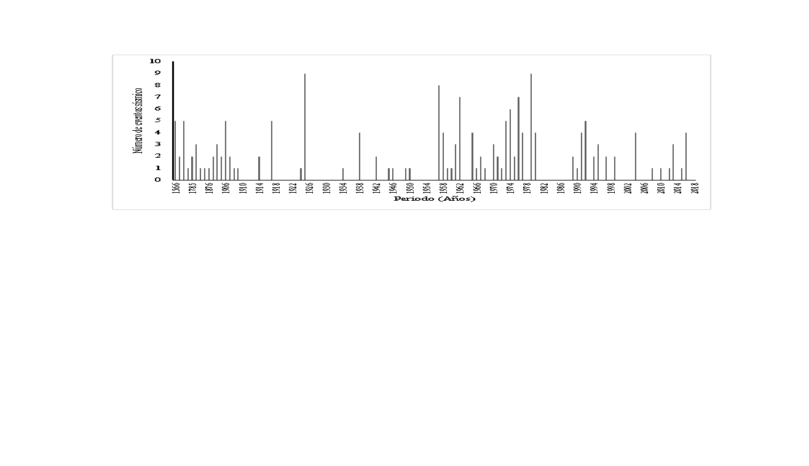

**Figura 4.** Distribución por año del número de sismos para el municipio de Santiago de Cali, ocurridos en el periodo 1566-2018. Fuente: elaboración propia.

La búsqueda documental arrojó un total de 97 eventos sísmicos relevantes para el periodo comprendido entre 1566 y 2018. Es importante mencionar que para el desarrollo del informe de historicidad en la formulación del Plan Municipal de Gestión de Riesgo de Desastre del municipio de Santiago de Cali, se definió como periodo de tiempo de análisis el comprendido entre 1949 y 2018; sin embargo, dada la naturaleza de la sismicidad, en donde los periodos de retorno son largos y su frecuencia de ocurrencia es menor, comparada con otros fenómenos, se decidió realizar la búsqueda documental, solo para este tipo de fenómeno, desde 1566, año en el cual se tiene el primer registro de un terremoto en Colombia, el cual precisamente afectó las poblaciones de Cali y Popayán. Se tomaron sismos sentidos desde la época de la Conquista y la Colonia, que hayan tenido efectos regionales o locales con influencia sobre la ciudad de Cali. \[11,12\].

El estudio de historicidad permite analizar que los eventos sísmicos en la ciudad de Cali, han generado afectaciones de consideración a través de los años en las estructuras y personas, concentrándose en un inicio en lo que ahora se considera el centro de la ciudad, dado que por esa zona inició la urbanización. Para sismos recientes, las afectaciones se han presentado principalmente en la zona del Cono Cañaveralejo, que debido a las características del suelo tiene una respuesta sísmica alta \[6\], sobre todo por sismos regionales que tienen ocurrencia en fuentes sismogénicas lejanas a la ciudad.

### Mapa de sismos históricos del municipio de Santiago de Cali en el periodo 1566–2018

En la Figura 5 se presenta la distribución espacial de los eventos sísmicos encontrados que han generado efectos en el municipio de Santiago de Cali. Para el presente informe, se tomaron los epicentros estimados en el Catálogo de terremotos para América del Sur \[13\] y la información del Catálogo de Sismicidad Histórica de Colombia, del Servicio Geológico de Colombia \[14\] con el fin de mostrar un marco general de la distribución espacial de los eventos sísmicos. Cabe mencionar, que la distribución espacial de los eventos sísmicos se trabaja a una escala regional, dado que su ocurrencia no se presenta de manera puntual sobre el municipio como en el caso de otros fenómenos \[15–24\].

Se puede observar que los sismos que han generado algún impacto sobre el municipio se concentran en gran medida en la zona límite del Valle del Cauca con el Chocó, Quindío y Risaralda \[25–34\].

**Figura 5.** Mapa histórico de eventos sísmicos de influencia en Santiago de Cali. Se representan los eventos sísmicos en diferente tamaño y color de acuerdo con su magnitud. Fuente: elaboración propia.

##  Movimientos en Masa históricos en Santiago de Cali

A continuación, se presentan los resultados sobre los eventos por movimientos en masa ocurridos en la ciudad Santiago de Cali en el periodo entre 1949 y 2018, obtenidos de la búsqueda documental en bases de datos, informes técnicos, periódicos y libros.

### Conceptualización de movimientos en masa

Los movimientos en masa o movimientos de ladera, se definen como "todo desplazamiento hacia abajo (vertical o inclinado en dirección del pie de una ladera) de un volumen de material litológico importante, en el que el principal agente es la gravedad" \[35\]. Para Calvo \[36\], los movimientos de ladera son eventos que suelen asociarse a otros procesos, como los terremotos, lluvias extraordinarias, procesos morfológicos (que no incluyen riesgo necesariamente, como puede ser la erosión fluvial) y la acción antrópica la cual tiene un papel de primer orden al modificar las características del terreno. Los elementos que permiten definir el grado de peligrosidad de un deslizamiento de terreno son la velocidad del fenómeno y la superficie afectada.

### Reportes sobre eventos por movimientos en masa 

Con respecto al número de noticias por movimientos en masa encontrados para el área urbana y rural del municipio Santiago de Cali, en el periodo 1949–2018 se encontraron 342 noticias, siendo los años 2016 y 2017 los que presentan la mayor cantidad de reportes (Fig. 6). En 1999 se muestra un número representativo de 21 noticias, que se relacionan con un periodo de lluvia que afectó significativamente las zonas de ladera de la zona urbana de la ciudad y sus corregimientos. Para los años más recientes las noticias corresponden principalmente a información referente a trabajos de recolección de deslizamientos en todo el municipio \[37–46\].

> El histograma del número de eventos por año denota tres periodos marcados en los cuales el promedio de noticias se duplica o triplica con respecto al primer periodo (Fig. 7). El primer periodo va desde 1949 a 1983, donde el promedio de eventos es 2. El segundo comprende los años 1984 a 1992 con promedio de 4 eventos por año, y finalmente, el tercero corresponde al periodo 1991–2018, donde se aprecian en promedio 9 eventos por año \[47–53\].

**Figura 6.** Distribución anual del número de noticias de movimientos en masa por año en el municipio de Santiago de Cali, periodo 1949–2018. Fuente: elaboración propia.

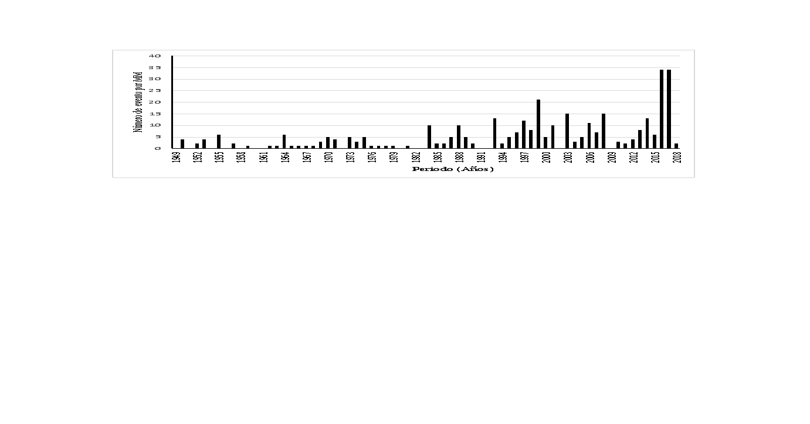

**Figura 7.** Distribución anual del número de eventos por año de movimientos en masa en el municipio Santiago de Cali en periodo 1949–2018. Fuente: elaboración propia.

En lo que se refiere a la distribución en el área de estudio, el 66% de los eventos se presentan en el casco urbano y un 25% en el área rural (Fig. 8a), lo cual puede asociarse al número de viviendas ubicadas en la zona de ladera y actividades desarrolladas en ellas con relación a los corregimientos, el 9% restante no se reporta a un área específica en de las fuentes consultadas.

De la historicidad revisada se encontró, que las zonas más afectadas corresponden a las comunas 20, 18 y 1 (Fig. 8b**)** donde se presentan movimientos en masa tipo deslizamientos de tierra y flujo, provocados por la inestabilidad del terreno en temporada de lluvias. En la comuna 20, los movimientos en masa se concentran principalmente en Siloé, el barrio Brisas de Mayo y Tierra Blanca, en la comuna 18 en el barrio Los Chorros y, finalmente, en la comuna 1 en los barrios Terrón Colorado y Aguacatal (Fig. 9). Los corregimientos de la ciudad también sufren por el desenlace de este fenómeno natural, siendo Felidia, La Buitrera, Los Andes y El Saladito los más afectados (Fig. 10).

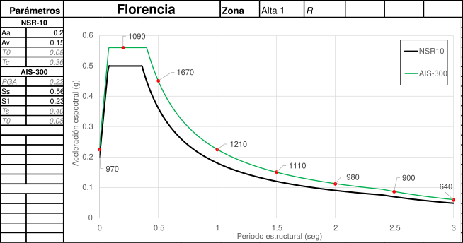

**Figura 8.** Distribución del número por movimientos en masa (MM) por localización en el municipio de Santiago de Cali, durante el periodo 1949 -2018. Representa la distribución de eventos entre el área urbana y rural (izquierda), y la distribución del número de eventos por comunas (derecha). Fuente: elaboración propia.

**Figura 9.** Distribución de eventos de movimientos en masa por barrios en el municipio de Santiago de Cali, durante el periodo 1949 -2018. Fuente: elaboración propia.

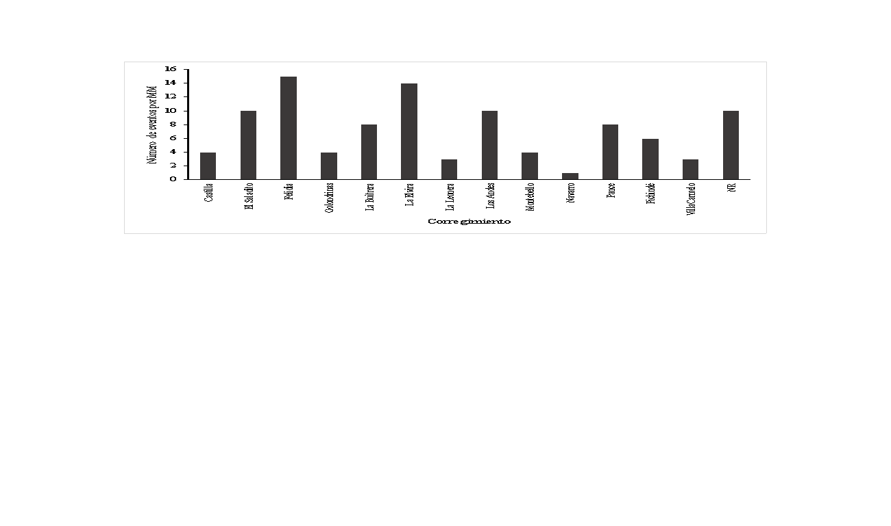

**Figura 10.** Número de eventos de movimientos en masa por corregimiento en el municipio de Santiago de Cali, durante el periodo 1949 -2018. Fuente: elaboración propia.

### Cartografía de movimientos en masa

Con la información obtenida y debidamente espacializada se presentan a continuación los mapas de movimientos en masa para la zona urbana y rural del municipio de Santiago de Cali (Fig. 11 y 12).

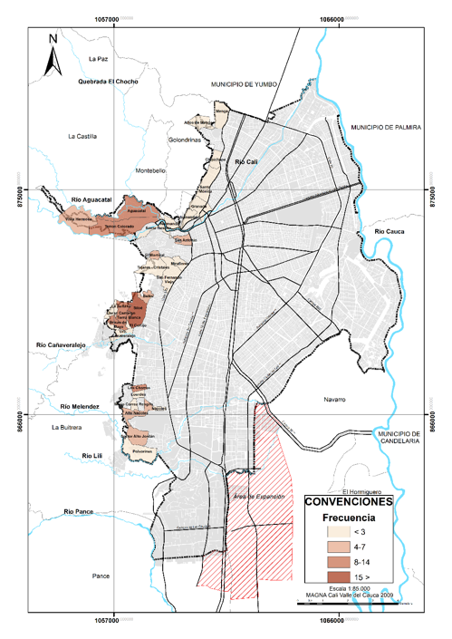

**Figura 11**. Historicidad de movimiento en masa zona urbana. Los colores representan la frecuencia de eventos en cada barrio. Fuente**:** elaboración propia.

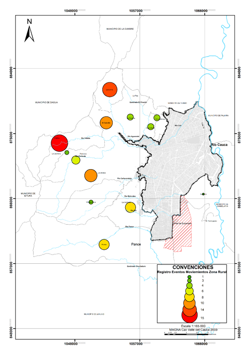

**Figura 12.** Historicidad de movimientos en masa zona rural. Los colores y tamaños de los círculos representan la cantidad de registros por movimientos en masa. Fuente: elaboración propia.

##  Inundaciones históricas en Santiago de Cali

A continuación, se muestran los resultados obtenidos de la búsqueda documental a partir de la consulta en bases de datos, informes técnicos, periódicos y libros, correspondientes a la aplicación rigurosa de la metodología abordada en los primeros apartes del capítulo.

### Conceptualización de inundación

Una inundación es un evento natural y recurrente que se produce como resultado de la acumulación de agua causada por intensas o continuas lluvias sobre áreas planas o llanuras de inundación que, al sobrepasar la capacidad de retención del suelo y de los cauces se desbordan e inundan los terrenos aledaños a los cursos de agua \[54\]. Para el Ministerio de Ambiente y Desarrollo Sostenible – Universidad Nacional de Colombia \[55\], las inundaciones son parte de un proceso natural como respuesta a eventos climáticos de autorregulación del propio ciclo hidrológico.

El territorio colombiano se caracteriza por tener un régimen bimodal, es decir, temporadas alternadas de bajas precipitaciones y altas precipitaciones, en estas últimas hay probabilidad de que se presenten crecientes de los afluentes y cuerpos de agua generando inundaciones que pueden ocasionar afectaciones en la población.

<table>
<tbody>
<tr class="odd">
<td>
<strong>Caja 2. Definiciones para la clasificación de las inundaciones fluviales y pluviales:</strong>

<strong>Inundaciones fluviales por desbordamientos de los ríos:</strong> son causadas por los desbordamientos de los ríos y los arroyos, lo cual se atribuye, en primera instancia, a un excedente de agua. El aumento brusco del volumen de agua que un lecho o cauce es capaz de transportar sin desbordarse produce lo que se denomina como avenida o riada, un mayor aumento del volumen es la causa de la inundación [56].

<strong>Inundaciones pluviales por precipitaciones in situ</strong><em>:</em> son las que se producen por la acumulación de agua de lluvia en un determinado lugar o área geográfica sin que ese fenómeno coincida necesariamente con el desbordamiento de un cauce fluvial. Este tipo de inundación se genera tras un régimen de precipitaciones intensas o persistentes, es decir, por la concentración de un elevado volumen de lluvia en un intervalo de tiempo muy breve o por la incidencia de una precipitación moderada y persistente durante un amplio período de tiempo. Lógicamente, es el primero de estos casos el que conlleva el mayor peligro para la población y sus bienes y el que plantea los principales inconvenientes a los servicios de coordinación e intervención para prevenir y controlar sus daños. Las precipitaciones torrenciales, que se acumulan peligrosamente en un lapso muy breve de tiempo, hacen que el tiempo de respuesta de los servicios de emergencia sea más reducido [56].
</td>
</tr>
</tbody>
</table>

### Reportes sobre eventos por inundación

En la búsqueda de información en diferentes fuentes, se encontró un total de 227 eventos relevantes por inundaciones en el municipio de Santiago de Cali para el periodo comprendido entre 1949 y 2018 \[57– 59\]. En la Figura 13 se muestra el histograma con número de reportes de eventos de inundación que se presentaron por cada año de la ventana de tiempo seleccionada \[60–65\].

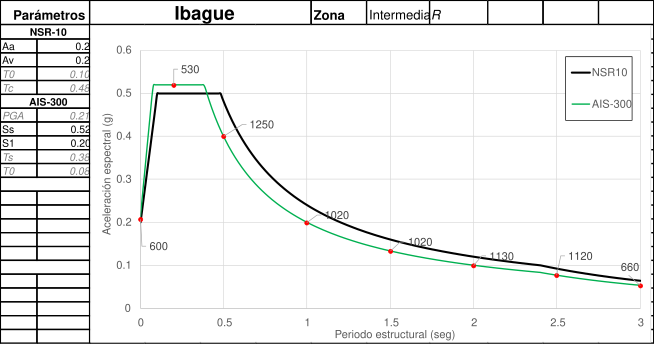

**Figura 13.** Número de reportes sobre eventos por año inundación en el municipio de Santiago de Cali, encontrados en el periodo entre 1949–2018. Fuente**:** elaboración propia.

En la Figura 14a se muestra el número de eventos por inundación que se han presentado en cada una de las comunas del municipio durante el periodo indicado. En la Figura 14b se muestran los eventos por inundación registrados en la zona rural del municipio, donde el corregimiento que más eventos se han registrado es el de Navarro con 40 registros. Seguido por el corregimiento de Pance con 18 eventos registrados. Los corregimientos de El Hormiguero y Montebello se han registrado siete y seis eventos respectivamente. Por último, se encuentran los corregimientos de La Buitrera, La Castilla y Pichinde con un evento cada uno.

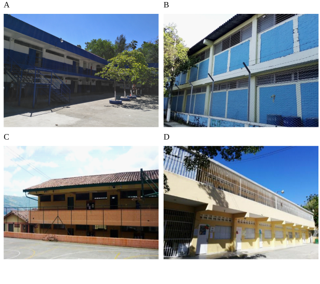

**Figura 14.** Distribución de eventos por inundación en el municipio de Santiago de Cali para el periodo de 1949-2018 (izquierda). Registro de eventos por comunas. Registro por corregimientos (derecha). Fuente: elaboración propia.

Las inundaciones que se presentan en el municipio son pluviales y fluviales (Fig. 15). Se observa que 195 de las inundaciones ocurridas en el municipio Santiago de Cali son pluviales, correspondientes al 61% del total de las inundaciones y 125 son de tipo fluvial, es decir el 39% de total de los eventos que se registraron en el municipio.

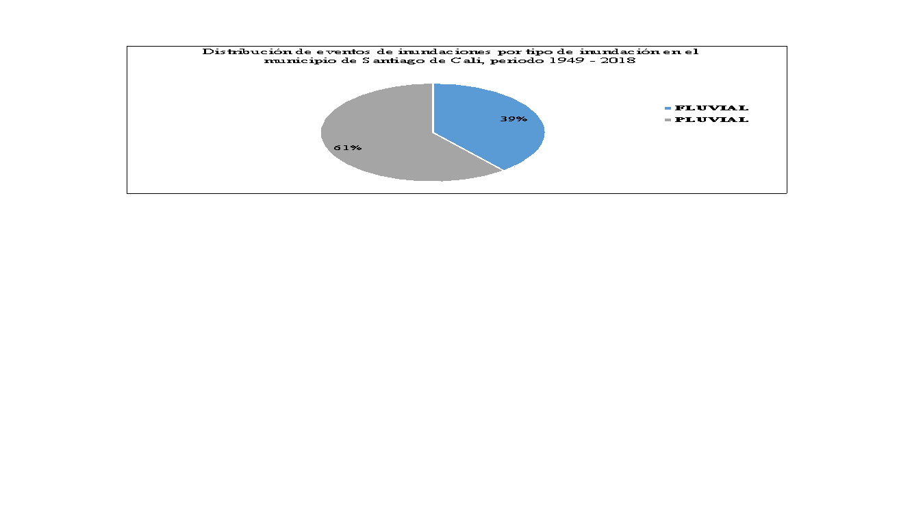

**Figura 15.** Número de eventos por tipo de inundación en el municipio de Santiago de Cali, periodo 1949 – 2018. Fuente: elaboración propia.

Las Figuras 16, 17 y 18 muestran la representación cartográfica o distribución espacial de los eventos por inundación reportados en la ciudad Santiago de Cali.

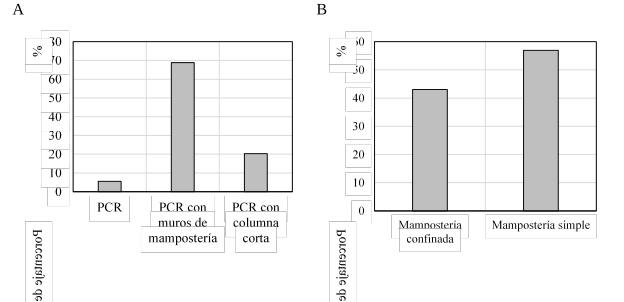

**Figura 16.** Historicidad de eventos de inundación fluvial y pluvial en la zona urbana del municipio de Santiago de Cali. Fuente: elaboración propia.

**Figura 17.** Historicidad de eventos de inundación fluvial en la zona rural del municipio de Santiago de Cali. Fuente: elaboración propia.

**Figura 18.** Historicidad de eventos de inundación pluvial en la zona rural del municipio de Santiago de Cali. Fuente: elaboración propia.

Fueron desarrollados diferentes modelos que generaron artefactos, esto a partir del metamodelo presentado. El primer artefacto de simulación que se presenta se denomina MOJANA: Modelo Organizacional Jerárquico de Agentes Naturales del Agua. Este modelo fue evolucionando a partir de los hallazgos encontrados en campo, dando paso al segundo artefacto denominado MOJANACOOP: Modelo Organizacional Jerárquico de Agentes Naturales del Agua Cooperativos. El tercero MOJANAREAL: Modelo Organizacional Jerárquico de Agentes Naturales del Agua en tiempo real. A continuación, se hace una descripción del desarrollo y resultados de cada uno. Para los dos primeros se utiliza como medio para la integración la plataforma NetLogo y para el tercero, se construye un modelo con actores en el municipio de San Marcos que integran su conocimiento al artefacto.

##  MOJANA: Modelo Organizacional Jerárquico de Agentes Naturales del Agua \[25\]

> **Propósito del modelo:** analizar la influencia de la inundación y de los usos del suelo en las variables correspondientes a la desigualdad en el territorio y las dinámicas de asentamiento. Variables que son conocidas, que se acostumbran a usar en ejercicios de planeación y en la generación de escenarios de desarrollo territorial \[26\].
> 
> **Usuarios y actores:** los usuarios iniciales fueron el equipo de modeladores. Se considera que este tipo de modelos inspirados en una problemática local, pero que no tienen información real del territorio, podrían servir para el diseño de políticas públicas en el marco de la gestión del riesgo por inundación.
> 
> **Conceptualización del sistema:** los procesos que se modelan son el fenómeno de inundación, el aprovechamiento del territorio y la interacción de la población con estos. El territorio está modelado como un autómata celular cuyas celdas albergan una cantidad de grano, que representa la riqueza de dicha unidad territorial, medida no solo en términos de recursos naturales sino también en elementos humanos como infraestructura y servicios, entre otros. El territorio tiene capacidad de regeneración por tanto la cantidad de grano que se consuma puede ser recuperada en el tiempo. Las poblaciones humanas se representan por un sistema de agentes que toman provecho del territorio para mejorar su riqueza acumulada, sin embargo, la no adaptación puede degradarla. La interacción de los agentes con el territorio conlleva al mejoramiento o empobrecimiento de este. Otro autómata celular simula una inundación que se produce periódicamente. El nivel de agua en las unidades territoriales puede ser atractivo o repulsivo para los agentes. Dependiendo de la adaptación del agente al agua, esta degrada o no su bienestar. La presencia periódica de la inundación, la capacidad de regeneración y modificación del territorio sumado a la posibilidad de cambio en los agentes hacen que la herramienta computacional se caracterice por exhibir un entorno variante en el tiempo.
> 
> **Variables a modelar:** en el aplicativo se consideran dos tipos de agentes que emulan el comportamiento de la población en la ecorregión: agrícolas y anfibios. Al comienzo el sistema inicializa el número total de agentes (agrícolas y anfibios); para cada uno de los cuales las rutinas son las mismas por población (i.e. buscar, moverse, asentarse, reproducirse y morir). La principal diferencia entre los dos tipos de agentes consiste en que el proceso de asentarse depende de la condición del territorio (i.e. seco o inundado).

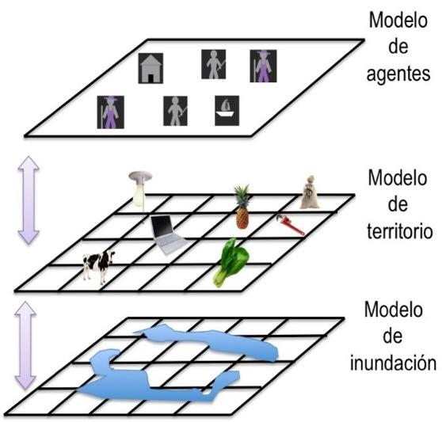

**Figura 7.** Componentes modelo MOJANA \[25\].

> **Disponibilidad de códigos:** integra una jerarquía de tres submodelos (Fig. 7). Estos toman como base a los aplicativos: NetLogo wealth distribution model (Wilensky, 1998), NetLogo Urban Suite-Sprawl Effect model (Felsen y Wilensky, 2007) y NetLogo Erosion model (Dunham, Tisue y Wilensky, 2004) \[25\].
> 
> **Implementación:** se hizo en la plataforma NetLogo y los detalles se pueden encontrar en \[25\] . En la Figura 8 se observa la interfase del artefacto construido en NetLogo.

**Figura 8.** Interfase del modelo MOJANA \[25\]*.*

|                                                                                                       |                                                                                                       |
| ----------------------------------------------------------------------------------------------------- | ----------------------------------------------------------------------------------------------------- |
| 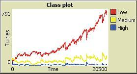 | 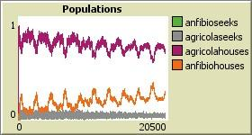 |

**Figura 9.** Resultados del modelo MOJANA (izquierda) Cantidad de agentes por clases sociales. (derecha) Cantidad de agentes por tipos de agentes.

Se observa en la Figura 9 (izquierda), como la clase social baja predomina. Las presiones del entorno son representadas en la cantidad de grano, que seleccionan las clases existentes. En la Figura 9 (derecha) se observa cómo predominan los agrícolas asentados, dado que existe mayor cantidad de territorio sin agua. Un comportamiento similar tiene actualmente la región, donde los niveles de pobreza son muy altos, reflejados en un NBI promedio de: 64.4 y la cantidad de terratenientes es baja.

## MOJANACOOP: Modelo Organizacional Jerárquico de Agentes Naturales del Agua Cooperativos

> **Propósito del modelo:** analizar la influencia de la inundación y de los usos del suelo en la variable correspondientes a la vulnerabilidad social. Esto en el marco del riesgo por inundación.
> 
> **Usuarios y actores:** los usuarios iniciales fueron el equipo de modeladores. Se considera que este tipo de modelos inspirados en una problemática local, pero que no tienen información real del territorio, podrían servir para el diseño de políticas públicas en el marco de la gestión del riesgo por inundación.
> 
> **Conceptualización del sistema:** los procesos que se modelan son el fenómeno de inundación, el aprovechamiento del territorio y la interacción de la población con estos. El territorio está modelado como un autómata celular cuyas celdas albergan una cantidad de grano, que representa la riqueza de dicha unidad territorial, medida no solo en términos de recursos naturales sino también en elementos humanos como infraestructura y servicios, entre otros. El territorio tiene capacidad de regeneración por tanto la cantidad de grano que se consuma puede ser recuperada en el tiempo.
> 
> Las poblaciones humanas se representan por un sistema de agentes que toman provecho del territorio para mejorar su riqueza acumulada, sin embargo, la no adaptación puede degradarla. La interacción de los agentes con el territorio conlleva al mejoramiento o empobrecimiento de este. En esta versión las poblaciones de agentes tienen la capacidad de cooperar. Además, dependiendo de sus características individuales, presentan unos niveles de vulnerabilidad social. Los resultados de un modelo hidrodinámico de la ecorregión representan una inundación que se produce periódicamente. El nivel de agua en las unidades territoriales puede ser atractivo o repulsivo para los agentes. Dependiendo de la adaptación del agente al agua, su vulnerabilidad social cambia. La presencia periódica de la inundación, la capacidad de regeneración y modificación del territorio sumado a la posibilidad de cambio en los agentes hacen que la herramienta computacional se caracterice por exhibir un entorno variante en el tiempo.
> 
> **Variables a modelar:** similar al modelo MOJANA.

**Figura 10.** Interfase del modelo MOJANACOOP \[20\] .

> **Disponibilidad de códigos:** usa los incluidos en MOJANA y además, integra un modelo de cooperación \[24\].
> 
> **Implementación:** la implementación del modelo se hizo en la plataforma NetLogo y los detalles se pueden encontrar en \[20\]. En la Figura 10 se observa la interface del artefacto construido en NetLogo. Las reglas para el cálculo de la vulnerabilidad se presentan en la Tabla 4:

**Tabla 4.** Reglas de cálculo para la vulnerabilidad social.

| **Variables por agente**       | **Condición**                                                 | **Nivel de vulnerabilidad** | **Valores** |
| ------------------------------ | ------------------------------------------------------------- | --------------------------- | ----------- |
| Habitabilidad                  | Si el agente se adapta a la condición de inundación o seca    | Vulnerabilidad baja         | 0           |
| Habitabilidad                  | Si el agente no se adapta a la condición de inundación o seca | Vulnerabilidad alta         | 1           |
| Actividades productivas        | Clase alta                                                    | Vulnerabilidad baja         | 0           |
| Actividades productivas        | Clase media                                                   | Vulnerabilidad baja         | 0.5         |
| Actividades productivas        | Clase baja                                                    | Vulnerabilidad baja         | 1           |
| Cooperación                    | Coopera                                                       | Vulnerabilidad baja         | 0           |
| Cooperación                    | No coopera                                                    | Vulnerabilidad alta         | 1           |
| Educación                      | Nivel de educación: alto                                      | Vulnerabilidad baja         | 0           |
| Educación                      | Nivel de educación: medio                                     | Vulnerabilidad media        | 0.5         |
| Educación                      | Nivel de educación: bajo                                      | Vulnerabilidad alta         | 1           |
| Salud                          | Nivel de salud: alto                                          | Vulnerabilidad baja         | 0           |
| Salud                          | Nivel de salud: medio                                         | Vulnerabilidad media        | 0.5         |
| Salud                          | Nivel de salud: bajo                                          | Vulnerabilidad alta         | 1           |
| Salud en función de la amenaza | Si el agua sube más de 40 cm                                  | Vulnerabilidad alta         | 1           |
| Salud en función de la amenaza | Si el agua no sube más de 40 cm                               | Vulnerabilidad baja         | 0           |
| Vulnerabilidad social          | Corresponde a la sumatoria de las variables anteriores        | Vulnerabilidad social alta  | 4.5-6       |
| Vulnerabilidad social          | Corresponde a la sumatoria de las variables anteriores        | Vulnerabilidad social media | 1.5-4.49    |
| Vulnerabilidad social          | Corresponde a la sumatoria de las variables anteriores        | Vulnerabilidad social baja  | 0-1.49      |

|                                                                                                       |                                                                                                       |
| ----------------------------------------------------------------------------------------------------- | ----------------------------------------------------------------------------------------------------- |
| 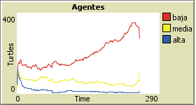 | 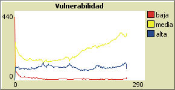 |

**Figura 11.** Resultados del modelo MOJANACOOP. Cantidad de agentes por clases sociales (izquierda). Cantidad de agentes acorde a los niveles de vulnerabilidad social (derecha).

Se observa en la Figura 11 (izquierda), como la clase social baja predomina, seguida de la media y la alta. Las presiones del entorno son representadas en la cantidad de grano, que seleccionan las clases existentes. En la Figura 11 (derecha) se observa como la vulnerabilidad media es la predominante. Este resultado fue similar en el proyecto generado por la Unidad Nacional para la Gestión del Riesgo de Desastres \[27\]. Los factores que inciden en este valor son: las condiciones de habitabilidad, las actividades productivas, la capacidad de cooperación y, el acceso a educación y salud.

## MOJANAREAL: Modelo Organizacional Jerárquico de Agentes Naturales del Agua en tiempo real 

> **Propósito del modelo:** generar escenarios de inundación para la ecorregión de la Mojana, donde se puedan discutir estrategias para disminuir la vulnerabilidad social en el territorio. Esto se propone a través de un ejercicio de modelado participativo.
> 
> **Usuarios y actores:** los actores que participaron fueron los padres de familia, profesores y estudiantes del grado noveno, de la Institución Educativa San José San Marcos. Los usuarios son los demás grados de la Institución, liderado por los coordinadores del curso.
> 
> **Conceptualización del sistema:** los procesos que se modelan son el fenómeno de inundación, el aprovechamiento del territorio y la interacción de la población con estos. El territorio está modelado utilizando fichas de color azul y de color verde. Las primeras corresponden a las zonas inundadas y las segundas a las zonas secas. En dichas celdas, se encuentran recursos naturales como fauna y flora. También se ubican las viviendas, las canoas, y la infraestructura es dibujada (puente, vía y monumento a la cultura anfibia). Las poblaciones humanas están representadas por familias, a las cuales pertenecen las diferentes viviendas y las cuales llevan a cabo diversas actividades productivas. La interacción de las personas con el territorio conlleva a aumentar o disminuir la vulnerabilidad social. La inundación se produce de manera hipotética en la generación de los escenarios. Esto se hace precisando un nivel del agua que aumenta en las unidades territoriales. El cual puede ser atractivo o repulsivo para las familias. Dependiendo de la adaptación de la población al agua, esta disminuye o no su vulnerabilidad social. La presencia periódica de la inundación, la modificación del territorio sumado a la posibilidad de cambio en la población y sus viviendas hacen que el artefacto se caracterice por exhibir un entorno variante en el tiempo.
> 
> **Variables a modelar:** se consideran dos tipos de agentes que emulan el comportamiento de la población en la ecorregión: agrícolas y anfibios. Esto es caracterizado acorde al tipo de vivienda que cada familia tiene. Al comienzo el sistema inicializa el número total de agentes (agrícolas y anfibios) que hacen parte de cada familia. La principal diferencia entre los dos tipos de agentes consiste en que el proceso de asentarse depende de la condición del territorio y de la tipología de las viviendas. Las rutinas se predefinen en función de la caracterización de la familia.
> 
> **Disponibilidad de códigos:** MOJANAREAL utiliza un ejercicio de juego de rol como metodología.
> 
> **Implementación:** la implementación del modelo se hizo en tiempo real, como se observa en la
> 
> Figura 12.
> 
> 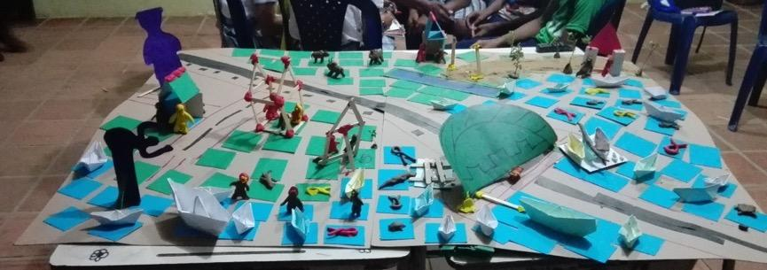

**Figura 12.** MOJANAREAL.

Respecto a la resolución del modelo, hay cuatro formas de aproximación para la generación de salidas de modelos. La usada en este caso es: escenarios, donde el modelo es desarrollado para analizar los cambios en la vulnerabilidad social de la población, generados por la inundación y los usos del suelo. Se usó el análisis tipo ¿y si? para explorar resultados de diferentes acciones y sus efectos.

**Escenario 1 de condiciones iniciales:** se construye por parte de los participantes el estado actual del territorio. Se representa la zona de inundación y agrícola del municipio de San Marcos. Los cuadrados azules representan el agua y los verdes las zonas de cultivos. Son localizadas las casas teniendo en cuenta los patrones de ocupación del territorio. Se diseñan las casas dependiendo de la zona donde se encuentran ubicadas. Son localizados los peces y demás animales. Así como la vegetación. Se definen el número de familias, su conformación y la dedicación laboral (pesca o agricultura). Son localizadas las personas en el modelo. Así como las canoas. Por iniciativa de los actores, se incluyen obras de infraestructura importantes: puente, vía y monumentos.

**Escenario 2 de condiciones de inundación:** llega la inundación y el agua sube hasta las rodillas de las personas, se hace el escenario moviendo los diferentes elementos del modelo, de qué impacto tiene este fenómeno. Cada grupo construye un relato de lo que ocurre en un día con esta situación.

**Escenario 3 condiciones de inundación:** llega la inundación y el agua sube hasta las rodillas de las personas, se hace un escenario deseado moviendo los diferentes elementos del modelo, de qué acciones tendrían que implementarse en los hogares para disminuir la vulnerabilidad social y física.

> Algunos de los resultados de la modelación participativa se presentan a continuación:
> 
> Grupo 1: *Llegó la inundación, el esposo y su mujer al ver que el agua le llegaba arriba de la rodilla decidieron alzar sus pertenencias para que no se les dañaran sus pertenencias. Dialogaron y decidieron no salir por temor a que los picara una culebra o algo, sabiendo el riesgo que correrían respecto a enfermedades. También esperando alguna ayuda comunitaria. A pesar de su desesperación al ver que el agua no bajara y no llegara ayuda, se sintieron frustrados. Llegaron a un punto en que no sabían que hacer. Nerviosos a la situación empezaron a discutir que el esposo llegó a un punto, donde decidió salir, sin saber lo que le ocurriría.*
> 
> Grupo 2: *Ante la situación los esposos no perdieron las esperanzas y trabajaron en unión y equipo para enfrentar la situación vivida. Y aunque la inundación empeoraba, ellos siguieron y lucharon y decidieron alzar la casa para que el agua no inundara la casa. Cuando llega la inundación, unos quedan, otros se van. Para no afectar la salud de los bebes cogen mucha infección, le afecta, les hace daño, les da gripa y se les aprieta el pechito a los más débiles y hay veces que el carnet que no les da apoyo y hay que mandar a la EPS. Y tampoco les cubren las medicinas. Cuando llega la inundación, lo que nosotros creemos que lo mejor para las personas que viven en esas casas afectadas, es que las trasladen a zonas más altas para que las inundaciones no las afecten en problemas de salud, de educación. Aunque hay algunas personas que se quedan viviendo en esas zonas inundadas porque hacen construcciones de tambos que hacen más resistentes las casas.*

