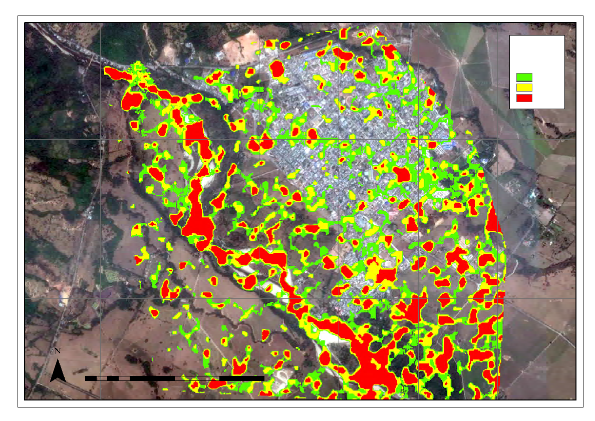
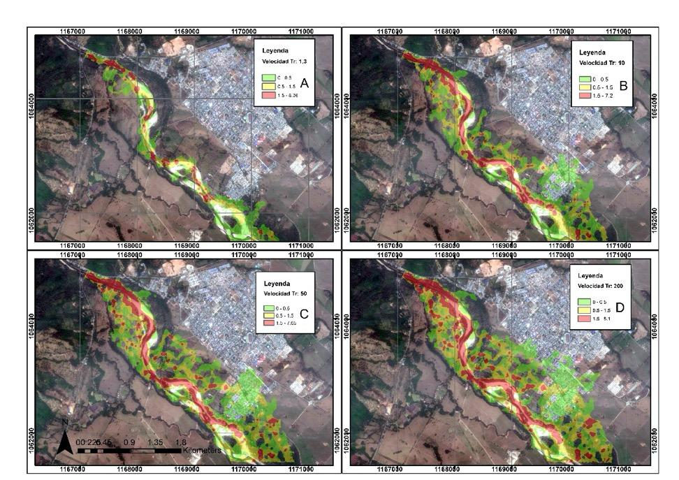
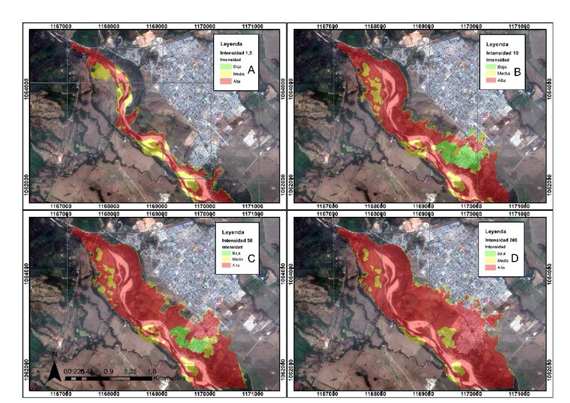
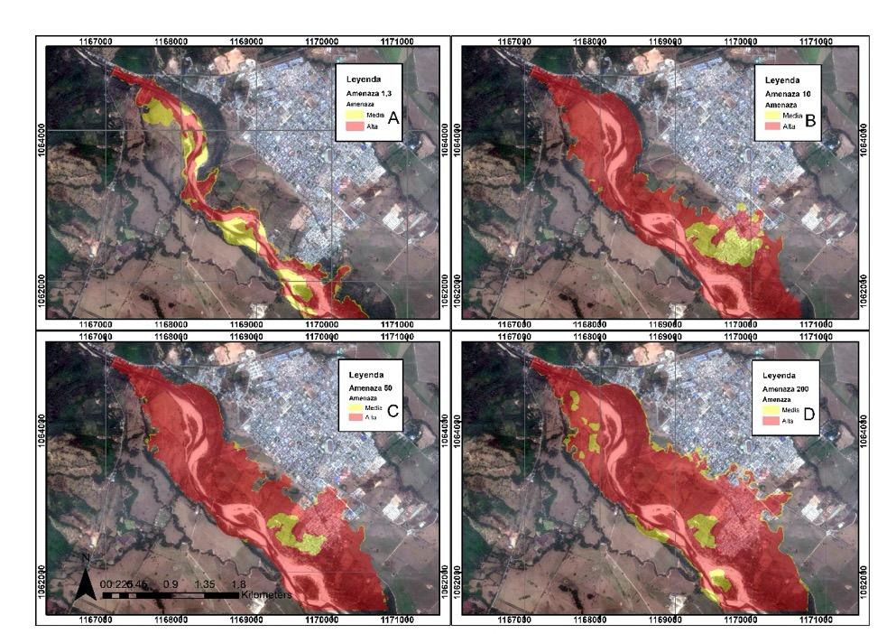
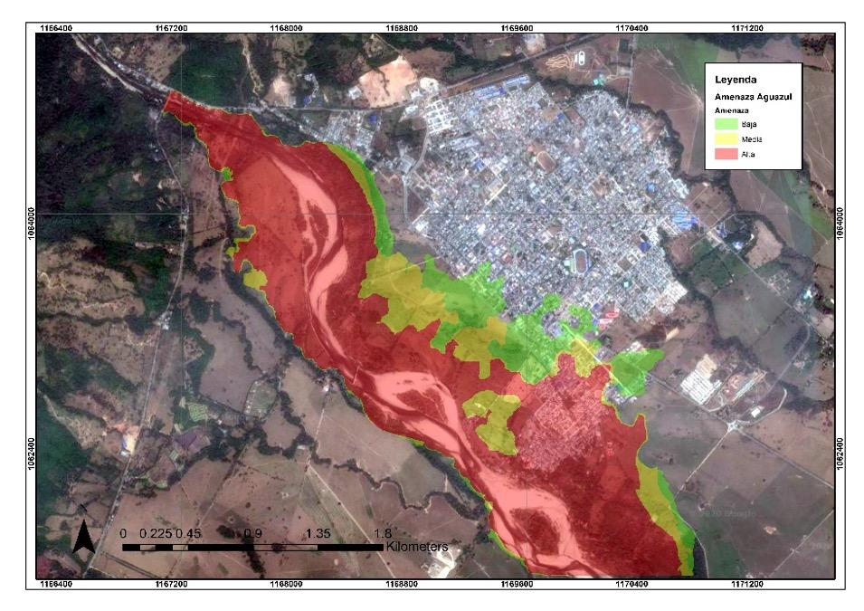

La modelación hidráulica considerando únicamente el DEM (12.5 × 12.5 metros) como el relieve, no permitió definir con claridad el lecho del río y arrojó el desbordamiento del río por toda el área urbana, lo cual no resulta razonable a partir de los antecedentes históricos ni con las geoformas identificadas que incluyeron terrazas altas en donde se posiciona la mayor parte del área urbana (Fig. 15).

**Figura 15.** Resultados de profundidad para la modelación hidráulica considerando el modelo digital de elevación obtenido de ALOS PALSAR para un tiempo de retorno de 200 años. Los resultados sin topografía demuestran la importancia del trabajo de campo para el desarrollo de modelos hidráulicos en Iber 2D.

Una vez complementado el DEM con las secciones trasversales, la simulación hidráulica en Iber 2D arrojó mapas de profundidad de flujo donde se identifica con claridad el lecho del río y la inundación aumenta progresivamente conforme al periodo de retorno, al incluir las secciones transversales se permite que el modelo reconozca el lecho del río como zona de flujo preferente y se reduzca la afectación en las zonas de terraza y planicies de inundación, pasando de parches desconectados a zonas inundadas más compactas.

Se observa que, para el periodo de retorno de 1.3 años, correspondiente con la creciente anual (361.78 m3/s), se afecta un sector del barrio Las Vegas, coincidiendo con lo expuesto en las encuestas. El área afectada por las inundaciones aumenta progresivamente con el periodo de retorno, de tal forma que el río Unete alcanza en su lecho profundidades máximas de 12.28 m para un tiempo de retorno de 10 años (1,161.3 m3/s), 12.48 m para un tiempo de retorno de 50 años (1,645.65 m3/s) y 12.64m para un tiempo de retorno de 200 años (2,054.43 m3/s). Los barrios más afectados son: Los Esteros, Las Vegas, Villaluz y El Porvenir (Fig. 16).

 **Figura 16.** Mapa de profundidad de flujo en el río Unete según período de retorno.

En la figura anterior se observa que la profundidad y área inundada con la creciente con periodo de retorno de 1.3 años representa la condición anual del río Unete con una probabilidad de ocurrencia del 80% (Fig. 16A). La profundidad correspondiente a un periodo de retorno representa una probabilidad de ocurrencia del 10%, condición en la cual se afectan parcialmente de 10 años, los barrios Villaluz y Porvenir (Fig. 16B). La profundidad correspondiente a un periodo de retorno de 50 años, representa una probabilidad de ocurrencia del 2% afectando todo el barrio Porvenir (Fig. 16C). Por su parte, la profundidad correspondiente a un periodo de retorno de 200 años representa una probabilidad de ocurrencia de 0.5%, superando la rasante de la Calle 7 y afectando otros barrios y la estación de bomberos (Fig. 16D).

Lo anterior refleja la importancia del trabajo de campo, por cuanto al predominar una topografía plana y ante la ausencia de grandes cambios de nivel entre geoformas, el DEM no logra diferenciar entre el cauce principal, cauces secundarios, terrazas y planiciesinundables. No obstante, aún se observan parches de zonas inundadas aparentemente desconectadas, condición que no corresponde con la realidad y que en la simulación es resultado de la sobreestimación de la elevación en algunas celdas del DEM por la presencia de vegetación densa y cercas vivas \[15\], razón por la cual se hace preciso editar en formato vector las manchas de inundación uniendo zonas que según resultados de IBER están aisladas.

La velocidad máxima registrada para el periodo de retorno de 10 años fue de 7.19 m/s, para el periodo de retorno de 50 años fue de 7.65 m/s y para el periodo de retorno de 200 años fue de 8.1 m/s. La simulación demuestra que las zonas de mayor velocidad corresponden al lecho o cauce principal del río en el cual también se registraron las profundidades máximas, además se evidencia que las velocidades disminuyen en las zonas donde se desborda el río, esto debido al cambio del coeficiente de rugosidad de Manning puesto que la vegetación disminuye la velocidad del flujo significativamente (Fig. 17).

**Figura 75.** Mapa de velocidad de flujo en el río Unete según período de retorno.

En el periodo de retorno de 10 años aumenta la inundación en los barrios Los Esteros y Las Vegas y se observa afectación adicional en los barrios Villaluz y El Porvenir. Adicionalmente, se reconoce que la función principal del muro de contención es el control geomorfológico debido a que una vez que el nivel del agua sobrepasa el muro, el flujo sigue la geoforma del río, que corresponde con un canal de estiaje o una vega, afectando las viviendas localizadas en dicha geoforma (Fig. 18).

A partir de los resultados de la modelación hidráulica se determina que en el barrio Los Esteros se presenta una inundación dinámica con una intensidad alta producto de un cauce más estrecho y un flujo más veloz, mientras que en los barrios Las Vegas, El Porvenir y Villaluz se presenta una inundación estática asociada al cambio hacia un rio trenzado con planicies de desborde, y a la derivación de parte del flujo hacia el caño El Samán.

Para el periodo de retorno de 50 años se observa un aumento en el área e intensidad en los barrios Villaluz y Los Esteros, especialmente en inmediaciones al caño El Samán, por donde se desarrolla una zona de flujo preferente, es así que, el barrio El Porvenir progresivamente va quedando aislado del casco urbano, limitando las posibles acciones de evacuación y atención de la emergencia. Finalmente, en el periodo de retorno de 200 años se evidenció una afectación total con una intensidad alta en los barrios El Porvenir, Las Vegas, Los Esteros, Villaluz. Así mismo, la Estación de Bomberos y los barrios San Agustín y El Centro se empiezan a afectarse por la inundación (Fig. 18).

En la Figura 18A se observa que la intensidad correspondiente a un periodo de retorno de 1.3 años, representa la condición anual del río Unete en la cual la creciente es contenida por el lecho del río sin afectar ningún área urbana. La intensidad de la creciente para un período de retorno de 10 años representa una probabilidad de ocurrencia del 10% en cuyo caso el barrio Las Vegas (Fig. 18B) y Los Esteros alcanzan una valoración de alta y el barrio Porvenir baja (Fig. 18C). El mapa de intensidad de amenaza por inundación en el río Unete para un período de retorno de 50 años demuestra un aumento en extensión e intensidad en los barrios Villaluz y Porvenir donde predomina una amenaza alta (Fig. 18D). Para la creciente con período de retorno de 200 años la mayor parte del área inundable alcanza una valoración de alta con una probabilidad de ocurrencia del 0.5%, llegando hasta el barrio San Agustín y Centro.

**Figura 76.** Mapa de intensidad de amenaza por inundación en el río Unete según período de retorno.

Considerando que el 100% del área afectada corresponde al periodo de retorno de 200 años con un área 460.97 hectáreas, se determinó el porcentaje de afectación para cada periodo de retorno, según se indica a continuación (Figura 77).

**Tabla 7.** Clasificación de territorio afectado por inundación del río Unete.

<table>
<thead>
<tr class="header">
<th><blockquote>

<strong>Periodo de retorno</strong>

<strong>(años)</strong>

</blockquote></th>
<th><blockquote>

<strong>Territorio afectado</strong>

<strong>(ha)</strong>

</blockquote></th>
<th><blockquote>

<strong>Porcentaje</strong>

<strong>respecto a Tr 200 (%)</strong>

</blockquote></th>
<th><blockquote>

<strong>Calificación</strong>

</blockquote></th>
</tr>
</thead>
<tbody>
<tr class="odd">
<td><blockquote>

200

</blockquote></td>
<td><blockquote>

460.97

</blockquote></td>
<td><blockquote>

100

</blockquote></td>
<td><blockquote>

3

</blockquote></td>
</tr>
<tr class="even">
<td><blockquote>

50

</blockquote></td>
<td><blockquote>

400.58

</blockquote></td>
<td><blockquote>

86.9

</blockquote></td>
<td><blockquote>

3

</blockquote></td>
</tr>
<tr class="odd">
<td><blockquote>

10

</blockquote></td>
<td><blockquote>

347.64

</blockquote></td>
<td><blockquote>

75.4

</blockquote></td>
<td><blockquote>

2

</blockquote></td>
</tr>
<tr class="even">
<td><blockquote>

1.3

</blockquote></td>
<td><blockquote>

163.39

</blockquote></td>
<td><blockquote>

35.5

</blockquote></td>
<td><blockquote>

1

</blockquote></td>
</tr>
</tbody>
</table>

**Figura 19.** Mapa de área según frecuencia. Las áreas identificadas corresponden a los periodos de retorno de 10, 50 y 200 años.

Como resultado de la suma o combinación de intensidad, frecuencia y territorio afectado se obtuvo la amenaza de cada periodo de retorno, según tres intervalos de valores entre 1 y 3 que corresponden a amenaza baja, entre 3 y 6 a amenaza media y entre 6 y 9 amenaza alta, concluyendo que todo el territorio alcanza una amenaza entre media (amarillo) y alta (rojo) (Fig. 20).

**Figura 20.** Mapa de amenaza por inundación en el río Unete según período de retorno.

En la figura anterior (Fig. 20A), la amenaza correspondiente a un periodo de retorno de 1.3 años representa la condición anual del río Unete. A partir de la creciente con período de retorno de 10 años los barrios Los Esteros y Las Vegas se afectan con amenaza alta, con una probabilidad de ocurrencia del 10% (Fig. 20B). Para la creciente con período de retorno de 50 años los barrios Villaluz y Porvenir llegan a amenaza alta (Fig. 20C), condición que se incrementa con la inundación en el río Unete para un período de retorno de 200 años (Fig. 20D).

De acuerdo con los resultados obtenidos de los mapas de amenaza parciales se construyó el mapa de amenaza definitivo a partir del promedio de la amenaza en cada periodo de retorno, reflejando la situación del municipio Aguazul debido al desbordamiento del río Unete (Fig. 21).

**Figura 21.** Mapa de amenaza por inundación en el municipio de Aguazul. La clasificación de amenaza por inundación se realizó a partir de los periodos de retorno de 10, 50 y 200 años.

De esta manera se concluye que Los barrios Los Esteros, Las Vegas y El Porvenir obtuvieron una calificación de amenaza alta, por otro lado, el barrio Villaluz presenta una transición entre los tres niveles de amenaza, mientras que barrios como San Agustín y El Centro solo alcanzan una amenaza baja.

Igualmente, se evidencia que la afectación por inundación por la creciente con periodo de retorno de 10 años coincide con los antecedentes registrados el 17 de agosto de 2002, en los cuales el desbordamiento del río Unete afectó los barrios El Porvenir, Villaluz, Los Esteros y Los Guaduales.

En los resultados obtenidos de la modelación hidráulica se observa que el río Unete no desborda por la margen del río opuesta al municipio, esto se justifica por la presencia de terrazas de acumulación alta (Fig. 7) con menor susceptibilidad a inundación y que funcionan como barreras protectoras, que impiden el desbordamiento hacia la margen derecha, por tanto, el río siempre va a desbordar hacia el área urbana en la margen izquierda, donde las geoformas de planicie aluvial, planicie aluvial, terraza baja y terraza de acumulación subreciente tienen una susceptibilidad alta y media ante inundaciones.

