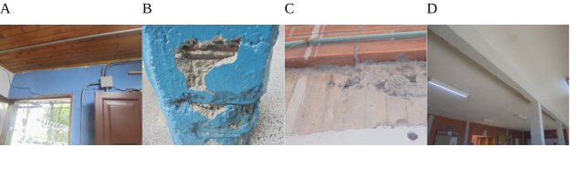
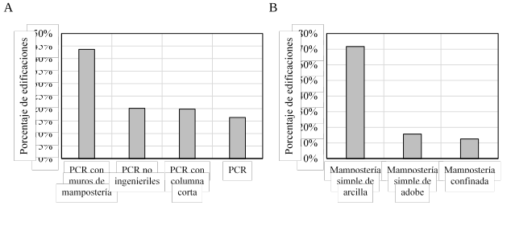
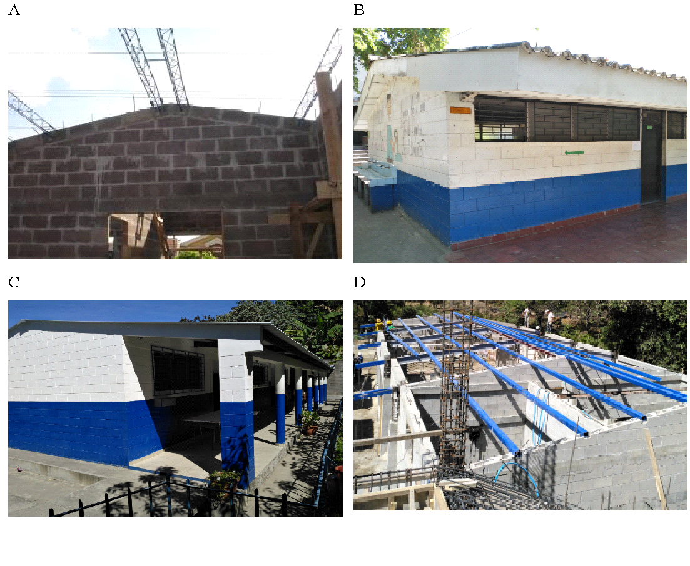
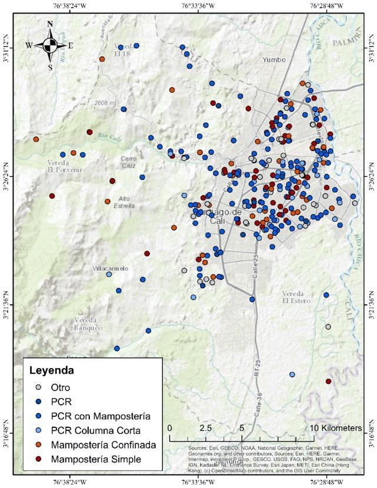
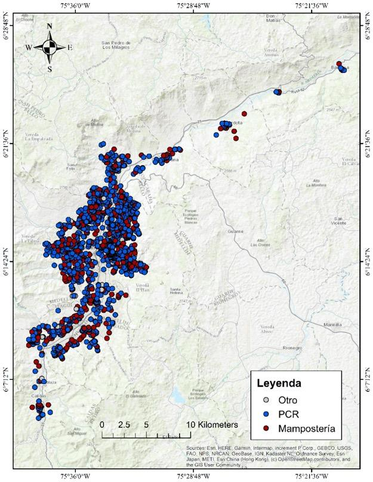
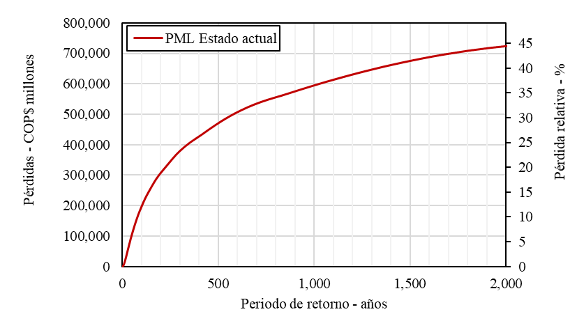
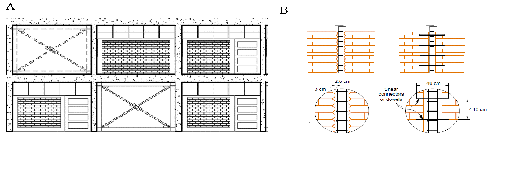

El primer paso para la reducción del riesgo en el sector es consolidar el portafolio de edificaciones. Por las características arquitectónicas de este tipo de edificaciones es común encontrar edificaciones cuyas características se repiten en diferentes países. En particular, se ha evidenciado que la mayor parte de estas edificaciones son de concreto reforzado o de mampostería \[6\]. En este capítulo se presentan algunas de estas tipologías comunes en el sector escolar. En primer lugar, se presentan las tipologías cuyo sistema estructural es principalmente de concreto reforzado y en después se presentan las tipologías de muros de mampostería.

1.  ## Tipologías de concreto reforzado
    
    1.  ### Pórticos de concreto reforzado

En este sistema, los muros divisorios no contribuyen a la resistencia lateral o vertical de la edificación. Las divisiones pueden ser ligeras o flexibles como el Drywall por lo que su efecto en el aumento de la rigidez sería despreciable. También se puede dar el caso que las divisiones sean pesadas y rígidas como muros de mampostería, pero estas deben estar dilatadas de la estructura mediante juntas flexibles. En la Figura 5 se identifican ejemplos de este tipo de edificaciones. Estas edificaciones son usualmente de uno y dos pisos y su nivel de diseño es variable.

**Figura 5.** Ejemplos de pórticos de concreto reforzado resistente a momento. (**A**) Edificación escolar en Perú. (**B**) Edificación escolar en Colombia. (**C**) Edificación escolar en Colombia. (**D**) Edificación escolar en República Dominicana. Fotos tomadas del GPSS y del archivo personal de los autores.

### Pórticos de concreto reforzado con muros de mampostería

En este sistema, los muros divisorios contribuyen a la resistencia lateral y en algunos casos vertical de la edificación. Los muros divisorios se integran al sistema estructural principal y suelen tener un comportamiento frágil. Estas edificaciones tienen alta rigidez en el rango lineal sin embargo suelen tener poca ductilidad. En la Figura 6 se identifican ejemplos de este tipo de edificaciones. Estas edificaciones suelen ser de uno y dos pisos y su nivel de diseño de bajo a medio.

**Figura 6.** Ejemplos de pórticos de concreto reforzado resistente a momento con muros de mampostería integrados. (**A**) Edificación escolar en Nepal. (**B**) Edificación escolar en Colombia. (**C**) Edificación escolar en Colombia. (**D**) Edificación escolar en Colombia. Fotos tomadas del GPSS y del archivo personal de los autores.

### Pórticos de concreto reforzado con muros de mampostería generando columna corta

En este sistema, los muros divisorios contribuyen a la resistencia lateral, pero presentan una deficiencia común denominada “columna corta”. Los muros divisorios se integran al sistema estructural principal y suelen tener un comportamiento frágil, sin embargo, inducen a esfuerzos cortantes excesivos a la parte libre de la columna debido a la diferencia de rigideces \[31\]. Estas edificaciones presentan una alta vulnerabilidad por su comportamiento frágil \[29\]. Este tipo de edificaciones son muy comunes en el contexto de la infraestructura escolar como se verá más adelante. En la Figura 7 se identifican ejemplos de este tipo de edificaciones. Estas edificaciones suelen ser de dos pisos y tener un nivel de diseño bajo a medio.

**Figura 7.** Ejemplos de pórticos de concreto reforzado resistente a momento con muros de mampostería generando columna corta. (**A**) Edificación escolar en Perú. (**B**) Edificación escolar en El Salvador. (**C**) Edificación escolar en Colombia. (**D**) Edificación escolar en República Dominicana. Fotos tomadas del GPSS y del archivo personal de los autores.

2.  ## Tipologías de mampostería
    
    1.  ### Mampostería no reforzada

Son edificaciones construidos con bloque de mampostería de diferentes calidades y materiales que comparten la característica de no tener ningún tipo de confinamiento ni vertical ni horizontal. En Latinoamérica es común encontrar este tipo de edificaciones con mampostería de arcilla, maciza o con perforaciones horizontales \[32\]. Este tipo de edificaciones presentan una alta vulnerabilidad sísmica y su comportamiento estructural se caracteriza por ser frágil. En sismos recientes se han presentado colapsos de este tipo de edificaciones \[33\]. En la Figura 8 se pueden identificar algunos ejemplos de este tipo de edificaciones, las cuales suelen ser de 1 piso y tener un nivel de diseño sísmico bajo.

**Figura 8.** Ejemplos de edificaciones de mampostería simple. (**A**) Edificación escolar en El Salvador. (**B**) Edificación escolar en Colombia. (**C**) Edificación escolar en Nepal. (**D**) Edificación escolar en Colombia. Fotos tomadas del GPSS y del archivo personal de los autores.

### Mampostería confinada

Son edificaciones cuyo sistema de resistencia sísmica son muros de mampostería confinados por elementos de concreto reforzado vertical y horizontal. El nivel de confinamiento tanto vertical como horizontal es variable según el país y sus normativas de construcción sismo resistente. En Colombia se tiene que los elementos confinantes no deben estar separados a más de 4 metros y deben estar en las aberturas de puertas y ventanas \[18\]. Estas edificaciones presentan una mayor ductilidad que las de mampostería no reforzada. En ciertos casos se pueden presentar fallas fuera del plano en este tipo de edificaciones \[34\]. En la Figura 9 pueden identificarse ejemplos de este tipo de edificaciones, las cuales suelen ser de uno y dos pisos y tener un nivel de diseño sísmico medio a alto.

**Figura 9.** Ejemplos de edificaciones de mampostería confinada. (**A**) Edificación escolar en Colombia. (**B**) Edificación escolar en Colombia. (**C**) Edificación escolar en El Salvador. (**D**) Edificación escolar en Colombia. Fotos tomadas del GPSS y del archivo personal de los autores.

### Mampostería reforzada

El sistema de mampostería reforzada es un sistema de muros de mampostería con elementos de confinamiento interno. A diferencia del sistema de mampostería confinada, en este sistema los elementos de confinamiento son internos. Los bloques de mampostería son bloque de perforación vertical de arcilla o de concreto, usualmente de buena calidad. Este sistema se ha implementado ampliamente en países de Centroamérica como El Salvador, en donde se ha evidenciado un buen comportamiento sísmico \[35\]. En la Figura 10 pueden identificarse algunos ejemplos de este tipo de edificaciones. Suelen ser de uno y dos pisos y tener un nivel de diseño sísmico medio a alto.

**Figura 10.** Ejemplos de edificaciones de mampostería reforzada. (**A**) Edificación escolar en Colombia. (**B**) Edificación escolar en El Salvador. (**C**) Edificación escolar en El Salvador. (**D**) Edificación escolar en construcción en El Salvador. Fotos tomadas del GPSS y del archivo personal de los autores.

<table>
<tbody>
<tr class="odd">
<td>
<strong>Caja 1. Tipologías escolares en concreto reforzado y en mampostería</strong>

<strong>Tipologías escolares principales en concreto reforzado:</strong>

<ul>
<li><blockquote>

Pórticos de concreto reforzado.

</blockquote></li>
<li><blockquote>

Pórticos de concreto reforzado con muros de mampostería.

</blockquote></li>
<li><blockquote>

Pórticos de concreto reforzado con muros de mampostería generando columna corta.

</blockquote></li>
</ul>

<strong>Tipologías escolares predominantes en mampostería:</strong>

<ul>
<li><blockquote>

Mampostería no reforzada.

</blockquote></li>
<li><blockquote>

Mampostería confinada.

</blockquote></li>
<li><blockquote>

Mampostería reforzada.

</blockquote></li>
</ul></td>
</tr>
</tbody>
</table>

4.  # CASOS DE ESTUDIO
    
    1.  ## Cali, Colombia

La Universidad de los Andes, en el marco del Programa Global de Escuelas Seguras (GPSS) del Banco Mundial, realizó el acompañamiento técnico a la Alcaldía de Cali con el objetivo de diseñar un plan de intervención a corto, mediano y largo plazo para reducir la vulnerabilidad de la infraestructura educativa del Municipio de Cali frente a amenazas naturales y cambio climático en el marco de la política de Mejoramiento de Ambientes Escolares del Municipio de Cali.

En este proyecto los autores capacitaron a un grupo de ingenieros y arquitectos de la Alcaldía de Cali para realizar recolección de información de la infraestructura en todas las escuelas del municipio. A partir de la información recopilada, se compila una base de datos de infraestructura a nivel de edificación que incluye información del valor expuesto, la ocupación humana y la caracterización de su vulnerabilidad sísmica para todos los elementos del portafolio. La Figura 11 presenta la distribución espacial de 372 sedes educativas del municipio y su sistema estructural asociado.

**Figura 11.** Distribución espacial del portafolio escolar de Cali. PCR corresponde a pórticos de concreto reforzado.

Como resultado final del procesamiento de la información y los datos del levantamiento en campo, se obtienen resultados generales con el fin de caracterizar el modelo de exposición escolar del municipio de Cali. A continuación, se muestra el resumen de la información obtenida:

  - > Número total de sedes educativas: 373.

  - > Número total de edificaciones: 1,224.

  - > Ocupación total: 92,013.

  - > Área construida: 417,220 m2.

  - > Valoración total aproximada del portafolio: COP $900,000 millones.

  - > Área promedio por estudiante: 2.97 m2/estudiante.

La distribución de las tipologías constructivas en la zona de estudio se presenta en la Figura 12. Se puede observar que la mayor parte de las edificaciones se clasifican en dos grandes grupos correspondientes a edificaciones de concreto reforzado y de mampostería. Las tipologías clasificadas como “Otros” son tipologías de madera, acero, tapia y prefabricados, estos no se presentan en detalle en este documento pues no son tipologías predominantes en el portafolio, para más información con respecto a esta consultar: \[36\].

**Figura 12.** Distribución de tipologías constructivas en Cali.

Por otro lado, la Figura 13 presenta la distribución de los sistemas estructurales en la zona, los cuales representan un subgrupo de las tipologías constructivas predominantes identificadas. En el caso de las edificaciones de concreto reforzado, el portafolio se constituye principalmente por pórticos de concreto reforzado con muros de mampostería adosados y pórticos de concreto reforzado con muros de mampostería adosados susceptibles a falla por columna corta. Para el caso de edificaciones de mampostería, se el portafolio se constituye únicamente por edificaciones de mampostería simple y mampostería confinada.

**Figura 13.** Distribución de características estructurales en Cali. (**A**) Tipologías de concreto reforzado. (**B**) Tipologías de mampostería. PCR corresponde a pórticos de concreto reforzado.

Adicionalmente, se incluye una revisión adicional de elementos estructurales que no hacen parte del sistema de resistencia sísmica, pero que ante un evento pueden ser un riesgo para la seguridad a la vida de los ocupantes, como se puede ver en la Figura 14. Para cada uno de los elementos mencionados, se define si éste existe o no, y su estado. A partir de estas calificaciones, se proponen unas intervenciones secundarias las cuales deben ser aplicadas progresivamente con el reforzamiento sísmico.

**Figura 14.** Parámetros estructurales complementarios \[36\].

Para el desarrollo del modelo probabilista de amenaza sísmica en la zona de estudio, se incluyen las fallas sísmicas con sus parámetros de sismicidad asociados, y la caracterización de los suelos de acuerdo con los resultados del Estudio de Microzonificación Sísmica de Santiago de Cali realizada en 2006. A partir de este modelo es posible obtener también mapas probabilistas de aceleración en superficie para diferentes periodos de retorno y diferentes periodos estructurales. En la Figura 15 se presentan las fuentes superficiales y corticales, un escenario del catálogo de eventos estocásticos y el mapa probabilista de aceleración del terreno para un periodo de retorno de 475 años.

**Figura 15.** Modelo de amenaza sísmica para Cali. (**A**) Fuentes profundas. (**B**) Fuentes superficiales. (**C**) Ejemplo de escenario del catálogo. (**D**) Mapa de aceleración probabilista en el terreno para 475 años de periodo de retorno. Mapas tomados de CIMOC-Uniandes \[36\].

Para el desarrollo del modelo de vulnerabilidad se realizaron modelaciones no lineales de las tipologías predominantes con las cuales se obtuvieron los parámetros de demanda sísmica mediante un análisis incremental dinámico. Las funciones de vulnerabilidad de las tipologías predominantes para un nivel de diseño bajo se presentan en la Figura 16. Estas funciones no son directamente comparables, dado que representan edificaciones con periodos estructurales diferentes, y por ende niveles de amenaza distintos. Sin embargo, permiten identificar el nivel de vulnerabilidad asociado a las tipologías analizadas.

**Figura 16.** Ejemplo de funciones de vulnerabilidad utilizadas para la evaluación del riesgo del Cali. Figura adaptada de CIMOC-Uniandes \[36\].

Con la información indicada anteriormente, se evaluó el desempeño y las perdidas esperadas ante un evento sísmico en un periodo de retorno dado. Los resultados del riesgo sísmico para el portafolio escolar del municipio en las condiciones actuales se muestran en Figura 17. En esta, se puede observar que las pérdidas máximas probables para un periodo de retorno de 500 años son del orden de $250,000 millones COP mientras que para un periodo de retorno de 1000 años son del orden de $300,000 millones COP. La magnitud de estos resultados demuestra la necesidad de realizar un reforzamiento estructural que permita reducir la magnitud de estas pérdidas.

**Figura 17.** Curva de pérdida máxima probable para el portafolio escolar en Cali.

Además de las pérdidas económicas indicadas anteriormente, el reforzamiento estructural es necesario dada la alta vulnerabilidad de tipologías presentes en la zona de estudio, que un 54% de las edificaciones fueron construidas antes de 1986 año en el cual se hizo la primera norma de sismo resistencia en el país, y que de acuerdo con un análisis de desempeño sísmico realizado para un periodo de retorno de 475 años un 80% de las edificaciones quedan en prevención al colapso \[37\]. Por tal motivo, se realizaron las propuestas de reforzamientos estructurales y adecuaciones del portafolio escolar mediante una estrategia de intervención progresiva de las instituciones. Para esto se generaron los siguientes programas y estrategias de intervención con el fin de reducir el riesgo sísmico del portafolio escolar:

  - > Programa 1 - Demolición y construcción de aulas temporales: Se incluyen edificaciones con nivel de diseño sísmico pobre y sistemas estructurales precarios o no ingenieriles, cuyas intervenciones estructurales son muy invasivas, por lo que se recomienda la reconstrucción. Se busca proteger la vida y el riesgo de accidentes a los ocupantes con estos reemplazos.

  - > Programa 2 - Reforzamiento prioritario: Se incluyen edificaciones de pórticos de concreto reforzado y mampostería simple con nivel de diseño bajo cuyo reforzamiento sísmico es económicamente viable. Se busca proteger la vida y reducir el tiempo de interrupción del servicio.

  - > Programa 3 - Adecuaciones contingentes: Se incluyen edificaciones de pórticos de concreto reforzado, mampostería simple y mampostería confinada con nivel de diseño bajo o medio cuyo reforzamiento sísmico es menor. Se busca reducir el tiempo de interrupción del servicio y mejorar la infraestructura.

  - > Programa 4 - Mejoramiento y adecuaciones: Se incluyen las edificaciones con nivel de diseño sísmico medio o alto que cumplan con la norma, cuya intervención es principalmente en elementos no estructurales y adecuaciones. Se busca mejorar la infraestructura educativa.

La Tabla 4 resume el número de edificaciones e inversión requerida para cada uno de los programas descritos para el portafolio. Como se puede identificar, se incluyen intervenciones en todo el portafolio, aunque en algunos casos se consideran intervenciones menores de adecuación y mejoramiento.

**Tabla 4.** Planes de mitigación del riesgo en Cali \[36\].

<table>
<thead>
<tr class="header">
<th><strong>Programa de intervención</strong></th>
<th><strong>Número de edificaciones</strong></th>
<th>
<strong>Costo aproximado total de intervención</strong>

<strong>(COP$ millones)</strong>
</th>
<th></th>
</tr>
</thead>
<tbody>
<tr class="odd">
<td>Programa 1</td>
<td>
Programa de demolición y

aulas temporales
</td>
<td>313</td>
<td>$220,000</td>
</tr>
<tr class="even">
<td>Programa 2</td>
<td>Programa de reforzamiento prioritario</td>
<td>100</td>
<td>$85,000</td>
</tr>
<tr class="odd">
<td>Programa 3</td>
<td>Programa de adecuaciones contingentes</td>
<td>752</td>
<td>$330,000</td>
</tr>
<tr class="even">
<td>Programa 4</td>
<td>Programa de mejoramiento, ampliaciones y reposición</td>
<td>58</td>
<td>$3,000</td>
</tr>
<tr class="odd">
<td><strong>Total</strong></td>
<td><strong>1,223</strong></td>
<td><strong>$638,000</strong></td>
<td></td>
</tr>
</tbody>
</table>

Los resultados del riesgo sísmico para el portafolio escolar del municipio luego de aplicar el reforzamiento planteado se muestran en Figura 18. Se puede observar que para un periodo de retorno de 500 años se presenta una reducción del riesgo de más del 50%. Es importante resaltar que estas intervenciones no aseguran un nivel de riesgo cero, sin embargo, reducen significativamente la susceptibilidad de daño y la probabilidad de heridos. Este riesgo residual puede ser gestionado mediante cobertura financieras, sistema de alerta temprana y planes de emergencias entre otros.

**Figura 18.** Curva de pérdida máxima probable para el portafolio escolar en el estado actual vs. estado reforzado en Cali

Por último, con el objetivo de priorizar los recursos se utilizó el criterio de eficiencia costo indicado en secciones anteriores. A partir de éste es posible identificar el orden óptimo de intervención de las escuelas con el objetivo de maximizar el número de estudiantes beneficiados como se presenta en la Figura 19.

**Figura 19.** Priorización de intervenciones por programas en Cali.

## Valle de Aburrá, Colombia

Mediante el convenio de asociación 1108 de 2016 entre la Universidad de los Andes y el Área Metropolitana del Valle de Aburra (AMVA) se realizó el estudio de la vulnerabilidad y riesgo sísmico de las edificaciones del sector escolar en los diez municipios del Valle de Aburrá. El objetivo principal fue identificar las intervenciones estructurales y no estructurales requeridas en cada una de estas edificaciones, y con base en esto diseñar un Plan de Mitigación del Riesgo Sísmico como parte del Plan Metropolitano del Riesgo Sísmico desarrollado por el AMVA. El plan incluía, entre otras cosas, las propuestas preliminares de intervención, la información básica para la eventual contratación de las obras identificadas, el presupuesto aproximado requerido y una programación tentativa de actividades para la contratación y ejecución de las obras.

En este proyecto, con el fin de seleccionar las edificaciones de interés se realizó una depuración de las bases de datos oficiales proporcionadas por las entidades gubernamentales correspondientes, tales como las secretarías de educación de los diferentes municipios y el AMVA. A partir de esto se obtuvo una base de datos con los colegios y escuelas públicas y privadas en zonas urbanas de niveles de educación básica primaria, básica secundaria, y educación media. Dentro de la información recopilada se encuentran los registros oficiales del número de estudiantes matriculados, el tipo de servicio (público y privado), así como los niveles de educación impartida. A partir de la información recopilada en registros oficiales fue posible realizar una caracterización general del sector para obtener estadísticas de las edificaciones expuestas, identificando que el inventario de centros educativos se conforma por un total de 460 colegios públicos y 227 colegios privados, para un total de 687 sedes educativas municipales.

En este estudio se consideró únicamente una muestra de 200 escuelas públicas que fueron inspeccionadas. Se seleccionaron únicamente escuelas públicas dado que se enfoca a la elaboración de planes de mitigación a cargo de los gobiernos nacionales y locales. En la Figura 20 se presenta la distribución espacial de las instituciones educativas del Valle de Aburrá.

**Figura 20.** Distribución de instituciones educativas en los municipios del Valle de Aburrá.

Se realizaron visitas de campo con el objetivo de identificar el sistema estructural de las instituciones educativas públicas ubicadas en las zonas urbanas de los municipios del Valle de Aburrá e identificar las tipologías constructivas dominantes. A continuación, se muestra el resumen de la información obtenida para la muestra de escuelas públicas:

  - > Número total de sedes educativas: 200.

  - > Número total de edificaciones: 883.

  - > Ocupación total: 142,778.

  - > Área construida: 669,630 m2.

  - > Valoración total aproximada del portafolio: COP $1,625,000 millones.

  - > Área promedio por estudiante: 4.69 m2/estudiante.

En la Figura 21 presenta la distribución de las tipologías constructivas identificadas en las inspecciones visuales, donde se observa que los sistemas dominantes son las edificaciones construidas en concreto reforzado y en mampostería.

**Figura 21.** Distribución de tipologías constructivas identificadas en campo en el Valle de Aburrá.

Además, se observa que el mayor porcentaje de estructuras son construidas en pórticos de concreto reforzado con muros de mampostería, pórticos de concreto reforzado con muros de mampostería que generan columna corta y edificaciones de mampostería no reforzada, donde este último caso representa un porcentaje importante de las edificaciones del portafolio del sector educativo. La Figura 22 presenta la distribución relativa de las tipologías constructivas.

**Figura 22.** Distribución de sistemas estructurales en el Valle de Aburrá. (**A**) Tipologías de concreto reforzado. (**B**) Tipologías de mampostería. PCR corresponde a pórticos de concreto reforzado.

En cuanto a las condiciones desfavorables observadas en las edificaciones durante el levantamiento en campo, se encontró que las edificaciones visitadas presentaban agrietamientos, asentamientos, baja calidad de materiales, deflexiones, entre otras. En la Figura 23 se presenta un registro fotográfico representativo de las condiciones desfavorables observadas.

**Figura 23.** Condiciones desfavorables observadas en algunas edificaciones en el Valle de Aburrá. (**A**) Agrietamiento de muros. (**B**) Pérdida de concreto de recubrimiento. (**C**) Deficiencias constructivas. (**D**) Deficiencias de diseño.

El siguiente paso fue el desarrollo del modelo probabilista de amenaza sísmica en la zona del Valle de Aburrá. Para esto, se identificaron las fuentes sísmicas de la zona de estudio a partir de los resultados indicados en el estudio de Armonización de la microzonificación sísmica de los municipios del Valle de Aburrá \[38\]. A partir de las fuentes sísmicas, se desarrolló un catálogo estocástico de eventos para la evaluación probabilista del riesgo y se desarrollaron mapas probabilistas para diferentes periodos de retorno y diferentes periodos estructurales. En la Figura 24 se presentan las fuentes sísmicas superficiales y corticales definidas, así como un escenario del catálogo y el mapa probabilista de aceleración del terreno para un periodo de retorno de 475 años.

**Figura 24.** Modelo de amenaza sísmica para el Valle de Aburrá. (**A**) Fuentes profundas (modelo nacional). (**B**) Fuentes superficiales. (**C**) Ejemplo de escenario del catálogo. (**D**) Mapa de aceleración probabilista en el terreno para 475 años de periodo de retorno. Mapas tomados de CIMOC-Uniandes \[38\].

Las funciones de vulnerabilidad de las tipologías predominantes fueron desarrolladas de acuerdo con la metodología descrita en la sección 2.2.4, y se presentan en la Figura 25. Estas funciones no son directamente comparables, dado que representan edificaciones con periodos estructurales diferentes, y por ende niveles de amenaza distintos. Sin embargo, permiten identificar el nivel de vulnerabilidad asociado a las tipologías analizadas.

**Figura 25.** Ejemplo de funciones de vulnerabilidad utilizadas para la evaluación del riesgo del Valle de Aburrá. Figura adaptada de CIMOC-Uniandes \[38\].

Posteriormente se evaluaron las pérdidas probables esperadas ante un evento sísmico en un periodo de retorno dado. Los resultados del riesgo sísmico para el portafolio escolar del municipio en las condiciones actuales se muestran en Figura 26. En esta se observa que para un periodo de retorno de 500 años se esperan pérdidas máximas probables del orden de $450,000 millones COP mientras que para un periodo de retorno de 1,000 años se esperan pérdidas del orden de $600,000 millones COP. Al igual que en el caso de estudio anterior, se establece que es necesario realizar un programa de reforzamiento estructural que reduzca la magnitud de las pérdidas.

**Figura 26.** Curva de pérdida máxima probable para el portafolio escolar en el Valle de Aburrá.

Adicional a lo anterior, el reforzamiento estructural es necesario dada la necesidad de brindar la total seguridad a los estudiantes y prevenir que se vea afectada la vida de cada uno de ellos. Por tal motivo, se realizaron reforzamientos estructurales del portafolio escolar con una estrategia de intervención progresiva de las instituciones. Por lo tanto, se plantearon las siguientes estrategias de intervención, basadas en las agrupaciones indicadas anteriormente:

  - > Programa 1 – Sustitución de edificaciones de alto riesgo de colapso.

  - > Programa 2 – Reforzamiento integral de edificaciones con bajo potencial de daño.

  - > Programa 3 – Reforzamiento contingente especial de edificaciones con alto riesgo de sufrir daños.

  - > Programa 4 – Reforzamiento integral de edificaciones con alto riesgo de sufrir daños.

Además, para cada una de las tipologías de edificaciones que presentan niveles medios o altos de vulnerabilidad se proponen esquemas y opciones generales de reforzamiento estructural que permitan la reducción considerable de la vulnerabilidad sísmica. A manera de ejemplo, se presentan alternativas de reforzamiento de edificaciones de concreto reforzado que presenten columna corta y de mampostería simple en la Figura 27. Estas alternativas de reforzamiento buscan eliminar el problema de columna corta y darle rigidez a la estructura para el caso del ejemplo de concreto y de darle ductilidad a la edificación en el caos de mampostería simple. Este tipo de soluciones se desarrollaron para cada una de las tipologías predominantes, para mayor información consultar \[36\].

**Figura 27.** Esquemas generales de reforzamiento estructural. (**A**) Reforzamiento de pórticos de concreto. (**B**) Reforzamiento de edificaciones de mampostería \[39\].

La Tabla 5, resume el número de edificaciones e inversión requerida para cada uno de los programas descritos para el portafolio.

**Tabla 5.** Planes de mitigación del riesgo en el Área Metropolitana del Valle de Aburrá \[39\].

<table>
<thead>
<tr class="header">
<th><strong>Programa de intervención</strong></th>
<th><strong>Número de edificaciones</strong></th>
<th>
<strong>Costo aproximado de intervención</strong>

<strong>(COP$ millones)</strong>
</th>
<th></th>
</tr>
</thead>
<tbody>
<tr class="odd">
<td>Programa 1</td>
<td>Sustitución de edificaciones de alto riesgo de colapso</td>
<td>162</td>
<td>350,000</td>
</tr>
<tr class="even">
<td>Programa 2</td>
<td>Reforzamiento integral de edificaciones con bajo potencial de daño</td>
<td>86</td>
<td>30,000</td>
</tr>
<tr class="odd">
<td>Programa 3</td>
<td>Reforzamiento contingente especial de edificaciones con alto potencial de daño</td>
<td>238</td>
<td>70,000</td>
</tr>
<tr class="even">
<td>Programa 4</td>
<td>Reforzamiento integral de edificaciones con alto potencial de daño</td>
<td>333</td>
<td>200,000</td>
</tr>
<tr class="odd">
<td><strong>Total</strong></td>
<td><strong>819</strong></td>
<td><strong>650,000</strong></td>
<td></td>
</tr>
</tbody>
</table>

Teniendo en cuenta las estrategias de mitigación del riesgo y los reforzamientos estructurales implementados en cada una de las tipologías constructivas, en la Figura 28 se presentan los resultados del riesgo sísmico para el portafolio escolar del municipio. Se puede identificar que la reducción del riesgo en este caso es mayor a la reducción identificada para el caso de Cali, bajando las pérdidas para un periodo de retorno de 1,000 años alrededor del 20% de las pérdidas en el estado actual.

**Figura 28.** Curva de pérdida máxima probable para el portafolio escolar en el estado actual vs. estado reforzado en el Valle de Aburrá.

Por último, con el objetivo de priorizar los recursos se utilizó el criterio de eficiencia costo indicado anteriormente. A partir de éste es posible ordenar las intervenciones con el objetivo de maximizar el número de estudiantes beneficiados. En la Figura 29 se presenta la reducción de las Pérdidas Anuales esperadas si se sigue el criterio de priorización de eficiencia. En esta gráfica se observa que, a diferencia del caso de Cali, se tiene una reducción mayor para las primeras escuelas mostrando que el riesgo se concentra en unas tipologías y no se distribuye en todo el portafolio. Esto permite que los recursos se utilicen de forma eficiente, reduciendo la mayor cantidad de riesgo para las limitaciones de recursos económicos existentes.

**Figura 29.** Priorización de intervenciones por programas en el Valle de Aburrá.

