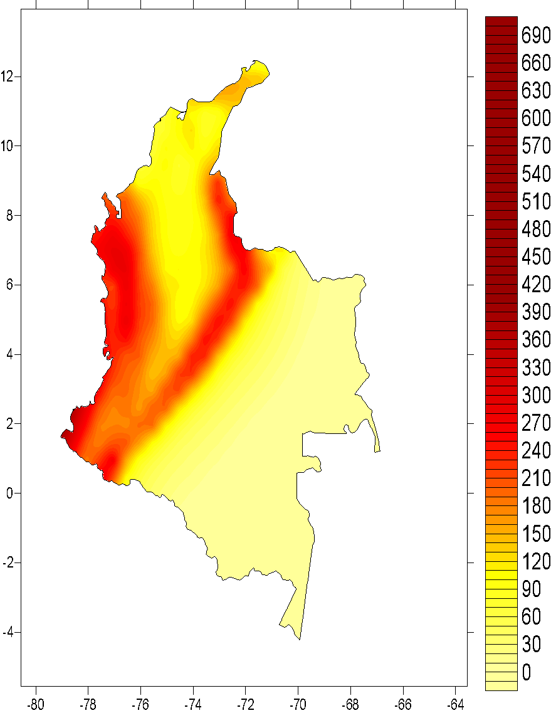
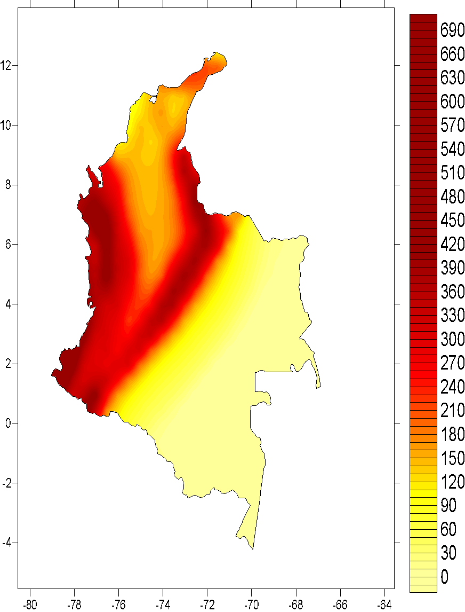
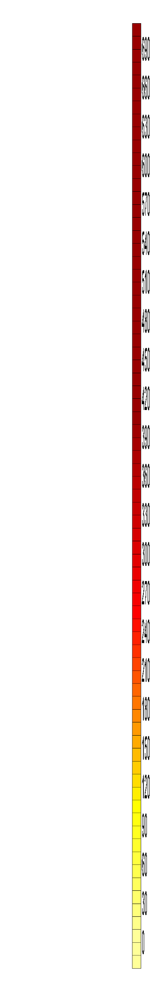
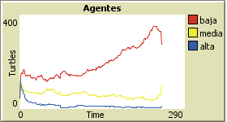
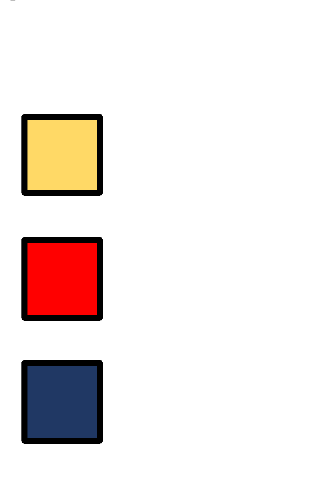

En vista tanto de las deficiencias como ventajas de la RTGM, se propone un enfoque diferente para la definición de los coeficientes sísmicos de diseño. Este enfoque se basa en la cuantificación de coeficientes *óptimos* de diseño, lo cual no es realmente un nuevo enfoque, no solo por haber sido ya empleado en otros códigos de construcción sismo resistente (como en el caso de México), sino porque su definición es tan antigua como la de la evaluación probabilista de la amenaza sísmica. En palabras de Luis Esteva, los coeficientes óptimos “son los que han de minimizar la suma de los costos asociados a la decisión de haber usado ese valor en el diseño de la edificación” \[3\]. El padre de la evaluación probabilista nos ofrecía esta definición al mismo tiempo que planteaba su famosa ecuación para el cálculo de las tasas de excedencia de movimiento fuerte (de donde se obtienen los periodos de retorno, tan arraigados en nuestra concepción de seguridad en los diseños estructurales). Su maestro, Emilio Rosenblueth, lo definiría de la siguiente manera: “un diseño es óptimo si minimiza los costos iniciales de construcción y el valor presente neto de las pérdidas futuras debido a terremotos” \[4\]. No es extraño entonces que estos conceptos hayan sido llevados a la práctica en México desde hace ya varios años.

Siguiendo la definición de Rosenblueth, los coeficientes óptimos de diseño se obtienen de minimizar la suma de costos iniciales de construcción, y costos futuros asociados a las pérdidas que causarán los terremotos. Esto significa que el periodo de retorno de estos coeficientes no solo no participa en su definición, sino que cambiará de sitio a sitio. La Figura 3 muestra esta situación para dos sitios diferentes en un territorio, uno de baja y otro de alta sismicidad. El costo inicial (CI) se asume igual en ambas ubicaciones. Nótese que los costos se presentan como función del valor del coeficiente de diseño *c*, es decir que entre mayores son las exigencias, mayor es el costo inicial. Ahora bien, las curvas de costos futuros (CFL) exhiben comportamientos diferentes dependiendo del nivel de sismicidad del sitio, pero siendo ambas decrecientes con respecto a *c*, indicando que entre mayor sea la exigencia de diseño, se espera que las pérdidas futuras sean menores. La función de costo total (CT) viene de la suma de las anteriores (CT = CI+CFL). Esta función no es totalmente creciente o decreciente con respecto a *c*, presentando un claro valor mínimo en el cual, puede afirmarse, se encuentra el valor óptimo del coeficiente *c*, es decir, el que implica los menores costos totales.

**Figura 3.** Ilustración de la definición de coeficientes óptimos de diseño.

## Costo inicial

El costo inicial es un indicador del valor económico de la edificación y su variación a medida que la exigencia de diseño aumenta. Nótese que este modelo no pretende ser de características financieras, sino simplemente indicativo, por lo cual no es necesario, ni correcto, intentar incorporar aspectos como la depreciación del inmueble construido.

El costo inicial se compone de un costo por resistencia lateral gratuita y un costo por resistencia adicional a la gratuita. La resistencia lateral gratuita es aquella resistencia lateral que tiene una estructura que ha sido diseñada exclusivamente para soportar cargas verticales. Es decir, en cualquier configuración estructural, dado que se soportan cargas verticales, se tiene algún nivel de resistencia lateral que es inherente a la estructura, así no se haya concebido como objetivo de diseño.

Toda resistencia adicional que se provea a la estructura implica un costo adicional a la resistencia gratuita. Este costo es creciente con respecto a la exigencia de diseño, de un modo que se ha visto es ligeramente no lineal. Salgado et al. \[5\] Proponen un modelo de costos iniciales para las edificaciones en Colombia, que hemos adoptado para el desarrollo de este trabajo.

## Costo de pérdidas futuras

El costo de las pérdidas futuras se determina en función del costo inicial de la estructura, la tasa de excedencia del coeficiente de diseño, que mide cuantas veces en promedio en el futuro se excederá el nivel de diseño\[1\], y un factor de impacto que permite incorporar efectos indirectos asociados a las pérdidas causadas por los temblores. Este factor de impacto es de especial interés en este trabajo, pues permite incorporar de forma más o menos directa las condiciones de contexto que facilitan que se exacerbe el impacto asociado a la ocurrencia de un terremoto, en términos de la fragilidad social y falta de resiliencia en que ocurre dicha pérdida.

La tasa de excedencia del movimiento fuerte mide el número de veces en un año que se espera se exceda, en promedio, un valor determinado. Este parámetro se obtiene mediante una evaluación clásica de la amenaza sísmica, cuyo principal resultado son precisamente las curvas de amenaza (o curvas de tasa de excedencia) en múltiples ubicaciones de cálculo dentro del país. El modelo de amenaza sísmica de Colombia corresponde a la última versión del proyecto ASLAC (Salgado et al. \[6\]), el cual es un modelo regional de América Latina y El Caribe, desarrollado con el objetivo de proveer a la región de un modelo continuo de amenaza, con el mayor nivel de detalle posible en cada territorio y siguiendo técnicas del estado del arte en ingeniería sísmica. La Figura 4 muestra como ejemplo los mapas de amenaza uniforme para Colombia de 475 años de periodo de retorno, para aceleración máxima del terreno y aceleración espectral para 0.5 segundos.

|                           |                           |                           |
| ------------------------- | ------------------------- | ------------------------- |
|  |  |  |

**Figura 4.** Mapas de amenaza uniforme para 475 años de periodo de retorno. Izq: aceleración máxima del terreno. Der: Aceleración espectral para 0.5 segundos. Aceleración en cm/s2.

El factor de impacto pretende reflejar las condiciones de contexto en el cual ocurrirían las pérdidas. Su definición es siempre subjetiva y arbitraria, pero orientada a mostrar el impacto real de los desastres sísmicos y a permitir la diferenciación entre territorios según su nivel de desarrollo. Emilio Rosenblueth llegó a plantear que el factor de impacto debería ser del orden de 12, es decir, que el impacto real de un terremoto, en condiciones socioeconómicas muy desfavorables, podría ser de 12 veces la pérdida directa. Si bien existen diferentes planteamientos en la literatura con respecto al valor del factor de impacto, hay consenso científico en que su definición debe permitir la diferenciación entre territorios, más que dar cuenta exactamente de la amplificación del impacto.

En este trabajo se optó por definir el factor de impacto en términos de dos características particulares a nivel de municipio: i) el nivel de desarrollo según la tipología municipal del DNP y, ii) si el municipio tiene o no microzonificación sísmica. La primera característica habla del nivel de desarrollo del municipio. En este trabajo se considera explícitamente la categoría municipal y su clasificación en dimensión institucional. La segunda característica permite dar cuenta de la tradición en ingeniería estructural y sísmica, el reconocimiento del problema y la inversión realizada por los municipios en seguridad sísmica. La Figura 5 muestra la distribución del valor final determinado para el factor de impacto para todos los municipios del país.

 

**Figura 5.** Valor del factor de impacto a nivel municipal. Los municipios con factor de impacto igual a 5 son: Bogotá D.C., Medellín, Cali, Bucaramanga, Barranquilla y Cartagena. Los municipios con factor de impacto igual a 7 son: Manizales, Pereira, Armenia y Popayán.

Los valores mostrados en el mapa de la Figura 5 fueron definidos en base a la experiencia de los autores con el fin de revelar el impacto asociado a la ocurrencia de los temblores, y se consideran apropiados y suficientes para los fines de este trabajo. Mayor profundización en su definición será objeto de investigaciones posteriores.

<table>
<tbody>
<tr class="odd">
<td>
<strong>Caja 3. Nuevo modelo de amenaza sísmica de Colombia</strong>

Como parte del proyecto ASLAC (Amenaza Sísmica de América Latina y El Caribe), se desarrolló un modelo detallado de amenaza sísmica para el territorio colombiano. Los detalles de este modelo pueden consultarse en Salgado et.al. 2017.

Este nuevo modelo se conforma por 53 fuentes sismogénicas, 26 de ellas corticales, 5 de subducción de interfaz, 20 de subducción intraplaca, una fuente especial para el nido de sismicidad de Bucaramanga y una fuente de background para la sismicidad dispersa del norte colombiano.

Mapa con la ubicación de los 53 polígonos de fuentes sismogénicas

Se hizo uso de modelos de movimiento fuerte (GMPM) híbridos, mediante la combinación de los siguientes modelos individuales. Se incluye en todos los casos el modelo de atenuación de Bernal 2014 (actualizado en 2019) como modelo generado en base a observaciones en el territorio nacional.

<strong>GMPM usados en la modelación de la amenaza sísmica</strong>

<table>
<thead>
<tr class="header">
<th><strong>Tipo de fuente</strong></th>
<th><strong>GMPM</strong></th>
</tr>
</thead>
<tbody>
<tr class="odd">
<td>Cortical</td>
<td>
Bernal 2014

Zhao et.al. 2006

Chiou &amp; Youngs 2014

Abrahamson et.al. 2014
</td>
</tr>
<tr class="even">
<td>Interfaz</td>
<td>
Bernal 2014

Zhao et.al. 2006

Youngs 1997

Lin &amp; Lee 2008
</td>
</tr>
<tr class="odd">
<td>Intraplaca</td>
<td>
Bernal 2014

Zhao et.al. 2006

Youngs 1997

Kanno et.al. 2006
</td>
</tr>
</tbody>
</table>

El cálculo de la amenaza sísmica se desarrolló en el programa R-CRISIS, uno de los más usados a nivel internacional.
</td>
<td></td>
</tr>
</tbody>
</table>

