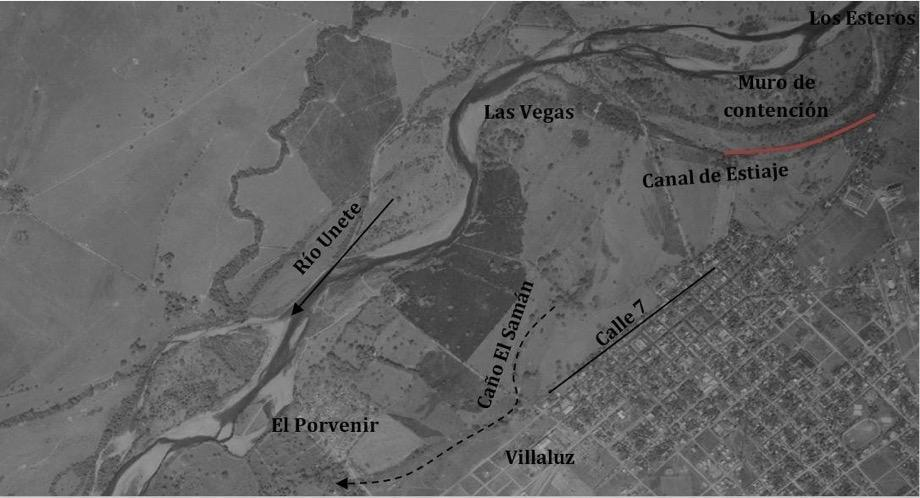

Aunque la modelización numérica es una de las herramientas más utilizadas para representar la amenaza por inundación, es preciso la búsqueda de soluciones dinámicas o evolutivas que permitan superar el déficit de información, siendo importante recurrir a registros históricos y datos geomorfológicos, entre otros, como lo recomienda la directiva europea 2007/60CE \[10\].

Para la validación de los resultados del modelo hidráulico y ante la falta de información geográfica se buscó solventar complementando métodos tradicionalmente utilizados con el calculó el porcentaje de área en cada nivel de amenaza para cada geoforma, se realizó un análisis multitemporal por medio de fotografías aéreas de los años 1995 y 2004, y se construyó un mapa a partir de encuestas a pobladores ribereños.

De acuerdo con los resultados obtenidos en la Figura 7 en la delimitación de geoformas se calculó el porcentaje de cada una respecto a la Figura 21 correspondiente al mapa definitivo de amenaza del municipio de Aguazul.

**Tabla 8.** Porcentaje de área en amenaza por geoforma.

<table>
<thead>
<tr class="header">
<th><strong>Geoforma</strong></th>
<th><strong>Porcentaje de amenaza</strong></th>
<th></th>
<th></th>
</tr>
</thead>
<tbody>
<tr class="odd">
<td></td>
<td>Alta</td>
<td>Media</td>
<td>Baja</td>
</tr>
<tr class="even">
<td><blockquote>

Cauce activo

</blockquote></td>
<td>100</td>
<td>0</td>
<td>0</td>
</tr>
<tr class="odd">
<td><blockquote>

Barras de sedimentos

</blockquote></td>
<td>100</td>
<td>0</td>
<td>0</td>
</tr>
<tr class="even">
<td><blockquote>

Vega

</blockquote></td>
<td>78.16</td>
<td>11.35</td>
<td>10.49</td>
</tr>
<tr class="odd">
<td><blockquote>

Planicie de inundación

</blockquote></td>
<td>91.48</td>
<td>7.04</td>
<td>1.48</td>
</tr>
<tr class="even">
<td><blockquote>

Terraza baja

</blockquote></td>
<td>52.87</td>
<td>25.90</td>
<td>21.23</td>
</tr>
<tr class="odd">
<td><blockquote>

Terraza intermedia

</blockquote></td>
<td>70.06</td>
<td>15.68</td>
<td>14.25</td>
</tr>
<tr class="even">
<td><blockquote>

Terraza alta

</blockquote></td>
<td>70.74</td>
<td>11.75</td>
<td>17.51</td>
</tr>
</tbody>
</table>

Debido a que el municipio de Aguazul no cuenta con un mapa de eventos históricos de inundación y que el mapa de riesgos e inundaciones del EOT de Aguazul del año 2010 \[17\] tan solo identifica un área susceptible a inundaciones sin delimitar las zonas de amenaza alta, media y baja, fue preciso incorporar para la validación de los resultados del modelo: encuestas a pobladores ribereños, análisis multitemporal de fotografías aéreas y valoración de susceptibilidad según geoformas.

Cabe resaltar en el caso del barrio El Porvenir que en la fotografía aérea del año 2004 el caño El Samán atravesaba el barrio El Porvenir, coincidiendo con la mancha deinundación con periodo de retorno de 10 años que rodea el barrio El Porvenir y afecta directamente el barrio Villaluz (Fig. 22).

**Figura 22.** Cruce del caño Samán por el barrio Porvenir. Fotografía aérea de Aguazul del año 2004. Modificado a partir del vuelo C-2710, n°. 207, 2004.

A su vez, en la fotografía aérea del año 1995 se observa que el caño El Samán y el canal de estiaje se encuentran activos y no estaba construido el muro de contención, demostrando que ante una posible creciente que supere la cresta del muro, la zona de Las Vegas y Los Esteros se inundan siguiendo la geoforma natural del río. De igual forma, se observa que para 1995 el barrio El Porvenir se empieza a desarrollar, ocupando áreas en condición de amenaza por inundación, ignorando la presencia del caño El Samán (Fig. 23).

**Figura 23.** Canal de estiaje en el sector Las Vegas. Fotografía aérea de Aguazul del año 1995. Modificado a partir del vuelo C-2564, n°. 3, 1995.

En contraste, en la fotografía aérea del año 1995 no existían los barrios El Porvenir y Villaluz, pero el caño El Samán se encontraba seco, permitiendo inferir que el desarrollo de estos barrios se dio durante un periodo de fuerte estiaje, desconociendo el recorrido histórico de este cuerpo de agua, es decir, las viviendas y barrios afectadas por inundaciones se desarrollaron sobre geoformasasociadas a vegas y antiguo cauce del río Unete, caracterizadas por alta susceptibilidad a inundaciones.

Las encuestas establecen que el 72.5% de la muestra encuestada ha sufrido inundaciones por el río Unete, las cuales han alcanzado profundidades superiores a los 50 cm correspondiendo a una intensidad alta. En cuanto a la frecuencia, se asigna categoría alta debido al predominio de inundaciones una vez cada dos años, que corresponde a un periodo de retorno inferior a 10 años.

**Tabla 9.** Resultados encuestas municipio de Aguazul.

<table>
<thead>
<tr class="header">
<th><blockquote>

<strong>Pregunta</strong>

</blockquote></th>
<th><blockquote>

<strong>Respuesta</strong>

</blockquote></th>
<th><blockquote>

<strong>Porcentaje%</strong>

</blockquote></th>
</tr>
</thead>
<tbody>
<tr class="odd">
<td><blockquote>

¿Se le ha inundado su casa?

</blockquote></td>
<td><blockquote>

Si

</blockquote></td>
<td><blockquote>

72.5

</blockquote></td>
</tr>
<tr class="even">
<td></td>
<td><blockquote>

No

</blockquote></td>
<td><blockquote>

27.5

</blockquote></td>
</tr>
<tr class="odd">
<td></td>
<td><blockquote>

Menos de 3 veces

</blockquote></td>
<td><blockquote>

62.1

</blockquote></td>
</tr>
<tr class="even">
<td><blockquote>

¿Cuántas veces se ha inundado?

</blockquote></td>
<td><blockquote>

4 a 8 veces

</blockquote></td>
<td><blockquote>

34.5

</blockquote></td>
</tr>
<tr class="odd">
<td></td>
<td><blockquote>

Más de 10 veces

</blockquote></td>
<td><blockquote>

3.4

</blockquote></td>
</tr>
<tr class="even">
<td></td>
<td><blockquote>

Más de una vez por año

</blockquote></td>
<td><blockquote>

13.8

</blockquote></td>
</tr>
<tr class="odd">
<td><blockquote>

¿Cada cuánto se inunda?

</blockquote></td>
<td><blockquote>

Una vez por año

</blockquote></td>
<td><blockquote>

17.2

</blockquote></td>
</tr>
<tr class="even">
<td></td>
<td><blockquote>

Una vez cada dos años

</blockquote></td>
<td><blockquote>

58.6

</blockquote></td>
</tr>
<tr class="odd">
<td></td>
<td><blockquote>

otro

</blockquote></td>
<td><blockquote>

10.3

</blockquote></td>
</tr>
<tr class="even">
<td><blockquote>

¿Se inundó el patio o la vivienda?

</blockquote></td>
<td><blockquote>

Patio

</blockquote></td>
<td><blockquote>

37.9

</blockquote></td>
</tr>
<tr class="odd">
<td></td>
<td><blockquote>

Vivienda

</blockquote></td>
<td><blockquote>

17.3

</blockquote></td>
</tr>
<tr class="even">
<td></td>
<td><blockquote>

Ambos

</blockquote></td>
<td><blockquote>

44.8

</blockquote></td>
</tr>
<tr class="odd">
<td></td>
<td><blockquote>

Menos de 10 cm

</blockquote></td>
<td><blockquote>

6.9

</blockquote></td>
</tr>
<tr class="even">
<td><blockquote>

¿Hasta qué altura llego el agua?

</blockquote></td>
<td><blockquote>

Entre 10 y 30 cm

</blockquote></td>
<td><blockquote>

20.7

</blockquote></td>
</tr>
<tr class="odd">
<td></td>
<td><blockquote>

Entre 30 cm y 50 cm

</blockquote></td>
<td><blockquote>

13.8

</blockquote></td>
</tr>
<tr class="even">
<td></td>
<td><blockquote>

Más de 50 cm

</blockquote></td>
<td><blockquote>

58.6

</blockquote></td>
</tr>
<tr class="odd">
<td><blockquote>

¿Ha tenido pérdidas?

</blockquote></td>
<td><blockquote>

Si

</blockquote></td>
<td><blockquote>

100

</blockquote></td>
</tr>
<tr class="even">
<td></td>
<td><blockquote>

No

</blockquote></td>
<td><blockquote>

0

</blockquote></td>
</tr>
<tr class="odd">
<td></td>
<td><blockquote>

Año anterior

</blockquote></td>
<td><blockquote>

41.4

</blockquote></td>
</tr>
<tr class="even">
<td><blockquote>

¿Cuándo fue la última inundación?

</blockquote></td>
<td><blockquote>

Hace 2 años

</blockquote></td>
<td><blockquote>

34.5

</blockquote></td>
</tr>
<tr class="odd">
<td></td>
<td><blockquote>

Hace 5 años

</blockquote></td>
<td><blockquote>

10.3

</blockquote></td>
</tr>
<tr class="even">
<td></td>
<td><blockquote>

Hace 10 años

</blockquote></td>
<td><blockquote>

13.8

</blockquote></td>
</tr>
<tr class="odd">
<td></td>
<td><blockquote>

Más de 10 años

</blockquote></td>
<td><blockquote>

0

</blockquote></td>
</tr>
</tbody>
</table>

Para calificar la amenaza a partir de estos atributos, se definieron 3 indicadores (frecuencia, profundidad y última vez que ocurrió el evento), teniendo en cuenta la severidad de cada uno de los parámetros se asignó un valor que varía entre 1 y 5, siendo 5 el más crítico y 1 el menos crítico, tal y como se muestra a continuación:

**Tabla 10.** Clasificación de amenaza por inundación según resultados de encuestas.

<table>
<thead>
<tr class="header">
<th><blockquote>

<strong>Profundidad</strong>

</blockquote></th>
<th><strong>Valor</strong></th>
<th><blockquote>

<strong>Frecuencia</strong>

</blockquote></th>
<th><strong>Valor</strong></th>
<th><blockquote>

<strong>Ultima vez</strong>

</blockquote></th>
<th><strong>Valor</strong></th>
</tr>
</thead>
<tbody>
<tr class="odd">
<td>No se inunda</td>
<td>1</td>
<td>No se inunda</td>
<td>1</td>
<td>No se inunda</td>
<td>1</td>
</tr>
<tr class="even">
<td>Menor a 10cm</td>
<td>2</td>
<td>Otro</td>
<td>2</td>
<td>Mayor a 9 años</td>
<td>2</td>
</tr>
<tr class="odd">
<td>Entre 10 y 30cm</td>
<td>3</td>
<td>Una vez cada dos años</td>
<td>3</td>
<td>Entre 6 y 8 años</td>
<td>3</td>
</tr>
<tr class="even">
<td>Entre 30 y 50cm</td>
<td>4</td>
<td>Una vez por año</td>
<td>4</td>
<td>Entre 3 y 5 años</td>
<td>4</td>
</tr>
<tr class="odd">
<td>Mayor 50cm</td>
<td>5</td>
<td>Más de una vez por año</td>
<td>5</td>
<td>Entre 1 y 2 años</td>
<td>5</td>
</tr>
</tbody>
</table>

Los umbrales de la tabla anterior se determinaron de acuerdo al planteamiento de preguntas abiertas, las respectivas respuestas se reclasificaron conservando una escala de 1 a 5 de tal manera que los rangos son particulares para cada área específica, especialmente para la profundidad de inundación. A partir de los indicadores definidos se categorizó la amenaza en tres rangos: Baja (1 – 2.5), Media (2.5 – 4) y Alta (\> 4). Para esto se sumaron los valores obtenidos en los indicadores de profundidad, última vez que ocurrió el evento y frecuencia, posteriormente, el número resultante se dividió en 3, obteniendo una escala de amenaza entre 1 y 5. Con estos resultados se realizó un mapa de amenaza por inundación del río Unete en el cual a partir del color de los puntos obtenidos y siguiendo las geoformas del río se delimitaron áreas homogéneas según cada nivel de amenaza (Fig. 24).

**Figura 24.** Mapa de amenaza por inundación en el municipio de Aguazul a partir de encuestas. Las zonas de amenaza corresponden a las áreas que la comunidad identifico y los límites se trazaron a partir de las geoformas.

Comparando los resultados obtenidos de la modelación hidráulica por medio del software Iber y las encuestas realizadas a la población en el municipio de Aguazul, se encontró que las manchas de inundación del periodo de retorno 1.3 años coinciden con los testimonios de los habitantes de los barrios encuestados. Sin embargo, evaluando periodos de retorno superiores, los resultados difieren entre la modelación hidráulica y las encuestas, debido a que la construcción de mapas de inundación a partir de encuestas solo logra reproducir eventos recientes, con alta frecuencia y poca magnitud, permitiendo afirmar la necesidad de apoyarse en modelación hidráulica y registros históricos de caudal para determinar los mapas de amenaza por inundación, mientras que las encuestas son una herramienta útil para validar los resultados del modelo para los eventos de menor frecuencia.

