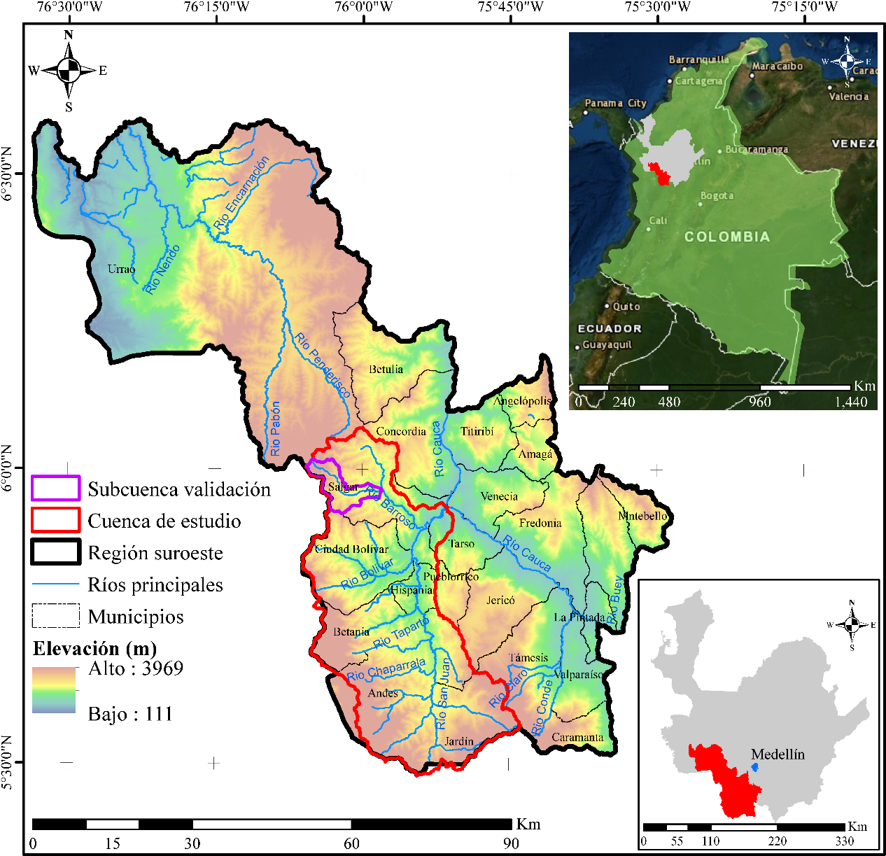

Para el desarrollo y explicación de la metodología propuesta, se tomó como caso de estudio la cuenca del río San Juan. Esta cuenca presenta unas condiciones geomorfológicas, geológicas y climáticas que la hacen particularmente susceptible a movimientos en masa, como lo demuestra la información existente en las bases de datos. En específico, las corrientes de agua han causado grandes avenidas torrenciales, que a su vez han estado ligadas a la ocurrencia previa de movimientos en masa debidos a las lluvias. Debido a la complejidad de cada proceso, la amenaza por movimiento en masa se determinó para la totalidad de la cuenca, mientras que la vulnerabilidad y el riesgo se determinaron en la subcuenca de la quebrada La Liboriana en jurisdicción del municipio de Salgar, la cual se encuentra bien documentada y facilitó el proceso de validación de los resultados obtenidos con el modelo propuesto.

<table>
<tbody>
<tr class="odd">
<td>
<strong>Caja 4. Cuenca río San Juan</strong>

La cuenca del rio San Juan se localiza en la vertiente oriental de la cordillera occidental de los Andes colombianos. El relieve es montañoso con pendientes fuertes. Abarca tierras en las márgenes del Río Cauca y es la más cafetera del departamento de Antioquia. También existen cultivos de caña de azúcar, frutales, plátano y algunas áreas se dedican a la ganadería. La cuenca del Río San Juan se extiende desde el nacimiento del rio en el nudo Paramillo (3000 m.s.n.m) y la desembocadura en el Río Cauca (1000 m.s.n.m) [37].
</td>
</tr>
</tbody>
</table>

**Figura 11.** Localización del área en estudio (Cuenca río San Juan).

Para la aplicación de la metodología propuesta se tienen las siguientes consideraciones:

  - > El tamaño de las celdas de análisis es: 30 m (cuadradas).

  - > Los movimientos en masa probables en la zona tienen espesores del orden de 2 m.

  - > Tipo de movimiento en masa: Movimiento en masa lento (descartados movimientos con desprendimientos de roca o tipo avalanchas).

De acuerdo a lo planteado mediante la Ecuación 1, es posible obtener el riesgo asociado a los daños que puede llegar a ocasionar un movimiento en masa accionado por un evento sísmico en las corrientes de agua de la zona de estudio. Para ello, fue preciso determinar un índice de riesgo (*R*), obtenido como el producto de la probabilidad anual de falla (*PAF*) para un periodo de retorno de la lluvia detonante de 20 años, y la pérdida económica potencial (*PEP*) derivada de la vulnerabilidad de un cauce en términos de la intensidad y de los costos suscitados por un eventual desastre a partir de los valores promedio de cada celda obtenidos a partir de precios comerciales y registros catastrales según el tipo de cobertura del suelo, y una valoración de la infraestructura. La información utilizada para este trabajo se obtuvo de las siguientes fuentes secundarias:

  - > Cartografía Base: Base de datos suministrada por la Corporación Regional CORANTIOQUIA.

  - > Precipitación: Registros diarios de lluvia obtenidos de la base de datos CHIRPS (US Geological Survey).

  - > Unidades Geológicas: Corporación Regional CORANTIOQUIA, IGAC–Ingeominas. Planchas 1:25,000.

  - > Parámetros geotécnicos: Bases de datos de los proyectos de la Universidad de Medellín.

## CONFLICTO DE INTERESES

> Los autores no declaran conflicto de intereses

