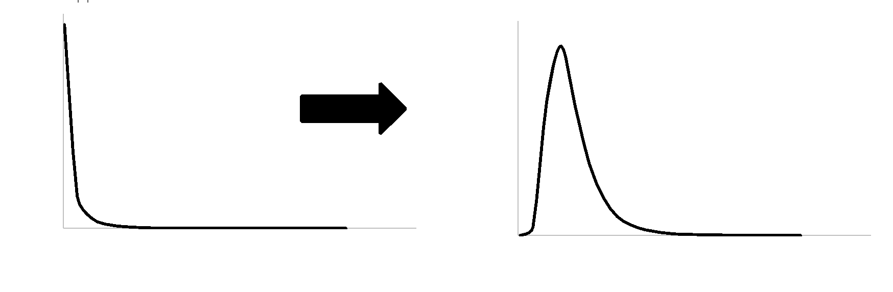
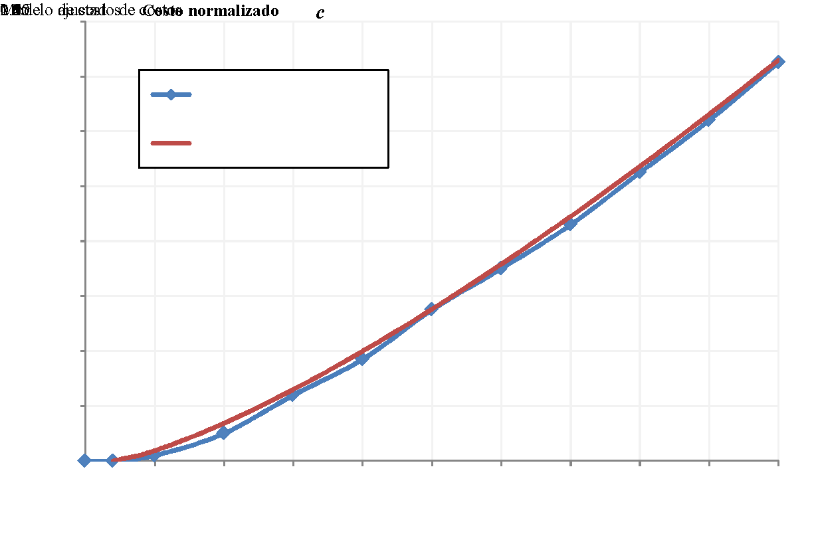

El diseño sismo resistente es una de las acciones de gestión del riesgo sísmico más efectivas, pues implica en esencia la reducción de la vulnerabilidad de las edificaciones futuras y, por lo tanto, del riesgo sísmico que afronta la sociedad. Esto es por lo que se requiere de una apropiada definición de los espectros de diseño sismo resistente, que permitan garantizar niveles de seguridad apropiados.

Las diferencias observadas entre las formas espectrales de la NSR-10, actualmente en vigencia, y las nuevas propuestas se deben a los múltiples avances en la ingeniería sísmica en el país, que han llevado a la definición de nuevas y mejores metodologías tanto para el cálculo de la amenaza sísmica como para la definición de los movimientos de diseño.

La manera de definir los espectros de diseño es única en el mundo, constituyendo una propuesta metodológica que lleva un paso más allá aquellas existentes y aplicadas en el pasado, como con la que se definen los coeficientes de diseño estructural en México, permitiendo su articulación con las normativas ASCE 7-10/16 como base rectora de los requisitos mínimos del diseño sismo resistente.

En caso de aprobarse esta propuesta de espectros de diseño, el país debe entrar en una fase de actualización y armonización de las microzonificaciones sísmicas del país, de manera que se compatibilicen los requisitos y reglamentos locales con el reglamento nacional.

<table>
<tbody>
<tr class="odd">
<td>
<strong>PUNTOS CLAVE</strong>

<ol type="1">
<li><blockquote>

Los movimientos sísmicos de diseño no tienen un periodo de retorno asociado. Esta concepción errónea ha llevado a asociar el nivel de seguridad de las edificaciones diseñadas con la NSR a un cierto periodo de retorno, lo cual es incorrecto e incoherente con la práctica de la ingeniería.

</blockquote></li>
<li><blockquote>

El movimiento fuerte orientado al riesgo, RTGM, esta basado en conceptos de la ingeniería de desempeño, lo cual es deseable siempre pues permitiría llevar la práctica de la ingeniería a un nivel mayor de sofisticación. Sin embargo, en la práctica el procedimiento empleado para su determinación es altamente arbitrario y difícil de justificar, así como el intento de cumplir con un objetivo de desempeño explicito previamente al diseño mismo de la edificación.

</blockquote></li>
<li><blockquote>

El modelo de coeficientes óptimos de diseño, ideado por Luis Esteva casi al mismo tiempo en que ideó la evaluación probabilista de la amenaza sísmica, provee un camino para mejorar la especificación de coeficientes de diseño, permitiendo considerar aspectos tan relevantes como las tasas de excedencia de aceleraciones, la inversión inicial (de forma aproximada), o el contexto socioeconómico en que ocurren los terremotos.

</blockquote></li>
<li><blockquote>

La propuesta de espectros de diseño permite a la NSR 22 avanzar hacia definiciones del movimiento de diseño más acertadas y también con mayor aproximación a las realidades del país. Los espectros propuestos permiten además una transición relativamente suave entre la NSR 10 y la NSR 22, en la mayoría del territorio nacional.

</blockquote></li>
</ol></td>
</tr>
</tbody>
</table>

8.  # MATERIALES Y MÉTODOS
    
    1.  ## Risk Targeted Ground Motion (RTGM)

La RTGM, como la define el USGS para ser usada en el ASCE 7-16, se basa en la siguiente ecuación:

|                                                                                                   |     |
| ------------------------------------------------------------------------------------------------- | --- |
| \(P\left( \text{Colapso} \right) = P\left( Colapso|Sa \right) \bullet f_{\text{Sa}} \bullet dSa\) | (2) |

En donde P (Colapso) es la probabilidad de colapso de la estructura dada como objetivo de desempeño, P (Colapso|Sa) es la función de fragilidad al colapso y fSa es la función de densidad de probabilidad de la aceleración espectral en el sitio de cálculo para un periodo de exposición dado. Nótese que la integral se realiza en todo el dominio de la aceleración espectral.

La Ecuación 2 es una forma de aplicar el teorema de la probabilidad total sobre la posibilidad de colapso estructural. El término de fragilidad (P(Colapso|Sa)) se asocia a la respuesta estructural, más específicamente a la probabilidad de colapso de la edificación dada una aceleración espectral Sa. En rigor, este término condensa la manera como se causa el daño y el consecuente posible colapso como función del movimiento fuerte inducido en la estructura. Ahora bien, dado que la estructura puede verse sometida a múltiples posibles movimientos sísmicos, la integral se realiza sobre todo el dominio de aceleración (es decir, se consideran todas), pero de forma modulada por la función de densidad de probabilidad de la aceleración espectral, fSa. Esta última depende de la ubicación de la estructura en el país y condensa el aporte de todas las fuentes sísmicas del territorio.

La función de densidad fSa puede obtenerse directamente de la curva de amenaza sísmica de la aceleración espectral como:

|                                                                                            |     |
| ------------------------------------------------------------------------------------------ | --- |
| \(f_{\text{Sa}} = \frac{\text{d\ }}{\text{dSa}}e^{- v\left( \text{Sa} \right) \bullet T}\) | (3) |

En donde v(Sa) es la tasa de excedencia de la aceleración espectral y T el periodo de exposición. Esta ecuación permite determinar la distribución de probabilidad de la aceleración espectral en base a la curva de amenaza, como se ilustra en la Figura 13. La Ecuación 3 se obtiene directamente de la suposición que la ocurrencia en el tiempo de eventos sísmicos que excedan un determinado valor de aceleración espectral sigue un proceso estocástico homogéneo de Poisson.

**Figura 13.** Transformación de la curva de amenaza en la función de densidad de probabilidad de la aceleración espectral, para un periodo de tiempo de exposición dado.

Según la metodología definida en los reglamentos ASCE 7-10 y 16, el cálculo de las aceleraciones RTGM sigue un procedimiento iterativo como el indicado a continuación:

1.  > Se define la forma de la función de fragilidad como una distribución lognormal acumulada con parámetros tales que tenga el 10% de probabilidad de colapso para la aceleración que tiene 2,500 años de periodo de retorno, y una desviación estándar del logaritmo natural igual a 0.6.

2.  > Se ajusta uno de los parámetros de la distribución lognormal de forma iterativa hasta que el resultado de la Ecuación 2 llegue a ser 1%.

La aceleración para la cual en la función de fragilidad se tiene 10% de probabilidad de colapso, y que implica un 1% de probabilidad total de colapso según la Ecuación 2, es la medida de movimiento RTGM. La Figura 13 ilustra este proceso iterativo.

<table>
<thead>
<tr class="header">
<th></th>
<th>
Primera iteración:

Curva de fragilidad según ASCE 7 – 10/16

Sa = 0.8 g (2,500 años)

P(Colapso) = 12%
</th>
</tr>
</thead>
<tbody>
<tr class="odd">
<td></td>
<td>
Segunda iteración:

Curva de fragilidad modificada

Sa = 1.3 g

P(Colapso) = 0.14%
</td>
</tr>
<tr class="even">
<td></td>
<td>
Tercera iteración:

Curva de fragilidad modificada

Sa = 1.1 g

P(Colapso) = 1.0%
</td>
</tr>
</tbody>
</table>

**Figura 14.** Ilustración del proceso iterativo para construir la RTGM.

## Método de los coeficientes óptimos

El método de los coeficientes de diseño óptimos se basa en la minimización del costo total asociado a una estructura. Este costo total se define como el costo inicial por la construcción de la estructura, y el costo de las pérdidas futuras, en función de las pérdidas que los futuros terremotos causarán sobre el inmueble. Esta definición puede expresarse mediante la siguiente ecuación:

|                                                                                               |     |
| --------------------------------------------------------------------------------------------- | --- |
| \(C_{T}\left( c_{s} \right) = C_{I}\left( c_{s} \right) + C_{\text{FL}}\left( c_{s} \right)\) | (4) |

En donde CT es el costo total, CI el costo inicial y CFL el costo de las pérdidas futuras. Todos estos costos se expresan como función del coeficiente de diseño cs. El costo inicial se define de la siguiente manera:

|                                                                                  |     |
| -------------------------------------------------------------------------------- | --- |
| \(C_{I} = C_{0} + C_{\text{Res}} \bullet \left( c_{s} - c_{0} \right)^{\alpha}\) | (5) |

En donde C0 es el costo por resistencia lateral gratuita, que tiene que ver con la capacidad a cargas laterales que tiene cualquier estructura, incluso si esta ha sido diseñada únicamente para soportar cargas verticales. CRes es el costo por resistencia lateral adicional a la gratuita, es decir dándole una resistencia apropiada a la estructura para las cargas laterales, pero más allá de la inherente a cualquier estructura. Este costo CRes es modificado de manera no lineal como función de la diferencia entre el coeficiente de diseño (que se incrementa a medida que aumenta la exigencia) y el coeficiente c0, que corresponde coeficiente de diseño equivalente a la resistencia lateral gratuita. Esta diferencia es elevada a un exponente positivo α que usualmente se encuentra entre 1 y 2. La Figura 15 muestra la forma de la función CI normalizada (i.e. CI/C0) para edificaciones en Colombia, según Salgado et al. \[5\].

**Figura 15.** Incremento del costo normalizado en función del coeficiente de diseño. Tomado de Salgado et al \[5\].

En la Figura 15, el Modelo de costos es efectivamente la propuesta de Salgado et al. \[5\] como función del coeficiente de diseño, mientras que el Modelo ajustado de costos es simplemente una regresión realizada por Salgado et al. \[5\] sobre su propuesta original para facilitar los cálculos.

El costo de las pérdidas futuras se expresa mediante la siguiente ecuación:

|                                                                                                      |     |
| ---------------------------------------------------------------------------------------------------- | --- |
| \(C_{\text{FL}} = C_{I} \bullet \left( 1 + S_{L} \right) \bullet \frac{v\left( c_{s} \right)}{\mu}\) | (6) |

En donde v(cs) es la tasa de excedencia del coeficiente de diseño, μ es una tasa de descuento y SL es el factor de impacto asociado al contexto socioeconómico en que ocurren las pérdidas por sismos. Según lo recomendado por Salgado et al. \[5\] la tasa de descuento se fija en un 5%. El factor de impacto SL, que busca dar cuenta de las condiciones de contexto, se evaluó en función de la tipología municipal del DNP \[8\] y de si el municipio cuenta o no con una microzonificación sísmica, siguiendo este procedimiento:

1.  > Si el municipio es categoría A (la más alta) se clasifica como de Nivel I con un factor de impacto SL = 5.

2.  > Si el municipio es categoría B y tiene microzonificación sísmica, o su dimensión institucional según DNP 2015 es mayor a 0.75 entonces se clasifica como de Nivel II con un factor de impacto SL = 7.

3.  > En caso contrario a los anteriores, se clasifica como de Nivel III con un factor de impacto SL = 12.

Los costos estimados de esta manera, tanto iniciales como futuros, son indicadores que permiten establecer una relación de beneficio-costo para el propósito de determinar coeficientes de diseño. No deben ser vistos como una valoración exacta sino como una aproximación gruesa que permite estimar niveles óptimos de diseño. Son aproximaciones suficientes para estos fines, considerando que tanto lo costos iniciales como las pérdidas futuras serán en realidad función del resultado de diseño. En particular el coeficiente de impacto SL es difícil de estimar analíticamente. Los autores han seleccionado arbitrariamente los valores que, según su experiencia, reflejan apropiadamente condiciones intangibles de falta de resiliencia y fragilidad social que inevitablemente exacerban los efectos negativos netamente estructurales de la ocurrencia de los temblores.

Existen diferentes metodologías para el desarrollo de planes de mitigación del riesgo en el sector escolar. Para esto el primer paso es desarrollar una base de datos con información suficiente para caracterizar el portafolio de infraestructura expuesta. Este paso es uno de los más importantes pues su resolución y calidad determinarán la resolución y la calidad del plan de mitigación del riesgo. Se han identificado diferentes tipologías de concreto reforzado y mampostería en diferentes partes del mundo con deficiencias constructivas y estructurales similares. Entre estas se destacan las edificaciones de pórticos de concreto reforzado, de pórticos de concreto reforzado con muros de mampostería y pórticos de concreto reforzado con muros de mampostería generando columna corta. En las edificaciones de muros de mampostería se destacan las edificaciones de mampostería simple, mampostería confinada y mampostería reforzada. La documentación de estas deficiencias y también de técnicas de reforzamiento permite sentar las bases para futuros proyectos en los cuales se analicen edificaciones similares.

Una vez se identifican el portafolio y las tipologías principales se debe desarrollar una evaluación del riesgo sísmico en el estado actual y a partir de este diseñar un sistema de reforzamiento sísmico para las tipologías vulnerables más relevantes o representativas. Una vez se tienen identificadas estas medidas se debe evaluar el riesgo en un escenario mitigado y a partir de esto diseñar planes de mitigación del riesgo ajustados a las limitaciones de cada caso de estudio. En este documento se presentan dos casos de estudio en Colombia, el primero en Cali y el segundo en el Valle de Aburrá. Se puede identificar que la reducción del riesgo para las estrategias de mitigación del Cali lleva a una reducción menor que el caso del Valle de Aburrá, reduciendo el riesgo en el primer caso al 50% del riesgo original y en el segundo al 20%. Así mismo, es posible identificar a partir de las gráficas de priorización que el riesgo en el portafolio de Cali se distribuye en todo el portafolio mientras que en el caso del Valle de Aburrá se concentra en alrededor de la mitad de las escuelas. Como se puedo identificar, cada caso presentado tiene sus particularidades sin embargo es posible identificar que el desarrollo comparte elementos comunes, en particular deficiencias en las tipologías constructivas y medidas de reforzamiento aplicables.

Existe una gran cantidad de trabajo por desarrollar en proyectos similares a los casos de estudio presentados. Como se puedo evidenciar, existen limitaciones de esta metodología con respecto a incertidumbres en los modelos de amenaza, vulnerabilidad y exposición que deben ser estudiados a mayor profundidad. Por otro lado, es necesario ampliar el espectro de amenazas e incluir otro tipo de eventos, entre ellos eventos de carácter hidrometeorológico como los huracanes y las inundaciones. Adicionalmente es necesario entender las métricas de riesgo y definir unos parámetros indicativos con el objetivo limitar posibles errores en los procedimientos. Por último, es necesario identificar y evaluar la vulnerabilidad de tipologías vulnerables menos recurrentes como las de acero o madera con el objetivo de desarrollar planes a menor escala.

Los resultados de los casos de estudio presentados como ejemplo son el punto de partida para la definición concreta de planes concertados con las autoridades locales y/o nacionales para su implementación. A partir de estos, y basados en un presupuesto disponible, es posible definir y listar en orden de importancia o relevancia, las intervenciones que se deberán priorizar para maximizar la reducción del riesgo con los recursos limitados. Adicionalmente, se deberán considerar factores como procesos constructivos que puedan implementarse a mayor escala, esquemas de contratación según especialidad o tipo de intervención, tipificación de las intervenciones buscando alcanzar un nivel de reducción de riesgo definido, pero remitiendo la adaptabilidad a las condiciones particulares de cada edificación, entre otros.

<table>
<tbody>
<tr class="odd">
<td>
<strong>PUNTOS CLAVE</strong>

<ol type="1">
<li><blockquote>

Las edificaciones de pórticos de concreto, pórticos de concreto con muros de mampostería y pórticos de concreto con muros de mampostería generando columna corta son las tipologías escolares predominantes de concreto reforzado.

</blockquote></li>
<li><blockquote>

Las edificaciones de muros de mampostería no reforzada, mampostería confinada y mampostería reforzada son las tipologías escolares predominantes de mampostería.

</blockquote></li>
<li><blockquote>

Se debe analizar el estado de la infraestructura actual mediante un análisis de riesgo, incluyendo los módulos de amenaza, exposición y vulnerabilidad.

</blockquote></li>
<li><blockquote>

Se recomienda que el modelo de exposición sea a nivel de edificación. Cada elemento del modelo debe contar con información estructural suficiente para caracterizar su comportamiento estructural.

</blockquote></li>
<li><blockquote>

Se deben identificar los mecanismos de colapso de las edificaciones y generar sistemas de reforzamiento que sean aplicables a gran escala en edificaciones con comportamiento estructural similar.

</blockquote></li>
<li><blockquote>

Se deben plantear estrategias de intervención particulares para las tipologías que incluyan el reemplazo de las edificaciones, reforzamientos integrales, reforzamientos incrementales, reforzamientos en elementos no estructurales o adecuaciones menores.

</blockquote></li>
<li><blockquote>

Las intervenciones deben ser priorizadas utilizando criterios adecuados como la eficiencia costo con el objetivo de beneficiar la mayor cantidad de estudiantes reduciendo el mayor riesgo posible.

</blockquote></li>
</ol></td>
</tr>
</tbody>
</table>

<table>
<tbody>
<tr class="odd">
<td>
<strong>RECOMENDACIÓNES PARA TOMAR DECISIONES</strong>

<ol type="1">
<li><blockquote>

El modelo de exposición determina la calidad de los planes de mitigación, es necesario que el modelo tenga una resolución mínima a nivel de escuela y una resolución ideal a nivel de edificación.

</blockquote></li>
<li><blockquote>

La evaluación del riesgo sísmico en el estado actual y mitigado deben evaluarse utilizando la misma metodología, modelos de amenaza y modelos de exposición con el objetivo que sean comparables.

</blockquote></li>
<li><blockquote>

La participación de entidades gubernamentales en el desarrollo del plan de mitigación es esencial. Un adecuado entendimiento del componente técnico e identificación anticipada de limitaciones permitirán una implementación exitosa del plan.

</blockquote></li>
<li><blockquote>

Se debe tener en cuenta que los ciclos de gobierno particulares pueden afectar el desarrollo y la implementación de los planes diseñados.

</blockquote></li>
</ol></td>
</tr>
</tbody>
</table>

## CONFLICTO DE INTERESES

Los autores no declaran conflicto de intereses.

Con el objetivo de identificar y cuantificar la amenaza asociada a fenómenos hidrometeorológicos para el sector agropecuario, se presentó una metodología con enfoque probabilista para la simulación de eventos peligrosos mediante la simulación de condiciones climáticas que combinan eventos extremos de precipitación y temperatura durante un tiempo prolongado, sobre un área geográfica concreta. Como resultado se obtuvieron mapas de amenaza integrada por sequía para Colombia, caracterizados por condiciones de severidad, duración e intensidad del fenómeno para 50, 100, 250 y 500 años de periodo de retorno. A partir de estos mapas se pueden identificar las zonas más propensas a sufrir sequías graves.

Como parte de este estudio se construyó un modelo de exposición de cultivos para Colombia, con una resolución de 10 km × 10 km para todo el territorio continental. Este modelo de exposición, derivado de información de censos y encuestas agrícolas, caracteriza la ubicación, densidad de siembra, estacionalidad del cultivo y avalúo del producto para la actividad agrícola y pecuaria del país.

En el marco de este estudio, la vulnerabilidad se define en términos de la pérdida de rendimiento que sufre el cultivo durante un período prolongado de escasez de agua. En este caso no se emplean curvas de vulnerabilidad. Con un enfoque innovador, se acopló un modelo agronómico de respuesta de cultivos al enfoque de evaluación prospectiva del riesgo.

Se presenta la aplicación de la metodología de evaluación prospectiva del riesgo asociadas a sequías extremas en las áreas cultivadas de maíz en Colombia. Los resultados del modelo indican que la pérdida anual esperada, en términos de costos relativos al productor, es del 5%. Este no es un modelo de pretenda pronosticar eventos meteorológicos extremos, por lo que no es posible su uso como sistema de alerta temprana.

<table>
<tbody>
<tr class="odd">
<td>
<strong>PUNTOS CLAVE</strong>

<ol type="1">
<li><blockquote>

La identificación del riesgo por eventos hidrometeorológicos sigue la metodología de análisis probabilista que tiene como objetivo estimar la distribución de probabilidad de la pérdida que puede presentarse en un conjunto de elementos expuestos, tras la ocurrencia de un fenómeno natural.

</blockquote></li>
<li><blockquote>

La modelación probabilista permite realizar pronósticos sobre los niveles futuros de pérdida más no de eventos; considerando la amenaza propia de la región de estudio y la incertidumbre en su estimación, así como la vulnerabilidad inherente de los elementos expuestos y su incertidumbre.

</blockquote></li>
<li><blockquote>

La amenaza se representa por medio de una colección de escenarios, generados de manera estocástica, los cuales representan de manera integral, y en términos de probabilidad, la amenaza de una región. Cada escenario tiene asociada una frecuencia de ocurrencia y contiene la distribución espacial de parámetros que permiten construir la distribución de probabilidad de las intensidades producidas por su ocurrencia.

</blockquote></li>
<li><blockquote>

Los elementos expuestos son la fuente de las pérdidas potenciales debido al hecho de estar expuestos a una amenaza y ser susceptibles de sufrir un daño. Estos elementos se caracterizan por su ubicación geográfica, su valor de reposición y tipo.

</blockquote></li>
<li><blockquote>

La vulnerabilidad es una característica intrínseca de los elementos expuestos y que caracteriza el comportamiento de los elementos expuestos (cultivos) durante la ocurrencia de un evento peligroso (sequía, inundación, helada, entre otros). La metodología de vulnerabilidad de respuesta de los cultivos al agua está asociada a reducciones en el rendimiento del cultivo según el uso de parámetros específicos por especie que definen los procesos físicos, químicos y biológicos que interactúan en el modelo de desarrollo de la planta y sus interacciones con los sistemas de atmósfera y suelo.

</blockquote></li>
<li><blockquote>

El riesgo se expresa en términos de la curva de excedencia de pérdidas, la pérdida anual esperada y las pérdidas máximas probables; métricas de riesgo que son útiles para los procesos de toma de decisiones.

</blockquote></li>
</ol></td>
</tr>
</tbody>
</table>

Las amenazas geológicas asociadas a la ocurrencia de sismos y el fenómeno de subsidencia pueden afectar a las poblaciones que habitan en zonas vulnerables a estos eventos. Por tal motivo, es fundamental el despliegue de redes instrumentales, entre ellas de GPS y el uso de técnicas diversas para avanzar en el entendimiento de este tipo de fenómenos.

Las observaciones geodésicas GPS permiten confirmar la subducción oblicua de la placa de Nazca con respecto a Suramérica, basado en datos obtenidos en las estaciones localizadas en las islas de Galápagos (Ecuador) y Malpelo (Colombia), ubicadas en la placa de Nazca. Las estaciones ubicadas en la zona costera de Colombia y Ecuador en el Océano Pacífico muestran vectores de velocidad GPS cuyas magnitudes son mayores a los vectores de estaciones localizadas al interior del continente, lo cual significa acumulación de deformación en la zona de subducción colombo-ecuatoriana de Nazca, y concluir que en esta región existe alta posibilidad de ocurrencia de un gran sismo de subducción. Probablemente, los sismos de 1942, 1958, 1979 y 2016 han liberado solamente una fracción de la energía acumulada desde la ocurrencia del sismo de 1906.

La deformación al interior del Bloque Norte de los Andes solo es posible de ser explicada mediante la postulación de dos polos de Euler, correspondientes a dos zonas cuyo límite puede establecerse, alrededor de los 7.5°N de latitud. Las velocidades estimadas a partir de los polos respectivos confirman la acumulación de la deformación en la zona de subducción de Nazca, y señalan igualmente acumulación de deformación en un sector de la costa Caribe.

Los estudios de geodesia de imágenes basados en InSAR para la ciudad de Bogotá indican que el fenómeno de subsidencia se presenta en sectores localizados, cuya magnitud es mayor en la zona central de la ciudad. Aunque esta técnica permite hacer una evaluación cuantitativa inicial de la subsidencia, es fundamental integrar estos resultados con los obtenidos con geodesia de posicionamiento GPS, si existen. Los resultados GPS suministran información 3D de estaciones relativamente dispersas, es decir, discreta espacialmente aunque continua temporalmente a partir de estaciones permanentes, mientras que InSAR genera información de deformación sobre la superficie en la dirección de la línea de vista del satélite, la cual es información continua espacialmente y discreta temporalmente. Por tal motivo, en virtud de las fortalezas de cada uno de los métodos y dada la complementariedad entre los dos resultados, la integración de datos GPS-InSAR es recomendable porque garantiza resultados más confiables acerca de la subsidencia. Por otra parte, los resultados obtenidos necesitan ser complementados mediante la ejecución de estudios adicionales en los cuales se consideren datos de volúmenes de extracción de agua subterránea, una de las posibles causas de la subsidencia en la Sabana de Bogotá, así como incluir datos de precipitación de lluvias en la zona.

<table>
<tbody>
<tr class="odd">
<td>
<strong>PUNTOS CLAVE</strong>

<ol type="1">
<li><blockquote>

La geodesia tiene una doble condición en la actualidad: primero, prestar información de referencia para satisfacer las necesidades de los usuarios para georreferenciación, y segundo, como disciplina integrante de las geociencias que provee información útil para la realización de estudios en la Tierra sólida, líquida y atmosférica.

</blockquote></li>
<li><blockquote>

La geodesia espacial GNSS es una herramienta esencial para la realización de estudios geodinámicos. No obstante, es de vital importancia la densificación de redes instrumentales con equipo GNSS para apoyar proyectos con diferentes propósitos en Colombia, lo cual es posible en la medida que se garantice la estabilidad de las estaciones y la perdurabilidad de estas. Por su parte, InSAR brinda una gran oportunidad de aplicación en diferentes campos del conocimiento, cuyo interés es creciente en otras partes del mundo. Sin embargo, se requiere fortalecer el recurso humano en Colombia, por lo cual se requiere la inclusión de este tipo de tecnologías y aplicaciones en los currículos de programas académicas de programas de pregrado y postgrado.

</blockquote></li>
</ol></td>
</tr>
</tbody>
</table>

<table>
<tbody>
<tr class="odd">
<td>
<strong>RETOS</strong>

<ol type="1">
<li><blockquote>

Se recomienda la utilización de las señales de las constelaciones GNSS con propósitos múltiples tales como estudios ionosféricos, troposféricos y de nivel del mar, así como ampliar los análisis de fenómenos en la superficie terrestre de origen geológico empleando las técnicas de interferometría de radar de apertura sintética.

</blockquote></li>
</ol></td>
</tr>
</tbody>
</table>

## CONFLICTO DE INTERESES

Los autores no declaran conflicto de intereses.

## AGRADECIMIENTOS

Al Servicio Geológico Colombiano por su apoyo en el desarrollo de GeoRED y en las aplicaciones de interferometría de radar de apertura sintética. A JICA por su contribución en el marco del proyecto SATREPS. A UNAVCO por el apoyo técnico y conceptual en las operaciones GPS del proyecto GeoRED. A CENICAÑA, Universidad Nacional de Colombia, Área Metropolitana del Valle de Aburrá y Empresa de Acueducto de Bogotá por su contribución en la expansión de GeoRED. A la Aeronáutica Civil, Fuerza Aérea Colombiana, Armada Nacional y DIMAR por su valioso apoyo para la instalación y puesta en operación de estaciones geodésicas permanentes GNSS. A Franck Audemard y un revisor anónimo, por sus valiosos comentarios y sugerencias que permitieron mejorar el artículo.

## IDENTIFICACIÓN DE AUTORES

Héctor Mora Páez [https://orcid.org/orcid.org/0000-0002-0220-5080](https://orcid.org/orcid.org/0000-0002-0220-5080)

Fredy Díaz Mila [https://orcid.org/orcid.org/0000-0003-3385-6537](https://orcid.org/orcid.org/0000-0003-3385-6537)

Takeshi Sagiya [https://orcid.org/orcid.org/0000-0001-7949-8048](https://orcid.org/orcid.org/0000-0001-7949-8048)

Yuli Corchuelo Cuervo [https://orcid.org/orcid.org/0000-0001-6372-3642](https://orcid.org/orcid.org/0000-0001-6372-3642)

Leidy Giraldo Londoño [https://orcid.org/orcid.org/0000-0002-7892-1999](https://orcid.org/orcid.org/0000-0002-7892-1999)

## BIBLIOGRAFÍA

1.  > Plag, H. & Pearlman, M. (Eds) (2009). *Global Geodetic Observing System: Meeting the Requirements of a Global Society on a Changing Planet in 2020*. Springer, Berlin, Heidelberg. [https://doi.org/10.1007/978-3-642-02687-4](https://doi.org/10.1007/978-3-642-02687-4)

2.  > Assumpcao, M. (1992). The Regional Intraplate Stress Field in South America. *Journal of Geophysical Research,* 97, 11889-11903. [https://doi.org/10.1029/91JB01590](https://doi.org/10.1029/91JB01590).

3.  > Case, J.E., Duran, S., Lopez, R. A., & Moore, W. R. (1971). Tectonic investigations in western Colombia and eastern Panama. *Geological Society of America Bulletin*, 82, 2685-2712. http://doi.org/c69x89

4.  > Dewey, J. W. (1972). Seismicity and tectonics of western Venezuela. *Bulletin Seismological Society of America,* 62 (6), 1711-1751

5.  > Pennington, W.D. (1981). Subduction of the Eastern Panama Basin and Seismotectonics of Northwestern South America. Journal of Geophysical Research: Solid Earth, 86 (B11), 10753-10770. [https://doi.org/10.1029/JB086iB11p10753](https://doi.org/10.1029/JB086iB11p10753)

6.  > Kellogg, J. N., & Bonini, W. E. (1982). Subduction of the Caribbean Plate and basement uplifts in the overriding South America plate. *Tectonics*, 1 (3), 251-276. [https://doi.org/10.1029/TC001i003p00251](https://doi.org/10.1029/TC001i003p00251)

7.  > Freymueller, J.T., Kellogg, J. N., & Vega, V. (1993). Plate Motions in the North Andean region. *Journal of Geophysical Research: Solid Earth*, 98 (B12), 21853, 21863. [https://doi.org/10.1029/93JB00520](https://doi.org/10.1029/93JB00520)

8.  > Ego, F., Sebrier, M., Lavenu, A., Yepez, H., & Eguez, A. (1993). A new geodynamical model for the northern Ecuador Andes. EUG VII, 4-8 April 1933, *Terra abstract,* 5 (1), 203.

9.  > Kellogg, J. & Vega, V. (1995). Tectonic development of Panama, Costa Rica, and the Colombian Andes: Constraints from Global Positioning System geodesy studies and gravity. En P. Mann (Ed.), *Geologic and Tectonic Development of the Caribbean Plate Boundary in Southern Central America* (pp. 75-90)*.* Boulder, Colorado. Geological Society of America Special Paper, 295. [https://doi.org/10.1130/SPE295-p75](https://doi.org/10.1130/SPE295-p75)

10. > Pindell, J.L., Higgs, R. & Dewey, J. F. (1998). Cenozoic palinspastic reconstruction, paleogeographic evolution, and hydrocarbon setting of the northern margin of South America, En J. L. Pindell & C. L. Drake (Eds.), *Paleogeographic Evolution and Non-glacial Eustasy, Northern South America.* Society for Sedimentary Geology (pp. 45-86). Tulsa, Oklahoma, Special Publication, 58. [https://doi.org/10.2110/pec.98.58.0045](https://doi.org/10.2110/pec.98.58.0045)

11. > Taboada, A., Rivera, L. A., Fuenzalida, A., Cisternas, A., Hervé, P., Harmen, B., Olaya, J., & Rivera, C. (2000). Geodynamics of the northern Andes: Subductions and intracontinental deformation (Colombia). *Tectonics*, 19 (5), 787-813. [https://doi.org/10.1029/2000TC900004](https://doi.org/10.1029/2000TC900004)

12. > Trenkamp, R., Kellogg, J., Freymueller, J. & Mora, H. (2002). Wide plate margin deformation, southern Central America and northwestern South America, CASA GPS observations. *Journal of South American Earth Sciences*, 15(2), 157-171. [https://doi.org/10.1016/S0895-9811(02)00018-4](https://doi.org/10.1016/S0895-9811\(02\)00018-4)

13. > Cediel, F., Shaw, R.P. & Cáceres, C. (2003). Tectonic assembly of the Northern Andean Block. En R. Bartolini, T. Buffler & J. Blickwede (Eds.), *The Circum-Gulf of Mexico and the Caribbean: Hydrocarbon habitats, basin formation, and plate tectonics* (pp. 815-848)*.* AAPG Memoir 79.

14. > Audemard, F. E. & Audemard, F. A. (2002). Structure of the Mérida Andes, Venezuela: relations with the South America-Caribbean geodynamic interaction. Tectonophysics, 345 (1-4), 299-327. http://doi.org/bj9fgc

15. > Audemard, F. (2014). Active block tectonics in and around the Caribbean: a review. En M. Schmitz, F. Audemard & F. Urbani (Eds.), *The Northeastern Limit of the South American Plate - Lithosperic Structures from Surface to the Mantle* (pp. 29-77). Facultad de Ingeniería Universidad Central de Venezuela y FUNVISIS, II.

16. > Amante, C. & Eakins, B.W. (2009). ETOPO1 1 Arc-Minute Global Relief Model: Procedures, Data Sources and Analysis. NOAA Technical Memorandum NESDIS NGDC-24. National Geophysical Data Center, NOAA. https://doi:10.7289/V5C8276M

17. > Hermelin, M. (2005). *Desastres de Origen Natural en Colombia 1979-2004*. Medellín, Colombia. Ed. Fondo editorial Universidad EAFIT, 247 pp.

18. > Herd, D. (1986). The 1985 Ruiz Volcano Disaster. *Eos, Transactions American Geophysical Union*, 67 (19), 457-460, AGU. [https://doi.org/10.1029/EO067i019p00457-03](https://doi.org/10.1029/EO067i019p00457-03).

19. > Banks, N., Carvajal, C., Mora, H. & Tryggvasson, E. (1990). Deformation monitoring at Nevado del Ruiz, Colombia - October 1985 - March 1988. *Journal of Volcanology and Geothermal Research,* 41 (19), 269-295. [https://doi.org/10.1016/0377-0273(90)90092-T](https://doi.org/10.1016/0377-0273\(90\)90092-T).

20. > Stein, S. & Sella, G. (2002). Plate Boundary Zones: Concepts and Approaches. En S. Stein, & J. Freymueller (Eds.), *Plate Boundary Zones* (pp. 1-26)*.* Geodynamics Series 30, American Geophysical Union, Washington, D.C. [https://doi.org/10.1029/GD030p0001](https://doi.org/10.1029/GD030p0001).

21. > Davis, J. L., Fialko, Y., Holt, W. E., Miller, M. M., Owen, S. E., & Pritchard, M. E. (Eds.). (2012). A Foundation for Innovation: Grand Challenges. En *Geodesy, Report from the Long-Range Science Goals for Geodesy Community Workshop*, UNAVCO, Boulder, Colorado, 79 p.

22. > Mora-Páez, H. (2013). *Utilizing Space Geodetic Techniques (GPS/GNSS) to Observe and Model Crustal Deformation in South America, Regional Model of Seismic Hazard in South America. SARA Project Workshop, GEM (Global Earthquake Model), Topic 5: Crustal Deformation from GPS/GNSS in S.A*., Bogota, Colombian Geological Survey, December 4-6, 2013.

23. > Barka, A. & Reilinger, R. (1997). Active tectonics of the Eastern Mediterranean region: deduced from GPS, neotectonics and seismicity data. *Annali di Geofisica XL,* (3), 587-610.

24. > Blewitt, G. (2009). GPS and Space-Based Geodetic Methods. En: *Treatise on Geophysics: Geodesy*, 3. G. Schubert (Ed), Elsevier, Amsterdam, 351-390. [https://doi.org/10.1016/B978-044452748-6/00058-4](https://doi.org/10.1016/B978-044452748-6/00058-4)

25. > Sagiya, T., Nishimura, T., Iio, Y. & Tada, T. (2002). Crustal deformation around the northern and central Itoigawa-Shizuoka Tectonic Line. *Earth Planets Space*, 54 (11), 1059-1063. [https://doi.org/10.1186/BF03353302](https://doi.org/10.1186/BF03353302)

26. > Wallace, L. M., McCaffrey, R., Beavan, J. & Ellis, S. (2005). Rapid microplate rotations and backarc rifting at the transition between collision and subduction. *Geological Society of America, Geology,* 33, 857-860. [https://doi.org/10.1130/G21834.1](https://doi.org/10.1130/G21834.1)

27. > Wallace, L. M., Barnes, P., Beavan, J., Van Dissen, R., Litchfield, N., Mountjoy, J., Langridge, R., Lamarche, G., & Pondard, N. (2009). The kinematics of a transition from subduction to strike-slip: An example from the central New Zealand plate boundary. *Journal of Geophysical Research,* 117, B02405. [https://doi:10.1029/2011JB008640](about:blank).

28. > Kellogg, J. N., & Dixon, T.H. (1990). Central and South America GPS Geodesy - CASA UNO. *Geophysical Research.Letters*, 17 (3), 195-198. [https://doi.org/10.1029/GL017i003p00195](https://doi.org/10.1029/GL017i003p00195).

29. > Mora-Páez, H., Kellogg, J. N., & Freymueller, J. T. (2020). Contributions of space geodesy for geodynamic studies in Colombia: 1988 to 2017. En J. Gómez & A.O. Pinilla–Pachon (Eds.), *The Geology of Colombia, Volume 4 Quaternary* (pp. 1-20). Servicio Geológico Colombiano, Publicaciones Geológicas Especiales 38. Bogotá. [https://doi.org/10.32685/pub.esp.38.2019.14](https://doi.org/10.32685/pub.esp.38.2019.14)

30. > Trenkamp, R., Mora, H., Salcedo, E. & Kellogg, J. (2004). Possible Rapid Strain Accumulation Rates near Cali, Colombia, determined from GPS Measurements (1996-2003). *Earth Sciences Research Journal*, 8 (1). 25-33.

31. > Mora-Páez, H., Peláez-Gaviria, J.-R., Diederix, H., Bohórquez-Orozco, O., Cardona-Piedrahita, L., Corchuelo-Cuervo, Y., Ramírez-Cadena, J. & Díaz-Mila, F. (2018). Space Geodesy Infrastructure in Colombia*. Seismological Research Letters,* (2A): 440–445. [https://doi.org/10.1785/0220170185](https://doi.org/10.1785/0220170185).

32. > Vargas, C. A., Caneva, A., Monsalve, H., Salcedo, F. & Mora, H. (2018). Geophysical Networks in Colombia. *Seismological Research Letters*, 89 (2A): 440–445. [https://doi.org/10.1785/0220170168](https://doi.org/10.1785/0220170168)

33. > Mora-Páez, H. (2006). *Red Nacional de Estaciones Geodésicas con propósitos geodinámicos, Documento BPIN e información complementaria*. Propuesta de Proyecto, Presentado y aprobado por el Departamento Nacional de Planeación, Colombia, INGEOMINAS, 63 p. + 5 módulos.

34. > Ordóñez, M., López, C., Alpala, J., Narváez, L., Arcos, D., & Battaglia, M. (2015). Keeping Watch Over Colombia´s Slumbering. *Volcanoes, Eos*, 96, [https://doi:10.1029/2015EO025079](about:blank).

35. > DesRoches, R., Comerio, M., Eberhard, M., Mooney, W. & Rix G. J. (2011). Overview of the 2010 Haiti Earthquake. *Earthquake Spectra*, 27 (S1), S1-S21. [https://doi.org/10.1193/1.3630129](https://doi.org/10.1193/1.3630129)

36. > Dixon, T., Robertson, R., Braun, J., Calais, E., Carlson, D., Jackson, M., Kursinski, R., Mattioli, G., Miller, M. M., Mora-Paez, H., Pandya, R. & Wang G. (2011). *Report on the activities of the COCONet Workshop for Community Science,* Station Siting, and Capacity Building, February 2-4, 2011, San Juan, Puerto Rico.

37. > Braun, J., Mattioli, G., Calais, E., Carlson, D., Dixon, T. H., Jackson, M., Kursinski, R., Mora-Paez, H., Miller, M., Pandya, R-. Robertson, R., & Wang, G. (2012). Focused Study of Interweaving Hazards Across the Caribbean. *Eos*, 93 (9), 89-90. [https://doi.org/10.1029/2012EO090001](https://doi.org/10.1029/2012EO090001)

38. > Estey, L. H. & C. Meertens, M. (1999). TEQC: The Multi-Purpose Toolkit for GPS/GLONASS Data. *GPS Solutions*, 3 (1), 42-49. [https://doi.org/10.1007/PL00012778](https://doi.org/10.1007/PL00012778).

39. > Bertiger, W., Desai, S., Haines, B., Harvey, N., Moore, A., Owen, S. & Weiss, J. (2010). Single Receiver Phase Ambiguity Resolution with GPS Data. *Journal of Geodesy*. [https://doi.org/10.1007/s00190-010-0371-9](https://doi.org/10.1007/s00190-010-0371-9)

40. > Zumberge, J. F., Heflin, M. B., Jefferson, D. C., Watkins, M. M. & Webb, F. H. (1997). Precise point positioning for the efficient and robust analysis of GPS data from large networks. *Journal of Geophysical Research*, 102 (B3). [https://doi.org/10.1029/96JB03860](https://doi.org/10.1029/96JB03860)

41. > Altamimi, Z., Collilieux, X., & Métivier L. (2011). ITRF2008: an improved solution of the international tererstrial reference frame. Journal of Geodesy, 85, 457–473. [https://doi.org/10.1007/s00190-011-0444-4](https://doi.org/10.1007/s00190-011-0444-4)

42. > Altamimi, Z., Métivier, L., & Collilieux, X. (2012). ITRF2008 plate motion model. *Journal of Geophysical Research: Solid Earth*, 117 (B07402), 1-14. [https://doi.org/10.1029/2011JB008930](https://doi.org/10.1029/2011JB008930)

43. > Petit, G. & Luum, B. (Eds). (2010). *IERS Technical Note 36*. IERS Conventions Center, 179 p.

44. > Boehm, J., Werl, B., & Schuh, H. (2006). Troposphere mapping functions for GPS and very long baseline interferometry from European Centre for Medium-Range Weather Forecasts operational analysis data. *Journal of Geophysical Research*, 111 (B2), 9 pp B02406. [https://doi.org/10.1029/2005JB003629](https://doi.org/10.1029/2005JB003629)

45. > Nilsson, T., Böhm, J., Wijaya, D. D., Tresch, A., Nafisi, V. & Schuh, H. (2013). Path Delays in the Neutral Atmosphere. En J. Böhm & H. Schuh (Eds). *Atmospheric Effects in Space Geodesy* (pp. 73-136). Springer Verlag. [https://doi.org/10.1007/978-3-642-36932-2\_3](https://doi.org/10.1007/978-3-642-36932-2_3)

46. > Turner, J. F., Iliffe, J. C., Ziebart, M. K. & Jones, C. (2013). Global Ocean Tide Models: Assessment and Use within a Surface Model of Lowest Astronomical Tide. *Marine Geodesy*, 36:2, 123-137. [https://doi.org/10.1080/01490419.2013.771717](https://doi.org/10.1080/01490419.2013.771717)

47. > OSO (Junio 11 de 2018). Onsala Space Observatory, Chalmers University of Technology. Recuperado de http://holt.oso.chalmers.se/loading/tidemodels.html

48. > Bos, M. S., Fernandes, R.M.S., Williams, S.D.P. & Bastos, L. (2013). Fast Error Analysis of Continuous GNSS Observations with Missing Data. *Journal of Geodesy*, 87 (4), 351-360. [https://doi.org/10.1007/s00190-012-0605-0](https://doi.org/10.1007/s00190-012-0605-0).

49. > Langbein, J. & Bock, Y. (2004). High-rate real-time GPS netwok at Parkfield: Utility for detecting fault slip and seismic displacements. *Geophysical Research Letters*, 31 (15), L15S20. [https://doi.org/10.1029/2003GL019408](https://doi.org/10.1029/2003GL019408)

50. > Blewitt, G. & Lavallée, D. (2002). Bias in Geodetic Site Velocity due to Annual Signals: Theory and Assessment. En J. Ádám & K. P. Schwarz (Eds.), *Vistas for Geodesy in the New Millennium* (pp. 499-500). International Association of Geodesy Symposia, 125. Springer, Berlin, Heidelberg. [https://doi.org/10.1007/978-3-662-04709-5\_83](https://doi.org/10.1007/978-3-662-04709-5_83)

51. > Mora-Páez, H., Giraldo, L., Corchuelo, Y., Bohórquez, O., Diederix, H., Cardona, L., Ramírez, J., Díaz, F., Martínez, G., Álvarez, C., Moreno, R. & Lizarazo S. (2019). *Velocidades Geodésicas Horizontales GPS GeoRED 1.0*. Bogotá, Servicio Geológico Colombiano, 25 p. [http://adminmiig.sgc.gov.co/Lists/RecursosSGC/DispForm.aspx?ID=68694](http://adminmiig.sgc.gov.co/Lists/RecursosSGC/DispForm.aspx?ID=68694)

52. > Bastos, L., Bos, M. & Fernandes, R.M. (2010). Deformation and Tectonics: Contribution of GPS Measurements to Plate Tectonics - Overview and Recent Developments. En G. Xu (Ed). *Sciences of Geodesy*. 155-184, <https://doi.org/10.1007/978-3-642-11741-1_5>

53. > Mora-Páez, H., Kellogg, J. N., Freymueller, J. T., Mencin, D., R. Fernandes, M. S., Diederix, H., LaFemina, P., Cardona-Piedrahita, L., Lizarazo, S., Peláez-Gaviria, J.-R., Díaz-Mila, F., Bohórquez-Orozco, O., Giraldo-Londoño, L. & Corchuelo-Cuervo, Y. (2019). Crustal deformation in the northern Andes - Space geodesy velocity field. *Journal of South American Earth Sciences*, 89, 76-91. <https://doi.org/10.1016/j.jsames.2018.11.002>

54. > Nocquet, J.M., Jarrin P., Vallée, M., Mothes, P. A., Grandin, R., Rolandone, F., B., Delouis, Yepes, H. , Font, Y. C., Fuentes, D., Régnier, M., Laurendeau, A., Cisneros, D., Hernandez, S., Sladen, A., Singaucho, J. C., Mora, H., Gomez, J., Monte L., Charvis, P., (2017). Supercycle at the Ecuadorian subduction zone revealed after the 2016 Pedernales earthquake. *Nature Geoscience*, 10, 145–149. https://doi:10.1038/ngeo2864

55. > Sagiya, T. & Mora–Páez, H. (2019). Interplate coupling along the Nazca subduction zone on the Pacific coast of Colombia deduced from GeoRED GPS observation data. En: Gómez–Tapias, J. (ed.), *The Geology of Colombia Book.* Servicio Geológico Colombiano–Universidad Nacional de Colombia, 4, Quaternary, Chapter 15, p. 305–321. Bogotá, [https://doi.org/10.2345/tgocb.35.4.15](https://doi.org/10.2345/tgocb.35.4.15)

56. > Nocquet, J., Villegas-Lanza, J.C., Chlieh, M., Mothes, P. A., Rolandone, F., Jarrin, P., Cisneros, D., Alvarado, A., Audin, L., Bondoux, F., Martin, X., Font, Y., Régier, M., Vallée, M., Tran, T., Beauval, C., Maguiña, Mendoza J. M., Martinez, W., Tavera, H. & Yepes H., (2014). Motion of continental slivers and creeping subduction in the Northern Andes. *Nature Geoscience*, 7 (4), 287-291.https://doi.org/10.1038/ngeo2099

57. > Mora-Páez H., (2020), *Crustal Movements in Colombia based on GPS Space Geodesy with the GeoRED Network,* PhD Dissertation, Department of Earth and Environmental Sciences, Graduate School of Environmental Studies, Nagoya University, Japón.

58. > Poland, J. F., Lofgren, B. E. & Riley, F. S. (1972). *Glossary of Selected Terms Useful in Studies of the Mechanics of Aquifer Systems and Land Subsidence due to Fluid Withdrawal*. Geological Survey Water-Supply Paper 2025, U.S. Government Printing Office, Washington, USA, 11 p, [https://doi.org/10.3133/wsp2025](https://doi.org/10.3133/wsp2025).

59. > Van der Hammen, T., Werner, J. H. & Van Dommelen, H. (1973). Palynological record of the upheaval of the Northern Andes: a study of the Pliocene and Lower Quaternary of the Colombian Eastern Cordillera and the early evolution of its High-Andean biota. *Review of Palaeobotany and Palynology*, 16 (1-2), 1\_42;47\_81,81\_122. [https://doi.org/10.1016/0034-6667(73)90031-6](https://doi.org/10.1016/0034-6667\(73\)90031-6)

60. > Pritchard M. E. (2006). InSAR, a tool for measuring earth’s surface deformation. *Physics Today,* 59, 7, 68-69. [https://doi.org/10.1063/1.2337843](https://doi.org/10.1063/1.2337843)

61. > Lu, Z. & Dzurisin, D. (2014). *InSAR Imaging of Aleutian Volcanoes: Monitoring a Volcanic Arc from Space*. Springer-Verlag Berlin Heidelberg, 390 p., [https://doi.org/10.1007/978-3-642-00348-6](https://doi.org/10.1007/978-3-642-00348-6)

62. > Mora-Páez, H., Díaz-Mila, F. & Cardona, L. 2019. Mapping land subsidence in Bogotá, Colombia, using the interferometric synthetic aperture radar (InSAR) technique with TerraSAR-X images. En: J. Gómez & A.O. Pinilla-Pachon (Eds,), *The Geology of Colombia, Volume 4 Quaternary* (pp. 663-705). Servicio Geológico Colombiano, Publicaciones Geológicas Especiales 38. Bogotá. [https://doi.org/10.32685/pub.esp.38.2019.16](https://doi.org/10.32685/pub.esp.38.2019.16)

63. > Rosen, P., Fielding, E., Agram, P., Pritchard, M. & Baker, S. (2014). *InSAR: an introduction to processing and Applications for geoscientists, Short course*. Unavco, Boulder CO, august 4-6, 2014.

64. > Rosen, P.A., Gurrola, E., Sacco, G.F. & Zebker, H., 2012. The InSAR scientific computing environment, EUSAR 2012; *9th European Conference on Synthetic Aperture Radar*, 730-733.

65. > Agram, P. S., Jolivet, R., Riel, B., Lin, Y. N., Simons, M., Hetland, E., Doin, M.-P. & Lasserre, C. (2013). New Radar Interferometric Time Series Analysis Toolbox Released. *Eos Transactions, American Geophysical Union*, 94 (7), 69-76. [https://doi.org/10.1002/2013EO070001](https://doi.org/10.1002/2013EO070001)

66. > Doin, M.-P., Guillaso, S., Jolivet, R., Lasserre, C., Lodge, F., Ducret, G. & Grandin, R. (2011). Presentation of the small baseline NSBAS processing chain on a case example: The Etna deformation monitoring from 2003 to 2010 using Envisat data. En *Proceedings of the European Space Agency Symposium "Fringe" 'Fringe 2011 Workshop*, Frascati, Italy, 19-23 September 2011 (ESA SP-697, January 2012).

67. > López-Quiroz, P., Doin, M.-P., Tupin, F., Briole, P. & Nicolas, J.-M. (2009). Time series analysis of Mexico City subsidence constrained by radar interferometry. *Journal of Applied Geophysics*, 69, 1-15. [https://doi.org/10.1016/j.jappgeo.2009.02.006](https://doi.org/10.1016/j.jappgeo.2009.02.006)

68. > Eineder, M., Runge, H., Boerner, E., Bamler, R., Adam, N., Schättler, B., Breit, H. & Suchandt, S. (2003). *SAR interferometry with Terrasar-X. FRINGE 2003 Workshop*, Frascati, Italy, 1 - 5 December 2003 (ESA SP-550, June 2004).

69. > Ferretti, A., Monti-Guarnieri, A., Prati, C. & Rocca F. (2007). *InSAR Principles: Guidelines for SAR Interferometry Processing and Interpretation*. ESA Publications, Postbus 299 2200 AG Noordwijk, The Netherlands 48 p.

**5**

Capítulo 5: Nociones performativas del reasentamiento social por riesgo de desastre en Colombia: componentes psicosociales estratégicos para la sostenibilidad

**William Oswaldo Gaviria Gutiérrez1\*, Viviana Ramírez Loaiza2 & Lina Andrea Zambrano Hernández3**

1Programa de Psicología y Observatorio Psicosocial para la Gestión del Riesgo de Desastres. Universidad de Manizales. Manizales, Colombia

2Federación Luterana Mundial programa Colombia. Bogotá, Colombia

3Programa de Psicología y Observatorio Psicosocial para la Gestión del Riesgo de Desastres. Universidad de Manizales. Manizales, Colombia

\*Autor de contacto: William Oswaldo Gaviria Gutiérrez. Programa de Psicología y Observatorio Psicosocial para la Gestión del Riesgo de Desastres. Universidad de Manizales. Manizales, Colombia. Correo-e: wgaviria@umanizales.edu.co

En Colombia se encuentra una gran variedad de especies; entre animales silvestres y domésticos podemos encontrar una problemática basada en la interrelación de estos con el humano. En los últimos años se ha evidenciado un impacto mayor en los fenómenos de la naturaleza, afectando directamente poblaciones humanas y animales. Pese a que algunas ciudades cuentan con censos no actualizados por especies en el caso de animales de compañía con dueño o habitantes de calle, no existe un dato real. En este capítulo, se socializan algunos aspectos de trabajo en la atención de animales en emergencias y desastres, además de brindarle al profesional y las demás personas interesadas, la información necesaria que les permita atender dichas situaciones de forma adecuada y segura. Direccionar aspectos de Salud pública, como un área de trabajo en desastres con animales que en algunas ocasiones se pasa por alto. Las enfermedades endémicas o enzootias, son condiciones que están constantemente presentes en poblaciones animales que tienen una morbilidad baja, pero son clínicamente reconocidos en sólo unos individuos. Es importante que el personal esté familiarizado con las enfermedades endémicas y su epidemiología en cualquier lugar en que ellos están trabajando. Muchas enfermedades son zoonóticas, pero se requieren condiciones particulares para su ocurrencia y debe tenerse cuidado en asegurar todo el personal de campo, estar pendiente señales clínicas, modos de transmisión y cualquier tratamiento terapéutico profiláctico disponible.

<table>
<thead>
<tr class="header">
<th>
<strong>PUNTOS CLAVE</strong>

<ol type="1">
<li><blockquote>

No todos los profesionales en ciencias animales están familiarizados con la mayoría de las situaciones de emergencias y como tratarlas.

</blockquote></li>
<li><blockquote>

Los trabajadores del control de animales y de refugios humanitarios a menudo están familiarizados con la captura y rescate de animales, así como de las necesidades de vivienda y alimentación.

</blockquote></li>
<li><blockquote>

Los educadores pueden estar familiarizados con los animales de granja, los recursos de la comunidad y sus cuestiones financieras.

</blockquote></li>
</ol></th>
</tr>
</thead>
<tbody>
<tr class="odd">
<td></td>
</tr>
</tbody>
</table>

<table>
<tbody>
<tr class="odd">
<td>
<strong>RECOMENDACIÓNES PARA TOMAR DECISIONES</strong>

<ol type="1">
<li><blockquote>

Fortalecer el control y vigilancia de los problemas de enfermedades compartidas entre animales y humanos, las cuales se reconocen como una amenaza creciente a la salud global, así como para las economías mundiales.

</blockquote></li>
<li><blockquote>

Durante algunas emergencias y desastres hay un aumento de enfermedades relacionadas con el estrés. Esto incluye cambios en la respuesta inmune, disminución en la ingesta de alimento y de su metabolismo, y aumento de la susceptibilidad a determinadas enfermedades.

</blockquote></li>
<li><blockquote>

Entender adecuadamente el comportamiento y las respuestas de los animales en un incidente ayuda a los respondientes a predecir como el animal puede reaccionar en la escena.

</blockquote></li>
<li><blockquote>

Las personas encargadas del manejo del animal deben conocer los métodos o técnicas para disminuir el miedo o estrés de una víctima animal, esto puede definir el éxito en una respuesta.

</blockquote></li>
</ol></td>
</tr>
</tbody>
</table>

La responsabilidad social, en especial en lo que hace referencia a la gestión del riesgo, es un tema que apenas se está abordando en las instituciones de educación superior, donde se sabe se forman los futuros tomadores de decisiones. En este sentido, la universidad de La Salle reconoce, desde su misión, visión y política, la responsabilidad que, como institución, debe asumir para contribuir con el desarrollo humano e integralmente sostenible del país, es así que apoya los proyectos que se adelantan para incrementar la resiliencia de la población en distintos sectores del territorio nacional.

La Universidad debe superar el enfoque de la extensión y la proyección social como apéndices bien intencionados de sus funciones como formadora de estudiantes y productora de conocimientos, para poder asumir la verdadera exigencia de la responsabilidad social universitaria. Es claro entonces que, la manera como se aborda el conocimiento sobre los factores de riesgo debe llevar al profesional lasallista a asumir con responsabilidad la tarea de mejorar la relación entre la población y las condiciones naturales y del entorno, lo que marca en buena medida la vida y el desarrollo del país.

Desde el espacio Gestión del Riesgo de la Universidad de La Salle se concibe la proyección social como un conjunto de acciones académicas, técnicas y de alto contenido humano que, en este caso, con el apoyo administrativo del Programa de Ingeniería Ambiental y Sanitaria (PIAS), encuentra la posibilidad de desarrollar proyectos encaminados a llevar a la comunidad soluciones reales, oportunas, de manera responsable y con el objeto de abrir caminos para un desarrollo humano, integral y sustentable.

La experiencia educativa en gestión del riesgo del PIAS responde con un alto nivel de responsabilidad a las solicitudes nacidas de los problemas relacionados con el riesgo de desastre que debido a la condición de vulnerabilidad física (estructural y de servicios), social, económica y ambiental, enfrentan las comunidades, procurando siempre que sus miembros ayuden a la identificación de los problemas y, de igual manera, se hagan partícipes de las soluciones. Es pertinente decir que no es posible pensar en un desarrollo socioeconómico y ambientalmente sostenible desconociendo los factores de riesgo que acompañan la vida, la cultura y las costumbres de los pobladores de una región.

En el caso de los centros educativos y otras instituciones apoyadas en la elaboración de sus planes integrales de gestión del riesgo se evidenció que en algunas de ellas se realizan actividades (no todas articuladas) orientadas hacia la prevención. En un trabajo participativo, con y para la comunidad, se logró, no solo la construcción de la matriz de riesgos para estas instituciones, sino que se contribuyó con la elaboración de un plan de mejoramiento y la redacción de una política de gestión, encaminada a la disminución de la vulnerabilidad y la administración de los posibles riesgos.

Cumpliendo con los parámetros que instituciones como el Ministerio del Medio Ambiente recomiendan para la incorporación del riesgo en el ordenamiento territorial, los proyectos que con este fin se adelantan en el PIAS parten de la identificación y evaluación de la amenaza y la vulnerabilidad, considerando que el análisis de estos factores en un territorio permite a sus gobernantes formular medidas para reducir el riesgo en su comunidad. En este sentido, se han estudiado, principalmente, los eventos de inundación, avenida torrencial y movimiento en masa, considerando que son estos los que con mayor frecuencia ocurren en el país.

<table>
<tbody>
<tr class="odd">
<td>
<strong>PUNTOS CLAVE</strong>

<ol type="1">
<li><blockquote>

Al revisar los resultados de los últimos informes del IPCC y lo escrito por Nolan [16] sobre la paulatina desaparición de muchas formas de vida sobre el planeta, es claro que el futuro de la humanidad tendrá una larga y penosa agonía con millones de migrantes y refugiados enfrentados en la lucha por el agua y los alimentos, lo que llevaría a la muerte de millones de personas. Horroriza el simple hecho de pensar cuál será el grado de sufrimiento del ser humano y surgen entonces varios interrogantes: ¿Qué se hace? ¿Qué hacen los líderes de nuestro mundo? Preguntas a las que debe agregarse ¿Cuál es la responsabilidad que cabe a las universidades como formadoras de los tomadores de decisiones en el mundo?

</blockquote></li>
<li><blockquote>

La Ley 30 de 1992, califica a la identidad de la Universidad como “un servicio público cultural, inherente a la finalidad social del Estado”; así mismo, el PEUL reconoce esta dinámica y la ubica en el centro de la propia identidad institucional: <em>“</em>ofrece programas académicos de educación superior, realiza investigación con pertinencia e impacto social, y se proyecta socialmente con el objetivo de promover la dignidad y el desarrollo integral de la persona, la transformación de la sociedad, el fomento de la cultura y la búsqueda del sentido de la verdad<em>”</em> (PEUL). Así, no sólo por designación de la ley, sino por propia identidad y convicción, la Universidad de La Salle reconoce su misión específicamente social, y proyecta su accionar propio fuera de sí, en la sociedad.

</blockquote></li>
<li><blockquote>

La misión de la Universidad se relaciona íntimamente con su comprensión y reflexión sobre sí misma. Desde sus bases, nuestro PEUL orienta su misión a la transformación social y productiva del país entendiéndose a sí misma como un actor que participa activamente en la construcción de una sociedad justa y en paz. El ser mismo de la Universidad se proyecta hacia fuera de sí misma, lo que la constituye en protagonista de los cambios y transformaciones que requiere la sociedad.

</blockquote></li>
<li><blockquote>

La acción con opción es constitutiva de la comprensión de la Universidad de La Salle como actor social relevante en su contexto, que opta preferencialmente por los más vulnerables de la sociedad. En la Universidad de La Salle la proyección social se entiende como el ecosistema de acciones orientadas al mejoramiento de la calidad de vida de las personas pertenecientes a comunidades en condición de vulnerabilidad.

</blockquote></li>
<li><blockquote>

La proyección social en Unisalle se aborda en comunidad y para la comunidad. La interacción e integración social, como condición fundamental de la proyección social, aporta, a su vez, a la formación integral de la comunidad académica de la Universidad, despertando sensibilidad frente a la realidad social del país y desarrollando conocimientos y destrezas para convertirse en agentes transformadores desde sus profesiones específicas.

</blockquote></li>
<li><blockquote>

En su dimensión práctica, la Proyección Social en Unisalle busca impactar de manera positiva y concertada la realidad de una población en específico. Si una acción, proyecto o programa no actúa directa y concertadamente en una comunidad, no recibirá el carácter de proyección social. El reconocimiento de un territorio, el diagnóstico social, el levantamiento y análisis de información sobre una realidad en específico son pasos iniciales y fundamentales para preparar la acción, pero no son una acción en sí misma.

</blockquote></li>
</ol></td>
</tr>
</tbody>
</table>

## CONFLICTO DE INTERESES

El autor declara no tener conflicto de interés.

> **AGRADECIMIENTOS**

Quiero manifestar mis más sinceros agradecimientos a la UNGRD por abrir un espacio para dar a conocer las iniciativas orientadas a la reducción del riesgo de desastres que se adelantan en la Universidad de La Salle, las cuales se consideran relevantes en la construcción de caminos que llevan al fortalecimiento de las políticas relacionadas con la responsabilidad social de la institución. Es oportuno reconocer el esfuerzo y compromiso de los estudiantes que se vinculan semestre a semestre al semillero del grupo de investigación en gestión del riesgo y cambio climático (GRYCC) de la Universidad, ya que es a través de su trabajo y dedicación que se construyen junto con la comunidad las alternativas para la disminución del riesgo.

> **IDENTIFICACIÓN DE AUTOR**

Víctor Leonardo López Jiménez [https://orcid.org/0000-0001-7273-014X](https://orcid.org/0000-0001-7273-014X)

## BIBLIOGRAFIA

1.  > Gómez Restrepo, Fsc., H. G. (2010). La responsabilidad social de la universidad lasallista: elementos para la reflexión y el debate. *Revista de la Universidad de La Salle*, 51, 15-53.

2.  > Banco Mundial. (2012). *Análisis de la gestión del riesgo de desastres en Colombia: un aporte para la construcción de políticas públicas.* Banco Internacional de Reconstrucción y Fomento / Banco Mundial. Región de América Latina y El Caribe. Primera edición, Bogotá.

3.  > Gallardo O., Vega L. (2012). *Diplomado Geo-diversidad, Gestión de Riesgos y Cambio Climático en Centroamérica Modulo V: Visión Social de la prevención*. Consulta en: http://www. slideshare.net/comunicacionespfc/ visin-social-de-la-prevencin

4.  > Universidad de La Salle (2007). *Proyecto Educativo Universitario Lasallista, PEUL*. Acuerdo N° 007, 03/07. Ediciones Unisalle. Bogotá.

5.  > Comisión Económica para América Latina y el Caribe – CEPAL. (2012). *Valoración de daños y pérdidas, Ola invernal en Colombia 2010-2011*. Misión BID – CEPAL, Bogotá.

6.  > Vallaeys François. (2007). *Responsabilidad Social Universitaria Propuesta para una definición madura y eficiente. Tecnológico de Monterrey – Programa para la Formación en Humanidades*. Consulta en octubre de 2016: http://www. bibliotecavirtual. info/2011/12/responsabilidad-social-universitaria-propuesta-para-una-definición-madura-y-eficiente/

7.  > Wilches Chaux, G. (1988) “La Vulnerabilidad Global” in Maskrey, A. (ed) *Los desastres no son Naturales*. LA RED. Tercer Mundo Editores. 1993.

8.  > Brenson G. (2010) *El camino organizacional al siglo XXI. Mitos y estrategias de la adaptación laboral*. Fundación Neo-humanista, Bogotá.

9.  > ASCUN (Asociación Colombiana de Universidades) (2011). Documentos Responsabilidad Social Universitaria (RSU). *Pensamiento Universitario Nº 21*. Bogotá.

10. > Vallaeys, F. (2014). La Responsabilidad Social Universitaria: un nuevo modelo universitario contra la mercantilización. *Revista Iberoamericana de Educación Superior*, 5(12). https://doi.org/10.22201/iisue.20072872e.2014.12.112

11. > Pbro. Rodríguez J. (2012) *La Responsabilidad Social es inherente a la naturaleza y misión de la Universidad*. Universidad Católica Los Ángeles de Chimbote, Perú.

12. > Vallaeys, F. & De la Cruz C. S. (2009). *Responsabilidad social universitaria. Manual de primeros pasos.* McGraw-Hill Interamericana Editores, S.A. de C.V. México.

13. > López, V. (2010). La práctica pedagógica como alternativa para aumentar la resiliencia de la comunidad frente a la ocurrencia de un evento potencialmente catastrófico. *Prácticas Docentes en el ámbito universitario.* Universidad de La Salle. Bogotá.

14. > López, V. (2005). *Base de datos del Sistema de Información sobre Desastres, Hidrometeorología y Medio Ambiente, SIDHMA*. Plataforma Universidad de La Salle. Bogotá.

15. > IPCC (Intergovernmental Panel on Climate Change). (2018). Resumen para responsables de políticas. En *Calentamiento global de 1,5 °C, Informe especial del IPCC sobre los impactos del calentamiento global de 1,5 ºC con respecto a los niveles preindustriales y las trayectorias correspondientes que deberían seguir las emisiones mundiales de gases de efecto invernadero, en el contexto del reforzamiento de la respuesta mundial a la amenaza del cambio climático, el desarrollo sostenible y los esfuerzos por erradicar la pobreza*, Masson-Delmotte V., P. Zhai, H.-O. Pörtner, D. Roberts, J. Skea, P.R. Shukla, A. Pirani, W. Moufouma-Okia, C. Péan, R. Pidcock, S. Connors, J.B.R. Matthews, Y. Chen, X. Zhou, M.I. Gomis, E. Lonnoy, T. Maycock, M. Tignor y T. Waterfield (Eds.).

16. > Nolan A. (2007). *Una espiritualidad de libertad radical*. Editorial Sal Terrae. Santander.

8

Capítulo 8: Comunicación del riesgo: reflexiones y experiencias locales en el departamento del Valle del Cauca

**Javier Thomas1\* & Julio Rubio1,2**

1Departamento de Geografía de la Universidad del Valle, Calle 13 \#100-00 Edificio D7 oficina 1012, Cali, Valle, Colombia

2Universidad de San Buenaventura Cali, Colombia

\*Autor de contacto: Javier Thomas. Profesor titular del Departamento de Geografía de la Universidad del Valle, Calle 13 \#100-00 Edificio D7 oficina 1012, Cali, Valle, Colombia. Correo-e: [javier.thomas@correounivalle.edu.co](mailto:javier.thomas@correounivalle.edu.co)

## Resumen

El presente trabajo presenta los resultados de una investigación titulada *Armero 30 años: Del desastre a la Gestión Territorial del Riesgo en el Valle del Cauca. Una evaluación crítica de las estrategias comunicativas*, desarrollada por el grupo de investigación Armero 85 del Departamento de Geografía de la Universidad del Valle. Investigación en la cual se implementaron talleres comunitarios en los que se construyeron colectivamente dos estrategias comunicativas importantes: crónicas y fanzines. Igualmente incorpora resultados de talleres comunitarios realizados en la Reserva Natural de Laguna de Sonso, hoy Distrito Regional de Manejo Integrado Laguna de Sonso. Estas experiencias muestran la necesidad de repensar las estrategias comunicativas utilizadas con el propósito de resignificarlas social y culturalmente para potenciar otros espacios y canales de comunicación que generen condiciones más participativas y con mayor significado social, para crear nuevos códigos que no sólo faciliten la comunicación entre los individuos, sino que permitan su réplica en otros espacios y situaciones de su vida cotidiana. Es decir, una comunicación en y para su contexto, desde y para su vida, de manera que se convierta en conocimiento que ayude a construir escenarios más seguros.

## Palabras clave

Comunicación del riesgo, teoría de la comunicación, gestión del riesgo, estrategias comunicativas, experiencias locales, talleres comunitarios

## Risk Communication: Reflections and Local Experiences in the Department of Valle del Cauca

## Abstract

This work presents the results of an investigation entitled *Armero 30 years: From disaster to Territorial Risk Management in Valle del Cauca*. *A critical evaluation of the communication strategies*, by the research group Armero 85 of the Geography Department of the Universidad del Valle. This research was implemented community workshops in which were collectively built two important communication strategies: chronicles and fanzines. It also incorporates results of community workshops made in the Natural Reserve of Laguna de Sonso, now Laguna de Sonso Regional Integrated Management District. This experiences show the need to rethink the communication strategies used, with the purpose of resignify then socially and culturally, to enhance other spaces and communication channels that generate more participate conditions and with more social meaning, to create new codes that no only facilitate the communication between individuals, but allow their replication in others spaces and situations in their everyday life. That is to say, a communication in and for their context, from and for their life, so that it becomes knowledge that helps to build more secure stage.

## Keywords

Risk communication, communication theory, risk management, communication strategies, local experiences, community workshops

Las experiencias mostradas han permitido reconocer que es posible construir espacios y mecanismos de divulgación de saber, técnico y comunitario, que de forma situada, responde en forma más orgánica a códigos, símbolos y significados de las comunidades, y en esa medida, puedan ser más eficientes como proceso de gestión del riesgo.

Sobre la comunicación del riesgo podemos decir que, definitivamente, es un reto de futuro; aún no se entiende en su justa dimensión, ni de parte de las autoridades municipales, que las confunden con informar, ni de las mismas comunidades, que desconocen su papel y posibilidades en ella. Se debe trascender la percepción mecánica de ésta, de su sentido finalista en el proceso (al final se informa a las comunidades de los riesgos a los que se expone), donde la única responsabilidad es del sector público, quién cumple su función al emitir un mensaje, sin importar el tipo de formato, a las comunidades a las que va dirigida.

El trabajo desarrollado en este lustro ha permitido desde la academia, innovar, pero se pretende que sean las mismas comunidades las que lo hagan, como forma y posibilidad también, de resignificar y sistematizar la información para la gestión del riesgo, valorar la experiencia propia como conocimiento complementario al técnico y especializado y articular las diversas instituciones, organismos y grupos comunitarios, para que las acciones se desarrollen coherentemente amplificando así su capacidad sinérgica.

Finalmente, la comunicación del riesgo y las estrategias comunicativas son definitivamente un reto para todos: gestores del riesgo, academia y comunidades, ya que sin espacios y herramientas que potencien una comunicación interactiva, social y contextual, será muy difícil que procesos graduales de reducción de la vulnerabilidad y seguridad territorial se den de forma masiva y generalizada.

<table>
<tbody>
<tr class="odd">
<td>
<strong>PUNTOS CLAVE</strong>

<ol type="1">
<li><blockquote>

La comunicación del riesgo debe propender por construir, no sólo mayores niveles de consciencia social y política sobre los riesgos, sino una mayor simetría en la distribución global del riesgo.

</blockquote></li>
<li><blockquote>

La comunicación del riesgo no se puede separar artificialmente de aspectos como su visibilización, significación y percepción social de la gestión de la confianza institucional y social o nivel de indignación que se construye, y como producto de todas las anteriores, de la regulación que se produzca.

</blockquote></li>
<li><blockquote>

La comunicación del riesgo no puede ser efectiva sin una comprensión integral de cómo perciben, sienten, ponderan y evalúan los riesgos, los individuos, y cuáles son los factores que determinan la variación de la percepción del riesgo, sujeto a sujeto, comunidad por comunidad.

</blockquote></li>
<li><blockquote>

La comunicación del riesgo debe propiciar la formación de sujetos activos capaces de valorar la información disponible para formar juicios bien equilibrados, de acuerdo con la evidencia de los hechos, el peso de los diversos argumentos y sus propias necesidades, intereses y expectativas.

</blockquote></li>
<li><blockquote>

El objetivo final de la comunicación de riesgos es reconciliar la experiencia, los intereses y las preferencias públicas, con las realidades políticas e institucionales de la sociedad, para así coadyuvar en la construcción de comunidades más informadas y conscientes y situaciones territoriales más equitativas y seguras.

</blockquote></li>
<li><blockquote>

Es imprescindible que las diversas autoridades públicas incorporen en los procesos de comunicación del riesgo estrategias comunicativas participativas, plurales, contextuales y democráticas, donde se reconozcan y validen experiencias, saberes e intereses de las comunidades.

</blockquote></li>
</ol></td>
</tr>
</tbody>
</table>

## CONFLICTO DE INTERESES

Los autores no declaran conflicto de intereses

## IDENTIFICACIÓN DEL AUTOR

Javier Thomas [https://orcid.org/0000-0001-5404-7574](https://orcid.org/0000-0001-5404-7574)

Julio Rubio [https://orcid.org/0000-0003-0233-1519](https://orcid.org/0000-0003-0233-1519)

## BIBLIOGRÁFIA

1.  > Carey, J. (1992). *Communication as Culture. Essays on Media and Society*. Nueva York, Routledge.

2.  > Anderson, J. (1996). *Communication Theory: Epistemological Foundations*. Londres, Guilford Press.

3.  > Holmes, D. (2005). *Communication Theory. Media Technology and Society*. Londres Sage.

4.  > Lunenburg, F. (2010). *Communication: The Process, Barriers, And Improving Effectiveness*. Sam Houston State University, 3-6.

5.  > Luhmann, N. (2006). *Sociología del Riesgo*. Universidad Iberoamericana, México, D.F.

6.  > Beck, U. (2008). *La sociedad del riesgo mundial: En busca de la seguridad perdida*. Paidós Estado y Sociedad.

7.  > Gonzalo, J. & Farré, J. (2011). *Teoría de la comunicación del riesgo*. Barcelona, Editorial UOC.

8.  > Thomas, J., Rubio, J. & Muñoz, I. (2018). El Fanzine y la comunicación del riesgo: Una propuesta para el Valle del Cauca, Colombia. *REDER*, 2(1), 53-70.

9.  > Shannon, C (1948). A Mathematical Theory of Communication. *The Bell System Technical Journal*, 27(4), 623-656. [https://doi.org/10.1002/j.1538-7305.1948.tb00917.x](https://doi.org/10.1002/j.1538-7305.1948.tb00917.x)

10. > Algarra, M. (2009). La comunicación como objeto de estudio de la teoría de la comunicación, en *Revista Anàlisi* 38, 2009, 151-172.

11. > Gifreu, J. (1991). *Estructura general de la comunicación pública*. Barcelona: Pòrtic.

12. > Burke, K. (1969). *A Rhetoric of Motives*. University of California Press.

13. > Bateson, G. & Ruesch, J. (1986). Comunicación. La matriz social de la psiquiatría. *Revista Española de Investigaciones Sociológicas*, 33, 241-243. [https://doi.org/10.2307/40183202](https://doi.org/10.2307/40183202)

14. > Beck, U. (2002*). La sociedad del riesgo global*. Siglo XXI. Madrid.

15. > Giddens, A. & Pierson, C. (1998). *Making Sense of Modernity. Conversations with Anthony Giddens*. Cambridge: Cambridge University Press.

16. > Sandman, P. (2003), Four Kinds of Risk Communication. *The Synergist, Journal of the American Industrial Hygiene Association*, 26–27.

17. > Renn, O. (1990). Risk perception and risk management: A review. Pt. 2, Lessons for risk management. *Risk Abstracts*, 8 (1), 1-9. https://doi.org/10.1007/978-1-4757-4891-8\_6

18. > Rohrmann B. & Renn O. (2000). Risk Perception Research. En: O. Renn & B. Rohrmann B. (Eds.), *Cross-Cultural Risk Perception. Technology, Risk, and Society* *(An International Series in Risk Analysis)* (pp. 11-53*)*, vol 13. Springer, Boston, MA. [https://doi.org/10.1007/978-1-4757-4891-8\_1](https://doi.org/10.1007/978-1-4757-4891-8_1)

19. > Sjöberg, L. (1997). Explaining risk perception: An empirical evaluation of cultural theory. *Risk Decision and Policy*, 2, 113-130. [https://doi.org/10.1080/135753097348447](https://doi.org/10.1080/135753097348447)

20. > Kals, Elisabeth; Schumacher, Daniel & Montada, Leo. (1999). Emotional affinity toward nature as motivational basis to protect nature. *Environment & Behavior*, 31(2), 178-202. https://doi.org/10.1177/00139169921972056

21. > Linnerooth-Bayer, Joanne & Fitzgerald, Kevin. (1996). Conflicting views on fair siting processes: Evidence from Austria and the U.S. *Risk: Health, Safety & Environment*, 7(2), 119-134.

22. > Luhmann Niklas. (1990), Technology, environment, and social risk: a systems perspective. *Industrial Crisis Quarterly*, 4, 223-231. [https://doi.org/10.1177/108602669000400305](https://doi.org/10.1177/108602669000400305)

23. > Giddens, Anthony. (1990). *The consequences of modernity*. Stanford: Stanford University Press.

24. > Renn O., Rohrmann B. (2000) Cross-Cultural Risk Perception: State and Challenges. En: O. Renn O. & B. Rohrmann (eds), *Cross-Cultural Risk Perception. Technology, Risk, and Society (An International Series in Risk Analysis)* (pp. 211-233), vol 13. Springer, Boston, MA. [https://doi.org/10.1007/978-1-4757-4891-8\_6](https://doi.org/10.1007/978-1-4757-4891-8_6)

25. > Montoya, John. (2003). Geografía contemporánea y geografía escolar: algunas ideas para una agenda en Colombia. *Cuadernos de Geografía*, XII (1-2), Universidad Nacional de Colombia.

26. > Lindón, Alicia. (2008). De las geografías constructivistas a las narrativas de vida espaciales como metodologías geográficas cualitativas. *Revista ANPEGE*, 4(4). [https://doi.org/10.5418/RA2008.0404.0001](https://doi.org/10.5418/RA2008.0404.0001)

**9**

Capítulo 9: La perspectiva histórica en la gestión del riesgo de desastres: aplicación en Santiago de Cali, Colombia

**Nathalie García-Millán1,2\*, Jorge A. Vélez-Correa1,2,4, Karen A. Sánchez-Estupiñán1,**

**Nisley Zúñiga Estacio1, Yeli C. Castillo-González1, Alba N. Castaño-Castaño1,4,**

## Jorge A. Diaz-Rentería1 & Elkin De J. Salcedo-Hurtado1,2,3

Grupo de Investigación Georiesgos, Observatorio Sismológico y Geofísico del Suroccidente Colombiano (OSSO), Universidad del Valle, Ciudad Universitaria, Cali, Colombia

2Estudiante Doctorado Ciencias Ambientales, Universidad del Valle, Cali, Colombia

3Universidad del Valle, Departamento de Geografía, Ciudad Universitaria, Cali, Colombia

4Catedrático de la Maestría en Desarrollo Sustentable, Universidad del Valle, Cali, Colombia

\*Autor de contacto: Nathalie García-Millán. Grupo de Investigación Georiesgos, Observatorio Sismológico y Geofísico del Suroccidente Colombiano (OSSO), Universidad del Valle, Ciudad Universitaria. Cali, Colombia. Calle 100 No. 13-00. Correo-e: nathalie.garcia@correounivalle.edu.co

## Resumen

En este estudio se presenta la importancia de realizar estudios históricos de fenómenos naturales amenazantes para lograr un mayor conocimiento de los eventos ocurridos en el territorio, en la toma de decisiones en cuanto a la formulación medidas de gestión del riesgo y como insumo fundamental para la calibración de los modelos de amenaza. Se detallan los objetivos indirectos y directos de la realización de este tipo estudios. Se presenta su aplicabilidad para el municipio de Santiago de Cali en el marco del Plan Municipal de Gestión del Riesgo, para el cual se realizó un estudio de historicidad por sismos, movimientos en masa e inundaciones. Se implementó la metodología intensivista para la búsqueda de registros sobre la ocurrencia de eventos en diferentes fuentes de información, lo que permitió la construcción de una sólida y amplia base de datos y de catálogos en torno a la ocurrencia de estos fenómenos. En cuanto a los resultados, para el caso de los sismos, la búsqueda documental arrojó un total de 97 eventos sísmicos que generaron algún tipo de impacto para el periodo comprendido entre 1566 y 2018. Para los movimientos en masa se encontraron un total de 342 eventos, ocurridos en su mayoría en el área urbana del municipio. Para este mismo periodo, se encontraron 227 eventos de inundación relevantes, siendo la mayoría, de origen pluvial.

## Palabras clave

Estudios históricos, gestión del riesgo, historicidad, inundaciones movimientos en masa, sismos

## The historical perspective in disaster risk management: Applications in Santiago de Cali- Colombia

## Abstract

This document presents the importance of carrying out historical studies of natural phenomena hazardness to achieve a greater knowledge of the events that occurred in the territory, in decision-making regarding the formulation of risk management measures and as a fundamental input for the calibration of hazards models. The indirect and direct aims of conducting such studies are detailed. Its applicability for the municipality of Santiago de Cali is presented in the framework of the Municipal Risk Management Plan, for which a survey of historicity was carried out by earthquakes, mass movements and floods. The intensivist method for the search of records on the occurrence of events in different sources of information was implemented, which allowed the construction of a robust and broad database and catalogs around the occurrence of these phenomena. Regarding the results, in the case of earthquakes, the documentary search produced a total of 97 seismic events that generated some type of impact for the period between 1566 and 2018. For mass movements, a total of 342 events were found, mostly in the urban area of ​​the municipality. For this same period, 227 relevant flooding events were found, the majority being of pluvial origin.

## Keywords

Earthquakes, floods, historical studies, historicity, mass movements, risk management.

En este estudio historicidad se encontraron 97 sismos que por sus características de localización y efectos, son importantes para entender la dinámica sísmica de la ciudad de Santiago de Cali; aunque muchos no dejaron grandes efectos negativos para la ciudad, siendo los de mayor intensidad y consecuencia los de 7 de junio de 1925, 30 julio de 1962, 23 de noviembre de 1979, 8 de febrero de 1995 y 15 de noviembre de 2004.

La mayoría de los efectos negativos tanto estructurales, como en personas se evidenciaron en la zona del Cañaveralejo, debido a las características del suelo que ocasionan una respuesta sísmica es alta.

Del análisis de historicidad realizado para movimiento en masa, se puede concluir que las zonas más propensas a presentar este fenómeno, corresponden a barrios ubicados en zonas de ladera en el municipio de Santiago de Cali, donde las pendientes superan los 5°, los suelos son inestables por las actividades antrópicas que en un momento se desarrollaron en ellos y los canales de drenaje no son adecuados permitiendo en temporada de lluvias la acumulación y posterior infiltración del agua en el suelo, generando la inestabilidad del mismo. Esta situación se da, para el área urbana principalmente en el sector de Siloé en la comuna 20, en el barrio Los Chorros (Comuna 18) y en el Sector de Terrón colorado (Comuna 1).

Para la zona rural, la mayoría de los deslizamientos en masa se presentan en los corregimientos localizados al Noroccidente de la Ciudad, de los cuales, Felidia, La Elvira, Los Andes y El Saladito, se ven constantemente afectados por este fenómeno.

En el municipio de Santiago de Cali se han presentado varios eventos por inundación afectando la población durante los periodos de altas precipitaciones. Por tal motivo, es de vital importancia mantener la huella histórica en documentos, reportes e informes para que se puedan realizar estudios que permitan identificar la recurrencia de las inundaciones, logrando así, plantear acciones para la prevención y mitigación de los daños a futuro.

La revisión histórica se planteó desde el año de 1949 de acuerdo a la inundación presentada entre 1949 y 1950, dado que fue uno de los eventos que ha dejado mayores afectaciones, dejando incomunicados por 10 días los municipios de Santiago de Cali y Candelaria.

En el periodo comprendido desde el año de 1949 hasta mayo de 2018, se puede concluir que el municipio de Santiago de Cali ha sido afectado por inundaciones fluviales y pluviales. Las inundaciones fluviales, han sido producto del desbordamiento de los ríos Cali, Aguacatal, Cañaveralejo, Meléndez, Lili, Pance y el río Cauca, afectando el municipio en mayor medida en la zona urbana. Las inundaciones pluviales, se deben al desbordamiento de los canales, colectores y el colapso del sistema de alcantarillado.

Según lo consultado, las afectaciones presentadas corresponden en parte a la baja capacidad hidráulica por la sedimentación y los residuos sólidos que son arrojados a estos afluentes y canales que en época de máximas precipitaciones afectan su dinámica. Además, el municipio al estar localizado entre el piedemonte de la cordillera Occidental y la llanura de inundación del río Cauca, presenta una baja capacidad para drenar sus aguas por gravedad en época de máximas precipitaciones al río Cauca.

Finalmente, la distribución espacial de los eventos históricos, específicamente para el caso de las inundaciones y movimientos en masa, permite vislumbrar una relación con las debilidades en los procesos de planificación del municipio y su crecimiento desordenado. Evidenciándose carencias en la formulación de instrumentos de gestión del riesgo para evitar la nueva ocurrencia de eventos.

<table>
<tbody>
<tr class="odd">
<td>
<strong>RECOMENDACIÓNES PARA TOMAR DECISIONES</strong>

<ol type="1">
<li><blockquote>

Con el propósito de cumplir con los objetivos de los estudios históricos y que representen una herramienta útil en los procesos de gestión del riesgo y de la planificación del territorio, es fundamental que, desde las diferentes administraciones municipales e instituciones, se reconozca la importancia de llevar una adecuada sistematización de los eventos que ocurren en el territorio. Es común encontrar que en los diferentes municipios no se tiene registro de los eventos ocurridos o de las emergencias atendidas, y cuando lo tienen, no detallan las características del evento y sus efectos.

</blockquote></li>
</ol></td>
</tr>
</tbody>
</table>

## CONFLICTO DE INTERESES

Los autores no declaran conflicto de intereses

## AGRADECIMIENTOS

A la Alcaldía Municipal de Santiago de Cali por intermedio de la Secretaria Municipal de Gestión del Riesgo de Desastres y Emergencias quienes priorizaron dentro de sus proyectos el contrato interadministrativo 4163.00126.1.357 de 2018 cuya ejecución estuvo a cargo del Observatorio Sismológico de la Universidad del Valle y de la cual se derivan los resultados del PMGRD de Santiago de Cali.

## IDENTIFICACIÓN DE AUTORES

Nathalie Garcia-Millan [https://orcid.org/0000-0002-0002-3881](https://orcid.org/0000-0002-0002-3881)

Jorge Andrés Velez Correa [https://orcid.org/0000-0003-2314-4253](https://orcid.org/0000-0003-2314-4253)

Karen Sanchez Estupiñan [https://orcid.org/0000-0002-3308-1340](https://orcid.org/0000-0002-3308-1340)

Nisley Zuñiga Estacio [https://orcid.org/0000-0002-6211-3196](https://orcid.org/0000-0002-6211-3196)

Yeli C Castillo Gonzales [https://orcid.org/0000-0002-0563-3056](https://orcid.org/0000-0002-0563-3056)

Alba Nidia Castaño Castaño [https://orcid.org/0000-0002-8126-255X](https://orcid.org/0000-0002-8126-255X)

Jorge Andrés Diaz Renteria [https://orcid.org/0000-0002-0503-6737](https://orcid.org/0000-0002-0503-6737)

Elkin de J. Salcedo Hurtado [https://orcid.org/0000-0002-6753-7094](https://orcid.org/0000-0002-6753-7094)

## BIBLIOGRAFÍA

1.  > García-Acosta, V. (1996). El estudio histórico de los desastres. *Historia y Desastres en América Latina*, 1, 15–37.

2.  > Girola, L. (2011). Historicidad y temporalidad de los conceptos sociológicos. *Sociológica*, 26(73), 13-46.  [http://www.scielo.org.mx/pdf/soc/v26n73/v26n73a2.pdf](http://www.scielo.org.mx/pdf/soc/v26n73/v26n73a2.pdf)

3.  > Salcedo-Hurtado, E. (2002). Sismicidad Histórica y Análisis Macrosísmico de Bucaramanga. Boletín Geológico. *Boletín Geológico*, 40 (1).

4.  > DAP (Departamento Administrativo de Planeación Municipal). (2014). *Plan de Ordenamiento Territorial de Santiago de Cali*. Documento Técnico de Soporte. 1170 p.

5.  > DAP (Departamento Administrativo de Planeación Municipal). (2016). *Cali en cifras 2016*. 244 p.

6.  > INGEOMINAS & DAGMA. (2005). *Estudio de Microzonificación Sísmica de Santiago de Cali*

7.  > Rodríguez de la Torre, F. (1993). Lecturas sistemáticas de prensa periódica. Hacia una revisión de la sismicidad europea durante los siglos XVII y XVIII. En *Historical investigation of European earthquakes. Materials of the CEC project Review of Historical Seismicity in Europe*. pp. 247-258.

8.  > Tarbuck, E. J., Lutgens, F. K., Tasa, D., & Científicas, A. T. (2005). *Ciencias de la Tierra*. Madrid: Pearson Educación.

9.  > Olcina Cantos, J., & Ayala-Carcedo, F. J. (2002*). Riesgos naturales*. *Ariel SA*.

10. > Muñoz, D (1989). Conceptos básicos en riesgo sísmico. *Física de la Tierra. 1*. 199-215.

11. > Arboleda, G. (1956). *Historia de Cali: desde los orígenes de la ciudad hasta la expiración del período colonial*. Tomo II, Capitulo LI. Cali. Universidad del Valle. 420 pp.

12. > Arroyo, J. (1955*). Historia de la Gobernación de Popayán*. Bogotá. Santafe. 264 pp.

13. > CERESIS (Centro Regional de Sismología e Intensidades). (1985). *Datos e Intensidades*

14. > Servicio Geológico Colombiano (2018). *Sismicidad Histórica de Colombia*. Disponible en línea [http://sish.sgc.gov.co/visor/](http://sish.sgc.gov.co/visor/)

15. > Diario Correo del Cauca (1925 a). *Cali al influjo de un terremoto. - la catástrofe sísmica de anoche - el fatídico domingo 7*.

16. > Diario Correo del Cauca (1925 b). *Ecos del terremoto.*

17. > Diario Correo ABC (1925). *El domingo a las 7 menos 10 minutos de la noche, se sintió un fuerte temblor.*

18. > Diario El Espectador (junio 9 de 1925). *Nuevas informaciones sobre los temblores del domingo*

19. > Diario El Relator (1925 a). *El pavoroso terremoto de anoche.*

20. > Diario El Relator (1925 b). *Resumen noticioso de la semana.*

21. > Diario El Tiempo (1925 a). *Ayer se sintieron fortísimos temblores en casi todo el país.*

22. > Diario El Tiempo (1925 b). *El temblor del domingo.*

23. > Diario Occidente (1962). *Instantes de terror vivió Cali con el terremoto.*

24. > Diario El País (1962). *Drama de Cali Instantes Después del Sismo. Muerte y desesperación.*

25. > Diario El Tiempo 1962). *Pánico por el terremoto Calda, Valle, y Antioquia resultaron los sectores más castigados por la tragedia. Cuarenta muertos y cuantiosos daños.*

26. > Diario El País (1979 a). *35 muertos. Tembló durante sesenta segundos en Colombia.*

27. > Diario El País (1979 b). *Cali se defendió bien “Hubo daños costosos pero no graves”, dicen arquitectos.*

28. > Diario El País (1979 c). *Temblor afectó la normal de señoritas.*

29. > Diario El Pueblo (1979). *Manizales, epicentro del terremoto.*

30. > Diario El País (1995 a). *Sismo, muerte y destrucción. Más de una veintena de muertos y alrededor de 250 heridos. Pereira en emergencia*.

31. > Diario El País (1995 b). *Daños en 77 edificaciones. El CLE hizo el balance de los efectos en Cali del sismo del 8 febrero.*

32. > Diario El País (2004). *Caleños vivieron madrugada de pánico*.

33. > Diario El Tiempo (2004). *Sismo sacude a Valle y Chocó*.

34. > Diario El Caleño (2004). *En Cali amaneció temblando. Segundos de terror vivió la población.*

35. > Moncayo J., Castro Marín E., Valencia Núñez A., y Fonseca González S. (2001). *Evaluación de riesgo por fenómenos de remoción en masa: Guía Metodológica*. Colombia: Escuela Colombiana de Ingeniería. 166p.

36. > Calvo García, Francisco (2001). *Sociedades y territorios en riesgo*. Barcelona, España: Ediciones el Serbal. 186p.

37. > Diario El País. (1955). *Tragedia en Golondrinas: Un minero muerto y varios heridos por un alud de rocas en las minas.*

38. > Diario El País. (1965). *Mueren dos niños al derrumbarse una casa en la parte alta de Cali, menor*.

39. > Diario El País. (1970). *11 muertos en explosión y derrumbe.*

40. > Diario El País. (1973). *En Terrón Colorado dos niñas heridas al desplomarse vivienda.*

41. > Diario El País. (1984 a). *Deslizamiento en Siloé.*

42. > Diario El Pueblo. (1984 b). *Drama en Lleras Restrepo: Emergencia en Siloé por deslizamientos.*

43. > Diario El País. (1989). *Seis los muertos por el invierno: Alud mató a cuatro miembros de una familia en El Aguacatal.*

44. > Diario El País. (1993). *Familias de los cerros en la calle. Crece emergencia en las laderas.*

45. > Diario El País. (1995). *Derrumbe en la obra tumbó dos casas: Canal de Nápoles causa accidente.*

46. > Diario El País. (1996). *El invierno afectó a cuatro familias en laderas de Cali.*

47. > Diario El País. (1997). *Se desmoronan 20 casas.*

48. > Diario El País. (1999). *Deslizamientos en la Comuna 20.*

49. > Diario El País. (1999). *La vía a Pance se desmorona.*

50. > Diario El País. (1999). *Tragedia en la loma de Belén.*

51. > Diario El País. (2004). *Los Chorros, en alto riesgo.*

52. > Diario El País. (2006). *Zona de ladera, en alerta por deslizamientos.*

53. > Diario El País. (2013). *Lluvias causaron estragos. Lluvias causaron deslizamientos*.

54. > Ministerio de Medio Ambiente y Desarrollo Sostenible (2014). *Guía técnica para la formulación de los planes de ordenación y manejo de cuencas hidrográficas*.

55. > Ministerio de Hacienda y Crédito Público. (2013). *Estrategia de protección financiera para la reducción de la vulnerabilidad fiscal ante la ocurrencia de desastres naturales en Colombia*. Bogotá D.C. Colombia.

56. > Aparicio, J. (2003). *Lluvias e inundaciones*. Recuperado el 24 de febrero del 2012 de la Web: <http://www.iaem.es/GuiasRiesgos/Lluviaseinundaciones.pdf>

57. > Corporación OSSO- Colombia, LA RED y UNIDR (2017). *Desinventar. Sistema de inventario de efectos de desastres.* Recuperado de[http://www.deSinventar.org/es/](http://www.desinventar.org/es/)

58. > Diario el País (20 de abril de 1998). *Un muerto y cien viviendas inundadas dejó el aguacero de ayer. Cali, en emergencia invernal un muerto*.

59. > Diario el País. (05 de mayo de 2010). *Invierno sigue causando estragos. El invierno colapsó al Nororiente. Altos niveles del rio Cauca provocaron la emergencia. Una mujer habría muerto electrocutada en Calimio.*

60. > Diario el País. (07 de noviembre de 2011). *Baño dominical en el río terminó en tragedia*.

61. > Diario el País. (18 de abril de 2018). *Trágico aguacero causó dos muertos y generó caos*.

62. > Diario el País. (21 de mayo de 1971). *Cali baja la furia de las aguas. Estragos por las inundaciones en la ciudad*.

63. > Diario el País. (24 de febrero de 1999). *Emergencia por ola invernal.*

64. > Diario el País. (29 de junio de 1959). *Rescatados sin vida los 4 menores.*

65. > Diario El Pueblo. (01 de julio de 1984). *Por desbordamiento del rio Cali. Más de $500 millones en pérdidas.*

66. > Castillo, C. (2014). *El Control Territorial en el Departamento del Valle del Cauca*. Primera edición. Programa Editorial Universidad del Valle. Cali.

67. > Vásquez, H. (1985). *El proceso de urbanización en la historia colombiana.* Primera edición. Bogotá. Universidad Externado de Colombia.

68. > Mosquera, G. (2011). *Expansión urbana y políticas estatales en Cali*. POLIS. Observatorio De Políticas Públicas. Sexta edición.

69. > Fondo de Emergencia Ciudadana (FES) & Comité Operativo de Emergencia (COE) (1989). *Plan General para la Atención de Emergencias en Cali.*

70. > Alcaldía de Santiago de Cali & CORPORIESGOS (2009). *Plan Local de Emergencias y Contingencias del municipio de Santiago de Cali* (PLEC). 253 pp.

71. > República de Colombia. Congreso de la República (2012). *Ley 1523 de 2012*. Bogotá, Colombia.

72. > República de Colombia. Ministerio de Vivienda, Ciudad y Territorio (2014). *Decreto número 1807 de 2014*. Bogotá, Colombia.

73. > Alcaldía de Santiago de Cali (2012). *Decreto 411.020.0681*. Cali, Colombia.

10

Capítulo 10: Estudio de riesgo por movimientos en masa en cuencas hidrográficas abastecedoras en el suroeste antioqueño usando métodos probabilistas

**Cesar Augusto Hidalgo M.1\* & Johnny Alexander Vega G.2**

1Facultad de Ingeniería. Programa de Ingeniería Civil. Universidad de Medellín, Medellín, Colombia

2 Facultad de Ingeniería. Programa de Ingeniería Civil. Universidad de Medellín, Medellín, Colombia

\*Autor de contacto: Cesar Augusto Hidalgo M. Facultad de Ingeniería. Programa de Ingeniería Civil. Universidad de Medellín. Carrera 87 N° 30 – 65, Medellín, Colombia. Correo-e [chidalgo@udem.edu.co](mailto:chidalgo@udem.edu.co)

## Resumen

Los movimientos en masa se consideran uno de los peligros naturales que causan mundialmente mayor cantidad de pérdidas. En países como Colombia, los movimientos en masa que causan el mayor número de muertes y pérdidas económicas se relacionan con avenidas torrenciales causadas por movimientos en masa en cuencas. Este capítulo presenta una metodología para evaluar el riesgo asociado con movimientos en masa en cuencas abastecedoras. La amenaza se evalúa considerando métodos probabilistas que incluyen los efectos de la lluvia y los sismos. Además, este estudio evalúa la probabilidad de que una masa deslizante llegue a los lechos de los ríos y la probabilidad de obstrucción en sus cauces. Por otro lado, la vulnerabilidad se estima utilizando curvas de daño basadas en la altura de obstrucción de los cauces. Finalmente, el riesgo se estima como la probabilidad de que ocurran pérdidas económicas a lo largo del lecho del río. Esta metodología se basa en métodos de probabilidad, como el método de primer orden segundo momento (FOSM) y el método de estimaciones puntuales (MEP), y se ha aplicado en la cuenca del río San Juan, en el suroeste Antioqueño, donde las condiciones morfodinámicas e hidrometeorológicas han generado desastres que han causado daños a la infraestructura y población con pérdidas económicas significativas. Los resultados evidencian alta coincidencia de zonas afectadas con movimientos en masa de acuerdo al inventario de eventos en la zona, con áreas de alta probabilidad de falla predichas por el modelo, indicando su coherencia para identificar zonas a estudiar con mayor detalle. En conclusión, las pérdidas directas estimadas en la cuenca de la zona de estudio, sin considerar edificaciones, serían del orden de $3,782 millones de pesos colombianos, valor que sirve de referencia para evaluaciones más detalladas y la toma de decisiones para la gestión del riesgo.

## Palabras clave

Amenaza, deslizamientos, cuencas, movimientos en masa, riesgo, vulnerabilidad

> **Landslide risk study in supplying hydrographic basins in the southwest of Antioquia using probabilistic methods**

## Abstract

Landslides are considered one of the natural hazards that cause the most significant losses worldwide. In countries such as Colombia, landslides events that cause the highest number of deaths and economic losses are related to flash floods or debris flow caused by landslides in basins. This chapter presents a methodology to assess the associated risk with landslides in water supply basins. The hazard is assessed considering probabilistic methods that include the effects of rainfall and earthquakes. Furthermore, this study assesses the probability of a sliding mass reaching riverbeds and the probability of obstructions in its channels. Besides, vulnerability is assessed using damage curves based on the obstruction height of the channel. Finally, the risk is estimated as the probability of the most likely economic losses occurring along the riverbed. This methodology is based on probability methods, such as the first-order second-moment method (FOSM) and the point estimate method (PEM). It was applied in the San Juan River basin, in the southwest of Antioquia, where morphodynamic and hydrometeorological conditions have generated several disasters that have caused damage to the infrastructure and its population with significant economic losses. The results show a high coincidence of affected areas with landslides according to the inventory of events in the study zone, with areas of a high probability of failure predicted by the model, indicating its coherence to identify areas to be studied with more detail. In conclusion, the estimated direct losses in the basins of the study area, without considering buildings, would be of the order of $ 3,782 millions of Colombian pesos, a reference value for more detailed assessments and decision-making for risk management.

## Keywords

Hazard, landslide, mass movement, risk, vulnerability, water supply basins

Se realizó un análisis de ocurrencia de movimientos en masa en Antioquia usando la base de datos de Desinventar sin incluir el Valle de Aburrá, a partir del cual se ha identificado que la subregión de mayor afectación es el suroeste, en especial los municipios como Andes y Támesis. Igualmente, se identifica que los movimientos en masa se presentan más frecuentemente en los trimestres abril-junio y septiembre-noviembre meses que corresponden a las temporadas lluviosas de la región. Con base en los registros existentes es difícil identificar si todos los municipios tienen la misma calidad en la información. Con base en lo anterior se seleccionó la cuenca del rio San Juan como el caso de estudio para la metodología de evaluación de riesgo en cuencas abastecedoras. Es de anotar que la información de movimientos en masa en general es incompleta en cuanto a ubicación, tipología del movimiento y sus consecuencias. Por lo anterior es recomendable que se propenda por mejorar el sistema de recolección y gestión de esta información en el departamento. Una alternativa para mejorar esto registros, es usar imágenes de satélite de alta resolución espacial y temporal y herramientas informáticas que competen a la rama de la geomática como los Sistemas de Información Geográfica (SIG).

Se presenta una metodología para evaluación de riesgo por movimientos en masa detonados por sismo y lluvias en cuencas abastecedoras. El módulo de amenaza ha mostrado la capacidad de identificar zonas inestables, usando para esto información secundaria. Con base en esto se evaluó la amenaza en la cuenca y se identificaron las zonas de mayor amenaza, se compararon las zonas de mayor amenaza con las áreas afectadas por movimientos en masa en la cuenca de la quebrada La Liboriana, evidenciándose una alta coincidencia de zonas afectadas con movimientos en masa, con áreas de alta probabilidad de falla, lo cual indica que el modelo es robusto para identificar zonas a ser estudiadas con mayor detalle.

La evaluación de vulnerabilidad muestra que en general la zona de La Liboriana presenta una vulnerabilidad entre baja y media, sin embargo, se debe tener en cuenta que no se ha considerado el efecto acumulativo de eventos con diferentes periodos de retorno. También es importante determinar curvas de daño a partir de registros de movimientos en masa en diferentes lugares y épocas. Esto debe incluir pérdidas directas e indirectas.

En cuanto al riesgo, se encontró que en un eventual sismo que genere aceleraciones del orden de 0.2 g, las pérdidas estimadas en la zona, sin considerar edificaciones, sería del orden de $3,782 millones, en las cuencas de la zona estudiada. Esta estimativa debe servir de referencia para evaluaciones más detalladas y la toma de decisiones para la gestión del riesgo.

Como una recomendación general para la evaluación de estos riesgos, se propone que se realice una caracterización geotécnica de los suelos superficiales. Esto debe incluir parámetros de resistencia al cortante y parámetros hidráulicos en condiciones no saturadas. Esto permitirá disminuir la incertidumbre en los parámetros usados y la inclusión del proceso de infiltración bajo modelos de base física.

<table>
<tbody>
<tr class="odd">
<td>
<strong>PUNTOS CLAVE</strong>

<ol type="1">
<li><blockquote>

Se analiza la ocurrencia de movimientos en masa en Antioquia a partir del cual se ha identificado que la subregión de mayor afectación es el suroeste y municipios como Andes y Támesis.

</blockquote></li>
<li><blockquote>

Se presenta una metodología para evaluación de riesgo por movimientos en masa detonados por sismo y lluvias en cuencas abastecedoras. El módulo de amenaza ha mostrado la capacidad de identificar zonas inestables, usando para esto información secundaria y un enfoque que considera modelos físicos y probabilísticos.

</blockquote></li>
<li><blockquote>

En cuanto al riesgo, se encontró que en un eventual sismo que genere aceleraciones del orden de 0.2 g, las pérdidas estimadas en la zona, sin considerar edificaciones, sería del orden de $3,782 millones, en las cuencas de la zona estudiada. Esta estimativa debe servir de referencia para evaluaciones más detalladas y la toma de decisiones para la gestión del riesgo.

</blockquote></li>
</ol></td>
</tr>
</tbody>
</table>

<table>
<tbody>
<tr class="odd">
<td>
<strong>TRABAJO FUTURO</strong>

<ol type="1">
<li><blockquote>

Para disminuir la incertidumbre en los parámetros usados y la inclusión del proceso de infiltración con base física, se deben efectuar caracterizaciones geotécnicas de los suelos superficiales en esta región tanto de parámetros de resistencia al cortante como hidráulicos en condiciones no saturadas.

</blockquote></li>
</ol></td>
</tr>
</tbody>
</table>

El grado de amenaza encontrado en el casco urbano del municipio de Aguazul debido al desbordamiento del río Unete corresponde a 72.94% a amenaza alta, 13.92% a amenaza media y 13.13% a amenaza baja. Además de esto, a través de la modelación hidráulica fue posible evidenciar que los sistemas de contención y protección no son suficientes para contrarrestar el desbordamiento del río a partir de un periodo de retorno de 10 años.

Particularmente, por medio de las encuestas realizadas a la población se evidenció que los habitantes de los barrios cercanos a la ribera del río Unete desconocen la posibilidad de una inundación producto de una creciente con periodo de retorno superior a 10 años, por lo tanto, en el momento en que ocurra una creciente de magnitud superior a esta, la población no estará preparada para la atención de esta amenaza. Se demuestra una memoria corta en la población respecto a la ocurrencia de fenómenos amenazantes que solo puede ser superada apoyándose en el uso de registros históricos (IDEAM, Desinventar, entre otros) y modelos hidráulicos.

Se pudo reconocer el proceso de urbanización de barrios en zonas de amenaza por inundación, desconociendo la existencia de antiguos cauces y geoformas (vegas, terrazas bajas y canales de estiaje). Así mismo, se evidenció que la población no dimensiona de forma adecuada la amenaza a la cual se exponen y que tienen memoria únicamente de los eventos ocurridos en los últimos años (alta frecuencia y poca magnitud), lo cual condicionó los resultados de las encuestas.

Para determinar la amenaza por inundación en Aguazul se utilizó el software Iber,demostrando mejores resultados en términos de resolución, profundidad y vector de velocidad, aunque para su correcta utilización es preciso disponer de excelente informacióntopográfica. De esta forma, se concluye la importancia de soportar los estudios de amenaza con trabajo de campo e información primaria, contrario a la práctica habitual del contexto colombiano.

Obtener un modelo de elevación con la escala y nivel de detalle apropiado para la modelación hidráulica 2D constituye un desafío, especialmente, porque la información disponible de forma gratuita es de baja resolución y con frecuencia tiende a sobreestimar la elevación en algunas celdas por la presencia de vegetación. Para superar este déficit de información topográfica es necesario integrar secciones transversales levantadas mediante topografía y un modelo de elevación digital (DEM), acompañado de ajustes manuales a criterio del modelador tendientes a mejoraban visualmente la respuesta de las simulaciones y lograr mayor correlación entre las manchas de inundación y la susceptibilidad de las geoformas existentes.

Para la validación de resultados el análisis de susceptibilidad por geoformas, las encuestas a pobladores ribereños y el análisis multitemporal por medio de fotografías, constituyen alternativas valiosas que permiten conocer los procesos que configuran los escenarios de riesgo y tomar acciones correctivas en los procesos de simulación.

<table>
<tbody>
<tr class="odd">
<td>
<strong>RECOMENDACIÓNES PARA TOMAR DECISIONES</strong>

<ol type="1">
<li><blockquote>

Validar los criterios de diseño para las estructuras de contención y mitigación (muros de contención, hexápodos, otros), en caso de no contar con dicha información se recomienda modelarlos y verificar si aún cumplen las características de diseño debido al tiempo en el cual fueron diseñados y el cambio da las condiciones hidrometeorológicas.

</blockquote></li>
<li><blockquote>

Realizar análisis multitemporales por medio de sensores remotos (fotografías aéreas e imágenes satelitales) para proyectos que se desarrollen en zonas aledañas a las riberas con el fin de identificar antiguas áreas sujetas a inundación, la dinámica de los cauces y geoformas con mayor susceptibilidad a desastres naturales.

</blockquote></li>
<li><blockquote>

En busca de un mejor planeamiento municipal, es indispensable apoyar la identificación de áreas sujetas a amenazas naturales mediante trabajo de campo, información primaria y modelamiento numérico, cuyos resultados deben validarse con la percepción y conocimiento experto de la comunidad.

</blockquote></li>
<li><blockquote>

Los resultados obtenidos reflejan la amenaza a la cual se encuentra expuesto el municipio de Aguazul, sin embargo, reconociendo como principal limitación de este estudio la falta de topografía de detalle en el área urbana y zona inundables, es pertinente realizar estudios de detalle en las zonas identificadas con amenaza para obtener resultados más precisos, condición que no es única del municipio de Aguazul, si no que resulta común en la mayoría del contexto colombiano.

</blockquote></li>
<li><blockquote>

Ante los escenarios de cambio climático es recomendable modelar escenarios de amenaza por el desbordamiento del río Unete considerando el cambio climático, ya que el IPCC pronostica aumento de precipitaciones.

</blockquote></li>
</ol></td>
</tr>
</tbody>
</table>

La erosión se clasifica como una amenaza para la población, infraestructura y actividades humanas en la zona costera. Las obras de mitigación de la erosión en las costas del Caribe colombiano, en general, hasta la fecha se caracterizan como obras *duras*, generalmente de material pétreo y, con mayor frecuencia, éstas son espolones debido a su bajo costo de construcción y mantenimiento.

Sin embargo, es de resaltar la importancia de un diagnóstico detallado de las causas de erosión costera, antes de cualquier intervención mediante las obras. Las mismas estructuras podrían generar efectos negativos si las causas no fueron determinadas.

De acuerdo con lo analizado, dichas causas pueden tener el carácter global, regional, de meso-escala y/o local. La primera y segunda pueden ser reflejo de las actividades humanas a nivel global: el calentamiento global afecta el nivel del mar, lo que directamente tiene influencia sobre la erosión costera; otros efectos de variación climática cambian caudales de los ríos, el transporte de sedimentos y, por ende, posible disminución del transporte en la deriva litoral. Estos factores son *externos* en el sentido que deben ser estudiados, pero no pueden ser mitigados a nivel de un solo país.

Existen casos cuando las acciones antrópicas mediante mega obras afectan toda una región, pero, sin embargo, lo más frecuente es observar los efectos de menor escala de obras costeras pequeñas, también impactantes, pero inconscientemente ignorados. Son aquellos que corresponden a las construcciones urbanas dentro de la franja activa de una playa, pavimento y enrocado de las orillas, edificaciones, préstamo del material mineral y, finalmente, obras de protección costera no adecuadas para los sectores aledaños.

El problema de erosión crónica usualmente se asocia con el déficit de sedimentos de origen lejano o el aumento paulatino del nivel del mar, pero también puede depender de la estabilidad del perfil subacuático. Este caso se relaciona directamente con el impacto antrópico sobre las costas (construcciones en la playa seca).

En la práctica de la ingeniería costera hay que implementar las obras acordes con el clima marítimo, siempre y cuando las consecuencias de las condiciones atípicas (no del régimen) se minimicen pronto de manera natural o deben ser recuperadas mediante rellenos de mantenimiento. Las canteras en muchos casos podrían considerarse como posibles zonas de préstamo con un relleno mecánico de las playas, teniendo en cuenta que el clima de oleaje no presenta una estacionalidad fuerte, diferente de los países nórdicos donde el mantenimiento del relleno se realiza anualmente. La principal recomendación para el material de préstamo para el relleno es que éste debe ser preferiblemente más grueso que el sedimento nativo para garantizar mejor estabilidad de la playa; con esto, además, el perfil de equilibrio va a tener una inclinación mayor, lo que requiere menor volumen de material que un relleno de composición similar al sedimento original.

Pero lo más relevante en este proceso es un diseño adecuado basado en el diagnóstico de causas y correcta elección entre diversas alternativas de solución. Esta gestión inteligente de las obras costeras, puede ser una garantía en la mitigación de los posibles efectos negativos. El entender que la base científica de la dinámica litoral es primordial ante las evaluaciones económicas de corto plazo, seguramente llevará a una eficiente protección de las actividades marítimas en nuestras costas.

Además, es relevante quitar la brecha entre la teoría y la práctica, el conocimiento de la academia y la experiencia de la ingeniería costera \[21\].

<table>
<tbody>
<tr class="odd">
<td>
<strong>PUNTOS CLAVE</strong>

<ol type="1">
<li><blockquote>

En la erosión costera existen causas locales, regionales y globales. Usualmente las causas globales se relacionan con el aumento de nivel del mar y probablemente con alteraciones de otros parámetros del sistema climático de la Tierra. Las causas locales y regionales generalmente se deben a las intervenciones de los sistemas marítimos y fluviales mediante estructuras costeras, las cuales pueden tener un propósito para protección o aprovechamiento del litoral. Una obra de protección mal diseñada puede causar erosión en las áreas adyacentes a ella.

</blockquote></li>
<li><blockquote>

A lo largo de las costas del Caribe colombiano se ubican varias construcciones con diferentes fines, que causan impactos negativos de retroceso de la costa a mediano y largo plazo, comparables con el efecto paulatino de aumento del nivel del mar.

</blockquote></li>
<li><blockquote>

Con el fin de tomar decisiones más acertadas sobre la gestión de riesgos costeros, se debe contar con la participación de personal capacitado, herramientas científicas y capacidades tecnológicas, específicamente enfocadas en esta problemática.

</blockquote></li>
</ol></td>
</tr>
</tbody>
</table>

## CONFLICTO DE INTERESES

Los autores no declaran conflicto de intereses.

## IDENTIFICACIÓN DE AUTOR

Serguei Lonin [https://orcid.org/0000-0001-9561-0554](https://orcid.org/0000-0001-9561-0554)

Julio Monroy [https://orcid.org/0000-0002-3981-7486](https://orcid.org/0000-0002-3981-7486)

## BIBLIOGRAFÍA

1.  > Douglas, B. C. (1991). Global sea level rise. *Journal of Geophysical Research: Oceans*, 96(C4), 6981-6992. [https://doi.org/10.1029/91JC00064](https://doi.org/10.1029/91JC00064)

2.  > Rahmstorf, S. (2007). A semi-empirical approach to projecting future sea-level rise. *Science*, 315(5810), 368-370. [https://doi.org/10.1126/science.1135456](https://doi.org/10.1126/science.1135456)

3.  > Cazenave, A., & Llovel, W. (2010). Contemporary sea level rise. *Annual review of marine science*, 2, 145-173. [https://doi.org/10.1146/annurev-marine-120308-081105](https://doi.org/10.1146/annurev-marine-120308-081105)

4.  > DeConto, R. M., & Pollard, D. (2016). Contribution of Antarctica to past and future sea-level rise. *Nature*, 531(7596), 591. [https://doi.org/10.1038/nature17145](https://doi.org/10.1038/nature17145)

5.  > Bruun, P. (1988). The Bruun rule of erosion by sea-level rise. *Journal of Coastal Research,* 4(4), 627-648.

6.  > Corredor, H., J.C. Mantilla, G. Vargas (2008) Caracterización hidráulica y Sedimentológica del Río Magdalena entre El Puente Pumarejo (k22) y Bocas de Ceniza (k0). En M. Alvarado (Ed.) *Río Magdalena. Navegación Marítima y Fluvial* (1986-2008). Ediciones Uninorte, Barranquilla, Colombia.

7.  > Promigas (2003). *Estudio de la línea de costa entre Bocas de Ceniza y la boca del río Toribio*. Informe técnico CIOH, mayo de 2003.

8.  > Rangel-Buitrago, N.G., Anfuso, G., & Williams, A.T. (2015). Coastal erosion along the Caribbean coast of Colombia: Magnitudes, causes and management. *Ocean & Coastal Management*, 114, 129-144.

9.  > Van Rijn, L.C. (1998). *Principles of Coastal Morphology*. Aqua Publ. The Netherlands.

10. > Molina, A., Molina, C., Thomas, Y., & Molina, L. E. (2001). Comportamiento de la línea de costa del Caribe colombiano (Sector entre Barranquilla, desde Bocas de Ceniza hasta la Flecha de Galerazamba 1935-1996). *Boletín Científico CIOH*, 19, 68-79. [https://doi.org/10.26640/22159045.101](https://doi.org/10.26640/22159045.101)

11. > Martinez, J. O., Pilkey, O. H., & Neal, W. J. (1990). Rapid formation of large coastal sand bodies after emplacement of Magdalena river jetties, Northern Colombia. *Environmental Geology and Water Sciences*, 16(3), 187-194. [https://doi.org/10.1007/BF01706043](https://doi.org/10.1007/BF01706043)

12. > Oceanmet (2011). *Estudio Oceanográfico para el área de Los Morros. Empresa de Desarrollo de Los Morros, Sucursal Colombia*. Informe Técnico.

13. > Pronósticos meteomarinos del CIOH: [www.cioh.org.co](http://www.cioh.org.co)

14. > Anduckia, J.C. & Lonin, S. (2014). Acople entre modelos numéricos en el Sistema de Pronósticos Oceánicos y Atmosféricos (SPOA). *Boletín Científico CIOH*, 32, 197-210. [https://doi.org/10.26640/01200542.32.197\_210](https://doi.org/10.26640/01200542.32.197_210)

15. > Lonin, S. (2010). *Informe pericial de la Capitanía de Puerto de Cartagena*. Diciembre de 2010.

16. > Lorin et al. (1973). *Estudio del régimen del Golfo de Morrosquillo, Protección de playas en Tolú. Informe General*. Cartagena.

17. > Lonin, S.A. (2002). Aplicación del modelo LIZC (CIOH) para el estudio de la dinámica de playa en un sector del Golfo de Morrosquillo. *Boletín Científico CIOH*, 20, 18-27. [https://doi.org/10.26640/22159045.106](https://doi.org/10.26640/22159045.106)

18. > Robertson, K., & Chaparro, J. (1998). Evolución histórica del delta del río Sinú. *Cuadernos de Geografía*, VII(1-2), 70-86.

19. > N\&M (2005). *Estudio de factibilidad de construcción de un puerto marítimo en el Golfo de Urabá*. Informe técnico - Naval & Marítima Ingeniería Ltda.

20. > Alcántara-Carrió, J., Caicedo, A., Hernández, J.C., Jaramillo-Vélez, A., & Manzolli, R.P. (2019). Sediment Bypassing from the New Human-Induced Lobe to the Ancient Lobe of the Turbo Delta (Gulf of Urabá, Southern Caribbean Sea). *Journal of Coastal Research*, 35(1), 196-209.

21. > Kamphuis, J.W. (2011). Coastal Engineering – Theory and Practice. *The Proceedings of the Coastal Sediments 2011*, Miami, FL, 02-06 May 2011, 1-14.

13

Capítulo 13: Modelo de gestión y análisis del riesgo por erosión costera. Caso de estudio departamento de Córdoba

**Oswaldo Coca-Domínguez1, Constanza Ricaurte-Villota1\* & David Fernando Morales Giraldo1**

1Programa de Geociencias Marinas y Costeras GEO. Instituto de Investigaciones Marinas y Costeras “José Benito Vives de Andréis” INVEMAR, Calle 25 \#2-55, playa Salguero, Rodadero, Santa Marta, Colombia.

\*Autor de contacto: Constanza Ricaurte Villota. Programa de Geociencias Marinas y Costeras GEO. Instituto de Investigaciones Marinas y Costeras “José Benito Vives de Andréis” INVEMAR, Calle 25 \#2-55, playa Salguero, Rodadero, Santa Marta, Colombia. Correo-e: [constanza.ricaurte@invemar.org.co](mailto:constanza.ricaurte@invemar.org.co)

## Resumen

El modelo de gestión del riesgo para la erosión costera, propone un proceso integral que va de una escala regional a una local, partiendo del conocimiento del fenómeno. Incluye el trabajo integrado entre las instituciones ambientales, los entes territoriales y la comunidad, el monitoreo técnico del fenómeno y los estudios de amenaza y vulnerabilidad por erosión costera, los cuales permitieron identificar las zonas críticas del departamento. Al aumentar la escala y resolución del estudio se definió un modelo conceptual con una propuesta de alternativas mixtas, donde se incluye métodos basados en ecosistemas, que puedan mitigar los impactos. Por último, se realizaron los estudios científicos de detalle (físico, biótico y social) y de validación de estas alternativas y su priorización para ejecución, teniendo en cuenta las políticas o herramientas de planificación del territorio. Convirtiéndose este, en un proceso detallado y planificado para hallar las mejores alternativas de mitigación, prevenir daños y ahorrar costos en alternativas que no generen los efectos positivos esperados. La implementación de esta metodología en el corregimiento de Santander de la Cruz permitió priorizar las alternativas de la siguiente manera: (1) recuperación de las puntas de la bahía con base en la estabilidad del acantilado, (2) manejo de las fuentes de sedimento, (3) control de la extracción de arena, (4) intervención con arrecifes artificiales o barreras sumergidas, (5) reforestación de manglar o bosque seco, y (6) reubicación.

## Palabras clave

Adaptación basada en ecosistemas, alternativas de mitigación y control, amenaza y vulnerabilidad, geoamenazas, gestión del riesgo

## Risk Management and Analysis Model for Coastal Erosion. Case Study Department of Córdoba

## Abstract

The risk management model for coastal erosion proposes an integral process that goes from a regional to a local scale, based on knowledge of the phenomenon. It includes integrated work between environmental institutions, territorial entities and the community, technical monitoring of the phenomenon and studies of hazard and vulnerability by coastal erosion, which allowed identifying the department's critical areas. By increasing the study's scale and resolution, a conceptual model was defined with a proposal for mixed alternatives, including ecosystem-based methods that can mitigate the impacts. Finally, the detailed scientific studies (physical, biotic and social) and validation of these alternatives and their prioritization for execution were carried out, taking into account the planning policies or tools of the territory. Turning this into a detailed and planned process to find the best mitigation alternatives, prevent damage and save costs on alternatives that do not generate the expected positive effects. The implementation of this methodology in the district of Santander de la Cruz allowed prioritizing the alternatives as follows: (1) Recovery of the tips of the bay based on the stability of the cliff, (2) management of sediment sources, (3) control of sand extraction, (4) intervention with artificial reefs or submerged barriers, (5) reforestation of mangroves or dry forest, and (6) relocation.

## Keywords

Alternatives for mitigation and control, ecosystem-based adaptation, geohazards, hazard and vulnerability, risk management

Este modelo de gestión del riesgo en erosión costera pretende generar oportunidades para que los entes territoriales y corporaciones ambientales puedan tomarlo como guía para generar acciones correctivas y prospectivas adecuadas en sus regiones frente a la erosión costera, ya que este es un fenómeno en aumento y con daños materiales importantes.

Este es un estudio de procesos integrales en cuanto a la gestión del riesgo para la erosión costera, donde se tienen en cuenta las diferentes escalas de trabajo, las necesidades institucionales y de comunidades locales, para así generar las alternativas que faciliten su ejecución y además sean incluidas en las herramientas de planificación de las zonas costeras con énfasis en gestión del riesgo.

Este modelo genera la necesidad de ordenar los territorios en una perspectiva encaminada hacia la corrección prospectiva y de largo plazo, y a escala local, con el fin de poder plantear planes locales de ordenamiento del territorio o planes de etno-desarrollo \[40\]. Para llevar a cabo esto se debe partir desde el termino de territorio, el cual se concibe de diferentes maneras, pero es indispensable entenderlo llevado a cabo desde la comunidad a lo institucional y que sirva como hoja de ruta para la gestión del riesgo con un enfoque de desarrollo sostenible.

Las correcciones prospectivas permitirán reducir la vulnerabilidad, interviniendo la falta de resiliencia a través del fortalecimiento de la institucionalidad de la comunidad como la Junta de Acción Comunal (JAC) y disminuyendo la fragilidad en sus diferentes dimensiones.

Entre las alternativas de adaptación analizadas se determinó que: la estabilidad del acantilado permitiría mitigar el efecto de erosión costera en la Punta de la Cruz, la cual se consideraba una barrera natural entre las celdas de transporte de sedimento, se recomienda la prioridad de esta alternativa con las medidas de corto plazo. Seguido a esto, debido al carácter local de procedencia de los sedimentos y su distribución es necesario mejorar el manejo de las fuentes hídricas y ecosistemas costeros (bosque seco tropical, relictos de manglar, playa) que permiten el flujo durante las épocas de lluvia, sin embargo, debe analizarse con detalle la reestructuración de una barrera exenta para arrecife como tal, es decir, que las condiciones no están dadas para la siembra de corales y la alternativa propuesta son estructuras que se pueden acompañar con otro tipo de organismo o barrera viva, cuyas condiciones podrían ser óptimas. Esta estructura se encuentra asociada a las elevaciones rocosas existentes a 400 m de la línea de costa y se debe determinar el diseño apropiado para la reducción de energía del oleaje que afecta la región de manera negativa en las épocas secas. Finalmente, la reubicación se dejó como última alternativa en caso que el proceso no se logre mitigar, en tal caso se daría prioridad a las viviendas residenciales, y se requiere de un plan de compensación a las construcciones de tipo turístico.

<table>
<tbody>
<tr class="odd">
<td>
<strong>RECOMENDACIÓNES PARA TOMAR DECISIONES</strong>

La problemática de la erosión costera en el departamento de Córdoba requiere abordarse de forma prioritaria por parte de las entidades del orden nacional y regional pertenecientes al SINA.

Como corrección prospectiva, se proponen los lineamientos de ordenamiento local del territorio de Santander de la Cruz, los cuales tendrán los siguientes puntos como factores de hoja de ruta para su formulación:

<ul>
<li><blockquote>

El desarrollo deberá tener principalmente la participación de todos los actores locales: comunidad, privados, industria (cultivos y ganadería) e instituciones. De igual manera, también la participación de instituciones regionales y nacionales.

</blockquote></li>
<li><blockquote>

Ordenar la ocupación de las microcuencas (quebrada Pequín, arroyo Culebra y quebrada San Martín) y restaurar los ecosistemas presentes, partiendo de la conservación de la ronda hídrica, lo que permitirá restablecer flujos y descargas de sedimentos.

</blockquote></li>
<li><blockquote>

Formular proyectos comunitarios alternativos que permitan el manejo de la extracción del material de playa con un enfoque de desarrollo sostenible.

</blockquote></li>
</ul>

En cuanto a investigación, diferentes estudios se enfocan en los diferentes componentes de la gestión, sin llegar a ser integrales, aunque se han realizado algunos esfuerzos [41], mostrando solo las alternativas de mitigación, sus efectos y problemáticas [42,43,44], obras de ingeniería [45] u obras basada en ecosistemas presentes [12,46]. Otros estudios se enfocan en las políticas, programas o regulaciones [47,48], o las deficiencias de estas herramientas [49]. Por último, otros se basan en el monitoreo de playas o línea de costa [50,51], de ahí la importancia de realizar estudios de carácter integral.
</td>
</tr>
</tbody>
</table>

Fue propuesto un metamodelo, que permite desarrollar modelos para la generación de escenarios donde se pueden analizar los cambios en la vulnerabilidad social en un territorio. Esto en el marco de la gestión del riesgo por inundaciones. El metamodelo incluye como componentes fundamentales los niveles del agua, los usos del suelo y las características de la población. Estos elementos se identificaron como los más importantes para el análisis de la vulnerabilidad social, durante el trabajo de campo y con las comunidades. Específicamente se relacionan con las condiciones de habitabilidad, las actividades productivas, la capacidad y oportunidad de cooperación y, el acceso a servicios de salud y educación.

Los artefactos reflejan en su diseño los principales componentes del metamodelo. Lo cual evidencia que las variables y procesos a modelar, incluidos en este, son los suficientemente versátiles para representar las reglas que permitan integrar el fenómeno de inundación y las características del sistema social. En el marco de la gestión del riesgo por inundación, se logra integrar el área de inundación, los elementos sociales y los actores.

Los artefactos se diseñaron para el caso de estudio en la ecorregión de la Mojana. Sin embargo, evidencian un potencial uso para su aplicación en otras zonas de inundación en el país. Siempre y cuando, cuente con el rediseño de los actores locales.

En los ejercicios de postprocesamiento de los artefactos, específicamente en MOJANACOOP, se encontró que la variable más sensible y que genera mayores impactos en la variación de la vulnerabilidad social, es la relacionada con la actividad productiva de los agentes y su desarrollo. Esto ocurre porque se encuentra relacionada con la posibilidad de acceso de la población a diferentes servicios, como salud y educación.

Esta investigación muestra como la interdisciplinariedad puede pensarse como un estado mental. Diferentes asesores desde las ciencias sociales, la filosofía, la ecología, la ingeniería; así como desde los saberes de las comunidades, contribuyeron a generar un diálogo y proceso de síntesis en el proceso de investigación. Lo cual se refleja en las variables y reglas de los modelos. Además, sirvió de inspiración para el desarrollo del metamodelo.

Al analizar los instrumentos de planeación para la gestión del riesgo por inundación, se lográ identificar la falta de armonización entre estos. Específicamente a nivel de escalas espaciales y temporales. Lo que genera un reto para el desarrollo de modelos integrados. Se observa en la modelación participativa un gran potencial para su armonización, donde más que la integración de los modelos, se logre la integración de las ideas por parte de los actores participantes en los ejercicios de modelación.

<table>
<tbody>
<tr class="odd">
<td>
<strong>TRABAJO FUTURO</strong>

<ol type="1">
<li><blockquote>

A futuro, resulta interesante realizar ejercicios de modelado participativo con actores vinculados a Entidades Nacionales y analizar cómo la imagen que tienen del territorio interactúa con la imagen que tienen las comunidades que allí habitan. El hecho de tener diferentes enfoques sobre “desarrollo” o “buen vivir” genera aún mayores retos en términos de valores, convivencia y generación de acuerdos.

</blockquote></li>
<li><blockquote>

La integración de los tres modelos también es un reto y puede ser viable como trabajo futuro. Por ejemplo, se podrían procesar imágenes y videos de MOJANAREAL para extraer patrones, reglas y atributos que se pudieran integrar en MOJANA y MOJANACOOP. Esto evidencia que la integración puede ser viable no solo al interior de cada artefacto, sino también entre los artefactos.

</blockquote></li>
<li><blockquote>

Uno de los principales retos a futuro, es trabajar en la incorporación de la vulnerabilidad social en la evaluación de riesgo por inundación. Abordándola de manera integrada con la amenaza y los demás componentes de la vulnerabilidad. En este trabajo se demostró que las condiciones de vulnerabilidad social pueden aumentar o disminuir el riesgo por inundación. Actualmente, si esto no se tienen en cuenta, muchas de las intervenciones podrían estar sobreestimándose o subestimándose. Lo que afecta directamente los procesos de gestión presupuestal del riesgo y la calidad de vida de la población.

</blockquote></li>
</ol></td>
</tr>
</tbody>
</table>

## AGRADECIMIENTOS

Se agradece a las comunidades de la Mojana que hicieron parte de este proyecto en San Marcos (Sucre), Nechí (Antioquia), Mompox (Bolívar), Magangué (Bolívar), Montelíbano (Córdoba). A Colciencias, entidad que otorgó la beca doctoral para el desarrollo de esta investigación, en el marco de la Convocatoria 567 de 2012. A la Unidad Nacional para la Gestión del Riesgo de Desastres, donde a través del proyecto “Evaluación probabilista del riesgo por inundación lenta en las cabeceras municipales de San Marcos (Sucre), Montelíbano (Córdoba), Mompox (Bolívar) y Magangué (Bolívar)”, se pudo complementar el trabajo de campo. A la Pontificia Universidad Javeriana, donde se desarrolló la tesis doctoral.

## IDENTIFICACIÓN DE AUTORES

Paula Andrea Villegas González [CvLAC](https://scienti.minciencias.gov.co/cvlac/visualizador/generarCurriculoCv.do?cod_rh=0000438405)

Nelson Obregón Neira [CvLAC](http://scienti.colciencias.gov.co:8081/cvlac/visualizador/generarCurriculoCv.do?cod_rh=0000194077)

## BIBLIOGRAFÍA

1.  > Congreso de Colombia. (2012). Ley 1523 de 2012. 58 p.

2.  > Ministerio de Vivienda Ciudad y Territorio (2014). Decreto 1807 de 2014. Bogotá. D.C. 19 p.

3.  > Medina-Sanson, L., Guevara-Hernández. F. & Tejeda-Cruz C. (2014). Urbis: Revisión crítica y propuesta para integrar los conceptos de tierra, paisaje y territorio. *Boletín Científico Sapiens Research*, 4(1), 54–60.

4.  > Schneider, S. & Peyré Tartaruga, I. (2006). Territorio y enfoque territorial: de las referencias cognitivas a los aportes aplicados al análisis de los procesos. *Desarro Rural Organizaciones, Instituciones y Territorio*, 71–102.

5.  > Halliday, A., & Glaser M. A. (2011). Management Perspective on Social Ecological Systems: A generic system model and its application to a case study from Peru. *Human Ecology Review*, 18(1), 1–18.

6.  > Vanhulst, J., & Beling, A. E. (2013). El Buen vivir: una utopía latinoamericana en el campo discursivo global de la sustentabilidad. *Polis*, 36.

7.  > Remolina, G. (2014). *Del BIG BANG de las ciencias a su integración en el pensamiento complejo*. 17 p.

8.  > DNP (Departamento Nacional de Planeación), FAO (Organización de las Naciones Unidas para la Agricultura y la Alimentación). (2003). *Programa de desarrollo sostenible de la región de la Mojana, Colombia*. Primera edición. Comunicaciones IG, editor. Bogotá. 48 p.

9.  > DNP (Departamento Nacional de Planeación). (2012). *Plan integral de ordenamiento ambiental y desarrollo territorial de la región de la Mojana: caracterización territorial*. 91 p.

10. > Aguilera, M. (2004) *La Mojana: riqueza natural y potencial económico*. Documentos de trabajo sobre economía regional.

11. > Villegas-González, P. A., Triviño-León, N., Escobar-Vargas, J. A., Obregón-Neira, N., González-Méndez, M., González-Salazar, R. E., et al. (2016). Modelación Integrada de Sistemas socio-ecologicos Complejos: Caso de Estudio la Ecorregión de la Mojana. *Revista de Ingenieria Universidad Distrital*, 391–410.

12. > Kroes, P. (2012). Engineering design. En P. Kroes (Ed.), *Technical Artefacts: Creations of Mind and Matter: A Philosophy of Engineering Design* (pp. 127-161). Dordrecht: Springer Netherlands.

13. > Arendt H. (2009). *La condición humana*. Editorial Paidos. Buenos aires.

14. > Epstein, J. (2008). Why model? *Journal of Artificial Societies and Social Simulation*, 11(4), 12.

15. > Voinov, A., & Bousquet, F. (2010). Modelling with stakeholders. *Environmental Modelling & Software*, 25(11), 1268-1281. https://doi.org/10.1016/j.envsoft.2010.03.007

16. > Abel, N., Ross, H., Herbert, A., Manning, M., Walker, P. & Wheeler, H. (1998). *Mental models and communication in agriculture*. 90 p.

17. > Molero Melgarejo, E. (2018) *La modelización hidrológica-hidráulica y los sistemas de información geográfica* (pp 1–5).

18. > Escobar-Vargas, J. A. (2015). *Notas de clase Mecánica de Fluidos Computacional*.

19. > Wirasaet, D., Kubatko, E. J., Michoski, C. E., Tanaka, S., Westerink, J. J. & Dawson, C. (2014) Discontinuous Galerkin methods with nodal and hybrid modal/nodal triangular, quadrilateral, and polygonal elements for nonlinear shallow water flow. *Computer Methods in Applied Mechanics and Engineering*, 270(1), 113–49. [https://doi.org/10.1016/j.cma.2013.11.006](https://doi.org/10.1016/j.cma.2013.11.006)

20. > Filatova, T., Verburg, P. H., Parker, D. C., & Stannard, C. A. (2013). Spatial agent-based models for socio-ecological systems: Challenges and prospects. *Environmental Modelling & Software*, 45, 1-7. [https://doi.org/10.1016/j.envsoft.2013.03.017](https://doi.org/10.1016/j.envsoft.2013.03.017)

21. > González-Pérez C, Henderson-Sellers B. (2008). *Metamodelling for Software Engineering*. John Wiley & Sons. 219 p.

22. > UNGRD (Unidad Nacional para la Gestión del Riesgo de Desastres). (2018). *Evaluación probabilista del riesgo por inundación lenta en las cabeceras municipales de San Marcos (Sucre), Montelíbano (Córdoba), Mompox (Bolívar) y Magangué (Bolívar)*. Bogotá, D.C.

23. > Villegas González, P. A. (2018). *Gestión del riesgo por inundaciones: un metamodelo para el desarrollo de artefactos participativos Modelos integrados de sistemas socio-ecológicos: caso de estudio en la ecorregión de la Mojana*. Pontificia Universidad Javeriana.

24. > Villegas-González, P. A., Ramos-Cañón. A. M., González-Méndez, M., González-Salazar, R. E., Durán Gaviria, E. D., De Plaza Solórzano, J. S., et al. (2017). *Gestión del riesgo en Colombia: vulnerabilidad, reducción y manejo de desastres*. Bogotá, D. C. 111 p.

25. > UNGRD (Unidad Nacional para la Gestión del Riesgo de Desastres). (2018). *Evaluación probabilística del riesgo por inundación lenta en municipios priorizados*. Bogotá.

26. > Wooldridge, M., Jennings, N. R., & Kinny, D. (2000). The Gaia Methodology for Agent-Oriented Analysis and Design. *Autonomous Agents and Multi-Agent Systems*, 3(3), 285-312. [https://doi.org/10.1023/A:1010071910869](https://doi.org/10.1023/A:1010071910869)

27. > Villegas, P. A., Melgarejo, M. & Pérez, E. (2014). *MOJANA: Modelo Organizacional Jerárquico de Agentes Naturales del Agua*. Pontificia Universidad Javeriana

28. > Pulido, H. A. (2015). *Modelo de interacción social para agentes artificiales en la arquitectura Mojana* (Tesis de grado). Universidad Distrital Francisco José de Caldas. Bogotá, D.C.

29. > DNP (Departamento Nacional de Planeación). (2010). *Orientaciones conceptuales y metodológicas para la formulación de visiones de desarrollo territorial*. Dirección de Desarrollo Territorial Sostenible, Subdirección de Ordenamiento y Desarrollo Territorial. Bogotá, D.C.

30. > Berger, T., Birner, R., McCarthy, N., DíAz, J., & Wittmer, H. (2007). Capturing the complexity of water uses and water users within a multi-agent framework. *Water Resources Management*, 21(1), 129-148. [https://doi.org/10.1007/s11269-006-9045-z](https://doi.org/10.1007/s11269-006-9045-z)

## Lista de pares revisores

**Roberto Ariel Abeldaño** | Universidad de la Sierra Sur y CONACYT, México

**Ana Beatriz Acevedo Jaramillo** | Departamento de Ingeniería Civil, Universidad EAFIT, Medellín, Colombia

**Melissa Acosta |** Universidad de la Costa, Barranquilla, Colombia

**Franck A. Audemard M.** |Escuela de Geología, Minas y Geofísica, Universidad Central de Venezuela

**Edier Aristizábal** | Departamento de Geociencias y Medio Ambiente, Universidad Nacional de Colombia, Sede Medellín

**Álvaro Ávila-Díaz** | Department of Agricultural Engineering, Universidade Federal de Viçosa, Brasil

**José Emilio Baró Suárez** | Facultad de Geografía, Universidad Autónoma del Estado de México, México

**Gustavo Barrantes** | Escuela de Ciencias Geográficas, Universidad Nacional, Costa Rica

**Huáscar Bolívar Vallejo** | Universidad Mayor de San Simón, Bolivia

**Mireille Escudero** | Instituto de Ingeniería, Universidad Nacional de México, Ciudad de México, México

**María Adelaida Farah** | Facultad de Estudios Ambientales y Rurales, Pontificia Universidad Javeriana, Colombia

**Silvia E. Fontana** | Universidad Católica de Córdoba, Argentina

**Jorge Pedro Galve** | Departamento de Geodinámica, Universidad de Granada, España

**Helbert García-Delgado** | Servicio Geológico Colombiano, Grupo de evaluación de amenazas por movimientos en masa, Colombia

**Victor Manuel García Lemus** | Presidente de la Red Universitaria de las Américas y el Cribe para la RRD

**Miguel Ángel Imaz** | Universidad Autónoma de Baja California Sur, México

**Miguel Ángel Jaimes Téllez** | Instituto de Ingeniería, UNAM, México

**Santiago Henao Villegas** |Facultad de Medicina Veterinaria y Zootecnia, Escuela de Graduados, Universidad CES, Medellín, Colombia

**David Ortega-Gaucin** | Instituto Mexicano de Tecnología del Agua, México

**Juan Diego Jaramillo Fernández** | Departamento de Ingeniería Civil, Universidad EAFIT, Medellín, Colombia

**Andrés León Prieto** | Universidad del Bosque - Escuela Colombiana de Medicina, Colombia

**Ana Lucía Maldonado** | Instituto de Investigaciones en Educación, Universidad Veracruzana, Xalapa, México

**Roberto J. Marín** | Facultad de Ingeniería, Universidad de Antioquia, Medellín, Colombia

**Hazel Marsh** | University of East Anglia, Reino Unido

**Mónica Elizabeth Mejía Escalante** | Escuela del Hábitat, Facultad de Arquitectura, Universidad Nacional de Colombia, Sede Medellín

**Ricardo J. Molares B.** | Perito oceanógrafo – DIMAR – CP3, Colombia

**Erick Cajigal Molina** | Universidad Autónoma del Carmen, México

**Claudia Montero-Liberona** | Facultad de Comunicaciones, Pontificia Universidad Católica de Chile, Chile

**Nelson Obregón** | Instituto Javeriano del Agua, Pontificia Universidad Javeriana, Colombia

**Juan Andrés Oviedo Amézquita** | FC Control y Diseño de Estructuras SAS, Colombia

**Aceneth Perafán Cabrera** | Departamento de Historia, Universidad del Valle, Colombia

**Rogelio Pineda Murillo** | Consultor, Planificación Territorial, Desarrollo Sostenible y Medio Ambiente, Geografía y Cambio Climático, Colombia

**Carlos E. Reinoza** | CICESE - Centro de Investigación Científica y de Educación Superior de Ensenada, Baja California, México

**Eduardo Reinoso** |Instituto de Ingeniería, UNAM, México

**Miguel Enrique Sarmiento** | Dirección de Gestión del Ordenamiento Ambiental y Territorial, CAR de Cundinamarca, Colombia

**Juan Sebastián de Plaza Solórzano** | Universidad Católica de Colombia

**Olga Patricia Quintero García** | Corpocaldas, Manizales, Colombia

**Vladimir G. Toro** | Facultad de Ingeniería, Universidad de Antioquia, Medellín, Colombia

**Mauricio A. Torres Méndez** | Universidad de Concepción, Chile

**Diego Soler Tovar** | Universidad de la Salle, Bogotá, Colombia

**Hernando Uribe Castro** | Universidad Autónoma de Occidente, Cali, Colombia

**Jairo Andrés Valcárcel Torres** | I+R Consultores en Ingeniería y Riesgos. S.A.S, Bogotá, D.C, Colombia

**Francisco A. Velandia** | Escuela de Geología, Universidad Industrial de Santander, Bucaramanga, Colombia

