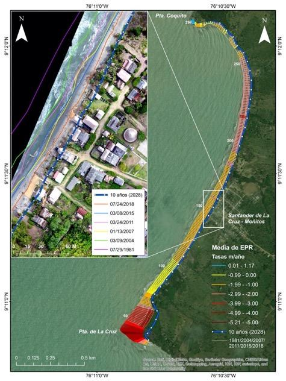
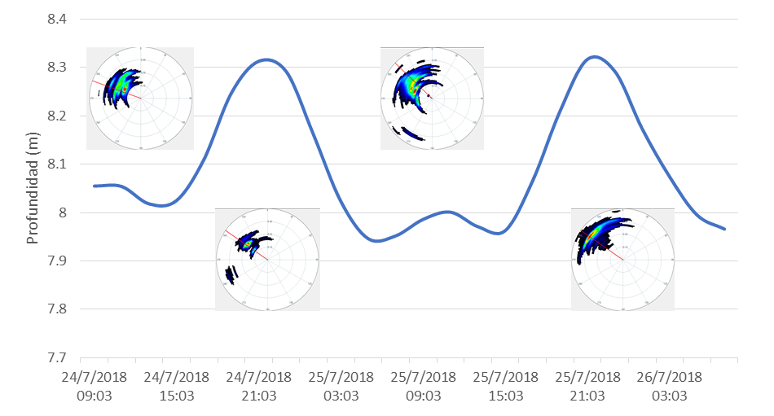
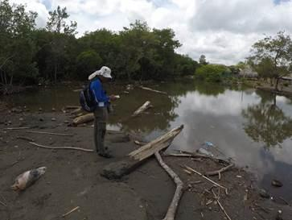
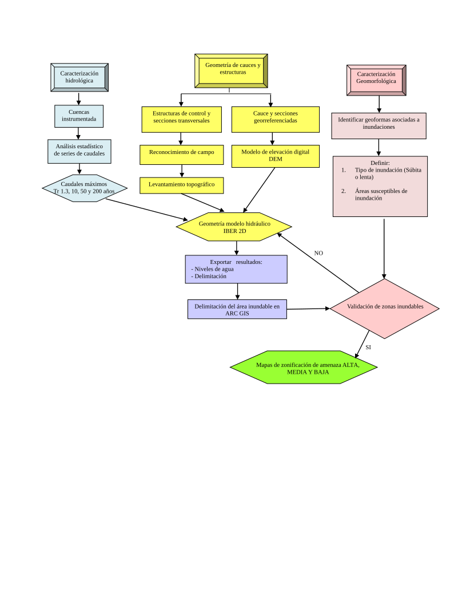
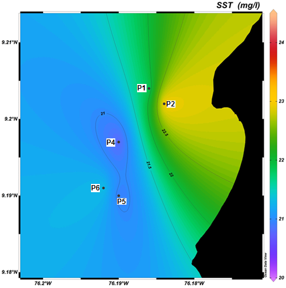

A partir del análisis de las alternativas de mitigación definidas en la sección anterior, de los resultados del monitoreo de erosión costera y los componentes de investigación, se establecieron los estudios base requeridos para la evaluación de factibilidad de las estrategias de mitigación planteadas. Los estudios contemplaron ocho componentes o disciplinas científicas, los cuales a su vez poseen unas variables o sub-disciplinas que permitieron desarrollar el tipo de muestreo o adquisición de información general. Teniendo en cuenta lo anterior, las alternativas de mitigación se relacionaron con los componentes o disciplinas, los cuales a su vez permitieron identificar la información específica a levantar (Tabla 5).

**Tabla 5.** Relación de las alternativas de mitigación con los componentes principales, mostrando la información a levantar.

| **\#** | **Alternativas**                                                                                                                                                                                                                                    | **Componentes**               | **Información**                                                                                          |
| ------ | --------------------------------------------------------------------------------------------------------------------------------------------------------------------------------------------------------------------------------------------------- | ----------------------------- | -------------------------------------------------------------------------------------------------------- |
| 1      | Debido a la proximidad e inminente riesgo de las casas frente al mar, se analizó la posibilidad de reubicación para la primera línea de viviendas.                                                                                                  | Socioeconómico y físico       | Usos del suelo, POT, geomorfología, geología, riesgos, pronóstico de comportamiento de la línea de costa |
| 2      | Reforestación de manglar en toda la zona litoral, principalmente en las áreas aledañas a los ríos.                                                                                                                                                  | Biofísico                     | Sedimentos y flora                                                                                       |
| 3      | Intervención con arrecifes artificiales en pro de reducir la energía incidente de las olas sobre la costa o estructura de baja cota de coronación o rompeolas.                                                                                      | Hidrodinámica                 | Oleaje, corrientes, turbidez, etc. Batimetrías, fondos, sedimentos, etc.                                 |
| 4      | Ninguna construcción de obras duras sobre la línea de costa de Santander, el sistema puede tener la capacidad en la producción de sedimento para la evolución acumulativa de la playa, pero se debe revisar que sucede con la fuente de sedimentos. | Dinámica litoral              | Transporte de sedimentos, sedimentología.                                                                |
| 5      | Control de la extracción de arena que padecen las playas actualmente y los procesos de desforestación sobre los ríos, cada una de estas intervenciones aportan al desequilibrio del sistema                                                         | Sedimentológico, biótico      | Áreas deforestadas y fuentes de material                                                                 |
| 6      | Al igual que La Rada, los representantes de Santander proponen la implantación y recuperación de las puntas de la bahía.                                                                                                                            | Hidrodinámica y Morfodinámica | Oleaje, corrientes, Transporte de sedimentos                                                             |

## Reubicación

A partir del estudio de cambios en la línea de costa entre los años 1981 y 2018, es decir 37 años de intervalo, usando imágenes de sensores remotos (1981, 2004, 2007, 2011, 2015 y 2018), y tomando como base la regresión lineal del DSAS (LRR), se realizó la proyección de la línea de costa hasta el año 2028, el cual mostró como se perderían viviendas que se localizan en la primera línea, generando pérdida de infraestructura local (Fig. 7a). La alternativa de reubicación en el corregimiento de Santander de La Cruz es poco factible debido a dos razones principales. La primera, es la falta de confianza de los habitantes en los gobiernos locales o regionales, así como la poca capacidad y voluntad institucional para llevar a cabo una alternativa de gran magnitud, debido a que se requeriría de buena planificación, negociaciones con propietarios y amplios recursos económicos, que garanticen el éxito de una reubicación para minimizar los impactos en los pobladores y el corregimiento. La segunda, es el uso turístico y recreacional del 33% de las construcciones en el frente de playa (Fig. 7b), lo que dificultaría la voluntad de sus dueños frente a una negociación de relocalización por no poder ejercer la actividad económica. Solo el grupo de viviendas de uso residencial podrían ser manejadas con este tipo de intervención.

**Figura 7.** Mapa de tendencia de evolución de línea de costa y proyección a 10 años (2028) (izquierda). Mapa de uso y estado de las viviendas, divido espacialmente en cuatro grupos (A, B, C y D) (derecha).

## Recuperación de puntas

Para este análisis se realizó el levantamiento topográfico del acantilado a través de un Modelo de Elevación Digital, utilizando el Escáner Laser Terrestre (TLS) FARO FOCUS 3D X330 y el sistema de posicionamiento GeoMax Zenith35 Pro GNSS en modo estático como herramienta para la toma de los puntos de amarre. El procesamiento de los datos se ejecutó en el software SCENE para el ajuste y agrupación de los levantamientos topográficos realizados. Posteriormente se exportó la nube de puntos para realizar el modelo de elevación en el software ArcGIS utilizando el método de interpolación *Natural Neighbor.*

La Punta de la Cruz ha retrocedido desde 1981 una distancia de 170.20 m con una tasa de erosión de -5.21 m/año. El acantilado presenta pendientes fuertes y escarpadas contrastantes en su base con el nivel plano de la playa expuesta en su base durante condiciones de baja energía del oleaje. Se determinó que existen dos tipos de movimientos en masa en este sector. Uno relacionado con la caída de bloques en las puntas con litologías de mayor resistencia y otro, deslizamientos traslacionales con componente rotacional en la zona intermedia de litologías blandas meteorizadas (Fig. 8). Por lo tanto, se recomienda a corto plazo realizar una estabilización con el perfilamiento de taludes y la revegetalización de las bermas, a mediano plazo un revestimiento con roca o geotextiles en la base del acantilado y finalmente, a largo plazo realizar una barrera perpendicular a la línea de costa apoyada por la regeneración artificial de sedimentos que requeriría estudios específicos de ingeniería para su diseño.

**Figura 8.** Modelos de elevación y pendiente en el sector acantilado de Punta de la Cruz.

## Fuentes de sedimentos

Se realizó el muestreo sedimentológico en zona de playa (15 estaciones) utilizando una pala sobre un recuadro superficial de 10×10 cm hasta conseguir 500 g de muestra aproximadamente, de acuerdo con el protocolo del Laboratorio de Instrumentación Marina de INVEMAR. De igual manera, se colectaron muestras de sedimento en fondos someros (10 estaciones) a través de una campaña de buceo con recolección manual hasta conseguir 500 g de muestra aproximadamente. Las muestras se almacenaron en bolsas para ser transportadas a INVEMAR donde se realizó el análisis de laboratorio. En los sedimentos se realizó análisis de granulometría por tamices, mineralogía óptica y calcimetría con el objetivo de determinar facies sedimentarias.

Los sedimentos de las playas de Santander de la Cruz corresponden a arenas finas a medias con selección buena a moderadamente buena, provenientes de aportes de escorrentía local. De acuerdo con la composición del tamaño medio de grano, los sedimentos en la playa se distribuyen desde el norte hacia el sur, predominando en la granulometría las arenas finas. Con esto, también cambia la pendiente y la playa reduce su ancho, indicando influencia de oleaje de mayor energía en la parte sur. Los sedimentos del fondo somero presentaron dos tendencias, aquellos localizados en las zonas de baja pendiente corresponden a limo muy grueso a arenas finas, pobremente seleccionados característicos de los ambientes marinos (Fig. 9 a–d), los sedimentos obtenidos en inmediaciones de una franja arrecifal dieron como tamaño medio arena media a gruesa con contenidos de grava, de selección moderada reflejando condiciones ambientales de sedimentación con mayor energía.

En Santander de La Cruz la arena es también una materia prima cuyo uso es destinado principalmente como material de construcción. Por consiguiente, se recomienda minimizar la extracción de material de las playas en Santander a través de la concientización de la población o la regulación del material extraído, para que no sobrepase la capacidad de carga del sistema natural.

**Figura 9.** Mapas de distribución de parámetros estadísticos de sedimentos: Media (**a**), Selección (**b**), Simetría (**c**), Curtosis (**d**) (+ estaciones de muestreo).

## Alternativas basadas en ecosistemas

En cuanto a medidas blandas que incluyen ecosistemas, se realizó una revisión bibliográfica correspondiente a los ecosistemas de manglares y arrecifes por estar relacionados con las alternativas de mitigación propuestas y se identificaron las condiciones oceanográficas *in situ* (Tabla 6). Además, la oceanografía del área en estudios anteriores ha identificado que la zona costera del departamento de Córdoba está directamente influenciada por el oleaje \[17\], lo cual indica que los vientos y el oleaje son factores importantes en la configuración de la costa. En la zona marina frente a Santander de La Cruz, Ricaurte-Villota y Bastidas-Salamanca \[25\] emplearon datos del Reanálisis Regional de América del Norte (NARR) y realizaron la caracterización de los vientos en una estación a 35 km de Santander de la Cruz llamada BV\_03. Estos autores encontraron que la mayor magnitud del viento se registra entre los meses de diciembre a abril, alcanzando máximos para el mes de febrero con una dirección predominante norte-noroeste. En contraste, de mayo a noviembre disminuye la velocidad del viento, registrando mínimos en el mes de octubre y una dominancia de la dirección proveniente del oeste.

**Tabla 6**. Características deseadas en los ecosistemas propuestos como medida de mitigación.

<table>
<thead>
<tr class="header">
<th><strong>Ecosistema</strong></th>
<th><strong>Parámetro</strong></th>
<th><strong>Intervalo</strong></th>
<th><strong>Medición en campo</strong></th>
</tr>
</thead>
<tbody>
<tr class="odd">
<td>Corales</td>
<td>Temperatura</td>
<td>18 - 30 °C [31]</td>
<td>Perfilador marino</td>
</tr>
<tr class="even">
<td></td>
<td>Salinidad</td>
<td>32 – 38 [32]</td>
<td>Perfilador marino</td>
</tr>
<tr class="odd">
<td></td>
<td>Tipo sustrato</td>
<td>Duro y consolidado [33]</td>
<td>Observación directa</td>
</tr>
<tr class="even">
<td></td>
<td>Turbidez</td>
<td>
Aguas claras con baja turbidez

[32]
</td>
<td>Disco Secchi o muestra de agua para solidos suspendidos totales - SST</td>
</tr>
<tr class="odd">
<td></td>
<td>Hidrodinámica</td>
<td>0.5 - 0.7 m/s [34]</td>
<td>Correntómetro</td>
</tr>
<tr class="even">
<td></td>
<td>Profundidad</td>
<td>3 a 25 m</td>
<td>Ecosonda manual</td>
</tr>
<tr class="odd">
<td>Manglares</td>
<td>Temperatura</td>
<td>20 a 35 °C [35]</td>
<td>Sonda portátil</td>
</tr>
<tr class="even">
<td></td>
<td>Salinidad</td>
<td>33 a 38.5 [36]</td>
<td>Sonda portátil</td>
</tr>
<tr class="odd">
<td></td>
<td>Tipo sustrato</td>
<td>Sustratos arcillosos u arenosos, según especie. [37]</td>
<td>Muestra de sedimentos con pala.</td>
</tr>
</tbody>
</table>

El comportamiento del oleaje a partir de la serie sintética de la boya virtual (BV\_03) ubicada a 35 km al noroeste de Santander de la Cruz, mostró que para la época seca (diciembre marzo) el oleaje presenta máximos con alturas de ola promedio de 1.35 ± 0.56 m con un periodo de 6.5 s y una probabilidad del 37% de ocurrencia de olas provenientes del NNO, seguido de direcciones al NO y O-NO. En contraste, para los meses de abril a noviembre (época húmeda), la altura de la ola disminuye hasta un promedio de 1.08 ± 0.56 m, un periodo de 6.4 s y la dirección predominante proviene del tercer cuadrante (entre 180° y 270°), con mayor probabilidad del oeste-noroeste \[25\]. Durante los días de muestreo, la altura de ola osciló entre 0.67 y 0.28 m con un promedio de 0.45 ± 0.12 m. La dirección predominante en la zona fue de 306.00º (provenientes del Noroeste) (Fig. 10).

**Figura 10.** Nivel del agua y dirección de procedencia del oleaje durante los días 24 al 26 de julio de 2018.

## Reforestación de manglar

La reforestación de manglar es ideal para cualquier playa o zona estuarina, puesto que su presencia conlleva varios servicios ecosistémicos como transferencia al mar de detritos y material vegetal y como protección contra oleajes fuertes y continuos de forma que hace que se disipe dicha energía del oleaje \[38\]. Para evaluar la potencialidad de su reforestación en la zona de estudio, se realizó un análisis de ecosistemas (coberturas vegetales) empleando imágenes de satélite (2012 y 2018) e imágenes obtenidas durante la salida de campo empleando un Drone DJI Phantom 4 Pro, así como mediciones de variables fisicoquímicas (temperatura y salinidad) y observaciones de campo sobre los cuerpos hídricos existentes.

Los resultados obtenidos al analizar los años 2012 a 2018 muestran que los manglares de Santander de la Cruz, se redujeron por efecto del aumento de la frontera agrícola en el área. Para el año 2012, se calculó una cobertura de manglar de 15.66 ha ubicada en los alrededores de las riberas de las quebradas Pequín, arroyo Culebra y quebrada San Martín, las cuales fueron reducidas hasta llegar a 8.20 ha aproximadamente para el año 2018, lo que corresponde una pérdida del 47.6% de la cobertura inicial de estos manglares (Fig. 11a, b).

**Figura 11.** Coberturas de manglar en los años 2012 (izquierda) y 2018 (derecha); muestran que los manglares de Santander de la Cruz, se reducen por efecto del aumento de la frontera agrícola que ocurre en el área.

La temperatura del agua fluctuó entre 29.70 y 33.80 °C y la salinidad entre 24.32 y 34.90; el pH mostró condiciones de basicidad con valores entre 7.06 hasta 8.29. El oxígeno disuelto (OD) osciló entre 4.65 y 8.90 mg/L, encontrándose las mayores concentraciones en los arroyos y quebradas. Estos resultados indicaron que para el momento de la medición (24 de julio de 2018), el agua, tanto en los arroyos, quebradas y pequeños caños, se encontraba estancada y no había comunicación aparente con el mar; de allí, los valores obtenidos: aguas con características salobres o dulces. En algunos lugares, se pudo observar mucha materia orgánica natural (hojarasca, algas, trozos de trocos), que hacen que se aumente el proceso de baja de oxígeno y afectan el movimiento del agua (Fig. 12).

**Figura 12.** Boca del arroyo Culebra y quebrada San Martín.

<table>
<tbody>
<tr class="odd">
<td>
<strong>Caja 1. Conceptos clave</strong>

<strong>Cambio de coberturas:</strong> permiten evidenciar cambios en extensión, tipo de especie y aumento de la frontera agrícola.

<strong>Características fisicoquímicas</strong>: determinan el asentamiento o no de determinada especie.
</td>
</tr>
</tbody>
</table>

## Intervención con arrecifes artificiales

Los arrecifes artificiales se han utilizado con éxito en algunos países de Europa y Sudáfrica para la recuperación o formación de playas, así como en la protección de caminos e infraestructura \[39\]. Adicionalmente, pueden servir como base para nuevos ecosistemas, albergando variedad de especies marinas. Para identificar su potencialidad en la zona de estudio, se realizaron estudios que incluyeron caracterización del fondo marino (sustrato con perfilador de subsuelo), hidrodinámica de la bahía (mediciones de oleaje y nivel con correntómetro acústico) y propiedades físicas de la columna de agua (temperatura con sonda y sólidos suspendidos totales mediante determinación en laboratorio en muestra de agua superficial). Se tuvo como base la batimetría levantada en la zona (Fig. 13), la cual permitió identificar posibles zonas de restauración. De igual manera se muestra un perfil transversal 2D (Fig. 13 y 14).

En el modelo batimétrico y el perfil transversal se puede observar una franja rocosa sumergida (Fig. 13 y 14), la cual tiene características naturales para la conformación de un arrecife. Un fragmento de roca obtenido en campo muestra que corresponde a la continuidad de las lutitas de la Unidad Moñitos sobre la que se incrustan nemátodos y briozoos entre otros organismos que forman biohermos (acumulaciones biogénicas). Esta estructura podría utilizarse como base la conformación de una barrera natural y con mayor resistencia que permita la reducción de energía del oleaje al que se expone el área de estudio durante los primeros meses del año.

**Figura 13.** Modelo batimétrico para Santander de la Cruz.

**Figura 14.** Perfil en el área central del área de estudio, nótese la elevación de la franja rocosa a aproximadamente 400 m de la línea de costa.

<table>
<tbody>
<tr class="odd">
<td>
<strong>Caja 2. Conceptos clave</strong>

<strong>Sustrato:</strong> Está relacionado con la disponibilidad de superficie favorable para el asentamiento de especies sedentarias y larvales.

<strong>Oleaje:</strong> su magnitud y dirección son los factores que más inciden en la dinámica litoral. Permitirá determinar la ubicación de estructuras de protección costera.

<strong>Temperatura:</strong> cumple un papel imprescindible para el asentamiento y crecimiento de los reclutas coralinos; mientras que la <strong>Turbidez</strong> hace referencia a la disponibilidad de luz solar para realizar fotosíntesis de las zooxantelas (simbiontes).
</td>
</tr>
</tbody>
</table>

Se encontró que no es posible hacer siembra de corales en la bahía, ya que la temperatura sobrepasa el rango permitido para un estado óptimo de estos organismos. Lo mismo pasa con la salinidad, la cual se encuentra por debajo del intervalo adecuado para su crecimiento. Esto explica la ausencia de este ecosistema en cercanías a la zona de estudio. Con respecto a la turbidez, los mayores valores de SST se encontraron al norte de la bahía; mientras que los menores (correspondientes con las mayores transparencias), se encontraron en la parte más alejada de la costa, donde la influencia continental es menor. Se procede con otro tipo de ecosistemas que sirvan como barreras vivas (Fig. 15).

**Figura 15.** Concentración de SST (mg/l) en la bahía frente a Santander de la Cruz.

