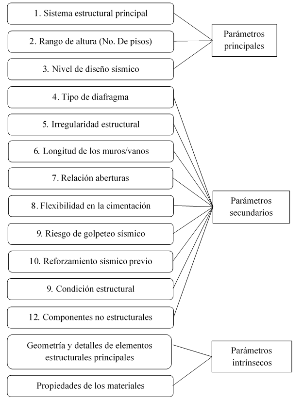
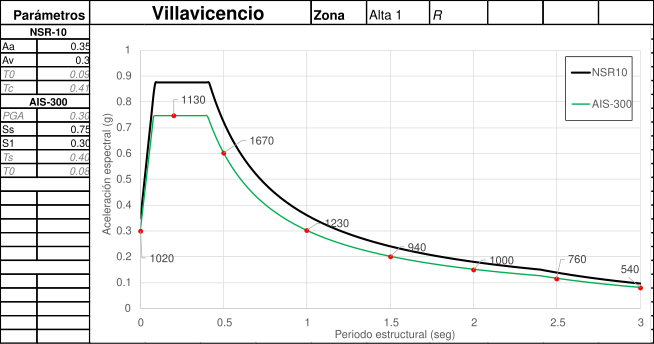
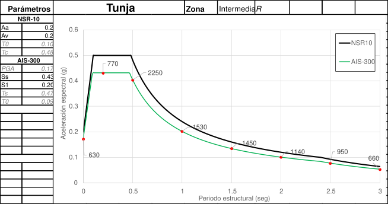
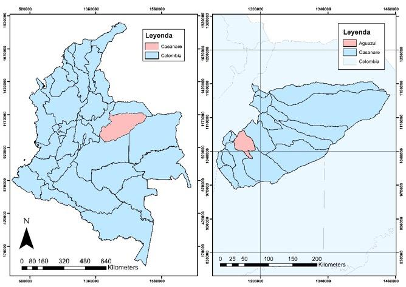
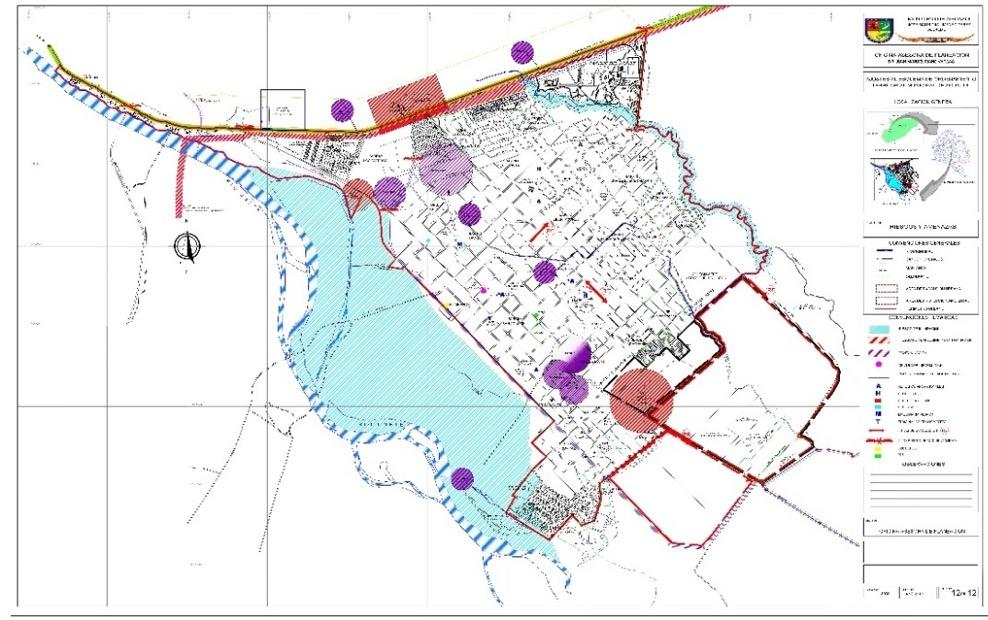

La Ley 400 de 1997 marca un hito en la historia del país al establecer el marco normativo que provee las exigencias mínimas para el diseño de edificaciones nuevas en Colombia. La Norma Colombiana de Construcción Sismo Resistente, NSR, está circunscrita en dicha ley y sus decretos reglamentarios, estableciendo las condiciones para la práctica de la ingeniería estructural en Colombia. Esta norma fue actualizada en el 2010 en diversos aspectos de la ingeniería estructural y sísmica, incluyendo la evaluación de la amenaza sísmica a nivel nacional y los coeficientes de diseño. En este momento, la Asociación Colombiana de Ingeniería Sísmica (AIS) se encuentra actualizando de nuevo la norma, buscando incorporarle elementos más modernos y ajustados al estado del conocimiento. Como parte de dicha actualización, el comité AIS-300, encargado de la Amenaza Sísmica Normativa dentro de la AIS, realizó una propuesta de coeficientes sísmicos de diseño que deberá ser estudiada por la Comisión Asesora del Régimen de construcciones Sismo Resistentes, creada por la Ley 400 de 1997, y máximo ente encargado de tomar las decisiones acerca de la sismo resistencia de edificaciones en el país. Este documento presenta los resultados del proceso de actualización de los coeficientes de diseño sismo resistente, basados en la evaluación probabilista de la amenaza sísmica de Colombia y en nuevos procedimientos para definir los movimientos de diseño.

El sector escolar es uno de los más vulnerables frente a eventos naturales en particular para eventos sísmicos. Esto se debe a la vulnerabilidad física de edificaciones antiguas y a las características de sus ocupantes \[1\]. Por otra parte, sus características arquitectónicas permiten que esta infraestructura se utilice como espacios de refugios para damnificados por eventos de desastre de gran magnitud. La alta vulnerabilidad de este tipo de infraestructura se ha evidenciado en eventos sísmicos recientes en los cuales se han visto colapsos parciales y totales de la infraestructura. En edificaciones de concreto reforzado se han evidenciado daños en diferentes territorios; en particular EERI ha identificado colapsos o daños graves en India, Indonesia, Perú, Turquía, Estados Unidos y Haití en edificaciones con sistemas de pórticos y muros \[2\]. Construcciones en muros de mampostería también han sufrido daños importantes como lo evidencia Chen et al. \[3\], en donde se identifican casos de daños y colapsos de edificaciones escolares en el sismo de Ghorka, Nepal en el 2015. En Latinoamérica se han presentado daños importantes en el sector. Por ejemplo, en México, en el sismo de Puebla del 2017 alrededor de 280 escuelas sufrieron daños que necesitaron reparaciones \[4\] y en Ecuador en el sismo de Muisne 2016 se registraron colapsos totales o parciales de escuelas en Manta, Pedernales y Portoviejo \[5\].

Teniendo en cuenta esta problemática, se han desarrollado diferentes iniciativas para el reforzamiento y mejoramiento de la infraestructura escolar a nivel mundial. Una de las iniciativas más importantes es el Programa Global para Escuelas Seguras (GPSS por sus siglas en inglés) del Banco Mundial que ha desarrollado proyectos en Perú, Colombia, El Salvador, República Dominicana, Kirguistán y Grecia, entre otros. Por otro lado, la ONG Build Change tiene un programa de mejoramiento de infraestructura escolar denominado Escuelas Seguras en donde se han desarrollado proyectos en Indonesia, Filipinas y Nepal. Existen también iniciativas gubernamentales que buscan reducir el riesgo sísmico, un ejemplo de este tipo de iniciativas es *Cali Resiliente* que se enfoca en mejorar la infraestructura escolar mediante reforzamientos estructurales en la infraestructura escolar de la capital del Valle del Cauca en Colombia o el desarrollo del *Plan Metropolitano del Riesgo Sísmico* desarrollado por el Área Metropolitana del Valle de Aburrá en Medellín y sus municipios aledaños.

Adicionalmente, existen estudios en la literatura que evalúan el riesgo sísmico en el sector escolar en diferentes países con una perspectiva macro para priorizar recursos y poder realizar estudios detallados y estrategias particulares de intervención. Valcárcel et al. \[6\] presenta un análisis simplificado riesgo probabilista a nivel Latinoamérica a partir de indicadores demográficos y referencias internacionales con el objetivo de priorizar los países cuyo riesgo sísmico sea alto en la infraestructura escolar. Otro ejemplo de este tipo de estudios es el desarrollado por Mora et al. \[7\] en donde se realiza un estudio similar al anterior para los diferentes municipios de Colombia.

Por otro lado, también existen trabajos detallados como el desarrollado por Chrysostomou et al. \[8\] en el cual se presenta un estudio para Chipre mostrando cómo se desarrolló un programa a nivel nacional de reducción de riesgo en el sector escolar con un resultado positivo en el cual más del 90% de las edificaciones utilizadas en el sector se consideran seguras frente a sismos según las normativas nacionales. Jaimes & Niño \[9\] presentan un estudio similar en México en donde analizan el portafolio de edificaciones escolares a partir de las fechas de construcción y su relación con los códigos de construcción sismorresistente nacionales. Por último, Samadian et al. \[10\] presenta un estudio de resiliencia en Irán en donde presentan los detalles de los modelos y resultados obtenidos para una edificación tipo en mampostería. Como se observa en los ejemplos anteriores, la importancia de la mitigación del riesgo y el aumento en la resiliencia del sector escolar es una de las prioridades de cada país, incluso en Irán se ha incluido la gestión de riesgo de desastres y emergencias en el currículo escolar con el objetivo que los estudiantes sean conscientes de la importancia de la resiliencia desde temprana edad \[11\].

Teniendo en cuenta este contexto, el objetivo de este capítulo es presentar una metodología general para el análisis y desarrollo de planes de mitigación del riesgo en el sector escolar. En la Sección 2 se presentará la metodología propuesta para abordar el problema. La sección 3 describe las tipologías escolares más comunes encontradas en diferentes proyectos. La sección 4 presenta dos casos de estudio de la metodología indicada desarrollados en Colombia por los autores. Por último, las secciones 5 y 6 presentan las recomendaciones y trabajo futuro y los agradecimientos respectivamente.

2.  # METODOLOGÍA
    
    1.  ## Metodología para el desarrollo de planes de mitigación del riesgo

Con el fin de desarrollar una estrategia adecuada para la mitigación del riesgo de desastres es necesario realizar un análisis detallado de la situación actual. En primer lugar, se debe recolectar información para consolidar una base de datos de la infraestructura expuesta que represente adecuadamente la infraestructura de la zona de estudio. Esta base de datos debe contener al menos información en cada colegio del número de edificaciones, el número de pisos y aulas escolares en cada uno, número de estudiantes, año de construcción, material y sistema estructural, y nivel de diseño. Para esto se recomienda desarrollar un sistema taxonómico de identificación o utilizar uno existente como el desarrollado en el marco del Programa Global para Escuelas Seguras (GPSS por sus siglas en inglés) del Banco Mundial, en el cual participaron los autores \[12\]. En particular, el nivel de diseño es una variable difícil de obtener puesto que cada país tiene sus propias normativas y cada región sus técnicas constructivas. Se recomienda para esto asignar un nivel de diseño a partir de parámetros como el año de construcción, características estructurales, dimensiones, constructor y experiencias locales según la información disponible.

Una vez se tiene esta base de datos, se debe realizar un análisis del riesgo en el estado actual. Se recomienda realizar un análisis probabilista del riesgo con el objetivo de tener en cuenta la incertidumbre y el riesgo en el proceso de toma de decisiones. Utilizando los resultados de este panorama general, se deben analizar los mecanismos de colapso y las vulnerabilidades de las principales tipologías del portafolio a partir de un análisis no lineal tridimensional con el fin de proponer medidas de reforzamiento estructural \[13\]. Estas medidas se deben diseñar a nivel macro con el objetivo que puedan ser aplicadas a gran escala. Una vez se tienen estas medidas identificadas, se debe realizar un análisis de riesgo en un estado “mitigado”. El análisis de este estado ideal de la infraestructura permite desarrollar planes de mitigación del riesgo que se ajusten a las limitaciones económicas y temporales de cada caso particular. Este análisis permite entonces identificar las edificaciones que mayor reducción del riesgo presentan y su priorización por diferentes criterios. La metodología general se presenta en la Figura 1. En los próximos numerales se resumirán algunas de las estrategias más comunes utilizadas en la práctica para el desarrollo de la evaluación del riesgo, la identificación de alternativas de reforzamiento estructural. Los casos de estudio presentados más adelante siguen la metodología indicada en este capítulo; sin embargo, se presentarán desde la descripción del modelo de exposición y no se detallará la fase de recolección de información por limitaciones en el alcance. Sin embargo, vale la pena aclarar, que en esta fase existen múltiples incertidumbres que deben tratarse adecuadamente para obtener resultados confiables.

**Figura 1.** Metodología para desarrollo de planes de mitigación del riesgo sísmico en el sector escolar.

2.  ## Evaluación del riesgo
    
    1.  ### Análisis de riesgo sísmico

La aproximación utilizada para la evaluación del riesgo sísmico se basa en un catálogo de eventos estocásticos modelados a partir de la información de la sismicidad histórica de la zona de estudio. Esta evaluación sigue un enfoque prospectivo, anticipando eventos de ocurrencia y consecuencias factibles. El análisis contempla incertidumbres asociadas a la estimación de la magnitud y frecuencia en la amenaza, así como también las asociadas a la vulnerabilidad y distribución del portafolio de elementos expuestos. Para esto es necesario evaluar los siguientes componentes principales: la amenaza en términos probabilistas, la exposición que corresponde al portafolio de edificaciones escolares susceptibles de sufrir daño y la vulnerabilidad de estas. La Figura 2 presenta el esquema general del modelo probabilista de evaluación del riesgo. Más información sobre la metodología general de evaluación del riesgo sísmico se puede encontrar en Yamin et al. \[14\] y en Yang \[15\].

**Figura 2.** Modelo probabilista del riesgo.

### Análisis de la amenaza sísmica

El primer paso para el desarrollo de la evaluación del riesgo sísmico es el análisis de la amenaza probabilista. Este análisis permite estimar los niveles de aceleración a las que las edificaciones podrían verse sometidas durante un sismo. Para esto es necesario desarrollar un modelo de aceleración en roca \[16\] y un modelo de aceleración en superficie que tenga en cuenta la amplificación por suelos blandos \[17\]. El modelo de amenaza sísmica se representa mediante mapas de distribución de parámetros de intensidad sísmica como la aceleración máxima del terreno o las aceleraciones espectrales para diferentes periodos de vibración y amortiguamiento estructural. Cada uno de estos se evalúa para un conjunto completo de posibles eventos estocásticos que pueden llegar a ocurrir en la zona de influencia teniendo en cuenta los rangos de magnitudes posibles en las diferentes fuentes sísmicas y las distancias relativas entre estas. Cada evento se identifica con la frecuencia media anual de ocurrencia que se obtiene con base en el análisis de la frecuencia de eventos históricos. Para más detalles del procedimiento consultar las referencias \[14–16\].

### Exposición de edificaciones

El modelo de exposición relaciona espacialmente las edificaciones del portafolio con sus características constructivas. El costo y el tiempo asociado para desarrollar el modelo de elementos expuesto varía según la información existente y la resolución definida. En la mayoría de los casos de estudio desarrollados por los autores se ha evidenciado una deficiencia en la información existente, por lo que ha sido necesario llevar a cabo visitas de campo y exploraciones a las escuelas con el fin de obtener datos mínimos. Estas campañas de campo pueden llegar a ser la parte más costosa y dispendiosa del proyecto en caso de que no se cuente con información. Con el fin que los resultados sean útiles para desarrollar el análisis de riesgo, se recomienda que el modelo tenga una resolución a nivel de edificación. Este modelo debe contar con la ubicación de las escuelas, la cantidad de edificaciones, el número de pisos de cada edificación, el material principal, el sistema estructural de resistencia sísmica y gravitacional, y el nivel de diseño sísmico. Este último parámetro se puede clasificar en edificaciones no ingenieriles y edificaciones ingenieriles con nivel de diseño bajo, medio y alto. La definición de cada nivel es particular de cada proyecto y cada país, a manera de ejemplo para el caso colombiano se pueden comparar con los niveles de diseño DMI, DMO y DES de la Norma Sismo Resistente Colombiana - NSR10 \[18\]. Este parámetro es uno de los más difíciles de asignar directamente por lo que se debe obtener a partir de correlaciones de otras variables como el año de construcción, el organismo constructor, dimensiones de elementos estructurales y presencia de elementos de detallamiento sísmico, entre otros.

Para caracterizar estructuralmente las edificaciones se recomienda utilizar el sistema de clasificación taxonómica establecido en el marco de la Librería Global de Infraestructura Escolar (GLOSI por sus siglas en inglés) \[12\]. Este sistema de clasificación se diseñó específicamente para catalogar edificaciones escolares y tiene la flexibilidad de la cantidad de información a incluir. El proceso de asignación consiste en clasificar todas las edificaciones escolares mediante la caracterización de los parámetros principales, con estos identificar las edificaciones índice o arquetipo que son aquellas que dominan el portafolio y en estas edificaciones caracterizar los parámetros secundarios y los parámetros intrínsecos como se puede ver en la Figura 3. La cantidad de escuelas a analizar en cada nivel (parámetros principales, secundarios e intrínsecos) debe seleccionarse según las características y las limitaciones de cada proyecto asegurando que las muestras seleccionadas se puedan clasificar como muestras aleatorias representativas. Para más información de esta metodología consultar [https://gpss.worldbank.org/en/glosi](https://gpss.worldbank.org/en/glosi).

**Figura 3.** Sistema de clasificación taxonómico de la Librería Global para Infraestructura Escolar. Adaptado de GLOSI \[12\].

Con estos parámetros se debe asignar o generar una función de vulnerabilidad sísmica que represente las características estructurales de la edificación como se mostrará en el siguiente numeral. Teniendo en cuenta lo anterior, para el análisis de riesgo es necesario contar con una base de datos georreferenciada a nivel de edificación que contenga a lo sumo lo siguiente:

  - > Identificación.

  - > Localización.

  - > Valor de reposición.

  - > Función de vulnerabilidad.

  - > Número máximo de estudiantes.
    
    1.  ### Vulnerabilidad sísmica

La vulnerabilidad sísmica de las construcciones se representa mediante una función que relaciona el valor medio del daño y su varianza (expresado en porcentaje con respecto al valor de reposición del bien) con una medida de intensidad sísmica, como se observa en la Figura 4. La medida de intensidad se puede expresar como la aceleración máxima del terreno o la aceleración espectral para un periodo estructural específico según el comportamiento de la edificación que se evalúa. Utilizando estas curvas es posible cuantificar los daños en edificaciones específicas o en cualquier componente de infraestructura para escenarios sísmicos específicos.

**Figura 4.** Función de vulnerabilidad típica.

En la literatura se pueden encontrar diferentes catálogos de funciones de vulnerabilidad de edificaciones. Entre las principales fuentes de información se encuentra el programa HAZUS el cual propone una metodología para desarrollar funciones de fragilidad para diferentes tipos de amenazas producida por el FEMA (Agencia Federal para el Manejo de Emergencias por sus siglas en inglés) desde el año 1997 \[19\]. Estas funciones de fragilidad se adaptaron y transformaron para el contexto latinoamericano mediante la asignación de pesos relativos para obtener una única función de vulnerabilidad en el marco del proyecto GAR13 \[20\]. Estos catálogos se realizaron para diferentes tipos de edificaciones, no necesariamente edificaciones escolares por lo que se debe tener especial cuidado al utilizarlos en este contexto. Teniendo en cuenta esto se recomienda generar funciones particulares para cada proyecto que tengan en cuenta las características constructivas de cada región. Existen diferentes guías metodológicas para la generación de funciones de vulnerabilidad. Entre estas se destacan la iniciativa para la evaluación de vulnerabilidad propuesta por el GEM (Modelo Global de Terremotos) \[21\], la metodología de generación de funciones propuesta por Yamin et al. \[22\] y el GLOSI del Banco Mundial \[13\] entre otros.

## Alternativas de reforzamiento estructural

Una vez se ha determinado la vulnerabilidad de cada edificación, es necesario identificar el mecanismo de colapso a partir de un análisis no lineal tridimensional como se indicó anteriormente. Esta identificación permite proponer alternativas de reforzamiento con el fin de reducir la vulnerabilidad. Existen varias limitaciones que deben tenerse en cuenta en este proceso, en particular el cumplimiento de las normativas nacionales que pueden ser más o menos exigentes según el país. Cada país tiene actualmente sus propias normativas que limitan los tipos de reforzamiento. En algunos casos las normas exigen llevar las edificaciones a niveles de desempeño equivalente al de edificaciones nuevas, esto hace que los reforzamientos en ciertos casos no sean costo-efectivos, por lo que se vuelve necesario analizar alternativas como la del reforzamiento incremental en donde la intervención se divide en fases con el fin de reducir la posibilidad de colapso en el menor tiempo y con el menor costo posible para proteger las vidas de los ocupantes \[23\].

Las estrategias de mitigación se pueden dividir en estructurales y no estructurales. Las estructurales son aquellas en las que se intervienen directamente los elementos estructurales y se modifica el comportamiento y los mecanismos de colapso de la edificación. Las intervenciones estructurales pueden enfocarse en rigidizar las estructuras (muros de concreto, contrafuertes, diagonales de acero, etc.) o en darle ductilidad a las estructuras (confinamiento, recubrimiento, rigidización de diafragmas, etc.). Por otro lado, las medidas de mitigación no estructurales se enfocan en asegurar un comportamiento sísmico adecuado de elementos que presenten riesgo a la vida, entre estos están el aseguramiento de cielos rasos, tuberías, estanterías y sistema HVAC (siglas en inglés de Calefacción, Ventilación y Aire Acondicionado) entre otros. Costos aproximados de este tipo de intervenciones se pueden encontrar en Valcárcel et al. \[6\] sin embargo se recomienda realizar presupuesto detallados para cada proyecto. Con el objetivo de asegurar niveles de calidad en los reforzamientos se recomienda seguir normativas internacionales reconocidas, entre las cuales se desatacan las siguientes:

  - > ASCE 41-17 \[24\].

  - > FEMA E-74 \[25\].

  - > British Columbia Ministry of Education \[26\].

  - > FEMA 308 \[27\].
    
    1.  ## Priorización y Planes de Mitigación del Riesgo Sísmico (PMRS)

Los planes de mitigación del riesgo deben desarrollarse a partir de los resultados de los análisis anteriores, pero también deben concertarse con las autoridades locales de cada proyecto. Es fundamental concertar estos planes con el objetivo que su aplicabilidad sea mayor. Los PMRS se deben formular siguiendo los siguientes objetivos, en orden de importancia:

1.  > Reducir el riesgo de muerte o accidentes a la comunidad estudiantil.

2.  > Reducir los daños en la infraestructura, contenidos, instalaciones y proteger la propiedad.

3.  > Beneficiar la mayor cantidad de estudiantes.

4.  > Reducir el tiempo de interrupción de los servicios escolares.

5.  > Mejorar la calidad de la infraestructura.

Las edificaciones se pueden dividir en tres grupos principales: edificaciones con riesgo alto de colapso, edificaciones con alto riesgo de sufrir daños, y edificaciones con buen comportamiento. En el primer grupo están las edificaciones que presentan niveles de comportamiento cercanos al colapso para periodos de retorno bajos, en el segundo grupo están las edificaciones que presentan niveles de comportamiento cercanos al colapso para el periodo de retorno de diseño; y en el último, las edificaciones que presentan buen comportamiento para el periodo de retorno de diseño. Dependiendo de las características estructurales de las edificaciones catalogadas en cada uno de los grupos se debe proponer el reemplazo de la edificación, el reforzamiento integral, un reforzamiento estructural menor, el reforzamiento de elementos no estructurales, o ningún reforzamiento. En ciertos casos es posible evaluar un reforzamiento incremental en donde la intervención inicial es menor con el objetivo de reducir el riesgo de muerte o accidentes a la comunidad estudiantil y en una segunda fase se busque reducir daños a la infraestructura y reducir el tiempo de interrupción de los servicios. Esta opción de reforzamiento incremental permite una alternativa a la distribución de recursos, adaptándose a un primer objetivo de reducción de fatalidades o accidentes en el corto y mediano plazo, y el cumplimiento de los demás criterios en segunda instancia, lo cual fortalece la visión de intervenciones en el sector a largo plazo, especialmente desde un punto de vista de políticas públicas para la reducción del riesgo.

Una vez se tienen identificados los planes, debe realizarse una priorización de las edificaciones a intervenir con el objetivo de reducir la mayor cantidad del riesgo en el menor tiempo posible y con la menor cantidad de recursos. Para este análisis pueden utilizarse diferentes métricas como la Pérdida Máxima Esperada (PAE) o el Beneficio-Costo (B-C). Este último se ha utilizado ampliamente en la literatura en proyectos en el sector educativo para justificar las intervenciones \[6,7,9,28–30\]. Teniendo esto en cuenta, se utiliza una modificación al B-C con el objetivo de usarse como criterio de priorización y utilizar una métrica denominada Eficiencia-Costo (E-C) que relaciona la reducción del riesgo con la cantidad de estudiantes (matrícula), el número de estudiantes beneficiados, el costo del reforzamiento y el costo de oportunidad o interés para traer a valor presente las pérdidas \[14\]. Esta métrica puede entenderse como el B-C multiplicado por el número de estudiantes beneficiados. El objetivo de incluir este parámetro en la priorización es dar más importancia a las escuelas más densas, es decir aquellas que concentran más estudiantes en menores áreas, lo cual no se tiene en cuenta al considerar únicamente el criterio del B-C. Para el cálculo de la eficiencia-costo debe dividirse la reducción del riesgo por el costo de oportunidad o interés para obtener los beneficios en valor presente, dividirlo en el costo de la intervención y multiplicarlo por el número de estudiantes como se ve en la siguiente fórmula:

\(EC = \frac{\left( \text{\ PAE}_{\text{Actual}} - \text{PAE}_{\text{Estado\ Mitigado}} \right)*No.\ de\ estudiantes\ beneficiados}{Costo\ del\ reforzamiento*Costo\ de\ oportunidad}\) (1)

La gestión del riesgo comprende todo el conjunto de acciones que pueden ser ejecutadas con el fin de reducir el impacto negativo de los desastres. Ahora bien, el primer paso para una correcta gestión del riesgo es identificarlo y cuantificarlo. En el marco de desastres asociados con fenómenos meteorológicos, se presenta una metodología novedosa con un enfoque único a nivel mundial, para la construcción de modelos totalmente probabilistas de riesgo de sequía, que se puede extender a otras amenazas como inundación o heladas.

La sequía es una amenaza de desarrollo lento, que genera daños elevados para las actividades agropecuarias y la población expuesta. La sequía degrada los principales medios de subsistencia, agua y cultivos, de las comunidades, aumentando sus condiciones de inseguridad y, en consecuencia, aumentando el riesgo a niveles que pueden exceder los impuestos por eventos catastróficos Hagman, 1984 en \[1\].

Hasta ahora Colombia no cuenta con una evaluación de la amenaza de sequía \[2\]. Sin embargo, estudios rigurosos como el Estudio Nacional del Agua han adelantado esfuerzos para caracterizar la sequía en el país. Este estudio utilizó el indicador SPI \[3\] acumulado a 1 y 12 meses para identificar los eventos de sequía que afectaron a Colombia entre 1980 y 2016 y cuál es su relación con el fenómeno ENSO. Según el ENA \[4\] en los últimos 30 años se presentaron fuertes periodos de sequía en 1985, 1988–1989, 1991–1992, 1997–1998 y 2014–2016. Éste último coincide con un fuerte evento de El Niño (2015–2016) y afectó principalmente las regiones Caribe y Pacífico. De otro lado, el evento de 1985 ocurrió bajo condiciones del fenómeno de La Niña, con fuertes impactos en la Orinoquía y la Amazonía. En cuanto a la cuantificación de las pérdidas derivados de eventos de sequías, es poco lo que se ha reportado en el país. El Ministerio de Agricultura reporta que en condiciones de déficit hídrico prolongado, los rendimientos de las cosechas del país pueden reducirse en un 5% en promedio \[5\]. Un Estudio Económico del DNP concluyó que si el país no toma las medidas necesarias para gestionar los riesgos por sequías, se estima que las pérdidas por eventos de variabilidad climática similares al Fenómeno de El Niño 2015 serán cercanas a 0.7% del PIB para el sector agropecuario y de generación de energía \[6\].

Aunque se han desarrollado a nivel internacional diversas metodologías para la evaluación detallada del riesgo para amenazas como sismos, inundaciones y caída de ceniza volcánica \[7–12\], pocas metodologías permiten realizar un análisis para la sequía \[13,14\] por la complejidad del fenómeno (sequía) y los elementos expuestos (cultivos, pastos y ganadería).

El objetivo de la metodología que aquí se propone es identificar y cuantificar el riesgo catastrófico por sequía en el sector agropecuario, que con un enfoque probabilista considere las incertidumbres propias e inherentes a este tipo de evaluaciones, así como las inevitables limitaciones en la información disponible.

A continuación se presenta la metodología de evaluación probabilista del riesgo por sequía en el sector agropecuario, mostrando los resultados de la evaluación de riesgo para el cultivo de maíz en Colombia. Estos resultados se obtuvieron dentro del marco de una evaluación de riesgo multiamenaza adelantada por los autores, que también considera los impactos de inundaciones y heladas en el sector agropecuario. Algunos ejemplos de aplicación de los resultados del modelo probabilista de riesgo de sequias son:

  - > Planificación del territorio con el uso de mapas de amenaza integrada: *¿dónde y qué sembrar para reducir las pérdidas esperadas? ¿Dónde establecer nuevos proyectos agroindustriales? ¿En qué zonas del país incentivar el uso de semillas resistentes a sequia?*

  - > Inversión en proyectos de infraestructura: *¿qué distritos de riego priorizar?*

  - > Seguros agrícolas para la transferencia del riesgo: *¿Cuál es la prima pura de riesgo?*

  - > Análisis costo-beneficio de estrategias de manejo de cultivos como: distritos de riego, construcción de reservorios, uso de fertilizantes, rotación de cultivos.

  - > Medidas de adaptación a variabilidad climática.

  - > Estimación de pérdidas en el sector pecuario, relacionado con la disminución en la disponibilidad de alimento (pasto).

En la primera sección se presenta el marco conceptual de la evaluación de riesgo por sequía, que brinda una idea general de los conceptos que se utilizan en el capítulo. La segunda sección presenta la metodología para la evaluación de la amenaza a partir de un generador de clima estocástico que permite simular eventos de sequía meteorológica. Con esto se obtienen eventos extremos de clima que potencialmente pueden ocurrir en la zona y derivar en desastres. Luego se presenta el modelo de exposición, centrado en el sector agropecuario, y el modelo de vulnerabilidad, que consiste en evaluar la respuesta de los cultivos a condiciones extremas de disponibilidad de agua y temperatura. Finalmente se presentan resultados de la evaluación de riesgo por sequía para el cultivo de maíz en Colombia. Los detalles de la metodología se presentan al final del documento, en la sección Materiales y Métodos.

La Tierra es eminentemente un sistema dinámico. Los procesos que ocurren en el interior de la Tierra y el movimiento de grandes volúmenes en la superficie terrestre se ligan estrechamente a la tectónica de placas, y a ello, la sismicidad y el volcanismo. De igual manera, los movimientos de grandes masas tanto en la atmósfera como en los océanos se asocian a procesos dinámicos. Muchas inquietudes que han surgido, generalmente relacionadas con geoamenazas, ciclo hidrológico e incluso acerca del cambio global, entre otras, no pueden explicarse si no se tiene conocimiento y entendimiento de los procesos relacionados con transporte de masas en el sistema Tierra. Para detectar movimientos asociados a procesos dinámicos que ocurren en el sistema Tierra, con alta precisión y resoluciones temporales, se emplean técnicas de geodesia espacial, en dos de sus componentes: geodesia de posicionamiento y geodesia de imágenes. Así, los grandes avances en las técnicas geodésicas espaciales y el rápido desarrollo de sistemas y fortalecimiento de las capacidades de transmisión de datos dan lugar al surgimiento de una verdadera revolución en el campo de estudio de la geodesia, tanto global como regional y local, permitiendo su aplicación en diversas disciplinas del conocimiento, entre ellas las relacionadas con las geociencias. La observación de desplazamientos en la superficie terrestre permite establecer el estado de deformación de la corteza terrestre, y su posible asociación con la ocurrencia de sismos, tsunamis, erupciones volcánicas, entre diversos tipos de amenazas \[1\]. Este artículo presenta dos casos de aplicación de técnicas geodésicas espaciales que contribuyen aportando nuevo conocimiento para la gestión del riesgo en Colombia.

Los casos de reasentamiento correctivos asociados a amenazas socio-naturales se soportan en el diagnóstico de riesgo no mitigable en una zona específica, donde la vulnerabilidad construida puede desencadenar un conjunto de afectaciones negativas para la integridad física, mental, social, económica y cultural de los habitantes de la zona. Bajo este marco, el reasentamiento correctivo es un proceso que constituye la última alternativa para reducir los riesgos de un determinado grupo poblacional al considerarse su complejidad \[1\].

El reasentamiento correctivo se convierte en un desafío nacional para la creación y fortalecimiento de estrategias sociales encaminadas a reducir riesgos de desastres, donde salvaguardar la integridad biológica (vida humana) y dar solución habitacional no es la única línea de acción del proceso, por el contrario, es necesario que se formulen planes y programas para el desarrollo sostenible. Este desafío es aún mayor cuando se analizan y desarrollan componentes psicosociales en los procesos de reasentamiento correctivo. La experiencia latinoamericana se convierte en un referente, especialmente Colombia, donde se muestra que no basta con entregar una vivienda que estructuralmente se adapte a la satisfacción de necesidades básicas de las personas y familias \[1,2,3,4,5\], suficiente con revisar las experiencias documentadas de reasentamientos sociales en el orden nacional, entre ellas, el terremoto y el tsunami de Tumaco (1979), terremotos de Páez (1994) y Armenia (1999), erupción del volcán Nevado del Ruiz (1985), movimientos de Masa en Villatina (1987), la inundación de Girón (2005), y las avalanchas desencadenadas por la erupción del volcán nevado del Huila en Belalcázar (2008) y por desbordamiento de una quebrada en Salgar (2015), para confirmar lo anterior (se recomienda al lector revisar la bibliografía del presente documento donde podrá encontrar amplia información al respecto).

El marco social del reasentamiento se ha limitado a censos, inventarios y caracterizaciones demográficas \[6,7,8\], así como a estrategias y respuestas a corto plazo, de corte reactivo, que eluden nuevos riesgos en los territorios \[9,10\]. La vivencia Latinoamericana \[11,12,13\] ha mostrado cómo incontables proyectos de reasentamiento han contribuido a la construcción de comunidades más vulnerables \[14,15,2,16,17\], al no considerarse ningún componente psicosocial en estos procesos. Se hace imprescindible, entonces, ahondar en aquellos componentes constitutivos de lo psicosocial, pues es allí que pueden consolidarse acciones participativas explicitas y claras para todos los actores. El reasentamiento requiere de un acompañamiento psicosocial a las personas y comunidades que serán reasentadas, así como, en caso de existir, a los habitantes del territorio receptor, de tal manera que el proceso genere la menor cantidad de traumatismos posibles en el tejido social.

Lo psicosocial se entiende como el proceso relacional “(…) desde cuyas interacciones se hace posible la asimilación del mundo y sus componentes” \[61\]. El acompañamiento psicosocial, en este sentido y para el contexto que convoca, se enfoca en la promoción del bienestar y la salud mental, en el fortalecimiento de modos de vida y en la resignificación del hábitat con las familias o comunidades que deben reasentarse, y las receptoras en caso tal que aplique, reconociendo procesos culturales, sociales, políticos e históricos en el marco de una garantía de Derechos Humanos, que en palabras de Berenstein, se convierte en un enfoque para los propósitos de un acompañamiento psicosocial \[62\]. Para el contexto de reasentamiento, este enfoque es primordial, no solo por la relación directa que existe con lo jurídico -el plan de acción debe de estar bajo estándares de protección de derechos humanos internacionales- \[64\], sino también, porque el derecho a una vivienda digna, debe ser el orientador del acompañamiento psicosocial, “(…) resaltando la importancia de la habitabilidad, la seguridad de la tenencia y la asequibilidad.” \[65\].

Tal garantía de derechos es la que da paso a la sostenibilidad (comunitaria, institucional, personal y del proceso de reasentamiento). La sostenibilidad implica reconocer que las acciones humanas en los contextos ambientales, sociales, económicos y culturales no pueden estar en detrimento de estos, por el contrario, precisan de la búsqueda y configuración de relaciones que garanticen la existencia de las generaciones actuales, así como el bienestar psicosocial de las futuras, dando especial atención al equilibro ecosistémico que posibilite la armonía de la vida, armonía en la que no se reduzcan a cosas de uso otras formas de vida \[66, 67\].

Latinoamérica muestra que el reasentamiento posee diversas definiciones, algunas de ellas se centran en lógicas de construcción de vivienda, otras enfatizan el impacto ocasionado por el cambio de territorio, las transformaciones productivas, y la generación de mecanismos legales para la protección y compra de predios. Con base en este panorama, el autor y las autoras proponen la modificación de *reasentamiento poblacional* por *reasentamiento social*, para situarse en un concepto que evoca las múltiples responsabilidades de este proceso.

En consecuencia, las autoras y el autor entienden el reasentamiento social como la resignificación del vínculo con el entorno socio-natural, asociado al traslado de familias, comunidades y organizaciones de un territorio donde han configurado sus modos de vida, a otro espacio que se percibe como un nuevo hábitat. Este movimiento impacta directamente el tejido social construido. Por tal motivo, es indispensable un accionar conjunto, en los momentos de planificación, ejecución y seguimiento, de las instituciones, familias y comunidades, aportando a condiciones seguras y acciones sostenibles que propendan por el respeto hacia las prácticas culturales, el bienestar físico y mental, el mantenimiento y mejoramiento de relaciones económicas y educativas, tanto de las personas que se trasladan como de los habitantes de entornos receptores.

La definición anterior, reconoce los llamados de atención identificados en la revisión bibliográfica, mismos que se sintetizan a continuación:

1.  > El análisis del contexto como principio para la planeación de cualquier proyecto de reasentamiento correctivo y sus fases \[2\].

2.  > La reducción del riesgo no puede ser la fuente de nuevos riesgos naturales o sociales en otros territorios \[2\], al respecto Serje \[21\] indica que “los proyectos de reasentamiento no pueden entenderse únicamente como medida de compensación o de mitigación, sino como una posibilidad de consolidar una cultura y una práctica política incluyente.”

3.  > Es necesaria la articulación institucional y comunitaria desde la planeación situada en procesos de participación ciudadana, proyectos productivos que fortalecen fuentes de ingresos a los habitantes, asesorías jurídicas para la regulación de avalúos y acompañamiento psicosocial. \[3, 4, 22, 47\].

4.  > El reasentamiento implica un alto grado de incertidumbre para los actores sociales participantes \[18\], no solo por los cambios estructurales realizados, sino también por nuevas cotidianidades y formas de habitar el territorio destino. Por tal motivo, se requiere que cada una de las familias, organizaciones e instituciones vinculadas, se identifiquen con el plan de acción y trabajo del proyecto, a través de la concertación donde se discutan acciones realizadas y planeación de avances, de tal manera, que se solventen interrogantes, se reduzcan tensiones y conflictos desde las voces de todos los actores sociales \[2,19,20,21\].

5.  > Es prioritario invertir en recursos humanos y materiales para el abordaje del enfoque social en los procesos de reasentamiento en sus fases de planificación, ejecución y seguimiento, “\[…\] siendo un soporte para la toma de decisiones en cada una de las fases del proceso de reasentamiento” \[18\].

Reconocer la sostenibilidad de los procesos de reasentamiento social como medida correctiva del riesgo, deviene en reconocer un marco referencial donde las acciones del presente permitan garantizar la existencia de las formas de vida del futuro, sosteniendo y posibilitando interacciones psico-socio-ecológicas \[68\], donde las prácticas relacionales que impactan el tejido socio-ambiental garanticen la permanencia del mismo sin llegar a fracturarlo, o afectarlo de maneras irreversibles \[66\].

<table>
<tbody>
<tr class="odd">
<td>
<strong>Caja 1. Primeros puntos clave para procesos de reasentamiento</strong>

<ul>
<li><blockquote>

Conocimiento y reconocimiento del contexto de las comunidades a reasentar así como de los contextos receptores.

</blockquote></li>
<li><blockquote>

Imperativo de no ser la fuente de nuevos riesgos naturales o sociales en otros territorios o para otras formas de vida.

</blockquote></li>
<li><blockquote>

Articulación institucional y comunitaria desde el momento de la planeación.

</blockquote></li>
<li><blockquote>

Concertación desde las voces de todos los actores.

</blockquote></li>
<li><blockquote>

Invertir en recursos humanos y materiales para el abordaje del enfoque social en los procesos de reasentamiento.

</blockquote></li>
</ul></td>
</tr>
</tbody>
</table>

Colombia y el resto de los países de la región, tanto los gobiernos como sus pobladores han conocido muy bien los efectos y la devastación ocasionada por los diferentes eventos como inundaciones, terremotos, temporada de huracanes, erupciones volcánicas, deslizamientos, incendios y sequias entre otros. En la mayoría de los incidentes declarados emergencias o desastres, muchos animales domésticos y silvestres pierden sus vidas, son abandonados o dejan sus nichos naturales, lo que puede aumentar el riesgo de transmisión de enfermedades zoonóticas endémicas de las zonas afectadas, además de las consecuencias sobre la economía, la inocuidad y seguridad alimentaria. Tanto en el caso de animales de compañía, como animales de producción y especies silvestres en áreas rurales y urbanas. Históricamente en muchas emergencias los animales son abandonados para que se valgan por si mismos mientras que el bienestar del humano es la prioridad. Aplicando el concepto One Health se tienen en cuenta los recursos, el talento humano, la infraestructura física y la interdependencia entre la salud humana y la de los demás seres vivos animales y el ambiente \[1\].

## Caja 1. One Health

“El concepto de «One Health (Una salud)» corresponde al enfoque mundial creado para fortalecer la colaboración interdisciplinar y la comunicación y las alianzas entre médicos, veterinarios y otros profesionales de la salud en la promoción de fortalezas en el liderazgo y la gestión para trabajar coordinadamente en la salud humana y animal” \[2\].

Hay numerosos servicios de emergencias, organizaciones de rescate, organizaciones veterinarias, servicios de control animal y otras agencias que han trabajado en la gestión del riesgo de desastres con animales en varios países del mundo, Colombia incursiona desde hace varios años en este tema**.** Históricamente las primeras intervenciones de la profesión datan de la primera guerra mundial, la cual es considerada como emergencia compleja; el uso de equinos fue representativo y requirieron atención médica. Después de un desastre, la preocupación y esfuerzos inmediatos se orientan a recobrar las actividades normales y productivas que se desarrollaban antes de la emergencia, desde la perspectiva de las ciencias animales como la zootecnia y la medicina veterinaria, se requiere abordar los problemas de atención primaria en salud, reestablecer las actividades económicas, generar programas de control de animales y salvaguardar la salud pública humana y veterinaria. Las emergencias y desastres han puesto en evidencia la importancia de la interacción entre el hombre, los animales y ambiente, señalando la necesidad de integrar la sanidad animal con la salud pública en un todo homogéneo que contribuya a garantizar la sanidad de las diferentes poblaciones del mundo \[3\].

Este capítulo examina algunas razones del porqué la gestión del riesgo de desastres con animales no debe ser una preocupación solo de sus propietarios, sino que debe ser de las producciones pecuarias, de las autoridades de manejo de emergencias y de la población en general. Se describe aspectos generales de salud pública en situaciones de desastres que incorporan diferentes factores que influyen cuando los animales son afectados. De esta manera ir integrando el componente animal dentro de los planes de respuesta de la nación y servir de guía para los países de la región que no lo hayan implementado.

2.  # IMPORTANCIA DE LOS ANIMALES EN SITUACIONES DE DESASTRE
    
    1.  ## El rol de los animales en la sociedad

Como en varios países de América Latina, el sector agropecuario en Colombia tiene una gran contribución al PIB total del país \[3\]. Según cifras de FEDEGAN (2019) la producción pecuaria contribuye con el 6.4% del PIB nacional, la ganadería contribuye con el 1.6% del PIB nacional, la ganadería aporta el 24.8% del PIB agropecuario, la ganadería aporta el 48.7% del PIB pecuario y genera alrededor de 700 mil empleos directos que representan el 6% del empleo nacional y el 19% del empleo agropecuario. Las diferentes actividades con animales vivos generan aproximadamente un 48% de las actividades agropecuarias además de esto, los diferentes sistemas de trabajo con animales pueden llegar a generan otros beneficios, tales como la calidad de vida que algunos productores consiguen por vivir y trabajar con animales, los cuales llegan a ser considerados como compañía, confidentes, facilitadores de salud, símbolo de estatus y medios de vida. Esto a su vez se ha visto ampliamente reflejado por el incremento generado en comercializadoras y tiendas para animales de compañía, además de la industria de animales de producción. La importancia de los animales en Colombia se evidencia por un incremento significativo en el vínculo humano/animal, como reflejo de estos cambios, los medios de comunicación a menudo informan las necesidades de los animales, tanto domésticos como silvestres afectados por desastres, de esta manera las necesidades de los animales y sus propietarios entran a jugar un papel importante en la respuesta a emergencias en Colombia \[4\].

## Respuesta de las personas a los animales en desastres

Tradicionalmente la preocupación primordial que involucra animales durante un desastre incluye:

  - > Deterioro en el suministro de agua y alimento.

  - > Accidentes por mordedura en caso de animales de compañía.

  - > Brotes de enfermedades zoonóticas.

  - > Interacción social entre los animales y el hombre.

Otros problemas incluyen el significante impacto en la salud pública mental, debido a las emociones de los propietarios sobre sus animales. Estos aspectos son particularmente evidentes en adultos de tercera edad y niños. Sentimientos de culpa, duelo e ira son los aspectos más significativos \[5\]. Algunas personas se preocupan más por sus animales durante una emergencia que por ellos mismos. Esto puede perjudicar seriamente su sensibilidad a su propia seguridad y la de los equipos de rescate. Algunos ejemplos incluyen:

  - > Fallas en los procesos de evacuación e intentos de retorno.

  - > Intentos inseguros de rescate.

La aplicación de la ley 1774 del 2016 Por medio de la cual se modifican el Código Civil, la Ley 84 de 1989, el Código Penal, el Código de Procedimiento Penal y se dictan otras disposiciones, determina a los animales como seres sintientes y no como cosas, recibirán especial protección contra el sufrimiento y el dolor, en especial, el causado directa o indirectamente por los humanos, por lo cual en la presente ley se tipifican como punibles algunas conductas relacionadas con el maltrato a los animales, y se establece un procedimiento sancionatorio de carácter policivo y judicial, rompe el antiguo paradigma. Demográficamente los principales animales de compañía son perros, seguidas por gatos, aves, caballos y en una pequeña proporción otras especies. \[5\]

## El vínculo entre humanos, animales y ambiente

Fundamentalmente, el ambiente afecta cómo viven los organismos, prosperan e interactúan, debe considerarse seriamente con el fin de lograr una salud óptima para personas y animales \[6\]. La definición de entorno según la epidemiología de riesgo incluye "factores y procesos químicos, físicos y biológicos, el crecimiento y la supervivencia de un organismo o una comunidad de los organismos" \[7\]. Este concepto abarca diferentes contextos y escalas, que van desde la casa de un individuo, a los entornos sociales, los ecosistemas regionales, el aire que respiramos y al clima en el que existimos. En salud pública, la definición de ambiente son contextos construidos, tales como los sistemas urbanos y los ecosistemas modificados y los naturales \[8\].

## Cuidado de los animales y manejo de emergencias

En algunos desastres y emergencias puede identificarse la forma en que los animales se cuidan, esto a su vez puede medir la calidad de la atención humana a cargo de los equipos de emergencia. Si bien el cuidado de los animales no siempre es la prioridad en una emergencia, la atención oportuna de estos podría facilitar la seguridad personal y la atención de un gran segmento de la población humana. La atención de los animales en las emergencias y desastres tiene que ser coherente con las condiciones establecidas internacionalmente y abarcan todos los aspectos de bienestar Animal \[9\].

<table>
<tbody>
<tr class="odd">
<td>
<strong>Caja 2. Bienestar Animal</strong>

“El bienestar animal en situaciones de desastres es una responsabilidad humana que abarca aspectos como un albergue adecuado, nutrición optima, prevención y tratamiento de enfermedades, cuidado responsable, manejo adecuado y cuando sea necesario, sacrificio humanitario” [9]. La Organización Mundial de Sanidad Animal (OIE) define el bienestar animal como el término amplio que describe la manera en que los individuos se enfrentan con el medio ambiente y que incluye su sanidad, sus percepciones, su estado anímico y otros efectos positivos o negativos que influyen sobre los mecanismos físicos y psíquicos del animal. Últimamente, este tema ha tomado mayor importancia en el mundo entero, y particularmente en los países más desarrollados, así como en los que intercambian productos pecuarios con ellos [10].
</td>
</tr>
</tbody>
</table>

Tanto la comunidad, como los organismos encargados de manejo de emergencias, deben trabajar juntos con el fin de establecer planes que involucren en cuidado de los animales y de los propietarios en caso de un desastre. Los planes deben respetar los intereses de los propietarios de animales y las preocupaciones de las personas que no poseen animales y que por razones médicas o psicológicas deben permanecer a distancia de los animales. Además de esto evitar la innecesaria exposición de personas con alergias o fobias a los animales. Estas razones, junto con la higiene de alimentos y otras preocupaciones de Salud Pública, son algunas de las razones de porque los animales no son permitidos en algunos de los albergues para humanos \[11\].

<table>
<tbody>
<tr class="odd">
<td>
<strong>Caja 3. Directriz sobre gestión de desastres en relación con la sanidad, bienestar y salud pública veterinaria.</strong>

Las directrices de la OIE emplean un planteamiento que engloba todos los riesgos en materia de gestión de desastres, ya sean naturales, causados por el hombre y tecnológicos, y sugieren una amplia participación de las partes interesadas tanto del gobierno como de la sociedad civil, adaptando sus intervenciones a las necesidades locales y regionales. Así mismo, defienden la integración de las medidas de gestión de desastres y reducción de los riesgos propias a los servicios veterinarios nacionales en redes y políticas de respuesta más amplias en términos de gestión de desastres y de resiliencia, es decir, aquellas que promueven la salud y el bienestar de los animales, protegen la salud humana y medioambiental y ayudan a los países miembros a restaurar y reforzar las condiciones económicas y sociales tras un desastre [12].
</td>
</tr>
</tbody>
</table>

## ¿Quién hace parte de la respuesta?

En muchas emergencias, los primeros respondientes en arribar al incidente son las autoridades policiales. Dependiendo las características y circunstancias, arriban servicios de emergencia médica, bomberos u otro personal de rescate activado durante la emergencia. Muchos de estos grupos de respuesta a emergencia han recibido entrenamiento en como asistir víctimas humanas, pero a muy pocos les es familiar como pueden ayudar o incluso el manejo de un animal atrapado o herido, muchos de ellos tienen muy poca o ninguna experiencia con el manejo de animales, lo que hace que la manipulación y manejo de estos no solo se convierta en dificultosa y peligrosa, sino que también potencialmente letal. Los bomberos son en la mayoría de las veces quienes más responden en casi todas las situaciones de emergencias, son estos grupos y sus líderes, quienes cuentan con las habilidades para evaluar los posibles riesgos en el incidente y la seguridad de los grupos de respuesta. En muchos incidentes se clasifica que tan valioso o invaluable es este. Así, que cuando la emergencia involucra animales, estos pueden financieramente representar un bien o propiedad, pero también una vida valiosa. De manera que muchos de los grupos de rescate se convierten en jurados para su protección. Los sistemas de Emergencia médica están altamente entrenados en salvar vidas, proveer primeros auxilios y primer respondiente para la gente en los diferentes incidentes. Este personal puede ser fácilmente entrenado para evaluar los parámetros físicos básicos en un animal (p.ej. pulso, temperatura, respiración, etc.) y puede ser de gran ayuda mientras el arribo de los veterinarios \[11\].

## Concentración de animales

Durante los últimos cincuenta años ha habido un incremento en la concentración de animales en el país, tanto en áreas urbanas como rurales. Esto a su vez incrementa el riesgo de incidentes, puede ser durante el transporte o condiciones inseguras medioambientales. Mucha gente vive con animales e incluso zonas en las que convive con caballos y bovinos en áreas urbanas. La relación cercana que los propietarios de los animales tienen de acuerdo con sus condiciones de vida es muy diferente a la relación de los propietarios en fincas y granjas en áreas rurales \[11\].

## Mantenimiento de la salud pública 

Es muy difícil el mantenimiento de agua y comida limpia tanto para humanos y animales en ambientes de desastre. Las medidas más importantes incluyen minimizar el número de carcasas de animales muertos, reduciendo la contaminación, pérdida de productos y previniendo el daño de los recursos de aguas y del medioambiente \[13\]. Recobrar las carcasas de animales muertos antes de que ellas afecten el ambiente y la salud, es vital para la protección de la salud pública después de un desastre. Para lograr esto, debe haber una coordinación prioritaria con los diferentes organismos, agricultores y establecimientos comerciales de animales para que los equipos y el personal reciba un adecuado entrenamiento. Esto puede incluir equipo pesado, camiones, tráileres, volquetas, botes y equipo indicado de protección personal \[11\]. Por otro lado, las infecciones bacterianas (*Staphylococcuspp, Streptococcusspp, Coliformes*, etc) y virales (Rabia) pueden resultar por mordidas de animales domésticos y silvestres, los cuales pueden servir también como reservorios. Muchas de las enfermedades zoonóticas son transmitidas por mordeduras y genera una gama de síntomas desde inflamaciones localizadas y procesos sépticos e infecciosos en múltiples órganos. Medidas para prevenir mordidas, incluye el correcto uso de guantes y ropa apropiada y métodos de restricción mecánica, física, y química \[11\].

<table>
<tbody>
<tr class="odd">
<td>
<strong>Caja 4. Condiciones ambientales</strong>

Las condiciones ambientales que favorecen la multiplicación de vectores también son un factor para considerar dentro de estos incidentes. Proteger la Salud pública también requiere la protección de los primeros respondedores y voluntarios. Todo el personal debe estar inmunizado apropiadamente de acuerdo con el riesgo de exposición a una enfermedad prevenible por vacunación y enfermedades endémicas en zona.
</td>
</tr>
</tbody>
</table>

También se requiere un conocimiento y entrenamiento en prevención de zoonosis y técnicas apropiadas de higiene personal. Provisiones de agua y comida para emergencias y desastres debe estar en un mantenimiento apropiado. El resumen diario de seguridad debe ser realizado con el fin de concientizar acerca de los riesgos ambientales en campo y tiempos de trabajo en cada incidente \[14\].

3.  # MANEJO DE ANIMALES
    
    1.  ## El comportamiento animal en incidentes

Los diferentes aspectos sicológicos que pueden ocurrir durante incidentes deben ser tomados en cuenta tanto para los animales como para los rescatistas. Un animal aterrorizado puede herir seriamente o incluso matar a un humano si no se toma la apropiada precaución y preparación \[15\]. Mantener la calma y el manejo silencioso, es vital durante un incidente con animales, además de entender los patrones de comportamiento de las especies. Durante la respuesta, los accidentes con animales ocurren cuando ellos reaccionan con miedo, bien sea cuando los machos agreden por dominancia o cuando las hembras por su instinto maternal protegen a los más jóvenes. El peligro es inherente cuando se manejan animales \[16\]. En los animales no humanos los órganos de los sentidos; tacto, audición, visión y olfato son cientos de veces más sensitivos que los del humano, consecuentemente el uso de expresiones faciales, corporales, tono de voz, ruidos (sirenas, máquinas de extricación), aromas (humo, sudor, etc.), tacto (caricias calmadas o palmadas nerviosas), determinaran si estas personas son percibidas como una amenaza o como una figura de tranquilidad por la victima animal.

## Factores clave para recordar cuando se manejan animales

Las personas que responden a incidentes con animales deben estar conscientes que los animales perciben lo que sucede alrededor de ellos y sienten dolor. En general los sentidos están muy exaltados (olfato y oído) más que en los humanos, en especial en animales que son presa en condiciones silvestres o naturales. (équidos y bovinos en general) \[15\].

### Comportamiento animal bajo condiciones de estrés

Muchos animales tienen que ser conducidos a confinamientos, especialmente si tienen espacio para correr. Un animal verdaderamente asustado puede romper y atravesar vallas, saltar por encima de los carros e inclusive herirse él mismo saltando por acantilados. El entendimiento de porque los animales toman estas acciones que son casi siempre malinterpretadas, son cruciales para el éxito en un incidente de quienes manejan los animales \[15\].

## Peligros presentes

Grandes animales pueden ocasionalmente llegar a lesionar gravemente a una persona, esto puede incluir a personas que trabajan con ellos diariamente, patean tan fuerte que pueden lesionar órganos internos vitales y fracturar huesos. Pero no solamente sus extremidades suelen ser fuertes, tienen músculos poderosos en su maxilar y cuello y pueden exceder suficiente poder para levantar a un adulto del suelo. Algunas investigaciones reportaron que un 70% de las lesiones causadas por animales mamíferos fueron heridas avulsivas (separación de tejido). Vacas, ovejas, cabras no muerden como un propósito de defensa, mientras que caballos, cerdos, llamas y camellos pueden hacerlo y causar severas heridas \[15\].

## La aproximación

Los animales son más perceptivos que los humanos, cuando se trata de sentir presión en las zonas alrededor de sus cuerpos. Cuando una persona avanza hacia un animal desde el frente, el animal puede interpretar el movimiento como una aproximación agresiva y puede llegar a atacar si se siente acorralado o voltear y correr si perciben a los humanos como agresores. Los caballos y las vacas usualmente utilizan su nariz como una manera de identificarse de uno a otro, estos animales son curiosos cuando se trata de oler a una nueva persona y esto debe ser permitido de una manera pasiva.

Para extraer un animal atrapado, el personal de rescate deberá acercarse para así poder ubicar el equipo de extracción. Se debe considerar aspectos relevantes de manejo de acuerdo con las características de cada especie. Al acercarse al animal se pasa a través de tres zonas visibles alrededor del animal, zona de concientización, zona de vigilancia y zona de acción. La respuesta del animal depende del tipo de aproximación, lenguaje corporal y posición del respondiente \[15,27\].

## Registro e identificación de animales

Toda la documentación y formatos que se establezcan deben ser considerados documentos legales. Completar estos documentos ayudara a mantener un adecuado registro de actividades y procedimientos a través de los años. Cualquier incidente con animales debe ser documentado con fotografías o video y reportar por escrito toda actividad realizada durante el tiempo que se está en el incidente. Estos registros podrán ser la única prueba de lo que sucedió en el incidente una vez haya pasado, así se evitara alguna medida negativa por parte del propietario \[15,27\]. Los datos de referencia que se deben incluir en incidentes que involucran animales son \[15,26,27\]:

  - > Documentar el origen del animal envuelto en la emergencia: Georreferenciación de la ubicación, descripción del lugar, ubicación de cómo fue encontrado el animal.

  - > Descripción física del o los animales.

  - > Registro fotográfico.

  - > Identificación del o los animales (raza, tatuajes, números de microchip, marcas, etc.)

  - > Alguna información médica y procedimiento medico realizado al animal.

  - > Autorización por escrito en caso de ser necesaria la eutanasia y bajo que método fue realizada.

  - > Manejo de carcasas acorde a procedimientos sanitarios establecidos para manejo de cadáveres animales.

  - > Destino de los animales en caso de que queden bajo su custodia.

  - > Anillos de miembro inferior para aves y foto identificación en reptiles.

  - > Marcadores no tóxicos para escribir sobre caparazones y algunas faneras de animales de granja.

  - > Collares de plástico con broches en los cuales se puede escribir sobre ellos.

  - > Pintura oscura para marcar el ganado.

  - > Bandas en los tobillos de algunos bovinos.

  - > Pintura en espray.

  - > Orejeras de identificación para cerdos y bovinos.

Por otro lado, los propietarios de animales pueden proveer un positivo sistema de identificación, que podrá ayudar para el reconocimiento y encuentro con sus animales después de una emergencia o un desastre.

  - Microchip documentado.

  - Fotografías de sus animales.

  - Registros de raza.

  - Tatuajes de identificación y registro.

  - Registros de producción de la finca.

  - Marcas externas y certificados de vacunación.
    
    1.  ## Fundamentos de bioseguridad para respuesta a animales

El manejo de riesgos biológicos, en el contexto de la respuesta de los animales, se refiere a las medidas adoptadas para mantener agentes patógenos fuera de la población o grupos de animales en donde no existen y las medidas a tomar para evitar que los equipos de respuesta propaguen la enfermedad cuando abandonen el lugar de la emergencia. El principio de bioseguridad se centra en:

  - > Prevenir o disminuir la liberación de agentes infecciosos en el ambiente.

  - > Prevenir la propagación del agente infeccioso entre los huéspedes.

  - > Eliminación del agente infeccioso.

Por lo tanto, las medidas pueden incluir cualquiera de los puntos de la triada eco-epidemiológica y se basa en:

  - > Acceso controlado.

  - > Equipos de protección.

  - > Desinfección.

  - > Rebaños cerrados (minimizando el movimiento).
    
    1.  ## Importancia de la bioseguridad en las emergencias y desastres con animales

La bioseguridad es importante en el contexto del desastre. El agua puede estar contaminada, infraestructuras destruidas, los animales y humanos estresados y tienen menor resistencia y pueden ser obligados a vivir fuera de las condiciones normales. Las densidades de los animales y las personas pueden ser altas ya que entran a un proceso de desplazamiento y necesitan buscar refugio en zonas habitadas por otros grupos \[17\]. Por lo tanto, la bioseguridad es aún más importante de lo habitual, en la prevención de la propagación de la enfermedad compartidas entre los animales y humanos (zoonosis).

##  Medidas de bioseguridad

La bioseguridad se describe como un concepto que al igual que la reducción de riesgos puede aplicarse a través de una serie de medidas como:

  - > Medidas estructurales que se aplican, por ejemplo, en los equipos de protección para el personal, equipos de rescate, desinfección de corrales, contenedores para animales de compañía, etc.

  - > Prácticas de manejo, tales como poner en cuarentena o aislar los animales, cambiarse de ropa, desinfección de las botas cuando se asisten a diferentes grupos de animales (bio-contención) \[15,26\].
    
    1.  ## Manejo de especies silvestres 

Durante situaciones de emergencia y desastre, el manejo de animales silvestres es complicado ya que no existen protocolos claros sobre los cursos de acción que se deben seguir. La literatura que se encuentra hace referencia a movilización de animales en situaciones controladas sin embargo durante desastres y emergencias los animales silvestres se desplazan voluntariamente a zonas seguras, muchas de ellas son lugares poblado, causando un conflicto hombre animal. La principal recomendación en estos casos es recurrir a personal debidamente entrenado para el manejo y manipulación de fauna silvestre, Es recomendable que los potenciales respondientes visiten lugares donde puedan aprender cómo manejar y manipular diferentes especies de animales, además de conocer sus hábitos y comportamientos naturales.

<table>
<tbody>
<tr class="odd">
<td>
<strong>Caja 5. Especies silvestres</strong>

Aunque sería una práctica ilegal, muchos animales silvestres y en algunos casos mascotas exóticas están en casas y ciudades alrededor del mundo, pese a la prohibición existente de su tenencia; el escape de estos animales, especialmente durante los desastres puede presentar cambios preocupantes de seguridad pública, lo cual puede llegar a ser extremadamente peligroso e impredecible.
</td>
</tr>
</tbody>
</table>

De una manera similar, los animales domésticos, silvestres e incluso animales pertenecientes a colecciones zoológicas pueden escapar de sus lugares de contención, presentarse desorientados y en algunos casos se pueden tornar agresivos con las personas cuando se encuentran buscando refugio o comida \[26\].

### Principios generales 

La consideración más importante cuando se manejan especies silvestres es la seguridad de las personas; se debe tener en cuenta nuestra propia integridad física, la seguridad de quienes asisten la emergencia, algunos transeúntes y la seguridad de los animales. Por otro lado, existen unos peligros primarios que deben tenerse en cuenta siempre que se asista a una emergencia con animales silvestres, estos incluyen cuernos, garras, dientes, picos, cascos y venenos, entre otros. Las precauciones generales con la vida silvestre son derivadas del desplazamiento de estos animales en emergencias y desastres, por ejemplo, las migraciones de estos animales a tierras de cultivo pueden dar lugar a daños considerables además de amenazar en algunos casos la vida humana dependiendo la especie desplazada. Cuando los animales silvestres son forzados a cruzar carreteras y a desplazarse dentro de las comunidades, puede haber un incremento en la incidencia de accidentes fomentados por vehículos.

Durante situaciones de emergencia y desastre hay variación en las estrategias y técnicas de manejo de los mismos; en condiciones de animales silvestres bajo cuidado humano deben existir protocolos definidos para el manejo en estos casos, pero en situaciones de fauna silvestre en estado silvestre es indispensable conocer el comportamiento normal y defensivo de los animales, las condiciones del entorno natural y el estado de vulnerabilidad de los individuos para poder tomar decisiones adecuadas frente a esta de conservación de los animales, por ejemplo con especies animales que se encuentren amenazadas de extinción. Existen diferentes tipos de asociaciones e instituciones que pueden apoyar esta labor como es el caso de centros de rescate y rehabilitación de fauna, zoológicos y algunos zoocriaderos, donde encontrarán personal idóneo con los implementos básicos de captura, restricción y transporte de fauna, también en estos lugares se puede contar con capacitaciones relacionadas al manejo y tenencia temporal.  Se deben revisar diversas fuentes bibliográficas como manuales de manejo –escritos en su mayoría por asociaciones locales e internacionales de zoológico como la asociación americana de zoológicos y acuarios (AZA) y la asociación latinoamericana de parques, zoológicos y acuarios (ALPZA) –, y planes de emergencia ante el escape de especies potencialmente peligrosas para los humanos (animales que pueden causar la muerte inminente de un ser humano, por ejemplo grandes depredadores y animales venenosos). Por ningún motivo se debe intentar manejar este tipo de animales sin acompañamiento de personas con experiencia en el manejo de dichas especies y el respaldo de autoridades ambientales competentes \[18\].

##  Consideraciones para optimizar la seguridad en incidentes

La seguridad se constituye como un factor importante durante la atención de incidentes, es necesario conocer y comprender el comportamiento de los animales que se van a abordar y determinar los peligros de las diferentes especies para facilitar su movimiento, captura, manejo y transporte, ya que de esta manera se minimizara el estrés y el riesgo de lesiones.

Realizar un análisis de riesgo/beneficio, desarrollar un plan de operaciones y comunicar este plan a todo el personal envuelto en la operación, antes de empezar los procedimientos de manejo de los animales, contar con el apropiado equipo de protección individual, medicamentos y personal listo y disponible, crear un ambiente lo más posiblemente tranquilo, calmado y silencioso. Si es posible, manejar a los animales antes de que desarrollen miopatía por captura y desarrollar un plan de contingencias en caso de algo inesperado. Wayne \[11\] en 2009, aporta los elementos de un plan de para animales en desastres, al igual que la planeación en la práctica privada, comunitaria y respuesta estatal.

De manera similar cuando un animal percibe una amenaza, real o imaginaria, su instinto es alejarse de la amenaza. Esta reacción es desarrollada por el sistema nervioso central a través del sistema límbico, en donde hay liberación de catecolaminas incluyendo epinefrina y norepinefrina.

<table>
<tbody>
<tr class="odd">
<td>
<strong>Caja 6. Seguridad en incidentes</strong>

Vale la pena resaltar que cualquier incidente de emergencia debe incluir un sistema de administración que permita un adecuado manejo de los recursos y procedimientos que garanticen el cumplimiento de los objetivos establecidos. Es vital el conocimiento del Sistema Comando de Incidentes (SCI) como medio para manejo adecuado de la emergencia o desastre.
</td>
</tr>
</tbody>
</table>

##  Preocupaciones de salud pública

Cualquier incidente, ya sea ocasionado por la naturaleza o provocado por el hombre, puede causar un daño inmediato a la salud en general y al bienestar de la comunidad, lo cual debe considerarse como un problema de salud pública. Estos problemas pueden dañar a humanos, animales, o ambos. Las investigaciones sobre enfermedades tienen un manejo similar cuando se aplican a estos dos. Un desastre, dependiendo de su alcance, puede causar deterioro de los servicios que generalmente usa la población. Alguna de las preocupaciones resultantes puede ser la contaminación de alimentos y agua, perdida de la comunidad, incremento en la prevalencia de enfermedades debido a la disminución de saneamiento y perdida de bienestar psicológico. Además, los planes de emergencia rara vez tienen en cuenta el cuidado de los animales, siendo de gran importancia extender en el ámbito de la respuesta, proporcional refugio, alimento y agua para los animales. Estos temas de salud pública pueden llegar a prevenirse mediante la prevención y capacitación de los respondientes para que sean capaces no solo de asistir a humanos sino también a los animales con los apropiados equipos de protección personal \[11\].

Al año 2020 varias áreas del territorio no cuentan con los suficientes recursos para desarrollar estos planes de acción, para lograrlo es imprecindible contar con un profesional veterinario debidamente entrenado en este campo para que soporte y apoye las acciones preventivas.

Para manejar de manera adecuada y eficiente los problemas de salud pública, hay ciertos pasos que siguen los investigadores (epidemiólogos de campo). Estos pasos generalmente incluyen una búsqueda sistemática, documentación y análisis de la información epidemiológica sobre un caso para desarrollar una prioridad para las acciones de intervención \[14\]. El público en general debe mantenerse bien informado sobre los problemas relacionados con la salud pública en incidentes, contemplar actividades de vigilancia, control ambiental, educación en prevención y preparación, así como promover la comunicación apropiada con las autoridades y agencias de salud.

## Efectos de los desastres en las actividades económicas agropecuarias   

Las actividades de producción de alimentos en los países vinculan un porcentaje importante de personas. Esta concentración demográfica del sector agropecuario hace que estos productores de alimentos sean vulnerables a emergencias y desastres \[19\]. Por otro lado, algunas enfermedades como leptospirosis, tuberculosis, giardiasis, toxoplasmosis, accidente rábico, accidente ofídico entre otras, han emergido y representan la amenaza más grande en el sector agropecuario, las emergencias y los desastres de la naturaleza y los causados por el hombre, también pueden tener un impacto significativo en estas comunidades del sector agropecuario. En Colombia, en épocas de lluvia, durante las inundaciones los ganaderos que no estaban preparados para evacuar a sus animales, fueron seriamente afectados por las pérdidas significativas en la producción láctea, la pérdida de pasturas y en algunos casos, el ahogamiento de sus animales. Como resultado de esto, algunos productores pueden llegar a dejar su actividad debido al miedo e incertidumbre que otra emergencia pueda generar \[20\]. Por otro lado, las pérdidas económicas de las regiones afectadas resultan siendo de gran impacto para la economía del país. Por esta y muchas más razones, existe un gran potencial para proteger estos sistemas productivos, mantener la calidad e inocuidad y el suministro de alimentos de la región y de los países, manteniendo de esta forma su forma de vida \[19\].

## Zoonosis y enfermedades zoonóticas

Una de las áreas objetivo más reconocidos del enfoque de One Health es el de las enfermedades emergentes y reemergentes, en particular los de origen animal. De ellos, más del 60% son zoonóticas \[21\]; de estas zoonosis emergentes, casi las tres cuartas partes de ellos se han originado en la fauna silvestre \[22\]. Hacerle frente al constante cambio y relaciones ecológicas entre parásitos, patógenos, vectores, y huéspedes que conducen a la aparición de la enfermedad, es vital para su control y prevención \[23\].

<table>
<tbody>
<tr class="odd">
<td>
<strong>Caja 7. Zoonosis en situaciones de desastres</strong>

Las zoonosis se refieren a enfermedades compartidas causados por una variedad de organismos biológicos, que pueden ser transmitidos bidireccionalmente a los humanos en condiciones naturales. La diseminación de la zoonosis es controlada a través de la salud pública y la inspección de los servicios de comida [24].
</td>
</tr>
</tbody>
</table>

Algunos organismos que causan enfermedades zoonóticas se enumeran a continuación. Los seres humanos tienen más probabilidades de exponerse a patógenos con potencial zoonótico, cuando los residuos animales contaminan el agua potable. Esto puede ocurrir en las inundaciones y después de una falla en las plantas de tratamiento de aguas. El agua también se puede contaminar con materiales peligrosos a través del viento por el estiércol animal o los animales muertos que contaminan los pozos o embalses \[24\]. Algunos organismos comunes que causan enfermedades zoonóticas son:

  - > Bacterias coliformes (diarrea).

  - > *Salmonella enteriditis, S.entérica serotipo Typhimurium (diarrea).*

  - > *Campylobacter jejuni, C. coli. (diarrea).*

  - > *Cryptosporidium parvun, C.hominis, C.meliagridis* (diarrea).

  - > Giardia *canis*, *G. lamblia,* genotipos A y B (diarrea).

  - > *Microsporum canis, M. gallinae, M. gypseum, M.* *equinum* (infección de la piel)

  - > Lyssavirus.

  - > Enfermedades transmitidas por vectores (por ejemplo, la encefalitis equina familia *Togaviridae*, Género *Alphavirus*).

  - > *Clostridium perfringens* (diarrea).

  - > *Clostridium botulinum* (debilidad y colapso).

  - > *Bacillus anthracis.*

Después de emergencias o desastres, el personal de búsqueda y rescate puede estar en riesgo y por lo tanto debe tener extrema precaución frente a la exposición de algunas de estas zoonosis \[14\].

## Políticas de los Albergues

Algunos lugares aceptan animales en sus refugios, por ejemplo, en algunos países entidades como la Cruz Roja establecen que solo los perros de asistencia serán aceptados en los refugios. Las razones de estas políticas son importantes para entender la forma en que se debe considerar la evacuación con animales.

Algunas de las razones por las que los albergues no aceptan animales son los siguientes:

  - > Regulaciones de salud pública: Las autoridades locales pueden prohibir a los animales en las instalaciones públicas, tales como centros comerciales, restaurantes, iglesias, escuelas, etc., con excepción de los animales que ayudan a las personas con discapacidad. Los albergues en los desastres requieren operar con conformidad con los reglamentos de salud pública existentes en la localidad en la que se prestan servicios.

  - > Bienestar de los residentes del refugio: Las preocupaciones incluyen lesiones, ansiedad y la falta de privacidad que sufren los residentes del refugio con las mascotas ya que pueden morder o causar reacciones alérgicas, fobias y ruido \[15\].

Como bien lo anota el Banco Mundial en su publicación *Análisis sobre la Gestión del Riesgo en Colombia* \[2\], nuestro país, como diversas regiones del mundo, enfrenta grandes retos que amenazan seriamente su desarrollo. Factores como el desplazamiento de población de las zonas rurales a las zonas urbanas, la degradación ambiental y el cambio acelerado del uso del suelo amplifican la magnitud de estos retos. Además, es posible observar en el estudio del Banco Mundial cómo las condiciones socioeconómicas que acompañan a distintos sectores de la población colombiana, junto con la propensión a la ocurrencia de fenómenos de origen natural tales como los sismos, inundaciones y deslizamientos confirman un proceso continuo de construcción y acumulación de riesgos. La vulnerabilidad socioeconómica y ambiental de gran parte de nuestra población se incrementa a su vez por las acciones humanas y las condiciones cada vez más variantes y rigurosas del clima. Es importante tener en cuenta que la materialización de estos riesgos muchas veces se convierte en desastres que afectan las condiciones normales de funcionamiento de una comunidad, impidiendo la ejecución de las actividades de su vida diaria, provocando la pérdida de bienes, y en muchas ocasiones de vidas humanas, trastornando el desarrollo de la región y retrasando el logro de las metas de bienestar social trazadas por el Estado.

De lo anterior es posible establecer que el riesgo se construye socialmente, y como anota Gallardo \[3\] en su documento sobre la visión social de la prevención, debe reconocerse al riesgo como un proceso dinámico donde cambian las condiciones porque cambian las prácticas de la sociedad. Es por esta razón que corresponde a la sociedad misma intervenirlo y gestionarlo para controlar y disminuir sus niveles, los cuales se relacionan más con la construcción social de la vulnerabilidad que con las mismas fuerzas de la naturaleza. La gestión del riesgo de desastres requiere entonces del concurso de todos los miembros de la sociedad en la búsqueda de mayor seguridad, bienestar y calidad de vida, sin olvidar velar por el mejoramiento de su relación con la naturaleza. Estas decisiones, al igual que las de orden sociopolítico, económico y ambiental son indispensables para avanzar hacia la reducción del riesgo y el incremento de la resiliencia de la comunidad, entendida esta como la capacidad del sistema social y de las instituciones para hacer frente a las adversidades.

La gestión del riesgo de desastres se define en la Ley 1523 de 2012 como un proceso social orientado a la formulación, ejecución, seguimiento y evaluación de políticas, estrategias, planes, programas, regulaciones, instrumentos, medidas y acciones permanentes para el conocimiento y la reducción del riesgo y se establece, además, que este proceso es responsabilidad de todas las autoridades y de los todos los habitantes del territorio colombiano.

Además de las normas y leyes, es importante resaltar los esfuerzos del orden nacional como el convenio de cooperación que dio origen en el 2002 a la Estrategia de fortalecimiento de la ciencia, la tecnología y la educación para la reducción de riesgos y atención de desastres; los compromisos que demandan ejercicios de cooperación internacional como la Conferencia Mundial sobre la Reducción de los Desastres celebrada en Hyogo (Japón), donde se aprobó el marco de acción para 2005-2015, denominado *Aumento de la resiliencia de las naciones y las comunidades ante los desastres*; las consideraciones y lineamientos entregados en el Marco de Sendai para la Reducción del Riesgo de Desastres 2015–2030; las prioridades señaladas en las distintas mesas de trabajo inter-institucionales (agua y saneamiento básico, cambio climático y gestión del riesgo), creadas para reducir o mitigar los desastres y en las que ha tenido protagonismo la universidad de La Salle. Además, valen la pena resaltar los principios consignados en el Plan Educativo de la Universidad de La Salle (PEUL) \[4\] y su Enfoque Formativo (EFL), relacionados con la búsqueda de la equidad, la defensa de la vida, la construcción de la nacionalidad y el compromiso con el desarrollo humano integral y sustentable.

Todo esto sumado a la normatividad jurídica de la Universidad (Caja 1), que sirvió de marco para que el PIAS diera vía libre a la creación del espacio académico Gestión del Riesgo, en el que los futuros profesionales lasallistas pudieran trabajar de manera responsable por y con la comunidad en una experiencia educativa que condujera a la búsqueda de alternativas para disminuir la vulnerabilidad de la población frente a la ocurrencia de eventos adversos que afecten su vida y/o sus bienes, y con ello reducir el nivel de riesgo social, económico y ambiental.

<table>
<tbody>
<tr class="odd">
<td>
<strong>Caja 1. Marco normativo de la Proyección y Extensión Social en la Universidad de La Salle. Este marco normativo se rige por:</strong>

<ul>
<li><blockquote>

Ley 30 de 1992. Por la cual se organiza el servicio Público de la Educación Superior.

</blockquote></li>
<li><blockquote>

PEUL (Proyecto Educativo Universitario Lasallista): Determina la importancia de la proyección social en la integralidad de la universidad.

</blockquote></li>
<li><blockquote>

EFL (Enfoque Formativo Lasallista): Concibe la formación integral como un proceso que debe despertar compromiso decisivo con la transformación de la realidad y la justicia social.

</blockquote></li>
<li><blockquote>

Estatuto orgánico: fija, como parte de los objetivos de la Universidad, las acciones con proyección sociopolítica para la superación de la pobreza.

</blockquote></li>
<li><blockquote>

Nodos 5: Describe el sentido que tiene la proyección social enfocada a la Extensión y la Educación Continuada.

</blockquote></li>
<li><blockquote>

Nodos 6: Aclara la función articuladora que tiene la Extensión y la Educación Continuada y se especifica el componente de Proyección social con respecto al Valor Sumativo de Extensión para la evaluación docente.

</blockquote></li>
<li><blockquote>

Manifiesto rural por un pacto de la ciudad con el campo (Librillo 70): Llamado institucional a la proyección social con las comunidades de los territorios rurales de Colombia.

</blockquote></li>
<li><blockquote>

Planes estratégicos de las unidades académicas: donde se establecen los componentes de proyección social y su estrategia según el área de conocimiento específica.

</blockquote></li>
<li><blockquote>

Acuerdo 004 de 2018, del consejo académico: menciona la práctica de proyección social dentro de las modalidades de grado.

</blockquote></li>
</ul></td>
</tr>
</tbody>
</table>

En este espacio académico nació la experiencia de extensión denominada “La gestión del riesgo, de la universidad a la comunidad” desde donde no solo se fortalece el conocimiento y lo que significa una buena relación del ser humano con la naturaleza, sino que también privilegia los principios y valores que caracterizan la educación lasallista y hacen parte de la responsabilidad social que hoy demanda el ejercicio de un buen profesional.

Este capítulo se sustenta en procesos investigativos de carácter participativo sobre la gestión del riesgo y la comunicación del riesgo, del grupo de investigación Armero 85. La investigación desarrollada evaluó el papel de las estrategias comunicativas desplegadas por el Departamento del Valle del Cauca en la reducción de las condiciones de vulnerabilidad de las comunidades expuestas ante eventos potencialmente destructivos, tomando como referencia para la evaluación seis municipios del Valle del Cauca: Jamundí, Yumbo, Buga, Buenaventura, Sevilla y Ansermanuevo, que al localizarse en los diversos puntos cardinales del departamento y tener distintas categorías administrativas son representativos de sus condiciones.

Los talleres comunitarios buscaron acercar la gestión territorial del riesgo a un instrumento para el reconocimiento de restricciones y potencialidades territoriales, de modo que posibilitara una intervención social y comunitaria en la reducción de vulnerabilidades locales. En el transcurso de casi un año se realizaron cuatro talleres con presencia de personas entre 25 y casi 40 años, desde niños hasta la tercera edad representativos de los diversos actores territoriales presentes en la laguna (pescadores, areneros, agricultores, grupos ecológicos de base, guías turísticos, madres y padres cabeza de hogar, representantes de ONGs ambientales, líderes comunales, niños, etc.).

El presente trabajo tiene dos grandes secciones. La primera, se refiere a los aspectos teóricos sobre comunicación del riesgo que atravesaron transversalmente los ejercicios referenciados. La segunda, presenta los resultados más significativos de las experiencias desarrolladas.

El presente trabajo sugiere que los estudios históricos –es decir la historicidad de los fenómenos naturales y de los desastres asociados– son de suma importancia en la gestión del riesgo y cobran preponderancia al tomarse como el primer paso para realizar estudios de predicción o valoración de la amenaza o tomar decisiones sobre medidas de prevención y mitigación en una región determinada. Los estudios historicos permitien el acercamiento a los procesos de conocimiento y reducción del riesgo de desastres como son definidos en la Ley 1523 de 2012 que adopta la política nacional de gestión del riesgo de desastres en el territorio colombiano. Por tanto, se plantea que dichos estudios se consideran como la llave que abre la puerta para la percepción del riesgo y la caracterización de los escenarios de riesgos ya que a través de ellos, en primera instancia, se pueden reconocer las zonas propensas o susceptibles a la ocurrencia de eventos amenazantes, la espacialidad, temporalidad y grado de afectación de los eventos ocurridos en el pasado.

En este estudio se muestran algunos de los resultados obtenidos en el marco de la caracterización de escenarios de riesgo para el Plan Municipal de Gestión del Riesgo de Santiago de Cali desarrollado en el año 2018 por profesionales adscritos al Observatorio Sismológico y Geofísico del Suroccidente Colombiano (OSSO) y el grupo de investigación Georiesgos de la Universidad del Valle, con recursos de la Alcaldía. Se presenta la información sobre la búsqueda documental para la obtención de noticias relacionadas con los diferentes eventos naturales amenazantes, su tipificación como evento específico, la frecuencia de ocurrencia y los respectivos inventarios o catálogos.

Para el desarrollo de la historicidad del municipio de Santiago de Cali se consideran los fenómenos de sismos, movimientos en masa e inundaciones con el propósito de aportar información fundamental para la evaluación de la amenaza y caracterización del riesgo ante cada tipo de evento, y para la posterior implementación de estos conocimientos en la planificación del territorio. Estos fenómenos se definieron teniendo en cuenta que históricamente son aquellos que han generado mayor recurrencia y severidad en la ciudad.

Debido a los altos niveles de afectación de los movimientos en masa, a nivel mundial se ha generado una gran dinámica en el estudio de los fenómenos asociados en procura de entender los aspectos físicos \[1-6\] y económicos \[7-11\] relacionados con los movimientos en masa. En particular, se ha identificado la ocurrencia de procesos complejos en los cuales de movimientos en masa de suelo obstruyen corrientes de agua relativamente pequeños formando represamientos que al romperse generan avenidas torrenciales que terminan generando una gran afectación a las comunidades asentadas en las riberas y una gran afectación a la infraestructura.

El suroeste antioqueño, y en particular las cuencas de esta subregión, son frecuentemente afectadas por movimientos en masa, los cuales han causado numerosas pérdidas de vidas, heridos, damnificados y cuantiosas pérdidas económicas. Muchos de ellos asociados a cuencas hidrográficas abastecedoras de acueductos como el río Tapartó, la quebrada La Liboriana y el cerro Las Nubes, por citar algunos de los más emblemáticos. Una fuente abastecedora, se entiende como una corriente de agua que se utiliza para el suministro de agua potable, riego de cultivos o para actividades industriales. Entendiendo que la estimación y evaluación del riesgo por movimientos en masa y su afectación a las fuentes de abastecimiento de agua es un problema complejo, en el marco del proyecto Piragua de la Corporación Autónoma Regional del Centro de Antioquia-Corantioquia, la Universidad de Medellín ha desarrollado una metodología para la evaluación de riesgos por movimientos en masa en fuentes hídricas abastecedoras de agua potable.

En este capítulo se presenta la metodología aplicada a un caso de estudio en la cuenca del río San Juan. En primer lugar, se presenta una evaluación de la información disponible para la elaboración de un inventario de movimientos en masa (Fig. 1). Segundo, se presenta la evaluación de amenaza por movimientos en masa detonados por sismos y lluvia a escala regional, se presentan los materiales usados y los resultados obtenidos; por último, se presenta el análisis de riesgo, y finalmente se presentan conclusiones y recomendaciones para futuros trabajos.

**Tabla 1**. Se estima que los costos directos e indirectos de los movimientos en masa en pueden ser significativas en términos del producto interno bruto (PIB), incluso en países desarrollados \[16\].

| **País**       | **Pérdidas anuales (USD miles de millones** | **Pérdidas (% PIB)** |
| -------------- | ------------------------------------------- | -------------------- |
| Estados Unidos | 2.1 - 4.3                                   | 0.01 - 0.03          |
| Japón          | 3.0                                         | 0.06                 |
| Italia         | 3.9                                         | 0.19                 |
| India          | 2.0                                         | 0.11                 |
| China          | 1.0                                         | 0.01                 |
| Alemania       | 0.3                                         | 0.01                 |

**Figura 1.** Pérdida de vidas (**A**) y daño a propiedades (**B**) por diversos fenómenos naturales en el Valle de Aburrá entre 1880–2007 (adaptado de \[19\]).

En recientes años, se han presentado varios movimientos en masa que han causado numerosas muertes y pérdidas económicas. La Tabla 2 muestra algunos movimientos en masa seleccionados por su gran impacto a nivel mundial y también en área en estudio. La mayoría de estos eventos ocurrieron en zonas de ocupación irregular; sin embargo, taludes en proyectos formales también han presentado problemas \[20\].

**Tabla 2.** Algunas tragedias debidas a movimientos en masa (Modificado de \[15\]).

| **Clasificación de los movimientos en masa** | **Fecha**     | **Localización**               | **Daños**   |                        |
| -------------------------------------------- | ------------- | ------------------------------ | ----------- | ---------------------- |
|                                              |               |                                | **Muertes** | **Personas afectadas** |
| Flujo de lodos                               | Feb. 4, 2005  | El Barro (Bello-Colombia)      | 42          | 60                     |
| Deslizamiento rotacional complejo            | May 28, 2007  | La Cruz (Medellín-Colombia)    | 8           | \> 60                  |
| Flujo de escombros                           | May 31, 2008  | El Socorro (Medellín-Colombia) | 27          | \> 60                  |
| Deslizamiento                                | Nov. 16, 2008 | Alto Verde (Medellín-Colombia) | 12          | \> 12                  |
| Deslizamiento                                | Dic. 5, 2010  | La Gabriela (Bello-Colombia)   | 85          | \> 130                 |
| Deslizamiento                                | Mar 22, 2014  | Oso (USA)                      | 43          | \> 100                 |
| Deslizamiento                                | Oct 29, 2014  | Badulla (Sri Lanka)            | 22          | \> 300                 |
| Deslizamiento                                | May 28, 2015  | Salvador (Brasil)              | 14          | \-                     |
| Deslizamiento                                | Oct 2, 2015   | El Cambray II (Guatemala)      | 280         | \> 200                 |
| Deslizamiento                                | Abr 23, 2015  | Badakhshan(Afganistán)         | 52          | \> 100                 |
| Avenida torrencial                           | Mar 31, 2017  | Mocoa (Colombia)               | 300         | \> 1000                |
| Avenida torrencial                           | May 18, 2015  | Salgar (Colombia)              | 104         | 542                    |
| Deslizamiento                                | Oct 26, 2016  | Cabuyal, Copacabana            | 16          | \-                     |
| Avenida torrencial                           | Abr 26, 1993  | Tapartó (Andes-Colombia)       | 92          | \-                     |

El control de estos eventos es una prioridad para las autoridades alrededor del mundo. Sin embargo, la ausencia de una delimitación racional y clara de las zonas susceptibles a movimientos en masa resulta en la ocupación de zonas inadecuadas creando escenarios de alto riesgo para la vida y pérdidas materiales \[13, 16, 21\]. En este contexto, surge la necesidad de adaptar o desarrollar nuevas metodologías para entender mejor las condiciones que causan los movimientos en masa en zonas montañosas y crear herramientas de planeación que permitan un mejor manejo de los procesos de ocupación de laderas.

En Colombia, los movimientos en masa, al igual que las inundaciones, constituyen los fenómenos naturales que traen consigo los riesgos más severos para la sociedad, lo cual se debe principalmente a sus diversas y variadas características geográficas y fisiográficas, siendo detonados por factores tanto naturales como antrópicos. Como caso particular de esto, las condiciones de la zona montañosa de la ciudad de Medellín y los municipios vecinos, en cuanto a relieve, clima, topografía, geología, entre otros, hacen a la región susceptible para la ocurrencia de procesos morfodinámicos, que pueden afectar tanto a la población como a su infraestructura \[10\].

De acuerdo con la información del Servicio Geológico Colombiano, en Colombia para el periodo 1970–2011, excluyendo las pérdidas asociadas a la erupción del Volcán Nevado del Ruiz en 1985, los mayores porcentajes de pérdidas de vidas y de viviendas destruidas correspondieron a los movimientos en masa y a las inundaciones, respectivamente; a los primeros se les atribuye la destrucción del 10% de las viviendas y el 36% de las pérdidas de vidas, en tanto que las inundaciones destruyeron el 43% de las casas y ocasionaron el 10% de las muertes \[22\]. Igualmente, entre 1900 y 2015 en Colombia se han reportado 16,969 movimientos en masa. Debido a estos, 5,119 personas han perdido la vida y 548,810 familias se han visto afectadas; el departamento de Antioquia cuenta con el mayor número de registros (5,495), seguido por Cundinamarca (1,552) y Cauca (1,280). Los departamentos con mayor número de personas y familias afectadas han sido Caldas, Caquetá, Tolima, Antioquia, Bolívar, Boyacá, Cauca, Cesar, Cundinamarca, Huila, Meta, Nariño, Norte de Santander, Putumayo, Quindío y Santander \[23\].

En general, los movimientos en masa pueden ser originados por la conjugación de diversos factores detonantes como sismos o lluvia, y se constituyen en una causa frecuente de desastres alrededor del mundo \[24\]. Específicamente en el Valle de Aburrá (VA), subregión político administrativa ubicada en el centro-sur del departamento de Antioquia y que reúne a diez municipios conurbados (Barbosa, Girardota, Copacabana, Bello, Itagüí, Sabaneta, Envigado, La Estrella, Medellín y Caldas), los movimientos en masa han causado considerables pérdidas económicas y humanas. Debido a la ocupación de las laderas por asentamientos humanos y por obras de infraestructura, los riesgos asociados a los movimientos en masase han incrementado en los últimos años. Se estima que en el VA el 35% de los daños a edificaciones y 74% de las muertes debidas a fenómenos naturales se asocian con movimientos en masa \[19\], mientras que a nivel mundial, se les atribuye a tales movimientos el 14% de las pérdidas económicas y el 0.53% de las muertes debidas a desastres por fenómenos naturales \[18\].

En el Plan Departamental para La Gestión del Riesgo de Desastres de Antioquia (PDGRA) \[25\], se advierte de falencias en la disponibilidad y calidad de las fuentes de información para la verificación de los antecedentes históricos en el departamento, y que se hace necesario desarrollar una plataforma, que pueda ser alimentada de manera ágil y oportuna y poder así obtener registros confiables, que permitan una adecuada toma de decisiones. También se advertía la importancia de que las fichas se completen en su totalidad en campos específicos como el de pérdidas económicas y causas del desastre. Igualmente, se llamaba la atención respecto a la necesidad de que los municipios registren los llamados “pequeños desastres”, que muchas veces son ignorados, porque no superan la capacidad de respuesta y sus efectos no son de consideración a escala departamental, pero que sumados pueden llegar a generar pérdidas tan o más significativas que las que causan los grandes desastres. A partir de estos resultados se realizó un análisis por cada región encontrando que las de mayor afectación por movimientos en masa son el suroeste y la del Oriente. Respecto a la región del suroeste, se indica que históricamente los eventos de origen hidrometeorológico han tenido gran significancia en esta zona por tratarse de municipios ubicados en la vertiente oriental de la cordillera occidental en laderas de alta pendiente, lo que los hace altamente susceptibles a sufrir daño por fenómenos como movimientos en masa. En el periodo 1894–2014 se registraron 391 movimientos en masa y los municipios que registraron mayor ocurrencia de este evento fueron: Andes, Támesis, Santa Bárbara, Betania, Betulia, Fredonia, Ciudad Bolívar y Salgar.

En el informe final del estudio de Actualización de la Línea Base de Gestión del Riesgo y Mapa de Susceptibilidad al Cambio Climático 2014–2015 en la Jurisdicción de Corantioquia \[26\], se reporta un total de 322 movimientos en masa en la jurisdicción de Corantioquia, cada uno con su respectiva localización, pero no se reporta la fecha de ocurrencia. De acuerdo con este trabajo, y como se observa en las zonas que presentan una mayor recurrencia de movimientos en masa es el suroeste con 109 reportes, el Valle de Aburra con 68 y el Norte con 56. Los movimientos en masa de este informe se obtuvieron a partir de reportes directos de los municipios.

Para ampliar la información y obtener un análisis más concluyente sobre la ocurrencia de movimientos en masa en el suroeste Antioqueño, se recurrió a los reportes del sistema Desinventar hasta el año 2019. De acuerdo con los datos que para Antioquia se encuentran en Desinventar (Fig. 2A), los movimientos en masa se presentan con mayor frecuencia en los trimestres mayo-junio-julio y septiembre-octubre-noviembre como se observa en la Figura 2B. En total se tienen 1,566 registros, los cuales muestran que las zonas con mayor ocurrencia son la zona del suroeste (462 registros) y la del oriente (358 registros) como se aprecia en la Figura 2C. Los 462 registros de la región de suroeste cubren un periodo desde 1921 hasta 2019 como se muestra en la Figura 2A y al igual que para el departamento de Antioquia en general, para la región del suroeste también se observa que los movimientos en masa son más frecuentes en los trimestres mayo-junio-julio y septiembre-octubre-noviembre como se observa en la Figura 2D. El municipio del Suroeste que presenta el mayor número de reportes de eventos es Andes como se observa en la Figura 2E.

**Figura 2**. Registros de movimientos en masa para el departamento de Antioquia (Desinventar) (**A**). Distribución mensual de los movimientos en masa en Antioquia (**B**). Distribución de movimientos en masa en Antioquia por regiones (excluyendo el Valle de Aburrá) (**C**). Distribución mensual de movimientos en masa en el Suroeste (**D**). Movimientos en masa por municipios del Suroeste (**E**).

2.  # RESULTADOS DE LOS MODELOS DE ESTIMACIÓN
    
    1.  ## Amenaza

Se aplicó la metodología mostrada en la Figura 6 y descrita en la Sección 6, para calcular la probabilidad de falla, considerando que la superficie de falla se presenta a una profundidad media de *H* = 2 m, con coeficiente de variación de 25%, para simular un deslizamiento superficial, que corresponde al tipo característico de movimiento en masa en terrenos montañosos tropicales como la zona de estudio, los cuales suelen inducirse por lluvias de alta intensidad o larga duración principalmente. Los coeficientes de variación empleados para los demás parámetros corresponden a 5% para el peso específico del suelo, 10% para el ángulo de fricción interna, 30% para la cohesión, y finalmente, 50% para el coeficiente de aceleración horizontal de sismo. La lluvia usada para la evaluación de la probabilidad de saturación del suelo y la probabilidad anual de falla del terreno, tiene un periodo de retorno de 20 años.

<table>
<tbody>
<tr class="odd">
<td>
<strong>Caja 1. Teoría del equilibro límite</strong>

Los movimientos en masa superficiales en las laderas boscosas generalmente involucran horizontes superficiales del suelo y pueden modelarse como un volumen rígido de tierra delgada que se desliza sobre una superficie de corte plana. Por lo tanto, la estabilidad de la pendiente puede evaluarse esquemáticamente aplicando la teoría del equilibrio límite. Esto significa que se establece una relación entre la resistencia al corte de un material disponible para resistir la falla y alguna condición de las fuerzas de corte que están presentes para causar la falla.

<blockquote>

La teoría de la falla de Mohr-Coulomb establece que, si bien la falla es esencialmente por corte, el esfuerzo crítico de corte es una función del esfuerzo normal como una combinación de la cohesión y la resistencia a la fricción que actúa sobre una superficie potencial de falla.

</blockquote>

Esta relación se expresa comúnmente en la forma de un "Factor de seguridad (<em>FS</em>)", un indicador global que permite medir el grado de estabilidad del terreno. El factor se expresa por la relación de la resistencia al cizallamiento del suelo (fuerzas estabilizadoras que actúan sobre el terreno) con respecto las solicitaciones que tienden al movimiento (fuerzas desestabilizadoras). La naturaleza de la relación definitoria de los cálculos del FS significan que las situaciones inestables se representan por un número entre 0 y 1, mientras que las consideraciones estables se representan por un número entre 1 e infinito. Este indicador de estabilidad de la pendiente se representa mediante la siguiente ecuación:

$FS = \frac{c}{\text{γH}\left( \sin\sin\ \alpha\  + A_{h}\cos\cos\ \alpha\  \right)} + \frac{\left( \gamma H - \gamma_{w}H_{w} \right)\cos\cos\ \alpha\ \tan\tan\ \varphi\ }{\text{γH}\left( \sin\sin\ \alpha\  + A_{h}\cos\cos\ \alpha\  \right)}$

Dónde: <em>Ah</em> es la aceleración horizontal del suelo dada como fracción de la gravedad <em>g</em>, <em>H</em> es el espesor de la zona de falla [m], <em>Hw</em> es la altura medida desde el nivel freático hasta la superficie de agua [m], <em>c</em> es la cohesión del suelo [kPa], <em>φ</em> es el ángulo de fricción interna del suelo [°], <em>γ</em> es el peso unitario del suelo en condición húmeda [kN/m3], y <em>γw</em> es el peso unitario del agua [kN/m3].

En este estudio, el factor de seguridad se evalúa en dos condiciones de saturación del suelo (húmedo y saturado) bajo dos escenarios (estático y sísmico), obteniendo así, el factor de seguridad húmedo estático (<em>FSHE</em>), saturado estático (<em>FSSE</em>), húmedo sísmico (<em>FSHS</em>) y saturado sísmico (<em>FSSS</em>).
</td>
</tr>
</tbody>
</table>

En el proceso de estimación de la amenaza, se calculan los factores de seguridad considerando dos escenarios de condiciones de humedad del suelo. El primer caso, corresponde a un escenario estático, es decir, sin la inclusión de un detonante del movimiento en masa por condición sísmica. El segundo caso, corresponde a un escenario que considera la inclusión de un movimiento sísmico, por medio de un coeficiente de aceleración horizontal del suelo (*Ah*) de 0.2 *g*. Ambos casos fueron evaluados para condiciones de humedad natural del suelo (*Hw = 0*) y una eventual condición de saturación total por efecto de la lluvia (*Hw = H*). En la Figura se presentan los resultados de factores de seguridad en condición saturada estática y en la Figura 4A la probabilidad de total de falla (*PTF*).

**Figura 3.** Resultados del factor de seguridad (*FS*) en condición saturada estática para la cuenca del río San Juan (**A**). Se hace un zoom sobre la quebrada La Liboriana para presentar y detallar los resultados del factor de seguridad en condición húmeda estática (*FSHE*) (**B**) y en condición saturada estática (*FSSE*) (**C**).

## Vulnerabilidad

Se realizó el análisis de vulnerabilidad física calculando para esto la intensidad de acuerdo con las Ecuaciones 6 y 7. Analizando la intensidad de afectación de los cauces en una zona de 100 m a lado y lado de los mismos, se obtiene un valor promedio de 0.052 (grado de afectación del 5.2%) en las corrientes principales de la zona de estudio. Como ejemplo, en la Figura 4B se muestran los resultados de vulnerabilidad obtenidos para la quebrada La Liboriana.

### 3.3 Riesgo

Usando el procedimiento descrito en la Sección 6 e ilustrado en la Figura , se estimó el riesgo en los cauces en una zona de 100 m a cada lado. Se realizó el análisis de riesgo calculando las perdidas probables de acuerdo con las ecuaciones 9 y 10. Como ejemplo, en la Figura se muestran los resultados de pérdidas estimadas obtenidos para la quebrada La Liboriana.

**Figura 4.** Resultados de probabilidad total de falla en la cuenca del río San Juan (**A**). Vulnerabilidad (en término de “Intensidad”) en una zona de influencia de 100 m a cada lado de la quebrada La Liboriana (**B**). Riesgo anual ($) en una zona de influencia de 100 m a cada lado de la quebrada La Liboriana (**C**).

3.  # DISCUSIÓN
    
    1.  ## Factor de seguridad 

Se consideraron como zonas críticas de estabilidad, aquellas celdas con un valor de factor de seguridad (*FS)* \< 1.1, obteniendo los resultados mostrados en la Tabla .

**Tabla 3.** Comparativo celdas críticas de estabilidad del terreno en la cuenca de estudio.

<table>
<thead>
<tr class="header">
<th><strong>Escenario/Condición suelo</strong></th>
<th><strong>Área (km2)</strong></th>
<th>
<strong>Área total de la cuenca</strong>

<strong>San Juan (%)</strong>
</th>
</tr>
</thead>
<tbody>
<tr class="odd">
<td>Estático/Húmedo</td>
<td>6.1</td>
<td>0.4</td>
</tr>
<tr class="even">
<td>Estático/Saturado</td>
<td>221.6</td>
<td>15.8</td>
</tr>
<tr class="odd">
<td>Dinámico/Húmedo</td>
<td>118.9</td>
<td>8.5</td>
</tr>
<tr class="even">
<td>Dinámico /Saturado</td>
<td>815.9</td>
<td>58.2</td>
</tr>
</tbody>
</table>

En ambos escenarios se aprecia un incremento notable las áreas inestables en la eventual condición de saturación del suelo, puesto que la presencia de agua en la masa de suelo tiene un efecto negativo en la estabilidad dado que ésta reduce el esfuerzo cortante, disminuye la cohesión e incrementa la presión de poros, facilitando un potencial movimiento en masa.

También es muy claro el efecto inducido por un sismo, dado que, con respecto a las condiciones más adversas de ambos escenarios, se puede deducir un incremento de las zonas inestables dentro de la cuenca, de aproximadamente un 40%.

Para evaluar la capacidad de predicción del modelo de evaluación de amenaza por movimientos en masa propuesto, se seleccionó una subcuenca de validación (quebrada La Liboriana) en el municipio de Salgar, dado que se encuentra bien documentada a raíz de la tragedia ocurrida en mayo de 2015, donde decenas movimientos en masa fueron desencadenados por lluvia, con su consecuente avenida torrencial y flujo de lodos y escombros, causando centenares de muertes y una pérdida económica considerable. Para el proceso de validación, se usó un inventario de movimientos en masa en la cuenca de La Liboriana levantado y documentado en Ruiz-Vásquez & Aristizábal \[28\], el cual fue generado a partir de un análisis multi-temporal de imágenes de satélite y fotografías aéreas, obteniendo un área de movimientos en masa en la zona que cubre aproximadamente 0.6 km2 correspondiente al 1% de la cuenca.

En primera instancia, se realizó una correlación espacial de los movimientos en masa documentados y georreferenciados en la zona de estudio con respecto a los resultados obtenidos, encontrando que en aproximadamente el 74% de los polígonos del inventario de movimientos en masa usado como referencia, se detectaron zonas de inestabilidad (Factor de seguridad saturado estático *FSSE* \< 1.1, de acuerdo al valor umbral propuesto en \[23\], clasificado como amenaza alta) con el modelo propuesto, lo cual indica una buena aproximación en la evaluación de este complejo fenómeno. Así mismo, en un 17% de los polígonos restantes del inventario, se encontraron valores promedio de *FSSE* entre 1.1 y 1.25, y que cuyo límite superior corresponde al umbral establecido por la norma sismo resistente colombiana (NSR-10) para taludes en condición de agua subterránea normal para la etapa de construcción, indicando zonas potenciales de inestabilidad ante un cambio moderado en las condiciones de saturación del suelo por efecto de las lluvias. Igualmente, el valor de 1.25 es considerado como un indicador de amenaza media para estudios de amenaza y riesgo por movimientos en masa \[23\]. Un 5% de polígonos del inventario presentan un *FSSE* promedio entre 1.25 y 1.5, cuyo valor superior corresponde al umbral de diseño de taludes según NSR-10, lo cual se considera como amenaza baja \[23\]. El porcentaje restante, supera el valor umbral de *FSSE* de 1.5, lo cual se considera como de amenaza baja. Sólo en un 4% de los polígonos del inventario de los movimientos en masa, se presentan valores de *FSSE* superiores a 1.5.

Con el fin de establecer un proceso de validación de mayor robustez cuantitativa en torno a la capacidad predictiva del modelo propuesto, se efectuó un análisis ROC (Receiver Operating Characteristic, por su sigla en inglés), el cual es un método de evaluación del desempeño de un modelo para predecir valores clasificados \[29\], el cual permite explicar que tan bien el modelo y las variables involucradas predicen un evento \[30\], en este caso, una potencial zona inestable conducente a un movimiento en masa. Si bien este método es comúnmente aplicado a la validación de modelos estadísticos de susceptibilidad de movimientos en masa, también puede ser aplicado para la validación de modelos físicamente basados \[31\] como el propuesto en este capítulo, mediante el uso de un valor umbral en el indicador de estabilidad usado (en este contexto corresponde al *FSSE*), cuyo valor umbral para indicar una condición de inestabilidad del terreno corresponde a un valor inferior a 1.1 \[23\].

Se usó el análisis ROC para determinar la confiabilidad de los valores predichos de estabilidad, usando los resultados obtenidos del *FSSE* como indicador de estabilidad del terreno bajo condiciones de saturación del suelo. Para ello, cada celda de los mapas de factor de seguridad se categorizó en una de las cuatro categorías de interpretación posibles, las cuales corresponden a la denominada matriz de confusión o tabla de contingencia: \[1\] Verdadero positivo (true positive, *TP*), que representa celdas con un valor de *FSSE* inferior a 1.1 (inestables de acuerdo al modelo físico) y que fueron correctamente predichas como inestables dado que en el inventario se clasifican como “movimiento en masa”; \[2\] Verdadero negativo (true negative, *TN*), que representa celdas con valor de *FSSE* superior a 1.1 (estables según el modelo físico) y correctamente predicha como estable en el inventario (no movimiento en masa); \[3\] Falso positivo (false positive, *FP*), que representa aquellas celdas con valores de *FSSE* inferior a 1.1 (inestables) y representan falsas predicciones de inestabilidad dado que no aparecen reportadas en el inventario de movimientos en masa; \[4\] Falso negativo (false negative, *FN*), que representa aquellas celdas consideras estables por el modelo físico (*FSSE* superior a 1.1) pero que aparecen reportadas en el inventario como zonas con un movimiento en masa ocurrido, y por tanto no fueron correctamente predichas inestables por el modelo físico.

Para el análisis ROC, se calculó la tasa de aciertos (hit rate o true positive rate, *TPR*), que corresponde a una cuantificación de las celdas correctamente clasificadas como inestables respecto al total de casos positivos (clasificados como movimientos en masa) en el inventario. Así mismo, se calculó la tasa de falsa alarma (false positive rate, *FPR*), que corresponde a una cuantificación de las celdas incorrectamente clasificadas como inestables respecto al total de casos negativos (clasificados como no movimientos en masa) en el inventario. De acuerdo al valor umbral de *FSSE* adoptado, se obtuvo un *TPR* de 54% y un *FPR* de 39%, que ubica este punto en la parte central izquierda de la gráfica ROC. Según \[29\], los resultados que aparecen tienden hacia el lado inferior izquierdo (por encima de la diagonal principal) de un gráfico ROC pueden considerarse "conservadores", es decir que corresponden a clasificaciones positivas solo con evidencia sólida, con sus consecuentes pocos errores falsos positivos y bajas tasas verdaderas positivas.

Adicionalmente, el área bajo la curva ROC (area under curve, AUC) se puede usar como una métrica para cuantificar el rendimiento general de un modelo, de modo que cuanto mayor sea esta área, mejor será el rendimiento del mismo. Para clasificar la precisión, se consideró la clasificación propuesta por Hosmer y Lemeshow, citada por \[32\]: 0.9 –1.0 (excelente), 0.8 – 0.9 (bueno), 0.7 – 0.8 (regular), 0.6 – 0.7 (pobre), y 0.5 – 0.6 (falla). El área bajo la curva ROC obtenida para el umbral *FSSE* usado es de 0.61, lo que significa que la tasa de éxito general de la evaluación de amenaza por movimientos en masa con el modelo propuesto es del 61%, de manera que el rendimiento del modelo se considera pobre ya que se acerca a una predicción que tiende a la aleatoriedad \[33\], y valores cercanos a 0.5 reflejan modelos neutrales \[34\]. En este contexto es pertinente considerar que la incertidumbre de varios parámetros involucrados durante el proceso de cálculo del factor de seguridad, tienen una alta incidencia en la tasa de éxito predictivo del modelo físico propuesto, más aún cuando varios de los parámetros involucrados se obtuvieron de información secundaria.

Es importante destacar que tanto en el enfoque de validación por correlación espacial efectuado inicialmente como en el análisis de área bajo la curva ROC, se obtuvo un resultado promedio del orden de 68% de correspondencia para un valor umbral de *FSSE* de 1.1, que quizá en las condiciones de alta variabilidad espacial de los parámetros geomecánicos, no sea el valor umbral más apropiado para determinar rigurosamente la estabilidad del terreno. En este sentido, y para analizar la sensibilidad de este valor umbral, se recalcularon las tasas ROC para un umbral de *FSSE* \< 1.25, valor referenciado por la norma NSR-10 para taludes en condiciones de saturación normal del suelo por efecto de las lluvias, obteniendo un *TPR* de 75% y un *FPR* de 58%, lo refleja un incremento en la capacidad de predicción del modelo propuesto.

## Probabilidad de falla 

Se calculó la probabilidad de falla (PF) considerando las dos metodologías de evaluación de la probabilidad de saturación del suelo (*Ps*), es decir, mediante el establecimiento de umbrales de lluvia a partir de los registros de la base datos de lluvia censados a partir de satélite CHIRPS, y mediante la evaluación del avance del frente húmedo a partir curvas de saturación del suelo.

De acuerdo con los resultados obtenidos para la probabilidad de saturación del suelo, según la metodología de umbral de lluvia se obtuvieron valores interpolados por el método de Kriging, que oscilan entre 36% y 75%, mientras que, según la metodología del avance del frente húmedo, se obtuvieron valores discretos del 83% y 93% según el tipo de suelo generado en función de las unidades geológicas de la zona de estudio. Sin embargo, es preciso destacar que, pese a las variaciones en los resultados de la *Ps* del suelo, los valores de probabilidad total de falla (*PTF*) obtenidos por ambas metodologías presentan un 99.96% de correlación.

Vale resaltar que, tanto las zonas de *FSSE* \< 1.1 como de *PTF* \> 50%, se presentan en mayor porcentaje en zonas de fuertes pendientes (\> 30°) en zonas de cobertura vegetal tipo bosque de alta montaña, aproximadamente en el 4% del área de la cuenca de estudio, y en una combinación de zonas de pastos y cultivos con fuertes pendientes, que cubren más del 7%.

En cuanto a la probabilidad anual de falla (*PAF*), usando una lluvia detonante de los movimientos en masa con periodo de retorno de 20 años, se encontró que la cuenca de estudio presenta una amenaza alta según la clasificación establecida por Chowdhury et al., \[18\], con valores que oscilan entre 2.3 y 2.8%, cuyos valores altos predominan en los municipios de Salgar, Ciudad Bolívar y Andes.

Usando los datos del inventario de movimientos en masa para la subcuenca de validación, se encuentra que los polígonos del inventario presentan un valor promedio de *PAF* de 2.5% (Alta) que presenta correspondencia con las zonas de inestabilidad encontradas con el indicador de estabilidad *FSSE*. De acuerdo a las directrices dadas por el Servicio Geológico Colombiano \[23\] para el territorio nacional, la clasificación de la amenaza en función de la probabilidad de falla anual queda definida en la categoría “media”.

De acuerdo con los resultados obtenidos con relación a las zonas críticas de estabilidad, el municipio de Andes presenta una alta ocurrencia de movimientos en masa en condición de saturación del suelo, lo cual es habitual en temporada de invierno. Esto se ve reflejado también, en la frecuencia de eventos geodinámicos registrados en la base de datos Desinventar, donde este municipio presenta el pico más alto de desastres registrados hasta el año 2019 (Fig. 2E). Sin embargo, los eventos registrados en esta base de datos para municipios como Salgar y Ciudad Bolívar con gran porcentaje de su área en condición de inestabilidad, no reflejan las cifras reportadas, lo cual no necesariamente implica falta de correlación con el modelo propuesto, dado que no en todos los municipios se mantiene actualizado el inventario desastres y hay eventos ocurridos que no se reportaron.

A continuación, en la Tabla se presenta el análisis de resultados de la amenaza por municipios en la cuenca de estudio, y se hace énfasis en aquellas zonas consideradas como críticas por presentar niveles de potencial afectación altos.

**Tabla 4.** Resultados de la amenaza por municipios en la cuenca de estudio.

<table>
<thead>
<tr class="header">
<th><strong>Municipio</strong></th>
<th><strong>Probabilidad anual de falla</strong> [18]</th>
<th><strong>Zonas críticas por inestabilidad de taludes</strong></th>
</tr>
</thead>
<tbody>
<tr class="odd">
<td>Ciudad Bolívar</td>
<td>El municipio presenta una PAF promedio de 0.024974 (Alta)</td>
<td>
<strong>ZONA 1</strong>. Corresponde a la cuenca de la quebrada La Linda entre las veredas La Linda, Ciudad Bolívar y Cabecera, la cual hace parte de la sub-cuenca del río Bolívar. La zona sugerida para seguimiento corresponde a la parte alta y media del cauce de la quebrada La Linda. Entre la infraestructura expuesta en esta zona se destaca la cabecera municipal (con toda su infraestructura) y algunos puentes a las afueras de la cabecera.

<strong>ZONA 2</strong>. Corresponde a la zona alta de la cuenca del río Farallones, en la vereda San Bernardo de Los Farallones. La zona de seguimiento corresponde a las confluencias de La quebrada Sucre, Colecaballo y San José con el río Farallones. En esta zona, existe la presencia de varias edificaciones.

<strong>ZONA 3</strong>. Corresponde a parte de la cuenca del río Bolívar, veredas San Miguel y Remolino. La zona de seguimiento corresponde a una franja de terreno desde la quebrada La Soledad hasta la confluencia del río Bolívar con el río San Juan. Cerca de esta zona (aproximadamente unos kilómetros, se puede encontrar un sistema de cable de transporte). Se destaca la presencia de varias edificaciones a lo largo de la zona.
</td>
</tr>
<tr class="even">
<td>Salgar</td>
<td>El municipio presenta una PAF promedio de 0.025044 (Alta).</td>
<td>
<strong>ZONA 1</strong>. Corresponde a la cuenca del río Barroso, parte alta de la quebrada La Liboriana, que se ubica en la vereda La Liboriana. Específicamente, corresponde a la parte alta de la quebrada La Liboriana y llega hasta las cercanías con la vereda Las Margaritas. En esta vereda se encuentra un centro poblado importante, cercano a la cabecera municipal ubicada aguas abajo de esta zona entre las veredas Montañita y Montebello Abajo.

<strong>ZONA 2</strong>. Corresponde a la cuenca del río Barroso, parte alta de éste río. Ubicado entre las veredas El León, Las Andes y La Clara Arriba. Se destaca la presencia de varias edificaciones.

<strong>ZONA 3</strong>. Corresponde a la cuenca del río Barroso, parte alta de éste río, específicamente en la confluencia con el Río San Juan. Ubicado entre las veredas El Junco, La Siberia, y La Chuchita.
</td>
</tr>
<tr class="odd">
<td>Hispania</td>
<td>El municipio presenta una PAF promedio de 0.024831 (Alta).</td>
<td>
<strong>ZONA 1</strong>. Corresponde a la cuenca del río Pedral entre las veredas Cortaderal, Potrerillo, La Palmira y la Cabecera Municipal. Corresponde a una zona demarcada por una franja al lado del río Pedral hasta la cabecera del municipio.

<strong>ZONA 2</strong>. Corresponde a parte de la cuenca del río San Juan, específicamente en la zona norte del municipio, entre la desembocadura del río Pedral con el río San Juan hasta la confluencia de la quebrada La Tirana, con esta gran corriente, en la vereda Zarzagueta.
</td>
</tr>
<tr class="even">
<td>Betania</td>
<td>El municipio presenta una PAF promedio de 0.024871 (Alta).</td>
<td>
<strong>ZONA 1</strong>. Corresponde a una zona en la cuenca del río Pedral, entre las veredas Pedral Arriba, Las Mercedes, Pedral Abajo y El Tablazo. Se aprecian varias edificaciones de vivienda en la zona.

<strong>ZONA 2</strong>. Corresponde a una zona en las veredas de Guadalejo y Las Ánimas, cuenca del río Guadalejo. Corresponde en parte a una franja al margen de la quebrada Angosturas (El Carmelo) que se extiende hasta la quebrada La Libia. De ahí continúa siguiendo la quebrada El Carmelo extendiéndose hasta el municipio de Hispania. Se aprecia una hacienda dentro de la zona propensa a movimientos en masa.

<strong>ZONA 3.</strong> Corresponde a la parte alta de la cuenca del río Guadalejo, vereda Bellavista, Santa Ana y La Florida. Corresponde a una faja del río hasta cercanías con la cabecera municipal, cerca de la confluencia con la quebrada La Sucia.
</td>
</tr>
<tr class="odd">
<td>Andes</td>
<td>El municipio presenta una PAF promedio de 0.024920 (Alta).</td>
<td>
<strong>ZONA 1</strong>. Corresponde a una zona al margen derecho del río Tapartó desde la quebrada La Zarca del municipio de Betania hasta la quebrada Cementio. Compromete algunas zonas de las veredas La Rochela y La Siria, que se encuentra al borde del rio. Se aprecia expuesta la infraestructura de Tapartó como la Inspección Departamental de Policía, el SENA y gran cantidad de viviendas.

<strong>ZONA 2</strong>. Corresponde a la zona media de la cuenca del río La Chaparrala, en la vereda La Piedra. Corresponde a una franja de terreno siguiendo la quebrada El Silencio que luego se pasa a llamar La Chaparrala hasta la quebrada Santa Teresa.

<strong>ZONA 3.</strong> Margen derecho del río La Chaparrala en la vereda El Chispero.

<strong>ZONA 4</strong>. Sub-cuenca Río San Agustín hasta su confluencia con el río Santa Rita, a ambos lados del río.

<strong>ZONA 5.</strong> Sub-cuenca río Santa Rita, sobre ambos lados del río en toda su extensión, hasta su desembocadura con el río San Agustín, desde la reserva forestal en la parte alta de la cuenca hasta la vereda San Agustín.

<strong>ZONA 6.</strong> Confluencia río Santa Rita con la quebrada El Silencio.

<strong>ZONA 7.</strong> Sub-cuenca de la quebrada Santa Bárbara, a lo largo de la corriente hasta su desembocadura con el río San Juan, entre las veredas Santa Isabel, La Borraja, Las Flores, El Crucero, San Julián y San Antonio. En la zona aledaña a la parte central de la corriente existe aglomeración de edificaciones.
</td>
</tr>
<tr class="even">
<td>Jardín</td>
<td>El municipio presenta una PAF promedio de 0.024795 (Alta).</td>
<td>
<strong>ZONA 1.</strong> Desembocadura del rio Dojurgo con el río San Juan a ambos lados del río en la vereda Macanas. Así mismo, en la parte media de esta corriente (llamada a esta altura quebrada Los Chorros) en ambos lados de la corriente.

<strong>ZONA 2</strong>. Zona de confluencia de las quebradas La Bonita (más adelante Volcanes), La Soñadora y San Rafael, en la vereda quebrada Bonita.

<strong>ZONA 3.</strong> Cercanías a la cabecera municipal, al margen izquierdo de la quebrada Volcanes, en la vereda Serranías.
</td>
</tr>
<tr class="odd">
<td>Tarso</td>
<td>El municipio presenta una PAF promedio de 0.024957 (Alta).</td>
<td><strong>ZONA 1</strong>. Corresponde a parte de la cuenca del río San Juan, al margen derecho del río, entre las veredas La Herradura y San Francisco.</td>
</tr>
<tr class="even">
<td>Pueblorrico</td>
<td>El municipio presenta una PAF promedio de 0.025107 (Alta).</td>
<td><strong>ZONA 1.</strong> Corresponde a parte de la cuenca del río San Juan, al margen derecho del río, entre las desembocaduras del río Bolívar y el río Barroso con el río San Juan, jurisdicción de la vereda Hoyo Grande.</td>
</tr>
</tbody>
</table>

## Vulnerabilidad

Aplicando el procedimiento descrito en el Capítulo 6.2, se estimó la vulnerabilidad de la quebrada. Los valores más altos de vulnerabilidad (\> 0.06) corresponden a zonas escarpadas de alta montaña con pendientes que superan los 30° en las riberas de los cauces, los cuales se presentan generalmente en la parte alta de las sub cuencas que conforman la cuenca del río San Juan. Esto implica que la masa deslizante proveniente de un movimiento en masa puede generar una mayor obstrucción en los cauces debido a la geomorfología encañonada de las corrientes de agua en estas zonas.

De acuerdo a los resultados obtenidos, se debe prestar especial atención en la parte alta de las quebradas La Liboriana y el río Barroso en el municipio de Salgar; Santa Rosa, La Linda y Sucre en el Municipio de Ciudad Bolívar; quebrada San Antonio, Guadalejo y río Pedral en el municipio de Betania; quebradas Santa Rita, El Silencio, Santa Bárbara, ríos Chaparrala y San Agustín en el municipio de Andes; parte baja del río Dojurgo en el municipio de Jardín, y del río San Juan en la jurisdicción de los municipio de Salgar, Ciudad Bolívar y Pueblorrico.

## Riesgo

Con respecto al riesgo anual asociado a un periodo de retorno de 20 años para la lluvia detonante de los movimientos en masa, se obtiene un valor promedio de $58,990 y un valor total de $3,782,883,043 en potenciales pérdidas económicas directas por efecto de obstrucciones de los principales cauces de la cuenca de estudio. A esto, se le debe tener en cuenta adicionalmente, los costos indirectos y el impacto social generado por los potenciales desabastecimientos hídricos parciales o totales de las comunidades aledañas.

Los resultados indican que los valores más altos de riesgo corresponden a zonas con alta probabilidad de ocurrencia de un movimiento en masa en zonas de riberas escarpadas cerca de las corrientes de agua, las cuales poseen una cobertura vegetal tipo mosaico de cultivos, es decir, tierras productivas con alto valor comercial, en especial zonas cafeteras dentro de las cuencas de los Municipio de Andes, Ciudad Bolívar, Betania, Salgar y Jardín.

En Colombia, la combinación entre las cordilleras y altas precipitaciones dan lugar a un alto nivel de amenaza por inundaciones y avenidas torrenciales, afectando especialmente algunos municipios y ciudades localizadas en zonas de piedemonte. Estas amenazas ocurren en Aguazul, en el departamento de Casanare, donde producto del desbordamiento del río Unete se registran frecuentes inundaciones sobre el área urbana que alberga alrededor de 29,000 habitantes.

**Figura 1.** Localización de Aguazul en el departamento de Casanare, Colombia.

<table>
<tbody>
<tr class="odd">
<td>
<strong>Caja 1 1. Antecedentes</strong>

<ol type="1">
<li><blockquote>

El 30 de noviembre del 2000 se cayó nuevamente el puente sobre el río Unete en la vía Boyacá Casanare. Este puente estaba en reparación hace más de tres meses cuando colapsó por acción del río [1].

</blockquote></li>
<li><blockquote>

El 17 de agosto de 2002 se presentó el desbordamiento del río Unete, inundando los barrios El Porvenir, Porvipaz, Villaluz, Seila, Los Esteros y Los Guaduales dejando por la fuerte corriente del río 645 familias damnificadas, 19 viviendas destrozadas y 20 viviendas afectadas [2].

</blockquote></li>
<li><blockquote>

El 12 de septiembre de 2012 se presentó el desbordamiento del río Unete, afectando las veredas de Guadualito, Manoguia, San José del Bubuy, Vegana, Cachiza, Los Lirios, Bella Vista, Guaduales, Sabanales y el casco urbano además de siete vías principales, se registran 800 familias damnificadas y 160 viviendas afectadas [2].

</blockquote></li>
<li><blockquote>

El 1 de septiembre de 2016, una avalancha del río Unete ocasionó la caída de la banca en el kilómetro 7 hacia el municipio de Pajarito en Boyacá. Dos viviendas también resultaron afectadas y los organismos de socorro tuvieron que rescatar a sus habitantes [3].

</blockquote></li>
</ol></td>
</tr>
</tbody>
</table>

Históricamente en Colombia, la principal amenaza hidrometereológica generadora de daños económicos y población afectada es la inundación \[4\], muestra de ello, es que el 28% del territorio está en alto potencial de inundación y el 8% en amenaza alta por movimientos en masa \[5\], como se demuestra con los casos de Mocoa (marzo 2017), Choachí (octubre 2018), Canal del Dique (diciembre 2010) y los continuos cierres de la vía Bogotá-Villavicencio.

<table>
<tbody>
<tr class="odd">
<td>
<strong>Cuadro 2. Antecedentes</strong>

Los eventos geológicos ocasionan grandes pérdidas concentradas en un territorio y en un lapso relativamente corto de tiempo los fenómenos hidrometereológicos generan impactos más localizados, pero de alta frecuencia, lo cual de manera acumulativa significa pérdidas, incluso mayores a las asociadas a los eventos sísmicos y erupciones volcánicas. La posición de Colombia en la zona de confluencia intertropical hace que se presente un patrón de lluvias unimodal en las regiones Amazonía, Orinoquía y en la mayor parte del Caribe, y una distribución bimodal en la región Andina, en donde los valores extremos de precipitación y sequía se exacerban fuertemente por la influencia de los fenómenos de El Niño y La Niña [5].
</td>
</tr>
</tbody>
</table>

Acorde con los antecedentes en el municipio de Aguazul, el esquema de ordenamiento territorial (EOT) en el mapa riesgos y amenazas delimita una zona con riesgo por inundación sin definir ni delimitar el nivel de amenaza (alto, medio o bajo) y sin una aparente correlación con las geoformas (Fig. 2). En el plan municipal de gestión de riesgos de desastres actualizado en el año 2012 se proponen medidas estructurales y no estructurales, incluyendo la reubicación de familias en alto riesgo, así como la delimitación de las zonas de expansión acorde con la zonificación de amenazas, aunque persiste la carencia de zonificación según el nivel de amenaza \[6\], razón por la cual se consideró pertinente mejorar el conocimiento de riesgo por inundación en el municipio mediante la modelación hidráulica y la construcción de mapas de inundación.

**Figura 2.** Mapa de riesgos y amenazas del EOT de Aguazul.

Para zonificar el nivel de amenaza al cual se encuentra expuesta el área urbana delmunicipio de Aguazul, resulta pertinente realizar una modelación hidráulica bidimensional que permita simular el flujo hacia zonas inundables, como vegas y planicies aluviales, para lo cual Iber ofrece esquemas numéricos especialmente estables y robustos para simular flujos en cauces torrenciales y regímenes irregulares, donde predominan los flujos horizontales \[7\]. Sin embargo, las carencias en la información topográfica implicaron realizar el levantamiento sobre el lecho del río y su posterior complemento con un modelo de elevación digital, estrategia que permitió un mejor desempeño del modelo y a su vez constituye la principal limitación de este estudio. De igual forma, se combinan métodos tradicionales en estudios de gestión del riesgo con herramientas novedosas como son la construcción de mapas a partir de encuestas y el análisis multitemporal de fotografías aéreas.

Las costas del Caribe colombiano en gran parte están compuestas de material arenoso con poca fracción de los finos cohesivos. En su mayoría, estas arenas son resultado del aporte de los ríos, arroyos y, en menor medida, de la abrasión de acantilados. Para las áreas coralinas, el material es calcáreo resultado del ciclo de vida de arrecifes de coral y la erosión paulatina de las terrazas marinas.

La predominancia del oleaje sobre la marea astronómica (costa dominada por energía de olas) hace importantes las corrientes inducidas por olas en las zonas de rotura como el principal mecanismo de transporte litoral de arenas, conformación de playas o erosión costera. Por lo anterior, la estabilidad de una franja costera naturalmente depende de la disponibilidad de sedimentos de una fuente, pero también de la redistribución espacial de sedimentos a lo largo de la costa. Este último está relacionado con los procesos geológicos y geomorfología costera. Los efectos de las obras antrópicas, a su vez, compiten con los de las geoformas naturales y su influencia puede tener efectos dramáticos, si previamente no se estudian profundamente sus impactos.

Las obras costeras más empleadas en Colombia son los espolones, debido a su bajo costo por ser construidos desde la tierra (sin requerir embarcaciones, por lo tanto más económicos). Normalmente los espolones son retenedores de sedimento, generando una acumulación de arenas en un lado y erosión por el otro, dependiendo de la dirección de la deriva litoral. El clima del Caribe posee carácter bimodal, combinando el oleaje del régimen de los vientos alisios y los casos atípicos de los frentes fríos y ciclones tropicales. Como regla, los espolones se orientan de acuerdo con la dirección de las olas del régimen y cualquier alteración de este régimen por los eventos extremos resulta en que los espolones produzcan efectos nocivos, normalmente relacionados con la pérdida de sedimentos en las playas. Además, su construcción debe ser bien justificada, teniendo en cuenta que la ausencia de los sedimentos en la fuente hace que dichas obras tiendan a quedar obsoletas. Desafortunadamente, la no identificación previa (diagnóstico mal realizado o faltante) de las causas de erosión en un sector dado y los métodos empíricos que se emplean en la mayoría de los casos para el diseño de estas obras, son dos principales razones de los fracasos o de la poca eficiencia de las estructuras de protección costera.

En el presente capítulo se describen algunos casos de efectos naturales y obras construidas en la costa del Caribe colombiano, haciendo énfasis en las causas antrópicas regionales y locales versus el aumento del nivel del mar, cuyo efecto, aunque existe, no debe considerarse como la única o principal causa de los problemas costeros. Sin pretender ahondar demasiado en los aspectos técnicos, este apartado busca dejar en evidencia ante el público general que se hace necesario una gestión inteligente de la protección costera, donde se tomen decisiones bien informadas sobre una sólida base científica por encima de otras consideraciones.

<table>
<tbody>
<tr class="odd">
<td>
<strong>Caja 1. Definiciones</strong>

<strong>Costa dominada por energía de olas:</strong> predominancia climática de la acción de olas sobre la variación de la marea astronómica como una proporción entre altura significante de la ola (H) y el rango de la marea (TR), 0.5 &lt; TR/H &lt; 1 [9].

<strong>Aumento del nivel del mar:</strong> usualmente se refiere al aumento global del nivel medio de la superficie de los océanos debido al calentamiento de la Tierra.

<strong>Erosión costera:</strong> retroceso de la línea de costa y pérdida de los sedimentos en el perfil subacuático adyacente relacionados con déficit de aporte sedimentario de una fuente o con la obstaculización, antrópica o natural, del transporte litoral.
</td>
</tr>
</tbody>
</table>

Las zonas costeras cada vez tienen más presiones antrópicas, principalmente asociadas al turismo y las actividades portuarias, generando mayor ocupación, transformación y degradación de ecosistemas, lo que muchas veces se refleja en impactos negativos sobre el paisaje y el territorio. Sumado a todo esto, se encuentran las diferentes amenazas costeras, que en algunos casos se aceleran por procesos relacionados con el cambio climático, entre ellos encontramos huracanes, tsunamis, mares de leva, frentes fríos, erosión costera y ascenso del nivel de mar \[1\], que terminan por aumentar el peligro y por consiguiente el riesgo de los diferentes elementos expuestos de la zona costera \[2\].

Con respecto a la erosión costera, esta se define como la invasión de la tierra por el mar, o como el retroceso de la línea de costa con pérdidas importantes de terrenos que albergan ecosistemas aptos para las actividades humanas \[3\] y entre las causas naturales de la erosión costera se encuentran el aumento del nivel del mar (ANM), los eventos climáticos extremos, las características de las rocas y sedimentos, movimientos verticales del terreno, entre otros \[4\], lo cual desequilibra el balance de sedimentos, fundamental en sectores de playa. Pero también se encuentran causas relacionadas con la intervención humana, las cuales son muchas y son probablemente las responsables del aumento en la tasa de erosión, como por ejemplo la mala gestión de las zonas costeras, la extracción de arenas y guijos en las playas o en el lecho de los ríos; la tala indiscriminada del mangle y el daño a los arrecifes de coral (ecosistemas que dan una importante protección natural a la línea de costa), la construcción de represas que alteran el aporte de sedimentos desde las cuencas, la instalación de obras fijas que perturban los procesos de transporte litoral, etcétera .

Para poder sobrellevar todas estas acciones, impactos y causas, toma importancia la planificación costera, la cual en general se desarrolla en el mundo y en Colombia \[5,6\], y la planificación en relación directa con los procesos de erosión costera, la cual se ha visto con diferentes enfoques como la gestión del territorio y específicamente las alternativas de adaptación y mitigación de obras en general \[7,8,9\], y basada en ecosistemas \[10,11,12\]. No hay muchos trabajos relacionados con la gestión del riesgo para la erosión costera y los que se han realizado abordan índices de riesgo, políticas o estrategias integrales \[13,14,8\].

La gestión del riesgo de desastres es un enfoque de gestión por procesos, lo que permite implementar la gestión en un sentido transversal, que parte del conocimiento del riesgo de desastres, permitiendo tomar medidas correctivas y prospectivas para la reducción del riesgo y fortalecer el proceso del manejo de desastres \[4\]. En la gestión del riesgo de desastres es de vital importancia el conocimiento de las amenazas como la erosión costera, y su mitigación es un reto para el mundo y para el país. Para lo cual el análisis de amenaza y vulnerabilidad por erosión costera se convierte en un insumo importante en la gestión del riesgo por este fenómeno, además de constituir información clave para el ordenamiento de las zonas costeras y la generación de los planes o esquemas de ordenamiento territorial, y donde se debe velar por su inclusión en los instrumentos de planificación, en la educación ambiental y los proyectos de adaptación basados en ecosistemas \[4,15\].

A nivel mundial son diversos los métodos o alternativas que existen para defender la costa de la erosión. Sin embargo, ninguna técnica resulta adecuada si carece de estudios pertinentes que garanticen su eficiencia. Algunos de los métodos más empleados comprenden “obras duras” que modifican la dinámica (muros, espigones, rompeolas) causando la reflexión, difracción o refracción de las olas incidentes, pero la experiencia a nivel mundial ha demostrado que estos tipos de estructuras solo tienen efectos positivos en el ámbito local y a corto plazo \[16,17\]. Por otro lado, también existen alternativas y métodos blandos o algunos ejemplos de estrategias de defensa basadas en la naturaleza, como restauración de manglares, arrecifes, cultivo de ostras, entre otros \[18\], las cuales no alteran la dinámica costera normal, ya que proponen la simple reconstitución de la playa o ecosistema costero original, controlando la energía de olas, la composición granulométrica y la pendiente de la playa \[19\]. De acuerdo con ello y fundamentados en los estudios realizados anteriormente en cada una de las áreas prioritarias, y como avance en el conocimiento y aportando lineamientos para el control de la erosión en la zona costera del departamento de Córdoba, se plantean alternativas para la mitigación basadas en medidas blandas y duras o mixtas, que incluyen además estrategias de planificación y ordenamiento del territorio.

Por último, para poder llegar a los Planes Locales de Ordenamiento del Territorio (POT) o planes de etno-desarrollo, es necesario entender el territorio, el cual es un concepto multidimensional que delimita la propiedad y garantiza el uso de los recursos contenidos en una porción de superficie terrestre, en donde al interior cohabitan o coexisten grupos sociales con diversos intereses económicos, sociales y culturales, destacando la relación entre el capital y las comunidades locales que privilegian usos ancestrales \[20\]. En este mismo territorio convergen estas prácticas sociales, económicas y culturales con todo lo relacionado con el ambiente y sus recursos, obteniendo una visión de paisaje, donde los ecosistemas, el agua, la tierra y el clima juegan un papel fundamental en esta visión integradora del territorio. Bajo esta premisa, la ordenación del territorio debe abordarse a partir de conceptos híbridos como topo-climatología cultural, ciclos hidro-sociales \[21\] o ecología cultural \[22,23\] y perspectivas multidisciplinarias que integren la naturaleza y la sociedad.

## Área de estudio

El Departamento de Córdoba tiene 172.67 km de línea de costa (WGS-1984-UTM) sobre el mar Caribe, de los cuales 115.62 km son acantilados y 57.05 km son playas y manglares \[4\], se divide administrativamente en cinco municipios costeros: Los Córdobas, Puerto Escondido, Moñitos, San Bernardo del Viento y San Antero (Fig. 1).

**Figura 1.** Área de estudio: Departamento de Córdoba (Municipios de Los Córdobas, Puerto Escondido, Moñitos, San Bernardo del Viento y San Antero).

El corregimiento de Santander de la Cruz hace parte del municipio de Moñitos (Córdoba) y se encuentra entre la punta Coquito y la punta de la Cruz o del Cementerio (Fig. 2). El acceso al corregimiento es por una vía destapada de 9 km desde la entrada sur de la cabecera municipal de Moñitos. El paisaje lo conforman un mosaico de cultivos de plátano, palmas de coco, pastos y bosques.

**Figura 2.** Ubicación del área de estudio para alternativas de adaptación (Santander de la Cruz) y monitoreo basado en cambios de línea de costa (Localidades de municipios).

La gestión del riesgo es “un proceso social orientado a la formulación, ejecución, seguimiento y evaluación de políticas, estrategias, planes, programas, regulaciones, instrumentos, medidas y acciones permanentes para el conocimiento y la reducción del riesgo y para el manejo de desastres, con el propósito explícito de contribuir a la seguridad, el bienestar, la calidad de vida de las personas y al desarrollo sostenible” \[1\].

La Ley 1523 de 2012, afirma que se deben desarrollar los planes departamentales, distritales y municipales de gestión del riesgo y estrategias de respuesta. El Decreto 1807 de 2014 “relativo a la incorporación de la gestión del riesgo en los planes de ordenamiento” \[2\], explica que para la evaluación del riesgo de desastres por inundación se deben hacer: análisis detallado de amenaza, evaluación de vulnerabilidad, evaluación del riesgo y determinación de medidas de mitigación. En conclusión, el problema de la gestión del riesgo por inundaciones en el país implica comprender el fenómeno natural de la inundación y los impactos que este tiene en el territorio; con el propósito no solo de conocer el problema, sino también generar soluciones de prevención, reducción y manejo. En este sentido, esta investigación plantea que no solo se deberían generar modelos que representan la dinámica física de inundación; sino también incorporar el sentido que para las personas tiene su territorio, el lugar que habitan. Una de las formas de integrar estos modelos es a través de artefactos participativos, incorporando el conocimiento local.

Según Medina-Sanson et al \[2014\], el territorio en esta investigación es entendido como ese espacio que “articula estructuras y procesos bióticos y ecológicos con la dinámica política, económica y cultural de las sociedades humanas. El territorio es un espacio con elementos y recursos de diferente naturaleza,

ocupado, modificado y regulado por grupos humanos con perspectivas e intereses diferenciados, dentro del cual se dan procesos de disputa, negociación y concertación” \[3\]. De esta manera el territorio es concebido como un concepto integrador, que no se restringe a dimensiones físicas y es visto como un sistema complejo que se encuentra compuesto por elementos ecológicos, sociales, culturales, económicos, político institucionales y urbano-regionales. Abordar el análisis de un territorio implica reconocer diferentes escalas espaciales y temporales, procesos “horizontales y verticales de negociación, ocupación y control” \[3\], procesos de cooperación, diversidad de actores e instituciones, así como relaciones. El territorio puede asumir las más diversas “escalas, formas y manifestaciones” \[4\]. Esta investigación soporta el análisis de ese territorio desde el concepto de sistemas socio-ecológicos (Social-Ecological System-SES) a través de un modelo de sistema genérico y que se utiliza como herramienta de gestión \[5\].

<table>
<tbody>
<tr class="odd">
<td>
<strong>Caja 1. Conceptos clave</strong>

Los <strong>sistemas socio-ecológicos</strong> contemplan cuatro subsistemas: natural, visión del mundo, control/gestión y tecnología. Además, tiene cuatro órdenes de complejidad: físicos, biológicos, sociales y semióticos. Los problemas sociales y ecológicos son problemas sistémicos y de gestión, que operan en diferentes escalas, desde lo global a lo local. Son problemas de gestión que requieren una solución sostenida, coordinada y una respuesta impulsada por responsables políticos. Este término se relaciona con el sistema holístico hacía elementos humanos y no humanos del problema de interés. Este concepto se ha creado con la idea que “los ecosistemas que muchos quieren proteger se embeben en los diferentes niveles de organización social” [5].

La noción de <strong>Buen vivir</strong> esta relacionada con vivir en plenitud, saber vivir en armonía con los ciclos de la Madre Tierra, del cosmos, de la vida y de la historia, y en equilibrio con toda forma de existencia en permanente respeto [6].
</td>
</tr>
</tbody>
</table>

En este sentido, los sistemas socio-ecológicos en la investigación se pueden ver representados en los artefactos diseñados, y tienen como propósito servir de herramientas de apoyo para orientar procesos de planeación en el territorio y de esta manera, generar estrategias que aporten al bienestar de la población. Este bienestar, puede ser entendido desde diferentes modelos y enfoques. El “Buen vivir” (Caja 1 \[6\]) es uno de ellos y resulta del trabajo con las comunidades.

Por otro lado, esta investigación se aborda desde un enfoque interdisciplinar y orientada por el dialogo de saberes, donde se busca analizar la modelación integrada teniendo en cuenta que la multidimensionalidad de los problemas exige ir más allá de la disciplina de la ingeniería hidráulica. Por ejemplo, de la física (dado que el agua es uno de los componentes estructurales del territorio) o de las ciencias sociales (para considerar las dinámicas sociales y comunitarias como otros determinantes de las dinámicas territoriales).

Remolina (2014) \[7\] entiende la interdisciplinariedad “como el paso de la multiplicidad de las disciplinas a su integración en un pensamiento complejo” y él enfatiza en tres niveles. El primero, la uni-disciplinariedad y multidisciplinariedad que consiste en el estudio de un mismo objeto por varias disciplinas. El segundo, Inter-disciplinariedad que implica la transferencia de métodos de una disciplina a otra. El tercero, la trans-disciplinariedad que se basa en la existencia de diversos niveles de realidad, entre los cuales se da discontinuidad, con saltos cualitativos entre uno y otro nivel. De esta manera, “la interdisciplinariedad busca restituirle a la realidad su integridad reconstruyéndola en su complejidad por medio de la integración de los conocimientos”. Pero, advierte, no todo es integrable inmediatamente dado que la complejidad de la realidad es orgánica, y en un organismo cada dimensión o componente tiene funciones y conectores diferentes. En el proceso interdisciplinar que se quiere abordar en esta investigación, las diversas disciplinas han de integrarse de manera orgánica y gradual. Aquí se dan los primeros pasos para pasar del primer nivel de interdisciplinariedad al segundo, pues se asume que no es suficiente el abordaje del territorio desde la Ingeniería hidráulica, sino que debe empezar a contemplar aportes de las ciencias sociales para entrar en diálogo con los conocimientos locales.

