En esta sección se describen en detalle las metodologías utilizadas para la generación estocástica de series climáticas, la evaluación de la amenaza por sequía y la evaluación de la respuesta de los cultivos a condiciones de estrés hídrico.

## Generación estocástica de series climáticas futuras

La metodología propuesta utiliza distribuciones paramétricas de probabilidad para definir conjuntos de datos climáticos históricos y estimar la probabilidad de ocurrencia de un determinado valor de precipitación o temperatura fuera del rango de observaciones históricas. La metodología toma cada día o grupo de 10 días del año hidrológico en un análisis separado, y encuentra la distribución de probabilidad que se ajusta mejor a los registros históricos. Posteriormente, se generan números aleatorios para la precipitación diaria y la temperatura para un determinado número de años de simulación, usando los parámetros de las distribuciones seleccionadas. Estas series generadas aleatoriamente se correlacionan en el tiempo y en el espacio para representar las condiciones climáticas de la región de análisis.

### Generación de series aleatorias 

El primer paso es seleccionar las funciones de distribución de probabilidad que pueden ser aplicadas a la modelación de cada variable. Se consideran distribuciones normalmente empleadas en ciencias atmosféricas como son Gamma, Lognormal, Normal, Weibull o Gumbel, entre otras. Posteriormente, para cada día del año, los parámetros de las distribuciones seleccionadas se estiman mediante el método de los momentos o de máxima verosimilitud.

El ajuste de las distribuciones de probabilidad se evalúa usando métodos cualitativos y cuantitativos. Los métodos cualitativos incluyen herramientas gráficas para discernir subjetivamente la bondad del ajuste. Se utiliza la superposición de la distribución paramétrica ajustada y el histograma de datos, gráficos cuantil-cuantil, gráficos de distribución acumulativa empírica y teórica (CDF), y gráficos de probabilidad-probabilidad o comparaciones de probabilidad acumulativa. La selección cualitativa se realiza con el Criterio de Información de Akaike (AIC) o el Criterio Bayesiano de Información (BIC), que miden la calidad relativa de los modelos de distribución para un conjunto dado de datos. Está claro que los criterios AIC y BIC no dan ninguna indicación sobre la calidad del modelo, sino que es una comparación entre la bondad de ajuste de cada modelo y su complejidad en términos de un valor de penalización que aumenta con el número creciente de parámetros ajustados \[30\].

Numerosas alternativas de distribuciones de probabilidad se ponen a prueba para cada día del año hidrológico y cada variable climática. Un ejemplo de las gráficas para definir la selección cualitativa de la distribución de probabilidad que mejor se ajusta se muestra en la Figura 15, tanto para la temperatura media diaria (izquierda) como para la precipitación total diaria (derecha). El número de datos empíricos de cada gráfica es 300, que en este caso corresponden a 30 años de periodo de registro histórico por 10 días de datos diarios en el acumulado decadal.

Luego de definir la distribución de probabilidad más apropiada para la precipitación y la temperatura (media, máxima y mínima), para cada uno de los 365 días del año o grupo de 10 días consecutivos (decadales), se generan números aleatorios para un determinado número de años de simulación (del orden de 1,000 años o más). Así, se producen series aleatorias de datos climáticos para cada una de las estaciones en el área de estudio.

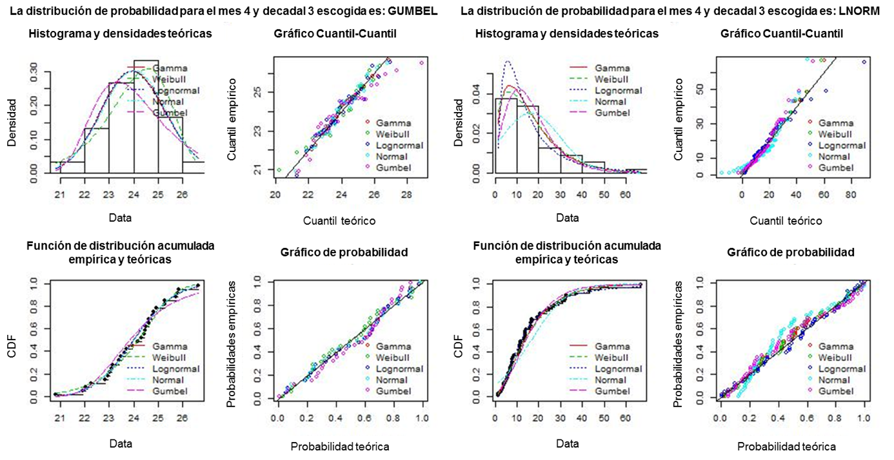

**Figura 43.** Ajuste de distribuciones de probabilidad para registros históricos del 1ro enero para un punto de la malla de análisis: Temperatura media (izquierda) y precipitación total diaria (derecha) (Fuente: elaboración propia).

Para evaluar el ajuste de las distribuciones de probabilidad se utilizó la prueba de ajuste con los coeficientes de Anderson-Darling (no está definida para distribuciones Pearson Tipo III o Logísticas) y Kolmogorov-Smirnov. Para definir si la muestra sigue una cierta distribución, se comparó el valor de significancia p-value con un nivel de 0.05, que implica que la probabilidad de concluir que los datos no siguen una distribución de probabilidad definida, cuando si siguen esa distribución, es del 5%. Al obtener valores de p-value por encima del nivel de significancia, no se puede rechazar la hipótesis nula ni concluir que los datos no se ajustan a la distribución considerada.

### Series de precipitación

Como caso particular, para la generación estocástica de series de precipitación se debe considerar el efecto de los días de no lluvia para el ajuste de la función de distribución de probabilidad. En la Figura 16 se presenta el histograma de valores de precipitación diaria para 1) un día de temporada seca 2) un día de temporada de lluvias. Se puede ver como para la temporada seca más del 95% de los datos se concentran en el valor 0, mientras que para la temporada de lluvias los días secos son menos del 10%. Esto implica que en el momento de la selección de una distribución de probabilidad que mejor se ajuste a los valores de precipitación, se pueden tener inconvenientes cuando la mayoría de los valores son iguales a cero, lo que deriva en un mal ajuste de probabilidades. Por esta razón, para días en temporada seca se hace un procedimiento adicional para el ajuste de la distribución de probabilidad.

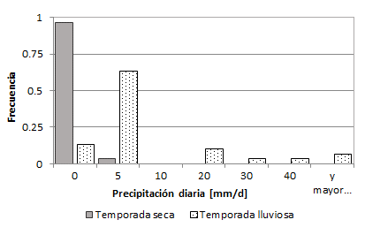

**Figura 44.** Histograma para valores de precipitación registrados en día de temporada seca y un día en temporada de lluvias (Fuente: elaboración propia).

La Figura 17 muestra las funciones de densidad de probabilidad y de probabilidad acumulada para el caso en que el número de días secos en la muestra sea muy alto. En ese caso, se divide la función de densidad de probabilidad en dos partes 1) cuando la precipitación es igual a cero \({(P}_{0})\) 2) cuando la precipitación es mayor a cero (1-\(P_{0}\)). La probabilidad de que ocurra un día seco se define como:

|                                                                             |         |
| --------------------------------------------------------------------------- | ------- |
| \(P_{0} = \frac{n}{N} = \frac{\#\ días\ secos}{\#\ días\ en\ la\ muestra}\) | **(1)** |

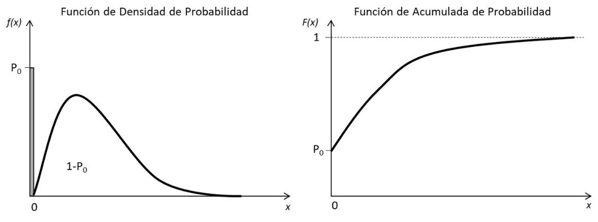

**Figura 45.** Funciones de densidad de probabilidad y probabilidad acumulada teniendo en cuenta p = 0 (Fuente: elaboración propia).

Al seguir este procedimiento, se obtienen series de precipitación que mantienen la relación histórica de días de no lluvia con respecto al total de días, según la temporada del régimen de lluvias. Si se utiliza la función de densidad de probabilidad sin hacer este ajuste, no se obtienen días secos en las series aleatorias.

### Correlación de series

Enseguida, con el fin de incluir la correlación existente entre valores de precipitación y temperatura en periodos de tiempo sucesivos, se calcula la matriz de autocorrelación para cada una de las series aleatorias generadas. La autocorrelación temporal indica la correlación de una variable con sus valores pasados y futuros \[31\]. Además, se incluyen los efectos de la correlación espacial, que representan la aparición de datos simultáneos en múltiples estaciones del área de estudio, utilizando la matriz de autocorrelación espacial entre valores de las diferentes estaciones de registro.

Las series de números aleatorios correlacionados son estadísticamente correspondientes a las series históricas y preservan estadísticos de segundo orden (correlación espacial) al hacerlo de forma forzada sobre los registros históricos. De esta manera, se evitan cambios abruptos en los valores de precipitación y temperatura para días consecutivos.

## Evapotranspiración de referencia

El cálculo de los indicadores de sequía propuestos requiere del cálculo previo de la evapotranspiración de referencia, para evaluar las condiciones atmosféricas que definen si se presenta un exceso de agua en la atmósfera (baja evapotranspiración) o un déficit (alta evapotranspiración y poca lluvia). La evapotranspiración de referencia se estima siguiendo el Manual *Crop evapotranspiration: Guidelines for computing crop requirements* \[32\]*,* que es considerado el método estándar y es el más recomendado.

La evapotranspiración de referencia es el potencial de evaporación de la atmósfera; se calcula en una superficie vegetal uniforme sin restricciones hídricas. La superficie de referencia es un cultivo hipotético con una altura asumida de 0,12 m, una resistencia superficial fija de 70 s/m y un albedo de 0,23 \[32\]; es independiente del tipo de cultivo, de su desarrollo o de su manejo. Al no tener restricciones en el contenido de agua, las características del suelo tampoco influyen en su resultado. Estas condiciones permiten comparar los resultados en diferentes localizaciones o estaciones para evaluar las condiciones evaporativas de la atmósfera ya que el ETo únicamente varía según las condiciones climáticas presentes.

Es importante señalar que la evapotranspiración de referencia (\(\text{ET}_{0}\)) es diferente a la evapotranspiración del cultivo bajo condiciones estándar (\(\text{ET}_{c}\)) y a la evapotranspiración del cultivo bajo condiciones no estándar (\(\text{ET}_{\text{c\ aj}}\)). La evapotranspiración del cultivo bajo condiciones estándar (\(\text{ET}_{c}\)) considera características particulares según el tipo de cultivo que se esté evaluando (resistencia del cultivo, albedo, anatomía de las hojas, características de los estomas, propiedades aerodinámicas, entre otros). Por otro lado, la evapotranspiración del cultivo bajo condiciones no estándar (\(\text{ET}_{\text{c\ aj}}\)) considera cultivos que crecen bajo condiciones ambientales y de manejo diferentes a condiciones óptimas de suelo y agua, presencia de enfermedades o fertilización que implican cambios en el rendimiento de la cosecha.

El método de Penman-Monteith (ver (2) para el cálculo de la evapotranspiración de referencia permite cuantificar los procesos de evaporación (vaporización de agua desde una superficie: suelo, vegetación húmeda) y transpiración (vaporización del agua contenida en los tejidos vegetales), que ocurren simultáneamente. Los parámetros necesarios para el cálculo son el brillo solar, la temperatura, la humedad, la velocidad del viento, el flujo de vapor y la resistencia aerodinámica.

|                                                                                                                                                                          |         |
| ------------------------------------------------------------------------------------------------------------------------------------------------------------------------ | ------- |
| \(\text{ET}_{0} = \frac{0.408\Delta\left( R_{n} - G \right) + \gamma\frac{900}{T + 273}u_{2}\left( e_{s} - e_{a} \right)}{\Delta + \gamma\left( 1 + 0.34u_{2} \right)}\) | **(2)** |

En donde \(R_{n}\) es la radiación neta, \(G\) es el flujo de calor del suelo, \(\gamma\) es la constante psicrométrica, \(T\) es la temperatura promedio diaria, \(u_{2}\) es la velocidad del viento (a 2m de la superficie), \(\left( e_{s} - e_{a} \right)\) representa el déficit de presión de vapor y \(\Delta\) es la pendiente de la curva de presión de vapor. La aplicación de la metodología de Penman-Monteith implica la recopilación de información meteorológica que puede no estar disponible en todos los casos. Los parámetros meteorológicos faltantes se establecen a partir de criterio de expertos, información meteorológica general de la región y las reglas de cálculo recomendadas por la FAO \[33\].

El cálculo de la evapotranspiración de referencia puede ser complejo porque involucra numerosos parámetros climáticos que son difíciles de obtener en bases de datos de registros históricos. Variables como la humedad del aire, la radiación, la presión atmosférica y la velocidad del viento no se suelen medir en todas las estaciones de monitoreo, por lo que la cantidad y calidad de registros es muy baja. La Universidad de Princeton publicó una base de datos de información climática \[18\] que es utilizada como fuente de información para este estudio. La información disponible está en formato NetCDF (archivos de extensión nc) y para este estudio se utilizaron las mallas de resolución 0.5° × 0.5°.

## Indicadores de sequía

Dependiendo del tipo de sequía a evaluar, se pueden incluir diferentes parámetros en el cálculo de los índices. Las sequías meteorológicas están condicionadas a la deficiencia de precipitación en términos de cantidad, intensidad y tiempo de precipitación, y al aumento de la evaporación y transpiración a causa de altas temperaturas, vientos fuertes, baja humedad relativa, intenso sol y menor nubosidad. Las sequías agrícolas están condicionadas por la deficiencia de agua en el suelo en términos de estrés hídrico para las plantas, y la reducción en la biomasa y el rendimiento. Las sequías hidrológicas están determinadas por la reducción en caudales de ríos y quebradas, almacenamiento reducido de los embalses y reducción de los humedales. Esta clasificación de sequías, como sequía meteorológica, agrícola, hidrológica y socioeconómica fue defina por primera vez por Wilhite y Glantz \[34\].

Según Jayanthi \[35\], los indicadores de sequía agrícola deben integrar las variables pluviométricas y de temperatura, junto con la evapotranspiración para el monitoreo efectivo de los cultivos de secano, pastos y pastizales. Banimahd y Khalili \[30\] compararon los índices de sequía agrícola más utilizados, como el Palmer Drought Severity Index (PDSI) \[36\], el Standarized Precipitation Index (SPI) \[37\], el Effective Drought Index (EDI) \[38\], el Reconnaissance Drought Index (RDI) \[39\] y el Standardized Precipitation Evapotranspiration Index (SPEI) \[40\]. Sus resultados mostraron que la SPEI y la RDI detectaron de manera más apropiada las severidades de sequía máximas, enfatizando el importante papel de la evapotranspiración. Estos resultados son consistentes con el trabajo de Tsakiris et al. \[39\], en donde se demuestra que la sola precipitación no correlaciona satisfactoriamente con la producción de rendimiento en cultivos, sino que se requiere la incorporación de la evapotranspiración de referencia (que depende directamente de la temperatura), para describir apropiadamente la ocurrencia de las sequías. Para este modelo, se propone emplear el RDI y el SPEI, los cuales incorporan la precipitación y las temperaturas media, máxima y mínima en su cálculo.

Este estudio no incluye el uso de indicadores que tienen en cuenta parámetros propios del suelo o del cultivo para definir un evento de sequía, como el Indicador de Palmer. Esto se debe a que en el módulo de amenaza del modelo probabilista de sequía se evalúan las condiciones de tiempo (precipitación y temperatura) únicamente, para clasificar los eventos de sequía independientes de sus posibles efectos en elementos socioeconómicos. De esta forma se puede evaluar la amenaza independiente de la vulnerabilidad de los elementos expuestos. Es en el módulo de vulnerabilidad que se incluyen los parámetros propios del suelo y cultivos existentes en cada unidad de tierra cultivada dentro del área de análisis.

Los indicadores estandarizados de sequía, como el RDI y el SPEI, pueden compararse entre sí en dimensiones espaciales y temporales. La severidad de la sequía caracterizada aplicando estos indicadores, se puede clasificar de acuerdo con lo presentado en la Tabla 9.1.

**Tabla 9.1.** Clasificación de sequías de acuerdo con el valor de indicadores estandarizados.

| **Clase de sequía** | **Valor del Indicador** |
| ------------------- | ----------------------- |
| No ocurre sequía    | Mayor a 0               |
| Leve                | Entre -1 y 0            |
| Moderada            | Entre -1.5 y -1         |
| Severa              | Menor a -1.5            |

Nótese que, en todos los casos, los indicadores reflejan condiciones de sequía cuando sus valores son negativos, siendo las sequías más severas las asociadas a valores más negativos. Es conveniente evaluar los escenarios de sequía con más de un indicador, ya que ninguno de ellos puede aplicarse universalmente debido a la complejidad de esta amenaza y a las condiciones particulares de las diversas zonas climáticas \[39\]. Los indicadores se calculan para cada serie (histórica o simulada) en cada uno de los puntos de la malla de análisis.

La selección del indicador más apropiado depende de la adaptación de cada parámetro (α en el caso de RDI y *D* para SPEI) a sus funciones de probabilidad teóricas (log-normal para RDI y log-logística de 3 parámetros para SPEI), así como el ajuste de los indicadores mismos a una distribución de probabilidad Normal Estándar, condición que debe cumplirse como consecuencia de la estandarización.

Adicionalmente, la escala de tiempo también puede definir la selección del indicador apropiado. Las escalas de tiempo cortas se relacionan principalmente con el contenido de agua en el suelo y los flujos superficiales, las escalas de tiempo medias están relacionadas con los almacenamientos de embalses y las escalas de tiempo largo están relacionadas con las variaciones en el almacenamiento de agua subterránea \[40\]. Por lo tanto, las escalas de tiempo corto (3 a 6 meses) pueden describir mejor las sequías agrícolas, mientras que las escalas a largo plazo (de 12 a 24 meses) pueden describir mejor las sequías hidrológicas. Por ejemplo, para el estudio de caso de Banimahd y Khalili \[30\], las severidades de sequía máxima en una escala de tiempo anual fueron detectadas por SPEI, mientras que las severidades de sequía de las escalas temporales de 3 y 6 meses fueron detectadas por RDI. La metodología propuesta puede adaptarse a diferentes escalas de tiempo para seleccionar el indicador de sequía más apropiado.

## Mapas de amenaza por sequía

Los resultados de la modelación de la amenaza se presentan a continuación en formato de mapas de amenaza por escenario, y curvas y mapas de amenaza integrada para toda la región estudio. Los mapas de amenaza por escenario permiten comparar la intensidad y distribución espacial de los efectos de un único evento. Los mapas de amenaza integrada permiten comparar las intensidades según el periodo de retorno y establecer zonas que están más o menos expuestas a la amenaza de sequía dentro de la región.

La interpolación espacial se realiza utilizando el método kriging, que es método geoestadístico que supone una correlación espacial entre puntos y tienen la capacidad de proporcionar al modelador una medida de certeza o precisión de las predicciones \[41\]. Este método permite obtener predicciones de valores de los parámetros que definen la sequía en ubicaciones diferentes a los puntos donde se hicieron las mediciones (en este caso la malla de análisis sobre los tres países). Usando kriging se puede obtener un mapa de formato ráster, en la que se calcula el valor del parámetro en cada pixel. Kriging es un método conveniente porque permite interpolar espacialmente sin conocer la varianza de los parámetros de interés. Al comparar con otros métodos de interpolación espacial, el kriging se considera un método robusto, pero de alta demanda computacional ya que utiliza los datos medidos para modelar el variograma y hacer las predicciones. Por otro lado, métodos más sencillos, como el de la distancia inversa ponderada (IDW) que es un método determinista, no brindan información sobre la certeza de los resultados, o definen una covarianza generalizada sin considerar los datos medidos como el método spline. Para más información sobre metodologías de interpolación espacial se recomienda consultar el manual de ArcGIS disponible en línea \[42\] en español que presenta una descripción detallada y sencilla de diferentes métodos, o documentos como el de Li & Heap \[43\] que presenta un compilado de los diferentes métodos y sus respectivos alcances (en inglés).

### Mapas de amenaza integrada

La amenaza se integra mediante un proceso matemático que permite definir las curvas de excedencia de intensidad en cada punto de la malla de cálculo. La tasa de excedencia es una cantidad que mide el número de veces al año que un valor de intensidad es igualado o excedido. Sea *a* la medida de intensidad calculada (e.g. RDI, severidad, duración, etc), su tasa de excedencia ν(*a*), para una ubicación en la malla de cálculo, se determina como

|                                                            |         |
| ---------------------------------------------------------- | ------- |
| \(\nu\left( a \right) = P\left( A > a|E_{i} \right)F_{i}\) | **(3)** |

en donde *N* es el número total de escenarios calculados, Pr (*A* \> *a* | *Ei*) es la probabilidad de exceder *a*, condicionada a la ocurrencia del escenario *i* y *Fi* es la frecuencia anual de ocurrencia del escenario *i*.

Teniendo las tasas de excedencia de la medida de intensidad en todos los puntos de la malla de cálculo, es posible generar mapas de igual periodo de retorno, por medio de la selección de una tasa de excedencia (que es inversa al periodo de retorno) y la lectura en cada curva del correspondiente valor de intensidad. Los valores leídos son entonces mapeados en una malla que tiene el mismo periodo de retorno en todas las ubicaciones. Estos mapas son una herramienta útil para la toma de decisiones, ya que no representan un único evento de amenaza, sino que integran los efectos de todos los eventos que potencialmente pueden ocurrir en el futuro. También permiten comparar los niveles de amenaza con diferentes períodos de retorno y establecer cuáles ubicaciones o regiones en el territorio tienen una mayor o menor propensión a sufrir sequías. Por lo tanto, son un insumo fundamental en el diseño y ejecución de regulaciones de uso de la tierra o proyectos de sistemas de riego en la región de estudio. Los mapas de amenaza uniforme se calculan mediante la aplicación del teorema de la probabilidad total en la colección de escenarios estocásticos de sequía.

## Modelo de respuesta de cultivos a eventos extremos

El modelo de respuesta de cultivos tiene cuatro componentes principales: el clima (en términos de temperatura, precipitación, demanda por evaporación y concentración de dióxido de carbono), los cultivos (procesos de desarrollo, crecimiento y rendimiento), el suelo (balance de agua y sal) y el manejo y administración (prácticas agrícolas). Cada uno de los componentes se explica brevemente a continuación, según lo contenido en Steduto et al. \[15\].

### Clima

La temperatura influye en el desarrollo de los cultivos y la precipitación es determinante para el balance hídrico del suelo en la zona radicular y el estrés hídrico. Por lo tanto, las principales variables climáticas para el modelo son las temperaturas máximas y mínimas diarias del aire, las precipitaciones diarias totales y la demanda evaporativa de la atmósfera, expresadas como evapotranspiración. Para el caso del modelo de evaluación del riesgo aplicado en este estudio, todas estas variables climáticas se calculan previamente en la evaluación de la amenaza y se utilizan para calcular los indicadores de clima extremo.

Adicionalmente, la concentración de dióxido de carbono (CO2) se incluye en la evaluación, ya que es un aspecto que afecta la expansión del cultivo y la conductancia estomática. Los valores por defecto de las concentraciones anuales de CO2 se miden en el Observatorio Mauna Loa, en Hawái ([www.esrl.noaa.gov/gmd/obop/mlo/](http://www.esrl.noaa.gov/gmd/obop/mlo/)). Para el caso de la evaluación prospectiva de riesgo, se utiliza la concentración de dióxido de carbono para el último año disponible en la evaluación base y para la evaluación de los modelos con cambio climático se usan las proyecciones de concentración de dióxido de carbono según el escenario de RCP (trayectoria representativa de concentración) analizada.

### Cultivo

Los cultivos se modelan en términos de los procesos biológicos, físicos y químicos que determinan su rendimiento. El modelo permite evaluar cómo los cultivos crecen y se desarrollan a lo largo de su ciclo de crecimiento específico, creciendo el follaje, profundizando sus raíces y acumulando biomasa. Todas las etapas fenológicas (o etapas de crecimiento) se consideran en el modelo: vegetativo, floración, formación de rendimiento y maduración, incluyendo etapas fenológicas distintas para cultivos herbáceos o forrajeros.

La fenología se refiere a las etapas de desarrollo de los cultivos y su duración, que se puede definir en días de grado de crecimiento (GDD – *Growing Deegre Days*) o días calendario. La cobertura vegetal (CC – *Canopy Cover*) es la representación de la cantidad de follaje, la cual se considera proporcional a la cantidad de agua transpirada y la cantidad de biomasa producida. El subcomponente de profundidad de enraizamiento modela el proceso en el cual las raíces se profundizan a una tasa relativa constante mientras que la planta crece hasta la fase de formación de rendimiento. El modelo puede incluir los efectos de capas de suelo o nivel freático superficial que restringen de crecimiento de las raíces.

En la Figura 18 se muestran las curvas de la cobertura vegetal y profundidad de la raíz. La curva en la parte superior representa el desarrollo de la cobertura vegetal a partir de la expansión (CGC: coeficiente de crecimiento vegetal – *Canopy Growth Coefficient*) y la disminución (CDC: coeficiente de disminución vegetal – *Canopy Decline Coefficient*). La cobertura vegetal se expresa como una fracción de suelo sombreado por las hojas o partes aéreas de las plantas, siendo su nivel máximo (CCx) específico del cultivo. La segunda curva representa la profundidad de enraizamiento efectiva, desde su valor mínimo (Zn) en el momento de la siembra hasta su valor máximo (Zx) en la fecha que se alcanza la madurez del cultivo. Este conjunto de curvas representa el desarrollo del cultivo y su interacción con los sistemas de suelo y aire.

El modelo permite calcular la transpiración de los cultivos separadamente de la evaporación del suelo. El subcomponente de transpiración de cultivos determina el uso de agua de la planta cuando no hay estrés que limite la apertura estomática, característica que es específica del tipo de cultivo y cambia durante su desarrollo. La evaporación del suelo considera la pérdida de agua de la superficie del suelo húmedo no sombreado por la vegetación. Los dos últimos subcomponentes, producción de biomasa y rendimiento cosechable, se pueden resumir en las ecuaciones 4 y (5. La producción de biomasa se define como:

|                      |         |
| -------------------- | ------- |
| \(B = WP*\text{Tr}\) | **(4)** |

En donde \(B\) es la biomasa producida acumulada, \(\text{Tr}\) es la transpiración del cultivo sumada durante el período de producción de la biomasa y \(\text{WP}\) es el parámetro de productividad del agua medido como la cantidad de biomasa seca (kilogramos) por unidad de área (m2) y de agua transpirada (mm). La robustez del modelo depende de la naturaleza conservadora del \(\text{WP}\) que permanece constante en un rango de ambientes, cuando se normaliza para demandas evaporativas.

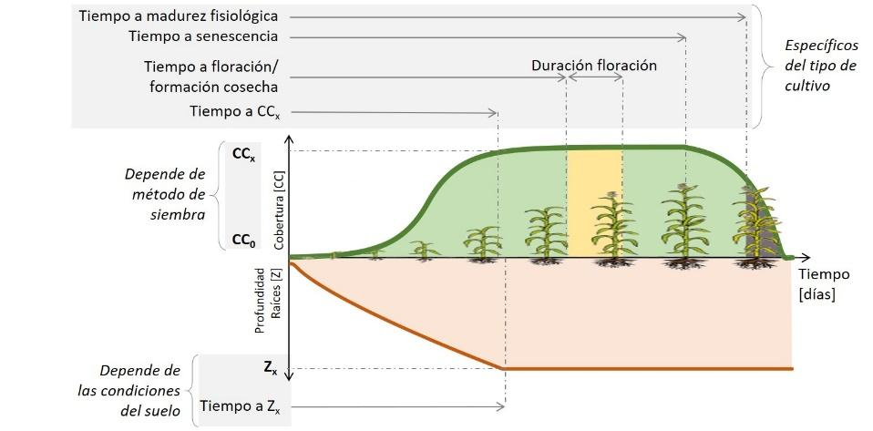

**Figura 46.** Representación esquemática del desarrollo en el tiempo de la cobertura vegetal y la profundidad de enraizamiento (Elaboración propia a partir de \[15\] p. 23).

Finalmente, se utiliza un índice de cosecha \(\text{HI}\) para estimar el rendimiento \(Y\) de la biomasa producida \(B\). Al hacer esta distinción entre la biomasa y el rendimiento, se pueden evaluar por separado los efectos de las condiciones climáticas sobre la producción de biomasa y la cosecha.

|              |         |
| ------------ | ------- |
| \(Y = HI*B\) | **(5)** |

La Figura 19 muestra la función del cambio del índice de cosecha \(\text{HI}\) en el tiempo para cultivos de frutas o granos, para el período de formación del rendimiento (fase de floración hasta la madurez fisiológica). \(\text{HI}\) comienza a partir de cero, en un crecimiento lento pero acelerado seguido por una tasa de aumento constante hasta que se alcanza el rango superior \(\text{HI}_{o}\). Este nivel superior es el índice de cosecha de los cultivos en condiciones óptimas, es específico del tipo de cultivo y se dispone de datos para su calibración.

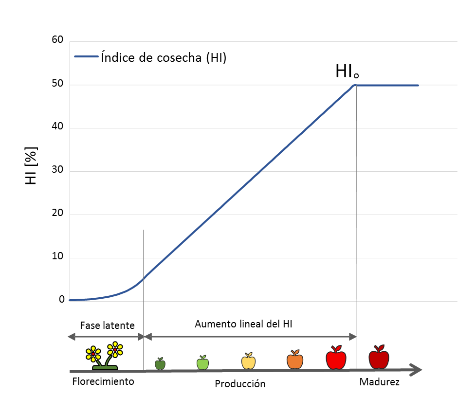

**Figura 47.** Representación esquemática del cambio en el tiempo del índice de cosecha (HI) para cultivos de frutas o granos (Elaboración propia a partir de \[15\] p. 27).

### Suelo

El componente de suelo incluye su perfil en profundidad y las características del nivel freático dentro del sistema radicular de la planta, expresando la región radicular como un volumen de control en donde se estiman los balances de agua y sal. El suelo puede ser subdividido en capas de profundidad variable, cada una con diferentes características físicas como el contenido de agua en el suelo saturado, el límite superior de agua contenida o capacidad de campo (FC – *Field Capacity*), el punto de marchitamiento permanente (PWP – *Permanent Wilting Point*) o límite inferior del nivel de agua, y la conductividad hidráulica del suelo saturado (Ksat). Estos valores son las entradas para determinar la evaporación del suelo, el drenaje interno, la percolación profunda, el escurrimiento superficial y la capilaridad. El nivel freático debe caracterizarse en términos de su profundidad y salinidad.

La Figura 20 es una representación simplificada del modelo del sistema radicular, donde Dr representa el agotamiento de la raíz y Wr es la profundidad equivalente del agua. El agua disponible total (TAW – *Total Avaliable Water*) es la cantidad de agua retenida en la zona de raíces entre la capacidad de campo (límite superior) y el punto de marchitamiento permanente (límite inferior).

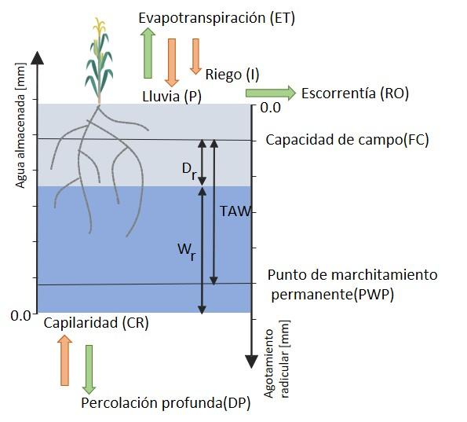

**Figura 48.** Representación esquemática del volumen de control de la zona radicular (Elaboración propia a partir de \[15\] p. 28).

El balance hídrico dentro de la zona radicular se calcula día a día, y para cualquier momento del desarrollo del cultivo. Los caudales de agua entrantes considerados en el modelo son provistos por las lluvias, el riego y la capilaridad. Por otro lado, los flujos de agua salientes considerados en el modelo son el escurrimiento, la evapotranspiración y la percolación profunda.

Los parámetros necesarios para estimar la capacidad de suelo de almacenar y retener agua se muestran en la Figura 21. Dependiendo del nivel del agua en el suelo se define la disponibilidad del agua para la planta. Es así como después de una lluvia, el agua puede quedar en exceso de la cual una fracción se convierte en escorrentía y la otra fracción se infiltra por fuerzas gravitacionales. Esta agua infiltrada pasa de un nivel de saturación (en el cual no hay contenido de aire en el suelo) al nivel que tiene el suelo de retener el agua o capacidad de campo (Field capacity en inglés). A medida que el agua se infiltra en el suelo, las plantas pierden la posibilidad de usar el agua, hasta llegar al punto de marchitamiento definitivo, en el que la planta no cuenta con agua disponible y no se puede recuperar. El rango de agua disponible para la planta se ubica entre la capacidad de campo y el punto de marchitamiento, en el que el suelo es capaz de retener el agua. Entonces el modelo de vulnerabilidad evalúa si el contenido de agua en el suelo se ubica dentro del rango de agua disponible que tiene la planta y ajusta el desarrollo del cultivo según las condiciones de estrés hídrico que sufra.

**Figura 49.** Esquema de la disponibilidad del agua en el suelo (Elaboración propia).

La capacidad de retener el agua en el suelo depende en gran medida de su textura. Como el suelo es un medio poroso, dependiendo del tamaño de los espacios entre partículas, el suelo está en capacidad de almacenar más o menos agua. El tamaño de las partículas del suelo, o textura se define según su contenido de arena, limo y arcilla. Es así como suelos arenosos tienen poca capacidad de retener agua por su estructura de partículas gruesas con macroporos. De otro lado suelos de partículas finas retienen el agua en microporos y tienen una mayor capacidad de campo \[44\]. Esta relación se puede ver de forma esquemática en la Figura 22, en la que se presenta el porcentaje de volumen de agua para la capacidad de campo según la textura de suelo, desde arenas con partículas gruesas hasta arcilla de partículas finas.

En la figura se puede ver como la capacidad campo o de retener agua en el suelo aumenta a medida que las partículas de suelo son más finas. Sin embargo, para que el agua sea disponible para las plantas, el contenido de agua en el suelo debe mantenerse sobre el punto de marchitamiento. Como se ve en la figura, el punto de marchitamiento también aumenta en la medida que la textura del suelo es más fina. Esto se debe a que, aunque hay mayor volumen de agua retenida del suelo fino, la fuerza que se ejerce para mantener el agua en los microporos es muy alta y las plantas no tienen capacidad de succionarla. Entonces, para propósitos agrícolas es preferible cultivar en suelos de textura media, tipo francos o franco-limosos, que tienen una alta disponibilidad de agua para las plantas.

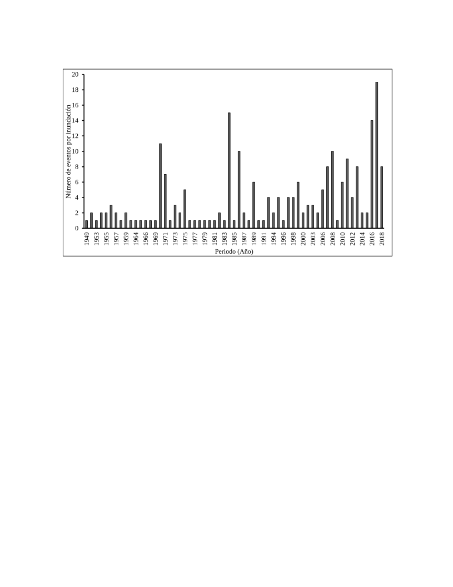

**Figura 50.** Esquema de retención de agua según tipo de suelo (Elaboración propia a partir de \[44\]).

La información requerida del suelo incluye su tipo, textura, perfil en profundidad y nivel freático. Para el cálculo de la escorrentía se calcula el número de curva a partir de la información de uso y tipo de suelo. Este procedimiento se muestra de forma esquemática en la Figura 23, en la que también se indica el tipo de información de entrada y los resultados.

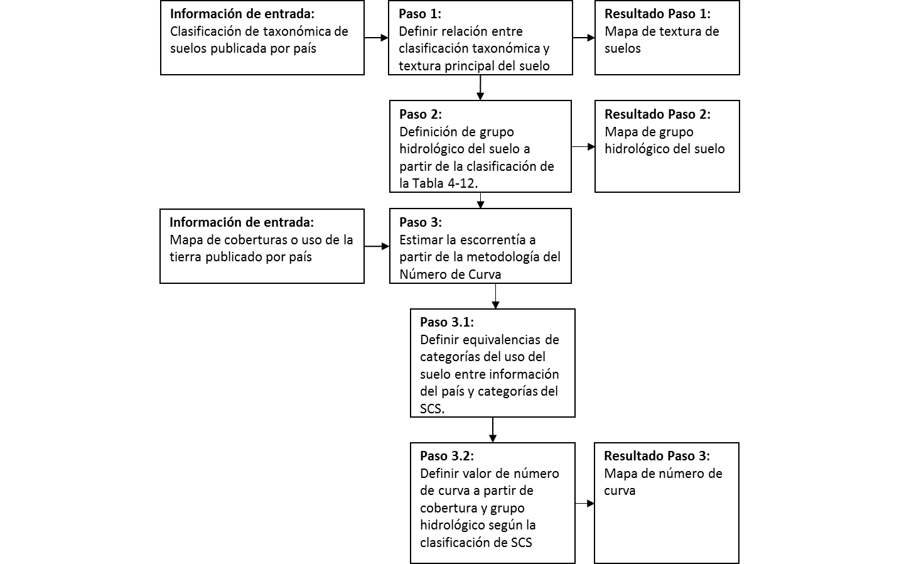

**Figura 51.** Esquema metodología aplicada para determinar características del suelo necesarias en el módulo de vulnerabilidad para evaluar riesgo en el sector agrícola. (SCS: Soil Conservation Service) (Fuente: elaboración propia).

Los valores de contenido volumétrico de agua en suelo para condiciones de saturación, capacidad de campo y punto de marchitamiento se determinan a partir de evaluaciones locales. Sin embargo, en caso de no contar con información, la metodología propuesta hace uso de valores recomendados por el modelo AquaCrop que suministra valores por defecto para estos parámetros \[45\].

**Tabla 2.** Valores de parámetros de contenido volumétrico de agua por defecto en el modelo AquaCrop.

| **Tipo suelo**         | **SAT \[%vol\]** | **FC \[%vol\]** | **PWP \[%vol\]** |
| ---------------------- | ---------------- | --------------- | ---------------- |
| arena                  | 36               | 13              | 6                |
| arenoso franco         | 38               | 16              | 8                |
| franco arenoso         | 41               | 22              | 10               |
| franco                 | 46               | 31              | 15               |
| franco limoso          | 46               | 33              | 13               |
| limoso                 | 43               | 33              | 9                |
| franco arcillo arenoso | 47               | 32              | 20               |
| franco arcilloso       | 50               | 39              | 23               |
| franco arcillo limoso  | 52               | 44              | 23               |
| arcillo arenoso        | 50               | 39              | 27               |
| arcillo limoso         | 54               | 50              | 32               |
| arcilla                | 55               | 54              | 39               |
| impermeable            | 0.5              | 0.3             | 0.1              |

La determinación de la textura del suelo se hace a partir de las fracciones de arcilla, limo y arenas que lo compongan. Esta clasificación por tipo que se muestra en la tabla anterior se obtiene a partir del triángulo de clase textural del suelo, publicado por el Departamento de Agricultura de los Estados Unidos, USDA por sus siglas en inglés. Este esquema se presenta en la Figura 24.

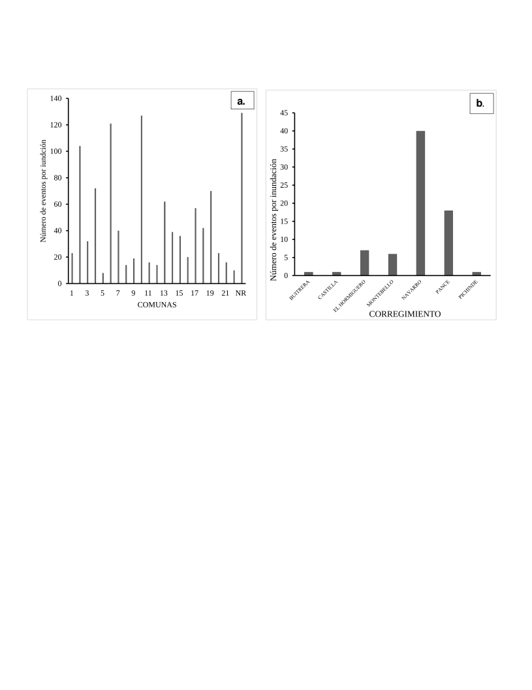

**Figura 52.** Triángulo de clases texturales básicas de suelos según el tamaño de partículas. Elaborado por el Departamento de Agricultura de los Estados Unidos (USDA).

### Manejo

El modelo tiene la capacidad de incorporar las prácticas de manejo en la respuesta del rendimiento de los cultivos, incluyendo el riego y manejo de campo. Las opciones de manejo de riego incluyen la selección de métodos de aplicación de agua y la definición de programas de riego. Las opciones de manejo de campo incluyen la fertilización del suelo, la cobertura del suelo para evitar la evaporación y el uso de protecciones para controlar el escurrimiento superficial. Este tipo de características serán incluidas en la modelación en la medida en que la información necesaria esté disponible.

### La dinámica de la respuesta de los cultivos al estrés hídrico o térmico

Las condiciones de estrés hídrico o térmico son representadas por un coeficiente de estrés (\(K_{s}\)) y un umbral para los indicadores de estrés. \(K_{s}\) es un modificador que cuantifica la intensidad del efecto que produce el estrés hídrico en los procesos de crecimiento específicos para un cultivo y etapa de crecimiento. Como se observa en la Figura 25, los valores de \(K_{s}\) varían entre 0 (estrés total) y 1 (sin estrés), siguiendo una función lineal o convexa (el grado de curvatura se establece durante la calibración del modelo). Los umbrales para el estrés hídrico están relacionados con el agotamiento del agua u oxígeno del suelo, mientras que los umbrales asociados al estrés por temperatura del aire están relacionados con los grados de crecimiento.

**Figura 53.** Función del coeficiente de estrés (Ks) (Elaboración propia a partir de \[1\] p. 32).

El modelo permite calcular los efectos del déficit o exceso hídrico (entendido como falta o exceso de agua en la región radicular del suelo) en el crecimiento de la cobertura vegetal, la conductancia estomática, la senescencia temprana, la profundización de la raíz y el índice de cosecha. La Figura 26 muestra estos cinco procesos (líneas punteadas), dentro del esquema general de desarrollo de rendimiento bajo estrés hídrico. Un resumen general del proceso de cálculo se presenta a continuación. Nótese que todos los pasos del proceso se calculan en intervalos de tiempo diarios.

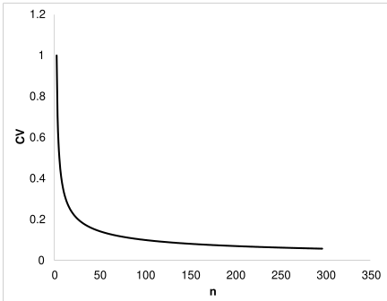

**Figura 54.** Representación esquemática de la respuesta del cultivo al estrés hídrico (Adaptado de \[45\]).

1.  > *Balance del agua en el suelo*: determina la cantidad de agua almacenada en la zona radicular, contabilizando los flujos de agua entrante y saliente. El crecimiento del cultivo no se ve afectado y no hay estrés hídrico (\(K_{s} = 1\)) entre el nivel de capacidad de campo (FC) y el nivel superior de agotamiento de la zona de raíz. En el otro extremo, entre el umbral inferior en el agotamiento de la zona de raíz y el punto de marchitamiento permanente hay tensión total (\(K_{s} = 0\)) y el crecimiento del cultivo se ve completamente impactado. A medida que se reduce el agua almacenada en el volumen de control del suelo, el coeficiente de estrés disminuye.

2.  > *Expansión de la cobertura vegetal*: Se simula el efecto del déficit hídrico en la expansión de la cobertura, mediante la reducción del coeficiente de crecimiento vegetal (CGC) por el coeficiente de estrés hídrico para la expansión de cobertura \(K_{s,\ exp,w}\), y modificando el coeficiente de disminución de cobertura por coeficiente de estrés hídrico de senescencia temprana \(K_{s,\ sen}\).

3.  > Por una parte, cuando el agotamiento de la zona radicular está por debajo de los umbrales superiores de contenido de agua, \(K_{s,\ exp,w}\) se hace menor que 1 y la cobertura reduce su tasa de expansión. Cuando el agotamiento de la zona radicular está por debajo del límite inferior, \(K_{s,\ exp,w} = 0\) y se detiene el desarrollo de la cobertura. Por otra parte, cuando el estrés hídrico es severo (agotamiento de la zona radicular cerca del punto de marchitamiento permanente), se desencadena la senescencia temprana. El grado de senescencia está descrito por \(K_{s,\ sen}\). La cobertura vegetal máxima no puede ser alcanzada bajo condiciones de estrés hídrico, o podría alcanzarse en una última etapa de la temporada, como se muestra en la Figura 28.

**Figura 55.** Representación esquemática del coeficiente de estrés hídrico (Adaptado de \[45\])

  - > 

**Figura 56.** Representación esquemática de la expansión de la cobertura vegetal, bajo condiciones óptimas (gris) y bajo estrés hídrico (verde). (Adaptado de \[45\]).

4.  > *Transpiración*: se calcula la potencia de evaporación de la atmósfera considerando un coeficiente de cultivo \(K_{\text{cb}}\) y el coeficiente de estrés hídrico \(K_{s}\), como se muestra en la ecuación 6. La evapotranspiración potencial (\(\text{ETo}\)) se calcula usando la ecuación de Penman-Monteith de FAO \[32\].

|                                                                   |         |
| ----------------------------------------------------------------- | ------- |
| \(Tr = K_{s}\left( K_{\text{cb}}\text{CC}^{*} \right)\text{ETo}\) | **(6)** |

> El coeficiente de transpiración del cultivo \(K_{\text{cb}}\) es un parámetro que debe ser ajustado continuamente en función de la cobertura vegetal simulada, con el fin de considerar los efectos de envejecimiento y senescencia. El coeficiente de estrés hídrico \(K_{s}\), utilizado en caso de escasez de agua es un coeficiente de estrés por cierre estomático \(K_{s,\ sto}\), también con valores entre 1 (sin estrés) y 0 (total estrés).

5.  > *Biomasa arriba de la superficie*: La relación entre la biomasa producida y el agua consumida por un cultivo específico se conoce es la productividad del agua (WP), la cual tiende a ser lineal para una condición climática dada, como se muestra en la ecuación 7. Para incluir condiciones climáticas alteradas, se emplea la productividad del agua normalizada \(\text{WP}^{*}\)\* en la simulación del desarrollo de biomasa sobre el suelo. Utilizando el parámetro normalizado, el modelo puede aplicarse a diferentes regiones y estaciones. La normalización se realiza para la concentración atmosférica de \(\text{CO}_{2}\) y la demanda evaporativa de la atmósfera \[45\].

> La producción de biomasa arriba de la superficie se calcula, para un paso de tiempo diario, de la siguiente manera:

|                                                                        |         |
| ---------------------------------------------------------------------- | ------- |
| \(B = K_{\text{sb}}\text{WP}^{*}\frac{\text{Tr}_{i}}{\text{ETo}_{i}}\) | **(7)** |

> en donde la productividad del agua normalizada \(\text{WP}^{*}\) se multiplica por la relación entre la transpiración del cultivo y la evapotranspiración de referencia del día de cálculo \(\frac{\text{Tr}_{i}}{\text{ETo}_{i}}\) (expresión que se agrega durante todo el periodo de desarrollo del cultivo), y por el coeficiente de estrés por temperatura \(K_{\text{sb}}\). Este coeficiente decrece a medida que la temperatura disminuye, y alcanza un valor de cero cuando hace demasiado frío y se detiene el crecimiento vegetal.

6.  > *Rendimiento*: Como se mencionó anteriormente, el rendimiento se calcula de multiplicar la biomasa sobre el suelo por un índice de cosecha, que depende del tipo de cultivo. Para considerar el estrés hídrico, debe ajustarse el índice de cosecha de su valor de referencia \(\text{HI}_{o}\) en condiciones óptimas, a su valor en condiciones reales, mediante la inclusión del factor \(f_{\text{HI}}\):

|                                       |         |
| ------------------------------------- | ------- |
| \(Y = f_{\text{HI}}*\text{HI}_{o}*B\) | **(8)** |

  - > El índice de cosecha puede ajustarse al déficit hídrico y a las variaciones de la temperatura del aire, y depende de la etapa del cultivo y la intensidad del estrés durante la temporada de crecimiento.
    
    1.  ## Enfoque probabilista en la evaluación del riesgo 

Para la metodología propuesta, el objetivo de la evaluación probabilista del riesgo es evaluar las pérdidas potenciales para el sector agropecuario debido a la ocurrencia natural de condiciones de clima extremo, considerando exposición y vulnerabilidad de cultivos, pasturas y ganado. Este enfoque permite identificar áreas geográficas y tierras cultivadas que se encuentran en riesgo. El riesgo se modela en términos de pérdida económica, definida como una variable aleatoria que incorpora la incertidumbre presente en los componentes de amenaza, vulnerabilidad y exposición del modelo.

Al realizar la evaluación de riesgo por eventos, las condiciones de clima extremo valorados en el módulo de amenaza se organizan en una gráfica de pérdida vs. tiempo, como se muestra en la Figura 29. Al establecer una pérdida económica \(p\), se puede identificar en la gráfica todos los eventos cuyas pérdidas exceden \(p\). Los tiempos entre eventos \((T_{1},\ T_{2},\ \ldots,T_{1n})\) también se estiman a partir de la Figura 29 y se usan para estimar el parámetro \(\lambda\) de una distribución exponencial, la cual corresponde a la distribución de probabilidad del tiempo entre eventos de un proceso de Poisson. Además, este parámetro de la distribución exponencial tiene la particularidad de ser el mismo*λ* que define el proceso de Poisson completamente (i.e. es la misma tasa de excedencia, \(\lambda\) = ***v(p)***). Para el caso de la evaluación prospectiva del riesgo, la ventana de tiempo considerada para calcular \(\lambda\) es igual al número de simulaciones estocásticas de las series climáticas, por ejemplo 1,000 años equivalentes.

**Figura 57.** Pérdidas por evento en una ventana amplia de tiempo (Elaboración propia).

La tasa de excedencia poblacional (\(\lambda\)) es estimada mediante la tasa de excedencia empírica (\(\Lambda\)) de la siguiente manera:

|                                   |         |
| --------------------------------- | ------- |
| \(\Lambda = \frac{n - 1}{T_{i}}\) | **(9)** |

En donde *n* es el número de eventos que superan la pérdida \(p\) y \(T_{i}\ \)son los tiempos observados. Este estimador cumple con los cuatro criterios estadísticos de calidad de la estimación de parámetros de distribuciones de probabilidad: es no sesgado, de varianza mínima, consistente y suficiente. Ahora bien, es posible demostrar que el estimador \(\Lambda\) sigue una distribución de probabilidad *Gamma inversa* con parámetros *n* y (*n*-1)\(\text{\ λ}\), a partir de lo cual se puede determinar su coeficiente de variación (CV) como:

|                     |          |
| ------------------- | -------- |
| \(CV = \frac{1}{}\) | **(10)** |

El coeficiente de variación indica la relación entre la desviación estándar y la media de una variable aleatoria. Como se indica en la Ecuación 7, CV disminuye a medida que el número de datos (*n*) aumenta. La Ecuación 7 es una fórmula estándar, aplicable a cualquier problema de estimación del riesgo por eventos, en donde el CV de la tasa de excedencia varía con el tamaño de la muestra cómo se indica en la Figura 30.

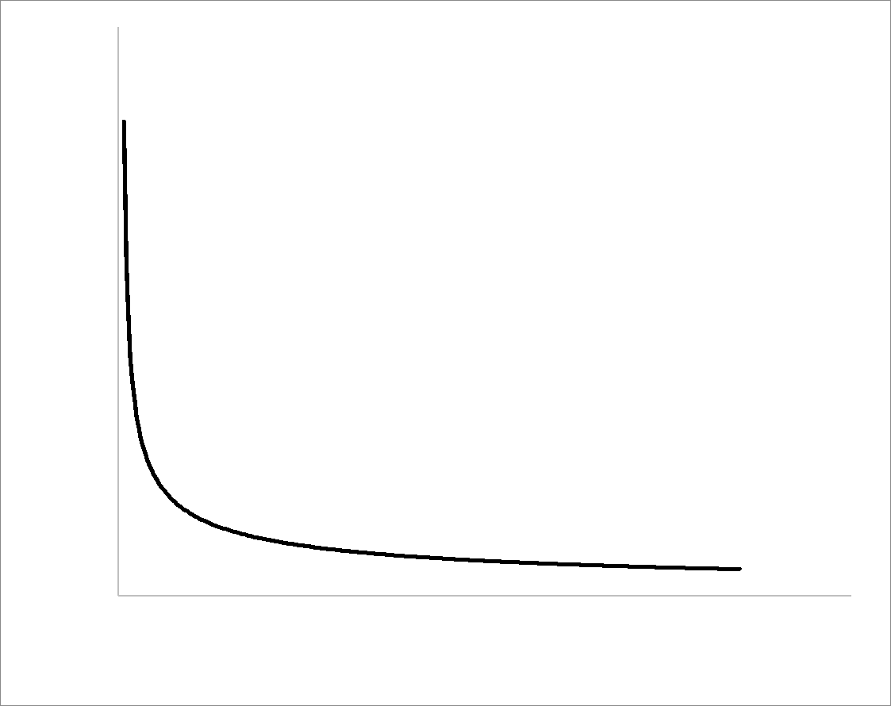

**Figura 58.** Variación del coeficiente de variación de la tasa de excedencia con el tamaño de la muestra (Elaboración propia).

El CV crece rápidamente a medida que *n* disminuye. Esto quiere decir que, al estimar la tasa de excedencia de pérdidas grandes (eventos catastróficos) a partir de pocos eventos modelados, para los cuales se contará con un valor pequeño de *n* (es decir, pocos eventos que exceden esa pérdida dentro del conjunto de escenarios de sequía), la dispersión de la estimación (i.e. su desviación estándar) es muy grande en comparación a la estimación misma, lo cual implica una mayor incertidumbre. Por el contrario, al estimar la tasa de excedencia de pérdidas con un mayor número de eventos modelados, *n* será necesariamente un número más grande y, en consecuencia, la dispersión de la tasa disminuye a valores incluso despreciables en la práctica. Esto es por lo que, para que el resultado sea estadísticamente suficiente se debe hacer uso de un gran número de años simulados dentro de los cuales se pueda identificar un número considerable de eventos de sequía.

### Curva de excedencia de pérdidas

Es así como el riesgo se define por medio de la curva de excedencia de pérdidas (ver Figura 31), la cual establece el número de veces en un año en las que un valor de pérdida se verá excedido. Esta cantidad se conoce como la *tasa anual de excedencia*, la cual es un valor único y específico para cada cuantía de pérdida, e incorpora el aporte de todos los posibles escenarios contenidos en la evaluación de la amenaza. Como se mencionó anteriormente, la tasa de excedencia es igual al parámetro \(\lambda\) que define la ocurrencia en el tiempo de los eventos de pérdida, es decir:

|                                                   |          |
| ------------------------------------------------- | -------- |
| \(\nu\left( p \right) = \frac{n_{p} - 1}{T_{i}}\) | **(11)** |

en donde \(p\) es la pérdida económica, \(\nu\left( p \right)\) es su tasa anual de excedencia, \(n_{p}\) es el número total de eventos en los cuales se supera \(p\) y \(T_{i}\) es el tiempo \(i\) entre eventos que superan \(p\). El periodo de retorno \(Tr(p)\) se calcula como el inverso de la tasa de excedencia \(\nu\left( p \right)\).

|                                        |          |
| -------------------------------------- | -------- |
| \(Tr = \frac{1}{\nu\left( p \right)}\) | **(12)** |

El periodo de retorno es el valor esperado del tiempo entre eventos. Es decir, corresponde al periodo de tiempo promedio para el cual, considerando una ventana temporal de observación suficientemente amplia, se verá igualada o excedida una pérdida dada, y se muestra en el eje vertical de la derecha de la curva ejemplo mostrada en la Figura 31.

**Figura 59.** Ejemplo de curva de excedencia de pérdidas. El eje vertical muestra la tasa de excedencia (izquierda) y su valor inverso o periodo de retorno (derecha). El eje horizontal muestra la pérdida asociada (Elaboración propia).

El cálculo de la Ecuación (11 corresponde a la estimación de la tasa de excedencia de las cuantías de pérdida que ocurren en todos los activos expuestos (unidades de tierra cultivada) para todos los eventos potencialmente nocivos incluidos en el modelo de amenaza (el conjunto de escenarios estocásticos previamente identificados). La pérdida para un evento se determina mediante la suma de las pérdidas causadas en las unidades individuales cultivadas.

Para la evaluación del riesgo de sequía, la pérdida \(p\) en la Ecuación (11 se debe a la reducción en los ingresos de producción (lucro cesante) de cultivos debido a la reducción en el rendimiento de cada unidad de tierra cultivada, en donde se conocen el tipo de suelo, tipo de cultivo, su estacionalidad y su valor económico de reposición. La pérdida económica en una unidad cultivada, para un escenario específico, se calcula como:

|                                                                      |          |
| -------------------------------------------------------------------- | -------- |
| \(P_{i} = A \bullet \text{PV} \bullet \left( Y_{x} - Y_{i} \right)\) | **(13)** |

en donde \(P_{i}\) es la pérdida económica para el escenario \(i\), \(A\) es el área de la unidad de tierra cultivada, \(\text{PV}\) es la valoración económica del cultivo, \(Y_{x}\) es el rendimiento máximo (calculado bajo condiciones óptimas) y \(Y_{i}\) es el rendimiento para el escenario \(i\) bajo condiciones de déficit hídrico.

## CONFLICTO DE INTERESES

Los autores no declaran conflicto de intereses.

# 

Recopilación, búsqueda, selección, filtración de información y de datos de los últimos 10 años, revisión bibliográfica a partir de diferentes fuentes como documentos oficiales, textos escritos y digítales; nacionales e internacionales identificando los aspectos asociados al manejo, salud y seguridad de los animales en la gestión del riesgo de los desastres y su papel en la sociedad, que permiten llevar a cabo una adecuada guía para la toma de decisiones frente a los animales en emergencias y desastres, garantizando la seguridad del personal operativo que interviene. Se priorizan el análisis a las acciones que contemplan estándares asociados al enfoque One Health y se prepara el contenido de una manera significativa y agregándole contenido relevante por parte de cada uno de los autores.

## CONFLICTO DE INTERESES

Los autores declaran no tener conflicto de interés.

## IDENTIFICACIÓN POR AUTOR

Diego Alexander Hernández Pulido [CvLAC](https://scienti.minciencias.gov.co/cvlac/visualizador/generarCurriculoCv.do?cod_rh=0001613874)

Nicolás Hernández Gallo [CvLAC](https://scienti.minciencias.gov.co/cvlac/visualizador/generarCurriculoCv.do?cod_rh=0001318004)

Leonardo Arias Bernal [CvLAC](https://scienti.minciencias.gov.co/cvlac/visualizador/generarCurriculoCv.do?cod_rh=0000382086)

Rodrigo Forero Carrillo [CvLAC](https://scienti.minciencias.gov.co/cvlac/visualizador/generarCurriculoCv.do?cod_rh=0001711791)

Gonzalo Jiménez Alonso [CvLAC](https://scienti.minciencias.gov.co/cvlac/visualizador/generarCurriculoCv.do?cod_rh=0000284300)

Se planteó una metodología que permite el cálculo del riesgo definido mediante la ecuación general:

\(R = P\lbrack T\rbrack \times P\lbrack C/T\rbrack \times u(C)\) (1)

donde *R* es el riesgo, *P\[T\]* es la amenaza entendida como la probabilidad de que ocurra un evento amenazante, *P\[C|T\]* es la vulnerabilidad (*V*) entendida como la probabilidad condicional de que se produzcan daños considerando que ya ocurrió una falla y *u(C)* es el costo de las consecuencias. Para el caso de los movimientos en masa, la *P\[T\]* se entenderá como la probabilidad de falla, es decir la probabilidad de que un talud falle, que este caso corresponde a la *PTF*. Aunque la falla se podría dar solo por efecto de la gravedad, lo más común es que la falla sea desencadenada por un agente detonante como los sismos o la lluvia. La Figura muestra esquemáticamente el modelo propuesto.

<table>
<tbody>
<tr class="odd">
<td>
<strong>Caja 2. Definiciones</strong>

Cuantitativamente, se puede definir <strong>el riesgo</strong> como la probabilidad de que se presente una pérdida o un daño del elemento expuesto cuando se presenta un evento con una intensidad mayor que la intensidad considerada como límite en el análisis. De acuerdo con la Sociedad Internacional de Mecánica de Suelos e Ingeniería Geotécnica (ISSMGE, por su sigla en inglés, 2004), riesgo es la probabilidad y severidad de un efecto adverso para la vida, la salud, la propiedad o el medio ambiente. También puede definirse de forma cuantitativa, como la probabilidad de que un evento adverso ocurra multiplicada por las consecuencias de la ocurrencia del evento.

<strong>La amenaza</strong>, es la probabilidad de que se presente un evento con una intensidad mayor o igual que la considerada en el proceso de análisis. De acuerdo con la Sociedad Internacional de Mecánica de Suelos e Ingeniería Geotécnica (ISSMGE, 2004), la probabilidad de que un particular peligro ocurra dentro de un determinado período de tiempo.

<strong>La vulnerabilidad</strong> es la predisposición de un elemento a sufrir daños o afectarse debido a la ocurrencia de un evento de cierta intensidad. Según la ISSMGE, la vulnerabilidad se define como el nivel de perdidas esperadas en un elemento o sistema en relación a una amenaza especificada. La vulnerabilidad depende de la exposición a la amenaza, la propensión del elemento expuesto a sufrir daños, de las consecuencias de los daños y de los posibles costos de los daños y las consecuencias.
</td>
</tr>
</tbody>
</table>

**Figura 5.** Presentación esquemática del modelo de análisis de riesgo.

Como se observa en la Figura , la determinación de la amenaza se hace considerando la saturación del suelo y el efecto de los sismos, y la vulnerabilidad considera la exposición y las consecuencias de la falla.

## Amenaza

El modelo de estimación de la amenaza fue implementado usando el software EPADYM, desarrollado por el Grupo de Investigación en Ingeniería Civil (GICI) de la Universidad de Medellín, y que calcula el índice de confiabilidad, la probabilidad de falla y el factor de seguridad del terreno bajo condiciones sísmicas y estáticas.

La metodología implementada para la estimación de la amenaza \[6\] y \[27\] se basa en el método FOSM. Esta metodología, que se muestra gráficamente en la Figura , permite calcular la probabilidad de falla del terreno (PTF) de acuerdo con teorema de probabilidad total por medio de la ecuación:

\(P\left\lbrack T \right\rbrack = {PTF = P}_{\text{fs}} \times P_{s} + P_{\text{fns}} \times (1 - P_{s})\) (2)

Donde *Pfs* es la probabilidad de falla del talud debido a la acción de un sismo en condición de saturación de suelos, *Pfns* es la probabilidad de falla en condición no saturada, *Ps* es la probabilidad marginal de que el suelo este saturado y (1 - *Ps*) representa la probabilidad marginal de que el suelo no esté saturado. La probabilidad de falla de los taludes las condiciones saturada y no saturada pueden ser calculadas independientemente, pero la determinación de la probabilidad que el suelo este saturado es difícil debido a la complejidad del fenómeno de variación de las condiciones del contenido de agua en el suelo. Una descripción detallada del modelo para la evaluación de probabilidad de falla se puede consultar en \[35\].

**Figura 6.** Esquema de la metodología adoptada para la evaluación de la amenaza.

<table>
<tbody>
<tr class="odd">
<td>
<strong>Caja 3. Datos estadísticos de las propiedades del suelo</strong>

En análisis probabilistas es necesario disponer de información de las distribuciones de probabilidad de las variables, sin embargo, diversos estudios han mostrado que cuando no se dispone de un número suficiente de datos se pueden obtener buenas estimativas conociendo la media del parámetro y utilizando valores típicos del coeficiente de variación (desviación estándar sobre la media), que han mostrado tener poca sensibilidad temporal y espacial. En la siguiente tabla se presentan rangos típicos de coeficientes de variación de parámetros geotécnicos de interés para análisis de estabilidad de taludes medidos en suelos del Valle de Aburra. Con base en estos datos, se hizo la estimativa de los CV usados en la evaluación de amenaza en este trabajo.

Resultados de ensayos de corte directo [24]

<table>
<thead>
<tr class="header">
<th>Unidad geológica</th>
<th>Parámetro</th>
<th>n</th>
<th>𝑥 ̅</th>
<th>σ</th>
<th>CV (%)</th>
</tr>
</thead>
<tbody>
<tr class="odd">
<td>Residual de diorita</td>
<td>γh (kN/m3)</td>
<td>59</td>
<td>15.1</td>
<td>1.4</td>
<td>11</td>
</tr>
<tr class="even">
<td></td>
<td>γd (kN/m3)</td>
<td>59</td>
<td>11.3</td>
<td>1.2</td>
<td>9</td>
</tr>
<tr class="odd">
<td></td>
<td>c (kPa)</td>
<td>59</td>
<td>7.6</td>
<td>7.6</td>
<td>100</td>
</tr>
<tr class="even">
<td></td>
<td>φ (º)</td>
<td>59</td>
<td><blockquote>

37.1

</blockquote></td>
<td>4.8</td>
<td>13</td>
</tr>
<tr class="odd">
<td>Depósito de vertiente</td>
<td>γh (kN/m3)</td>
<td>78</td>
<td>14.42</td>
<td>1.47</td>
<td>8.45</td>
</tr>
<tr class="even">
<td></td>
<td>γd (kN/m3)</td>
<td>78</td>
<td>11.72</td>
<td>2.11</td>
<td>18.03</td>
</tr>
<tr class="odd">
<td></td>
<td>c (kPa)</td>
<td>78</td>
<td>19.91</td>
<td>10.42</td>
<td>52.34</td>
</tr>
<tr class="even">
<td></td>
<td>φ (º)</td>
<td>78</td>
<td>24.11</td>
<td>5.52</td>
<td>22.89</td>
</tr>
<tr class="odd">
<td>Suelo residual de dunita</td>
<td>γh (kN/m3)</td>
<td>56</td>
<td>17.75</td>
<td>1.21</td>
<td>6.84</td>
</tr>
<tr class="even">
<td></td>
<td>γd (kN/m3)</td>
<td>56</td>
<td>12.04</td>
<td>1.59</td>
<td>13.19</td>
</tr>
<tr class="odd">
<td></td>
<td>c (kPa)</td>
<td>56</td>
<td>20.76</td>
<td>14.66</td>
<td>70.62</td>
</tr>
<tr class="even">
<td></td>
<td>φ (º)</td>
<td>56</td>
<td>23.87</td>
<td>7.31</td>
<td>30.88</td>
</tr>
<tr class="odd">
<td>Saprolito de dunita</td>
<td>γh (kN/m3)</td>
<td>59</td>
<td>17.29</td>
<td>1.41</td>
<td>8.16</td>
</tr>
<tr class="even">
<td></td>
<td>γd (kN/m3)</td>
<td>59</td>
<td>10.96</td>
<td>1.95</td>
<td>17.79</td>
</tr>
<tr class="odd">
<td></td>
<td>c (kPa)</td>
<td>59</td>
<td>15.56</td>
<td>12.11</td>
<td>77.80</td>
</tr>
<tr class="even">
<td></td>
<td>φ (º)</td>
<td>59</td>
<td>24.04</td>
<td>7.07</td>
<td>29.39</td>
</tr>
</tbody>
</table></td>
<td></td>
</tr>
</tbody>
</table>

El cálculo de la probabilidad de saturación se efectuó usando la metodología descrita por \[35\] usando de precipitación diaria de la base de datos CHIRPS entre el año 1951 y 1996. Los registros se organizaron con ventanas móviles de lluvia acumulada de 15 y 3 días para cada fecha. Igualmente, para cada fecha se calculó la lluvia de 3 días usando la ecuación del umbral de falla de la Ecuación 4. La comparación de los valores reales con los valores estimados se realizó usando la Ecuación 3. Con el fin de establecer la probabilidad de excedencia del umbral, se determinó el número de veces que se excedió el umbral durante el tiempo de registros y luego este número de ocurrencias se dividió por el número total de registros. Con base en los análisis realizados, se estima que las precipitaciones que superan el umbral de falla, tienen un periodo de recurrencia de 20 años. La Figura esquematiza el proceso seguido aquí.

\(R_{3m} \geq R_{3}\) (3)

Donde R3m es la lluvia acumulada de 3 días calculada a partir de registros de pluviómetros y R3 es la lluvia acumulada de 3 días calculada usando la ecuación del umbral de falla.

\(R_{3} = 75 - 0.5R_{15}\) (4)

Donde R15 es la lluvia acumulada precedente de 15 días y R3 la lluvia acumulada antecedente de 3 días.

## Vulnerabilidad

La vulnerabilidad (*V*) de un elemento puede ser entendida como la probabilidad de daño que ésta presenta cuando se somete al efecto particular de un fenómeno natural o antropogénico potencialmente dañino, pero en este caso se asocia a un movimiento en masa. Cuantitativamente se puede establecer como una función de la intensidad (*I*) de un movimiento en masa y de la fragilidad (*S*) de los elementos expuestos a tal movimiento, es decir:

\(V = f(I,S)\) (5)

La intensidad se asocia al potencial destructivo de la masa de suelo que se desliza, la cual se influencia directamente por factores como la velocidad de la masa deslizante de suelo, volumen, energía cinética, energía cinemática, área de afectación, etc. La evaluación de este parámetro se encuentra ligada a la magnitud (volumen) de la masa potencialmente inestable y a su distancia de viaje, la cual depende de la configuración geométrica de la ladera.

En este trabajo se calcula la intensidad en función de la altura de la obstrucción que se puede generar por el suelo deslizado en el cauce de una quebrada, en la Figura puede apreciarse el esquema adoptado para el cálculo de la intensidad. La altura *hT* de la obstrucción, depende del volumen del material removido, de la distancia que debe recorrer el material, de la pendiente del terreno y de la forma de la geometría del cauce de la corriente. El volumen movilizado se calcula como el producto del área de la celda y la profundidad de la superficie de falla asumida, en este caso *H* = 2 m. La distancia que recorre el material deslizante se determina como la longitud de la trayectoria más corta entre los centroides de la celda que falla y la celda donde se acumula. La obstrucción puede ser total como muestra en la Figura , o puede afectar solo una parte de la quebrada, caso en el cual el nivel de afectación cambia. El grado de obstrucción de la quebrada dependerá de factores como la cantidad y tipo de material deslizado, la forma del canal de la quebrada (altura, ancho, pendiente de los taludes). La afectación se considerará con la altura total de depositación del movimiento en masa actuante en la quebrada (*hT*) calculada con la Ecuación 6:

\(h_{T} = h_{i}\) (6)

donde *hi* es la altura que puede ser generada por cada celda inestable. El proceso para estimar *hi* se puede ver detalladamente en \[11\].

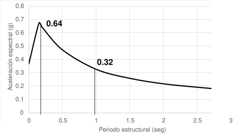

**Figura 7**. Esquema adoptado para el cálculo de la altura de depositación del movimiento en masa (*hT*).

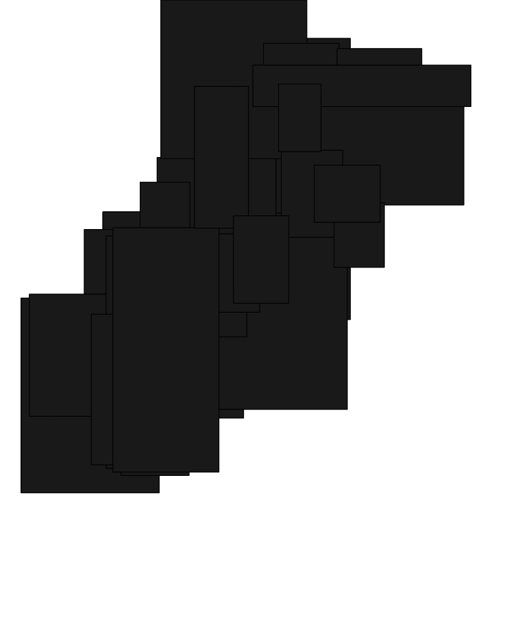

**Figura 8.** Esquema adoptado para el cálculo de la vulnerabilidad cuencas/cauces.

La fragilidad (*S*) o probabilidad de daño se asocia a la resistencia de los elementos expuestos, para garantizar su funcionalidad e integridad física ante la interacción ejercida por la masa deslizante de suelo. En este trabajo se usó el concepto de las curvas de daño, las representan la probabilidad de que un elemento expuesto esté en un estado de daño determinado para un nivel de demanda dado. Se elaboraron curvas que describen la probabilidad de excedencia de un estado límite predeterminado de exposición de las quebradas ante la amenaza de un movimiento en masa, dada una medida de intensidad del mismo como se ilustra en la Figura , que depende de la altura de depositación del movimiento en masa (*hT*). Para el cálculo de la intensidad (*I*) o *P\[C|T\]* que puede generar la masa de suelo deslizante sobre una quebrada se utilizó la Ecuación 7. Esta ecuación se obtuvo mediante la adaptación de curvas de fragilidad para vías usadas por el programa europeo de gestión de riesgo Safeland \[36\] mediante ajustes de regresión.

\(P\left\lbrack \frac{C}{T} \right\rbrack = I = \frac{1}{\left( 1 + \left( \text{αe}^{- h_{T}} \right)^{n} \right)^{m}}\) (7)

Donde:

α, n y m son constantes que toman valores de 2350, 0.71 y 0.57 respectivamente.

**Figura 9.** Ejemplo de curva de daño para la afectación de una quebrada.

## Costos de los elementos expuestos

La afectación a la corriente debido a la obstrucción se puede considerar de varias formas:

1.  > Interrupción de los acueductos y otros suministros que se obtienen aguas abajo de la obstrucción.

2.  > Afectación al ecosistema acuático.

3.  > Posible generación de avalanchas debido al embalse que se genera por la obstrucción.

Como punto de partida para la evaluación del riesgo, se tiene la identificación de los elementos en riesgo (Elementos expuestos). En zonas rurales de Antioquia, los elementos físicos afectados por amenaza ante movimientos en masa pueden ser calificados dentro de cuatro categorías principales:

  - > Edificaciones de diferentes categorías y tipologías.

  - > Líneas Vitales: Sistemas de transportes (incluidas autopistas, vías de tren, aeropuertos y accesos), líneas de conducción de agua potable, alcantarillado, gas natural, redes de energía eléctrica.

  - > Zonas de bosques.

  - > Cultivos arbustivos, cafetales y frutales.

  - > Pastizales ganaderos.

En este caso, no se incluye el efecto de los elementos físicos sobre la población, excluyendo edificaciones.

Los costos se determinaron para cada celda de 30 m en que fue dividida la zona de estudio, considerando la proporción de elementos expuestos existentes en ella. Con base en estas áreas y usando el método de las estimativas puntuales, se determinó el valor medio del costo de cada celda y la desviación estándar de ese costo considerando para ello una distribución triangular de los costos usando la siguiente ecuación:

\(C_{\text{celda}} = C_{\text{vias}} + C_{\text{zv}} + C_{\text{const}}\) (8)

Donde *Ccelda* es el costo total de la celda ($), *Cvias* es el costo de las vías ($) que se obtiene como el costo de las vías por el área de vías en la celda, *Czv* es el costo de las zonas verdes que se obtiene como el costo de las zonas verdes por el área de zonas verdes en la celda ($) y *Cconst* es el costo de las construcciones ($).

## Riesgo

El riesgo se calcula en términos de las pérdidas económicas que pueden ser generadas en la corriente de agua debido a los movimientos en masa, de acuerdo a la ecuación:

\(R = TPF\  \times \ I\  \times C_{\text{celda}}\) (9)

Se estimó el riesgo en cada celda localizada sobre la corriente de agua en las condiciones actuales. En la Figura 10 se presenta la forma de cálculo de un índice de riesgo (*R*), obtenido como el producto de la probabilidad anual de falla (*PAF*), y la pérdida económica potencial (*PEP*) derivada de la vulnerabilidad de un cauce en términos de la intensidad y de la valoración económica del tipo de cobertura vegetal.

\(R = PAF \times PEP\) (10)

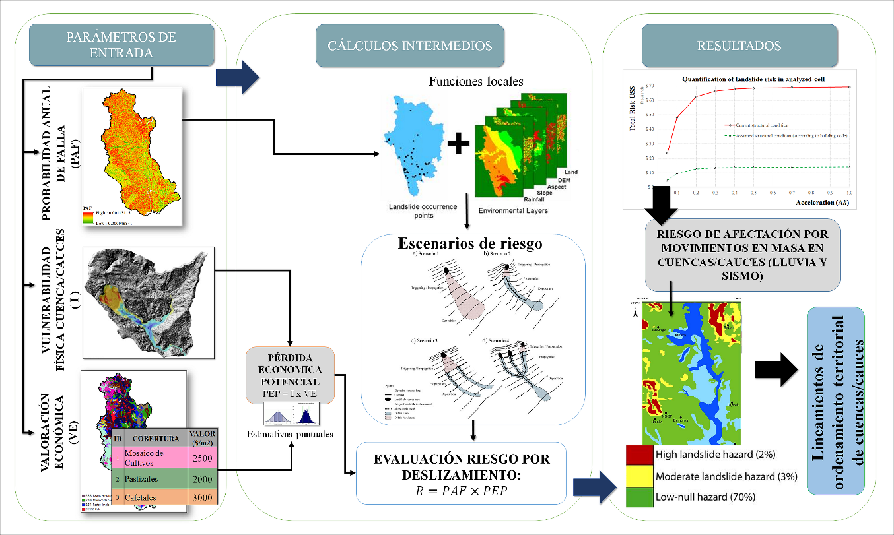

**Figura 10.** Esquema metodología adoptada para la evaluación del riesgo

Este proyecto se desarrolló en tres etapas. La primera incluyó la toma de datos en campo (topografía, aforo líquido, encuestas, registro fotográfico y georreferenciación de estructuras hidráulicas). La segunda etapa comprendió el procesamiento de la información (topografía, cálculo de coeficiente de rugosidad de Manning, modelos de distribución de probabilidad de precipitación, construcción de hidrogramas, análisis de encuestas, entre otros) y el modelo hidráulico empleando el software Iber 2D (versión 2.4) que de acuerdo a análisis geomorfológicos, del tipo de flujo y a la información disponible, ofrece el mejor desempeño en la simulación 2D del nivel del agua para eventos de inundación en ríos de piedemonte y planicie de inundación \[8\]. Finalmente, se delimitaron y categorizaron las zonas de amenaza siguiendo los lineamientos de la UNGRD en la *Guía Metodológica Para la Elaboración de Planes Departamentales para la Gestión del Riesgo* \[9\].

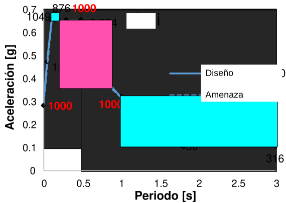

**Figura 3.** Diagrama de flujo para la cuantificación de la amenaza.

Gracias a las actuales herramientas SIG, los resultados de la modelización numérica se pueden combinar con datos georreferenciados para realizar una cuantificación sistemática del riesgo de inundación \[9\]. Iber 2D se desarrolló por el Instituto Flumen y GEAMA, el cual aporta mayor precisión respecto a un software de modelación hidráulica en una dimensión debido a que permite construir la topografía mediante una malla no estructurada de elementos finitos \[10\], tiene en cuenta la dirección del vector de velocidad, resuelve las ecuaciones de Saint Vennat 2D que son la expresión matemática de las leyes de conservación de masa y de la cantidad de movimiento \[11\] y predice de forma más precisa las zonas de inundación y su profundidad. Adicionalmente, es de uso libre (www.iberaula.es), ofrece documentación adicional y soporte a través de un foro de discusión y cursos de formación \[7\].

**Tabla 1.** Calificación de la frecuencia. La frecuencia determina cada cuanto se presentan eventos amenazantes a partir de la cronología de eventos ocurridos. UNGRD, 2012, p. 28.

| **Descripción**                                                                            | **Valor** | **Calificación** |
| ------------------------------------------------------------------------------------------ | --------- | ---------------- |
| Evento que se presenta una vez aproximadamente cada 10 años.                               | 3         | Alta             |
| Evento que se presenta por lo menos una vez en un período de tiempo aproximado de 50 años. | 2         | Media            |
| Evento que se presenta al menos una vez en un período de tiempo aproximado a 100 años.     | 1         | Baja             |
|                                                                                            |           |                  |

Para el río Unete la modelación se realizó en dos dimensiones sin considerar flujos hiperconcentrados, por cuanto no se evidencian geoformas asociadas a este tipo de flujos, como son conos de deyección y abanicos aluviales. Como resultado de la modelación hidráulica se obtuvieron mapas de intensidad de inundación para distintos periodos de retorno, que son un insumo indispensable para definir el nivel de amenaza como la sumatoria de frecuencia, territorio afectado e intensidad. Cada indicador se evalúa en escala de 1 a 3, de tal forma que la sumatoria fluctúa entre 3 (amenaza mínima) y 9 (amenaza máxima) \[9\]. Para evaluar la intensidad de la inundación en términos del territorio afectado, se adopta como 100% la mancha de inundación con período de retorno de 200 años.

**Tabla 2.** Porcentaje y calificación del territorio afectado. Fuente: UNGRD, 2012, p. 29.

<table>
<thead>
<tr class="header">
<th><blockquote>

<strong>Descripción</strong>

</blockquote></th>
<th><blockquote>

<strong>Valor</strong>

</blockquote></th>
<th><blockquote>

<strong>Calificación</strong>

</blockquote></th>
</tr>
</thead>
<tbody>
<tr class="odd">
<td><blockquote>

Más del 80% del territorio afectado por la inundación

</blockquote></td>
<td><blockquote>

3

</blockquote></td>
<td><blockquote>

Alta

</blockquote></td>
</tr>
<tr class="even">
<td><blockquote>

Entre el 50% y 80% del territorio afectado por la inundación

</blockquote></td>
<td><blockquote>

2

</blockquote></td>
<td><blockquote>

Media

</blockquote></td>
</tr>
<tr class="odd">
<td><blockquote>

Menos del 50% del territorio afectado por la inundación

</blockquote></td>
<td><blockquote>

1

</blockquote></td>
<td><blockquote>

Baja

</blockquote></td>
</tr>
</tbody>
</table>

La intensidad representa el nivel potencial de daños materiales y de pérdida de vidas humanas, valorada igualmente en escala de 1 a 3, según la profundidad y velocidad de flujo, siendo conveniente diferenciar entre inundaciones estáticas y dinámicas \[12\]. Si la inundación es estática, la velocidad del flujo es inferior a 0.50 m/s y la variable a tener en cuenta es la profundidad; mientras que si es dinámica, se tendrá en cuenta el producto de la velocidad por la profundidad de flujo, y es este el criterio adoptado en Aguazul, para lo cual los resultados de la simulación en Iber 2D se exportaron al software Arcgis y se reclasificaron estableciendo tres rangos: profundidad baja (0 – 1.0 m), profundidad media (1.0 – 1.5 m) y profundidad alta (1.5 m – profundidad máxima).

**Tabla 3.** Criterios valoración intensidad de inundación. Fuente: Instituto Nicaragüense de Estudios Territoriales, 2005, p. 16.

<table>
<thead>
<tr class="header">
<th><strong>Nivel de intensidad</strong></th>
<th><strong>Valor</strong></th>
<th><strong>Profundidad del flujo (H) (m) (inundaciones estáticas)</strong></th>
<th><strong>Profundidad × vol. de flujo (m/s) (inundaciones dinámicas)</strong></th>
</tr>
</thead>
<tbody>
<tr class="odd">
<td><blockquote>

Alto

</blockquote></td>
<td>3</td>
<td>H ≥ 1.0</td>
<td><blockquote>

H*V ≥ 1.5

</blockquote></td>
</tr>
<tr class="even">
<td><blockquote>

Medio

</blockquote></td>
<td>2</td>
<td>0.5 ≤ H &lt; 1.0</td>
<td><blockquote>

0.5 ≤ H*V &lt; 1.5

</blockquote></td>
</tr>
<tr class="odd">
<td><blockquote>

Bajo

</blockquote></td>
<td>1</td>
<td>0.25 ≤ H &lt; 0.5</td>
<td><blockquote>

H*V &lt; 0.5 y H ≥ 0.25 m

</blockquote></td>
</tr>
</tbody>
</table>

Para los mapas de velocidad se siguió un proceso similar para cada uno de los periodos de retorno (200 años, 50 años, 10 años y 1.3 años), los cuales se exportaron y reclasificaron en el software Arcgis estableciendo tres rangos: velocidad baja (0 – 1.0 m/s), velocidad (1.0 – 1.5 m/s) y velocidad alta (1.5m/s – velocidad máxima). Finalmente, la amenaza es el resultado de sumar frecuencia, territorio afectado e intensidad, cuyo resultado se reclasifica en tres intervalos.

**Tabla 4.** Calificación de amenazas. Fuente: UNGRD, 2012, p. 29.

<table>
<thead>
<tr class="header">
<th><blockquote>

<strong>Intervalo</strong>

</blockquote></th>
<th><blockquote>

<strong>Calificación de la amenaza</strong>

</blockquote></th>
</tr>
</thead>
<tbody>
<tr class="odd">
<td><blockquote>

7-9

</blockquote></td>
<td><blockquote>

Alta

</blockquote></td>
</tr>
<tr class="even">
<td><blockquote>

4-6

</blockquote></td>
<td><blockquote>

Media

</blockquote></td>
</tr>
<tr class="odd">
<td><blockquote>

1-3

</blockquote></td>
<td><blockquote>

Baja

</blockquote></td>
</tr>
</tbody>
</table>

Previo a la modelación hidráulica, se realizó una visita de campo donde se realizó el aforo líquido y levantamiento topográfico. Esta información se utilizó para calcular el coeficiente de rugosidad de Manning, definir la geometría del modelo y sus condiciones de control.

**Figura 4.** Trabajo de batimetría efectuado en el río Unete en enero de 2018 (izq) y (der).

En el sitio del aforo se obtuvo una pendiente del lecho del río (S) del 3.0%, área (A) de 46.17 m2 y perímetro (P) de 90.74 m. Seguidamente se calculó el caudal (Q) por el método área – velocidad, para ello, la sección transversal se dividió en 18 secciones, en cada una se registra el área y la velocidad, cuyo producto es el caudal, que en este caso fue de 107.09 m3/s, caudal aforado en noviembre de 2017 tras precipitaciones la noche anterior.

**Figura 5.** Aforo líquido del río Unete realizado el 04-11-2017.

Con estos valores, se llegó a un coeficiente de rugosidad de Manning (n) de 0.048, que concuerda con la clasificación dada en la literatura técnica \[13\], cuya descripción corresponde a un cauce con presencia de gravas, cantos rodados y algunas rocas grandes.

\(n = \ \frac{1}{Q}*\frac{A^{\frac{5}{3}}}{P^{\frac{2}{3}}}*\) \(n = \ \frac{1}{107.09}*\frac{{46.17}^{\frac{5}{3}}}{{90.74}^{\frac{2}{3}}}* = 0.048\) (1)

En la Figura 6 se observa el lecho del río Unete, incluyendo una barra de sedimento compuesta por arenas, gravas y cantos rodados, así como, espolones y una estructura de contención construida con rocas y hexápodos posicionada sobre la margen izquierda del río y una terraza en la margen derecha.

**Figura 6.** Vista panorámica del río Unete tomada con drone. Trabajo de campo efectuado en el río Unete en enero de 2018. (**A**) Espolones en concreto, (**B**) Estructura de contención con hexápodos, (**C**) Barra de sedimentos y (**D**) Terraza.

Las geoformas identificadas en el río Unete en proximidad al área urbana de Aguazul, incluyen barras de sedimento, vega, terrazas de distintos niveles y planicie de inundación (Fig. 7), su identificación y delimitación permite establecer la susceptibilidad del terreno ante el desbordamiento del río.

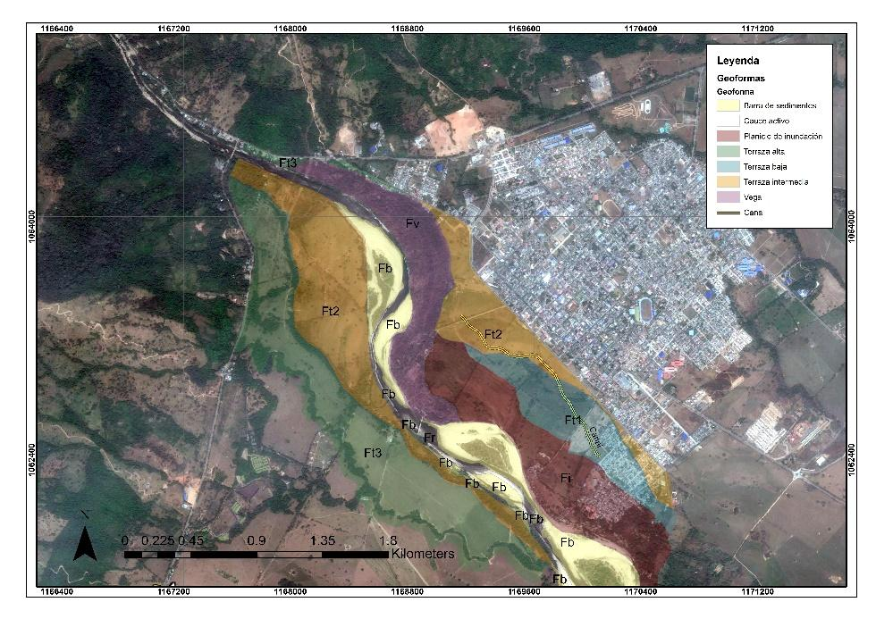

**Figura** **7.** Geoformas río Unete.

La susceptibilidad hace referencia a la facilidad con que un fenómeno puede ocurrir sobre la base de las condiciones locales del terreno, en este caso la susceptibilidad es una propiedad del terreno que indica qué tan favorables son las condiciones de éste, para que pueda ocurrir una inundación, en función de las geoformas, que son indicador del tipo de material, origen, granulometría y edad del depósito, condición que es validada con el análisis de amenaza.

**Tabla 5.** Susceptibilidad de inundación según geoformas.

<table>
<thead>
<tr class="header">
<th>Geoforma</th>
<th>Símbolo</th>
<th>Tipo</th>
<th>Susceptibilidad</th>
</tr>
</thead>
<tbody>
<tr class="odd">
<td><blockquote>

Cauce activo

</blockquote></td>
<td>Fr</td>
<td>Depósitos aluviales conformado por suelo transportado, con tamaño desde arenas hasta bloques</td>
<td>Alta</td>
</tr>
<tr class="even">
<td><blockquote>

Vega aluvial

</blockquote></td>
<td>Fv</td>
<td>Depósitos aluviales conformado por suelo transportado subreciente, con tamaño desde limos hasta arenas, inundado periódicamente</td>
<td>Alta</td>
</tr>
<tr class="odd">
<td><blockquote>

Planicie de inundación

</blockquote></td>
<td>Fi</td>
<td>Depósitos aluviales conformado por suelo transportado, matriz soportados con arenolimosa, afectados por inundaciones periódicas y/o excepcionales</td>
<td>Alta</td>
</tr>
<tr class="even">
<td><blockquote>

Barra de sedimento

</blockquote></td>
<td>Fb</td>
<td>Depósitos aluviales conformado por suelo transportado reciente, con tamaño desde gravas hasta arenas, generalmente inestable, que bajo ciertas condiciones puede llegar a ser estabilizada por la vegetación</td>
<td>Alta</td>
</tr>
<tr class="odd">
<td><blockquote>

Terraza de acumulación baja

</blockquote></td>
<td>Ft1</td>
<td>Depósitos fluviotorrenciales transportado reciente con tamaño desde gravas hasta arenas, matriz soportados con arenolimosa</td>
<td>Media</td>
</tr>
<tr class="even">
<td><blockquote>

Terraza de acumulación subreciente

</blockquote></td>
<td>Ft2</td>
<td>Depósitos fluviotorrenciales matriz soportados con tamaño desde gravas hasta guijarros, la matriz es arenolimosa</td>
<td>Media</td>
</tr>
<tr class="odd">
<td><blockquote>

Terraza de acumulación alta

</blockquote></td>
<td>Ft3</td>
<td>Suelos transportados limoarenosos generados a partir de acumulación de materiales de lavado de laderas</td>
<td>Baja</td>
</tr>
<tr class="even">
<td><blockquote>

Escarpe de terraza

</blockquote></td>
<td>Fs</td>
<td>Depósitos fluviotorrenciales matriz soportados con tamaño desde gravas hasta bloques, de formas redondeadas, la matriz es arenolimosa</td>
<td>Media</td>
</tr>
</tbody>
</table>

Para la caracterización del régimen de precipitación se utilizaron los registros de 15 estaciones hidrológicas, entre ellas la estación Aguazul (3519530) posicionada en el piedemonte de la cordillera oriental, está última con registros continuos desde 1974 y un 10.7% de datos faltantes. Una vez la serie de datos suministrada por el IDEAM fue validada y completada, se obtuvo un régimen monomodal con periodo húmedo entre abril y octubre, precipitación anual de 2,796 mm, distribuidos en promedio en 158 días al año.

**Tabla 6.** Resumen registro de precipitación en la estación Aguazul (3519530) del IDEAM.

| Parámetro                             | Ene  | Feb  | Mar   | Abr   | May   | Jun   | Jul   | Ago   | Sep   | Oct   | Nov   | Dic  |      |
| ------------------------------------- | ---- | ---- | ----- | ----- | ----- | ----- | ----- | ----- | ----- | ----- | ----- | ---- | ---- |
| Precipitación media mensual (mm)      | 12.8 | 41.0 | 125.2 | 286.1 | 426.2 | 410.2 | 357.0 | 310.7 | 329.3 | 287.5 | 163.0 | 46.9 | 2796 |
| Precipitación mínima mensual (mm)     | 0    | 0    | 3.6   | 68.2  | 191.4 | 204   | 169.1 | 100.4 | 73.4  | 151.3 | 2.7   | 0    | 0    |
| Precipitación máxima en 24 horas (mm) | 35   | 105  | 146   | 131   | 136.3 | 136.2 | 170.1 | 121.4 | 134.6 | 155   | 187   | 85   | 187  |
| Promedio No de días con precipitación | 2    | 4    | 9     | 17    | 20    | 20    | 21    | 18    | 16    | 16    | 12    | 4    | 158  |

A nivel regional, la menor precipitación tiene lugar en la parte alta de la cuenca hacia la zona de páramo (1,313.7 mm en la estación Toquilla), mientras que las máximas precipitaciones se desarrollan en el piedemonte (4,806.1 mm en la estación Chameza), de tal forma que la cuenca del río Unete se posiciona en el corredor de máximas precipitaciones, con valores entre 2,500 y 3,500 mm anuales.

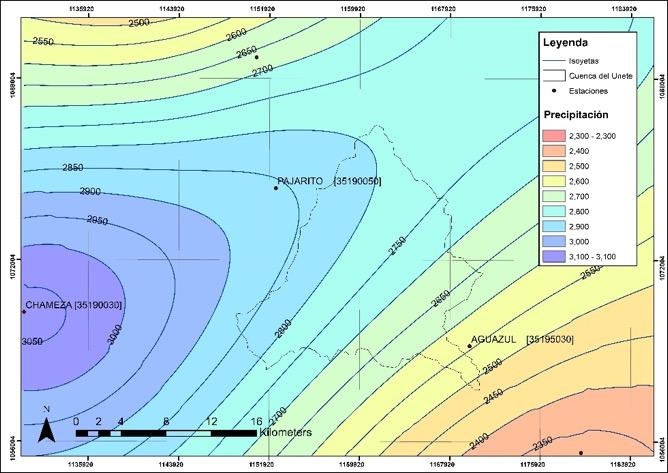

**Figura 8.** Precipitación en la cuenca del Unete.

Los caudales para cada periodo de retorno (200 años, 50 años, 10 años y 1.3 años) se analizaron a partir de registros históricos de la estación limnigráfica Los Esteros (35197030) del IDEAM \[14\], con estos se realizaron las distribuciones de probabilidad tipo Gumbel y Pearson tipo III, obteniendo los respectivos caudales máximos y el cálculo de los hidrogramas. Así, el caudal de diseño para cada periodo de retorno fue de 361.78 m3/s (1.3 años), de 1,161.3 m3/s (10 años), de 1,645.65 m3/s (50 años) y de 2,054.43 m3/s (200 años) (Figura 9). 

**Figura 9.** Hidrograma del río Unete para distintos periodos de retorno; elaborado a partir de registros históricos de la estación Los Esteros (35197030) del IDEAM del año 2018

Por otro lado, se realizó el levantamiento de 13 secciones transversales del lecho del río Unete (Fig. 10), en el tramo próximo al área urbana de Aguazul, abarcando una longitud de 3.7 km sobre el eje del cauce. Cada sección incluyó las terrazas de margen derecha e izquierda, barras de sedimento intermedias, así como el canal principal y secundarios. En la Figura 11 se observar la sección número 6 del río Unete, con poca profundidad (1.05 m) respecto a su ancho.

**Figura 10.** Localización de secciones topográficas en el río Unete. Las secciones transversales obtenidas del río Unete se representaron en una imagen de Google Earth de 2018.

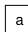

**Figura 11.** Sección transversal del río Unete. El perfil se utiliza como ejemplo para representar como es la vista transversal de las secciones tomadas.

Es importante mencionar que la metodología utilizada para la integración de las dos fuentes de información no es propia de este estudio. Se ha visto implementada en trabajos como Modelación Hidráulica 2D de Inundaciones en Regiones con Escasez de Datos. Tal es el caso del Delta del Río Ranchería, Riohacha-Colombia, donde se digitalizó la elevación disponible en Google Earth y está se integró con secciones levantadas en el río y datos topográficos, obteniendo una nube de puntos topográfica, la cual fue interpolada a una red de triángulos irregular, y finalmente, transformada en un Modelo Digital del Terreno \[15\].

Utilizando el software Arcgis, se integraron las 13 secciones transversales levantadas mediante topografía y el modelo de elevación digital (DEM), obteniendo el relieve y lecho del río requeridos para el modelo hidráulico, estas se combinaron a partir de la conversión de las dos fuentes de información a formato vectorial de puntos, estos fueron interpolados mediante la función merge y finalmente transformado a formato raster. El DEM fue descargado del satélite ALOS PALSAR \[16\], con tamaño de celda de 12.5 × 12.5 m.

En campo se realizó la georreferenciación con GPS de las estructuras hidráulicasexistentes en el cauce del río Unete para el control de procesos de socavación y de la dinámica fluvial, incluyendo gaviones o espigones de hexápodos en concreto, muros de contención y muros de gavión (Fig. 12). Igualmente se realizó el reconocimiento y georreferenciación de taludes con erosión en las dos márgenes del río.

**Figura 12.** Estructuras hidráulicas para control de socavación en el río Unete. Trabajo de campo de topografía e identificación de estructuras hidráulicas efectuado en el río Unete en enero de 2018 (izq) y (der).

La información anteriormente descrita se incorporó al modelo hidráulico en el software Iber. Se tuvieron en cuenta tres usos de suelo, con su respectivo coeficiente de rugosidad: 0.048 para el lecho calculado a partir de datos experimentales con la Ecuación 1 (0.15 para el área urbana y 0.05 para praderas y terrazas aluviales) estos últimos corresponden a valores predeterminados por el software Iber. Como condición inicial se adoptó una profundidad media de 0.55 m con base en el caudal medio de 27.57 m3/s, este último a partir de los registros históricos del IDEAM y lo observado durante las visitas de campo (Fig. 13)

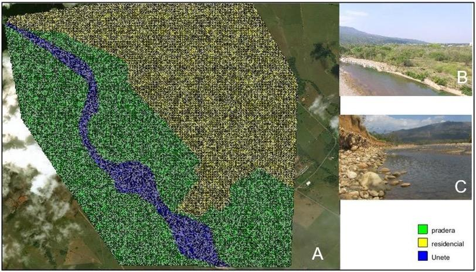

**Figura 13.** Usos de suelo en Iber. Los usos de suelo se determinaron a partir de las imágenes satelitales y las visitas realizadas a la zona del proyecto. (A) Usos de suelo identificados a partir de malla triangular no estructurada en el software Iber, (B) Terraza aluvial y (C) Material del lecho del río Unete.

Para realizar los mapas de amenaza por inundación se definió una reclasificación con el fin de ponderar la amenaza obtenida para cada periodo de retorno (10, 50 y 200 años) y generar un mapa definitivo, reflejando la situación del municipio Aguazul debido al desbordamiento del río Unete, siguiendo la metodología de la UNGRD \[9\]. Para cada periodo de retorno (10, 50 y 200 años) se evaluó la intensidad en escala de 1 a 3, la frecuencia asignando 3 para Tr de 10 años, 2 para Tr de 50 años y 1 para Tr de 200 años, y el área inundada tomando como 100% el área correspondiente a Tr 200 años. De esta manera, la suma de las tres variables alcanza un valor entre 3 y 9, cuyo resultado se clasifica en amenaza baja (1-3), media (4-6) y alta (7-9).

Para validación de resultados, se realizaron 40 encuestas a los habitantes de los barrios El Porvenir, Las Vegas y Los Esteros en el municipio de Aguazul, de forma que se contara con un periodo de residencia en el sector superior a 10 años, con el fin de garantizar el conocimiento del entorno, estrategia utilizada en estudios similares en la etapa de validación \[8\]. Las preguntas realizadas fueron: ¿Se le ha inundado su casa? ¿Se inundó el patio o la vivienda? ¿Cada cuánto se inunda? ¿Cuántas veces se ha inundado? ¿Hasta qué altura llego el agua? ¿Cuándo fue la última inundación? ¿Ha tenido pérdidas? ¿Qué tipo de pérdidas?

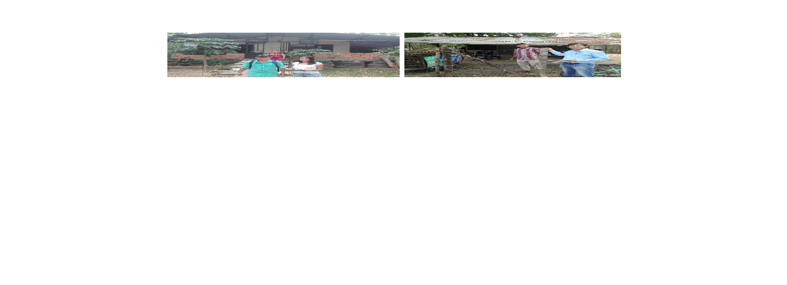

**Figura 14.** Registro fotográfico de encuestas. Las fotografías muestran evidencia de la realización de las encuestas, para este caso, en los barrios Los Esteros y Las Vegas (izq) y (der).

Los resultados de las encuestas se contrastaron con las geoformas del río, obteniendo un mapa de amenaza por inundación según la percepción de la comunidad. Finalmente, este mapa se comparó con los resultados de modelación hidráulica y con fotografías aéreas de distintos años, permitiendo validar e interpretar el mapa final de amenaza por inundación.

El esquema metodológico propuesto como modelo para la gestión del riesgo por erosión costera (Fig. 16), partió de los lineamientos del plan de acción 2016–2020 para la gestión del riesgo por erosión costera para el departamento de Córdoba y que consta de nueve objetivos, los cuales se han llevado cabo.

Para empezar, se tomó como información base el diagnóstico por erosión costera para el Caribe \[29\] y cambios en la línea de costa para Colombia \[52\]. Seguidamente, el monitoreo de la erosión costera permitió entender que lugares presentan una tendencia hacia la erosión costera y conocer el comportamiento y/o patrones estacionales de la zona costera en relación con los procesos costeros y cambios ambientales. Este monitoreo junto con los resultados de los análisis de amenaza y vulnerabilidad por erosión costera \[4\], permitió identificar los sitios críticos del departamento que están siendo afectados por este fenómeno.

Posteriormente, en cada sitio critico se realizaron modelos conceptuales de alternativas de mitigación basada en ecosistemas o en construcción con la naturaleza \[10\], donde se hizo una aproximación al estado actual y al estado ideal con las obras o estrategias que mitigarían la erosión costera. Obtenidos estos modelos fue necesario validar las alternativas propuestas en estos, verificar si son válidos, realizables y acordes con los procesos ambientales, de igual manera priorizarlos a corto, mediano y largo plazo. Para obtener esto, se realizaron diferentes estudios de detalle en el poblado de Santander de la Cruz, iniciando por discriminar las variables que dependían de cada alternativa (físicas, bióticos, sociales y económicos), para finalmente obtener un listado priorizado de las alternativas viables y las descartadas que se deben ejecutar para prevenir y mitigar los procesos de la erosión costera en el poblado.

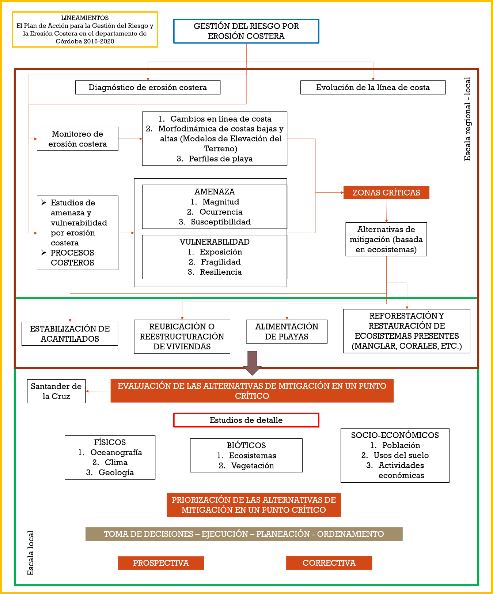

**Figura 16.** Esquema metodológico propuesto como modelo de gestión del riesgo para la erosión costera.

## CONFLICTO DE INTERESES

Los autores no declaran conflicto de intereses

## AGRADECIMIENTOS

A la Corporación Autónoma Regional de los Valles del Sinú y San Jorge – CVS, Córdoba, bajo los convenios 020 de 2015, 022 de 2017 y 022 de 2018. A los investigadores del programa de Geociencias Marinas y Costeras que han participado en la investigación de la zona costera del departamento de Córdoba en especial Ana Caicedo, Mauricio Bejarano Espinosa, Cesar García Llano, Juan Sebastián Ponce Bastidas, Silvio Andrés Ordóñez Zúñiga y Karla Vanessa Castro Ramírez, quienes aportaron a la propuesta y análisis de las alternativas. A las comunidades y entes territoriales de los municipios costeros del departamento y a los funcionarios de la CVS que han aportado a la adquisición de información durante de las salidas de campo dentro de la ejecución de los convenios. El numero de contribución del INVEMAR es 1264.

## IDENTIFICACIÓN DE AUTOR

Oswaldo Coca Domínguez <https://orcid.org/0000-0002-3987-4376>

Constanza Ricaurte Villota <https://orcid.org/0000-0003-1554-4994>

David F. Morales Giraldo [https://orcid.org/0000-0003-2531-6143](https://orcid.org/0000-0003-2531-6143)

## BIBLIOGRAFÍA

1.  > Martínez-Iglesias, J. C., Areces, A. J., Quintana, M., Viña, L., Zúñiga, A., y Beyris, A. (2007). Lineamientos metodológicos para la gestión integrada de la zona marina–costera (GIZMC) Cuba. *Serie Oceanológica*, (3), 1–37.

2.  > Yáñez-Arancibia, A., y W. Day, J. (2010). La zona costera frente al cambio climático: vulnerabilidad de un sistema biocomplejo e implicaciones en el manejo costero. En: *Cambio climático en México un enfoque costero-marino. Elementos ambientales para tomadores de decisiones*, 33–60. Estado de Campeche: Universidad Autónoma de Campeche Cetys-Universidad. [http://etzna.uacam.mx/epomex/publicaciones/Cambio\_ Climatico/CCMexico1B.pdf](http://etzna.uacam.mx/epomex/publicaciones/Cambio_%20Climatico/CCMexico1B.pdf)

3.  > Merlotto, A., Bértola, G. (2007). Consecuencias socio-económicas asociadas a la erosión costera en el Balneario Parque Mar Chiquita, Argentina. Investigaciones Geográficas, 43, 143–160. [https://doi.org/10.14198/INGEO2007.43.08](https://doi.org/10.14198/INGEO2007.43.08)

4.  > Ricaurte-Villota, C., Coca-Domínguez, O., González, M.E., Bejarano-Espinosa, M., Morales, D.F., Correa-Rojas, C., Briceño-Zuluaga, F., Legarda, G.A. y Arteaga, M.E. (2018). *Amenaza y vulnerabilidad por erosión costera en Colombia: enfoque regional para la gestión del riesgo*. Instituto de Investigaciones Marinas y Costeras “José Benito Vives De Andréis” –INVEMAR–. Serie de Publicaciones Especiales de INVEMAR \# 33. Santa Marta, Colombia. 268 p.

5.  > Política nacional ambiental para el desarrollo sostenible de los espacios oceánicos y las zonas Costeras e insulares de Colombia (PNAOCI), 2009.

6.  > Charles, E., Douvere, F. (2009). *Planificación especial marina una guía paso a paso hacia la gestión ecosistémica.* Planificación especial marina una guía paso a paso hacia la gestión ecosistémica. 99 p.

7.  > Rangel-Buitrago, N., Williams, A. T. Pranzini, E., Anfuso, G. (2018). Preface to the special issue: management strategies for coastal erosion processes. *Ocean and coastal management*, 156, 1. [https://doi.org/10.1016/j.ocecoaman.2017.11.020](https://doi.org/10.1016/j.ocecoaman.2017.11.020)

8.  > Simm, J.D.and Samuels, M. (2006). Telling good stories: engaging in dialogue with communities about flood and coastal erosion risk management in a post-modern society. En *41st Defra Flood and Coastal Management Conference*, 4 - 6 July 2006, York, UK.

9.  > Rangel-Buitrago, N., Anfuso, G., Williams, A. (2015). Coastal erosion along the Caribbean coast of Colombia: Magnitudes, causes and management. *Ocean & Coastal Management,* 114, 129-144. [https://doi.org/10.1016/j.ocecoaman.2015.06.024](https://doi.org/10.1016/j.ocecoaman.2015.06.024)

10. > MADS-DELTARES-INVEMAR. (2013). *A quickscan of building-with-nature solutions to mitigate coastal erosión in Colombia. Interim report*. Delft, Holanda. 85 p.

11. > Stronkhorst, J., Levering, A., Hendriksen, G., Rangel-Buitrago, N., Rosendahl Appelquist, L. (2018). Regional coastal erosion assessment based on global open access data: A case study for Colombia. J. Coast. Conserv. 2018, 22, 787–798. [https://doi.org/10.1007/s11852-018-0609-x](https://doi.org/10.1007/s11852-018-0609-x)

12. > Karl F. Nordstrom a, Bingyi Liang b, Emir S. Garilao b, Nancy L. Jackson b, (2018). Topography, vegetation cover and below ground biomass of spatially constrained and unconstrained foredunes in New Jersey, USA*. Ocean & Coastal Management*. Vol 156.

13. > Dodds, W., Cooper, J.A.G., McKenna, J. (2010). Flood and coastal erosion risk management policy evolution in Northern Ireland: “Incremental or leapfrogging?”. *Ocean & Coastal Management,* 53(12), 779-786. [https://doi.org/10.1016/j.ocecoaman.2010.10.017](https://doi.org/10.1016/j.ocecoaman.2010.10.017)

14. > Souza, C.R.G., Suguio, K. (2003). The Coastal Erosion Risk Zoning and the São Paulo State Plan for Coastal Management. Journal of Coastal Research, SI 35. *Proceedings of the Brazilian Symposium on Sandy Beaches: Morphodynamics, Ecology, Uses, Hazards and Managemen*t, 530- 547. Itajaí, SC – Brazil.

15. > Coca-Domínguez, O., Ricaurte-Villota, C. (2019). Validation of the Hazard and Vulnerability Analysis of Coastal Erosion in the Caribbean and Pacific Coast of Colombia. J. Mar. Sci. Eng. 2019, 7, 260. [https://doi.org/10.3390/jmse7080260](https://doi.org/10.3390/jmse7080260)

16. > Wang, L., Li, C., Ying Q., Cheng, X., Wang, X., Li, X., Hu, L., Liang, L., Yu, L., Huang, H., Gong, P. (2012). Urban expansion from 1990 to 2010 determined with satellite remote sensing. *Chinese Science Bulletin*, 57, 2802-2812. [https://doi.org/10.1007/s11434-012-5235-7](https://doi.org/10.1007/s11434-012-5235-7)

17. > Serrano-Suarez, B.E. (2004). The Sinú river delta on the northwestern Caribbean coast of Colombia: Bay infilling associated with delta development. *Journal of South American Earth Sciences*, 16, 623–631. https://doi.org/10.1016/j.jsames.2003.10.005

18. > Morris, R.L., Strain, M.A., Konlechner, T., Fest, B., Kennedy, D., Arndt, E., Swearer, E. (2018). Developing a nature-based coastal defence strategy for Australia. *Australian Journal of Civil Engineering*, 17(2), 167-176. [https://doi.org/10.1080/14488353.2019.1661062](https://doi.org/10.1080/14488353.2019.1661062)

19. > Isla, F., Lasta, C. (2006). *Manual de manejo costero para la Provincia de Buenos Aires*. Eudem.

20. > Moreira, R. (2007). O espaco e o contra-espaco: as dimensoes territoriais da sociedade civil e do estado; do privado ao público na orden especial burguesa. En *Território, territórios: ensaios sobre o ordenamento territorial*, Milton Santos (Ed), 72-107. Río de Janeiro: Lamparina.

21. > Aravena, R., Romero-Toledo, H., Opazo, D. (2018). Topoclimatología cultural y ciclos hidrosociales de comunidades andinas chilenas: híbridos geográficos para la ordenación de los territorios. *Cuadernos de Geografía: Revista Colombiana de Geografía,* 27(2): 242-261. [https://doi.org/10.15446/rcdg.v27n2.66599](https://doi.org/10.15446/rcdg.v27n2.66599)

22. > Meza, C. A. (2010). *Tradiciones elaboradas y modernizaciones vividas por pueblos Afrochocoanos en la vía al mar*. Bogotá, Colombia: Instituto Colombiano de Antropología e Historia.

23. > Coca Domínguez, O y Ricaurte Villota, C. (2019). Análisis de la evolución litoral y respuesta de las comunidades afro-descendientes asentadas en la zona costera: caso de estudio La Barra, Buenaventura, Pacífico colombiano. *Revista Entorno Geográfico*, 17, 7-26. [https://doi.org/10.25100/eg.v0i17.7918](https://doi.org/10.25100/eg.v0i17.7918)

24. > MADS-INVEMAR. (2014). Componente N°9. Formular el Programa Nacional de Monitoreo, Prevención, Mitigación y Control de la erosión costera. Convenio interadministrativo No 190 de 2014 entre el MADS y el INVEMAR: elementos técnicos que permitan establecer medidas de manejo, control, uso sostenible y restauración de los ecosistemas costeros y marinos del país. Código: ACT-BEM-001-014. Informe técnico. 63 p.

25. > Ricaurte-Villota, C., Bastidas-Salamanca, M., (Eds.). (2017). *Regionalización oceanográfica: una visión dinámica del Caribe*. Instituto de Investigaciones Marinas y Costeras – INVEMAR. Serie de publicaciones especiales \# 14. Santa Marta, Colombia 180 p.

26. > Ojeda-Zújar, J., Díaz-Cuevas, M.P., Prieto-Campos, A., Álvarez-Francoso, J. (2013). Línea de costa y Sistemas de Información Geográfica: modelo de datos para la caracterización y cálculo de indicadores en la costa andaluza. *Investigaciones Geográficas*, 60: 37 – 52. [https://doi.org/10.14198/INGEO2013.60.02](https://doi.org/10.14198/INGEO2013.60.02)

27. > Thieler E., Himmelstoss E., Zichichi J., Ergul, A. (2010). *The Digital Shoreline Analysis System (DSAS) Version 4.0 - An ArcGIS extension for calculating shoreline change (2008-1278).* [https://doi.org/10.3133/ofr20081278](https://doi.org/10.3133/ofr20081278)

28. > Thieler E. R. y Danforth W. (2005). Historical shoreline mapping: improving techniques and reducing positioning errors*. Journal of Coastal Research*, 10(3), 549-563.

29. > Posada-Posada, B. O., y Henao P., W. (2008). *Diagnóstico de la erosión en la zona costera del Caribe colombiano*. INVEMAR, serie Publicaciones Especiales N°13, Santa Marta ,124 pp.

30. > EUROSION. (2005). *Vivir con la erosión costera en Europa, Sedimentos y espacios para la sostenibilidad*. Luxembourg: Office for Official Publications of the European Communities. [http://www.eurosion.org/project/eurosion\_en.pdf](http://www.eurosion.org/project/eurosion_en.pdf)

31. > GREENPEACE. (1999). *El cambio climático y los arrecifes coralinos del planeta*. Recuperado de http://archivo-es.greenpeace.org/espana/Global/espana/report/cambio\_climatico/el-cambio-climatico-y-los-arre.pdf.

32. > Romero Rodríguez, D. A. (2014). *Variables ambientales durante eventos de blanqueamiento coralino en el Caribe colombiano*. Universidad Nacional de Colombia, Medellín. https://doi.org/[10.18257/raccefyn.49](https://doi.org/10.18257/raccefyn.49)

33. > Westmacott, S., Teleki, K., Wells, S and West, J. M. (2000). *Manejo de arrecifes de coral blanqueados o severamente dañados*. UICN, Gland, Suiza y Cambridge, Reino Unido. VII + 36 pp.

34. > Riveron-Enzastiga, M. L., Carbajal, N., y Salas-Monreal, D. (2016). Tropical coral reef system hydrodynamics in the western Gulf of Mexico. *Scientia Marina*, 802, 237-246. https://doi.org/[10.3989/scimar.04259.15B](https://doi.org/10.3989/scimar.04259.15B)

35. > Noor, T., Batool, N., Mazhar, N., Ilyas, N. (2015). Effects of siltation, temperature and salinity on mangrove plants. European Academic Research, 2, 14172-14179.

36. > Ahmed, N. Amir, R. y Talat, M. (1993). Salt-tolerance in mangrove soil bacteria. *Pakistan Journal of Marine Sciences*, 2(2), 129-135.

37. > Sánchez-Páez, H., Ulloa-Delgado, G. A., Tavera-Escobar, H. A., Gil-Torres, W. O. (2005). *Plan de manejo integral de los manglares de la zona de uso sostenible del sector estuarino de la Bahía de Cispatá: Departamento de Córdoba No. 333.91809861 S211p*. OIMT, Santa Fé de Bogotá Colombia. Proyecto Conservación y Manejo para el Desarrollo de los Manglares en Colombia Corporación Autónoma Regional de los Valles del Sinú y del San Jorge, Córdoba Colombia Corporación Nacional de Investigación y Fomento Forestal, Bogotá Colombia Proyecto PD 60/01 Rev. 1 F Manejo Sostenible y Restauración de los Manglares por Comunidades Locales del Caribe de Colombia, Bogotá Colombia Ministerio de Ambiente, Vivienda y Desarrollo Territorial, Bogotá Colombia.

38. > Giri, C., Ochieng, E., Tieszen, L. L., Zhu, Z., Singh, A., Loveland, T., Duke, N. (2011). Status and distribution of mangrove forests of the world using earth observation satellite data. *Global Ecology and Biogeography*, 201, 154-159. https://doi.org/[10.1111/j.1466-8238.2010.00584.x](https://doi.org/10.1111/j.1466-8238.2010.00584.x)

39. > Arellano, V.A. 2011. *Arrecifes artificiales de enrocamiento para protección de playas*. Tesis de grado para obtener el título de Maestro en Ingeniería Civil. Instituto Politécnico Nacional. México. 132 p.

40. > Consejo Comunitario La Barra. (2015*). Plan de Etnodesarrollo 2014 – 2017*. Consejo Comunitario Comunidad Negra de La Barra, Buenaventura, Colombia. Buenaventura, Colombia: Fundación Suiza de cooperación al desarrollo SWISSAID.

41. > Rangel-Buitrago, N., de Jongeb, V., Nealc, W., (2018). How to make Integrated Coastal Erosion Management a reality. *Ocean and Coastal Management*, 156, 290-299. [https://doi.org/10.1016/j.ocecoaman.2018.01.027](https://doi.org/10.1016/j.ocecoaman.2018.01.027)

42. > Williams, A.T., Rangel-Buitrago, N., Pranzini, E., Anfuso, G. (2018). The management of coastal erosion. *Ocean and Coastal Management*, 156, 4-20. [https://doi.org/10.1016/j.ocecoaman.2017.03.022](https://doi.org/10.1016/j.ocecoaman.2017.03.022)

43. > Pranzini, E. (2018) Shore protection in Italy: From hard to soft engineering … and back. *Ocean and Coastal Management,* 156, 43-57. [https://doi.org/10.1016/j.ocecoaman.2017.04.018](https://doi.org/10.1016/j.ocecoaman.2017.04.018)

44. > Isla, F., Cortizo, L., Merlotto, A., Bertola, G., Pontrelli, M., Finocchietti, C. (2018). Erosion in Buenos Aires province: Coastal-management policy revisited. *Ocean and Coastal Management*,156, 107-116. [https://doi.org/10.1016/j.ocecoaman.2017.09.008](https://doi.org/10.1016/j.ocecoaman.2017.09.008)

45. > Neelamani, S. (2018). Coastal erosion and accretion in Kuwait e Problems and management strategies. *Ocean and Coastal Management*, 156, 76-91. [https://doi.org/10.1016/j.ocecoaman.2017.05.014](https://doi.org/10.1016/j.ocecoaman.2017.05.014)

46. > Gracia, A., Rangel-Buitrago, N., Oakley, J., Williams, A.T. (2018). Use of ecosystems in coastal erosion management. *Ocean and Coastal Management*, 156, 277-289. [https://doi.org/10.1016/j.ocecoaman.2017.07.009](https://doi.org/10.1016/j.ocecoaman.2017.07.009)

47. > Neal, W., Pilkey, O., Cooper, A., Longo, N. (2018). Why coastal regulations fail. *Ocean and Coastal Management*, 156, 21-34. [https://doi.org/10.1016/j.ocecoaman.2017.05.003](https://doi.org/10.1016/j.ocecoaman.2017.05.003)

48. > Leatherman, S. (2018). Coastal Erosion and the United States National Flood Insurance Program. *Ocean and Coastal Management*, 156, 35-42. [https://doi.org/10.1016/j.ocecoaman.2017.04.004](https://doi.org/10.1016/j.ocecoaman.2017.04.004)

49. > Ndour, Raoul, A. Laïbi, Sadio, M., Degbe, C., Diaw, A., Oy, M., Anthony, E., Dussouillez, P., Sambou, H., Balla Di, E. (2018). Management strategies for coastal erosion problems in west Africa: Analysis, issues, and constraints drawn from the examples of Senegal and Benin. Abdoulaye. *Ocean and Coastal Management*, 156, 92-106. [https://doi.org/10.1016/j.ocecoaman.2017.09.001](https://doi.org/10.1016/j.ocecoaman.2017.09.001)

50. > Psuty, N., Ames, K., Habeck, A., Schmelz, W. (2018). Responding to coastal change: Creation of a regional approach to monitoring and management, northeastern region, U.S.A. *Ocean and Coastal Management*, 156, 170-182. [https://doi.org/10.1016/j.ocecoaman.2017.08.004](https://doi.org/10.1016/j.ocecoaman.2017.08.004)

51. > Pikelja, K., Ružić, I., Ilića, S., Jamesa, M., Kordićd, B. (2018). Implementing an efficient beach erosion monitoring system for coastal management in Croatia. *Ocean and Coastal Management*, 156, 223-238. [https://doi.org/10.1016/j.ocecoaman.2017.11.019](https://doi.org/10.1016/j.ocecoaman.2017.11.019)

52. > Gutiérrez, J., Carvajal, A., Pabón, J., Ruiz, F., Cusva, A., Verdugo, F., Nieto, V., Lecanda, A., Rodríguez, J., Mendoza, J., Álvarez, J., Quimbayo, G., Dorado, J., Camacho, A., Sierra, P., Zamora, A., Ricaurte-Villota, C., Bastidas-Salamanca, M., Ordóñez, S., Navia, j., Coca-Domínguez, O., Andrade, C., Tigreros, P., Rojas, X., Hernández, D., Hernández, T., Vega, A., Romero, D., Pizarro, J. (2017). Capítulo 4: Vulnerabilidad y riesgo por cambio climático. En: IDEAM, PNUD, MADS, DNP, CANCILLERÍA. (2017). *Tercera Comunicación Nacional de Colombia a la Convención Marco De Las Naciones Unidas Sobre Cambio Climático (CMNUCC).* Tercera Comunicación Nacional de Cambio Climático. IDEAM, PNUD, MADS, DNP, CANCILLERÍA, FMAM. Bogotá D.C., Colombia.

14

Capítulo 14: Gestión del riesgo por inundaciones: un metamodelo para el desarrollo de artefactos participativos. Caso de estudio en la ecorregión de La Mojana (Colombia)

**Paula Andrea Villegas González1\* & Nelson Obregón Neira1**

1Instituto Geofísico, Pontificia Universidad Javeriana. Carrera 7 No. 40 – 62, Bogotá, Colombia

\*Autor de contacto: Paula Andrea Villegas González. Instituto Geofísico, Pontificia Universidad Javeriana. Carrera 7 No. 40 – 62, Bogotá, Colombia. Correo-e: [pvillegas@javeriana.edu.co](mailto:pvillegas@javeriana.edu.co)

## Resumen

Los análisis de riesgo por inundación en Colombia, se han enfocado en la modelación física de la amenaza y en la valoración de la vulnerabilidad física y social, pero no se han integrado estos dos análisis en la evaluación del riesgo. El trabajo presentado hace énfasis en la inclusión de los elementos sociales y el conocimiento de las comunidades, como base para la generación de modelos de evaluación del riesgo. Específicamente, se propone un modelo para hacer modelos, en el marco de procesos de participación local. Para esto se utiliza la metodología GAIA. Los artefactos desarrollados son: MOJANA, MOJANACOOP y MOJANAREAL, los cuales reflejan en su diseño los principales componentes del metamodelo. Las variables y procesos a modelar se representan a través de las reglas, que permiten integrar el fenómeno de la inundación y las características del sistema social. Para el desarrollo de los modelos se utiliza el caso de estudio de la ecorregión de la Mojana y se pudo concluir que las variables más importantes para analizar la vulnerabilidad social son: la condición de habitabilidad, las actividades productivas, los procesos de cooperación y, el acceso a la salud y educación de las comunidades locales. Para el caso específico de la ecorregión de la Mojana, la vulnerabilidad social es media y esta se encuentra relacionada con las formas de adaptación a los procesos de inundación.

## Palabras clave

Amenaza, comunidades, inundación, modelación, riesgo, vulnerabilidad

**Flood risk management: a metamodel for the development of participatory artifacts. Case study in the ecoregion of La Mojana (Colombia)**

## Abstract

Flood risk analyzes in Colombia have been focused on the threat of physical modeling and social vulnerability and physical assessment, yet these two analyzes have not been integrated into the risk assessment. The research goal is to include the social elements and the communities' knowledge for the risk assessment models generation. Specifically, the research proposes a model to make models with the local participation processes. The GAIA methodology was used. The artifacts developed are MOJANA, MOJANACOOP, and MOJANAREAL. They reflect in their design the main metamodel components. The variables and processes were represented through the rules. The rules integrate the flooding phenomenon and social system characteristics. For the model's development, the case study is the Mojana ecoregion. In conclusion, the essential variables to analyze social vulnerability are the habitability condition, the productive activities, the cooperation processes, and the access to health and education of local communities. In the specific case of the Mojana ecoregion, social vulnerability is medium. The vulnerability was related to the types of adaptation to flooding processes.

## Keywords

Communities, flooding, hazard, modelling with stakeholders, risk, vulnerability

Según Kroes el diseño “es un proceso de invención, una generación inteligente y evaluación de especificaciones de nuevos objetos, artefactos; cuya forma y función logren los objetivos establecidos y satisfagan las necesidades, pero también contemplen limitaciones y restricciones” \[10\]. Ejemplos de artefactos pueden ser: una organización, una máquina, una herramienta, entre otros. El diseño tiene una actividad mental y una actividad física. Respecto al aspecto mental “El verdadero trabajo de fabricación se realiza bajo la guía de un modelo, de acuerdo con el cual se construye el objeto. Dicho modelo puede ser una imagen contemplada por la mente o bien un boceto en el que la imagen tenga ya un intento de materialización mediante el trabajo” \[11\]. Según Epstein “Cualquiera que se aventure a proyectar, o imaginar una dinámica” ejecuta un modelo \[12\].

<table>
<tbody>
<tr class="odd">
<td>
<strong>Caja 2. Según Epstein [12], además de predecir, los modelos son para</strong>

(i) explicar, (ii) recopilar datos, (iii) iluminar la dinámica del núcleo, (iv) sugerir analogías, (v) descubrir nuevas preguntas, (vi) fomentar el hábito de la mente crítica, (vii) soportar los resultados de los rangos plausibles, (viii) iluminar las incertidumbres principales, (ix) ofrecer opciones de crisis en tiempo real, (x) demostrar compensaciones y sugerir eficiencia, (xii) desafiar a la robustez que prevalece a través de las perturbaciones, (xiii) exponer lo que suele pensarse como incompatible con los datos disponibles, (xiv) capacitar practicantes, (xv) disciplinar el diálogo sobre políticas, (xvi) educar al público en general y (xvi) revelar lo aparentemente simple al ser complejo.
</td>
</tr>
</tbody>
</table>

##  Modelos usados en el diseño

**Modelos participativos:** según Voinov y Bousquet \[13\] tiene entre sus propósitos el aprendizaje compartido, la colaboración y participación de actores en los procesos de modelado. La eficiencia de la participación depende entre otras, de la relación entre los actores, la habilidad para comunicar e intercambiar información y conocimiento, y los métodos que apoyan esta actividad.

> **Modelos mentales:** se enfoca en la habilidad de las personas para predecir ciertos resultados, usando razonamientos basados en observaciones previas. Estos razonamientos trasladan los procesos del mundo externo a palabras, números o símbolos \[14\].
> 
> **Modelos hídricos:** el modelado hídrico puede realizarse utilizando dos tipos de enfoques: hidrodinámico e hidrológico. Ambos pueden estar relacionados en un modelo de inundación. Para conocer variables como el caudal, la velocidad y la profundidad se pueden utilizar modelos hidrodinámicos, que utilizan métodos numéricos para resolver las ecuaciones de Navier-Stokes, para un flujo incomprensible. De esta manera se puede conocer la forma de la inundación, representada sobre un modelo de elevación digital. Los modelos pueden ser de tipo unidimensional o bidimensional \[15\]. Para el modelado de inundaciones se utilizan las ecuaciones de aguas someras donde se parte de las siguientes suposiciones \[16\]: (a) fluido homogéneo “H”, (b) velocidades verticales mucho menores que las velocidades horizontales, (c) la extensión vertical es mucho menor que la horizontal, (d) las aceleraciones verticales pueden despreciarse, (e) la distribución de las presiones es hidrostática, (f) las partículas tienen un movimiento rectilíneo en el plano horizontal, (g) las fuerzas inerciales son mucho mayores que las fuerzas viscosas.
> 
> El sistema de ecuaciones consta de las correspondientes al movimiento horizontal, la ecuación de continuidad y las ecuaciones de transporte. El conjunto de ecuaciones diferenciales parciales en combinación con condiciones iniciales y de frontera se resuelven en una cuadrícula de diferencias finitas.

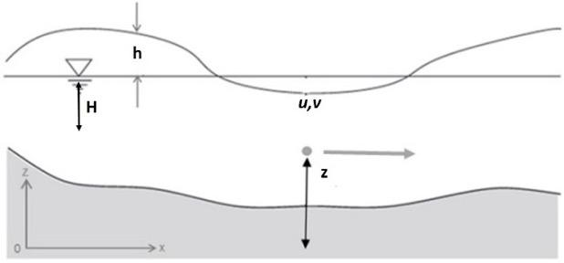

**Figura 2.** Representación de las ecuaciones de aguas someras \[17\].

Donde H es la profundidad promedio del agua, h la perturbación de la superficie libre y u, v las velocidades horizontales, g la gravedad, Sx y Sy representan los términos fuente (fricción, viento coriolis, etc) \[9\].

\(\frac{\partial u}{\partial t} + u\frac{\partial u}{\partial x} + v\frac{\partial u}{\partial y} + z\left( u,v \right) = - g\ \frac{\partial h}{\partial x} + Sx\ \ \ \ \ \ \ \ \ \ \ \ \ \ (1)\)

\(\frac{\partial v}{\partial t} + u\frac{\partial v}{\partial x} + v\frac{\partial v}{\partial y} + z\left( u,v \right) = - g\ \frac{\partial h}{\partial y}\ \ \  + Sy\ \ \ \ \ \ \ \ \ \ \ (2)\)

\(\frac{\partial h}{\partial t} + \frac{\partial u}{\partial x}\left( H + h \right) + \frac{\partial}{\partial y}\left\lbrack \left( H + h \right)v \right\rbrack = 0\ \ \ \ \ \ \ \ \ \ \ \ \ \ \ \ \ \ \ \ \ \ \ \left( 3 \right)\)

> **Modelos basados en agentes**: los modelos basados en sistemas de agentes tienen la capacidad de representar el comportamiento de actores humanos de manera realista, su heterogeneidad, interacción con el ambiente natural y el aprendizaje evolutivo \[18\].

<table>
<tbody>
<tr class="odd">
<td>
<strong>Caja 3. Retos de la modelación basada en agentes [18]</strong>

<blockquote>

<strong>El modelado de la conducta de los agentes</strong>: la exploración del diseño de las decisiones de los agentes es un reto en la medida que se debe generar un balance en las teorías de toma de decisiones, pero también de las observaciones empíricas.

<strong>Análisis de sensibilidad, verificación y validación</strong>: el grado de fiabilidad y robustez de este tipo de sistemas pide información de microescala de los comportamientos e interacciones de los agentes. Lo que implica un gran número de parámetros por los cuales el modelo es sensible. Es importante precisar que un análisis de este tipo puede ser vital cuando se aplican en un contexto de políticas. Por lo que se exige solidez en la construcción y éxito en lo relacionado con la reproducción de tendencias y patrones reales.

<strong>El acoplamiento de modelos socio-demográficos, ecológico y biofísico</strong>: cuando se usan para estudiar las dinámicas de los sistemas complejos se concentran en la necesidad de integrar la conducta humana con otros modelos. Un reto es poder identificar la vinculación de variables y reunir en el mundo real los datos para vincular el modelo.

</blockquote></td>
</tr>
</tbody>
</table>

> **Metamodelo**: el prefijo meta, en griego, significa superior o posterior. En filosofía, es usado a menudo para hablar sobre una propia categoría. En el contexto de la ingeniería de software, meta significa que el modelo que se construye representa otros modelos, es un modelo de modelos \[19\].

## Propuesta de un metamodelo de modelos integrados para el desarrollo de artefactos participativos

En las comunidades que se encuentran ubicadas en zonas de amenaza por inundación periódicas, se ha observado que muchos de sus hábitos se relacionan con la variación de los niveles del agua. En este sentido, comprender los cambios en los niveles del agua y aquellos generados en los hábitos de las comunidades resulta importante para el diseño e implementación de estrategias que promueven disminuir la vulnerabilidad de las comunidades y hacerlas más resilientes frente a dichas amenazas.

Recientemente, en Colombia se han desarrollado diferentes instrumentos como los planes de gestión del riesgo, los sistemas de alertas tempranas, los planes de ordenamiento y manejo de cuencas, entre otros, que han ganado importancia como herramientas de política pública para disminuir la vulnerabilidad y generar estrategias de gestión del riesgo en el territorio. Para generar escenarios relacionados con la interacción agua-comunidad es fundamental la integración de variables que representan procesos sociales y procesos ecológicos. La dinámica natural de las causas y efectos en cadena, la consideración de los efectos y la no linealidad. A partir del trabajo de campo, realizado en la ecorregión de la Mojana, surge el metamodelo. La selección de los municipios en donde se hizo el trabajo de campo consideró los siguientes criterios: (i) hicieran parte de la ecorregión de la Mojana y hubieran tenido impactos por las inundaciones durante los años 2010-2011, (ii) se pudiera acceder por transporte terrestre, (iii) se hubieran considerado en el proyecto de “Evaluación Probabilística de Riesgo por Inundación” liderado por la UNGRD.

La información de los talleres se construyó principalmente con el apoyo de las Instituciones educativas, donde se llevaron a cabo espacios de participación que incluyeron jóvenes, profesores y padres de familia. Quienes estuvieron de acuerdo con el uso de los resultados en el proceso de investigación. Los recorridos territoriales se llevaron a cabo en zonas que tuvieron afectaciones por las inundaciones, durante los años 2010 y 2011 y contaron con el consentimiento de los entrevistados. También fueron utilizados los resultados de los ejercicios de participación para el análisis de la vulnerabilidad social, en el marco del proyecto liderado por la UNGRD \[22\] donde se establecen los criterios para realizar dicho análisis a partir de hogares e individuos, con el soporte de los Consejos Municipales para la Gestión del Riesgo. A continuación, se presenta la descripción de algunos de los insumos que fueron usados para el diseño, los cuales se encuentran de manera detallada en la tesis doctoral “Gestión del riesgo por inundaciones: un metamodelo para el desarrollo de artefactos particitipativos” \[23\].

En los talleres llevados a cabo en septiembre del año 2013 en el municipio de San Marcos (Sucre), se identificó con las comunidades que el eje estructurante de las dinámicas del territorio en la región de la Mojana es el agua. Los municipios que habitan esta zona del país están rodeados por agua y allí se presentan inundaciones lentas. En los talleres con las comunidades se observa que el municipio de San Marcos se encuentra rodeado por ciénagas y caños. El problema más relevante que han tenido durante los últimos años ha sido la inundación ocasionada por el Fenómeno de la Niña 2010–2011. Respecto a esta situación hay diferentes percepciones. Los niños consideran que la inundación es un sinónimo de alegría y recreación. Sin embargo, no les gusta que se suspendan las clases en el Colegio. Respecto a los adultos, se identifican problemas en la medida que tuvieron que desplazarse a otros lugares, hubo daños en las viviendas y problemas en los cultivos. En la Figura 3, se observa la descripción que hace la comunidad sobre los efectos de las inundaciones.

**Figura 3.** Descripción de inundaciones, en el municipio de San Marcos (Sucre) \[21\].

En los recorridos territoriales se observaron las formas de adaptación de las comunidades a las inundaciones, principalmente reflejadas en las viviendas. Una característica es el uso de infraestructura palafítica en escuelas, que permite mejorar las condiciones de permanencia de los estudiantes durante períodos de inundación. Además de estos mecanismos, la comunidad construye tambos artesanales (uso de madera) al interior de las viviendas o desarrolla el enterrado, que consiste en rellenar el piso de las viviendas (tierra y residuos sólidos) para levantarlas. De esta forma, el nivel de la inundación no afecta los electrodomésticos, los diferentes elementos de las edificaciones y directamente a los seres humanos.

En los talleres realizados con la Unidad Nacional para la Gestión del Riesgo de Desastres-UNGRD durante el año 2018, se identificaron las mismas formas de adaptación, no solo en el municipio de San Marcos, sino también en Montelíbano, Magangué y Mompox. Lo que refleja la cultura anfibia de estas comunidades. Se identifican los tambos al interior de las viviendas y también el uso de bolsacretos para controlar el paso del agua a las viviendas. Se puede observar que, durante los períodos de inundación, aumenta la producción de peces y se incrementa esta actividad económica en los municipios. En muchos casos, los pescadores tienen dos viviendas, una en la zona de la inundación (generalmente con tambos) y otra en la zona no inundada. La inundación también resulta clave para la producción de cultivos como el arroz. Sin embargo, en algunos casos los niveles del agua pueden llegar a afectar la cosecha.

Además de la relación de la inundación con las actividades productivas, también se encontró una relación con la salud. Durante los talleres con las comunidades se identificó que durante los meses de lluvias se presentan epidemias como se observa en la Figura 3 que afectan principalmente a los niños. En los recorridos territoriales que se hicieron en el año 2017, se identificó que las personas se mueven de sus viviendas y no se adaptan, solo en los momentos que el agua empieza a afectar la salud de los habitantes o cuando la vivienda se ha inundado totalmente. Según los relatos, cuando el agua supera los 40 cm y se queda estancada durante varios meses (más de un mes) se empiezan a generar problemas de salud. En estos momentos la comunidad se une y coopera de diferentes formas. Por ejemplo, facilitando entre varias personas el transporte de los niños al centro de salud en canoas.

**Figura 4.** Calendario estacional en el municipio de Magangué (Bolívar) \[22\].

En los talleres llevados a cabo en la UNGRD durante el año 2018 \[22\], se pudo identificar la cooperación como una fortaleza de las comunidad que la hace menos vulnerable. Durante la inundación, las personas se unen para vigilar las viviendas evacuadas, hay personas transmitiendo comunicados de la situación con el apoyo de megáfonos, se hacen monitoreos en el río, y también se unen para hacer la comida y trabajar en equipo en los campamentos (albergues). Diferentes entidades apoyan la situación de emergencia, y allí se destaca el papel de los organismos de socorro y aquellos relacionados con la gestión del riesgo en el municipio como: La Policía, La Defensa Civil, La Iglesia, La Alcaldía y La Emisora. Del procesamiento del trabajo de campo, resultan relatos y análisis que son el insumo para el metamodelo \[20\], y las variables que resultan claves para el análisis de la vulnerabilidad se presentan en la Figura 5.

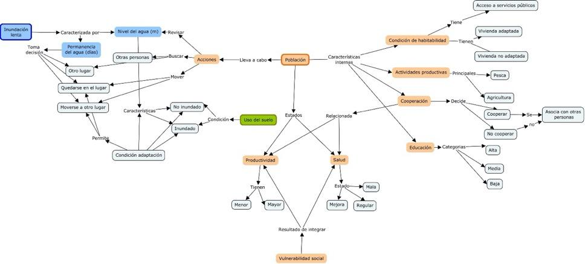

**Figura 5.** Elementos claves para el diseño del metamodelo a partir del trabajo de campo en la ecorregión de la Mojana.

La metodología utilizada para el análisis y diseño del metamodelo se titula GAIA \[23\]. Esta metodología se enfoca en una visión de sistemas multiagentes como una organización computacional consistente en la interacción de varios roles. Los agentes representan un avance en la abstracción, dado que pueden ser usados para entender naturalmente los modelos y desarrollar sistemas complejos distribuidos. A través de esta metodología se realiza un análisis que va desde unos requerimientos del diseño que es suficientemente detallado y que se pueden implementar directamente. El principal modelo usado en GAIA incluye dos modelos, el primero de roles y el segundo de interacciones. El rol se define por cuatro atributos: funcionalidad, permisos, actividades y protocolos. Las responsabilidades determinan la funcionalidad. Los permisos son los derechos u obligaciones asociados con el rol. Se relacionan directamente con los recursos que se encuentran disponibles para realizar sus responsabilidades. Las actividades son las acciones privadas de los agentes, sin interactuar con otros agentes. El rol se identifica con un número de protocolos, que se definen por la interacción con otros roles \[23\].

<table>
<tbody>
<tr class="odd">
<td>
<strong>Caja 4. Modelo de roles: permisos</strong>

<ul>
<li><blockquote>

Anfibios: el propósito de este rol es adaptarse a las condiciones de inundación y llevar a cabo sus actividades productivas.

</blockquote></li>
</ul>
<ul>
<li><blockquote>

Permisos: revisar <em>Uso del suelo // inundado o seco.</em>

</blockquote></li>
<li><blockquote>

Mover <em>Tomar la decisión</em> // <em>moverse a otro lugar si no está inundado o quedarse en el lugar si está inundado.</em>

</blockquote></li>
<li><blockquote>

Asentarse <em>Tomar la decisión</em> // <em>asentarse y llevar a cabo sus actividades productivas o seguir moviéndose.</em>

</blockquote></li>
</ul>
<ul>
<li><blockquote>

Agrícolas: el propósito de este rol es llevar a cabo sus actividades productivas en zonas secas.

</blockquote></li>
</ul>
<ul>
<li><blockquote>

Permisos: revisar <em>Uso del suelo // inundado o seco.</em>

</blockquote></li>
<li><blockquote>

Mover <em>Tomar la decisión</em> // <em>moverse a otro lugar si no está seco o quedarse en el lugar si está seco.</em>

</blockquote></li>
<li><blockquote>

Asentarse <em>Tomar la decisión // asentarse y llevar a cabo sus actividades productivas o seguir moviéndose.</em>

</blockquote></li>
</ul></td>
</tr>
</tbody>
</table>

En el metamodelo diseñado en esta investigación son identificados dos roles, los anfibios y los agrícolas. Los cuales representan el comportamiento de la población en la Mojana. Estos a su vez pueden adoptar dos estados: buscadores y asentados. Al comienzo el sistema inicializa el número total de agentes; para cada uno de los cuales las rutinas son las mismas por población (buscar, moverse, asentarse, reproducirse y morir). La principal diferencia entre los dos tipos de agentes consiste en que el proceso de asentarse depende de la condición del suelo (seco o inundado). Las rutinas se predefinen en función de la riqueza de las parcelas, no obstante, su incremento y estabilidad dependen adicionalmente de la velocidad de búsqueda y de la riqueza acumulada. Asimismo, estas últimas dan lugar a la configuración de tres clases sociales alta, media y baja. Cuando el tiempo de búsqueda de un agente se agota, este puede cambiar su condición de anfibio a agrícola o viceversa \[27\].

<table>
<tbody>
<tr class="odd">
<td>
<strong>Caja 5. Modelo de roles: responsabilidades</strong>

<ul>
<li><blockquote>

Anfibios: <em>siempre que haya agua, adaptarse y llevar a cabo actividades de pesca</em>.

</blockquote></li>
<li><blockquote>

Agrícolas: <em>siempre que haya cultivos y el terreno esté seco, realizar las labores de agricultura.</em>

</blockquote></li>
</ul></td>
</tr>
</tbody>
</table>

Para el caso del metamodelo se tienen dos roles: anfibios y agrícolas. A continuación, se presenta un ejemplo de uno de ellos. El operador w significa infinitas repeticiones:

**Tabla 3.** Esquema para el rol del anfibio.

| **Esquema del rol Anfibio** | **Anfibio**                                                                                                                                                                                                                                                                   |
| --------------------------- | ----------------------------------------------------------------------------------------------------------------------------------------------------------------------------------------------------------------------------------------------------------------------------- |
| Descripción                 | Este rol se relaciona con garantizar que durante los períodos de inundación se realice una adaptación en términos de habitabilidad y actividades productivas. Además, que se lleven a cabo actividades de cooperación para disminuir las condiciones de vulnerabilidad social |
| Protocolos y actividades    | Moverse, asentarse, colaborar, reproducirse, morir                                                                                                                                                                                                                            |
| Permisos                    | Revisar *Uso del suelo // inundado o seco.*                                                                                                                                                                                                                                   |
| Permisos                    | Asentarse *Tomar la decisión // asentarse y llevar a cabo sus actividades productivas o seguir moviéndose*                                                                                                                                                                    |
| Permisos                    | Aprovechar *Valores de riqueza // a través de sus actividades productivas mejorar o no su riqueza acumulada*                                                                                                                                                                  |
| Responsabilidades           |                                                                                                                                                                                                                                                                               |
| Vida                        | Anfibio: moverse, asentarse, colaborar, reproducirse, morir                                                                                                                                                                                                                   |
| Seguridad                   | *Riqueza \>0*                                                                                                                                                                                                                                                                 |
| Seguridad                   | *edad \<esperanza de vida*                                                                                                                                                                                                                                                    |

Un ejemplo de los protocolos presentados en los modelos se presenta en la Figura 5 \[24\].

  - > Clase baja: cuando está rodeado de agentes clase alta (A), media (M) o no tiene vecinos (N) en su vecindad de Moore \[28\], el agente decide tomar todos los recursos de la tierra para su beneficio individual. Cuando está rodeado de algún agente clase baja (B) en su vecindad de Moore, el agente decide cooperar con el agente de clase baja, pues este basado en el concepto de la igualdad ayuda a sus semejantes.

  - > Clase media: cuando está rodeado de agentes clase alta (A), o no tiene vecinos (N) en su vecindad de Moore, el agente decide tomar todos los recursos de la tierra para su beneficio individual. Con los individuos de clase superior a él no colabora porque tienen demasiados recursos. Cuando está rodeado de algún agente clase baja (B) o media (M) en su vecindad de Moore, el agente decide cooperar con el agente de clase baja o media, pues con su ideal de sociedad equitativa cree que lo mejor es ayudar a sus semejantes y los menos favorecidos.

  - > Clase alta: cuando está rodeado de agentes clase alta (A) o no tiene vecinos (N) en su vecindad de Moore, el agente decide tomar todos los recursos de la tierra para su beneficio individual. Este agente tiende a competir con los mismos individuos de su clase. Cuando está rodeado de algún agente clase baja (B), o media (M) en su vecindad de Moore, el agente decide cooperar, pues también es consiente que la sociedad debería ser equitativa y por esta razón decide donar parte de sus recursos con sus vecinos.

**Figura 6.** Modelos de interacción. a reglas clase baja. b y c reglas clase media. d y e reglas clase alta. Para la estructura de un autómata celular se puede definir una vecindad establecida para cada celda, la que consiste en un conjunto contiguo de celdas. Esta vecindad puede estar formada por las celdas inmediatamente contiguas a la celda en cuestión (vecindad de Von Neuman , cuatro celdas, o vecindad de Moore, ocho celdas).

